# JPX-Tokyo-Stock-Exchange Prediction 

## Introduction

The competition will involve building portfolios from the stocks eligible for predictions (around 2,000 stocks). Specifically, each participant ranks the stocks from highest to lowest expected returns and is evaluated on the difference in returns between the top and bottom 200 stocks. The participants have access to financial data from the Japanese market, such as stock information and historical stock prices to train and test your model.

The competitor with the highest Sharpe Ratio will result the winner of the challenge. In the competition the Sharpe Ratio is calculated as follows:


The Sharpe ratio was developed by Nobel laureate William F. Sharpe and is used to help investors understand the return of an investment compared to its risk

## Libraries

**Main libraries**


```python
import os
import gc
import pandas as pd 
import numpy as np
import seaborn as sns
from matplotlib import pyplot as plt
from decimal import ROUND_HALF_UP, Decimal
import plotly.graph_objects as go
import plotly.express as px
from plotly.subplots import make_subplots
import warnings
import re
warnings.filterwarnings('ignore')

pd.set_option('display.max_columns', None)
pd.set_option('display.max_rows', 25)
pd.set_option('display.max_colwidth', 3000)
```

**Data Pipeline libraries**


```python
from sklearn.pipeline import Pipeline 
from sklearn.preprocessing import OneHotEncoder
from sklearn.preprocessing import StandardScaler 
from sklearn.preprocessing import FunctionTransformer
from sklearn.compose import ColumnTransformer
```

**MLs Model + Crossvalidation libraries**


```python
from lightgbm import LGBMRegressor
import xgboost
from sklearn.ensemble import RandomForestRegressor
from sklearn.model_selection import TimeSeriesSplit
from sklearn.metrics import mean_squared_error,mean_absolute_error
```


<style type='text/css'>
.datatable table.frame { margin-bottom: 0; }
.datatable table.frame thead { border-bottom: none; }
.datatable table.frame tr.coltypes td {  color: #FFFFFF;  line-height: 6px;  padding: 0 0.5em;}
.datatable .bool    { background: #DDDD99; }
.datatable .object  { background: #565656; }
.datatable .int     { background: #5D9E5D; }
.datatable .float   { background: #4040CC; }
.datatable .str     { background: #CC4040; }
.datatable .time    { background: #40CC40; }
.datatable .row_index {  background: var(--jp-border-color3);  border-right: 1px solid var(--jp-border-color0);  color: var(--jp-ui-font-color3);  font-size: 9px;}
.datatable .frame tbody td { text-align: left; }
.datatable .frame tr.coltypes .row_index {  background: var(--jp-border-color0);}
.datatable th:nth-child(2) { padding-left: 12px; }
.datatable .hellipsis {  color: var(--jp-cell-editor-border-color);}
.datatable .vellipsis {  background: var(--jp-layout-color0);  color: var(--jp-cell-editor-border-color);}
.datatable .na {  color: var(--jp-cell-editor-border-color);  font-size: 80%;}
.datatable .sp {  opacity: 0.25;}
.datatable .footer { font-size: 9px; }
.datatable .frame_dimensions {  background: var(--jp-border-color3);  border-top: 1px solid var(--jp-border-color0);  color: var(--jp-ui-font-color3);  display: inline-block;  opacity: 0.6;  padding: 1px 10px 1px 5px;}
</style>


**Optimization libraries**


```python
import optuna
```

## Datasets


**Datasets**


```python
%%time 
financials_df = pd.read_csv("/kaggle/input/jpx-tokyo-stock-exchange-prediction/train_files/financials.csv")
options_df = pd.read_csv("/kaggle/input/jpx-tokyo-stock-exchange-prediction/train_files/options.csv")
secondary_stock_prices_df = pd.read_csv("/kaggle/input/jpx-tokyo-stock-exchange-prediction/train_files/secondary_stock_prices.csv")
stock_prices_df = pd.read_csv("/kaggle/input/jpx-tokyo-stock-exchange-prediction/train_files/stock_prices.csv")
trades_df = pd.read_csv("/kaggle/input/jpx-tokyo-stock-exchange-prediction/train_files/trades.csv")
stocks_df = pd.read_csv("/kaggle/input/jpx-tokyo-stock-exchange-prediction/stock_list.csv")
```

  
**Suplemental files**


```python
financials_info = pd.read_csv("/kaggle/input/jpx-tokyo-stock-exchange-prediction/data_specifications/stock_fin_spec.csv")
options_info = pd.read_csv("/kaggle/input/jpx-tokyo-stock-exchange-prediction/data_specifications/options_spec.csv")
stock_prices_info = pd.read_csv("/kaggle/input/jpx-tokyo-stock-exchange-prediction/data_specifications/stock_price_spec.csv")
trades_info = pd.read_csv("/kaggle/input/jpx-tokyo-stock-exchange-prediction/data_specifications/trades_spec.csv")
stocks_info = pd.read_csv("/kaggle/input/jpx-tokyo-stock-exchange-prediction/data_specifications/stock_list_spec.csv")
```

## 1. Exploratory Data Analysis (EDA)

### Stock prices


File: stock_prices.csv

**File Description**

The core file of interest, including the daily closing price for each stock and the target column. Following is column information recorded in stock_price_spec.csv:


```python
stock_prices_info
```


<div>
<style scoped>
    .dataframe tbody tr th:only-of-type {
        vertical-align: middle;
    }

    .dataframe tbody tr th {
        vertical-align: top;
    }

    .dataframe thead th {
        text-align: right;
    }
</style>
<table border="1" class="dataframe">
  <thead>
    <tr style="text-align: right;">
      <th></th>
      <th>Column</th>
      <th>Sample value</th>
      <th>Type</th>
      <th>Addendum</th>
      <th>Remarks</th>
    </tr>
  </thead>
  <tbody>
    <tr>
      <th>0</th>
      <td>RowId</td>
      <td>20170104_1301</td>
      <td>string</td>
      <td>NaN</td>
      <td>Unique ID of price records</td>
    </tr>
    <tr>
      <th>1</th>
      <td>Date</td>
      <td>2017-01-04 0:00:00</td>
      <td>date</td>
      <td>NaN</td>
      <td>Trade date</td>
    </tr>
    <tr>
      <th>2</th>
      <td>SecuritiesCode</td>
      <td>1301</td>
      <td>Int64</td>
      <td>NaN</td>
      <td>Local securities code</td>
    </tr>
    <tr>
      <th>3</th>
      <td>Open</td>
      <td>2734</td>
      <td>float</td>
      <td>NaN</td>
      <td>first traded price on a day</td>
    </tr>
    <tr>
      <th>4</th>
      <td>High</td>
      <td>2755</td>
      <td>float</td>
      <td>NaN</td>
      <td>highest traded price on a day</td>
    </tr>
    <tr>
      <th>5</th>
      <td>Low</td>
      <td>2730</td>
      <td>float</td>
      <td>NaN</td>
      <td>lowest traded price on a day</td>
    </tr>
    <tr>
      <th>6</th>
      <td>Close</td>
      <td>2742</td>
      <td>float</td>
      <td>NaN</td>
      <td>last traded price on a day</td>
    </tr>
    <tr>
      <th>7</th>
      <td>Volume</td>
      <td>31400</td>
      <td>Int64</td>
      <td>NaN</td>
      <td>number of traded stocks on a day</td>
    </tr>
    <tr>
      <th>8</th>
      <td>AdjustmentFactor</td>
      <td>1</td>
      <td>float</td>
      <td>NaN</td>
      <td>to calculate theoretical price/volume when split/reverse-split happens (NOT including dividend/allotment of shares/)</td>
    </tr>
    <tr>
      <th>9</th>
      <td>SupervisionFlag</td>
      <td>FALSE</td>
      <td>boolean</td>
      <td>NaN</td>
      <td>Flag of Securities Under Supervision &amp; Securities to Be Delisted\nhttps://www.jpx.co.jp/english/listing/market-alerts/supervision/00-archives/index.html )</td>
    </tr>
    <tr>
      <th>10</th>
      <td>ExpectedDividend</td>
      <td>NaN</td>
      <td>float</td>
      <td>NaN</td>
      <td>Expected dividend value for ex-right date. This value is recorded 2 business days before ex-dividend date.</td>
    </tr>
    <tr>
      <th>11</th>
      <td>Target</td>
      <td>0.00073</td>
      <td>float</td>
      <td>NaN</td>
      <td>Change ratio of adjusted closing price between t+2 and t+1 where t+0 is TradeDate</td>
    </tr>
  </tbody>
</table>
</div>


```python
display(stock_prices_df.head(5))
```


<div>
<style scoped>
    .dataframe tbody tr th:only-of-type {
        vertical-align: middle;
    }

    .dataframe tbody tr th {
        vertical-align: top;
    }

    .dataframe thead th {
        text-align: right;
    }
</style>
<table border="1" class="dataframe">
  <thead>
    <tr style="text-align: right;">
      <th></th>
      <th>RowId</th>
      <th>Date</th>
      <th>SecuritiesCode</th>
      <th>Open</th>
      <th>High</th>
      <th>Low</th>
      <th>Close</th>
      <th>Volume</th>
      <th>AdjustmentFactor</th>
      <th>ExpectedDividend</th>
      <th>SupervisionFlag</th>
      <th>Target</th>
    </tr>
  </thead>
  <tbody>
    <tr>
      <th>0</th>
      <td>20170104_1301</td>
      <td>2017-01-04</td>
      <td>1301</td>
      <td>2734.0</td>
      <td>2755.0</td>
      <td>2730.0</td>
      <td>2742.0</td>
      <td>31400</td>
      <td>1.0</td>
      <td>NaN</td>
      <td>False</td>
      <td>0.000730</td>
    </tr>
    <tr>
      <th>1</th>
      <td>20170104_1332</td>
      <td>2017-01-04</td>
      <td>1332</td>
      <td>568.0</td>
      <td>576.0</td>
      <td>563.0</td>
      <td>571.0</td>
      <td>2798500</td>
      <td>1.0</td>
      <td>NaN</td>
      <td>False</td>
      <td>0.012324</td>
    </tr>
    <tr>
      <th>2</th>
      <td>20170104_1333</td>
      <td>2017-01-04</td>
      <td>1333</td>
      <td>3150.0</td>
      <td>3210.0</td>
      <td>3140.0</td>
      <td>3210.0</td>
      <td>270800</td>
      <td>1.0</td>
      <td>NaN</td>
      <td>False</td>
      <td>0.006154</td>
    </tr>
    <tr>
      <th>3</th>
      <td>20170104_1376</td>
      <td>2017-01-04</td>
      <td>1376</td>
      <td>1510.0</td>
      <td>1550.0</td>
      <td>1510.0</td>
      <td>1550.0</td>
      <td>11300</td>
      <td>1.0</td>
      <td>NaN</td>
      <td>False</td>
      <td>0.011053</td>
    </tr>
    <tr>
      <th>4</th>
      <td>20170104_1377</td>
      <td>2017-01-04</td>
      <td>1377</td>
      <td>3270.0</td>
      <td>3350.0</td>
      <td>3270.0</td>
      <td>3330.0</td>
      <td>150800</td>
      <td>1.0</td>
      <td>NaN</td>
      <td>False</td>
      <td>0.003026</td>
    </tr>
  </tbody>
</table>
</div>


```python
stock_prices_df.info()
```

    <class 'pandas.core.frame.DataFrame'>
    RangeIndex: 2332531 entries, 0 to 2332530
    Data columns (total 12 columns):
     #   Column            Dtype  
    ---  ------            -----  
     0   RowId             object 
     1   Date              object 
     2   SecuritiesCode    int64  
     3   Open              float64
     4   High              float64
     5   Low               float64
     6   Close             float64
     7   Volume            int64  
     8   AdjustmentFactor  float64
     9   ExpectedDividend  float64
     10  SupervisionFlag   bool   
     11  Target            float64
    dtypes: bool(1), float64(7), int64(2), object(2)
    memory usage: 198.0+ MB
    

**Missing values**


```python
display(pd.isna(stock_prices_df).sum()/len(stock_prices_df)*100)
```


    RowId                0.000000
    Date                 0.000000
    SecuritiesCode       0.000000
    Open                 0.326169
    High                 0.326169
    Low                  0.326169
    Close                0.326169
    Volume               0.000000
    AdjustmentFactor     0.000000
    ExpectedDividend    99.191222
    SupervisionFlag      0.000000
    Target               0.010204
    dtype: float64


```python
missing_high["Date"].value_counts()
```

    2020-10-01    1988
    2017-03-16      15
    2019-10-09      14
    2019-04-04      14
    2021-10-29      13
                  ... 
    2017-12-25       1
    2017-12-26       1
    2020-03-13       1
    2018-01-04       1
    2018-02-21       1
    Name: Date, Length: 1175, dtype: int64


```python
plot_missing_high_df = missing_high["Date"].value_counts().to_frame().reset_index()
plot_missing_high_df.rename(columns = {'index':'Date', 'Date':'Count'}, inplace = True)
plot_missing_high_df.head()
```


<div>
<style scoped>
    .dataframe tbody tr th:only-of-type {
        vertical-align: middle;
    }

    .dataframe tbody tr th {
        vertical-align: top;
    }

    .dataframe thead th {
        text-align: right;
    }
</style>
<table border="1" class="dataframe">
  <thead>
    <tr style="text-align: right;">
      <th></th>
      <th>Date</th>
      <th>Count</th>
    </tr>
  </thead>
  <tbody>
    <tr>
      <th>0</th>
      <td>2020-10-01</td>
      <td>1988</td>
    </tr>
    <tr>
      <th>1</th>
      <td>2017-03-16</td>
      <td>15</td>
    </tr>
    <tr>
      <th>2</th>
      <td>2019-10-09</td>
      <td>14</td>
    </tr>
    <tr>
      <th>3</th>
      <td>2019-04-04</td>
      <td>14</td>
    </tr>
    <tr>
      <th>4</th>
      <td>2021-10-29</td>
      <td>13</td>
    </tr>
  </tbody>
</table>
</div>


2020-10-01 is the day with the most amount of missing data


```python
missing_Target = stock_prices_df[stock_prices_df["Target"].isna()]
```


```python
display(missing_Target.head(5))
```


<div>
<style scoped>
    .dataframe tbody tr th:only-of-type {
        vertical-align: middle;
    }

    .dataframe tbody tr th {
        vertical-align: top;
    }

    .dataframe thead th {
        text-align: right;
    }
</style>
<table border="1" class="dataframe">
  <thead>
    <tr style="text-align: right;">
      <th></th>
      <th>RowId</th>
      <th>Date</th>
      <th>SecuritiesCode</th>
      <th>Open</th>
      <th>High</th>
      <th>Low</th>
      <th>Close</th>
      <th>Volume</th>
      <th>AdjustmentFactor</th>
      <th>ExpectedDividend</th>
      <th>SupervisionFlag</th>
      <th>Target</th>
    </tr>
  </thead>
  <tbody>
    <tr>
      <th>401</th>
      <td>20170104_3540</td>
      <td>2017-01-04</td>
      <td>3540</td>
      <td>NaN</td>
      <td>NaN</td>
      <td>NaN</td>
      <td>NaN</td>
      <td>0</td>
      <td>1.0</td>
      <td>NaN</td>
      <td>False</td>
      <td>NaN</td>
    </tr>
    <tr>
      <th>2266</th>
      <td>20170105_3540</td>
      <td>2017-01-05</td>
      <td>3540</td>
      <td>NaN</td>
      <td>NaN</td>
      <td>NaN</td>
      <td>NaN</td>
      <td>0</td>
      <td>1.0</td>
      <td>NaN</td>
      <td>False</td>
      <td>NaN</td>
    </tr>
    <tr>
      <th>4131</th>
      <td>20170106_3540</td>
      <td>2017-01-06</td>
      <td>3540</td>
      <td>NaN</td>
      <td>NaN</td>
      <td>NaN</td>
      <td>NaN</td>
      <td>0</td>
      <td>1.0</td>
      <td>NaN</td>
      <td>False</td>
      <td>NaN</td>
    </tr>
    <tr>
      <th>5996</th>
      <td>20170110_3540</td>
      <td>2017-01-10</td>
      <td>3540</td>
      <td>NaN</td>
      <td>NaN</td>
      <td>NaN</td>
      <td>NaN</td>
      <td>0</td>
      <td>1.0</td>
      <td>NaN</td>
      <td>False</td>
      <td>NaN</td>
    </tr>
    <tr>
      <th>7861</th>
      <td>20170111_3540</td>
      <td>2017-01-11</td>
      <td>3540</td>
      <td>NaN</td>
      <td>NaN</td>
      <td>NaN</td>
      <td>NaN</td>
      <td>0</td>
      <td>1.0</td>
      <td>NaN</td>
      <td>False</td>
      <td>NaN</td>
    </tr>
  </tbody>
</table>
</div>


```python
display(missing_Target.shape[0])
```


    238


```python
missing_Target["Date"].nunique()
```


    238


```python
missing_Target["Date"].value_counts()
```


    2017-01-04    1
    2017-08-30    1
    2017-08-14    1
    2017-08-15    1
    2017-08-16    1
                 ..
    2017-05-08    1
    2017-05-09    1
    2017-05-10    1
    2017-05-11    1
    2020-10-02    1
    Name: Date, Length: 238, dtype: int64


```python
plot_missing_target_df = missing_Target["Date"].value_counts().to_frame().reset_index()
plot_missing_target_df.rename(columns = {'index':'Date', 'Date':'Count'}, inplace = True)
plot_missing_target_df
```


<div>
<style scoped>
    .dataframe tbody tr th:only-of-type {
        vertical-align: middle;
    }

    .dataframe tbody tr th {
        vertical-align: top;
    }

    .dataframe thead th {
        text-align: right;
    }
</style>
<table border="1" class="dataframe">
  <thead>
    <tr style="text-align: right;">
      <th></th>
      <th>Date</th>
      <th>Count</th>
    </tr>
  </thead>
  <tbody>
    <tr>
      <th>0</th>
      <td>2017-01-04</td>
      <td>1</td>
    </tr>
    <tr>
      <th>1</th>
      <td>2017-08-30</td>
      <td>1</td>
    </tr>
    <tr>
      <th>2</th>
      <td>2017-08-14</td>
      <td>1</td>
    </tr>
    <tr>
      <th>3</th>
      <td>2017-08-15</td>
      <td>1</td>
    </tr>
    <tr>
      <th>4</th>
      <td>2017-08-16</td>
      <td>1</td>
    </tr>
    <tr>
      <th>...</th>
      <td>...</td>
      <td>...</td>
    </tr>
    <tr>
      <th>233</th>
      <td>2017-05-08</td>
      <td>1</td>
    </tr>
    <tr>
      <th>234</th>
      <td>2017-05-09</td>
      <td>1</td>
    </tr>
    <tr>
      <th>235</th>
      <td>2017-05-10</td>
      <td>1</td>
    </tr>
    <tr>
      <th>236</th>
      <td>2017-05-11</td>
      <td>1</td>
    </tr>
    <tr>
      <th>237</th>
      <td>2020-10-02</td>
      <td>1</td>
    </tr>
  </tbody>
</table>
<p>238 rows × 2 columns</p>
</div>


```python
fig = go.Figure()
fig.add_trace(go.Scatter(x=plot_missing_target_df["Date"], 
                         y=plot_missing_target_df["Count"], 
                         mode='lines'))

fig.update_layout(
    title=f"Stocks without Target Count per Date",
    xaxis_title="Date",
    yaxis_title="Count",
)
```


<div>                            <div id="8b5830c0-7691-40c7-9f47-d42be0b6aeca" class="plotly-graph-div" style="height:525px; width:100%;"></div>            <script type="text/javascript">                require(["plotly"], function(Plotly) {                    window.PLOTLYENV=window.PLOTLYENV || {};                                    if (document.getElementById("8b5830c0-7691-40c7-9f47-d42be0b6aeca")) {                    Plotly.newPlot(                        "8b5830c0-7691-40c7-9f47-d42be0b6aeca",                        [{"mode":"lines","x":["2017-01-04","2017-08-30","2017-08-14","2017-08-15","2017-08-16","2017-08-17","2017-08-18","2017-08-21","2017-08-22","2017-08-23","2017-08-24","2017-08-25","2017-08-28","2017-08-29","2017-08-31","2017-08-09","2017-09-01","2017-09-04","2017-09-05","2017-09-06","2017-09-07","2017-09-08","2017-09-11","2017-09-12","2017-09-13","2017-09-14","2017-09-15","2017-09-19","2017-08-10","2017-08-08","2017-09-21","2017-07-18","2017-06-29","2017-06-30","2017-07-03","2017-07-04","2017-07-05","2017-07-06","2017-07-07","2017-07-10","2017-07-11","2017-07-12","2017-07-13","2017-07-14","2017-07-19","2017-08-07","2017-07-20","2017-07-21","2017-07-24","2017-07-25","2017-07-26","2017-07-27","2017-07-28","2017-07-31","2017-08-01","2017-08-02","2017-08-03","2017-08-04","2017-09-20","2017-09-22","2017-01-05","2017-11-28","2017-11-09","2017-11-10","2017-11-13","2017-11-14","2017-11-15","2017-11-16","2017-11-17","2017-11-20","2017-11-21","2017-11-22","2017-11-24","2017-11-27","2017-11-29","2017-11-07","2017-11-30","2017-12-01","2017-12-04","2017-12-05","2017-12-06","2017-12-07","2017-12-08","2017-12-11","2017-12-12","2017-12-13","2018-04-20","2020-08-20","2017-11-08","2017-11-06","2017-09-25","2017-10-13","2017-09-26","2017-09-27","2017-09-28","2017-09-29","2017-10-02","2017-10-03","2017-10-04","2017-10-05","2017-10-06","2017-10-10","2017-10-11","2017-10-12","2017-10-16","2017-11-02","2017-10-17","2017-10-18","2017-10-19","2017-10-20","2017-10-23","2017-10-24","2017-10-25","2017-10-26","2017-10-27","2017-10-30","2017-10-31","2017-11-01","2017-06-28","2017-06-27","2017-06-26","2017-03-08","2017-02-20","2017-02-21","2017-02-22","2017-02-23","2017-02-24","2017-02-27","2017-02-28","2017-03-01","2017-03-02","2017-03-03","2017-03-06","2017-03-07","2017-03-09","2017-02-16","2017-03-10","2017-03-13","2017-03-14","2017-03-15","2017-03-16","2017-03-17","2017-03-21","2017-03-22","2017-03-23","2017-03-24","2017-03-27","2017-03-28","2017-02-17","2017-02-15","2017-06-23","2017-01-25","2017-01-06","2017-01-10","2017-01-11","2017-01-12","2017-01-13","2017-01-16","2017-01-17","2017-01-18","2017-01-19","2017-01-20","2017-01-23","2017-01-24","2017-01-26","2017-02-14","2017-01-27","2017-01-30","2017-01-31","2017-02-01","2017-02-02","2017-02-03","2017-02-06","2017-02-07","2017-02-08","2017-02-09","2017-02-10","2017-02-13","2017-03-29","2017-03-30","2017-03-31","2017-06-05","2017-05-18","2017-05-19","2017-05-22","2017-05-23","2017-05-24","2017-05-25","2017-05-26","2017-05-29","2017-05-30","2017-05-31","2017-06-01","2017-06-02","2017-06-06","2017-04-03","2017-06-07","2017-06-08","2017-06-09","2017-06-12","2017-06-13","2017-06-14","2017-06-15","2017-06-16","2017-06-19","2017-06-20","2017-06-21","2017-06-22","2017-05-17","2017-05-16","2017-05-15","2017-05-12","2017-04-04","2017-04-05","2017-04-06","2017-04-07","2017-04-10","2017-04-11","2017-04-12","2017-04-13","2017-04-14","2017-04-17","2017-04-18","2017-04-19","2017-04-20","2017-04-21","2017-04-24","2017-04-25","2017-04-26","2017-04-27","2017-04-28","2017-05-01","2017-05-02","2017-05-08","2017-05-09","2017-05-10","2017-05-11","2020-10-02"],"y":[1,1,1,1,1,1,1,1,1,1,1,1,1,1,1,1,1,1,1,1,1,1,1,1,1,1,1,1,1,1,1,1,1,1,1,1,1,1,1,1,1,1,1,1,1,1,1,1,1,1,1,1,1,1,1,1,1,1,1,1,1,1,1,1,1,1,1,1,1,1,1,1,1,1,1,1,1,1,1,1,1,1,1,1,1,1,1,1,1,1,1,1,1,1,1,1,1,1,1,1,1,1,1,1,1,1,1,1,1,1,1,1,1,1,1,1,1,1,1,1,1,1,1,1,1,1,1,1,1,1,1,1,1,1,1,1,1,1,1,1,1,1,1,1,1,1,1,1,1,1,1,1,1,1,1,1,1,1,1,1,1,1,1,1,1,1,1,1,1,1,1,1,1,1,1,1,1,1,1,1,1,1,1,1,1,1,1,1,1,1,1,1,1,1,1,1,1,1,1,1,1,1,1,1,1,1,1,1,1,1,1,1,1,1,1,1,1,1,1,1,1,1,1,1,1,1,1,1,1,1,1,1,1,1,1,1,1,1],"type":"scatter"}],                        {"template":{"data":{"histogram2dcontour":[{"type":"histogram2dcontour","colorbar":{"outlinewidth":0,"ticks":""},"colorscale":[[0.0,"#0d0887"],[0.1111111111111111,"#46039f"],[0.2222222222222222,"#7201a8"],[0.3333333333333333,"#9c179e"],[0.4444444444444444,"#bd3786"],[0.5555555555555556,"#d8576b"],[0.6666666666666666,"#ed7953"],[0.7777777777777778,"#fb9f3a"],[0.8888888888888888,"#fdca26"],[1.0,"#f0f921"]]}],"choropleth":[{"type":"choropleth","colorbar":{"outlinewidth":0,"ticks":""}}],"histogram2d":[{"type":"histogram2d","colorbar":{"outlinewidth":0,"ticks":""},"colorscale":[[0.0,"#0d0887"],[0.1111111111111111,"#46039f"],[0.2222222222222222,"#7201a8"],[0.3333333333333333,"#9c179e"],[0.4444444444444444,"#bd3786"],[0.5555555555555556,"#d8576b"],[0.6666666666666666,"#ed7953"],[0.7777777777777778,"#fb9f3a"],[0.8888888888888888,"#fdca26"],[1.0,"#f0f921"]]}],"heatmap":[{"type":"heatmap","colorbar":{"outlinewidth":0,"ticks":""},"colorscale":[[0.0,"#0d0887"],[0.1111111111111111,"#46039f"],[0.2222222222222222,"#7201a8"],[0.3333333333333333,"#9c179e"],[0.4444444444444444,"#bd3786"],[0.5555555555555556,"#d8576b"],[0.6666666666666666,"#ed7953"],[0.7777777777777778,"#fb9f3a"],[0.8888888888888888,"#fdca26"],[1.0,"#f0f921"]]}],"heatmapgl":[{"type":"heatmapgl","colorbar":{"outlinewidth":0,"ticks":""},"colorscale":[[0.0,"#0d0887"],[0.1111111111111111,"#46039f"],[0.2222222222222222,"#7201a8"],[0.3333333333333333,"#9c179e"],[0.4444444444444444,"#bd3786"],[0.5555555555555556,"#d8576b"],[0.6666666666666666,"#ed7953"],[0.7777777777777778,"#fb9f3a"],[0.8888888888888888,"#fdca26"],[1.0,"#f0f921"]]}],"contourcarpet":[{"type":"contourcarpet","colorbar":{"outlinewidth":0,"ticks":""}}],"contour":[{"type":"contour","colorbar":{"outlinewidth":0,"ticks":""},"colorscale":[[0.0,"#0d0887"],[0.1111111111111111,"#46039f"],[0.2222222222222222,"#7201a8"],[0.3333333333333333,"#9c179e"],[0.4444444444444444,"#bd3786"],[0.5555555555555556,"#d8576b"],[0.6666666666666666,"#ed7953"],[0.7777777777777778,"#fb9f3a"],[0.8888888888888888,"#fdca26"],[1.0,"#f0f921"]]}],"surface":[{"type":"surface","colorbar":{"outlinewidth":0,"ticks":""},"colorscale":[[0.0,"#0d0887"],[0.1111111111111111,"#46039f"],[0.2222222222222222,"#7201a8"],[0.3333333333333333,"#9c179e"],[0.4444444444444444,"#bd3786"],[0.5555555555555556,"#d8576b"],[0.6666666666666666,"#ed7953"],[0.7777777777777778,"#fb9f3a"],[0.8888888888888888,"#fdca26"],[1.0,"#f0f921"]]}],"mesh3d":[{"type":"mesh3d","colorbar":{"outlinewidth":0,"ticks":""}}],"scatter":[{"fillpattern":{"fillmode":"overlay","size":10,"solidity":0.2},"type":"scatter"}],"parcoords":[{"type":"parcoords","line":{"colorbar":{"outlinewidth":0,"ticks":""}}}],"scatterpolargl":[{"type":"scatterpolargl","marker":{"colorbar":{"outlinewidth":0,"ticks":""}}}],"bar":[{"error_x":{"color":"#2a3f5f"},"error_y":{"color":"#2a3f5f"},"marker":{"line":{"color":"#E5ECF6","width":0.5},"pattern":{"fillmode":"overlay","size":10,"solidity":0.2}},"type":"bar"}],"scattergeo":[{"type":"scattergeo","marker":{"colorbar":{"outlinewidth":0,"ticks":""}}}],"scatterpolar":[{"type":"scatterpolar","marker":{"colorbar":{"outlinewidth":0,"ticks":""}}}],"histogram":[{"marker":{"pattern":{"fillmode":"overlay","size":10,"solidity":0.2}},"type":"histogram"}],"scattergl":[{"type":"scattergl","marker":{"colorbar":{"outlinewidth":0,"ticks":""}}}],"scatter3d":[{"type":"scatter3d","line":{"colorbar":{"outlinewidth":0,"ticks":""}},"marker":{"colorbar":{"outlinewidth":0,"ticks":""}}}],"scattermapbox":[{"type":"scattermapbox","marker":{"colorbar":{"outlinewidth":0,"ticks":""}}}],"scatterternary":[{"type":"scatterternary","marker":{"colorbar":{"outlinewidth":0,"ticks":""}}}],"scattercarpet":[{"type":"scattercarpet","marker":{"colorbar":{"outlinewidth":0,"ticks":""}}}],"carpet":[{"aaxis":{"endlinecolor":"#2a3f5f","gridcolor":"white","linecolor":"white","minorgridcolor":"white","startlinecolor":"#2a3f5f"},"baxis":{"endlinecolor":"#2a3f5f","gridcolor":"white","linecolor":"white","minorgridcolor":"white","startlinecolor":"#2a3f5f"},"type":"carpet"}],"table":[{"cells":{"fill":{"color":"#EBF0F8"},"line":{"color":"white"}},"header":{"fill":{"color":"#C8D4E3"},"line":{"color":"white"}},"type":"table"}],"barpolar":[{"marker":{"line":{"color":"#E5ECF6","width":0.5},"pattern":{"fillmode":"overlay","size":10,"solidity":0.2}},"type":"barpolar"}],"pie":[{"automargin":true,"type":"pie"}]},"layout":{"autotypenumbers":"strict","colorway":["#636efa","#EF553B","#00cc96","#ab63fa","#FFA15A","#19d3f3","#FF6692","#B6E880","#FF97FF","#FECB52"],"font":{"color":"#2a3f5f"},"hovermode":"closest","hoverlabel":{"align":"left"},"paper_bgcolor":"white","plot_bgcolor":"#E5ECF6","polar":{"bgcolor":"#E5ECF6","angularaxis":{"gridcolor":"white","linecolor":"white","ticks":""},"radialaxis":{"gridcolor":"white","linecolor":"white","ticks":""}},"ternary":{"bgcolor":"#E5ECF6","aaxis":{"gridcolor":"white","linecolor":"white","ticks":""},"baxis":{"gridcolor":"white","linecolor":"white","ticks":""},"caxis":{"gridcolor":"white","linecolor":"white","ticks":""}},"coloraxis":{"colorbar":{"outlinewidth":0,"ticks":""}},"colorscale":{"sequential":[[0.0,"#0d0887"],[0.1111111111111111,"#46039f"],[0.2222222222222222,"#7201a8"],[0.3333333333333333,"#9c179e"],[0.4444444444444444,"#bd3786"],[0.5555555555555556,"#d8576b"],[0.6666666666666666,"#ed7953"],[0.7777777777777778,"#fb9f3a"],[0.8888888888888888,"#fdca26"],[1.0,"#f0f921"]],"sequentialminus":[[0.0,"#0d0887"],[0.1111111111111111,"#46039f"],[0.2222222222222222,"#7201a8"],[0.3333333333333333,"#9c179e"],[0.4444444444444444,"#bd3786"],[0.5555555555555556,"#d8576b"],[0.6666666666666666,"#ed7953"],[0.7777777777777778,"#fb9f3a"],[0.8888888888888888,"#fdca26"],[1.0,"#f0f921"]],"diverging":[[0,"#8e0152"],[0.1,"#c51b7d"],[0.2,"#de77ae"],[0.3,"#f1b6da"],[0.4,"#fde0ef"],[0.5,"#f7f7f7"],[0.6,"#e6f5d0"],[0.7,"#b8e186"],[0.8,"#7fbc41"],[0.9,"#4d9221"],[1,"#276419"]]},"xaxis":{"gridcolor":"white","linecolor":"white","ticks":"","title":{"standoff":15},"zerolinecolor":"white","automargin":true,"zerolinewidth":2},"yaxis":{"gridcolor":"white","linecolor":"white","ticks":"","title":{"standoff":15},"zerolinecolor":"white","automargin":true,"zerolinewidth":2},"scene":{"xaxis":{"backgroundcolor":"#E5ECF6","gridcolor":"white","linecolor":"white","showbackground":true,"ticks":"","zerolinecolor":"white","gridwidth":2},"yaxis":{"backgroundcolor":"#E5ECF6","gridcolor":"white","linecolor":"white","showbackground":true,"ticks":"","zerolinecolor":"white","gridwidth":2},"zaxis":{"backgroundcolor":"#E5ECF6","gridcolor":"white","linecolor":"white","showbackground":true,"ticks":"","zerolinecolor":"white","gridwidth":2}},"shapedefaults":{"line":{"color":"#2a3f5f"}},"annotationdefaults":{"arrowcolor":"#2a3f5f","arrowhead":0,"arrowwidth":1},"geo":{"bgcolor":"white","landcolor":"#E5ECF6","subunitcolor":"white","showland":true,"showlakes":true,"lakecolor":"white"},"title":{"x":0.05},"mapbox":{"style":"light"}}},"title":{"text":"Stocks without Target Count per Date"},"xaxis":{"title":{"text":"Date"}},"yaxis":{"title":{"text":"Count"}}},                        {"responsive": true}                    ).then(function(){

var gd = document.getElementById('8b5830c0-7691-40c7-9f47-d42be0b6aeca');
var x = new MutationObserver(function (mutations, observer) {{
        var display = window.getComputedStyle(gd).display;
        if (!display || display === 'none') {{
            console.log([gd, 'removed!']);
            Plotly.purge(gd);
            observer.disconnect();
        }}
}});

// Listen for the removal of the full notebook cells
var notebookContainer = gd.closest('#notebook-container');
if (notebookContainer) {{
    x.observe(notebookContainer, {childList: true});
}}

// Listen for the clearing of the current output cell
var outputEl = gd.closest('.output');
if (outputEl) {{
    x.observe(outputEl, {childList: true});
}}

                        })                };                });            </script>        </div>


### Stocks

stock_list.csv


**File Description**

Stock metadata. Following is column information recorded in stock_list_spec.csv:


```python
display(stocks_info)
```


<div>
<style scoped>
    .dataframe tbody tr th:only-of-type {
        vertical-align: middle;
    }

    .dataframe tbody tr th {
        vertical-align: top;
    }

    .dataframe thead th {
        text-align: right;
    }
</style>
<table border="1" class="dataframe">
  <thead>
    <tr style="text-align: right;">
      <th></th>
      <th>Column</th>
      <th>Sample value</th>
      <th>Type</th>
      <th>Addendum</th>
      <th>Remarks</th>
    </tr>
  </thead>
  <tbody>
    <tr>
      <th>0</th>
      <td>SecuritiesCode</td>
      <td>1301</td>
      <td>Int64</td>
      <td>NaN</td>
      <td>Local Securities Code</td>
    </tr>
    <tr>
      <th>1</th>
      <td>EffectiveDate</td>
      <td>20211230</td>
      <td>date</td>
      <td>NaN</td>
      <td>the effective date</td>
    </tr>
    <tr>
      <th>2</th>
      <td>Name</td>
      <td>KYOKUYO CO.,LTD.</td>
      <td>string</td>
      <td>NaN</td>
      <td>Name of security</td>
    </tr>
    <tr>
      <th>3</th>
      <td>Section/Products</td>
      <td>First Section (Domestic)</td>
      <td>string</td>
      <td>NaN</td>
      <td>Section/Product</td>
    </tr>
    <tr>
      <th>4</th>
      <td>NewMarketSegment</td>
      <td>Prime Market</td>
      <td>string</td>
      <td>NaN</td>
      <td>New market segment effective from 2022-04-04 (as of 15:30 JST on Mar 11 2022)\nref. https://www.jpx.co.jp/english/equities/market-restructure/market-segments/index.html</td>
    </tr>
    <tr>
      <th>5</th>
      <td>33SectorCode</td>
      <td>50</td>
      <td>Int64</td>
      <td>NaN</td>
      <td>33 Sector Name\n\nref. https://www.jpx.co.jp/english/markets/indices/line-up/files/e_fac_13_sector.pdf</td>
    </tr>
    <tr>
      <th>6</th>
      <td>33SectorName</td>
      <td>Fishery, Agriculture and Forestry</td>
      <td>string</td>
      <td>NaN</td>
      <td>33 Sector Name\n\nref. https://www.jpx.co.jp/english/markets/indices/line-up/files/e_fac_13_sector.pdf</td>
    </tr>
    <tr>
      <th>7</th>
      <td>17SectorCode</td>
      <td>1</td>
      <td>Int64</td>
      <td>NaN</td>
      <td>17 Sector Code\nref. https://www.jpx.co.jp/english/markets/indices/line-up/files/e_fac_13_sector.pdf</td>
    </tr>
    <tr>
      <th>8</th>
      <td>17SectorName</td>
      <td>FOODS</td>
      <td>string</td>
      <td>NaN</td>
      <td>17 Sector Name\nref. https://www.jpx.co.jp/english/markets/indices/line-up/files/e_fac_13_sector.pdf</td>
    </tr>
    <tr>
      <th>9</th>
      <td>NewIndexSeriesSizeCode</td>
      <td>7</td>
      <td>Int64</td>
      <td>NaN</td>
      <td>TOPIX New Index Series code\n\nref. https://www.jpx.co.jp/english/markets/indices/line-up/files/e_fac_12_size.pdf</td>
    </tr>
    <tr>
      <th>10</th>
      <td>NewIndexSeriesSize</td>
      <td>TOPIX Small 2</td>
      <td>string</td>
      <td>NaN</td>
      <td>TOPIX New Index Series Name\n\nref. https://www.jpx.co.jp/english/markets/indices/line-up/files/e_fac_12_size.pdf</td>
    </tr>
    <tr>
      <th>11</th>
      <td>TradeDate</td>
      <td>20211230</td>
      <td>date</td>
      <td>NaN</td>
      <td>Trade date to calculate MarketCapitalization</td>
    </tr>
    <tr>
      <th>12</th>
      <td>Close</td>
      <td>3080</td>
      <td>float</td>
      <td>NaN</td>
      <td>Close price to calculate MarketCapitalization</td>
    </tr>
    <tr>
      <th>13</th>
      <td>IssuedShares</td>
      <td>1.09E+07</td>
      <td>float</td>
      <td>NaN</td>
      <td>Issued shares</td>
    </tr>
    <tr>
      <th>14</th>
      <td>MarketCapitalization</td>
      <td>33659111640</td>
      <td>float</td>
      <td>NaN</td>
      <td>Market capitalization on Dec 3 2021</td>
    </tr>
    <tr>
      <th>15</th>
      <td>Universe0</td>
      <td>TRUE</td>
      <td>boolean</td>
      <td>NaN</td>
      <td>a flag of prediction target universe (top 2000 stocks by market capitalization)</td>
    </tr>
  </tbody>
</table>
</div>


```python
display(stocks_df.head(5))
```


<div>
<style scoped>
    .dataframe tbody tr th:only-of-type {
        vertical-align: middle;
    }

    .dataframe tbody tr th {
        vertical-align: top;
    }

    .dataframe thead th {
        text-align: right;
    }
</style>
<table border="1" class="dataframe">
  <thead>
    <tr style="text-align: right;">
      <th></th>
      <th>SecuritiesCode</th>
      <th>EffectiveDate</th>
      <th>Name</th>
      <th>Section/Products</th>
      <th>NewMarketSegment</th>
      <th>33SectorCode</th>
      <th>33SectorName</th>
      <th>17SectorCode</th>
      <th>17SectorName</th>
      <th>NewIndexSeriesSizeCode</th>
      <th>NewIndexSeriesSize</th>
      <th>TradeDate</th>
      <th>Close</th>
      <th>IssuedShares</th>
      <th>MarketCapitalization</th>
      <th>Universe0</th>
    </tr>
  </thead>
  <tbody>
    <tr>
      <th>0</th>
      <td>1301</td>
      <td>20211230</td>
      <td>KYOKUYO CO.,LTD.</td>
      <td>First Section (Domestic)</td>
      <td>Prime Market</td>
      <td>50</td>
      <td>Fishery, Agriculture and Forestry</td>
      <td>1</td>
      <td>FOODS</td>
      <td>7</td>
      <td>TOPIX Small 2</td>
      <td>20211230.0</td>
      <td>3080.0</td>
      <td>1.092828e+07</td>
      <td>3.365911e+10</td>
      <td>True</td>
    </tr>
    <tr>
      <th>1</th>
      <td>1305</td>
      <td>20211230</td>
      <td>Daiwa ETF-TOPIX</td>
      <td>ETFs/ ETNs</td>
      <td>NaN</td>
      <td>-</td>
      <td>-</td>
      <td>-</td>
      <td>-</td>
      <td>-</td>
      <td>-</td>
      <td>20211230.0</td>
      <td>2097.0</td>
      <td>3.634636e+09</td>
      <td>7.621831e+12</td>
      <td>False</td>
    </tr>
    <tr>
      <th>2</th>
      <td>1306</td>
      <td>20211230</td>
      <td>NEXT FUNDS TOPIX Exchange Traded Fund</td>
      <td>ETFs/ ETNs</td>
      <td>NaN</td>
      <td>-</td>
      <td>-</td>
      <td>-</td>
      <td>-</td>
      <td>-</td>
      <td>-</td>
      <td>20211230.0</td>
      <td>2073.5</td>
      <td>7.917718e+09</td>
      <td>1.641739e+13</td>
      <td>False</td>
    </tr>
    <tr>
      <th>3</th>
      <td>1308</td>
      <td>20211230</td>
      <td>Nikko Exchange Traded Index Fund TOPIX</td>
      <td>ETFs/ ETNs</td>
      <td>NaN</td>
      <td>-</td>
      <td>-</td>
      <td>-</td>
      <td>-</td>
      <td>-</td>
      <td>-</td>
      <td>20211230.0</td>
      <td>2053.0</td>
      <td>3.736943e+09</td>
      <td>7.671945e+12</td>
      <td>False</td>
    </tr>
    <tr>
      <th>4</th>
      <td>1309</td>
      <td>20211230</td>
      <td>NEXT FUNDS ChinaAMC SSE50 Index Exchange Traded Fund</td>
      <td>ETFs/ ETNs</td>
      <td>NaN</td>
      <td>-</td>
      <td>-</td>
      <td>-</td>
      <td>-</td>
      <td>-</td>
      <td>-</td>
      <td>20211230.0</td>
      <td>44280.0</td>
      <td>7.263200e+04</td>
      <td>3.216145e+09</td>
      <td>False</td>
    </tr>
  </tbody>
</table>
</div>


```python
stocks_df.info()
```

    <class 'pandas.core.frame.DataFrame'>
    RangeIndex: 4417 entries, 0 to 4416
    Data columns (total 16 columns):
     #   Column                  Non-Null Count  Dtype  
    ---  ------                  --------------  -----  
     0   SecuritiesCode          4417 non-null   int64  
     1   EffectiveDate           4417 non-null   int64  
     2   Name                    4417 non-null   object 
     3   Section/Products        4417 non-null   object 
     4   NewMarketSegment        3772 non-null   object 
     5   33SectorCode            4417 non-null   object 
     6   33SectorName            4417 non-null   object 
     7   17SectorCode            4417 non-null   object 
     8   17SectorName            4417 non-null   object 
     9   NewIndexSeriesSizeCode  4417 non-null   object 
     10  NewIndexSeriesSize      4417 non-null   object 
     11  TradeDate               4121 non-null   float64
     12  Close                   4121 non-null   float64
     13  IssuedShares            4121 non-null   float64
     14  MarketCapitalization    4121 non-null   float64
     15  Universe0               4417 non-null   bool   
    dtypes: bool(1), float64(4), int64(2), object(9)
    memory usage: 522.1+ KB
    


```python
display(pd.isna(stocks_df).sum()/len(stocks_df)*100)
```


    SecuritiesCode             0.000000
    EffectiveDate              0.000000
    Name                       0.000000
    Section/Products           0.000000
    NewMarketSegment          14.602671
    33SectorCode               0.000000
    33SectorName               0.000000
    17SectorCode               0.000000
    17SectorName               0.000000
    NewIndexSeriesSizeCode     0.000000
    NewIndexSeriesSize         0.000000
    TradeDate                  6.701381
    Close                      6.701381
    IssuedShares               6.701381
    MarketCapitalization       6.701381
    Universe0                  0.000000
    dtype: float64


```python
stocks_missing_Date = stocks_df[stocks_df["TradeDate"].isna()]
stocks_missing_Date.head()
```


<div>
<style scoped>
    .dataframe tbody tr th:only-of-type {
        vertical-align: middle;
    }

    .dataframe tbody tr th {
        vertical-align: top;
    }

    .dataframe thead th {
        text-align: right;
    }
</style>
<table border="1" class="dataframe">
  <thead>
    <tr style="text-align: right;">
      <th></th>
      <th>SecuritiesCode</th>
      <th>EffectiveDate</th>
      <th>Name</th>
      <th>Section/Products</th>
      <th>NewMarketSegment</th>
      <th>33SectorCode</th>
      <th>33SectorName</th>
      <th>17SectorCode</th>
      <th>17SectorName</th>
      <th>NewIndexSeriesSizeCode</th>
      <th>NewIndexSeriesSize</th>
      <th>TradeDate</th>
      <th>Close</th>
      <th>IssuedShares</th>
      <th>MarketCapitalization</th>
      <th>Universe0</th>
    </tr>
  </thead>
  <tbody>
    <tr>
      <th>62</th>
      <td>1408</td>
      <td>20000101</td>
      <td>ITbook Co.,LTD.</td>
      <td>Mothers (Domestic)</td>
      <td>NaN</td>
      <td>-</td>
      <td>-</td>
      <td>-</td>
      <td>-</td>
      <td>-</td>
      <td>-</td>
      <td>NaN</td>
      <td>NaN</td>
      <td>NaN</td>
      <td>NaN</td>
      <td>False</td>
    </tr>
    <tr>
      <th>164</th>
      <td>1606</td>
      <td>20000101</td>
      <td>Japan Drilling Co.,Ltd.</td>
      <td>First Section (Domestic)</td>
      <td>NaN</td>
      <td>1050</td>
      <td>Mining</td>
      <td>2</td>
      <td>ENERGY RESOURCES</td>
      <td>-</td>
      <td>-</td>
      <td>NaN</td>
      <td>NaN</td>
      <td>NaN</td>
      <td>NaN</td>
      <td>False</td>
    </tr>
    <tr>
      <th>231</th>
      <td>1722</td>
      <td>20000101</td>
      <td>MISAWA HOMES CO.,LTD.</td>
      <td>First Section (Domestic)</td>
      <td>NaN</td>
      <td>2050</td>
      <td>Construction</td>
      <td>3</td>
      <td>CONSTRUCTION &amp; MATERIALS</td>
      <td>-</td>
      <td>-</td>
      <td>NaN</td>
      <td>NaN</td>
      <td>NaN</td>
      <td>NaN</td>
      <td>False</td>
    </tr>
    <tr>
      <th>235</th>
      <td>1728</td>
      <td>20000101</td>
      <td>MISAWA HOMES CHUGOKU CO.,LTD.</td>
      <td>JASDAQ(Standard / Domestic)</td>
      <td>NaN</td>
      <td>-</td>
      <td>-</td>
      <td>-</td>
      <td>-</td>
      <td>-</td>
      <td>-</td>
      <td>NaN</td>
      <td>NaN</td>
      <td>NaN</td>
      <td>NaN</td>
      <td>False</td>
    </tr>
    <tr>
      <th>252</th>
      <td>1782</td>
      <td>20000101</td>
      <td>Joban Kaihatsu Co.,Ltd.</td>
      <td>JASDAQ(Standard / Domestic)</td>
      <td>NaN</td>
      <td>-</td>
      <td>-</td>
      <td>-</td>
      <td>-</td>
      <td>-</td>
      <td>-</td>
      <td>NaN</td>
      <td>NaN</td>
      <td>NaN</td>
      <td>NaN</td>
      <td>False</td>
    </tr>
  </tbody>
</table>
</div>


```python
stocks_missing_segment = stocks_df[stocks_df["NewMarketSegment"].isna()]
stocks_missing_segment.head()
```


<div>
<style scoped>
    .dataframe tbody tr th:only-of-type {
        vertical-align: middle;
    }

    .dataframe tbody tr th {
        vertical-align: top;
    }

    .dataframe thead th {
        text-align: right;
    }
</style>
<table border="1" class="dataframe">
  <thead>
    <tr style="text-align: right;">
      <th></th>
      <th>SecuritiesCode</th>
      <th>EffectiveDate</th>
      <th>Name</th>
      <th>Section/Products</th>
      <th>NewMarketSegment</th>
      <th>33SectorCode</th>
      <th>33SectorName</th>
      <th>17SectorCode</th>
      <th>17SectorName</th>
      <th>NewIndexSeriesSizeCode</th>
      <th>NewIndexSeriesSize</th>
      <th>TradeDate</th>
      <th>Close</th>
      <th>IssuedShares</th>
      <th>MarketCapitalization</th>
      <th>Universe0</th>
    </tr>
  </thead>
  <tbody>
    <tr>
      <th>1</th>
      <td>1305</td>
      <td>20211230</td>
      <td>Daiwa ETF-TOPIX</td>
      <td>ETFs/ ETNs</td>
      <td>NaN</td>
      <td>-</td>
      <td>-</td>
      <td>-</td>
      <td>-</td>
      <td>-</td>
      <td>-</td>
      <td>20211230.0</td>
      <td>2097.0</td>
      <td>3.634636e+09</td>
      <td>7.621831e+12</td>
      <td>False</td>
    </tr>
    <tr>
      <th>2</th>
      <td>1306</td>
      <td>20211230</td>
      <td>NEXT FUNDS TOPIX Exchange Traded Fund</td>
      <td>ETFs/ ETNs</td>
      <td>NaN</td>
      <td>-</td>
      <td>-</td>
      <td>-</td>
      <td>-</td>
      <td>-</td>
      <td>-</td>
      <td>20211230.0</td>
      <td>2073.5</td>
      <td>7.917718e+09</td>
      <td>1.641739e+13</td>
      <td>False</td>
    </tr>
    <tr>
      <th>3</th>
      <td>1308</td>
      <td>20211230</td>
      <td>Nikko Exchange Traded Index Fund TOPIX</td>
      <td>ETFs/ ETNs</td>
      <td>NaN</td>
      <td>-</td>
      <td>-</td>
      <td>-</td>
      <td>-</td>
      <td>-</td>
      <td>-</td>
      <td>20211230.0</td>
      <td>2053.0</td>
      <td>3.736943e+09</td>
      <td>7.671945e+12</td>
      <td>False</td>
    </tr>
    <tr>
      <th>4</th>
      <td>1309</td>
      <td>20211230</td>
      <td>NEXT FUNDS ChinaAMC SSE50 Index Exchange Traded Fund</td>
      <td>ETFs/ ETNs</td>
      <td>NaN</td>
      <td>-</td>
      <td>-</td>
      <td>-</td>
      <td>-</td>
      <td>-</td>
      <td>-</td>
      <td>20211230.0</td>
      <td>44280.0</td>
      <td>7.263200e+04</td>
      <td>3.216145e+09</td>
      <td>False</td>
    </tr>
    <tr>
      <th>5</th>
      <td>1311</td>
      <td>20211230</td>
      <td>NEXT FUNDS TOPIX Core 30 Exchange Traded Fund</td>
      <td>ETFs/ ETNs</td>
      <td>NaN</td>
      <td>-</td>
      <td>-</td>
      <td>-</td>
      <td>-</td>
      <td>-</td>
      <td>-</td>
      <td>20211230.0</td>
      <td>1025.0</td>
      <td>1.926421e+06</td>
      <td>1.974582e+09</td>
      <td>False</td>
    </tr>
  </tbody>
</table>
</div>


```python
stocks_df["Universe0"].value_counts()
```


    False    2417
    True     2000
    Name: Universe0, dtype: int64


```python
stocks_df["33SectorName"].value_counts()
```


    Information & Communication          551
    Services                             521
    -                                    500
    Retail Trade                         359
    Wholesale Trade                      320
                                        ... 
    Oil and Coal Products                 13
    Marine Transportation                 13
    Fishery, Agriculture and Forestry     12
    Mining                                 7
    Air Transportation                     5
    Name: 33SectorName, Length: 34, dtype: int64


```python
sector = stocks_df["33SectorName"].value_counts().to_frame()
sector.reset_index(inplace=True)
sector["percentage"] = sector["33SectorName"]/sector["33SectorName"].sum()*100
sector.head(5)
```


<div>
<style scoped>
    .dataframe tbody tr th:only-of-type {
        vertical-align: middle;
    }

    .dataframe tbody tr th {
        vertical-align: top;
    }

    .dataframe thead th {
        text-align: right;
    }
</style>
<table border="1" class="dataframe">
  <thead>
    <tr style="text-align: right;">
      <th></th>
      <th>index</th>
      <th>33SectorName</th>
      <th>percentage</th>
    </tr>
  </thead>
  <tbody>
    <tr>
      <th>0</th>
      <td>Information &amp; Communication</td>
      <td>551</td>
      <td>12.474530</td>
    </tr>
    <tr>
      <th>1</th>
      <td>Services</td>
      <td>521</td>
      <td>11.795336</td>
    </tr>
    <tr>
      <th>2</th>
      <td>-</td>
      <td>500</td>
      <td>11.319900</td>
    </tr>
    <tr>
      <th>3</th>
      <td>Retail Trade</td>
      <td>359</td>
      <td>8.127688</td>
    </tr>
    <tr>
      <th>4</th>
      <td>Wholesale Trade</td>
      <td>320</td>
      <td>7.244736</td>
    </tr>
  </tbody>
</table>
</div>


```python
plt.rcParams["figure.figsize"] = (30,10)
plt.pie(sector["percentage"], labels = sector["index"])
plt.show()
```


    
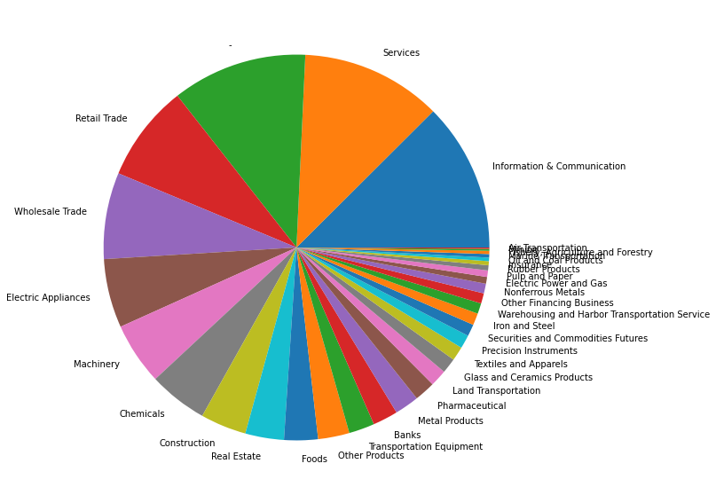
    


```python
stocks_df["Section/Products"].value_counts()
```


    First Section (Domestic)                                       2327
    JASDAQ(Standard / Domestic)                                     726
    Second Section(Domestic)                                        530
    Mothers (Domestic)                                              439
    ETFs/ ETNs                                                      277
    REIT, Venture Funds, Country Funds and Infrastructure Funds      68
    JASDAQ(Growth/Domestic)                                          41
    First Section (Foreign)                                           4
    Mothers (Foreign)                                                 3
    JASDAQ(Standard / Foreign)                                        1
    Second Section(Foreign)                                           1
    Name: Section/Products, dtype: int64


```python
section = stocks_df["Section/Products"].value_counts().to_frame()
section.reset_index(inplace=True)
section["percentage"] = section["Section/Products"]/section["Section/Products"].sum()*100
section
```


<div>
<style scoped>
    .dataframe tbody tr th:only-of-type {
        vertical-align: middle;
    }

    .dataframe tbody tr th {
        vertical-align: top;
    }

    .dataframe thead th {
        text-align: right;
    }
</style>
<table border="1" class="dataframe">
  <thead>
    <tr style="text-align: right;">
      <th></th>
      <th>index</th>
      <th>Section/Products</th>
      <th>percentage</th>
    </tr>
  </thead>
  <tbody>
    <tr>
      <th>0</th>
      <td>First Section (Domestic)</td>
      <td>2327</td>
      <td>52.682816</td>
    </tr>
    <tr>
      <th>1</th>
      <td>JASDAQ(Standard / Domestic)</td>
      <td>726</td>
      <td>16.436495</td>
    </tr>
    <tr>
      <th>2</th>
      <td>Second Section(Domestic)</td>
      <td>530</td>
      <td>11.999094</td>
    </tr>
    <tr>
      <th>3</th>
      <td>Mothers (Domestic)</td>
      <td>439</td>
      <td>9.938873</td>
    </tr>
    <tr>
      <th>4</th>
      <td>ETFs/ ETNs</td>
      <td>277</td>
      <td>6.271225</td>
    </tr>
    <tr>
      <th>5</th>
      <td>REIT, Venture Funds, Country Funds and Infrastructure Funds</td>
      <td>68</td>
      <td>1.539506</td>
    </tr>
    <tr>
      <th>6</th>
      <td>JASDAQ(Growth/Domestic)</td>
      <td>41</td>
      <td>0.928232</td>
    </tr>
    <tr>
      <th>7</th>
      <td>First Section (Foreign)</td>
      <td>4</td>
      <td>0.090559</td>
    </tr>
    <tr>
      <th>8</th>
      <td>Mothers (Foreign)</td>
      <td>3</td>
      <td>0.067919</td>
    </tr>
    <tr>
      <th>9</th>
      <td>JASDAQ(Standard / Foreign)</td>
      <td>1</td>
      <td>0.022640</td>
    </tr>
    <tr>
      <th>10</th>
      <td>Second Section(Foreign)</td>
      <td>1</td>
      <td>0.022640</td>
    </tr>
  </tbody>
</table>
</div>


```python
section["percentage"] = section["Section/Products"]/section["Section/Products"].sum()*100
```


```python
plt.rcParams["figure.figsize"] = (30,10)
plt.pie(section["percentage"], labels = section["index"])
plt.show()
```


    
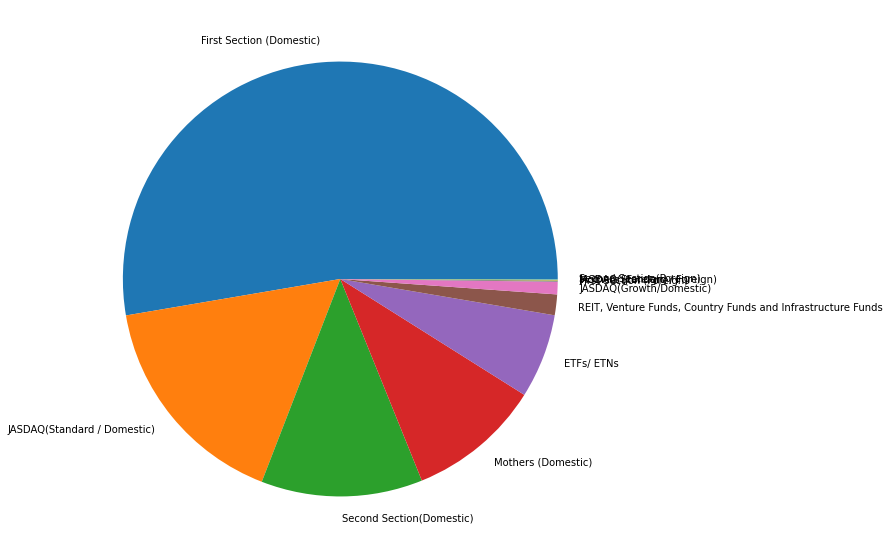
    


```python
del sector
del section
gc.collect()
```


    9374


## Selecting the top 2000 Stocks (Universe0 Flag = True)


```python
stocks2000_df = stocks_df[stocks_df["Universe0"]]
display(stocks2000_df.head())
```


<div>
<style scoped>
    .dataframe tbody tr th:only-of-type {
        vertical-align: middle;
    }

    .dataframe tbody tr th {
        vertical-align: top;
    }

    .dataframe thead th {
        text-align: right;
    }
</style>
<table border="1" class="dataframe">
  <thead>
    <tr style="text-align: right;">
      <th></th>
      <th>SecuritiesCode</th>
      <th>EffectiveDate</th>
      <th>Name</th>
      <th>Section/Products</th>
      <th>NewMarketSegment</th>
      <th>33SectorCode</th>
      <th>33SectorName</th>
      <th>17SectorCode</th>
      <th>17SectorName</th>
      <th>NewIndexSeriesSizeCode</th>
      <th>NewIndexSeriesSize</th>
      <th>TradeDate</th>
      <th>Close</th>
      <th>IssuedShares</th>
      <th>MarketCapitalization</th>
      <th>Universe0</th>
    </tr>
  </thead>
  <tbody>
    <tr>
      <th>0</th>
      <td>1301</td>
      <td>20211230</td>
      <td>KYOKUYO CO.,LTD.</td>
      <td>First Section (Domestic)</td>
      <td>Prime Market</td>
      <td>50</td>
      <td>Fishery, Agriculture and Forestry</td>
      <td>1</td>
      <td>FOODS</td>
      <td>7</td>
      <td>TOPIX Small 2</td>
      <td>20211230.0</td>
      <td>3080.0</td>
      <td>10928283.0</td>
      <td>3.365911e+10</td>
      <td>True</td>
    </tr>
    <tr>
      <th>19</th>
      <td>1332</td>
      <td>20211230</td>
      <td>Nippon Suisan Kaisha,Ltd.</td>
      <td>First Section (Domestic)</td>
      <td>Prime Market</td>
      <td>50</td>
      <td>Fishery, Agriculture and Forestry</td>
      <td>1</td>
      <td>FOODS</td>
      <td>4</td>
      <td>TOPIX Mid400</td>
      <td>20211230.0</td>
      <td>543.0</td>
      <td>312430277.0</td>
      <td>1.696496e+11</td>
      <td>True</td>
    </tr>
    <tr>
      <th>20</th>
      <td>1333</td>
      <td>20211230</td>
      <td>Maruha Nichiro Corporation</td>
      <td>First Section (Domestic)</td>
      <td>Prime Market</td>
      <td>50</td>
      <td>Fishery, Agriculture and Forestry</td>
      <td>1</td>
      <td>FOODS</td>
      <td>4</td>
      <td>TOPIX Mid400</td>
      <td>20211230.0</td>
      <td>2405.0</td>
      <td>52656910.0</td>
      <td>1.266399e+11</td>
      <td>True</td>
    </tr>
    <tr>
      <th>37</th>
      <td>1375</td>
      <td>20211230</td>
      <td>YUKIGUNI MAITAKE CO.,LTD.</td>
      <td>First Section (Domestic)</td>
      <td>Prime Market</td>
      <td>50</td>
      <td>Fishery, Agriculture and Forestry</td>
      <td>1</td>
      <td>FOODS</td>
      <td>6</td>
      <td>TOPIX Small 1</td>
      <td>20211230.0</td>
      <td>1196.0</td>
      <td>39910700.0</td>
      <td>4.773320e+10</td>
      <td>True</td>
    </tr>
    <tr>
      <th>38</th>
      <td>1376</td>
      <td>20211230</td>
      <td>KANEKO SEEDS CO.,LTD.</td>
      <td>First Section (Domestic)</td>
      <td>Standard Market</td>
      <td>50</td>
      <td>Fishery, Agriculture and Forestry</td>
      <td>1</td>
      <td>FOODS</td>
      <td>7</td>
      <td>TOPIX Small 2</td>
      <td>20211230.0</td>
      <td>1504.0</td>
      <td>11772626.0</td>
      <td>1.770603e+10</td>
      <td>True</td>
    </tr>
  </tbody>
</table>
</div>


```python
stocks2000_df.info()
```

    <class 'pandas.core.frame.DataFrame'>
    Int64Index: 2000 entries, 0 to 4415
    Data columns (total 16 columns):
     #   Column                  Non-Null Count  Dtype  
    ---  ------                  --------------  -----  
     0   SecuritiesCode          2000 non-null   int64  
     1   EffectiveDate           2000 non-null   int64  
     2   Name                    2000 non-null   object 
     3   Section/Products        2000 non-null   object 
     4   NewMarketSegment        2000 non-null   object 
     5   33SectorCode            2000 non-null   object 
     6   33SectorName            2000 non-null   object 
     7   17SectorCode            2000 non-null   object 
     8   17SectorName            2000 non-null   object 
     9   NewIndexSeriesSizeCode  2000 non-null   object 
     10  NewIndexSeriesSize      2000 non-null   object 
     11  TradeDate               2000 non-null   float64
     12  Close                   2000 non-null   float64
     13  IssuedShares            2000 non-null   float64
     14  MarketCapitalization    2000 non-null   float64
     15  Universe0               2000 non-null   bool   
    dtypes: bool(1), float64(4), int64(2), object(9)
    memory usage: 252.0+ KB
    


```python
stocks2000_df["33SectorName"].value_counts()
```


    Information & Communication          229
    Services                             201
    Retail Trade                         179
    Electric Appliances                  156
    Wholesale Trade                      151
                                        ... 
    Oil and Coal Products                  9
    Fishery, Agriculture and Forestry      8
    Marine Transportation                  7
    Mining                                 5
    Air Transportation                     4
    Name: 33SectorName, Length: 33, dtype: int64


```python
sector2000 = stocks2000_df["33SectorName"].value_counts().to_frame()
sector2000.reset_index(inplace=True)
sector2000["percentage"] = sector2000["33SectorName"]/sector2000["33SectorName"].sum()*100
sector2000.head(5)
```


<div>
<style scoped>
    .dataframe tbody tr th:only-of-type {
        vertical-align: middle;
    }

    .dataframe tbody tr th {
        vertical-align: top;
    }

    .dataframe thead th {
        text-align: right;
    }
</style>
<table border="1" class="dataframe">
  <thead>
    <tr style="text-align: right;">
      <th></th>
      <th>index</th>
      <th>33SectorName</th>
      <th>percentage</th>
    </tr>
  </thead>
  <tbody>
    <tr>
      <th>0</th>
      <td>Information &amp; Communication</td>
      <td>229</td>
      <td>11.45</td>
    </tr>
    <tr>
      <th>1</th>
      <td>Services</td>
      <td>201</td>
      <td>10.05</td>
    </tr>
    <tr>
      <th>2</th>
      <td>Retail Trade</td>
      <td>179</td>
      <td>8.95</td>
    </tr>
    <tr>
      <th>3</th>
      <td>Electric Appliances</td>
      <td>156</td>
      <td>7.80</td>
    </tr>
    <tr>
      <th>4</th>
      <td>Wholesale Trade</td>
      <td>151</td>
      <td>7.55</td>
    </tr>
  </tbody>
</table>
</div>


```python
plt.rcParams["figure.figsize"] = (40,10)
plt.pie(sector2000["percentage"], labels = sector2000["index"])
plt.show()
```


    
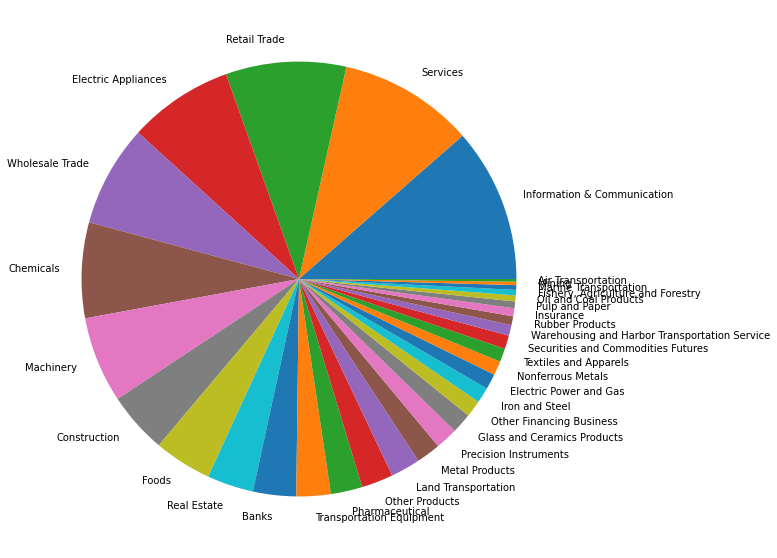
    


```python
section2000 = stocks2000_df["Section/Products"].value_counts().to_frame()
section2000.reset_index(inplace=True)
section2000["percentage"] = section2000["Section/Products"]/section2000["Section/Products"].sum()*100
section2000
```


<div>
<style scoped>
    .dataframe tbody tr th:only-of-type {
        vertical-align: middle;
    }

    .dataframe tbody tr th {
        vertical-align: top;
    }

    .dataframe thead th {
        text-align: right;
    }
</style>
<table border="1" class="dataframe">
  <thead>
    <tr style="text-align: right;">
      <th></th>
      <th>index</th>
      <th>Section/Products</th>
      <th>percentage</th>
    </tr>
  </thead>
  <tbody>
    <tr>
      <th>0</th>
      <td>First Section (Domestic)</td>
      <td>1711</td>
      <td>85.55</td>
    </tr>
    <tr>
      <th>1</th>
      <td>JASDAQ(Standard / Domestic)</td>
      <td>107</td>
      <td>5.35</td>
    </tr>
    <tr>
      <th>2</th>
      <td>Second Section(Domestic)</td>
      <td>90</td>
      <td>4.50</td>
    </tr>
    <tr>
      <th>3</th>
      <td>Mothers (Domestic)</td>
      <td>85</td>
      <td>4.25</td>
    </tr>
    <tr>
      <th>4</th>
      <td>JASDAQ(Growth/Domestic)</td>
      <td>7</td>
      <td>0.35</td>
    </tr>
  </tbody>
</table>
</div>


```python
plt.rcParams["figure.figsize"] = (30,10)
plt.pie(section2000["percentage"], labels = section2000["index"])
plt.show()
```


    
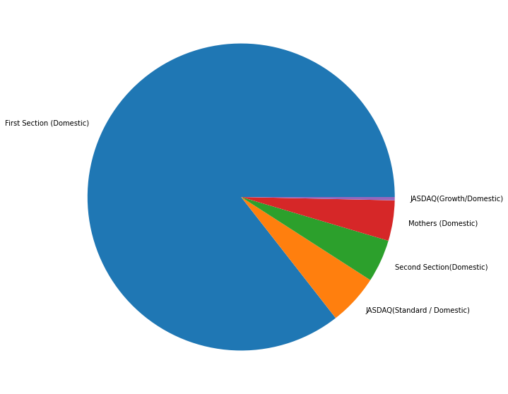
    


```python
del stocks_df
del section2000
del sector2000
gc.collect()
```


    8530


## Merging Stock metadate with stock price


```python
df_prices =  merge_metadata(stock_prices_df, stocks2000_df)
```


<div>
<style scoped>
    .dataframe tbody tr th:only-of-type {
        vertical-align: middle;
    }

    .dataframe tbody tr th {
        vertical-align: top;
    }

    .dataframe thead th {
        text-align: right;
    }
</style>
<table border="1" class="dataframe">
  <thead>
    <tr style="text-align: right;">
      <th></th>
      <th>RowId</th>
      <th>Date</th>
      <th>SecuritiesCode</th>
      <th>Open</th>
      <th>High</th>
      <th>Low</th>
      <th>Close</th>
      <th>Volume</th>
      <th>AdjustmentFactor</th>
      <th>ExpectedDividend</th>
      <th>SupervisionFlag</th>
      <th>Target</th>
      <th>Name</th>
      <th>Section/Products</th>
      <th>NewMarketSegment</th>
      <th>33SectorCode</th>
      <th>33SectorName</th>
      <th>17SectorCode</th>
      <th>17SectorName</th>
      <th>NewIndexSeriesSizeCode</th>
      <th>NewIndexSeriesSize</th>
      <th>IssuedShares</th>
      <th>MarketCapitalization</th>
    </tr>
  </thead>
  <tbody>
    <tr>
      <th>0</th>
      <td>20170104_1301</td>
      <td>2017-01-04</td>
      <td>1301</td>
      <td>2734.0</td>
      <td>2755.0</td>
      <td>2730.0</td>
      <td>2742.0</td>
      <td>31400</td>
      <td>1.0</td>
      <td>NaN</td>
      <td>False</td>
      <td>0.000730</td>
      <td>KYOKUYO CO.,LTD.</td>
      <td>First Section (Domestic)</td>
      <td>Prime Market</td>
      <td>50</td>
      <td>Fishery, Agriculture and Forestry</td>
      <td>1</td>
      <td>FOODS</td>
      <td>7</td>
      <td>TOPIX Small 2</td>
      <td>10928283.0</td>
      <td>3.365911e+10</td>
    </tr>
    <tr>
      <th>1</th>
      <td>20170105_1301</td>
      <td>2017-01-05</td>
      <td>1301</td>
      <td>2743.0</td>
      <td>2747.0</td>
      <td>2735.0</td>
      <td>2738.0</td>
      <td>17900</td>
      <td>1.0</td>
      <td>NaN</td>
      <td>False</td>
      <td>0.002920</td>
      <td>KYOKUYO CO.,LTD.</td>
      <td>First Section (Domestic)</td>
      <td>Prime Market</td>
      <td>50</td>
      <td>Fishery, Agriculture and Forestry</td>
      <td>1</td>
      <td>FOODS</td>
      <td>7</td>
      <td>TOPIX Small 2</td>
      <td>10928283.0</td>
      <td>3.365911e+10</td>
    </tr>
    <tr>
      <th>2</th>
      <td>20170106_1301</td>
      <td>2017-01-06</td>
      <td>1301</td>
      <td>2734.0</td>
      <td>2744.0</td>
      <td>2720.0</td>
      <td>2740.0</td>
      <td>19900</td>
      <td>1.0</td>
      <td>NaN</td>
      <td>False</td>
      <td>-0.001092</td>
      <td>KYOKUYO CO.,LTD.</td>
      <td>First Section (Domestic)</td>
      <td>Prime Market</td>
      <td>50</td>
      <td>Fishery, Agriculture and Forestry</td>
      <td>1</td>
      <td>FOODS</td>
      <td>7</td>
      <td>TOPIX Small 2</td>
      <td>10928283.0</td>
      <td>3.365911e+10</td>
    </tr>
    <tr>
      <th>3</th>
      <td>20170110_1301</td>
      <td>2017-01-10</td>
      <td>1301</td>
      <td>2745.0</td>
      <td>2754.0</td>
      <td>2735.0</td>
      <td>2748.0</td>
      <td>24200</td>
      <td>1.0</td>
      <td>NaN</td>
      <td>False</td>
      <td>-0.005100</td>
      <td>KYOKUYO CO.,LTD.</td>
      <td>First Section (Domestic)</td>
      <td>Prime Market</td>
      <td>50</td>
      <td>Fishery, Agriculture and Forestry</td>
      <td>1</td>
      <td>FOODS</td>
      <td>7</td>
      <td>TOPIX Small 2</td>
      <td>10928283.0</td>
      <td>3.365911e+10</td>
    </tr>
    <tr>
      <th>4</th>
      <td>20170111_1301</td>
      <td>2017-01-11</td>
      <td>1301</td>
      <td>2748.0</td>
      <td>2752.0</td>
      <td>2737.0</td>
      <td>2745.0</td>
      <td>9300</td>
      <td>1.0</td>
      <td>NaN</td>
      <td>False</td>
      <td>-0.003295</td>
      <td>KYOKUYO CO.,LTD.</td>
      <td>First Section (Domestic)</td>
      <td>Prime Market</td>
      <td>50</td>
      <td>Fishery, Agriculture and Forestry</td>
      <td>1</td>
      <td>FOODS</td>
      <td>7</td>
      <td>TOPIX Small 2</td>
      <td>10928283.0</td>
      <td>3.365911e+10</td>
    </tr>
  </tbody>
</table>
</div>


**Calculating Target variable statistics**


```python
mean_securities_df = df_prices.groupby(["SecuritiesCode"])["Target"].mean()
total_mean_securities = mean_securities_df.mean()
total_mean_securities
```


    0.0004714963317502812


```python
fig, ax = plt.subplots(figsize=(10,5))
sns.histplot(data=mean_securities_df.values, bins=100,
             ax=ax)
ax.axvline(x=total_mean_securities, color='red', linestyle='dotted', linewidth=2, 
           label='Mean')
ax.set_title("Target Mean Distibution Securities\n"
             f"Min {round(mean_securities_df.min(), 4)} | "
             f"Max {round(mean_securities_df.max(), 4)} | "
             f"Skewness {round(mean_securities_df.skew(), 2)} | "
             f"Kurtosis {round(mean_securities_df.kurtosis(), 2)}")
ax.set_xlabel("Target Mean")
ax.set_ylabel("Date Count")
ax.legend()
plt.show()
```


    

    


```python
mean_date_df = df_prices.groupby(["Date"])["Target"].mean()
total_mean_date = mean_date_df.mean()
total_mean_date
```


    0.00044572606297777287


```python
fig, ax = plt.subplots(figsize=(10,5))
sns.histplot(data=mean_date_df.values, bins=100,
             ax=ax)
ax.axvline(x=total_mean_date, color='red', linestyle='dotted', linewidth=2, 
           label='Mean')
ax.set_title("Target Mean Distibution Date\n"
             f"Min {round(mean_date_df.min(), 4)} | "
             f"Max {round(mean_date_df.max(), 4)} | "
             f"Skewness {round(mean_date_df.skew(), 2)} | "
             f"Kurtosis {round(mean_date_df.kurtosis(), 2)}")
ax.set_xlabel("Target Mean")
ax.set_ylabel("Date Count")
ax.legend()
plt.show()
```


    
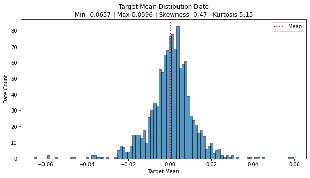
    


## Grupying the Target by Sector and Section

### Target vs Sector33


```python
target_sector = df_prices.groupby(["33SectorName"])["Target"].mean()
target_sector.sort_values(inplace=True, ascending=False)

```


```python
target_sector = target_sector.to_frame()
target_sector.reset_index(inplace= True)
```


```python
fig, ax = plt.subplots(figsize = (12,6))    
fig = sns.barplot(x = "33SectorName", y = "Target", data = target_sector, ax=ax)
ax.set_title("Target Mean of Sectors")
ax.tick_params(axis='x', rotation=90)
```


    
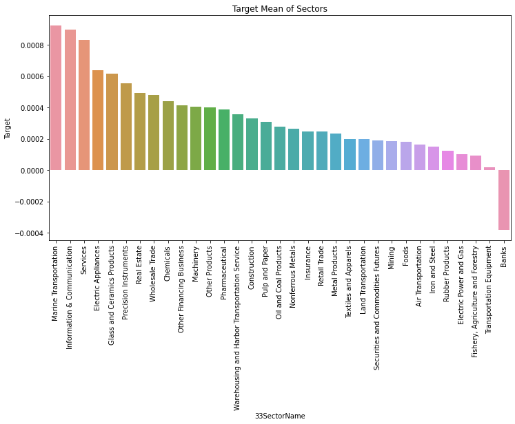
    


### Target vs Section


```python
target_section = df_prices.groupby(["Section/Products"])["Target"].mean()
target_section.sort_values(inplace=True, ascending=False)

```


```python
target_section = target_section.to_frame()
target_section.reset_index(inplace= True)
```


```python
fig, ax = plt.subplots(figsize = (12,6))    
fig = sns.barplot(x = "Section/Products", y = "Target", data = target_section, ax=ax)
ax.set_title("Target Mean of Sections")
ax.tick_params(axis='x', rotation=90)
```


    
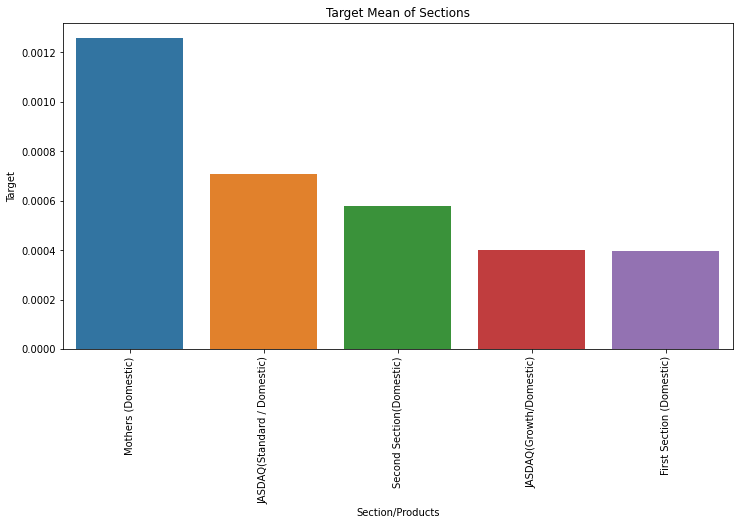
    


### Secondary stock prices

secondary_stock_prices.csv

**File Description**

Securities with low liquidity (few opportunities to trade). Following is column information recorded in stock_price_spec.csv:


```python
stock_prices_info
```


<div>
<style scoped>
    .dataframe tbody tr th:only-of-type {
        vertical-align: middle;
    }

    .dataframe tbody tr th {
        vertical-align: top;
    }

    .dataframe thead th {
        text-align: right;
    }
</style>
<table border="1" class="dataframe">
  <thead>
    <tr style="text-align: right;">
      <th></th>
      <th>Column</th>
      <th>Sample value</th>
      <th>Type</th>
      <th>Addendum</th>
      <th>Remarks</th>
    </tr>
  </thead>
  <tbody>
    <tr>
      <th>0</th>
      <td>RowId</td>
      <td>20170104_1301</td>
      <td>string</td>
      <td>NaN</td>
      <td>Unique ID of price records</td>
    </tr>
    <tr>
      <th>1</th>
      <td>Date</td>
      <td>2017-01-04 0:00:00</td>
      <td>date</td>
      <td>NaN</td>
      <td>Trade date</td>
    </tr>
    <tr>
      <th>2</th>
      <td>SecuritiesCode</td>
      <td>1301</td>
      <td>Int64</td>
      <td>NaN</td>
      <td>Local securities code</td>
    </tr>
    <tr>
      <th>3</th>
      <td>Open</td>
      <td>2734</td>
      <td>float</td>
      <td>NaN</td>
      <td>first traded price on a day</td>
    </tr>
    <tr>
      <th>4</th>
      <td>High</td>
      <td>2755</td>
      <td>float</td>
      <td>NaN</td>
      <td>highest traded price on a day</td>
    </tr>
    <tr>
      <th>5</th>
      <td>Low</td>
      <td>2730</td>
      <td>float</td>
      <td>NaN</td>
      <td>lowest traded price on a day</td>
    </tr>
    <tr>
      <th>6</th>
      <td>Close</td>
      <td>2742</td>
      <td>float</td>
      <td>NaN</td>
      <td>last traded price on a day</td>
    </tr>
    <tr>
      <th>7</th>
      <td>Volume</td>
      <td>31400</td>
      <td>Int64</td>
      <td>NaN</td>
      <td>number of traded stocks on a day</td>
    </tr>
    <tr>
      <th>8</th>
      <td>AdjustmentFactor</td>
      <td>1</td>
      <td>float</td>
      <td>NaN</td>
      <td>to calculate theoretical price/volume when split/reverse-split happens (NOT including dividend/allotment of shares/)</td>
    </tr>
    <tr>
      <th>9</th>
      <td>SupervisionFlag</td>
      <td>FALSE</td>
      <td>boolean</td>
      <td>NaN</td>
      <td>Flag of Securities Under Supervision &amp; Securities to Be Delisted\nhttps://www.jpx.co.jp/english/listing/market-alerts/supervision/00-archives/index.html )</td>
    </tr>
    <tr>
      <th>10</th>
      <td>ExpectedDividend</td>
      <td>NaN</td>
      <td>float</td>
      <td>NaN</td>
      <td>Expected dividend value for ex-right date. This value is recorded 2 business days before ex-dividend date.</td>
    </tr>
    <tr>
      <th>11</th>
      <td>Target</td>
      <td>0.00073</td>
      <td>float</td>
      <td>NaN</td>
      <td>Change ratio of adjusted closing price between t+2 and t+1 where t+0 is TradeDate</td>
    </tr>
  </tbody>
</table>
</div>


```python
display(secondary_stock_prices_df.head(5))
```


<div>
<style scoped>
    .dataframe tbody tr th:only-of-type {
        vertical-align: middle;
    }

    .dataframe tbody tr th {
        vertical-align: top;
    }

    .dataframe thead th {
        text-align: right;
    }
</style>
<table border="1" class="dataframe">
  <thead>
    <tr style="text-align: right;">
      <th></th>
      <th>RowId</th>
      <th>Date</th>
      <th>SecuritiesCode</th>
      <th>Open</th>
      <th>High</th>
      <th>Low</th>
      <th>Close</th>
      <th>Volume</th>
      <th>AdjustmentFactor</th>
      <th>ExpectedDividend</th>
      <th>SupervisionFlag</th>
      <th>Target</th>
    </tr>
  </thead>
  <tbody>
    <tr>
      <th>0</th>
      <td>20170104_1305</td>
      <td>2017-01-04</td>
      <td>1305</td>
      <td>1594.0</td>
      <td>1618.0</td>
      <td>1594.0</td>
      <td>1615.0</td>
      <td>538190</td>
      <td>1.0</td>
      <td>NaN</td>
      <td>False</td>
      <td>-0.001855</td>
    </tr>
    <tr>
      <th>1</th>
      <td>20170104_1306</td>
      <td>2017-01-04</td>
      <td>1306</td>
      <td>1575.0</td>
      <td>1595.0</td>
      <td>1573.0</td>
      <td>1593.0</td>
      <td>2494980</td>
      <td>1.0</td>
      <td>NaN</td>
      <td>False</td>
      <td>-0.000627</td>
    </tr>
    <tr>
      <th>2</th>
      <td>20170104_1308</td>
      <td>2017-01-04</td>
      <td>1308</td>
      <td>1557.0</td>
      <td>1580.0</td>
      <td>1557.0</td>
      <td>1578.0</td>
      <td>526100</td>
      <td>1.0</td>
      <td>NaN</td>
      <td>False</td>
      <td>-0.001900</td>
    </tr>
    <tr>
      <th>3</th>
      <td>20170104_1309</td>
      <td>2017-01-04</td>
      <td>1309</td>
      <td>28810.0</td>
      <td>29000.0</td>
      <td>28520.0</td>
      <td>28780.0</td>
      <td>403</td>
      <td>1.0</td>
      <td>NaN</td>
      <td>False</td>
      <td>0.005237</td>
    </tr>
    <tr>
      <th>4</th>
      <td>20170104_1311</td>
      <td>2017-01-04</td>
      <td>1311</td>
      <td>717.0</td>
      <td>735.0</td>
      <td>717.0</td>
      <td>734.0</td>
      <td>5470</td>
      <td>1.0</td>
      <td>NaN</td>
      <td>False</td>
      <td>0.001359</td>
    </tr>
  </tbody>
</table>
</div>


```python
secondary_stock_prices_df.info()
```

    <class 'pandas.core.frame.DataFrame'>
    RangeIndex: 2384575 entries, 0 to 2384574
    Data columns (total 12 columns):
     #   Column            Dtype  
    ---  ------            -----  
     0   RowId             object 
     1   Date              object 
     2   SecuritiesCode    int64  
     3   Open              float64
     4   High              float64
     5   Low               float64
     6   Close             float64
     7   Volume            int64  
     8   AdjustmentFactor  float64
     9   ExpectedDividend  float64
     10  SupervisionFlag   bool   
     11  Target            float64
    dtypes: bool(1), float64(7), int64(2), object(2)
    memory usage: 202.4+ MB
    


```python
display(pd.isna(secondary_stock_prices_df).sum()/len(secondary_stock_prices_df)*100)
```


    RowId                0.000000
    Date                 0.000000
    SecuritiesCode       0.000000
    Open                 3.847688
    High                 3.847688
    Low                  3.847688
    Close                3.847688
    Volume               0.000000
    AdjustmentFactor     0.000000
    ExpectedDividend    99.225942
    SupervisionFlag      0.000000
    Target               0.030110
    dtype: float64


**Missing values**


```python
missing_secondary_high = secondary_stock_prices_df[secondary_stock_prices_df["High"].isna()]
display(missing_secondary_high.head(5))
```


<div>
<style scoped>
    .dataframe tbody tr th:only-of-type {
        vertical-align: middle;
    }

    .dataframe tbody tr th {
        vertical-align: top;
    }

    .dataframe thead th {
        text-align: right;
    }
</style>
<table border="1" class="dataframe">
  <thead>
    <tr style="text-align: right;">
      <th></th>
      <th>RowId</th>
      <th>Date</th>
      <th>SecuritiesCode</th>
      <th>Open</th>
      <th>High</th>
      <th>Low</th>
      <th>Close</th>
      <th>Volume</th>
      <th>AdjustmentFactor</th>
      <th>ExpectedDividend</th>
      <th>SupervisionFlag</th>
      <th>Target</th>
    </tr>
  </thead>
  <tbody>
    <tr>
      <th>68</th>
      <td>20170104_1468</td>
      <td>2017-01-04</td>
      <td>1468</td>
      <td>NaN</td>
      <td>NaN</td>
      <td>NaN</td>
      <td>NaN</td>
      <td>0</td>
      <td>1.0</td>
      <td>NaN</td>
      <td>False</td>
      <td>0.000000</td>
    </tr>
    <tr>
      <th>83</th>
      <td>20170104_1484</td>
      <td>2017-01-04</td>
      <td>1484</td>
      <td>NaN</td>
      <td>NaN</td>
      <td>NaN</td>
      <td>NaN</td>
      <td>0</td>
      <td>1.0</td>
      <td>NaN</td>
      <td>False</td>
      <td>NaN</td>
    </tr>
    <tr>
      <th>86</th>
      <td>20170104_1487</td>
      <td>2017-01-04</td>
      <td>1487</td>
      <td>NaN</td>
      <td>NaN</td>
      <td>NaN</td>
      <td>NaN</td>
      <td>0</td>
      <td>1.0</td>
      <td>NaN</td>
      <td>False</td>
      <td>NaN</td>
    </tr>
    <tr>
      <th>118</th>
      <td>20170104_1584</td>
      <td>2017-01-04</td>
      <td>1584</td>
      <td>NaN</td>
      <td>NaN</td>
      <td>NaN</td>
      <td>NaN</td>
      <td>0</td>
      <td>1.0</td>
      <td>NaN</td>
      <td>False</td>
      <td>0.000000</td>
    </tr>
    <tr>
      <th>136</th>
      <td>20170104_1623</td>
      <td>2017-01-04</td>
      <td>1623</td>
      <td>NaN</td>
      <td>NaN</td>
      <td>NaN</td>
      <td>NaN</td>
      <td>0</td>
      <td>1.0</td>
      <td>NaN</td>
      <td>False</td>
      <td>-0.022126</td>
    </tr>
  </tbody>
</table>
</div>


```python
missing_secondary_high["Date"].nunique()
```


    1202


```python
plot_missing_secondary_high_df = missing_secondary_high["Date"].value_counts().to_frame().reset_index()
plot_missing_secondary_high_df.rename(columns = {'index':'Date', 'Date':'Count'}, inplace = True)
plot_missing_secondary_high_df.head()
```


<div>
<style scoped>
    .dataframe tbody tr th:only-of-type {
        vertical-align: middle;
    }

    .dataframe tbody tr th {
        vertical-align: top;
    }

    .dataframe thead th {
        text-align: right;
    }
</style>
<table border="1" class="dataframe">
  <thead>
    <tr style="text-align: right;">
      <th></th>
      <th>Date</th>
      <th>Count</th>
    </tr>
  </thead>
  <tbody>
    <tr>
      <th>0</th>
      <td>2020-10-01</td>
      <td>2009</td>
    </tr>
    <tr>
      <th>1</th>
      <td>2019-05-22</td>
      <td>142</td>
    </tr>
    <tr>
      <th>2</th>
      <td>2019-08-08</td>
      <td>141</td>
    </tr>
    <tr>
      <th>3</th>
      <td>2019-03-06</td>
      <td>141</td>
    </tr>
    <tr>
      <th>4</th>
      <td>2019-08-29</td>
      <td>140</td>
    </tr>
  </tbody>
</table>
</div>


```python
del secondary_stock_prices_df
gc.collect()
```


    27702


As happened with the primary stock list 2020-10-01 is the day with the most amount of missing data


**NOTE:** Secondary stock prices price movement is correlated with the main stock price movement. Due to the limited amount dedicated to this project, this data will not be included in the prediction model

## Trades

trades.csv

**File Description**

Aggregated summary of trading volumes from the previous business week. Following is column information recorded in trades_spec.csv:


```python
trades_info
```


<div>
<style scoped>
    .dataframe tbody tr th:only-of-type {
        vertical-align: middle;
    }

    .dataframe tbody tr th {
        vertical-align: top;
    }

    .dataframe thead th {
        text-align: right;
    }
</style>
<table border="1" class="dataframe">
  <thead>
    <tr style="text-align: right;">
      <th></th>
      <th>index</th>
      <th>Column</th>
      <th>Sample value</th>
      <th>Type</th>
      <th>Addendum</th>
      <th>Remarks</th>
    </tr>
  </thead>
  <tbody>
    <tr>
      <th>0</th>
      <td>0</td>
      <td>PublishedDate</td>
      <td>2017-01-13</td>
      <td>date</td>
      <td>NaN</td>
      <td>data published data, usually Thursday on the following week.</td>
    </tr>
    <tr>
      <th>1</th>
      <td>0</td>
      <td>StartDate</td>
      <td>2017-01-04</td>
      <td>date</td>
      <td>NaN</td>
      <td>The first trading date in this trading week</td>
    </tr>
    <tr>
      <th>2</th>
      <td>1</td>
      <td>EndDate</td>
      <td>2017-01-06</td>
      <td>date</td>
      <td>NaN</td>
      <td>The last trading date in this trading week</td>
    </tr>
    <tr>
      <th>3</th>
      <td>2</td>
      <td>Section</td>
      <td>Prime Market (First Section)</td>
      <td>string</td>
      <td>NaN</td>
      <td>Market division name</td>
    </tr>
    <tr>
      <th>4</th>
      <td>3</td>
      <td>TotalSales</td>
      <td>8476800009</td>
      <td>Int64</td>
      <td>NaN</td>
      <td>Please check below documents.\n\nPublished file\nhttps://www.jpx.co.jp/english/markets/statistics-equities/investor-type/b5b4pj000004r9zg-att/stock_val_1_220301.pdf\n\nExplanation of the Trading by Type of Investors\nhttps://www.jpx.co.jp/english/markets/statistics-equities/investor-type/07.html</td>
    </tr>
    <tr>
      <th>...</th>
      <td>...</td>
      <td>...</td>
      <td>...</td>
      <td>...</td>
      <td>...</td>
      <td>...</td>
    </tr>
    <tr>
      <th>51</th>
      <td>50</td>
      <td>TrustBanksBalance</td>
      <td>-47609502</td>
      <td>Int64</td>
      <td>NaN</td>
      <td>NaN</td>
    </tr>
    <tr>
      <th>52</th>
      <td>51</td>
      <td>OtherFinancialInstitutionsSales</td>
      <td>22410692</td>
      <td>Int64</td>
      <td>NaN</td>
      <td>NaN</td>
    </tr>
    <tr>
      <th>53</th>
      <td>52</td>
      <td>OtherFinancialInstitutionsPurchases</td>
      <td>21764485</td>
      <td>Int64</td>
      <td>NaN</td>
      <td>NaN</td>
    </tr>
    <tr>
      <th>54</th>
      <td>53</td>
      <td>OtherFinancialInstitutionsTotal</td>
      <td>44175177</td>
      <td>Int64</td>
      <td>NaN</td>
      <td>NaN</td>
    </tr>
    <tr>
      <th>55</th>
      <td>54</td>
      <td>OtherFinancialInstitutionsBalance</td>
      <td>-646207</td>
      <td>Int64</td>
      <td>NaN</td>
      <td>NaN</td>
    </tr>
  </tbody>
</table>
<p>56 rows × 6 columns</p>
</div>


```python
display(trades_df.head(5))
```


<div>
<style scoped>
    .dataframe tbody tr th:only-of-type {
        vertical-align: middle;
    }

    .dataframe tbody tr th {
        vertical-align: top;
    }

    .dataframe thead th {
        text-align: right;
    }
</style>
<table border="1" class="dataframe">
  <thead>
    <tr style="text-align: right;">
      <th></th>
      <th>Date</th>
      <th>StartDate</th>
      <th>EndDate</th>
      <th>Section</th>
      <th>TotalSales</th>
      <th>TotalPurchases</th>
      <th>TotalTotal</th>
      <th>TotalBalance</th>
      <th>ProprietarySales</th>
      <th>ProprietaryPurchases</th>
      <th>ProprietaryTotal</th>
      <th>ProprietaryBalance</th>
      <th>BrokerageSales</th>
      <th>BrokeragePurchases</th>
      <th>BrokerageTotal</th>
      <th>BrokerageBalance</th>
      <th>IndividualsSales</th>
      <th>IndividualsPurchases</th>
      <th>IndividualsTotal</th>
      <th>IndividualsBalance</th>
      <th>ForeignersSales</th>
      <th>ForeignersPurchases</th>
      <th>ForeignersTotal</th>
      <th>ForeignersBalance</th>
      <th>SecuritiesCosSales</th>
      <th>SecuritiesCosPurchases</th>
      <th>SecuritiesCosTotal</th>
      <th>SecuritiesCosBalance</th>
      <th>InvestmentTrustsSales</th>
      <th>InvestmentTrustsPurchases</th>
      <th>InvestmentTrustsTotal</th>
      <th>InvestmentTrustsBalance</th>
      <th>BusinessCosSales</th>
      <th>BusinessCosPurchases</th>
      <th>BusinessCosTotal</th>
      <th>BusinessCosBalance</th>
      <th>OtherInstitutionsSales</th>
      <th>OtherInstitutionsPurchases</th>
      <th>OtherInstitutionsTotal</th>
      <th>OtherInstitutionsBalance</th>
      <th>InsuranceCosSales</th>
      <th>InsuranceCosPurchases</th>
      <th>InsuranceCosTotal</th>
      <th>InsuranceCosBalance</th>
      <th>CityBKsRegionalBKsEtcSales</th>
      <th>CityBKsRegionalBKsEtcPurchase</th>
      <th>CityBKsRegionalBKsEtcTotal</th>
      <th>CityBKsRegionalBKsEtcBalance</th>
      <th>TrustBanksSales</th>
      <th>TrustBanksPurchases</th>
      <th>TrustBanksTotal</th>
      <th>TrustBanksBalance</th>
      <th>OtherFinancialInstitutionsSales</th>
      <th>OtherFinancialInstitutionsPurchases</th>
      <th>OtherFinancialInstitutionsTotal</th>
      <th>OtherFinancialInstitutionsBalance</th>
    </tr>
  </thead>
  <tbody>
    <tr>
      <th>0</th>
      <td>2017-01-04</td>
      <td>NaN</td>
      <td>NaN</td>
      <td>NaN</td>
      <td>NaN</td>
      <td>NaN</td>
      <td>NaN</td>
      <td>NaN</td>
      <td>NaN</td>
      <td>NaN</td>
      <td>NaN</td>
      <td>NaN</td>
      <td>NaN</td>
      <td>NaN</td>
      <td>NaN</td>
      <td>NaN</td>
      <td>NaN</td>
      <td>NaN</td>
      <td>NaN</td>
      <td>NaN</td>
      <td>NaN</td>
      <td>NaN</td>
      <td>NaN</td>
      <td>NaN</td>
      <td>NaN</td>
      <td>NaN</td>
      <td>NaN</td>
      <td>NaN</td>
      <td>NaN</td>
      <td>NaN</td>
      <td>NaN</td>
      <td>NaN</td>
      <td>NaN</td>
      <td>NaN</td>
      <td>NaN</td>
      <td>NaN</td>
      <td>NaN</td>
      <td>NaN</td>
      <td>NaN</td>
      <td>NaN</td>
      <td>NaN</td>
      <td>NaN</td>
      <td>NaN</td>
      <td>NaN</td>
      <td>NaN</td>
      <td>NaN</td>
      <td>NaN</td>
      <td>NaN</td>
      <td>NaN</td>
      <td>NaN</td>
      <td>NaN</td>
      <td>NaN</td>
      <td>NaN</td>
      <td>NaN</td>
      <td>NaN</td>
      <td>NaN</td>
    </tr>
    <tr>
      <th>1</th>
      <td>2017-01-05</td>
      <td>NaN</td>
      <td>NaN</td>
      <td>NaN</td>
      <td>NaN</td>
      <td>NaN</td>
      <td>NaN</td>
      <td>NaN</td>
      <td>NaN</td>
      <td>NaN</td>
      <td>NaN</td>
      <td>NaN</td>
      <td>NaN</td>
      <td>NaN</td>
      <td>NaN</td>
      <td>NaN</td>
      <td>NaN</td>
      <td>NaN</td>
      <td>NaN</td>
      <td>NaN</td>
      <td>NaN</td>
      <td>NaN</td>
      <td>NaN</td>
      <td>NaN</td>
      <td>NaN</td>
      <td>NaN</td>
      <td>NaN</td>
      <td>NaN</td>
      <td>NaN</td>
      <td>NaN</td>
      <td>NaN</td>
      <td>NaN</td>
      <td>NaN</td>
      <td>NaN</td>
      <td>NaN</td>
      <td>NaN</td>
      <td>NaN</td>
      <td>NaN</td>
      <td>NaN</td>
      <td>NaN</td>
      <td>NaN</td>
      <td>NaN</td>
      <td>NaN</td>
      <td>NaN</td>
      <td>NaN</td>
      <td>NaN</td>
      <td>NaN</td>
      <td>NaN</td>
      <td>NaN</td>
      <td>NaN</td>
      <td>NaN</td>
      <td>NaN</td>
      <td>NaN</td>
      <td>NaN</td>
      <td>NaN</td>
      <td>NaN</td>
    </tr>
    <tr>
      <th>2</th>
      <td>2017-01-06</td>
      <td>NaN</td>
      <td>NaN</td>
      <td>NaN</td>
      <td>NaN</td>
      <td>NaN</td>
      <td>NaN</td>
      <td>NaN</td>
      <td>NaN</td>
      <td>NaN</td>
      <td>NaN</td>
      <td>NaN</td>
      <td>NaN</td>
      <td>NaN</td>
      <td>NaN</td>
      <td>NaN</td>
      <td>NaN</td>
      <td>NaN</td>
      <td>NaN</td>
      <td>NaN</td>
      <td>NaN</td>
      <td>NaN</td>
      <td>NaN</td>
      <td>NaN</td>
      <td>NaN</td>
      <td>NaN</td>
      <td>NaN</td>
      <td>NaN</td>
      <td>NaN</td>
      <td>NaN</td>
      <td>NaN</td>
      <td>NaN</td>
      <td>NaN</td>
      <td>NaN</td>
      <td>NaN</td>
      <td>NaN</td>
      <td>NaN</td>
      <td>NaN</td>
      <td>NaN</td>
      <td>NaN</td>
      <td>NaN</td>
      <td>NaN</td>
      <td>NaN</td>
      <td>NaN</td>
      <td>NaN</td>
      <td>NaN</td>
      <td>NaN</td>
      <td>NaN</td>
      <td>NaN</td>
      <td>NaN</td>
      <td>NaN</td>
      <td>NaN</td>
      <td>NaN</td>
      <td>NaN</td>
      <td>NaN</td>
      <td>NaN</td>
    </tr>
    <tr>
      <th>3</th>
      <td>2017-01-10</td>
      <td>NaN</td>
      <td>NaN</td>
      <td>NaN</td>
      <td>NaN</td>
      <td>NaN</td>
      <td>NaN</td>
      <td>NaN</td>
      <td>NaN</td>
      <td>NaN</td>
      <td>NaN</td>
      <td>NaN</td>
      <td>NaN</td>
      <td>NaN</td>
      <td>NaN</td>
      <td>NaN</td>
      <td>NaN</td>
      <td>NaN</td>
      <td>NaN</td>
      <td>NaN</td>
      <td>NaN</td>
      <td>NaN</td>
      <td>NaN</td>
      <td>NaN</td>
      <td>NaN</td>
      <td>NaN</td>
      <td>NaN</td>
      <td>NaN</td>
      <td>NaN</td>
      <td>NaN</td>
      <td>NaN</td>
      <td>NaN</td>
      <td>NaN</td>
      <td>NaN</td>
      <td>NaN</td>
      <td>NaN</td>
      <td>NaN</td>
      <td>NaN</td>
      <td>NaN</td>
      <td>NaN</td>
      <td>NaN</td>
      <td>NaN</td>
      <td>NaN</td>
      <td>NaN</td>
      <td>NaN</td>
      <td>NaN</td>
      <td>NaN</td>
      <td>NaN</td>
      <td>NaN</td>
      <td>NaN</td>
      <td>NaN</td>
      <td>NaN</td>
      <td>NaN</td>
      <td>NaN</td>
      <td>NaN</td>
      <td>NaN</td>
    </tr>
    <tr>
      <th>4</th>
      <td>2017-01-11</td>
      <td>NaN</td>
      <td>NaN</td>
      <td>NaN</td>
      <td>NaN</td>
      <td>NaN</td>
      <td>NaN</td>
      <td>NaN</td>
      <td>NaN</td>
      <td>NaN</td>
      <td>NaN</td>
      <td>NaN</td>
      <td>NaN</td>
      <td>NaN</td>
      <td>NaN</td>
      <td>NaN</td>
      <td>NaN</td>
      <td>NaN</td>
      <td>NaN</td>
      <td>NaN</td>
      <td>NaN</td>
      <td>NaN</td>
      <td>NaN</td>
      <td>NaN</td>
      <td>NaN</td>
      <td>NaN</td>
      <td>NaN</td>
      <td>NaN</td>
      <td>NaN</td>
      <td>NaN</td>
      <td>NaN</td>
      <td>NaN</td>
      <td>NaN</td>
      <td>NaN</td>
      <td>NaN</td>
      <td>NaN</td>
      <td>NaN</td>
      <td>NaN</td>
      <td>NaN</td>
      <td>NaN</td>
      <td>NaN</td>
      <td>NaN</td>
      <td>NaN</td>
      <td>NaN</td>
      <td>NaN</td>
      <td>NaN</td>
      <td>NaN</td>
      <td>NaN</td>
      <td>NaN</td>
      <td>NaN</td>
      <td>NaN</td>
      <td>NaN</td>
      <td>NaN</td>
      <td>NaN</td>
      <td>NaN</td>
      <td>NaN</td>
    </tr>
  </tbody>
</table>
</div>


**NOTE:** Trade volumen info can be used to predict the Target value. Due to the limited amount dedicated to this project, this data will not be included in the prediction model

### Financials 

financials.csv

**File Description**

Financial information about stock products. Following is column information recorded in stock_fin_spec.csv:


```python
financials_info
```


<div>
<style scoped>
    .dataframe tbody tr th:only-of-type {
        vertical-align: middle;
    }

    .dataframe tbody tr th {
        vertical-align: top;
    }

    .dataframe thead th {
        text-align: right;
    }
</style>
<table border="1" class="dataframe">
  <thead>
    <tr style="text-align: right;">
      <th></th>
      <th>Column</th>
      <th>Sample value</th>
      <th>Type</th>
      <th>Addendum</th>
      <th>Remarks</th>
    </tr>
  </thead>
  <tbody>
    <tr>
      <th>0</th>
      <td>DisclosureNumber</td>
      <td>20161025419878</td>
      <td>Int64</td>
      <td>NaN</td>
      <td>Unique ID for disclosure documents.</td>
    </tr>
    <tr>
      <th>1</th>
      <td>DateCode</td>
      <td>20170106_7888</td>
      <td>string</td>
      <td>NaN</td>
      <td>combination of TradeDate and LocalCode (this is not unique for stock_fin as a company can disclose multiple documents on a day)</td>
    </tr>
    <tr>
      <th>2</th>
      <td>Date</td>
      <td>2017-01-06 0:00:00</td>
      <td>date</td>
      <td>NaN</td>
      <td>Trade date. This column is used to align with stock_price's TradeDate</td>
    </tr>
    <tr>
      <th>3</th>
      <td>SecuritiesCode</td>
      <td>7888</td>
      <td>Int64</td>
      <td>NaN</td>
      <td>Local Securities Code</td>
    </tr>
    <tr>
      <th>4</th>
      <td>DisclosedDate</td>
      <td>2017-01-06 0:00:00</td>
      <td>date</td>
      <td>NaN</td>
      <td>Date on which the document disclosed.</td>
    </tr>
    <tr>
      <th>...</th>
      <td>...</td>
      <td>...</td>
      <td>...</td>
      <td>...</td>
      <td>...</td>
    </tr>
    <tr>
      <th>40</th>
      <td>ChangesInAccountingEstimates</td>
      <td>FALSE</td>
      <td>boolean</td>
      <td>TRUE, FALSE, or blank</td>
      <td>Changes in accounting estimates. (changes in accounting estimates that had been made for the preparation of consolidated financial statements for the previous consolidated fiscal year or any prior consolidated fiscal year, or quarterly consolidated financial statements for the immediately preceding or prior quarterly consolidated accounting period or cumulative quarterly consolidated accounting period based on new information that has become available)</td>
    </tr>
    <tr>
      <th>41</th>
      <td>RetrospectiveRestatement</td>
      <td>FALSE</td>
      <td>boolean</td>
      <td>TRUE, FALSE, or blank</td>
      <td>The reflection, in consolidated financial statements or quarterly consolidated financial statements, of the correction of an error in consolidated financial statements for the previous consolidated fiscal year or any prior consolidated fiscal year or quarterly consolidated financial statements for the immediately preceding or prior quarterly consolidated accounting period or cumulative quarterly consolidated accounting period.\n\n[Note] Blank if is difficult to distinguish changes in accounting policies from changes in accounting estimates.</td>
    </tr>
    <tr>
      <th>42</th>
      <td>NumberOfIssuedAndOutstandingSharesAtTheEndOfFiscalYearIncludingTreasuryStock</td>
      <td>25688569</td>
      <td>Int64</td>
      <td>Actual value for the current accounting period.</td>
      <td>Number of issued shares at the end of the period (including treasury shares) as of the current accounting period.</td>
    </tr>
    <tr>
      <th>43</th>
      <td>NumberOfTreasuryStockAtTheEndOfFiscalYear</td>
      <td>203627</td>
      <td>Int64</td>
      <td>Actual value for the current accounting period.</td>
      <td>Number of treasury shares at the end of the period as of the current accounting period.</td>
    </tr>
    <tr>
      <th>44</th>
      <td>AverageNumberOfShares</td>
      <td>25485430</td>
      <td>Int64</td>
      <td>Actual value for the current accounting period.</td>
      <td>Average number of shares between the start date of the current fiscal year and the end date of in the current period.</td>
    </tr>
  </tbody>
</table>
<p>45 rows × 5 columns</p>
</div>


```python
financials_df.head()
```


<div>
<style scoped>
    .dataframe tbody tr th:only-of-type {
        vertical-align: middle;
    }

    .dataframe tbody tr th {
        vertical-align: top;
    }

    .dataframe thead th {
        text-align: right;
    }
</style>
<table border="1" class="dataframe">
  <thead>
    <tr style="text-align: right;">
      <th></th>
      <th>DisclosureNumber</th>
      <th>DateCode</th>
      <th>Date</th>
      <th>SecuritiesCode</th>
      <th>DisclosedDate</th>
      <th>DisclosedTime</th>
      <th>DisclosedUnixTime</th>
      <th>TypeOfDocument</th>
      <th>CurrentPeriodEndDate</th>
      <th>TypeOfCurrentPeriod</th>
      <th>CurrentFiscalYearStartDate</th>
      <th>CurrentFiscalYearEndDate</th>
      <th>NetSales</th>
      <th>OperatingProfit</th>
      <th>OrdinaryProfit</th>
      <th>Profit</th>
      <th>EarningsPerShare</th>
      <th>TotalAssets</th>
      <th>Equity</th>
      <th>EquityToAssetRatio</th>
      <th>BookValuePerShare</th>
      <th>ResultDividendPerShare1stQuarter</th>
      <th>ResultDividendPerShare2ndQuarter</th>
      <th>ResultDividendPerShare3rdQuarter</th>
      <th>ResultDividendPerShareFiscalYearEnd</th>
      <th>ResultDividendPerShareAnnual</th>
      <th>ForecastDividendPerShare1stQuarter</th>
      <th>ForecastDividendPerShare2ndQuarter</th>
      <th>ForecastDividendPerShare3rdQuarter</th>
      <th>ForecastDividendPerShareFiscalYearEnd</th>
      <th>ForecastDividendPerShareAnnual</th>
      <th>ForecastNetSales</th>
      <th>ForecastOperatingProfit</th>
      <th>ForecastOrdinaryProfit</th>
      <th>ForecastProfit</th>
      <th>ForecastEarningsPerShare</th>
      <th>ApplyingOfSpecificAccountingOfTheQuarterlyFinancialStatements</th>
      <th>MaterialChangesInSubsidiaries</th>
      <th>ChangesBasedOnRevisionsOfAccountingStandard</th>
      <th>ChangesOtherThanOnesBasedOnRevisionsOfAccountingStandard</th>
      <th>ChangesInAccountingEstimates</th>
      <th>RetrospectiveRestatement</th>
      <th>NumberOfIssuedAndOutstandingSharesAtTheEndOfFiscalYearIncludingTreasuryStock</th>
      <th>NumberOfTreasuryStockAtTheEndOfFiscalYear</th>
      <th>AverageNumberOfShares</th>
    </tr>
  </thead>
  <tbody>
    <tr>
      <th>0</th>
      <td>2.016121e+13</td>
      <td>20170104_2753</td>
      <td>2017-01-04</td>
      <td>2753.0</td>
      <td>2017-01-04</td>
      <td>07:30:00</td>
      <td>1.483483e+09</td>
      <td>3QFinancialStatements_Consolidated_JP</td>
      <td>2016-12-31</td>
      <td>3Q</td>
      <td>2016-04-01</td>
      <td>2017-03-31</td>
      <td>22761000000</td>
      <td>2147000000</td>
      <td>2234000000</td>
      <td>1494000000</td>
      <td>218.23</td>
      <td>22386000000.0</td>
      <td>18295000000.0</td>
      <td>0.817</td>
      <td>2671.42</td>
      <td>－</td>
      <td>50.0</td>
      <td>－</td>
      <td>NaN</td>
      <td>NaN</td>
      <td>NaN</td>
      <td>NaN</td>
      <td>NaN</td>
      <td>50.0</td>
      <td>100.0</td>
      <td>31800000000</td>
      <td>3255000000</td>
      <td>3300000000</td>
      <td>2190000000</td>
      <td>319.76</td>
      <td>NaN</td>
      <td>False</td>
      <td>True</td>
      <td>False</td>
      <td>False</td>
      <td>False</td>
      <td>6848800.0</td>
      <td>－</td>
      <td>6848800.0</td>
    </tr>
    <tr>
      <th>1</th>
      <td>2.017010e+13</td>
      <td>20170104_3353</td>
      <td>2017-01-04</td>
      <td>3353.0</td>
      <td>2017-01-04</td>
      <td>15:00:00</td>
      <td>1.483510e+09</td>
      <td>3QFinancialStatements_Consolidated_JP</td>
      <td>2016-11-30</td>
      <td>3Q</td>
      <td>2016-03-01</td>
      <td>2017-02-28</td>
      <td>22128000000</td>
      <td>820000000</td>
      <td>778000000</td>
      <td>629000000</td>
      <td>328.57</td>
      <td>25100000000.0</td>
      <td>7566000000.0</td>
      <td>0.301</td>
      <td>NaN</td>
      <td>－</td>
      <td>36.0</td>
      <td>－</td>
      <td>NaN</td>
      <td>NaN</td>
      <td>NaN</td>
      <td>NaN</td>
      <td>NaN</td>
      <td>36.0</td>
      <td>72.0</td>
      <td>30200000000</td>
      <td>1350000000</td>
      <td>1300000000</td>
      <td>930000000</td>
      <td>485.36</td>
      <td>NaN</td>
      <td>False</td>
      <td>True</td>
      <td>False</td>
      <td>False</td>
      <td>False</td>
      <td>2035000.0</td>
      <td>118917</td>
      <td>1916083.0</td>
    </tr>
    <tr>
      <th>2</th>
      <td>2.016123e+13</td>
      <td>20170104_4575</td>
      <td>2017-01-04</td>
      <td>4575.0</td>
      <td>2017-01-04</td>
      <td>12:00:00</td>
      <td>1.483499e+09</td>
      <td>ForecastRevision</td>
      <td>2016-12-31</td>
      <td>2Q</td>
      <td>2016-07-01</td>
      <td>2017-06-30</td>
      <td>NaN</td>
      <td>NaN</td>
      <td>NaN</td>
      <td>NaN</td>
      <td>NaN</td>
      <td>NaN</td>
      <td>NaN</td>
      <td>NaN</td>
      <td>NaN</td>
      <td>NaN</td>
      <td>NaN</td>
      <td>NaN</td>
      <td>NaN</td>
      <td>NaN</td>
      <td>NaN</td>
      <td>NaN</td>
      <td>NaN</td>
      <td>NaN</td>
      <td>NaN</td>
      <td>110000000</td>
      <td>-465000000</td>
      <td>-466000000</td>
      <td>-467000000</td>
      <td>-93.11</td>
      <td>NaN</td>
      <td>NaN</td>
      <td>NaN</td>
      <td>NaN</td>
      <td>NaN</td>
      <td>NaN</td>
      <td>NaN</td>
      <td>NaN</td>
      <td>NaN</td>
    </tr>
    <tr>
      <th>3</th>
      <td>2.017010e+13</td>
      <td>20170105_2659</td>
      <td>2017-01-05</td>
      <td>2659.0</td>
      <td>2017-01-05</td>
      <td>15:00:00</td>
      <td>1.483596e+09</td>
      <td>3QFinancialStatements_Consolidated_JP</td>
      <td>2016-11-30</td>
      <td>3Q</td>
      <td>2016-03-01</td>
      <td>2017-02-28</td>
      <td>134781000000</td>
      <td>11248000000</td>
      <td>11558000000</td>
      <td>7171000000</td>
      <td>224.35</td>
      <td>128464000000.0</td>
      <td>100905000000.0</td>
      <td>0.765</td>
      <td>3073.12</td>
      <td>－</td>
      <td>0.0</td>
      <td>－</td>
      <td>NaN</td>
      <td>NaN</td>
      <td>NaN</td>
      <td>NaN</td>
      <td>NaN</td>
      <td>42.0</td>
      <td>42.0</td>
      <td>177683000000</td>
      <td>14168000000</td>
      <td>14473000000</td>
      <td>9111000000</td>
      <td>285.05</td>
      <td>NaN</td>
      <td>False</td>
      <td>True</td>
      <td>False</td>
      <td>False</td>
      <td>False</td>
      <td>31981654.0</td>
      <td>18257</td>
      <td>31963405.0</td>
    </tr>
    <tr>
      <th>4</th>
      <td>2.017011e+13</td>
      <td>20170105_3050</td>
      <td>2017-01-05</td>
      <td>3050.0</td>
      <td>2017-01-05</td>
      <td>15:30:00</td>
      <td>1.483598e+09</td>
      <td>ForecastRevision</td>
      <td>2017-02-28</td>
      <td>FY</td>
      <td>2016-02-29</td>
      <td>2017-02-28</td>
      <td>NaN</td>
      <td>NaN</td>
      <td>NaN</td>
      <td>NaN</td>
      <td>NaN</td>
      <td>NaN</td>
      <td>NaN</td>
      <td>NaN</td>
      <td>NaN</td>
      <td>NaN</td>
      <td>NaN</td>
      <td>NaN</td>
      <td>NaN</td>
      <td>NaN</td>
      <td>NaN</td>
      <td>－</td>
      <td>－</td>
      <td>13.0</td>
      <td>24.0</td>
      <td>NaN</td>
      <td>NaN</td>
      <td>NaN</td>
      <td>NaN</td>
      <td>NaN</td>
      <td>NaN</td>
      <td>NaN</td>
      <td>NaN</td>
      <td>NaN</td>
      <td>NaN</td>
      <td>NaN</td>
      <td>NaN</td>
      <td>NaN</td>
      <td>NaN</td>
    </tr>
  </tbody>
</table>
</div>


```python
financials_df.info()
```

    <class 'pandas.core.frame.DataFrame'>
    RangeIndex: 92956 entries, 0 to 92955
    Data columns (total 45 columns):
     #   Column                                                                        Non-Null Count  Dtype  
    ---  ------                                                                        --------------  -----  
     0   DisclosureNumber                                                              92954 non-null  float64
     1   DateCode                                                                      92954 non-null  object 
     2   Date                                                                          92956 non-null  object 
     3   SecuritiesCode                                                                92954 non-null  float64
     4   DisclosedDate                                                                 92954 non-null  object 
     5   DisclosedTime                                                                 92954 non-null  object 
     6   DisclosedUnixTime                                                             92954 non-null  float64
     7   TypeOfDocument                                                                92954 non-null  object 
     8   CurrentPeriodEndDate                                                          92954 non-null  object 
     9   TypeOfCurrentPeriod                                                           92954 non-null  object 
     10  CurrentFiscalYearStartDate                                                    92954 non-null  object 
     11  CurrentFiscalYearEndDate                                                      92954 non-null  object 
     12  NetSales                                                                      75448 non-null  object 
     13  OperatingProfit                                                               73446 non-null  object 
     14  OrdinaryProfit                                                                75328 non-null  object 
     15  Profit                                                                        75380 non-null  object 
     16  EarningsPerShare                                                              74958 non-null  object 
     17  TotalAssets                                                                   75433 non-null  object 
     18  Equity                                                                        75431 non-null  object 
     19  EquityToAssetRatio                                                            74739 non-null  object 
     20  BookValuePerShare                                                             35773 non-null  object 
     21  ResultDividendPerShare1stQuarter                                              74380 non-null  object 
     22  ResultDividendPerShare2ndQuarter                                              55940 non-null  object 
     23  ResultDividendPerShare3rdQuarter                                              37677 non-null  object 
     24  ResultDividendPerShareFiscalYearEnd                                           19416 non-null  object 
     25  ResultDividendPerShareAnnual                                                  19415 non-null  object 
     26  ForecastDividendPerShare1stQuarter                                            19241 non-null  object 
     27  ForecastDividendPerShare2ndQuarter                                            42619 non-null  object 
     28  ForecastDividendPerShare3rdQuarter                                            60807 non-null  object 
     29  ForecastDividendPerShareFiscalYearEnd                                         79021 non-null  object 
     30  ForecastDividendPerShareAnnual                                                79022 non-null  object 
     31  ForecastNetSales                                                              82842 non-null  object 
     32  ForecastOperatingProfit                                                       81083 non-null  object 
     33  ForecastOrdinaryProfit                                                        82718 non-null  object 
     34  ForecastProfit                                                                83856 non-null  object 
     35  ForecastEarningsPerShare                                                      82842 non-null  object 
     36  ApplyingOfSpecificAccountingOfTheQuarterlyFinancialStatements                 7249 non-null   object 
     37  MaterialChangesInSubsidiaries                                                 64504 non-null  object 
     38  ChangesBasedOnRevisionsOfAccountingStandard                                   74895 non-null  object 
     39  ChangesOtherThanOnesBasedOnRevisionsOfAccountingStandard                      74895 non-null  object 
     40  ChangesInAccountingEstimates                                                  74126 non-null  object 
     41  RetrospectiveRestatement                                                      70396 non-null  object 
     42  NumberOfIssuedAndOutstandingSharesAtTheEndOfFiscalYearIncludingTreasuryStock  74918 non-null  object 
     43  NumberOfTreasuryStockAtTheEndOfFiscalYear                                     74918 non-null  object 
     44  AverageNumberOfShares                                                         74349 non-null  object 
    dtypes: float64(3), object(42)
    memory usage: 31.9+ MB
    


```python
display(pd.isna(financials_df).sum()/len(financials_df)*100)
```


    DisclosureNumber                                                                 0.002152
    DateCode                                                                         0.002152
    Date                                                                             0.000000
    SecuritiesCode                                                                   0.002152
    DisclosedDate                                                                    0.002152
                                                                                      ...    
    ChangesInAccountingEstimates                                                    20.256896
    RetrospectiveRestatement                                                        24.269547
    NumberOfIssuedAndOutstandingSharesAtTheEndOfFiscalYearIncludingTreasuryStock    19.404880
    NumberOfTreasuryStockAtTheEndOfFiscalYear                                       19.404880
    AverageNumberOfShares                                                           20.016997
    Length: 45, dtype: float64


Notably a high amount of data is missing in financials_df

**NOTE:** Leveraging the financial data in the Fundamental analysis is one popular method in target calculation. Due to the limited amount dedicated to this project, this data will not be included in the prediction model

### Options

options.csv

**File Description**

Data on the status of a variety of options based on the broader market. Many options include implicit predictions of the future price of the stock market and so may be of interest even though the options are not scored directly. Following is column information recorded in options_spec.csv:


```python
options_info
```


<div>
<style scoped>
    .dataframe tbody tr th:only-of-type {
        vertical-align: middle;
    }

    .dataframe tbody tr th {
        vertical-align: top;
    }

    .dataframe thead th {
        text-align: right;
    }
</style>
<table border="1" class="dataframe">
  <thead>
    <tr style="text-align: right;">
      <th></th>
      <th>Column</th>
      <th>Sample value</th>
      <th>Type</th>
      <th>Addendum</th>
      <th>Remarks</th>
    </tr>
  </thead>
  <tbody>
    <tr>
      <th>0</th>
      <td>DateCode</td>
      <td>20170104_144122718</td>
      <td>string</td>
      <td>NaN</td>
      <td>Unique ID for option price records</td>
    </tr>
    <tr>
      <th>1</th>
      <td>Date</td>
      <td>2017-01-04 0:00:00</td>
      <td>date</td>
      <td>NaN</td>
      <td>Trade date and time</td>
    </tr>
    <tr>
      <th>2</th>
      <td>OptionsCode</td>
      <td>144122718</td>
      <td>string</td>
      <td>NaN</td>
      <td>Local Securities Code (link to https://www.jpx.co.jp/english/sicc/regulations/b5b4pj0000023mqo-att/(HP)sakimono20220208-e.pdf )</td>
    </tr>
    <tr>
      <th>3</th>
      <td>WholeDayOpen</td>
      <td>0</td>
      <td>float</td>
      <td>NaN</td>
      <td>Opening Price for Whole Trading Day</td>
    </tr>
    <tr>
      <th>4</th>
      <td>WholeDayHigh</td>
      <td>0</td>
      <td>float</td>
      <td>NaN</td>
      <td>High Price for Whole Trading Day</td>
    </tr>
    <tr>
      <th>...</th>
      <td>...</td>
      <td>...</td>
      <td>...</td>
      <td>...</td>
      <td>...</td>
    </tr>
    <tr>
      <th>26</th>
      <td>BaseVolatility</td>
      <td>17.4736</td>
      <td>float</td>
      <td>NaN</td>
      <td>The volatility at the time of calculating the settlement price</td>
    </tr>
    <tr>
      <th>27</th>
      <td>ImpliedVolatility</td>
      <td>26.0651</td>
      <td>float</td>
      <td>NaN</td>
      <td>Implied Volatility</td>
    </tr>
    <tr>
      <th>28</th>
      <td>InterestRate</td>
      <td>0.1282</td>
      <td>float</td>
      <td>NaN</td>
      <td>Interest rate for calculation</td>
    </tr>
    <tr>
      <th>29</th>
      <td>DividendRate</td>
      <td>1.6817</td>
      <td>float</td>
      <td>NaN</td>
      <td>Dividendv yeild</td>
    </tr>
    <tr>
      <th>30</th>
      <td>Dividend</td>
      <td>0.00E+00</td>
      <td>float</td>
      <td>NaN</td>
      <td>Devidend</td>
    </tr>
  </tbody>
</table>
<p>31 rows × 5 columns</p>
</div>


```python
options_df.head()
```


<div>
<style scoped>
    .dataframe tbody tr th:only-of-type {
        vertical-align: middle;
    }

    .dataframe tbody tr th {
        vertical-align: top;
    }

    .dataframe thead th {
        text-align: right;
    }
</style>
<table border="1" class="dataframe">
  <thead>
    <tr style="text-align: right;">
      <th></th>
      <th>DateCode</th>
      <th>Date</th>
      <th>OptionsCode</th>
      <th>WholeDayOpen</th>
      <th>WholeDayHigh</th>
      <th>WholeDayLow</th>
      <th>WholeDayClose</th>
      <th>NightSessionOpen</th>
      <th>NightSessionHigh</th>
      <th>NightSessionLow</th>
      <th>NightSessionClose</th>
      <th>DaySessionOpen</th>
      <th>DaySessionHigh</th>
      <th>DaySessionLow</th>
      <th>DaySessionClose</th>
      <th>TradingVolume</th>
      <th>OpenInterest</th>
      <th>TradingValue</th>
      <th>ContractMonth</th>
      <th>StrikePrice</th>
      <th>WholeDayVolume</th>
      <th>Putcall</th>
      <th>LastTradingDay</th>
      <th>SpecialQuotationDay</th>
      <th>SettlementPrice</th>
      <th>TheoreticalPrice</th>
      <th>BaseVolatility</th>
      <th>ImpliedVolatility</th>
      <th>InterestRate</th>
      <th>DividendRate</th>
      <th>Dividend</th>
    </tr>
  </thead>
  <tbody>
    <tr>
      <th>0</th>
      <td>20170104_132010018</td>
      <td>2017-01-04</td>
      <td>132010018</td>
      <td>650.0</td>
      <td>650.0</td>
      <td>480.0</td>
      <td>480.0</td>
      <td>0.0000</td>
      <td>0.0000</td>
      <td>0.0000</td>
      <td>0.0000</td>
      <td>650.0</td>
      <td>650.0</td>
      <td>480.0</td>
      <td>480.0</td>
      <td>6</td>
      <td>19</td>
      <td>3455000</td>
      <td>201701</td>
      <td>20000.0</td>
      <td>6</td>
      <td>1</td>
      <td>20170112</td>
      <td>20170113</td>
      <td>480.0</td>
      <td>478.4587</td>
      <td>17.4736</td>
      <td>17.5865</td>
      <td>0.0091</td>
      <td>0.0</td>
      <td>0.0</td>
    </tr>
    <tr>
      <th>1</th>
      <td>20170104_132010118</td>
      <td>2017-01-04</td>
      <td>132010118</td>
      <td>0.0</td>
      <td>0.0</td>
      <td>0.0</td>
      <td>0.0</td>
      <td>0.0000</td>
      <td>0.0000</td>
      <td>0.0000</td>
      <td>0.0000</td>
      <td>0.0</td>
      <td>0.0</td>
      <td>0.0</td>
      <td>0.0</td>
      <td>0</td>
      <td>1</td>
      <td>0</td>
      <td>201701</td>
      <td>20125.0</td>
      <td>0</td>
      <td>1</td>
      <td>20170112</td>
      <td>20170113</td>
      <td>575.0</td>
      <td>571.1385</td>
      <td>17.4736</td>
      <td>16.5000</td>
      <td>0.0091</td>
      <td>0.0</td>
      <td>0.0</td>
    </tr>
    <tr>
      <th>2</th>
      <td>20170104_132010218</td>
      <td>2017-01-04</td>
      <td>132010218</td>
      <td>0.0</td>
      <td>0.0</td>
      <td>0.0</td>
      <td>0.0</td>
      <td>0.0000</td>
      <td>0.0000</td>
      <td>0.0000</td>
      <td>0.0000</td>
      <td>0.0</td>
      <td>0.0</td>
      <td>0.0</td>
      <td>0.0</td>
      <td>0</td>
      <td>5</td>
      <td>0</td>
      <td>201701</td>
      <td>20250.0</td>
      <td>0</td>
      <td>1</td>
      <td>20170112</td>
      <td>20170113</td>
      <td>680.0</td>
      <td>677.3710</td>
      <td>17.4736</td>
      <td>15.8644</td>
      <td>0.0091</td>
      <td>0.0</td>
      <td>0.0</td>
    </tr>
    <tr>
      <th>3</th>
      <td>20170104_132010318</td>
      <td>2017-01-04</td>
      <td>132010318</td>
      <td>0.0</td>
      <td>0.0</td>
      <td>0.0</td>
      <td>0.0</td>
      <td>0.0000</td>
      <td>0.0000</td>
      <td>0.0000</td>
      <td>0.0000</td>
      <td>0.0</td>
      <td>0.0</td>
      <td>0.0</td>
      <td>0.0</td>
      <td>0</td>
      <td>1</td>
      <td>0</td>
      <td>201701</td>
      <td>20375.0</td>
      <td>0</td>
      <td>1</td>
      <td>20170112</td>
      <td>20170113</td>
      <td>795.0</td>
      <td>791.0383</td>
      <td>17.4736</td>
      <td>15.2288</td>
      <td>0.0091</td>
      <td>0.0</td>
      <td>0.0</td>
    </tr>
    <tr>
      <th>4</th>
      <td>20170104_132010518</td>
      <td>2017-01-04</td>
      <td>132010518</td>
      <td>0.0</td>
      <td>0.0</td>
      <td>0.0</td>
      <td>0.0</td>
      <td>0.0000</td>
      <td>0.0000</td>
      <td>0.0000</td>
      <td>0.0000</td>
      <td>0.0</td>
      <td>0.0</td>
      <td>0.0</td>
      <td>0.0</td>
      <td>0</td>
      <td>0</td>
      <td>0</td>
      <td>201701</td>
      <td>20500.0</td>
      <td>0</td>
      <td>1</td>
      <td>20170112</td>
      <td>20170113</td>
      <td>910.0</td>
      <td>909.9947</td>
      <td>17.4736</td>
      <td>14.5932</td>
      <td>0.0091</td>
      <td>0.0</td>
      <td>0.0</td>
    </tr>
  </tbody>
</table>
</div>


```python
options_df.info()
```

    <class 'pandas.core.frame.DataFrame'>
    RangeIndex: 3567694 entries, 0 to 3567693
    Data columns (total 31 columns):
     #   Column               Dtype  
    ---  ------               -----  
     0   DateCode             object 
     1   Date                 object 
     2   OptionsCode          int64  
     3   WholeDayOpen         float64
     4   WholeDayHigh         float64
     5   WholeDayLow          float64
     6   WholeDayClose        float64
     7   NightSessionOpen     object 
     8   NightSessionHigh     object 
     9   NightSessionLow      object 
     10  NightSessionClose    object 
     11  DaySessionOpen       float64
     12  DaySessionHigh       float64
     13  DaySessionLow        float64
     14  DaySessionClose      float64
     15  TradingVolume        int64  
     16  OpenInterest         int64  
     17  TradingValue         int64  
     18  ContractMonth        int64  
     19  StrikePrice          float64
     20  WholeDayVolume       int64  
     21  Putcall              int64  
     22  LastTradingDay       int64  
     23  SpecialQuotationDay  int64  
     24  SettlementPrice      float64
     25  TheoreticalPrice     float64
     26  BaseVolatility       float64
     27  ImpliedVolatility    float64
     28  InterestRate         float64
     29  DividendRate         float64
     30  Dividend             float64
    dtypes: float64(16), int64(9), object(6)
    memory usage: 843.8+ MB
    

**NOTE:** Info provided by Options (for instance the put/call volumen ratio) is interesting to determine the market feeling about a particular derivated product. Due to the limited amount dedicated to this project, this data will not be included in the prediction model

## 2. Data wrangling
- Adjust OHLC prices (Split- Reverse/split)
- Input missing values


#### Generate adjusted OHLC prices
Generate adjusted OHLC prices using AdjustmentFactor attribute. This should reduce historical price gap caused by split/reverse-split.

Furthermore, adjust_price() also inputs the missing data


```python
df_prices_adj = adjust_price(df_prices)
df_prices_adj.head(5)
```


<div>
<style scoped>
    .dataframe tbody tr th:only-of-type {
        vertical-align: middle;
    }

    .dataframe tbody tr th {
        vertical-align: top;
    }

    .dataframe thead th {
        text-align: right;
    }
</style>
<table border="1" class="dataframe">
  <thead>
    <tr style="text-align: right;">
      <th></th>
      <th>RowId</th>
      <th>Date</th>
      <th>SecuritiesCode</th>
      <th>Volume</th>
      <th>ExpectedDividend</th>
      <th>SupervisionFlag</th>
      <th>Target</th>
      <th>Name</th>
      <th>Section/Products</th>
      <th>NewMarketSegment</th>
      <th>33SectorCode</th>
      <th>33SectorName</th>
      <th>17SectorCode</th>
      <th>17SectorName</th>
      <th>NewIndexSeriesSizeCode</th>
      <th>NewIndexSeriesSize</th>
      <th>IssuedShares</th>
      <th>MarketCapitalization</th>
      <th>CumulativeAdjustmentFactor</th>
      <th>AdjustedClose</th>
      <th>AdjustedOpen</th>
      <th>AdjustedHigh</th>
      <th>AdjustedLow</th>
    </tr>
  </thead>
  <tbody>
    <tr>
      <th>0</th>
      <td>20170104_1301</td>
      <td>2017-01-04</td>
      <td>1301</td>
      <td>31400</td>
      <td>NaN</td>
      <td>False</td>
      <td>0.000730</td>
      <td>KYOKUYO CO.,LTD.</td>
      <td>First Section (Domestic)</td>
      <td>Prime Market</td>
      <td>50</td>
      <td>Fishery, Agriculture and Forestry</td>
      <td>1</td>
      <td>FOODS</td>
      <td>7</td>
      <td>TOPIX Small 2</td>
      <td>10928283.0</td>
      <td>3.365911e+10</td>
      <td>1.0</td>
      <td>2742.0</td>
      <td>2734.0</td>
      <td>2755.0</td>
      <td>2730.0</td>
    </tr>
    <tr>
      <th>1</th>
      <td>20170105_1301</td>
      <td>2017-01-05</td>
      <td>1301</td>
      <td>17900</td>
      <td>NaN</td>
      <td>False</td>
      <td>0.002920</td>
      <td>KYOKUYO CO.,LTD.</td>
      <td>First Section (Domestic)</td>
      <td>Prime Market</td>
      <td>50</td>
      <td>Fishery, Agriculture and Forestry</td>
      <td>1</td>
      <td>FOODS</td>
      <td>7</td>
      <td>TOPIX Small 2</td>
      <td>10928283.0</td>
      <td>3.365911e+10</td>
      <td>1.0</td>
      <td>2738.0</td>
      <td>2743.0</td>
      <td>2747.0</td>
      <td>2735.0</td>
    </tr>
    <tr>
      <th>2</th>
      <td>20170106_1301</td>
      <td>2017-01-06</td>
      <td>1301</td>
      <td>19900</td>
      <td>NaN</td>
      <td>False</td>
      <td>-0.001092</td>
      <td>KYOKUYO CO.,LTD.</td>
      <td>First Section (Domestic)</td>
      <td>Prime Market</td>
      <td>50</td>
      <td>Fishery, Agriculture and Forestry</td>
      <td>1</td>
      <td>FOODS</td>
      <td>7</td>
      <td>TOPIX Small 2</td>
      <td>10928283.0</td>
      <td>3.365911e+10</td>
      <td>1.0</td>
      <td>2740.0</td>
      <td>2734.0</td>
      <td>2744.0</td>
      <td>2720.0</td>
    </tr>
    <tr>
      <th>3</th>
      <td>20170110_1301</td>
      <td>2017-01-10</td>
      <td>1301</td>
      <td>24200</td>
      <td>NaN</td>
      <td>False</td>
      <td>-0.005100</td>
      <td>KYOKUYO CO.,LTD.</td>
      <td>First Section (Domestic)</td>
      <td>Prime Market</td>
      <td>50</td>
      <td>Fishery, Agriculture and Forestry</td>
      <td>1</td>
      <td>FOODS</td>
      <td>7</td>
      <td>TOPIX Small 2</td>
      <td>10928283.0</td>
      <td>3.365911e+10</td>
      <td>1.0</td>
      <td>2748.0</td>
      <td>2745.0</td>
      <td>2754.0</td>
      <td>2735.0</td>
    </tr>
    <tr>
      <th>4</th>
      <td>20170111_1301</td>
      <td>2017-01-11</td>
      <td>1301</td>
      <td>9300</td>
      <td>NaN</td>
      <td>False</td>
      <td>-0.003295</td>
      <td>KYOKUYO CO.,LTD.</td>
      <td>First Section (Domestic)</td>
      <td>Prime Market</td>
      <td>50</td>
      <td>Fishery, Agriculture and Forestry</td>
      <td>1</td>
      <td>FOODS</td>
      <td>7</td>
      <td>TOPIX Small 2</td>
      <td>10928283.0</td>
      <td>3.365911e+10</td>
      <td>1.0</td>
      <td>2745.0</td>
      <td>2748.0</td>
      <td>2752.0</td>
      <td>2737.0</td>
    </tr>
  </tbody>
</table>
</div>


```python
df_prices_adj["CumulativeAdjustmentFactor"].value_counts()
```


    1.000000     2063087
    0.500000      123655
    0.250000       31860
    5.000000       30099
    10.000000      25106
                  ...   
    0.142857         106
    0.692641          98
    0.384615          90
    0.620921          58
    0.631313          36
    Name: CumulativeAdjustmentFactor, Length: 41, dtype: int64


```python
df_prices_adj.info()
```

    <class 'pandas.core.frame.DataFrame'>
    RangeIndex: 2332531 entries, 0 to 2332530
    Data columns (total 23 columns):
     #   Column                      Dtype         
    ---  ------                      -----         
     0   RowId                       object        
     1   Date                        datetime64[ns]
     2   SecuritiesCode              int64         
     3   Volume                      int64         
     4   ExpectedDividend            float64       
     5   SupervisionFlag             bool          
     6   Target                      float64       
     7   Name                        object        
     8   Section/Products            object        
     9   NewMarketSegment            object        
     10  33SectorCode                object        
     11  33SectorName                object        
     12  17SectorCode                object        
     13  17SectorName                object        
     14  NewIndexSeriesSizeCode      object        
     15  NewIndexSeriesSize          object        
     16  IssuedShares                float64       
     17  MarketCapitalization        float64       
     18  CumulativeAdjustmentFactor  float64       
     19  AdjustedClose               float64       
     20  AdjustedOpen                float64       
     21  AdjustedHigh                float64       
     22  AdjustedLow                 float64       
    dtypes: bool(1), datetime64[ns](1), float64(9), int64(2), object(10)
    memory usage: 393.7+ MB
    

**Less missing values**


```python
display(pd.isna(df_prices_adj).sum()/len(df_prices_adj)*100)
```


    RowId                          0.000000
    Date                           0.000000
    SecuritiesCode                 0.000000
    Volume                         0.000000
    ExpectedDividend              99.191222
    SupervisionFlag                0.000000
    Target                         0.010204
    Name                           0.000000
    Section/Products               0.000000
    NewMarketSegment               0.000000
    33SectorCode                   0.000000
    33SectorName                   0.000000
    17SectorCode                   0.000000
    17SectorName                   0.000000
    NewIndexSeriesSizeCode         0.000000
    NewIndexSeriesSize             0.000000
    IssuedShares                   0.000000
    MarketCapitalization           0.000000
    CumulativeAdjustmentFactor     0.000000
    AdjustedClose                  0.000429
    AdjustedOpen                   0.000429
    AdjustedHigh                   0.000429
    AdjustedLow                    0.000429
    dtype: float64


**Now the OHTC chart shows continuity**

Before adjustment


```python
plot_candle_with_target(df_prices, 9726) 
```


<div>                            <div id="af887f8f-9e60-46d8-9480-c136f486e15e" class="plotly-graph-div" style="height:525px; width:100%;"></div>            <script type="text/javascript">                require(["plotly"], function(Plotly) {                    window.PLOTLYENV=window.PLOTLYENV || {};                                    if (document.getElementById("af887f8f-9e60-46d8-9480-c136f486e15e")) {                    Plotly.newPlot(                        "af887f8f-9e60-46d8-9480-c136f486e15e",                        [{"close":[147.0,147.0,149.0,152.0,151.0,150.0,151.0,149.0,146.0,144.0,146.0,145.0,143.0,142.0,143.0,146.0,148.0,147.0,146.0,143.0,145.0,148.0,148.0,149.0,149.0,148.0,143.0,140.0,139.0,140.0,142.0,139.0,138.0,137.0,136.0,136.0,136.0,135.0,136.0,135.0,136.0,135.0,134.0,135.0,136.0,136.0,137.0,137.0,138.0,139.0,139.0,139.0,142.0,141.0,139.0,140.0,137.0,139.0,140.0,139.0,138.0,138.0,136.0,136.0,134.0,133.0,133.0,134.0,133.0,132.0,131.0,131.0,133.0,132.0,132.0,132.0,134.0,134.0,135.0,136.0,141.0,144.0,145.0,146.0,144.0,145.0,149.0,150.0,142.0,144.0,145.0,140.0,140.0,143.0,142.0,144.0,145.0,142.0,142.0,142.0,141.0,143.0,144.0,146.0,145.0,146.0,147.0,147.0,148.0,148.0,149.0,153.0,153.0,156.0,153.0,156.0,161.0,161.0,162.0,171.0,170.0,172.0,173.0,180.0,188.0,191.0,198.0,199.0,203.0,194.0,200.0,199.0,198.0,198.0,201.0,197.0,201.0,198.0,194.0,191.0,194.0,192.0,185.0,181.0,187.0,188.0,198.0,198.0,198.0,200.0,203.0,203.0,197.0,204.0,216.0,208.0,198.0,201.0,198.0,207.0,207.0,214.0,219.0,226.0,222.0,228.0,222.0,216.0,217.0,219.0,211.0,213.0,215.0,218.0,216.0,217.0,219.0,215.0,215.0,215.0,215.0,215.0,2098.0,2114.0,2102.0,2071.0,2034.0,2047.0,2005.0,1988.0,1972.0,1974.0,2002.0,1953.0,1969.0,1936.0,1937.0,1957.0,1927.0,1941.0,1949.0,1917.0,1939.0,1947.0,1974.0,1966.0,1967.0,1987.0,1973.0,1950.0,1952.0,1886.0,1653.0,1673.0,1678.0,1650.0,1638.0,1652.0,1664.0,1668.0,1652.0,1676.0,1699.0,1681.0,1712.0,1708.0,1682.0,1670.0,1689.0,1653.0,1642.0,1672.0,1686.0,1691.0,1749.0,1756.0,1735.0,1744.0,1743.0,1768.0,1793.0,1771.0,1766.0,1749.0,1746.0,1831.0,1812.0,1817.0,1823.0,1822.0,1801.0,1806.0,1775.0,1799.0,1782.0,1765.0,1736.0,1742.0,1748.0,1761.0,1783.0,1796.0,1789.0,1814.0,1792.0,1758.0,1787.0,1791.0,1752.0,1669.0,1649.0,1670.0,1778.0,1688.0,1702.0,1737.0,1752.0,1788.0,1815.0,1797.0,1785.0,1801.0,1806.0,1838.0,1878.0,1843.0,1868.0,1880.0,1873.0,1831.0,1814.0,1769.0,1777.0,1804.0,1792.0,1780.0,1745.0,1721.0,1729.0,1751.0,1690.0,1678.0,1735.0,1729.0,1737.0,1742.0,1713.0,1698.0,1765.0,1754.0,1721.0,1726.0,1719.0,1697.0,1687.0,1701.0,1729.0,1704.0,1714.0,1722.0,1731.0,1723.0,1769.0,1805.0,1794.0,1770.0,1753.0,1762.0,1789.0,1776.0,1754.0,1747.0,1747.0,1604.0,1644.0,1616.0,1656.0,1672.0,1648.0,1619.0,1623.0,1619.0,1601.0,1607.0,1557.0,1532.0,1528.0,1568.0,1598.0,1620.0,1632.0,1677.0,1672.0,1653.0,1678.0,1684.0,1667.0,1638.0,1616.0,1599.0,1617.0,1607.0,1594.0,1557.0,1542.0,1563.0,1548.0,1552.0,1523.0,1516.0,1528.0,1485.0,1483.0,1518.0,1488.0,1465.0,1457.0,1461.0,1489.0,1499.0,1499.0,1488.0,1471.0,1474.0,1491.0,1517.0,1520.0,1515.0,1493.0,1472.0,1450.0,1422.0,1410.0,1411.0,1406.0,1387.0,1207.0,1205.0,1217.0,1230.0,1206.0,1217.0,1162.0,1147.0,1182.0,1201.0,1224.0,1258.0,1252.0,1262.0,1260.0,1272.0,1213.0,1230.0,1234.0,1210.0,1228.0,1264.0,1210.0,1215.0,1228.0,1239.0,1233.0,1236.0,1238.0,1265.0,1295.0,1331.0,1296.0,1313.0,1295.0,1301.0,1279.0,1271.0,1258.0,1225.0,1235.0,1201.0,1222.0,1210.0,1197.0,1232.0,1237.0,1228.0,1235.0,1197.0,1221.0,1179.0,1167.0,1174.0,1210.0,1240.0,1235.0,1229.0,1225.0,1235.0,1257.0,1277.0,1245.0,1225.0,1195.0,1195.0,1209.0,1201.0,1209.0,1199.0,1191.0,1217.0,1213.0,1224.0,1241.0,1269.0,1288.0,1284.0,1265.0,1243.0,1216.0,1213.0,1176.0,1159.0,1192.0,1235.0,1198.0,1178.0,1127.0,1121.0,1079.0,1045.0,980.0,1013.0,1090.0,1105.0,1103.0,1158.0,1172.0,1196.0,1229.0,1251.0,1278.0,1373.0,1351.0,1362.0,1375.0,1359.0,1353.0,1348.0,1340.0,1272.0,1301.0,1259.0,1229.0,1226.0,1274.0,1270.0,1256.0,1218.0,1243.0,1324.0,1292.0,1276.0,1274.0,1291.0,1285.0,1300.0,1323.0,1306.0,1334.0,1326.0,1362.0,1390.0,1386.0,1429.0,1446.0,1456.0,1487.0,1437.0,1410.0,1441.0,1439.0,1435.0,1426.0,1430.0,1424.0,1405.0,1407.0,1371.0,1397.0,1421.0,1370.0,1329.0,1346.0,1346.0,1368.0,1394.0,1435.0,1451.0,1493.0,1460.0,1474.0,1451.0,1489.0,1491.0,1486.0,1424.0,1424.0,1418.0,1415.0,1402.0,1408.0,1389.0,1379.0,1368.0,1386.0,1418.0,1565.0,1546.0,1581.0,1557.0,1561.0,1543.0,1533.0,1536.0,1553.0,1552.0,1515.0,1499.0,1468.0,1483.0,1464.0,1403.0,1412.0,1425.0,1401.0,1395.0,1385.0,1409.0,1443.0,1406.0,1445.0,1409.0,1371.0,1408.0,1420.0,1422.0,1405.0,1382.0,1341.0,1338.0,1340.0,1374.0,1415.0,1403.0,1388.0,1401.0,1411.0,1428.0,1423.0,1419.0,1384.0,1369.0,1342.0,1289.0,1317.0,1301.0,1305.0,1297.0,1301.0,1308.0,1325.0,1330.0,1318.0,1306.0,1256.0,1216.0,1200.0,1236.0,1450.0,1510.0,1446.0,1464.0,1463.0,1441.0,1443.0,1473.0,1477.0,1499.0,1507.0,1497.0,1491.0,1496.0,1443.0,1458.0,1438.0,1462.0,1454.0,1435.0,1419.0,1450.0,1442.0,1476.0,1477.0,1469.0,1454.0,1442.0,1474.0,1441.0,1492.0,1484.0,1487.0,1557.0,1582.0,1563.0,1559.0,1507.0,1537.0,1544.0,1566.0,1570.0,1543.0,1564.0,1599.0,1640.0,1656.0,1677.0,1672.0,1638.0,1537.0,1535.0,1550.0,1535.0,1514.0,1526.0,1507.0,1507.0,1513.0,1503.0,1502.0,1572.0,1619.0,1514.0,1484.0,1515.0,1505.0,1497.0,1472.0,1490.0,1495.0,1552.0,1590.0,1570.0,1528.0,1478.0,1511.0,1518.0,1520.0,1555.0,1554.0,1522.0,1506.0,1497.0,1493.0,1505.0,1496.0,1519.0,1497.0,1490.0,1494.0,1513.0,1506.0,1492.0,1495.0,1490.0,1478.0,1464.0,1484.0,1447.0,1504.0,1505.0,1485.0,1468.0,1450.0,1456.0,1467.0,1469.0,1453.0,1430.0,1399.0,1378.0,1359.0,1342.0,1312.0,1321.0,1284.0,1317.0,1322.0,1333.0,1328.0,1277.0,1265.0,1254.0,1221.0,1178.0,1167.0,1146.0,1146.0,1157.0,1085.0,1057.0,994.0,940.0,980.0,949.0,952.0,933.0,898.0,803.0,837.0,787.0,733.0,660.0,665.0,702.0,693.0,698.0,727.0,827.0,804.0,755.0,754.0,711.0,724.0,711.0,702.0,690.0,715.0,769.0,834.0,828.0,771.0,758.0,765.0,768.0,772.0,803.0,839.0,821.0,791.0,827.0,818.0,821.0,879.0,912.0,894.0,897.0,939.0,1045.0,1040.0,1003.0,1002.0,945.0,964.0,1025.0,1030.0,1036.0,1087.0,1195.0,1221.0,1197.0,1187.0,1209.0,1185.0,1192.0,1171.0,1177.0,1178.0,1193.0,1169.0,1136.0,1062.0,1094.0,1022.0,1083.0,1059.0,1055.0,1098.0,1118.0,1101.0,1088.0,1074.0,1038.0,994.0,994.0,969.0,973.0,969.0,995.0,983.0,959.0,925.0,1007.0,970.0,927.0,968.0,951.0,943.0,901.0,930.0,933.0,919.0,883.0,837.0,791.0,752.0,734.0,775.0,744.0,716.0,733.0,761.0,826.0,813.0,813.0,821.0,798.0,826.0,835.0,862.0,850.0,889.0,965.0,1029.0,989.0,1025.0,1064.0,1068.0,1083.0,1118.0,1173.0,1184.0,1165.0,1165.0,1140.0,1044.0,1045.0,1055.0,1055.0,1085.0,1117.0,1082.0,1144.0,1136.0,1170.0,1113.0,null,1043.0,1099.0,1165.0,1171.0,1137.0,1109.0,1112.0,1102.0,1097.0,1076.0,1084.0,1115.0,1084.0,1092.0,1078.0,1068.0,1083.0,1107.0,1062.0,1021.0,961.0,963.0,955.0,939.0,925.0,866.0,1002.0,975.0,937.0,855.0,870.0,904.0,887.0,878.0,856.0,887.0,873.0,888.0,903.0,889.0,909.0,955.0,1036.0,1007.0,984.0,984.0,998.0,993.0,936.0,940.0,953.0,974.0,933.0,913.0,901.0,900.0,890.0,918.0,953.0,931.0,940.0,941.0,915.0,903.0,911.0,914.0,928.0,927.0,918.0,912.0,935.0,892.0,903.0,929.0,926.0,900.0,923.0,922.0,910.0,930.0,917.0,905.0,926.0,962.0,961.0,1026.0,1019.0,1002.0,975.0,960.0,993.0,1019.0,1142.0,1149.0,1078.0,1117.0,1202.0,1202.0,1196.0,1159.0,1087.0,1146.0,1120.0,1081.0,1070.0,1091.0,1084.0,1075.0,1093.0,1123.0,1134.0,1152.0,1151.0,1129.0,1125.0,1083.0,1014.0,1028.0,1046.0,1035.0,1036.0,1023.0,1011.0,1009.0,1031.0,1016.0,1010.0,993.0,998.0,1007.0,998.0,1010.0,1000.0,1012.0,996.0,966.0,940.0,970.0,988.0,1043.0,1049.0,1058.0,1033.0,1052.0,1043.0,1074.0,1107.0,1018.0,1002.0,1082.0,1107.0,1180.0,1238.0,1200.0,1213.0,1288.0,1242.0,1311.0,1300.0,1319.0,1362.0,1339.0,1410.0,1430.0,1436.0,1431.0,1466.0,1524.0,1543.0,1541.0,1505.0,1441.0,1386.0,1366.0,1305.0,1281.0,1321.0,1360.0,1320.0,1337.0,1346.0,1340.0,1321.0,1307.0,1339.0,1328.0,1367.0,1322.0,1314.0,1319.0,1318.0,1302.0,1268.0,1274.0,1283.0,1269.0,1254.0,1295.0,1294.0,1350.0,1328.0,1329.0,1326.0,1326.0,1310.0,1284.0,1202.0,1246.0,1301.0,1318.0,1318.0,1299.0,1266.0,1263.0,1250.0,1205.0,1214.0,1245.0,1304.0,1331.0,1346.0,1349.0,1372.0,1349.0,1340.0,1335.0,1336.0,1369.0,1372.0,1416.0,1409.0,1454.0,1382.0,1423.0,1402.0,1406.0,1358.0,1409.0,1443.0,1505.0,1648.0,1700.0,1819.0,1950.0,1870.0,1878.0,1810.0,1711.0,1667.0,1719.0,1755.0,1728.0,1694.0,1677.0,1669.0,1722.0,1657.0,1723.0,1644.0,1622.0,1598.0,1636.0,1632.0,1643.0,1674.0,1663.0,1747.0,1730.0,1730.0,1780.0,1768.0,1713.0,1786.0,1766.0,1781.0,1823.0,1770.0,1748.0,1663.0,1643.0,1599.0,1591.0,1516.0,1405.0,1412.0,1408.0,1286.0,1409.0],"high":[148.0,149.0,149.0,153.0,153.0,151.0,151.0,152.0,149.0,146.0,147.0,147.0,145.0,143.0,144.0,147.0,148.0,148.0,147.0,145.0,145.0,148.0,149.0,150.0,150.0,149.0,145.0,143.0,141.0,140.0,142.0,142.0,139.0,139.0,138.0,137.0,137.0,136.0,137.0,136.0,136.0,137.0,135.0,136.0,136.0,137.0,138.0,138.0,138.0,139.0,141.0,140.0,142.0,142.0,142.0,140.0,140.0,139.0,140.0,140.0,140.0,139.0,139.0,137.0,136.0,135.0,135.0,135.0,133.0,133.0,132.0,132.0,134.0,135.0,133.0,134.0,134.0,136.0,136.0,139.0,141.0,144.0,146.0,146.0,145.0,145.0,149.0,150.0,149.0,145.0,147.0,143.0,141.0,144.0,143.0,146.0,146.0,145.0,144.0,143.0,142.0,143.0,144.0,147.0,146.0,146.0,148.0,148.0,148.0,148.0,149.0,153.0,155.0,156.0,157.0,156.0,161.0,165.0,165.0,171.0,174.0,172.0,176.0,180.0,193.0,193.0,200.0,201.0,205.0,205.0,200.0,199.0,199.0,200.0,201.0,201.0,202.0,200.0,198.0,196.0,195.0,195.0,192.0,187.0,188.0,188.0,199.0,200.0,199.0,209.0,206.0,203.0,202.0,204.0,216.0,213.0,208.0,206.0,205.0,211.0,208.0,215.0,219.0,229.0,227.0,231.0,229.0,222.0,221.0,221.0,217.0,217.0,215.0,219.0,226.0,217.0,219.0,220.0,216.0,215.0,217.0,220.0,2150.0,2117.0,2114.0,2093.0,2093.0,2066.0,2037.0,2000.0,1996.0,1992.0,2016.0,1990.0,1973.0,1969.0,1957.0,1966.0,1952.0,1958.0,1954.0,1952.0,1949.0,1953.0,1974.0,1969.0,1971.0,1993.0,2010.0,1986.0,1952.0,1962.0,1860.0,1698.0,1707.0,1691.0,1676.0,1675.0,1675.0,1674.0,1677.0,1694.0,1716.0,1705.0,1716.0,1720.0,1715.0,1698.0,1690.0,1694.0,1687.0,1672.0,1690.0,1719.0,1755.0,1814.0,1796.0,1759.0,1756.0,1781.0,1809.0,1814.0,1780.0,1792.0,1771.0,1849.0,1853.0,1820.0,1832.0,1822.0,1828.0,1811.0,1802.0,1802.0,1799.0,1775.0,1773.0,1766.0,1757.0,1768.0,1793.0,1809.0,1796.0,1833.0,1840.0,1791.0,1791.0,1799.0,1766.0,1713.0,1723.0,1688.0,1800.0,1794.0,1717.0,1767.0,1775.0,1807.0,1817.0,1834.0,1809.0,1802.0,1818.0,1855.0,1903.0,1893.0,1882.0,1885.0,1925.0,1870.0,1838.0,1823.0,1791.0,1810.0,1809.0,1802.0,1776.0,1740.0,1737.0,1751.0,1716.0,1686.0,1743.0,1737.0,1746.0,1754.0,1729.0,1711.0,1777.0,1779.0,1758.0,1728.0,1728.0,1712.0,1702.0,1707.0,1730.0,1728.0,1729.0,1728.0,1740.0,1731.0,1777.0,1807.0,1800.0,1794.0,1771.0,1762.0,1794.0,1799.0,1773.0,1757.0,1754.0,1673.0,1649.0,1637.0,1664.0,1679.0,1672.0,1648.0,1624.0,1627.0,1622.0,1633.0,1615.0,1555.0,1551.0,1575.0,1603.0,1626.0,1645.0,1678.0,1676.0,1682.0,1678.0,1695.0,1689.0,1675.0,1640.0,1612.0,1620.0,1629.0,1606.0,1592.0,1557.0,1568.0,1593.0,1561.0,1557.0,1533.0,1546.0,1528.0,1493.0,1518.0,1525.0,1493.0,1473.0,1471.0,1492.0,1505.0,1505.0,1499.0,1482.0,1495.0,1507.0,1525.0,1525.0,1527.0,1511.0,1490.0,1486.0,1460.0,1426.0,1411.0,1427.0,1402.0,1299.0,1236.0,1230.0,1235.0,1223.0,1220.0,1217.0,1162.0,1183.0,1217.0,1227.0,1259.0,1275.0,1270.0,1272.0,1281.0,1293.0,1245.0,1243.0,1242.0,1229.0,1267.0,1263.0,1225.0,1243.0,1252.0,1249.0,1250.0,1246.0,1275.0,1295.0,1331.0,1326.0,1324.0,1315.0,1318.0,1304.0,1293.0,1270.0,1261.0,1243.0,1216.0,1228.0,1234.0,1217.0,1232.0,1248.0,1231.0,1245.0,1222.0,1227.0,1199.0,1190.0,1199.0,1211.0,1240.0,1244.0,1247.0,1235.0,1252.0,1267.0,1283.0,1271.0,1244.0,1224.0,1208.0,1219.0,1214.0,1214.0,1212.0,1195.0,1217.0,1232.0,1230.0,1245.0,1273.0,1297.0,1298.0,1295.0,1254.0,1237.0,1229.0,1209.0,1188.0,1204.0,1240.0,1230.0,1206.0,1160.0,1138.0,1117.0,1083.0,1002.0,1029.0,1090.0,1112.0,1113.0,1174.0,1184.0,1223.0,1230.0,1271.0,1297.0,1373.0,1445.0,1428.0,1399.0,1377.0,1371.0,1366.0,1374.0,1353.0,1307.0,1310.0,1283.0,1253.0,1292.0,1276.0,1270.0,1257.0,1244.0,1364.0,1316.0,1303.0,1279.0,1300.0,1315.0,1302.0,1334.0,1329.0,1352.0,1355.0,1368.0,1407.0,1399.0,1435.0,1466.0,1464.0,1497.0,1497.0,1468.0,1449.0,1451.0,1456.0,1445.0,1433.0,1428.0,1435.0,1409.0,1383.0,1399.0,1423.0,1410.0,1370.0,1365.0,1369.0,1380.0,1398.0,1438.0,1460.0,1518.0,1485.0,1475.0,1490.0,1491.0,1507.0,1501.0,1481.0,1452.0,1426.0,1427.0,1428.0,1418.0,1408.0,1423.0,1383.0,1396.0,1456.0,1599.0,1562.0,1593.0,1573.0,1568.0,1566.0,1560.0,1563.0,1559.0,1555.0,1550.0,1518.0,1494.0,1498.0,1487.0,1450.0,1416.0,1447.0,1430.0,1419.0,1395.0,1420.0,1443.0,1463.0,1445.0,1437.0,1411.0,1410.0,1423.0,1440.0,1432.0,1424.0,1384.0,1350.0,1359.0,1375.0,1421.0,1415.0,1412.0,1409.0,1418.0,1439.0,1445.0,1434.0,1432.0,1383.0,1370.0,1344.0,1322.0,1329.0,1320.0,1320.0,1313.0,1309.0,1326.0,1334.0,1334.0,1318.0,1300.0,1250.0,1205.0,1247.0,1487.0,1513.0,1512.0,1484.0,1476.0,1463.0,1467.0,1477.0,1477.0,1517.0,1513.0,1502.0,1516.0,1505.0,1479.0,1459.0,1470.0,1469.0,1478.0,1469.0,1434.0,1450.0,1455.0,1476.0,1490.0,1488.0,1475.0,1465.0,1488.0,1470.0,1498.0,1499.0,1510.0,1557.0,1598.0,1590.0,1577.0,1540.0,1543.0,1548.0,1576.0,1576.0,1556.0,1569.0,1617.0,1645.0,1659.0,1683.0,1697.0,1678.0,1599.0,1543.0,1569.0,1564.0,1534.0,1541.0,1526.0,1545.0,1522.0,1515.0,1515.0,1578.0,1623.0,1605.0,1528.0,1520.0,1522.0,1503.0,1500.0,1491.0,1506.0,1568.0,1591.0,1593.0,1561.0,1512.0,1527.0,1533.0,1529.0,1572.0,1573.0,1557.0,1532.0,1515.0,1525.0,1532.0,1521.0,1522.0,1525.0,1498.0,1499.0,1522.0,1534.0,1500.0,1505.0,1506.0,1503.0,1465.0,1492.0,1471.0,1510.0,1511.0,1502.0,1485.0,1469.0,1462.0,1477.0,1483.0,1466.0,1444.0,1424.0,1399.0,1372.0,1368.0,1346.0,1324.0,1309.0,1327.0,1351.0,1344.0,1349.0,1315.0,1277.0,1268.0,1247.0,1202.0,1177.0,1174.0,1191.0,1168.0,1114.0,1075.0,1045.0,989.0,1007.0,1047.0,966.0,975.0,921.0,849.0,852.0,858.0,795.0,692.0,706.0,719.0,740.0,729.0,731.0,849.0,900.0,788.0,777.0,744.0,742.0,738.0,717.0,727.0,726.0,776.0,841.0,844.0,828.0,781.0,769.0,773.0,773.0,828.0,849.0,839.0,810.0,827.0,824.0,840.0,883.0,949.0,911.0,903.0,939.0,1052.0,1065.0,1038.0,1060.0,1038.0,966.0,1032.0,1033.0,1054.0,1096.0,1203.0,1278.0,1241.0,1217.0,1209.0,1225.0,1202.0,1193.0,1192.0,1179.0,1209.0,1200.0,1146.0,1110.0,1102.0,1106.0,1085.0,1071.0,1058.0,1103.0,1121.0,1150.0,1117.0,1078.0,1065.0,1023.0,1018.0,987.0,1020.0,991.0,998.0,1013.0,986.0,967.0,1070.0,1093.0,970.0,979.0,991.0,984.0,930.0,930.0,939.0,922.0,930.0,875.0,837.0,776.0,759.0,775.0,772.0,749.0,767.0,784.0,838.0,833.0,828.0,824.0,818.0,828.0,848.0,871.0,882.0,890.0,980.0,1059.0,1040.0,1046.0,1068.0,1083.0,1123.0,1119.0,1179.0,1224.0,1187.0,1202.0,1190.0,1153.0,1065.0,1081.0,1098.0,1090.0,1123.0,1130.0,1144.0,1176.0,1174.0,1162.0,null,1133.0,1118.0,1171.0,1182.0,1168.0,1140.0,1118.0,1117.0,1108.0,1104.0,1093.0,1125.0,1125.0,1103.0,1088.0,1087.0,1099.0,1108.0,1111.0,1041.0,1023.0,985.0,986.0,955.0,952.0,908.0,1016.0,1020.0,941.0,915.0,887.0,933.0,920.0,888.0,869.0,887.0,928.0,890.0,906.0,918.0,913.0,956.0,1039.0,1018.0,1003.0,988.0,1008.0,1000.0,980.0,961.0,957.0,974.0,982.0,938.0,931.0,911.0,913.0,922.0,954.0,947.0,959.0,961.0,946.0,919.0,915.0,942.0,928.0,933.0,928.0,927.0,937.0,937.0,914.0,932.0,943.0,930.0,925.0,933.0,924.0,937.0,930.0,926.0,936.0,976.0,981.0,1049.0,1075.0,1039.0,982.0,990.0,994.0,1055.0,1146.0,1231.0,1148.0,1136.0,1228.0,1248.0,1230.0,1218.0,1170.0,1149.0,1151.0,1104.0,1106.0,1106.0,1102.0,1083.0,1116.0,1125.0,1155.0,1181.0,1184.0,1155.0,1135.0,1122.0,1062.0,1043.0,1055.0,1070.0,1046.0,1052.0,1034.0,1021.0,1042.0,1030.0,1036.0,1018.0,1010.0,1010.0,1008.0,1015.0,1025.0,1022.0,1020.0,993.0,957.0,972.0,1004.0,1049.0,1067.0,1064.0,1057.0,1061.0,1051.0,1085.0,1149.0,1099.0,1040.0,1087.0,1129.0,1205.0,1245.0,1235.0,1224.0,1292.0,1291.0,1322.0,1361.0,1340.0,1380.0,1359.0,1421.0,1475.0,1472.0,1475.0,1474.0,1579.0,1576.0,1550.0,1557.0,1491.0,1440.0,1383.0,1363.0,1300.0,1360.0,1373.0,1357.0,1344.0,1363.0,1348.0,1339.0,1329.0,1352.0,1344.0,1369.0,1380.0,1320.0,1321.0,1343.0,1327.0,1318.0,1279.0,1291.0,1282.0,1279.0,1313.0,1330.0,1361.0,1360.0,1348.0,1345.0,1335.0,1343.0,1325.0,1290.0,1251.0,1304.0,1331.0,1332.0,1318.0,1287.0,1289.0,1254.0,1245.0,1225.0,1248.0,1306.0,1340.0,1363.0,1362.0,1380.0,1380.0,1350.0,1338.0,1351.0,1399.0,1379.0,1416.0,1430.0,1468.0,1460.0,1431.0,1432.0,1446.0,1415.0,1418.0,1460.0,1524.0,1690.0,1770.0,1833.0,1990.0,1955.0,1950.0,1870.0,1888.0,1732.0,1736.0,1759.0,1758.0,1731.0,1693.0,1704.0,1732.0,1722.0,1745.0,1710.0,1638.0,1626.0,1671.0,1640.0,1659.0,1689.0,1699.0,1765.0,1802.0,1738.0,1843.0,1775.0,1765.0,1823.0,1842.0,1840.0,1842.0,1822.0,1790.0,1755.0,1651.0,1657.0,1598.0,1584.0,1473.0,1478.0,1429.0,1318.0,1409.0],"low":[145.0,147.0,147.0,149.0,149.0,148.0,149.0,149.0,145.0,142.0,145.0,145.0,142.0,142.0,142.0,145.0,146.0,146.0,144.0,143.0,143.0,145.0,147.0,147.0,147.0,146.0,140.0,140.0,139.0,137.0,139.0,139.0,138.0,137.0,136.0,135.0,135.0,134.0,136.0,134.0,135.0,134.0,134.0,134.0,134.0,136.0,136.0,137.0,136.0,137.0,137.0,139.0,139.0,140.0,139.0,139.0,137.0,137.0,138.0,139.0,138.0,138.0,135.0,136.0,133.0,133.0,133.0,133.0,131.0,131.0,131.0,128.0,131.0,132.0,132.0,132.0,133.0,134.0,135.0,132.0,137.0,141.0,143.0,144.0,144.0,144.0,144.0,148.0,141.0,143.0,144.0,140.0,139.0,140.0,141.0,143.0,145.0,142.0,142.0,142.0,140.0,141.0,143.0,144.0,143.0,144.0,146.0,146.0,146.0,147.0,147.0,149.0,153.0,154.0,153.0,153.0,156.0,159.0,161.0,163.0,168.0,170.0,169.0,173.0,180.0,187.0,192.0,195.0,200.0,193.0,191.0,195.0,196.0,193.0,194.0,197.0,196.0,198.0,194.0,190.0,191.0,191.0,184.0,181.0,181.0,185.0,187.0,193.0,196.0,197.0,200.0,196.0,196.0,198.0,203.0,207.0,197.0,198.0,198.0,200.0,202.0,207.0,210.0,219.0,220.0,223.0,220.0,214.0,215.0,217.0,211.0,212.0,211.0,215.0,215.0,214.0,217.0,214.0,212.0,212.0,213.0,214.0,2091.0,2089.0,2091.0,2050.0,2009.0,2004.0,1991.0,1958.0,1967.0,1947.0,1972.0,1948.0,1954.0,1925.0,1925.0,1937.0,1922.0,1937.0,1926.0,1914.0,1907.0,1934.0,1941.0,1940.0,1948.0,1955.0,1962.0,1947.0,1931.0,1857.0,1641.0,1641.0,1649.0,1641.0,1627.0,1640.0,1655.0,1658.0,1651.0,1642.0,1671.0,1675.0,1681.0,1692.0,1682.0,1670.0,1658.0,1648.0,1640.0,1636.0,1658.0,1683.0,1692.0,1747.0,1727.0,1716.0,1719.0,1729.0,1762.0,1767.0,1742.0,1746.0,1739.0,1751.0,1802.0,1788.0,1805.0,1790.0,1801.0,1795.0,1774.0,1776.0,1775.0,1741.0,1734.0,1728.0,1730.0,1745.0,1754.0,1773.0,1783.0,1806.0,1785.0,1758.0,1744.0,1758.0,1732.0,1618.0,1647.0,1654.0,1638.0,1683.0,1671.0,1691.0,1741.0,1770.0,1771.0,1792.0,1773.0,1767.0,1788.0,1790.0,1843.0,1840.0,1800.0,1857.0,1869.0,1824.0,1805.0,1766.0,1767.0,1769.0,1787.0,1765.0,1740.0,1708.0,1693.0,1724.0,1683.0,1646.0,1691.0,1710.0,1720.0,1727.0,1710.0,1690.0,1700.0,1742.0,1719.0,1707.0,1707.0,1692.0,1687.0,1681.0,1703.0,1696.0,1704.0,1714.0,1711.0,1714.0,1731.0,1758.0,1780.0,1762.0,1742.0,1730.0,1762.0,1772.0,1747.0,1743.0,1737.0,1601.0,1605.0,1610.0,1611.0,1647.0,1648.0,1619.0,1608.0,1600.0,1594.0,1594.0,1547.0,1530.0,1521.0,1534.0,1583.0,1587.0,1616.0,1638.0,1650.0,1646.0,1630.0,1678.0,1661.0,1634.0,1614.0,1583.0,1579.0,1606.0,1581.0,1557.0,1532.0,1533.0,1537.0,1529.0,1520.0,1503.0,1508.0,1477.0,1471.0,1465.0,1488.0,1460.0,1452.0,1443.0,1457.0,1481.0,1490.0,1480.0,1460.0,1460.0,1472.0,1492.0,1498.0,1506.0,1490.0,1453.0,1450.0,1416.0,1408.0,1400.0,1397.0,1382.0,1201.0,1203.0,1205.0,1213.0,1204.0,1207.0,1156.0,1145.0,1137.0,1180.0,1205.0,1235.0,1247.0,1244.0,1259.0,1257.0,1210.0,1203.0,1218.0,1209.0,1197.0,1235.0,1202.0,1198.0,1208.0,1230.0,1222.0,1230.0,1231.0,1234.0,1261.0,1278.0,1291.0,1293.0,1292.0,1290.0,1276.0,1258.0,1255.0,1221.0,1212.0,1190.0,1200.0,1210.0,1188.0,1202.0,1223.0,1210.0,1207.0,1195.0,1198.0,1177.0,1162.0,1165.0,1162.0,1208.0,1215.0,1213.0,1217.0,1235.0,1244.0,1266.0,1230.0,1225.0,1194.0,1195.0,1191.0,1194.0,1197.0,1193.0,1173.0,1187.0,1213.0,1215.0,1224.0,1246.0,1269.0,1282.0,1258.0,1235.0,1208.0,1208.0,1176.0,1157.0,1158.0,1193.0,1193.0,1173.0,1125.0,1112.0,1079.0,1030.0,977.0,999.0,1035.0,1083.0,1056.0,1139.0,1159.0,1180.0,1190.0,1220.0,1249.0,1278.0,1336.0,1352.0,1349.0,1327.0,1323.0,1330.0,1322.0,1272.0,1252.0,1258.0,1225.0,1215.0,1250.0,1245.0,1253.0,1206.0,1203.0,1246.0,1283.0,1267.0,1257.0,1273.0,1275.0,1281.0,1296.0,1305.0,1310.0,1316.0,1321.0,1355.0,1370.0,1400.0,1425.0,1421.0,1449.0,1437.0,1408.0,1410.0,1425.0,1432.0,1426.0,1401.0,1405.0,1396.0,1363.0,1367.0,1372.0,1391.0,1359.0,1305.0,1335.0,1341.0,1345.0,1362.0,1411.0,1436.0,1457.0,1453.0,1447.0,1451.0,1461.0,1477.0,1479.0,1422.0,1404.0,1408.0,1408.0,1402.0,1405.0,1387.0,1374.0,1358.0,1361.0,1387.0,1471.0,1517.0,1550.0,1533.0,1517.0,1536.0,1533.0,1530.0,1529.0,1530.0,1515.0,1483.0,1461.0,1459.0,1450.0,1394.0,1371.0,1415.0,1401.0,1378.0,1371.0,1370.0,1407.0,1406.0,1386.0,1406.0,1367.0,1370.0,1402.0,1385.0,1386.0,1381.0,1341.0,1320.0,1337.0,1341.0,1347.0,1385.0,1383.0,1384.0,1402.0,1413.0,1419.0,1419.0,1377.0,1358.0,1340.0,1287.0,1302.0,1301.0,1296.0,1297.0,1300.0,1296.0,1316.0,1309.0,1311.0,1300.0,1235.0,1204.0,1166.0,1205.0,1357.0,1471.0,1443.0,1446.0,1429.0,1426.0,1435.0,1450.0,1458.0,1475.0,1488.0,1475.0,1487.0,1476.0,1438.0,1424.0,1435.0,1410.0,1448.0,1424.0,1405.0,1413.0,1428.0,1443.0,1465.0,1466.0,1451.0,1432.0,1444.0,1438.0,1451.0,1476.0,1480.0,1486.0,1550.0,1561.0,1535.0,1497.0,1493.0,1526.0,1539.0,1556.0,1538.0,1522.0,1570.0,1606.0,1611.0,1659.0,1655.0,1626.0,1526.0,1503.0,1538.0,1526.0,1511.0,1524.0,1501.0,1507.0,1475.0,1482.0,1498.0,1509.0,1548.0,1503.0,1483.0,1484.0,1501.0,1486.0,1471.0,1457.0,1457.0,1508.0,1551.0,1569.0,1505.0,1472.0,1474.0,1474.0,1503.0,1532.0,1540.0,1521.0,1503.0,1488.0,1492.0,1499.0,1493.0,1491.0,1489.0,1481.0,1483.0,1493.0,1505.0,1487.0,1488.0,1490.0,1470.0,1437.0,1468.0,1441.0,1453.0,1488.0,1480.0,1462.0,1446.0,1442.0,1457.0,1460.0,1448.0,1430.0,1389.0,1306.0,1341.0,1328.0,1296.0,1300.0,1265.0,1281.0,1316.0,1321.0,1317.0,1277.0,1246.0,1246.0,1209.0,1178.0,1151.0,1146.0,1143.0,1142.0,1080.0,1041.0,984.0,930.0,909.0,937.0,916.0,924.0,878.0,786.0,753.0,785.0,725.0,612.0,648.0,637.0,690.0,677.0,688.0,754.0,763.0,741.0,741.0,693.0,700.0,711.0,696.0,681.0,661.0,728.0,751.0,806.0,763.0,757.0,748.0,750.0,747.0,781.0,805.0,807.0,784.0,797.0,807.0,814.0,840.0,909.0,872.0,885.0,902.0,974.0,1025.0,998.0,974.0,937.0,934.0,996.0,1006.0,1021.0,1039.0,1120.0,1196.0,1193.0,1160.0,1167.0,1166.0,1179.0,1146.0,1156.0,1135.0,1169.0,1163.0,1117.0,1058.0,1002.0,1022.0,1035.0,1044.0,1032.0,1061.0,1081.0,1094.0,1074.0,1052.0,1024.0,987.0,990.0,959.0,965.0,954.0,958.0,968.0,957.0,925.0,902.0,958.0,921.0,929.0,939.0,928.0,891.0,901.0,913.0,906.0,881.0,836.0,782.0,750.0,726.0,736.0,738.0,716.0,649.0,741.0,782.0,797.0,798.0,802.0,787.0,787.0,820.0,835.0,843.0,861.0,891.0,1000.0,972.0,1015.0,1011.0,1045.0,1081.0,1045.0,1120.0,1134.0,1150.0,1155.0,1100.0,1031.0,1018.0,1041.0,1054.0,1055.0,1084.0,1078.0,1090.0,1130.0,1130.0,1098.0,null,1036.0,1051.0,1099.0,1138.0,1133.0,1094.0,1086.0,1070.0,1080.0,1065.0,1062.0,1068.0,1079.0,1079.0,1066.0,1058.0,1068.0,1061.0,1050.0,1001.0,957.0,953.0,946.0,918.0,922.0,862.0,965.0,966.0,897.0,841.0,841.0,885.0,874.0,863.0,845.0,842.0,868.0,857.0,880.0,882.0,885.0,910.0,985.0,986.0,966.0,956.0,977.0,980.0,918.0,921.0,904.0,945.0,932.0,910.0,898.0,890.0,874.0,899.0,919.0,907.0,922.0,926.0,892.0,895.0,896.0,911.0,912.0,916.0,902.0,909.0,919.0,879.0,891.0,905.0,920.0,900.0,904.0,913.0,902.0,892.0,900.0,905.0,906.0,933.0,956.0,975.0,1014.0,993.0,901.0,940.0,958.0,994.0,1030.0,1122.0,1063.0,1103.0,1138.0,1172.0,1160.0,1136.0,1074.0,1083.0,1098.0,1060.0,1052.0,1058.0,1076.0,1064.0,1074.0,1077.0,1120.0,1119.0,1145.0,1114.0,1105.0,1075.0,1006.0,1006.0,1025.0,1022.0,1016.0,1019.0,1006.0,1003.0,1020.0,1007.0,1009.0,981.0,991.0,984.0,992.0,998.0,1000.0,991.0,993.0,965.0,931.0,948.0,957.0,1001.0,1022.0,1032.0,1032.0,1037.0,1023.0,1050.0,1053.0,1008.0,987.0,1008.0,1084.0,1114.0,1178.0,1194.0,1166.0,1231.0,1242.0,1249.0,1300.0,1305.0,1332.0,1301.0,1342.0,1423.0,1417.0,1401.0,1426.0,1475.0,1511.0,1488.0,1498.0,1408.0,1372.0,1220.0,1295.0,1264.0,1310.0,1315.0,1310.0,1310.0,1328.0,1317.0,1290.0,1286.0,1311.0,1309.0,1326.0,1318.0,1284.0,1272.0,1298.0,1300.0,1255.0,1250.0,1250.0,1253.0,1241.0,1262.0,1281.0,1320.0,1314.0,1318.0,1315.0,1292.0,1294.0,1284.0,1202.0,1210.0,1261.0,1287.0,1299.0,1285.0,1252.0,1255.0,1217.0,1205.0,1203.0,1214.0,1245.0,1304.0,1320.0,1323.0,1354.0,1328.0,1325.0,1312.0,1331.0,1361.0,1354.0,1363.0,1400.0,1430.0,1359.0,1390.0,1398.0,1371.0,1356.0,1333.0,1415.0,1468.0,1530.0,1658.0,1659.0,1871.0,1754.0,1846.0,1796.0,1682.0,1647.0,1661.0,1697.0,1710.0,1687.0,1655.0,1665.0,1681.0,1637.0,1612.0,1640.0,1607.0,1585.0,1570.0,1602.0,1611.0,1635.0,1640.0,1688.0,1705.0,1683.0,1774.0,1731.0,1689.0,1721.0,1760.0,1776.0,1800.0,1757.0,1737.0,1658.0,1601.0,1594.0,1561.0,1496.0,1403.0,1407.0,1382.0,1228.0,1316.0],"name":"OHLC","open":[146.0,148.0,147.0,150.0,153.0,150.0,150.0,152.0,149.0,145.0,145.0,147.0,145.0,143.0,144.0,145.0,147.0,148.0,146.0,145.0,145.0,145.0,147.0,148.0,150.0,147.0,145.0,143.0,141.0,138.0,140.0,141.0,139.0,138.0,137.0,136.0,136.0,135.0,136.0,136.0,135.0,136.0,135.0,134.0,135.0,136.0,137.0,137.0,137.0,138.0,139.0,140.0,140.0,141.0,141.0,139.0,140.0,137.0,139.0,140.0,140.0,138.0,139.0,136.0,136.0,133.0,134.0,133.0,132.0,132.0,132.0,131.0,131.0,133.0,132.0,133.0,134.0,134.0,135.0,135.0,138.0,142.0,145.0,146.0,144.0,144.0,146.0,149.0,149.0,143.0,145.0,142.0,141.0,140.0,143.0,143.0,145.0,145.0,144.0,143.0,141.0,141.0,144.0,144.0,146.0,144.0,147.0,147.0,146.0,148.0,148.0,149.0,154.0,154.0,157.0,154.0,156.0,165.0,161.0,165.0,174.0,171.0,170.0,173.0,180.0,190.0,193.0,200.0,202.0,204.0,192.0,199.0,198.0,198.0,197.0,201.0,197.0,200.0,198.0,195.0,191.0,195.0,191.0,184.0,181.0,187.0,188.0,200.0,198.0,200.0,200.0,200.0,200.0,198.0,204.0,211.0,207.0,198.0,205.0,200.0,207.0,207.0,211.0,220.0,226.0,223.0,229.0,221.0,216.0,220.0,217.0,216.0,214.0,217.0,220.0,215.0,218.0,218.0,215.0,215.0,213.0,215.0,2143.0,2104.0,2100.0,2091.0,2093.0,2004.0,2026.0,1995.0,1967.0,1992.0,1984.0,1986.0,1958.0,1969.0,1931.0,1937.0,1943.0,1955.0,1940.0,1952.0,1915.0,1949.0,1953.0,1969.0,1962.0,1971.0,1986.0,1966.0,1944.0,1958.0,1852.0,1653.0,1675.0,1684.0,1654.0,1666.0,1656.0,1664.0,1668.0,1652.0,1716.0,1704.0,1682.0,1717.0,1708.0,1683.0,1667.0,1680.0,1665.0,1636.0,1670.0,1695.0,1692.0,1752.0,1780.0,1759.0,1741.0,1744.0,1768.0,1793.0,1779.0,1770.0,1739.0,1762.0,1833.0,1815.0,1820.0,1821.0,1822.0,1802.0,1801.0,1781.0,1781.0,1775.0,1765.0,1728.0,1751.0,1749.0,1759.0,1787.0,1795.0,1810.0,1820.0,1772.0,1754.0,1785.0,1755.0,1712.0,1709.0,1668.0,1638.0,1794.0,1697.0,1704.0,1744.0,1780.0,1788.0,1820.0,1806.0,1785.0,1799.0,1818.0,1850.0,1893.0,1830.0,1866.0,1895.0,1851.0,1834.0,1819.0,1779.0,1769.0,1799.0,1802.0,1776.0,1737.0,1711.0,1730.0,1714.0,1685.0,1691.0,1729.0,1737.0,1749.0,1728.0,1700.0,1700.0,1772.0,1755.0,1710.0,1715.0,1712.0,1697.0,1689.0,1703.0,1705.0,1704.0,1714.0,1715.0,1714.0,1740.0,1758.0,1798.0,1791.0,1771.0,1759.0,1762.0,1796.0,1773.0,1750.0,1751.0,1667.0,1605.0,1636.0,1622.0,1661.0,1672.0,1648.0,1619.0,1622.0,1613.0,1614.0,1615.0,1548.0,1551.0,1535.0,1586.0,1605.0,1620.0,1644.0,1668.0,1672.0,1653.0,1678.0,1680.0,1668.0,1640.0,1612.0,1599.0,1618.0,1606.0,1592.0,1557.0,1542.0,1568.0,1548.0,1552.0,1526.0,1520.0,1528.0,1488.0,1483.0,1519.0,1493.0,1465.0,1461.0,1457.0,1499.0,1500.0,1490.0,1473.0,1490.0,1476.0,1497.0,1510.0,1523.0,1510.0,1490.0,1479.0,1453.0,1420.0,1410.0,1412.0,1401.0,1267.0,1207.0,1207.0,1217.0,1216.0,1210.0,1217.0,1160.0,1152.0,1180.0,1206.0,1244.0,1275.0,1247.0,1267.0,1259.0,1275.0,1213.0,1222.0,1225.0,1210.0,1238.0,1263.0,1212.0,1208.0,1230.0,1235.0,1250.0,1240.0,1238.0,1262.0,1283.0,1326.0,1300.0,1311.0,1296.0,1300.0,1285.0,1260.0,1261.0,1225.0,1215.0,1201.0,1223.0,1210.0,1220.0,1232.0,1223.0,1220.0,1222.0,1200.0,1195.0,1190.0,1172.0,1165.0,1208.0,1235.0,1247.0,1225.0,1236.0,1248.0,1266.0,1271.0,1244.0,1220.0,1196.0,1195.0,1202.0,1201.0,1199.0,1187.0,1187.0,1219.0,1216.0,1229.0,1246.0,1273.0,1293.0,1287.0,1245.0,1235.0,1224.0,1208.0,1181.0,1158.0,1206.0,1230.0,1193.0,1160.0,1133.0,1115.0,1083.0,996.0,999.0,1035.0,1103.0,1075.0,1140.0,1174.0,1180.0,1191.0,1222.0,1256.0,1278.0,1375.0,1360.0,1369.0,1377.0,1332.0,1345.0,1341.0,1353.0,1270.0,1293.0,1263.0,1225.0,1250.0,1276.0,1270.0,1257.0,1206.0,1250.0,1310.0,1302.0,1278.0,1290.0,1293.0,1284.0,1296.0,1312.0,1310.0,1346.0,1321.0,1355.0,1382.0,1400.0,1425.0,1446.0,1460.0,1467.0,1441.0,1413.0,1441.0,1443.0,1432.0,1422.0,1419.0,1422.0,1402.0,1382.0,1381.0,1391.0,1409.0,1370.0,1349.0,1367.0,1350.0,1384.0,1411.0,1450.0,1468.0,1480.0,1460.0,1490.0,1467.0,1477.0,1491.0,1480.0,1431.0,1424.0,1416.0,1415.0,1410.0,1408.0,1406.0,1379.0,1378.0,1387.0,1478.0,1525.0,1550.0,1560.0,1560.0,1545.0,1540.0,1537.0,1542.0,1532.0,1550.0,1518.0,1494.0,1498.0,1485.0,1450.0,1415.0,1440.0,1427.0,1419.0,1395.0,1378.0,1424.0,1443.0,1407.0,1437.0,1410.0,1371.0,1408.0,1430.0,1422.0,1391.0,1382.0,1342.0,1359.0,1362.0,1374.0,1415.0,1405.0,1398.0,1408.0,1414.0,1425.0,1423.0,1432.0,1380.0,1370.0,1344.0,1303.0,1329.0,1304.0,1320.0,1301.0,1301.0,1323.0,1317.0,1315.0,1318.0,1300.0,1250.0,1197.0,1205.0,1371.0,1473.0,1512.0,1447.0,1429.0,1461.0,1441.0,1450.0,1477.0,1491.0,1497.0,1485.0,1506.0,1505.0,1479.0,1455.0,1451.0,1428.0,1453.0,1469.0,1432.0,1418.0,1446.0,1443.0,1468.0,1477.0,1467.0,1445.0,1444.0,1470.0,1451.0,1476.0,1499.0,1498.0,1555.0,1590.0,1550.0,1535.0,1502.0,1543.0,1544.0,1563.0,1551.0,1544.0,1571.0,1614.0,1625.0,1659.0,1666.0,1672.0,1590.0,1531.0,1554.0,1553.0,1526.0,1530.0,1509.0,1545.0,1506.0,1515.0,1515.0,1512.0,1565.0,1605.0,1519.0,1484.0,1520.0,1500.0,1490.0,1470.0,1480.0,1508.0,1562.0,1577.0,1561.0,1512.0,1478.0,1494.0,1508.0,1532.0,1557.0,1557.0,1517.0,1505.0,1505.0,1531.0,1513.0,1496.0,1515.0,1497.0,1498.0,1494.0,1520.0,1499.0,1491.0,1504.0,1503.0,1452.0,1481.0,1470.0,1457.0,1504.0,1490.0,1480.0,1461.0,1450.0,1458.0,1467.0,1451.0,1435.0,1424.0,1309.0,1348.0,1359.0,1335.0,1300.0,1270.0,1284.0,1351.0,1341.0,1340.0,1315.0,1276.0,1265.0,1246.0,1202.0,1177.0,1150.0,1160.0,1143.0,1100.0,1055.0,1035.0,949.0,910.0,1040.0,919.0,974.0,912.0,838.0,773.0,837.0,754.0,649.0,690.0,639.0,732.0,700.0,691.0,755.0,868.0,755.0,777.0,737.0,700.0,714.0,711.0,699.0,663.0,755.0,768.0,843.0,825.0,766.0,757.0,768.0,757.0,781.0,810.0,835.0,806.0,802.0,824.0,829.0,851.0,930.0,909.0,895.0,920.0,999.0,1060.0,1002.0,1000.0,1028.0,960.0,1029.0,1021.0,1050.0,1045.0,1147.0,1261.0,1224.0,1217.0,1183.0,1205.0,1194.0,1183.0,1190.0,1156.0,1190.0,1200.0,1135.0,1101.0,1002.0,1102.0,1036.0,1071.0,1040.0,1075.0,1100.0,1125.0,1101.0,1058.0,1065.0,1023.0,1018.0,985.0,967.0,970.0,958.0,1001.0,986.0,966.0,911.0,1085.0,968.0,938.0,940.0,953.0,928.0,906.0,923.0,921.0,925.0,875.0,835.0,772.0,743.0,736.0,762.0,743.0,691.0,743.0,783.0,825.0,810.0,811.0,813.0,787.0,820.0,835.0,877.0,872.0,895.0,1032.0,1038.0,1030.0,1018.0,1064.0,1106.0,1063.0,1129.0,1182.0,1159.0,1185.0,1190.0,1150.0,1033.0,1056.0,1068.0,1056.0,1085.0,1113.0,1095.0,1169.0,1142.0,1153.0,null,1123.0,1051.0,1116.0,1161.0,1164.0,1133.0,1095.0,1106.0,1101.0,1097.0,1070.0,1076.0,1101.0,1081.0,1088.0,1079.0,1068.0,1065.0,1111.0,1032.0,1011.0,953.0,978.0,955.0,941.0,897.0,1015.0,989.0,920.0,907.0,855.0,904.0,890.0,875.0,860.0,852.0,916.0,858.0,885.0,918.0,888.0,914.0,985.0,1010.0,1003.0,974.0,989.0,995.0,970.0,921.0,919.0,953.0,982.0,930.0,910.0,898.0,901.0,900.0,919.0,947.0,931.0,940.0,941.0,898.0,898.0,918.0,920.0,919.0,922.0,918.0,925.0,933.0,897.0,912.0,935.0,930.0,912.0,929.0,917.0,898.0,930.0,910.0,914.0,934.0,968.0,979.0,1056.0,1015.0,927.0,990.0,970.0,994.0,1030.0,1186.0,1138.0,1103.0,1144.0,1239.0,1197.0,1210.0,1150.0,1097.0,1120.0,1101.0,1085.0,1069.0,1094.0,1083.0,1075.0,1107.0,1151.0,1141.0,1182.0,1152.0,1114.0,1122.0,1058.0,1020.0,1035.0,1065.0,1022.0,1052.0,1025.0,1009.0,1025.0,1008.0,1017.0,1018.0,995.0,998.0,1001.0,1005.0,1019.0,1022.0,1020.0,991.0,952.0,966.0,967.0,1008.0,1050.0,1046.0,1051.0,1040.0,1050.0,1060.0,1074.0,1099.0,1029.0,1017.0,1099.0,1117.0,1200.0,1230.0,1222.0,1240.0,1288.0,1260.0,1337.0,1339.0,1338.0,1359.0,1344.0,1431.0,1430.0,1475.0,1426.0,1475.0,1560.0,1548.0,1540.0,1488.0,1429.0,1280.0,1361.0,1275.0,1340.0,1321.0,1350.0,1333.0,1337.0,1335.0,1325.0,1291.0,1328.0,1335.0,1329.0,1354.0,1300.0,1280.0,1340.0,1318.0,1318.0,1264.0,1250.0,1273.0,1251.0,1284.0,1325.0,1323.0,1360.0,1336.0,1329.0,1326.0,1320.0,1310.0,1272.0,1210.0,1280.0,1311.0,1318.0,1318.0,1287.0,1265.0,1254.0,1231.0,1203.0,1214.0,1245.0,1315.0,1320.0,1340.0,1368.0,1380.0,1342.0,1338.0,1335.0,1388.0,1378.0,1377.0,1408.0,1440.0,1460.0,1400.0,1401.0,1446.0,1370.0,1338.0,1416.0,1469.0,1530.0,1728.0,1705.0,1883.0,1952.0,1948.0,1870.0,1855.0,1690.0,1670.0,1736.0,1751.0,1712.0,1685.0,1690.0,1700.0,1719.0,1656.0,1694.0,1627.0,1622.0,1585.0,1640.0,1611.0,1646.0,1688.0,1697.0,1767.0,1715.0,1781.0,1775.0,1741.0,1742.0,1797.0,1779.0,1808.0,1822.0,1760.0,1755.0,1651.0,1642.0,1586.0,1584.0,1447.0,1444.0,1401.0,1228.0,1316.0],"x":["2017-01-04T00:00:00","2017-01-05T00:00:00","2017-01-06T00:00:00","2017-01-10T00:00:00","2017-01-11T00:00:00","2017-01-12T00:00:00","2017-01-13T00:00:00","2017-01-16T00:00:00","2017-01-17T00:00:00","2017-01-18T00:00:00","2017-01-19T00:00:00","2017-01-20T00:00:00","2017-01-23T00:00:00","2017-01-24T00:00:00","2017-01-25T00:00:00","2017-01-26T00:00:00","2017-01-27T00:00:00","2017-01-30T00:00:00","2017-01-31T00:00:00","2017-02-01T00:00:00","2017-02-02T00:00:00","2017-02-03T00:00:00","2017-02-06T00:00:00","2017-02-07T00:00:00","2017-02-08T00:00:00","2017-02-09T00:00:00","2017-02-10T00:00:00","2017-02-13T00:00:00","2017-02-14T00:00:00","2017-02-15T00:00:00","2017-02-16T00:00:00","2017-02-17T00:00:00","2017-02-20T00:00:00","2017-02-21T00:00:00","2017-02-22T00:00:00","2017-02-23T00:00:00","2017-02-24T00:00:00","2017-02-27T00:00:00","2017-02-28T00:00:00","2017-03-01T00:00:00","2017-03-02T00:00:00","2017-03-03T00:00:00","2017-03-06T00:00:00","2017-03-07T00:00:00","2017-03-08T00:00:00","2017-03-09T00:00:00","2017-03-10T00:00:00","2017-03-13T00:00:00","2017-03-14T00:00:00","2017-03-15T00:00:00","2017-03-16T00:00:00","2017-03-17T00:00:00","2017-03-21T00:00:00","2017-03-22T00:00:00","2017-03-23T00:00:00","2017-03-24T00:00:00","2017-03-27T00:00:00","2017-03-28T00:00:00","2017-03-29T00:00:00","2017-03-30T00:00:00","2017-03-31T00:00:00","2017-04-03T00:00:00","2017-04-04T00:00:00","2017-04-05T00:00:00","2017-04-06T00:00:00","2017-04-07T00:00:00","2017-04-10T00:00:00","2017-04-11T00:00:00","2017-04-12T00:00:00","2017-04-13T00:00:00","2017-04-14T00:00:00","2017-04-17T00:00:00","2017-04-18T00:00:00","2017-04-19T00:00:00","2017-04-20T00:00:00","2017-04-21T00:00:00","2017-04-24T00:00:00","2017-04-25T00:00:00","2017-04-26T00:00:00","2017-04-27T00:00:00","2017-04-28T00:00:00","2017-05-01T00:00:00","2017-05-02T00:00:00","2017-05-08T00:00:00","2017-05-09T00:00:00","2017-05-10T00:00:00","2017-05-11T00:00:00","2017-05-12T00:00:00","2017-05-15T00:00:00","2017-05-16T00:00:00","2017-05-17T00:00:00","2017-05-18T00:00:00","2017-05-19T00:00:00","2017-05-22T00:00:00","2017-05-23T00:00:00","2017-05-24T00:00:00","2017-05-25T00:00:00","2017-05-26T00:00:00","2017-05-29T00:00:00","2017-05-30T00:00:00","2017-05-31T00:00:00","2017-06-01T00:00:00","2017-06-02T00:00:00","2017-06-05T00:00:00","2017-06-06T00:00:00","2017-06-07T00:00:00","2017-06-08T00:00:00","2017-06-09T00:00:00","2017-06-12T00:00:00","2017-06-13T00:00:00","2017-06-14T00:00:00","2017-06-15T00:00:00","2017-06-16T00:00:00","2017-06-19T00:00:00","2017-06-20T00:00:00","2017-06-21T00:00:00","2017-06-22T00:00:00","2017-06-23T00:00:00","2017-06-26T00:00:00","2017-06-27T00:00:00","2017-06-28T00:00:00","2017-06-29T00:00:00","2017-06-30T00:00:00","2017-07-03T00:00:00","2017-07-04T00:00:00","2017-07-05T00:00:00","2017-07-06T00:00:00","2017-07-07T00:00:00","2017-07-10T00:00:00","2017-07-11T00:00:00","2017-07-12T00:00:00","2017-07-13T00:00:00","2017-07-14T00:00:00","2017-07-18T00:00:00","2017-07-19T00:00:00","2017-07-20T00:00:00","2017-07-21T00:00:00","2017-07-24T00:00:00","2017-07-25T00:00:00","2017-07-26T00:00:00","2017-07-27T00:00:00","2017-07-28T00:00:00","2017-07-31T00:00:00","2017-08-01T00:00:00","2017-08-02T00:00:00","2017-08-03T00:00:00","2017-08-04T00:00:00","2017-08-07T00:00:00","2017-08-08T00:00:00","2017-08-09T00:00:00","2017-08-10T00:00:00","2017-08-14T00:00:00","2017-08-15T00:00:00","2017-08-16T00:00:00","2017-08-17T00:00:00","2017-08-18T00:00:00","2017-08-21T00:00:00","2017-08-22T00:00:00","2017-08-23T00:00:00","2017-08-24T00:00:00","2017-08-25T00:00:00","2017-08-28T00:00:00","2017-08-29T00:00:00","2017-08-30T00:00:00","2017-08-31T00:00:00","2017-09-01T00:00:00","2017-09-04T00:00:00","2017-09-05T00:00:00","2017-09-06T00:00:00","2017-09-07T00:00:00","2017-09-08T00:00:00","2017-09-11T00:00:00","2017-09-12T00:00:00","2017-09-13T00:00:00","2017-09-14T00:00:00","2017-09-15T00:00:00","2017-09-19T00:00:00","2017-09-20T00:00:00","2017-09-21T00:00:00","2017-09-22T00:00:00","2017-09-25T00:00:00","2017-09-26T00:00:00","2017-09-27T00:00:00","2017-09-28T00:00:00","2017-09-29T00:00:00","2017-10-02T00:00:00","2017-10-03T00:00:00","2017-10-04T00:00:00","2017-10-05T00:00:00","2017-10-06T00:00:00","2017-10-10T00:00:00","2017-10-11T00:00:00","2017-10-12T00:00:00","2017-10-13T00:00:00","2017-10-16T00:00:00","2017-10-17T00:00:00","2017-10-18T00:00:00","2017-10-19T00:00:00","2017-10-20T00:00:00","2017-10-23T00:00:00","2017-10-24T00:00:00","2017-10-25T00:00:00","2017-10-26T00:00:00","2017-10-27T00:00:00","2017-10-30T00:00:00","2017-10-31T00:00:00","2017-11-01T00:00:00","2017-11-02T00:00:00","2017-11-06T00:00:00","2017-11-07T00:00:00","2017-11-08T00:00:00","2017-11-09T00:00:00","2017-11-10T00:00:00","2017-11-13T00:00:00","2017-11-14T00:00:00","2017-11-15T00:00:00","2017-11-16T00:00:00","2017-11-17T00:00:00","2017-11-20T00:00:00","2017-11-21T00:00:00","2017-11-22T00:00:00","2017-11-24T00:00:00","2017-11-27T00:00:00","2017-11-28T00:00:00","2017-11-29T00:00:00","2017-11-30T00:00:00","2017-12-01T00:00:00","2017-12-04T00:00:00","2017-12-05T00:00:00","2017-12-06T00:00:00","2017-12-07T00:00:00","2017-12-08T00:00:00","2017-12-11T00:00:00","2017-12-12T00:00:00","2017-12-13T00:00:00","2017-12-14T00:00:00","2017-12-15T00:00:00","2017-12-18T00:00:00","2017-12-19T00:00:00","2017-12-20T00:00:00","2017-12-21T00:00:00","2017-12-22T00:00:00","2017-12-25T00:00:00","2017-12-26T00:00:00","2017-12-27T00:00:00","2017-12-28T00:00:00","2017-12-29T00:00:00","2018-01-04T00:00:00","2018-01-05T00:00:00","2018-01-09T00:00:00","2018-01-10T00:00:00","2018-01-11T00:00:00","2018-01-12T00:00:00","2018-01-15T00:00:00","2018-01-16T00:00:00","2018-01-17T00:00:00","2018-01-18T00:00:00","2018-01-19T00:00:00","2018-01-22T00:00:00","2018-01-23T00:00:00","2018-01-24T00:00:00","2018-01-25T00:00:00","2018-01-26T00:00:00","2018-01-29T00:00:00","2018-01-30T00:00:00","2018-01-31T00:00:00","2018-02-01T00:00:00","2018-02-02T00:00:00","2018-02-05T00:00:00","2018-02-06T00:00:00","2018-02-07T00:00:00","2018-02-08T00:00:00","2018-02-09T00:00:00","2018-02-13T00:00:00","2018-02-14T00:00:00","2018-02-15T00:00:00","2018-02-16T00:00:00","2018-02-19T00:00:00","2018-02-20T00:00:00","2018-02-21T00:00:00","2018-02-22T00:00:00","2018-02-23T00:00:00","2018-02-26T00:00:00","2018-02-27T00:00:00","2018-02-28T00:00:00","2018-03-01T00:00:00","2018-03-02T00:00:00","2018-03-05T00:00:00","2018-03-06T00:00:00","2018-03-07T00:00:00","2018-03-08T00:00:00","2018-03-09T00:00:00","2018-03-12T00:00:00","2018-03-13T00:00:00","2018-03-14T00:00:00","2018-03-15T00:00:00","2018-03-16T00:00:00","2018-03-19T00:00:00","2018-03-20T00:00:00","2018-03-22T00:00:00","2018-03-23T00:00:00","2018-03-26T00:00:00","2018-03-27T00:00:00","2018-03-28T00:00:00","2018-03-29T00:00:00","2018-03-30T00:00:00","2018-04-02T00:00:00","2018-04-03T00:00:00","2018-04-04T00:00:00","2018-04-05T00:00:00","2018-04-06T00:00:00","2018-04-09T00:00:00","2018-04-10T00:00:00","2018-04-11T00:00:00","2018-04-12T00:00:00","2018-04-13T00:00:00","2018-04-16T00:00:00","2018-04-17T00:00:00","2018-04-18T00:00:00","2018-04-19T00:00:00","2018-04-20T00:00:00","2018-04-23T00:00:00","2018-04-24T00:00:00","2018-04-25T00:00:00","2018-04-26T00:00:00","2018-04-27T00:00:00","2018-05-01T00:00:00","2018-05-02T00:00:00","2018-05-07T00:00:00","2018-05-08T00:00:00","2018-05-09T00:00:00","2018-05-10T00:00:00","2018-05-11T00:00:00","2018-05-14T00:00:00","2018-05-15T00:00:00","2018-05-16T00:00:00","2018-05-17T00:00:00","2018-05-18T00:00:00","2018-05-21T00:00:00","2018-05-22T00:00:00","2018-05-23T00:00:00","2018-05-24T00:00:00","2018-05-25T00:00:00","2018-05-28T00:00:00","2018-05-29T00:00:00","2018-05-30T00:00:00","2018-05-31T00:00:00","2018-06-01T00:00:00","2018-06-04T00:00:00","2018-06-05T00:00:00","2018-06-06T00:00:00","2018-06-07T00:00:00","2018-06-08T00:00:00","2018-06-11T00:00:00","2018-06-12T00:00:00","2018-06-13T00:00:00","2018-06-14T00:00:00","2018-06-15T00:00:00","2018-06-18T00:00:00","2018-06-19T00:00:00","2018-06-20T00:00:00","2018-06-21T00:00:00","2018-06-22T00:00:00","2018-06-25T00:00:00","2018-06-26T00:00:00","2018-06-27T00:00:00","2018-06-28T00:00:00","2018-06-29T00:00:00","2018-07-02T00:00:00","2018-07-03T00:00:00","2018-07-04T00:00:00","2018-07-05T00:00:00","2018-07-06T00:00:00","2018-07-09T00:00:00","2018-07-10T00:00:00","2018-07-11T00:00:00","2018-07-12T00:00:00","2018-07-13T00:00:00","2018-07-17T00:00:00","2018-07-18T00:00:00","2018-07-19T00:00:00","2018-07-20T00:00:00","2018-07-23T00:00:00","2018-07-24T00:00:00","2018-07-25T00:00:00","2018-07-26T00:00:00","2018-07-27T00:00:00","2018-07-30T00:00:00","2018-07-31T00:00:00","2018-08-01T00:00:00","2018-08-02T00:00:00","2018-08-03T00:00:00","2018-08-06T00:00:00","2018-08-07T00:00:00","2018-08-08T00:00:00","2018-08-09T00:00:00","2018-08-10T00:00:00","2018-08-13T00:00:00","2018-08-14T00:00:00","2018-08-15T00:00:00","2018-08-16T00:00:00","2018-08-17T00:00:00","2018-08-20T00:00:00","2018-08-21T00:00:00","2018-08-22T00:00:00","2018-08-23T00:00:00","2018-08-24T00:00:00","2018-08-27T00:00:00","2018-08-28T00:00:00","2018-08-29T00:00:00","2018-08-30T00:00:00","2018-08-31T00:00:00","2018-09-03T00:00:00","2018-09-04T00:00:00","2018-09-05T00:00:00","2018-09-06T00:00:00","2018-09-07T00:00:00","2018-09-10T00:00:00","2018-09-11T00:00:00","2018-09-12T00:00:00","2018-09-13T00:00:00","2018-09-14T00:00:00","2018-09-18T00:00:00","2018-09-19T00:00:00","2018-09-20T00:00:00","2018-09-21T00:00:00","2018-09-25T00:00:00","2018-09-26T00:00:00","2018-09-27T00:00:00","2018-09-28T00:00:00","2018-10-01T00:00:00","2018-10-02T00:00:00","2018-10-03T00:00:00","2018-10-04T00:00:00","2018-10-05T00:00:00","2018-10-09T00:00:00","2018-10-10T00:00:00","2018-10-11T00:00:00","2018-10-12T00:00:00","2018-10-15T00:00:00","2018-10-16T00:00:00","2018-10-17T00:00:00","2018-10-18T00:00:00","2018-10-19T00:00:00","2018-10-22T00:00:00","2018-10-23T00:00:00","2018-10-24T00:00:00","2018-10-25T00:00:00","2018-10-26T00:00:00","2018-10-29T00:00:00","2018-10-30T00:00:00","2018-10-31T00:00:00","2018-11-01T00:00:00","2018-11-02T00:00:00","2018-11-05T00:00:00","2018-11-06T00:00:00","2018-11-07T00:00:00","2018-11-08T00:00:00","2018-11-09T00:00:00","2018-11-12T00:00:00","2018-11-13T00:00:00","2018-11-14T00:00:00","2018-11-15T00:00:00","2018-11-16T00:00:00","2018-11-19T00:00:00","2018-11-20T00:00:00","2018-11-21T00:00:00","2018-11-22T00:00:00","2018-11-26T00:00:00","2018-11-27T00:00:00","2018-11-28T00:00:00","2018-11-29T00:00:00","2018-11-30T00:00:00","2018-12-03T00:00:00","2018-12-04T00:00:00","2018-12-05T00:00:00","2018-12-06T00:00:00","2018-12-07T00:00:00","2018-12-10T00:00:00","2018-12-11T00:00:00","2018-12-12T00:00:00","2018-12-13T00:00:00","2018-12-14T00:00:00","2018-12-17T00:00:00","2018-12-18T00:00:00","2018-12-19T00:00:00","2018-12-20T00:00:00","2018-12-21T00:00:00","2018-12-25T00:00:00","2018-12-26T00:00:00","2018-12-27T00:00:00","2018-12-28T00:00:00","2019-01-04T00:00:00","2019-01-07T00:00:00","2019-01-08T00:00:00","2019-01-09T00:00:00","2019-01-10T00:00:00","2019-01-11T00:00:00","2019-01-15T00:00:00","2019-01-16T00:00:00","2019-01-17T00:00:00","2019-01-18T00:00:00","2019-01-21T00:00:00","2019-01-22T00:00:00","2019-01-23T00:00:00","2019-01-24T00:00:00","2019-01-25T00:00:00","2019-01-28T00:00:00","2019-01-29T00:00:00","2019-01-30T00:00:00","2019-01-31T00:00:00","2019-02-01T00:00:00","2019-02-04T00:00:00","2019-02-05T00:00:00","2019-02-06T00:00:00","2019-02-07T00:00:00","2019-02-08T00:00:00","2019-02-12T00:00:00","2019-02-13T00:00:00","2019-02-14T00:00:00","2019-02-15T00:00:00","2019-02-18T00:00:00","2019-02-19T00:00:00","2019-02-20T00:00:00","2019-02-21T00:00:00","2019-02-22T00:00:00","2019-02-25T00:00:00","2019-02-26T00:00:00","2019-02-27T00:00:00","2019-02-28T00:00:00","2019-03-01T00:00:00","2019-03-04T00:00:00","2019-03-05T00:00:00","2019-03-06T00:00:00","2019-03-07T00:00:00","2019-03-08T00:00:00","2019-03-11T00:00:00","2019-03-12T00:00:00","2019-03-13T00:00:00","2019-03-14T00:00:00","2019-03-15T00:00:00","2019-03-18T00:00:00","2019-03-19T00:00:00","2019-03-20T00:00:00","2019-03-22T00:00:00","2019-03-25T00:00:00","2019-03-26T00:00:00","2019-03-27T00:00:00","2019-03-28T00:00:00","2019-03-29T00:00:00","2019-04-01T00:00:00","2019-04-02T00:00:00","2019-04-03T00:00:00","2019-04-04T00:00:00","2019-04-05T00:00:00","2019-04-08T00:00:00","2019-04-09T00:00:00","2019-04-10T00:00:00","2019-04-11T00:00:00","2019-04-12T00:00:00","2019-04-15T00:00:00","2019-04-16T00:00:00","2019-04-17T00:00:00","2019-04-18T00:00:00","2019-04-19T00:00:00","2019-04-22T00:00:00","2019-04-23T00:00:00","2019-04-24T00:00:00","2019-04-25T00:00:00","2019-04-26T00:00:00","2019-05-07T00:00:00","2019-05-08T00:00:00","2019-05-09T00:00:00","2019-05-10T00:00:00","2019-05-13T00:00:00","2019-05-14T00:00:00","2019-05-15T00:00:00","2019-05-16T00:00:00","2019-05-17T00:00:00","2019-05-20T00:00:00","2019-05-21T00:00:00","2019-05-22T00:00:00","2019-05-23T00:00:00","2019-05-24T00:00:00","2019-05-27T00:00:00","2019-05-28T00:00:00","2019-05-29T00:00:00","2019-05-30T00:00:00","2019-05-31T00:00:00","2019-06-03T00:00:00","2019-06-04T00:00:00","2019-06-05T00:00:00","2019-06-06T00:00:00","2019-06-07T00:00:00","2019-06-10T00:00:00","2019-06-11T00:00:00","2019-06-12T00:00:00","2019-06-13T00:00:00","2019-06-14T00:00:00","2019-06-17T00:00:00","2019-06-18T00:00:00","2019-06-19T00:00:00","2019-06-20T00:00:00","2019-06-21T00:00:00","2019-06-24T00:00:00","2019-06-25T00:00:00","2019-06-26T00:00:00","2019-06-27T00:00:00","2019-06-28T00:00:00","2019-07-01T00:00:00","2019-07-02T00:00:00","2019-07-03T00:00:00","2019-07-04T00:00:00","2019-07-05T00:00:00","2019-07-08T00:00:00","2019-07-09T00:00:00","2019-07-10T00:00:00","2019-07-11T00:00:00","2019-07-12T00:00:00","2019-07-16T00:00:00","2019-07-17T00:00:00","2019-07-18T00:00:00","2019-07-19T00:00:00","2019-07-22T00:00:00","2019-07-23T00:00:00","2019-07-24T00:00:00","2019-07-25T00:00:00","2019-07-26T00:00:00","2019-07-29T00:00:00","2019-07-30T00:00:00","2019-07-31T00:00:00","2019-08-01T00:00:00","2019-08-02T00:00:00","2019-08-05T00:00:00","2019-08-06T00:00:00","2019-08-07T00:00:00","2019-08-08T00:00:00","2019-08-09T00:00:00","2019-08-13T00:00:00","2019-08-14T00:00:00","2019-08-15T00:00:00","2019-08-16T00:00:00","2019-08-19T00:00:00","2019-08-20T00:00:00","2019-08-21T00:00:00","2019-08-22T00:00:00","2019-08-23T00:00:00","2019-08-26T00:00:00","2019-08-27T00:00:00","2019-08-28T00:00:00","2019-08-29T00:00:00","2019-08-30T00:00:00","2019-09-02T00:00:00","2019-09-03T00:00:00","2019-09-04T00:00:00","2019-09-05T00:00:00","2019-09-06T00:00:00","2019-09-09T00:00:00","2019-09-10T00:00:00","2019-09-11T00:00:00","2019-09-12T00:00:00","2019-09-13T00:00:00","2019-09-17T00:00:00","2019-09-18T00:00:00","2019-09-19T00:00:00","2019-09-20T00:00:00","2019-09-24T00:00:00","2019-09-25T00:00:00","2019-09-26T00:00:00","2019-09-27T00:00:00","2019-09-30T00:00:00","2019-10-01T00:00:00","2019-10-02T00:00:00","2019-10-03T00:00:00","2019-10-04T00:00:00","2019-10-07T00:00:00","2019-10-08T00:00:00","2019-10-09T00:00:00","2019-10-10T00:00:00","2019-10-11T00:00:00","2019-10-15T00:00:00","2019-10-16T00:00:00","2019-10-17T00:00:00","2019-10-18T00:00:00","2019-10-21T00:00:00","2019-10-23T00:00:00","2019-10-24T00:00:00","2019-10-25T00:00:00","2019-10-28T00:00:00","2019-10-29T00:00:00","2019-10-30T00:00:00","2019-10-31T00:00:00","2019-11-01T00:00:00","2019-11-05T00:00:00","2019-11-06T00:00:00","2019-11-07T00:00:00","2019-11-08T00:00:00","2019-11-11T00:00:00","2019-11-12T00:00:00","2019-11-13T00:00:00","2019-11-14T00:00:00","2019-11-15T00:00:00","2019-11-18T00:00:00","2019-11-19T00:00:00","2019-11-20T00:00:00","2019-11-21T00:00:00","2019-11-22T00:00:00","2019-11-25T00:00:00","2019-11-26T00:00:00","2019-11-27T00:00:00","2019-11-28T00:00:00","2019-11-29T00:00:00","2019-12-02T00:00:00","2019-12-03T00:00:00","2019-12-04T00:00:00","2019-12-05T00:00:00","2019-12-06T00:00:00","2019-12-09T00:00:00","2019-12-10T00:00:00","2019-12-11T00:00:00","2019-12-12T00:00:00","2019-12-13T00:00:00","2019-12-16T00:00:00","2019-12-17T00:00:00","2019-12-18T00:00:00","2019-12-19T00:00:00","2019-12-20T00:00:00","2019-12-23T00:00:00","2019-12-24T00:00:00","2019-12-25T00:00:00","2019-12-26T00:00:00","2019-12-27T00:00:00","2019-12-30T00:00:00","2020-01-06T00:00:00","2020-01-07T00:00:00","2020-01-08T00:00:00","2020-01-09T00:00:00","2020-01-10T00:00:00","2020-01-14T00:00:00","2020-01-15T00:00:00","2020-01-16T00:00:00","2020-01-17T00:00:00","2020-01-20T00:00:00","2020-01-21T00:00:00","2020-01-22T00:00:00","2020-01-23T00:00:00","2020-01-24T00:00:00","2020-01-27T00:00:00","2020-01-28T00:00:00","2020-01-29T00:00:00","2020-01-30T00:00:00","2020-01-31T00:00:00","2020-02-03T00:00:00","2020-02-04T00:00:00","2020-02-05T00:00:00","2020-02-06T00:00:00","2020-02-07T00:00:00","2020-02-10T00:00:00","2020-02-12T00:00:00","2020-02-13T00:00:00","2020-02-14T00:00:00","2020-02-17T00:00:00","2020-02-18T00:00:00","2020-02-19T00:00:00","2020-02-20T00:00:00","2020-02-21T00:00:00","2020-02-25T00:00:00","2020-02-26T00:00:00","2020-02-27T00:00:00","2020-02-28T00:00:00","2020-03-02T00:00:00","2020-03-03T00:00:00","2020-03-04T00:00:00","2020-03-05T00:00:00","2020-03-06T00:00:00","2020-03-09T00:00:00","2020-03-10T00:00:00","2020-03-11T00:00:00","2020-03-12T00:00:00","2020-03-13T00:00:00","2020-03-16T00:00:00","2020-03-17T00:00:00","2020-03-18T00:00:00","2020-03-19T00:00:00","2020-03-23T00:00:00","2020-03-24T00:00:00","2020-03-25T00:00:00","2020-03-26T00:00:00","2020-03-27T00:00:00","2020-03-30T00:00:00","2020-03-31T00:00:00","2020-04-01T00:00:00","2020-04-02T00:00:00","2020-04-03T00:00:00","2020-04-06T00:00:00","2020-04-07T00:00:00","2020-04-08T00:00:00","2020-04-09T00:00:00","2020-04-10T00:00:00","2020-04-13T00:00:00","2020-04-14T00:00:00","2020-04-15T00:00:00","2020-04-16T00:00:00","2020-04-17T00:00:00","2020-04-20T00:00:00","2020-04-21T00:00:00","2020-04-22T00:00:00","2020-04-23T00:00:00","2020-04-24T00:00:00","2020-04-27T00:00:00","2020-04-28T00:00:00","2020-04-30T00:00:00","2020-05-01T00:00:00","2020-05-07T00:00:00","2020-05-08T00:00:00","2020-05-11T00:00:00","2020-05-12T00:00:00","2020-05-13T00:00:00","2020-05-14T00:00:00","2020-05-15T00:00:00","2020-05-18T00:00:00","2020-05-19T00:00:00","2020-05-20T00:00:00","2020-05-21T00:00:00","2020-05-22T00:00:00","2020-05-25T00:00:00","2020-05-26T00:00:00","2020-05-27T00:00:00","2020-05-28T00:00:00","2020-05-29T00:00:00","2020-06-01T00:00:00","2020-06-02T00:00:00","2020-06-03T00:00:00","2020-06-04T00:00:00","2020-06-05T00:00:00","2020-06-08T00:00:00","2020-06-09T00:00:00","2020-06-10T00:00:00","2020-06-11T00:00:00","2020-06-12T00:00:00","2020-06-15T00:00:00","2020-06-16T00:00:00","2020-06-17T00:00:00","2020-06-18T00:00:00","2020-06-19T00:00:00","2020-06-22T00:00:00","2020-06-23T00:00:00","2020-06-24T00:00:00","2020-06-25T00:00:00","2020-06-26T00:00:00","2020-06-29T00:00:00","2020-06-30T00:00:00","2020-07-01T00:00:00","2020-07-02T00:00:00","2020-07-03T00:00:00","2020-07-06T00:00:00","2020-07-07T00:00:00","2020-07-08T00:00:00","2020-07-09T00:00:00","2020-07-10T00:00:00","2020-07-13T00:00:00","2020-07-14T00:00:00","2020-07-15T00:00:00","2020-07-16T00:00:00","2020-07-17T00:00:00","2020-07-20T00:00:00","2020-07-21T00:00:00","2020-07-22T00:00:00","2020-07-27T00:00:00","2020-07-28T00:00:00","2020-07-29T00:00:00","2020-07-30T00:00:00","2020-07-31T00:00:00","2020-08-03T00:00:00","2020-08-04T00:00:00","2020-08-05T00:00:00","2020-08-06T00:00:00","2020-08-07T00:00:00","2020-08-11T00:00:00","2020-08-12T00:00:00","2020-08-13T00:00:00","2020-08-14T00:00:00","2020-08-17T00:00:00","2020-08-18T00:00:00","2020-08-19T00:00:00","2020-08-20T00:00:00","2020-08-21T00:00:00","2020-08-24T00:00:00","2020-08-25T00:00:00","2020-08-26T00:00:00","2020-08-27T00:00:00","2020-08-28T00:00:00","2020-08-31T00:00:00","2020-09-01T00:00:00","2020-09-02T00:00:00","2020-09-03T00:00:00","2020-09-04T00:00:00","2020-09-07T00:00:00","2020-09-08T00:00:00","2020-09-09T00:00:00","2020-09-10T00:00:00","2020-09-11T00:00:00","2020-09-14T00:00:00","2020-09-15T00:00:00","2020-09-16T00:00:00","2020-09-17T00:00:00","2020-09-18T00:00:00","2020-09-23T00:00:00","2020-09-24T00:00:00","2020-09-25T00:00:00","2020-09-28T00:00:00","2020-09-29T00:00:00","2020-09-30T00:00:00","2020-10-01T00:00:00","2020-10-02T00:00:00","2020-10-05T00:00:00","2020-10-06T00:00:00","2020-10-07T00:00:00","2020-10-08T00:00:00","2020-10-09T00:00:00","2020-10-12T00:00:00","2020-10-13T00:00:00","2020-10-14T00:00:00","2020-10-15T00:00:00","2020-10-16T00:00:00","2020-10-19T00:00:00","2020-10-20T00:00:00","2020-10-21T00:00:00","2020-10-22T00:00:00","2020-10-23T00:00:00","2020-10-26T00:00:00","2020-10-27T00:00:00","2020-10-28T00:00:00","2020-10-29T00:00:00","2020-10-30T00:00:00","2020-11-02T00:00:00","2020-11-04T00:00:00","2020-11-05T00:00:00","2020-11-06T00:00:00","2020-11-09T00:00:00","2020-11-10T00:00:00","2020-11-11T00:00:00","2020-11-12T00:00:00","2020-11-13T00:00:00","2020-11-16T00:00:00","2020-11-17T00:00:00","2020-11-18T00:00:00","2020-11-19T00:00:00","2020-11-20T00:00:00","2020-11-24T00:00:00","2020-11-25T00:00:00","2020-11-26T00:00:00","2020-11-27T00:00:00","2020-11-30T00:00:00","2020-12-01T00:00:00","2020-12-02T00:00:00","2020-12-03T00:00:00","2020-12-04T00:00:00","2020-12-07T00:00:00","2020-12-08T00:00:00","2020-12-09T00:00:00","2020-12-10T00:00:00","2020-12-11T00:00:00","2020-12-14T00:00:00","2020-12-15T00:00:00","2020-12-16T00:00:00","2020-12-17T00:00:00","2020-12-18T00:00:00","2020-12-21T00:00:00","2020-12-22T00:00:00","2020-12-23T00:00:00","2020-12-24T00:00:00","2020-12-25T00:00:00","2020-12-28T00:00:00","2020-12-29T00:00:00","2020-12-30T00:00:00","2021-01-04T00:00:00","2021-01-05T00:00:00","2021-01-06T00:00:00","2021-01-07T00:00:00","2021-01-08T00:00:00","2021-01-12T00:00:00","2021-01-13T00:00:00","2021-01-14T00:00:00","2021-01-15T00:00:00","2021-01-18T00:00:00","2021-01-19T00:00:00","2021-01-20T00:00:00","2021-01-21T00:00:00","2021-01-22T00:00:00","2021-01-25T00:00:00","2021-01-26T00:00:00","2021-01-27T00:00:00","2021-01-28T00:00:00","2021-01-29T00:00:00","2021-02-01T00:00:00","2021-02-02T00:00:00","2021-02-03T00:00:00","2021-02-04T00:00:00","2021-02-05T00:00:00","2021-02-08T00:00:00","2021-02-09T00:00:00","2021-02-10T00:00:00","2021-02-12T00:00:00","2021-02-15T00:00:00","2021-02-16T00:00:00","2021-02-17T00:00:00","2021-02-18T00:00:00","2021-02-19T00:00:00","2021-02-22T00:00:00","2021-02-24T00:00:00","2021-02-25T00:00:00","2021-02-26T00:00:00","2021-03-01T00:00:00","2021-03-02T00:00:00","2021-03-03T00:00:00","2021-03-04T00:00:00","2021-03-05T00:00:00","2021-03-08T00:00:00","2021-03-09T00:00:00","2021-03-10T00:00:00","2021-03-11T00:00:00","2021-03-12T00:00:00","2021-03-15T00:00:00","2021-03-16T00:00:00","2021-03-17T00:00:00","2021-03-18T00:00:00","2021-03-19T00:00:00","2021-03-22T00:00:00","2021-03-23T00:00:00","2021-03-24T00:00:00","2021-03-25T00:00:00","2021-03-26T00:00:00","2021-03-29T00:00:00","2021-03-30T00:00:00","2021-03-31T00:00:00","2021-04-01T00:00:00","2021-04-02T00:00:00","2021-04-05T00:00:00","2021-04-06T00:00:00","2021-04-07T00:00:00","2021-04-08T00:00:00","2021-04-09T00:00:00","2021-04-12T00:00:00","2021-04-13T00:00:00","2021-04-14T00:00:00","2021-04-15T00:00:00","2021-04-16T00:00:00","2021-04-19T00:00:00","2021-04-20T00:00:00","2021-04-21T00:00:00","2021-04-22T00:00:00","2021-04-23T00:00:00","2021-04-26T00:00:00","2021-04-27T00:00:00","2021-04-28T00:00:00","2021-04-30T00:00:00","2021-05-06T00:00:00","2021-05-07T00:00:00","2021-05-10T00:00:00","2021-05-11T00:00:00","2021-05-12T00:00:00","2021-05-13T00:00:00","2021-05-14T00:00:00","2021-05-17T00:00:00","2021-05-18T00:00:00","2021-05-19T00:00:00","2021-05-20T00:00:00","2021-05-21T00:00:00","2021-05-24T00:00:00","2021-05-25T00:00:00","2021-05-26T00:00:00","2021-05-27T00:00:00","2021-05-28T00:00:00","2021-05-31T00:00:00","2021-06-01T00:00:00","2021-06-02T00:00:00","2021-06-03T00:00:00","2021-06-04T00:00:00","2021-06-07T00:00:00","2021-06-08T00:00:00","2021-06-09T00:00:00","2021-06-10T00:00:00","2021-06-11T00:00:00","2021-06-14T00:00:00","2021-06-15T00:00:00","2021-06-16T00:00:00","2021-06-17T00:00:00","2021-06-18T00:00:00","2021-06-21T00:00:00","2021-06-22T00:00:00","2021-06-23T00:00:00","2021-06-24T00:00:00","2021-06-25T00:00:00","2021-06-28T00:00:00","2021-06-29T00:00:00","2021-06-30T00:00:00","2021-07-01T00:00:00","2021-07-02T00:00:00","2021-07-05T00:00:00","2021-07-06T00:00:00","2021-07-07T00:00:00","2021-07-08T00:00:00","2021-07-09T00:00:00","2021-07-12T00:00:00","2021-07-13T00:00:00","2021-07-14T00:00:00","2021-07-15T00:00:00","2021-07-16T00:00:00","2021-07-19T00:00:00","2021-07-20T00:00:00","2021-07-21T00:00:00","2021-07-26T00:00:00","2021-07-27T00:00:00","2021-07-28T00:00:00","2021-07-29T00:00:00","2021-07-30T00:00:00","2021-08-02T00:00:00","2021-08-03T00:00:00","2021-08-04T00:00:00","2021-08-05T00:00:00","2021-08-06T00:00:00","2021-08-10T00:00:00","2021-08-11T00:00:00","2021-08-12T00:00:00","2021-08-13T00:00:00","2021-08-16T00:00:00","2021-08-17T00:00:00","2021-08-18T00:00:00","2021-08-19T00:00:00","2021-08-20T00:00:00","2021-08-23T00:00:00","2021-08-24T00:00:00","2021-08-25T00:00:00","2021-08-26T00:00:00","2021-08-27T00:00:00","2021-08-30T00:00:00","2021-08-31T00:00:00","2021-09-01T00:00:00","2021-09-02T00:00:00","2021-09-03T00:00:00","2021-09-06T00:00:00","2021-09-07T00:00:00","2021-09-08T00:00:00","2021-09-09T00:00:00","2021-09-10T00:00:00","2021-09-13T00:00:00","2021-09-14T00:00:00","2021-09-15T00:00:00","2021-09-16T00:00:00","2021-09-17T00:00:00","2021-09-21T00:00:00","2021-09-22T00:00:00","2021-09-24T00:00:00","2021-09-27T00:00:00","2021-09-28T00:00:00","2021-09-29T00:00:00","2021-09-30T00:00:00","2021-10-01T00:00:00","2021-10-04T00:00:00","2021-10-05T00:00:00","2021-10-06T00:00:00","2021-10-07T00:00:00","2021-10-08T00:00:00","2021-10-11T00:00:00","2021-10-12T00:00:00","2021-10-13T00:00:00","2021-10-14T00:00:00","2021-10-15T00:00:00","2021-10-18T00:00:00","2021-10-19T00:00:00","2021-10-20T00:00:00","2021-10-21T00:00:00","2021-10-22T00:00:00","2021-10-25T00:00:00","2021-10-26T00:00:00","2021-10-27T00:00:00","2021-10-28T00:00:00","2021-10-29T00:00:00","2021-11-01T00:00:00","2021-11-02T00:00:00","2021-11-04T00:00:00","2021-11-05T00:00:00","2021-11-08T00:00:00","2021-11-09T00:00:00","2021-11-10T00:00:00","2021-11-11T00:00:00","2021-11-12T00:00:00","2021-11-15T00:00:00","2021-11-16T00:00:00","2021-11-17T00:00:00","2021-11-18T00:00:00","2021-11-19T00:00:00","2021-11-22T00:00:00","2021-11-24T00:00:00","2021-11-25T00:00:00","2021-11-26T00:00:00","2021-11-29T00:00:00","2021-11-30T00:00:00","2021-12-01T00:00:00","2021-12-02T00:00:00","2021-12-03T00:00:00"],"type":"candlestick","xaxis":"x","yaxis":"y"},{"name":"Volume","x":["2017-01-04T00:00:00","2017-01-05T00:00:00","2017-01-06T00:00:00","2017-01-10T00:00:00","2017-01-11T00:00:00","2017-01-12T00:00:00","2017-01-13T00:00:00","2017-01-16T00:00:00","2017-01-17T00:00:00","2017-01-18T00:00:00","2017-01-19T00:00:00","2017-01-20T00:00:00","2017-01-23T00:00:00","2017-01-24T00:00:00","2017-01-25T00:00:00","2017-01-26T00:00:00","2017-01-27T00:00:00","2017-01-30T00:00:00","2017-01-31T00:00:00","2017-02-01T00:00:00","2017-02-02T00:00:00","2017-02-03T00:00:00","2017-02-06T00:00:00","2017-02-07T00:00:00","2017-02-08T00:00:00","2017-02-09T00:00:00","2017-02-10T00:00:00","2017-02-13T00:00:00","2017-02-14T00:00:00","2017-02-15T00:00:00","2017-02-16T00:00:00","2017-02-17T00:00:00","2017-02-20T00:00:00","2017-02-21T00:00:00","2017-02-22T00:00:00","2017-02-23T00:00:00","2017-02-24T00:00:00","2017-02-27T00:00:00","2017-02-28T00:00:00","2017-03-01T00:00:00","2017-03-02T00:00:00","2017-03-03T00:00:00","2017-03-06T00:00:00","2017-03-07T00:00:00","2017-03-08T00:00:00","2017-03-09T00:00:00","2017-03-10T00:00:00","2017-03-13T00:00:00","2017-03-14T00:00:00","2017-03-15T00:00:00","2017-03-16T00:00:00","2017-03-17T00:00:00","2017-03-21T00:00:00","2017-03-22T00:00:00","2017-03-23T00:00:00","2017-03-24T00:00:00","2017-03-27T00:00:00","2017-03-28T00:00:00","2017-03-29T00:00:00","2017-03-30T00:00:00","2017-03-31T00:00:00","2017-04-03T00:00:00","2017-04-04T00:00:00","2017-04-05T00:00:00","2017-04-06T00:00:00","2017-04-07T00:00:00","2017-04-10T00:00:00","2017-04-11T00:00:00","2017-04-12T00:00:00","2017-04-13T00:00:00","2017-04-14T00:00:00","2017-04-17T00:00:00","2017-04-18T00:00:00","2017-04-19T00:00:00","2017-04-20T00:00:00","2017-04-21T00:00:00","2017-04-24T00:00:00","2017-04-25T00:00:00","2017-04-26T00:00:00","2017-04-27T00:00:00","2017-04-28T00:00:00","2017-05-01T00:00:00","2017-05-02T00:00:00","2017-05-08T00:00:00","2017-05-09T00:00:00","2017-05-10T00:00:00","2017-05-11T00:00:00","2017-05-12T00:00:00","2017-05-15T00:00:00","2017-05-16T00:00:00","2017-05-17T00:00:00","2017-05-18T00:00:00","2017-05-19T00:00:00","2017-05-22T00:00:00","2017-05-23T00:00:00","2017-05-24T00:00:00","2017-05-25T00:00:00","2017-05-26T00:00:00","2017-05-29T00:00:00","2017-05-30T00:00:00","2017-05-31T00:00:00","2017-06-01T00:00:00","2017-06-02T00:00:00","2017-06-05T00:00:00","2017-06-06T00:00:00","2017-06-07T00:00:00","2017-06-08T00:00:00","2017-06-09T00:00:00","2017-06-12T00:00:00","2017-06-13T00:00:00","2017-06-14T00:00:00","2017-06-15T00:00:00","2017-06-16T00:00:00","2017-06-19T00:00:00","2017-06-20T00:00:00","2017-06-21T00:00:00","2017-06-22T00:00:00","2017-06-23T00:00:00","2017-06-26T00:00:00","2017-06-27T00:00:00","2017-06-28T00:00:00","2017-06-29T00:00:00","2017-06-30T00:00:00","2017-07-03T00:00:00","2017-07-04T00:00:00","2017-07-05T00:00:00","2017-07-06T00:00:00","2017-07-07T00:00:00","2017-07-10T00:00:00","2017-07-11T00:00:00","2017-07-12T00:00:00","2017-07-13T00:00:00","2017-07-14T00:00:00","2017-07-18T00:00:00","2017-07-19T00:00:00","2017-07-20T00:00:00","2017-07-21T00:00:00","2017-07-24T00:00:00","2017-07-25T00:00:00","2017-07-26T00:00:00","2017-07-27T00:00:00","2017-07-28T00:00:00","2017-07-31T00:00:00","2017-08-01T00:00:00","2017-08-02T00:00:00","2017-08-03T00:00:00","2017-08-04T00:00:00","2017-08-07T00:00:00","2017-08-08T00:00:00","2017-08-09T00:00:00","2017-08-10T00:00:00","2017-08-14T00:00:00","2017-08-15T00:00:00","2017-08-16T00:00:00","2017-08-17T00:00:00","2017-08-18T00:00:00","2017-08-21T00:00:00","2017-08-22T00:00:00","2017-08-23T00:00:00","2017-08-24T00:00:00","2017-08-25T00:00:00","2017-08-28T00:00:00","2017-08-29T00:00:00","2017-08-30T00:00:00","2017-08-31T00:00:00","2017-09-01T00:00:00","2017-09-04T00:00:00","2017-09-05T00:00:00","2017-09-06T00:00:00","2017-09-07T00:00:00","2017-09-08T00:00:00","2017-09-11T00:00:00","2017-09-12T00:00:00","2017-09-13T00:00:00","2017-09-14T00:00:00","2017-09-15T00:00:00","2017-09-19T00:00:00","2017-09-20T00:00:00","2017-09-21T00:00:00","2017-09-22T00:00:00","2017-09-25T00:00:00","2017-09-26T00:00:00","2017-09-27T00:00:00","2017-09-28T00:00:00","2017-09-29T00:00:00","2017-10-02T00:00:00","2017-10-03T00:00:00","2017-10-04T00:00:00","2017-10-05T00:00:00","2017-10-06T00:00:00","2017-10-10T00:00:00","2017-10-11T00:00:00","2017-10-12T00:00:00","2017-10-13T00:00:00","2017-10-16T00:00:00","2017-10-17T00:00:00","2017-10-18T00:00:00","2017-10-19T00:00:00","2017-10-20T00:00:00","2017-10-23T00:00:00","2017-10-24T00:00:00","2017-10-25T00:00:00","2017-10-26T00:00:00","2017-10-27T00:00:00","2017-10-30T00:00:00","2017-10-31T00:00:00","2017-11-01T00:00:00","2017-11-02T00:00:00","2017-11-06T00:00:00","2017-11-07T00:00:00","2017-11-08T00:00:00","2017-11-09T00:00:00","2017-11-10T00:00:00","2017-11-13T00:00:00","2017-11-14T00:00:00","2017-11-15T00:00:00","2017-11-16T00:00:00","2017-11-17T00:00:00","2017-11-20T00:00:00","2017-11-21T00:00:00","2017-11-22T00:00:00","2017-11-24T00:00:00","2017-11-27T00:00:00","2017-11-28T00:00:00","2017-11-29T00:00:00","2017-11-30T00:00:00","2017-12-01T00:00:00","2017-12-04T00:00:00","2017-12-05T00:00:00","2017-12-06T00:00:00","2017-12-07T00:00:00","2017-12-08T00:00:00","2017-12-11T00:00:00","2017-12-12T00:00:00","2017-12-13T00:00:00","2017-12-14T00:00:00","2017-12-15T00:00:00","2017-12-18T00:00:00","2017-12-19T00:00:00","2017-12-20T00:00:00","2017-12-21T00:00:00","2017-12-22T00:00:00","2017-12-25T00:00:00","2017-12-26T00:00:00","2017-12-27T00:00:00","2017-12-28T00:00:00","2017-12-29T00:00:00","2018-01-04T00:00:00","2018-01-05T00:00:00","2018-01-09T00:00:00","2018-01-10T00:00:00","2018-01-11T00:00:00","2018-01-12T00:00:00","2018-01-15T00:00:00","2018-01-16T00:00:00","2018-01-17T00:00:00","2018-01-18T00:00:00","2018-01-19T00:00:00","2018-01-22T00:00:00","2018-01-23T00:00:00","2018-01-24T00:00:00","2018-01-25T00:00:00","2018-01-26T00:00:00","2018-01-29T00:00:00","2018-01-30T00:00:00","2018-01-31T00:00:00","2018-02-01T00:00:00","2018-02-02T00:00:00","2018-02-05T00:00:00","2018-02-06T00:00:00","2018-02-07T00:00:00","2018-02-08T00:00:00","2018-02-09T00:00:00","2018-02-13T00:00:00","2018-02-14T00:00:00","2018-02-15T00:00:00","2018-02-16T00:00:00","2018-02-19T00:00:00","2018-02-20T00:00:00","2018-02-21T00:00:00","2018-02-22T00:00:00","2018-02-23T00:00:00","2018-02-26T00:00:00","2018-02-27T00:00:00","2018-02-28T00:00:00","2018-03-01T00:00:00","2018-03-02T00:00:00","2018-03-05T00:00:00","2018-03-06T00:00:00","2018-03-07T00:00:00","2018-03-08T00:00:00","2018-03-09T00:00:00","2018-03-12T00:00:00","2018-03-13T00:00:00","2018-03-14T00:00:00","2018-03-15T00:00:00","2018-03-16T00:00:00","2018-03-19T00:00:00","2018-03-20T00:00:00","2018-03-22T00:00:00","2018-03-23T00:00:00","2018-03-26T00:00:00","2018-03-27T00:00:00","2018-03-28T00:00:00","2018-03-29T00:00:00","2018-03-30T00:00:00","2018-04-02T00:00:00","2018-04-03T00:00:00","2018-04-04T00:00:00","2018-04-05T00:00:00","2018-04-06T00:00:00","2018-04-09T00:00:00","2018-04-10T00:00:00","2018-04-11T00:00:00","2018-04-12T00:00:00","2018-04-13T00:00:00","2018-04-16T00:00:00","2018-04-17T00:00:00","2018-04-18T00:00:00","2018-04-19T00:00:00","2018-04-20T00:00:00","2018-04-23T00:00:00","2018-04-24T00:00:00","2018-04-25T00:00:00","2018-04-26T00:00:00","2018-04-27T00:00:00","2018-05-01T00:00:00","2018-05-02T00:00:00","2018-05-07T00:00:00","2018-05-08T00:00:00","2018-05-09T00:00:00","2018-05-10T00:00:00","2018-05-11T00:00:00","2018-05-14T00:00:00","2018-05-15T00:00:00","2018-05-16T00:00:00","2018-05-17T00:00:00","2018-05-18T00:00:00","2018-05-21T00:00:00","2018-05-22T00:00:00","2018-05-23T00:00:00","2018-05-24T00:00:00","2018-05-25T00:00:00","2018-05-28T00:00:00","2018-05-29T00:00:00","2018-05-30T00:00:00","2018-05-31T00:00:00","2018-06-01T00:00:00","2018-06-04T00:00:00","2018-06-05T00:00:00","2018-06-06T00:00:00","2018-06-07T00:00:00","2018-06-08T00:00:00","2018-06-11T00:00:00","2018-06-12T00:00:00","2018-06-13T00:00:00","2018-06-14T00:00:00","2018-06-15T00:00:00","2018-06-18T00:00:00","2018-06-19T00:00:00","2018-06-20T00:00:00","2018-06-21T00:00:00","2018-06-22T00:00:00","2018-06-25T00:00:00","2018-06-26T00:00:00","2018-06-27T00:00:00","2018-06-28T00:00:00","2018-06-29T00:00:00","2018-07-02T00:00:00","2018-07-03T00:00:00","2018-07-04T00:00:00","2018-07-05T00:00:00","2018-07-06T00:00:00","2018-07-09T00:00:00","2018-07-10T00:00:00","2018-07-11T00:00:00","2018-07-12T00:00:00","2018-07-13T00:00:00","2018-07-17T00:00:00","2018-07-18T00:00:00","2018-07-19T00:00:00","2018-07-20T00:00:00","2018-07-23T00:00:00","2018-07-24T00:00:00","2018-07-25T00:00:00","2018-07-26T00:00:00","2018-07-27T00:00:00","2018-07-30T00:00:00","2018-07-31T00:00:00","2018-08-01T00:00:00","2018-08-02T00:00:00","2018-08-03T00:00:00","2018-08-06T00:00:00","2018-08-07T00:00:00","2018-08-08T00:00:00","2018-08-09T00:00:00","2018-08-10T00:00:00","2018-08-13T00:00:00","2018-08-14T00:00:00","2018-08-15T00:00:00","2018-08-16T00:00:00","2018-08-17T00:00:00","2018-08-20T00:00:00","2018-08-21T00:00:00","2018-08-22T00:00:00","2018-08-23T00:00:00","2018-08-24T00:00:00","2018-08-27T00:00:00","2018-08-28T00:00:00","2018-08-29T00:00:00","2018-08-30T00:00:00","2018-08-31T00:00:00","2018-09-03T00:00:00","2018-09-04T00:00:00","2018-09-05T00:00:00","2018-09-06T00:00:00","2018-09-07T00:00:00","2018-09-10T00:00:00","2018-09-11T00:00:00","2018-09-12T00:00:00","2018-09-13T00:00:00","2018-09-14T00:00:00","2018-09-18T00:00:00","2018-09-19T00:00:00","2018-09-20T00:00:00","2018-09-21T00:00:00","2018-09-25T00:00:00","2018-09-26T00:00:00","2018-09-27T00:00:00","2018-09-28T00:00:00","2018-10-01T00:00:00","2018-10-02T00:00:00","2018-10-03T00:00:00","2018-10-04T00:00:00","2018-10-05T00:00:00","2018-10-09T00:00:00","2018-10-10T00:00:00","2018-10-11T00:00:00","2018-10-12T00:00:00","2018-10-15T00:00:00","2018-10-16T00:00:00","2018-10-17T00:00:00","2018-10-18T00:00:00","2018-10-19T00:00:00","2018-10-22T00:00:00","2018-10-23T00:00:00","2018-10-24T00:00:00","2018-10-25T00:00:00","2018-10-26T00:00:00","2018-10-29T00:00:00","2018-10-30T00:00:00","2018-10-31T00:00:00","2018-11-01T00:00:00","2018-11-02T00:00:00","2018-11-05T00:00:00","2018-11-06T00:00:00","2018-11-07T00:00:00","2018-11-08T00:00:00","2018-11-09T00:00:00","2018-11-12T00:00:00","2018-11-13T00:00:00","2018-11-14T00:00:00","2018-11-15T00:00:00","2018-11-16T00:00:00","2018-11-19T00:00:00","2018-11-20T00:00:00","2018-11-21T00:00:00","2018-11-22T00:00:00","2018-11-26T00:00:00","2018-11-27T00:00:00","2018-11-28T00:00:00","2018-11-29T00:00:00","2018-11-30T00:00:00","2018-12-03T00:00:00","2018-12-04T00:00:00","2018-12-05T00:00:00","2018-12-06T00:00:00","2018-12-07T00:00:00","2018-12-10T00:00:00","2018-12-11T00:00:00","2018-12-12T00:00:00","2018-12-13T00:00:00","2018-12-14T00:00:00","2018-12-17T00:00:00","2018-12-18T00:00:00","2018-12-19T00:00:00","2018-12-20T00:00:00","2018-12-21T00:00:00","2018-12-25T00:00:00","2018-12-26T00:00:00","2018-12-27T00:00:00","2018-12-28T00:00:00","2019-01-04T00:00:00","2019-01-07T00:00:00","2019-01-08T00:00:00","2019-01-09T00:00:00","2019-01-10T00:00:00","2019-01-11T00:00:00","2019-01-15T00:00:00","2019-01-16T00:00:00","2019-01-17T00:00:00","2019-01-18T00:00:00","2019-01-21T00:00:00","2019-01-22T00:00:00","2019-01-23T00:00:00","2019-01-24T00:00:00","2019-01-25T00:00:00","2019-01-28T00:00:00","2019-01-29T00:00:00","2019-01-30T00:00:00","2019-01-31T00:00:00","2019-02-01T00:00:00","2019-02-04T00:00:00","2019-02-05T00:00:00","2019-02-06T00:00:00","2019-02-07T00:00:00","2019-02-08T00:00:00","2019-02-12T00:00:00","2019-02-13T00:00:00","2019-02-14T00:00:00","2019-02-15T00:00:00","2019-02-18T00:00:00","2019-02-19T00:00:00","2019-02-20T00:00:00","2019-02-21T00:00:00","2019-02-22T00:00:00","2019-02-25T00:00:00","2019-02-26T00:00:00","2019-02-27T00:00:00","2019-02-28T00:00:00","2019-03-01T00:00:00","2019-03-04T00:00:00","2019-03-05T00:00:00","2019-03-06T00:00:00","2019-03-07T00:00:00","2019-03-08T00:00:00","2019-03-11T00:00:00","2019-03-12T00:00:00","2019-03-13T00:00:00","2019-03-14T00:00:00","2019-03-15T00:00:00","2019-03-18T00:00:00","2019-03-19T00:00:00","2019-03-20T00:00:00","2019-03-22T00:00:00","2019-03-25T00:00:00","2019-03-26T00:00:00","2019-03-27T00:00:00","2019-03-28T00:00:00","2019-03-29T00:00:00","2019-04-01T00:00:00","2019-04-02T00:00:00","2019-04-03T00:00:00","2019-04-04T00:00:00","2019-04-05T00:00:00","2019-04-08T00:00:00","2019-04-09T00:00:00","2019-04-10T00:00:00","2019-04-11T00:00:00","2019-04-12T00:00:00","2019-04-15T00:00:00","2019-04-16T00:00:00","2019-04-17T00:00:00","2019-04-18T00:00:00","2019-04-19T00:00:00","2019-04-22T00:00:00","2019-04-23T00:00:00","2019-04-24T00:00:00","2019-04-25T00:00:00","2019-04-26T00:00:00","2019-05-07T00:00:00","2019-05-08T00:00:00","2019-05-09T00:00:00","2019-05-10T00:00:00","2019-05-13T00:00:00","2019-05-14T00:00:00","2019-05-15T00:00:00","2019-05-16T00:00:00","2019-05-17T00:00:00","2019-05-20T00:00:00","2019-05-21T00:00:00","2019-05-22T00:00:00","2019-05-23T00:00:00","2019-05-24T00:00:00","2019-05-27T00:00:00","2019-05-28T00:00:00","2019-05-29T00:00:00","2019-05-30T00:00:00","2019-05-31T00:00:00","2019-06-03T00:00:00","2019-06-04T00:00:00","2019-06-05T00:00:00","2019-06-06T00:00:00","2019-06-07T00:00:00","2019-06-10T00:00:00","2019-06-11T00:00:00","2019-06-12T00:00:00","2019-06-13T00:00:00","2019-06-14T00:00:00","2019-06-17T00:00:00","2019-06-18T00:00:00","2019-06-19T00:00:00","2019-06-20T00:00:00","2019-06-21T00:00:00","2019-06-24T00:00:00","2019-06-25T00:00:00","2019-06-26T00:00:00","2019-06-27T00:00:00","2019-06-28T00:00:00","2019-07-01T00:00:00","2019-07-02T00:00:00","2019-07-03T00:00:00","2019-07-04T00:00:00","2019-07-05T00:00:00","2019-07-08T00:00:00","2019-07-09T00:00:00","2019-07-10T00:00:00","2019-07-11T00:00:00","2019-07-12T00:00:00","2019-07-16T00:00:00","2019-07-17T00:00:00","2019-07-18T00:00:00","2019-07-19T00:00:00","2019-07-22T00:00:00","2019-07-23T00:00:00","2019-07-24T00:00:00","2019-07-25T00:00:00","2019-07-26T00:00:00","2019-07-29T00:00:00","2019-07-30T00:00:00","2019-07-31T00:00:00","2019-08-01T00:00:00","2019-08-02T00:00:00","2019-08-05T00:00:00","2019-08-06T00:00:00","2019-08-07T00:00:00","2019-08-08T00:00:00","2019-08-09T00:00:00","2019-08-13T00:00:00","2019-08-14T00:00:00","2019-08-15T00:00:00","2019-08-16T00:00:00","2019-08-19T00:00:00","2019-08-20T00:00:00","2019-08-21T00:00:00","2019-08-22T00:00:00","2019-08-23T00:00:00","2019-08-26T00:00:00","2019-08-27T00:00:00","2019-08-28T00:00:00","2019-08-29T00:00:00","2019-08-30T00:00:00","2019-09-02T00:00:00","2019-09-03T00:00:00","2019-09-04T00:00:00","2019-09-05T00:00:00","2019-09-06T00:00:00","2019-09-09T00:00:00","2019-09-10T00:00:00","2019-09-11T00:00:00","2019-09-12T00:00:00","2019-09-13T00:00:00","2019-09-17T00:00:00","2019-09-18T00:00:00","2019-09-19T00:00:00","2019-09-20T00:00:00","2019-09-24T00:00:00","2019-09-25T00:00:00","2019-09-26T00:00:00","2019-09-27T00:00:00","2019-09-30T00:00:00","2019-10-01T00:00:00","2019-10-02T00:00:00","2019-10-03T00:00:00","2019-10-04T00:00:00","2019-10-07T00:00:00","2019-10-08T00:00:00","2019-10-09T00:00:00","2019-10-10T00:00:00","2019-10-11T00:00:00","2019-10-15T00:00:00","2019-10-16T00:00:00","2019-10-17T00:00:00","2019-10-18T00:00:00","2019-10-21T00:00:00","2019-10-23T00:00:00","2019-10-24T00:00:00","2019-10-25T00:00:00","2019-10-28T00:00:00","2019-10-29T00:00:00","2019-10-30T00:00:00","2019-10-31T00:00:00","2019-11-01T00:00:00","2019-11-05T00:00:00","2019-11-06T00:00:00","2019-11-07T00:00:00","2019-11-08T00:00:00","2019-11-11T00:00:00","2019-11-12T00:00:00","2019-11-13T00:00:00","2019-11-14T00:00:00","2019-11-15T00:00:00","2019-11-18T00:00:00","2019-11-19T00:00:00","2019-11-20T00:00:00","2019-11-21T00:00:00","2019-11-22T00:00:00","2019-11-25T00:00:00","2019-11-26T00:00:00","2019-11-27T00:00:00","2019-11-28T00:00:00","2019-11-29T00:00:00","2019-12-02T00:00:00","2019-12-03T00:00:00","2019-12-04T00:00:00","2019-12-05T00:00:00","2019-12-06T00:00:00","2019-12-09T00:00:00","2019-12-10T00:00:00","2019-12-11T00:00:00","2019-12-12T00:00:00","2019-12-13T00:00:00","2019-12-16T00:00:00","2019-12-17T00:00:00","2019-12-18T00:00:00","2019-12-19T00:00:00","2019-12-20T00:00:00","2019-12-23T00:00:00","2019-12-24T00:00:00","2019-12-25T00:00:00","2019-12-26T00:00:00","2019-12-27T00:00:00","2019-12-30T00:00:00","2020-01-06T00:00:00","2020-01-07T00:00:00","2020-01-08T00:00:00","2020-01-09T00:00:00","2020-01-10T00:00:00","2020-01-14T00:00:00","2020-01-15T00:00:00","2020-01-16T00:00:00","2020-01-17T00:00:00","2020-01-20T00:00:00","2020-01-21T00:00:00","2020-01-22T00:00:00","2020-01-23T00:00:00","2020-01-24T00:00:00","2020-01-27T00:00:00","2020-01-28T00:00:00","2020-01-29T00:00:00","2020-01-30T00:00:00","2020-01-31T00:00:00","2020-02-03T00:00:00","2020-02-04T00:00:00","2020-02-05T00:00:00","2020-02-06T00:00:00","2020-02-07T00:00:00","2020-02-10T00:00:00","2020-02-12T00:00:00","2020-02-13T00:00:00","2020-02-14T00:00:00","2020-02-17T00:00:00","2020-02-18T00:00:00","2020-02-19T00:00:00","2020-02-20T00:00:00","2020-02-21T00:00:00","2020-02-25T00:00:00","2020-02-26T00:00:00","2020-02-27T00:00:00","2020-02-28T00:00:00","2020-03-02T00:00:00","2020-03-03T00:00:00","2020-03-04T00:00:00","2020-03-05T00:00:00","2020-03-06T00:00:00","2020-03-09T00:00:00","2020-03-10T00:00:00","2020-03-11T00:00:00","2020-03-12T00:00:00","2020-03-13T00:00:00","2020-03-16T00:00:00","2020-03-17T00:00:00","2020-03-18T00:00:00","2020-03-19T00:00:00","2020-03-23T00:00:00","2020-03-24T00:00:00","2020-03-25T00:00:00","2020-03-26T00:00:00","2020-03-27T00:00:00","2020-03-30T00:00:00","2020-03-31T00:00:00","2020-04-01T00:00:00","2020-04-02T00:00:00","2020-04-03T00:00:00","2020-04-06T00:00:00","2020-04-07T00:00:00","2020-04-08T00:00:00","2020-04-09T00:00:00","2020-04-10T00:00:00","2020-04-13T00:00:00","2020-04-14T00:00:00","2020-04-15T00:00:00","2020-04-16T00:00:00","2020-04-17T00:00:00","2020-04-20T00:00:00","2020-04-21T00:00:00","2020-04-22T00:00:00","2020-04-23T00:00:00","2020-04-24T00:00:00","2020-04-27T00:00:00","2020-04-28T00:00:00","2020-04-30T00:00:00","2020-05-01T00:00:00","2020-05-07T00:00:00","2020-05-08T00:00:00","2020-05-11T00:00:00","2020-05-12T00:00:00","2020-05-13T00:00:00","2020-05-14T00:00:00","2020-05-15T00:00:00","2020-05-18T00:00:00","2020-05-19T00:00:00","2020-05-20T00:00:00","2020-05-21T00:00:00","2020-05-22T00:00:00","2020-05-25T00:00:00","2020-05-26T00:00:00","2020-05-27T00:00:00","2020-05-28T00:00:00","2020-05-29T00:00:00","2020-06-01T00:00:00","2020-06-02T00:00:00","2020-06-03T00:00:00","2020-06-04T00:00:00","2020-06-05T00:00:00","2020-06-08T00:00:00","2020-06-09T00:00:00","2020-06-10T00:00:00","2020-06-11T00:00:00","2020-06-12T00:00:00","2020-06-15T00:00:00","2020-06-16T00:00:00","2020-06-17T00:00:00","2020-06-18T00:00:00","2020-06-19T00:00:00","2020-06-22T00:00:00","2020-06-23T00:00:00","2020-06-24T00:00:00","2020-06-25T00:00:00","2020-06-26T00:00:00","2020-06-29T00:00:00","2020-06-30T00:00:00","2020-07-01T00:00:00","2020-07-02T00:00:00","2020-07-03T00:00:00","2020-07-06T00:00:00","2020-07-07T00:00:00","2020-07-08T00:00:00","2020-07-09T00:00:00","2020-07-10T00:00:00","2020-07-13T00:00:00","2020-07-14T00:00:00","2020-07-15T00:00:00","2020-07-16T00:00:00","2020-07-17T00:00:00","2020-07-20T00:00:00","2020-07-21T00:00:00","2020-07-22T00:00:00","2020-07-27T00:00:00","2020-07-28T00:00:00","2020-07-29T00:00:00","2020-07-30T00:00:00","2020-07-31T00:00:00","2020-08-03T00:00:00","2020-08-04T00:00:00","2020-08-05T00:00:00","2020-08-06T00:00:00","2020-08-07T00:00:00","2020-08-11T00:00:00","2020-08-12T00:00:00","2020-08-13T00:00:00","2020-08-14T00:00:00","2020-08-17T00:00:00","2020-08-18T00:00:00","2020-08-19T00:00:00","2020-08-20T00:00:00","2020-08-21T00:00:00","2020-08-24T00:00:00","2020-08-25T00:00:00","2020-08-26T00:00:00","2020-08-27T00:00:00","2020-08-28T00:00:00","2020-08-31T00:00:00","2020-09-01T00:00:00","2020-09-02T00:00:00","2020-09-03T00:00:00","2020-09-04T00:00:00","2020-09-07T00:00:00","2020-09-08T00:00:00","2020-09-09T00:00:00","2020-09-10T00:00:00","2020-09-11T00:00:00","2020-09-14T00:00:00","2020-09-15T00:00:00","2020-09-16T00:00:00","2020-09-17T00:00:00","2020-09-18T00:00:00","2020-09-23T00:00:00","2020-09-24T00:00:00","2020-09-25T00:00:00","2020-09-28T00:00:00","2020-09-29T00:00:00","2020-09-30T00:00:00","2020-10-01T00:00:00","2020-10-02T00:00:00","2020-10-05T00:00:00","2020-10-06T00:00:00","2020-10-07T00:00:00","2020-10-08T00:00:00","2020-10-09T00:00:00","2020-10-12T00:00:00","2020-10-13T00:00:00","2020-10-14T00:00:00","2020-10-15T00:00:00","2020-10-16T00:00:00","2020-10-19T00:00:00","2020-10-20T00:00:00","2020-10-21T00:00:00","2020-10-22T00:00:00","2020-10-23T00:00:00","2020-10-26T00:00:00","2020-10-27T00:00:00","2020-10-28T00:00:00","2020-10-29T00:00:00","2020-10-30T00:00:00","2020-11-02T00:00:00","2020-11-04T00:00:00","2020-11-05T00:00:00","2020-11-06T00:00:00","2020-11-09T00:00:00","2020-11-10T00:00:00","2020-11-11T00:00:00","2020-11-12T00:00:00","2020-11-13T00:00:00","2020-11-16T00:00:00","2020-11-17T00:00:00","2020-11-18T00:00:00","2020-11-19T00:00:00","2020-11-20T00:00:00","2020-11-24T00:00:00","2020-11-25T00:00:00","2020-11-26T00:00:00","2020-11-27T00:00:00","2020-11-30T00:00:00","2020-12-01T00:00:00","2020-12-02T00:00:00","2020-12-03T00:00:00","2020-12-04T00:00:00","2020-12-07T00:00:00","2020-12-08T00:00:00","2020-12-09T00:00:00","2020-12-10T00:00:00","2020-12-11T00:00:00","2020-12-14T00:00:00","2020-12-15T00:00:00","2020-12-16T00:00:00","2020-12-17T00:00:00","2020-12-18T00:00:00","2020-12-21T00:00:00","2020-12-22T00:00:00","2020-12-23T00:00:00","2020-12-24T00:00:00","2020-12-25T00:00:00","2020-12-28T00:00:00","2020-12-29T00:00:00","2020-12-30T00:00:00","2021-01-04T00:00:00","2021-01-05T00:00:00","2021-01-06T00:00:00","2021-01-07T00:00:00","2021-01-08T00:00:00","2021-01-12T00:00:00","2021-01-13T00:00:00","2021-01-14T00:00:00","2021-01-15T00:00:00","2021-01-18T00:00:00","2021-01-19T00:00:00","2021-01-20T00:00:00","2021-01-21T00:00:00","2021-01-22T00:00:00","2021-01-25T00:00:00","2021-01-26T00:00:00","2021-01-27T00:00:00","2021-01-28T00:00:00","2021-01-29T00:00:00","2021-02-01T00:00:00","2021-02-02T00:00:00","2021-02-03T00:00:00","2021-02-04T00:00:00","2021-02-05T00:00:00","2021-02-08T00:00:00","2021-02-09T00:00:00","2021-02-10T00:00:00","2021-02-12T00:00:00","2021-02-15T00:00:00","2021-02-16T00:00:00","2021-02-17T00:00:00","2021-02-18T00:00:00","2021-02-19T00:00:00","2021-02-22T00:00:00","2021-02-24T00:00:00","2021-02-25T00:00:00","2021-02-26T00:00:00","2021-03-01T00:00:00","2021-03-02T00:00:00","2021-03-03T00:00:00","2021-03-04T00:00:00","2021-03-05T00:00:00","2021-03-08T00:00:00","2021-03-09T00:00:00","2021-03-10T00:00:00","2021-03-11T00:00:00","2021-03-12T00:00:00","2021-03-15T00:00:00","2021-03-16T00:00:00","2021-03-17T00:00:00","2021-03-18T00:00:00","2021-03-19T00:00:00","2021-03-22T00:00:00","2021-03-23T00:00:00","2021-03-24T00:00:00","2021-03-25T00:00:00","2021-03-26T00:00:00","2021-03-29T00:00:00","2021-03-30T00:00:00","2021-03-31T00:00:00","2021-04-01T00:00:00","2021-04-02T00:00:00","2021-04-05T00:00:00","2021-04-06T00:00:00","2021-04-07T00:00:00","2021-04-08T00:00:00","2021-04-09T00:00:00","2021-04-12T00:00:00","2021-04-13T00:00:00","2021-04-14T00:00:00","2021-04-15T00:00:00","2021-04-16T00:00:00","2021-04-19T00:00:00","2021-04-20T00:00:00","2021-04-21T00:00:00","2021-04-22T00:00:00","2021-04-23T00:00:00","2021-04-26T00:00:00","2021-04-27T00:00:00","2021-04-28T00:00:00","2021-04-30T00:00:00","2021-05-06T00:00:00","2021-05-07T00:00:00","2021-05-10T00:00:00","2021-05-11T00:00:00","2021-05-12T00:00:00","2021-05-13T00:00:00","2021-05-14T00:00:00","2021-05-17T00:00:00","2021-05-18T00:00:00","2021-05-19T00:00:00","2021-05-20T00:00:00","2021-05-21T00:00:00","2021-05-24T00:00:00","2021-05-25T00:00:00","2021-05-26T00:00:00","2021-05-27T00:00:00","2021-05-28T00:00:00","2021-05-31T00:00:00","2021-06-01T00:00:00","2021-06-02T00:00:00","2021-06-03T00:00:00","2021-06-04T00:00:00","2021-06-07T00:00:00","2021-06-08T00:00:00","2021-06-09T00:00:00","2021-06-10T00:00:00","2021-06-11T00:00:00","2021-06-14T00:00:00","2021-06-15T00:00:00","2021-06-16T00:00:00","2021-06-17T00:00:00","2021-06-18T00:00:00","2021-06-21T00:00:00","2021-06-22T00:00:00","2021-06-23T00:00:00","2021-06-24T00:00:00","2021-06-25T00:00:00","2021-06-28T00:00:00","2021-06-29T00:00:00","2021-06-30T00:00:00","2021-07-01T00:00:00","2021-07-02T00:00:00","2021-07-05T00:00:00","2021-07-06T00:00:00","2021-07-07T00:00:00","2021-07-08T00:00:00","2021-07-09T00:00:00","2021-07-12T00:00:00","2021-07-13T00:00:00","2021-07-14T00:00:00","2021-07-15T00:00:00","2021-07-16T00:00:00","2021-07-19T00:00:00","2021-07-20T00:00:00","2021-07-21T00:00:00","2021-07-26T00:00:00","2021-07-27T00:00:00","2021-07-28T00:00:00","2021-07-29T00:00:00","2021-07-30T00:00:00","2021-08-02T00:00:00","2021-08-03T00:00:00","2021-08-04T00:00:00","2021-08-05T00:00:00","2021-08-06T00:00:00","2021-08-10T00:00:00","2021-08-11T00:00:00","2021-08-12T00:00:00","2021-08-13T00:00:00","2021-08-16T00:00:00","2021-08-17T00:00:00","2021-08-18T00:00:00","2021-08-19T00:00:00","2021-08-20T00:00:00","2021-08-23T00:00:00","2021-08-24T00:00:00","2021-08-25T00:00:00","2021-08-26T00:00:00","2021-08-27T00:00:00","2021-08-30T00:00:00","2021-08-31T00:00:00","2021-09-01T00:00:00","2021-09-02T00:00:00","2021-09-03T00:00:00","2021-09-06T00:00:00","2021-09-07T00:00:00","2021-09-08T00:00:00","2021-09-09T00:00:00","2021-09-10T00:00:00","2021-09-13T00:00:00","2021-09-14T00:00:00","2021-09-15T00:00:00","2021-09-16T00:00:00","2021-09-17T00:00:00","2021-09-21T00:00:00","2021-09-22T00:00:00","2021-09-24T00:00:00","2021-09-27T00:00:00","2021-09-28T00:00:00","2021-09-29T00:00:00","2021-09-30T00:00:00","2021-10-01T00:00:00","2021-10-04T00:00:00","2021-10-05T00:00:00","2021-10-06T00:00:00","2021-10-07T00:00:00","2021-10-08T00:00:00","2021-10-11T00:00:00","2021-10-12T00:00:00","2021-10-13T00:00:00","2021-10-14T00:00:00","2021-10-15T00:00:00","2021-10-18T00:00:00","2021-10-19T00:00:00","2021-10-20T00:00:00","2021-10-21T00:00:00","2021-10-22T00:00:00","2021-10-25T00:00:00","2021-10-26T00:00:00","2021-10-27T00:00:00","2021-10-28T00:00:00","2021-10-29T00:00:00","2021-11-01T00:00:00","2021-11-02T00:00:00","2021-11-04T00:00:00","2021-11-05T00:00:00","2021-11-08T00:00:00","2021-11-09T00:00:00","2021-11-10T00:00:00","2021-11-11T00:00:00","2021-11-12T00:00:00","2021-11-15T00:00:00","2021-11-16T00:00:00","2021-11-17T00:00:00","2021-11-18T00:00:00","2021-11-19T00:00:00","2021-11-22T00:00:00","2021-11-24T00:00:00","2021-11-25T00:00:00","2021-11-26T00:00:00","2021-11-29T00:00:00","2021-11-30T00:00:00","2021-12-01T00:00:00","2021-12-02T00:00:00","2021-12-03T00:00:00"],"y":[472000,420000,462000,1170000,797000,527000,433000,259000,511000,715000,291000,273000,259000,131000,269000,299000,279000,203000,295000,323000,286000,490000,261000,334000,273000,543000,1626000,638000,694000,908000,624000,369000,193000,433000,335000,370000,470000,459000,228000,456000,266000,378000,224000,458000,318000,139000,432000,153000,170000,340000,592000,376000,727000,615000,337000,198000,494000,476000,218000,208000,213000,196000,449000,77000,723000,466000,317000,302000,328000,228000,274000,584000,265000,274000,119000,237000,112000,233000,166000,954000,866000,562000,648000,477000,263000,253000,535000,852000,700000,347000,241000,292000,375000,348000,228000,394000,182000,328000,243000,54000,282000,256000,397000,325000,336000,274000,374000,480000,266000,257000,340000,1163000,470000,343000,464000,412000,988000,865000,595000,1450000,1160000,452000,1021000,1041000,2956000,1246000,2007000,1980000,1516000,1571000,1192000,779000,465000,896000,1706000,527000,609000,368000,487000,797000,522000,289000,636000,518000,480000,503000,1017000,613000,277000,2769000,753000,595000,625000,557000,2116000,1094000,998000,575000,464000,1120000,610000,1191000,1193000,1980000,933000,1674000,803000,968000,657000,528000,753000,265000,502000,498000,1239000,580000,340000,585000,478000,268000,396000,527000,65500,65300,48800,62600,55200,52600,49600,83700,35200,44300,51500,63800,37900,52300,31100,35300,91100,23000,35900,35500,62400,27700,67500,56200,52000,52600,66500,80800,60900,134000,542100,175700,194200,105900,155000,81700,53800,51400,41100,63800,91900,42300,80300,49100,52800,33100,38600,61900,72900,66700,69100,59800,119200,123300,96900,64900,54900,102400,135100,111000,67300,62300,52100,155500,59100,69900,68600,84800,50200,27900,54600,37300,43400,70500,64400,55000,35100,45200,47400,59900,25400,69700,77400,60400,52100,42300,76700,148000,80500,72000,213200,111400,70800,76400,50500,70600,56200,57000,47700,22700,77600,109600,134900,56700,84500,83000,60900,51300,30800,76300,45400,41300,16900,25900,54300,36700,35900,36400,72100,62400,63300,40300,26900,22800,27300,25600,67300,33900,30000,23700,30900,32000,23800,29100,22400,32800,26700,28700,31800,26800,78700,52900,31500,27400,24000,18100,26300,27700,32800,19500,40300,213700,88900,58500,67200,45000,26600,38400,60000,75200,45700,33600,92700,57900,51800,41800,51500,73300,37600,71600,50200,50700,45300,29700,25700,30000,20700,45500,38200,19700,28200,38200,32600,34000,43900,34700,37200,45200,36900,45500,37900,43700,31000,42000,32100,43300,36100,30500,24100,25500,36400,33200,43600,28400,31100,20200,33600,42300,40900,50400,27000,32100,58400,54900,251600,99700,43400,45200,51000,33800,170100,49200,89700,63500,35000,39200,42400,24000,20000,45200,109000,35900,41000,54000,53200,35600,70700,33200,31400,78400,36700,34700,20500,78900,86100,51900,44800,33900,31800,56800,39400,54200,41300,68000,54600,86900,42900,45700,37200,41000,32200,35800,28900,33300,51300,51200,46400,40200,111700,34900,31900,27600,23800,23200,44100,25000,59800,30400,40000,32500,27500,24700,15400,20400,16600,40800,21200,25900,31700,28200,48600,26700,26700,16300,28500,22700,28200,40100,31400,37300,37100,26500,47600,31300,56400,68900,55600,30900,32500,42600,36100,35500,36800,41500,35500,42700,48600,110500,130000,94000,51600,70000,39600,23600,54400,64000,74600,50900,58000,35100,58400,35800,17800,33200,51800,124500,24400,28800,30700,28000,58700,40300,52000,27000,47400,35600,54800,72700,70700,55000,93300,87200,88000,94500,68800,53000,27800,45300,34700,51100,30500,49100,62800,40400,60300,38600,57600,96300,48700,43200,50100,36900,46600,42800,133700,41100,35300,43300,60400,43800,23300,69500,67500,20400,12100,17000,16300,25500,79400,26700,42200,65400,294800,47700,49300,33600,43500,18800,22200,17600,21500,14600,15400,32300,25300,37100,19200,43900,45100,27300,27500,18700,46700,33100,35300,44900,38900,24700,39000,29700,17900,59100,21400,21600,39500,28400,31500,35000,55800,26400,33200,15800,21900,35200,45200,21200,27800,15700,24400,48400,19600,15800,17100,17700,8300,16500,17900,20300,21200,24900,48000,34200,29500,39300,319600,213900,101900,60300,39900,35300,27700,32100,22800,69400,29800,30500,21300,21700,41500,47500,17500,40000,47000,49600,45900,24100,21500,36100,40500,47500,23800,69100,40700,56700,58300,34900,65400,92400,79800,43100,51900,52000,40100,28300,44300,23700,23800,50200,102900,75200,82000,48400,38900,52200,214800,105700,105700,66500,113600,83900,66800,81000,66000,39700,44700,102900,117500,158100,71400,43700,25800,35300,45100,45400,86000,87300,74900,36900,64100,123900,57500,63000,48800,74900,40500,48500,32700,30200,33300,44500,23500,48600,52500,24800,24800,42900,30100,26800,20600,16900,33000,41600,37500,40800,59900,17100,31800,34600,50900,32100,21600,39300,34700,46000,59200,122700,80500,54900,73200,46900,62500,50000,45200,31700,40100,85700,71900,32800,91600,71800,69100,63500,92900,75300,133500,112800,190000,224000,264600,241100,209700,196500,236700,471100,366500,274400,463900,592300,555000,721800,405000,438900,339500,489200,638300,453700,389500,489700,318900,242900,313200,310400,446100,422200,409200,302100,302000,254500,169100,200100,185300,304000,242600,171700,234700,155100,124600,132400,358500,288000,236600,200800,194200,459200,262700,245300,566700,321100,157700,319400,250100,264500,355900,547800,853500,309400,305700,315300,206500,168800,298600,232900,246000,295500,134500,236100,290500,477900,285600,219100,176300,127800,222200,213500,352700,194200,201600,198500,258600,244300,210000,259000,142900,177300,183700,128200,196600,1694600,1083400,413800,363800,387100,329300,384000,289100,204200,202500,262700,265600,330600,397100,531100,490900,318400,366500,911600,449500,514600,389300,205200,138300,216400,167000,208500,234800,201300,353800,906800,1037000,737700,388400,515900,329000,266800,362800,517500,536000,307200,377300,518000,740200,329000,284600,302100,218200,229000,255300,302400,240800,235500,286500,0,500700,580000,895400,292500,241400,259200,174300,178300,109100,145800,153000,235300,106200,110500,128900,102500,115800,154800,178800,256600,233400,231700,216400,237700,142400,452000,849500,470800,909800,728500,400100,497600,349800,403400,362800,404100,428700,251300,227000,601500,283700,424100,863100,518700,411000,224700,139600,160400,515700,348000,379200,345500,264300,288500,205000,185100,255300,205700,192700,303100,218900,199600,279000,185100,140100,230000,133600,110900,177700,119300,203500,444600,362800,311600,226200,163800,121200,98500,123600,317600,248300,152300,258300,472000,332500,573600,430600,273700,1247200,438200,388100,496200,882400,794700,419700,317800,758800,577100,430900,337000,396000,275300,242700,235600,162000,123700,141800,121300,159500,166300,186300,273100,240800,251300,132100,211900,215900,160100,160700,126100,131200,74700,119900,90500,75400,177900,54400,190500,93800,83900,93000,76000,74300,120700,84200,138900,135000,66000,139700,191900,180400,139600,96500,116300,86400,161900,782400,406600,366900,260600,243800,563800,462300,243400,194200,413700,272800,279700,452600,192900,256300,295300,294500,483900,261300,220200,193900,397500,300800,214300,280200,364900,359400,817800,322900,266100,209000,160400,117200,96400,63500,85500,164300,114300,116300,73200,85000,161100,103900,120900,99700,109500,137400,65400,49500,87000,78500,85000,106200,97700,69100,57800,51300,82900,52600,64500,139400,58900,98800,81900,59100,33900,48700,48500,47800,39800,55100,35500,62100,49600,65600,46700,53300,48600,42100,37400,41300,58600,29100,136500,67400,141500,148500,94100,76100,98500,116100,75700,129600,231300,411100,314500,423500,708500,574000,325700,211100,422400,214700,185600,139600,101500,70300,114000,83600,91500,115300,180900,148600,89800,74500,129300,94500,241000,80700,90900,225300,169100,63400,185600,105200,122000,241000,158900,141600,121500,108900,70400,135800,133400,77000,100500,125100,220200,146700,77400,273800,141500],"type":"bar","xaxis":"x2","yaxis":"y2"},{"name":"Target","x":["2017-01-04T00:00:00","2017-01-05T00:00:00","2017-01-06T00:00:00","2017-01-10T00:00:00","2017-01-11T00:00:00","2017-01-12T00:00:00","2017-01-13T00:00:00","2017-01-16T00:00:00","2017-01-17T00:00:00","2017-01-18T00:00:00","2017-01-19T00:00:00","2017-01-20T00:00:00","2017-01-23T00:00:00","2017-01-24T00:00:00","2017-01-25T00:00:00","2017-01-26T00:00:00","2017-01-27T00:00:00","2017-01-30T00:00:00","2017-01-31T00:00:00","2017-02-01T00:00:00","2017-02-02T00:00:00","2017-02-03T00:00:00","2017-02-06T00:00:00","2017-02-07T00:00:00","2017-02-08T00:00:00","2017-02-09T00:00:00","2017-02-10T00:00:00","2017-02-13T00:00:00","2017-02-14T00:00:00","2017-02-15T00:00:00","2017-02-16T00:00:00","2017-02-17T00:00:00","2017-02-20T00:00:00","2017-02-21T00:00:00","2017-02-22T00:00:00","2017-02-23T00:00:00","2017-02-24T00:00:00","2017-02-27T00:00:00","2017-02-28T00:00:00","2017-03-01T00:00:00","2017-03-02T00:00:00","2017-03-03T00:00:00","2017-03-06T00:00:00","2017-03-07T00:00:00","2017-03-08T00:00:00","2017-03-09T00:00:00","2017-03-10T00:00:00","2017-03-13T00:00:00","2017-03-14T00:00:00","2017-03-15T00:00:00","2017-03-16T00:00:00","2017-03-17T00:00:00","2017-03-21T00:00:00","2017-03-22T00:00:00","2017-03-23T00:00:00","2017-03-24T00:00:00","2017-03-27T00:00:00","2017-03-28T00:00:00","2017-03-29T00:00:00","2017-03-30T00:00:00","2017-03-31T00:00:00","2017-04-03T00:00:00","2017-04-04T00:00:00","2017-04-05T00:00:00","2017-04-06T00:00:00","2017-04-07T00:00:00","2017-04-10T00:00:00","2017-04-11T00:00:00","2017-04-12T00:00:00","2017-04-13T00:00:00","2017-04-14T00:00:00","2017-04-17T00:00:00","2017-04-18T00:00:00","2017-04-19T00:00:00","2017-04-20T00:00:00","2017-04-21T00:00:00","2017-04-24T00:00:00","2017-04-25T00:00:00","2017-04-26T00:00:00","2017-04-27T00:00:00","2017-04-28T00:00:00","2017-05-01T00:00:00","2017-05-02T00:00:00","2017-05-08T00:00:00","2017-05-09T00:00:00","2017-05-10T00:00:00","2017-05-11T00:00:00","2017-05-12T00:00:00","2017-05-15T00:00:00","2017-05-16T00:00:00","2017-05-17T00:00:00","2017-05-18T00:00:00","2017-05-19T00:00:00","2017-05-22T00:00:00","2017-05-23T00:00:00","2017-05-24T00:00:00","2017-05-25T00:00:00","2017-05-26T00:00:00","2017-05-29T00:00:00","2017-05-30T00:00:00","2017-05-31T00:00:00","2017-06-01T00:00:00","2017-06-02T00:00:00","2017-06-05T00:00:00","2017-06-06T00:00:00","2017-06-07T00:00:00","2017-06-08T00:00:00","2017-06-09T00:00:00","2017-06-12T00:00:00","2017-06-13T00:00:00","2017-06-14T00:00:00","2017-06-15T00:00:00","2017-06-16T00:00:00","2017-06-19T00:00:00","2017-06-20T00:00:00","2017-06-21T00:00:00","2017-06-22T00:00:00","2017-06-23T00:00:00","2017-06-26T00:00:00","2017-06-27T00:00:00","2017-06-28T00:00:00","2017-06-29T00:00:00","2017-06-30T00:00:00","2017-07-03T00:00:00","2017-07-04T00:00:00","2017-07-05T00:00:00","2017-07-06T00:00:00","2017-07-07T00:00:00","2017-07-10T00:00:00","2017-07-11T00:00:00","2017-07-12T00:00:00","2017-07-13T00:00:00","2017-07-14T00:00:00","2017-07-18T00:00:00","2017-07-19T00:00:00","2017-07-20T00:00:00","2017-07-21T00:00:00","2017-07-24T00:00:00","2017-07-25T00:00:00","2017-07-26T00:00:00","2017-07-27T00:00:00","2017-07-28T00:00:00","2017-07-31T00:00:00","2017-08-01T00:00:00","2017-08-02T00:00:00","2017-08-03T00:00:00","2017-08-04T00:00:00","2017-08-07T00:00:00","2017-08-08T00:00:00","2017-08-09T00:00:00","2017-08-10T00:00:00","2017-08-14T00:00:00","2017-08-15T00:00:00","2017-08-16T00:00:00","2017-08-17T00:00:00","2017-08-18T00:00:00","2017-08-21T00:00:00","2017-08-22T00:00:00","2017-08-23T00:00:00","2017-08-24T00:00:00","2017-08-25T00:00:00","2017-08-28T00:00:00","2017-08-29T00:00:00","2017-08-30T00:00:00","2017-08-31T00:00:00","2017-09-01T00:00:00","2017-09-04T00:00:00","2017-09-05T00:00:00","2017-09-06T00:00:00","2017-09-07T00:00:00","2017-09-08T00:00:00","2017-09-11T00:00:00","2017-09-12T00:00:00","2017-09-13T00:00:00","2017-09-14T00:00:00","2017-09-15T00:00:00","2017-09-19T00:00:00","2017-09-20T00:00:00","2017-09-21T00:00:00","2017-09-22T00:00:00","2017-09-25T00:00:00","2017-09-26T00:00:00","2017-09-27T00:00:00","2017-09-28T00:00:00","2017-09-29T00:00:00","2017-10-02T00:00:00","2017-10-03T00:00:00","2017-10-04T00:00:00","2017-10-05T00:00:00","2017-10-06T00:00:00","2017-10-10T00:00:00","2017-10-11T00:00:00","2017-10-12T00:00:00","2017-10-13T00:00:00","2017-10-16T00:00:00","2017-10-17T00:00:00","2017-10-18T00:00:00","2017-10-19T00:00:00","2017-10-20T00:00:00","2017-10-23T00:00:00","2017-10-24T00:00:00","2017-10-25T00:00:00","2017-10-26T00:00:00","2017-10-27T00:00:00","2017-10-30T00:00:00","2017-10-31T00:00:00","2017-11-01T00:00:00","2017-11-02T00:00:00","2017-11-06T00:00:00","2017-11-07T00:00:00","2017-11-08T00:00:00","2017-11-09T00:00:00","2017-11-10T00:00:00","2017-11-13T00:00:00","2017-11-14T00:00:00","2017-11-15T00:00:00","2017-11-16T00:00:00","2017-11-17T00:00:00","2017-11-20T00:00:00","2017-11-21T00:00:00","2017-11-22T00:00:00","2017-11-24T00:00:00","2017-11-27T00:00:00","2017-11-28T00:00:00","2017-11-29T00:00:00","2017-11-30T00:00:00","2017-12-01T00:00:00","2017-12-04T00:00:00","2017-12-05T00:00:00","2017-12-06T00:00:00","2017-12-07T00:00:00","2017-12-08T00:00:00","2017-12-11T00:00:00","2017-12-12T00:00:00","2017-12-13T00:00:00","2017-12-14T00:00:00","2017-12-15T00:00:00","2017-12-18T00:00:00","2017-12-19T00:00:00","2017-12-20T00:00:00","2017-12-21T00:00:00","2017-12-22T00:00:00","2017-12-25T00:00:00","2017-12-26T00:00:00","2017-12-27T00:00:00","2017-12-28T00:00:00","2017-12-29T00:00:00","2018-01-04T00:00:00","2018-01-05T00:00:00","2018-01-09T00:00:00","2018-01-10T00:00:00","2018-01-11T00:00:00","2018-01-12T00:00:00","2018-01-15T00:00:00","2018-01-16T00:00:00","2018-01-17T00:00:00","2018-01-18T00:00:00","2018-01-19T00:00:00","2018-01-22T00:00:00","2018-01-23T00:00:00","2018-01-24T00:00:00","2018-01-25T00:00:00","2018-01-26T00:00:00","2018-01-29T00:00:00","2018-01-30T00:00:00","2018-01-31T00:00:00","2018-02-01T00:00:00","2018-02-02T00:00:00","2018-02-05T00:00:00","2018-02-06T00:00:00","2018-02-07T00:00:00","2018-02-08T00:00:00","2018-02-09T00:00:00","2018-02-13T00:00:00","2018-02-14T00:00:00","2018-02-15T00:00:00","2018-02-16T00:00:00","2018-02-19T00:00:00","2018-02-20T00:00:00","2018-02-21T00:00:00","2018-02-22T00:00:00","2018-02-23T00:00:00","2018-02-26T00:00:00","2018-02-27T00:00:00","2018-02-28T00:00:00","2018-03-01T00:00:00","2018-03-02T00:00:00","2018-03-05T00:00:00","2018-03-06T00:00:00","2018-03-07T00:00:00","2018-03-08T00:00:00","2018-03-09T00:00:00","2018-03-12T00:00:00","2018-03-13T00:00:00","2018-03-14T00:00:00","2018-03-15T00:00:00","2018-03-16T00:00:00","2018-03-19T00:00:00","2018-03-20T00:00:00","2018-03-22T00:00:00","2018-03-23T00:00:00","2018-03-26T00:00:00","2018-03-27T00:00:00","2018-03-28T00:00:00","2018-03-29T00:00:00","2018-03-30T00:00:00","2018-04-02T00:00:00","2018-04-03T00:00:00","2018-04-04T00:00:00","2018-04-05T00:00:00","2018-04-06T00:00:00","2018-04-09T00:00:00","2018-04-10T00:00:00","2018-04-11T00:00:00","2018-04-12T00:00:00","2018-04-13T00:00:00","2018-04-16T00:00:00","2018-04-17T00:00:00","2018-04-18T00:00:00","2018-04-19T00:00:00","2018-04-20T00:00:00","2018-04-23T00:00:00","2018-04-24T00:00:00","2018-04-25T00:00:00","2018-04-26T00:00:00","2018-04-27T00:00:00","2018-05-01T00:00:00","2018-05-02T00:00:00","2018-05-07T00:00:00","2018-05-08T00:00:00","2018-05-09T00:00:00","2018-05-10T00:00:00","2018-05-11T00:00:00","2018-05-14T00:00:00","2018-05-15T00:00:00","2018-05-16T00:00:00","2018-05-17T00:00:00","2018-05-18T00:00:00","2018-05-21T00:00:00","2018-05-22T00:00:00","2018-05-23T00:00:00","2018-05-24T00:00:00","2018-05-25T00:00:00","2018-05-28T00:00:00","2018-05-29T00:00:00","2018-05-30T00:00:00","2018-05-31T00:00:00","2018-06-01T00:00:00","2018-06-04T00:00:00","2018-06-05T00:00:00","2018-06-06T00:00:00","2018-06-07T00:00:00","2018-06-08T00:00:00","2018-06-11T00:00:00","2018-06-12T00:00:00","2018-06-13T00:00:00","2018-06-14T00:00:00","2018-06-15T00:00:00","2018-06-18T00:00:00","2018-06-19T00:00:00","2018-06-20T00:00:00","2018-06-21T00:00:00","2018-06-22T00:00:00","2018-06-25T00:00:00","2018-06-26T00:00:00","2018-06-27T00:00:00","2018-06-28T00:00:00","2018-06-29T00:00:00","2018-07-02T00:00:00","2018-07-03T00:00:00","2018-07-04T00:00:00","2018-07-05T00:00:00","2018-07-06T00:00:00","2018-07-09T00:00:00","2018-07-10T00:00:00","2018-07-11T00:00:00","2018-07-12T00:00:00","2018-07-13T00:00:00","2018-07-17T00:00:00","2018-07-18T00:00:00","2018-07-19T00:00:00","2018-07-20T00:00:00","2018-07-23T00:00:00","2018-07-24T00:00:00","2018-07-25T00:00:00","2018-07-26T00:00:00","2018-07-27T00:00:00","2018-07-30T00:00:00","2018-07-31T00:00:00","2018-08-01T00:00:00","2018-08-02T00:00:00","2018-08-03T00:00:00","2018-08-06T00:00:00","2018-08-07T00:00:00","2018-08-08T00:00:00","2018-08-09T00:00:00","2018-08-10T00:00:00","2018-08-13T00:00:00","2018-08-14T00:00:00","2018-08-15T00:00:00","2018-08-16T00:00:00","2018-08-17T00:00:00","2018-08-20T00:00:00","2018-08-21T00:00:00","2018-08-22T00:00:00","2018-08-23T00:00:00","2018-08-24T00:00:00","2018-08-27T00:00:00","2018-08-28T00:00:00","2018-08-29T00:00:00","2018-08-30T00:00:00","2018-08-31T00:00:00","2018-09-03T00:00:00","2018-09-04T00:00:00","2018-09-05T00:00:00","2018-09-06T00:00:00","2018-09-07T00:00:00","2018-09-10T00:00:00","2018-09-11T00:00:00","2018-09-12T00:00:00","2018-09-13T00:00:00","2018-09-14T00:00:00","2018-09-18T00:00:00","2018-09-19T00:00:00","2018-09-20T00:00:00","2018-09-21T00:00:00","2018-09-25T00:00:00","2018-09-26T00:00:00","2018-09-27T00:00:00","2018-09-28T00:00:00","2018-10-01T00:00:00","2018-10-02T00:00:00","2018-10-03T00:00:00","2018-10-04T00:00:00","2018-10-05T00:00:00","2018-10-09T00:00:00","2018-10-10T00:00:00","2018-10-11T00:00:00","2018-10-12T00:00:00","2018-10-15T00:00:00","2018-10-16T00:00:00","2018-10-17T00:00:00","2018-10-18T00:00:00","2018-10-19T00:00:00","2018-10-22T00:00:00","2018-10-23T00:00:00","2018-10-24T00:00:00","2018-10-25T00:00:00","2018-10-26T00:00:00","2018-10-29T00:00:00","2018-10-30T00:00:00","2018-10-31T00:00:00","2018-11-01T00:00:00","2018-11-02T00:00:00","2018-11-05T00:00:00","2018-11-06T00:00:00","2018-11-07T00:00:00","2018-11-08T00:00:00","2018-11-09T00:00:00","2018-11-12T00:00:00","2018-11-13T00:00:00","2018-11-14T00:00:00","2018-11-15T00:00:00","2018-11-16T00:00:00","2018-11-19T00:00:00","2018-11-20T00:00:00","2018-11-21T00:00:00","2018-11-22T00:00:00","2018-11-26T00:00:00","2018-11-27T00:00:00","2018-11-28T00:00:00","2018-11-29T00:00:00","2018-11-30T00:00:00","2018-12-03T00:00:00","2018-12-04T00:00:00","2018-12-05T00:00:00","2018-12-06T00:00:00","2018-12-07T00:00:00","2018-12-10T00:00:00","2018-12-11T00:00:00","2018-12-12T00:00:00","2018-12-13T00:00:00","2018-12-14T00:00:00","2018-12-17T00:00:00","2018-12-18T00:00:00","2018-12-19T00:00:00","2018-12-20T00:00:00","2018-12-21T00:00:00","2018-12-25T00:00:00","2018-12-26T00:00:00","2018-12-27T00:00:00","2018-12-28T00:00:00","2019-01-04T00:00:00","2019-01-07T00:00:00","2019-01-08T00:00:00","2019-01-09T00:00:00","2019-01-10T00:00:00","2019-01-11T00:00:00","2019-01-15T00:00:00","2019-01-16T00:00:00","2019-01-17T00:00:00","2019-01-18T00:00:00","2019-01-21T00:00:00","2019-01-22T00:00:00","2019-01-23T00:00:00","2019-01-24T00:00:00","2019-01-25T00:00:00","2019-01-28T00:00:00","2019-01-29T00:00:00","2019-01-30T00:00:00","2019-01-31T00:00:00","2019-02-01T00:00:00","2019-02-04T00:00:00","2019-02-05T00:00:00","2019-02-06T00:00:00","2019-02-07T00:00:00","2019-02-08T00:00:00","2019-02-12T00:00:00","2019-02-13T00:00:00","2019-02-14T00:00:00","2019-02-15T00:00:00","2019-02-18T00:00:00","2019-02-19T00:00:00","2019-02-20T00:00:00","2019-02-21T00:00:00","2019-02-22T00:00:00","2019-02-25T00:00:00","2019-02-26T00:00:00","2019-02-27T00:00:00","2019-02-28T00:00:00","2019-03-01T00:00:00","2019-03-04T00:00:00","2019-03-05T00:00:00","2019-03-06T00:00:00","2019-03-07T00:00:00","2019-03-08T00:00:00","2019-03-11T00:00:00","2019-03-12T00:00:00","2019-03-13T00:00:00","2019-03-14T00:00:00","2019-03-15T00:00:00","2019-03-18T00:00:00","2019-03-19T00:00:00","2019-03-20T00:00:00","2019-03-22T00:00:00","2019-03-25T00:00:00","2019-03-26T00:00:00","2019-03-27T00:00:00","2019-03-28T00:00:00","2019-03-29T00:00:00","2019-04-01T00:00:00","2019-04-02T00:00:00","2019-04-03T00:00:00","2019-04-04T00:00:00","2019-04-05T00:00:00","2019-04-08T00:00:00","2019-04-09T00:00:00","2019-04-10T00:00:00","2019-04-11T00:00:00","2019-04-12T00:00:00","2019-04-15T00:00:00","2019-04-16T00:00:00","2019-04-17T00:00:00","2019-04-18T00:00:00","2019-04-19T00:00:00","2019-04-22T00:00:00","2019-04-23T00:00:00","2019-04-24T00:00:00","2019-04-25T00:00:00","2019-04-26T00:00:00","2019-05-07T00:00:00","2019-05-08T00:00:00","2019-05-09T00:00:00","2019-05-10T00:00:00","2019-05-13T00:00:00","2019-05-14T00:00:00","2019-05-15T00:00:00","2019-05-16T00:00:00","2019-05-17T00:00:00","2019-05-20T00:00:00","2019-05-21T00:00:00","2019-05-22T00:00:00","2019-05-23T00:00:00","2019-05-24T00:00:00","2019-05-27T00:00:00","2019-05-28T00:00:00","2019-05-29T00:00:00","2019-05-30T00:00:00","2019-05-31T00:00:00","2019-06-03T00:00:00","2019-06-04T00:00:00","2019-06-05T00:00:00","2019-06-06T00:00:00","2019-06-07T00:00:00","2019-06-10T00:00:00","2019-06-11T00:00:00","2019-06-12T00:00:00","2019-06-13T00:00:00","2019-06-14T00:00:00","2019-06-17T00:00:00","2019-06-18T00:00:00","2019-06-19T00:00:00","2019-06-20T00:00:00","2019-06-21T00:00:00","2019-06-24T00:00:00","2019-06-25T00:00:00","2019-06-26T00:00:00","2019-06-27T00:00:00","2019-06-28T00:00:00","2019-07-01T00:00:00","2019-07-02T00:00:00","2019-07-03T00:00:00","2019-07-04T00:00:00","2019-07-05T00:00:00","2019-07-08T00:00:00","2019-07-09T00:00:00","2019-07-10T00:00:00","2019-07-11T00:00:00","2019-07-12T00:00:00","2019-07-16T00:00:00","2019-07-17T00:00:00","2019-07-18T00:00:00","2019-07-19T00:00:00","2019-07-22T00:00:00","2019-07-23T00:00:00","2019-07-24T00:00:00","2019-07-25T00:00:00","2019-07-26T00:00:00","2019-07-29T00:00:00","2019-07-30T00:00:00","2019-07-31T00:00:00","2019-08-01T00:00:00","2019-08-02T00:00:00","2019-08-05T00:00:00","2019-08-06T00:00:00","2019-08-07T00:00:00","2019-08-08T00:00:00","2019-08-09T00:00:00","2019-08-13T00:00:00","2019-08-14T00:00:00","2019-08-15T00:00:00","2019-08-16T00:00:00","2019-08-19T00:00:00","2019-08-20T00:00:00","2019-08-21T00:00:00","2019-08-22T00:00:00","2019-08-23T00:00:00","2019-08-26T00:00:00","2019-08-27T00:00:00","2019-08-28T00:00:00","2019-08-29T00:00:00","2019-08-30T00:00:00","2019-09-02T00:00:00","2019-09-03T00:00:00","2019-09-04T00:00:00","2019-09-05T00:00:00","2019-09-06T00:00:00","2019-09-09T00:00:00","2019-09-10T00:00:00","2019-09-11T00:00:00","2019-09-12T00:00:00","2019-09-13T00:00:00","2019-09-17T00:00:00","2019-09-18T00:00:00","2019-09-19T00:00:00","2019-09-20T00:00:00","2019-09-24T00:00:00","2019-09-25T00:00:00","2019-09-26T00:00:00","2019-09-27T00:00:00","2019-09-30T00:00:00","2019-10-01T00:00:00","2019-10-02T00:00:00","2019-10-03T00:00:00","2019-10-04T00:00:00","2019-10-07T00:00:00","2019-10-08T00:00:00","2019-10-09T00:00:00","2019-10-10T00:00:00","2019-10-11T00:00:00","2019-10-15T00:00:00","2019-10-16T00:00:00","2019-10-17T00:00:00","2019-10-18T00:00:00","2019-10-21T00:00:00","2019-10-23T00:00:00","2019-10-24T00:00:00","2019-10-25T00:00:00","2019-10-28T00:00:00","2019-10-29T00:00:00","2019-10-30T00:00:00","2019-10-31T00:00:00","2019-11-01T00:00:00","2019-11-05T00:00:00","2019-11-06T00:00:00","2019-11-07T00:00:00","2019-11-08T00:00:00","2019-11-11T00:00:00","2019-11-12T00:00:00","2019-11-13T00:00:00","2019-11-14T00:00:00","2019-11-15T00:00:00","2019-11-18T00:00:00","2019-11-19T00:00:00","2019-11-20T00:00:00","2019-11-21T00:00:00","2019-11-22T00:00:00","2019-11-25T00:00:00","2019-11-26T00:00:00","2019-11-27T00:00:00","2019-11-28T00:00:00","2019-11-29T00:00:00","2019-12-02T00:00:00","2019-12-03T00:00:00","2019-12-04T00:00:00","2019-12-05T00:00:00","2019-12-06T00:00:00","2019-12-09T00:00:00","2019-12-10T00:00:00","2019-12-11T00:00:00","2019-12-12T00:00:00","2019-12-13T00:00:00","2019-12-16T00:00:00","2019-12-17T00:00:00","2019-12-18T00:00:00","2019-12-19T00:00:00","2019-12-20T00:00:00","2019-12-23T00:00:00","2019-12-24T00:00:00","2019-12-25T00:00:00","2019-12-26T00:00:00","2019-12-27T00:00:00","2019-12-30T00:00:00","2020-01-06T00:00:00","2020-01-07T00:00:00","2020-01-08T00:00:00","2020-01-09T00:00:00","2020-01-10T00:00:00","2020-01-14T00:00:00","2020-01-15T00:00:00","2020-01-16T00:00:00","2020-01-17T00:00:00","2020-01-20T00:00:00","2020-01-21T00:00:00","2020-01-22T00:00:00","2020-01-23T00:00:00","2020-01-24T00:00:00","2020-01-27T00:00:00","2020-01-28T00:00:00","2020-01-29T00:00:00","2020-01-30T00:00:00","2020-01-31T00:00:00","2020-02-03T00:00:00","2020-02-04T00:00:00","2020-02-05T00:00:00","2020-02-06T00:00:00","2020-02-07T00:00:00","2020-02-10T00:00:00","2020-02-12T00:00:00","2020-02-13T00:00:00","2020-02-14T00:00:00","2020-02-17T00:00:00","2020-02-18T00:00:00","2020-02-19T00:00:00","2020-02-20T00:00:00","2020-02-21T00:00:00","2020-02-25T00:00:00","2020-02-26T00:00:00","2020-02-27T00:00:00","2020-02-28T00:00:00","2020-03-02T00:00:00","2020-03-03T00:00:00","2020-03-04T00:00:00","2020-03-05T00:00:00","2020-03-06T00:00:00","2020-03-09T00:00:00","2020-03-10T00:00:00","2020-03-11T00:00:00","2020-03-12T00:00:00","2020-03-13T00:00:00","2020-03-16T00:00:00","2020-03-17T00:00:00","2020-03-18T00:00:00","2020-03-19T00:00:00","2020-03-23T00:00:00","2020-03-24T00:00:00","2020-03-25T00:00:00","2020-03-26T00:00:00","2020-03-27T00:00:00","2020-03-30T00:00:00","2020-03-31T00:00:00","2020-04-01T00:00:00","2020-04-02T00:00:00","2020-04-03T00:00:00","2020-04-06T00:00:00","2020-04-07T00:00:00","2020-04-08T00:00:00","2020-04-09T00:00:00","2020-04-10T00:00:00","2020-04-13T00:00:00","2020-04-14T00:00:00","2020-04-15T00:00:00","2020-04-16T00:00:00","2020-04-17T00:00:00","2020-04-20T00:00:00","2020-04-21T00:00:00","2020-04-22T00:00:00","2020-04-23T00:00:00","2020-04-24T00:00:00","2020-04-27T00:00:00","2020-04-28T00:00:00","2020-04-30T00:00:00","2020-05-01T00:00:00","2020-05-07T00:00:00","2020-05-08T00:00:00","2020-05-11T00:00:00","2020-05-12T00:00:00","2020-05-13T00:00:00","2020-05-14T00:00:00","2020-05-15T00:00:00","2020-05-18T00:00:00","2020-05-19T00:00:00","2020-05-20T00:00:00","2020-05-21T00:00:00","2020-05-22T00:00:00","2020-05-25T00:00:00","2020-05-26T00:00:00","2020-05-27T00:00:00","2020-05-28T00:00:00","2020-05-29T00:00:00","2020-06-01T00:00:00","2020-06-02T00:00:00","2020-06-03T00:00:00","2020-06-04T00:00:00","2020-06-05T00:00:00","2020-06-08T00:00:00","2020-06-09T00:00:00","2020-06-10T00:00:00","2020-06-11T00:00:00","2020-06-12T00:00:00","2020-06-15T00:00:00","2020-06-16T00:00:00","2020-06-17T00:00:00","2020-06-18T00:00:00","2020-06-19T00:00:00","2020-06-22T00:00:00","2020-06-23T00:00:00","2020-06-24T00:00:00","2020-06-25T00:00:00","2020-06-26T00:00:00","2020-06-29T00:00:00","2020-06-30T00:00:00","2020-07-01T00:00:00","2020-07-02T00:00:00","2020-07-03T00:00:00","2020-07-06T00:00:00","2020-07-07T00:00:00","2020-07-08T00:00:00","2020-07-09T00:00:00","2020-07-10T00:00:00","2020-07-13T00:00:00","2020-07-14T00:00:00","2020-07-15T00:00:00","2020-07-16T00:00:00","2020-07-17T00:00:00","2020-07-20T00:00:00","2020-07-21T00:00:00","2020-07-22T00:00:00","2020-07-27T00:00:00","2020-07-28T00:00:00","2020-07-29T00:00:00","2020-07-30T00:00:00","2020-07-31T00:00:00","2020-08-03T00:00:00","2020-08-04T00:00:00","2020-08-05T00:00:00","2020-08-06T00:00:00","2020-08-07T00:00:00","2020-08-11T00:00:00","2020-08-12T00:00:00","2020-08-13T00:00:00","2020-08-14T00:00:00","2020-08-17T00:00:00","2020-08-18T00:00:00","2020-08-19T00:00:00","2020-08-20T00:00:00","2020-08-21T00:00:00","2020-08-24T00:00:00","2020-08-25T00:00:00","2020-08-26T00:00:00","2020-08-27T00:00:00","2020-08-28T00:00:00","2020-08-31T00:00:00","2020-09-01T00:00:00","2020-09-02T00:00:00","2020-09-03T00:00:00","2020-09-04T00:00:00","2020-09-07T00:00:00","2020-09-08T00:00:00","2020-09-09T00:00:00","2020-09-10T00:00:00","2020-09-11T00:00:00","2020-09-14T00:00:00","2020-09-15T00:00:00","2020-09-16T00:00:00","2020-09-17T00:00:00","2020-09-18T00:00:00","2020-09-23T00:00:00","2020-09-24T00:00:00","2020-09-25T00:00:00","2020-09-28T00:00:00","2020-09-29T00:00:00","2020-09-30T00:00:00","2020-10-01T00:00:00","2020-10-02T00:00:00","2020-10-05T00:00:00","2020-10-06T00:00:00","2020-10-07T00:00:00","2020-10-08T00:00:00","2020-10-09T00:00:00","2020-10-12T00:00:00","2020-10-13T00:00:00","2020-10-14T00:00:00","2020-10-15T00:00:00","2020-10-16T00:00:00","2020-10-19T00:00:00","2020-10-20T00:00:00","2020-10-21T00:00:00","2020-10-22T00:00:00","2020-10-23T00:00:00","2020-10-26T00:00:00","2020-10-27T00:00:00","2020-10-28T00:00:00","2020-10-29T00:00:00","2020-10-30T00:00:00","2020-11-02T00:00:00","2020-11-04T00:00:00","2020-11-05T00:00:00","2020-11-06T00:00:00","2020-11-09T00:00:00","2020-11-10T00:00:00","2020-11-11T00:00:00","2020-11-12T00:00:00","2020-11-13T00:00:00","2020-11-16T00:00:00","2020-11-17T00:00:00","2020-11-18T00:00:00","2020-11-19T00:00:00","2020-11-20T00:00:00","2020-11-24T00:00:00","2020-11-25T00:00:00","2020-11-26T00:00:00","2020-11-27T00:00:00","2020-11-30T00:00:00","2020-12-01T00:00:00","2020-12-02T00:00:00","2020-12-03T00:00:00","2020-12-04T00:00:00","2020-12-07T00:00:00","2020-12-08T00:00:00","2020-12-09T00:00:00","2020-12-10T00:00:00","2020-12-11T00:00:00","2020-12-14T00:00:00","2020-12-15T00:00:00","2020-12-16T00:00:00","2020-12-17T00:00:00","2020-12-18T00:00:00","2020-12-21T00:00:00","2020-12-22T00:00:00","2020-12-23T00:00:00","2020-12-24T00:00:00","2020-12-25T00:00:00","2020-12-28T00:00:00","2020-12-29T00:00:00","2020-12-30T00:00:00","2021-01-04T00:00:00","2021-01-05T00:00:00","2021-01-06T00:00:00","2021-01-07T00:00:00","2021-01-08T00:00:00","2021-01-12T00:00:00","2021-01-13T00:00:00","2021-01-14T00:00:00","2021-01-15T00:00:00","2021-01-18T00:00:00","2021-01-19T00:00:00","2021-01-20T00:00:00","2021-01-21T00:00:00","2021-01-22T00:00:00","2021-01-25T00:00:00","2021-01-26T00:00:00","2021-01-27T00:00:00","2021-01-28T00:00:00","2021-01-29T00:00:00","2021-02-01T00:00:00","2021-02-02T00:00:00","2021-02-03T00:00:00","2021-02-04T00:00:00","2021-02-05T00:00:00","2021-02-08T00:00:00","2021-02-09T00:00:00","2021-02-10T00:00:00","2021-02-12T00:00:00","2021-02-15T00:00:00","2021-02-16T00:00:00","2021-02-17T00:00:00","2021-02-18T00:00:00","2021-02-19T00:00:00","2021-02-22T00:00:00","2021-02-24T00:00:00","2021-02-25T00:00:00","2021-02-26T00:00:00","2021-03-01T00:00:00","2021-03-02T00:00:00","2021-03-03T00:00:00","2021-03-04T00:00:00","2021-03-05T00:00:00","2021-03-08T00:00:00","2021-03-09T00:00:00","2021-03-10T00:00:00","2021-03-11T00:00:00","2021-03-12T00:00:00","2021-03-15T00:00:00","2021-03-16T00:00:00","2021-03-17T00:00:00","2021-03-18T00:00:00","2021-03-19T00:00:00","2021-03-22T00:00:00","2021-03-23T00:00:00","2021-03-24T00:00:00","2021-03-25T00:00:00","2021-03-26T00:00:00","2021-03-29T00:00:00","2021-03-30T00:00:00","2021-03-31T00:00:00","2021-04-01T00:00:00","2021-04-02T00:00:00","2021-04-05T00:00:00","2021-04-06T00:00:00","2021-04-07T00:00:00","2021-04-08T00:00:00","2021-04-09T00:00:00","2021-04-12T00:00:00","2021-04-13T00:00:00","2021-04-14T00:00:00","2021-04-15T00:00:00","2021-04-16T00:00:00","2021-04-19T00:00:00","2021-04-20T00:00:00","2021-04-21T00:00:00","2021-04-22T00:00:00","2021-04-23T00:00:00","2021-04-26T00:00:00","2021-04-27T00:00:00","2021-04-28T00:00:00","2021-04-30T00:00:00","2021-05-06T00:00:00","2021-05-07T00:00:00","2021-05-10T00:00:00","2021-05-11T00:00:00","2021-05-12T00:00:00","2021-05-13T00:00:00","2021-05-14T00:00:00","2021-05-17T00:00:00","2021-05-18T00:00:00","2021-05-19T00:00:00","2021-05-20T00:00:00","2021-05-21T00:00:00","2021-05-24T00:00:00","2021-05-25T00:00:00","2021-05-26T00:00:00","2021-05-27T00:00:00","2021-05-28T00:00:00","2021-05-31T00:00:00","2021-06-01T00:00:00","2021-06-02T00:00:00","2021-06-03T00:00:00","2021-06-04T00:00:00","2021-06-07T00:00:00","2021-06-08T00:00:00","2021-06-09T00:00:00","2021-06-10T00:00:00","2021-06-11T00:00:00","2021-06-14T00:00:00","2021-06-15T00:00:00","2021-06-16T00:00:00","2021-06-17T00:00:00","2021-06-18T00:00:00","2021-06-21T00:00:00","2021-06-22T00:00:00","2021-06-23T00:00:00","2021-06-24T00:00:00","2021-06-25T00:00:00","2021-06-28T00:00:00","2021-06-29T00:00:00","2021-06-30T00:00:00","2021-07-01T00:00:00","2021-07-02T00:00:00","2021-07-05T00:00:00","2021-07-06T00:00:00","2021-07-07T00:00:00","2021-07-08T00:00:00","2021-07-09T00:00:00","2021-07-12T00:00:00","2021-07-13T00:00:00","2021-07-14T00:00:00","2021-07-15T00:00:00","2021-07-16T00:00:00","2021-07-19T00:00:00","2021-07-20T00:00:00","2021-07-21T00:00:00","2021-07-26T00:00:00","2021-07-27T00:00:00","2021-07-28T00:00:00","2021-07-29T00:00:00","2021-07-30T00:00:00","2021-08-02T00:00:00","2021-08-03T00:00:00","2021-08-04T00:00:00","2021-08-05T00:00:00","2021-08-06T00:00:00","2021-08-10T00:00:00","2021-08-11T00:00:00","2021-08-12T00:00:00","2021-08-13T00:00:00","2021-08-16T00:00:00","2021-08-17T00:00:00","2021-08-18T00:00:00","2021-08-19T00:00:00","2021-08-20T00:00:00","2021-08-23T00:00:00","2021-08-24T00:00:00","2021-08-25T00:00:00","2021-08-26T00:00:00","2021-08-27T00:00:00","2021-08-30T00:00:00","2021-08-31T00:00:00","2021-09-01T00:00:00","2021-09-02T00:00:00","2021-09-03T00:00:00","2021-09-06T00:00:00","2021-09-07T00:00:00","2021-09-08T00:00:00","2021-09-09T00:00:00","2021-09-10T00:00:00","2021-09-13T00:00:00","2021-09-14T00:00:00","2021-09-15T00:00:00","2021-09-16T00:00:00","2021-09-17T00:00:00","2021-09-21T00:00:00","2021-09-22T00:00:00","2021-09-24T00:00:00","2021-09-27T00:00:00","2021-09-28T00:00:00","2021-09-29T00:00:00","2021-09-30T00:00:00","2021-10-01T00:00:00","2021-10-04T00:00:00","2021-10-05T00:00:00","2021-10-06T00:00:00","2021-10-07T00:00:00","2021-10-08T00:00:00","2021-10-11T00:00:00","2021-10-12T00:00:00","2021-10-13T00:00:00","2021-10-14T00:00:00","2021-10-15T00:00:00","2021-10-18T00:00:00","2021-10-19T00:00:00","2021-10-20T00:00:00","2021-10-21T00:00:00","2021-10-22T00:00:00","2021-10-25T00:00:00","2021-10-26T00:00:00","2021-10-27T00:00:00","2021-10-28T00:00:00","2021-10-29T00:00:00","2021-11-01T00:00:00","2021-11-02T00:00:00","2021-11-04T00:00:00","2021-11-05T00:00:00","2021-11-08T00:00:00","2021-11-09T00:00:00","2021-11-10T00:00:00","2021-11-11T00:00:00","2021-11-12T00:00:00","2021-11-15T00:00:00","2021-11-16T00:00:00","2021-11-17T00:00:00","2021-11-18T00:00:00","2021-11-19T00:00:00","2021-11-22T00:00:00","2021-11-24T00:00:00","2021-11-25T00:00:00","2021-11-26T00:00:00","2021-11-29T00:00:00","2021-11-30T00:00:00","2021-12-01T00:00:00","2021-12-02T00:00:00","2021-12-03T00:00:00"],"y":[0.0136054421768707,0.0201342281879195,-0.006578947368421,-0.0066225165562914,0.0066666666666665,-0.0132450331125827,-0.0201342281879194,-0.0136986301369863,0.0138888888888888,-0.0068493150684931,-0.0137931034482758,-0.0069930069930069,0.0070422535211267,0.020979020979021,0.0136986301369863,-0.0067567567567567,-0.0068027210884353,-0.0205479452054794,0.0139860139860139,0.0206896551724138,0.0,0.0067567567567567,0.0,-0.0067114093959731,-0.0337837837837837,-0.0209790209790209,-0.0071428571428571,0.0071942446043165,0.0142857142857142,-0.0211267605633802,-0.0071942446043165,-0.0072463768115942,-0.0072992700729926,0.0,0.0,-0.0073529411764705,0.0074074074074073,-0.0073529411764705,0.0074074074074073,-0.0073529411764705,-0.0074074074074074,0.007462686567164,0.0074074074074073,0.0,0.0073529411764705,0.0,0.0072992700729928,0.0072463768115942,0.0,0.0,0.0215827338129497,-0.0070422535211267,-0.0141843971631205,0.0071942446043165,-0.0214285714285714,0.0145985401459853,0.0071942446043165,-0.0071428571428571,-0.0071942446043165,0.0,-0.0144927536231883,0.0,-0.0147058823529411,-0.0074626865671642,0.0,0.0075187969924812,-0.0074626865671642,-0.0075187969924812,-0.0075757575757575,0.0,0.0152671755725191,-0.0075187969924812,0.0,0.0,0.0151515151515151,0.0,0.007462686567164,0.0074074074074073,0.036764705882353,0.0212765957446807,0.0069444444444444,0.0068965517241379,-0.0136986301369863,0.0069444444444444,0.0275862068965517,0.0067114093959732,-0.0533333333333333,0.0140845070422535,0.0069444444444444,-0.0344827586206896,0.0,0.0214285714285713,-0.0069930069930069,0.0140845070422535,0.0069444444444444,-0.0206896551724138,0.0,0.0,-0.0070422535211267,0.0141843971631205,0.006993006993007,0.0138888888888888,-0.0068493150684931,0.0068965517241379,0.0068493150684931,0.0,0.0068027210884353,0.0,0.0067567567567567,0.0268456375838925,0.0,0.0196078431372548,-0.0192307692307692,0.0196078431372548,0.0320512820512821,0.0,0.0062111801242235,0.0555555555555555,-0.0058479532163743,0.0117647058823529,0.0058139534883721,0.0404624277456646,0.0444444444444445,0.0159574468085106,0.0366492146596859,0.0050505050505049,0.0201005025125629,-0.044334975369458,0.0309278350515462,-0.005,-0.0050251256281407,0.0,0.0151515151515151,-0.0199004975124378,0.0203045685279188,-0.0149253731343284,-0.0202020202020202,-0.0154639175257731,0.0157068062827225,-0.0103092783505154,-0.0364583333333333,-0.0216216216216216,0.0331491712707181,0.0053475935828877,0.053191489361702,0.0,0.0,0.0101010101010101,0.0149999999999999,0.0,-0.0295566502463053,0.0355329949238578,0.0588235294117647,-0.037037037037037,-0.0480769230769231,0.0151515151515151,-0.0149253731343284,0.0454545454545454,0.0,0.0338164251207728,0.0233644859813084,0.0319634703196347,-0.0176991150442478,0.0270270270270269,-0.0263157894736841,-0.0270270270270269,0.0046296296296295,0.0092165898617511,-0.0365296803652968,0.009478672985782,0.0093896713615022,0.013953488372093,-0.0091743119266054,0.0046296296296295,0.0092165898617511,-0.0182648401826484,0.0,0.0,0.0,0.0,-0.0241860465116279,0.0076263107721639,-0.0056764427625354,-0.0147478591817317,-0.0178657653307581,0.0063913470993117,-0.0205178309721544,-0.0084788029925186,-0.0080482897384306,0.0010141987829614,0.0141843971631205,-0.0244755244755244,0.0081925243215565,-0.0167597765363128,0.0005165289256199,0.0103252452245741,-0.0153295861011752,0.007265179034769,0.0041215868109221,-0.0164186762442277,0.0114762649973918,0.0041258380608562,0.0138674884437597,-0.0040526849037487,0.0005086469989827,0.0101677681748855,-0.0070457976849521,-0.0116573745565129,0.001025641025641,-0.033811475409836,-0.1235418875927889,0.012099213551119,0.0029886431560071,-0.0166865315852204,-0.0072727272727273,0.0085470085470085,0.0072639225181598,0.0024038461538462,-0.0095923261390887,0.0145278450363195,0.0137231503579953,-0.0105944673337257,0.0184414039262343,-0.0023364485981308,-0.0152224824355972,-0.0071343638525565,0.011377245508982,-0.0213143872113676,-0.0066545674531155,0.0182704019488428,0.0083732057416268,0.0029655990510082,0.0342992312241277,0.0040022870211549,-0.0119589977220956,0.0051873198847263,-0.0005733944954128,0.0143430866322431,0.0141402714932126,-0.0122699386503067,-0.0028232636928289,-0.0096262740656851,-0.0017152658662092,0.0486827033218786,-0.0103768432550518,0.0027593818984548,0.0033021463951568,-0.0005485463521667,-0.0115257958287595,0.002776235424764,-0.0171650055370985,0.0135211267605632,-0.0094496942745969,-0.0095398428731762,-0.0164305949008498,0.0034562211981565,0.0034443168771527,0.0074370709382149,0.0124929017603634,0.0072910824453169,-0.0038975501113586,0.013974287311347,-0.0121278941565601,-0.0189732142857143,0.0164960182025029,0.0022383883603804,-0.0217755443886097,-0.0473744292237442,-0.011983223487118,0.0127349909035778,0.0646706586826346,-0.0506186726659168,0.0082938388625593,0.0205640423031727,0.008635578583765,0.0205479452054795,0.0151006711409396,-0.0099173553719008,-0.0066777963272119,0.0089635854341736,0.002776235424764,0.0177187153931339,0.0217627856365614,-0.0186368477103301,0.0135648399348886,0.006423982869379,-0.0037234042553191,-0.0224239188467698,-0.0092845439650464,-0.0248070562293274,0.0045223289994347,0.0151941474395047,-0.0066518847006651,-0.0066964285714286,-0.0196629213483146,-0.0137535816618911,0.0046484601975596,0.0127241179872759,-0.0348372358652199,-0.0071005917159763,0.033969010727056,-0.003458213256484,0.0046269519953729,0.0028785261945882,-0.0166475315729046,-0.0087565674255691,0.0394581861012957,-0.0062322946175636,-0.0188141391106043,0.0029052876234747,-0.004055619930475,-0.0127981384525887,-0.0058927519151443,0.0082987551867219,0.0164609053497941,-0.0144592249855407,0.0058685446009389,0.0046674445740957,0.005226480836237,-0.0046216060080878,0.0266976204294835,0.0203504804974561,-0.0060941828254847,-0.0133779264214046,-0.0096045197740113,0.0051340559041643,0.0153234960272417,-0.0072666294019004,-0.0123873873873874,-0.0039908779931584,0.0,-0.0818546078992559,0.0249376558603491,-0.0170316301703162,0.0247524752475247,0.0096618357487923,-0.0143540669856458,-0.0175970873786407,0.0024706609017912,-0.002464571780653,-0.0111179740580604,0.0037476577139288,-0.0311138767890478,-0.0160565189466923,-0.0026109660574412,0.0261780104712041,0.0191326530612245,0.0137672090112641,0.0074074074074073,0.0275735294117647,-0.0029815146094215,-0.0113636363636363,0.0151240169388988,0.0035756853396902,-0.0100950118764845,-0.0173965206958608,-0.0134310134310133,-0.0105198019801979,0.0112570356472796,-0.0061842918985776,-0.0080896079651524,-0.0232120451693852,-0.0096339113680153,0.0136186770428015,-0.0095969289827255,0.0025839793281654,-0.0186855670103093,-0.0045961917268548,0.0079155672823219,-0.0281413612565445,-0.0013468013468013,0.0236008091706001,-0.0197628458498023,-0.0154569892473118,-0.0054607508532422,0.0027453671928621,0.0191649555099246,0.0067159167226327,0.0,-0.0073382254836558,-0.0114247311827957,0.0020394289598912,0.0115332428765264,0.0174379610999328,0.0019775873434411,-0.0032894736842105,-0.0145214521452144,-0.0140656396517079,-0.014945652173913,-0.0193103448275862,-0.0084388185654008,0.0007092198581559,-0.0035435861091424,-0.0135135135135134,-0.129776496034607,-0.0016570008285003,0.0099585062240663,0.0106820049301561,-0.0195121951219512,0.0091210613598673,-0.0451930977814297,-0.0129087779690189,0.0305143853530951,0.0160744500846024,0.0191507077435471,0.0277777777777776,-0.0047694753577106,0.0079872204472843,-0.0015847860538826,0.0095238095238094,-0.0463836477987421,0.0140148392415497,0.0032520325203251,-0.019448946515397,0.0148760330578512,0.0293159609120521,-0.0427215189873417,0.0041322314049587,0.0106995884773661,0.0089576547231269,-0.0048426150121065,0.002433090024331,0.0016181229773462,0.0218093699515347,0.0237154150197629,0.0277992277992278,-0.0262960180315552,0.0131172839506172,-0.0137090632140136,0.0046332046332047,-0.0169100691775557,-0.0062548866301798,-0.010228166797797,-0.0262321144674085,0.0081632653061225,-0.0275303643724695,0.0174854288093255,-0.0098199672667758,-0.0107438016528925,0.0292397660818712,0.0040584415584414,-0.0072756669361357,0.0057003257328989,-0.0307692307692307,0.0200501253132832,-0.0343980343980343,-0.010178117048346,0.0059982862039418,0.0306643952299829,0.0247933884297519,-0.0040322580645161,-0.0048582995951417,-0.0032546786004882,0.0081632653061225,0.0178137651821861,0.0159108989657916,-0.0250587314017227,-0.0160642570281124,-0.0244897959183673,0.0,0.011715481171548,-0.0066170388751033,0.0066611157368858,-0.0082712985938792,-0.0066722268557131,0.0218303946263644,-0.0032867707477403,0.0090684253915911,0.0138888888888888,0.0225624496373892,0.0149724192277382,-0.0031055900621117,-0.014797507788162,-0.017391304347826,-0.0217216411906677,-0.0024671052631578,-0.0305028854080791,-0.0144557823129252,0.0284728213977567,0.0360738255033556,-0.0299595141700405,-0.01669449081803,-0.0432937181663837,-0.0053238686779059,-0.0374665477252452,-0.031510658016682,-0.062200956937799,0.0336734693877551,0.0760118460019743,0.0137614678899082,-0.0018099547511312,0.0498640072529465,0.012089810017271,0.0204778156996587,0.0275919732441471,0.0179007323026851,0.0215827338129497,0.0743348982785603,-0.0160233066278222,0.008142116950407,0.0095447870778266,-0.0116363636363636,-0.0044150110375276,-0.0036954915003695,-0.0059347181008901,-0.0507462686567163,0.0227987421383648,-0.03228285933897,-0.0238284352660842,-0.0024410089503661,0.0391517128874387,-0.0031397174254317,-0.011023622047244,-0.0302547770700637,0.0205254515599342,0.0651649235720033,-0.0241691842900302,-0.0123839009287926,-0.0015673981191222,0.0133437990580846,-0.0046475600309837,0.0116731517509727,0.0176923076923076,-0.0128495842781557,0.0214395099540583,-0.0059970014992504,0.0271493212669682,0.0205580029368575,-0.0028776978417266,0.0310245310245309,0.0118964310706788,0.0069156293222683,0.0212912087912087,-0.0336247478143914,-0.0187891440501043,0.0219858156028369,-0.0013879250520472,-0.0027797081306463,-0.0062717770034843,0.0028050490883591,-0.0041958041958042,-0.0133426966292135,0.001423487544484,-0.0255863539445628,0.0189642596644785,0.0171796707229778,-0.035890218156228,-0.0299270072992701,0.0127915726109857,0.0,0.0163447251114412,0.0190058479532164,0.0294117647058822,0.0111498257839721,0.0289455547898001,-0.0221031480241125,0.0095890410958903,-0.0156037991858887,0.0261888352860095,0.0013431833445265,-0.0033534540576793,-0.0417227456258412,0.0,-0.0042134831460673,-0.0021156558533145,-0.0091872791519435,0.0042796005706133,-0.0134943181818182,-0.0071994240460763,-0.0079767947788251,0.013157894736842,0.023088023088023,0.1036671368124118,-0.0121405750798722,0.0226390685640363,-0.0151802656546489,0.0025690430314708,-0.011531069827034,-0.0064808813998703,0.0019569471624265,0.0110677083333332,-0.0006439150032195,-0.023840206185567,-0.0105610561056105,-0.0206804536357572,0.0102179836512261,-0.0128118678354686,-0.0416666666666666,0.0064148253741982,0.0092067988668556,-0.0168421052631578,-0.0042826552462527,-0.0071684587813619,0.0173285198555956,0.0241305890702625,-0.0256410256410256,0.0277382645803698,-0.0249134948096886,-0.0269694819020581,0.0269876002917579,0.0085227272727272,0.0014084507042253,-0.0119549929676512,-0.0163701067615658,-0.0296671490593343,-0.0022371364653244,0.0014947683109118,0.0253731343283583,0.0298398835516739,-0.0084805653710247,-0.0106913756236636,0.0093659942363113,0.0071377587437544,0.0120481927710842,-0.003501400560224,-0.0028109627547434,-0.0246652572233967,-0.0108381502890173,-0.0197224251278305,-0.0394932935916542,0.021722265321955,-0.0121488230827638,0.0030745580322828,-0.0061302681992336,0.0030840400925211,0.005380476556495,0.0129969418960245,0.0037735849056603,-0.0090225563909774,-0.0091047040971168,-0.0382848392036753,-0.0318471337579617,-0.0131578947368421,0.03,0.1731391585760517,0.0413793103448276,-0.0423841059602648,0.0124481327800829,-0.0006830601092896,-0.0150375939849624,0.0013879250520472,0.0207900207900206,0.0027155465037338,0.014895057549086,0.0053368912608404,-0.006635700066357,-0.0040080160320641,0.0033534540576793,-0.0354278074866309,0.0103950103950103,-0.0137174211248285,0.0166898470097356,-0.0054719562243502,-0.0130674002751031,-0.0111498257839721,0.02184637068358,-0.0055172413793103,0.0235783633841886,0.0006775067750677,-0.0054163845633039,-0.0102110279101429,-0.0082530949105914,0.0221914008321775,-0.0223880597014924,0.0353920888272032,-0.0053619302949061,0.0020215633423179,0.0470746469401479,0.0160565189466923,-0.0120101137800252,-0.0025591810620601,-0.0333547145606157,0.0199071001990709,0.0045543266102796,0.0142487046632124,0.0025542784163474,-0.0171974522292993,0.0136098509397277,0.0223785166240408,0.0256410256410255,0.0097560975609756,0.0126811594202898,-0.0029815146094215,-0.020334928229665,-0.0616605616605616,-0.0013012361743656,0.009771986970684,-0.0096774193548386,-0.0136807817589577,0.0079260237780713,-0.0124508519003931,0.0,0.0039814200398142,-0.0066093853271645,-0.0006653359946773,0.0466045272969373,0.0298982188295164,-0.0648548486720197,-0.0198150594451783,0.0208894878706198,-0.0066006600660065,-0.0053156146179401,-0.0167000668002672,0.0122282608695651,0.0033557046979866,0.0381270903010033,0.0244845360824741,-0.0125786163522012,-0.0267515923566878,-0.0327225130890052,0.0223274695534505,0.0046326935804104,0.0013175230566535,0.0230263157894736,-0.0006430868167202,-0.0205920205920205,-0.0105124835742443,-0.0059760956175298,-0.0026720106880427,0.0080375083724044,-0.0059800664451826,0.0153743315508021,-0.0144832126398947,-0.0046760187040748,0.0026845637583892,0.0127175368139222,-0.0046265697290152,-0.0092961487383798,0.0020107238605897,-0.0033444816053511,-0.0080536912751677,-0.0094722598105547,0.0136612021857922,-0.024932614555256,0.0393918451969592,0.0006648936170212,-0.0132890365448504,-0.0114478114478114,-0.0122615803814714,0.0041379310344826,0.007554945054945,0.0013633265167007,-0.0108917631041525,-0.0158293186510667,-0.0216783216783217,-0.0150107219442459,-0.013788098693759,-0.0125091979396615,-0.022354694485842,0.0068597560975609,-0.0280090840272521,0.0257009345794392,0.0037965072133636,0.008320726172466,-0.0037509377344335,-0.0384036144578313,-0.009397024275646,-0.0086956521739129,-0.0263157894736841,-0.0352170352170352,-0.0093378607809847,-0.0179948586118251,0.0,0.0095986038394415,-0.0622299049265341,-0.0258064516129031,-0.0596026490066224,-0.0543259557344064,0.0425531914893617,-0.0316326530612245,0.0031612223393044,-0.0199579831932773,-0.037513397642015,-0.1057906458797327,0.0423412204234121,-0.05973715651135,-0.0686149936467598,-0.0995907230559345,0.0075757575757575,0.0556390977443608,-0.0128205128205127,0.0072150072150072,0.0415472779369627,0.1375515818431911,-0.0278113663845224,-0.0609452736318407,-0.0013245033112583,-0.0570291777188328,0.0182841068917019,-0.0179558011049724,-0.0126582278481012,-0.0170940170940171,0.0362318840579709,0.0755244755244755,0.0845253576072821,-0.0071942446043165,-0.0688405797101449,-0.0168612191958495,0.0092348284960421,0.0039215686274509,0.0052083333333332,0.0401554404145076,0.0448318804483187,-0.0214541120381406,-0.0365408038976857,0.04551201011378,-0.0108827085852478,0.0036674816625916,0.0706455542021924,0.0375426621160408,-0.0197368421052631,0.0033557046979866,0.0468227424749163,0.1128860489882854,-0.0047846889952153,-0.035576923076923,-0.0009970089730807,-0.0568862275449101,0.0201058201058201,0.0632780082987551,0.0048780487804878,0.0058252427184466,0.0492277992277991,0.0993560257589696,0.0217573221757321,-0.0196560196560197,-0.0083542188805346,0.0185341196293176,-0.0198511166253101,0.0059071729957806,-0.0176174496644295,0.005123825789923,0.0008496176720476,0.0127334465195245,-0.0201173512154233,-0.0282292557741659,-0.0651408450704225,0.0301318267419963,-0.0658135283363802,0.0596868884540118,-0.0221606648199446,-0.0037771482530689,0.0407582938388626,0.018214936247723,-0.0152057245080501,-0.0118074477747501,-0.0128676470588234,-0.0335195530726256,-0.0423892100192678,0.0,-0.0251509054325955,0.0041279669762641,-0.0041109969167523,0.0268317853457171,-0.0120603015075376,-0.0244150559511698,-0.035453597497393,0.0886486486486486,-0.0367428003972194,-0.0443298969072164,0.0442286947141317,-0.0175619834710744,-0.0084121976866455,-0.0445387062566278,0.032186459489456,0.0032258064516128,-0.015005359056806,-0.0391730141458106,-0.0520951302378256,-0.054958183990442,-0.0493046776232617,-0.0239361702127659,0.0558583106267029,-0.04,-0.0376344086021505,0.0237430167597765,0.0381991814461117,0.0854139290407358,-0.0157384987893463,0.0,0.009840098400984,-0.0280146163215591,0.0350877192982457,0.0108958837772397,0.0323353293413173,-0.0139211136890951,0.0458823529411764,0.0854893138357706,0.066321243523316,-0.0388726919339164,0.0364004044489383,0.0380487804878049,0.0037593984962405,0.0140449438202248,0.0323176361957524,0.0491949910554561,0.0093776641091218,-0.0160472972972972,0.0,-0.0214592274678111,-0.0842105263157895,0.0009578544061301,0.0095693779904306,0.0,0.028436018957346,0.0294930875576036,-0.0313339301700984,0.0573012939001849,-0.0069930069930069,0.0299295774647887,-0.0487179487179487,0.0,-0.0628930817610062,0.0536912751677851,0.0600545950864421,0.0051502145922746,-0.0290350128095644,-0.0246262093227792,0.0027051397655546,-0.0089928057553957,-0.0045372050816696,-0.0191431175934366,0.0074349442379182,0.0285977859778596,-0.0278026905829595,0.0073800738007379,-0.0128205128205127,-0.0092764378478664,0.0140449438202248,0.0221606648199446,-0.040650406504065,-0.0386064030131826,-0.058765915768854,0.0020811654526535,-0.0083073727933541,-0.0167539267015707,-0.0149094781682641,-0.0637837837837838,0.1570438799076212,-0.0269461077844311,-0.0389743589743589,-0.0875133404482391,0.0175438596491228,0.0390804597701148,-0.0188053097345132,-0.0101465614430664,-0.0250569476082004,0.036214953271028,-0.0157835400225478,0.0171821305841923,0.0168918918918918,-0.0155038759689922,0.0224971878515185,0.0506050605060506,0.0848167539267015,-0.0279922779922779,-0.0228401191658391,0.0,0.0142276422764227,-0.0050100200400801,-0.0574018126888217,0.0042735042735042,0.0138297872340424,0.0220356768100733,-0.0420944558521561,-0.0214362272240086,-0.013143483023001,-0.0011098779134295,-0.011111111111111,0.0314606741573033,0.0381263616557734,-0.0230849947534103,0.0096670247046186,0.001063829787234,-0.0276301806588735,-0.0131147540983606,0.0088593576965669,0.0032930845225027,0.0153172866520787,-0.0010775862068965,-0.0097087378640776,-0.0065359477124182,0.025219298245614,-0.0459893048128342,0.0123318385650224,0.0287929125138426,-0.0032292787944026,-0.0280777537796976,0.0255555555555555,-0.0010834236186348,-0.0130151843817787,0.0219780219780219,-0.0139784946236559,-0.0130861504907306,0.0232044198895027,0.0388768898488121,-0.001039501039501,0.0676378772112382,-0.0068226120857699,-0.0166830225711481,-0.0269461077844311,-0.0153846153846153,0.034375,0.0261832829808661,0.1207065750736016,0.0061295971978985,-0.061792863359443,0.0361781076066789,0.0760966875559534,0.0,-0.0049916805324459,-0.0309364548494983,-0.0621225194132872,0.0542778288868446,-0.0226876090750436,-0.0348214285714285,-0.0101757631822386,0.019626168224299,-0.0064161319890009,-0.0083025830258303,0.0167441860465116,0.0274473924977127,0.0097951914514693,0.0158730158730158,-0.0008680555555555,-0.0191138140747176,-0.0035429583702391,-0.0373333333333333,-0.0637119113573406,0.0138067061143984,0.017509727626459,-0.0105162523900573,0.0009661835748793,-0.0125482625482625,-0.0117302052785923,-0.0019782393669633,0.0218037661050545,-0.01454898157129,-0.0059055118110236,-0.0168316831683168,0.0050352467270895,0.0090180360721443,-0.0089374379344587,0.0120240480961923,-0.0099009900990099,0.012,-0.0158102766798419,-0.0301204819277108,-0.0269151138716355,0.0319148936170212,0.0185567010309277,0.0556680161943319,0.0057526366251199,0.0085795996186843,-0.0236294896030245,0.0183930300096806,-0.0085551330798478,0.0297219558964525,0.0307262569832402,-0.080397470641373,-0.0157170923379175,0.0798403193612773,0.0231053604436228,0.065943992773261,0.0491525423728813,-0.0306946688206785,0.0108333333333332,0.0618301731244848,-0.0357142857142857,0.0555555555555555,-0.0083905415713195,0.0146153846153846,0.0326004548900682,-0.0168869309838473,0.053024645257655,0.0141843971631205,0.0041958041958041,-0.0034818941504177,0.0244584206848357,0.0395634379263301,0.0124671916010499,-0.001296176279974,-0.0233614536015573,-0.0425249169435215,-0.0381679389312976,-0.0144300144300144,-0.0446559297218155,-0.0183908045977011,0.0312256049960968,0.0295230885692656,-0.0294117647058823,0.0128787878787879,0.0067314884068809,-0.0044576523031203,-0.0141791044776119,-0.0105980317940953,0.0244835501147666,-0.0082150858849887,0.0293674698795181,-0.0329188002926115,-0.0060514372163388,0.0038051750380516,-0.0007581501137224,-0.0121396054628224,-0.0261136712749615,0.0047318611987381,0.0070643642072214,-0.0109119251753702,-0.0118203309692671,0.032695374800638,-0.0007722007722007,0.0432766615146831,-0.0162962962962962,0.0007530120481926,-0.002257336343115,0.0,-0.0120663650075414,-0.0198473282442748,-0.0638629283489096,0.0366056572379367,0.0441412520064206,0.0130668716372022,0.0,-0.0144157814871016,-0.0254041570438798,-0.0023696682464454,-0.0102929532858273,-0.036,0.0074688796680497,0.0255354200988466,0.0473895582329317,0.0207055214723925,0.0112697220135236,0.0022288261515601,0.01704966641957,-0.0167638483965014,-0.0066716085989622,-0.003731343283582,0.0007490636704119,0.0247005988023951,0.0021913805697588,0.032069970845481,-0.0049435028248587,0.0319375443577005,-0.0495185694635488,0.0296671490593343,-0.0147575544624033,0.0028530670470756,-0.0341394025604552,0.0375552282768778,0.0241305890702625,0.042966042966043,0.0950166112956809,0.0315533980582525,0.07,0.0720175920835624,-0.0410256410256409,0.0042780748663102,-0.0362087326943556,-0.054696132596685,-0.0257159555815312,0.0311937612477504,0.0209424083769633,-0.0153846153846153,-0.0196759259259259,-0.0100354191263282,-0.0047704233750744,0.0317555422408628,-0.0377468060394889,0.0398310199155098,-0.0458502611723737,-0.0133819951338199,-0.0147965474722564,0.0237797246558197,-0.002444987775061,0.0067401960784314,0.0188679245283018,-0.0065710872162485,0.0505111244738425,-0.0097309673726387,0.0,0.0289017341040462,-0.0067415730337078,-0.0311085972850678,0.0426152948044367,-0.0111982082866741,0.0084937712344281,0.0235822571588995,-0.0290729566648382,-0.0124293785310733,-0.0486270022883295,-0.0120264582080577,-0.0267802799756542,-0.0050031269543464,-0.0471401634192332,-0.0732189973614775,0.0049822064056939,-0.0028328611898017,-0.0866477272727272,0.0956454121306376,0.0220014194464159,0.0444444444444445],"type":"scatter","xaxis":"x3","yaxis":"y3"}],                        {"template":{"data":{"histogram2dcontour":[{"type":"histogram2dcontour","colorbar":{"outlinewidth":0,"ticks":""},"colorscale":[[0.0,"#0d0887"],[0.1111111111111111,"#46039f"],[0.2222222222222222,"#7201a8"],[0.3333333333333333,"#9c179e"],[0.4444444444444444,"#bd3786"],[0.5555555555555556,"#d8576b"],[0.6666666666666666,"#ed7953"],[0.7777777777777778,"#fb9f3a"],[0.8888888888888888,"#fdca26"],[1.0,"#f0f921"]]}],"choropleth":[{"type":"choropleth","colorbar":{"outlinewidth":0,"ticks":""}}],"histogram2d":[{"type":"histogram2d","colorbar":{"outlinewidth":0,"ticks":""},"colorscale":[[0.0,"#0d0887"],[0.1111111111111111,"#46039f"],[0.2222222222222222,"#7201a8"],[0.3333333333333333,"#9c179e"],[0.4444444444444444,"#bd3786"],[0.5555555555555556,"#d8576b"],[0.6666666666666666,"#ed7953"],[0.7777777777777778,"#fb9f3a"],[0.8888888888888888,"#fdca26"],[1.0,"#f0f921"]]}],"heatmap":[{"type":"heatmap","colorbar":{"outlinewidth":0,"ticks":""},"colorscale":[[0.0,"#0d0887"],[0.1111111111111111,"#46039f"],[0.2222222222222222,"#7201a8"],[0.3333333333333333,"#9c179e"],[0.4444444444444444,"#bd3786"],[0.5555555555555556,"#d8576b"],[0.6666666666666666,"#ed7953"],[0.7777777777777778,"#fb9f3a"],[0.8888888888888888,"#fdca26"],[1.0,"#f0f921"]]}],"heatmapgl":[{"type":"heatmapgl","colorbar":{"outlinewidth":0,"ticks":""},"colorscale":[[0.0,"#0d0887"],[0.1111111111111111,"#46039f"],[0.2222222222222222,"#7201a8"],[0.3333333333333333,"#9c179e"],[0.4444444444444444,"#bd3786"],[0.5555555555555556,"#d8576b"],[0.6666666666666666,"#ed7953"],[0.7777777777777778,"#fb9f3a"],[0.8888888888888888,"#fdca26"],[1.0,"#f0f921"]]}],"contourcarpet":[{"type":"contourcarpet","colorbar":{"outlinewidth":0,"ticks":""}}],"contour":[{"type":"contour","colorbar":{"outlinewidth":0,"ticks":""},"colorscale":[[0.0,"#0d0887"],[0.1111111111111111,"#46039f"],[0.2222222222222222,"#7201a8"],[0.3333333333333333,"#9c179e"],[0.4444444444444444,"#bd3786"],[0.5555555555555556,"#d8576b"],[0.6666666666666666,"#ed7953"],[0.7777777777777778,"#fb9f3a"],[0.8888888888888888,"#fdca26"],[1.0,"#f0f921"]]}],"surface":[{"type":"surface","colorbar":{"outlinewidth":0,"ticks":""},"colorscale":[[0.0,"#0d0887"],[0.1111111111111111,"#46039f"],[0.2222222222222222,"#7201a8"],[0.3333333333333333,"#9c179e"],[0.4444444444444444,"#bd3786"],[0.5555555555555556,"#d8576b"],[0.6666666666666666,"#ed7953"],[0.7777777777777778,"#fb9f3a"],[0.8888888888888888,"#fdca26"],[1.0,"#f0f921"]]}],"mesh3d":[{"type":"mesh3d","colorbar":{"outlinewidth":0,"ticks":""}}],"scatter":[{"fillpattern":{"fillmode":"overlay","size":10,"solidity":0.2},"type":"scatter"}],"parcoords":[{"type":"parcoords","line":{"colorbar":{"outlinewidth":0,"ticks":""}}}],"scatterpolargl":[{"type":"scatterpolargl","marker":{"colorbar":{"outlinewidth":0,"ticks":""}}}],"bar":[{"error_x":{"color":"#2a3f5f"},"error_y":{"color":"#2a3f5f"},"marker":{"line":{"color":"#E5ECF6","width":0.5},"pattern":{"fillmode":"overlay","size":10,"solidity":0.2}},"type":"bar"}],"scattergeo":[{"type":"scattergeo","marker":{"colorbar":{"outlinewidth":0,"ticks":""}}}],"scatterpolar":[{"type":"scatterpolar","marker":{"colorbar":{"outlinewidth":0,"ticks":""}}}],"histogram":[{"marker":{"pattern":{"fillmode":"overlay","size":10,"solidity":0.2}},"type":"histogram"}],"scattergl":[{"type":"scattergl","marker":{"colorbar":{"outlinewidth":0,"ticks":""}}}],"scatter3d":[{"type":"scatter3d","line":{"colorbar":{"outlinewidth":0,"ticks":""}},"marker":{"colorbar":{"outlinewidth":0,"ticks":""}}}],"scattermapbox":[{"type":"scattermapbox","marker":{"colorbar":{"outlinewidth":0,"ticks":""}}}],"scatterternary":[{"type":"scatterternary","marker":{"colorbar":{"outlinewidth":0,"ticks":""}}}],"scattercarpet":[{"type":"scattercarpet","marker":{"colorbar":{"outlinewidth":0,"ticks":""}}}],"carpet":[{"aaxis":{"endlinecolor":"#2a3f5f","gridcolor":"white","linecolor":"white","minorgridcolor":"white","startlinecolor":"#2a3f5f"},"baxis":{"endlinecolor":"#2a3f5f","gridcolor":"white","linecolor":"white","minorgridcolor":"white","startlinecolor":"#2a3f5f"},"type":"carpet"}],"table":[{"cells":{"fill":{"color":"#EBF0F8"},"line":{"color":"white"}},"header":{"fill":{"color":"#C8D4E3"},"line":{"color":"white"}},"type":"table"}],"barpolar":[{"marker":{"line":{"color":"#E5ECF6","width":0.5},"pattern":{"fillmode":"overlay","size":10,"solidity":0.2}},"type":"barpolar"}],"pie":[{"automargin":true,"type":"pie"}]},"layout":{"autotypenumbers":"strict","colorway":["#636efa","#EF553B","#00cc96","#ab63fa","#FFA15A","#19d3f3","#FF6692","#B6E880","#FF97FF","#FECB52"],"font":{"color":"#2a3f5f"},"hovermode":"closest","hoverlabel":{"align":"left"},"paper_bgcolor":"white","plot_bgcolor":"#E5ECF6","polar":{"bgcolor":"#E5ECF6","angularaxis":{"gridcolor":"white","linecolor":"white","ticks":""},"radialaxis":{"gridcolor":"white","linecolor":"white","ticks":""}},"ternary":{"bgcolor":"#E5ECF6","aaxis":{"gridcolor":"white","linecolor":"white","ticks":""},"baxis":{"gridcolor":"white","linecolor":"white","ticks":""},"caxis":{"gridcolor":"white","linecolor":"white","ticks":""}},"coloraxis":{"colorbar":{"outlinewidth":0,"ticks":""}},"colorscale":{"sequential":[[0.0,"#0d0887"],[0.1111111111111111,"#46039f"],[0.2222222222222222,"#7201a8"],[0.3333333333333333,"#9c179e"],[0.4444444444444444,"#bd3786"],[0.5555555555555556,"#d8576b"],[0.6666666666666666,"#ed7953"],[0.7777777777777778,"#fb9f3a"],[0.8888888888888888,"#fdca26"],[1.0,"#f0f921"]],"sequentialminus":[[0.0,"#0d0887"],[0.1111111111111111,"#46039f"],[0.2222222222222222,"#7201a8"],[0.3333333333333333,"#9c179e"],[0.4444444444444444,"#bd3786"],[0.5555555555555556,"#d8576b"],[0.6666666666666666,"#ed7953"],[0.7777777777777778,"#fb9f3a"],[0.8888888888888888,"#fdca26"],[1.0,"#f0f921"]],"diverging":[[0,"#8e0152"],[0.1,"#c51b7d"],[0.2,"#de77ae"],[0.3,"#f1b6da"],[0.4,"#fde0ef"],[0.5,"#f7f7f7"],[0.6,"#e6f5d0"],[0.7,"#b8e186"],[0.8,"#7fbc41"],[0.9,"#4d9221"],[1,"#276419"]]},"xaxis":{"gridcolor":"white","linecolor":"white","ticks":"","title":{"standoff":15},"zerolinecolor":"white","automargin":true,"zerolinewidth":2},"yaxis":{"gridcolor":"white","linecolor":"white","ticks":"","title":{"standoff":15},"zerolinecolor":"white","automargin":true,"zerolinewidth":2},"scene":{"xaxis":{"backgroundcolor":"#E5ECF6","gridcolor":"white","linecolor":"white","showbackground":true,"ticks":"","zerolinecolor":"white","gridwidth":2},"yaxis":{"backgroundcolor":"#E5ECF6","gridcolor":"white","linecolor":"white","showbackground":true,"ticks":"","zerolinecolor":"white","gridwidth":2},"zaxis":{"backgroundcolor":"#E5ECF6","gridcolor":"white","linecolor":"white","showbackground":true,"ticks":"","zerolinecolor":"white","gridwidth":2}},"shapedefaults":{"line":{"color":"#2a3f5f"}},"annotationdefaults":{"arrowcolor":"#2a3f5f","arrowhead":0,"arrowwidth":1},"geo":{"bgcolor":"white","landcolor":"#E5ECF6","subunitcolor":"white","showland":true,"showlakes":true,"lakecolor":"white"},"title":{"x":0.05},"mapbox":{"style":"light"}}},"xaxis":{"anchor":"y","domain":[0.0,1.0],"matches":"x3","showticklabels":false,"rangeslider":{"visible":false}},"yaxis":{"anchor":"x","domain":[0.7333333333333333,1.0]},"xaxis2":{"anchor":"y2","domain":[0.0,1.0],"matches":"x3","showticklabels":false},"yaxis2":{"anchor":"x2","domain":[0.36666666666666664,0.6333333333333333]},"xaxis3":{"anchor":"y3","domain":[0.0,1.0]},"yaxis3":{"anchor":"x3","domain":[0.0,0.26666666666666666]},"annotations":[{"font":{"size":16},"showarrow":false,"text":"Date","x":0.5,"xanchor":"center","xref":"paper","y":0,"yanchor":"top","yref":"paper","yshift":-30}],"title":{"text":"OHLCV Chart with Target Series (Stock 9726)"}},                        {"responsive": true}                    ).then(function(){

var gd = document.getElementById('af887f8f-9e60-46d8-9480-c136f486e15e');
var x = new MutationObserver(function (mutations, observer) {{
        var display = window.getComputedStyle(gd).display;
        if (!display || display === 'none') {{
            console.log([gd, 'removed!']);
            Plotly.purge(gd);
            observer.disconnect();
        }}
}});

// Listen for the removal of the full notebook cells
var notebookContainer = gd.closest('#notebook-container');
if (notebookContainer) {{
    x.observe(notebookContainer, {childList: true});
}}

// Listen for the clearing of the current output cell
var outputEl = gd.closest('.output');
if (outputEl) {{
    x.observe(outputEl, {childList: true});
}}

                        })                };                });            </script>        </div>


After adjustment


```python
plot_candle_with_target_adjusted(adjust_price(df_prices), 9726) 
```


<div>                            <div id="9d8fafe0-9b62-492d-8b3d-702724723fe6" class="plotly-graph-div" style="height:525px; width:100%;"></div>            <script type="text/javascript">                require(["plotly"], function(Plotly) {                    window.PLOTLYENV=window.PLOTLYENV || {};                                    if (document.getElementById("9d8fafe0-9b62-492d-8b3d-702724723fe6")) {                    Plotly.newPlot(                        "9d8fafe0-9b62-492d-8b3d-702724723fe6",                        [{"close":[1470.0,1470.0,1490.0,1520.0,1510.0,1500.0,1510.0,1490.0,1460.0,1440.0,1460.0,1450.0,1430.0,1420.0,1430.0,1460.0,1480.0,1470.0,1460.0,1430.0,1450.0,1480.0,1480.0,1490.0,1490.0,1480.0,1430.0,1400.0,1390.0,1400.0,1420.0,1390.0,1380.0,1370.0,1360.0,1360.0,1360.0,1350.0,1360.0,1350.0,1360.0,1350.0,1340.0,1350.0,1360.0,1360.0,1370.0,1370.0,1380.0,1390.0,1390.0,1390.0,1420.0,1410.0,1390.0,1400.0,1370.0,1390.0,1400.0,1390.0,1380.0,1380.0,1360.0,1360.0,1340.0,1330.0,1330.0,1340.0,1330.0,1320.0,1310.0,1310.0,1330.0,1320.0,1320.0,1320.0,1340.0,1340.0,1350.0,1360.0,1410.0,1440.0,1450.0,1460.0,1440.0,1450.0,1490.0,1500.0,1420.0,1440.0,1450.0,1400.0,1400.0,1430.0,1420.0,1440.0,1450.0,1420.0,1420.0,1420.0,1410.0,1430.0,1440.0,1460.0,1450.0,1460.0,1470.0,1470.0,1480.0,1480.0,1490.0,1530.0,1530.0,1560.0,1530.0,1560.0,1610.0,1610.0,1620.0,1710.0,1700.0,1720.0,1730.0,1800.0,1880.0,1910.0,1980.0,1990.0,2030.0,1940.0,2000.0,1990.0,1980.0,1980.0,2010.0,1970.0,2010.0,1980.0,1940.0,1910.0,1940.0,1920.0,1850.0,1810.0,1870.0,1880.0,1980.0,1980.0,1980.0,2000.0,2030.0,2030.0,1970.0,2040.0,2160.0,2080.0,1980.0,2010.0,1980.0,2070.0,2070.0,2140.0,2190.0,2260.0,2220.0,2280.0,2220.0,2160.0,2170.0,2190.0,2110.0,2130.0,2150.0,2180.0,2160.0,2170.0,2190.0,2150.0,2150.0,2150.0,2150.0,2150.0,2098.0,2114.0,2102.0,2071.0,2034.0,2047.0,2005.0,1988.0,1972.0,1974.0,2002.0,1953.0,1969.0,1936.0,1937.0,1957.0,1927.0,1941.0,1949.0,1917.0,1939.0,1947.0,1974.0,1966.0,1967.0,1987.0,1973.0,1950.0,1952.0,1886.0,1653.0,1673.0,1678.0,1650.0,1638.0,1652.0,1664.0,1668.0,1652.0,1676.0,1699.0,1681.0,1712.0,1708.0,1682.0,1670.0,1689.0,1653.0,1642.0,1672.0,1686.0,1691.0,1749.0,1756.0,1735.0,1744.0,1743.0,1768.0,1793.0,1771.0,1766.0,1749.0,1746.0,1831.0,1812.0,1817.0,1823.0,1822.0,1801.0,1806.0,1775.0,1799.0,1782.0,1765.0,1736.0,1742.0,1748.0,1761.0,1783.0,1796.0,1789.0,1814.0,1792.0,1758.0,1787.0,1791.0,1752.0,1669.0,1649.0,1670.0,1778.0,1688.0,1702.0,1737.0,1752.0,1788.0,1815.0,1797.0,1785.0,1801.0,1806.0,1838.0,1878.0,1843.0,1868.0,1880.0,1873.0,1831.0,1814.0,1769.0,1777.0,1804.0,1792.0,1780.0,1745.0,1721.0,1729.0,1751.0,1690.0,1678.0,1735.0,1729.0,1737.0,1742.0,1713.0,1698.0,1765.0,1754.0,1721.0,1726.0,1719.0,1697.0,1687.0,1701.0,1729.0,1704.0,1714.0,1722.0,1731.0,1723.0,1769.0,1805.0,1794.0,1770.0,1753.0,1762.0,1789.0,1776.0,1754.0,1747.0,1747.0,1604.0,1644.0,1616.0,1656.0,1672.0,1648.0,1619.0,1623.0,1619.0,1601.0,1607.0,1557.0,1532.0,1528.0,1568.0,1598.0,1620.0,1632.0,1677.0,1672.0,1653.0,1678.0,1684.0,1667.0,1638.0,1616.0,1599.0,1617.0,1607.0,1594.0,1557.0,1542.0,1563.0,1548.0,1552.0,1523.0,1516.0,1528.0,1485.0,1483.0,1518.0,1488.0,1465.0,1457.0,1461.0,1489.0,1499.0,1499.0,1488.0,1471.0,1474.0,1491.0,1517.0,1520.0,1515.0,1493.0,1472.0,1450.0,1422.0,1410.0,1411.0,1406.0,1387.0,1207.0,1205.0,1217.0,1230.0,1206.0,1217.0,1162.0,1147.0,1182.0,1201.0,1224.0,1258.0,1252.0,1262.0,1260.0,1272.0,1213.0,1230.0,1234.0,1210.0,1228.0,1264.0,1210.0,1215.0,1228.0,1239.0,1233.0,1236.0,1238.0,1265.0,1295.0,1331.0,1296.0,1313.0,1295.0,1301.0,1279.0,1271.0,1258.0,1225.0,1235.0,1201.0,1222.0,1210.0,1197.0,1232.0,1237.0,1228.0,1235.0,1197.0,1221.0,1179.0,1167.0,1174.0,1210.0,1240.0,1235.0,1229.0,1225.0,1235.0,1257.0,1277.0,1245.0,1225.0,1195.0,1195.0,1209.0,1201.0,1209.0,1199.0,1191.0,1217.0,1213.0,1224.0,1241.0,1269.0,1288.0,1284.0,1265.0,1243.0,1216.0,1213.0,1176.0,1159.0,1192.0,1235.0,1198.0,1178.0,1127.0,1121.0,1079.0,1045.0,980.0,1013.0,1090.0,1105.0,1103.0,1158.0,1172.0,1196.0,1229.0,1251.0,1278.0,1373.0,1351.0,1362.0,1375.0,1359.0,1353.0,1348.0,1340.0,1272.0,1301.0,1259.0,1229.0,1226.0,1274.0,1270.0,1256.0,1218.0,1243.0,1324.0,1292.0,1276.0,1274.0,1291.0,1285.0,1300.0,1323.0,1306.0,1334.0,1326.0,1362.0,1390.0,1386.0,1429.0,1446.0,1456.0,1487.0,1437.0,1410.0,1441.0,1439.0,1435.0,1426.0,1430.0,1424.0,1405.0,1407.0,1371.0,1397.0,1421.0,1370.0,1329.0,1346.0,1346.0,1368.0,1394.0,1435.0,1451.0,1493.0,1460.0,1474.0,1451.0,1489.0,1491.0,1486.0,1424.0,1424.0,1418.0,1415.0,1402.0,1408.0,1389.0,1379.0,1368.0,1386.0,1418.0,1565.0,1546.0,1581.0,1557.0,1561.0,1543.0,1533.0,1536.0,1553.0,1552.0,1515.0,1499.0,1468.0,1483.0,1464.0,1403.0,1412.0,1425.0,1401.0,1395.0,1385.0,1409.0,1443.0,1406.0,1445.0,1409.0,1371.0,1408.0,1420.0,1422.0,1405.0,1382.0,1341.0,1338.0,1340.0,1374.0,1415.0,1403.0,1388.0,1401.0,1411.0,1428.0,1423.0,1419.0,1384.0,1369.0,1342.0,1289.0,1317.0,1301.0,1305.0,1297.0,1301.0,1308.0,1325.0,1330.0,1318.0,1306.0,1256.0,1216.0,1200.0,1236.0,1450.0,1510.0,1446.0,1464.0,1463.0,1441.0,1443.0,1473.0,1477.0,1499.0,1507.0,1497.0,1491.0,1496.0,1443.0,1458.0,1438.0,1462.0,1454.0,1435.0,1419.0,1450.0,1442.0,1476.0,1477.0,1469.0,1454.0,1442.0,1474.0,1441.0,1492.0,1484.0,1487.0,1557.0,1582.0,1563.0,1559.0,1507.0,1537.0,1544.0,1566.0,1570.0,1543.0,1564.0,1599.0,1640.0,1656.0,1677.0,1672.0,1638.0,1537.0,1535.0,1550.0,1535.0,1514.0,1526.0,1507.0,1507.0,1513.0,1503.0,1502.0,1572.0,1619.0,1514.0,1484.0,1515.0,1505.0,1497.0,1472.0,1490.0,1495.0,1552.0,1590.0,1570.0,1528.0,1478.0,1511.0,1518.0,1520.0,1555.0,1554.0,1522.0,1506.0,1497.0,1493.0,1505.0,1496.0,1519.0,1497.0,1490.0,1494.0,1513.0,1506.0,1492.0,1495.0,1490.0,1478.0,1464.0,1484.0,1447.0,1504.0,1505.0,1485.0,1468.0,1450.0,1456.0,1467.0,1469.0,1453.0,1430.0,1399.0,1378.0,1359.0,1342.0,1312.0,1321.0,1284.0,1317.0,1322.0,1333.0,1328.0,1277.0,1265.0,1254.0,1221.0,1178.0,1167.0,1146.0,1146.0,1157.0,1085.0,1057.0,994.0,940.0,980.0,949.0,952.0,933.0,898.0,803.0,837.0,787.0,733.0,660.0,665.0,702.0,693.0,698.0,727.0,827.0,804.0,755.0,754.0,711.0,724.0,711.0,702.0,690.0,715.0,769.0,834.0,828.0,771.0,758.0,765.0,768.0,772.0,803.0,839.0,821.0,791.0,827.0,818.0,821.0,879.0,912.0,894.0,897.0,939.0,1045.0,1040.0,1003.0,1002.0,945.0,964.0,1025.0,1030.0,1036.0,1087.0,1195.0,1221.0,1197.0,1187.0,1209.0,1185.0,1192.0,1171.0,1177.0,1178.0,1193.0,1169.0,1136.0,1062.0,1094.0,1022.0,1083.0,1059.0,1055.0,1098.0,1118.0,1101.0,1088.0,1074.0,1038.0,994.0,994.0,969.0,973.0,969.0,995.0,983.0,959.0,925.0,1007.0,970.0,927.0,968.0,951.0,943.0,901.0,930.0,933.0,919.0,883.0,837.0,791.0,752.0,734.0,775.0,744.0,716.0,733.0,761.0,826.0,813.0,813.0,821.0,798.0,826.0,835.0,862.0,850.0,889.0,965.0,1029.0,989.0,1025.0,1064.0,1068.0,1083.0,1118.0,1173.0,1184.0,1165.0,1165.0,1140.0,1044.0,1045.0,1055.0,1055.0,1085.0,1117.0,1082.0,1144.0,1136.0,1170.0,1113.0,1078.0,1043.0,1099.0,1165.0,1171.0,1137.0,1109.0,1112.0,1102.0,1097.0,1076.0,1084.0,1115.0,1084.0,1092.0,1078.0,1068.0,1083.0,1107.0,1062.0,1021.0,961.0,963.0,955.0,939.0,925.0,866.0,1002.0,975.0,937.0,855.0,870.0,904.0,887.0,878.0,856.0,887.0,873.0,888.0,903.0,889.0,909.0,955.0,1036.0,1007.0,984.0,984.0,998.0,993.0,936.0,940.0,953.0,974.0,933.0,913.0,901.0,900.0,890.0,918.0,953.0,931.0,940.0,941.0,915.0,903.0,911.0,914.0,928.0,927.0,918.0,912.0,935.0,892.0,903.0,929.0,926.0,900.0,923.0,922.0,910.0,930.0,917.0,905.0,926.0,962.0,961.0,1026.0,1019.0,1002.0,975.0,960.0,993.0,1019.0,1142.0,1149.0,1078.0,1117.0,1202.0,1202.0,1196.0,1159.0,1087.0,1146.0,1120.0,1081.0,1070.0,1091.0,1084.0,1075.0,1093.0,1123.0,1134.0,1152.0,1151.0,1129.0,1125.0,1083.0,1014.0,1028.0,1046.0,1035.0,1036.0,1023.0,1011.0,1009.0,1031.0,1016.0,1010.0,993.0,998.0,1007.0,998.0,1010.0,1000.0,1012.0,996.0,966.0,940.0,970.0,988.0,1043.0,1049.0,1058.0,1033.0,1052.0,1043.0,1074.0,1107.0,1018.0,1002.0,1082.0,1107.0,1180.0,1238.0,1200.0,1213.0,1288.0,1242.0,1311.0,1300.0,1319.0,1362.0,1339.0,1410.0,1430.0,1436.0,1431.0,1466.0,1524.0,1543.0,1541.0,1505.0,1441.0,1386.0,1366.0,1305.0,1281.0,1321.0,1360.0,1320.0,1337.0,1346.0,1340.0,1321.0,1307.0,1339.0,1328.0,1367.0,1322.0,1314.0,1319.0,1318.0,1302.0,1268.0,1274.0,1283.0,1269.0,1254.0,1295.0,1294.0,1350.0,1328.0,1329.0,1326.0,1326.0,1310.0,1284.0,1202.0,1246.0,1301.0,1318.0,1318.0,1299.0,1266.0,1263.0,1250.0,1205.0,1214.0,1245.0,1304.0,1331.0,1346.0,1349.0,1372.0,1349.0,1340.0,1335.0,1336.0,1369.0,1372.0,1416.0,1409.0,1454.0,1382.0,1423.0,1402.0,1406.0,1358.0,1409.0,1443.0,1505.0,1648.0,1700.0,1819.0,1950.0,1870.0,1878.0,1810.0,1711.0,1667.0,1719.0,1755.0,1728.0,1694.0,1677.0,1669.0,1722.0,1657.0,1723.0,1644.0,1622.0,1598.0,1636.0,1632.0,1643.0,1674.0,1663.0,1747.0,1730.0,1730.0,1780.0,1768.0,1713.0,1786.0,1766.0,1781.0,1823.0,1770.0,1748.0,1663.0,1643.0,1599.0,1591.0,1516.0,1405.0,1412.0,1408.0,1286.0,1409.0],"high":[1480.0,1490.0,1490.0,1530.0,1530.0,1510.0,1510.0,1520.0,1490.0,1460.0,1470.0,1470.0,1450.0,1430.0,1440.0,1470.0,1480.0,1480.0,1470.0,1450.0,1450.0,1480.0,1490.0,1500.0,1500.0,1490.0,1450.0,1430.0,1410.0,1400.0,1420.0,1420.0,1390.0,1390.0,1380.0,1370.0,1370.0,1360.0,1370.0,1360.0,1360.0,1370.0,1350.0,1360.0,1360.0,1370.0,1380.0,1380.0,1380.0,1390.0,1410.0,1400.0,1420.0,1420.0,1420.0,1400.0,1400.0,1390.0,1400.0,1400.0,1400.0,1390.0,1390.0,1370.0,1360.0,1350.0,1350.0,1350.0,1330.0,1330.0,1320.0,1320.0,1340.0,1350.0,1330.0,1340.0,1340.0,1360.0,1360.0,1390.0,1410.0,1440.0,1460.0,1460.0,1450.0,1450.0,1490.0,1500.0,1490.0,1450.0,1470.0,1430.0,1410.0,1440.0,1430.0,1460.0,1460.0,1450.0,1440.0,1430.0,1420.0,1430.0,1440.0,1470.0,1460.0,1460.0,1480.0,1480.0,1480.0,1480.0,1490.0,1530.0,1550.0,1560.0,1570.0,1560.0,1610.0,1650.0,1650.0,1710.0,1740.0,1720.0,1760.0,1800.0,1930.0,1930.0,2000.0,2010.0,2050.0,2050.0,2000.0,1990.0,1990.0,2000.0,2010.0,2010.0,2020.0,2000.0,1980.0,1960.0,1950.0,1950.0,1920.0,1870.0,1880.0,1880.0,1990.0,2000.0,1990.0,2090.0,2060.0,2030.0,2020.0,2040.0,2160.0,2130.0,2080.0,2060.0,2050.0,2110.0,2080.0,2150.0,2190.0,2290.0,2270.0,2310.0,2290.0,2220.0,2210.0,2210.0,2170.0,2170.0,2150.0,2190.0,2260.0,2170.0,2190.0,2200.0,2160.0,2150.0,2170.0,2200.0,2150.0,2117.0,2114.0,2093.0,2093.0,2066.0,2037.0,2000.0,1996.0,1992.0,2016.0,1990.0,1973.0,1969.0,1957.0,1966.0,1952.0,1958.0,1954.0,1952.0,1949.0,1953.0,1974.0,1969.0,1971.0,1993.0,2010.0,1986.0,1952.0,1962.0,1860.0,1698.0,1707.0,1691.0,1676.0,1675.0,1675.0,1674.0,1677.0,1694.0,1716.0,1705.0,1716.0,1720.0,1715.0,1698.0,1690.0,1694.0,1687.0,1672.0,1690.0,1719.0,1755.0,1814.0,1796.0,1759.0,1756.0,1781.0,1809.0,1814.0,1780.0,1792.0,1771.0,1849.0,1853.0,1820.0,1832.0,1822.0,1828.0,1811.0,1802.0,1802.0,1799.0,1775.0,1773.0,1766.0,1757.0,1768.0,1793.0,1809.0,1796.0,1833.0,1840.0,1791.0,1791.0,1799.0,1766.0,1713.0,1723.0,1688.0,1800.0,1794.0,1717.0,1767.0,1775.0,1807.0,1817.0,1834.0,1809.0,1802.0,1818.0,1855.0,1903.0,1893.0,1882.0,1885.0,1925.0,1870.0,1838.0,1823.0,1791.0,1810.0,1809.0,1802.0,1776.0,1740.0,1737.0,1751.0,1716.0,1686.0,1743.0,1737.0,1746.0,1754.0,1729.0,1711.0,1777.0,1779.0,1758.0,1728.0,1728.0,1712.0,1702.0,1707.0,1730.0,1728.0,1729.0,1728.0,1740.0,1731.0,1777.0,1807.0,1800.0,1794.0,1771.0,1762.0,1794.0,1799.0,1773.0,1757.0,1754.0,1673.0,1649.0,1637.0,1664.0,1679.0,1672.0,1648.0,1624.0,1627.0,1622.0,1633.0,1615.0,1555.0,1551.0,1575.0,1603.0,1626.0,1645.0,1678.0,1676.0,1682.0,1678.0,1695.0,1689.0,1675.0,1640.0,1612.0,1620.0,1629.0,1606.0,1592.0,1557.0,1568.0,1593.0,1561.0,1557.0,1533.0,1546.0,1528.0,1493.0,1518.0,1525.0,1493.0,1473.0,1471.0,1492.0,1505.0,1505.0,1499.0,1482.0,1495.0,1507.0,1525.0,1525.0,1527.0,1511.0,1490.0,1486.0,1460.0,1426.0,1411.0,1427.0,1402.0,1299.0,1236.0,1230.0,1235.0,1223.0,1220.0,1217.0,1162.0,1183.0,1217.0,1227.0,1259.0,1275.0,1270.0,1272.0,1281.0,1293.0,1245.0,1243.0,1242.0,1229.0,1267.0,1263.0,1225.0,1243.0,1252.0,1249.0,1250.0,1246.0,1275.0,1295.0,1331.0,1326.0,1324.0,1315.0,1318.0,1304.0,1293.0,1270.0,1261.0,1243.0,1216.0,1228.0,1234.0,1217.0,1232.0,1248.0,1231.0,1245.0,1222.0,1227.0,1199.0,1190.0,1199.0,1211.0,1240.0,1244.0,1247.0,1235.0,1252.0,1267.0,1283.0,1271.0,1244.0,1224.0,1208.0,1219.0,1214.0,1214.0,1212.0,1195.0,1217.0,1232.0,1230.0,1245.0,1273.0,1297.0,1298.0,1295.0,1254.0,1237.0,1229.0,1209.0,1188.0,1204.0,1240.0,1230.0,1206.0,1160.0,1138.0,1117.0,1083.0,1002.0,1029.0,1090.0,1112.0,1113.0,1174.0,1184.0,1223.0,1230.0,1271.0,1297.0,1373.0,1445.0,1428.0,1399.0,1377.0,1371.0,1366.0,1374.0,1353.0,1307.0,1310.0,1283.0,1253.0,1292.0,1276.0,1270.0,1257.0,1244.0,1364.0,1316.0,1303.0,1279.0,1300.0,1315.0,1302.0,1334.0,1329.0,1352.0,1355.0,1368.0,1407.0,1399.0,1435.0,1466.0,1464.0,1497.0,1497.0,1468.0,1449.0,1451.0,1456.0,1445.0,1433.0,1428.0,1435.0,1409.0,1383.0,1399.0,1423.0,1410.0,1370.0,1365.0,1369.0,1380.0,1398.0,1438.0,1460.0,1518.0,1485.0,1475.0,1490.0,1491.0,1507.0,1501.0,1481.0,1452.0,1426.0,1427.0,1428.0,1418.0,1408.0,1423.0,1383.0,1396.0,1456.0,1599.0,1562.0,1593.0,1573.0,1568.0,1566.0,1560.0,1563.0,1559.0,1555.0,1550.0,1518.0,1494.0,1498.0,1487.0,1450.0,1416.0,1447.0,1430.0,1419.0,1395.0,1420.0,1443.0,1463.0,1445.0,1437.0,1411.0,1410.0,1423.0,1440.0,1432.0,1424.0,1384.0,1350.0,1359.0,1375.0,1421.0,1415.0,1412.0,1409.0,1418.0,1439.0,1445.0,1434.0,1432.0,1383.0,1370.0,1344.0,1322.0,1329.0,1320.0,1320.0,1313.0,1309.0,1326.0,1334.0,1334.0,1318.0,1300.0,1250.0,1205.0,1247.0,1487.0,1513.0,1512.0,1484.0,1476.0,1463.0,1467.0,1477.0,1477.0,1517.0,1513.0,1502.0,1516.0,1505.0,1479.0,1459.0,1470.0,1469.0,1478.0,1469.0,1434.0,1450.0,1455.0,1476.0,1490.0,1488.0,1475.0,1465.0,1488.0,1470.0,1498.0,1499.0,1510.0,1557.0,1598.0,1590.0,1577.0,1540.0,1543.0,1548.0,1576.0,1576.0,1556.0,1569.0,1617.0,1645.0,1659.0,1683.0,1697.0,1678.0,1599.0,1543.0,1569.0,1564.0,1534.0,1541.0,1526.0,1545.0,1522.0,1515.0,1515.0,1578.0,1623.0,1605.0,1528.0,1520.0,1522.0,1503.0,1500.0,1491.0,1506.0,1568.0,1591.0,1593.0,1561.0,1512.0,1527.0,1533.0,1529.0,1572.0,1573.0,1557.0,1532.0,1515.0,1525.0,1532.0,1521.0,1522.0,1525.0,1498.0,1499.0,1522.0,1534.0,1500.0,1505.0,1506.0,1503.0,1465.0,1492.0,1471.0,1510.0,1511.0,1502.0,1485.0,1469.0,1462.0,1477.0,1483.0,1466.0,1444.0,1424.0,1399.0,1372.0,1368.0,1346.0,1324.0,1309.0,1327.0,1351.0,1344.0,1349.0,1315.0,1277.0,1268.0,1247.0,1202.0,1177.0,1174.0,1191.0,1168.0,1114.0,1075.0,1045.0,989.0,1007.0,1047.0,966.0,975.0,921.0,849.0,852.0,858.0,795.0,692.0,706.0,719.0,740.0,729.0,731.0,849.0,900.0,788.0,777.0,744.0,742.0,738.0,717.0,727.0,726.0,776.0,841.0,844.0,828.0,781.0,769.0,773.0,773.0,828.0,849.0,839.0,810.0,827.0,824.0,840.0,883.0,949.0,911.0,903.0,939.0,1052.0,1065.0,1038.0,1060.0,1038.0,966.0,1032.0,1033.0,1054.0,1096.0,1203.0,1278.0,1241.0,1217.0,1209.0,1225.0,1202.0,1193.0,1192.0,1179.0,1209.0,1200.0,1146.0,1110.0,1102.0,1106.0,1085.0,1071.0,1058.0,1103.0,1121.0,1150.0,1117.0,1078.0,1065.0,1023.0,1018.0,987.0,1020.0,991.0,998.0,1013.0,986.0,967.0,1070.0,1093.0,970.0,979.0,991.0,984.0,930.0,930.0,939.0,922.0,930.0,875.0,837.0,776.0,759.0,775.0,772.0,749.0,767.0,784.0,838.0,833.0,828.0,824.0,818.0,828.0,848.0,871.0,882.0,890.0,980.0,1059.0,1040.0,1046.0,1068.0,1083.0,1123.0,1119.0,1179.0,1224.0,1187.0,1202.0,1190.0,1153.0,1065.0,1081.0,1098.0,1090.0,1123.0,1130.0,1144.0,1176.0,1174.0,1162.0,1147.5,1133.0,1118.0,1171.0,1182.0,1168.0,1140.0,1118.0,1117.0,1108.0,1104.0,1093.0,1125.0,1125.0,1103.0,1088.0,1087.0,1099.0,1108.0,1111.0,1041.0,1023.0,985.0,986.0,955.0,952.0,908.0,1016.0,1020.0,941.0,915.0,887.0,933.0,920.0,888.0,869.0,887.0,928.0,890.0,906.0,918.0,913.0,956.0,1039.0,1018.0,1003.0,988.0,1008.0,1000.0,980.0,961.0,957.0,974.0,982.0,938.0,931.0,911.0,913.0,922.0,954.0,947.0,959.0,961.0,946.0,919.0,915.0,942.0,928.0,933.0,928.0,927.0,937.0,937.0,914.0,932.0,943.0,930.0,925.0,933.0,924.0,937.0,930.0,926.0,936.0,976.0,981.0,1049.0,1075.0,1039.0,982.0,990.0,994.0,1055.0,1146.0,1231.0,1148.0,1136.0,1228.0,1248.0,1230.0,1218.0,1170.0,1149.0,1151.0,1104.0,1106.0,1106.0,1102.0,1083.0,1116.0,1125.0,1155.0,1181.0,1184.0,1155.0,1135.0,1122.0,1062.0,1043.0,1055.0,1070.0,1046.0,1052.0,1034.0,1021.0,1042.0,1030.0,1036.0,1018.0,1010.0,1010.0,1008.0,1015.0,1025.0,1022.0,1020.0,993.0,957.0,972.0,1004.0,1049.0,1067.0,1064.0,1057.0,1061.0,1051.0,1085.0,1149.0,1099.0,1040.0,1087.0,1129.0,1205.0,1245.0,1235.0,1224.0,1292.0,1291.0,1322.0,1361.0,1340.0,1380.0,1359.0,1421.0,1475.0,1472.0,1475.0,1474.0,1579.0,1576.0,1550.0,1557.0,1491.0,1440.0,1383.0,1363.0,1300.0,1360.0,1373.0,1357.0,1344.0,1363.0,1348.0,1339.0,1329.0,1352.0,1344.0,1369.0,1380.0,1320.0,1321.0,1343.0,1327.0,1318.0,1279.0,1291.0,1282.0,1279.0,1313.0,1330.0,1361.0,1360.0,1348.0,1345.0,1335.0,1343.0,1325.0,1290.0,1251.0,1304.0,1331.0,1332.0,1318.0,1287.0,1289.0,1254.0,1245.0,1225.0,1248.0,1306.0,1340.0,1363.0,1362.0,1380.0,1380.0,1350.0,1338.0,1351.0,1399.0,1379.0,1416.0,1430.0,1468.0,1460.0,1431.0,1432.0,1446.0,1415.0,1418.0,1460.0,1524.0,1690.0,1770.0,1833.0,1990.0,1955.0,1950.0,1870.0,1888.0,1732.0,1736.0,1759.0,1758.0,1731.0,1693.0,1704.0,1732.0,1722.0,1745.0,1710.0,1638.0,1626.0,1671.0,1640.0,1659.0,1689.0,1699.0,1765.0,1802.0,1738.0,1843.0,1775.0,1765.0,1823.0,1842.0,1840.0,1842.0,1822.0,1790.0,1755.0,1651.0,1657.0,1598.0,1584.0,1473.0,1478.0,1429.0,1318.0,1409.0],"low":[1450.0,1470.0,1470.0,1490.0,1490.0,1480.0,1490.0,1490.0,1450.0,1420.0,1450.0,1450.0,1420.0,1420.0,1420.0,1450.0,1460.0,1460.0,1440.0,1430.0,1430.0,1450.0,1470.0,1470.0,1470.0,1460.0,1400.0,1400.0,1390.0,1370.0,1390.0,1390.0,1380.0,1370.0,1360.0,1350.0,1350.0,1340.0,1360.0,1340.0,1350.0,1340.0,1340.0,1340.0,1340.0,1360.0,1360.0,1370.0,1360.0,1370.0,1370.0,1390.0,1390.0,1400.0,1390.0,1390.0,1370.0,1370.0,1380.0,1390.0,1380.0,1380.0,1350.0,1360.0,1330.0,1330.0,1330.0,1330.0,1310.0,1310.0,1310.0,1280.0,1310.0,1320.0,1320.0,1320.0,1330.0,1340.0,1350.0,1320.0,1370.0,1410.0,1430.0,1440.0,1440.0,1440.0,1440.0,1480.0,1410.0,1430.0,1440.0,1400.0,1390.0,1400.0,1410.0,1430.0,1450.0,1420.0,1420.0,1420.0,1400.0,1410.0,1430.0,1440.0,1430.0,1440.0,1460.0,1460.0,1460.0,1470.0,1470.0,1490.0,1530.0,1540.0,1530.0,1530.0,1560.0,1590.0,1610.0,1630.0,1680.0,1700.0,1690.0,1730.0,1800.0,1870.0,1920.0,1950.0,2000.0,1930.0,1910.0,1950.0,1960.0,1930.0,1940.0,1970.0,1960.0,1980.0,1940.0,1900.0,1910.0,1910.0,1840.0,1810.0,1810.0,1850.0,1870.0,1930.0,1960.0,1970.0,2000.0,1960.0,1960.0,1980.0,2030.0,2070.0,1970.0,1980.0,1980.0,2000.0,2020.0,2070.0,2100.0,2190.0,2200.0,2230.0,2200.0,2140.0,2150.0,2170.0,2110.0,2120.0,2110.0,2150.0,2150.0,2140.0,2170.0,2140.0,2120.0,2120.0,2130.0,2140.0,2091.0,2089.0,2091.0,2050.0,2009.0,2004.0,1991.0,1958.0,1967.0,1947.0,1972.0,1948.0,1954.0,1925.0,1925.0,1937.0,1922.0,1937.0,1926.0,1914.0,1907.0,1934.0,1941.0,1940.0,1948.0,1955.0,1962.0,1947.0,1931.0,1857.0,1641.0,1641.0,1649.0,1641.0,1627.0,1640.0,1655.0,1658.0,1651.0,1642.0,1671.0,1675.0,1681.0,1692.0,1682.0,1670.0,1658.0,1648.0,1640.0,1636.0,1658.0,1683.0,1692.0,1747.0,1727.0,1716.0,1719.0,1729.0,1762.0,1767.0,1742.0,1746.0,1739.0,1751.0,1802.0,1788.0,1805.0,1790.0,1801.0,1795.0,1774.0,1776.0,1775.0,1741.0,1734.0,1728.0,1730.0,1745.0,1754.0,1773.0,1783.0,1806.0,1785.0,1758.0,1744.0,1758.0,1732.0,1618.0,1647.0,1654.0,1638.0,1683.0,1671.0,1691.0,1741.0,1770.0,1771.0,1792.0,1773.0,1767.0,1788.0,1790.0,1843.0,1840.0,1800.0,1857.0,1869.0,1824.0,1805.0,1766.0,1767.0,1769.0,1787.0,1765.0,1740.0,1708.0,1693.0,1724.0,1683.0,1646.0,1691.0,1710.0,1720.0,1727.0,1710.0,1690.0,1700.0,1742.0,1719.0,1707.0,1707.0,1692.0,1687.0,1681.0,1703.0,1696.0,1704.0,1714.0,1711.0,1714.0,1731.0,1758.0,1780.0,1762.0,1742.0,1730.0,1762.0,1772.0,1747.0,1743.0,1737.0,1601.0,1605.0,1610.0,1611.0,1647.0,1648.0,1619.0,1608.0,1600.0,1594.0,1594.0,1547.0,1530.0,1521.0,1534.0,1583.0,1587.0,1616.0,1638.0,1650.0,1646.0,1630.0,1678.0,1661.0,1634.0,1614.0,1583.0,1579.0,1606.0,1581.0,1557.0,1532.0,1533.0,1537.0,1529.0,1520.0,1503.0,1508.0,1477.0,1471.0,1465.0,1488.0,1460.0,1452.0,1443.0,1457.0,1481.0,1490.0,1480.0,1460.0,1460.0,1472.0,1492.0,1498.0,1506.0,1490.0,1453.0,1450.0,1416.0,1408.0,1400.0,1397.0,1382.0,1201.0,1203.0,1205.0,1213.0,1204.0,1207.0,1156.0,1145.0,1137.0,1180.0,1205.0,1235.0,1247.0,1244.0,1259.0,1257.0,1210.0,1203.0,1218.0,1209.0,1197.0,1235.0,1202.0,1198.0,1208.0,1230.0,1222.0,1230.0,1231.0,1234.0,1261.0,1278.0,1291.0,1293.0,1292.0,1290.0,1276.0,1258.0,1255.0,1221.0,1212.0,1190.0,1200.0,1210.0,1188.0,1202.0,1223.0,1210.0,1207.0,1195.0,1198.0,1177.0,1162.0,1165.0,1162.0,1208.0,1215.0,1213.0,1217.0,1235.0,1244.0,1266.0,1230.0,1225.0,1194.0,1195.0,1191.0,1194.0,1197.0,1193.0,1173.0,1187.0,1213.0,1215.0,1224.0,1246.0,1269.0,1282.0,1258.0,1235.0,1208.0,1208.0,1176.0,1157.0,1158.0,1193.0,1193.0,1173.0,1125.0,1112.0,1079.0,1030.0,977.0,999.0,1035.0,1083.0,1056.0,1139.0,1159.0,1180.0,1190.0,1220.0,1249.0,1278.0,1336.0,1352.0,1349.0,1327.0,1323.0,1330.0,1322.0,1272.0,1252.0,1258.0,1225.0,1215.0,1250.0,1245.0,1253.0,1206.0,1203.0,1246.0,1283.0,1267.0,1257.0,1273.0,1275.0,1281.0,1296.0,1305.0,1310.0,1316.0,1321.0,1355.0,1370.0,1400.0,1425.0,1421.0,1449.0,1437.0,1408.0,1410.0,1425.0,1432.0,1426.0,1401.0,1405.0,1396.0,1363.0,1367.0,1372.0,1391.0,1359.0,1305.0,1335.0,1341.0,1345.0,1362.0,1411.0,1436.0,1457.0,1453.0,1447.0,1451.0,1461.0,1477.0,1479.0,1422.0,1404.0,1408.0,1408.0,1402.0,1405.0,1387.0,1374.0,1358.0,1361.0,1387.0,1471.0,1517.0,1550.0,1533.0,1517.0,1536.0,1533.0,1530.0,1529.0,1530.0,1515.0,1483.0,1461.0,1459.0,1450.0,1394.0,1371.0,1415.0,1401.0,1378.0,1371.0,1370.0,1407.0,1406.0,1386.0,1406.0,1367.0,1370.0,1402.0,1385.0,1386.0,1381.0,1341.0,1320.0,1337.0,1341.0,1347.0,1385.0,1383.0,1384.0,1402.0,1413.0,1419.0,1419.0,1377.0,1358.0,1340.0,1287.0,1302.0,1301.0,1296.0,1297.0,1300.0,1296.0,1316.0,1309.0,1311.0,1300.0,1235.0,1204.0,1166.0,1205.0,1357.0,1471.0,1443.0,1446.0,1429.0,1426.0,1435.0,1450.0,1458.0,1475.0,1488.0,1475.0,1487.0,1476.0,1438.0,1424.0,1435.0,1410.0,1448.0,1424.0,1405.0,1413.0,1428.0,1443.0,1465.0,1466.0,1451.0,1432.0,1444.0,1438.0,1451.0,1476.0,1480.0,1486.0,1550.0,1561.0,1535.0,1497.0,1493.0,1526.0,1539.0,1556.0,1538.0,1522.0,1570.0,1606.0,1611.0,1659.0,1655.0,1626.0,1526.0,1503.0,1538.0,1526.0,1511.0,1524.0,1501.0,1507.0,1475.0,1482.0,1498.0,1509.0,1548.0,1503.0,1483.0,1484.0,1501.0,1486.0,1471.0,1457.0,1457.0,1508.0,1551.0,1569.0,1505.0,1472.0,1474.0,1474.0,1503.0,1532.0,1540.0,1521.0,1503.0,1488.0,1492.0,1499.0,1493.0,1491.0,1489.0,1481.0,1483.0,1493.0,1505.0,1487.0,1488.0,1490.0,1470.0,1437.0,1468.0,1441.0,1453.0,1488.0,1480.0,1462.0,1446.0,1442.0,1457.0,1460.0,1448.0,1430.0,1389.0,1306.0,1341.0,1328.0,1296.0,1300.0,1265.0,1281.0,1316.0,1321.0,1317.0,1277.0,1246.0,1246.0,1209.0,1178.0,1151.0,1146.0,1143.0,1142.0,1080.0,1041.0,984.0,930.0,909.0,937.0,916.0,924.0,878.0,786.0,753.0,785.0,725.0,612.0,648.0,637.0,690.0,677.0,688.0,754.0,763.0,741.0,741.0,693.0,700.0,711.0,696.0,681.0,661.0,728.0,751.0,806.0,763.0,757.0,748.0,750.0,747.0,781.0,805.0,807.0,784.0,797.0,807.0,814.0,840.0,909.0,872.0,885.0,902.0,974.0,1025.0,998.0,974.0,937.0,934.0,996.0,1006.0,1021.0,1039.0,1120.0,1196.0,1193.0,1160.0,1167.0,1166.0,1179.0,1146.0,1156.0,1135.0,1169.0,1163.0,1117.0,1058.0,1002.0,1022.0,1035.0,1044.0,1032.0,1061.0,1081.0,1094.0,1074.0,1052.0,1024.0,987.0,990.0,959.0,965.0,954.0,958.0,968.0,957.0,925.0,902.0,958.0,921.0,929.0,939.0,928.0,891.0,901.0,913.0,906.0,881.0,836.0,782.0,750.0,726.0,736.0,738.0,716.0,649.0,741.0,782.0,797.0,798.0,802.0,787.0,787.0,820.0,835.0,843.0,861.0,891.0,1000.0,972.0,1015.0,1011.0,1045.0,1081.0,1045.0,1120.0,1134.0,1150.0,1155.0,1100.0,1031.0,1018.0,1041.0,1054.0,1055.0,1084.0,1078.0,1090.0,1130.0,1130.0,1098.0,1067.0,1036.0,1051.0,1099.0,1138.0,1133.0,1094.0,1086.0,1070.0,1080.0,1065.0,1062.0,1068.0,1079.0,1079.0,1066.0,1058.0,1068.0,1061.0,1050.0,1001.0,957.0,953.0,946.0,918.0,922.0,862.0,965.0,966.0,897.0,841.0,841.0,885.0,874.0,863.0,845.0,842.0,868.0,857.0,880.0,882.0,885.0,910.0,985.0,986.0,966.0,956.0,977.0,980.0,918.0,921.0,904.0,945.0,932.0,910.0,898.0,890.0,874.0,899.0,919.0,907.0,922.0,926.0,892.0,895.0,896.0,911.0,912.0,916.0,902.0,909.0,919.0,879.0,891.0,905.0,920.0,900.0,904.0,913.0,902.0,892.0,900.0,905.0,906.0,933.0,956.0,975.0,1014.0,993.0,901.0,940.0,958.0,994.0,1030.0,1122.0,1063.0,1103.0,1138.0,1172.0,1160.0,1136.0,1074.0,1083.0,1098.0,1060.0,1052.0,1058.0,1076.0,1064.0,1074.0,1077.0,1120.0,1119.0,1145.0,1114.0,1105.0,1075.0,1006.0,1006.0,1025.0,1022.0,1016.0,1019.0,1006.0,1003.0,1020.0,1007.0,1009.0,981.0,991.0,984.0,992.0,998.0,1000.0,991.0,993.0,965.0,931.0,948.0,957.0,1001.0,1022.0,1032.0,1032.0,1037.0,1023.0,1050.0,1053.0,1008.0,987.0,1008.0,1084.0,1114.0,1178.0,1194.0,1166.0,1231.0,1242.0,1249.0,1300.0,1305.0,1332.0,1301.0,1342.0,1423.0,1417.0,1401.0,1426.0,1475.0,1511.0,1488.0,1498.0,1408.0,1372.0,1220.0,1295.0,1264.0,1310.0,1315.0,1310.0,1310.0,1328.0,1317.0,1290.0,1286.0,1311.0,1309.0,1326.0,1318.0,1284.0,1272.0,1298.0,1300.0,1255.0,1250.0,1250.0,1253.0,1241.0,1262.0,1281.0,1320.0,1314.0,1318.0,1315.0,1292.0,1294.0,1284.0,1202.0,1210.0,1261.0,1287.0,1299.0,1285.0,1252.0,1255.0,1217.0,1205.0,1203.0,1214.0,1245.0,1304.0,1320.0,1323.0,1354.0,1328.0,1325.0,1312.0,1331.0,1361.0,1354.0,1363.0,1400.0,1430.0,1359.0,1390.0,1398.0,1371.0,1356.0,1333.0,1415.0,1468.0,1530.0,1658.0,1659.0,1871.0,1754.0,1846.0,1796.0,1682.0,1647.0,1661.0,1697.0,1710.0,1687.0,1655.0,1665.0,1681.0,1637.0,1612.0,1640.0,1607.0,1585.0,1570.0,1602.0,1611.0,1635.0,1640.0,1688.0,1705.0,1683.0,1774.0,1731.0,1689.0,1721.0,1760.0,1776.0,1800.0,1757.0,1737.0,1658.0,1601.0,1594.0,1561.0,1496.0,1403.0,1407.0,1382.0,1228.0,1316.0],"name":"OHLC","open":[1460.0,1480.0,1470.0,1500.0,1530.0,1500.0,1500.0,1520.0,1490.0,1450.0,1450.0,1470.0,1450.0,1430.0,1440.0,1450.0,1470.0,1480.0,1460.0,1450.0,1450.0,1450.0,1470.0,1480.0,1500.0,1470.0,1450.0,1430.0,1410.0,1380.0,1400.0,1410.0,1390.0,1380.0,1370.0,1360.0,1360.0,1350.0,1360.0,1360.0,1350.0,1360.0,1350.0,1340.0,1350.0,1360.0,1370.0,1370.0,1370.0,1380.0,1390.0,1400.0,1400.0,1410.0,1410.0,1390.0,1400.0,1370.0,1390.0,1400.0,1400.0,1380.0,1390.0,1360.0,1360.0,1330.0,1340.0,1330.0,1320.0,1320.0,1320.0,1310.0,1310.0,1330.0,1320.0,1330.0,1340.0,1340.0,1350.0,1350.0,1380.0,1420.0,1450.0,1460.0,1440.0,1440.0,1460.0,1490.0,1490.0,1430.0,1450.0,1420.0,1410.0,1400.0,1430.0,1430.0,1450.0,1450.0,1440.0,1430.0,1410.0,1410.0,1440.0,1440.0,1460.0,1440.0,1470.0,1470.0,1460.0,1480.0,1480.0,1490.0,1540.0,1540.0,1570.0,1540.0,1560.0,1650.0,1610.0,1650.0,1740.0,1710.0,1700.0,1730.0,1800.0,1900.0,1930.0,2000.0,2020.0,2040.0,1920.0,1990.0,1980.0,1980.0,1970.0,2010.0,1970.0,2000.0,1980.0,1950.0,1910.0,1950.0,1910.0,1840.0,1810.0,1870.0,1880.0,2000.0,1980.0,2000.0,2000.0,2000.0,2000.0,1980.0,2040.0,2110.0,2070.0,1980.0,2050.0,2000.0,2070.0,2070.0,2110.0,2200.0,2260.0,2230.0,2290.0,2210.0,2160.0,2200.0,2170.0,2160.0,2140.0,2170.0,2200.0,2150.0,2180.0,2180.0,2150.0,2150.0,2130.0,2150.0,2143.0,2104.0,2100.0,2091.0,2093.0,2004.0,2026.0,1995.0,1967.0,1992.0,1984.0,1986.0,1958.0,1969.0,1931.0,1937.0,1943.0,1955.0,1940.0,1952.0,1915.0,1949.0,1953.0,1969.0,1962.0,1971.0,1986.0,1966.0,1944.0,1958.0,1852.0,1653.0,1675.0,1684.0,1654.0,1666.0,1656.0,1664.0,1668.0,1652.0,1716.0,1704.0,1682.0,1717.0,1708.0,1683.0,1667.0,1680.0,1665.0,1636.0,1670.0,1695.0,1692.0,1752.0,1780.0,1759.0,1741.0,1744.0,1768.0,1793.0,1779.0,1770.0,1739.0,1762.0,1833.0,1815.0,1820.0,1821.0,1822.0,1802.0,1801.0,1781.0,1781.0,1775.0,1765.0,1728.0,1751.0,1749.0,1759.0,1787.0,1795.0,1810.0,1820.0,1772.0,1754.0,1785.0,1755.0,1712.0,1709.0,1668.0,1638.0,1794.0,1697.0,1704.0,1744.0,1780.0,1788.0,1820.0,1806.0,1785.0,1799.0,1818.0,1850.0,1893.0,1830.0,1866.0,1895.0,1851.0,1834.0,1819.0,1779.0,1769.0,1799.0,1802.0,1776.0,1737.0,1711.0,1730.0,1714.0,1685.0,1691.0,1729.0,1737.0,1749.0,1728.0,1700.0,1700.0,1772.0,1755.0,1710.0,1715.0,1712.0,1697.0,1689.0,1703.0,1705.0,1704.0,1714.0,1715.0,1714.0,1740.0,1758.0,1798.0,1791.0,1771.0,1759.0,1762.0,1796.0,1773.0,1750.0,1751.0,1667.0,1605.0,1636.0,1622.0,1661.0,1672.0,1648.0,1619.0,1622.0,1613.0,1614.0,1615.0,1548.0,1551.0,1535.0,1586.0,1605.0,1620.0,1644.0,1668.0,1672.0,1653.0,1678.0,1680.0,1668.0,1640.0,1612.0,1599.0,1618.0,1606.0,1592.0,1557.0,1542.0,1568.0,1548.0,1552.0,1526.0,1520.0,1528.0,1488.0,1483.0,1519.0,1493.0,1465.0,1461.0,1457.0,1499.0,1500.0,1490.0,1473.0,1490.0,1476.0,1497.0,1510.0,1523.0,1510.0,1490.0,1479.0,1453.0,1420.0,1410.0,1412.0,1401.0,1267.0,1207.0,1207.0,1217.0,1216.0,1210.0,1217.0,1160.0,1152.0,1180.0,1206.0,1244.0,1275.0,1247.0,1267.0,1259.0,1275.0,1213.0,1222.0,1225.0,1210.0,1238.0,1263.0,1212.0,1208.0,1230.0,1235.0,1250.0,1240.0,1238.0,1262.0,1283.0,1326.0,1300.0,1311.0,1296.0,1300.0,1285.0,1260.0,1261.0,1225.0,1215.0,1201.0,1223.0,1210.0,1220.0,1232.0,1223.0,1220.0,1222.0,1200.0,1195.0,1190.0,1172.0,1165.0,1208.0,1235.0,1247.0,1225.0,1236.0,1248.0,1266.0,1271.0,1244.0,1220.0,1196.0,1195.0,1202.0,1201.0,1199.0,1187.0,1187.0,1219.0,1216.0,1229.0,1246.0,1273.0,1293.0,1287.0,1245.0,1235.0,1224.0,1208.0,1181.0,1158.0,1206.0,1230.0,1193.0,1160.0,1133.0,1115.0,1083.0,996.0,999.0,1035.0,1103.0,1075.0,1140.0,1174.0,1180.0,1191.0,1222.0,1256.0,1278.0,1375.0,1360.0,1369.0,1377.0,1332.0,1345.0,1341.0,1353.0,1270.0,1293.0,1263.0,1225.0,1250.0,1276.0,1270.0,1257.0,1206.0,1250.0,1310.0,1302.0,1278.0,1290.0,1293.0,1284.0,1296.0,1312.0,1310.0,1346.0,1321.0,1355.0,1382.0,1400.0,1425.0,1446.0,1460.0,1467.0,1441.0,1413.0,1441.0,1443.0,1432.0,1422.0,1419.0,1422.0,1402.0,1382.0,1381.0,1391.0,1409.0,1370.0,1349.0,1367.0,1350.0,1384.0,1411.0,1450.0,1468.0,1480.0,1460.0,1490.0,1467.0,1477.0,1491.0,1480.0,1431.0,1424.0,1416.0,1415.0,1410.0,1408.0,1406.0,1379.0,1378.0,1387.0,1478.0,1525.0,1550.0,1560.0,1560.0,1545.0,1540.0,1537.0,1542.0,1532.0,1550.0,1518.0,1494.0,1498.0,1485.0,1450.0,1415.0,1440.0,1427.0,1419.0,1395.0,1378.0,1424.0,1443.0,1407.0,1437.0,1410.0,1371.0,1408.0,1430.0,1422.0,1391.0,1382.0,1342.0,1359.0,1362.0,1374.0,1415.0,1405.0,1398.0,1408.0,1414.0,1425.0,1423.0,1432.0,1380.0,1370.0,1344.0,1303.0,1329.0,1304.0,1320.0,1301.0,1301.0,1323.0,1317.0,1315.0,1318.0,1300.0,1250.0,1197.0,1205.0,1371.0,1473.0,1512.0,1447.0,1429.0,1461.0,1441.0,1450.0,1477.0,1491.0,1497.0,1485.0,1506.0,1505.0,1479.0,1455.0,1451.0,1428.0,1453.0,1469.0,1432.0,1418.0,1446.0,1443.0,1468.0,1477.0,1467.0,1445.0,1444.0,1470.0,1451.0,1476.0,1499.0,1498.0,1555.0,1590.0,1550.0,1535.0,1502.0,1543.0,1544.0,1563.0,1551.0,1544.0,1571.0,1614.0,1625.0,1659.0,1666.0,1672.0,1590.0,1531.0,1554.0,1553.0,1526.0,1530.0,1509.0,1545.0,1506.0,1515.0,1515.0,1512.0,1565.0,1605.0,1519.0,1484.0,1520.0,1500.0,1490.0,1470.0,1480.0,1508.0,1562.0,1577.0,1561.0,1512.0,1478.0,1494.0,1508.0,1532.0,1557.0,1557.0,1517.0,1505.0,1505.0,1531.0,1513.0,1496.0,1515.0,1497.0,1498.0,1494.0,1520.0,1499.0,1491.0,1504.0,1503.0,1452.0,1481.0,1470.0,1457.0,1504.0,1490.0,1480.0,1461.0,1450.0,1458.0,1467.0,1451.0,1435.0,1424.0,1309.0,1348.0,1359.0,1335.0,1300.0,1270.0,1284.0,1351.0,1341.0,1340.0,1315.0,1276.0,1265.0,1246.0,1202.0,1177.0,1150.0,1160.0,1143.0,1100.0,1055.0,1035.0,949.0,910.0,1040.0,919.0,974.0,912.0,838.0,773.0,837.0,754.0,649.0,690.0,639.0,732.0,700.0,691.0,755.0,868.0,755.0,777.0,737.0,700.0,714.0,711.0,699.0,663.0,755.0,768.0,843.0,825.0,766.0,757.0,768.0,757.0,781.0,810.0,835.0,806.0,802.0,824.0,829.0,851.0,930.0,909.0,895.0,920.0,999.0,1060.0,1002.0,1000.0,1028.0,960.0,1029.0,1021.0,1050.0,1045.0,1147.0,1261.0,1224.0,1217.0,1183.0,1205.0,1194.0,1183.0,1190.0,1156.0,1190.0,1200.0,1135.0,1101.0,1002.0,1102.0,1036.0,1071.0,1040.0,1075.0,1100.0,1125.0,1101.0,1058.0,1065.0,1023.0,1018.0,985.0,967.0,970.0,958.0,1001.0,986.0,966.0,911.0,1085.0,968.0,938.0,940.0,953.0,928.0,906.0,923.0,921.0,925.0,875.0,835.0,772.0,743.0,736.0,762.0,743.0,691.0,743.0,783.0,825.0,810.0,811.0,813.0,787.0,820.0,835.0,877.0,872.0,895.0,1032.0,1038.0,1030.0,1018.0,1064.0,1106.0,1063.0,1129.0,1182.0,1159.0,1185.0,1190.0,1150.0,1033.0,1056.0,1068.0,1056.0,1085.0,1113.0,1095.0,1169.0,1142.0,1153.0,1138.0,1123.0,1051.0,1116.0,1161.0,1164.0,1133.0,1095.0,1106.0,1101.0,1097.0,1070.0,1076.0,1101.0,1081.0,1088.0,1079.0,1068.0,1065.0,1111.0,1032.0,1011.0,953.0,978.0,955.0,941.0,897.0,1015.0,989.0,920.0,907.0,855.0,904.0,890.0,875.0,860.0,852.0,916.0,858.0,885.0,918.0,888.0,914.0,985.0,1010.0,1003.0,974.0,989.0,995.0,970.0,921.0,919.0,953.0,982.0,930.0,910.0,898.0,901.0,900.0,919.0,947.0,931.0,940.0,941.0,898.0,898.0,918.0,920.0,919.0,922.0,918.0,925.0,933.0,897.0,912.0,935.0,930.0,912.0,929.0,917.0,898.0,930.0,910.0,914.0,934.0,968.0,979.0,1056.0,1015.0,927.0,990.0,970.0,994.0,1030.0,1186.0,1138.0,1103.0,1144.0,1239.0,1197.0,1210.0,1150.0,1097.0,1120.0,1101.0,1085.0,1069.0,1094.0,1083.0,1075.0,1107.0,1151.0,1141.0,1182.0,1152.0,1114.0,1122.0,1058.0,1020.0,1035.0,1065.0,1022.0,1052.0,1025.0,1009.0,1025.0,1008.0,1017.0,1018.0,995.0,998.0,1001.0,1005.0,1019.0,1022.0,1020.0,991.0,952.0,966.0,967.0,1008.0,1050.0,1046.0,1051.0,1040.0,1050.0,1060.0,1074.0,1099.0,1029.0,1017.0,1099.0,1117.0,1200.0,1230.0,1222.0,1240.0,1288.0,1260.0,1337.0,1339.0,1338.0,1359.0,1344.0,1431.0,1430.0,1475.0,1426.0,1475.0,1560.0,1548.0,1540.0,1488.0,1429.0,1280.0,1361.0,1275.0,1340.0,1321.0,1350.0,1333.0,1337.0,1335.0,1325.0,1291.0,1328.0,1335.0,1329.0,1354.0,1300.0,1280.0,1340.0,1318.0,1318.0,1264.0,1250.0,1273.0,1251.0,1284.0,1325.0,1323.0,1360.0,1336.0,1329.0,1326.0,1320.0,1310.0,1272.0,1210.0,1280.0,1311.0,1318.0,1318.0,1287.0,1265.0,1254.0,1231.0,1203.0,1214.0,1245.0,1315.0,1320.0,1340.0,1368.0,1380.0,1342.0,1338.0,1335.0,1388.0,1378.0,1377.0,1408.0,1440.0,1460.0,1400.0,1401.0,1446.0,1370.0,1338.0,1416.0,1469.0,1530.0,1728.0,1705.0,1883.0,1952.0,1948.0,1870.0,1855.0,1690.0,1670.0,1736.0,1751.0,1712.0,1685.0,1690.0,1700.0,1719.0,1656.0,1694.0,1627.0,1622.0,1585.0,1640.0,1611.0,1646.0,1688.0,1697.0,1767.0,1715.0,1781.0,1775.0,1741.0,1742.0,1797.0,1779.0,1808.0,1822.0,1760.0,1755.0,1651.0,1642.0,1586.0,1584.0,1447.0,1444.0,1401.0,1228.0,1316.0],"x":["2017-01-04T00:00:00","2017-01-05T00:00:00","2017-01-06T00:00:00","2017-01-10T00:00:00","2017-01-11T00:00:00","2017-01-12T00:00:00","2017-01-13T00:00:00","2017-01-16T00:00:00","2017-01-17T00:00:00","2017-01-18T00:00:00","2017-01-19T00:00:00","2017-01-20T00:00:00","2017-01-23T00:00:00","2017-01-24T00:00:00","2017-01-25T00:00:00","2017-01-26T00:00:00","2017-01-27T00:00:00","2017-01-30T00:00:00","2017-01-31T00:00:00","2017-02-01T00:00:00","2017-02-02T00:00:00","2017-02-03T00:00:00","2017-02-06T00:00:00","2017-02-07T00:00:00","2017-02-08T00:00:00","2017-02-09T00:00:00","2017-02-10T00:00:00","2017-02-13T00:00:00","2017-02-14T00:00:00","2017-02-15T00:00:00","2017-02-16T00:00:00","2017-02-17T00:00:00","2017-02-20T00:00:00","2017-02-21T00:00:00","2017-02-22T00:00:00","2017-02-23T00:00:00","2017-02-24T00:00:00","2017-02-27T00:00:00","2017-02-28T00:00:00","2017-03-01T00:00:00","2017-03-02T00:00:00","2017-03-03T00:00:00","2017-03-06T00:00:00","2017-03-07T00:00:00","2017-03-08T00:00:00","2017-03-09T00:00:00","2017-03-10T00:00:00","2017-03-13T00:00:00","2017-03-14T00:00:00","2017-03-15T00:00:00","2017-03-16T00:00:00","2017-03-17T00:00:00","2017-03-21T00:00:00","2017-03-22T00:00:00","2017-03-23T00:00:00","2017-03-24T00:00:00","2017-03-27T00:00:00","2017-03-28T00:00:00","2017-03-29T00:00:00","2017-03-30T00:00:00","2017-03-31T00:00:00","2017-04-03T00:00:00","2017-04-04T00:00:00","2017-04-05T00:00:00","2017-04-06T00:00:00","2017-04-07T00:00:00","2017-04-10T00:00:00","2017-04-11T00:00:00","2017-04-12T00:00:00","2017-04-13T00:00:00","2017-04-14T00:00:00","2017-04-17T00:00:00","2017-04-18T00:00:00","2017-04-19T00:00:00","2017-04-20T00:00:00","2017-04-21T00:00:00","2017-04-24T00:00:00","2017-04-25T00:00:00","2017-04-26T00:00:00","2017-04-27T00:00:00","2017-04-28T00:00:00","2017-05-01T00:00:00","2017-05-02T00:00:00","2017-05-08T00:00:00","2017-05-09T00:00:00","2017-05-10T00:00:00","2017-05-11T00:00:00","2017-05-12T00:00:00","2017-05-15T00:00:00","2017-05-16T00:00:00","2017-05-17T00:00:00","2017-05-18T00:00:00","2017-05-19T00:00:00","2017-05-22T00:00:00","2017-05-23T00:00:00","2017-05-24T00:00:00","2017-05-25T00:00:00","2017-05-26T00:00:00","2017-05-29T00:00:00","2017-05-30T00:00:00","2017-05-31T00:00:00","2017-06-01T00:00:00","2017-06-02T00:00:00","2017-06-05T00:00:00","2017-06-06T00:00:00","2017-06-07T00:00:00","2017-06-08T00:00:00","2017-06-09T00:00:00","2017-06-12T00:00:00","2017-06-13T00:00:00","2017-06-14T00:00:00","2017-06-15T00:00:00","2017-06-16T00:00:00","2017-06-19T00:00:00","2017-06-20T00:00:00","2017-06-21T00:00:00","2017-06-22T00:00:00","2017-06-23T00:00:00","2017-06-26T00:00:00","2017-06-27T00:00:00","2017-06-28T00:00:00","2017-06-29T00:00:00","2017-06-30T00:00:00","2017-07-03T00:00:00","2017-07-04T00:00:00","2017-07-05T00:00:00","2017-07-06T00:00:00","2017-07-07T00:00:00","2017-07-10T00:00:00","2017-07-11T00:00:00","2017-07-12T00:00:00","2017-07-13T00:00:00","2017-07-14T00:00:00","2017-07-18T00:00:00","2017-07-19T00:00:00","2017-07-20T00:00:00","2017-07-21T00:00:00","2017-07-24T00:00:00","2017-07-25T00:00:00","2017-07-26T00:00:00","2017-07-27T00:00:00","2017-07-28T00:00:00","2017-07-31T00:00:00","2017-08-01T00:00:00","2017-08-02T00:00:00","2017-08-03T00:00:00","2017-08-04T00:00:00","2017-08-07T00:00:00","2017-08-08T00:00:00","2017-08-09T00:00:00","2017-08-10T00:00:00","2017-08-14T00:00:00","2017-08-15T00:00:00","2017-08-16T00:00:00","2017-08-17T00:00:00","2017-08-18T00:00:00","2017-08-21T00:00:00","2017-08-22T00:00:00","2017-08-23T00:00:00","2017-08-24T00:00:00","2017-08-25T00:00:00","2017-08-28T00:00:00","2017-08-29T00:00:00","2017-08-30T00:00:00","2017-08-31T00:00:00","2017-09-01T00:00:00","2017-09-04T00:00:00","2017-09-05T00:00:00","2017-09-06T00:00:00","2017-09-07T00:00:00","2017-09-08T00:00:00","2017-09-11T00:00:00","2017-09-12T00:00:00","2017-09-13T00:00:00","2017-09-14T00:00:00","2017-09-15T00:00:00","2017-09-19T00:00:00","2017-09-20T00:00:00","2017-09-21T00:00:00","2017-09-22T00:00:00","2017-09-25T00:00:00","2017-09-26T00:00:00","2017-09-27T00:00:00","2017-09-28T00:00:00","2017-09-29T00:00:00","2017-10-02T00:00:00","2017-10-03T00:00:00","2017-10-04T00:00:00","2017-10-05T00:00:00","2017-10-06T00:00:00","2017-10-10T00:00:00","2017-10-11T00:00:00","2017-10-12T00:00:00","2017-10-13T00:00:00","2017-10-16T00:00:00","2017-10-17T00:00:00","2017-10-18T00:00:00","2017-10-19T00:00:00","2017-10-20T00:00:00","2017-10-23T00:00:00","2017-10-24T00:00:00","2017-10-25T00:00:00","2017-10-26T00:00:00","2017-10-27T00:00:00","2017-10-30T00:00:00","2017-10-31T00:00:00","2017-11-01T00:00:00","2017-11-02T00:00:00","2017-11-06T00:00:00","2017-11-07T00:00:00","2017-11-08T00:00:00","2017-11-09T00:00:00","2017-11-10T00:00:00","2017-11-13T00:00:00","2017-11-14T00:00:00","2017-11-15T00:00:00","2017-11-16T00:00:00","2017-11-17T00:00:00","2017-11-20T00:00:00","2017-11-21T00:00:00","2017-11-22T00:00:00","2017-11-24T00:00:00","2017-11-27T00:00:00","2017-11-28T00:00:00","2017-11-29T00:00:00","2017-11-30T00:00:00","2017-12-01T00:00:00","2017-12-04T00:00:00","2017-12-05T00:00:00","2017-12-06T00:00:00","2017-12-07T00:00:00","2017-12-08T00:00:00","2017-12-11T00:00:00","2017-12-12T00:00:00","2017-12-13T00:00:00","2017-12-14T00:00:00","2017-12-15T00:00:00","2017-12-18T00:00:00","2017-12-19T00:00:00","2017-12-20T00:00:00","2017-12-21T00:00:00","2017-12-22T00:00:00","2017-12-25T00:00:00","2017-12-26T00:00:00","2017-12-27T00:00:00","2017-12-28T00:00:00","2017-12-29T00:00:00","2018-01-04T00:00:00","2018-01-05T00:00:00","2018-01-09T00:00:00","2018-01-10T00:00:00","2018-01-11T00:00:00","2018-01-12T00:00:00","2018-01-15T00:00:00","2018-01-16T00:00:00","2018-01-17T00:00:00","2018-01-18T00:00:00","2018-01-19T00:00:00","2018-01-22T00:00:00","2018-01-23T00:00:00","2018-01-24T00:00:00","2018-01-25T00:00:00","2018-01-26T00:00:00","2018-01-29T00:00:00","2018-01-30T00:00:00","2018-01-31T00:00:00","2018-02-01T00:00:00","2018-02-02T00:00:00","2018-02-05T00:00:00","2018-02-06T00:00:00","2018-02-07T00:00:00","2018-02-08T00:00:00","2018-02-09T00:00:00","2018-02-13T00:00:00","2018-02-14T00:00:00","2018-02-15T00:00:00","2018-02-16T00:00:00","2018-02-19T00:00:00","2018-02-20T00:00:00","2018-02-21T00:00:00","2018-02-22T00:00:00","2018-02-23T00:00:00","2018-02-26T00:00:00","2018-02-27T00:00:00","2018-02-28T00:00:00","2018-03-01T00:00:00","2018-03-02T00:00:00","2018-03-05T00:00:00","2018-03-06T00:00:00","2018-03-07T00:00:00","2018-03-08T00:00:00","2018-03-09T00:00:00","2018-03-12T00:00:00","2018-03-13T00:00:00","2018-03-14T00:00:00","2018-03-15T00:00:00","2018-03-16T00:00:00","2018-03-19T00:00:00","2018-03-20T00:00:00","2018-03-22T00:00:00","2018-03-23T00:00:00","2018-03-26T00:00:00","2018-03-27T00:00:00","2018-03-28T00:00:00","2018-03-29T00:00:00","2018-03-30T00:00:00","2018-04-02T00:00:00","2018-04-03T00:00:00","2018-04-04T00:00:00","2018-04-05T00:00:00","2018-04-06T00:00:00","2018-04-09T00:00:00","2018-04-10T00:00:00","2018-04-11T00:00:00","2018-04-12T00:00:00","2018-04-13T00:00:00","2018-04-16T00:00:00","2018-04-17T00:00:00","2018-04-18T00:00:00","2018-04-19T00:00:00","2018-04-20T00:00:00","2018-04-23T00:00:00","2018-04-24T00:00:00","2018-04-25T00:00:00","2018-04-26T00:00:00","2018-04-27T00:00:00","2018-05-01T00:00:00","2018-05-02T00:00:00","2018-05-07T00:00:00","2018-05-08T00:00:00","2018-05-09T00:00:00","2018-05-10T00:00:00","2018-05-11T00:00:00","2018-05-14T00:00:00","2018-05-15T00:00:00","2018-05-16T00:00:00","2018-05-17T00:00:00","2018-05-18T00:00:00","2018-05-21T00:00:00","2018-05-22T00:00:00","2018-05-23T00:00:00","2018-05-24T00:00:00","2018-05-25T00:00:00","2018-05-28T00:00:00","2018-05-29T00:00:00","2018-05-30T00:00:00","2018-05-31T00:00:00","2018-06-01T00:00:00","2018-06-04T00:00:00","2018-06-05T00:00:00","2018-06-06T00:00:00","2018-06-07T00:00:00","2018-06-08T00:00:00","2018-06-11T00:00:00","2018-06-12T00:00:00","2018-06-13T00:00:00","2018-06-14T00:00:00","2018-06-15T00:00:00","2018-06-18T00:00:00","2018-06-19T00:00:00","2018-06-20T00:00:00","2018-06-21T00:00:00","2018-06-22T00:00:00","2018-06-25T00:00:00","2018-06-26T00:00:00","2018-06-27T00:00:00","2018-06-28T00:00:00","2018-06-29T00:00:00","2018-07-02T00:00:00","2018-07-03T00:00:00","2018-07-04T00:00:00","2018-07-05T00:00:00","2018-07-06T00:00:00","2018-07-09T00:00:00","2018-07-10T00:00:00","2018-07-11T00:00:00","2018-07-12T00:00:00","2018-07-13T00:00:00","2018-07-17T00:00:00","2018-07-18T00:00:00","2018-07-19T00:00:00","2018-07-20T00:00:00","2018-07-23T00:00:00","2018-07-24T00:00:00","2018-07-25T00:00:00","2018-07-26T00:00:00","2018-07-27T00:00:00","2018-07-30T00:00:00","2018-07-31T00:00:00","2018-08-01T00:00:00","2018-08-02T00:00:00","2018-08-03T00:00:00","2018-08-06T00:00:00","2018-08-07T00:00:00","2018-08-08T00:00:00","2018-08-09T00:00:00","2018-08-10T00:00:00","2018-08-13T00:00:00","2018-08-14T00:00:00","2018-08-15T00:00:00","2018-08-16T00:00:00","2018-08-17T00:00:00","2018-08-20T00:00:00","2018-08-21T00:00:00","2018-08-22T00:00:00","2018-08-23T00:00:00","2018-08-24T00:00:00","2018-08-27T00:00:00","2018-08-28T00:00:00","2018-08-29T00:00:00","2018-08-30T00:00:00","2018-08-31T00:00:00","2018-09-03T00:00:00","2018-09-04T00:00:00","2018-09-05T00:00:00","2018-09-06T00:00:00","2018-09-07T00:00:00","2018-09-10T00:00:00","2018-09-11T00:00:00","2018-09-12T00:00:00","2018-09-13T00:00:00","2018-09-14T00:00:00","2018-09-18T00:00:00","2018-09-19T00:00:00","2018-09-20T00:00:00","2018-09-21T00:00:00","2018-09-25T00:00:00","2018-09-26T00:00:00","2018-09-27T00:00:00","2018-09-28T00:00:00","2018-10-01T00:00:00","2018-10-02T00:00:00","2018-10-03T00:00:00","2018-10-04T00:00:00","2018-10-05T00:00:00","2018-10-09T00:00:00","2018-10-10T00:00:00","2018-10-11T00:00:00","2018-10-12T00:00:00","2018-10-15T00:00:00","2018-10-16T00:00:00","2018-10-17T00:00:00","2018-10-18T00:00:00","2018-10-19T00:00:00","2018-10-22T00:00:00","2018-10-23T00:00:00","2018-10-24T00:00:00","2018-10-25T00:00:00","2018-10-26T00:00:00","2018-10-29T00:00:00","2018-10-30T00:00:00","2018-10-31T00:00:00","2018-11-01T00:00:00","2018-11-02T00:00:00","2018-11-05T00:00:00","2018-11-06T00:00:00","2018-11-07T00:00:00","2018-11-08T00:00:00","2018-11-09T00:00:00","2018-11-12T00:00:00","2018-11-13T00:00:00","2018-11-14T00:00:00","2018-11-15T00:00:00","2018-11-16T00:00:00","2018-11-19T00:00:00","2018-11-20T00:00:00","2018-11-21T00:00:00","2018-11-22T00:00:00","2018-11-26T00:00:00","2018-11-27T00:00:00","2018-11-28T00:00:00","2018-11-29T00:00:00","2018-11-30T00:00:00","2018-12-03T00:00:00","2018-12-04T00:00:00","2018-12-05T00:00:00","2018-12-06T00:00:00","2018-12-07T00:00:00","2018-12-10T00:00:00","2018-12-11T00:00:00","2018-12-12T00:00:00","2018-12-13T00:00:00","2018-12-14T00:00:00","2018-12-17T00:00:00","2018-12-18T00:00:00","2018-12-19T00:00:00","2018-12-20T00:00:00","2018-12-21T00:00:00","2018-12-25T00:00:00","2018-12-26T00:00:00","2018-12-27T00:00:00","2018-12-28T00:00:00","2019-01-04T00:00:00","2019-01-07T00:00:00","2019-01-08T00:00:00","2019-01-09T00:00:00","2019-01-10T00:00:00","2019-01-11T00:00:00","2019-01-15T00:00:00","2019-01-16T00:00:00","2019-01-17T00:00:00","2019-01-18T00:00:00","2019-01-21T00:00:00","2019-01-22T00:00:00","2019-01-23T00:00:00","2019-01-24T00:00:00","2019-01-25T00:00:00","2019-01-28T00:00:00","2019-01-29T00:00:00","2019-01-30T00:00:00","2019-01-31T00:00:00","2019-02-01T00:00:00","2019-02-04T00:00:00","2019-02-05T00:00:00","2019-02-06T00:00:00","2019-02-07T00:00:00","2019-02-08T00:00:00","2019-02-12T00:00:00","2019-02-13T00:00:00","2019-02-14T00:00:00","2019-02-15T00:00:00","2019-02-18T00:00:00","2019-02-19T00:00:00","2019-02-20T00:00:00","2019-02-21T00:00:00","2019-02-22T00:00:00","2019-02-25T00:00:00","2019-02-26T00:00:00","2019-02-27T00:00:00","2019-02-28T00:00:00","2019-03-01T00:00:00","2019-03-04T00:00:00","2019-03-05T00:00:00","2019-03-06T00:00:00","2019-03-07T00:00:00","2019-03-08T00:00:00","2019-03-11T00:00:00","2019-03-12T00:00:00","2019-03-13T00:00:00","2019-03-14T00:00:00","2019-03-15T00:00:00","2019-03-18T00:00:00","2019-03-19T00:00:00","2019-03-20T00:00:00","2019-03-22T00:00:00","2019-03-25T00:00:00","2019-03-26T00:00:00","2019-03-27T00:00:00","2019-03-28T00:00:00","2019-03-29T00:00:00","2019-04-01T00:00:00","2019-04-02T00:00:00","2019-04-03T00:00:00","2019-04-04T00:00:00","2019-04-05T00:00:00","2019-04-08T00:00:00","2019-04-09T00:00:00","2019-04-10T00:00:00","2019-04-11T00:00:00","2019-04-12T00:00:00","2019-04-15T00:00:00","2019-04-16T00:00:00","2019-04-17T00:00:00","2019-04-18T00:00:00","2019-04-19T00:00:00","2019-04-22T00:00:00","2019-04-23T00:00:00","2019-04-24T00:00:00","2019-04-25T00:00:00","2019-04-26T00:00:00","2019-05-07T00:00:00","2019-05-08T00:00:00","2019-05-09T00:00:00","2019-05-10T00:00:00","2019-05-13T00:00:00","2019-05-14T00:00:00","2019-05-15T00:00:00","2019-05-16T00:00:00","2019-05-17T00:00:00","2019-05-20T00:00:00","2019-05-21T00:00:00","2019-05-22T00:00:00","2019-05-23T00:00:00","2019-05-24T00:00:00","2019-05-27T00:00:00","2019-05-28T00:00:00","2019-05-29T00:00:00","2019-05-30T00:00:00","2019-05-31T00:00:00","2019-06-03T00:00:00","2019-06-04T00:00:00","2019-06-05T00:00:00","2019-06-06T00:00:00","2019-06-07T00:00:00","2019-06-10T00:00:00","2019-06-11T00:00:00","2019-06-12T00:00:00","2019-06-13T00:00:00","2019-06-14T00:00:00","2019-06-17T00:00:00","2019-06-18T00:00:00","2019-06-19T00:00:00","2019-06-20T00:00:00","2019-06-21T00:00:00","2019-06-24T00:00:00","2019-06-25T00:00:00","2019-06-26T00:00:00","2019-06-27T00:00:00","2019-06-28T00:00:00","2019-07-01T00:00:00","2019-07-02T00:00:00","2019-07-03T00:00:00","2019-07-04T00:00:00","2019-07-05T00:00:00","2019-07-08T00:00:00","2019-07-09T00:00:00","2019-07-10T00:00:00","2019-07-11T00:00:00","2019-07-12T00:00:00","2019-07-16T00:00:00","2019-07-17T00:00:00","2019-07-18T00:00:00","2019-07-19T00:00:00","2019-07-22T00:00:00","2019-07-23T00:00:00","2019-07-24T00:00:00","2019-07-25T00:00:00","2019-07-26T00:00:00","2019-07-29T00:00:00","2019-07-30T00:00:00","2019-07-31T00:00:00","2019-08-01T00:00:00","2019-08-02T00:00:00","2019-08-05T00:00:00","2019-08-06T00:00:00","2019-08-07T00:00:00","2019-08-08T00:00:00","2019-08-09T00:00:00","2019-08-13T00:00:00","2019-08-14T00:00:00","2019-08-15T00:00:00","2019-08-16T00:00:00","2019-08-19T00:00:00","2019-08-20T00:00:00","2019-08-21T00:00:00","2019-08-22T00:00:00","2019-08-23T00:00:00","2019-08-26T00:00:00","2019-08-27T00:00:00","2019-08-28T00:00:00","2019-08-29T00:00:00","2019-08-30T00:00:00","2019-09-02T00:00:00","2019-09-03T00:00:00","2019-09-04T00:00:00","2019-09-05T00:00:00","2019-09-06T00:00:00","2019-09-09T00:00:00","2019-09-10T00:00:00","2019-09-11T00:00:00","2019-09-12T00:00:00","2019-09-13T00:00:00","2019-09-17T00:00:00","2019-09-18T00:00:00","2019-09-19T00:00:00","2019-09-20T00:00:00","2019-09-24T00:00:00","2019-09-25T00:00:00","2019-09-26T00:00:00","2019-09-27T00:00:00","2019-09-30T00:00:00","2019-10-01T00:00:00","2019-10-02T00:00:00","2019-10-03T00:00:00","2019-10-04T00:00:00","2019-10-07T00:00:00","2019-10-08T00:00:00","2019-10-09T00:00:00","2019-10-10T00:00:00","2019-10-11T00:00:00","2019-10-15T00:00:00","2019-10-16T00:00:00","2019-10-17T00:00:00","2019-10-18T00:00:00","2019-10-21T00:00:00","2019-10-23T00:00:00","2019-10-24T00:00:00","2019-10-25T00:00:00","2019-10-28T00:00:00","2019-10-29T00:00:00","2019-10-30T00:00:00","2019-10-31T00:00:00","2019-11-01T00:00:00","2019-11-05T00:00:00","2019-11-06T00:00:00","2019-11-07T00:00:00","2019-11-08T00:00:00","2019-11-11T00:00:00","2019-11-12T00:00:00","2019-11-13T00:00:00","2019-11-14T00:00:00","2019-11-15T00:00:00","2019-11-18T00:00:00","2019-11-19T00:00:00","2019-11-20T00:00:00","2019-11-21T00:00:00","2019-11-22T00:00:00","2019-11-25T00:00:00","2019-11-26T00:00:00","2019-11-27T00:00:00","2019-11-28T00:00:00","2019-11-29T00:00:00","2019-12-02T00:00:00","2019-12-03T00:00:00","2019-12-04T00:00:00","2019-12-05T00:00:00","2019-12-06T00:00:00","2019-12-09T00:00:00","2019-12-10T00:00:00","2019-12-11T00:00:00","2019-12-12T00:00:00","2019-12-13T00:00:00","2019-12-16T00:00:00","2019-12-17T00:00:00","2019-12-18T00:00:00","2019-12-19T00:00:00","2019-12-20T00:00:00","2019-12-23T00:00:00","2019-12-24T00:00:00","2019-12-25T00:00:00","2019-12-26T00:00:00","2019-12-27T00:00:00","2019-12-30T00:00:00","2020-01-06T00:00:00","2020-01-07T00:00:00","2020-01-08T00:00:00","2020-01-09T00:00:00","2020-01-10T00:00:00","2020-01-14T00:00:00","2020-01-15T00:00:00","2020-01-16T00:00:00","2020-01-17T00:00:00","2020-01-20T00:00:00","2020-01-21T00:00:00","2020-01-22T00:00:00","2020-01-23T00:00:00","2020-01-24T00:00:00","2020-01-27T00:00:00","2020-01-28T00:00:00","2020-01-29T00:00:00","2020-01-30T00:00:00","2020-01-31T00:00:00","2020-02-03T00:00:00","2020-02-04T00:00:00","2020-02-05T00:00:00","2020-02-06T00:00:00","2020-02-07T00:00:00","2020-02-10T00:00:00","2020-02-12T00:00:00","2020-02-13T00:00:00","2020-02-14T00:00:00","2020-02-17T00:00:00","2020-02-18T00:00:00","2020-02-19T00:00:00","2020-02-20T00:00:00","2020-02-21T00:00:00","2020-02-25T00:00:00","2020-02-26T00:00:00","2020-02-27T00:00:00","2020-02-28T00:00:00","2020-03-02T00:00:00","2020-03-03T00:00:00","2020-03-04T00:00:00","2020-03-05T00:00:00","2020-03-06T00:00:00","2020-03-09T00:00:00","2020-03-10T00:00:00","2020-03-11T00:00:00","2020-03-12T00:00:00","2020-03-13T00:00:00","2020-03-16T00:00:00","2020-03-17T00:00:00","2020-03-18T00:00:00","2020-03-19T00:00:00","2020-03-23T00:00:00","2020-03-24T00:00:00","2020-03-25T00:00:00","2020-03-26T00:00:00","2020-03-27T00:00:00","2020-03-30T00:00:00","2020-03-31T00:00:00","2020-04-01T00:00:00","2020-04-02T00:00:00","2020-04-03T00:00:00","2020-04-06T00:00:00","2020-04-07T00:00:00","2020-04-08T00:00:00","2020-04-09T00:00:00","2020-04-10T00:00:00","2020-04-13T00:00:00","2020-04-14T00:00:00","2020-04-15T00:00:00","2020-04-16T00:00:00","2020-04-17T00:00:00","2020-04-20T00:00:00","2020-04-21T00:00:00","2020-04-22T00:00:00","2020-04-23T00:00:00","2020-04-24T00:00:00","2020-04-27T00:00:00","2020-04-28T00:00:00","2020-04-30T00:00:00","2020-05-01T00:00:00","2020-05-07T00:00:00","2020-05-08T00:00:00","2020-05-11T00:00:00","2020-05-12T00:00:00","2020-05-13T00:00:00","2020-05-14T00:00:00","2020-05-15T00:00:00","2020-05-18T00:00:00","2020-05-19T00:00:00","2020-05-20T00:00:00","2020-05-21T00:00:00","2020-05-22T00:00:00","2020-05-25T00:00:00","2020-05-26T00:00:00","2020-05-27T00:00:00","2020-05-28T00:00:00","2020-05-29T00:00:00","2020-06-01T00:00:00","2020-06-02T00:00:00","2020-06-03T00:00:00","2020-06-04T00:00:00","2020-06-05T00:00:00","2020-06-08T00:00:00","2020-06-09T00:00:00","2020-06-10T00:00:00","2020-06-11T00:00:00","2020-06-12T00:00:00","2020-06-15T00:00:00","2020-06-16T00:00:00","2020-06-17T00:00:00","2020-06-18T00:00:00","2020-06-19T00:00:00","2020-06-22T00:00:00","2020-06-23T00:00:00","2020-06-24T00:00:00","2020-06-25T00:00:00","2020-06-26T00:00:00","2020-06-29T00:00:00","2020-06-30T00:00:00","2020-07-01T00:00:00","2020-07-02T00:00:00","2020-07-03T00:00:00","2020-07-06T00:00:00","2020-07-07T00:00:00","2020-07-08T00:00:00","2020-07-09T00:00:00","2020-07-10T00:00:00","2020-07-13T00:00:00","2020-07-14T00:00:00","2020-07-15T00:00:00","2020-07-16T00:00:00","2020-07-17T00:00:00","2020-07-20T00:00:00","2020-07-21T00:00:00","2020-07-22T00:00:00","2020-07-27T00:00:00","2020-07-28T00:00:00","2020-07-29T00:00:00","2020-07-30T00:00:00","2020-07-31T00:00:00","2020-08-03T00:00:00","2020-08-04T00:00:00","2020-08-05T00:00:00","2020-08-06T00:00:00","2020-08-07T00:00:00","2020-08-11T00:00:00","2020-08-12T00:00:00","2020-08-13T00:00:00","2020-08-14T00:00:00","2020-08-17T00:00:00","2020-08-18T00:00:00","2020-08-19T00:00:00","2020-08-20T00:00:00","2020-08-21T00:00:00","2020-08-24T00:00:00","2020-08-25T00:00:00","2020-08-26T00:00:00","2020-08-27T00:00:00","2020-08-28T00:00:00","2020-08-31T00:00:00","2020-09-01T00:00:00","2020-09-02T00:00:00","2020-09-03T00:00:00","2020-09-04T00:00:00","2020-09-07T00:00:00","2020-09-08T00:00:00","2020-09-09T00:00:00","2020-09-10T00:00:00","2020-09-11T00:00:00","2020-09-14T00:00:00","2020-09-15T00:00:00","2020-09-16T00:00:00","2020-09-17T00:00:00","2020-09-18T00:00:00","2020-09-23T00:00:00","2020-09-24T00:00:00","2020-09-25T00:00:00","2020-09-28T00:00:00","2020-09-29T00:00:00","2020-09-30T00:00:00","2020-10-01T00:00:00","2020-10-02T00:00:00","2020-10-05T00:00:00","2020-10-06T00:00:00","2020-10-07T00:00:00","2020-10-08T00:00:00","2020-10-09T00:00:00","2020-10-12T00:00:00","2020-10-13T00:00:00","2020-10-14T00:00:00","2020-10-15T00:00:00","2020-10-16T00:00:00","2020-10-19T00:00:00","2020-10-20T00:00:00","2020-10-21T00:00:00","2020-10-22T00:00:00","2020-10-23T00:00:00","2020-10-26T00:00:00","2020-10-27T00:00:00","2020-10-28T00:00:00","2020-10-29T00:00:00","2020-10-30T00:00:00","2020-11-02T00:00:00","2020-11-04T00:00:00","2020-11-05T00:00:00","2020-11-06T00:00:00","2020-11-09T00:00:00","2020-11-10T00:00:00","2020-11-11T00:00:00","2020-11-12T00:00:00","2020-11-13T00:00:00","2020-11-16T00:00:00","2020-11-17T00:00:00","2020-11-18T00:00:00","2020-11-19T00:00:00","2020-11-20T00:00:00","2020-11-24T00:00:00","2020-11-25T00:00:00","2020-11-26T00:00:00","2020-11-27T00:00:00","2020-11-30T00:00:00","2020-12-01T00:00:00","2020-12-02T00:00:00","2020-12-03T00:00:00","2020-12-04T00:00:00","2020-12-07T00:00:00","2020-12-08T00:00:00","2020-12-09T00:00:00","2020-12-10T00:00:00","2020-12-11T00:00:00","2020-12-14T00:00:00","2020-12-15T00:00:00","2020-12-16T00:00:00","2020-12-17T00:00:00","2020-12-18T00:00:00","2020-12-21T00:00:00","2020-12-22T00:00:00","2020-12-23T00:00:00","2020-12-24T00:00:00","2020-12-25T00:00:00","2020-12-28T00:00:00","2020-12-29T00:00:00","2020-12-30T00:00:00","2021-01-04T00:00:00","2021-01-05T00:00:00","2021-01-06T00:00:00","2021-01-07T00:00:00","2021-01-08T00:00:00","2021-01-12T00:00:00","2021-01-13T00:00:00","2021-01-14T00:00:00","2021-01-15T00:00:00","2021-01-18T00:00:00","2021-01-19T00:00:00","2021-01-20T00:00:00","2021-01-21T00:00:00","2021-01-22T00:00:00","2021-01-25T00:00:00","2021-01-26T00:00:00","2021-01-27T00:00:00","2021-01-28T00:00:00","2021-01-29T00:00:00","2021-02-01T00:00:00","2021-02-02T00:00:00","2021-02-03T00:00:00","2021-02-04T00:00:00","2021-02-05T00:00:00","2021-02-08T00:00:00","2021-02-09T00:00:00","2021-02-10T00:00:00","2021-02-12T00:00:00","2021-02-15T00:00:00","2021-02-16T00:00:00","2021-02-17T00:00:00","2021-02-18T00:00:00","2021-02-19T00:00:00","2021-02-22T00:00:00","2021-02-24T00:00:00","2021-02-25T00:00:00","2021-02-26T00:00:00","2021-03-01T00:00:00","2021-03-02T00:00:00","2021-03-03T00:00:00","2021-03-04T00:00:00","2021-03-05T00:00:00","2021-03-08T00:00:00","2021-03-09T00:00:00","2021-03-10T00:00:00","2021-03-11T00:00:00","2021-03-12T00:00:00","2021-03-15T00:00:00","2021-03-16T00:00:00","2021-03-17T00:00:00","2021-03-18T00:00:00","2021-03-19T00:00:00","2021-03-22T00:00:00","2021-03-23T00:00:00","2021-03-24T00:00:00","2021-03-25T00:00:00","2021-03-26T00:00:00","2021-03-29T00:00:00","2021-03-30T00:00:00","2021-03-31T00:00:00","2021-04-01T00:00:00","2021-04-02T00:00:00","2021-04-05T00:00:00","2021-04-06T00:00:00","2021-04-07T00:00:00","2021-04-08T00:00:00","2021-04-09T00:00:00","2021-04-12T00:00:00","2021-04-13T00:00:00","2021-04-14T00:00:00","2021-04-15T00:00:00","2021-04-16T00:00:00","2021-04-19T00:00:00","2021-04-20T00:00:00","2021-04-21T00:00:00","2021-04-22T00:00:00","2021-04-23T00:00:00","2021-04-26T00:00:00","2021-04-27T00:00:00","2021-04-28T00:00:00","2021-04-30T00:00:00","2021-05-06T00:00:00","2021-05-07T00:00:00","2021-05-10T00:00:00","2021-05-11T00:00:00","2021-05-12T00:00:00","2021-05-13T00:00:00","2021-05-14T00:00:00","2021-05-17T00:00:00","2021-05-18T00:00:00","2021-05-19T00:00:00","2021-05-20T00:00:00","2021-05-21T00:00:00","2021-05-24T00:00:00","2021-05-25T00:00:00","2021-05-26T00:00:00","2021-05-27T00:00:00","2021-05-28T00:00:00","2021-05-31T00:00:00","2021-06-01T00:00:00","2021-06-02T00:00:00","2021-06-03T00:00:00","2021-06-04T00:00:00","2021-06-07T00:00:00","2021-06-08T00:00:00","2021-06-09T00:00:00","2021-06-10T00:00:00","2021-06-11T00:00:00","2021-06-14T00:00:00","2021-06-15T00:00:00","2021-06-16T00:00:00","2021-06-17T00:00:00","2021-06-18T00:00:00","2021-06-21T00:00:00","2021-06-22T00:00:00","2021-06-23T00:00:00","2021-06-24T00:00:00","2021-06-25T00:00:00","2021-06-28T00:00:00","2021-06-29T00:00:00","2021-06-30T00:00:00","2021-07-01T00:00:00","2021-07-02T00:00:00","2021-07-05T00:00:00","2021-07-06T00:00:00","2021-07-07T00:00:00","2021-07-08T00:00:00","2021-07-09T00:00:00","2021-07-12T00:00:00","2021-07-13T00:00:00","2021-07-14T00:00:00","2021-07-15T00:00:00","2021-07-16T00:00:00","2021-07-19T00:00:00","2021-07-20T00:00:00","2021-07-21T00:00:00","2021-07-26T00:00:00","2021-07-27T00:00:00","2021-07-28T00:00:00","2021-07-29T00:00:00","2021-07-30T00:00:00","2021-08-02T00:00:00","2021-08-03T00:00:00","2021-08-04T00:00:00","2021-08-05T00:00:00","2021-08-06T00:00:00","2021-08-10T00:00:00","2021-08-11T00:00:00","2021-08-12T00:00:00","2021-08-13T00:00:00","2021-08-16T00:00:00","2021-08-17T00:00:00","2021-08-18T00:00:00","2021-08-19T00:00:00","2021-08-20T00:00:00","2021-08-23T00:00:00","2021-08-24T00:00:00","2021-08-25T00:00:00","2021-08-26T00:00:00","2021-08-27T00:00:00","2021-08-30T00:00:00","2021-08-31T00:00:00","2021-09-01T00:00:00","2021-09-02T00:00:00","2021-09-03T00:00:00","2021-09-06T00:00:00","2021-09-07T00:00:00","2021-09-08T00:00:00","2021-09-09T00:00:00","2021-09-10T00:00:00","2021-09-13T00:00:00","2021-09-14T00:00:00","2021-09-15T00:00:00","2021-09-16T00:00:00","2021-09-17T00:00:00","2021-09-21T00:00:00","2021-09-22T00:00:00","2021-09-24T00:00:00","2021-09-27T00:00:00","2021-09-28T00:00:00","2021-09-29T00:00:00","2021-09-30T00:00:00","2021-10-01T00:00:00","2021-10-04T00:00:00","2021-10-05T00:00:00","2021-10-06T00:00:00","2021-10-07T00:00:00","2021-10-08T00:00:00","2021-10-11T00:00:00","2021-10-12T00:00:00","2021-10-13T00:00:00","2021-10-14T00:00:00","2021-10-15T00:00:00","2021-10-18T00:00:00","2021-10-19T00:00:00","2021-10-20T00:00:00","2021-10-21T00:00:00","2021-10-22T00:00:00","2021-10-25T00:00:00","2021-10-26T00:00:00","2021-10-27T00:00:00","2021-10-28T00:00:00","2021-10-29T00:00:00","2021-11-01T00:00:00","2021-11-02T00:00:00","2021-11-04T00:00:00","2021-11-05T00:00:00","2021-11-08T00:00:00","2021-11-09T00:00:00","2021-11-10T00:00:00","2021-11-11T00:00:00","2021-11-12T00:00:00","2021-11-15T00:00:00","2021-11-16T00:00:00","2021-11-17T00:00:00","2021-11-18T00:00:00","2021-11-19T00:00:00","2021-11-22T00:00:00","2021-11-24T00:00:00","2021-11-25T00:00:00","2021-11-26T00:00:00","2021-11-29T00:00:00","2021-11-30T00:00:00","2021-12-01T00:00:00","2021-12-02T00:00:00","2021-12-03T00:00:00"],"type":"candlestick","xaxis":"x","yaxis":"y"},{"name":"Volume","x":["2017-01-04T00:00:00","2017-01-05T00:00:00","2017-01-06T00:00:00","2017-01-10T00:00:00","2017-01-11T00:00:00","2017-01-12T00:00:00","2017-01-13T00:00:00","2017-01-16T00:00:00","2017-01-17T00:00:00","2017-01-18T00:00:00","2017-01-19T00:00:00","2017-01-20T00:00:00","2017-01-23T00:00:00","2017-01-24T00:00:00","2017-01-25T00:00:00","2017-01-26T00:00:00","2017-01-27T00:00:00","2017-01-30T00:00:00","2017-01-31T00:00:00","2017-02-01T00:00:00","2017-02-02T00:00:00","2017-02-03T00:00:00","2017-02-06T00:00:00","2017-02-07T00:00:00","2017-02-08T00:00:00","2017-02-09T00:00:00","2017-02-10T00:00:00","2017-02-13T00:00:00","2017-02-14T00:00:00","2017-02-15T00:00:00","2017-02-16T00:00:00","2017-02-17T00:00:00","2017-02-20T00:00:00","2017-02-21T00:00:00","2017-02-22T00:00:00","2017-02-23T00:00:00","2017-02-24T00:00:00","2017-02-27T00:00:00","2017-02-28T00:00:00","2017-03-01T00:00:00","2017-03-02T00:00:00","2017-03-03T00:00:00","2017-03-06T00:00:00","2017-03-07T00:00:00","2017-03-08T00:00:00","2017-03-09T00:00:00","2017-03-10T00:00:00","2017-03-13T00:00:00","2017-03-14T00:00:00","2017-03-15T00:00:00","2017-03-16T00:00:00","2017-03-17T00:00:00","2017-03-21T00:00:00","2017-03-22T00:00:00","2017-03-23T00:00:00","2017-03-24T00:00:00","2017-03-27T00:00:00","2017-03-28T00:00:00","2017-03-29T00:00:00","2017-03-30T00:00:00","2017-03-31T00:00:00","2017-04-03T00:00:00","2017-04-04T00:00:00","2017-04-05T00:00:00","2017-04-06T00:00:00","2017-04-07T00:00:00","2017-04-10T00:00:00","2017-04-11T00:00:00","2017-04-12T00:00:00","2017-04-13T00:00:00","2017-04-14T00:00:00","2017-04-17T00:00:00","2017-04-18T00:00:00","2017-04-19T00:00:00","2017-04-20T00:00:00","2017-04-21T00:00:00","2017-04-24T00:00:00","2017-04-25T00:00:00","2017-04-26T00:00:00","2017-04-27T00:00:00","2017-04-28T00:00:00","2017-05-01T00:00:00","2017-05-02T00:00:00","2017-05-08T00:00:00","2017-05-09T00:00:00","2017-05-10T00:00:00","2017-05-11T00:00:00","2017-05-12T00:00:00","2017-05-15T00:00:00","2017-05-16T00:00:00","2017-05-17T00:00:00","2017-05-18T00:00:00","2017-05-19T00:00:00","2017-05-22T00:00:00","2017-05-23T00:00:00","2017-05-24T00:00:00","2017-05-25T00:00:00","2017-05-26T00:00:00","2017-05-29T00:00:00","2017-05-30T00:00:00","2017-05-31T00:00:00","2017-06-01T00:00:00","2017-06-02T00:00:00","2017-06-05T00:00:00","2017-06-06T00:00:00","2017-06-07T00:00:00","2017-06-08T00:00:00","2017-06-09T00:00:00","2017-06-12T00:00:00","2017-06-13T00:00:00","2017-06-14T00:00:00","2017-06-15T00:00:00","2017-06-16T00:00:00","2017-06-19T00:00:00","2017-06-20T00:00:00","2017-06-21T00:00:00","2017-06-22T00:00:00","2017-06-23T00:00:00","2017-06-26T00:00:00","2017-06-27T00:00:00","2017-06-28T00:00:00","2017-06-29T00:00:00","2017-06-30T00:00:00","2017-07-03T00:00:00","2017-07-04T00:00:00","2017-07-05T00:00:00","2017-07-06T00:00:00","2017-07-07T00:00:00","2017-07-10T00:00:00","2017-07-11T00:00:00","2017-07-12T00:00:00","2017-07-13T00:00:00","2017-07-14T00:00:00","2017-07-18T00:00:00","2017-07-19T00:00:00","2017-07-20T00:00:00","2017-07-21T00:00:00","2017-07-24T00:00:00","2017-07-25T00:00:00","2017-07-26T00:00:00","2017-07-27T00:00:00","2017-07-28T00:00:00","2017-07-31T00:00:00","2017-08-01T00:00:00","2017-08-02T00:00:00","2017-08-03T00:00:00","2017-08-04T00:00:00","2017-08-07T00:00:00","2017-08-08T00:00:00","2017-08-09T00:00:00","2017-08-10T00:00:00","2017-08-14T00:00:00","2017-08-15T00:00:00","2017-08-16T00:00:00","2017-08-17T00:00:00","2017-08-18T00:00:00","2017-08-21T00:00:00","2017-08-22T00:00:00","2017-08-23T00:00:00","2017-08-24T00:00:00","2017-08-25T00:00:00","2017-08-28T00:00:00","2017-08-29T00:00:00","2017-08-30T00:00:00","2017-08-31T00:00:00","2017-09-01T00:00:00","2017-09-04T00:00:00","2017-09-05T00:00:00","2017-09-06T00:00:00","2017-09-07T00:00:00","2017-09-08T00:00:00","2017-09-11T00:00:00","2017-09-12T00:00:00","2017-09-13T00:00:00","2017-09-14T00:00:00","2017-09-15T00:00:00","2017-09-19T00:00:00","2017-09-20T00:00:00","2017-09-21T00:00:00","2017-09-22T00:00:00","2017-09-25T00:00:00","2017-09-26T00:00:00","2017-09-27T00:00:00","2017-09-28T00:00:00","2017-09-29T00:00:00","2017-10-02T00:00:00","2017-10-03T00:00:00","2017-10-04T00:00:00","2017-10-05T00:00:00","2017-10-06T00:00:00","2017-10-10T00:00:00","2017-10-11T00:00:00","2017-10-12T00:00:00","2017-10-13T00:00:00","2017-10-16T00:00:00","2017-10-17T00:00:00","2017-10-18T00:00:00","2017-10-19T00:00:00","2017-10-20T00:00:00","2017-10-23T00:00:00","2017-10-24T00:00:00","2017-10-25T00:00:00","2017-10-26T00:00:00","2017-10-27T00:00:00","2017-10-30T00:00:00","2017-10-31T00:00:00","2017-11-01T00:00:00","2017-11-02T00:00:00","2017-11-06T00:00:00","2017-11-07T00:00:00","2017-11-08T00:00:00","2017-11-09T00:00:00","2017-11-10T00:00:00","2017-11-13T00:00:00","2017-11-14T00:00:00","2017-11-15T00:00:00","2017-11-16T00:00:00","2017-11-17T00:00:00","2017-11-20T00:00:00","2017-11-21T00:00:00","2017-11-22T00:00:00","2017-11-24T00:00:00","2017-11-27T00:00:00","2017-11-28T00:00:00","2017-11-29T00:00:00","2017-11-30T00:00:00","2017-12-01T00:00:00","2017-12-04T00:00:00","2017-12-05T00:00:00","2017-12-06T00:00:00","2017-12-07T00:00:00","2017-12-08T00:00:00","2017-12-11T00:00:00","2017-12-12T00:00:00","2017-12-13T00:00:00","2017-12-14T00:00:00","2017-12-15T00:00:00","2017-12-18T00:00:00","2017-12-19T00:00:00","2017-12-20T00:00:00","2017-12-21T00:00:00","2017-12-22T00:00:00","2017-12-25T00:00:00","2017-12-26T00:00:00","2017-12-27T00:00:00","2017-12-28T00:00:00","2017-12-29T00:00:00","2018-01-04T00:00:00","2018-01-05T00:00:00","2018-01-09T00:00:00","2018-01-10T00:00:00","2018-01-11T00:00:00","2018-01-12T00:00:00","2018-01-15T00:00:00","2018-01-16T00:00:00","2018-01-17T00:00:00","2018-01-18T00:00:00","2018-01-19T00:00:00","2018-01-22T00:00:00","2018-01-23T00:00:00","2018-01-24T00:00:00","2018-01-25T00:00:00","2018-01-26T00:00:00","2018-01-29T00:00:00","2018-01-30T00:00:00","2018-01-31T00:00:00","2018-02-01T00:00:00","2018-02-02T00:00:00","2018-02-05T00:00:00","2018-02-06T00:00:00","2018-02-07T00:00:00","2018-02-08T00:00:00","2018-02-09T00:00:00","2018-02-13T00:00:00","2018-02-14T00:00:00","2018-02-15T00:00:00","2018-02-16T00:00:00","2018-02-19T00:00:00","2018-02-20T00:00:00","2018-02-21T00:00:00","2018-02-22T00:00:00","2018-02-23T00:00:00","2018-02-26T00:00:00","2018-02-27T00:00:00","2018-02-28T00:00:00","2018-03-01T00:00:00","2018-03-02T00:00:00","2018-03-05T00:00:00","2018-03-06T00:00:00","2018-03-07T00:00:00","2018-03-08T00:00:00","2018-03-09T00:00:00","2018-03-12T00:00:00","2018-03-13T00:00:00","2018-03-14T00:00:00","2018-03-15T00:00:00","2018-03-16T00:00:00","2018-03-19T00:00:00","2018-03-20T00:00:00","2018-03-22T00:00:00","2018-03-23T00:00:00","2018-03-26T00:00:00","2018-03-27T00:00:00","2018-03-28T00:00:00","2018-03-29T00:00:00","2018-03-30T00:00:00","2018-04-02T00:00:00","2018-04-03T00:00:00","2018-04-04T00:00:00","2018-04-05T00:00:00","2018-04-06T00:00:00","2018-04-09T00:00:00","2018-04-10T00:00:00","2018-04-11T00:00:00","2018-04-12T00:00:00","2018-04-13T00:00:00","2018-04-16T00:00:00","2018-04-17T00:00:00","2018-04-18T00:00:00","2018-04-19T00:00:00","2018-04-20T00:00:00","2018-04-23T00:00:00","2018-04-24T00:00:00","2018-04-25T00:00:00","2018-04-26T00:00:00","2018-04-27T00:00:00","2018-05-01T00:00:00","2018-05-02T00:00:00","2018-05-07T00:00:00","2018-05-08T00:00:00","2018-05-09T00:00:00","2018-05-10T00:00:00","2018-05-11T00:00:00","2018-05-14T00:00:00","2018-05-15T00:00:00","2018-05-16T00:00:00","2018-05-17T00:00:00","2018-05-18T00:00:00","2018-05-21T00:00:00","2018-05-22T00:00:00","2018-05-23T00:00:00","2018-05-24T00:00:00","2018-05-25T00:00:00","2018-05-28T00:00:00","2018-05-29T00:00:00","2018-05-30T00:00:00","2018-05-31T00:00:00","2018-06-01T00:00:00","2018-06-04T00:00:00","2018-06-05T00:00:00","2018-06-06T00:00:00","2018-06-07T00:00:00","2018-06-08T00:00:00","2018-06-11T00:00:00","2018-06-12T00:00:00","2018-06-13T00:00:00","2018-06-14T00:00:00","2018-06-15T00:00:00","2018-06-18T00:00:00","2018-06-19T00:00:00","2018-06-20T00:00:00","2018-06-21T00:00:00","2018-06-22T00:00:00","2018-06-25T00:00:00","2018-06-26T00:00:00","2018-06-27T00:00:00","2018-06-28T00:00:00","2018-06-29T00:00:00","2018-07-02T00:00:00","2018-07-03T00:00:00","2018-07-04T00:00:00","2018-07-05T00:00:00","2018-07-06T00:00:00","2018-07-09T00:00:00","2018-07-10T00:00:00","2018-07-11T00:00:00","2018-07-12T00:00:00","2018-07-13T00:00:00","2018-07-17T00:00:00","2018-07-18T00:00:00","2018-07-19T00:00:00","2018-07-20T00:00:00","2018-07-23T00:00:00","2018-07-24T00:00:00","2018-07-25T00:00:00","2018-07-26T00:00:00","2018-07-27T00:00:00","2018-07-30T00:00:00","2018-07-31T00:00:00","2018-08-01T00:00:00","2018-08-02T00:00:00","2018-08-03T00:00:00","2018-08-06T00:00:00","2018-08-07T00:00:00","2018-08-08T00:00:00","2018-08-09T00:00:00","2018-08-10T00:00:00","2018-08-13T00:00:00","2018-08-14T00:00:00","2018-08-15T00:00:00","2018-08-16T00:00:00","2018-08-17T00:00:00","2018-08-20T00:00:00","2018-08-21T00:00:00","2018-08-22T00:00:00","2018-08-23T00:00:00","2018-08-24T00:00:00","2018-08-27T00:00:00","2018-08-28T00:00:00","2018-08-29T00:00:00","2018-08-30T00:00:00","2018-08-31T00:00:00","2018-09-03T00:00:00","2018-09-04T00:00:00","2018-09-05T00:00:00","2018-09-06T00:00:00","2018-09-07T00:00:00","2018-09-10T00:00:00","2018-09-11T00:00:00","2018-09-12T00:00:00","2018-09-13T00:00:00","2018-09-14T00:00:00","2018-09-18T00:00:00","2018-09-19T00:00:00","2018-09-20T00:00:00","2018-09-21T00:00:00","2018-09-25T00:00:00","2018-09-26T00:00:00","2018-09-27T00:00:00","2018-09-28T00:00:00","2018-10-01T00:00:00","2018-10-02T00:00:00","2018-10-03T00:00:00","2018-10-04T00:00:00","2018-10-05T00:00:00","2018-10-09T00:00:00","2018-10-10T00:00:00","2018-10-11T00:00:00","2018-10-12T00:00:00","2018-10-15T00:00:00","2018-10-16T00:00:00","2018-10-17T00:00:00","2018-10-18T00:00:00","2018-10-19T00:00:00","2018-10-22T00:00:00","2018-10-23T00:00:00","2018-10-24T00:00:00","2018-10-25T00:00:00","2018-10-26T00:00:00","2018-10-29T00:00:00","2018-10-30T00:00:00","2018-10-31T00:00:00","2018-11-01T00:00:00","2018-11-02T00:00:00","2018-11-05T00:00:00","2018-11-06T00:00:00","2018-11-07T00:00:00","2018-11-08T00:00:00","2018-11-09T00:00:00","2018-11-12T00:00:00","2018-11-13T00:00:00","2018-11-14T00:00:00","2018-11-15T00:00:00","2018-11-16T00:00:00","2018-11-19T00:00:00","2018-11-20T00:00:00","2018-11-21T00:00:00","2018-11-22T00:00:00","2018-11-26T00:00:00","2018-11-27T00:00:00","2018-11-28T00:00:00","2018-11-29T00:00:00","2018-11-30T00:00:00","2018-12-03T00:00:00","2018-12-04T00:00:00","2018-12-05T00:00:00","2018-12-06T00:00:00","2018-12-07T00:00:00","2018-12-10T00:00:00","2018-12-11T00:00:00","2018-12-12T00:00:00","2018-12-13T00:00:00","2018-12-14T00:00:00","2018-12-17T00:00:00","2018-12-18T00:00:00","2018-12-19T00:00:00","2018-12-20T00:00:00","2018-12-21T00:00:00","2018-12-25T00:00:00","2018-12-26T00:00:00","2018-12-27T00:00:00","2018-12-28T00:00:00","2019-01-04T00:00:00","2019-01-07T00:00:00","2019-01-08T00:00:00","2019-01-09T00:00:00","2019-01-10T00:00:00","2019-01-11T00:00:00","2019-01-15T00:00:00","2019-01-16T00:00:00","2019-01-17T00:00:00","2019-01-18T00:00:00","2019-01-21T00:00:00","2019-01-22T00:00:00","2019-01-23T00:00:00","2019-01-24T00:00:00","2019-01-25T00:00:00","2019-01-28T00:00:00","2019-01-29T00:00:00","2019-01-30T00:00:00","2019-01-31T00:00:00","2019-02-01T00:00:00","2019-02-04T00:00:00","2019-02-05T00:00:00","2019-02-06T00:00:00","2019-02-07T00:00:00","2019-02-08T00:00:00","2019-02-12T00:00:00","2019-02-13T00:00:00","2019-02-14T00:00:00","2019-02-15T00:00:00","2019-02-18T00:00:00","2019-02-19T00:00:00","2019-02-20T00:00:00","2019-02-21T00:00:00","2019-02-22T00:00:00","2019-02-25T00:00:00","2019-02-26T00:00:00","2019-02-27T00:00:00","2019-02-28T00:00:00","2019-03-01T00:00:00","2019-03-04T00:00:00","2019-03-05T00:00:00","2019-03-06T00:00:00","2019-03-07T00:00:00","2019-03-08T00:00:00","2019-03-11T00:00:00","2019-03-12T00:00:00","2019-03-13T00:00:00","2019-03-14T00:00:00","2019-03-15T00:00:00","2019-03-18T00:00:00","2019-03-19T00:00:00","2019-03-20T00:00:00","2019-03-22T00:00:00","2019-03-25T00:00:00","2019-03-26T00:00:00","2019-03-27T00:00:00","2019-03-28T00:00:00","2019-03-29T00:00:00","2019-04-01T00:00:00","2019-04-02T00:00:00","2019-04-03T00:00:00","2019-04-04T00:00:00","2019-04-05T00:00:00","2019-04-08T00:00:00","2019-04-09T00:00:00","2019-04-10T00:00:00","2019-04-11T00:00:00","2019-04-12T00:00:00","2019-04-15T00:00:00","2019-04-16T00:00:00","2019-04-17T00:00:00","2019-04-18T00:00:00","2019-04-19T00:00:00","2019-04-22T00:00:00","2019-04-23T00:00:00","2019-04-24T00:00:00","2019-04-25T00:00:00","2019-04-26T00:00:00","2019-05-07T00:00:00","2019-05-08T00:00:00","2019-05-09T00:00:00","2019-05-10T00:00:00","2019-05-13T00:00:00","2019-05-14T00:00:00","2019-05-15T00:00:00","2019-05-16T00:00:00","2019-05-17T00:00:00","2019-05-20T00:00:00","2019-05-21T00:00:00","2019-05-22T00:00:00","2019-05-23T00:00:00","2019-05-24T00:00:00","2019-05-27T00:00:00","2019-05-28T00:00:00","2019-05-29T00:00:00","2019-05-30T00:00:00","2019-05-31T00:00:00","2019-06-03T00:00:00","2019-06-04T00:00:00","2019-06-05T00:00:00","2019-06-06T00:00:00","2019-06-07T00:00:00","2019-06-10T00:00:00","2019-06-11T00:00:00","2019-06-12T00:00:00","2019-06-13T00:00:00","2019-06-14T00:00:00","2019-06-17T00:00:00","2019-06-18T00:00:00","2019-06-19T00:00:00","2019-06-20T00:00:00","2019-06-21T00:00:00","2019-06-24T00:00:00","2019-06-25T00:00:00","2019-06-26T00:00:00","2019-06-27T00:00:00","2019-06-28T00:00:00","2019-07-01T00:00:00","2019-07-02T00:00:00","2019-07-03T00:00:00","2019-07-04T00:00:00","2019-07-05T00:00:00","2019-07-08T00:00:00","2019-07-09T00:00:00","2019-07-10T00:00:00","2019-07-11T00:00:00","2019-07-12T00:00:00","2019-07-16T00:00:00","2019-07-17T00:00:00","2019-07-18T00:00:00","2019-07-19T00:00:00","2019-07-22T00:00:00","2019-07-23T00:00:00","2019-07-24T00:00:00","2019-07-25T00:00:00","2019-07-26T00:00:00","2019-07-29T00:00:00","2019-07-30T00:00:00","2019-07-31T00:00:00","2019-08-01T00:00:00","2019-08-02T00:00:00","2019-08-05T00:00:00","2019-08-06T00:00:00","2019-08-07T00:00:00","2019-08-08T00:00:00","2019-08-09T00:00:00","2019-08-13T00:00:00","2019-08-14T00:00:00","2019-08-15T00:00:00","2019-08-16T00:00:00","2019-08-19T00:00:00","2019-08-20T00:00:00","2019-08-21T00:00:00","2019-08-22T00:00:00","2019-08-23T00:00:00","2019-08-26T00:00:00","2019-08-27T00:00:00","2019-08-28T00:00:00","2019-08-29T00:00:00","2019-08-30T00:00:00","2019-09-02T00:00:00","2019-09-03T00:00:00","2019-09-04T00:00:00","2019-09-05T00:00:00","2019-09-06T00:00:00","2019-09-09T00:00:00","2019-09-10T00:00:00","2019-09-11T00:00:00","2019-09-12T00:00:00","2019-09-13T00:00:00","2019-09-17T00:00:00","2019-09-18T00:00:00","2019-09-19T00:00:00","2019-09-20T00:00:00","2019-09-24T00:00:00","2019-09-25T00:00:00","2019-09-26T00:00:00","2019-09-27T00:00:00","2019-09-30T00:00:00","2019-10-01T00:00:00","2019-10-02T00:00:00","2019-10-03T00:00:00","2019-10-04T00:00:00","2019-10-07T00:00:00","2019-10-08T00:00:00","2019-10-09T00:00:00","2019-10-10T00:00:00","2019-10-11T00:00:00","2019-10-15T00:00:00","2019-10-16T00:00:00","2019-10-17T00:00:00","2019-10-18T00:00:00","2019-10-21T00:00:00","2019-10-23T00:00:00","2019-10-24T00:00:00","2019-10-25T00:00:00","2019-10-28T00:00:00","2019-10-29T00:00:00","2019-10-30T00:00:00","2019-10-31T00:00:00","2019-11-01T00:00:00","2019-11-05T00:00:00","2019-11-06T00:00:00","2019-11-07T00:00:00","2019-11-08T00:00:00","2019-11-11T00:00:00","2019-11-12T00:00:00","2019-11-13T00:00:00","2019-11-14T00:00:00","2019-11-15T00:00:00","2019-11-18T00:00:00","2019-11-19T00:00:00","2019-11-20T00:00:00","2019-11-21T00:00:00","2019-11-22T00:00:00","2019-11-25T00:00:00","2019-11-26T00:00:00","2019-11-27T00:00:00","2019-11-28T00:00:00","2019-11-29T00:00:00","2019-12-02T00:00:00","2019-12-03T00:00:00","2019-12-04T00:00:00","2019-12-05T00:00:00","2019-12-06T00:00:00","2019-12-09T00:00:00","2019-12-10T00:00:00","2019-12-11T00:00:00","2019-12-12T00:00:00","2019-12-13T00:00:00","2019-12-16T00:00:00","2019-12-17T00:00:00","2019-12-18T00:00:00","2019-12-19T00:00:00","2019-12-20T00:00:00","2019-12-23T00:00:00","2019-12-24T00:00:00","2019-12-25T00:00:00","2019-12-26T00:00:00","2019-12-27T00:00:00","2019-12-30T00:00:00","2020-01-06T00:00:00","2020-01-07T00:00:00","2020-01-08T00:00:00","2020-01-09T00:00:00","2020-01-10T00:00:00","2020-01-14T00:00:00","2020-01-15T00:00:00","2020-01-16T00:00:00","2020-01-17T00:00:00","2020-01-20T00:00:00","2020-01-21T00:00:00","2020-01-22T00:00:00","2020-01-23T00:00:00","2020-01-24T00:00:00","2020-01-27T00:00:00","2020-01-28T00:00:00","2020-01-29T00:00:00","2020-01-30T00:00:00","2020-01-31T00:00:00","2020-02-03T00:00:00","2020-02-04T00:00:00","2020-02-05T00:00:00","2020-02-06T00:00:00","2020-02-07T00:00:00","2020-02-10T00:00:00","2020-02-12T00:00:00","2020-02-13T00:00:00","2020-02-14T00:00:00","2020-02-17T00:00:00","2020-02-18T00:00:00","2020-02-19T00:00:00","2020-02-20T00:00:00","2020-02-21T00:00:00","2020-02-25T00:00:00","2020-02-26T00:00:00","2020-02-27T00:00:00","2020-02-28T00:00:00","2020-03-02T00:00:00","2020-03-03T00:00:00","2020-03-04T00:00:00","2020-03-05T00:00:00","2020-03-06T00:00:00","2020-03-09T00:00:00","2020-03-10T00:00:00","2020-03-11T00:00:00","2020-03-12T00:00:00","2020-03-13T00:00:00","2020-03-16T00:00:00","2020-03-17T00:00:00","2020-03-18T00:00:00","2020-03-19T00:00:00","2020-03-23T00:00:00","2020-03-24T00:00:00","2020-03-25T00:00:00","2020-03-26T00:00:00","2020-03-27T00:00:00","2020-03-30T00:00:00","2020-03-31T00:00:00","2020-04-01T00:00:00","2020-04-02T00:00:00","2020-04-03T00:00:00","2020-04-06T00:00:00","2020-04-07T00:00:00","2020-04-08T00:00:00","2020-04-09T00:00:00","2020-04-10T00:00:00","2020-04-13T00:00:00","2020-04-14T00:00:00","2020-04-15T00:00:00","2020-04-16T00:00:00","2020-04-17T00:00:00","2020-04-20T00:00:00","2020-04-21T00:00:00","2020-04-22T00:00:00","2020-04-23T00:00:00","2020-04-24T00:00:00","2020-04-27T00:00:00","2020-04-28T00:00:00","2020-04-30T00:00:00","2020-05-01T00:00:00","2020-05-07T00:00:00","2020-05-08T00:00:00","2020-05-11T00:00:00","2020-05-12T00:00:00","2020-05-13T00:00:00","2020-05-14T00:00:00","2020-05-15T00:00:00","2020-05-18T00:00:00","2020-05-19T00:00:00","2020-05-20T00:00:00","2020-05-21T00:00:00","2020-05-22T00:00:00","2020-05-25T00:00:00","2020-05-26T00:00:00","2020-05-27T00:00:00","2020-05-28T00:00:00","2020-05-29T00:00:00","2020-06-01T00:00:00","2020-06-02T00:00:00","2020-06-03T00:00:00","2020-06-04T00:00:00","2020-06-05T00:00:00","2020-06-08T00:00:00","2020-06-09T00:00:00","2020-06-10T00:00:00","2020-06-11T00:00:00","2020-06-12T00:00:00","2020-06-15T00:00:00","2020-06-16T00:00:00","2020-06-17T00:00:00","2020-06-18T00:00:00","2020-06-19T00:00:00","2020-06-22T00:00:00","2020-06-23T00:00:00","2020-06-24T00:00:00","2020-06-25T00:00:00","2020-06-26T00:00:00","2020-06-29T00:00:00","2020-06-30T00:00:00","2020-07-01T00:00:00","2020-07-02T00:00:00","2020-07-03T00:00:00","2020-07-06T00:00:00","2020-07-07T00:00:00","2020-07-08T00:00:00","2020-07-09T00:00:00","2020-07-10T00:00:00","2020-07-13T00:00:00","2020-07-14T00:00:00","2020-07-15T00:00:00","2020-07-16T00:00:00","2020-07-17T00:00:00","2020-07-20T00:00:00","2020-07-21T00:00:00","2020-07-22T00:00:00","2020-07-27T00:00:00","2020-07-28T00:00:00","2020-07-29T00:00:00","2020-07-30T00:00:00","2020-07-31T00:00:00","2020-08-03T00:00:00","2020-08-04T00:00:00","2020-08-05T00:00:00","2020-08-06T00:00:00","2020-08-07T00:00:00","2020-08-11T00:00:00","2020-08-12T00:00:00","2020-08-13T00:00:00","2020-08-14T00:00:00","2020-08-17T00:00:00","2020-08-18T00:00:00","2020-08-19T00:00:00","2020-08-20T00:00:00","2020-08-21T00:00:00","2020-08-24T00:00:00","2020-08-25T00:00:00","2020-08-26T00:00:00","2020-08-27T00:00:00","2020-08-28T00:00:00","2020-08-31T00:00:00","2020-09-01T00:00:00","2020-09-02T00:00:00","2020-09-03T00:00:00","2020-09-04T00:00:00","2020-09-07T00:00:00","2020-09-08T00:00:00","2020-09-09T00:00:00","2020-09-10T00:00:00","2020-09-11T00:00:00","2020-09-14T00:00:00","2020-09-15T00:00:00","2020-09-16T00:00:00","2020-09-17T00:00:00","2020-09-18T00:00:00","2020-09-23T00:00:00","2020-09-24T00:00:00","2020-09-25T00:00:00","2020-09-28T00:00:00","2020-09-29T00:00:00","2020-09-30T00:00:00","2020-10-01T00:00:00","2020-10-02T00:00:00","2020-10-05T00:00:00","2020-10-06T00:00:00","2020-10-07T00:00:00","2020-10-08T00:00:00","2020-10-09T00:00:00","2020-10-12T00:00:00","2020-10-13T00:00:00","2020-10-14T00:00:00","2020-10-15T00:00:00","2020-10-16T00:00:00","2020-10-19T00:00:00","2020-10-20T00:00:00","2020-10-21T00:00:00","2020-10-22T00:00:00","2020-10-23T00:00:00","2020-10-26T00:00:00","2020-10-27T00:00:00","2020-10-28T00:00:00","2020-10-29T00:00:00","2020-10-30T00:00:00","2020-11-02T00:00:00","2020-11-04T00:00:00","2020-11-05T00:00:00","2020-11-06T00:00:00","2020-11-09T00:00:00","2020-11-10T00:00:00","2020-11-11T00:00:00","2020-11-12T00:00:00","2020-11-13T00:00:00","2020-11-16T00:00:00","2020-11-17T00:00:00","2020-11-18T00:00:00","2020-11-19T00:00:00","2020-11-20T00:00:00","2020-11-24T00:00:00","2020-11-25T00:00:00","2020-11-26T00:00:00","2020-11-27T00:00:00","2020-11-30T00:00:00","2020-12-01T00:00:00","2020-12-02T00:00:00","2020-12-03T00:00:00","2020-12-04T00:00:00","2020-12-07T00:00:00","2020-12-08T00:00:00","2020-12-09T00:00:00","2020-12-10T00:00:00","2020-12-11T00:00:00","2020-12-14T00:00:00","2020-12-15T00:00:00","2020-12-16T00:00:00","2020-12-17T00:00:00","2020-12-18T00:00:00","2020-12-21T00:00:00","2020-12-22T00:00:00","2020-12-23T00:00:00","2020-12-24T00:00:00","2020-12-25T00:00:00","2020-12-28T00:00:00","2020-12-29T00:00:00","2020-12-30T00:00:00","2021-01-04T00:00:00","2021-01-05T00:00:00","2021-01-06T00:00:00","2021-01-07T00:00:00","2021-01-08T00:00:00","2021-01-12T00:00:00","2021-01-13T00:00:00","2021-01-14T00:00:00","2021-01-15T00:00:00","2021-01-18T00:00:00","2021-01-19T00:00:00","2021-01-20T00:00:00","2021-01-21T00:00:00","2021-01-22T00:00:00","2021-01-25T00:00:00","2021-01-26T00:00:00","2021-01-27T00:00:00","2021-01-28T00:00:00","2021-01-29T00:00:00","2021-02-01T00:00:00","2021-02-02T00:00:00","2021-02-03T00:00:00","2021-02-04T00:00:00","2021-02-05T00:00:00","2021-02-08T00:00:00","2021-02-09T00:00:00","2021-02-10T00:00:00","2021-02-12T00:00:00","2021-02-15T00:00:00","2021-02-16T00:00:00","2021-02-17T00:00:00","2021-02-18T00:00:00","2021-02-19T00:00:00","2021-02-22T00:00:00","2021-02-24T00:00:00","2021-02-25T00:00:00","2021-02-26T00:00:00","2021-03-01T00:00:00","2021-03-02T00:00:00","2021-03-03T00:00:00","2021-03-04T00:00:00","2021-03-05T00:00:00","2021-03-08T00:00:00","2021-03-09T00:00:00","2021-03-10T00:00:00","2021-03-11T00:00:00","2021-03-12T00:00:00","2021-03-15T00:00:00","2021-03-16T00:00:00","2021-03-17T00:00:00","2021-03-18T00:00:00","2021-03-19T00:00:00","2021-03-22T00:00:00","2021-03-23T00:00:00","2021-03-24T00:00:00","2021-03-25T00:00:00","2021-03-26T00:00:00","2021-03-29T00:00:00","2021-03-30T00:00:00","2021-03-31T00:00:00","2021-04-01T00:00:00","2021-04-02T00:00:00","2021-04-05T00:00:00","2021-04-06T00:00:00","2021-04-07T00:00:00","2021-04-08T00:00:00","2021-04-09T00:00:00","2021-04-12T00:00:00","2021-04-13T00:00:00","2021-04-14T00:00:00","2021-04-15T00:00:00","2021-04-16T00:00:00","2021-04-19T00:00:00","2021-04-20T00:00:00","2021-04-21T00:00:00","2021-04-22T00:00:00","2021-04-23T00:00:00","2021-04-26T00:00:00","2021-04-27T00:00:00","2021-04-28T00:00:00","2021-04-30T00:00:00","2021-05-06T00:00:00","2021-05-07T00:00:00","2021-05-10T00:00:00","2021-05-11T00:00:00","2021-05-12T00:00:00","2021-05-13T00:00:00","2021-05-14T00:00:00","2021-05-17T00:00:00","2021-05-18T00:00:00","2021-05-19T00:00:00","2021-05-20T00:00:00","2021-05-21T00:00:00","2021-05-24T00:00:00","2021-05-25T00:00:00","2021-05-26T00:00:00","2021-05-27T00:00:00","2021-05-28T00:00:00","2021-05-31T00:00:00","2021-06-01T00:00:00","2021-06-02T00:00:00","2021-06-03T00:00:00","2021-06-04T00:00:00","2021-06-07T00:00:00","2021-06-08T00:00:00","2021-06-09T00:00:00","2021-06-10T00:00:00","2021-06-11T00:00:00","2021-06-14T00:00:00","2021-06-15T00:00:00","2021-06-16T00:00:00","2021-06-17T00:00:00","2021-06-18T00:00:00","2021-06-21T00:00:00","2021-06-22T00:00:00","2021-06-23T00:00:00","2021-06-24T00:00:00","2021-06-25T00:00:00","2021-06-28T00:00:00","2021-06-29T00:00:00","2021-06-30T00:00:00","2021-07-01T00:00:00","2021-07-02T00:00:00","2021-07-05T00:00:00","2021-07-06T00:00:00","2021-07-07T00:00:00","2021-07-08T00:00:00","2021-07-09T00:00:00","2021-07-12T00:00:00","2021-07-13T00:00:00","2021-07-14T00:00:00","2021-07-15T00:00:00","2021-07-16T00:00:00","2021-07-19T00:00:00","2021-07-20T00:00:00","2021-07-21T00:00:00","2021-07-26T00:00:00","2021-07-27T00:00:00","2021-07-28T00:00:00","2021-07-29T00:00:00","2021-07-30T00:00:00","2021-08-02T00:00:00","2021-08-03T00:00:00","2021-08-04T00:00:00","2021-08-05T00:00:00","2021-08-06T00:00:00","2021-08-10T00:00:00","2021-08-11T00:00:00","2021-08-12T00:00:00","2021-08-13T00:00:00","2021-08-16T00:00:00","2021-08-17T00:00:00","2021-08-18T00:00:00","2021-08-19T00:00:00","2021-08-20T00:00:00","2021-08-23T00:00:00","2021-08-24T00:00:00","2021-08-25T00:00:00","2021-08-26T00:00:00","2021-08-27T00:00:00","2021-08-30T00:00:00","2021-08-31T00:00:00","2021-09-01T00:00:00","2021-09-02T00:00:00","2021-09-03T00:00:00","2021-09-06T00:00:00","2021-09-07T00:00:00","2021-09-08T00:00:00","2021-09-09T00:00:00","2021-09-10T00:00:00","2021-09-13T00:00:00","2021-09-14T00:00:00","2021-09-15T00:00:00","2021-09-16T00:00:00","2021-09-17T00:00:00","2021-09-21T00:00:00","2021-09-22T00:00:00","2021-09-24T00:00:00","2021-09-27T00:00:00","2021-09-28T00:00:00","2021-09-29T00:00:00","2021-09-30T00:00:00","2021-10-01T00:00:00","2021-10-04T00:00:00","2021-10-05T00:00:00","2021-10-06T00:00:00","2021-10-07T00:00:00","2021-10-08T00:00:00","2021-10-11T00:00:00","2021-10-12T00:00:00","2021-10-13T00:00:00","2021-10-14T00:00:00","2021-10-15T00:00:00","2021-10-18T00:00:00","2021-10-19T00:00:00","2021-10-20T00:00:00","2021-10-21T00:00:00","2021-10-22T00:00:00","2021-10-25T00:00:00","2021-10-26T00:00:00","2021-10-27T00:00:00","2021-10-28T00:00:00","2021-10-29T00:00:00","2021-11-01T00:00:00","2021-11-02T00:00:00","2021-11-04T00:00:00","2021-11-05T00:00:00","2021-11-08T00:00:00","2021-11-09T00:00:00","2021-11-10T00:00:00","2021-11-11T00:00:00","2021-11-12T00:00:00","2021-11-15T00:00:00","2021-11-16T00:00:00","2021-11-17T00:00:00","2021-11-18T00:00:00","2021-11-19T00:00:00","2021-11-22T00:00:00","2021-11-24T00:00:00","2021-11-25T00:00:00","2021-11-26T00:00:00","2021-11-29T00:00:00","2021-11-30T00:00:00","2021-12-01T00:00:00","2021-12-02T00:00:00","2021-12-03T00:00:00"],"y":[472000,420000,462000,1170000,797000,527000,433000,259000,511000,715000,291000,273000,259000,131000,269000,299000,279000,203000,295000,323000,286000,490000,261000,334000,273000,543000,1626000,638000,694000,908000,624000,369000,193000,433000,335000,370000,470000,459000,228000,456000,266000,378000,224000,458000,318000,139000,432000,153000,170000,340000,592000,376000,727000,615000,337000,198000,494000,476000,218000,208000,213000,196000,449000,77000,723000,466000,317000,302000,328000,228000,274000,584000,265000,274000,119000,237000,112000,233000,166000,954000,866000,562000,648000,477000,263000,253000,535000,852000,700000,347000,241000,292000,375000,348000,228000,394000,182000,328000,243000,54000,282000,256000,397000,325000,336000,274000,374000,480000,266000,257000,340000,1163000,470000,343000,464000,412000,988000,865000,595000,1450000,1160000,452000,1021000,1041000,2956000,1246000,2007000,1980000,1516000,1571000,1192000,779000,465000,896000,1706000,527000,609000,368000,487000,797000,522000,289000,636000,518000,480000,503000,1017000,613000,277000,2769000,753000,595000,625000,557000,2116000,1094000,998000,575000,464000,1120000,610000,1191000,1193000,1980000,933000,1674000,803000,968000,657000,528000,753000,265000,502000,498000,1239000,580000,340000,585000,478000,268000,396000,527000,65500,65300,48800,62600,55200,52600,49600,83700,35200,44300,51500,63800,37900,52300,31100,35300,91100,23000,35900,35500,62400,27700,67500,56200,52000,52600,66500,80800,60900,134000,542100,175700,194200,105900,155000,81700,53800,51400,41100,63800,91900,42300,80300,49100,52800,33100,38600,61900,72900,66700,69100,59800,119200,123300,96900,64900,54900,102400,135100,111000,67300,62300,52100,155500,59100,69900,68600,84800,50200,27900,54600,37300,43400,70500,64400,55000,35100,45200,47400,59900,25400,69700,77400,60400,52100,42300,76700,148000,80500,72000,213200,111400,70800,76400,50500,70600,56200,57000,47700,22700,77600,109600,134900,56700,84500,83000,60900,51300,30800,76300,45400,41300,16900,25900,54300,36700,35900,36400,72100,62400,63300,40300,26900,22800,27300,25600,67300,33900,30000,23700,30900,32000,23800,29100,22400,32800,26700,28700,31800,26800,78700,52900,31500,27400,24000,18100,26300,27700,32800,19500,40300,213700,88900,58500,67200,45000,26600,38400,60000,75200,45700,33600,92700,57900,51800,41800,51500,73300,37600,71600,50200,50700,45300,29700,25700,30000,20700,45500,38200,19700,28200,38200,32600,34000,43900,34700,37200,45200,36900,45500,37900,43700,31000,42000,32100,43300,36100,30500,24100,25500,36400,33200,43600,28400,31100,20200,33600,42300,40900,50400,27000,32100,58400,54900,251600,99700,43400,45200,51000,33800,170100,49200,89700,63500,35000,39200,42400,24000,20000,45200,109000,35900,41000,54000,53200,35600,70700,33200,31400,78400,36700,34700,20500,78900,86100,51900,44800,33900,31800,56800,39400,54200,41300,68000,54600,86900,42900,45700,37200,41000,32200,35800,28900,33300,51300,51200,46400,40200,111700,34900,31900,27600,23800,23200,44100,25000,59800,30400,40000,32500,27500,24700,15400,20400,16600,40800,21200,25900,31700,28200,48600,26700,26700,16300,28500,22700,28200,40100,31400,37300,37100,26500,47600,31300,56400,68900,55600,30900,32500,42600,36100,35500,36800,41500,35500,42700,48600,110500,130000,94000,51600,70000,39600,23600,54400,64000,74600,50900,58000,35100,58400,35800,17800,33200,51800,124500,24400,28800,30700,28000,58700,40300,52000,27000,47400,35600,54800,72700,70700,55000,93300,87200,88000,94500,68800,53000,27800,45300,34700,51100,30500,49100,62800,40400,60300,38600,57600,96300,48700,43200,50100,36900,46600,42800,133700,41100,35300,43300,60400,43800,23300,69500,67500,20400,12100,17000,16300,25500,79400,26700,42200,65400,294800,47700,49300,33600,43500,18800,22200,17600,21500,14600,15400,32300,25300,37100,19200,43900,45100,27300,27500,18700,46700,33100,35300,44900,38900,24700,39000,29700,17900,59100,21400,21600,39500,28400,31500,35000,55800,26400,33200,15800,21900,35200,45200,21200,27800,15700,24400,48400,19600,15800,17100,17700,8300,16500,17900,20300,21200,24900,48000,34200,29500,39300,319600,213900,101900,60300,39900,35300,27700,32100,22800,69400,29800,30500,21300,21700,41500,47500,17500,40000,47000,49600,45900,24100,21500,36100,40500,47500,23800,69100,40700,56700,58300,34900,65400,92400,79800,43100,51900,52000,40100,28300,44300,23700,23800,50200,102900,75200,82000,48400,38900,52200,214800,105700,105700,66500,113600,83900,66800,81000,66000,39700,44700,102900,117500,158100,71400,43700,25800,35300,45100,45400,86000,87300,74900,36900,64100,123900,57500,63000,48800,74900,40500,48500,32700,30200,33300,44500,23500,48600,52500,24800,24800,42900,30100,26800,20600,16900,33000,41600,37500,40800,59900,17100,31800,34600,50900,32100,21600,39300,34700,46000,59200,122700,80500,54900,73200,46900,62500,50000,45200,31700,40100,85700,71900,32800,91600,71800,69100,63500,92900,75300,133500,112800,190000,224000,264600,241100,209700,196500,236700,471100,366500,274400,463900,592300,555000,721800,405000,438900,339500,489200,638300,453700,389500,489700,318900,242900,313200,310400,446100,422200,409200,302100,302000,254500,169100,200100,185300,304000,242600,171700,234700,155100,124600,132400,358500,288000,236600,200800,194200,459200,262700,245300,566700,321100,157700,319400,250100,264500,355900,547800,853500,309400,305700,315300,206500,168800,298600,232900,246000,295500,134500,236100,290500,477900,285600,219100,176300,127800,222200,213500,352700,194200,201600,198500,258600,244300,210000,259000,142900,177300,183700,128200,196600,1694600,1083400,413800,363800,387100,329300,384000,289100,204200,202500,262700,265600,330600,397100,531100,490900,318400,366500,911600,449500,514600,389300,205200,138300,216400,167000,208500,234800,201300,353800,906800,1037000,737700,388400,515900,329000,266800,362800,517500,536000,307200,377300,518000,740200,329000,284600,302100,218200,229000,255300,302400,240800,235500,286500,0,500700,580000,895400,292500,241400,259200,174300,178300,109100,145800,153000,235300,106200,110500,128900,102500,115800,154800,178800,256600,233400,231700,216400,237700,142400,452000,849500,470800,909800,728500,400100,497600,349800,403400,362800,404100,428700,251300,227000,601500,283700,424100,863100,518700,411000,224700,139600,160400,515700,348000,379200,345500,264300,288500,205000,185100,255300,205700,192700,303100,218900,199600,279000,185100,140100,230000,133600,110900,177700,119300,203500,444600,362800,311600,226200,163800,121200,98500,123600,317600,248300,152300,258300,472000,332500,573600,430600,273700,1247200,438200,388100,496200,882400,794700,419700,317800,758800,577100,430900,337000,396000,275300,242700,235600,162000,123700,141800,121300,159500,166300,186300,273100,240800,251300,132100,211900,215900,160100,160700,126100,131200,74700,119900,90500,75400,177900,54400,190500,93800,83900,93000,76000,74300,120700,84200,138900,135000,66000,139700,191900,180400,139600,96500,116300,86400,161900,782400,406600,366900,260600,243800,563800,462300,243400,194200,413700,272800,279700,452600,192900,256300,295300,294500,483900,261300,220200,193900,397500,300800,214300,280200,364900,359400,817800,322900,266100,209000,160400,117200,96400,63500,85500,164300,114300,116300,73200,85000,161100,103900,120900,99700,109500,137400,65400,49500,87000,78500,85000,106200,97700,69100,57800,51300,82900,52600,64500,139400,58900,98800,81900,59100,33900,48700,48500,47800,39800,55100,35500,62100,49600,65600,46700,53300,48600,42100,37400,41300,58600,29100,136500,67400,141500,148500,94100,76100,98500,116100,75700,129600,231300,411100,314500,423500,708500,574000,325700,211100,422400,214700,185600,139600,101500,70300,114000,83600,91500,115300,180900,148600,89800,74500,129300,94500,241000,80700,90900,225300,169100,63400,185600,105200,122000,241000,158900,141600,121500,108900,70400,135800,133400,77000,100500,125100,220200,146700,77400,273800,141500],"type":"bar","xaxis":"x2","yaxis":"y2"},{"name":"Target","x":["2017-01-04T00:00:00","2017-01-05T00:00:00","2017-01-06T00:00:00","2017-01-10T00:00:00","2017-01-11T00:00:00","2017-01-12T00:00:00","2017-01-13T00:00:00","2017-01-16T00:00:00","2017-01-17T00:00:00","2017-01-18T00:00:00","2017-01-19T00:00:00","2017-01-20T00:00:00","2017-01-23T00:00:00","2017-01-24T00:00:00","2017-01-25T00:00:00","2017-01-26T00:00:00","2017-01-27T00:00:00","2017-01-30T00:00:00","2017-01-31T00:00:00","2017-02-01T00:00:00","2017-02-02T00:00:00","2017-02-03T00:00:00","2017-02-06T00:00:00","2017-02-07T00:00:00","2017-02-08T00:00:00","2017-02-09T00:00:00","2017-02-10T00:00:00","2017-02-13T00:00:00","2017-02-14T00:00:00","2017-02-15T00:00:00","2017-02-16T00:00:00","2017-02-17T00:00:00","2017-02-20T00:00:00","2017-02-21T00:00:00","2017-02-22T00:00:00","2017-02-23T00:00:00","2017-02-24T00:00:00","2017-02-27T00:00:00","2017-02-28T00:00:00","2017-03-01T00:00:00","2017-03-02T00:00:00","2017-03-03T00:00:00","2017-03-06T00:00:00","2017-03-07T00:00:00","2017-03-08T00:00:00","2017-03-09T00:00:00","2017-03-10T00:00:00","2017-03-13T00:00:00","2017-03-14T00:00:00","2017-03-15T00:00:00","2017-03-16T00:00:00","2017-03-17T00:00:00","2017-03-21T00:00:00","2017-03-22T00:00:00","2017-03-23T00:00:00","2017-03-24T00:00:00","2017-03-27T00:00:00","2017-03-28T00:00:00","2017-03-29T00:00:00","2017-03-30T00:00:00","2017-03-31T00:00:00","2017-04-03T00:00:00","2017-04-04T00:00:00","2017-04-05T00:00:00","2017-04-06T00:00:00","2017-04-07T00:00:00","2017-04-10T00:00:00","2017-04-11T00:00:00","2017-04-12T00:00:00","2017-04-13T00:00:00","2017-04-14T00:00:00","2017-04-17T00:00:00","2017-04-18T00:00:00","2017-04-19T00:00:00","2017-04-20T00:00:00","2017-04-21T00:00:00","2017-04-24T00:00:00","2017-04-25T00:00:00","2017-04-26T00:00:00","2017-04-27T00:00:00","2017-04-28T00:00:00","2017-05-01T00:00:00","2017-05-02T00:00:00","2017-05-08T00:00:00","2017-05-09T00:00:00","2017-05-10T00:00:00","2017-05-11T00:00:00","2017-05-12T00:00:00","2017-05-15T00:00:00","2017-05-16T00:00:00","2017-05-17T00:00:00","2017-05-18T00:00:00","2017-05-19T00:00:00","2017-05-22T00:00:00","2017-05-23T00:00:00","2017-05-24T00:00:00","2017-05-25T00:00:00","2017-05-26T00:00:00","2017-05-29T00:00:00","2017-05-30T00:00:00","2017-05-31T00:00:00","2017-06-01T00:00:00","2017-06-02T00:00:00","2017-06-05T00:00:00","2017-06-06T00:00:00","2017-06-07T00:00:00","2017-06-08T00:00:00","2017-06-09T00:00:00","2017-06-12T00:00:00","2017-06-13T00:00:00","2017-06-14T00:00:00","2017-06-15T00:00:00","2017-06-16T00:00:00","2017-06-19T00:00:00","2017-06-20T00:00:00","2017-06-21T00:00:00","2017-06-22T00:00:00","2017-06-23T00:00:00","2017-06-26T00:00:00","2017-06-27T00:00:00","2017-06-28T00:00:00","2017-06-29T00:00:00","2017-06-30T00:00:00","2017-07-03T00:00:00","2017-07-04T00:00:00","2017-07-05T00:00:00","2017-07-06T00:00:00","2017-07-07T00:00:00","2017-07-10T00:00:00","2017-07-11T00:00:00","2017-07-12T00:00:00","2017-07-13T00:00:00","2017-07-14T00:00:00","2017-07-18T00:00:00","2017-07-19T00:00:00","2017-07-20T00:00:00","2017-07-21T00:00:00","2017-07-24T00:00:00","2017-07-25T00:00:00","2017-07-26T00:00:00","2017-07-27T00:00:00","2017-07-28T00:00:00","2017-07-31T00:00:00","2017-08-01T00:00:00","2017-08-02T00:00:00","2017-08-03T00:00:00","2017-08-04T00:00:00","2017-08-07T00:00:00","2017-08-08T00:00:00","2017-08-09T00:00:00","2017-08-10T00:00:00","2017-08-14T00:00:00","2017-08-15T00:00:00","2017-08-16T00:00:00","2017-08-17T00:00:00","2017-08-18T00:00:00","2017-08-21T00:00:00","2017-08-22T00:00:00","2017-08-23T00:00:00","2017-08-24T00:00:00","2017-08-25T00:00:00","2017-08-28T00:00:00","2017-08-29T00:00:00","2017-08-30T00:00:00","2017-08-31T00:00:00","2017-09-01T00:00:00","2017-09-04T00:00:00","2017-09-05T00:00:00","2017-09-06T00:00:00","2017-09-07T00:00:00","2017-09-08T00:00:00","2017-09-11T00:00:00","2017-09-12T00:00:00","2017-09-13T00:00:00","2017-09-14T00:00:00","2017-09-15T00:00:00","2017-09-19T00:00:00","2017-09-20T00:00:00","2017-09-21T00:00:00","2017-09-22T00:00:00","2017-09-25T00:00:00","2017-09-26T00:00:00","2017-09-27T00:00:00","2017-09-28T00:00:00","2017-09-29T00:00:00","2017-10-02T00:00:00","2017-10-03T00:00:00","2017-10-04T00:00:00","2017-10-05T00:00:00","2017-10-06T00:00:00","2017-10-10T00:00:00","2017-10-11T00:00:00","2017-10-12T00:00:00","2017-10-13T00:00:00","2017-10-16T00:00:00","2017-10-17T00:00:00","2017-10-18T00:00:00","2017-10-19T00:00:00","2017-10-20T00:00:00","2017-10-23T00:00:00","2017-10-24T00:00:00","2017-10-25T00:00:00","2017-10-26T00:00:00","2017-10-27T00:00:00","2017-10-30T00:00:00","2017-10-31T00:00:00","2017-11-01T00:00:00","2017-11-02T00:00:00","2017-11-06T00:00:00","2017-11-07T00:00:00","2017-11-08T00:00:00","2017-11-09T00:00:00","2017-11-10T00:00:00","2017-11-13T00:00:00","2017-11-14T00:00:00","2017-11-15T00:00:00","2017-11-16T00:00:00","2017-11-17T00:00:00","2017-11-20T00:00:00","2017-11-21T00:00:00","2017-11-22T00:00:00","2017-11-24T00:00:00","2017-11-27T00:00:00","2017-11-28T00:00:00","2017-11-29T00:00:00","2017-11-30T00:00:00","2017-12-01T00:00:00","2017-12-04T00:00:00","2017-12-05T00:00:00","2017-12-06T00:00:00","2017-12-07T00:00:00","2017-12-08T00:00:00","2017-12-11T00:00:00","2017-12-12T00:00:00","2017-12-13T00:00:00","2017-12-14T00:00:00","2017-12-15T00:00:00","2017-12-18T00:00:00","2017-12-19T00:00:00","2017-12-20T00:00:00","2017-12-21T00:00:00","2017-12-22T00:00:00","2017-12-25T00:00:00","2017-12-26T00:00:00","2017-12-27T00:00:00","2017-12-28T00:00:00","2017-12-29T00:00:00","2018-01-04T00:00:00","2018-01-05T00:00:00","2018-01-09T00:00:00","2018-01-10T00:00:00","2018-01-11T00:00:00","2018-01-12T00:00:00","2018-01-15T00:00:00","2018-01-16T00:00:00","2018-01-17T00:00:00","2018-01-18T00:00:00","2018-01-19T00:00:00","2018-01-22T00:00:00","2018-01-23T00:00:00","2018-01-24T00:00:00","2018-01-25T00:00:00","2018-01-26T00:00:00","2018-01-29T00:00:00","2018-01-30T00:00:00","2018-01-31T00:00:00","2018-02-01T00:00:00","2018-02-02T00:00:00","2018-02-05T00:00:00","2018-02-06T00:00:00","2018-02-07T00:00:00","2018-02-08T00:00:00","2018-02-09T00:00:00","2018-02-13T00:00:00","2018-02-14T00:00:00","2018-02-15T00:00:00","2018-02-16T00:00:00","2018-02-19T00:00:00","2018-02-20T00:00:00","2018-02-21T00:00:00","2018-02-22T00:00:00","2018-02-23T00:00:00","2018-02-26T00:00:00","2018-02-27T00:00:00","2018-02-28T00:00:00","2018-03-01T00:00:00","2018-03-02T00:00:00","2018-03-05T00:00:00","2018-03-06T00:00:00","2018-03-07T00:00:00","2018-03-08T00:00:00","2018-03-09T00:00:00","2018-03-12T00:00:00","2018-03-13T00:00:00","2018-03-14T00:00:00","2018-03-15T00:00:00","2018-03-16T00:00:00","2018-03-19T00:00:00","2018-03-20T00:00:00","2018-03-22T00:00:00","2018-03-23T00:00:00","2018-03-26T00:00:00","2018-03-27T00:00:00","2018-03-28T00:00:00","2018-03-29T00:00:00","2018-03-30T00:00:00","2018-04-02T00:00:00","2018-04-03T00:00:00","2018-04-04T00:00:00","2018-04-05T00:00:00","2018-04-06T00:00:00","2018-04-09T00:00:00","2018-04-10T00:00:00","2018-04-11T00:00:00","2018-04-12T00:00:00","2018-04-13T00:00:00","2018-04-16T00:00:00","2018-04-17T00:00:00","2018-04-18T00:00:00","2018-04-19T00:00:00","2018-04-20T00:00:00","2018-04-23T00:00:00","2018-04-24T00:00:00","2018-04-25T00:00:00","2018-04-26T00:00:00","2018-04-27T00:00:00","2018-05-01T00:00:00","2018-05-02T00:00:00","2018-05-07T00:00:00","2018-05-08T00:00:00","2018-05-09T00:00:00","2018-05-10T00:00:00","2018-05-11T00:00:00","2018-05-14T00:00:00","2018-05-15T00:00:00","2018-05-16T00:00:00","2018-05-17T00:00:00","2018-05-18T00:00:00","2018-05-21T00:00:00","2018-05-22T00:00:00","2018-05-23T00:00:00","2018-05-24T00:00:00","2018-05-25T00:00:00","2018-05-28T00:00:00","2018-05-29T00:00:00","2018-05-30T00:00:00","2018-05-31T00:00:00","2018-06-01T00:00:00","2018-06-04T00:00:00","2018-06-05T00:00:00","2018-06-06T00:00:00","2018-06-07T00:00:00","2018-06-08T00:00:00","2018-06-11T00:00:00","2018-06-12T00:00:00","2018-06-13T00:00:00","2018-06-14T00:00:00","2018-06-15T00:00:00","2018-06-18T00:00:00","2018-06-19T00:00:00","2018-06-20T00:00:00","2018-06-21T00:00:00","2018-06-22T00:00:00","2018-06-25T00:00:00","2018-06-26T00:00:00","2018-06-27T00:00:00","2018-06-28T00:00:00","2018-06-29T00:00:00","2018-07-02T00:00:00","2018-07-03T00:00:00","2018-07-04T00:00:00","2018-07-05T00:00:00","2018-07-06T00:00:00","2018-07-09T00:00:00","2018-07-10T00:00:00","2018-07-11T00:00:00","2018-07-12T00:00:00","2018-07-13T00:00:00","2018-07-17T00:00:00","2018-07-18T00:00:00","2018-07-19T00:00:00","2018-07-20T00:00:00","2018-07-23T00:00:00","2018-07-24T00:00:00","2018-07-25T00:00:00","2018-07-26T00:00:00","2018-07-27T00:00:00","2018-07-30T00:00:00","2018-07-31T00:00:00","2018-08-01T00:00:00","2018-08-02T00:00:00","2018-08-03T00:00:00","2018-08-06T00:00:00","2018-08-07T00:00:00","2018-08-08T00:00:00","2018-08-09T00:00:00","2018-08-10T00:00:00","2018-08-13T00:00:00","2018-08-14T00:00:00","2018-08-15T00:00:00","2018-08-16T00:00:00","2018-08-17T00:00:00","2018-08-20T00:00:00","2018-08-21T00:00:00","2018-08-22T00:00:00","2018-08-23T00:00:00","2018-08-24T00:00:00","2018-08-27T00:00:00","2018-08-28T00:00:00","2018-08-29T00:00:00","2018-08-30T00:00:00","2018-08-31T00:00:00","2018-09-03T00:00:00","2018-09-04T00:00:00","2018-09-05T00:00:00","2018-09-06T00:00:00","2018-09-07T00:00:00","2018-09-10T00:00:00","2018-09-11T00:00:00","2018-09-12T00:00:00","2018-09-13T00:00:00","2018-09-14T00:00:00","2018-09-18T00:00:00","2018-09-19T00:00:00","2018-09-20T00:00:00","2018-09-21T00:00:00","2018-09-25T00:00:00","2018-09-26T00:00:00","2018-09-27T00:00:00","2018-09-28T00:00:00","2018-10-01T00:00:00","2018-10-02T00:00:00","2018-10-03T00:00:00","2018-10-04T00:00:00","2018-10-05T00:00:00","2018-10-09T00:00:00","2018-10-10T00:00:00","2018-10-11T00:00:00","2018-10-12T00:00:00","2018-10-15T00:00:00","2018-10-16T00:00:00","2018-10-17T00:00:00","2018-10-18T00:00:00","2018-10-19T00:00:00","2018-10-22T00:00:00","2018-10-23T00:00:00","2018-10-24T00:00:00","2018-10-25T00:00:00","2018-10-26T00:00:00","2018-10-29T00:00:00","2018-10-30T00:00:00","2018-10-31T00:00:00","2018-11-01T00:00:00","2018-11-02T00:00:00","2018-11-05T00:00:00","2018-11-06T00:00:00","2018-11-07T00:00:00","2018-11-08T00:00:00","2018-11-09T00:00:00","2018-11-12T00:00:00","2018-11-13T00:00:00","2018-11-14T00:00:00","2018-11-15T00:00:00","2018-11-16T00:00:00","2018-11-19T00:00:00","2018-11-20T00:00:00","2018-11-21T00:00:00","2018-11-22T00:00:00","2018-11-26T00:00:00","2018-11-27T00:00:00","2018-11-28T00:00:00","2018-11-29T00:00:00","2018-11-30T00:00:00","2018-12-03T00:00:00","2018-12-04T00:00:00","2018-12-05T00:00:00","2018-12-06T00:00:00","2018-12-07T00:00:00","2018-12-10T00:00:00","2018-12-11T00:00:00","2018-12-12T00:00:00","2018-12-13T00:00:00","2018-12-14T00:00:00","2018-12-17T00:00:00","2018-12-18T00:00:00","2018-12-19T00:00:00","2018-12-20T00:00:00","2018-12-21T00:00:00","2018-12-25T00:00:00","2018-12-26T00:00:00","2018-12-27T00:00:00","2018-12-28T00:00:00","2019-01-04T00:00:00","2019-01-07T00:00:00","2019-01-08T00:00:00","2019-01-09T00:00:00","2019-01-10T00:00:00","2019-01-11T00:00:00","2019-01-15T00:00:00","2019-01-16T00:00:00","2019-01-17T00:00:00","2019-01-18T00:00:00","2019-01-21T00:00:00","2019-01-22T00:00:00","2019-01-23T00:00:00","2019-01-24T00:00:00","2019-01-25T00:00:00","2019-01-28T00:00:00","2019-01-29T00:00:00","2019-01-30T00:00:00","2019-01-31T00:00:00","2019-02-01T00:00:00","2019-02-04T00:00:00","2019-02-05T00:00:00","2019-02-06T00:00:00","2019-02-07T00:00:00","2019-02-08T00:00:00","2019-02-12T00:00:00","2019-02-13T00:00:00","2019-02-14T00:00:00","2019-02-15T00:00:00","2019-02-18T00:00:00","2019-02-19T00:00:00","2019-02-20T00:00:00","2019-02-21T00:00:00","2019-02-22T00:00:00","2019-02-25T00:00:00","2019-02-26T00:00:00","2019-02-27T00:00:00","2019-02-28T00:00:00","2019-03-01T00:00:00","2019-03-04T00:00:00","2019-03-05T00:00:00","2019-03-06T00:00:00","2019-03-07T00:00:00","2019-03-08T00:00:00","2019-03-11T00:00:00","2019-03-12T00:00:00","2019-03-13T00:00:00","2019-03-14T00:00:00","2019-03-15T00:00:00","2019-03-18T00:00:00","2019-03-19T00:00:00","2019-03-20T00:00:00","2019-03-22T00:00:00","2019-03-25T00:00:00","2019-03-26T00:00:00","2019-03-27T00:00:00","2019-03-28T00:00:00","2019-03-29T00:00:00","2019-04-01T00:00:00","2019-04-02T00:00:00","2019-04-03T00:00:00","2019-04-04T00:00:00","2019-04-05T00:00:00","2019-04-08T00:00:00","2019-04-09T00:00:00","2019-04-10T00:00:00","2019-04-11T00:00:00","2019-04-12T00:00:00","2019-04-15T00:00:00","2019-04-16T00:00:00","2019-04-17T00:00:00","2019-04-18T00:00:00","2019-04-19T00:00:00","2019-04-22T00:00:00","2019-04-23T00:00:00","2019-04-24T00:00:00","2019-04-25T00:00:00","2019-04-26T00:00:00","2019-05-07T00:00:00","2019-05-08T00:00:00","2019-05-09T00:00:00","2019-05-10T00:00:00","2019-05-13T00:00:00","2019-05-14T00:00:00","2019-05-15T00:00:00","2019-05-16T00:00:00","2019-05-17T00:00:00","2019-05-20T00:00:00","2019-05-21T00:00:00","2019-05-22T00:00:00","2019-05-23T00:00:00","2019-05-24T00:00:00","2019-05-27T00:00:00","2019-05-28T00:00:00","2019-05-29T00:00:00","2019-05-30T00:00:00","2019-05-31T00:00:00","2019-06-03T00:00:00","2019-06-04T00:00:00","2019-06-05T00:00:00","2019-06-06T00:00:00","2019-06-07T00:00:00","2019-06-10T00:00:00","2019-06-11T00:00:00","2019-06-12T00:00:00","2019-06-13T00:00:00","2019-06-14T00:00:00","2019-06-17T00:00:00","2019-06-18T00:00:00","2019-06-19T00:00:00","2019-06-20T00:00:00","2019-06-21T00:00:00","2019-06-24T00:00:00","2019-06-25T00:00:00","2019-06-26T00:00:00","2019-06-27T00:00:00","2019-06-28T00:00:00","2019-07-01T00:00:00","2019-07-02T00:00:00","2019-07-03T00:00:00","2019-07-04T00:00:00","2019-07-05T00:00:00","2019-07-08T00:00:00","2019-07-09T00:00:00","2019-07-10T00:00:00","2019-07-11T00:00:00","2019-07-12T00:00:00","2019-07-16T00:00:00","2019-07-17T00:00:00","2019-07-18T00:00:00","2019-07-19T00:00:00","2019-07-22T00:00:00","2019-07-23T00:00:00","2019-07-24T00:00:00","2019-07-25T00:00:00","2019-07-26T00:00:00","2019-07-29T00:00:00","2019-07-30T00:00:00","2019-07-31T00:00:00","2019-08-01T00:00:00","2019-08-02T00:00:00","2019-08-05T00:00:00","2019-08-06T00:00:00","2019-08-07T00:00:00","2019-08-08T00:00:00","2019-08-09T00:00:00","2019-08-13T00:00:00","2019-08-14T00:00:00","2019-08-15T00:00:00","2019-08-16T00:00:00","2019-08-19T00:00:00","2019-08-20T00:00:00","2019-08-21T00:00:00","2019-08-22T00:00:00","2019-08-23T00:00:00","2019-08-26T00:00:00","2019-08-27T00:00:00","2019-08-28T00:00:00","2019-08-29T00:00:00","2019-08-30T00:00:00","2019-09-02T00:00:00","2019-09-03T00:00:00","2019-09-04T00:00:00","2019-09-05T00:00:00","2019-09-06T00:00:00","2019-09-09T00:00:00","2019-09-10T00:00:00","2019-09-11T00:00:00","2019-09-12T00:00:00","2019-09-13T00:00:00","2019-09-17T00:00:00","2019-09-18T00:00:00","2019-09-19T00:00:00","2019-09-20T00:00:00","2019-09-24T00:00:00","2019-09-25T00:00:00","2019-09-26T00:00:00","2019-09-27T00:00:00","2019-09-30T00:00:00","2019-10-01T00:00:00","2019-10-02T00:00:00","2019-10-03T00:00:00","2019-10-04T00:00:00","2019-10-07T00:00:00","2019-10-08T00:00:00","2019-10-09T00:00:00","2019-10-10T00:00:00","2019-10-11T00:00:00","2019-10-15T00:00:00","2019-10-16T00:00:00","2019-10-17T00:00:00","2019-10-18T00:00:00","2019-10-21T00:00:00","2019-10-23T00:00:00","2019-10-24T00:00:00","2019-10-25T00:00:00","2019-10-28T00:00:00","2019-10-29T00:00:00","2019-10-30T00:00:00","2019-10-31T00:00:00","2019-11-01T00:00:00","2019-11-05T00:00:00","2019-11-06T00:00:00","2019-11-07T00:00:00","2019-11-08T00:00:00","2019-11-11T00:00:00","2019-11-12T00:00:00","2019-11-13T00:00:00","2019-11-14T00:00:00","2019-11-15T00:00:00","2019-11-18T00:00:00","2019-11-19T00:00:00","2019-11-20T00:00:00","2019-11-21T00:00:00","2019-11-22T00:00:00","2019-11-25T00:00:00","2019-11-26T00:00:00","2019-11-27T00:00:00","2019-11-28T00:00:00","2019-11-29T00:00:00","2019-12-02T00:00:00","2019-12-03T00:00:00","2019-12-04T00:00:00","2019-12-05T00:00:00","2019-12-06T00:00:00","2019-12-09T00:00:00","2019-12-10T00:00:00","2019-12-11T00:00:00","2019-12-12T00:00:00","2019-12-13T00:00:00","2019-12-16T00:00:00","2019-12-17T00:00:00","2019-12-18T00:00:00","2019-12-19T00:00:00","2019-12-20T00:00:00","2019-12-23T00:00:00","2019-12-24T00:00:00","2019-12-25T00:00:00","2019-12-26T00:00:00","2019-12-27T00:00:00","2019-12-30T00:00:00","2020-01-06T00:00:00","2020-01-07T00:00:00","2020-01-08T00:00:00","2020-01-09T00:00:00","2020-01-10T00:00:00","2020-01-14T00:00:00","2020-01-15T00:00:00","2020-01-16T00:00:00","2020-01-17T00:00:00","2020-01-20T00:00:00","2020-01-21T00:00:00","2020-01-22T00:00:00","2020-01-23T00:00:00","2020-01-24T00:00:00","2020-01-27T00:00:00","2020-01-28T00:00:00","2020-01-29T00:00:00","2020-01-30T00:00:00","2020-01-31T00:00:00","2020-02-03T00:00:00","2020-02-04T00:00:00","2020-02-05T00:00:00","2020-02-06T00:00:00","2020-02-07T00:00:00","2020-02-10T00:00:00","2020-02-12T00:00:00","2020-02-13T00:00:00","2020-02-14T00:00:00","2020-02-17T00:00:00","2020-02-18T00:00:00","2020-02-19T00:00:00","2020-02-20T00:00:00","2020-02-21T00:00:00","2020-02-25T00:00:00","2020-02-26T00:00:00","2020-02-27T00:00:00","2020-02-28T00:00:00","2020-03-02T00:00:00","2020-03-03T00:00:00","2020-03-04T00:00:00","2020-03-05T00:00:00","2020-03-06T00:00:00","2020-03-09T00:00:00","2020-03-10T00:00:00","2020-03-11T00:00:00","2020-03-12T00:00:00","2020-03-13T00:00:00","2020-03-16T00:00:00","2020-03-17T00:00:00","2020-03-18T00:00:00","2020-03-19T00:00:00","2020-03-23T00:00:00","2020-03-24T00:00:00","2020-03-25T00:00:00","2020-03-26T00:00:00","2020-03-27T00:00:00","2020-03-30T00:00:00","2020-03-31T00:00:00","2020-04-01T00:00:00","2020-04-02T00:00:00","2020-04-03T00:00:00","2020-04-06T00:00:00","2020-04-07T00:00:00","2020-04-08T00:00:00","2020-04-09T00:00:00","2020-04-10T00:00:00","2020-04-13T00:00:00","2020-04-14T00:00:00","2020-04-15T00:00:00","2020-04-16T00:00:00","2020-04-17T00:00:00","2020-04-20T00:00:00","2020-04-21T00:00:00","2020-04-22T00:00:00","2020-04-23T00:00:00","2020-04-24T00:00:00","2020-04-27T00:00:00","2020-04-28T00:00:00","2020-04-30T00:00:00","2020-05-01T00:00:00","2020-05-07T00:00:00","2020-05-08T00:00:00","2020-05-11T00:00:00","2020-05-12T00:00:00","2020-05-13T00:00:00","2020-05-14T00:00:00","2020-05-15T00:00:00","2020-05-18T00:00:00","2020-05-19T00:00:00","2020-05-20T00:00:00","2020-05-21T00:00:00","2020-05-22T00:00:00","2020-05-25T00:00:00","2020-05-26T00:00:00","2020-05-27T00:00:00","2020-05-28T00:00:00","2020-05-29T00:00:00","2020-06-01T00:00:00","2020-06-02T00:00:00","2020-06-03T00:00:00","2020-06-04T00:00:00","2020-06-05T00:00:00","2020-06-08T00:00:00","2020-06-09T00:00:00","2020-06-10T00:00:00","2020-06-11T00:00:00","2020-06-12T00:00:00","2020-06-15T00:00:00","2020-06-16T00:00:00","2020-06-17T00:00:00","2020-06-18T00:00:00","2020-06-19T00:00:00","2020-06-22T00:00:00","2020-06-23T00:00:00","2020-06-24T00:00:00","2020-06-25T00:00:00","2020-06-26T00:00:00","2020-06-29T00:00:00","2020-06-30T00:00:00","2020-07-01T00:00:00","2020-07-02T00:00:00","2020-07-03T00:00:00","2020-07-06T00:00:00","2020-07-07T00:00:00","2020-07-08T00:00:00","2020-07-09T00:00:00","2020-07-10T00:00:00","2020-07-13T00:00:00","2020-07-14T00:00:00","2020-07-15T00:00:00","2020-07-16T00:00:00","2020-07-17T00:00:00","2020-07-20T00:00:00","2020-07-21T00:00:00","2020-07-22T00:00:00","2020-07-27T00:00:00","2020-07-28T00:00:00","2020-07-29T00:00:00","2020-07-30T00:00:00","2020-07-31T00:00:00","2020-08-03T00:00:00","2020-08-04T00:00:00","2020-08-05T00:00:00","2020-08-06T00:00:00","2020-08-07T00:00:00","2020-08-11T00:00:00","2020-08-12T00:00:00","2020-08-13T00:00:00","2020-08-14T00:00:00","2020-08-17T00:00:00","2020-08-18T00:00:00","2020-08-19T00:00:00","2020-08-20T00:00:00","2020-08-21T00:00:00","2020-08-24T00:00:00","2020-08-25T00:00:00","2020-08-26T00:00:00","2020-08-27T00:00:00","2020-08-28T00:00:00","2020-08-31T00:00:00","2020-09-01T00:00:00","2020-09-02T00:00:00","2020-09-03T00:00:00","2020-09-04T00:00:00","2020-09-07T00:00:00","2020-09-08T00:00:00","2020-09-09T00:00:00","2020-09-10T00:00:00","2020-09-11T00:00:00","2020-09-14T00:00:00","2020-09-15T00:00:00","2020-09-16T00:00:00","2020-09-17T00:00:00","2020-09-18T00:00:00","2020-09-23T00:00:00","2020-09-24T00:00:00","2020-09-25T00:00:00","2020-09-28T00:00:00","2020-09-29T00:00:00","2020-09-30T00:00:00","2020-10-01T00:00:00","2020-10-02T00:00:00","2020-10-05T00:00:00","2020-10-06T00:00:00","2020-10-07T00:00:00","2020-10-08T00:00:00","2020-10-09T00:00:00","2020-10-12T00:00:00","2020-10-13T00:00:00","2020-10-14T00:00:00","2020-10-15T00:00:00","2020-10-16T00:00:00","2020-10-19T00:00:00","2020-10-20T00:00:00","2020-10-21T00:00:00","2020-10-22T00:00:00","2020-10-23T00:00:00","2020-10-26T00:00:00","2020-10-27T00:00:00","2020-10-28T00:00:00","2020-10-29T00:00:00","2020-10-30T00:00:00","2020-11-02T00:00:00","2020-11-04T00:00:00","2020-11-05T00:00:00","2020-11-06T00:00:00","2020-11-09T00:00:00","2020-11-10T00:00:00","2020-11-11T00:00:00","2020-11-12T00:00:00","2020-11-13T00:00:00","2020-11-16T00:00:00","2020-11-17T00:00:00","2020-11-18T00:00:00","2020-11-19T00:00:00","2020-11-20T00:00:00","2020-11-24T00:00:00","2020-11-25T00:00:00","2020-11-26T00:00:00","2020-11-27T00:00:00","2020-11-30T00:00:00","2020-12-01T00:00:00","2020-12-02T00:00:00","2020-12-03T00:00:00","2020-12-04T00:00:00","2020-12-07T00:00:00","2020-12-08T00:00:00","2020-12-09T00:00:00","2020-12-10T00:00:00","2020-12-11T00:00:00","2020-12-14T00:00:00","2020-12-15T00:00:00","2020-12-16T00:00:00","2020-12-17T00:00:00","2020-12-18T00:00:00","2020-12-21T00:00:00","2020-12-22T00:00:00","2020-12-23T00:00:00","2020-12-24T00:00:00","2020-12-25T00:00:00","2020-12-28T00:00:00","2020-12-29T00:00:00","2020-12-30T00:00:00","2021-01-04T00:00:00","2021-01-05T00:00:00","2021-01-06T00:00:00","2021-01-07T00:00:00","2021-01-08T00:00:00","2021-01-12T00:00:00","2021-01-13T00:00:00","2021-01-14T00:00:00","2021-01-15T00:00:00","2021-01-18T00:00:00","2021-01-19T00:00:00","2021-01-20T00:00:00","2021-01-21T00:00:00","2021-01-22T00:00:00","2021-01-25T00:00:00","2021-01-26T00:00:00","2021-01-27T00:00:00","2021-01-28T00:00:00","2021-01-29T00:00:00","2021-02-01T00:00:00","2021-02-02T00:00:00","2021-02-03T00:00:00","2021-02-04T00:00:00","2021-02-05T00:00:00","2021-02-08T00:00:00","2021-02-09T00:00:00","2021-02-10T00:00:00","2021-02-12T00:00:00","2021-02-15T00:00:00","2021-02-16T00:00:00","2021-02-17T00:00:00","2021-02-18T00:00:00","2021-02-19T00:00:00","2021-02-22T00:00:00","2021-02-24T00:00:00","2021-02-25T00:00:00","2021-02-26T00:00:00","2021-03-01T00:00:00","2021-03-02T00:00:00","2021-03-03T00:00:00","2021-03-04T00:00:00","2021-03-05T00:00:00","2021-03-08T00:00:00","2021-03-09T00:00:00","2021-03-10T00:00:00","2021-03-11T00:00:00","2021-03-12T00:00:00","2021-03-15T00:00:00","2021-03-16T00:00:00","2021-03-17T00:00:00","2021-03-18T00:00:00","2021-03-19T00:00:00","2021-03-22T00:00:00","2021-03-23T00:00:00","2021-03-24T00:00:00","2021-03-25T00:00:00","2021-03-26T00:00:00","2021-03-29T00:00:00","2021-03-30T00:00:00","2021-03-31T00:00:00","2021-04-01T00:00:00","2021-04-02T00:00:00","2021-04-05T00:00:00","2021-04-06T00:00:00","2021-04-07T00:00:00","2021-04-08T00:00:00","2021-04-09T00:00:00","2021-04-12T00:00:00","2021-04-13T00:00:00","2021-04-14T00:00:00","2021-04-15T00:00:00","2021-04-16T00:00:00","2021-04-19T00:00:00","2021-04-20T00:00:00","2021-04-21T00:00:00","2021-04-22T00:00:00","2021-04-23T00:00:00","2021-04-26T00:00:00","2021-04-27T00:00:00","2021-04-28T00:00:00","2021-04-30T00:00:00","2021-05-06T00:00:00","2021-05-07T00:00:00","2021-05-10T00:00:00","2021-05-11T00:00:00","2021-05-12T00:00:00","2021-05-13T00:00:00","2021-05-14T00:00:00","2021-05-17T00:00:00","2021-05-18T00:00:00","2021-05-19T00:00:00","2021-05-20T00:00:00","2021-05-21T00:00:00","2021-05-24T00:00:00","2021-05-25T00:00:00","2021-05-26T00:00:00","2021-05-27T00:00:00","2021-05-28T00:00:00","2021-05-31T00:00:00","2021-06-01T00:00:00","2021-06-02T00:00:00","2021-06-03T00:00:00","2021-06-04T00:00:00","2021-06-07T00:00:00","2021-06-08T00:00:00","2021-06-09T00:00:00","2021-06-10T00:00:00","2021-06-11T00:00:00","2021-06-14T00:00:00","2021-06-15T00:00:00","2021-06-16T00:00:00","2021-06-17T00:00:00","2021-06-18T00:00:00","2021-06-21T00:00:00","2021-06-22T00:00:00","2021-06-23T00:00:00","2021-06-24T00:00:00","2021-06-25T00:00:00","2021-06-28T00:00:00","2021-06-29T00:00:00","2021-06-30T00:00:00","2021-07-01T00:00:00","2021-07-02T00:00:00","2021-07-05T00:00:00","2021-07-06T00:00:00","2021-07-07T00:00:00","2021-07-08T00:00:00","2021-07-09T00:00:00","2021-07-12T00:00:00","2021-07-13T00:00:00","2021-07-14T00:00:00","2021-07-15T00:00:00","2021-07-16T00:00:00","2021-07-19T00:00:00","2021-07-20T00:00:00","2021-07-21T00:00:00","2021-07-26T00:00:00","2021-07-27T00:00:00","2021-07-28T00:00:00","2021-07-29T00:00:00","2021-07-30T00:00:00","2021-08-02T00:00:00","2021-08-03T00:00:00","2021-08-04T00:00:00","2021-08-05T00:00:00","2021-08-06T00:00:00","2021-08-10T00:00:00","2021-08-11T00:00:00","2021-08-12T00:00:00","2021-08-13T00:00:00","2021-08-16T00:00:00","2021-08-17T00:00:00","2021-08-18T00:00:00","2021-08-19T00:00:00","2021-08-20T00:00:00","2021-08-23T00:00:00","2021-08-24T00:00:00","2021-08-25T00:00:00","2021-08-26T00:00:00","2021-08-27T00:00:00","2021-08-30T00:00:00","2021-08-31T00:00:00","2021-09-01T00:00:00","2021-09-02T00:00:00","2021-09-03T00:00:00","2021-09-06T00:00:00","2021-09-07T00:00:00","2021-09-08T00:00:00","2021-09-09T00:00:00","2021-09-10T00:00:00","2021-09-13T00:00:00","2021-09-14T00:00:00","2021-09-15T00:00:00","2021-09-16T00:00:00","2021-09-17T00:00:00","2021-09-21T00:00:00","2021-09-22T00:00:00","2021-09-24T00:00:00","2021-09-27T00:00:00","2021-09-28T00:00:00","2021-09-29T00:00:00","2021-09-30T00:00:00","2021-10-01T00:00:00","2021-10-04T00:00:00","2021-10-05T00:00:00","2021-10-06T00:00:00","2021-10-07T00:00:00","2021-10-08T00:00:00","2021-10-11T00:00:00","2021-10-12T00:00:00","2021-10-13T00:00:00","2021-10-14T00:00:00","2021-10-15T00:00:00","2021-10-18T00:00:00","2021-10-19T00:00:00","2021-10-20T00:00:00","2021-10-21T00:00:00","2021-10-22T00:00:00","2021-10-25T00:00:00","2021-10-26T00:00:00","2021-10-27T00:00:00","2021-10-28T00:00:00","2021-10-29T00:00:00","2021-11-01T00:00:00","2021-11-02T00:00:00","2021-11-04T00:00:00","2021-11-05T00:00:00","2021-11-08T00:00:00","2021-11-09T00:00:00","2021-11-10T00:00:00","2021-11-11T00:00:00","2021-11-12T00:00:00","2021-11-15T00:00:00","2021-11-16T00:00:00","2021-11-17T00:00:00","2021-11-18T00:00:00","2021-11-19T00:00:00","2021-11-22T00:00:00","2021-11-24T00:00:00","2021-11-25T00:00:00","2021-11-26T00:00:00","2021-11-29T00:00:00","2021-11-30T00:00:00","2021-12-01T00:00:00","2021-12-02T00:00:00","2021-12-03T00:00:00"],"y":[0.0136054421768707,0.0201342281879195,-0.006578947368421,-0.0066225165562914,0.0066666666666665,-0.0132450331125827,-0.0201342281879194,-0.0136986301369863,0.0138888888888888,-0.0068493150684931,-0.0137931034482758,-0.0069930069930069,0.0070422535211267,0.020979020979021,0.0136986301369863,-0.0067567567567567,-0.0068027210884353,-0.0205479452054794,0.0139860139860139,0.0206896551724138,0.0,0.0067567567567567,0.0,-0.0067114093959731,-0.0337837837837837,-0.0209790209790209,-0.0071428571428571,0.0071942446043165,0.0142857142857142,-0.0211267605633802,-0.0071942446043165,-0.0072463768115942,-0.0072992700729926,0.0,0.0,-0.0073529411764705,0.0074074074074073,-0.0073529411764705,0.0074074074074073,-0.0073529411764705,-0.0074074074074074,0.007462686567164,0.0074074074074073,0.0,0.0073529411764705,0.0,0.0072992700729928,0.0072463768115942,0.0,0.0,0.0215827338129497,-0.0070422535211267,-0.0141843971631205,0.0071942446043165,-0.0214285714285714,0.0145985401459853,0.0071942446043165,-0.0071428571428571,-0.0071942446043165,0.0,-0.0144927536231883,0.0,-0.0147058823529411,-0.0074626865671642,0.0,0.0075187969924812,-0.0074626865671642,-0.0075187969924812,-0.0075757575757575,0.0,0.0152671755725191,-0.0075187969924812,0.0,0.0,0.0151515151515151,0.0,0.007462686567164,0.0074074074074073,0.036764705882353,0.0212765957446807,0.0069444444444444,0.0068965517241379,-0.0136986301369863,0.0069444444444444,0.0275862068965517,0.0067114093959732,-0.0533333333333333,0.0140845070422535,0.0069444444444444,-0.0344827586206896,0.0,0.0214285714285713,-0.0069930069930069,0.0140845070422535,0.0069444444444444,-0.0206896551724138,0.0,0.0,-0.0070422535211267,0.0141843971631205,0.006993006993007,0.0138888888888888,-0.0068493150684931,0.0068965517241379,0.0068493150684931,0.0,0.0068027210884353,0.0,0.0067567567567567,0.0268456375838925,0.0,0.0196078431372548,-0.0192307692307692,0.0196078431372548,0.0320512820512821,0.0,0.0062111801242235,0.0555555555555555,-0.0058479532163743,0.0117647058823529,0.0058139534883721,0.0404624277456646,0.0444444444444445,0.0159574468085106,0.0366492146596859,0.0050505050505049,0.0201005025125629,-0.044334975369458,0.0309278350515462,-0.005,-0.0050251256281407,0.0,0.0151515151515151,-0.0199004975124378,0.0203045685279188,-0.0149253731343284,-0.0202020202020202,-0.0154639175257731,0.0157068062827225,-0.0103092783505154,-0.0364583333333333,-0.0216216216216216,0.0331491712707181,0.0053475935828877,0.053191489361702,0.0,0.0,0.0101010101010101,0.0149999999999999,0.0,-0.0295566502463053,0.0355329949238578,0.0588235294117647,-0.037037037037037,-0.0480769230769231,0.0151515151515151,-0.0149253731343284,0.0454545454545454,0.0,0.0338164251207728,0.0233644859813084,0.0319634703196347,-0.0176991150442478,0.0270270270270269,-0.0263157894736841,-0.0270270270270269,0.0046296296296295,0.0092165898617511,-0.0365296803652968,0.009478672985782,0.0093896713615022,0.013953488372093,-0.0091743119266054,0.0046296296296295,0.0092165898617511,-0.0182648401826484,0.0,0.0,0.0,0.0,-0.0241860465116279,0.0076263107721639,-0.0056764427625354,-0.0147478591817317,-0.0178657653307581,0.0063913470993117,-0.0205178309721544,-0.0084788029925186,-0.0080482897384306,0.0010141987829614,0.0141843971631205,-0.0244755244755244,0.0081925243215565,-0.0167597765363128,0.0005165289256199,0.0103252452245741,-0.0153295861011752,0.007265179034769,0.0041215868109221,-0.0164186762442277,0.0114762649973918,0.0041258380608562,0.0138674884437597,-0.0040526849037487,0.0005086469989827,0.0101677681748855,-0.0070457976849521,-0.0116573745565129,0.001025641025641,-0.033811475409836,-0.1235418875927889,0.012099213551119,0.0029886431560071,-0.0166865315852204,-0.0072727272727273,0.0085470085470085,0.0072639225181598,0.0024038461538462,-0.0095923261390887,0.0145278450363195,0.0137231503579953,-0.0105944673337257,0.0184414039262343,-0.0023364485981308,-0.0152224824355972,-0.0071343638525565,0.011377245508982,-0.0213143872113676,-0.0066545674531155,0.0182704019488428,0.0083732057416268,0.0029655990510082,0.0342992312241277,0.0040022870211549,-0.0119589977220956,0.0051873198847263,-0.0005733944954128,0.0143430866322431,0.0141402714932126,-0.0122699386503067,-0.0028232636928289,-0.0096262740656851,-0.0017152658662092,0.0486827033218786,-0.0103768432550518,0.0027593818984548,0.0033021463951568,-0.0005485463521667,-0.0115257958287595,0.002776235424764,-0.0171650055370985,0.0135211267605632,-0.0094496942745969,-0.0095398428731762,-0.0164305949008498,0.0034562211981565,0.0034443168771527,0.0074370709382149,0.0124929017603634,0.0072910824453169,-0.0038975501113586,0.013974287311347,-0.0121278941565601,-0.0189732142857143,0.0164960182025029,0.0022383883603804,-0.0217755443886097,-0.0473744292237442,-0.011983223487118,0.0127349909035778,0.0646706586826346,-0.0506186726659168,0.0082938388625593,0.0205640423031727,0.008635578583765,0.0205479452054795,0.0151006711409396,-0.0099173553719008,-0.0066777963272119,0.0089635854341736,0.002776235424764,0.0177187153931339,0.0217627856365614,-0.0186368477103301,0.0135648399348886,0.006423982869379,-0.0037234042553191,-0.0224239188467698,-0.0092845439650464,-0.0248070562293274,0.0045223289994347,0.0151941474395047,-0.0066518847006651,-0.0066964285714286,-0.0196629213483146,-0.0137535816618911,0.0046484601975596,0.0127241179872759,-0.0348372358652199,-0.0071005917159763,0.033969010727056,-0.003458213256484,0.0046269519953729,0.0028785261945882,-0.0166475315729046,-0.0087565674255691,0.0394581861012957,-0.0062322946175636,-0.0188141391106043,0.0029052876234747,-0.004055619930475,-0.0127981384525887,-0.0058927519151443,0.0082987551867219,0.0164609053497941,-0.0144592249855407,0.0058685446009389,0.0046674445740957,0.005226480836237,-0.0046216060080878,0.0266976204294835,0.0203504804974561,-0.0060941828254847,-0.0133779264214046,-0.0096045197740113,0.0051340559041643,0.0153234960272417,-0.0072666294019004,-0.0123873873873874,-0.0039908779931584,0.0,-0.0818546078992559,0.0249376558603491,-0.0170316301703162,0.0247524752475247,0.0096618357487923,-0.0143540669856458,-0.0175970873786407,0.0024706609017912,-0.002464571780653,-0.0111179740580604,0.0037476577139288,-0.0311138767890478,-0.0160565189466923,-0.0026109660574412,0.0261780104712041,0.0191326530612245,0.0137672090112641,0.0074074074074073,0.0275735294117647,-0.0029815146094215,-0.0113636363636363,0.0151240169388988,0.0035756853396902,-0.0100950118764845,-0.0173965206958608,-0.0134310134310133,-0.0105198019801979,0.0112570356472796,-0.0061842918985776,-0.0080896079651524,-0.0232120451693852,-0.0096339113680153,0.0136186770428015,-0.0095969289827255,0.0025839793281654,-0.0186855670103093,-0.0045961917268548,0.0079155672823219,-0.0281413612565445,-0.0013468013468013,0.0236008091706001,-0.0197628458498023,-0.0154569892473118,-0.0054607508532422,0.0027453671928621,0.0191649555099246,0.0067159167226327,0.0,-0.0073382254836558,-0.0114247311827957,0.0020394289598912,0.0115332428765264,0.0174379610999328,0.0019775873434411,-0.0032894736842105,-0.0145214521452144,-0.0140656396517079,-0.014945652173913,-0.0193103448275862,-0.0084388185654008,0.0007092198581559,-0.0035435861091424,-0.0135135135135134,-0.129776496034607,-0.0016570008285003,0.0099585062240663,0.0106820049301561,-0.0195121951219512,0.0091210613598673,-0.0451930977814297,-0.0129087779690189,0.0305143853530951,0.0160744500846024,0.0191507077435471,0.0277777777777776,-0.0047694753577106,0.0079872204472843,-0.0015847860538826,0.0095238095238094,-0.0463836477987421,0.0140148392415497,0.0032520325203251,-0.019448946515397,0.0148760330578512,0.0293159609120521,-0.0427215189873417,0.0041322314049587,0.0106995884773661,0.0089576547231269,-0.0048426150121065,0.002433090024331,0.0016181229773462,0.0218093699515347,0.0237154150197629,0.0277992277992278,-0.0262960180315552,0.0131172839506172,-0.0137090632140136,0.0046332046332047,-0.0169100691775557,-0.0062548866301798,-0.010228166797797,-0.0262321144674085,0.0081632653061225,-0.0275303643724695,0.0174854288093255,-0.0098199672667758,-0.0107438016528925,0.0292397660818712,0.0040584415584414,-0.0072756669361357,0.0057003257328989,-0.0307692307692307,0.0200501253132832,-0.0343980343980343,-0.010178117048346,0.0059982862039418,0.0306643952299829,0.0247933884297519,-0.0040322580645161,-0.0048582995951417,-0.0032546786004882,0.0081632653061225,0.0178137651821861,0.0159108989657916,-0.0250587314017227,-0.0160642570281124,-0.0244897959183673,0.0,0.011715481171548,-0.0066170388751033,0.0066611157368858,-0.0082712985938792,-0.0066722268557131,0.0218303946263644,-0.0032867707477403,0.0090684253915911,0.0138888888888888,0.0225624496373892,0.0149724192277382,-0.0031055900621117,-0.014797507788162,-0.017391304347826,-0.0217216411906677,-0.0024671052631578,-0.0305028854080791,-0.0144557823129252,0.0284728213977567,0.0360738255033556,-0.0299595141700405,-0.01669449081803,-0.0432937181663837,-0.0053238686779059,-0.0374665477252452,-0.031510658016682,-0.062200956937799,0.0336734693877551,0.0760118460019743,0.0137614678899082,-0.0018099547511312,0.0498640072529465,0.012089810017271,0.0204778156996587,0.0275919732441471,0.0179007323026851,0.0215827338129497,0.0743348982785603,-0.0160233066278222,0.008142116950407,0.0095447870778266,-0.0116363636363636,-0.0044150110375276,-0.0036954915003695,-0.0059347181008901,-0.0507462686567163,0.0227987421383648,-0.03228285933897,-0.0238284352660842,-0.0024410089503661,0.0391517128874387,-0.0031397174254317,-0.011023622047244,-0.0302547770700637,0.0205254515599342,0.0651649235720033,-0.0241691842900302,-0.0123839009287926,-0.0015673981191222,0.0133437990580846,-0.0046475600309837,0.0116731517509727,0.0176923076923076,-0.0128495842781557,0.0214395099540583,-0.0059970014992504,0.0271493212669682,0.0205580029368575,-0.0028776978417266,0.0310245310245309,0.0118964310706788,0.0069156293222683,0.0212912087912087,-0.0336247478143914,-0.0187891440501043,0.0219858156028369,-0.0013879250520472,-0.0027797081306463,-0.0062717770034843,0.0028050490883591,-0.0041958041958042,-0.0133426966292135,0.001423487544484,-0.0255863539445628,0.0189642596644785,0.0171796707229778,-0.035890218156228,-0.0299270072992701,0.0127915726109857,0.0,0.0163447251114412,0.0190058479532164,0.0294117647058822,0.0111498257839721,0.0289455547898001,-0.0221031480241125,0.0095890410958903,-0.0156037991858887,0.0261888352860095,0.0013431833445265,-0.0033534540576793,-0.0417227456258412,0.0,-0.0042134831460673,-0.0021156558533145,-0.0091872791519435,0.0042796005706133,-0.0134943181818182,-0.0071994240460763,-0.0079767947788251,0.013157894736842,0.023088023088023,0.1036671368124118,-0.0121405750798722,0.0226390685640363,-0.0151802656546489,0.0025690430314708,-0.011531069827034,-0.0064808813998703,0.0019569471624265,0.0110677083333332,-0.0006439150032195,-0.023840206185567,-0.0105610561056105,-0.0206804536357572,0.0102179836512261,-0.0128118678354686,-0.0416666666666666,0.0064148253741982,0.0092067988668556,-0.0168421052631578,-0.0042826552462527,-0.0071684587813619,0.0173285198555956,0.0241305890702625,-0.0256410256410256,0.0277382645803698,-0.0249134948096886,-0.0269694819020581,0.0269876002917579,0.0085227272727272,0.0014084507042253,-0.0119549929676512,-0.0163701067615658,-0.0296671490593343,-0.0022371364653244,0.0014947683109118,0.0253731343283583,0.0298398835516739,-0.0084805653710247,-0.0106913756236636,0.0093659942363113,0.0071377587437544,0.0120481927710842,-0.003501400560224,-0.0028109627547434,-0.0246652572233967,-0.0108381502890173,-0.0197224251278305,-0.0394932935916542,0.021722265321955,-0.0121488230827638,0.0030745580322828,-0.0061302681992336,0.0030840400925211,0.005380476556495,0.0129969418960245,0.0037735849056603,-0.0090225563909774,-0.0091047040971168,-0.0382848392036753,-0.0318471337579617,-0.0131578947368421,0.03,0.1731391585760517,0.0413793103448276,-0.0423841059602648,0.0124481327800829,-0.0006830601092896,-0.0150375939849624,0.0013879250520472,0.0207900207900206,0.0027155465037338,0.014895057549086,0.0053368912608404,-0.006635700066357,-0.0040080160320641,0.0033534540576793,-0.0354278074866309,0.0103950103950103,-0.0137174211248285,0.0166898470097356,-0.0054719562243502,-0.0130674002751031,-0.0111498257839721,0.02184637068358,-0.0055172413793103,0.0235783633841886,0.0006775067750677,-0.0054163845633039,-0.0102110279101429,-0.0082530949105914,0.0221914008321775,-0.0223880597014924,0.0353920888272032,-0.0053619302949061,0.0020215633423179,0.0470746469401479,0.0160565189466923,-0.0120101137800252,-0.0025591810620601,-0.0333547145606157,0.0199071001990709,0.0045543266102796,0.0142487046632124,0.0025542784163474,-0.0171974522292993,0.0136098509397277,0.0223785166240408,0.0256410256410255,0.0097560975609756,0.0126811594202898,-0.0029815146094215,-0.020334928229665,-0.0616605616605616,-0.0013012361743656,0.009771986970684,-0.0096774193548386,-0.0136807817589577,0.0079260237780713,-0.0124508519003931,0.0,0.0039814200398142,-0.0066093853271645,-0.0006653359946773,0.0466045272969373,0.0298982188295164,-0.0648548486720197,-0.0198150594451783,0.0208894878706198,-0.0066006600660065,-0.0053156146179401,-0.0167000668002672,0.0122282608695651,0.0033557046979866,0.0381270903010033,0.0244845360824741,-0.0125786163522012,-0.0267515923566878,-0.0327225130890052,0.0223274695534505,0.0046326935804104,0.0013175230566535,0.0230263157894736,-0.0006430868167202,-0.0205920205920205,-0.0105124835742443,-0.0059760956175298,-0.0026720106880427,0.0080375083724044,-0.0059800664451826,0.0153743315508021,-0.0144832126398947,-0.0046760187040748,0.0026845637583892,0.0127175368139222,-0.0046265697290152,-0.0092961487383798,0.0020107238605897,-0.0033444816053511,-0.0080536912751677,-0.0094722598105547,0.0136612021857922,-0.024932614555256,0.0393918451969592,0.0006648936170212,-0.0132890365448504,-0.0114478114478114,-0.0122615803814714,0.0041379310344826,0.007554945054945,0.0013633265167007,-0.0108917631041525,-0.0158293186510667,-0.0216783216783217,-0.0150107219442459,-0.013788098693759,-0.0125091979396615,-0.022354694485842,0.0068597560975609,-0.0280090840272521,0.0257009345794392,0.0037965072133636,0.008320726172466,-0.0037509377344335,-0.0384036144578313,-0.009397024275646,-0.0086956521739129,-0.0263157894736841,-0.0352170352170352,-0.0093378607809847,-0.0179948586118251,0.0,0.0095986038394415,-0.0622299049265341,-0.0258064516129031,-0.0596026490066224,-0.0543259557344064,0.0425531914893617,-0.0316326530612245,0.0031612223393044,-0.0199579831932773,-0.037513397642015,-0.1057906458797327,0.0423412204234121,-0.05973715651135,-0.0686149936467598,-0.0995907230559345,0.0075757575757575,0.0556390977443608,-0.0128205128205127,0.0072150072150072,0.0415472779369627,0.1375515818431911,-0.0278113663845224,-0.0609452736318407,-0.0013245033112583,-0.0570291777188328,0.0182841068917019,-0.0179558011049724,-0.0126582278481012,-0.0170940170940171,0.0362318840579709,0.0755244755244755,0.0845253576072821,-0.0071942446043165,-0.0688405797101449,-0.0168612191958495,0.0092348284960421,0.0039215686274509,0.0052083333333332,0.0401554404145076,0.0448318804483187,-0.0214541120381406,-0.0365408038976857,0.04551201011378,-0.0108827085852478,0.0036674816625916,0.0706455542021924,0.0375426621160408,-0.0197368421052631,0.0033557046979866,0.0468227424749163,0.1128860489882854,-0.0047846889952153,-0.035576923076923,-0.0009970089730807,-0.0568862275449101,0.0201058201058201,0.0632780082987551,0.0048780487804878,0.0058252427184466,0.0492277992277991,0.0993560257589696,0.0217573221757321,-0.0196560196560197,-0.0083542188805346,0.0185341196293176,-0.0198511166253101,0.0059071729957806,-0.0176174496644295,0.005123825789923,0.0008496176720476,0.0127334465195245,-0.0201173512154233,-0.0282292557741659,-0.0651408450704225,0.0301318267419963,-0.0658135283363802,0.0596868884540118,-0.0221606648199446,-0.0037771482530689,0.0407582938388626,0.018214936247723,-0.0152057245080501,-0.0118074477747501,-0.0128676470588234,-0.0335195530726256,-0.0423892100192678,0.0,-0.0251509054325955,0.0041279669762641,-0.0041109969167523,0.0268317853457171,-0.0120603015075376,-0.0244150559511698,-0.035453597497393,0.0886486486486486,-0.0367428003972194,-0.0443298969072164,0.0442286947141317,-0.0175619834710744,-0.0084121976866455,-0.0445387062566278,0.032186459489456,0.0032258064516128,-0.015005359056806,-0.0391730141458106,-0.0520951302378256,-0.054958183990442,-0.0493046776232617,-0.0239361702127659,0.0558583106267029,-0.04,-0.0376344086021505,0.0237430167597765,0.0381991814461117,0.0854139290407358,-0.0157384987893463,0.0,0.009840098400984,-0.0280146163215591,0.0350877192982457,0.0108958837772397,0.0323353293413173,-0.0139211136890951,0.0458823529411764,0.0854893138357706,0.066321243523316,-0.0388726919339164,0.0364004044489383,0.0380487804878049,0.0037593984962405,0.0140449438202248,0.0323176361957524,0.0491949910554561,0.0093776641091218,-0.0160472972972972,0.0,-0.0214592274678111,-0.0842105263157895,0.0009578544061301,0.0095693779904306,0.0,0.028436018957346,0.0294930875576036,-0.0313339301700984,0.0573012939001849,-0.0069930069930069,0.0299295774647887,-0.0487179487179487,0.0,-0.0628930817610062,0.0536912751677851,0.0600545950864421,0.0051502145922746,-0.0290350128095644,-0.0246262093227792,0.0027051397655546,-0.0089928057553957,-0.0045372050816696,-0.0191431175934366,0.0074349442379182,0.0285977859778596,-0.0278026905829595,0.0073800738007379,-0.0128205128205127,-0.0092764378478664,0.0140449438202248,0.0221606648199446,-0.040650406504065,-0.0386064030131826,-0.058765915768854,0.0020811654526535,-0.0083073727933541,-0.0167539267015707,-0.0149094781682641,-0.0637837837837838,0.1570438799076212,-0.0269461077844311,-0.0389743589743589,-0.0875133404482391,0.0175438596491228,0.0390804597701148,-0.0188053097345132,-0.0101465614430664,-0.0250569476082004,0.036214953271028,-0.0157835400225478,0.0171821305841923,0.0168918918918918,-0.0155038759689922,0.0224971878515185,0.0506050605060506,0.0848167539267015,-0.0279922779922779,-0.0228401191658391,0.0,0.0142276422764227,-0.0050100200400801,-0.0574018126888217,0.0042735042735042,0.0138297872340424,0.0220356768100733,-0.0420944558521561,-0.0214362272240086,-0.013143483023001,-0.0011098779134295,-0.011111111111111,0.0314606741573033,0.0381263616557734,-0.0230849947534103,0.0096670247046186,0.001063829787234,-0.0276301806588735,-0.0131147540983606,0.0088593576965669,0.0032930845225027,0.0153172866520787,-0.0010775862068965,-0.0097087378640776,-0.0065359477124182,0.025219298245614,-0.0459893048128342,0.0123318385650224,0.0287929125138426,-0.0032292787944026,-0.0280777537796976,0.0255555555555555,-0.0010834236186348,-0.0130151843817787,0.0219780219780219,-0.0139784946236559,-0.0130861504907306,0.0232044198895027,0.0388768898488121,-0.001039501039501,0.0676378772112382,-0.0068226120857699,-0.0166830225711481,-0.0269461077844311,-0.0153846153846153,0.034375,0.0261832829808661,0.1207065750736016,0.0061295971978985,-0.061792863359443,0.0361781076066789,0.0760966875559534,0.0,-0.0049916805324459,-0.0309364548494983,-0.0621225194132872,0.0542778288868446,-0.0226876090750436,-0.0348214285714285,-0.0101757631822386,0.019626168224299,-0.0064161319890009,-0.0083025830258303,0.0167441860465116,0.0274473924977127,0.0097951914514693,0.0158730158730158,-0.0008680555555555,-0.0191138140747176,-0.0035429583702391,-0.0373333333333333,-0.0637119113573406,0.0138067061143984,0.017509727626459,-0.0105162523900573,0.0009661835748793,-0.0125482625482625,-0.0117302052785923,-0.0019782393669633,0.0218037661050545,-0.01454898157129,-0.0059055118110236,-0.0168316831683168,0.0050352467270895,0.0090180360721443,-0.0089374379344587,0.0120240480961923,-0.0099009900990099,0.012,-0.0158102766798419,-0.0301204819277108,-0.0269151138716355,0.0319148936170212,0.0185567010309277,0.0556680161943319,0.0057526366251199,0.0085795996186843,-0.0236294896030245,0.0183930300096806,-0.0085551330798478,0.0297219558964525,0.0307262569832402,-0.080397470641373,-0.0157170923379175,0.0798403193612773,0.0231053604436228,0.065943992773261,0.0491525423728813,-0.0306946688206785,0.0108333333333332,0.0618301731244848,-0.0357142857142857,0.0555555555555555,-0.0083905415713195,0.0146153846153846,0.0326004548900682,-0.0168869309838473,0.053024645257655,0.0141843971631205,0.0041958041958041,-0.0034818941504177,0.0244584206848357,0.0395634379263301,0.0124671916010499,-0.001296176279974,-0.0233614536015573,-0.0425249169435215,-0.0381679389312976,-0.0144300144300144,-0.0446559297218155,-0.0183908045977011,0.0312256049960968,0.0295230885692656,-0.0294117647058823,0.0128787878787879,0.0067314884068809,-0.0044576523031203,-0.0141791044776119,-0.0105980317940953,0.0244835501147666,-0.0082150858849887,0.0293674698795181,-0.0329188002926115,-0.0060514372163388,0.0038051750380516,-0.0007581501137224,-0.0121396054628224,-0.0261136712749615,0.0047318611987381,0.0070643642072214,-0.0109119251753702,-0.0118203309692671,0.032695374800638,-0.0007722007722007,0.0432766615146831,-0.0162962962962962,0.0007530120481926,-0.002257336343115,0.0,-0.0120663650075414,-0.0198473282442748,-0.0638629283489096,0.0366056572379367,0.0441412520064206,0.0130668716372022,0.0,-0.0144157814871016,-0.0254041570438798,-0.0023696682464454,-0.0102929532858273,-0.036,0.0074688796680497,0.0255354200988466,0.0473895582329317,0.0207055214723925,0.0112697220135236,0.0022288261515601,0.01704966641957,-0.0167638483965014,-0.0066716085989622,-0.003731343283582,0.0007490636704119,0.0247005988023951,0.0021913805697588,0.032069970845481,-0.0049435028248587,0.0319375443577005,-0.0495185694635488,0.0296671490593343,-0.0147575544624033,0.0028530670470756,-0.0341394025604552,0.0375552282768778,0.0241305890702625,0.042966042966043,0.0950166112956809,0.0315533980582525,0.07,0.0720175920835624,-0.0410256410256409,0.0042780748663102,-0.0362087326943556,-0.054696132596685,-0.0257159555815312,0.0311937612477504,0.0209424083769633,-0.0153846153846153,-0.0196759259259259,-0.0100354191263282,-0.0047704233750744,0.0317555422408628,-0.0377468060394889,0.0398310199155098,-0.0458502611723737,-0.0133819951338199,-0.0147965474722564,0.0237797246558197,-0.002444987775061,0.0067401960784314,0.0188679245283018,-0.0065710872162485,0.0505111244738425,-0.0097309673726387,0.0,0.0289017341040462,-0.0067415730337078,-0.0311085972850678,0.0426152948044367,-0.0111982082866741,0.0084937712344281,0.0235822571588995,-0.0290729566648382,-0.0124293785310733,-0.0486270022883295,-0.0120264582080577,-0.0267802799756542,-0.0050031269543464,-0.0471401634192332,-0.0732189973614775,0.0049822064056939,-0.0028328611898017,-0.0866477272727272,0.0956454121306376,0.0220014194464159,0.0444444444444445],"type":"scatter","xaxis":"x3","yaxis":"y3"}],                        {"template":{"data":{"histogram2dcontour":[{"type":"histogram2dcontour","colorbar":{"outlinewidth":0,"ticks":""},"colorscale":[[0.0,"#0d0887"],[0.1111111111111111,"#46039f"],[0.2222222222222222,"#7201a8"],[0.3333333333333333,"#9c179e"],[0.4444444444444444,"#bd3786"],[0.5555555555555556,"#d8576b"],[0.6666666666666666,"#ed7953"],[0.7777777777777778,"#fb9f3a"],[0.8888888888888888,"#fdca26"],[1.0,"#f0f921"]]}],"choropleth":[{"type":"choropleth","colorbar":{"outlinewidth":0,"ticks":""}}],"histogram2d":[{"type":"histogram2d","colorbar":{"outlinewidth":0,"ticks":""},"colorscale":[[0.0,"#0d0887"],[0.1111111111111111,"#46039f"],[0.2222222222222222,"#7201a8"],[0.3333333333333333,"#9c179e"],[0.4444444444444444,"#bd3786"],[0.5555555555555556,"#d8576b"],[0.6666666666666666,"#ed7953"],[0.7777777777777778,"#fb9f3a"],[0.8888888888888888,"#fdca26"],[1.0,"#f0f921"]]}],"heatmap":[{"type":"heatmap","colorbar":{"outlinewidth":0,"ticks":""},"colorscale":[[0.0,"#0d0887"],[0.1111111111111111,"#46039f"],[0.2222222222222222,"#7201a8"],[0.3333333333333333,"#9c179e"],[0.4444444444444444,"#bd3786"],[0.5555555555555556,"#d8576b"],[0.6666666666666666,"#ed7953"],[0.7777777777777778,"#fb9f3a"],[0.8888888888888888,"#fdca26"],[1.0,"#f0f921"]]}],"heatmapgl":[{"type":"heatmapgl","colorbar":{"outlinewidth":0,"ticks":""},"colorscale":[[0.0,"#0d0887"],[0.1111111111111111,"#46039f"],[0.2222222222222222,"#7201a8"],[0.3333333333333333,"#9c179e"],[0.4444444444444444,"#bd3786"],[0.5555555555555556,"#d8576b"],[0.6666666666666666,"#ed7953"],[0.7777777777777778,"#fb9f3a"],[0.8888888888888888,"#fdca26"],[1.0,"#f0f921"]]}],"contourcarpet":[{"type":"contourcarpet","colorbar":{"outlinewidth":0,"ticks":""}}],"contour":[{"type":"contour","colorbar":{"outlinewidth":0,"ticks":""},"colorscale":[[0.0,"#0d0887"],[0.1111111111111111,"#46039f"],[0.2222222222222222,"#7201a8"],[0.3333333333333333,"#9c179e"],[0.4444444444444444,"#bd3786"],[0.5555555555555556,"#d8576b"],[0.6666666666666666,"#ed7953"],[0.7777777777777778,"#fb9f3a"],[0.8888888888888888,"#fdca26"],[1.0,"#f0f921"]]}],"surface":[{"type":"surface","colorbar":{"outlinewidth":0,"ticks":""},"colorscale":[[0.0,"#0d0887"],[0.1111111111111111,"#46039f"],[0.2222222222222222,"#7201a8"],[0.3333333333333333,"#9c179e"],[0.4444444444444444,"#bd3786"],[0.5555555555555556,"#d8576b"],[0.6666666666666666,"#ed7953"],[0.7777777777777778,"#fb9f3a"],[0.8888888888888888,"#fdca26"],[1.0,"#f0f921"]]}],"mesh3d":[{"type":"mesh3d","colorbar":{"outlinewidth":0,"ticks":""}}],"scatter":[{"fillpattern":{"fillmode":"overlay","size":10,"solidity":0.2},"type":"scatter"}],"parcoords":[{"type":"parcoords","line":{"colorbar":{"outlinewidth":0,"ticks":""}}}],"scatterpolargl":[{"type":"scatterpolargl","marker":{"colorbar":{"outlinewidth":0,"ticks":""}}}],"bar":[{"error_x":{"color":"#2a3f5f"},"error_y":{"color":"#2a3f5f"},"marker":{"line":{"color":"#E5ECF6","width":0.5},"pattern":{"fillmode":"overlay","size":10,"solidity":0.2}},"type":"bar"}],"scattergeo":[{"type":"scattergeo","marker":{"colorbar":{"outlinewidth":0,"ticks":""}}}],"scatterpolar":[{"type":"scatterpolar","marker":{"colorbar":{"outlinewidth":0,"ticks":""}}}],"histogram":[{"marker":{"pattern":{"fillmode":"overlay","size":10,"solidity":0.2}},"type":"histogram"}],"scattergl":[{"type":"scattergl","marker":{"colorbar":{"outlinewidth":0,"ticks":""}}}],"scatter3d":[{"type":"scatter3d","line":{"colorbar":{"outlinewidth":0,"ticks":""}},"marker":{"colorbar":{"outlinewidth":0,"ticks":""}}}],"scattermapbox":[{"type":"scattermapbox","marker":{"colorbar":{"outlinewidth":0,"ticks":""}}}],"scatterternary":[{"type":"scatterternary","marker":{"colorbar":{"outlinewidth":0,"ticks":""}}}],"scattercarpet":[{"type":"scattercarpet","marker":{"colorbar":{"outlinewidth":0,"ticks":""}}}],"carpet":[{"aaxis":{"endlinecolor":"#2a3f5f","gridcolor":"white","linecolor":"white","minorgridcolor":"white","startlinecolor":"#2a3f5f"},"baxis":{"endlinecolor":"#2a3f5f","gridcolor":"white","linecolor":"white","minorgridcolor":"white","startlinecolor":"#2a3f5f"},"type":"carpet"}],"table":[{"cells":{"fill":{"color":"#EBF0F8"},"line":{"color":"white"}},"header":{"fill":{"color":"#C8D4E3"},"line":{"color":"white"}},"type":"table"}],"barpolar":[{"marker":{"line":{"color":"#E5ECF6","width":0.5},"pattern":{"fillmode":"overlay","size":10,"solidity":0.2}},"type":"barpolar"}],"pie":[{"automargin":true,"type":"pie"}]},"layout":{"autotypenumbers":"strict","colorway":["#636efa","#EF553B","#00cc96","#ab63fa","#FFA15A","#19d3f3","#FF6692","#B6E880","#FF97FF","#FECB52"],"font":{"color":"#2a3f5f"},"hovermode":"closest","hoverlabel":{"align":"left"},"paper_bgcolor":"white","plot_bgcolor":"#E5ECF6","polar":{"bgcolor":"#E5ECF6","angularaxis":{"gridcolor":"white","linecolor":"white","ticks":""},"radialaxis":{"gridcolor":"white","linecolor":"white","ticks":""}},"ternary":{"bgcolor":"#E5ECF6","aaxis":{"gridcolor":"white","linecolor":"white","ticks":""},"baxis":{"gridcolor":"white","linecolor":"white","ticks":""},"caxis":{"gridcolor":"white","linecolor":"white","ticks":""}},"coloraxis":{"colorbar":{"outlinewidth":0,"ticks":""}},"colorscale":{"sequential":[[0.0,"#0d0887"],[0.1111111111111111,"#46039f"],[0.2222222222222222,"#7201a8"],[0.3333333333333333,"#9c179e"],[0.4444444444444444,"#bd3786"],[0.5555555555555556,"#d8576b"],[0.6666666666666666,"#ed7953"],[0.7777777777777778,"#fb9f3a"],[0.8888888888888888,"#fdca26"],[1.0,"#f0f921"]],"sequentialminus":[[0.0,"#0d0887"],[0.1111111111111111,"#46039f"],[0.2222222222222222,"#7201a8"],[0.3333333333333333,"#9c179e"],[0.4444444444444444,"#bd3786"],[0.5555555555555556,"#d8576b"],[0.6666666666666666,"#ed7953"],[0.7777777777777778,"#fb9f3a"],[0.8888888888888888,"#fdca26"],[1.0,"#f0f921"]],"diverging":[[0,"#8e0152"],[0.1,"#c51b7d"],[0.2,"#de77ae"],[0.3,"#f1b6da"],[0.4,"#fde0ef"],[0.5,"#f7f7f7"],[0.6,"#e6f5d0"],[0.7,"#b8e186"],[0.8,"#7fbc41"],[0.9,"#4d9221"],[1,"#276419"]]},"xaxis":{"gridcolor":"white","linecolor":"white","ticks":"","title":{"standoff":15},"zerolinecolor":"white","automargin":true,"zerolinewidth":2},"yaxis":{"gridcolor":"white","linecolor":"white","ticks":"","title":{"standoff":15},"zerolinecolor":"white","automargin":true,"zerolinewidth":2},"scene":{"xaxis":{"backgroundcolor":"#E5ECF6","gridcolor":"white","linecolor":"white","showbackground":true,"ticks":"","zerolinecolor":"white","gridwidth":2},"yaxis":{"backgroundcolor":"#E5ECF6","gridcolor":"white","linecolor":"white","showbackground":true,"ticks":"","zerolinecolor":"white","gridwidth":2},"zaxis":{"backgroundcolor":"#E5ECF6","gridcolor":"white","linecolor":"white","showbackground":true,"ticks":"","zerolinecolor":"white","gridwidth":2}},"shapedefaults":{"line":{"color":"#2a3f5f"}},"annotationdefaults":{"arrowcolor":"#2a3f5f","arrowhead":0,"arrowwidth":1},"geo":{"bgcolor":"white","landcolor":"#E5ECF6","subunitcolor":"white","showland":true,"showlakes":true,"lakecolor":"white"},"title":{"x":0.05},"mapbox":{"style":"light"}}},"xaxis":{"anchor":"y","domain":[0.0,1.0],"matches":"x3","showticklabels":false,"rangeslider":{"visible":false}},"yaxis":{"anchor":"x","domain":[0.7333333333333333,1.0]},"xaxis2":{"anchor":"y2","domain":[0.0,1.0],"matches":"x3","showticklabels":false},"yaxis2":{"anchor":"x2","domain":[0.36666666666666664,0.6333333333333333]},"xaxis3":{"anchor":"y3","domain":[0.0,1.0]},"yaxis3":{"anchor":"x3","domain":[0.0,0.26666666666666666]},"annotations":[{"font":{"size":16},"showarrow":false,"text":"Date","x":0.5,"xanchor":"center","xref":"paper","y":0,"yanchor":"top","yref":"paper","yshift":-30}],"title":{"text":"OHLCV Chart with Target Series (Stock 9726)"}},                        {"responsive": true}                    ).then(function(){

var gd = document.getElementById('9d8fafe0-9b62-492d-8b3d-702724723fe6');
var x = new MutationObserver(function (mutations, observer) {{
        var display = window.getComputedStyle(gd).display;
        if (!display || display === 'none') {{
            console.log([gd, 'removed!']);
            Plotly.purge(gd);
            observer.disconnect();
        }}
}});

// Listen for the removal of the full notebook cells
var notebookContainer = gd.closest('#notebook-container');
if (notebookContainer) {{
    x.observe(notebookContainer, {childList: true});
}}

// Listen for the clearing of the current output cell
var outputEl = gd.closest('.output');
if (outputEl) {{
    x.observe(outputEl, {childList: true});
}}

                        })                };                });            </script>        </div>


Before adjustment


```python
plot_candle_with_target(df_prices, 4582)
```


<div>                            <div id="ca08e5db-b216-419d-a8f5-e2a43ee037eb" class="plotly-graph-div" style="height:525px; width:100%;"></div>            <script type="text/javascript">                require(["plotly"], function(Plotly) {                    window.PLOTLYENV=window.PLOTLYENV || {};                                    if (document.getElementById("ca08e5db-b216-419d-a8f5-e2a43ee037eb")) {                    Plotly.newPlot(                        "ca08e5db-b216-419d-a8f5-e2a43ee037eb",                        [{"close":[250.0,254.0,253.0,257.0,253.0,250.0,251.0,249.0,247.0,245.0,240.0,242.0,246.0,247.0,249.0,247.0,245.0,244.0,242.0,237.0,236.0,238.0,236.0,232.0,232.0,227.0,226.0,230.0,227.0,228.0,225.0,226.0,229.0,231.0,237.0,235.0,235.0,237.0,238.0,238.0,234.0,234.0,234.0,232.0,232.0,232.0,233.0,233.0,230.0,228.0,230.0,227.0,224.0,220.0,221.0,218.0,215.0,214.0,224.0,219.0,219.0,213.0,206.0,208.0,207.0,207.0,210.0,205.0,200.0,201.0,205.0,205.0,206.0,209.0,208.0,209.0,204.0,207.0,211.0,216.0,217.0,217.0,221.0,220.0,219.0,220.0,223.0,212.0,208.0,208.0,212.0,211.0,211.0,211.0,214.0,226.0,222.0,223.0,223.0,219.0,215.0,216.0,218.0,218.0,219.0,225.0,220.0,233.0,263.0,247.0,252.0,238.0,275.0,311.0,286.0,294.0,287.0,281.0,284.0,278.0,259.0,264.0,263.0,268.0,262.0,252.0,244.0,244.0,245.0,262.0,255.0,257.0,254.0,250.0,253.0,251.0,253.0,257.0,255.0,267.0,260.0,254.0,248.0,240.0,246.0,249.0,240.0,235.0,238.0,238.0,226.0,226.0,229.0,234.0,238.0,236.0,235.0,236.0,238.0,243.0,241.0,240.0,241.0,239.0,254.0,247.0,236.0,225.0,229.0,226.0,226.0,233.0,233.0,230.0,227.0,234.0,235.0,234.0,238.0,238.0,236.0,231.0,234.0,239.0,239.0,243.0,236.0,235.0,232.0,233.0,232.0,230.0,230.0,229.0,231.0,229.0,232.0,230.0,230.0,231.0,234.0,232.0,229.0,230.0,229.0,231.0,230.0,230.0,233.0,232.0,231.0,228.0,229.0,225.0,224.0,221.0,221.0,223.0,224.0,226.0,227.0,225.0,228.0,230.0,226.0,226.0,224.0,223.0,220.0,218.0,219.0,217.0,218.0,220.0,219.0,219.0,220.0,217.0,216.0,218.0,216.0,217.0,215.0,212.0,219.0,216.0,219.0,220.0,220.0,226.0,230.0,233.0,238.0,240.0,232.0,222.0,228.0,223.0,234.0,232.0,242.0,247.0,244.0,241.0,234.0,236.0,239.0,234.0,226.0,211.0,211.0,211.0,207.0,205.0,201.0,204.0,207.0,216.0,213.0,215.0,211.0,208.0,212.0,211.0,212.0,209.0,208.0,207.0,220.0,232.0,225.0,234.0,232.0,231.0,231.0,229.0,227.0,219.0,216.0,218.0,213.0,215.0,220.0,229.0,230.0,231.0,224.0,227.0,227.0,229.0,225.0,220.0,208.0,204.0,205.0,205.0,201.0,199.0,202.0,203.0,200.0,201.0,200.0,200.0,199.0,200.0,199.0,200.0,198.0,200.0,198.0,198.0,196.0,188.0,187.0,183.0,182.0,179.0,184.0,185.0,182.0,185.0,181.0,179.0,172.0,171.0,169.0,168.0,168.0,163.0,160.0,165.0,166.0,164.0,165.0,169.0,165.0,163.0,159.0,156.0,159.0,158.0,154.0,152.0,150.0,148.0,144.0,145.0,144.0,149.0,137.0,126.0,130.0,133.0,136.0,131.0,130.0,130.0,128.0,134.0,133.0,139.0,137.0,138.0,138.0,135.0,134.0,131.0,130.0,129.0,131.0,130.0,128.0,126.0,125.0,123.0,121.0,116.0,119.0,116.0,117.0,120.0,120.0,119.0,124.0,122.0,125.0,129.0,127.0,135.0,135.0,133.0,128.0,136.0,134.0,128.0,130.0,129.0,129.0,125.0,122.0,123.0,122.0,124.0,127.0,131.0,131.0,136.0,165.0,156.0,171.0,163.0,167.0,160.0,168.0,173.0,176.0,184.0,184.0,176.0,226.0,256.0,236.0,238.0,263.0,240.0,207.0,185.0,178.0,172.0,180.0,191.0,180.0,211.0,210.0,219.0,218.0,225.0,217.0,222.0,220.0,213.0,202.0,204.0,214.0,208.0,213.0,228.0,225.0,221.0,222.0,216.0,219.0,259.0,249.0,260.0,252.0,223.0,207.0,206.0,218.0,222.0,214.0,203.0,199.0,204.0,188.0,178.0,167.0,181.0,196.0,190.0,202.0,218.0,216.0,210.0,211.0,208.0,211.0,207.0,206.0,204.0,189.0,189.0,186.0,192.0,190.0,185.0,184.0,170.0,177.0,177.0,185.0,184.0,183.0,183.0,173.0,179.0,177.0,202.0,192.0,207.0,207.0,218.0,252.0,272.0,259.0,223.0,229.0,210.0,205.0,208.0,220.0,219.0,206.0,205.0,214.0,216.0,224.0,229.0,211.0,213.0,208.0,213.0,208.0,202.0,202.0,208.0,201.0,198.0,189.0,183.0,185.0,186.0,187.0,191.0,188.0,197.0,195.0,188.0,190.0,224.0,212.0,202.0,198.0,195.0,192.0,192.0,192.0,192.0,194.0,194.0,190.0,189.0,183.0,182.0,186.0,183.0,181.0,179.0,175.0,180.0,177.0,176.0,176.0,179.0,176.0,177.0,174.0,162.0,160.0,167.0,169.0,166.0,166.0,165.0,177.0,178.0,179.0,183.0,176.0,174.0,170.0,164.0,155.0,159.0,673.0,662.0,665.0,681.0,682.0,669.0,673.0,715.0,698.0,684.0,690.0,698.0,677.0,666.0,656.0,644.0,647.0,639.0,646.0,643.0,646.0,646.0,638.0,642.0,639.0,630.0,621.0,598.0,595.0,596.0,579.0,585.0,581.0,584.0,568.0,569.0,585.0,596.0,602.0,589.0,589.0,575.0,567.0,548.0,542.0,556.0,547.0,562.0,568.0,620.0,581.0,564.0,561.0,569.0,575.0,579.0,575.0,616.0,598.0,605.0,610.0,633.0,640.0,655.0,642.0,660.0,669.0,642.0,656.0,652.0,647.0,642.0,604.0,603.0,609.0,609.0,608.0,614.0,635.0,638.0,650.0,656.0,658.0,663.0,666.0,671.0,691.0,791.0,765.0,739.0,705.0,709.0,702.0,652.0,634.0,644.0,655.0,665.0,658.0,649.0,660.0,687.0,661.0,657.0,655.0,641.0,650.0,646.0,640.0,634.0,646.0,638.0,646.0,652.0,637.0,635.0,620.0,629.0,619.0,619.0,618.0,606.0,607.0,600.0,605.0,617.0,607.0,594.0,600.0,586.0,607.0,617.0,629.0,644.0,644.0,632.0,626.0,623.0,614.0,599.0,595.0,585.0,610.0,589.0,567.0,580.0,585.0,604.0,613.0,613.0,598.0,610.0,602.0,597.0,581.0,594.0,577.0,595.0,586.0,589.0,561.0,581.0,548.0,448.0,401.0,407.0,412.0,417.0,404.0,341.0,335.0,316.0,297.0,264.0,268.0,302.0,286.0,287.0,298.0,313.0,326.0,310.0,320.0,321.0,327.0,311.0,308.0,299.0,315.0,317.0,315.0,319.0,316.0,322.0,342.0,336.0,335.0,335.0,344.0,324.0,304.0,317.0,325.0,328.0,370.0,417.0,384.0,402.0,367.0,378.0,381.0,395.0,392.0,399.0,434.0,429.0,485.0,476.0,475.0,472.0,447.0,469.0,460.0,475.0,475.0,476.0,489.0,483.0,483.0,508.0,514.0,554.0,512.0,504.0,500.0,524.0,514.0,524.0,525.0,545.0,552.0,537.0,551.0,539.0,512.0,513.0,491.0,439.0,461.0,478.0,470.0,484.0,482.0,473.0,498.0,472.0,482.0,466.0,457.0,464.0,473.0,477.0,474.0,455.0,438.0,448.0,434.0,456.0,457.0,455.0,410.0,410.0,439.0,439.0,443.0,450.0,454.0,463.0,466.0,451.0,458.0,456.0,422.0,419.0,409.0,400.0,411.0,411.0,408.0,406.0,399.0,400.0,410.0,406.0,402.0,415.0,413.0,418.0,424.0,410.0,423.0,426.0,417.0,410.0,401.0,420.0,409.0,null,401.0,420.0,422.0,414.0,410.0,410.0,414.0,409.0,400.0,379.0,372.0,381.0,372.0,382.0,365.0,358.0,360.0,362.0,354.0,356.0,342.0,355.0,370.0,367.0,361.0,367.0,364.0,381.0,366.0,373.0,381.0,368.0,375.0,366.0,375.0,380.0,374.0,377.0,387.0,379.0,382.0,398.0,385.0,393.0,377.0,381.0,368.0,367.0,366.0,372.0,362.0,360.0,360.0,379.0,367.0,353.0,357.0,363.0,360.0,337.0,367.0,379.0,387.0,389.0,416.0,414.0,435.0,475.0,475.0,461.0,496.0,506.0,522.0,542.0,585.0,615.0,715.0,739.0,818.0,840.0,690.0,790.0,818.0,832.0,745.0,895.0,1045.0,1100.0,1045.0,1197.0,1209.0,1179.0,1156.0,1198.0,1205.0,1380.0,1460.0,1449.0,1345.0,1282.0,1160.0,1203.0,1156.0,1034.0,1070.0,1024.0,1035.0,1129.0,1101.0,1139.0,1176.0,1183.0,1268.0,1239.0,1363.0,1663.0,1263.0,1145.0,1210.0,1176.0,1127.0,1131.0,1077.0,1111.0,1174.0,1209.0,1180.0,1154.0,1181.0,1105.0,1104.0,1109.0,1078.0,1111.0,1129.0,1156.0,1108.0,1151.0,1170.0,1279.0,1274.0,1290.0,1314.0,1346.0,1336.0,1269.0,1231.0,1222.0,1171.0,1382.0,1304.0,1385.0,1477.0,1473.0,1587.0,1510.0,1650.0,1741.0,1841.0,1842.0,1899.0,2043.0,1968.0,1917.0,1960.0,2250.0,2400.0,2291.0,2118.0,2273.0,2231.0,2299.0,2378.0,2422.0,2423.0,2285.0,2310.0,2140.0,2139.0,2208.0,2303.0,2400.0,2397.0,2289.0,2233.0,2108.0,2120.0,2085.0,1960.0,2007.0,2136.0,2126.0,2065.0,2080.0,2000.0,2043.0,2096.0,1992.0,2128.0,2087.0,2020.0,2058.0,2009.0,1991.0,1997.0,1991.0,1591.0,1191.0,1190.0,1131.0,1149.0,1163.0,1074.0,1110.0,1117.0,1109.0,1069.0,1047.0,1099.0,1093.0,1132.0,1085.0,1086.0,1072.0,1123.0,1081.0,1113.0,1114.0,1179.0,1140.0,1126.0,1129.0,1113.0,1087.0,1077.0,1058.0,1070.0,1046.0,967.0,1069.0,1059.0,1043.0,1065.0,1027.0,1029.0,1009.0,984.0,973.0,977.0,1001.0,1022.0,1008.0,1009.0,994.0,1039.0,1013.0,1027.0,1020.0,964.0,976.0,1002.0,1069.0,1091.0,1090.0,1068.0,1025.0,1025.0,1039.0,999.0,945.0,930.0,922.0,897.0,1047.0,1347.0,1401.0,1701.0,1800.0,1774.0,1781.0,1757.0,1564.0,1477.0,1398.0,1304.0,1243.0,1176.0,1236.0],"high":[251.0,255.0,255.0,257.0,257.0,254.0,251.0,251.0,251.0,249.0,247.0,244.0,250.0,250.0,250.0,250.0,247.0,246.0,244.0,242.0,237.0,240.0,238.0,236.0,234.0,232.0,230.0,231.0,230.0,229.0,228.0,230.0,230.0,233.0,237.0,239.0,237.0,239.0,242.0,241.0,239.0,236.0,236.0,234.0,233.0,234.0,234.0,235.0,233.0,232.0,231.0,230.0,228.0,224.0,225.0,221.0,218.0,216.0,225.0,225.0,221.0,218.0,214.0,210.0,209.0,210.0,212.0,212.0,204.0,202.0,206.0,205.0,208.0,209.0,211.0,211.0,211.0,210.0,212.0,216.0,221.0,222.0,221.0,222.0,223.0,221.0,223.0,220.0,211.0,211.0,212.0,211.0,212.0,213.0,217.0,228.0,225.0,225.0,226.0,224.0,220.0,218.0,220.0,220.0,221.0,228.0,227.0,234.0,308.0,278.0,267.0,250.0,289.0,331.0,335.0,304.0,298.0,310.0,296.0,285.0,277.0,268.0,264.0,272.0,270.0,261.0,254.0,246.0,251.0,269.0,263.0,269.0,258.0,256.0,256.0,255.0,255.0,257.0,258.0,285.0,267.0,262.0,254.0,247.0,249.0,250.0,244.0,240.0,240.0,243.0,233.0,229.0,230.0,237.0,239.0,240.0,238.0,240.0,240.0,245.0,245.0,248.0,242.0,245.0,255.0,266.0,246.0,236.0,231.0,232.0,229.0,233.0,236.0,235.0,232.0,234.0,236.0,239.0,244.0,238.0,239.0,235.0,238.0,239.0,242.0,246.0,241.0,237.0,235.0,233.0,235.0,234.0,234.0,231.0,231.0,231.0,232.0,232.0,232.0,232.0,235.0,238.0,233.0,232.0,234.0,233.0,232.0,231.0,234.0,234.0,232.0,231.0,229.0,227.0,226.0,223.0,224.0,224.0,224.0,228.0,228.0,227.0,230.0,232.0,231.0,228.0,226.0,226.0,223.0,221.0,219.0,220.0,219.0,220.0,219.0,221.0,221.0,220.0,218.0,219.0,218.0,219.0,218.0,215.0,220.0,220.0,219.0,221.0,225.0,228.0,232.0,233.0,238.0,242.0,257.0,232.0,228.0,228.0,235.0,241.0,245.0,248.0,252.0,247.0,241.0,238.0,240.0,239.0,231.0,218.0,220.0,214.0,209.0,211.0,208.0,208.0,208.0,217.0,218.0,216.0,214.0,210.0,215.0,214.0,214.0,212.0,210.0,210.0,222.0,236.0,237.0,235.0,239.0,234.0,232.0,232.0,229.0,225.0,219.0,218.0,217.0,217.0,222.0,231.0,234.0,232.0,232.0,227.0,229.0,230.0,229.0,226.0,210.0,209.0,207.0,208.0,207.0,203.0,204.0,206.0,203.0,202.0,202.0,201.0,200.0,201.0,200.0,202.0,200.0,201.0,200.0,200.0,199.0,198.0,192.0,187.0,185.0,183.0,186.0,188.0,185.0,193.0,186.0,183.0,180.0,174.0,174.0,173.0,170.0,169.0,162.0,166.0,168.0,168.0,167.0,172.0,169.0,165.0,163.0,166.0,159.0,161.0,157.0,155.0,152.0,150.0,147.0,147.0,148.0,168.0,148.0,135.0,132.0,134.0,145.0,137.0,132.0,131.0,130.0,134.0,134.0,139.0,138.0,140.0,142.0,139.0,136.0,134.0,133.0,132.0,132.0,133.0,130.0,128.0,126.0,126.0,124.0,122.0,120.0,119.0,118.0,121.0,123.0,122.0,125.0,125.0,127.0,130.0,130.0,138.0,151.0,136.0,133.0,141.0,141.0,133.0,130.0,131.0,130.0,129.0,125.0,123.0,124.0,126.0,128.0,131.0,132.0,138.0,169.0,179.0,173.0,187.0,171.0,165.0,168.0,177.0,180.0,185.0,186.0,185.0,226.0,286.0,289.0,249.0,273.0,257.0,243.0,198.0,196.0,191.0,189.0,196.0,193.0,217.0,221.0,233.0,227.0,227.0,225.0,230.0,221.0,221.0,210.0,211.0,215.0,214.0,214.0,229.0,234.0,230.0,224.0,224.0,232.0,266.0,276.0,261.0,271.0,257.0,219.0,216.0,222.0,234.0,222.0,214.0,210.0,209.0,204.0,187.0,172.0,188.0,201.0,199.0,205.0,223.0,232.0,220.0,217.0,215.0,212.0,213.0,209.0,207.0,203.0,195.0,195.0,194.0,196.0,191.0,186.0,178.0,179.0,179.0,185.0,188.0,185.0,186.0,178.0,180.0,182.0,227.0,197.0,207.0,213.0,223.0,271.0,275.0,275.0,253.0,232.0,230.0,209.0,211.0,223.0,226.0,219.0,205.0,214.0,224.0,226.0,234.0,222.0,215.0,213.0,214.0,211.0,204.0,207.0,220.0,207.0,201.0,199.0,195.0,190.0,188.0,190.0,197.0,194.0,201.0,199.0,194.0,192.0,240.0,221.0,210.0,200.0,201.0,196.0,195.0,194.0,192.0,196.0,196.0,193.0,191.0,189.0,185.0,190.0,189.0,183.0,183.0,179.0,186.0,180.0,179.0,179.0,180.0,178.0,179.0,176.0,171.0,164.0,169.0,170.0,169.0,170.0,168.0,190.0,180.0,181.0,185.0,182.0,180.0,174.0,169.0,161.0,164.0,676.0,690.0,669.0,682.0,686.0,686.0,675.0,722.0,713.0,698.0,704.0,699.0,697.0,712.0,670.0,653.0,650.0,650.0,649.0,647.0,646.0,646.0,649.0,644.0,640.0,638.0,627.0,620.0,601.0,604.0,583.0,590.0,591.0,589.0,576.0,573.0,588.0,611.0,604.0,608.0,598.0,578.0,584.0,570.0,560.0,558.0,560.0,578.0,569.0,635.0,617.0,580.0,569.0,572.0,577.0,582.0,579.0,650.0,625.0,621.0,618.0,644.0,695.0,673.0,665.0,692.0,675.0,657.0,662.0,666.0,654.0,646.0,641.0,610.0,614.0,617.0,615.0,624.0,637.0,644.0,660.0,663.0,663.0,668.0,672.0,682.0,697.0,791.0,874.0,780.0,734.0,728.0,716.0,686.0,657.0,646.0,662.0,665.0,665.0,654.0,662.0,700.0,679.0,660.0,666.0,658.0,652.0,654.0,650.0,644.0,647.0,652.0,646.0,654.0,651.0,641.0,629.0,629.0,632.0,624.0,622.0,618.0,616.0,607.0,609.0,617.0,614.0,603.0,600.0,595.0,631.0,620.0,633.0,653.0,651.0,645.0,638.0,628.0,621.0,612.0,602.0,594.0,614.0,607.0,596.0,583.0,586.0,618.0,613.0,620.0,614.0,613.0,609.0,616.0,595.0,594.0,589.0,597.0,599.0,595.0,571.0,601.0,591.0,448.0,423.0,449.0,423.0,425.0,424.0,383.0,346.0,350.0,319.0,280.0,296.0,327.0,316.0,301.0,304.0,317.0,330.0,321.0,329.0,324.0,345.0,329.0,319.0,315.0,315.0,330.0,320.0,327.0,321.0,330.0,353.0,347.0,344.0,341.0,352.0,342.0,316.0,319.0,345.0,331.0,402.0,450.0,412.0,416.0,407.0,391.0,391.0,411.0,424.0,413.0,442.0,439.0,508.0,497.0,490.0,485.0,473.0,477.0,474.0,488.0,505.0,489.0,489.0,490.0,492.0,512.0,526.0,588.0,554.0,540.0,535.0,531.0,535.0,524.0,532.0,548.0,580.0,557.0,556.0,550.0,533.0,526.0,521.0,484.0,467.0,484.0,479.0,487.0,504.0,488.0,534.0,498.0,488.0,490.0,465.0,466.0,475.0,477.0,475.0,504.0,461.0,455.0,451.0,460.0,461.0,459.0,436.0,413.0,453.0,446.0,456.0,459.0,454.0,463.0,467.0,467.0,458.0,457.0,423.0,427.0,418.0,414.0,417.0,414.0,415.0,413.0,402.0,417.0,410.0,408.0,412.0,416.0,419.0,420.0,427.0,422.0,425.0,430.0,459.0,430.0,412.0,420.0,424.0,null,412.0,421.0,422.0,421.0,417.0,411.0,420.0,417.0,406.0,400.0,383.0,382.0,377.0,382.0,378.0,367.0,366.0,363.0,364.0,358.0,356.0,357.0,372.0,372.0,368.0,368.0,372.0,387.0,379.0,378.0,383.0,381.0,378.0,373.0,375.0,386.0,390.0,382.0,391.0,390.0,384.0,400.0,395.0,397.0,399.0,388.0,382.0,377.0,370.0,377.0,370.0,363.0,365.0,388.0,385.0,365.0,361.0,363.0,372.0,361.0,380.0,379.0,388.0,399.0,420.0,430.0,437.0,484.0,480.0,475.0,498.0,518.0,523.0,542.0,613.0,628.0,715.0,753.0,834.0,870.0,894.0,790.0,878.0,850.0,805.0,895.0,1045.0,1268.0,1090.0,1232.0,1250.0,1208.0,1210.0,1209.0,1233.0,1444.0,1466.0,1478.0,1443.0,1343.0,1260.0,1315.0,1206.0,1129.0,1088.0,1139.0,1069.0,1155.0,1143.0,1176.0,1209.0,1205.0,1275.0,1308.0,1400.0,1663.0,1713.0,1356.0,1244.0,1249.0,1206.0,1150.0,1142.0,1126.0,1203.0,1221.0,1225.0,1203.0,1188.0,1181.0,1136.0,1122.0,1110.0,1126.0,1142.0,1164.0,1155.0,1168.0,1290.0,1327.0,1340.0,1439.0,1365.0,1386.0,1355.0,1344.0,1269.0,1284.0,1208.0,1415.0,1425.0,1395.0,1517.0,1528.0,1595.0,1699.0,1650.0,1744.0,1895.0,1893.0,1911.0,2043.0,2071.0,1968.0,1991.0,2299.0,2416.0,2384.0,2218.0,2280.0,2340.0,2310.0,2398.0,2566.0,2495.0,2427.0,2432.0,2319.0,2209.0,2220.0,2333.0,2455.0,2442.0,2362.0,2369.0,2230.0,2179.0,2159.0,2058.0,2028.0,2139.0,2248.0,2153.0,2108.0,2097.0,2049.0,2120.0,2115.0,2148.0,2173.0,2105.0,2109.0,2063.0,2034.0,2036.0,2028.0,1900.0,1359.0,1335.0,1220.0,1174.0,1200.0,1148.0,1240.0,1141.0,1163.0,1121.0,1089.0,1108.0,1142.0,1155.0,1137.0,1104.0,1085.0,1129.0,1123.0,1116.0,1143.0,1214.0,1183.0,1165.0,1150.0,1138.0,1111.0,1094.0,1087.0,1071.0,1063.0,1054.0,1082.0,1078.0,1073.0,1089.0,1078.0,1050.0,1044.0,998.0,1011.0,1011.0,1009.0,1024.0,1072.0,1028.0,1013.0,1047.0,1060.0,1034.0,1033.0,1032.0,994.0,1032.0,1085.0,1114.0,1107.0,1109.0,1080.0,1051.0,1065.0,1039.0,1002.0,963.0,952.0,934.0,1047.0,1347.0,1610.0,1701.0,1867.0,1813.0,1888.0,1852.0,1758.0,1608.0,1467.0,1440.0,1340.0,1253.0,1273.0],"low":[245.0,249.0,250.0,251.0,251.0,249.0,248.0,247.0,246.0,242.0,240.0,240.0,241.0,245.0,245.0,245.0,245.0,244.0,240.0,235.0,232.0,234.0,235.0,231.0,231.0,224.0,224.0,224.0,226.0,226.0,225.0,224.0,227.0,230.0,233.0,233.0,233.0,235.0,236.0,236.0,234.0,233.0,233.0,232.0,230.0,231.0,232.0,231.0,230.0,228.0,228.0,225.0,223.0,219.0,221.0,218.0,213.0,213.0,215.0,218.0,218.0,212.0,206.0,205.0,205.0,202.0,208.0,205.0,199.0,196.0,199.0,201.0,204.0,204.0,207.0,208.0,204.0,204.0,208.0,210.0,216.0,217.0,216.0,219.0,219.0,217.0,220.0,212.0,206.0,207.0,208.0,208.0,209.0,210.0,210.0,215.0,221.0,221.0,221.0,218.0,215.0,215.0,215.0,216.0,215.0,218.0,220.0,219.0,243.0,242.0,243.0,236.0,233.0,266.0,280.0,272.0,282.0,264.0,277.0,274.0,258.0,256.0,257.0,264.0,256.0,249.0,241.0,239.0,242.0,244.0,253.0,256.0,251.0,249.0,246.0,251.0,251.0,252.0,254.0,255.0,259.0,252.0,247.0,237.0,240.0,242.0,235.0,235.0,235.0,235.0,226.0,214.0,224.0,226.0,233.0,231.0,234.0,235.0,233.0,239.0,239.0,239.0,237.0,236.0,240.0,245.0,236.0,223.0,217.0,225.0,224.0,229.0,233.0,230.0,227.0,226.0,233.0,233.0,235.0,232.0,235.0,230.0,233.0,235.0,238.0,239.0,234.0,233.0,231.0,230.0,230.0,228.0,229.0,227.0,229.0,228.0,229.0,228.0,228.0,229.0,228.0,230.0,227.0,228.0,229.0,229.0,229.0,229.0,231.0,230.0,229.0,225.0,224.0,223.0,221.0,218.0,220.0,220.0,217.0,222.0,224.0,225.0,224.0,226.0,225.0,224.0,222.0,223.0,219.0,216.0,217.0,217.0,216.0,218.0,217.0,218.0,218.0,216.0,215.0,215.0,215.0,216.0,213.0,211.0,211.0,216.0,215.0,218.0,216.0,219.0,224.0,228.0,232.0,233.0,231.0,222.0,223.0,222.0,224.0,230.0,234.0,240.0,241.0,238.0,233.0,230.0,233.0,233.0,226.0,203.0,211.0,206.0,203.0,205.0,200.0,202.0,204.0,207.0,212.0,212.0,210.0,206.0,209.0,211.0,211.0,208.0,206.0,206.0,209.0,222.0,223.0,226.0,229.0,227.0,228.0,227.0,225.0,216.0,214.0,214.0,213.0,207.0,217.0,216.0,227.0,229.0,224.0,221.0,225.0,227.0,223.0,220.0,198.0,203.0,202.0,204.0,200.0,197.0,199.0,201.0,200.0,199.0,199.0,199.0,199.0,199.0,198.0,199.0,198.0,198.0,198.0,198.0,196.0,187.0,186.0,183.0,182.0,179.0,179.0,181.0,182.0,184.0,181.0,179.0,171.0,168.0,169.0,168.0,168.0,161.0,158.0,160.0,163.0,163.0,163.0,165.0,164.0,162.0,158.0,155.0,153.0,156.0,154.0,150.0,147.0,147.0,143.0,143.0,144.0,149.0,136.0,125.0,126.0,128.0,134.0,131.0,130.0,128.0,128.0,128.0,132.0,131.0,134.0,136.0,137.0,134.0,134.0,130.0,130.0,129.0,129.0,130.0,127.0,124.0,124.0,123.0,121.0,115.0,116.0,115.0,115.0,117.0,119.0,118.0,119.0,122.0,122.0,126.0,127.0,128.0,135.0,130.0,127.0,126.0,132.0,128.0,126.0,128.0,127.0,123.0,121.0,120.0,121.0,121.0,123.0,127.0,129.0,131.0,137.0,155.0,152.0,163.0,155.0,158.0,154.0,161.0,170.0,165.0,177.0,176.0,185.0,235.0,230.0,230.0,251.0,236.0,203.0,185.0,166.0,170.0,165.0,182.0,178.0,190.0,206.0,214.0,216.0,219.0,210.0,213.0,212.0,212.0,198.0,201.0,200.0,207.0,202.0,210.0,221.0,220.0,213.0,216.0,217.0,221.0,241.0,242.0,246.0,222.0,204.0,205.0,205.0,220.0,212.0,202.0,195.0,198.0,183.0,171.0,162.0,174.0,189.0,189.0,183.0,202.0,215.0,208.0,203.0,208.0,206.0,206.0,205.0,202.0,189.0,184.0,186.0,187.0,190.0,185.0,181.0,169.0,174.0,173.0,177.0,181.0,181.0,181.0,172.0,175.0,176.0,173.0,186.0,198.0,198.0,212.0,241.0,241.0,252.0,223.0,217.0,210.0,199.0,203.0,206.0,215.0,206.0,200.0,205.0,212.0,215.0,220.0,208.0,210.0,208.0,209.0,208.0,200.0,202.0,205.0,200.0,195.0,188.0,182.0,183.0,185.0,186.0,190.0,187.0,188.0,192.0,187.0,188.0,189.0,205.0,200.0,196.0,195.0,191.0,192.0,191.0,188.0,192.0,190.0,190.0,187.0,182.0,174.0,179.0,182.0,180.0,178.0,175.0,175.0,177.0,175.0,175.0,177.0,175.0,175.0,173.0,162.0,158.0,163.0,164.0,164.0,166.0,165.0,167.0,173.0,177.0,173.0,175.0,174.0,169.0,164.0,155.0,150.0,624.0,658.0,653.0,665.0,675.0,665.0,664.0,673.0,696.0,680.0,681.0,684.0,677.0,666.0,650.0,636.0,640.0,637.0,639.0,638.0,638.0,639.0,637.0,634.0,634.0,630.0,615.0,593.0,563.0,595.0,558.0,576.0,575.0,578.0,563.0,568.0,570.0,584.0,586.0,589.0,583.0,571.0,564.0,546.0,537.0,543.0,547.0,546.0,557.0,568.0,580.0,563.0,552.0,557.0,566.0,568.0,568.0,593.0,596.0,600.0,606.0,610.0,623.0,638.0,639.0,654.0,659.0,641.0,643.0,650.0,641.0,641.0,603.0,601.0,603.0,607.0,600.0,607.0,600.0,629.0,639.0,650.0,654.0,655.0,661.0,659.0,669.0,791.0,762.0,727.0,704.0,697.0,700.0,646.0,631.0,622.0,642.0,642.0,658.0,643.0,641.0,659.0,655.0,652.0,652.0,641.0,641.0,642.0,640.0,634.0,633.0,638.0,634.0,645.0,637.0,635.0,620.0,614.0,618.0,616.0,615.0,606.0,606.0,600.0,600.0,601.0,605.0,592.0,596.0,580.0,591.0,607.0,608.0,626.0,640.0,629.0,625.0,620.0,614.0,597.0,582.0,581.0,579.0,589.0,563.0,567.0,569.0,582.0,601.0,606.0,594.0,593.0,598.0,597.0,581.0,573.0,575.0,577.0,583.0,582.0,541.0,558.0,543.0,448.0,373.0,399.0,395.0,413.0,404.0,326.0,289.0,313.0,295.0,243.0,264.0,260.0,286.0,281.0,280.0,303.0,311.0,307.0,316.0,306.0,323.0,311.0,308.0,295.0,292.0,310.0,302.0,315.0,312.0,309.0,318.0,334.0,328.0,332.0,336.0,322.0,302.0,304.0,310.0,318.0,322.0,361.0,382.0,385.0,361.0,370.0,377.0,365.0,384.0,390.0,404.0,413.0,416.0,464.0,467.0,469.0,443.0,447.0,452.0,455.0,474.0,472.0,462.0,475.0,475.0,473.0,494.0,509.0,506.0,475.0,493.0,515.0,513.0,500.0,516.0,520.0,526.0,535.0,527.0,531.0,509.0,497.0,483.0,430.0,439.0,453.0,454.0,465.0,471.0,470.0,477.0,467.0,471.0,463.0,447.0,450.0,463.0,465.0,462.0,454.0,435.0,438.0,431.0,440.0,446.0,446.0,408.0,394.0,412.0,430.0,442.0,443.0,442.0,452.0,458.0,451.0,448.0,447.0,390.0,419.0,407.0,395.0,407.0,407.0,405.0,403.0,391.0,397.0,397.0,399.0,402.0,400.0,411.0,410.0,415.0,407.0,411.0,412.0,417.0,408.0,398.0,402.0,409.0,null,399.0,404.0,413.0,410.0,410.0,403.0,410.0,407.0,398.0,378.0,366.0,365.0,370.0,372.0,363.0,349.0,356.0,350.0,349.0,340.0,338.0,342.0,359.0,362.0,360.0,361.0,361.0,365.0,365.0,360.0,375.0,366.0,366.0,365.0,363.0,375.0,373.0,374.0,376.0,375.0,378.0,381.0,385.0,386.0,375.0,377.0,368.0,363.0,363.0,364.0,360.0,356.0,357.0,360.0,364.0,348.0,351.0,355.0,358.0,337.0,345.0,364.0,372.0,380.0,390.0,411.0,411.0,435.0,450.0,456.0,458.0,483.0,501.0,523.0,542.0,572.0,629.0,686.0,737.0,785.0,690.0,699.0,805.0,792.0,696.0,861.0,1045.0,1042.0,932.0,1020.0,1161.0,1113.0,1138.0,1105.0,1140.0,1265.0,1385.0,1401.0,1322.0,1251.0,1143.0,1151.0,1112.0,993.0,1004.0,1015.0,1008.0,1035.0,1088.0,1074.0,1148.0,1159.0,1191.0,1225.0,1247.0,1370.0,1263.0,1000.0,1091.0,1140.0,1118.0,1075.0,1065.0,1071.0,1100.0,1168.0,1174.0,1145.0,1127.0,1104.0,1072.0,1089.0,1075.0,1077.0,1107.0,1097.0,1108.0,1121.0,1162.0,1174.0,1268.0,1221.0,1277.0,1323.0,1314.0,1266.0,1200.0,1204.0,1126.0,1242.0,1298.0,1282.0,1389.0,1435.0,1455.0,1476.0,1530.0,1635.0,1696.0,1790.0,1803.0,1904.0,1920.0,1800.0,1855.0,1969.0,2300.0,2230.0,2021.0,2135.0,2209.0,2175.0,2261.0,2333.0,2360.0,2265.0,2306.0,2114.0,2052.0,2076.0,2208.0,2354.0,2339.0,2288.0,2232.0,2102.0,2027.0,2075.0,1895.0,1886.0,1995.0,2102.0,2057.0,2021.0,1996.0,1969.0,2024.0,1983.0,1995.0,2060.0,2015.0,2008.0,1998.0,1968.0,1963.0,1966.0,1591.0,1191.0,1117.0,1112.0,1051.0,1104.0,1072.0,1085.0,1094.0,1105.0,1058.0,1037.0,1056.0,1086.0,1101.0,1084.0,1073.0,1060.0,1071.0,1075.0,1071.0,1104.0,1100.0,1125.0,1117.0,1122.0,1105.0,1068.0,1068.0,1032.0,1032.0,1016.0,940.0,994.0,1029.0,1037.0,1015.0,1025.0,1015.0,991.0,951.0,960.0,967.0,982.0,996.0,1001.0,995.0,983.0,993.0,1006.0,1003.0,1008.0,961.0,958.0,976.0,999.0,1047.0,1072.0,1064.0,1018.0,1020.0,1025.0,990.0,934.0,925.0,913.0,890.0,1047.0,1347.0,1362.0,1418.0,1701.0,1724.0,1718.0,1755.0,1460.0,1445.0,1380.0,1292.0,1187.0,1159.0,1171.0],"name":"OHLC","open":[246.0,250.0,250.0,252.0,255.0,253.0,250.0,248.0,247.0,246.0,244.0,240.0,243.0,248.0,249.0,249.0,246.0,245.0,243.0,242.0,236.0,236.0,238.0,236.0,231.0,232.0,228.0,225.0,229.0,228.0,227.0,225.0,227.0,231.0,233.0,237.0,235.0,237.0,237.0,239.0,238.0,234.0,235.0,234.0,232.0,232.0,232.0,234.0,232.0,232.0,228.0,229.0,225.0,223.0,222.0,220.0,216.0,214.0,215.0,223.0,218.0,217.0,213.0,206.0,207.0,207.0,210.0,210.0,204.0,198.0,200.0,201.0,204.0,204.0,209.0,210.0,210.0,206.0,208.0,212.0,217.0,221.0,217.0,222.0,220.0,219.0,222.0,220.0,210.0,207.0,208.0,208.0,211.0,211.0,212.0,215.0,225.0,224.0,225.0,223.0,219.0,215.0,218.0,216.0,217.0,218.0,226.0,219.0,244.0,272.0,249.0,246.0,237.0,277.0,312.0,280.0,290.0,304.0,287.0,285.0,273.0,261.0,258.0,272.0,263.0,259.0,251.0,244.0,245.0,246.0,261.0,268.0,257.0,256.0,249.0,253.0,251.0,253.0,258.0,256.0,267.0,260.0,254.0,246.0,240.0,250.0,237.0,239.0,235.0,243.0,233.0,221.0,228.0,226.0,233.0,233.0,234.0,235.0,235.0,239.0,243.0,241.0,237.0,242.0,242.0,265.0,245.0,236.0,218.0,232.0,226.0,232.0,235.0,234.0,231.0,227.0,236.0,235.0,240.0,238.0,238.0,234.0,236.0,236.0,240.0,242.0,240.0,237.0,233.0,231.0,233.0,232.0,230.0,229.0,231.0,230.0,229.0,231.0,228.0,231.0,231.0,233.0,231.0,228.0,230.0,229.0,232.0,230.0,231.0,234.0,232.0,230.0,226.0,227.0,224.0,220.0,220.0,222.0,219.0,222.0,226.0,225.0,225.0,230.0,229.0,225.0,225.0,224.0,222.0,219.0,218.0,218.0,218.0,219.0,219.0,218.0,219.0,220.0,217.0,215.0,217.0,216.0,217.0,214.0,212.0,218.0,215.0,219.0,221.0,220.0,225.0,230.0,233.0,238.0,248.0,232.0,225.0,226.0,224.0,238.0,235.0,242.0,247.0,247.0,240.0,231.0,238.0,237.0,230.0,212.0,220.0,213.0,205.0,211.0,205.0,203.0,205.0,209.0,218.0,213.0,213.0,209.0,211.0,213.0,211.0,212.0,208.0,207.0,211.0,224.0,233.0,226.0,237.0,232.0,230.0,231.0,229.0,223.0,214.0,216.0,213.0,209.0,218.0,216.0,231.0,231.0,231.0,221.0,229.0,227.0,228.0,222.0,200.0,208.0,203.0,208.0,205.0,201.0,200.0,205.0,202.0,200.0,202.0,199.0,200.0,199.0,199.0,199.0,200.0,199.0,199.0,199.0,198.0,197.0,186.0,186.0,184.0,182.0,179.0,184.0,184.0,184.0,185.0,182.0,180.0,170.0,174.0,168.0,169.0,168.0,160.0,160.0,163.0,165.0,164.0,166.0,169.0,163.0,161.0,164.0,155.0,158.0,157.0,154.0,149.0,148.0,146.0,143.0,145.0,154.0,148.0,135.0,130.0,129.0,144.0,136.0,131.0,129.0,129.0,129.0,134.0,132.0,136.0,138.0,139.0,138.0,135.0,133.0,132.0,131.0,130.0,131.0,130.0,128.0,125.0,125.0,123.0,121.0,116.0,118.0,116.0,117.0,120.0,120.0,119.0,123.0,123.0,126.0,130.0,130.0,145.0,136.0,132.0,128.0,140.0,133.0,128.0,130.0,129.0,129.0,123.0,121.0,124.0,122.0,124.0,128.0,131.0,131.0,141.0,179.0,153.0,185.0,162.0,164.0,157.0,165.0,171.0,167.0,180.0,183.0,185.0,242.0,250.0,238.0,260.0,255.0,237.0,194.0,189.0,188.0,168.0,185.0,189.0,193.0,207.0,216.0,222.0,225.0,222.0,228.0,215.0,220.0,205.0,202.0,204.0,210.0,203.0,212.0,228.0,228.0,222.0,222.0,227.0,223.0,267.0,245.0,261.0,256.0,214.0,210.0,208.0,221.0,220.0,210.0,202.0,198.0,202.0,186.0,167.0,175.0,197.0,191.0,185.0,210.0,221.0,219.0,207.0,214.0,209.0,213.0,209.0,206.0,202.0,191.0,186.0,187.0,192.0,188.0,185.0,176.0,176.0,175.0,178.0,185.0,185.0,182.0,174.0,175.0,180.0,177.0,194.0,204.0,205.0,220.0,258.0,250.0,260.0,243.0,219.0,228.0,205.0,205.0,206.0,219.0,217.0,201.0,206.0,218.0,216.0,230.0,210.0,215.0,213.0,210.0,211.0,201.0,205.0,220.0,206.0,200.0,198.0,194.0,187.0,187.0,186.0,195.0,192.0,191.0,198.0,194.0,189.0,190.0,213.0,209.0,198.0,198.0,195.0,192.0,192.0,192.0,193.0,192.0,192.0,189.0,189.0,175.0,190.0,189.0,182.0,182.0,178.0,175.0,180.0,176.0,177.0,178.0,178.0,177.0,176.0,170.0,159.0,164.0,164.0,167.0,166.0,167.0,167.0,175.0,177.0,179.0,181.0,178.0,173.0,169.0,157.0,150.0,644.0,688.0,659.0,668.0,678.0,686.0,669.0,674.0,703.0,697.0,681.0,692.0,697.0,679.0,666.0,648.0,646.0,647.0,639.0,647.0,639.0,641.0,646.0,637.0,636.0,635.0,627.0,620.0,568.0,602.0,566.0,584.0,575.0,585.0,574.0,569.0,570.0,585.0,586.0,608.0,583.0,571.0,580.0,569.0,551.0,544.0,560.0,546.0,563.0,572.0,610.0,574.0,563.0,560.0,566.0,574.0,579.0,615.0,623.0,603.0,615.0,612.0,643.0,655.0,665.0,682.0,671.0,656.0,645.0,663.0,648.0,641.0,639.0,605.0,606.0,612.0,604.0,607.0,600.0,643.0,643.0,658.0,655.0,663.0,667.0,661.0,670.0,791.0,841.0,750.0,732.0,705.0,715.0,677.0,649.0,634.0,648.0,656.0,664.0,652.0,646.0,665.0,677.0,658.0,656.0,656.0,641.0,647.0,646.0,641.0,637.0,652.0,640.0,649.0,651.0,638.0,629.0,620.0,630.0,618.0,619.0,615.0,609.0,606.0,600.0,602.0,611.0,600.0,597.0,595.0,593.0,609.0,612.0,632.0,650.0,641.0,628.0,624.0,620.0,611.0,601.0,583.0,580.0,607.0,589.0,573.0,570.0,586.0,604.0,616.0,603.0,595.0,607.0,602.0,595.0,576.0,587.0,587.0,599.0,586.0,541.0,559.0,582.0,448.0,400.0,423.0,398.0,418.0,411.0,381.0,301.0,339.0,303.0,257.0,272.0,260.0,307.0,298.0,281.0,311.0,329.0,319.0,323.0,306.0,333.0,320.0,311.0,309.0,300.0,320.0,317.0,315.0,320.0,320.0,322.0,345.0,331.0,341.0,336.0,340.0,315.0,308.0,311.0,324.0,327.0,372.0,409.0,388.0,404.0,375.0,391.0,369.0,395.0,407.0,407.0,436.0,431.0,477.0,482.0,485.0,472.0,451.0,469.0,456.0,483.0,488.0,478.0,486.0,478.0,480.0,518.0,512.0,541.0,476.0,506.0,520.0,525.0,514.0,521.0,525.0,554.0,545.0,530.0,550.0,529.0,522.0,516.0,481.0,440.0,453.0,478.0,467.0,485.0,474.0,481.0,490.0,485.0,480.0,461.0,451.0,464.0,470.0,472.0,482.0,457.0,446.0,442.0,440.0,458.0,457.0,431.0,411.0,413.0,433.0,446.0,448.0,445.0,452.0,459.0,463.0,450.0,455.0,400.0,426.0,418.0,410.0,408.0,410.0,415.0,413.0,400.0,398.0,407.0,402.0,409.0,402.0,418.0,412.0,418.0,422.0,415.0,430.0,450.0,422.0,412.0,402.0,416.0,null,409.0,405.0,415.0,419.0,414.0,411.0,413.0,415.0,405.0,398.0,383.0,372.0,374.0,375.0,378.0,367.0,356.0,356.0,361.0,347.0,352.0,344.0,360.0,367.0,366.0,362.0,372.0,365.0,379.0,365.0,379.0,379.0,366.0,373.0,366.0,375.0,386.0,379.0,376.0,390.0,379.0,382.0,394.0,390.0,399.0,379.0,380.0,364.0,364.0,367.0,368.0,361.0,361.0,360.0,380.0,361.0,351.0,357.0,362.0,358.0,345.0,365.0,384.0,383.0,392.0,420.0,417.0,437.0,469.0,475.0,459.0,488.0,511.0,527.0,550.0,577.0,629.0,710.0,756.0,787.0,879.0,700.0,863.0,826.0,805.0,865.0,1045.0,1105.0,1010.0,1065.0,1199.0,1199.0,1140.0,1143.0,1168.0,1265.0,1434.0,1420.0,1420.0,1341.0,1252.0,1172.0,1175.0,1127.0,1080.0,1113.0,1023.0,1058.0,1128.0,1101.0,1157.0,1175.0,1200.0,1267.0,1259.0,1373.0,1623.0,1347.0,1116.0,1186.0,1175.0,1106.0,1142.0,1076.0,1115.0,1169.0,1219.0,1174.0,1150.0,1176.0,1094.0,1104.0,1096.0,1085.0,1124.0,1106.0,1131.0,1136.0,1181.0,1205.0,1320.0,1253.0,1281.0,1360.0,1334.0,1334.0,1209.0,1249.0,1191.0,1274.0,1360.0,1310.0,1390.0,1514.0,1480.0,1566.0,1549.0,1680.0,1730.0,1850.0,1823.0,1928.0,2055.0,1968.0,1888.0,1994.0,2300.0,2287.0,2141.0,2138.0,2323.0,2199.0,2284.0,2369.0,2432.0,2361.0,2362.0,2304.0,2080.0,2143.0,2239.0,2388.0,2409.0,2360.0,2279.0,2187.0,2121.0,2120.0,2037.0,1901.0,2007.0,2180.0,2120.0,2093.0,2090.0,1971.0,2038.0,2105.0,2011.0,2120.0,2067.0,2031.0,2051.0,2033.0,1963.0,2001.0,1761.0,1350.0,1155.0,1199.0,1138.0,1133.0,1133.0,1100.0,1111.0,1117.0,1109.0,1042.0,1077.0,1106.0,1102.0,1130.0,1095.0,1085.0,1078.0,1123.0,1089.0,1122.0,1119.0,1168.0,1131.0,1133.0,1126.0,1106.0,1076.0,1081.0,1042.0,1016.0,1049.0,994.0,1058.0,1059.0,1030.0,1066.0,1025.0,1043.0,989.0,1003.0,973.0,992.0,1001.0,1047.0,1002.0,1005.0,993.0,1039.0,1009.0,1030.0,1013.0,965.0,1015.0,1002.0,1065.0,1081.0,1099.0,1070.0,1038.0,1039.0,1039.0,992.0,943.0,930.0,931.0,1047.0,1347.0,1490.0,1429.0,1791.0,1789.0,1750.0,1782.0,1758.0,1585.0,1403.0,1416.0,1320.0,1235.0,1190.0],"x":["2017-01-04T00:00:00","2017-01-05T00:00:00","2017-01-06T00:00:00","2017-01-10T00:00:00","2017-01-11T00:00:00","2017-01-12T00:00:00","2017-01-13T00:00:00","2017-01-16T00:00:00","2017-01-17T00:00:00","2017-01-18T00:00:00","2017-01-19T00:00:00","2017-01-20T00:00:00","2017-01-23T00:00:00","2017-01-24T00:00:00","2017-01-25T00:00:00","2017-01-26T00:00:00","2017-01-27T00:00:00","2017-01-30T00:00:00","2017-01-31T00:00:00","2017-02-01T00:00:00","2017-02-02T00:00:00","2017-02-03T00:00:00","2017-02-06T00:00:00","2017-02-07T00:00:00","2017-02-08T00:00:00","2017-02-09T00:00:00","2017-02-10T00:00:00","2017-02-13T00:00:00","2017-02-14T00:00:00","2017-02-15T00:00:00","2017-02-16T00:00:00","2017-02-17T00:00:00","2017-02-20T00:00:00","2017-02-21T00:00:00","2017-02-22T00:00:00","2017-02-23T00:00:00","2017-02-24T00:00:00","2017-02-27T00:00:00","2017-02-28T00:00:00","2017-03-01T00:00:00","2017-03-02T00:00:00","2017-03-03T00:00:00","2017-03-06T00:00:00","2017-03-07T00:00:00","2017-03-08T00:00:00","2017-03-09T00:00:00","2017-03-10T00:00:00","2017-03-13T00:00:00","2017-03-14T00:00:00","2017-03-15T00:00:00","2017-03-16T00:00:00","2017-03-17T00:00:00","2017-03-21T00:00:00","2017-03-22T00:00:00","2017-03-23T00:00:00","2017-03-24T00:00:00","2017-03-27T00:00:00","2017-03-28T00:00:00","2017-03-29T00:00:00","2017-03-30T00:00:00","2017-03-31T00:00:00","2017-04-03T00:00:00","2017-04-04T00:00:00","2017-04-05T00:00:00","2017-04-06T00:00:00","2017-04-07T00:00:00","2017-04-10T00:00:00","2017-04-11T00:00:00","2017-04-12T00:00:00","2017-04-13T00:00:00","2017-04-14T00:00:00","2017-04-17T00:00:00","2017-04-18T00:00:00","2017-04-19T00:00:00","2017-04-20T00:00:00","2017-04-21T00:00:00","2017-04-24T00:00:00","2017-04-25T00:00:00","2017-04-26T00:00:00","2017-04-27T00:00:00","2017-04-28T00:00:00","2017-05-01T00:00:00","2017-05-02T00:00:00","2017-05-08T00:00:00","2017-05-09T00:00:00","2017-05-10T00:00:00","2017-05-11T00:00:00","2017-05-12T00:00:00","2017-05-15T00:00:00","2017-05-16T00:00:00","2017-05-17T00:00:00","2017-05-18T00:00:00","2017-05-19T00:00:00","2017-05-22T00:00:00","2017-05-23T00:00:00","2017-05-24T00:00:00","2017-05-25T00:00:00","2017-05-26T00:00:00","2017-05-29T00:00:00","2017-05-30T00:00:00","2017-05-31T00:00:00","2017-06-01T00:00:00","2017-06-02T00:00:00","2017-06-05T00:00:00","2017-06-06T00:00:00","2017-06-07T00:00:00","2017-06-08T00:00:00","2017-06-09T00:00:00","2017-06-12T00:00:00","2017-06-13T00:00:00","2017-06-14T00:00:00","2017-06-15T00:00:00","2017-06-16T00:00:00","2017-06-19T00:00:00","2017-06-20T00:00:00","2017-06-21T00:00:00","2017-06-22T00:00:00","2017-06-23T00:00:00","2017-06-26T00:00:00","2017-06-27T00:00:00","2017-06-28T00:00:00","2017-06-29T00:00:00","2017-06-30T00:00:00","2017-07-03T00:00:00","2017-07-04T00:00:00","2017-07-05T00:00:00","2017-07-06T00:00:00","2017-07-07T00:00:00","2017-07-10T00:00:00","2017-07-11T00:00:00","2017-07-12T00:00:00","2017-07-13T00:00:00","2017-07-14T00:00:00","2017-07-18T00:00:00","2017-07-19T00:00:00","2017-07-20T00:00:00","2017-07-21T00:00:00","2017-07-24T00:00:00","2017-07-25T00:00:00","2017-07-26T00:00:00","2017-07-27T00:00:00","2017-07-28T00:00:00","2017-07-31T00:00:00","2017-08-01T00:00:00","2017-08-02T00:00:00","2017-08-03T00:00:00","2017-08-04T00:00:00","2017-08-07T00:00:00","2017-08-08T00:00:00","2017-08-09T00:00:00","2017-08-10T00:00:00","2017-08-14T00:00:00","2017-08-15T00:00:00","2017-08-16T00:00:00","2017-08-17T00:00:00","2017-08-18T00:00:00","2017-08-21T00:00:00","2017-08-22T00:00:00","2017-08-23T00:00:00","2017-08-24T00:00:00","2017-08-25T00:00:00","2017-08-28T00:00:00","2017-08-29T00:00:00","2017-08-30T00:00:00","2017-08-31T00:00:00","2017-09-01T00:00:00","2017-09-04T00:00:00","2017-09-05T00:00:00","2017-09-06T00:00:00","2017-09-07T00:00:00","2017-09-08T00:00:00","2017-09-11T00:00:00","2017-09-12T00:00:00","2017-09-13T00:00:00","2017-09-14T00:00:00","2017-09-15T00:00:00","2017-09-19T00:00:00","2017-09-20T00:00:00","2017-09-21T00:00:00","2017-09-22T00:00:00","2017-09-25T00:00:00","2017-09-26T00:00:00","2017-09-27T00:00:00","2017-09-28T00:00:00","2017-09-29T00:00:00","2017-10-02T00:00:00","2017-10-03T00:00:00","2017-10-04T00:00:00","2017-10-05T00:00:00","2017-10-06T00:00:00","2017-10-10T00:00:00","2017-10-11T00:00:00","2017-10-12T00:00:00","2017-10-13T00:00:00","2017-10-16T00:00:00","2017-10-17T00:00:00","2017-10-18T00:00:00","2017-10-19T00:00:00","2017-10-20T00:00:00","2017-10-23T00:00:00","2017-10-24T00:00:00","2017-10-25T00:00:00","2017-10-26T00:00:00","2017-10-27T00:00:00","2017-10-30T00:00:00","2017-10-31T00:00:00","2017-11-01T00:00:00","2017-11-02T00:00:00","2017-11-06T00:00:00","2017-11-07T00:00:00","2017-11-08T00:00:00","2017-11-09T00:00:00","2017-11-10T00:00:00","2017-11-13T00:00:00","2017-11-14T00:00:00","2017-11-15T00:00:00","2017-11-16T00:00:00","2017-11-17T00:00:00","2017-11-20T00:00:00","2017-11-21T00:00:00","2017-11-22T00:00:00","2017-11-24T00:00:00","2017-11-27T00:00:00","2017-11-28T00:00:00","2017-11-29T00:00:00","2017-11-30T00:00:00","2017-12-01T00:00:00","2017-12-04T00:00:00","2017-12-05T00:00:00","2017-12-06T00:00:00","2017-12-07T00:00:00","2017-12-08T00:00:00","2017-12-11T00:00:00","2017-12-12T00:00:00","2017-12-13T00:00:00","2017-12-14T00:00:00","2017-12-15T00:00:00","2017-12-18T00:00:00","2017-12-19T00:00:00","2017-12-20T00:00:00","2017-12-21T00:00:00","2017-12-22T00:00:00","2017-12-25T00:00:00","2017-12-26T00:00:00","2017-12-27T00:00:00","2017-12-28T00:00:00","2017-12-29T00:00:00","2018-01-04T00:00:00","2018-01-05T00:00:00","2018-01-09T00:00:00","2018-01-10T00:00:00","2018-01-11T00:00:00","2018-01-12T00:00:00","2018-01-15T00:00:00","2018-01-16T00:00:00","2018-01-17T00:00:00","2018-01-18T00:00:00","2018-01-19T00:00:00","2018-01-22T00:00:00","2018-01-23T00:00:00","2018-01-24T00:00:00","2018-01-25T00:00:00","2018-01-26T00:00:00","2018-01-29T00:00:00","2018-01-30T00:00:00","2018-01-31T00:00:00","2018-02-01T00:00:00","2018-02-02T00:00:00","2018-02-05T00:00:00","2018-02-06T00:00:00","2018-02-07T00:00:00","2018-02-08T00:00:00","2018-02-09T00:00:00","2018-02-13T00:00:00","2018-02-14T00:00:00","2018-02-15T00:00:00","2018-02-16T00:00:00","2018-02-19T00:00:00","2018-02-20T00:00:00","2018-02-21T00:00:00","2018-02-22T00:00:00","2018-02-23T00:00:00","2018-02-26T00:00:00","2018-02-27T00:00:00","2018-02-28T00:00:00","2018-03-01T00:00:00","2018-03-02T00:00:00","2018-03-05T00:00:00","2018-03-06T00:00:00","2018-03-07T00:00:00","2018-03-08T00:00:00","2018-03-09T00:00:00","2018-03-12T00:00:00","2018-03-13T00:00:00","2018-03-14T00:00:00","2018-03-15T00:00:00","2018-03-16T00:00:00","2018-03-19T00:00:00","2018-03-20T00:00:00","2018-03-22T00:00:00","2018-03-23T00:00:00","2018-03-26T00:00:00","2018-03-27T00:00:00","2018-03-28T00:00:00","2018-03-29T00:00:00","2018-03-30T00:00:00","2018-04-02T00:00:00","2018-04-03T00:00:00","2018-04-04T00:00:00","2018-04-05T00:00:00","2018-04-06T00:00:00","2018-04-09T00:00:00","2018-04-10T00:00:00","2018-04-11T00:00:00","2018-04-12T00:00:00","2018-04-13T00:00:00","2018-04-16T00:00:00","2018-04-17T00:00:00","2018-04-18T00:00:00","2018-04-19T00:00:00","2018-04-20T00:00:00","2018-04-23T00:00:00","2018-04-24T00:00:00","2018-04-25T00:00:00","2018-04-26T00:00:00","2018-04-27T00:00:00","2018-05-01T00:00:00","2018-05-02T00:00:00","2018-05-07T00:00:00","2018-05-08T00:00:00","2018-05-09T00:00:00","2018-05-10T00:00:00","2018-05-11T00:00:00","2018-05-14T00:00:00","2018-05-15T00:00:00","2018-05-16T00:00:00","2018-05-17T00:00:00","2018-05-18T00:00:00","2018-05-21T00:00:00","2018-05-22T00:00:00","2018-05-23T00:00:00","2018-05-24T00:00:00","2018-05-25T00:00:00","2018-05-28T00:00:00","2018-05-29T00:00:00","2018-05-30T00:00:00","2018-05-31T00:00:00","2018-06-01T00:00:00","2018-06-04T00:00:00","2018-06-05T00:00:00","2018-06-06T00:00:00","2018-06-07T00:00:00","2018-06-08T00:00:00","2018-06-11T00:00:00","2018-06-12T00:00:00","2018-06-13T00:00:00","2018-06-14T00:00:00","2018-06-15T00:00:00","2018-06-18T00:00:00","2018-06-19T00:00:00","2018-06-20T00:00:00","2018-06-21T00:00:00","2018-06-22T00:00:00","2018-06-25T00:00:00","2018-06-26T00:00:00","2018-06-27T00:00:00","2018-06-28T00:00:00","2018-06-29T00:00:00","2018-07-02T00:00:00","2018-07-03T00:00:00","2018-07-04T00:00:00","2018-07-05T00:00:00","2018-07-06T00:00:00","2018-07-09T00:00:00","2018-07-10T00:00:00","2018-07-11T00:00:00","2018-07-12T00:00:00","2018-07-13T00:00:00","2018-07-17T00:00:00","2018-07-18T00:00:00","2018-07-19T00:00:00","2018-07-20T00:00:00","2018-07-23T00:00:00","2018-07-24T00:00:00","2018-07-25T00:00:00","2018-07-26T00:00:00","2018-07-27T00:00:00","2018-07-30T00:00:00","2018-07-31T00:00:00","2018-08-01T00:00:00","2018-08-02T00:00:00","2018-08-03T00:00:00","2018-08-06T00:00:00","2018-08-07T00:00:00","2018-08-08T00:00:00","2018-08-09T00:00:00","2018-08-10T00:00:00","2018-08-13T00:00:00","2018-08-14T00:00:00","2018-08-15T00:00:00","2018-08-16T00:00:00","2018-08-17T00:00:00","2018-08-20T00:00:00","2018-08-21T00:00:00","2018-08-22T00:00:00","2018-08-23T00:00:00","2018-08-24T00:00:00","2018-08-27T00:00:00","2018-08-28T00:00:00","2018-08-29T00:00:00","2018-08-30T00:00:00","2018-08-31T00:00:00","2018-09-03T00:00:00","2018-09-04T00:00:00","2018-09-05T00:00:00","2018-09-06T00:00:00","2018-09-07T00:00:00","2018-09-10T00:00:00","2018-09-11T00:00:00","2018-09-12T00:00:00","2018-09-13T00:00:00","2018-09-14T00:00:00","2018-09-18T00:00:00","2018-09-19T00:00:00","2018-09-20T00:00:00","2018-09-21T00:00:00","2018-09-25T00:00:00","2018-09-26T00:00:00","2018-09-27T00:00:00","2018-09-28T00:00:00","2018-10-01T00:00:00","2018-10-02T00:00:00","2018-10-03T00:00:00","2018-10-04T00:00:00","2018-10-05T00:00:00","2018-10-09T00:00:00","2018-10-10T00:00:00","2018-10-11T00:00:00","2018-10-12T00:00:00","2018-10-15T00:00:00","2018-10-16T00:00:00","2018-10-17T00:00:00","2018-10-18T00:00:00","2018-10-19T00:00:00","2018-10-22T00:00:00","2018-10-23T00:00:00","2018-10-24T00:00:00","2018-10-25T00:00:00","2018-10-26T00:00:00","2018-10-29T00:00:00","2018-10-30T00:00:00","2018-10-31T00:00:00","2018-11-01T00:00:00","2018-11-02T00:00:00","2018-11-05T00:00:00","2018-11-06T00:00:00","2018-11-07T00:00:00","2018-11-08T00:00:00","2018-11-09T00:00:00","2018-11-12T00:00:00","2018-11-13T00:00:00","2018-11-14T00:00:00","2018-11-15T00:00:00","2018-11-16T00:00:00","2018-11-19T00:00:00","2018-11-20T00:00:00","2018-11-21T00:00:00","2018-11-22T00:00:00","2018-11-26T00:00:00","2018-11-27T00:00:00","2018-11-28T00:00:00","2018-11-29T00:00:00","2018-11-30T00:00:00","2018-12-03T00:00:00","2018-12-04T00:00:00","2018-12-05T00:00:00","2018-12-06T00:00:00","2018-12-07T00:00:00","2018-12-10T00:00:00","2018-12-11T00:00:00","2018-12-12T00:00:00","2018-12-13T00:00:00","2018-12-14T00:00:00","2018-12-17T00:00:00","2018-12-18T00:00:00","2018-12-19T00:00:00","2018-12-20T00:00:00","2018-12-21T00:00:00","2018-12-25T00:00:00","2018-12-26T00:00:00","2018-12-27T00:00:00","2018-12-28T00:00:00","2019-01-04T00:00:00","2019-01-07T00:00:00","2019-01-08T00:00:00","2019-01-09T00:00:00","2019-01-10T00:00:00","2019-01-11T00:00:00","2019-01-15T00:00:00","2019-01-16T00:00:00","2019-01-17T00:00:00","2019-01-18T00:00:00","2019-01-21T00:00:00","2019-01-22T00:00:00","2019-01-23T00:00:00","2019-01-24T00:00:00","2019-01-25T00:00:00","2019-01-28T00:00:00","2019-01-29T00:00:00","2019-01-30T00:00:00","2019-01-31T00:00:00","2019-02-01T00:00:00","2019-02-04T00:00:00","2019-02-05T00:00:00","2019-02-06T00:00:00","2019-02-07T00:00:00","2019-02-08T00:00:00","2019-02-12T00:00:00","2019-02-13T00:00:00","2019-02-14T00:00:00","2019-02-15T00:00:00","2019-02-18T00:00:00","2019-02-19T00:00:00","2019-02-20T00:00:00","2019-02-21T00:00:00","2019-02-22T00:00:00","2019-02-25T00:00:00","2019-02-26T00:00:00","2019-02-27T00:00:00","2019-02-28T00:00:00","2019-03-01T00:00:00","2019-03-04T00:00:00","2019-03-05T00:00:00","2019-03-06T00:00:00","2019-03-07T00:00:00","2019-03-08T00:00:00","2019-03-11T00:00:00","2019-03-12T00:00:00","2019-03-13T00:00:00","2019-03-14T00:00:00","2019-03-15T00:00:00","2019-03-18T00:00:00","2019-03-19T00:00:00","2019-03-20T00:00:00","2019-03-22T00:00:00","2019-03-25T00:00:00","2019-03-26T00:00:00","2019-03-27T00:00:00","2019-03-28T00:00:00","2019-03-29T00:00:00","2019-04-01T00:00:00","2019-04-02T00:00:00","2019-04-03T00:00:00","2019-04-04T00:00:00","2019-04-05T00:00:00","2019-04-08T00:00:00","2019-04-09T00:00:00","2019-04-10T00:00:00","2019-04-11T00:00:00","2019-04-12T00:00:00","2019-04-15T00:00:00","2019-04-16T00:00:00","2019-04-17T00:00:00","2019-04-18T00:00:00","2019-04-19T00:00:00","2019-04-22T00:00:00","2019-04-23T00:00:00","2019-04-24T00:00:00","2019-04-25T00:00:00","2019-04-26T00:00:00","2019-05-07T00:00:00","2019-05-08T00:00:00","2019-05-09T00:00:00","2019-05-10T00:00:00","2019-05-13T00:00:00","2019-05-14T00:00:00","2019-05-15T00:00:00","2019-05-16T00:00:00","2019-05-17T00:00:00","2019-05-20T00:00:00","2019-05-21T00:00:00","2019-05-22T00:00:00","2019-05-23T00:00:00","2019-05-24T00:00:00","2019-05-27T00:00:00","2019-05-28T00:00:00","2019-05-29T00:00:00","2019-05-30T00:00:00","2019-05-31T00:00:00","2019-06-03T00:00:00","2019-06-04T00:00:00","2019-06-05T00:00:00","2019-06-06T00:00:00","2019-06-07T00:00:00","2019-06-10T00:00:00","2019-06-11T00:00:00","2019-06-12T00:00:00","2019-06-13T00:00:00","2019-06-14T00:00:00","2019-06-17T00:00:00","2019-06-18T00:00:00","2019-06-19T00:00:00","2019-06-20T00:00:00","2019-06-21T00:00:00","2019-06-24T00:00:00","2019-06-25T00:00:00","2019-06-26T00:00:00","2019-06-27T00:00:00","2019-06-28T00:00:00","2019-07-01T00:00:00","2019-07-02T00:00:00","2019-07-03T00:00:00","2019-07-04T00:00:00","2019-07-05T00:00:00","2019-07-08T00:00:00","2019-07-09T00:00:00","2019-07-10T00:00:00","2019-07-11T00:00:00","2019-07-12T00:00:00","2019-07-16T00:00:00","2019-07-17T00:00:00","2019-07-18T00:00:00","2019-07-19T00:00:00","2019-07-22T00:00:00","2019-07-23T00:00:00","2019-07-24T00:00:00","2019-07-25T00:00:00","2019-07-26T00:00:00","2019-07-29T00:00:00","2019-07-30T00:00:00","2019-07-31T00:00:00","2019-08-01T00:00:00","2019-08-02T00:00:00","2019-08-05T00:00:00","2019-08-06T00:00:00","2019-08-07T00:00:00","2019-08-08T00:00:00","2019-08-09T00:00:00","2019-08-13T00:00:00","2019-08-14T00:00:00","2019-08-15T00:00:00","2019-08-16T00:00:00","2019-08-19T00:00:00","2019-08-20T00:00:00","2019-08-21T00:00:00","2019-08-22T00:00:00","2019-08-23T00:00:00","2019-08-26T00:00:00","2019-08-27T00:00:00","2019-08-28T00:00:00","2019-08-29T00:00:00","2019-08-30T00:00:00","2019-09-02T00:00:00","2019-09-03T00:00:00","2019-09-04T00:00:00","2019-09-05T00:00:00","2019-09-06T00:00:00","2019-09-09T00:00:00","2019-09-10T00:00:00","2019-09-11T00:00:00","2019-09-12T00:00:00","2019-09-13T00:00:00","2019-09-17T00:00:00","2019-09-18T00:00:00","2019-09-19T00:00:00","2019-09-20T00:00:00","2019-09-24T00:00:00","2019-09-25T00:00:00","2019-09-26T00:00:00","2019-09-27T00:00:00","2019-09-30T00:00:00","2019-10-01T00:00:00","2019-10-02T00:00:00","2019-10-03T00:00:00","2019-10-04T00:00:00","2019-10-07T00:00:00","2019-10-08T00:00:00","2019-10-09T00:00:00","2019-10-10T00:00:00","2019-10-11T00:00:00","2019-10-15T00:00:00","2019-10-16T00:00:00","2019-10-17T00:00:00","2019-10-18T00:00:00","2019-10-21T00:00:00","2019-10-23T00:00:00","2019-10-24T00:00:00","2019-10-25T00:00:00","2019-10-28T00:00:00","2019-10-29T00:00:00","2019-10-30T00:00:00","2019-10-31T00:00:00","2019-11-01T00:00:00","2019-11-05T00:00:00","2019-11-06T00:00:00","2019-11-07T00:00:00","2019-11-08T00:00:00","2019-11-11T00:00:00","2019-11-12T00:00:00","2019-11-13T00:00:00","2019-11-14T00:00:00","2019-11-15T00:00:00","2019-11-18T00:00:00","2019-11-19T00:00:00","2019-11-20T00:00:00","2019-11-21T00:00:00","2019-11-22T00:00:00","2019-11-25T00:00:00","2019-11-26T00:00:00","2019-11-27T00:00:00","2019-11-28T00:00:00","2019-11-29T00:00:00","2019-12-02T00:00:00","2019-12-03T00:00:00","2019-12-04T00:00:00","2019-12-05T00:00:00","2019-12-06T00:00:00","2019-12-09T00:00:00","2019-12-10T00:00:00","2019-12-11T00:00:00","2019-12-12T00:00:00","2019-12-13T00:00:00","2019-12-16T00:00:00","2019-12-17T00:00:00","2019-12-18T00:00:00","2019-12-19T00:00:00","2019-12-20T00:00:00","2019-12-23T00:00:00","2019-12-24T00:00:00","2019-12-25T00:00:00","2019-12-26T00:00:00","2019-12-27T00:00:00","2019-12-30T00:00:00","2020-01-06T00:00:00","2020-01-07T00:00:00","2020-01-08T00:00:00","2020-01-09T00:00:00","2020-01-10T00:00:00","2020-01-14T00:00:00","2020-01-15T00:00:00","2020-01-16T00:00:00","2020-01-17T00:00:00","2020-01-20T00:00:00","2020-01-21T00:00:00","2020-01-22T00:00:00","2020-01-23T00:00:00","2020-01-24T00:00:00","2020-01-27T00:00:00","2020-01-28T00:00:00","2020-01-29T00:00:00","2020-01-30T00:00:00","2020-01-31T00:00:00","2020-02-03T00:00:00","2020-02-04T00:00:00","2020-02-05T00:00:00","2020-02-06T00:00:00","2020-02-07T00:00:00","2020-02-10T00:00:00","2020-02-12T00:00:00","2020-02-13T00:00:00","2020-02-14T00:00:00","2020-02-17T00:00:00","2020-02-18T00:00:00","2020-02-19T00:00:00","2020-02-20T00:00:00","2020-02-21T00:00:00","2020-02-25T00:00:00","2020-02-26T00:00:00","2020-02-27T00:00:00","2020-02-28T00:00:00","2020-03-02T00:00:00","2020-03-03T00:00:00","2020-03-04T00:00:00","2020-03-05T00:00:00","2020-03-06T00:00:00","2020-03-09T00:00:00","2020-03-10T00:00:00","2020-03-11T00:00:00","2020-03-12T00:00:00","2020-03-13T00:00:00","2020-03-16T00:00:00","2020-03-17T00:00:00","2020-03-18T00:00:00","2020-03-19T00:00:00","2020-03-23T00:00:00","2020-03-24T00:00:00","2020-03-25T00:00:00","2020-03-26T00:00:00","2020-03-27T00:00:00","2020-03-30T00:00:00","2020-03-31T00:00:00","2020-04-01T00:00:00","2020-04-02T00:00:00","2020-04-03T00:00:00","2020-04-06T00:00:00","2020-04-07T00:00:00","2020-04-08T00:00:00","2020-04-09T00:00:00","2020-04-10T00:00:00","2020-04-13T00:00:00","2020-04-14T00:00:00","2020-04-15T00:00:00","2020-04-16T00:00:00","2020-04-17T00:00:00","2020-04-20T00:00:00","2020-04-21T00:00:00","2020-04-22T00:00:00","2020-04-23T00:00:00","2020-04-24T00:00:00","2020-04-27T00:00:00","2020-04-28T00:00:00","2020-04-30T00:00:00","2020-05-01T00:00:00","2020-05-07T00:00:00","2020-05-08T00:00:00","2020-05-11T00:00:00","2020-05-12T00:00:00","2020-05-13T00:00:00","2020-05-14T00:00:00","2020-05-15T00:00:00","2020-05-18T00:00:00","2020-05-19T00:00:00","2020-05-20T00:00:00","2020-05-21T00:00:00","2020-05-22T00:00:00","2020-05-25T00:00:00","2020-05-26T00:00:00","2020-05-27T00:00:00","2020-05-28T00:00:00","2020-05-29T00:00:00","2020-06-01T00:00:00","2020-06-02T00:00:00","2020-06-03T00:00:00","2020-06-04T00:00:00","2020-06-05T00:00:00","2020-06-08T00:00:00","2020-06-09T00:00:00","2020-06-10T00:00:00","2020-06-11T00:00:00","2020-06-12T00:00:00","2020-06-15T00:00:00","2020-06-16T00:00:00","2020-06-17T00:00:00","2020-06-18T00:00:00","2020-06-19T00:00:00","2020-06-22T00:00:00","2020-06-23T00:00:00","2020-06-24T00:00:00","2020-06-25T00:00:00","2020-06-26T00:00:00","2020-06-29T00:00:00","2020-06-30T00:00:00","2020-07-01T00:00:00","2020-07-02T00:00:00","2020-07-03T00:00:00","2020-07-06T00:00:00","2020-07-07T00:00:00","2020-07-08T00:00:00","2020-07-09T00:00:00","2020-07-10T00:00:00","2020-07-13T00:00:00","2020-07-14T00:00:00","2020-07-15T00:00:00","2020-07-16T00:00:00","2020-07-17T00:00:00","2020-07-20T00:00:00","2020-07-21T00:00:00","2020-07-22T00:00:00","2020-07-27T00:00:00","2020-07-28T00:00:00","2020-07-29T00:00:00","2020-07-30T00:00:00","2020-07-31T00:00:00","2020-08-03T00:00:00","2020-08-04T00:00:00","2020-08-05T00:00:00","2020-08-06T00:00:00","2020-08-07T00:00:00","2020-08-11T00:00:00","2020-08-12T00:00:00","2020-08-13T00:00:00","2020-08-14T00:00:00","2020-08-17T00:00:00","2020-08-18T00:00:00","2020-08-19T00:00:00","2020-08-20T00:00:00","2020-08-21T00:00:00","2020-08-24T00:00:00","2020-08-25T00:00:00","2020-08-26T00:00:00","2020-08-27T00:00:00","2020-08-28T00:00:00","2020-08-31T00:00:00","2020-09-01T00:00:00","2020-09-02T00:00:00","2020-09-03T00:00:00","2020-09-04T00:00:00","2020-09-07T00:00:00","2020-09-08T00:00:00","2020-09-09T00:00:00","2020-09-10T00:00:00","2020-09-11T00:00:00","2020-09-14T00:00:00","2020-09-15T00:00:00","2020-09-16T00:00:00","2020-09-17T00:00:00","2020-09-18T00:00:00","2020-09-23T00:00:00","2020-09-24T00:00:00","2020-09-25T00:00:00","2020-09-28T00:00:00","2020-09-29T00:00:00","2020-09-30T00:00:00","2020-10-01T00:00:00","2020-10-02T00:00:00","2020-10-05T00:00:00","2020-10-06T00:00:00","2020-10-07T00:00:00","2020-10-08T00:00:00","2020-10-09T00:00:00","2020-10-12T00:00:00","2020-10-13T00:00:00","2020-10-14T00:00:00","2020-10-15T00:00:00","2020-10-16T00:00:00","2020-10-19T00:00:00","2020-10-20T00:00:00","2020-10-21T00:00:00","2020-10-22T00:00:00","2020-10-23T00:00:00","2020-10-26T00:00:00","2020-10-27T00:00:00","2020-10-28T00:00:00","2020-10-29T00:00:00","2020-10-30T00:00:00","2020-11-02T00:00:00","2020-11-04T00:00:00","2020-11-05T00:00:00","2020-11-06T00:00:00","2020-11-09T00:00:00","2020-11-10T00:00:00","2020-11-11T00:00:00","2020-11-12T00:00:00","2020-11-13T00:00:00","2020-11-16T00:00:00","2020-11-17T00:00:00","2020-11-18T00:00:00","2020-11-19T00:00:00","2020-11-20T00:00:00","2020-11-24T00:00:00","2020-11-25T00:00:00","2020-11-26T00:00:00","2020-11-27T00:00:00","2020-11-30T00:00:00","2020-12-01T00:00:00","2020-12-02T00:00:00","2020-12-03T00:00:00","2020-12-04T00:00:00","2020-12-07T00:00:00","2020-12-08T00:00:00","2020-12-09T00:00:00","2020-12-10T00:00:00","2020-12-11T00:00:00","2020-12-14T00:00:00","2020-12-15T00:00:00","2020-12-16T00:00:00","2020-12-17T00:00:00","2020-12-18T00:00:00","2020-12-21T00:00:00","2020-12-22T00:00:00","2020-12-23T00:00:00","2020-12-24T00:00:00","2020-12-25T00:00:00","2020-12-28T00:00:00","2020-12-29T00:00:00","2020-12-30T00:00:00","2021-01-04T00:00:00","2021-01-05T00:00:00","2021-01-06T00:00:00","2021-01-07T00:00:00","2021-01-08T00:00:00","2021-01-12T00:00:00","2021-01-13T00:00:00","2021-01-14T00:00:00","2021-01-15T00:00:00","2021-01-18T00:00:00","2021-01-19T00:00:00","2021-01-20T00:00:00","2021-01-21T00:00:00","2021-01-22T00:00:00","2021-01-25T00:00:00","2021-01-26T00:00:00","2021-01-27T00:00:00","2021-01-28T00:00:00","2021-01-29T00:00:00","2021-02-01T00:00:00","2021-02-02T00:00:00","2021-02-03T00:00:00","2021-02-04T00:00:00","2021-02-05T00:00:00","2021-02-08T00:00:00","2021-02-09T00:00:00","2021-02-10T00:00:00","2021-02-12T00:00:00","2021-02-15T00:00:00","2021-02-16T00:00:00","2021-02-17T00:00:00","2021-02-18T00:00:00","2021-02-19T00:00:00","2021-02-22T00:00:00","2021-02-24T00:00:00","2021-02-25T00:00:00","2021-02-26T00:00:00","2021-03-01T00:00:00","2021-03-02T00:00:00","2021-03-03T00:00:00","2021-03-04T00:00:00","2021-03-05T00:00:00","2021-03-08T00:00:00","2021-03-09T00:00:00","2021-03-10T00:00:00","2021-03-11T00:00:00","2021-03-12T00:00:00","2021-03-15T00:00:00","2021-03-16T00:00:00","2021-03-17T00:00:00","2021-03-18T00:00:00","2021-03-19T00:00:00","2021-03-22T00:00:00","2021-03-23T00:00:00","2021-03-24T00:00:00","2021-03-25T00:00:00","2021-03-26T00:00:00","2021-03-29T00:00:00","2021-03-30T00:00:00","2021-03-31T00:00:00","2021-04-01T00:00:00","2021-04-02T00:00:00","2021-04-05T00:00:00","2021-04-06T00:00:00","2021-04-07T00:00:00","2021-04-08T00:00:00","2021-04-09T00:00:00","2021-04-12T00:00:00","2021-04-13T00:00:00","2021-04-14T00:00:00","2021-04-15T00:00:00","2021-04-16T00:00:00","2021-04-19T00:00:00","2021-04-20T00:00:00","2021-04-21T00:00:00","2021-04-22T00:00:00","2021-04-23T00:00:00","2021-04-26T00:00:00","2021-04-27T00:00:00","2021-04-28T00:00:00","2021-04-30T00:00:00","2021-05-06T00:00:00","2021-05-07T00:00:00","2021-05-10T00:00:00","2021-05-11T00:00:00","2021-05-12T00:00:00","2021-05-13T00:00:00","2021-05-14T00:00:00","2021-05-17T00:00:00","2021-05-18T00:00:00","2021-05-19T00:00:00","2021-05-20T00:00:00","2021-05-21T00:00:00","2021-05-24T00:00:00","2021-05-25T00:00:00","2021-05-26T00:00:00","2021-05-27T00:00:00","2021-05-28T00:00:00","2021-05-31T00:00:00","2021-06-01T00:00:00","2021-06-02T00:00:00","2021-06-03T00:00:00","2021-06-04T00:00:00","2021-06-07T00:00:00","2021-06-08T00:00:00","2021-06-09T00:00:00","2021-06-10T00:00:00","2021-06-11T00:00:00","2021-06-14T00:00:00","2021-06-15T00:00:00","2021-06-16T00:00:00","2021-06-17T00:00:00","2021-06-18T00:00:00","2021-06-21T00:00:00","2021-06-22T00:00:00","2021-06-23T00:00:00","2021-06-24T00:00:00","2021-06-25T00:00:00","2021-06-28T00:00:00","2021-06-29T00:00:00","2021-06-30T00:00:00","2021-07-01T00:00:00","2021-07-02T00:00:00","2021-07-05T00:00:00","2021-07-06T00:00:00","2021-07-07T00:00:00","2021-07-08T00:00:00","2021-07-09T00:00:00","2021-07-12T00:00:00","2021-07-13T00:00:00","2021-07-14T00:00:00","2021-07-15T00:00:00","2021-07-16T00:00:00","2021-07-19T00:00:00","2021-07-20T00:00:00","2021-07-21T00:00:00","2021-07-26T00:00:00","2021-07-27T00:00:00","2021-07-28T00:00:00","2021-07-29T00:00:00","2021-07-30T00:00:00","2021-08-02T00:00:00","2021-08-03T00:00:00","2021-08-04T00:00:00","2021-08-05T00:00:00","2021-08-06T00:00:00","2021-08-10T00:00:00","2021-08-11T00:00:00","2021-08-12T00:00:00","2021-08-13T00:00:00","2021-08-16T00:00:00","2021-08-17T00:00:00","2021-08-18T00:00:00","2021-08-19T00:00:00","2021-08-20T00:00:00","2021-08-23T00:00:00","2021-08-24T00:00:00","2021-08-25T00:00:00","2021-08-26T00:00:00","2021-08-27T00:00:00","2021-08-30T00:00:00","2021-08-31T00:00:00","2021-09-01T00:00:00","2021-09-02T00:00:00","2021-09-03T00:00:00","2021-09-06T00:00:00","2021-09-07T00:00:00","2021-09-08T00:00:00","2021-09-09T00:00:00","2021-09-10T00:00:00","2021-09-13T00:00:00","2021-09-14T00:00:00","2021-09-15T00:00:00","2021-09-16T00:00:00","2021-09-17T00:00:00","2021-09-21T00:00:00","2021-09-22T00:00:00","2021-09-24T00:00:00","2021-09-27T00:00:00","2021-09-28T00:00:00","2021-09-29T00:00:00","2021-09-30T00:00:00","2021-10-01T00:00:00","2021-10-04T00:00:00","2021-10-05T00:00:00","2021-10-06T00:00:00","2021-10-07T00:00:00","2021-10-08T00:00:00","2021-10-11T00:00:00","2021-10-12T00:00:00","2021-10-13T00:00:00","2021-10-14T00:00:00","2021-10-15T00:00:00","2021-10-18T00:00:00","2021-10-19T00:00:00","2021-10-20T00:00:00","2021-10-21T00:00:00","2021-10-22T00:00:00","2021-10-25T00:00:00","2021-10-26T00:00:00","2021-10-27T00:00:00","2021-10-28T00:00:00","2021-10-29T00:00:00","2021-11-01T00:00:00","2021-11-02T00:00:00","2021-11-04T00:00:00","2021-11-05T00:00:00","2021-11-08T00:00:00","2021-11-09T00:00:00","2021-11-10T00:00:00","2021-11-11T00:00:00","2021-11-12T00:00:00","2021-11-15T00:00:00","2021-11-16T00:00:00","2021-11-17T00:00:00","2021-11-18T00:00:00","2021-11-19T00:00:00","2021-11-22T00:00:00","2021-11-24T00:00:00","2021-11-25T00:00:00","2021-11-26T00:00:00","2021-11-29T00:00:00","2021-11-30T00:00:00","2021-12-01T00:00:00","2021-12-02T00:00:00","2021-12-03T00:00:00"],"type":"candlestick","xaxis":"x","yaxis":"y"},{"name":"Volume","x":["2017-01-04T00:00:00","2017-01-05T00:00:00","2017-01-06T00:00:00","2017-01-10T00:00:00","2017-01-11T00:00:00","2017-01-12T00:00:00","2017-01-13T00:00:00","2017-01-16T00:00:00","2017-01-17T00:00:00","2017-01-18T00:00:00","2017-01-19T00:00:00","2017-01-20T00:00:00","2017-01-23T00:00:00","2017-01-24T00:00:00","2017-01-25T00:00:00","2017-01-26T00:00:00","2017-01-27T00:00:00","2017-01-30T00:00:00","2017-01-31T00:00:00","2017-02-01T00:00:00","2017-02-02T00:00:00","2017-02-03T00:00:00","2017-02-06T00:00:00","2017-02-07T00:00:00","2017-02-08T00:00:00","2017-02-09T00:00:00","2017-02-10T00:00:00","2017-02-13T00:00:00","2017-02-14T00:00:00","2017-02-15T00:00:00","2017-02-16T00:00:00","2017-02-17T00:00:00","2017-02-20T00:00:00","2017-02-21T00:00:00","2017-02-22T00:00:00","2017-02-23T00:00:00","2017-02-24T00:00:00","2017-02-27T00:00:00","2017-02-28T00:00:00","2017-03-01T00:00:00","2017-03-02T00:00:00","2017-03-03T00:00:00","2017-03-06T00:00:00","2017-03-07T00:00:00","2017-03-08T00:00:00","2017-03-09T00:00:00","2017-03-10T00:00:00","2017-03-13T00:00:00","2017-03-14T00:00:00","2017-03-15T00:00:00","2017-03-16T00:00:00","2017-03-17T00:00:00","2017-03-21T00:00:00","2017-03-22T00:00:00","2017-03-23T00:00:00","2017-03-24T00:00:00","2017-03-27T00:00:00","2017-03-28T00:00:00","2017-03-29T00:00:00","2017-03-30T00:00:00","2017-03-31T00:00:00","2017-04-03T00:00:00","2017-04-04T00:00:00","2017-04-05T00:00:00","2017-04-06T00:00:00","2017-04-07T00:00:00","2017-04-10T00:00:00","2017-04-11T00:00:00","2017-04-12T00:00:00","2017-04-13T00:00:00","2017-04-14T00:00:00","2017-04-17T00:00:00","2017-04-18T00:00:00","2017-04-19T00:00:00","2017-04-20T00:00:00","2017-04-21T00:00:00","2017-04-24T00:00:00","2017-04-25T00:00:00","2017-04-26T00:00:00","2017-04-27T00:00:00","2017-04-28T00:00:00","2017-05-01T00:00:00","2017-05-02T00:00:00","2017-05-08T00:00:00","2017-05-09T00:00:00","2017-05-10T00:00:00","2017-05-11T00:00:00","2017-05-12T00:00:00","2017-05-15T00:00:00","2017-05-16T00:00:00","2017-05-17T00:00:00","2017-05-18T00:00:00","2017-05-19T00:00:00","2017-05-22T00:00:00","2017-05-23T00:00:00","2017-05-24T00:00:00","2017-05-25T00:00:00","2017-05-26T00:00:00","2017-05-29T00:00:00","2017-05-30T00:00:00","2017-05-31T00:00:00","2017-06-01T00:00:00","2017-06-02T00:00:00","2017-06-05T00:00:00","2017-06-06T00:00:00","2017-06-07T00:00:00","2017-06-08T00:00:00","2017-06-09T00:00:00","2017-06-12T00:00:00","2017-06-13T00:00:00","2017-06-14T00:00:00","2017-06-15T00:00:00","2017-06-16T00:00:00","2017-06-19T00:00:00","2017-06-20T00:00:00","2017-06-21T00:00:00","2017-06-22T00:00:00","2017-06-23T00:00:00","2017-06-26T00:00:00","2017-06-27T00:00:00","2017-06-28T00:00:00","2017-06-29T00:00:00","2017-06-30T00:00:00","2017-07-03T00:00:00","2017-07-04T00:00:00","2017-07-05T00:00:00","2017-07-06T00:00:00","2017-07-07T00:00:00","2017-07-10T00:00:00","2017-07-11T00:00:00","2017-07-12T00:00:00","2017-07-13T00:00:00","2017-07-14T00:00:00","2017-07-18T00:00:00","2017-07-19T00:00:00","2017-07-20T00:00:00","2017-07-21T00:00:00","2017-07-24T00:00:00","2017-07-25T00:00:00","2017-07-26T00:00:00","2017-07-27T00:00:00","2017-07-28T00:00:00","2017-07-31T00:00:00","2017-08-01T00:00:00","2017-08-02T00:00:00","2017-08-03T00:00:00","2017-08-04T00:00:00","2017-08-07T00:00:00","2017-08-08T00:00:00","2017-08-09T00:00:00","2017-08-10T00:00:00","2017-08-14T00:00:00","2017-08-15T00:00:00","2017-08-16T00:00:00","2017-08-17T00:00:00","2017-08-18T00:00:00","2017-08-21T00:00:00","2017-08-22T00:00:00","2017-08-23T00:00:00","2017-08-24T00:00:00","2017-08-25T00:00:00","2017-08-28T00:00:00","2017-08-29T00:00:00","2017-08-30T00:00:00","2017-08-31T00:00:00","2017-09-01T00:00:00","2017-09-04T00:00:00","2017-09-05T00:00:00","2017-09-06T00:00:00","2017-09-07T00:00:00","2017-09-08T00:00:00","2017-09-11T00:00:00","2017-09-12T00:00:00","2017-09-13T00:00:00","2017-09-14T00:00:00","2017-09-15T00:00:00","2017-09-19T00:00:00","2017-09-20T00:00:00","2017-09-21T00:00:00","2017-09-22T00:00:00","2017-09-25T00:00:00","2017-09-26T00:00:00","2017-09-27T00:00:00","2017-09-28T00:00:00","2017-09-29T00:00:00","2017-10-02T00:00:00","2017-10-03T00:00:00","2017-10-04T00:00:00","2017-10-05T00:00:00","2017-10-06T00:00:00","2017-10-10T00:00:00","2017-10-11T00:00:00","2017-10-12T00:00:00","2017-10-13T00:00:00","2017-10-16T00:00:00","2017-10-17T00:00:00","2017-10-18T00:00:00","2017-10-19T00:00:00","2017-10-20T00:00:00","2017-10-23T00:00:00","2017-10-24T00:00:00","2017-10-25T00:00:00","2017-10-26T00:00:00","2017-10-27T00:00:00","2017-10-30T00:00:00","2017-10-31T00:00:00","2017-11-01T00:00:00","2017-11-02T00:00:00","2017-11-06T00:00:00","2017-11-07T00:00:00","2017-11-08T00:00:00","2017-11-09T00:00:00","2017-11-10T00:00:00","2017-11-13T00:00:00","2017-11-14T00:00:00","2017-11-15T00:00:00","2017-11-16T00:00:00","2017-11-17T00:00:00","2017-11-20T00:00:00","2017-11-21T00:00:00","2017-11-22T00:00:00","2017-11-24T00:00:00","2017-11-27T00:00:00","2017-11-28T00:00:00","2017-11-29T00:00:00","2017-11-30T00:00:00","2017-12-01T00:00:00","2017-12-04T00:00:00","2017-12-05T00:00:00","2017-12-06T00:00:00","2017-12-07T00:00:00","2017-12-08T00:00:00","2017-12-11T00:00:00","2017-12-12T00:00:00","2017-12-13T00:00:00","2017-12-14T00:00:00","2017-12-15T00:00:00","2017-12-18T00:00:00","2017-12-19T00:00:00","2017-12-20T00:00:00","2017-12-21T00:00:00","2017-12-22T00:00:00","2017-12-25T00:00:00","2017-12-26T00:00:00","2017-12-27T00:00:00","2017-12-28T00:00:00","2017-12-29T00:00:00","2018-01-04T00:00:00","2018-01-05T00:00:00","2018-01-09T00:00:00","2018-01-10T00:00:00","2018-01-11T00:00:00","2018-01-12T00:00:00","2018-01-15T00:00:00","2018-01-16T00:00:00","2018-01-17T00:00:00","2018-01-18T00:00:00","2018-01-19T00:00:00","2018-01-22T00:00:00","2018-01-23T00:00:00","2018-01-24T00:00:00","2018-01-25T00:00:00","2018-01-26T00:00:00","2018-01-29T00:00:00","2018-01-30T00:00:00","2018-01-31T00:00:00","2018-02-01T00:00:00","2018-02-02T00:00:00","2018-02-05T00:00:00","2018-02-06T00:00:00","2018-02-07T00:00:00","2018-02-08T00:00:00","2018-02-09T00:00:00","2018-02-13T00:00:00","2018-02-14T00:00:00","2018-02-15T00:00:00","2018-02-16T00:00:00","2018-02-19T00:00:00","2018-02-20T00:00:00","2018-02-21T00:00:00","2018-02-22T00:00:00","2018-02-23T00:00:00","2018-02-26T00:00:00","2018-02-27T00:00:00","2018-02-28T00:00:00","2018-03-01T00:00:00","2018-03-02T00:00:00","2018-03-05T00:00:00","2018-03-06T00:00:00","2018-03-07T00:00:00","2018-03-08T00:00:00","2018-03-09T00:00:00","2018-03-12T00:00:00","2018-03-13T00:00:00","2018-03-14T00:00:00","2018-03-15T00:00:00","2018-03-16T00:00:00","2018-03-19T00:00:00","2018-03-20T00:00:00","2018-03-22T00:00:00","2018-03-23T00:00:00","2018-03-26T00:00:00","2018-03-27T00:00:00","2018-03-28T00:00:00","2018-03-29T00:00:00","2018-03-30T00:00:00","2018-04-02T00:00:00","2018-04-03T00:00:00","2018-04-04T00:00:00","2018-04-05T00:00:00","2018-04-06T00:00:00","2018-04-09T00:00:00","2018-04-10T00:00:00","2018-04-11T00:00:00","2018-04-12T00:00:00","2018-04-13T00:00:00","2018-04-16T00:00:00","2018-04-17T00:00:00","2018-04-18T00:00:00","2018-04-19T00:00:00","2018-04-20T00:00:00","2018-04-23T00:00:00","2018-04-24T00:00:00","2018-04-25T00:00:00","2018-04-26T00:00:00","2018-04-27T00:00:00","2018-05-01T00:00:00","2018-05-02T00:00:00","2018-05-07T00:00:00","2018-05-08T00:00:00","2018-05-09T00:00:00","2018-05-10T00:00:00","2018-05-11T00:00:00","2018-05-14T00:00:00","2018-05-15T00:00:00","2018-05-16T00:00:00","2018-05-17T00:00:00","2018-05-18T00:00:00","2018-05-21T00:00:00","2018-05-22T00:00:00","2018-05-23T00:00:00","2018-05-24T00:00:00","2018-05-25T00:00:00","2018-05-28T00:00:00","2018-05-29T00:00:00","2018-05-30T00:00:00","2018-05-31T00:00:00","2018-06-01T00:00:00","2018-06-04T00:00:00","2018-06-05T00:00:00","2018-06-06T00:00:00","2018-06-07T00:00:00","2018-06-08T00:00:00","2018-06-11T00:00:00","2018-06-12T00:00:00","2018-06-13T00:00:00","2018-06-14T00:00:00","2018-06-15T00:00:00","2018-06-18T00:00:00","2018-06-19T00:00:00","2018-06-20T00:00:00","2018-06-21T00:00:00","2018-06-22T00:00:00","2018-06-25T00:00:00","2018-06-26T00:00:00","2018-06-27T00:00:00","2018-06-28T00:00:00","2018-06-29T00:00:00","2018-07-02T00:00:00","2018-07-03T00:00:00","2018-07-04T00:00:00","2018-07-05T00:00:00","2018-07-06T00:00:00","2018-07-09T00:00:00","2018-07-10T00:00:00","2018-07-11T00:00:00","2018-07-12T00:00:00","2018-07-13T00:00:00","2018-07-17T00:00:00","2018-07-18T00:00:00","2018-07-19T00:00:00","2018-07-20T00:00:00","2018-07-23T00:00:00","2018-07-24T00:00:00","2018-07-25T00:00:00","2018-07-26T00:00:00","2018-07-27T00:00:00","2018-07-30T00:00:00","2018-07-31T00:00:00","2018-08-01T00:00:00","2018-08-02T00:00:00","2018-08-03T00:00:00","2018-08-06T00:00:00","2018-08-07T00:00:00","2018-08-08T00:00:00","2018-08-09T00:00:00","2018-08-10T00:00:00","2018-08-13T00:00:00","2018-08-14T00:00:00","2018-08-15T00:00:00","2018-08-16T00:00:00","2018-08-17T00:00:00","2018-08-20T00:00:00","2018-08-21T00:00:00","2018-08-22T00:00:00","2018-08-23T00:00:00","2018-08-24T00:00:00","2018-08-27T00:00:00","2018-08-28T00:00:00","2018-08-29T00:00:00","2018-08-30T00:00:00","2018-08-31T00:00:00","2018-09-03T00:00:00","2018-09-04T00:00:00","2018-09-05T00:00:00","2018-09-06T00:00:00","2018-09-07T00:00:00","2018-09-10T00:00:00","2018-09-11T00:00:00","2018-09-12T00:00:00","2018-09-13T00:00:00","2018-09-14T00:00:00","2018-09-18T00:00:00","2018-09-19T00:00:00","2018-09-20T00:00:00","2018-09-21T00:00:00","2018-09-25T00:00:00","2018-09-26T00:00:00","2018-09-27T00:00:00","2018-09-28T00:00:00","2018-10-01T00:00:00","2018-10-02T00:00:00","2018-10-03T00:00:00","2018-10-04T00:00:00","2018-10-05T00:00:00","2018-10-09T00:00:00","2018-10-10T00:00:00","2018-10-11T00:00:00","2018-10-12T00:00:00","2018-10-15T00:00:00","2018-10-16T00:00:00","2018-10-17T00:00:00","2018-10-18T00:00:00","2018-10-19T00:00:00","2018-10-22T00:00:00","2018-10-23T00:00:00","2018-10-24T00:00:00","2018-10-25T00:00:00","2018-10-26T00:00:00","2018-10-29T00:00:00","2018-10-30T00:00:00","2018-10-31T00:00:00","2018-11-01T00:00:00","2018-11-02T00:00:00","2018-11-05T00:00:00","2018-11-06T00:00:00","2018-11-07T00:00:00","2018-11-08T00:00:00","2018-11-09T00:00:00","2018-11-12T00:00:00","2018-11-13T00:00:00","2018-11-14T00:00:00","2018-11-15T00:00:00","2018-11-16T00:00:00","2018-11-19T00:00:00","2018-11-20T00:00:00","2018-11-21T00:00:00","2018-11-22T00:00:00","2018-11-26T00:00:00","2018-11-27T00:00:00","2018-11-28T00:00:00","2018-11-29T00:00:00","2018-11-30T00:00:00","2018-12-03T00:00:00","2018-12-04T00:00:00","2018-12-05T00:00:00","2018-12-06T00:00:00","2018-12-07T00:00:00","2018-12-10T00:00:00","2018-12-11T00:00:00","2018-12-12T00:00:00","2018-12-13T00:00:00","2018-12-14T00:00:00","2018-12-17T00:00:00","2018-12-18T00:00:00","2018-12-19T00:00:00","2018-12-20T00:00:00","2018-12-21T00:00:00","2018-12-25T00:00:00","2018-12-26T00:00:00","2018-12-27T00:00:00","2018-12-28T00:00:00","2019-01-04T00:00:00","2019-01-07T00:00:00","2019-01-08T00:00:00","2019-01-09T00:00:00","2019-01-10T00:00:00","2019-01-11T00:00:00","2019-01-15T00:00:00","2019-01-16T00:00:00","2019-01-17T00:00:00","2019-01-18T00:00:00","2019-01-21T00:00:00","2019-01-22T00:00:00","2019-01-23T00:00:00","2019-01-24T00:00:00","2019-01-25T00:00:00","2019-01-28T00:00:00","2019-01-29T00:00:00","2019-01-30T00:00:00","2019-01-31T00:00:00","2019-02-01T00:00:00","2019-02-04T00:00:00","2019-02-05T00:00:00","2019-02-06T00:00:00","2019-02-07T00:00:00","2019-02-08T00:00:00","2019-02-12T00:00:00","2019-02-13T00:00:00","2019-02-14T00:00:00","2019-02-15T00:00:00","2019-02-18T00:00:00","2019-02-19T00:00:00","2019-02-20T00:00:00","2019-02-21T00:00:00","2019-02-22T00:00:00","2019-02-25T00:00:00","2019-02-26T00:00:00","2019-02-27T00:00:00","2019-02-28T00:00:00","2019-03-01T00:00:00","2019-03-04T00:00:00","2019-03-05T00:00:00","2019-03-06T00:00:00","2019-03-07T00:00:00","2019-03-08T00:00:00","2019-03-11T00:00:00","2019-03-12T00:00:00","2019-03-13T00:00:00","2019-03-14T00:00:00","2019-03-15T00:00:00","2019-03-18T00:00:00","2019-03-19T00:00:00","2019-03-20T00:00:00","2019-03-22T00:00:00","2019-03-25T00:00:00","2019-03-26T00:00:00","2019-03-27T00:00:00","2019-03-28T00:00:00","2019-03-29T00:00:00","2019-04-01T00:00:00","2019-04-02T00:00:00","2019-04-03T00:00:00","2019-04-04T00:00:00","2019-04-05T00:00:00","2019-04-08T00:00:00","2019-04-09T00:00:00","2019-04-10T00:00:00","2019-04-11T00:00:00","2019-04-12T00:00:00","2019-04-15T00:00:00","2019-04-16T00:00:00","2019-04-17T00:00:00","2019-04-18T00:00:00","2019-04-19T00:00:00","2019-04-22T00:00:00","2019-04-23T00:00:00","2019-04-24T00:00:00","2019-04-25T00:00:00","2019-04-26T00:00:00","2019-05-07T00:00:00","2019-05-08T00:00:00","2019-05-09T00:00:00","2019-05-10T00:00:00","2019-05-13T00:00:00","2019-05-14T00:00:00","2019-05-15T00:00:00","2019-05-16T00:00:00","2019-05-17T00:00:00","2019-05-20T00:00:00","2019-05-21T00:00:00","2019-05-22T00:00:00","2019-05-23T00:00:00","2019-05-24T00:00:00","2019-05-27T00:00:00","2019-05-28T00:00:00","2019-05-29T00:00:00","2019-05-30T00:00:00","2019-05-31T00:00:00","2019-06-03T00:00:00","2019-06-04T00:00:00","2019-06-05T00:00:00","2019-06-06T00:00:00","2019-06-07T00:00:00","2019-06-10T00:00:00","2019-06-11T00:00:00","2019-06-12T00:00:00","2019-06-13T00:00:00","2019-06-14T00:00:00","2019-06-17T00:00:00","2019-06-18T00:00:00","2019-06-19T00:00:00","2019-06-20T00:00:00","2019-06-21T00:00:00","2019-06-24T00:00:00","2019-06-25T00:00:00","2019-06-26T00:00:00","2019-06-27T00:00:00","2019-06-28T00:00:00","2019-07-01T00:00:00","2019-07-02T00:00:00","2019-07-03T00:00:00","2019-07-04T00:00:00","2019-07-05T00:00:00","2019-07-08T00:00:00","2019-07-09T00:00:00","2019-07-10T00:00:00","2019-07-11T00:00:00","2019-07-12T00:00:00","2019-07-16T00:00:00","2019-07-17T00:00:00","2019-07-18T00:00:00","2019-07-19T00:00:00","2019-07-22T00:00:00","2019-07-23T00:00:00","2019-07-24T00:00:00","2019-07-25T00:00:00","2019-07-26T00:00:00","2019-07-29T00:00:00","2019-07-30T00:00:00","2019-07-31T00:00:00","2019-08-01T00:00:00","2019-08-02T00:00:00","2019-08-05T00:00:00","2019-08-06T00:00:00","2019-08-07T00:00:00","2019-08-08T00:00:00","2019-08-09T00:00:00","2019-08-13T00:00:00","2019-08-14T00:00:00","2019-08-15T00:00:00","2019-08-16T00:00:00","2019-08-19T00:00:00","2019-08-20T00:00:00","2019-08-21T00:00:00","2019-08-22T00:00:00","2019-08-23T00:00:00","2019-08-26T00:00:00","2019-08-27T00:00:00","2019-08-28T00:00:00","2019-08-29T00:00:00","2019-08-30T00:00:00","2019-09-02T00:00:00","2019-09-03T00:00:00","2019-09-04T00:00:00","2019-09-05T00:00:00","2019-09-06T00:00:00","2019-09-09T00:00:00","2019-09-10T00:00:00","2019-09-11T00:00:00","2019-09-12T00:00:00","2019-09-13T00:00:00","2019-09-17T00:00:00","2019-09-18T00:00:00","2019-09-19T00:00:00","2019-09-20T00:00:00","2019-09-24T00:00:00","2019-09-25T00:00:00","2019-09-26T00:00:00","2019-09-27T00:00:00","2019-09-30T00:00:00","2019-10-01T00:00:00","2019-10-02T00:00:00","2019-10-03T00:00:00","2019-10-04T00:00:00","2019-10-07T00:00:00","2019-10-08T00:00:00","2019-10-09T00:00:00","2019-10-10T00:00:00","2019-10-11T00:00:00","2019-10-15T00:00:00","2019-10-16T00:00:00","2019-10-17T00:00:00","2019-10-18T00:00:00","2019-10-21T00:00:00","2019-10-23T00:00:00","2019-10-24T00:00:00","2019-10-25T00:00:00","2019-10-28T00:00:00","2019-10-29T00:00:00","2019-10-30T00:00:00","2019-10-31T00:00:00","2019-11-01T00:00:00","2019-11-05T00:00:00","2019-11-06T00:00:00","2019-11-07T00:00:00","2019-11-08T00:00:00","2019-11-11T00:00:00","2019-11-12T00:00:00","2019-11-13T00:00:00","2019-11-14T00:00:00","2019-11-15T00:00:00","2019-11-18T00:00:00","2019-11-19T00:00:00","2019-11-20T00:00:00","2019-11-21T00:00:00","2019-11-22T00:00:00","2019-11-25T00:00:00","2019-11-26T00:00:00","2019-11-27T00:00:00","2019-11-28T00:00:00","2019-11-29T00:00:00","2019-12-02T00:00:00","2019-12-03T00:00:00","2019-12-04T00:00:00","2019-12-05T00:00:00","2019-12-06T00:00:00","2019-12-09T00:00:00","2019-12-10T00:00:00","2019-12-11T00:00:00","2019-12-12T00:00:00","2019-12-13T00:00:00","2019-12-16T00:00:00","2019-12-17T00:00:00","2019-12-18T00:00:00","2019-12-19T00:00:00","2019-12-20T00:00:00","2019-12-23T00:00:00","2019-12-24T00:00:00","2019-12-25T00:00:00","2019-12-26T00:00:00","2019-12-27T00:00:00","2019-12-30T00:00:00","2020-01-06T00:00:00","2020-01-07T00:00:00","2020-01-08T00:00:00","2020-01-09T00:00:00","2020-01-10T00:00:00","2020-01-14T00:00:00","2020-01-15T00:00:00","2020-01-16T00:00:00","2020-01-17T00:00:00","2020-01-20T00:00:00","2020-01-21T00:00:00","2020-01-22T00:00:00","2020-01-23T00:00:00","2020-01-24T00:00:00","2020-01-27T00:00:00","2020-01-28T00:00:00","2020-01-29T00:00:00","2020-01-30T00:00:00","2020-01-31T00:00:00","2020-02-03T00:00:00","2020-02-04T00:00:00","2020-02-05T00:00:00","2020-02-06T00:00:00","2020-02-07T00:00:00","2020-02-10T00:00:00","2020-02-12T00:00:00","2020-02-13T00:00:00","2020-02-14T00:00:00","2020-02-17T00:00:00","2020-02-18T00:00:00","2020-02-19T00:00:00","2020-02-20T00:00:00","2020-02-21T00:00:00","2020-02-25T00:00:00","2020-02-26T00:00:00","2020-02-27T00:00:00","2020-02-28T00:00:00","2020-03-02T00:00:00","2020-03-03T00:00:00","2020-03-04T00:00:00","2020-03-05T00:00:00","2020-03-06T00:00:00","2020-03-09T00:00:00","2020-03-10T00:00:00","2020-03-11T00:00:00","2020-03-12T00:00:00","2020-03-13T00:00:00","2020-03-16T00:00:00","2020-03-17T00:00:00","2020-03-18T00:00:00","2020-03-19T00:00:00","2020-03-23T00:00:00","2020-03-24T00:00:00","2020-03-25T00:00:00","2020-03-26T00:00:00","2020-03-27T00:00:00","2020-03-30T00:00:00","2020-03-31T00:00:00","2020-04-01T00:00:00","2020-04-02T00:00:00","2020-04-03T00:00:00","2020-04-06T00:00:00","2020-04-07T00:00:00","2020-04-08T00:00:00","2020-04-09T00:00:00","2020-04-10T00:00:00","2020-04-13T00:00:00","2020-04-14T00:00:00","2020-04-15T00:00:00","2020-04-16T00:00:00","2020-04-17T00:00:00","2020-04-20T00:00:00","2020-04-21T00:00:00","2020-04-22T00:00:00","2020-04-23T00:00:00","2020-04-24T00:00:00","2020-04-27T00:00:00","2020-04-28T00:00:00","2020-04-30T00:00:00","2020-05-01T00:00:00","2020-05-07T00:00:00","2020-05-08T00:00:00","2020-05-11T00:00:00","2020-05-12T00:00:00","2020-05-13T00:00:00","2020-05-14T00:00:00","2020-05-15T00:00:00","2020-05-18T00:00:00","2020-05-19T00:00:00","2020-05-20T00:00:00","2020-05-21T00:00:00","2020-05-22T00:00:00","2020-05-25T00:00:00","2020-05-26T00:00:00","2020-05-27T00:00:00","2020-05-28T00:00:00","2020-05-29T00:00:00","2020-06-01T00:00:00","2020-06-02T00:00:00","2020-06-03T00:00:00","2020-06-04T00:00:00","2020-06-05T00:00:00","2020-06-08T00:00:00","2020-06-09T00:00:00","2020-06-10T00:00:00","2020-06-11T00:00:00","2020-06-12T00:00:00","2020-06-15T00:00:00","2020-06-16T00:00:00","2020-06-17T00:00:00","2020-06-18T00:00:00","2020-06-19T00:00:00","2020-06-22T00:00:00","2020-06-23T00:00:00","2020-06-24T00:00:00","2020-06-25T00:00:00","2020-06-26T00:00:00","2020-06-29T00:00:00","2020-06-30T00:00:00","2020-07-01T00:00:00","2020-07-02T00:00:00","2020-07-03T00:00:00","2020-07-06T00:00:00","2020-07-07T00:00:00","2020-07-08T00:00:00","2020-07-09T00:00:00","2020-07-10T00:00:00","2020-07-13T00:00:00","2020-07-14T00:00:00","2020-07-15T00:00:00","2020-07-16T00:00:00","2020-07-17T00:00:00","2020-07-20T00:00:00","2020-07-21T00:00:00","2020-07-22T00:00:00","2020-07-27T00:00:00","2020-07-28T00:00:00","2020-07-29T00:00:00","2020-07-30T00:00:00","2020-07-31T00:00:00","2020-08-03T00:00:00","2020-08-04T00:00:00","2020-08-05T00:00:00","2020-08-06T00:00:00","2020-08-07T00:00:00","2020-08-11T00:00:00","2020-08-12T00:00:00","2020-08-13T00:00:00","2020-08-14T00:00:00","2020-08-17T00:00:00","2020-08-18T00:00:00","2020-08-19T00:00:00","2020-08-20T00:00:00","2020-08-21T00:00:00","2020-08-24T00:00:00","2020-08-25T00:00:00","2020-08-26T00:00:00","2020-08-27T00:00:00","2020-08-28T00:00:00","2020-08-31T00:00:00","2020-09-01T00:00:00","2020-09-02T00:00:00","2020-09-03T00:00:00","2020-09-04T00:00:00","2020-09-07T00:00:00","2020-09-08T00:00:00","2020-09-09T00:00:00","2020-09-10T00:00:00","2020-09-11T00:00:00","2020-09-14T00:00:00","2020-09-15T00:00:00","2020-09-16T00:00:00","2020-09-17T00:00:00","2020-09-18T00:00:00","2020-09-23T00:00:00","2020-09-24T00:00:00","2020-09-25T00:00:00","2020-09-28T00:00:00","2020-09-29T00:00:00","2020-09-30T00:00:00","2020-10-01T00:00:00","2020-10-02T00:00:00","2020-10-05T00:00:00","2020-10-06T00:00:00","2020-10-07T00:00:00","2020-10-08T00:00:00","2020-10-09T00:00:00","2020-10-12T00:00:00","2020-10-13T00:00:00","2020-10-14T00:00:00","2020-10-15T00:00:00","2020-10-16T00:00:00","2020-10-19T00:00:00","2020-10-20T00:00:00","2020-10-21T00:00:00","2020-10-22T00:00:00","2020-10-23T00:00:00","2020-10-26T00:00:00","2020-10-27T00:00:00","2020-10-28T00:00:00","2020-10-29T00:00:00","2020-10-30T00:00:00","2020-11-02T00:00:00","2020-11-04T00:00:00","2020-11-05T00:00:00","2020-11-06T00:00:00","2020-11-09T00:00:00","2020-11-10T00:00:00","2020-11-11T00:00:00","2020-11-12T00:00:00","2020-11-13T00:00:00","2020-11-16T00:00:00","2020-11-17T00:00:00","2020-11-18T00:00:00","2020-11-19T00:00:00","2020-11-20T00:00:00","2020-11-24T00:00:00","2020-11-25T00:00:00","2020-11-26T00:00:00","2020-11-27T00:00:00","2020-11-30T00:00:00","2020-12-01T00:00:00","2020-12-02T00:00:00","2020-12-03T00:00:00","2020-12-04T00:00:00","2020-12-07T00:00:00","2020-12-08T00:00:00","2020-12-09T00:00:00","2020-12-10T00:00:00","2020-12-11T00:00:00","2020-12-14T00:00:00","2020-12-15T00:00:00","2020-12-16T00:00:00","2020-12-17T00:00:00","2020-12-18T00:00:00","2020-12-21T00:00:00","2020-12-22T00:00:00","2020-12-23T00:00:00","2020-12-24T00:00:00","2020-12-25T00:00:00","2020-12-28T00:00:00","2020-12-29T00:00:00","2020-12-30T00:00:00","2021-01-04T00:00:00","2021-01-05T00:00:00","2021-01-06T00:00:00","2021-01-07T00:00:00","2021-01-08T00:00:00","2021-01-12T00:00:00","2021-01-13T00:00:00","2021-01-14T00:00:00","2021-01-15T00:00:00","2021-01-18T00:00:00","2021-01-19T00:00:00","2021-01-20T00:00:00","2021-01-21T00:00:00","2021-01-22T00:00:00","2021-01-25T00:00:00","2021-01-26T00:00:00","2021-01-27T00:00:00","2021-01-28T00:00:00","2021-01-29T00:00:00","2021-02-01T00:00:00","2021-02-02T00:00:00","2021-02-03T00:00:00","2021-02-04T00:00:00","2021-02-05T00:00:00","2021-02-08T00:00:00","2021-02-09T00:00:00","2021-02-10T00:00:00","2021-02-12T00:00:00","2021-02-15T00:00:00","2021-02-16T00:00:00","2021-02-17T00:00:00","2021-02-18T00:00:00","2021-02-19T00:00:00","2021-02-22T00:00:00","2021-02-24T00:00:00","2021-02-25T00:00:00","2021-02-26T00:00:00","2021-03-01T00:00:00","2021-03-02T00:00:00","2021-03-03T00:00:00","2021-03-04T00:00:00","2021-03-05T00:00:00","2021-03-08T00:00:00","2021-03-09T00:00:00","2021-03-10T00:00:00","2021-03-11T00:00:00","2021-03-12T00:00:00","2021-03-15T00:00:00","2021-03-16T00:00:00","2021-03-17T00:00:00","2021-03-18T00:00:00","2021-03-19T00:00:00","2021-03-22T00:00:00","2021-03-23T00:00:00","2021-03-24T00:00:00","2021-03-25T00:00:00","2021-03-26T00:00:00","2021-03-29T00:00:00","2021-03-30T00:00:00","2021-03-31T00:00:00","2021-04-01T00:00:00","2021-04-02T00:00:00","2021-04-05T00:00:00","2021-04-06T00:00:00","2021-04-07T00:00:00","2021-04-08T00:00:00","2021-04-09T00:00:00","2021-04-12T00:00:00","2021-04-13T00:00:00","2021-04-14T00:00:00","2021-04-15T00:00:00","2021-04-16T00:00:00","2021-04-19T00:00:00","2021-04-20T00:00:00","2021-04-21T00:00:00","2021-04-22T00:00:00","2021-04-23T00:00:00","2021-04-26T00:00:00","2021-04-27T00:00:00","2021-04-28T00:00:00","2021-04-30T00:00:00","2021-05-06T00:00:00","2021-05-07T00:00:00","2021-05-10T00:00:00","2021-05-11T00:00:00","2021-05-12T00:00:00","2021-05-13T00:00:00","2021-05-14T00:00:00","2021-05-17T00:00:00","2021-05-18T00:00:00","2021-05-19T00:00:00","2021-05-20T00:00:00","2021-05-21T00:00:00","2021-05-24T00:00:00","2021-05-25T00:00:00","2021-05-26T00:00:00","2021-05-27T00:00:00","2021-05-28T00:00:00","2021-05-31T00:00:00","2021-06-01T00:00:00","2021-06-02T00:00:00","2021-06-03T00:00:00","2021-06-04T00:00:00","2021-06-07T00:00:00","2021-06-08T00:00:00","2021-06-09T00:00:00","2021-06-10T00:00:00","2021-06-11T00:00:00","2021-06-14T00:00:00","2021-06-15T00:00:00","2021-06-16T00:00:00","2021-06-17T00:00:00","2021-06-18T00:00:00","2021-06-21T00:00:00","2021-06-22T00:00:00","2021-06-23T00:00:00","2021-06-24T00:00:00","2021-06-25T00:00:00","2021-06-28T00:00:00","2021-06-29T00:00:00","2021-06-30T00:00:00","2021-07-01T00:00:00","2021-07-02T00:00:00","2021-07-05T00:00:00","2021-07-06T00:00:00","2021-07-07T00:00:00","2021-07-08T00:00:00","2021-07-09T00:00:00","2021-07-12T00:00:00","2021-07-13T00:00:00","2021-07-14T00:00:00","2021-07-15T00:00:00","2021-07-16T00:00:00","2021-07-19T00:00:00","2021-07-20T00:00:00","2021-07-21T00:00:00","2021-07-26T00:00:00","2021-07-27T00:00:00","2021-07-28T00:00:00","2021-07-29T00:00:00","2021-07-30T00:00:00","2021-08-02T00:00:00","2021-08-03T00:00:00","2021-08-04T00:00:00","2021-08-05T00:00:00","2021-08-06T00:00:00","2021-08-10T00:00:00","2021-08-11T00:00:00","2021-08-12T00:00:00","2021-08-13T00:00:00","2021-08-16T00:00:00","2021-08-17T00:00:00","2021-08-18T00:00:00","2021-08-19T00:00:00","2021-08-20T00:00:00","2021-08-23T00:00:00","2021-08-24T00:00:00","2021-08-25T00:00:00","2021-08-26T00:00:00","2021-08-27T00:00:00","2021-08-30T00:00:00","2021-08-31T00:00:00","2021-09-01T00:00:00","2021-09-02T00:00:00","2021-09-03T00:00:00","2021-09-06T00:00:00","2021-09-07T00:00:00","2021-09-08T00:00:00","2021-09-09T00:00:00","2021-09-10T00:00:00","2021-09-13T00:00:00","2021-09-14T00:00:00","2021-09-15T00:00:00","2021-09-16T00:00:00","2021-09-17T00:00:00","2021-09-21T00:00:00","2021-09-22T00:00:00","2021-09-24T00:00:00","2021-09-27T00:00:00","2021-09-28T00:00:00","2021-09-29T00:00:00","2021-09-30T00:00:00","2021-10-01T00:00:00","2021-10-04T00:00:00","2021-10-05T00:00:00","2021-10-06T00:00:00","2021-10-07T00:00:00","2021-10-08T00:00:00","2021-10-11T00:00:00","2021-10-12T00:00:00","2021-10-13T00:00:00","2021-10-14T00:00:00","2021-10-15T00:00:00","2021-10-18T00:00:00","2021-10-19T00:00:00","2021-10-20T00:00:00","2021-10-21T00:00:00","2021-10-22T00:00:00","2021-10-25T00:00:00","2021-10-26T00:00:00","2021-10-27T00:00:00","2021-10-28T00:00:00","2021-10-29T00:00:00","2021-11-01T00:00:00","2021-11-02T00:00:00","2021-11-04T00:00:00","2021-11-05T00:00:00","2021-11-08T00:00:00","2021-11-09T00:00:00","2021-11-10T00:00:00","2021-11-11T00:00:00","2021-11-12T00:00:00","2021-11-15T00:00:00","2021-11-16T00:00:00","2021-11-17T00:00:00","2021-11-18T00:00:00","2021-11-19T00:00:00","2021-11-22T00:00:00","2021-11-24T00:00:00","2021-11-25T00:00:00","2021-11-26T00:00:00","2021-11-29T00:00:00","2021-11-30T00:00:00","2021-12-01T00:00:00","2021-12-02T00:00:00","2021-12-03T00:00:00"],"y":[552300,832200,498600,778100,797100,776900,349300,519500,316500,347800,438300,219700,412300,240600,261300,367400,168900,137200,751200,1211100,639000,384900,258900,556800,476100,1290700,930100,579700,505600,405300,380400,921200,253300,687200,723600,587500,374100,398000,810000,399100,555700,295000,258300,251600,252700,241400,217900,344300,387400,661100,341700,500200,479200,646800,381900,444300,746100,464800,697900,643400,270100,656900,907400,408000,430900,509100,239900,291300,751100,660400,306200,234100,217800,172300,263700,239300,331500,137400,196200,271800,340700,351700,241500,321800,284900,245600,287200,743000,498400,337000,328900,244100,225300,192400,358400,1224600,528400,303300,417900,353200,291300,167200,218700,118700,460500,728900,720600,914500,36658800,11650500,5636800,3243200,11573800,40071200,33040200,12992800,4019500,11502900,4809600,2585600,4495800,2178500,1519300,1885400,1646200,1581100,1654300,1336800,847600,4619900,1266300,2438200,837500,746700,568800,471900,370000,550500,471200,6671700,1181000,1099300,826100,1230000,541200,631500,980500,648900,485100,563900,1109500,1007300,440800,477200,393400,441700,252100,261700,522700,619300,474700,592700,271100,598700,1565700,2748900,1300500,1613000,781700,310400,438500,402800,524500,497100,558200,453200,565600,707200,2004400,914200,774400,598900,917100,593100,801100,1200500,1298700,766500,729600,402300,625300,839000,425100,479100,372000,217200,291400,722900,373400,404300,871500,1123200,815800,667400,664000,360700,326500,353400,793700,546700,494400,894700,450500,682500,631200,813900,554500,581300,602100,699200,534400,227800,912700,1368800,795600,481000,713000,479600,861400,763300,446100,398800,462000,486900,667800,604200,505900,1063600,885200,896800,1195700,653200,1413600,1522000,718800,340300,345000,546800,1599500,1851700,1429100,922500,1547200,3040200,7422800,2837700,1063100,1097800,2536100,2710300,3402300,2337500,2516800,1292900,1773400,759500,589100,802200,1580000,4102800,1231700,1970900,2185600,1261400,1843000,719900,589900,1631600,1027200,596200,462900,974100,598300,571900,568700,692200,570700,416000,1986300,3722400,2080600,1320400,1080200,1124800,611900,667100,618900,1135000,648200,441300,729600,730400,580000,1151000,936600,459600,687800,335500,433500,378800,345800,542400,2456600,779200,323500,232200,827800,876500,324600,621400,631800,388600,422100,326200,311800,412600,531500,385600,354600,435700,538500,407500,520500,1244000,455100,682100,456600,536300,657200,550500,395500,1122000,524100,682000,1116000,718600,487500,568400,545600,1231000,842000,583000,525100,466100,518000,907300,586700,571700,562900,1130900,618500,501400,526900,460700,540400,497600,772200,593300,531600,10381500,3337400,2685900,1175700,604300,3156900,1082700,541800,471700,234200,536900,247400,1173100,723100,604000,779100,916300,254200,707700,468700,426200,494500,276800,629800,800100,583700,388300,565600,921100,559600,649300,261800,557900,512000,563700,656300,439800,449800,1022500,818900,3513000,11247100,2198100,1234300,6136600,3318600,1851500,923600,664000,805500,1562800,1051600,655200,845500,790200,1206300,1236500,951700,1836500,32428500,24474500,8781300,26604900,8239900,4102600,4465200,6751600,5461700,10516300,6080200,4156400,29257500,116959100,74954800,25006400,49066900,16819400,18634000,11752500,12398800,6970600,8524000,10754800,7208600,34920700,15497300,27790200,9047600,8486700,7424600,10363100,6576300,4818900,6348900,3910900,4734600,2880600,2829400,6204200,7908500,3458200,4195100,2593200,11627000,30500800,46015600,11865400,21239100,16403100,8984800,6548000,5974900,9044500,4484300,4896400,6704300,3765100,8201800,7056600,5917300,6413300,7089000,4449300,6458200,14005500,11127100,5460100,6193900,3350200,3078600,2449300,2362000,2209600,5946400,3673400,3278700,2855100,2353200,2704300,2788400,5096800,2377500,1465600,1929500,2233800,1247300,2402700,2702900,2554000,1945900,24627400,8006900,7146600,7490400,12085200,67075700,33923700,28503900,22941000,10526100,8395800,8006900,4241600,6940200,6801800,5284000,3574800,3633900,5803300,5427900,8970600,7699200,1965500,2194600,1808600,1770800,3263600,1260300,8231200,3663200,3392400,3274900,4391800,2106700,1288500,1605400,3534400,2358400,8130200,2679000,2461400,1143400,34784100,19729100,7442000,3861400,2239600,1576200,1268900,1367700,2191700,1568500,1682000,1442000,2256300,2372200,2512700,3474300,1916400,1653300,1057600,1328600,3425200,1262500,1147500,957700,1416000,1053700,1135600,1433500,2091500,1947800,1070500,1085500,855700,982900,974700,5668000,1734800,1222500,3923900,1820000,846200,1498300,1853700,3445600,4352100,559800,577100,256900,409700,348400,385800,212500,1438800,397500,235100,165500,135500,297200,434600,273500,326200,90400,175600,127300,154600,118700,113200,202100,175000,199600,236900,327900,457200,420400,170300,649800,230600,200600,125300,247900,125300,154100,289100,183600,252200,114400,195700,153300,372100,279900,210000,134000,273500,143900,942500,662000,336100,334400,197500,163100,215400,175700,2324100,738800,654400,345100,822700,2653800,1437800,718500,1635900,941700,821400,465300,460400,385500,175800,755400,238400,228800,203400,257100,260200,457800,398000,523800,282600,239500,274300,288000,513500,612000,210000,10652100,4221000,1916200,1244500,563600,2054600,717600,710600,621900,581500,342100,439900,412400,1005200,756600,471400,500300,655100,345200,407400,430800,449600,438700,443800,402700,533500,685800,308500,565300,461000,282600,283000,463100,520500,363500,474900,526400,393600,245400,479700,254400,651500,895500,444900,719400,1124400,484500,495200,338600,375400,358800,534300,970100,484500,832500,618600,951200,378800,422300,858900,428200,494800,674200,453600,346100,540600,571300,371700,397000,409100,343800,234600,541800,918800,717700,122100,3033600,1820300,758500,427200,405300,1226600,1232800,675100,818000,1423700,896500,1753100,1059300,543000,468800,540300,789300,619700,494800,373900,774500,613700,344100,480400,512000,497800,563100,469100,430200,691600,1222200,689800,402900,533300,752400,807900,904700,478400,2013800,749700,5441100,10659200,3874100,3241600,3096700,1784800,1416800,2762300,2804600,1480600,3449800,2149100,7073900,3447400,2165300,1152300,2141700,1608500,1270800,1637100,2893600,1451500,1732000,880400,946100,2547500,2480400,4386500,2465300,2710100,1960900,1424200,900400,771900,702500,1449100,3165000,918900,1066400,873500,1188300,965500,1175300,2017600,845100,732000,776600,634300,1077600,568700,2115100,1157700,549800,704000,597800,399700,337400,414100,307500,2955700,759000,661700,635400,590100,390200,379500,2126200,804200,1402200,592500,503100,540900,351600,367100,237800,442700,284600,291800,2257200,403400,423500,696900,401200,316200,426100,365700,560800,1434100,625500,614800,554600,867100,423400,608500,500100,691000,807500,698500,2415600,958700,702200,644300,594100,0,596800,603600,388400,448000,262800,328800,376900,432000,720900,1096400,673900,330900,310800,352100,1628200,740800,401600,402300,402500,491000,565500,463300,612400,538400,484400,382600,466200,1001000,537700,535500,594600,756400,432500,519000,538100,926700,682400,489300,979700,775000,451000,997100,712000,785700,1110600,705600,860000,684900,449500,514600,540100,587100,528300,1272500,906400,1139400,531300,595500,538900,1833400,1913200,591300,972500,824200,1577900,1052400,1443300,3600000,1906700,930400,2270000,2735700,1646700,1704400,4385500,2578400,7283100,6348000,9202600,9462100,16451200,9196800,10963800,4844000,6112200,3450900,258000,22563600,9398900,11211600,3738400,3581500,2217100,2730400,2524100,7442100,3994500,2094700,2852100,2044400,3885800,3856500,1696800,4575100,1993000,3282800,1625000,3612700,1915100,1994300,1985100,1356400,2603600,2769700,4273900,11453000,22359500,31026300,10146200,4954400,2761700,2436000,2620900,2128200,2999900,2935300,2662100,1871300,1519000,1800200,1287700,1023600,1194400,1359700,1103500,1350100,1086300,1415000,5897000,6977900,3387600,16796400,4239300,2987400,1269800,1758500,1925100,1868900,2110900,9650800,5062700,3175200,7680500,4738100,6679000,15578800,7261500,10662900,14658200,7240500,5993500,10381500,9258200,8121000,5704500,19629000,12416000,11052700,6631900,4122800,3559800,2856800,3359100,7670700,4161400,3076500,2642400,3198600,3056400,1859300,2204700,3960100,3177800,2655600,2910700,2918200,3495600,1963000,4298600,3059100,2976600,3825200,1971900,1711700,1845200,1690800,1687400,1951100,2347500,2257800,1451700,1842200,1490700,1320000,1065200,1168600,6950700,6715400,20775800,7352300,8576500,5234300,3658500,10631300,3030700,3000400,2234300,2216300,2421600,2378500,2668500,2012700,1245600,1390300,3596100,1719900,1588300,1551900,4884000,3033300,1563400,1430900,1259000,2115500,997400,2016200,1328200,1053600,4396500,3255300,1587300,889500,1744200,1203000,957200,1153900,1341000,1053500,1586500,992700,796100,1639600,703300,1058500,2035700,1279600,751200,703000,2177700,1059600,1978500,2767900,2332000,1219600,1346600,1197800,731700,807500,1545200,2122400,1320200,1015400,1782200,163700,317600,15079300,12563100,14659900,4795700,8743700,5375200,6600600,3319100,3607700,3455700,3230000,2585000,3976300],"type":"bar","xaxis":"x2","yaxis":"y2"},{"name":"Target","x":["2017-01-04T00:00:00","2017-01-05T00:00:00","2017-01-06T00:00:00","2017-01-10T00:00:00","2017-01-11T00:00:00","2017-01-12T00:00:00","2017-01-13T00:00:00","2017-01-16T00:00:00","2017-01-17T00:00:00","2017-01-18T00:00:00","2017-01-19T00:00:00","2017-01-20T00:00:00","2017-01-23T00:00:00","2017-01-24T00:00:00","2017-01-25T00:00:00","2017-01-26T00:00:00","2017-01-27T00:00:00","2017-01-30T00:00:00","2017-01-31T00:00:00","2017-02-01T00:00:00","2017-02-02T00:00:00","2017-02-03T00:00:00","2017-02-06T00:00:00","2017-02-07T00:00:00","2017-02-08T00:00:00","2017-02-09T00:00:00","2017-02-10T00:00:00","2017-02-13T00:00:00","2017-02-14T00:00:00","2017-02-15T00:00:00","2017-02-16T00:00:00","2017-02-17T00:00:00","2017-02-20T00:00:00","2017-02-21T00:00:00","2017-02-22T00:00:00","2017-02-23T00:00:00","2017-02-24T00:00:00","2017-02-27T00:00:00","2017-02-28T00:00:00","2017-03-01T00:00:00","2017-03-02T00:00:00","2017-03-03T00:00:00","2017-03-06T00:00:00","2017-03-07T00:00:00","2017-03-08T00:00:00","2017-03-09T00:00:00","2017-03-10T00:00:00","2017-03-13T00:00:00","2017-03-14T00:00:00","2017-03-15T00:00:00","2017-03-16T00:00:00","2017-03-17T00:00:00","2017-03-21T00:00:00","2017-03-22T00:00:00","2017-03-23T00:00:00","2017-03-24T00:00:00","2017-03-27T00:00:00","2017-03-28T00:00:00","2017-03-29T00:00:00","2017-03-30T00:00:00","2017-03-31T00:00:00","2017-04-03T00:00:00","2017-04-04T00:00:00","2017-04-05T00:00:00","2017-04-06T00:00:00","2017-04-07T00:00:00","2017-04-10T00:00:00","2017-04-11T00:00:00","2017-04-12T00:00:00","2017-04-13T00:00:00","2017-04-14T00:00:00","2017-04-17T00:00:00","2017-04-18T00:00:00","2017-04-19T00:00:00","2017-04-20T00:00:00","2017-04-21T00:00:00","2017-04-24T00:00:00","2017-04-25T00:00:00","2017-04-26T00:00:00","2017-04-27T00:00:00","2017-04-28T00:00:00","2017-05-01T00:00:00","2017-05-02T00:00:00","2017-05-08T00:00:00","2017-05-09T00:00:00","2017-05-10T00:00:00","2017-05-11T00:00:00","2017-05-12T00:00:00","2017-05-15T00:00:00","2017-05-16T00:00:00","2017-05-17T00:00:00","2017-05-18T00:00:00","2017-05-19T00:00:00","2017-05-22T00:00:00","2017-05-23T00:00:00","2017-05-24T00:00:00","2017-05-25T00:00:00","2017-05-26T00:00:00","2017-05-29T00:00:00","2017-05-30T00:00:00","2017-05-31T00:00:00","2017-06-01T00:00:00","2017-06-02T00:00:00","2017-06-05T00:00:00","2017-06-06T00:00:00","2017-06-07T00:00:00","2017-06-08T00:00:00","2017-06-09T00:00:00","2017-06-12T00:00:00","2017-06-13T00:00:00","2017-06-14T00:00:00","2017-06-15T00:00:00","2017-06-16T00:00:00","2017-06-19T00:00:00","2017-06-20T00:00:00","2017-06-21T00:00:00","2017-06-22T00:00:00","2017-06-23T00:00:00","2017-06-26T00:00:00","2017-06-27T00:00:00","2017-06-28T00:00:00","2017-06-29T00:00:00","2017-06-30T00:00:00","2017-07-03T00:00:00","2017-07-04T00:00:00","2017-07-05T00:00:00","2017-07-06T00:00:00","2017-07-07T00:00:00","2017-07-10T00:00:00","2017-07-11T00:00:00","2017-07-12T00:00:00","2017-07-13T00:00:00","2017-07-14T00:00:00","2017-07-18T00:00:00","2017-07-19T00:00:00","2017-07-20T00:00:00","2017-07-21T00:00:00","2017-07-24T00:00:00","2017-07-25T00:00:00","2017-07-26T00:00:00","2017-07-27T00:00:00","2017-07-28T00:00:00","2017-07-31T00:00:00","2017-08-01T00:00:00","2017-08-02T00:00:00","2017-08-03T00:00:00","2017-08-04T00:00:00","2017-08-07T00:00:00","2017-08-08T00:00:00","2017-08-09T00:00:00","2017-08-10T00:00:00","2017-08-14T00:00:00","2017-08-15T00:00:00","2017-08-16T00:00:00","2017-08-17T00:00:00","2017-08-18T00:00:00","2017-08-21T00:00:00","2017-08-22T00:00:00","2017-08-23T00:00:00","2017-08-24T00:00:00","2017-08-25T00:00:00","2017-08-28T00:00:00","2017-08-29T00:00:00","2017-08-30T00:00:00","2017-08-31T00:00:00","2017-09-01T00:00:00","2017-09-04T00:00:00","2017-09-05T00:00:00","2017-09-06T00:00:00","2017-09-07T00:00:00","2017-09-08T00:00:00","2017-09-11T00:00:00","2017-09-12T00:00:00","2017-09-13T00:00:00","2017-09-14T00:00:00","2017-09-15T00:00:00","2017-09-19T00:00:00","2017-09-20T00:00:00","2017-09-21T00:00:00","2017-09-22T00:00:00","2017-09-25T00:00:00","2017-09-26T00:00:00","2017-09-27T00:00:00","2017-09-28T00:00:00","2017-09-29T00:00:00","2017-10-02T00:00:00","2017-10-03T00:00:00","2017-10-04T00:00:00","2017-10-05T00:00:00","2017-10-06T00:00:00","2017-10-10T00:00:00","2017-10-11T00:00:00","2017-10-12T00:00:00","2017-10-13T00:00:00","2017-10-16T00:00:00","2017-10-17T00:00:00","2017-10-18T00:00:00","2017-10-19T00:00:00","2017-10-20T00:00:00","2017-10-23T00:00:00","2017-10-24T00:00:00","2017-10-25T00:00:00","2017-10-26T00:00:00","2017-10-27T00:00:00","2017-10-30T00:00:00","2017-10-31T00:00:00","2017-11-01T00:00:00","2017-11-02T00:00:00","2017-11-06T00:00:00","2017-11-07T00:00:00","2017-11-08T00:00:00","2017-11-09T00:00:00","2017-11-10T00:00:00","2017-11-13T00:00:00","2017-11-14T00:00:00","2017-11-15T00:00:00","2017-11-16T00:00:00","2017-11-17T00:00:00","2017-11-20T00:00:00","2017-11-21T00:00:00","2017-11-22T00:00:00","2017-11-24T00:00:00","2017-11-27T00:00:00","2017-11-28T00:00:00","2017-11-29T00:00:00","2017-11-30T00:00:00","2017-12-01T00:00:00","2017-12-04T00:00:00","2017-12-05T00:00:00","2017-12-06T00:00:00","2017-12-07T00:00:00","2017-12-08T00:00:00","2017-12-11T00:00:00","2017-12-12T00:00:00","2017-12-13T00:00:00","2017-12-14T00:00:00","2017-12-15T00:00:00","2017-12-18T00:00:00","2017-12-19T00:00:00","2017-12-20T00:00:00","2017-12-21T00:00:00","2017-12-22T00:00:00","2017-12-25T00:00:00","2017-12-26T00:00:00","2017-12-27T00:00:00","2017-12-28T00:00:00","2017-12-29T00:00:00","2018-01-04T00:00:00","2018-01-05T00:00:00","2018-01-09T00:00:00","2018-01-10T00:00:00","2018-01-11T00:00:00","2018-01-12T00:00:00","2018-01-15T00:00:00","2018-01-16T00:00:00","2018-01-17T00:00:00","2018-01-18T00:00:00","2018-01-19T00:00:00","2018-01-22T00:00:00","2018-01-23T00:00:00","2018-01-24T00:00:00","2018-01-25T00:00:00","2018-01-26T00:00:00","2018-01-29T00:00:00","2018-01-30T00:00:00","2018-01-31T00:00:00","2018-02-01T00:00:00","2018-02-02T00:00:00","2018-02-05T00:00:00","2018-02-06T00:00:00","2018-02-07T00:00:00","2018-02-08T00:00:00","2018-02-09T00:00:00","2018-02-13T00:00:00","2018-02-14T00:00:00","2018-02-15T00:00:00","2018-02-16T00:00:00","2018-02-19T00:00:00","2018-02-20T00:00:00","2018-02-21T00:00:00","2018-02-22T00:00:00","2018-02-23T00:00:00","2018-02-26T00:00:00","2018-02-27T00:00:00","2018-02-28T00:00:00","2018-03-01T00:00:00","2018-03-02T00:00:00","2018-03-05T00:00:00","2018-03-06T00:00:00","2018-03-07T00:00:00","2018-03-08T00:00:00","2018-03-09T00:00:00","2018-03-12T00:00:00","2018-03-13T00:00:00","2018-03-14T00:00:00","2018-03-15T00:00:00","2018-03-16T00:00:00","2018-03-19T00:00:00","2018-03-20T00:00:00","2018-03-22T00:00:00","2018-03-23T00:00:00","2018-03-26T00:00:00","2018-03-27T00:00:00","2018-03-28T00:00:00","2018-03-29T00:00:00","2018-03-30T00:00:00","2018-04-02T00:00:00","2018-04-03T00:00:00","2018-04-04T00:00:00","2018-04-05T00:00:00","2018-04-06T00:00:00","2018-04-09T00:00:00","2018-04-10T00:00:00","2018-04-11T00:00:00","2018-04-12T00:00:00","2018-04-13T00:00:00","2018-04-16T00:00:00","2018-04-17T00:00:00","2018-04-18T00:00:00","2018-04-19T00:00:00","2018-04-20T00:00:00","2018-04-23T00:00:00","2018-04-24T00:00:00","2018-04-25T00:00:00","2018-04-26T00:00:00","2018-04-27T00:00:00","2018-05-01T00:00:00","2018-05-02T00:00:00","2018-05-07T00:00:00","2018-05-08T00:00:00","2018-05-09T00:00:00","2018-05-10T00:00:00","2018-05-11T00:00:00","2018-05-14T00:00:00","2018-05-15T00:00:00","2018-05-16T00:00:00","2018-05-17T00:00:00","2018-05-18T00:00:00","2018-05-21T00:00:00","2018-05-22T00:00:00","2018-05-23T00:00:00","2018-05-24T00:00:00","2018-05-25T00:00:00","2018-05-28T00:00:00","2018-05-29T00:00:00","2018-05-30T00:00:00","2018-05-31T00:00:00","2018-06-01T00:00:00","2018-06-04T00:00:00","2018-06-05T00:00:00","2018-06-06T00:00:00","2018-06-07T00:00:00","2018-06-08T00:00:00","2018-06-11T00:00:00","2018-06-12T00:00:00","2018-06-13T00:00:00","2018-06-14T00:00:00","2018-06-15T00:00:00","2018-06-18T00:00:00","2018-06-19T00:00:00","2018-06-20T00:00:00","2018-06-21T00:00:00","2018-06-22T00:00:00","2018-06-25T00:00:00","2018-06-26T00:00:00","2018-06-27T00:00:00","2018-06-28T00:00:00","2018-06-29T00:00:00","2018-07-02T00:00:00","2018-07-03T00:00:00","2018-07-04T00:00:00","2018-07-05T00:00:00","2018-07-06T00:00:00","2018-07-09T00:00:00","2018-07-10T00:00:00","2018-07-11T00:00:00","2018-07-12T00:00:00","2018-07-13T00:00:00","2018-07-17T00:00:00","2018-07-18T00:00:00","2018-07-19T00:00:00","2018-07-20T00:00:00","2018-07-23T00:00:00","2018-07-24T00:00:00","2018-07-25T00:00:00","2018-07-26T00:00:00","2018-07-27T00:00:00","2018-07-30T00:00:00","2018-07-31T00:00:00","2018-08-01T00:00:00","2018-08-02T00:00:00","2018-08-03T00:00:00","2018-08-06T00:00:00","2018-08-07T00:00:00","2018-08-08T00:00:00","2018-08-09T00:00:00","2018-08-10T00:00:00","2018-08-13T00:00:00","2018-08-14T00:00:00","2018-08-15T00:00:00","2018-08-16T00:00:00","2018-08-17T00:00:00","2018-08-20T00:00:00","2018-08-21T00:00:00","2018-08-22T00:00:00","2018-08-23T00:00:00","2018-08-24T00:00:00","2018-08-27T00:00:00","2018-08-28T00:00:00","2018-08-29T00:00:00","2018-08-30T00:00:00","2018-08-31T00:00:00","2018-09-03T00:00:00","2018-09-04T00:00:00","2018-09-05T00:00:00","2018-09-06T00:00:00","2018-09-07T00:00:00","2018-09-10T00:00:00","2018-09-11T00:00:00","2018-09-12T00:00:00","2018-09-13T00:00:00","2018-09-14T00:00:00","2018-09-18T00:00:00","2018-09-19T00:00:00","2018-09-20T00:00:00","2018-09-21T00:00:00","2018-09-25T00:00:00","2018-09-26T00:00:00","2018-09-27T00:00:00","2018-09-28T00:00:00","2018-10-01T00:00:00","2018-10-02T00:00:00","2018-10-03T00:00:00","2018-10-04T00:00:00","2018-10-05T00:00:00","2018-10-09T00:00:00","2018-10-10T00:00:00","2018-10-11T00:00:00","2018-10-12T00:00:00","2018-10-15T00:00:00","2018-10-16T00:00:00","2018-10-17T00:00:00","2018-10-18T00:00:00","2018-10-19T00:00:00","2018-10-22T00:00:00","2018-10-23T00:00:00","2018-10-24T00:00:00","2018-10-25T00:00:00","2018-10-26T00:00:00","2018-10-29T00:00:00","2018-10-30T00:00:00","2018-10-31T00:00:00","2018-11-01T00:00:00","2018-11-02T00:00:00","2018-11-05T00:00:00","2018-11-06T00:00:00","2018-11-07T00:00:00","2018-11-08T00:00:00","2018-11-09T00:00:00","2018-11-12T00:00:00","2018-11-13T00:00:00","2018-11-14T00:00:00","2018-11-15T00:00:00","2018-11-16T00:00:00","2018-11-19T00:00:00","2018-11-20T00:00:00","2018-11-21T00:00:00","2018-11-22T00:00:00","2018-11-26T00:00:00","2018-11-27T00:00:00","2018-11-28T00:00:00","2018-11-29T00:00:00","2018-11-30T00:00:00","2018-12-03T00:00:00","2018-12-04T00:00:00","2018-12-05T00:00:00","2018-12-06T00:00:00","2018-12-07T00:00:00","2018-12-10T00:00:00","2018-12-11T00:00:00","2018-12-12T00:00:00","2018-12-13T00:00:00","2018-12-14T00:00:00","2018-12-17T00:00:00","2018-12-18T00:00:00","2018-12-19T00:00:00","2018-12-20T00:00:00","2018-12-21T00:00:00","2018-12-25T00:00:00","2018-12-26T00:00:00","2018-12-27T00:00:00","2018-12-28T00:00:00","2019-01-04T00:00:00","2019-01-07T00:00:00","2019-01-08T00:00:00","2019-01-09T00:00:00","2019-01-10T00:00:00","2019-01-11T00:00:00","2019-01-15T00:00:00","2019-01-16T00:00:00","2019-01-17T00:00:00","2019-01-18T00:00:00","2019-01-21T00:00:00","2019-01-22T00:00:00","2019-01-23T00:00:00","2019-01-24T00:00:00","2019-01-25T00:00:00","2019-01-28T00:00:00","2019-01-29T00:00:00","2019-01-30T00:00:00","2019-01-31T00:00:00","2019-02-01T00:00:00","2019-02-04T00:00:00","2019-02-05T00:00:00","2019-02-06T00:00:00","2019-02-07T00:00:00","2019-02-08T00:00:00","2019-02-12T00:00:00","2019-02-13T00:00:00","2019-02-14T00:00:00","2019-02-15T00:00:00","2019-02-18T00:00:00","2019-02-19T00:00:00","2019-02-20T00:00:00","2019-02-21T00:00:00","2019-02-22T00:00:00","2019-02-25T00:00:00","2019-02-26T00:00:00","2019-02-27T00:00:00","2019-02-28T00:00:00","2019-03-01T00:00:00","2019-03-04T00:00:00","2019-03-05T00:00:00","2019-03-06T00:00:00","2019-03-07T00:00:00","2019-03-08T00:00:00","2019-03-11T00:00:00","2019-03-12T00:00:00","2019-03-13T00:00:00","2019-03-14T00:00:00","2019-03-15T00:00:00","2019-03-18T00:00:00","2019-03-19T00:00:00","2019-03-20T00:00:00","2019-03-22T00:00:00","2019-03-25T00:00:00","2019-03-26T00:00:00","2019-03-27T00:00:00","2019-03-28T00:00:00","2019-03-29T00:00:00","2019-04-01T00:00:00","2019-04-02T00:00:00","2019-04-03T00:00:00","2019-04-04T00:00:00","2019-04-05T00:00:00","2019-04-08T00:00:00","2019-04-09T00:00:00","2019-04-10T00:00:00","2019-04-11T00:00:00","2019-04-12T00:00:00","2019-04-15T00:00:00","2019-04-16T00:00:00","2019-04-17T00:00:00","2019-04-18T00:00:00","2019-04-19T00:00:00","2019-04-22T00:00:00","2019-04-23T00:00:00","2019-04-24T00:00:00","2019-04-25T00:00:00","2019-04-26T00:00:00","2019-05-07T00:00:00","2019-05-08T00:00:00","2019-05-09T00:00:00","2019-05-10T00:00:00","2019-05-13T00:00:00","2019-05-14T00:00:00","2019-05-15T00:00:00","2019-05-16T00:00:00","2019-05-17T00:00:00","2019-05-20T00:00:00","2019-05-21T00:00:00","2019-05-22T00:00:00","2019-05-23T00:00:00","2019-05-24T00:00:00","2019-05-27T00:00:00","2019-05-28T00:00:00","2019-05-29T00:00:00","2019-05-30T00:00:00","2019-05-31T00:00:00","2019-06-03T00:00:00","2019-06-04T00:00:00","2019-06-05T00:00:00","2019-06-06T00:00:00","2019-06-07T00:00:00","2019-06-10T00:00:00","2019-06-11T00:00:00","2019-06-12T00:00:00","2019-06-13T00:00:00","2019-06-14T00:00:00","2019-06-17T00:00:00","2019-06-18T00:00:00","2019-06-19T00:00:00","2019-06-20T00:00:00","2019-06-21T00:00:00","2019-06-24T00:00:00","2019-06-25T00:00:00","2019-06-26T00:00:00","2019-06-27T00:00:00","2019-06-28T00:00:00","2019-07-01T00:00:00","2019-07-02T00:00:00","2019-07-03T00:00:00","2019-07-04T00:00:00","2019-07-05T00:00:00","2019-07-08T00:00:00","2019-07-09T00:00:00","2019-07-10T00:00:00","2019-07-11T00:00:00","2019-07-12T00:00:00","2019-07-16T00:00:00","2019-07-17T00:00:00","2019-07-18T00:00:00","2019-07-19T00:00:00","2019-07-22T00:00:00","2019-07-23T00:00:00","2019-07-24T00:00:00","2019-07-25T00:00:00","2019-07-26T00:00:00","2019-07-29T00:00:00","2019-07-30T00:00:00","2019-07-31T00:00:00","2019-08-01T00:00:00","2019-08-02T00:00:00","2019-08-05T00:00:00","2019-08-06T00:00:00","2019-08-07T00:00:00","2019-08-08T00:00:00","2019-08-09T00:00:00","2019-08-13T00:00:00","2019-08-14T00:00:00","2019-08-15T00:00:00","2019-08-16T00:00:00","2019-08-19T00:00:00","2019-08-20T00:00:00","2019-08-21T00:00:00","2019-08-22T00:00:00","2019-08-23T00:00:00","2019-08-26T00:00:00","2019-08-27T00:00:00","2019-08-28T00:00:00","2019-08-29T00:00:00","2019-08-30T00:00:00","2019-09-02T00:00:00","2019-09-03T00:00:00","2019-09-04T00:00:00","2019-09-05T00:00:00","2019-09-06T00:00:00","2019-09-09T00:00:00","2019-09-10T00:00:00","2019-09-11T00:00:00","2019-09-12T00:00:00","2019-09-13T00:00:00","2019-09-17T00:00:00","2019-09-18T00:00:00","2019-09-19T00:00:00","2019-09-20T00:00:00","2019-09-24T00:00:00","2019-09-25T00:00:00","2019-09-26T00:00:00","2019-09-27T00:00:00","2019-09-30T00:00:00","2019-10-01T00:00:00","2019-10-02T00:00:00","2019-10-03T00:00:00","2019-10-04T00:00:00","2019-10-07T00:00:00","2019-10-08T00:00:00","2019-10-09T00:00:00","2019-10-10T00:00:00","2019-10-11T00:00:00","2019-10-15T00:00:00","2019-10-16T00:00:00","2019-10-17T00:00:00","2019-10-18T00:00:00","2019-10-21T00:00:00","2019-10-23T00:00:00","2019-10-24T00:00:00","2019-10-25T00:00:00","2019-10-28T00:00:00","2019-10-29T00:00:00","2019-10-30T00:00:00","2019-10-31T00:00:00","2019-11-01T00:00:00","2019-11-05T00:00:00","2019-11-06T00:00:00","2019-11-07T00:00:00","2019-11-08T00:00:00","2019-11-11T00:00:00","2019-11-12T00:00:00","2019-11-13T00:00:00","2019-11-14T00:00:00","2019-11-15T00:00:00","2019-11-18T00:00:00","2019-11-19T00:00:00","2019-11-20T00:00:00","2019-11-21T00:00:00","2019-11-22T00:00:00","2019-11-25T00:00:00","2019-11-26T00:00:00","2019-11-27T00:00:00","2019-11-28T00:00:00","2019-11-29T00:00:00","2019-12-02T00:00:00","2019-12-03T00:00:00","2019-12-04T00:00:00","2019-12-05T00:00:00","2019-12-06T00:00:00","2019-12-09T00:00:00","2019-12-10T00:00:00","2019-12-11T00:00:00","2019-12-12T00:00:00","2019-12-13T00:00:00","2019-12-16T00:00:00","2019-12-17T00:00:00","2019-12-18T00:00:00","2019-12-19T00:00:00","2019-12-20T00:00:00","2019-12-23T00:00:00","2019-12-24T00:00:00","2019-12-25T00:00:00","2019-12-26T00:00:00","2019-12-27T00:00:00","2019-12-30T00:00:00","2020-01-06T00:00:00","2020-01-07T00:00:00","2020-01-08T00:00:00","2020-01-09T00:00:00","2020-01-10T00:00:00","2020-01-14T00:00:00","2020-01-15T00:00:00","2020-01-16T00:00:00","2020-01-17T00:00:00","2020-01-20T00:00:00","2020-01-21T00:00:00","2020-01-22T00:00:00","2020-01-23T00:00:00","2020-01-24T00:00:00","2020-01-27T00:00:00","2020-01-28T00:00:00","2020-01-29T00:00:00","2020-01-30T00:00:00","2020-01-31T00:00:00","2020-02-03T00:00:00","2020-02-04T00:00:00","2020-02-05T00:00:00","2020-02-06T00:00:00","2020-02-07T00:00:00","2020-02-10T00:00:00","2020-02-12T00:00:00","2020-02-13T00:00:00","2020-02-14T00:00:00","2020-02-17T00:00:00","2020-02-18T00:00:00","2020-02-19T00:00:00","2020-02-20T00:00:00","2020-02-21T00:00:00","2020-02-25T00:00:00","2020-02-26T00:00:00","2020-02-27T00:00:00","2020-02-28T00:00:00","2020-03-02T00:00:00","2020-03-03T00:00:00","2020-03-04T00:00:00","2020-03-05T00:00:00","2020-03-06T00:00:00","2020-03-09T00:00:00","2020-03-10T00:00:00","2020-03-11T00:00:00","2020-03-12T00:00:00","2020-03-13T00:00:00","2020-03-16T00:00:00","2020-03-17T00:00:00","2020-03-18T00:00:00","2020-03-19T00:00:00","2020-03-23T00:00:00","2020-03-24T00:00:00","2020-03-25T00:00:00","2020-03-26T00:00:00","2020-03-27T00:00:00","2020-03-30T00:00:00","2020-03-31T00:00:00","2020-04-01T00:00:00","2020-04-02T00:00:00","2020-04-03T00:00:00","2020-04-06T00:00:00","2020-04-07T00:00:00","2020-04-08T00:00:00","2020-04-09T00:00:00","2020-04-10T00:00:00","2020-04-13T00:00:00","2020-04-14T00:00:00","2020-04-15T00:00:00","2020-04-16T00:00:00","2020-04-17T00:00:00","2020-04-20T00:00:00","2020-04-21T00:00:00","2020-04-22T00:00:00","2020-04-23T00:00:00","2020-04-24T00:00:00","2020-04-27T00:00:00","2020-04-28T00:00:00","2020-04-30T00:00:00","2020-05-01T00:00:00","2020-05-07T00:00:00","2020-05-08T00:00:00","2020-05-11T00:00:00","2020-05-12T00:00:00","2020-05-13T00:00:00","2020-05-14T00:00:00","2020-05-15T00:00:00","2020-05-18T00:00:00","2020-05-19T00:00:00","2020-05-20T00:00:00","2020-05-21T00:00:00","2020-05-22T00:00:00","2020-05-25T00:00:00","2020-05-26T00:00:00","2020-05-27T00:00:00","2020-05-28T00:00:00","2020-05-29T00:00:00","2020-06-01T00:00:00","2020-06-02T00:00:00","2020-06-03T00:00:00","2020-06-04T00:00:00","2020-06-05T00:00:00","2020-06-08T00:00:00","2020-06-09T00:00:00","2020-06-10T00:00:00","2020-06-11T00:00:00","2020-06-12T00:00:00","2020-06-15T00:00:00","2020-06-16T00:00:00","2020-06-17T00:00:00","2020-06-18T00:00:00","2020-06-19T00:00:00","2020-06-22T00:00:00","2020-06-23T00:00:00","2020-06-24T00:00:00","2020-06-25T00:00:00","2020-06-26T00:00:00","2020-06-29T00:00:00","2020-06-30T00:00:00","2020-07-01T00:00:00","2020-07-02T00:00:00","2020-07-03T00:00:00","2020-07-06T00:00:00","2020-07-07T00:00:00","2020-07-08T00:00:00","2020-07-09T00:00:00","2020-07-10T00:00:00","2020-07-13T00:00:00","2020-07-14T00:00:00","2020-07-15T00:00:00","2020-07-16T00:00:00","2020-07-17T00:00:00","2020-07-20T00:00:00","2020-07-21T00:00:00","2020-07-22T00:00:00","2020-07-27T00:00:00","2020-07-28T00:00:00","2020-07-29T00:00:00","2020-07-30T00:00:00","2020-07-31T00:00:00","2020-08-03T00:00:00","2020-08-04T00:00:00","2020-08-05T00:00:00","2020-08-06T00:00:00","2020-08-07T00:00:00","2020-08-11T00:00:00","2020-08-12T00:00:00","2020-08-13T00:00:00","2020-08-14T00:00:00","2020-08-17T00:00:00","2020-08-18T00:00:00","2020-08-19T00:00:00","2020-08-20T00:00:00","2020-08-21T00:00:00","2020-08-24T00:00:00","2020-08-25T00:00:00","2020-08-26T00:00:00","2020-08-27T00:00:00","2020-08-28T00:00:00","2020-08-31T00:00:00","2020-09-01T00:00:00","2020-09-02T00:00:00","2020-09-03T00:00:00","2020-09-04T00:00:00","2020-09-07T00:00:00","2020-09-08T00:00:00","2020-09-09T00:00:00","2020-09-10T00:00:00","2020-09-11T00:00:00","2020-09-14T00:00:00","2020-09-15T00:00:00","2020-09-16T00:00:00","2020-09-17T00:00:00","2020-09-18T00:00:00","2020-09-23T00:00:00","2020-09-24T00:00:00","2020-09-25T00:00:00","2020-09-28T00:00:00","2020-09-29T00:00:00","2020-09-30T00:00:00","2020-10-01T00:00:00","2020-10-02T00:00:00","2020-10-05T00:00:00","2020-10-06T00:00:00","2020-10-07T00:00:00","2020-10-08T00:00:00","2020-10-09T00:00:00","2020-10-12T00:00:00","2020-10-13T00:00:00","2020-10-14T00:00:00","2020-10-15T00:00:00","2020-10-16T00:00:00","2020-10-19T00:00:00","2020-10-20T00:00:00","2020-10-21T00:00:00","2020-10-22T00:00:00","2020-10-23T00:00:00","2020-10-26T00:00:00","2020-10-27T00:00:00","2020-10-28T00:00:00","2020-10-29T00:00:00","2020-10-30T00:00:00","2020-11-02T00:00:00","2020-11-04T00:00:00","2020-11-05T00:00:00","2020-11-06T00:00:00","2020-11-09T00:00:00","2020-11-10T00:00:00","2020-11-11T00:00:00","2020-11-12T00:00:00","2020-11-13T00:00:00","2020-11-16T00:00:00","2020-11-17T00:00:00","2020-11-18T00:00:00","2020-11-19T00:00:00","2020-11-20T00:00:00","2020-11-24T00:00:00","2020-11-25T00:00:00","2020-11-26T00:00:00","2020-11-27T00:00:00","2020-11-30T00:00:00","2020-12-01T00:00:00","2020-12-02T00:00:00","2020-12-03T00:00:00","2020-12-04T00:00:00","2020-12-07T00:00:00","2020-12-08T00:00:00","2020-12-09T00:00:00","2020-12-10T00:00:00","2020-12-11T00:00:00","2020-12-14T00:00:00","2020-12-15T00:00:00","2020-12-16T00:00:00","2020-12-17T00:00:00","2020-12-18T00:00:00","2020-12-21T00:00:00","2020-12-22T00:00:00","2020-12-23T00:00:00","2020-12-24T00:00:00","2020-12-25T00:00:00","2020-12-28T00:00:00","2020-12-29T00:00:00","2020-12-30T00:00:00","2021-01-04T00:00:00","2021-01-05T00:00:00","2021-01-06T00:00:00","2021-01-07T00:00:00","2021-01-08T00:00:00","2021-01-12T00:00:00","2021-01-13T00:00:00","2021-01-14T00:00:00","2021-01-15T00:00:00","2021-01-18T00:00:00","2021-01-19T00:00:00","2021-01-20T00:00:00","2021-01-21T00:00:00","2021-01-22T00:00:00","2021-01-25T00:00:00","2021-01-26T00:00:00","2021-01-27T00:00:00","2021-01-28T00:00:00","2021-01-29T00:00:00","2021-02-01T00:00:00","2021-02-02T00:00:00","2021-02-03T00:00:00","2021-02-04T00:00:00","2021-02-05T00:00:00","2021-02-08T00:00:00","2021-02-09T00:00:00","2021-02-10T00:00:00","2021-02-12T00:00:00","2021-02-15T00:00:00","2021-02-16T00:00:00","2021-02-17T00:00:00","2021-02-18T00:00:00","2021-02-19T00:00:00","2021-02-22T00:00:00","2021-02-24T00:00:00","2021-02-25T00:00:00","2021-02-26T00:00:00","2021-03-01T00:00:00","2021-03-02T00:00:00","2021-03-03T00:00:00","2021-03-04T00:00:00","2021-03-05T00:00:00","2021-03-08T00:00:00","2021-03-09T00:00:00","2021-03-10T00:00:00","2021-03-11T00:00:00","2021-03-12T00:00:00","2021-03-15T00:00:00","2021-03-16T00:00:00","2021-03-17T00:00:00","2021-03-18T00:00:00","2021-03-19T00:00:00","2021-03-22T00:00:00","2021-03-23T00:00:00","2021-03-24T00:00:00","2021-03-25T00:00:00","2021-03-26T00:00:00","2021-03-29T00:00:00","2021-03-30T00:00:00","2021-03-31T00:00:00","2021-04-01T00:00:00","2021-04-02T00:00:00","2021-04-05T00:00:00","2021-04-06T00:00:00","2021-04-07T00:00:00","2021-04-08T00:00:00","2021-04-09T00:00:00","2021-04-12T00:00:00","2021-04-13T00:00:00","2021-04-14T00:00:00","2021-04-15T00:00:00","2021-04-16T00:00:00","2021-04-19T00:00:00","2021-04-20T00:00:00","2021-04-21T00:00:00","2021-04-22T00:00:00","2021-04-23T00:00:00","2021-04-26T00:00:00","2021-04-27T00:00:00","2021-04-28T00:00:00","2021-04-30T00:00:00","2021-05-06T00:00:00","2021-05-07T00:00:00","2021-05-10T00:00:00","2021-05-11T00:00:00","2021-05-12T00:00:00","2021-05-13T00:00:00","2021-05-14T00:00:00","2021-05-17T00:00:00","2021-05-18T00:00:00","2021-05-19T00:00:00","2021-05-20T00:00:00","2021-05-21T00:00:00","2021-05-24T00:00:00","2021-05-25T00:00:00","2021-05-26T00:00:00","2021-05-27T00:00:00","2021-05-28T00:00:00","2021-05-31T00:00:00","2021-06-01T00:00:00","2021-06-02T00:00:00","2021-06-03T00:00:00","2021-06-04T00:00:00","2021-06-07T00:00:00","2021-06-08T00:00:00","2021-06-09T00:00:00","2021-06-10T00:00:00","2021-06-11T00:00:00","2021-06-14T00:00:00","2021-06-15T00:00:00","2021-06-16T00:00:00","2021-06-17T00:00:00","2021-06-18T00:00:00","2021-06-21T00:00:00","2021-06-22T00:00:00","2021-06-23T00:00:00","2021-06-24T00:00:00","2021-06-25T00:00:00","2021-06-28T00:00:00","2021-06-29T00:00:00","2021-06-30T00:00:00","2021-07-01T00:00:00","2021-07-02T00:00:00","2021-07-05T00:00:00","2021-07-06T00:00:00","2021-07-07T00:00:00","2021-07-08T00:00:00","2021-07-09T00:00:00","2021-07-12T00:00:00","2021-07-13T00:00:00","2021-07-14T00:00:00","2021-07-15T00:00:00","2021-07-16T00:00:00","2021-07-19T00:00:00","2021-07-20T00:00:00","2021-07-21T00:00:00","2021-07-26T00:00:00","2021-07-27T00:00:00","2021-07-28T00:00:00","2021-07-29T00:00:00","2021-07-30T00:00:00","2021-08-02T00:00:00","2021-08-03T00:00:00","2021-08-04T00:00:00","2021-08-05T00:00:00","2021-08-06T00:00:00","2021-08-10T00:00:00","2021-08-11T00:00:00","2021-08-12T00:00:00","2021-08-13T00:00:00","2021-08-16T00:00:00","2021-08-17T00:00:00","2021-08-18T00:00:00","2021-08-19T00:00:00","2021-08-20T00:00:00","2021-08-23T00:00:00","2021-08-24T00:00:00","2021-08-25T00:00:00","2021-08-26T00:00:00","2021-08-27T00:00:00","2021-08-30T00:00:00","2021-08-31T00:00:00","2021-09-01T00:00:00","2021-09-02T00:00:00","2021-09-03T00:00:00","2021-09-06T00:00:00","2021-09-07T00:00:00","2021-09-08T00:00:00","2021-09-09T00:00:00","2021-09-10T00:00:00","2021-09-13T00:00:00","2021-09-14T00:00:00","2021-09-15T00:00:00","2021-09-16T00:00:00","2021-09-17T00:00:00","2021-09-21T00:00:00","2021-09-22T00:00:00","2021-09-24T00:00:00","2021-09-27T00:00:00","2021-09-28T00:00:00","2021-09-29T00:00:00","2021-09-30T00:00:00","2021-10-01T00:00:00","2021-10-04T00:00:00","2021-10-05T00:00:00","2021-10-06T00:00:00","2021-10-07T00:00:00","2021-10-08T00:00:00","2021-10-11T00:00:00","2021-10-12T00:00:00","2021-10-13T00:00:00","2021-10-14T00:00:00","2021-10-15T00:00:00","2021-10-18T00:00:00","2021-10-19T00:00:00","2021-10-20T00:00:00","2021-10-21T00:00:00","2021-10-22T00:00:00","2021-10-25T00:00:00","2021-10-26T00:00:00","2021-10-27T00:00:00","2021-10-28T00:00:00","2021-10-29T00:00:00","2021-11-01T00:00:00","2021-11-02T00:00:00","2021-11-04T00:00:00","2021-11-05T00:00:00","2021-11-08T00:00:00","2021-11-09T00:00:00","2021-11-10T00:00:00","2021-11-11T00:00:00","2021-11-12T00:00:00","2021-11-15T00:00:00","2021-11-16T00:00:00","2021-11-17T00:00:00","2021-11-18T00:00:00","2021-11-19T00:00:00","2021-11-22T00:00:00","2021-11-24T00:00:00","2021-11-25T00:00:00","2021-11-26T00:00:00","2021-11-29T00:00:00","2021-11-30T00:00:00","2021-12-01T00:00:00","2021-12-02T00:00:00","2021-12-03T00:00:00"],"y":[-0.0039370078740157,0.0158102766798418,-0.0155642023346302,-0.0118577075098814,0.004,-0.0079681274900398,-0.0080321285140562,-0.0080971659919028,-0.0204081632653061,0.0083333333333333,0.0165289256198346,0.0040650406504065,0.0080971659919029,-0.0080321285140562,-0.0080971659919028,-0.0040816326530612,-0.0081967213114754,-0.0206611570247934,-0.0042194092827003,0.0084745762711864,-0.0084033613445377,-0.0169491525423728,0.0,-0.021551724137931,-0.0044052863436123,0.0176991150442478,-0.0130434782608696,0.0044052863436123,-0.0131578947368421,0.0044444444444444,0.0132743362831857,0.0087336244541484,0.0259740259740259,-0.0084388185654008,0.0,0.0085106382978723,0.0042194092827003,0.0,-0.0168067226890756,0.0,0.0,-0.0085470085470085,0.0,0.0,0.0043103448275862,0.0,-0.0128755364806867,-0.0086956521739129,0.0087719298245614,-0.0130434782608696,-0.0132158590308369,-0.0178571428571429,0.0045454545454546,-0.0135746606334841,-0.0137614678899082,-0.0046511627906976,0.0467289719626167,-0.0223214285714286,0.0,-0.0273972602739726,-0.0328638497652582,0.0097087378640776,-0.0048076923076922,0.0,0.0144927536231884,-0.0238095238095238,-0.024390243902439,0.0049999999999998,0.0199004975124377,0.0,0.0048780487804878,0.0145631067961164,-0.0047846889952153,0.0048076923076922,-0.0239234449760765,0.0147058823529411,0.0193236714975846,0.0236966824644548,0.0046296296296295,0.0,0.0184331797235022,-0.004524886877828,-0.0045454545454545,0.004566210045662,0.0136363636363636,-0.0493273542600897,-0.0188679245283018,0.0,0.0192307692307691,-0.0047169811320755,0.0,0.0,0.014218009478673,0.0560747663551401,-0.0176991150442478,0.0045045045045044,0.0,-0.0179372197309417,-0.0182648401826484,0.0046511627906977,0.0092592592592593,0.0,0.0045871559633028,0.0273972602739727,-0.0222222222222222,0.059090909090909,0.1287553648068669,-0.0608365019011406,0.0202429149797571,-0.0555555555555555,0.1554621848739494,0.1309090909090908,-0.0803858520900321,0.0279720279720279,-0.0238095238095238,-0.0209059233449477,0.0106761565836299,-0.0211267605633802,-0.0683453237410072,0.0193050193050192,-0.0037878787878787,0.0190114068441065,-0.0223880597014924,-0.0381679389312976,-0.0317460317460317,0.0,0.0040983606557376,0.0693877551020407,-0.0267175572519083,0.0078431372549019,-0.0116731517509727,-0.0157480314960629,0.012,-0.0079051383399209,0.0079681274900398,0.0158102766798418,-0.0077821011673151,0.0470588235294118,-0.0262172284644194,-0.0230769230769231,-0.0236220472440944,-0.032258064516129,0.0249999999999999,0.0121951219512195,-0.036144578313253,-0.0208333333333333,0.0127659574468084,0.0,-0.0504201680672269,0.0,0.0132743362831857,0.0218340611353711,0.017094017094017,-0.0084033613445377,-0.0042372881355932,0.004255319148936,0.0084745762711864,0.0210084033613444,-0.008230452674897,-0.0041493775933609,0.0041666666666666,-0.0082987551867219,0.0627615062761506,-0.0275590551181101,-0.0445344129554655,-0.0466101694915254,0.0177777777777776,-0.0131004366812227,0.0,0.0309734513274335,0.0,-0.0128755364806867,-0.0130434782608696,0.0308370044052863,0.0042735042735042,-0.0042553191489361,0.017094017094017,0.0,-0.0084033613445377,-0.0211864406779661,0.0129870129870128,0.0213675213675212,0.0,0.0167364016736402,-0.0288065843621398,-0.0042372881355932,-0.0127659574468085,0.0043103448275862,-0.0042918454935622,-0.0086206896551723,0.0,-0.0043478260869564,0.0087336244541484,-0.0086580086580086,0.0131004366812226,-0.0086206896551723,0.0,0.0043478260869564,0.0129870129870128,-0.0085470085470085,-0.0129310344827586,0.0043668122270741,-0.0043478260869564,0.0087336244541484,-0.0043290043290042,0.0,0.0130434782608694,-0.0042918454935622,-0.0043103448275861,-0.0129870129870129,0.0043859649122806,-0.0174672489082969,-0.0044444444444444,-0.013392857142857,0.0,0.009049773755656,0.0044843049327354,0.0089285714285713,0.0044247787610618,-0.0088105726872246,0.0133333333333334,0.0087719298245614,-0.017391304347826,0.0,-0.0088495575221239,-0.0044642857142856,-0.0134529147982063,-0.009090909090909,0.0045871559633028,-0.0091324200913242,0.0046082949308756,0.0091743119266054,-0.0045454545454545,0.0,0.004566210045662,-0.0136363636363636,-0.0046082949308755,0.0092592592592593,-0.0091743119266054,0.0046296296296295,-0.0092165898617511,-0.0139534883720929,0.0330188679245282,-0.0136986301369863,0.0138888888888888,0.004566210045662,0.0,0.0272727272727273,0.0176991150442478,0.0130434782608694,0.0214592274678111,0.0084033613445377,-0.0333333333333333,-0.0431034482758621,0.0270270270270269,-0.0219298245614034,0.0493273542600896,-0.0085470085470085,0.0431034482758621,0.0206611570247934,-0.0121457489878542,-0.012295081967213,-0.0290456431535269,0.0085470085470085,0.0127118644067796,-0.0209205020920502,-0.0341880341880341,-0.0663716814159292,0.0,0.0,-0.0189573459715639,-0.0096618357487923,-0.0195121951219512,0.0149253731343284,0.0147058823529411,0.0434782608695651,-0.0138888888888888,0.0093896713615022,-0.0186046511627907,-0.014218009478673,0.0192307692307691,-0.0047169811320755,0.0047393364928909,-0.0141509433962264,-0.0047846889952153,-0.0048076923076922,0.0628019323671498,0.0545454545454544,-0.0301724137931034,0.04,-0.0085470085470085,-0.0043103448275861,0.0,-0.0086580086580086,-0.0087336244541484,-0.0352422907488987,-0.0136986301369863,0.0092592592592593,-0.0229357798165137,0.0093896713615022,0.0232558139534884,0.040909090909091,0.0043668122270741,0.0043478260869564,-0.0303030303030302,0.0133928571428572,0.0,0.0088105726872247,-0.0174672489082969,-0.0222222222222222,-0.0545454545454545,-0.0192307692307692,0.0049019607843137,0.0,-0.0195121951219512,-0.0099502487562188,0.015075376884422,0.0049504950495049,-0.0147783251231526,0.0049999999999998,-0.0049751243781094,0.0,-0.005,0.0050251256281406,-0.005,0.0050251256281406,-0.01,0.0101010101010101,-0.01,0.0,-0.01010101010101,-0.0408163265306122,-0.0053191489361702,-0.0213903743315507,-0.0054644808743169,-0.0164835164835165,0.0279329608938547,0.0054347826086955,-0.0162162162162161,0.0164835164835164,-0.0216216216216216,-0.011049723756906,-0.0391061452513966,-0.0058139534883721,-0.0116959064327485,-0.0059171597633136,0.0,-0.0297619047619047,-0.0184049079754601,0.03125,0.0060606060606061,-0.0120481927710843,0.0060975609756097,0.0242424242424241,-0.0236686390532544,-0.012121212121212,-0.0245398773006134,-0.0188679245283018,0.0192307692307691,-0.0062893081761006,-0.0253164556962025,-0.0129870129870129,-0.0131578947368421,-0.0133333333333333,-0.0270270270270269,0.0069444444444444,-0.0068965517241379,0.0347222222222223,-0.0805369127516778,-0.0802919708029197,0.0317460317460318,0.0230769230769229,0.0225563909774435,-0.0367647058823529,-0.0076335877862595,0.0,-0.0153846153846153,0.046875,-0.0074626865671642,0.0451127819548873,-0.0143884892086331,0.0072992700729928,0.0,-0.0217391304347825,-0.0074074074074074,-0.0223880597014924,-0.0076335877862595,-0.0076923076923076,0.0155038759689922,-0.0076335877862595,-0.0153846153846153,-0.015625,-0.0079365079365079,-0.016,-0.0162601626016259,-0.0413223140495867,0.0258620689655173,-0.0252100840336134,0.0086206896551723,0.0256410256410255,0.0,-0.0083333333333333,0.0420168067226891,-0.0161290322580645,0.0245901639344261,0.032,-0.0155038759689922,0.062992125984252,0.0,-0.0148148148148148,-0.037593984962406,0.0625,-0.0147058823529411,-0.044776119402985,0.015625,-0.0076923076923076,0.0,-0.0310077519379845,-0.024,0.0081967213114753,-0.008130081300813,0.0163934426229508,0.0241935483870967,0.0314960629921259,0.0,0.0381679389312976,0.2132352941176469,-0.0545454545454545,0.0961538461538462,-0.0467836257309941,0.0245398773006135,-0.0419161676646706,0.05,0.0297619047619046,0.0173410404624276,0.0454545454545454,0.0,-0.0434782608695651,0.2840909090909091,0.1327433628318584,-0.078125,0.0084745762711864,0.1050420168067227,-0.0874524714828897,-0.1374999999999999,-0.106280193236715,-0.0378378378378377,-0.0337078651685393,0.0465116279069768,0.0611111111111111,-0.0575916230366492,0.1722222222222222,-0.004739336492891,0.0428571428571429,-0.0045662100456621,0.0321100917431191,-0.0355555555555555,0.0230414746543778,-0.009009009009009,-0.0318181818181818,-0.0516431924882628,0.0099009900990099,0.0490196078431373,-0.02803738317757,0.0240384615384614,0.0704225352112675,-0.0131578947368421,-0.0177777777777777,0.004524886877828,-0.0270270270270269,0.0138888888888888,0.182648401826484,-0.0386100386100386,0.0441767068273093,-0.0307692307692307,-0.1150793650793651,-0.0717488789237668,-0.0048309178743961,0.0582524271844659,0.0183486238532109,-0.036036036036036,-0.0514018691588784,-0.0197044334975369,0.0251256281407035,-0.0784313725490196,-0.0531914893617021,-0.0617977528089888,0.0838323353293413,0.0828729281767954,-0.0306122448979592,0.063157894736842,0.0792079207920792,-0.0091743119266054,-0.0277777777777777,0.0047619047619047,-0.014218009478673,0.0144230769230768,-0.0189573459715639,-0.0048309178743961,-0.0097087378640776,-0.0735294117647058,0.0,-0.0158730158730159,0.032258064516129,-0.0104166666666666,-0.0263157894736841,-0.0054054054054053,-0.0760869565217391,0.0411764705882353,0.0,0.0451977401129943,-0.0054054054054053,-0.0054347826086956,0.0,-0.0546448087431693,0.0346820809248555,-0.0111731843575418,0.1412429378531072,-0.0495049504950495,0.078125,0.0,0.0531400966183575,0.1559633027522935,0.0793650793650793,-0.0477941176470588,-0.138996138996139,0.0269058295964126,-0.0829694323144104,-0.0238095238095238,0.0146341463414634,0.0576923076923077,-0.0045454545454545,-0.0593607305936073,-0.0048543689320388,0.0439024390243902,0.0093457943925232,0.0370370370370369,0.0223214285714286,-0.0786026200873362,0.009478672985782,-0.0234741784037558,0.0240384615384614,-0.0234741784037558,-0.0288461538461538,0.0,0.0297029702970297,-0.0336538461538461,-0.0149253731343284,-0.0454545454545454,-0.0317460317460317,0.0109289617486338,0.0054054054054053,0.0053763440860215,0.0213903743315508,-0.0157068062827224,0.0478723404255319,-0.0101522842639594,-0.0358974358974358,0.0106382978723404,0.1789473684210525,-0.0535714285714286,-0.0471698113207547,-0.0198019801980198,-0.0151515151515151,-0.0153846153846153,0.0,0.0,0.0,0.0104166666666667,0.0,-0.0206185567010309,-0.0052631578947368,-0.0317460317460317,-0.0054644808743169,0.0219780219780219,-0.0161290322580645,-0.0109289617486338,-0.011049723756906,-0.0223463687150837,0.0285714285714284,-0.0166666666666667,-0.0056497175141242,0.0,0.0170454545454545,-0.0167597765363128,0.0056818181818181,-0.0169491525423728,-0.0689655172413793,-0.0123456790123457,0.0437499999999999,0.0119760479041917,-0.0177514792899408,0.0,-0.0060240963855421,0.0727272727272727,0.0056497175141243,0.0056179775280897,0.0223463687150837,-0.0382513661202186,-0.0113636363636363,-0.0229885057471264,-0.0352941176470588,-0.0548780487804878,0.0258064516129032,0.0581761006289307,-0.0163447251114413,0.0045317220543805,0.0240601503759398,0.0014684287812041,-0.0190615835777125,0.0059790732436473,0.0624071322436849,-0.0237762237762237,-0.0200573065902578,0.0087719298245614,0.0115942028985507,-0.0300859598853868,-0.0162481536189069,-0.015015015015015,-0.0182926829268292,0.0046583850931676,-0.0123647604327665,0.0109546165884193,-0.0046439628482972,0.0046656298600311,0.0,-0.0123839009287926,0.006269592476489,-0.0046728971962616,-0.0140845070422535,-0.0142857142857142,-0.037037037037037,-0.0050167224080267,0.0016806722689075,-0.0285234899328858,0.0103626943005181,-0.0068376068376068,0.0051635111876076,-0.0273972602739726,0.0017605633802817,0.0281195079086116,0.0188034188034187,0.0100671140939596,-0.021594684385382,0.0,-0.0237691001697792,-0.0139130434782608,-0.0335097001763669,-0.010948905109489,0.0258302583025831,-0.0161870503597122,0.0274223034734917,0.0106761565836299,0.0915492957746479,-0.0629032258064515,-0.0292598967297762,-0.0053191489361702,0.0142602495543671,0.0105448154657292,0.0069565217391305,-0.006908462867012,0.0713043478260868,-0.0292207792207792,0.0117056856187292,0.0082644628099173,0.0377049180327868,0.0110584518167455,0.0234375,-0.0198473282442748,0.0280373831775699,0.0136363636363636,-0.0403587443946188,0.0218068535825544,-0.0060975609756097,-0.0076687116564416,-0.007727975270479,-0.0591900311526479,-0.0016556291390728,0.0099502487562188,0.0,-0.0016420361247947,0.0098684210526316,0.0342019543973941,0.0047244094488188,0.0188087774294671,0.0092307692307691,0.0030487804878047,0.0075987841945288,0.004524886877828,0.0075075075075075,0.0298062593144561,0.1447178002894356,-0.0328697850821744,-0.0339869281045751,-0.0460081190798375,0.0056737588652482,-0.0098730606488011,-0.0712250712250712,-0.0276073619631901,0.0157728706624604,0.0170807453416148,0.0152671755725191,-0.0105263157894737,-0.013677811550152,0.0169491525423728,0.040909090909091,-0.0378457059679767,-0.0060514372163388,-0.0030441400304414,-0.0213740458015266,0.0140405616224648,-0.0061538461538461,-0.0092879256965944,-0.009375,0.0189274447949527,-0.0123839009287926,0.0125391849529781,0.0092879256965945,-0.0230061349693251,-0.0031397174254317,-0.0236220472440944,0.0145161290322579,-0.0158982511923688,0.0,-0.0016155088852988,-0.0194174757281553,0.0016501650165017,-0.0115321252059308,0.0083333333333333,0.0198347107438017,-0.0162074554294975,-0.0214168039538714,0.0101010101010101,-0.0233333333333333,0.0358361774744027,0.016474464579901,0.019448946515397,0.0238473767885532,0.0,-0.0186335403726708,-0.009493670886076,-0.0047923322683706,-0.014446227929374,-0.0244299674267101,-0.0066777963272119,-0.0168067226890756,0.0427350427350428,-0.0344262295081967,-0.0373514431239389,0.0229276895943562,0.0086206896551723,0.0324786324786325,0.0149006622516556,0.0,-0.0244698205546493,0.020066889632107,-0.0131147540983606,-0.0083056478405315,-0.0268006700167504,0.0223752151462994,-0.0286195286195286,0.0311958405545926,-0.015126050420168,0.0051194539249146,-0.0475382003395585,0.035650623885918,-0.0567986230636833,-0.1824817518248175,-0.1049107142857143,0.0149625935162094,0.0122850122850122,0.0121359223300971,-0.0311750599520383,-0.1559405940594059,-0.0175953079178885,-0.0567164179104477,-0.060126582278481,-0.1111111111111111,0.0151515151515151,0.126865671641791,-0.0529801324503311,0.0034965034965035,0.038327526132404,0.0503355704697987,0.0415335463258785,-0.049079754601227,0.032258064516129,0.003125,0.0186915887850467,-0.0489296636085626,-0.0096463022508038,-0.0292207792207792,0.0535117056856186,0.0063492063492063,-0.0063091482649841,0.0126984126984126,-0.0094043887147335,0.018987341772152,0.0621118012422359,-0.0175438596491228,-0.0029761904761904,0.0,0.0268656716417909,-0.0581395348837209,-0.0617283950617284,0.0427631578947369,0.0252365930599369,0.0092307692307691,0.1280487804878047,0.127027027027027,-0.0791366906474819,0.046875,-0.0870646766169154,0.0299727520435968,0.0079365079365079,0.036745406824147,-0.0075949367088608,0.0178571428571427,0.087719298245614,-0.0115207373271889,0.1305361305361305,-0.0185567010309278,-0.0021008403361344,-0.0063157894736841,-0.0529661016949152,0.0492170022371365,-0.0191897654584222,0.0326086956521738,0.0,0.0021052631578948,0.0273109243697478,-0.0122699386503067,0.0,0.0517598343685299,0.0118110236220472,0.0778210116731517,-0.075812274368231,-0.015625,-0.0079365079365079,0.048,-0.0190839694656488,0.0194552529182878,0.0019083969465649,0.0380952380952381,0.0128440366972477,-0.0271739130434782,0.0260707635009311,-0.0217785843920145,-0.0500927643784786,0.001953125,-0.0428849902534113,-0.1059063136456212,0.0501138952164008,0.0368763557483731,-0.0167364016736402,0.0297872340425531,-0.0041322314049586,-0.0186721991701245,0.0528541226215644,-0.0522088353413654,0.021186440677966,-0.0331950207468879,-0.0193133047210299,0.0153172866520787,0.0193965517241379,0.0084566596194504,-0.0062893081761006,-0.0400843881856539,-0.0373626373626373,0.0228310502283104,-0.03125,0.0506912442396312,0.0021929824561404,-0.0043763676148796,-0.0989010989010988,0.0,0.0707317073170732,0.0,0.0091116173120728,0.0158013544018058,0.0088888888888889,0.0198237885462555,0.0064794816414686,-0.0321888412017167,0.0155210643015522,-0.0043668122270742,-0.0745614035087719,-0.0071090047393365,-0.0238663484486874,-0.0220048899755501,0.0275,0.0,-0.0072992700729926,-0.0049019607843137,-0.0172413793103448,0.0025062656641603,0.0249999999999999,-0.0097560975609756,-0.0098522167487684,0.0323383084577113,-0.0048192771084337,0.0121065375302662,0.0143540669856458,-0.0330188679245283,0.0317073170731707,0.0070921985815601,-0.0211267605633802,-0.0167865707434052,-0.0219512195121951,0.0473815461346633,-0.0261904761904762,0.0,-0.0195599022004889,0.0473815461346633,0.0047619047619047,-0.0189573459715639,-0.0096618357487923,0.0,0.0097560975609756,-0.0120772946859903,-0.0220048899755501,-0.0524999999999999,-0.0184696569920844,0.0241935483870967,-0.0236220472440944,0.0268817204301075,-0.0445026178010471,-0.0191780821917808,0.0055865921787709,0.0055555555555555,-0.0220994475138122,0.0056497175141243,-0.0393258426966292,0.0380116959064327,0.0422535211267605,-0.0081081081081081,-0.0163487738419618,0.0166204986149585,-0.0081743869209809,0.0467032967032967,-0.0393700787401575,0.0191256830601092,0.0214477211796246,-0.0341207349081364,0.0190217391304348,-0.024,0.0245901639344261,0.0133333333333334,-0.0157894736842105,0.0080213903743315,0.026525198938992,-0.0206718346253229,0.0079155672823219,0.0418848167539267,-0.0326633165829145,0.0207792207792207,-0.0407124681933842,0.0106100795755967,-0.0341207349081364,-0.0027173913043477,-0.002724795640327,0.0163934426229508,-0.0268817204301075,-0.005524861878453,0.0,0.0527777777777778,-0.0316622691292876,-0.0381471389645776,0.0113314447592067,0.0168067226890755,-0.0082644628099173,-0.0638888888888888,0.089020771513353,0.0326975476839237,0.0211081794195251,0.0051679586563306,0.069408740359897,-0.0048076923076922,0.0507246376811594,0.0919540229885058,0.0,-0.0294736842105263,0.0759219088937093,0.0201612903225807,0.0316205533596838,0.0383141762452108,0.0793357933579335,0.0512820512820513,0.1626016260162601,0.0335664335664336,0.1069012178619757,0.0268948655256724,-0.1785714285714286,0.144927536231884,0.0354430379746835,0.0171149144254278,-0.1045673076923077,0.2013422818791945,0.1675977653631284,0.0526315789473683,-0.05,0.1454545454545455,0.0100250626566416,-0.0248138957816377,-0.0195080576759966,0.0363321799307958,0.0058430717863104,0.1452282157676347,0.0579710144927536,-0.0075342465753425,-0.0717736369910283,-0.0468401486988847,-0.095163806552262,0.0370689655172413,-0.0390689941812136,-0.1055363321799307,0.0348162475822051,-0.0429906542056074,0.0107421875,0.0908212560386474,-0.024800708591674,0.0345140781108084,0.0324846356453027,0.0059523809523809,0.0718512256973795,-0.0228706624605677,0.1000807102502017,0.2201027146001466,-0.2405291641611545,-0.0934283452098179,0.056768558951965,-0.028099173553719,-0.0416666666666666,0.0035492457852706,-0.0477453580901856,0.0315691736304548,0.0567056705670567,0.0298126064735946,-0.0239867659222497,-0.0220338983050847,0.0233968804159445,-0.0643522438611345,-0.0009049773755656,0.0045289855072463,-0.0279531109107303,0.0306122448979591,0.016201620162016,0.0239149689991142,-0.0415224913494809,0.0388086642599279,0.0165073848827106,0.093162393162393,-0.0039093041438623,0.0125588697017269,0.0186046511627906,0.0243531202435312,-0.0074294205052005,-0.0501497005988024,-0.0299448384554767,-0.0073111291632819,-0.041734860883797,0.1801878736122972,-0.0564399421128798,0.0621165644171779,0.0664259927797834,-0.0027081922816519,0.0773930753564153,-0.0485192186515437,0.0927152317880795,0.0551515151515151,0.0574382538770821,0.0005431830526887,0.0309446254071661,0.0758293838862558,-0.0367107195301027,-0.0259146341463414,0.0224308815858111,0.1479591836734695,0.0666666666666666,-0.0454166666666666,-0.0755128764731558,0.0731822474032106,-0.01847778266608,0.0304796055580456,0.0343627664201826,0.018502943650126,0.000412881915772,-0.0569541890218736,0.0109409190371991,-0.0735930735930735,-0.0004672897196261,0.032258064516129,0.0430253623188405,0.0421189752496742,-0.0012499999999999,-0.0450563204005006,-0.0244648318042813,-0.0559785042543663,0.0056925996204932,-0.0165094339622641,-0.0599520383693045,0.0239795918367347,0.0642750373692078,-0.0046816479400748,-0.028692380056444,0.0072639225181598,-0.0384615384615384,0.0215,0.0259422418012726,-0.049618320610687,0.0682730923694778,-0.019266917293233,-0.0321034978437949,0.0188118811881188,-0.0238095238095238,-0.008959681433549,0.0030135610246107,-0.0030045067601401,-0.2009040683073832,-0.251414204902577,-0.0008396305625524,-0.0495798319327731,0.0159151193633952,0.0121845082680591,-0.0765262252794497,0.0335195530726257,0.0063063063063062,-0.0071620411817368,-0.036068530207394,-0.020579981290926,0.049665711556829,-0.005459508644222,0.0356816102470265,-0.0415194346289752,0.0009216589861751,-0.012891344383057,0.0475746268656716,-0.0373998219056099,0.0296022201665124,0.0008984725965857,0.0583482944344704,-0.0330788804071247,-0.012280701754386,0.0026642984014209,-0.0141718334809566,-0.0233602875112308,-0.0091996320147194,-0.0176415970287836,0.0113421550094519,-0.0224299065420561,-0.0755258126195028,0.1054808686659771,-0.0093545369504209,-0.0151085930122757,0.0210930009587728,-0.0356807511737089,0.0019474196689386,-0.0194363459669582,-0.0247770069375619,-0.0111788617886179,0.0041109969167523,0.0245649948822928,0.020979020979021,-0.0136986301369863,0.0009920634920634,-0.0148662041625371,0.0452716297786719,-0.0250240615976901,0.0138203356367225,-0.0068159688412853,-0.0549019607843137,0.0124481327800829,0.0266393442622949,0.0668662674650699,0.0205799812909261,-0.000916590284143,-0.020183486238532,-0.0402621722846442,0.0,0.0136585365853658,-0.0384985563041385,-0.054054054054054,-0.0158730158730159,-0.0086021505376343,-0.027114967462039,0.1672240802675586,0.2865329512893984,0.0400890868596881,0.2141327623126339,0.0582010582010581,-0.0144444444444444,0.003945885005637,-0.0134755755193711,-0.1098463289698349,-0.0556265984654731,-0.0534867975626269,-0.0672389127324749,-0.0467791411042944,-0.0539018503620273,0.0510204081632652,-0.0768608414239482,0.0534618755477651],"type":"scatter","xaxis":"x3","yaxis":"y3"}],                        {"template":{"data":{"histogram2dcontour":[{"type":"histogram2dcontour","colorbar":{"outlinewidth":0,"ticks":""},"colorscale":[[0.0,"#0d0887"],[0.1111111111111111,"#46039f"],[0.2222222222222222,"#7201a8"],[0.3333333333333333,"#9c179e"],[0.4444444444444444,"#bd3786"],[0.5555555555555556,"#d8576b"],[0.6666666666666666,"#ed7953"],[0.7777777777777778,"#fb9f3a"],[0.8888888888888888,"#fdca26"],[1.0,"#f0f921"]]}],"choropleth":[{"type":"choropleth","colorbar":{"outlinewidth":0,"ticks":""}}],"histogram2d":[{"type":"histogram2d","colorbar":{"outlinewidth":0,"ticks":""},"colorscale":[[0.0,"#0d0887"],[0.1111111111111111,"#46039f"],[0.2222222222222222,"#7201a8"],[0.3333333333333333,"#9c179e"],[0.4444444444444444,"#bd3786"],[0.5555555555555556,"#d8576b"],[0.6666666666666666,"#ed7953"],[0.7777777777777778,"#fb9f3a"],[0.8888888888888888,"#fdca26"],[1.0,"#f0f921"]]}],"heatmap":[{"type":"heatmap","colorbar":{"outlinewidth":0,"ticks":""},"colorscale":[[0.0,"#0d0887"],[0.1111111111111111,"#46039f"],[0.2222222222222222,"#7201a8"],[0.3333333333333333,"#9c179e"],[0.4444444444444444,"#bd3786"],[0.5555555555555556,"#d8576b"],[0.6666666666666666,"#ed7953"],[0.7777777777777778,"#fb9f3a"],[0.8888888888888888,"#fdca26"],[1.0,"#f0f921"]]}],"heatmapgl":[{"type":"heatmapgl","colorbar":{"outlinewidth":0,"ticks":""},"colorscale":[[0.0,"#0d0887"],[0.1111111111111111,"#46039f"],[0.2222222222222222,"#7201a8"],[0.3333333333333333,"#9c179e"],[0.4444444444444444,"#bd3786"],[0.5555555555555556,"#d8576b"],[0.6666666666666666,"#ed7953"],[0.7777777777777778,"#fb9f3a"],[0.8888888888888888,"#fdca26"],[1.0,"#f0f921"]]}],"contourcarpet":[{"type":"contourcarpet","colorbar":{"outlinewidth":0,"ticks":""}}],"contour":[{"type":"contour","colorbar":{"outlinewidth":0,"ticks":""},"colorscale":[[0.0,"#0d0887"],[0.1111111111111111,"#46039f"],[0.2222222222222222,"#7201a8"],[0.3333333333333333,"#9c179e"],[0.4444444444444444,"#bd3786"],[0.5555555555555556,"#d8576b"],[0.6666666666666666,"#ed7953"],[0.7777777777777778,"#fb9f3a"],[0.8888888888888888,"#fdca26"],[1.0,"#f0f921"]]}],"surface":[{"type":"surface","colorbar":{"outlinewidth":0,"ticks":""},"colorscale":[[0.0,"#0d0887"],[0.1111111111111111,"#46039f"],[0.2222222222222222,"#7201a8"],[0.3333333333333333,"#9c179e"],[0.4444444444444444,"#bd3786"],[0.5555555555555556,"#d8576b"],[0.6666666666666666,"#ed7953"],[0.7777777777777778,"#fb9f3a"],[0.8888888888888888,"#fdca26"],[1.0,"#f0f921"]]}],"mesh3d":[{"type":"mesh3d","colorbar":{"outlinewidth":0,"ticks":""}}],"scatter":[{"fillpattern":{"fillmode":"overlay","size":10,"solidity":0.2},"type":"scatter"}],"parcoords":[{"type":"parcoords","line":{"colorbar":{"outlinewidth":0,"ticks":""}}}],"scatterpolargl":[{"type":"scatterpolargl","marker":{"colorbar":{"outlinewidth":0,"ticks":""}}}],"bar":[{"error_x":{"color":"#2a3f5f"},"error_y":{"color":"#2a3f5f"},"marker":{"line":{"color":"#E5ECF6","width":0.5},"pattern":{"fillmode":"overlay","size":10,"solidity":0.2}},"type":"bar"}],"scattergeo":[{"type":"scattergeo","marker":{"colorbar":{"outlinewidth":0,"ticks":""}}}],"scatterpolar":[{"type":"scatterpolar","marker":{"colorbar":{"outlinewidth":0,"ticks":""}}}],"histogram":[{"marker":{"pattern":{"fillmode":"overlay","size":10,"solidity":0.2}},"type":"histogram"}],"scattergl":[{"type":"scattergl","marker":{"colorbar":{"outlinewidth":0,"ticks":""}}}],"scatter3d":[{"type":"scatter3d","line":{"colorbar":{"outlinewidth":0,"ticks":""}},"marker":{"colorbar":{"outlinewidth":0,"ticks":""}}}],"scattermapbox":[{"type":"scattermapbox","marker":{"colorbar":{"outlinewidth":0,"ticks":""}}}],"scatterternary":[{"type":"scatterternary","marker":{"colorbar":{"outlinewidth":0,"ticks":""}}}],"scattercarpet":[{"type":"scattercarpet","marker":{"colorbar":{"outlinewidth":0,"ticks":""}}}],"carpet":[{"aaxis":{"endlinecolor":"#2a3f5f","gridcolor":"white","linecolor":"white","minorgridcolor":"white","startlinecolor":"#2a3f5f"},"baxis":{"endlinecolor":"#2a3f5f","gridcolor":"white","linecolor":"white","minorgridcolor":"white","startlinecolor":"#2a3f5f"},"type":"carpet"}],"table":[{"cells":{"fill":{"color":"#EBF0F8"},"line":{"color":"white"}},"header":{"fill":{"color":"#C8D4E3"},"line":{"color":"white"}},"type":"table"}],"barpolar":[{"marker":{"line":{"color":"#E5ECF6","width":0.5},"pattern":{"fillmode":"overlay","size":10,"solidity":0.2}},"type":"barpolar"}],"pie":[{"automargin":true,"type":"pie"}]},"layout":{"autotypenumbers":"strict","colorway":["#636efa","#EF553B","#00cc96","#ab63fa","#FFA15A","#19d3f3","#FF6692","#B6E880","#FF97FF","#FECB52"],"font":{"color":"#2a3f5f"},"hovermode":"closest","hoverlabel":{"align":"left"},"paper_bgcolor":"white","plot_bgcolor":"#E5ECF6","polar":{"bgcolor":"#E5ECF6","angularaxis":{"gridcolor":"white","linecolor":"white","ticks":""},"radialaxis":{"gridcolor":"white","linecolor":"white","ticks":""}},"ternary":{"bgcolor":"#E5ECF6","aaxis":{"gridcolor":"white","linecolor":"white","ticks":""},"baxis":{"gridcolor":"white","linecolor":"white","ticks":""},"caxis":{"gridcolor":"white","linecolor":"white","ticks":""}},"coloraxis":{"colorbar":{"outlinewidth":0,"ticks":""}},"colorscale":{"sequential":[[0.0,"#0d0887"],[0.1111111111111111,"#46039f"],[0.2222222222222222,"#7201a8"],[0.3333333333333333,"#9c179e"],[0.4444444444444444,"#bd3786"],[0.5555555555555556,"#d8576b"],[0.6666666666666666,"#ed7953"],[0.7777777777777778,"#fb9f3a"],[0.8888888888888888,"#fdca26"],[1.0,"#f0f921"]],"sequentialminus":[[0.0,"#0d0887"],[0.1111111111111111,"#46039f"],[0.2222222222222222,"#7201a8"],[0.3333333333333333,"#9c179e"],[0.4444444444444444,"#bd3786"],[0.5555555555555556,"#d8576b"],[0.6666666666666666,"#ed7953"],[0.7777777777777778,"#fb9f3a"],[0.8888888888888888,"#fdca26"],[1.0,"#f0f921"]],"diverging":[[0,"#8e0152"],[0.1,"#c51b7d"],[0.2,"#de77ae"],[0.3,"#f1b6da"],[0.4,"#fde0ef"],[0.5,"#f7f7f7"],[0.6,"#e6f5d0"],[0.7,"#b8e186"],[0.8,"#7fbc41"],[0.9,"#4d9221"],[1,"#276419"]]},"xaxis":{"gridcolor":"white","linecolor":"white","ticks":"","title":{"standoff":15},"zerolinecolor":"white","automargin":true,"zerolinewidth":2},"yaxis":{"gridcolor":"white","linecolor":"white","ticks":"","title":{"standoff":15},"zerolinecolor":"white","automargin":true,"zerolinewidth":2},"scene":{"xaxis":{"backgroundcolor":"#E5ECF6","gridcolor":"white","linecolor":"white","showbackground":true,"ticks":"","zerolinecolor":"white","gridwidth":2},"yaxis":{"backgroundcolor":"#E5ECF6","gridcolor":"white","linecolor":"white","showbackground":true,"ticks":"","zerolinecolor":"white","gridwidth":2},"zaxis":{"backgroundcolor":"#E5ECF6","gridcolor":"white","linecolor":"white","showbackground":true,"ticks":"","zerolinecolor":"white","gridwidth":2}},"shapedefaults":{"line":{"color":"#2a3f5f"}},"annotationdefaults":{"arrowcolor":"#2a3f5f","arrowhead":0,"arrowwidth":1},"geo":{"bgcolor":"white","landcolor":"#E5ECF6","subunitcolor":"white","showland":true,"showlakes":true,"lakecolor":"white"},"title":{"x":0.05},"mapbox":{"style":"light"}}},"xaxis":{"anchor":"y","domain":[0.0,1.0],"matches":"x3","showticklabels":false,"rangeslider":{"visible":false}},"yaxis":{"anchor":"x","domain":[0.7333333333333333,1.0]},"xaxis2":{"anchor":"y2","domain":[0.0,1.0],"matches":"x3","showticklabels":false},"yaxis2":{"anchor":"x2","domain":[0.36666666666666664,0.6333333333333333]},"xaxis3":{"anchor":"y3","domain":[0.0,1.0]},"yaxis3":{"anchor":"x3","domain":[0.0,0.26666666666666666]},"annotations":[{"font":{"size":16},"showarrow":false,"text":"Date","x":0.5,"xanchor":"center","xref":"paper","y":0,"yanchor":"top","yref":"paper","yshift":-30}],"title":{"text":"OHLCV Chart with Target Series (Stock 4582)"}},                        {"responsive": true}                    ).then(function(){

var gd = document.getElementById('ca08e5db-b216-419d-a8f5-e2a43ee037eb');
var x = new MutationObserver(function (mutations, observer) {{
        var display = window.getComputedStyle(gd).display;
        if (!display || display === 'none') {{
            console.log([gd, 'removed!']);
            Plotly.purge(gd);
            observer.disconnect();
        }}
}});

// Listen for the removal of the full notebook cells
var notebookContainer = gd.closest('#notebook-container');
if (notebookContainer) {{
    x.observe(notebookContainer, {childList: true});
}}

// Listen for the clearing of the current output cell
var outputEl = gd.closest('.output');
if (outputEl) {{
    x.observe(outputEl, {childList: true});
}}

                        })                };                });            </script>        </div>


After adjustment


```python
plot_candle_with_target_adjusted(adjust_price(df_prices), 4582) 
```


<div>                            <div id="a849f662-2620-43d0-8341-806b5b46a766" class="plotly-graph-div" style="height:525px; width:100%;"></div>            <script type="text/javascript">                require(["plotly"], function(Plotly) {                    window.PLOTLYENV=window.PLOTLYENV || {};                                    if (document.getElementById("a849f662-2620-43d0-8341-806b5b46a766")) {                    Plotly.newPlot(                        "a849f662-2620-43d0-8341-806b5b46a766",                        [{"close":[1000.0,1016.0,1012.0,1028.0,1012.0,1000.0,1004.0,996.0,988.0,980.0,960.0,968.0,984.0,988.0,996.0,988.0,980.0,976.0,968.0,948.0,944.0,952.0,944.0,928.0,928.0,908.0,904.0,920.0,908.0,912.0,900.0,904.0,916.0,924.0,948.0,940.0,940.0,948.0,952.0,952.0,936.0,936.0,936.0,928.0,928.0,928.0,932.0,932.0,920.0,912.0,920.0,908.0,896.0,880.0,884.0,872.0,860.0,856.0,896.0,876.0,876.0,852.0,824.0,832.0,828.0,828.0,840.0,820.0,800.0,804.0,820.0,820.0,824.0,836.0,832.0,836.0,816.0,828.0,844.0,864.0,868.0,868.0,884.0,880.0,876.0,880.0,892.0,848.0,832.0,832.0,848.0,844.0,844.0,844.0,856.0,904.0,888.0,892.0,892.0,876.0,860.0,864.0,872.0,872.0,876.0,900.0,880.0,932.0,1052.0,988.0,1008.0,952.0,1100.0,1244.0,1144.0,1176.0,1148.0,1124.0,1136.0,1112.0,1036.0,1056.0,1052.0,1072.0,1048.0,1008.0,976.0,976.0,980.0,1048.0,1020.0,1028.0,1016.0,1000.0,1012.0,1004.0,1012.0,1028.0,1020.0,1068.0,1040.0,1016.0,992.0,960.0,984.0,996.0,960.0,940.0,952.0,952.0,904.0,904.0,916.0,936.0,952.0,944.0,940.0,944.0,952.0,972.0,964.0,960.0,964.0,956.0,1016.0,988.0,944.0,900.0,916.0,904.0,904.0,932.0,932.0,920.0,908.0,936.0,940.0,936.0,952.0,952.0,944.0,924.0,936.0,956.0,956.0,972.0,944.0,940.0,928.0,932.0,928.0,920.0,920.0,916.0,924.0,916.0,928.0,920.0,920.0,924.0,936.0,928.0,916.0,920.0,916.0,924.0,920.0,920.0,932.0,928.0,924.0,912.0,916.0,900.0,896.0,884.0,884.0,892.0,896.0,904.0,908.0,900.0,912.0,920.0,904.0,904.0,896.0,892.0,880.0,872.0,876.0,868.0,872.0,880.0,876.0,876.0,880.0,868.0,864.0,872.0,864.0,868.0,860.0,848.0,876.0,864.0,876.0,880.0,880.0,904.0,920.0,932.0,952.0,960.0,928.0,888.0,912.0,892.0,936.0,928.0,968.0,988.0,976.0,964.0,936.0,944.0,956.0,936.0,904.0,844.0,844.0,844.0,828.0,820.0,804.0,816.0,828.0,864.0,852.0,860.0,844.0,832.0,848.0,844.0,848.0,836.0,832.0,828.0,880.0,928.0,900.0,936.0,928.0,924.0,924.0,916.0,908.0,876.0,864.0,872.0,852.0,860.0,880.0,916.0,920.0,924.0,896.0,908.0,908.0,916.0,900.0,880.0,832.0,816.0,820.0,820.0,804.0,796.0,808.0,812.0,800.0,804.0,800.0,800.0,796.0,800.0,796.0,800.0,792.0,800.0,792.0,792.0,784.0,752.0,748.0,732.0,728.0,716.0,736.0,740.0,728.0,740.0,724.0,716.0,688.0,684.0,676.0,672.0,672.0,652.0,640.0,660.0,664.0,656.0,660.0,676.0,660.0,652.0,636.0,624.0,636.0,632.0,616.0,608.0,600.0,592.0,576.0,580.0,576.0,596.0,548.0,504.0,520.0,532.0,544.0,524.0,520.0,520.0,512.0,536.0,532.0,556.0,548.0,552.0,552.0,540.0,536.0,524.0,520.0,516.0,524.0,520.0,512.0,504.0,500.0,492.0,484.0,464.0,476.0,464.0,468.0,480.0,480.0,476.0,496.0,488.0,500.0,516.0,508.0,540.0,540.0,532.0,512.0,544.0,536.0,512.0,520.0,516.0,516.0,500.0,488.0,492.0,488.0,496.0,508.0,524.0,524.0,544.0,660.0,624.0,684.0,652.0,668.0,640.0,672.0,692.0,704.0,736.0,736.0,704.0,904.0,1024.0,944.0,952.0,1052.0,960.0,828.0,740.0,712.0,688.0,720.0,764.0,720.0,844.0,840.0,876.0,872.0,900.0,868.0,888.0,880.0,852.0,808.0,816.0,856.0,832.0,852.0,912.0,900.0,884.0,888.0,864.0,876.0,1036.0,996.0,1040.0,1008.0,892.0,828.0,824.0,872.0,888.0,856.0,812.0,796.0,816.0,752.0,712.0,668.0,724.0,784.0,760.0,808.0,872.0,864.0,840.0,844.0,832.0,844.0,828.0,824.0,816.0,756.0,756.0,744.0,768.0,760.0,740.0,736.0,680.0,708.0,708.0,740.0,736.0,732.0,732.0,692.0,716.0,708.0,808.0,768.0,828.0,828.0,872.0,1008.0,1088.0,1036.0,892.0,916.0,840.0,820.0,832.0,880.0,876.0,824.0,820.0,856.0,864.0,896.0,916.0,844.0,852.0,832.0,852.0,832.0,808.0,808.0,832.0,804.0,792.0,756.0,732.0,740.0,744.0,748.0,764.0,752.0,788.0,780.0,752.0,760.0,896.0,848.0,808.0,792.0,780.0,768.0,768.0,768.0,768.0,776.0,776.0,760.0,756.0,732.0,728.0,744.0,732.0,724.0,716.0,700.0,720.0,708.0,704.0,704.0,716.0,704.0,708.0,696.0,648.0,640.0,668.0,676.0,664.0,664.0,660.0,708.0,712.0,716.0,732.0,704.0,696.0,680.0,656.0,620.0,636.0,673.0,662.0,665.0,681.0,682.0,669.0,673.0,715.0,698.0,684.0,690.0,698.0,677.0,666.0,656.0,644.0,647.0,639.0,646.0,643.0,646.0,646.0,638.0,642.0,639.0,630.0,621.0,598.0,595.0,596.0,579.0,585.0,581.0,584.0,568.0,569.0,585.0,596.0,602.0,589.0,589.0,575.0,567.0,548.0,542.0,556.0,547.0,562.0,568.0,620.0,581.0,564.0,561.0,569.0,575.0,579.0,575.0,616.0,598.0,605.0,610.0,633.0,640.0,655.0,642.0,660.0,669.0,642.0,656.0,652.0,647.0,642.0,604.0,603.0,609.0,609.0,608.0,614.0,635.0,638.0,650.0,656.0,658.0,663.0,666.0,671.0,691.0,791.0,765.0,739.0,705.0,709.0,702.0,652.0,634.0,644.0,655.0,665.0,658.0,649.0,660.0,687.0,661.0,657.0,655.0,641.0,650.0,646.0,640.0,634.0,646.0,638.0,646.0,652.0,637.0,635.0,620.0,629.0,619.0,619.0,618.0,606.0,607.0,600.0,605.0,617.0,607.0,594.0,600.0,586.0,607.0,617.0,629.0,644.0,644.0,632.0,626.0,623.0,614.0,599.0,595.0,585.0,610.0,589.0,567.0,580.0,585.0,604.0,613.0,613.0,598.0,610.0,602.0,597.0,581.0,594.0,577.0,595.0,586.0,589.0,561.0,581.0,548.0,448.0,401.0,407.0,412.0,417.0,404.0,341.0,335.0,316.0,297.0,264.0,268.0,302.0,286.0,287.0,298.0,313.0,326.0,310.0,320.0,321.0,327.0,311.0,308.0,299.0,315.0,317.0,315.0,319.0,316.0,322.0,342.0,336.0,335.0,335.0,344.0,324.0,304.0,317.0,325.0,328.0,370.0,417.0,384.0,402.0,367.0,378.0,381.0,395.0,392.0,399.0,434.0,429.0,485.0,476.0,475.0,472.0,447.0,469.0,460.0,475.0,475.0,476.0,489.0,483.0,483.0,508.0,514.0,554.0,512.0,504.0,500.0,524.0,514.0,524.0,525.0,545.0,552.0,537.0,551.0,539.0,512.0,513.0,491.0,439.0,461.0,478.0,470.0,484.0,482.0,473.0,498.0,472.0,482.0,466.0,457.0,464.0,473.0,477.0,474.0,455.0,438.0,448.0,434.0,456.0,457.0,455.0,410.0,410.0,439.0,439.0,443.0,450.0,454.0,463.0,466.0,451.0,458.0,456.0,422.0,419.0,409.0,400.0,411.0,411.0,408.0,406.0,399.0,400.0,410.0,406.0,402.0,415.0,413.0,418.0,424.0,410.0,423.0,426.0,417.0,410.0,401.0,420.0,409.0,405.0,401.0,420.0,422.0,414.0,410.0,410.0,414.0,409.0,400.0,379.0,372.0,381.0,372.0,382.0,365.0,358.0,360.0,362.0,354.0,356.0,342.0,355.0,370.0,367.0,361.0,367.0,364.0,381.0,366.0,373.0,381.0,368.0,375.0,366.0,375.0,380.0,374.0,377.0,387.0,379.0,382.0,398.0,385.0,393.0,377.0,381.0,368.0,367.0,366.0,372.0,362.0,360.0,360.0,379.0,367.0,353.0,357.0,363.0,360.0,337.0,367.0,379.0,387.0,389.0,416.0,414.0,435.0,475.0,475.0,461.0,496.0,506.0,522.0,542.0,585.0,615.0,715.0,739.0,818.0,840.0,690.0,790.0,818.0,832.0,745.0,895.0,1045.0,1100.0,1045.0,1197.0,1209.0,1179.0,1156.0,1198.0,1205.0,1380.0,1460.0,1449.0,1345.0,1282.0,1160.0,1203.0,1156.0,1034.0,1070.0,1024.0,1035.0,1129.0,1101.0,1139.0,1176.0,1183.0,1268.0,1239.0,1363.0,1663.0,1263.0,1145.0,1210.0,1176.0,1127.0,1131.0,1077.0,1111.0,1174.0,1209.0,1180.0,1154.0,1181.0,1105.0,1104.0,1109.0,1078.0,1111.0,1129.0,1156.0,1108.0,1151.0,1170.0,1279.0,1274.0,1290.0,1314.0,1346.0,1336.0,1269.0,1231.0,1222.0,1171.0,1382.0,1304.0,1385.0,1477.0,1473.0,1587.0,1510.0,1650.0,1741.0,1841.0,1842.0,1899.0,2043.0,1968.0,1917.0,1960.0,2250.0,2400.0,2291.0,2118.0,2273.0,2231.0,2299.0,2378.0,2422.0,2423.0,2285.0,2310.0,2140.0,2139.0,2208.0,2303.0,2400.0,2397.0,2289.0,2233.0,2108.0,2120.0,2085.0,1960.0,2007.0,2136.0,2126.0,2065.0,2080.0,2000.0,2043.0,2096.0,1992.0,2128.0,2087.0,2020.0,2058.0,2009.0,1991.0,1997.0,1991.0,1591.0,1191.0,1190.0,1131.0,1149.0,1163.0,1074.0,1110.0,1117.0,1109.0,1069.0,1047.0,1099.0,1093.0,1132.0,1085.0,1086.0,1072.0,1123.0,1081.0,1113.0,1114.0,1179.0,1140.0,1126.0,1129.0,1113.0,1087.0,1077.0,1058.0,1070.0,1046.0,967.0,1069.0,1059.0,1043.0,1065.0,1027.0,1029.0,1009.0,984.0,973.0,977.0,1001.0,1022.0,1008.0,1009.0,994.0,1039.0,1013.0,1027.0,1020.0,964.0,976.0,1002.0,1069.0,1091.0,1090.0,1068.0,1025.0,1025.0,1039.0,999.0,945.0,930.0,922.0,897.0,1047.0,1347.0,1401.0,1701.0,1800.0,1774.0,1781.0,1757.0,1564.0,1477.0,1398.0,1304.0,1243.0,1176.0,1236.0],"high":[1004.0,1020.0,1020.0,1028.0,1028.0,1016.0,1004.0,1004.0,1004.0,996.0,988.0,976.0,1000.0,1000.0,1000.0,1000.0,988.0,984.0,976.0,968.0,948.0,960.0,952.0,944.0,936.0,928.0,920.0,924.0,920.0,916.0,912.0,920.0,920.0,932.0,948.0,956.0,948.0,956.0,968.0,964.0,956.0,944.0,944.0,936.0,932.0,936.0,936.0,940.0,932.0,928.0,924.0,920.0,912.0,896.0,900.0,884.0,872.0,864.0,900.0,900.0,884.0,872.0,856.0,840.0,836.0,840.0,848.0,848.0,816.0,808.0,824.0,820.0,832.0,836.0,844.0,844.0,844.0,840.0,848.0,864.0,884.0,888.0,884.0,888.0,892.0,884.0,892.0,880.0,844.0,844.0,848.0,844.0,848.0,852.0,868.0,912.0,900.0,900.0,904.0,896.0,880.0,872.0,880.0,880.0,884.0,912.0,908.0,936.0,1232.0,1112.0,1068.0,1000.0,1156.0,1324.0,1340.0,1216.0,1192.0,1240.0,1184.0,1140.0,1108.0,1072.0,1056.0,1088.0,1080.0,1044.0,1016.0,984.0,1004.0,1076.0,1052.0,1076.0,1032.0,1024.0,1024.0,1020.0,1020.0,1028.0,1032.0,1140.0,1068.0,1048.0,1016.0,988.0,996.0,1000.0,976.0,960.0,960.0,972.0,932.0,916.0,920.0,948.0,956.0,960.0,952.0,960.0,960.0,980.0,980.0,992.0,968.0,980.0,1020.0,1064.0,984.0,944.0,924.0,928.0,916.0,932.0,944.0,940.0,928.0,936.0,944.0,956.0,976.0,952.0,956.0,940.0,952.0,956.0,968.0,984.0,964.0,948.0,940.0,932.0,940.0,936.0,936.0,924.0,924.0,924.0,928.0,928.0,928.0,928.0,940.0,952.0,932.0,928.0,936.0,932.0,928.0,924.0,936.0,936.0,928.0,924.0,916.0,908.0,904.0,892.0,896.0,896.0,896.0,912.0,912.0,908.0,920.0,928.0,924.0,912.0,904.0,904.0,892.0,884.0,876.0,880.0,876.0,880.0,876.0,884.0,884.0,880.0,872.0,876.0,872.0,876.0,872.0,860.0,880.0,880.0,876.0,884.0,900.0,912.0,928.0,932.0,952.0,968.0,1028.0,928.0,912.0,912.0,940.0,964.0,980.0,992.0,1008.0,988.0,964.0,952.0,960.0,956.0,924.0,872.0,880.0,856.0,836.0,844.0,832.0,832.0,832.0,868.0,872.0,864.0,856.0,840.0,860.0,856.0,856.0,848.0,840.0,840.0,888.0,944.0,948.0,940.0,956.0,936.0,928.0,928.0,916.0,900.0,876.0,872.0,868.0,868.0,888.0,924.0,936.0,928.0,928.0,908.0,916.0,920.0,916.0,904.0,840.0,836.0,828.0,832.0,828.0,812.0,816.0,824.0,812.0,808.0,808.0,804.0,800.0,804.0,800.0,808.0,800.0,804.0,800.0,800.0,796.0,792.0,768.0,748.0,740.0,732.0,744.0,752.0,740.0,772.0,744.0,732.0,720.0,696.0,696.0,692.0,680.0,676.0,648.0,664.0,672.0,672.0,668.0,688.0,676.0,660.0,652.0,664.0,636.0,644.0,628.0,620.0,608.0,600.0,588.0,588.0,592.0,672.0,592.0,540.0,528.0,536.0,580.0,548.0,528.0,524.0,520.0,536.0,536.0,556.0,552.0,560.0,568.0,556.0,544.0,536.0,532.0,528.0,528.0,532.0,520.0,512.0,504.0,504.0,496.0,488.0,480.0,476.0,472.0,484.0,492.0,488.0,500.0,500.0,508.0,520.0,520.0,552.0,604.0,544.0,532.0,564.0,564.0,532.0,520.0,524.0,520.0,516.0,500.0,492.0,496.0,504.0,512.0,524.0,528.0,552.0,676.0,716.0,692.0,748.0,684.0,660.0,672.0,708.0,720.0,740.0,744.0,740.0,904.0,1144.0,1156.0,996.0,1092.0,1028.0,972.0,792.0,784.0,764.0,756.0,784.0,772.0,868.0,884.0,932.0,908.0,908.0,900.0,920.0,884.0,884.0,840.0,844.0,860.0,856.0,856.0,916.0,936.0,920.0,896.0,896.0,928.0,1064.0,1104.0,1044.0,1084.0,1028.0,876.0,864.0,888.0,936.0,888.0,856.0,840.0,836.0,816.0,748.0,688.0,752.0,804.0,796.0,820.0,892.0,928.0,880.0,868.0,860.0,848.0,852.0,836.0,828.0,812.0,780.0,780.0,776.0,784.0,764.0,744.0,712.0,716.0,716.0,740.0,752.0,740.0,744.0,712.0,720.0,728.0,908.0,788.0,828.0,852.0,892.0,1084.0,1100.0,1100.0,1012.0,928.0,920.0,836.0,844.0,892.0,904.0,876.0,820.0,856.0,896.0,904.0,936.0,888.0,860.0,852.0,856.0,844.0,816.0,828.0,880.0,828.0,804.0,796.0,780.0,760.0,752.0,760.0,788.0,776.0,804.0,796.0,776.0,768.0,960.0,884.0,840.0,800.0,804.0,784.0,780.0,776.0,768.0,784.0,784.0,772.0,764.0,756.0,740.0,760.0,756.0,732.0,732.0,716.0,744.0,720.0,716.0,716.0,720.0,712.0,716.0,704.0,684.0,656.0,676.0,680.0,676.0,680.0,672.0,760.0,720.0,724.0,740.0,728.0,720.0,696.0,676.0,644.0,656.0,676.0,690.0,669.0,682.0,686.0,686.0,675.0,722.0,713.0,698.0,704.0,699.0,697.0,712.0,670.0,653.0,650.0,650.0,649.0,647.0,646.0,646.0,649.0,644.0,640.0,638.0,627.0,620.0,601.0,604.0,583.0,590.0,591.0,589.0,576.0,573.0,588.0,611.0,604.0,608.0,598.0,578.0,584.0,570.0,560.0,558.0,560.0,578.0,569.0,635.0,617.0,580.0,569.0,572.0,577.0,582.0,579.0,650.0,625.0,621.0,618.0,644.0,695.0,673.0,665.0,692.0,675.0,657.0,662.0,666.0,654.0,646.0,641.0,610.0,614.0,617.0,615.0,624.0,637.0,644.0,660.0,663.0,663.0,668.0,672.0,682.0,697.0,791.0,874.0,780.0,734.0,728.0,716.0,686.0,657.0,646.0,662.0,665.0,665.0,654.0,662.0,700.0,679.0,660.0,666.0,658.0,652.0,654.0,650.0,644.0,647.0,652.0,646.0,654.0,651.0,641.0,629.0,629.0,632.0,624.0,622.0,618.0,616.0,607.0,609.0,617.0,614.0,603.0,600.0,595.0,631.0,620.0,633.0,653.0,651.0,645.0,638.0,628.0,621.0,612.0,602.0,594.0,614.0,607.0,596.0,583.0,586.0,618.0,613.0,620.0,614.0,613.0,609.0,616.0,595.0,594.0,589.0,597.0,599.0,595.0,571.0,601.0,591.0,448.0,423.0,449.0,423.0,425.0,424.0,383.0,346.0,350.0,319.0,280.0,296.0,327.0,316.0,301.0,304.0,317.0,330.0,321.0,329.0,324.0,345.0,329.0,319.0,315.0,315.0,330.0,320.0,327.0,321.0,330.0,353.0,347.0,344.0,341.0,352.0,342.0,316.0,319.0,345.0,331.0,402.0,450.0,412.0,416.0,407.0,391.0,391.0,411.0,424.0,413.0,442.0,439.0,508.0,497.0,490.0,485.0,473.0,477.0,474.0,488.0,505.0,489.0,489.0,490.0,492.0,512.0,526.0,588.0,554.0,540.0,535.0,531.0,535.0,524.0,532.0,548.0,580.0,557.0,556.0,550.0,533.0,526.0,521.0,484.0,467.0,484.0,479.0,487.0,504.0,488.0,534.0,498.0,488.0,490.0,465.0,466.0,475.0,477.0,475.0,504.0,461.0,455.0,451.0,460.0,461.0,459.0,436.0,413.0,453.0,446.0,456.0,459.0,454.0,463.0,467.0,467.0,458.0,457.0,423.0,427.0,418.0,414.0,417.0,414.0,415.0,413.0,402.0,417.0,410.0,408.0,412.0,416.0,419.0,420.0,427.0,422.0,425.0,430.0,459.0,430.0,412.0,420.0,424.0,418.0,412.0,421.0,422.0,421.0,417.0,411.0,420.0,417.0,406.0,400.0,383.0,382.0,377.0,382.0,378.0,367.0,366.0,363.0,364.0,358.0,356.0,357.0,372.0,372.0,368.0,368.0,372.0,387.0,379.0,378.0,383.0,381.0,378.0,373.0,375.0,386.0,390.0,382.0,391.0,390.0,384.0,400.0,395.0,397.0,399.0,388.0,382.0,377.0,370.0,377.0,370.0,363.0,365.0,388.0,385.0,365.0,361.0,363.0,372.0,361.0,380.0,379.0,388.0,399.0,420.0,430.0,437.0,484.0,480.0,475.0,498.0,518.0,523.0,542.0,613.0,628.0,715.0,753.0,834.0,870.0,894.0,790.0,878.0,850.0,805.0,895.0,1045.0,1268.0,1090.0,1232.0,1250.0,1208.0,1210.0,1209.0,1233.0,1444.0,1466.0,1478.0,1443.0,1343.0,1260.0,1315.0,1206.0,1129.0,1088.0,1139.0,1069.0,1155.0,1143.0,1176.0,1209.0,1205.0,1275.0,1308.0,1400.0,1663.0,1713.0,1356.0,1244.0,1249.0,1206.0,1150.0,1142.0,1126.0,1203.0,1221.0,1225.0,1203.0,1188.0,1181.0,1136.0,1122.0,1110.0,1126.0,1142.0,1164.0,1155.0,1168.0,1290.0,1327.0,1340.0,1439.0,1365.0,1386.0,1355.0,1344.0,1269.0,1284.0,1208.0,1415.0,1425.0,1395.0,1517.0,1528.0,1595.0,1699.0,1650.0,1744.0,1895.0,1893.0,1911.0,2043.0,2071.0,1968.0,1991.0,2299.0,2416.0,2384.0,2218.0,2280.0,2340.0,2310.0,2398.0,2566.0,2495.0,2427.0,2432.0,2319.0,2209.0,2220.0,2333.0,2455.0,2442.0,2362.0,2369.0,2230.0,2179.0,2159.0,2058.0,2028.0,2139.0,2248.0,2153.0,2108.0,2097.0,2049.0,2120.0,2115.0,2148.0,2173.0,2105.0,2109.0,2063.0,2034.0,2036.0,2028.0,1900.0,1359.0,1335.0,1220.0,1174.0,1200.0,1148.0,1240.0,1141.0,1163.0,1121.0,1089.0,1108.0,1142.0,1155.0,1137.0,1104.0,1085.0,1129.0,1123.0,1116.0,1143.0,1214.0,1183.0,1165.0,1150.0,1138.0,1111.0,1094.0,1087.0,1071.0,1063.0,1054.0,1082.0,1078.0,1073.0,1089.0,1078.0,1050.0,1044.0,998.0,1011.0,1011.0,1009.0,1024.0,1072.0,1028.0,1013.0,1047.0,1060.0,1034.0,1033.0,1032.0,994.0,1032.0,1085.0,1114.0,1107.0,1109.0,1080.0,1051.0,1065.0,1039.0,1002.0,963.0,952.0,934.0,1047.0,1347.0,1610.0,1701.0,1867.0,1813.0,1888.0,1852.0,1758.0,1608.0,1467.0,1440.0,1340.0,1253.0,1273.0],"low":[980.0,996.0,1000.0,1004.0,1004.0,996.0,992.0,988.0,984.0,968.0,960.0,960.0,964.0,980.0,980.0,980.0,980.0,976.0,960.0,940.0,928.0,936.0,940.0,924.0,924.0,896.0,896.0,896.0,904.0,904.0,900.0,896.0,908.0,920.0,932.0,932.0,932.0,940.0,944.0,944.0,936.0,932.0,932.0,928.0,920.0,924.0,928.0,924.0,920.0,912.0,912.0,900.0,892.0,876.0,884.0,872.0,852.0,852.0,860.0,872.0,872.0,848.0,824.0,820.0,820.0,808.0,832.0,820.0,796.0,784.0,796.0,804.0,816.0,816.0,828.0,832.0,816.0,816.0,832.0,840.0,864.0,868.0,864.0,876.0,876.0,868.0,880.0,848.0,824.0,828.0,832.0,832.0,836.0,840.0,840.0,860.0,884.0,884.0,884.0,872.0,860.0,860.0,860.0,864.0,860.0,872.0,880.0,876.0,972.0,968.0,972.0,944.0,932.0,1064.0,1120.0,1088.0,1128.0,1056.0,1108.0,1096.0,1032.0,1024.0,1028.0,1056.0,1024.0,996.0,964.0,956.0,968.0,976.0,1012.0,1024.0,1004.0,996.0,984.0,1004.0,1004.0,1008.0,1016.0,1020.0,1036.0,1008.0,988.0,948.0,960.0,968.0,940.0,940.0,940.0,940.0,904.0,856.0,896.0,904.0,932.0,924.0,936.0,940.0,932.0,956.0,956.0,956.0,948.0,944.0,960.0,980.0,944.0,892.0,868.0,900.0,896.0,916.0,932.0,920.0,908.0,904.0,932.0,932.0,940.0,928.0,940.0,920.0,932.0,940.0,952.0,956.0,936.0,932.0,924.0,920.0,920.0,912.0,916.0,908.0,916.0,912.0,916.0,912.0,912.0,916.0,912.0,920.0,908.0,912.0,916.0,916.0,916.0,916.0,924.0,920.0,916.0,900.0,896.0,892.0,884.0,872.0,880.0,880.0,868.0,888.0,896.0,900.0,896.0,904.0,900.0,896.0,888.0,892.0,876.0,864.0,868.0,868.0,864.0,872.0,868.0,872.0,872.0,864.0,860.0,860.0,860.0,864.0,852.0,844.0,844.0,864.0,860.0,872.0,864.0,876.0,896.0,912.0,928.0,932.0,924.0,888.0,892.0,888.0,896.0,920.0,936.0,960.0,964.0,952.0,932.0,920.0,932.0,932.0,904.0,812.0,844.0,824.0,812.0,820.0,800.0,808.0,816.0,828.0,848.0,848.0,840.0,824.0,836.0,844.0,844.0,832.0,824.0,824.0,836.0,888.0,892.0,904.0,916.0,908.0,912.0,908.0,900.0,864.0,856.0,856.0,852.0,828.0,868.0,864.0,908.0,916.0,896.0,884.0,900.0,908.0,892.0,880.0,792.0,812.0,808.0,816.0,800.0,788.0,796.0,804.0,800.0,796.0,796.0,796.0,796.0,796.0,792.0,796.0,792.0,792.0,792.0,792.0,784.0,748.0,744.0,732.0,728.0,716.0,716.0,724.0,728.0,736.0,724.0,716.0,684.0,672.0,676.0,672.0,672.0,644.0,632.0,640.0,652.0,652.0,652.0,660.0,656.0,648.0,632.0,620.0,612.0,624.0,616.0,600.0,588.0,588.0,572.0,572.0,576.0,596.0,544.0,500.0,504.0,512.0,536.0,524.0,520.0,512.0,512.0,512.0,528.0,524.0,536.0,544.0,548.0,536.0,536.0,520.0,520.0,516.0,516.0,520.0,508.0,496.0,496.0,492.0,484.0,460.0,464.0,460.0,460.0,468.0,476.0,472.0,476.0,488.0,488.0,504.0,508.0,512.0,540.0,520.0,508.0,504.0,528.0,512.0,504.0,512.0,508.0,492.0,484.0,480.0,484.0,484.0,492.0,508.0,516.0,524.0,548.0,620.0,608.0,652.0,620.0,632.0,616.0,644.0,680.0,660.0,708.0,704.0,740.0,940.0,920.0,920.0,1004.0,944.0,812.0,740.0,664.0,680.0,660.0,728.0,712.0,760.0,824.0,856.0,864.0,876.0,840.0,852.0,848.0,848.0,792.0,804.0,800.0,828.0,808.0,840.0,884.0,880.0,852.0,864.0,868.0,884.0,964.0,968.0,984.0,888.0,816.0,820.0,820.0,880.0,848.0,808.0,780.0,792.0,732.0,684.0,648.0,696.0,756.0,756.0,732.0,808.0,860.0,832.0,812.0,832.0,824.0,824.0,820.0,808.0,756.0,736.0,744.0,748.0,760.0,740.0,724.0,676.0,696.0,692.0,708.0,724.0,724.0,724.0,688.0,700.0,704.0,692.0,744.0,792.0,792.0,848.0,964.0,964.0,1008.0,892.0,868.0,840.0,796.0,812.0,824.0,860.0,824.0,800.0,820.0,848.0,860.0,880.0,832.0,840.0,832.0,836.0,832.0,800.0,808.0,820.0,800.0,780.0,752.0,728.0,732.0,740.0,744.0,760.0,748.0,752.0,768.0,748.0,752.0,756.0,820.0,800.0,784.0,780.0,764.0,768.0,764.0,752.0,768.0,760.0,760.0,748.0,728.0,696.0,716.0,728.0,720.0,712.0,700.0,700.0,708.0,700.0,700.0,708.0,700.0,700.0,692.0,648.0,632.0,652.0,656.0,656.0,664.0,660.0,668.0,692.0,708.0,692.0,700.0,696.0,676.0,656.0,620.0,600.0,624.0,658.0,653.0,665.0,675.0,665.0,664.0,673.0,696.0,680.0,681.0,684.0,677.0,666.0,650.0,636.0,640.0,637.0,639.0,638.0,638.0,639.0,637.0,634.0,634.0,630.0,615.0,593.0,563.0,595.0,558.0,576.0,575.0,578.0,563.0,568.0,570.0,584.0,586.0,589.0,583.0,571.0,564.0,546.0,537.0,543.0,547.0,546.0,557.0,568.0,580.0,563.0,552.0,557.0,566.0,568.0,568.0,593.0,596.0,600.0,606.0,610.0,623.0,638.0,639.0,654.0,659.0,641.0,643.0,650.0,641.0,641.0,603.0,601.0,603.0,607.0,600.0,607.0,600.0,629.0,639.0,650.0,654.0,655.0,661.0,659.0,669.0,791.0,762.0,727.0,704.0,697.0,700.0,646.0,631.0,622.0,642.0,642.0,658.0,643.0,641.0,659.0,655.0,652.0,652.0,641.0,641.0,642.0,640.0,634.0,633.0,638.0,634.0,645.0,637.0,635.0,620.0,614.0,618.0,616.0,615.0,606.0,606.0,600.0,600.0,601.0,605.0,592.0,596.0,580.0,591.0,607.0,608.0,626.0,640.0,629.0,625.0,620.0,614.0,597.0,582.0,581.0,579.0,589.0,563.0,567.0,569.0,582.0,601.0,606.0,594.0,593.0,598.0,597.0,581.0,573.0,575.0,577.0,583.0,582.0,541.0,558.0,543.0,448.0,373.0,399.0,395.0,413.0,404.0,326.0,289.0,313.0,295.0,243.0,264.0,260.0,286.0,281.0,280.0,303.0,311.0,307.0,316.0,306.0,323.0,311.0,308.0,295.0,292.0,310.0,302.0,315.0,312.0,309.0,318.0,334.0,328.0,332.0,336.0,322.0,302.0,304.0,310.0,318.0,322.0,361.0,382.0,385.0,361.0,370.0,377.0,365.0,384.0,390.0,404.0,413.0,416.0,464.0,467.0,469.0,443.0,447.0,452.0,455.0,474.0,472.0,462.0,475.0,475.0,473.0,494.0,509.0,506.0,475.0,493.0,515.0,513.0,500.0,516.0,520.0,526.0,535.0,527.0,531.0,509.0,497.0,483.0,430.0,439.0,453.0,454.0,465.0,471.0,470.0,477.0,467.0,471.0,463.0,447.0,450.0,463.0,465.0,462.0,454.0,435.0,438.0,431.0,440.0,446.0,446.0,408.0,394.0,412.0,430.0,442.0,443.0,442.0,452.0,458.0,451.0,448.0,447.0,390.0,419.0,407.0,395.0,407.0,407.0,405.0,403.0,391.0,397.0,397.0,399.0,402.0,400.0,411.0,410.0,415.0,407.0,411.0,412.0,417.0,408.0,398.0,402.0,409.0,404.0,399.0,404.0,413.0,410.0,410.0,403.0,410.0,407.0,398.0,378.0,366.0,365.0,370.0,372.0,363.0,349.0,356.0,350.0,349.0,340.0,338.0,342.0,359.0,362.0,360.0,361.0,361.0,365.0,365.0,360.0,375.0,366.0,366.0,365.0,363.0,375.0,373.0,374.0,376.0,375.0,378.0,381.0,385.0,386.0,375.0,377.0,368.0,363.0,363.0,364.0,360.0,356.0,357.0,360.0,364.0,348.0,351.0,355.0,358.0,337.0,345.0,364.0,372.0,380.0,390.0,411.0,411.0,435.0,450.0,456.0,458.0,483.0,501.0,523.0,542.0,572.0,629.0,686.0,737.0,785.0,690.0,699.0,805.0,792.0,696.0,861.0,1045.0,1042.0,932.0,1020.0,1161.0,1113.0,1138.0,1105.0,1140.0,1265.0,1385.0,1401.0,1322.0,1251.0,1143.0,1151.0,1112.0,993.0,1004.0,1015.0,1008.0,1035.0,1088.0,1074.0,1148.0,1159.0,1191.0,1225.0,1247.0,1370.0,1263.0,1000.0,1091.0,1140.0,1118.0,1075.0,1065.0,1071.0,1100.0,1168.0,1174.0,1145.0,1127.0,1104.0,1072.0,1089.0,1075.0,1077.0,1107.0,1097.0,1108.0,1121.0,1162.0,1174.0,1268.0,1221.0,1277.0,1323.0,1314.0,1266.0,1200.0,1204.0,1126.0,1242.0,1298.0,1282.0,1389.0,1435.0,1455.0,1476.0,1530.0,1635.0,1696.0,1790.0,1803.0,1904.0,1920.0,1800.0,1855.0,1969.0,2300.0,2230.0,2021.0,2135.0,2209.0,2175.0,2261.0,2333.0,2360.0,2265.0,2306.0,2114.0,2052.0,2076.0,2208.0,2354.0,2339.0,2288.0,2232.0,2102.0,2027.0,2075.0,1895.0,1886.0,1995.0,2102.0,2057.0,2021.0,1996.0,1969.0,2024.0,1983.0,1995.0,2060.0,2015.0,2008.0,1998.0,1968.0,1963.0,1966.0,1591.0,1191.0,1117.0,1112.0,1051.0,1104.0,1072.0,1085.0,1094.0,1105.0,1058.0,1037.0,1056.0,1086.0,1101.0,1084.0,1073.0,1060.0,1071.0,1075.0,1071.0,1104.0,1100.0,1125.0,1117.0,1122.0,1105.0,1068.0,1068.0,1032.0,1032.0,1016.0,940.0,994.0,1029.0,1037.0,1015.0,1025.0,1015.0,991.0,951.0,960.0,967.0,982.0,996.0,1001.0,995.0,983.0,993.0,1006.0,1003.0,1008.0,961.0,958.0,976.0,999.0,1047.0,1072.0,1064.0,1018.0,1020.0,1025.0,990.0,934.0,925.0,913.0,890.0,1047.0,1347.0,1362.0,1418.0,1701.0,1724.0,1718.0,1755.0,1460.0,1445.0,1380.0,1292.0,1187.0,1159.0,1171.0],"name":"OHLC","open":[984.0,1000.0,1000.0,1008.0,1020.0,1012.0,1000.0,992.0,988.0,984.0,976.0,960.0,972.0,992.0,996.0,996.0,984.0,980.0,972.0,968.0,944.0,944.0,952.0,944.0,924.0,928.0,912.0,900.0,916.0,912.0,908.0,900.0,908.0,924.0,932.0,948.0,940.0,948.0,948.0,956.0,952.0,936.0,940.0,936.0,928.0,928.0,928.0,936.0,928.0,928.0,912.0,916.0,900.0,892.0,888.0,880.0,864.0,856.0,860.0,892.0,872.0,868.0,852.0,824.0,828.0,828.0,840.0,840.0,816.0,792.0,800.0,804.0,816.0,816.0,836.0,840.0,840.0,824.0,832.0,848.0,868.0,884.0,868.0,888.0,880.0,876.0,888.0,880.0,840.0,828.0,832.0,832.0,844.0,844.0,848.0,860.0,900.0,896.0,900.0,892.0,876.0,860.0,872.0,864.0,868.0,872.0,904.0,876.0,976.0,1088.0,996.0,984.0,948.0,1108.0,1248.0,1120.0,1160.0,1216.0,1148.0,1140.0,1092.0,1044.0,1032.0,1088.0,1052.0,1036.0,1004.0,976.0,980.0,984.0,1044.0,1072.0,1028.0,1024.0,996.0,1012.0,1004.0,1012.0,1032.0,1024.0,1068.0,1040.0,1016.0,984.0,960.0,1000.0,948.0,956.0,940.0,972.0,932.0,884.0,912.0,904.0,932.0,932.0,936.0,940.0,940.0,956.0,972.0,964.0,948.0,968.0,968.0,1060.0,980.0,944.0,872.0,928.0,904.0,928.0,940.0,936.0,924.0,908.0,944.0,940.0,960.0,952.0,952.0,936.0,944.0,944.0,960.0,968.0,960.0,948.0,932.0,924.0,932.0,928.0,920.0,916.0,924.0,920.0,916.0,924.0,912.0,924.0,924.0,932.0,924.0,912.0,920.0,916.0,928.0,920.0,924.0,936.0,928.0,920.0,904.0,908.0,896.0,880.0,880.0,888.0,876.0,888.0,904.0,900.0,900.0,920.0,916.0,900.0,900.0,896.0,888.0,876.0,872.0,872.0,872.0,876.0,876.0,872.0,876.0,880.0,868.0,860.0,868.0,864.0,868.0,856.0,848.0,872.0,860.0,876.0,884.0,880.0,900.0,920.0,932.0,952.0,992.0,928.0,900.0,904.0,896.0,952.0,940.0,968.0,988.0,988.0,960.0,924.0,952.0,948.0,920.0,848.0,880.0,852.0,820.0,844.0,820.0,812.0,820.0,836.0,872.0,852.0,852.0,836.0,844.0,852.0,844.0,848.0,832.0,828.0,844.0,896.0,932.0,904.0,948.0,928.0,920.0,924.0,916.0,892.0,856.0,864.0,852.0,836.0,872.0,864.0,924.0,924.0,924.0,884.0,916.0,908.0,912.0,888.0,800.0,832.0,812.0,832.0,820.0,804.0,800.0,820.0,808.0,800.0,808.0,796.0,800.0,796.0,796.0,796.0,800.0,796.0,796.0,796.0,792.0,788.0,744.0,744.0,736.0,728.0,716.0,736.0,736.0,736.0,740.0,728.0,720.0,680.0,696.0,672.0,676.0,672.0,640.0,640.0,652.0,660.0,656.0,664.0,676.0,652.0,644.0,656.0,620.0,632.0,628.0,616.0,596.0,592.0,584.0,572.0,580.0,616.0,592.0,540.0,520.0,516.0,576.0,544.0,524.0,516.0,516.0,516.0,536.0,528.0,544.0,552.0,556.0,552.0,540.0,532.0,528.0,524.0,520.0,524.0,520.0,512.0,500.0,500.0,492.0,484.0,464.0,472.0,464.0,468.0,480.0,480.0,476.0,492.0,492.0,504.0,520.0,520.0,580.0,544.0,528.0,512.0,560.0,532.0,512.0,520.0,516.0,516.0,492.0,484.0,496.0,488.0,496.0,512.0,524.0,524.0,564.0,716.0,612.0,740.0,648.0,656.0,628.0,660.0,684.0,668.0,720.0,732.0,740.0,968.0,1000.0,952.0,1040.0,1020.0,948.0,776.0,756.0,752.0,672.0,740.0,756.0,772.0,828.0,864.0,888.0,900.0,888.0,912.0,860.0,880.0,820.0,808.0,816.0,840.0,812.0,848.0,912.0,912.0,888.0,888.0,908.0,892.0,1068.0,980.0,1044.0,1024.0,856.0,840.0,832.0,884.0,880.0,840.0,808.0,792.0,808.0,744.0,668.0,700.0,788.0,764.0,740.0,840.0,884.0,876.0,828.0,856.0,836.0,852.0,836.0,824.0,808.0,764.0,744.0,748.0,768.0,752.0,740.0,704.0,704.0,700.0,712.0,740.0,740.0,728.0,696.0,700.0,720.0,708.0,776.0,816.0,820.0,880.0,1032.0,1000.0,1040.0,972.0,876.0,912.0,820.0,820.0,824.0,876.0,868.0,804.0,824.0,872.0,864.0,920.0,840.0,860.0,852.0,840.0,844.0,804.0,820.0,880.0,824.0,800.0,792.0,776.0,748.0,748.0,744.0,780.0,768.0,764.0,792.0,776.0,756.0,760.0,852.0,836.0,792.0,792.0,780.0,768.0,768.0,768.0,772.0,768.0,768.0,756.0,756.0,700.0,760.0,756.0,728.0,728.0,712.0,700.0,720.0,704.0,708.0,712.0,712.0,708.0,704.0,680.0,636.0,656.0,656.0,668.0,664.0,668.0,668.0,700.0,708.0,716.0,724.0,712.0,692.0,676.0,628.0,600.0,644.0,688.0,659.0,668.0,678.0,686.0,669.0,674.0,703.0,697.0,681.0,692.0,697.0,679.0,666.0,648.0,646.0,647.0,639.0,647.0,639.0,641.0,646.0,637.0,636.0,635.0,627.0,620.0,568.0,602.0,566.0,584.0,575.0,585.0,574.0,569.0,570.0,585.0,586.0,608.0,583.0,571.0,580.0,569.0,551.0,544.0,560.0,546.0,563.0,572.0,610.0,574.0,563.0,560.0,566.0,574.0,579.0,615.0,623.0,603.0,615.0,612.0,643.0,655.0,665.0,682.0,671.0,656.0,645.0,663.0,648.0,641.0,639.0,605.0,606.0,612.0,604.0,607.0,600.0,643.0,643.0,658.0,655.0,663.0,667.0,661.0,670.0,791.0,841.0,750.0,732.0,705.0,715.0,677.0,649.0,634.0,648.0,656.0,664.0,652.0,646.0,665.0,677.0,658.0,656.0,656.0,641.0,647.0,646.0,641.0,637.0,652.0,640.0,649.0,651.0,638.0,629.0,620.0,630.0,618.0,619.0,615.0,609.0,606.0,600.0,602.0,611.0,600.0,597.0,595.0,593.0,609.0,612.0,632.0,650.0,641.0,628.0,624.0,620.0,611.0,601.0,583.0,580.0,607.0,589.0,573.0,570.0,586.0,604.0,616.0,603.0,595.0,607.0,602.0,595.0,576.0,587.0,587.0,599.0,586.0,541.0,559.0,582.0,448.0,400.0,423.0,398.0,418.0,411.0,381.0,301.0,339.0,303.0,257.0,272.0,260.0,307.0,298.0,281.0,311.0,329.0,319.0,323.0,306.0,333.0,320.0,311.0,309.0,300.0,320.0,317.0,315.0,320.0,320.0,322.0,345.0,331.0,341.0,336.0,340.0,315.0,308.0,311.0,324.0,327.0,372.0,409.0,388.0,404.0,375.0,391.0,369.0,395.0,407.0,407.0,436.0,431.0,477.0,482.0,485.0,472.0,451.0,469.0,456.0,483.0,488.0,478.0,486.0,478.0,480.0,518.0,512.0,541.0,476.0,506.0,520.0,525.0,514.0,521.0,525.0,554.0,545.0,530.0,550.0,529.0,522.0,516.0,481.0,440.0,453.0,478.0,467.0,485.0,474.0,481.0,490.0,485.0,480.0,461.0,451.0,464.0,470.0,472.0,482.0,457.0,446.0,442.0,440.0,458.0,457.0,431.0,411.0,413.0,433.0,446.0,448.0,445.0,452.0,459.0,463.0,450.0,455.0,400.0,426.0,418.0,410.0,408.0,410.0,415.0,413.0,400.0,398.0,407.0,402.0,409.0,402.0,418.0,412.0,418.0,422.0,415.0,430.0,450.0,422.0,412.0,402.0,416.0,412.5,409.0,405.0,415.0,419.0,414.0,411.0,413.0,415.0,405.0,398.0,383.0,372.0,374.0,375.0,378.0,367.0,356.0,356.0,361.0,347.0,352.0,344.0,360.0,367.0,366.0,362.0,372.0,365.0,379.0,365.0,379.0,379.0,366.0,373.0,366.0,375.0,386.0,379.0,376.0,390.0,379.0,382.0,394.0,390.0,399.0,379.0,380.0,364.0,364.0,367.0,368.0,361.0,361.0,360.0,380.0,361.0,351.0,357.0,362.0,358.0,345.0,365.0,384.0,383.0,392.0,420.0,417.0,437.0,469.0,475.0,459.0,488.0,511.0,527.0,550.0,577.0,629.0,710.0,756.0,787.0,879.0,700.0,863.0,826.0,805.0,865.0,1045.0,1105.0,1010.0,1065.0,1199.0,1199.0,1140.0,1143.0,1168.0,1265.0,1434.0,1420.0,1420.0,1341.0,1252.0,1172.0,1175.0,1127.0,1080.0,1113.0,1023.0,1058.0,1128.0,1101.0,1157.0,1175.0,1200.0,1267.0,1259.0,1373.0,1623.0,1347.0,1116.0,1186.0,1175.0,1106.0,1142.0,1076.0,1115.0,1169.0,1219.0,1174.0,1150.0,1176.0,1094.0,1104.0,1096.0,1085.0,1124.0,1106.0,1131.0,1136.0,1181.0,1205.0,1320.0,1253.0,1281.0,1360.0,1334.0,1334.0,1209.0,1249.0,1191.0,1274.0,1360.0,1310.0,1390.0,1514.0,1480.0,1566.0,1549.0,1680.0,1730.0,1850.0,1823.0,1928.0,2055.0,1968.0,1888.0,1994.0,2300.0,2287.0,2141.0,2138.0,2323.0,2199.0,2284.0,2369.0,2432.0,2361.0,2362.0,2304.0,2080.0,2143.0,2239.0,2388.0,2409.0,2360.0,2279.0,2187.0,2121.0,2120.0,2037.0,1901.0,2007.0,2180.0,2120.0,2093.0,2090.0,1971.0,2038.0,2105.0,2011.0,2120.0,2067.0,2031.0,2051.0,2033.0,1963.0,2001.0,1761.0,1350.0,1155.0,1199.0,1138.0,1133.0,1133.0,1100.0,1111.0,1117.0,1109.0,1042.0,1077.0,1106.0,1102.0,1130.0,1095.0,1085.0,1078.0,1123.0,1089.0,1122.0,1119.0,1168.0,1131.0,1133.0,1126.0,1106.0,1076.0,1081.0,1042.0,1016.0,1049.0,994.0,1058.0,1059.0,1030.0,1066.0,1025.0,1043.0,989.0,1003.0,973.0,992.0,1001.0,1047.0,1002.0,1005.0,993.0,1039.0,1009.0,1030.0,1013.0,965.0,1015.0,1002.0,1065.0,1081.0,1099.0,1070.0,1038.0,1039.0,1039.0,992.0,943.0,930.0,931.0,1047.0,1347.0,1490.0,1429.0,1791.0,1789.0,1750.0,1782.0,1758.0,1585.0,1403.0,1416.0,1320.0,1235.0,1190.0],"x":["2017-01-04T00:00:00","2017-01-05T00:00:00","2017-01-06T00:00:00","2017-01-10T00:00:00","2017-01-11T00:00:00","2017-01-12T00:00:00","2017-01-13T00:00:00","2017-01-16T00:00:00","2017-01-17T00:00:00","2017-01-18T00:00:00","2017-01-19T00:00:00","2017-01-20T00:00:00","2017-01-23T00:00:00","2017-01-24T00:00:00","2017-01-25T00:00:00","2017-01-26T00:00:00","2017-01-27T00:00:00","2017-01-30T00:00:00","2017-01-31T00:00:00","2017-02-01T00:00:00","2017-02-02T00:00:00","2017-02-03T00:00:00","2017-02-06T00:00:00","2017-02-07T00:00:00","2017-02-08T00:00:00","2017-02-09T00:00:00","2017-02-10T00:00:00","2017-02-13T00:00:00","2017-02-14T00:00:00","2017-02-15T00:00:00","2017-02-16T00:00:00","2017-02-17T00:00:00","2017-02-20T00:00:00","2017-02-21T00:00:00","2017-02-22T00:00:00","2017-02-23T00:00:00","2017-02-24T00:00:00","2017-02-27T00:00:00","2017-02-28T00:00:00","2017-03-01T00:00:00","2017-03-02T00:00:00","2017-03-03T00:00:00","2017-03-06T00:00:00","2017-03-07T00:00:00","2017-03-08T00:00:00","2017-03-09T00:00:00","2017-03-10T00:00:00","2017-03-13T00:00:00","2017-03-14T00:00:00","2017-03-15T00:00:00","2017-03-16T00:00:00","2017-03-17T00:00:00","2017-03-21T00:00:00","2017-03-22T00:00:00","2017-03-23T00:00:00","2017-03-24T00:00:00","2017-03-27T00:00:00","2017-03-28T00:00:00","2017-03-29T00:00:00","2017-03-30T00:00:00","2017-03-31T00:00:00","2017-04-03T00:00:00","2017-04-04T00:00:00","2017-04-05T00:00:00","2017-04-06T00:00:00","2017-04-07T00:00:00","2017-04-10T00:00:00","2017-04-11T00:00:00","2017-04-12T00:00:00","2017-04-13T00:00:00","2017-04-14T00:00:00","2017-04-17T00:00:00","2017-04-18T00:00:00","2017-04-19T00:00:00","2017-04-20T00:00:00","2017-04-21T00:00:00","2017-04-24T00:00:00","2017-04-25T00:00:00","2017-04-26T00:00:00","2017-04-27T00:00:00","2017-04-28T00:00:00","2017-05-01T00:00:00","2017-05-02T00:00:00","2017-05-08T00:00:00","2017-05-09T00:00:00","2017-05-10T00:00:00","2017-05-11T00:00:00","2017-05-12T00:00:00","2017-05-15T00:00:00","2017-05-16T00:00:00","2017-05-17T00:00:00","2017-05-18T00:00:00","2017-05-19T00:00:00","2017-05-22T00:00:00","2017-05-23T00:00:00","2017-05-24T00:00:00","2017-05-25T00:00:00","2017-05-26T00:00:00","2017-05-29T00:00:00","2017-05-30T00:00:00","2017-05-31T00:00:00","2017-06-01T00:00:00","2017-06-02T00:00:00","2017-06-05T00:00:00","2017-06-06T00:00:00","2017-06-07T00:00:00","2017-06-08T00:00:00","2017-06-09T00:00:00","2017-06-12T00:00:00","2017-06-13T00:00:00","2017-06-14T00:00:00","2017-06-15T00:00:00","2017-06-16T00:00:00","2017-06-19T00:00:00","2017-06-20T00:00:00","2017-06-21T00:00:00","2017-06-22T00:00:00","2017-06-23T00:00:00","2017-06-26T00:00:00","2017-06-27T00:00:00","2017-06-28T00:00:00","2017-06-29T00:00:00","2017-06-30T00:00:00","2017-07-03T00:00:00","2017-07-04T00:00:00","2017-07-05T00:00:00","2017-07-06T00:00:00","2017-07-07T00:00:00","2017-07-10T00:00:00","2017-07-11T00:00:00","2017-07-12T00:00:00","2017-07-13T00:00:00","2017-07-14T00:00:00","2017-07-18T00:00:00","2017-07-19T00:00:00","2017-07-20T00:00:00","2017-07-21T00:00:00","2017-07-24T00:00:00","2017-07-25T00:00:00","2017-07-26T00:00:00","2017-07-27T00:00:00","2017-07-28T00:00:00","2017-07-31T00:00:00","2017-08-01T00:00:00","2017-08-02T00:00:00","2017-08-03T00:00:00","2017-08-04T00:00:00","2017-08-07T00:00:00","2017-08-08T00:00:00","2017-08-09T00:00:00","2017-08-10T00:00:00","2017-08-14T00:00:00","2017-08-15T00:00:00","2017-08-16T00:00:00","2017-08-17T00:00:00","2017-08-18T00:00:00","2017-08-21T00:00:00","2017-08-22T00:00:00","2017-08-23T00:00:00","2017-08-24T00:00:00","2017-08-25T00:00:00","2017-08-28T00:00:00","2017-08-29T00:00:00","2017-08-30T00:00:00","2017-08-31T00:00:00","2017-09-01T00:00:00","2017-09-04T00:00:00","2017-09-05T00:00:00","2017-09-06T00:00:00","2017-09-07T00:00:00","2017-09-08T00:00:00","2017-09-11T00:00:00","2017-09-12T00:00:00","2017-09-13T00:00:00","2017-09-14T00:00:00","2017-09-15T00:00:00","2017-09-19T00:00:00","2017-09-20T00:00:00","2017-09-21T00:00:00","2017-09-22T00:00:00","2017-09-25T00:00:00","2017-09-26T00:00:00","2017-09-27T00:00:00","2017-09-28T00:00:00","2017-09-29T00:00:00","2017-10-02T00:00:00","2017-10-03T00:00:00","2017-10-04T00:00:00","2017-10-05T00:00:00","2017-10-06T00:00:00","2017-10-10T00:00:00","2017-10-11T00:00:00","2017-10-12T00:00:00","2017-10-13T00:00:00","2017-10-16T00:00:00","2017-10-17T00:00:00","2017-10-18T00:00:00","2017-10-19T00:00:00","2017-10-20T00:00:00","2017-10-23T00:00:00","2017-10-24T00:00:00","2017-10-25T00:00:00","2017-10-26T00:00:00","2017-10-27T00:00:00","2017-10-30T00:00:00","2017-10-31T00:00:00","2017-11-01T00:00:00","2017-11-02T00:00:00","2017-11-06T00:00:00","2017-11-07T00:00:00","2017-11-08T00:00:00","2017-11-09T00:00:00","2017-11-10T00:00:00","2017-11-13T00:00:00","2017-11-14T00:00:00","2017-11-15T00:00:00","2017-11-16T00:00:00","2017-11-17T00:00:00","2017-11-20T00:00:00","2017-11-21T00:00:00","2017-11-22T00:00:00","2017-11-24T00:00:00","2017-11-27T00:00:00","2017-11-28T00:00:00","2017-11-29T00:00:00","2017-11-30T00:00:00","2017-12-01T00:00:00","2017-12-04T00:00:00","2017-12-05T00:00:00","2017-12-06T00:00:00","2017-12-07T00:00:00","2017-12-08T00:00:00","2017-12-11T00:00:00","2017-12-12T00:00:00","2017-12-13T00:00:00","2017-12-14T00:00:00","2017-12-15T00:00:00","2017-12-18T00:00:00","2017-12-19T00:00:00","2017-12-20T00:00:00","2017-12-21T00:00:00","2017-12-22T00:00:00","2017-12-25T00:00:00","2017-12-26T00:00:00","2017-12-27T00:00:00","2017-12-28T00:00:00","2017-12-29T00:00:00","2018-01-04T00:00:00","2018-01-05T00:00:00","2018-01-09T00:00:00","2018-01-10T00:00:00","2018-01-11T00:00:00","2018-01-12T00:00:00","2018-01-15T00:00:00","2018-01-16T00:00:00","2018-01-17T00:00:00","2018-01-18T00:00:00","2018-01-19T00:00:00","2018-01-22T00:00:00","2018-01-23T00:00:00","2018-01-24T00:00:00","2018-01-25T00:00:00","2018-01-26T00:00:00","2018-01-29T00:00:00","2018-01-30T00:00:00","2018-01-31T00:00:00","2018-02-01T00:00:00","2018-02-02T00:00:00","2018-02-05T00:00:00","2018-02-06T00:00:00","2018-02-07T00:00:00","2018-02-08T00:00:00","2018-02-09T00:00:00","2018-02-13T00:00:00","2018-02-14T00:00:00","2018-02-15T00:00:00","2018-02-16T00:00:00","2018-02-19T00:00:00","2018-02-20T00:00:00","2018-02-21T00:00:00","2018-02-22T00:00:00","2018-02-23T00:00:00","2018-02-26T00:00:00","2018-02-27T00:00:00","2018-02-28T00:00:00","2018-03-01T00:00:00","2018-03-02T00:00:00","2018-03-05T00:00:00","2018-03-06T00:00:00","2018-03-07T00:00:00","2018-03-08T00:00:00","2018-03-09T00:00:00","2018-03-12T00:00:00","2018-03-13T00:00:00","2018-03-14T00:00:00","2018-03-15T00:00:00","2018-03-16T00:00:00","2018-03-19T00:00:00","2018-03-20T00:00:00","2018-03-22T00:00:00","2018-03-23T00:00:00","2018-03-26T00:00:00","2018-03-27T00:00:00","2018-03-28T00:00:00","2018-03-29T00:00:00","2018-03-30T00:00:00","2018-04-02T00:00:00","2018-04-03T00:00:00","2018-04-04T00:00:00","2018-04-05T00:00:00","2018-04-06T00:00:00","2018-04-09T00:00:00","2018-04-10T00:00:00","2018-04-11T00:00:00","2018-04-12T00:00:00","2018-04-13T00:00:00","2018-04-16T00:00:00","2018-04-17T00:00:00","2018-04-18T00:00:00","2018-04-19T00:00:00","2018-04-20T00:00:00","2018-04-23T00:00:00","2018-04-24T00:00:00","2018-04-25T00:00:00","2018-04-26T00:00:00","2018-04-27T00:00:00","2018-05-01T00:00:00","2018-05-02T00:00:00","2018-05-07T00:00:00","2018-05-08T00:00:00","2018-05-09T00:00:00","2018-05-10T00:00:00","2018-05-11T00:00:00","2018-05-14T00:00:00","2018-05-15T00:00:00","2018-05-16T00:00:00","2018-05-17T00:00:00","2018-05-18T00:00:00","2018-05-21T00:00:00","2018-05-22T00:00:00","2018-05-23T00:00:00","2018-05-24T00:00:00","2018-05-25T00:00:00","2018-05-28T00:00:00","2018-05-29T00:00:00","2018-05-30T00:00:00","2018-05-31T00:00:00","2018-06-01T00:00:00","2018-06-04T00:00:00","2018-06-05T00:00:00","2018-06-06T00:00:00","2018-06-07T00:00:00","2018-06-08T00:00:00","2018-06-11T00:00:00","2018-06-12T00:00:00","2018-06-13T00:00:00","2018-06-14T00:00:00","2018-06-15T00:00:00","2018-06-18T00:00:00","2018-06-19T00:00:00","2018-06-20T00:00:00","2018-06-21T00:00:00","2018-06-22T00:00:00","2018-06-25T00:00:00","2018-06-26T00:00:00","2018-06-27T00:00:00","2018-06-28T00:00:00","2018-06-29T00:00:00","2018-07-02T00:00:00","2018-07-03T00:00:00","2018-07-04T00:00:00","2018-07-05T00:00:00","2018-07-06T00:00:00","2018-07-09T00:00:00","2018-07-10T00:00:00","2018-07-11T00:00:00","2018-07-12T00:00:00","2018-07-13T00:00:00","2018-07-17T00:00:00","2018-07-18T00:00:00","2018-07-19T00:00:00","2018-07-20T00:00:00","2018-07-23T00:00:00","2018-07-24T00:00:00","2018-07-25T00:00:00","2018-07-26T00:00:00","2018-07-27T00:00:00","2018-07-30T00:00:00","2018-07-31T00:00:00","2018-08-01T00:00:00","2018-08-02T00:00:00","2018-08-03T00:00:00","2018-08-06T00:00:00","2018-08-07T00:00:00","2018-08-08T00:00:00","2018-08-09T00:00:00","2018-08-10T00:00:00","2018-08-13T00:00:00","2018-08-14T00:00:00","2018-08-15T00:00:00","2018-08-16T00:00:00","2018-08-17T00:00:00","2018-08-20T00:00:00","2018-08-21T00:00:00","2018-08-22T00:00:00","2018-08-23T00:00:00","2018-08-24T00:00:00","2018-08-27T00:00:00","2018-08-28T00:00:00","2018-08-29T00:00:00","2018-08-30T00:00:00","2018-08-31T00:00:00","2018-09-03T00:00:00","2018-09-04T00:00:00","2018-09-05T00:00:00","2018-09-06T00:00:00","2018-09-07T00:00:00","2018-09-10T00:00:00","2018-09-11T00:00:00","2018-09-12T00:00:00","2018-09-13T00:00:00","2018-09-14T00:00:00","2018-09-18T00:00:00","2018-09-19T00:00:00","2018-09-20T00:00:00","2018-09-21T00:00:00","2018-09-25T00:00:00","2018-09-26T00:00:00","2018-09-27T00:00:00","2018-09-28T00:00:00","2018-10-01T00:00:00","2018-10-02T00:00:00","2018-10-03T00:00:00","2018-10-04T00:00:00","2018-10-05T00:00:00","2018-10-09T00:00:00","2018-10-10T00:00:00","2018-10-11T00:00:00","2018-10-12T00:00:00","2018-10-15T00:00:00","2018-10-16T00:00:00","2018-10-17T00:00:00","2018-10-18T00:00:00","2018-10-19T00:00:00","2018-10-22T00:00:00","2018-10-23T00:00:00","2018-10-24T00:00:00","2018-10-25T00:00:00","2018-10-26T00:00:00","2018-10-29T00:00:00","2018-10-30T00:00:00","2018-10-31T00:00:00","2018-11-01T00:00:00","2018-11-02T00:00:00","2018-11-05T00:00:00","2018-11-06T00:00:00","2018-11-07T00:00:00","2018-11-08T00:00:00","2018-11-09T00:00:00","2018-11-12T00:00:00","2018-11-13T00:00:00","2018-11-14T00:00:00","2018-11-15T00:00:00","2018-11-16T00:00:00","2018-11-19T00:00:00","2018-11-20T00:00:00","2018-11-21T00:00:00","2018-11-22T00:00:00","2018-11-26T00:00:00","2018-11-27T00:00:00","2018-11-28T00:00:00","2018-11-29T00:00:00","2018-11-30T00:00:00","2018-12-03T00:00:00","2018-12-04T00:00:00","2018-12-05T00:00:00","2018-12-06T00:00:00","2018-12-07T00:00:00","2018-12-10T00:00:00","2018-12-11T00:00:00","2018-12-12T00:00:00","2018-12-13T00:00:00","2018-12-14T00:00:00","2018-12-17T00:00:00","2018-12-18T00:00:00","2018-12-19T00:00:00","2018-12-20T00:00:00","2018-12-21T00:00:00","2018-12-25T00:00:00","2018-12-26T00:00:00","2018-12-27T00:00:00","2018-12-28T00:00:00","2019-01-04T00:00:00","2019-01-07T00:00:00","2019-01-08T00:00:00","2019-01-09T00:00:00","2019-01-10T00:00:00","2019-01-11T00:00:00","2019-01-15T00:00:00","2019-01-16T00:00:00","2019-01-17T00:00:00","2019-01-18T00:00:00","2019-01-21T00:00:00","2019-01-22T00:00:00","2019-01-23T00:00:00","2019-01-24T00:00:00","2019-01-25T00:00:00","2019-01-28T00:00:00","2019-01-29T00:00:00","2019-01-30T00:00:00","2019-01-31T00:00:00","2019-02-01T00:00:00","2019-02-04T00:00:00","2019-02-05T00:00:00","2019-02-06T00:00:00","2019-02-07T00:00:00","2019-02-08T00:00:00","2019-02-12T00:00:00","2019-02-13T00:00:00","2019-02-14T00:00:00","2019-02-15T00:00:00","2019-02-18T00:00:00","2019-02-19T00:00:00","2019-02-20T00:00:00","2019-02-21T00:00:00","2019-02-22T00:00:00","2019-02-25T00:00:00","2019-02-26T00:00:00","2019-02-27T00:00:00","2019-02-28T00:00:00","2019-03-01T00:00:00","2019-03-04T00:00:00","2019-03-05T00:00:00","2019-03-06T00:00:00","2019-03-07T00:00:00","2019-03-08T00:00:00","2019-03-11T00:00:00","2019-03-12T00:00:00","2019-03-13T00:00:00","2019-03-14T00:00:00","2019-03-15T00:00:00","2019-03-18T00:00:00","2019-03-19T00:00:00","2019-03-20T00:00:00","2019-03-22T00:00:00","2019-03-25T00:00:00","2019-03-26T00:00:00","2019-03-27T00:00:00","2019-03-28T00:00:00","2019-03-29T00:00:00","2019-04-01T00:00:00","2019-04-02T00:00:00","2019-04-03T00:00:00","2019-04-04T00:00:00","2019-04-05T00:00:00","2019-04-08T00:00:00","2019-04-09T00:00:00","2019-04-10T00:00:00","2019-04-11T00:00:00","2019-04-12T00:00:00","2019-04-15T00:00:00","2019-04-16T00:00:00","2019-04-17T00:00:00","2019-04-18T00:00:00","2019-04-19T00:00:00","2019-04-22T00:00:00","2019-04-23T00:00:00","2019-04-24T00:00:00","2019-04-25T00:00:00","2019-04-26T00:00:00","2019-05-07T00:00:00","2019-05-08T00:00:00","2019-05-09T00:00:00","2019-05-10T00:00:00","2019-05-13T00:00:00","2019-05-14T00:00:00","2019-05-15T00:00:00","2019-05-16T00:00:00","2019-05-17T00:00:00","2019-05-20T00:00:00","2019-05-21T00:00:00","2019-05-22T00:00:00","2019-05-23T00:00:00","2019-05-24T00:00:00","2019-05-27T00:00:00","2019-05-28T00:00:00","2019-05-29T00:00:00","2019-05-30T00:00:00","2019-05-31T00:00:00","2019-06-03T00:00:00","2019-06-04T00:00:00","2019-06-05T00:00:00","2019-06-06T00:00:00","2019-06-07T00:00:00","2019-06-10T00:00:00","2019-06-11T00:00:00","2019-06-12T00:00:00","2019-06-13T00:00:00","2019-06-14T00:00:00","2019-06-17T00:00:00","2019-06-18T00:00:00","2019-06-19T00:00:00","2019-06-20T00:00:00","2019-06-21T00:00:00","2019-06-24T00:00:00","2019-06-25T00:00:00","2019-06-26T00:00:00","2019-06-27T00:00:00","2019-06-28T00:00:00","2019-07-01T00:00:00","2019-07-02T00:00:00","2019-07-03T00:00:00","2019-07-04T00:00:00","2019-07-05T00:00:00","2019-07-08T00:00:00","2019-07-09T00:00:00","2019-07-10T00:00:00","2019-07-11T00:00:00","2019-07-12T00:00:00","2019-07-16T00:00:00","2019-07-17T00:00:00","2019-07-18T00:00:00","2019-07-19T00:00:00","2019-07-22T00:00:00","2019-07-23T00:00:00","2019-07-24T00:00:00","2019-07-25T00:00:00","2019-07-26T00:00:00","2019-07-29T00:00:00","2019-07-30T00:00:00","2019-07-31T00:00:00","2019-08-01T00:00:00","2019-08-02T00:00:00","2019-08-05T00:00:00","2019-08-06T00:00:00","2019-08-07T00:00:00","2019-08-08T00:00:00","2019-08-09T00:00:00","2019-08-13T00:00:00","2019-08-14T00:00:00","2019-08-15T00:00:00","2019-08-16T00:00:00","2019-08-19T00:00:00","2019-08-20T00:00:00","2019-08-21T00:00:00","2019-08-22T00:00:00","2019-08-23T00:00:00","2019-08-26T00:00:00","2019-08-27T00:00:00","2019-08-28T00:00:00","2019-08-29T00:00:00","2019-08-30T00:00:00","2019-09-02T00:00:00","2019-09-03T00:00:00","2019-09-04T00:00:00","2019-09-05T00:00:00","2019-09-06T00:00:00","2019-09-09T00:00:00","2019-09-10T00:00:00","2019-09-11T00:00:00","2019-09-12T00:00:00","2019-09-13T00:00:00","2019-09-17T00:00:00","2019-09-18T00:00:00","2019-09-19T00:00:00","2019-09-20T00:00:00","2019-09-24T00:00:00","2019-09-25T00:00:00","2019-09-26T00:00:00","2019-09-27T00:00:00","2019-09-30T00:00:00","2019-10-01T00:00:00","2019-10-02T00:00:00","2019-10-03T00:00:00","2019-10-04T00:00:00","2019-10-07T00:00:00","2019-10-08T00:00:00","2019-10-09T00:00:00","2019-10-10T00:00:00","2019-10-11T00:00:00","2019-10-15T00:00:00","2019-10-16T00:00:00","2019-10-17T00:00:00","2019-10-18T00:00:00","2019-10-21T00:00:00","2019-10-23T00:00:00","2019-10-24T00:00:00","2019-10-25T00:00:00","2019-10-28T00:00:00","2019-10-29T00:00:00","2019-10-30T00:00:00","2019-10-31T00:00:00","2019-11-01T00:00:00","2019-11-05T00:00:00","2019-11-06T00:00:00","2019-11-07T00:00:00","2019-11-08T00:00:00","2019-11-11T00:00:00","2019-11-12T00:00:00","2019-11-13T00:00:00","2019-11-14T00:00:00","2019-11-15T00:00:00","2019-11-18T00:00:00","2019-11-19T00:00:00","2019-11-20T00:00:00","2019-11-21T00:00:00","2019-11-22T00:00:00","2019-11-25T00:00:00","2019-11-26T00:00:00","2019-11-27T00:00:00","2019-11-28T00:00:00","2019-11-29T00:00:00","2019-12-02T00:00:00","2019-12-03T00:00:00","2019-12-04T00:00:00","2019-12-05T00:00:00","2019-12-06T00:00:00","2019-12-09T00:00:00","2019-12-10T00:00:00","2019-12-11T00:00:00","2019-12-12T00:00:00","2019-12-13T00:00:00","2019-12-16T00:00:00","2019-12-17T00:00:00","2019-12-18T00:00:00","2019-12-19T00:00:00","2019-12-20T00:00:00","2019-12-23T00:00:00","2019-12-24T00:00:00","2019-12-25T00:00:00","2019-12-26T00:00:00","2019-12-27T00:00:00","2019-12-30T00:00:00","2020-01-06T00:00:00","2020-01-07T00:00:00","2020-01-08T00:00:00","2020-01-09T00:00:00","2020-01-10T00:00:00","2020-01-14T00:00:00","2020-01-15T00:00:00","2020-01-16T00:00:00","2020-01-17T00:00:00","2020-01-20T00:00:00","2020-01-21T00:00:00","2020-01-22T00:00:00","2020-01-23T00:00:00","2020-01-24T00:00:00","2020-01-27T00:00:00","2020-01-28T00:00:00","2020-01-29T00:00:00","2020-01-30T00:00:00","2020-01-31T00:00:00","2020-02-03T00:00:00","2020-02-04T00:00:00","2020-02-05T00:00:00","2020-02-06T00:00:00","2020-02-07T00:00:00","2020-02-10T00:00:00","2020-02-12T00:00:00","2020-02-13T00:00:00","2020-02-14T00:00:00","2020-02-17T00:00:00","2020-02-18T00:00:00","2020-02-19T00:00:00","2020-02-20T00:00:00","2020-02-21T00:00:00","2020-02-25T00:00:00","2020-02-26T00:00:00","2020-02-27T00:00:00","2020-02-28T00:00:00","2020-03-02T00:00:00","2020-03-03T00:00:00","2020-03-04T00:00:00","2020-03-05T00:00:00","2020-03-06T00:00:00","2020-03-09T00:00:00","2020-03-10T00:00:00","2020-03-11T00:00:00","2020-03-12T00:00:00","2020-03-13T00:00:00","2020-03-16T00:00:00","2020-03-17T00:00:00","2020-03-18T00:00:00","2020-03-19T00:00:00","2020-03-23T00:00:00","2020-03-24T00:00:00","2020-03-25T00:00:00","2020-03-26T00:00:00","2020-03-27T00:00:00","2020-03-30T00:00:00","2020-03-31T00:00:00","2020-04-01T00:00:00","2020-04-02T00:00:00","2020-04-03T00:00:00","2020-04-06T00:00:00","2020-04-07T00:00:00","2020-04-08T00:00:00","2020-04-09T00:00:00","2020-04-10T00:00:00","2020-04-13T00:00:00","2020-04-14T00:00:00","2020-04-15T00:00:00","2020-04-16T00:00:00","2020-04-17T00:00:00","2020-04-20T00:00:00","2020-04-21T00:00:00","2020-04-22T00:00:00","2020-04-23T00:00:00","2020-04-24T00:00:00","2020-04-27T00:00:00","2020-04-28T00:00:00","2020-04-30T00:00:00","2020-05-01T00:00:00","2020-05-07T00:00:00","2020-05-08T00:00:00","2020-05-11T00:00:00","2020-05-12T00:00:00","2020-05-13T00:00:00","2020-05-14T00:00:00","2020-05-15T00:00:00","2020-05-18T00:00:00","2020-05-19T00:00:00","2020-05-20T00:00:00","2020-05-21T00:00:00","2020-05-22T00:00:00","2020-05-25T00:00:00","2020-05-26T00:00:00","2020-05-27T00:00:00","2020-05-28T00:00:00","2020-05-29T00:00:00","2020-06-01T00:00:00","2020-06-02T00:00:00","2020-06-03T00:00:00","2020-06-04T00:00:00","2020-06-05T00:00:00","2020-06-08T00:00:00","2020-06-09T00:00:00","2020-06-10T00:00:00","2020-06-11T00:00:00","2020-06-12T00:00:00","2020-06-15T00:00:00","2020-06-16T00:00:00","2020-06-17T00:00:00","2020-06-18T00:00:00","2020-06-19T00:00:00","2020-06-22T00:00:00","2020-06-23T00:00:00","2020-06-24T00:00:00","2020-06-25T00:00:00","2020-06-26T00:00:00","2020-06-29T00:00:00","2020-06-30T00:00:00","2020-07-01T00:00:00","2020-07-02T00:00:00","2020-07-03T00:00:00","2020-07-06T00:00:00","2020-07-07T00:00:00","2020-07-08T00:00:00","2020-07-09T00:00:00","2020-07-10T00:00:00","2020-07-13T00:00:00","2020-07-14T00:00:00","2020-07-15T00:00:00","2020-07-16T00:00:00","2020-07-17T00:00:00","2020-07-20T00:00:00","2020-07-21T00:00:00","2020-07-22T00:00:00","2020-07-27T00:00:00","2020-07-28T00:00:00","2020-07-29T00:00:00","2020-07-30T00:00:00","2020-07-31T00:00:00","2020-08-03T00:00:00","2020-08-04T00:00:00","2020-08-05T00:00:00","2020-08-06T00:00:00","2020-08-07T00:00:00","2020-08-11T00:00:00","2020-08-12T00:00:00","2020-08-13T00:00:00","2020-08-14T00:00:00","2020-08-17T00:00:00","2020-08-18T00:00:00","2020-08-19T00:00:00","2020-08-20T00:00:00","2020-08-21T00:00:00","2020-08-24T00:00:00","2020-08-25T00:00:00","2020-08-26T00:00:00","2020-08-27T00:00:00","2020-08-28T00:00:00","2020-08-31T00:00:00","2020-09-01T00:00:00","2020-09-02T00:00:00","2020-09-03T00:00:00","2020-09-04T00:00:00","2020-09-07T00:00:00","2020-09-08T00:00:00","2020-09-09T00:00:00","2020-09-10T00:00:00","2020-09-11T00:00:00","2020-09-14T00:00:00","2020-09-15T00:00:00","2020-09-16T00:00:00","2020-09-17T00:00:00","2020-09-18T00:00:00","2020-09-23T00:00:00","2020-09-24T00:00:00","2020-09-25T00:00:00","2020-09-28T00:00:00","2020-09-29T00:00:00","2020-09-30T00:00:00","2020-10-01T00:00:00","2020-10-02T00:00:00","2020-10-05T00:00:00","2020-10-06T00:00:00","2020-10-07T00:00:00","2020-10-08T00:00:00","2020-10-09T00:00:00","2020-10-12T00:00:00","2020-10-13T00:00:00","2020-10-14T00:00:00","2020-10-15T00:00:00","2020-10-16T00:00:00","2020-10-19T00:00:00","2020-10-20T00:00:00","2020-10-21T00:00:00","2020-10-22T00:00:00","2020-10-23T00:00:00","2020-10-26T00:00:00","2020-10-27T00:00:00","2020-10-28T00:00:00","2020-10-29T00:00:00","2020-10-30T00:00:00","2020-11-02T00:00:00","2020-11-04T00:00:00","2020-11-05T00:00:00","2020-11-06T00:00:00","2020-11-09T00:00:00","2020-11-10T00:00:00","2020-11-11T00:00:00","2020-11-12T00:00:00","2020-11-13T00:00:00","2020-11-16T00:00:00","2020-11-17T00:00:00","2020-11-18T00:00:00","2020-11-19T00:00:00","2020-11-20T00:00:00","2020-11-24T00:00:00","2020-11-25T00:00:00","2020-11-26T00:00:00","2020-11-27T00:00:00","2020-11-30T00:00:00","2020-12-01T00:00:00","2020-12-02T00:00:00","2020-12-03T00:00:00","2020-12-04T00:00:00","2020-12-07T00:00:00","2020-12-08T00:00:00","2020-12-09T00:00:00","2020-12-10T00:00:00","2020-12-11T00:00:00","2020-12-14T00:00:00","2020-12-15T00:00:00","2020-12-16T00:00:00","2020-12-17T00:00:00","2020-12-18T00:00:00","2020-12-21T00:00:00","2020-12-22T00:00:00","2020-12-23T00:00:00","2020-12-24T00:00:00","2020-12-25T00:00:00","2020-12-28T00:00:00","2020-12-29T00:00:00","2020-12-30T00:00:00","2021-01-04T00:00:00","2021-01-05T00:00:00","2021-01-06T00:00:00","2021-01-07T00:00:00","2021-01-08T00:00:00","2021-01-12T00:00:00","2021-01-13T00:00:00","2021-01-14T00:00:00","2021-01-15T00:00:00","2021-01-18T00:00:00","2021-01-19T00:00:00","2021-01-20T00:00:00","2021-01-21T00:00:00","2021-01-22T00:00:00","2021-01-25T00:00:00","2021-01-26T00:00:00","2021-01-27T00:00:00","2021-01-28T00:00:00","2021-01-29T00:00:00","2021-02-01T00:00:00","2021-02-02T00:00:00","2021-02-03T00:00:00","2021-02-04T00:00:00","2021-02-05T00:00:00","2021-02-08T00:00:00","2021-02-09T00:00:00","2021-02-10T00:00:00","2021-02-12T00:00:00","2021-02-15T00:00:00","2021-02-16T00:00:00","2021-02-17T00:00:00","2021-02-18T00:00:00","2021-02-19T00:00:00","2021-02-22T00:00:00","2021-02-24T00:00:00","2021-02-25T00:00:00","2021-02-26T00:00:00","2021-03-01T00:00:00","2021-03-02T00:00:00","2021-03-03T00:00:00","2021-03-04T00:00:00","2021-03-05T00:00:00","2021-03-08T00:00:00","2021-03-09T00:00:00","2021-03-10T00:00:00","2021-03-11T00:00:00","2021-03-12T00:00:00","2021-03-15T00:00:00","2021-03-16T00:00:00","2021-03-17T00:00:00","2021-03-18T00:00:00","2021-03-19T00:00:00","2021-03-22T00:00:00","2021-03-23T00:00:00","2021-03-24T00:00:00","2021-03-25T00:00:00","2021-03-26T00:00:00","2021-03-29T00:00:00","2021-03-30T00:00:00","2021-03-31T00:00:00","2021-04-01T00:00:00","2021-04-02T00:00:00","2021-04-05T00:00:00","2021-04-06T00:00:00","2021-04-07T00:00:00","2021-04-08T00:00:00","2021-04-09T00:00:00","2021-04-12T00:00:00","2021-04-13T00:00:00","2021-04-14T00:00:00","2021-04-15T00:00:00","2021-04-16T00:00:00","2021-04-19T00:00:00","2021-04-20T00:00:00","2021-04-21T00:00:00","2021-04-22T00:00:00","2021-04-23T00:00:00","2021-04-26T00:00:00","2021-04-27T00:00:00","2021-04-28T00:00:00","2021-04-30T00:00:00","2021-05-06T00:00:00","2021-05-07T00:00:00","2021-05-10T00:00:00","2021-05-11T00:00:00","2021-05-12T00:00:00","2021-05-13T00:00:00","2021-05-14T00:00:00","2021-05-17T00:00:00","2021-05-18T00:00:00","2021-05-19T00:00:00","2021-05-20T00:00:00","2021-05-21T00:00:00","2021-05-24T00:00:00","2021-05-25T00:00:00","2021-05-26T00:00:00","2021-05-27T00:00:00","2021-05-28T00:00:00","2021-05-31T00:00:00","2021-06-01T00:00:00","2021-06-02T00:00:00","2021-06-03T00:00:00","2021-06-04T00:00:00","2021-06-07T00:00:00","2021-06-08T00:00:00","2021-06-09T00:00:00","2021-06-10T00:00:00","2021-06-11T00:00:00","2021-06-14T00:00:00","2021-06-15T00:00:00","2021-06-16T00:00:00","2021-06-17T00:00:00","2021-06-18T00:00:00","2021-06-21T00:00:00","2021-06-22T00:00:00","2021-06-23T00:00:00","2021-06-24T00:00:00","2021-06-25T00:00:00","2021-06-28T00:00:00","2021-06-29T00:00:00","2021-06-30T00:00:00","2021-07-01T00:00:00","2021-07-02T00:00:00","2021-07-05T00:00:00","2021-07-06T00:00:00","2021-07-07T00:00:00","2021-07-08T00:00:00","2021-07-09T00:00:00","2021-07-12T00:00:00","2021-07-13T00:00:00","2021-07-14T00:00:00","2021-07-15T00:00:00","2021-07-16T00:00:00","2021-07-19T00:00:00","2021-07-20T00:00:00","2021-07-21T00:00:00","2021-07-26T00:00:00","2021-07-27T00:00:00","2021-07-28T00:00:00","2021-07-29T00:00:00","2021-07-30T00:00:00","2021-08-02T00:00:00","2021-08-03T00:00:00","2021-08-04T00:00:00","2021-08-05T00:00:00","2021-08-06T00:00:00","2021-08-10T00:00:00","2021-08-11T00:00:00","2021-08-12T00:00:00","2021-08-13T00:00:00","2021-08-16T00:00:00","2021-08-17T00:00:00","2021-08-18T00:00:00","2021-08-19T00:00:00","2021-08-20T00:00:00","2021-08-23T00:00:00","2021-08-24T00:00:00","2021-08-25T00:00:00","2021-08-26T00:00:00","2021-08-27T00:00:00","2021-08-30T00:00:00","2021-08-31T00:00:00","2021-09-01T00:00:00","2021-09-02T00:00:00","2021-09-03T00:00:00","2021-09-06T00:00:00","2021-09-07T00:00:00","2021-09-08T00:00:00","2021-09-09T00:00:00","2021-09-10T00:00:00","2021-09-13T00:00:00","2021-09-14T00:00:00","2021-09-15T00:00:00","2021-09-16T00:00:00","2021-09-17T00:00:00","2021-09-21T00:00:00","2021-09-22T00:00:00","2021-09-24T00:00:00","2021-09-27T00:00:00","2021-09-28T00:00:00","2021-09-29T00:00:00","2021-09-30T00:00:00","2021-10-01T00:00:00","2021-10-04T00:00:00","2021-10-05T00:00:00","2021-10-06T00:00:00","2021-10-07T00:00:00","2021-10-08T00:00:00","2021-10-11T00:00:00","2021-10-12T00:00:00","2021-10-13T00:00:00","2021-10-14T00:00:00","2021-10-15T00:00:00","2021-10-18T00:00:00","2021-10-19T00:00:00","2021-10-20T00:00:00","2021-10-21T00:00:00","2021-10-22T00:00:00","2021-10-25T00:00:00","2021-10-26T00:00:00","2021-10-27T00:00:00","2021-10-28T00:00:00","2021-10-29T00:00:00","2021-11-01T00:00:00","2021-11-02T00:00:00","2021-11-04T00:00:00","2021-11-05T00:00:00","2021-11-08T00:00:00","2021-11-09T00:00:00","2021-11-10T00:00:00","2021-11-11T00:00:00","2021-11-12T00:00:00","2021-11-15T00:00:00","2021-11-16T00:00:00","2021-11-17T00:00:00","2021-11-18T00:00:00","2021-11-19T00:00:00","2021-11-22T00:00:00","2021-11-24T00:00:00","2021-11-25T00:00:00","2021-11-26T00:00:00","2021-11-29T00:00:00","2021-11-30T00:00:00","2021-12-01T00:00:00","2021-12-02T00:00:00","2021-12-03T00:00:00"],"type":"candlestick","xaxis":"x","yaxis":"y"},{"name":"Volume","x":["2017-01-04T00:00:00","2017-01-05T00:00:00","2017-01-06T00:00:00","2017-01-10T00:00:00","2017-01-11T00:00:00","2017-01-12T00:00:00","2017-01-13T00:00:00","2017-01-16T00:00:00","2017-01-17T00:00:00","2017-01-18T00:00:00","2017-01-19T00:00:00","2017-01-20T00:00:00","2017-01-23T00:00:00","2017-01-24T00:00:00","2017-01-25T00:00:00","2017-01-26T00:00:00","2017-01-27T00:00:00","2017-01-30T00:00:00","2017-01-31T00:00:00","2017-02-01T00:00:00","2017-02-02T00:00:00","2017-02-03T00:00:00","2017-02-06T00:00:00","2017-02-07T00:00:00","2017-02-08T00:00:00","2017-02-09T00:00:00","2017-02-10T00:00:00","2017-02-13T00:00:00","2017-02-14T00:00:00","2017-02-15T00:00:00","2017-02-16T00:00:00","2017-02-17T00:00:00","2017-02-20T00:00:00","2017-02-21T00:00:00","2017-02-22T00:00:00","2017-02-23T00:00:00","2017-02-24T00:00:00","2017-02-27T00:00:00","2017-02-28T00:00:00","2017-03-01T00:00:00","2017-03-02T00:00:00","2017-03-03T00:00:00","2017-03-06T00:00:00","2017-03-07T00:00:00","2017-03-08T00:00:00","2017-03-09T00:00:00","2017-03-10T00:00:00","2017-03-13T00:00:00","2017-03-14T00:00:00","2017-03-15T00:00:00","2017-03-16T00:00:00","2017-03-17T00:00:00","2017-03-21T00:00:00","2017-03-22T00:00:00","2017-03-23T00:00:00","2017-03-24T00:00:00","2017-03-27T00:00:00","2017-03-28T00:00:00","2017-03-29T00:00:00","2017-03-30T00:00:00","2017-03-31T00:00:00","2017-04-03T00:00:00","2017-04-04T00:00:00","2017-04-05T00:00:00","2017-04-06T00:00:00","2017-04-07T00:00:00","2017-04-10T00:00:00","2017-04-11T00:00:00","2017-04-12T00:00:00","2017-04-13T00:00:00","2017-04-14T00:00:00","2017-04-17T00:00:00","2017-04-18T00:00:00","2017-04-19T00:00:00","2017-04-20T00:00:00","2017-04-21T00:00:00","2017-04-24T00:00:00","2017-04-25T00:00:00","2017-04-26T00:00:00","2017-04-27T00:00:00","2017-04-28T00:00:00","2017-05-01T00:00:00","2017-05-02T00:00:00","2017-05-08T00:00:00","2017-05-09T00:00:00","2017-05-10T00:00:00","2017-05-11T00:00:00","2017-05-12T00:00:00","2017-05-15T00:00:00","2017-05-16T00:00:00","2017-05-17T00:00:00","2017-05-18T00:00:00","2017-05-19T00:00:00","2017-05-22T00:00:00","2017-05-23T00:00:00","2017-05-24T00:00:00","2017-05-25T00:00:00","2017-05-26T00:00:00","2017-05-29T00:00:00","2017-05-30T00:00:00","2017-05-31T00:00:00","2017-06-01T00:00:00","2017-06-02T00:00:00","2017-06-05T00:00:00","2017-06-06T00:00:00","2017-06-07T00:00:00","2017-06-08T00:00:00","2017-06-09T00:00:00","2017-06-12T00:00:00","2017-06-13T00:00:00","2017-06-14T00:00:00","2017-06-15T00:00:00","2017-06-16T00:00:00","2017-06-19T00:00:00","2017-06-20T00:00:00","2017-06-21T00:00:00","2017-06-22T00:00:00","2017-06-23T00:00:00","2017-06-26T00:00:00","2017-06-27T00:00:00","2017-06-28T00:00:00","2017-06-29T00:00:00","2017-06-30T00:00:00","2017-07-03T00:00:00","2017-07-04T00:00:00","2017-07-05T00:00:00","2017-07-06T00:00:00","2017-07-07T00:00:00","2017-07-10T00:00:00","2017-07-11T00:00:00","2017-07-12T00:00:00","2017-07-13T00:00:00","2017-07-14T00:00:00","2017-07-18T00:00:00","2017-07-19T00:00:00","2017-07-20T00:00:00","2017-07-21T00:00:00","2017-07-24T00:00:00","2017-07-25T00:00:00","2017-07-26T00:00:00","2017-07-27T00:00:00","2017-07-28T00:00:00","2017-07-31T00:00:00","2017-08-01T00:00:00","2017-08-02T00:00:00","2017-08-03T00:00:00","2017-08-04T00:00:00","2017-08-07T00:00:00","2017-08-08T00:00:00","2017-08-09T00:00:00","2017-08-10T00:00:00","2017-08-14T00:00:00","2017-08-15T00:00:00","2017-08-16T00:00:00","2017-08-17T00:00:00","2017-08-18T00:00:00","2017-08-21T00:00:00","2017-08-22T00:00:00","2017-08-23T00:00:00","2017-08-24T00:00:00","2017-08-25T00:00:00","2017-08-28T00:00:00","2017-08-29T00:00:00","2017-08-30T00:00:00","2017-08-31T00:00:00","2017-09-01T00:00:00","2017-09-04T00:00:00","2017-09-05T00:00:00","2017-09-06T00:00:00","2017-09-07T00:00:00","2017-09-08T00:00:00","2017-09-11T00:00:00","2017-09-12T00:00:00","2017-09-13T00:00:00","2017-09-14T00:00:00","2017-09-15T00:00:00","2017-09-19T00:00:00","2017-09-20T00:00:00","2017-09-21T00:00:00","2017-09-22T00:00:00","2017-09-25T00:00:00","2017-09-26T00:00:00","2017-09-27T00:00:00","2017-09-28T00:00:00","2017-09-29T00:00:00","2017-10-02T00:00:00","2017-10-03T00:00:00","2017-10-04T00:00:00","2017-10-05T00:00:00","2017-10-06T00:00:00","2017-10-10T00:00:00","2017-10-11T00:00:00","2017-10-12T00:00:00","2017-10-13T00:00:00","2017-10-16T00:00:00","2017-10-17T00:00:00","2017-10-18T00:00:00","2017-10-19T00:00:00","2017-10-20T00:00:00","2017-10-23T00:00:00","2017-10-24T00:00:00","2017-10-25T00:00:00","2017-10-26T00:00:00","2017-10-27T00:00:00","2017-10-30T00:00:00","2017-10-31T00:00:00","2017-11-01T00:00:00","2017-11-02T00:00:00","2017-11-06T00:00:00","2017-11-07T00:00:00","2017-11-08T00:00:00","2017-11-09T00:00:00","2017-11-10T00:00:00","2017-11-13T00:00:00","2017-11-14T00:00:00","2017-11-15T00:00:00","2017-11-16T00:00:00","2017-11-17T00:00:00","2017-11-20T00:00:00","2017-11-21T00:00:00","2017-11-22T00:00:00","2017-11-24T00:00:00","2017-11-27T00:00:00","2017-11-28T00:00:00","2017-11-29T00:00:00","2017-11-30T00:00:00","2017-12-01T00:00:00","2017-12-04T00:00:00","2017-12-05T00:00:00","2017-12-06T00:00:00","2017-12-07T00:00:00","2017-12-08T00:00:00","2017-12-11T00:00:00","2017-12-12T00:00:00","2017-12-13T00:00:00","2017-12-14T00:00:00","2017-12-15T00:00:00","2017-12-18T00:00:00","2017-12-19T00:00:00","2017-12-20T00:00:00","2017-12-21T00:00:00","2017-12-22T00:00:00","2017-12-25T00:00:00","2017-12-26T00:00:00","2017-12-27T00:00:00","2017-12-28T00:00:00","2017-12-29T00:00:00","2018-01-04T00:00:00","2018-01-05T00:00:00","2018-01-09T00:00:00","2018-01-10T00:00:00","2018-01-11T00:00:00","2018-01-12T00:00:00","2018-01-15T00:00:00","2018-01-16T00:00:00","2018-01-17T00:00:00","2018-01-18T00:00:00","2018-01-19T00:00:00","2018-01-22T00:00:00","2018-01-23T00:00:00","2018-01-24T00:00:00","2018-01-25T00:00:00","2018-01-26T00:00:00","2018-01-29T00:00:00","2018-01-30T00:00:00","2018-01-31T00:00:00","2018-02-01T00:00:00","2018-02-02T00:00:00","2018-02-05T00:00:00","2018-02-06T00:00:00","2018-02-07T00:00:00","2018-02-08T00:00:00","2018-02-09T00:00:00","2018-02-13T00:00:00","2018-02-14T00:00:00","2018-02-15T00:00:00","2018-02-16T00:00:00","2018-02-19T00:00:00","2018-02-20T00:00:00","2018-02-21T00:00:00","2018-02-22T00:00:00","2018-02-23T00:00:00","2018-02-26T00:00:00","2018-02-27T00:00:00","2018-02-28T00:00:00","2018-03-01T00:00:00","2018-03-02T00:00:00","2018-03-05T00:00:00","2018-03-06T00:00:00","2018-03-07T00:00:00","2018-03-08T00:00:00","2018-03-09T00:00:00","2018-03-12T00:00:00","2018-03-13T00:00:00","2018-03-14T00:00:00","2018-03-15T00:00:00","2018-03-16T00:00:00","2018-03-19T00:00:00","2018-03-20T00:00:00","2018-03-22T00:00:00","2018-03-23T00:00:00","2018-03-26T00:00:00","2018-03-27T00:00:00","2018-03-28T00:00:00","2018-03-29T00:00:00","2018-03-30T00:00:00","2018-04-02T00:00:00","2018-04-03T00:00:00","2018-04-04T00:00:00","2018-04-05T00:00:00","2018-04-06T00:00:00","2018-04-09T00:00:00","2018-04-10T00:00:00","2018-04-11T00:00:00","2018-04-12T00:00:00","2018-04-13T00:00:00","2018-04-16T00:00:00","2018-04-17T00:00:00","2018-04-18T00:00:00","2018-04-19T00:00:00","2018-04-20T00:00:00","2018-04-23T00:00:00","2018-04-24T00:00:00","2018-04-25T00:00:00","2018-04-26T00:00:00","2018-04-27T00:00:00","2018-05-01T00:00:00","2018-05-02T00:00:00","2018-05-07T00:00:00","2018-05-08T00:00:00","2018-05-09T00:00:00","2018-05-10T00:00:00","2018-05-11T00:00:00","2018-05-14T00:00:00","2018-05-15T00:00:00","2018-05-16T00:00:00","2018-05-17T00:00:00","2018-05-18T00:00:00","2018-05-21T00:00:00","2018-05-22T00:00:00","2018-05-23T00:00:00","2018-05-24T00:00:00","2018-05-25T00:00:00","2018-05-28T00:00:00","2018-05-29T00:00:00","2018-05-30T00:00:00","2018-05-31T00:00:00","2018-06-01T00:00:00","2018-06-04T00:00:00","2018-06-05T00:00:00","2018-06-06T00:00:00","2018-06-07T00:00:00","2018-06-08T00:00:00","2018-06-11T00:00:00","2018-06-12T00:00:00","2018-06-13T00:00:00","2018-06-14T00:00:00","2018-06-15T00:00:00","2018-06-18T00:00:00","2018-06-19T00:00:00","2018-06-20T00:00:00","2018-06-21T00:00:00","2018-06-22T00:00:00","2018-06-25T00:00:00","2018-06-26T00:00:00","2018-06-27T00:00:00","2018-06-28T00:00:00","2018-06-29T00:00:00","2018-07-02T00:00:00","2018-07-03T00:00:00","2018-07-04T00:00:00","2018-07-05T00:00:00","2018-07-06T00:00:00","2018-07-09T00:00:00","2018-07-10T00:00:00","2018-07-11T00:00:00","2018-07-12T00:00:00","2018-07-13T00:00:00","2018-07-17T00:00:00","2018-07-18T00:00:00","2018-07-19T00:00:00","2018-07-20T00:00:00","2018-07-23T00:00:00","2018-07-24T00:00:00","2018-07-25T00:00:00","2018-07-26T00:00:00","2018-07-27T00:00:00","2018-07-30T00:00:00","2018-07-31T00:00:00","2018-08-01T00:00:00","2018-08-02T00:00:00","2018-08-03T00:00:00","2018-08-06T00:00:00","2018-08-07T00:00:00","2018-08-08T00:00:00","2018-08-09T00:00:00","2018-08-10T00:00:00","2018-08-13T00:00:00","2018-08-14T00:00:00","2018-08-15T00:00:00","2018-08-16T00:00:00","2018-08-17T00:00:00","2018-08-20T00:00:00","2018-08-21T00:00:00","2018-08-22T00:00:00","2018-08-23T00:00:00","2018-08-24T00:00:00","2018-08-27T00:00:00","2018-08-28T00:00:00","2018-08-29T00:00:00","2018-08-30T00:00:00","2018-08-31T00:00:00","2018-09-03T00:00:00","2018-09-04T00:00:00","2018-09-05T00:00:00","2018-09-06T00:00:00","2018-09-07T00:00:00","2018-09-10T00:00:00","2018-09-11T00:00:00","2018-09-12T00:00:00","2018-09-13T00:00:00","2018-09-14T00:00:00","2018-09-18T00:00:00","2018-09-19T00:00:00","2018-09-20T00:00:00","2018-09-21T00:00:00","2018-09-25T00:00:00","2018-09-26T00:00:00","2018-09-27T00:00:00","2018-09-28T00:00:00","2018-10-01T00:00:00","2018-10-02T00:00:00","2018-10-03T00:00:00","2018-10-04T00:00:00","2018-10-05T00:00:00","2018-10-09T00:00:00","2018-10-10T00:00:00","2018-10-11T00:00:00","2018-10-12T00:00:00","2018-10-15T00:00:00","2018-10-16T00:00:00","2018-10-17T00:00:00","2018-10-18T00:00:00","2018-10-19T00:00:00","2018-10-22T00:00:00","2018-10-23T00:00:00","2018-10-24T00:00:00","2018-10-25T00:00:00","2018-10-26T00:00:00","2018-10-29T00:00:00","2018-10-30T00:00:00","2018-10-31T00:00:00","2018-11-01T00:00:00","2018-11-02T00:00:00","2018-11-05T00:00:00","2018-11-06T00:00:00","2018-11-07T00:00:00","2018-11-08T00:00:00","2018-11-09T00:00:00","2018-11-12T00:00:00","2018-11-13T00:00:00","2018-11-14T00:00:00","2018-11-15T00:00:00","2018-11-16T00:00:00","2018-11-19T00:00:00","2018-11-20T00:00:00","2018-11-21T00:00:00","2018-11-22T00:00:00","2018-11-26T00:00:00","2018-11-27T00:00:00","2018-11-28T00:00:00","2018-11-29T00:00:00","2018-11-30T00:00:00","2018-12-03T00:00:00","2018-12-04T00:00:00","2018-12-05T00:00:00","2018-12-06T00:00:00","2018-12-07T00:00:00","2018-12-10T00:00:00","2018-12-11T00:00:00","2018-12-12T00:00:00","2018-12-13T00:00:00","2018-12-14T00:00:00","2018-12-17T00:00:00","2018-12-18T00:00:00","2018-12-19T00:00:00","2018-12-20T00:00:00","2018-12-21T00:00:00","2018-12-25T00:00:00","2018-12-26T00:00:00","2018-12-27T00:00:00","2018-12-28T00:00:00","2019-01-04T00:00:00","2019-01-07T00:00:00","2019-01-08T00:00:00","2019-01-09T00:00:00","2019-01-10T00:00:00","2019-01-11T00:00:00","2019-01-15T00:00:00","2019-01-16T00:00:00","2019-01-17T00:00:00","2019-01-18T00:00:00","2019-01-21T00:00:00","2019-01-22T00:00:00","2019-01-23T00:00:00","2019-01-24T00:00:00","2019-01-25T00:00:00","2019-01-28T00:00:00","2019-01-29T00:00:00","2019-01-30T00:00:00","2019-01-31T00:00:00","2019-02-01T00:00:00","2019-02-04T00:00:00","2019-02-05T00:00:00","2019-02-06T00:00:00","2019-02-07T00:00:00","2019-02-08T00:00:00","2019-02-12T00:00:00","2019-02-13T00:00:00","2019-02-14T00:00:00","2019-02-15T00:00:00","2019-02-18T00:00:00","2019-02-19T00:00:00","2019-02-20T00:00:00","2019-02-21T00:00:00","2019-02-22T00:00:00","2019-02-25T00:00:00","2019-02-26T00:00:00","2019-02-27T00:00:00","2019-02-28T00:00:00","2019-03-01T00:00:00","2019-03-04T00:00:00","2019-03-05T00:00:00","2019-03-06T00:00:00","2019-03-07T00:00:00","2019-03-08T00:00:00","2019-03-11T00:00:00","2019-03-12T00:00:00","2019-03-13T00:00:00","2019-03-14T00:00:00","2019-03-15T00:00:00","2019-03-18T00:00:00","2019-03-19T00:00:00","2019-03-20T00:00:00","2019-03-22T00:00:00","2019-03-25T00:00:00","2019-03-26T00:00:00","2019-03-27T00:00:00","2019-03-28T00:00:00","2019-03-29T00:00:00","2019-04-01T00:00:00","2019-04-02T00:00:00","2019-04-03T00:00:00","2019-04-04T00:00:00","2019-04-05T00:00:00","2019-04-08T00:00:00","2019-04-09T00:00:00","2019-04-10T00:00:00","2019-04-11T00:00:00","2019-04-12T00:00:00","2019-04-15T00:00:00","2019-04-16T00:00:00","2019-04-17T00:00:00","2019-04-18T00:00:00","2019-04-19T00:00:00","2019-04-22T00:00:00","2019-04-23T00:00:00","2019-04-24T00:00:00","2019-04-25T00:00:00","2019-04-26T00:00:00","2019-05-07T00:00:00","2019-05-08T00:00:00","2019-05-09T00:00:00","2019-05-10T00:00:00","2019-05-13T00:00:00","2019-05-14T00:00:00","2019-05-15T00:00:00","2019-05-16T00:00:00","2019-05-17T00:00:00","2019-05-20T00:00:00","2019-05-21T00:00:00","2019-05-22T00:00:00","2019-05-23T00:00:00","2019-05-24T00:00:00","2019-05-27T00:00:00","2019-05-28T00:00:00","2019-05-29T00:00:00","2019-05-30T00:00:00","2019-05-31T00:00:00","2019-06-03T00:00:00","2019-06-04T00:00:00","2019-06-05T00:00:00","2019-06-06T00:00:00","2019-06-07T00:00:00","2019-06-10T00:00:00","2019-06-11T00:00:00","2019-06-12T00:00:00","2019-06-13T00:00:00","2019-06-14T00:00:00","2019-06-17T00:00:00","2019-06-18T00:00:00","2019-06-19T00:00:00","2019-06-20T00:00:00","2019-06-21T00:00:00","2019-06-24T00:00:00","2019-06-25T00:00:00","2019-06-26T00:00:00","2019-06-27T00:00:00","2019-06-28T00:00:00","2019-07-01T00:00:00","2019-07-02T00:00:00","2019-07-03T00:00:00","2019-07-04T00:00:00","2019-07-05T00:00:00","2019-07-08T00:00:00","2019-07-09T00:00:00","2019-07-10T00:00:00","2019-07-11T00:00:00","2019-07-12T00:00:00","2019-07-16T00:00:00","2019-07-17T00:00:00","2019-07-18T00:00:00","2019-07-19T00:00:00","2019-07-22T00:00:00","2019-07-23T00:00:00","2019-07-24T00:00:00","2019-07-25T00:00:00","2019-07-26T00:00:00","2019-07-29T00:00:00","2019-07-30T00:00:00","2019-07-31T00:00:00","2019-08-01T00:00:00","2019-08-02T00:00:00","2019-08-05T00:00:00","2019-08-06T00:00:00","2019-08-07T00:00:00","2019-08-08T00:00:00","2019-08-09T00:00:00","2019-08-13T00:00:00","2019-08-14T00:00:00","2019-08-15T00:00:00","2019-08-16T00:00:00","2019-08-19T00:00:00","2019-08-20T00:00:00","2019-08-21T00:00:00","2019-08-22T00:00:00","2019-08-23T00:00:00","2019-08-26T00:00:00","2019-08-27T00:00:00","2019-08-28T00:00:00","2019-08-29T00:00:00","2019-08-30T00:00:00","2019-09-02T00:00:00","2019-09-03T00:00:00","2019-09-04T00:00:00","2019-09-05T00:00:00","2019-09-06T00:00:00","2019-09-09T00:00:00","2019-09-10T00:00:00","2019-09-11T00:00:00","2019-09-12T00:00:00","2019-09-13T00:00:00","2019-09-17T00:00:00","2019-09-18T00:00:00","2019-09-19T00:00:00","2019-09-20T00:00:00","2019-09-24T00:00:00","2019-09-25T00:00:00","2019-09-26T00:00:00","2019-09-27T00:00:00","2019-09-30T00:00:00","2019-10-01T00:00:00","2019-10-02T00:00:00","2019-10-03T00:00:00","2019-10-04T00:00:00","2019-10-07T00:00:00","2019-10-08T00:00:00","2019-10-09T00:00:00","2019-10-10T00:00:00","2019-10-11T00:00:00","2019-10-15T00:00:00","2019-10-16T00:00:00","2019-10-17T00:00:00","2019-10-18T00:00:00","2019-10-21T00:00:00","2019-10-23T00:00:00","2019-10-24T00:00:00","2019-10-25T00:00:00","2019-10-28T00:00:00","2019-10-29T00:00:00","2019-10-30T00:00:00","2019-10-31T00:00:00","2019-11-01T00:00:00","2019-11-05T00:00:00","2019-11-06T00:00:00","2019-11-07T00:00:00","2019-11-08T00:00:00","2019-11-11T00:00:00","2019-11-12T00:00:00","2019-11-13T00:00:00","2019-11-14T00:00:00","2019-11-15T00:00:00","2019-11-18T00:00:00","2019-11-19T00:00:00","2019-11-20T00:00:00","2019-11-21T00:00:00","2019-11-22T00:00:00","2019-11-25T00:00:00","2019-11-26T00:00:00","2019-11-27T00:00:00","2019-11-28T00:00:00","2019-11-29T00:00:00","2019-12-02T00:00:00","2019-12-03T00:00:00","2019-12-04T00:00:00","2019-12-05T00:00:00","2019-12-06T00:00:00","2019-12-09T00:00:00","2019-12-10T00:00:00","2019-12-11T00:00:00","2019-12-12T00:00:00","2019-12-13T00:00:00","2019-12-16T00:00:00","2019-12-17T00:00:00","2019-12-18T00:00:00","2019-12-19T00:00:00","2019-12-20T00:00:00","2019-12-23T00:00:00","2019-12-24T00:00:00","2019-12-25T00:00:00","2019-12-26T00:00:00","2019-12-27T00:00:00","2019-12-30T00:00:00","2020-01-06T00:00:00","2020-01-07T00:00:00","2020-01-08T00:00:00","2020-01-09T00:00:00","2020-01-10T00:00:00","2020-01-14T00:00:00","2020-01-15T00:00:00","2020-01-16T00:00:00","2020-01-17T00:00:00","2020-01-20T00:00:00","2020-01-21T00:00:00","2020-01-22T00:00:00","2020-01-23T00:00:00","2020-01-24T00:00:00","2020-01-27T00:00:00","2020-01-28T00:00:00","2020-01-29T00:00:00","2020-01-30T00:00:00","2020-01-31T00:00:00","2020-02-03T00:00:00","2020-02-04T00:00:00","2020-02-05T00:00:00","2020-02-06T00:00:00","2020-02-07T00:00:00","2020-02-10T00:00:00","2020-02-12T00:00:00","2020-02-13T00:00:00","2020-02-14T00:00:00","2020-02-17T00:00:00","2020-02-18T00:00:00","2020-02-19T00:00:00","2020-02-20T00:00:00","2020-02-21T00:00:00","2020-02-25T00:00:00","2020-02-26T00:00:00","2020-02-27T00:00:00","2020-02-28T00:00:00","2020-03-02T00:00:00","2020-03-03T00:00:00","2020-03-04T00:00:00","2020-03-05T00:00:00","2020-03-06T00:00:00","2020-03-09T00:00:00","2020-03-10T00:00:00","2020-03-11T00:00:00","2020-03-12T00:00:00","2020-03-13T00:00:00","2020-03-16T00:00:00","2020-03-17T00:00:00","2020-03-18T00:00:00","2020-03-19T00:00:00","2020-03-23T00:00:00","2020-03-24T00:00:00","2020-03-25T00:00:00","2020-03-26T00:00:00","2020-03-27T00:00:00","2020-03-30T00:00:00","2020-03-31T00:00:00","2020-04-01T00:00:00","2020-04-02T00:00:00","2020-04-03T00:00:00","2020-04-06T00:00:00","2020-04-07T00:00:00","2020-04-08T00:00:00","2020-04-09T00:00:00","2020-04-10T00:00:00","2020-04-13T00:00:00","2020-04-14T00:00:00","2020-04-15T00:00:00","2020-04-16T00:00:00","2020-04-17T00:00:00","2020-04-20T00:00:00","2020-04-21T00:00:00","2020-04-22T00:00:00","2020-04-23T00:00:00","2020-04-24T00:00:00","2020-04-27T00:00:00","2020-04-28T00:00:00","2020-04-30T00:00:00","2020-05-01T00:00:00","2020-05-07T00:00:00","2020-05-08T00:00:00","2020-05-11T00:00:00","2020-05-12T00:00:00","2020-05-13T00:00:00","2020-05-14T00:00:00","2020-05-15T00:00:00","2020-05-18T00:00:00","2020-05-19T00:00:00","2020-05-20T00:00:00","2020-05-21T00:00:00","2020-05-22T00:00:00","2020-05-25T00:00:00","2020-05-26T00:00:00","2020-05-27T00:00:00","2020-05-28T00:00:00","2020-05-29T00:00:00","2020-06-01T00:00:00","2020-06-02T00:00:00","2020-06-03T00:00:00","2020-06-04T00:00:00","2020-06-05T00:00:00","2020-06-08T00:00:00","2020-06-09T00:00:00","2020-06-10T00:00:00","2020-06-11T00:00:00","2020-06-12T00:00:00","2020-06-15T00:00:00","2020-06-16T00:00:00","2020-06-17T00:00:00","2020-06-18T00:00:00","2020-06-19T00:00:00","2020-06-22T00:00:00","2020-06-23T00:00:00","2020-06-24T00:00:00","2020-06-25T00:00:00","2020-06-26T00:00:00","2020-06-29T00:00:00","2020-06-30T00:00:00","2020-07-01T00:00:00","2020-07-02T00:00:00","2020-07-03T00:00:00","2020-07-06T00:00:00","2020-07-07T00:00:00","2020-07-08T00:00:00","2020-07-09T00:00:00","2020-07-10T00:00:00","2020-07-13T00:00:00","2020-07-14T00:00:00","2020-07-15T00:00:00","2020-07-16T00:00:00","2020-07-17T00:00:00","2020-07-20T00:00:00","2020-07-21T00:00:00","2020-07-22T00:00:00","2020-07-27T00:00:00","2020-07-28T00:00:00","2020-07-29T00:00:00","2020-07-30T00:00:00","2020-07-31T00:00:00","2020-08-03T00:00:00","2020-08-04T00:00:00","2020-08-05T00:00:00","2020-08-06T00:00:00","2020-08-07T00:00:00","2020-08-11T00:00:00","2020-08-12T00:00:00","2020-08-13T00:00:00","2020-08-14T00:00:00","2020-08-17T00:00:00","2020-08-18T00:00:00","2020-08-19T00:00:00","2020-08-20T00:00:00","2020-08-21T00:00:00","2020-08-24T00:00:00","2020-08-25T00:00:00","2020-08-26T00:00:00","2020-08-27T00:00:00","2020-08-28T00:00:00","2020-08-31T00:00:00","2020-09-01T00:00:00","2020-09-02T00:00:00","2020-09-03T00:00:00","2020-09-04T00:00:00","2020-09-07T00:00:00","2020-09-08T00:00:00","2020-09-09T00:00:00","2020-09-10T00:00:00","2020-09-11T00:00:00","2020-09-14T00:00:00","2020-09-15T00:00:00","2020-09-16T00:00:00","2020-09-17T00:00:00","2020-09-18T00:00:00","2020-09-23T00:00:00","2020-09-24T00:00:00","2020-09-25T00:00:00","2020-09-28T00:00:00","2020-09-29T00:00:00","2020-09-30T00:00:00","2020-10-01T00:00:00","2020-10-02T00:00:00","2020-10-05T00:00:00","2020-10-06T00:00:00","2020-10-07T00:00:00","2020-10-08T00:00:00","2020-10-09T00:00:00","2020-10-12T00:00:00","2020-10-13T00:00:00","2020-10-14T00:00:00","2020-10-15T00:00:00","2020-10-16T00:00:00","2020-10-19T00:00:00","2020-10-20T00:00:00","2020-10-21T00:00:00","2020-10-22T00:00:00","2020-10-23T00:00:00","2020-10-26T00:00:00","2020-10-27T00:00:00","2020-10-28T00:00:00","2020-10-29T00:00:00","2020-10-30T00:00:00","2020-11-02T00:00:00","2020-11-04T00:00:00","2020-11-05T00:00:00","2020-11-06T00:00:00","2020-11-09T00:00:00","2020-11-10T00:00:00","2020-11-11T00:00:00","2020-11-12T00:00:00","2020-11-13T00:00:00","2020-11-16T00:00:00","2020-11-17T00:00:00","2020-11-18T00:00:00","2020-11-19T00:00:00","2020-11-20T00:00:00","2020-11-24T00:00:00","2020-11-25T00:00:00","2020-11-26T00:00:00","2020-11-27T00:00:00","2020-11-30T00:00:00","2020-12-01T00:00:00","2020-12-02T00:00:00","2020-12-03T00:00:00","2020-12-04T00:00:00","2020-12-07T00:00:00","2020-12-08T00:00:00","2020-12-09T00:00:00","2020-12-10T00:00:00","2020-12-11T00:00:00","2020-12-14T00:00:00","2020-12-15T00:00:00","2020-12-16T00:00:00","2020-12-17T00:00:00","2020-12-18T00:00:00","2020-12-21T00:00:00","2020-12-22T00:00:00","2020-12-23T00:00:00","2020-12-24T00:00:00","2020-12-25T00:00:00","2020-12-28T00:00:00","2020-12-29T00:00:00","2020-12-30T00:00:00","2021-01-04T00:00:00","2021-01-05T00:00:00","2021-01-06T00:00:00","2021-01-07T00:00:00","2021-01-08T00:00:00","2021-01-12T00:00:00","2021-01-13T00:00:00","2021-01-14T00:00:00","2021-01-15T00:00:00","2021-01-18T00:00:00","2021-01-19T00:00:00","2021-01-20T00:00:00","2021-01-21T00:00:00","2021-01-22T00:00:00","2021-01-25T00:00:00","2021-01-26T00:00:00","2021-01-27T00:00:00","2021-01-28T00:00:00","2021-01-29T00:00:00","2021-02-01T00:00:00","2021-02-02T00:00:00","2021-02-03T00:00:00","2021-02-04T00:00:00","2021-02-05T00:00:00","2021-02-08T00:00:00","2021-02-09T00:00:00","2021-02-10T00:00:00","2021-02-12T00:00:00","2021-02-15T00:00:00","2021-02-16T00:00:00","2021-02-17T00:00:00","2021-02-18T00:00:00","2021-02-19T00:00:00","2021-02-22T00:00:00","2021-02-24T00:00:00","2021-02-25T00:00:00","2021-02-26T00:00:00","2021-03-01T00:00:00","2021-03-02T00:00:00","2021-03-03T00:00:00","2021-03-04T00:00:00","2021-03-05T00:00:00","2021-03-08T00:00:00","2021-03-09T00:00:00","2021-03-10T00:00:00","2021-03-11T00:00:00","2021-03-12T00:00:00","2021-03-15T00:00:00","2021-03-16T00:00:00","2021-03-17T00:00:00","2021-03-18T00:00:00","2021-03-19T00:00:00","2021-03-22T00:00:00","2021-03-23T00:00:00","2021-03-24T00:00:00","2021-03-25T00:00:00","2021-03-26T00:00:00","2021-03-29T00:00:00","2021-03-30T00:00:00","2021-03-31T00:00:00","2021-04-01T00:00:00","2021-04-02T00:00:00","2021-04-05T00:00:00","2021-04-06T00:00:00","2021-04-07T00:00:00","2021-04-08T00:00:00","2021-04-09T00:00:00","2021-04-12T00:00:00","2021-04-13T00:00:00","2021-04-14T00:00:00","2021-04-15T00:00:00","2021-04-16T00:00:00","2021-04-19T00:00:00","2021-04-20T00:00:00","2021-04-21T00:00:00","2021-04-22T00:00:00","2021-04-23T00:00:00","2021-04-26T00:00:00","2021-04-27T00:00:00","2021-04-28T00:00:00","2021-04-30T00:00:00","2021-05-06T00:00:00","2021-05-07T00:00:00","2021-05-10T00:00:00","2021-05-11T00:00:00","2021-05-12T00:00:00","2021-05-13T00:00:00","2021-05-14T00:00:00","2021-05-17T00:00:00","2021-05-18T00:00:00","2021-05-19T00:00:00","2021-05-20T00:00:00","2021-05-21T00:00:00","2021-05-24T00:00:00","2021-05-25T00:00:00","2021-05-26T00:00:00","2021-05-27T00:00:00","2021-05-28T00:00:00","2021-05-31T00:00:00","2021-06-01T00:00:00","2021-06-02T00:00:00","2021-06-03T00:00:00","2021-06-04T00:00:00","2021-06-07T00:00:00","2021-06-08T00:00:00","2021-06-09T00:00:00","2021-06-10T00:00:00","2021-06-11T00:00:00","2021-06-14T00:00:00","2021-06-15T00:00:00","2021-06-16T00:00:00","2021-06-17T00:00:00","2021-06-18T00:00:00","2021-06-21T00:00:00","2021-06-22T00:00:00","2021-06-23T00:00:00","2021-06-24T00:00:00","2021-06-25T00:00:00","2021-06-28T00:00:00","2021-06-29T00:00:00","2021-06-30T00:00:00","2021-07-01T00:00:00","2021-07-02T00:00:00","2021-07-05T00:00:00","2021-07-06T00:00:00","2021-07-07T00:00:00","2021-07-08T00:00:00","2021-07-09T00:00:00","2021-07-12T00:00:00","2021-07-13T00:00:00","2021-07-14T00:00:00","2021-07-15T00:00:00","2021-07-16T00:00:00","2021-07-19T00:00:00","2021-07-20T00:00:00","2021-07-21T00:00:00","2021-07-26T00:00:00","2021-07-27T00:00:00","2021-07-28T00:00:00","2021-07-29T00:00:00","2021-07-30T00:00:00","2021-08-02T00:00:00","2021-08-03T00:00:00","2021-08-04T00:00:00","2021-08-05T00:00:00","2021-08-06T00:00:00","2021-08-10T00:00:00","2021-08-11T00:00:00","2021-08-12T00:00:00","2021-08-13T00:00:00","2021-08-16T00:00:00","2021-08-17T00:00:00","2021-08-18T00:00:00","2021-08-19T00:00:00","2021-08-20T00:00:00","2021-08-23T00:00:00","2021-08-24T00:00:00","2021-08-25T00:00:00","2021-08-26T00:00:00","2021-08-27T00:00:00","2021-08-30T00:00:00","2021-08-31T00:00:00","2021-09-01T00:00:00","2021-09-02T00:00:00","2021-09-03T00:00:00","2021-09-06T00:00:00","2021-09-07T00:00:00","2021-09-08T00:00:00","2021-09-09T00:00:00","2021-09-10T00:00:00","2021-09-13T00:00:00","2021-09-14T00:00:00","2021-09-15T00:00:00","2021-09-16T00:00:00","2021-09-17T00:00:00","2021-09-21T00:00:00","2021-09-22T00:00:00","2021-09-24T00:00:00","2021-09-27T00:00:00","2021-09-28T00:00:00","2021-09-29T00:00:00","2021-09-30T00:00:00","2021-10-01T00:00:00","2021-10-04T00:00:00","2021-10-05T00:00:00","2021-10-06T00:00:00","2021-10-07T00:00:00","2021-10-08T00:00:00","2021-10-11T00:00:00","2021-10-12T00:00:00","2021-10-13T00:00:00","2021-10-14T00:00:00","2021-10-15T00:00:00","2021-10-18T00:00:00","2021-10-19T00:00:00","2021-10-20T00:00:00","2021-10-21T00:00:00","2021-10-22T00:00:00","2021-10-25T00:00:00","2021-10-26T00:00:00","2021-10-27T00:00:00","2021-10-28T00:00:00","2021-10-29T00:00:00","2021-11-01T00:00:00","2021-11-02T00:00:00","2021-11-04T00:00:00","2021-11-05T00:00:00","2021-11-08T00:00:00","2021-11-09T00:00:00","2021-11-10T00:00:00","2021-11-11T00:00:00","2021-11-12T00:00:00","2021-11-15T00:00:00","2021-11-16T00:00:00","2021-11-17T00:00:00","2021-11-18T00:00:00","2021-11-19T00:00:00","2021-11-22T00:00:00","2021-11-24T00:00:00","2021-11-25T00:00:00","2021-11-26T00:00:00","2021-11-29T00:00:00","2021-11-30T00:00:00","2021-12-01T00:00:00","2021-12-02T00:00:00","2021-12-03T00:00:00"],"y":[552300,832200,498600,778100,797100,776900,349300,519500,316500,347800,438300,219700,412300,240600,261300,367400,168900,137200,751200,1211100,639000,384900,258900,556800,476100,1290700,930100,579700,505600,405300,380400,921200,253300,687200,723600,587500,374100,398000,810000,399100,555700,295000,258300,251600,252700,241400,217900,344300,387400,661100,341700,500200,479200,646800,381900,444300,746100,464800,697900,643400,270100,656900,907400,408000,430900,509100,239900,291300,751100,660400,306200,234100,217800,172300,263700,239300,331500,137400,196200,271800,340700,351700,241500,321800,284900,245600,287200,743000,498400,337000,328900,244100,225300,192400,358400,1224600,528400,303300,417900,353200,291300,167200,218700,118700,460500,728900,720600,914500,36658800,11650500,5636800,3243200,11573800,40071200,33040200,12992800,4019500,11502900,4809600,2585600,4495800,2178500,1519300,1885400,1646200,1581100,1654300,1336800,847600,4619900,1266300,2438200,837500,746700,568800,471900,370000,550500,471200,6671700,1181000,1099300,826100,1230000,541200,631500,980500,648900,485100,563900,1109500,1007300,440800,477200,393400,441700,252100,261700,522700,619300,474700,592700,271100,598700,1565700,2748900,1300500,1613000,781700,310400,438500,402800,524500,497100,558200,453200,565600,707200,2004400,914200,774400,598900,917100,593100,801100,1200500,1298700,766500,729600,402300,625300,839000,425100,479100,372000,217200,291400,722900,373400,404300,871500,1123200,815800,667400,664000,360700,326500,353400,793700,546700,494400,894700,450500,682500,631200,813900,554500,581300,602100,699200,534400,227800,912700,1368800,795600,481000,713000,479600,861400,763300,446100,398800,462000,486900,667800,604200,505900,1063600,885200,896800,1195700,653200,1413600,1522000,718800,340300,345000,546800,1599500,1851700,1429100,922500,1547200,3040200,7422800,2837700,1063100,1097800,2536100,2710300,3402300,2337500,2516800,1292900,1773400,759500,589100,802200,1580000,4102800,1231700,1970900,2185600,1261400,1843000,719900,589900,1631600,1027200,596200,462900,974100,598300,571900,568700,692200,570700,416000,1986300,3722400,2080600,1320400,1080200,1124800,611900,667100,618900,1135000,648200,441300,729600,730400,580000,1151000,936600,459600,687800,335500,433500,378800,345800,542400,2456600,779200,323500,232200,827800,876500,324600,621400,631800,388600,422100,326200,311800,412600,531500,385600,354600,435700,538500,407500,520500,1244000,455100,682100,456600,536300,657200,550500,395500,1122000,524100,682000,1116000,718600,487500,568400,545600,1231000,842000,583000,525100,466100,518000,907300,586700,571700,562900,1130900,618500,501400,526900,460700,540400,497600,772200,593300,531600,10381500,3337400,2685900,1175700,604300,3156900,1082700,541800,471700,234200,536900,247400,1173100,723100,604000,779100,916300,254200,707700,468700,426200,494500,276800,629800,800100,583700,388300,565600,921100,559600,649300,261800,557900,512000,563700,656300,439800,449800,1022500,818900,3513000,11247100,2198100,1234300,6136600,3318600,1851500,923600,664000,805500,1562800,1051600,655200,845500,790200,1206300,1236500,951700,1836500,32428500,24474500,8781300,26604900,8239900,4102600,4465200,6751600,5461700,10516300,6080200,4156400,29257500,116959100,74954800,25006400,49066900,16819400,18634000,11752500,12398800,6970600,8524000,10754800,7208600,34920700,15497300,27790200,9047600,8486700,7424600,10363100,6576300,4818900,6348900,3910900,4734600,2880600,2829400,6204200,7908500,3458200,4195100,2593200,11627000,30500800,46015600,11865400,21239100,16403100,8984800,6548000,5974900,9044500,4484300,4896400,6704300,3765100,8201800,7056600,5917300,6413300,7089000,4449300,6458200,14005500,11127100,5460100,6193900,3350200,3078600,2449300,2362000,2209600,5946400,3673400,3278700,2855100,2353200,2704300,2788400,5096800,2377500,1465600,1929500,2233800,1247300,2402700,2702900,2554000,1945900,24627400,8006900,7146600,7490400,12085200,67075700,33923700,28503900,22941000,10526100,8395800,8006900,4241600,6940200,6801800,5284000,3574800,3633900,5803300,5427900,8970600,7699200,1965500,2194600,1808600,1770800,3263600,1260300,8231200,3663200,3392400,3274900,4391800,2106700,1288500,1605400,3534400,2358400,8130200,2679000,2461400,1143400,34784100,19729100,7442000,3861400,2239600,1576200,1268900,1367700,2191700,1568500,1682000,1442000,2256300,2372200,2512700,3474300,1916400,1653300,1057600,1328600,3425200,1262500,1147500,957700,1416000,1053700,1135600,1433500,2091500,1947800,1070500,1085500,855700,982900,974700,5668000,1734800,1222500,3923900,1820000,846200,1498300,1853700,3445600,4352100,559800,577100,256900,409700,348400,385800,212500,1438800,397500,235100,165500,135500,297200,434600,273500,326200,90400,175600,127300,154600,118700,113200,202100,175000,199600,236900,327900,457200,420400,170300,649800,230600,200600,125300,247900,125300,154100,289100,183600,252200,114400,195700,153300,372100,279900,210000,134000,273500,143900,942500,662000,336100,334400,197500,163100,215400,175700,2324100,738800,654400,345100,822700,2653800,1437800,718500,1635900,941700,821400,465300,460400,385500,175800,755400,238400,228800,203400,257100,260200,457800,398000,523800,282600,239500,274300,288000,513500,612000,210000,10652100,4221000,1916200,1244500,563600,2054600,717600,710600,621900,581500,342100,439900,412400,1005200,756600,471400,500300,655100,345200,407400,430800,449600,438700,443800,402700,533500,685800,308500,565300,461000,282600,283000,463100,520500,363500,474900,526400,393600,245400,479700,254400,651500,895500,444900,719400,1124400,484500,495200,338600,375400,358800,534300,970100,484500,832500,618600,951200,378800,422300,858900,428200,494800,674200,453600,346100,540600,571300,371700,397000,409100,343800,234600,541800,918800,717700,122100,3033600,1820300,758500,427200,405300,1226600,1232800,675100,818000,1423700,896500,1753100,1059300,543000,468800,540300,789300,619700,494800,373900,774500,613700,344100,480400,512000,497800,563100,469100,430200,691600,1222200,689800,402900,533300,752400,807900,904700,478400,2013800,749700,5441100,10659200,3874100,3241600,3096700,1784800,1416800,2762300,2804600,1480600,3449800,2149100,7073900,3447400,2165300,1152300,2141700,1608500,1270800,1637100,2893600,1451500,1732000,880400,946100,2547500,2480400,4386500,2465300,2710100,1960900,1424200,900400,771900,702500,1449100,3165000,918900,1066400,873500,1188300,965500,1175300,2017600,845100,732000,776600,634300,1077600,568700,2115100,1157700,549800,704000,597800,399700,337400,414100,307500,2955700,759000,661700,635400,590100,390200,379500,2126200,804200,1402200,592500,503100,540900,351600,367100,237800,442700,284600,291800,2257200,403400,423500,696900,401200,316200,426100,365700,560800,1434100,625500,614800,554600,867100,423400,608500,500100,691000,807500,698500,2415600,958700,702200,644300,594100,0,596800,603600,388400,448000,262800,328800,376900,432000,720900,1096400,673900,330900,310800,352100,1628200,740800,401600,402300,402500,491000,565500,463300,612400,538400,484400,382600,466200,1001000,537700,535500,594600,756400,432500,519000,538100,926700,682400,489300,979700,775000,451000,997100,712000,785700,1110600,705600,860000,684900,449500,514600,540100,587100,528300,1272500,906400,1139400,531300,595500,538900,1833400,1913200,591300,972500,824200,1577900,1052400,1443300,3600000,1906700,930400,2270000,2735700,1646700,1704400,4385500,2578400,7283100,6348000,9202600,9462100,16451200,9196800,10963800,4844000,6112200,3450900,258000,22563600,9398900,11211600,3738400,3581500,2217100,2730400,2524100,7442100,3994500,2094700,2852100,2044400,3885800,3856500,1696800,4575100,1993000,3282800,1625000,3612700,1915100,1994300,1985100,1356400,2603600,2769700,4273900,11453000,22359500,31026300,10146200,4954400,2761700,2436000,2620900,2128200,2999900,2935300,2662100,1871300,1519000,1800200,1287700,1023600,1194400,1359700,1103500,1350100,1086300,1415000,5897000,6977900,3387600,16796400,4239300,2987400,1269800,1758500,1925100,1868900,2110900,9650800,5062700,3175200,7680500,4738100,6679000,15578800,7261500,10662900,14658200,7240500,5993500,10381500,9258200,8121000,5704500,19629000,12416000,11052700,6631900,4122800,3559800,2856800,3359100,7670700,4161400,3076500,2642400,3198600,3056400,1859300,2204700,3960100,3177800,2655600,2910700,2918200,3495600,1963000,4298600,3059100,2976600,3825200,1971900,1711700,1845200,1690800,1687400,1951100,2347500,2257800,1451700,1842200,1490700,1320000,1065200,1168600,6950700,6715400,20775800,7352300,8576500,5234300,3658500,10631300,3030700,3000400,2234300,2216300,2421600,2378500,2668500,2012700,1245600,1390300,3596100,1719900,1588300,1551900,4884000,3033300,1563400,1430900,1259000,2115500,997400,2016200,1328200,1053600,4396500,3255300,1587300,889500,1744200,1203000,957200,1153900,1341000,1053500,1586500,992700,796100,1639600,703300,1058500,2035700,1279600,751200,703000,2177700,1059600,1978500,2767900,2332000,1219600,1346600,1197800,731700,807500,1545200,2122400,1320200,1015400,1782200,163700,317600,15079300,12563100,14659900,4795700,8743700,5375200,6600600,3319100,3607700,3455700,3230000,2585000,3976300],"type":"bar","xaxis":"x2","yaxis":"y2"},{"name":"Target","x":["2017-01-04T00:00:00","2017-01-05T00:00:00","2017-01-06T00:00:00","2017-01-10T00:00:00","2017-01-11T00:00:00","2017-01-12T00:00:00","2017-01-13T00:00:00","2017-01-16T00:00:00","2017-01-17T00:00:00","2017-01-18T00:00:00","2017-01-19T00:00:00","2017-01-20T00:00:00","2017-01-23T00:00:00","2017-01-24T00:00:00","2017-01-25T00:00:00","2017-01-26T00:00:00","2017-01-27T00:00:00","2017-01-30T00:00:00","2017-01-31T00:00:00","2017-02-01T00:00:00","2017-02-02T00:00:00","2017-02-03T00:00:00","2017-02-06T00:00:00","2017-02-07T00:00:00","2017-02-08T00:00:00","2017-02-09T00:00:00","2017-02-10T00:00:00","2017-02-13T00:00:00","2017-02-14T00:00:00","2017-02-15T00:00:00","2017-02-16T00:00:00","2017-02-17T00:00:00","2017-02-20T00:00:00","2017-02-21T00:00:00","2017-02-22T00:00:00","2017-02-23T00:00:00","2017-02-24T00:00:00","2017-02-27T00:00:00","2017-02-28T00:00:00","2017-03-01T00:00:00","2017-03-02T00:00:00","2017-03-03T00:00:00","2017-03-06T00:00:00","2017-03-07T00:00:00","2017-03-08T00:00:00","2017-03-09T00:00:00","2017-03-10T00:00:00","2017-03-13T00:00:00","2017-03-14T00:00:00","2017-03-15T00:00:00","2017-03-16T00:00:00","2017-03-17T00:00:00","2017-03-21T00:00:00","2017-03-22T00:00:00","2017-03-23T00:00:00","2017-03-24T00:00:00","2017-03-27T00:00:00","2017-03-28T00:00:00","2017-03-29T00:00:00","2017-03-30T00:00:00","2017-03-31T00:00:00","2017-04-03T00:00:00","2017-04-04T00:00:00","2017-04-05T00:00:00","2017-04-06T00:00:00","2017-04-07T00:00:00","2017-04-10T00:00:00","2017-04-11T00:00:00","2017-04-12T00:00:00","2017-04-13T00:00:00","2017-04-14T00:00:00","2017-04-17T00:00:00","2017-04-18T00:00:00","2017-04-19T00:00:00","2017-04-20T00:00:00","2017-04-21T00:00:00","2017-04-24T00:00:00","2017-04-25T00:00:00","2017-04-26T00:00:00","2017-04-27T00:00:00","2017-04-28T00:00:00","2017-05-01T00:00:00","2017-05-02T00:00:00","2017-05-08T00:00:00","2017-05-09T00:00:00","2017-05-10T00:00:00","2017-05-11T00:00:00","2017-05-12T00:00:00","2017-05-15T00:00:00","2017-05-16T00:00:00","2017-05-17T00:00:00","2017-05-18T00:00:00","2017-05-19T00:00:00","2017-05-22T00:00:00","2017-05-23T00:00:00","2017-05-24T00:00:00","2017-05-25T00:00:00","2017-05-26T00:00:00","2017-05-29T00:00:00","2017-05-30T00:00:00","2017-05-31T00:00:00","2017-06-01T00:00:00","2017-06-02T00:00:00","2017-06-05T00:00:00","2017-06-06T00:00:00","2017-06-07T00:00:00","2017-06-08T00:00:00","2017-06-09T00:00:00","2017-06-12T00:00:00","2017-06-13T00:00:00","2017-06-14T00:00:00","2017-06-15T00:00:00","2017-06-16T00:00:00","2017-06-19T00:00:00","2017-06-20T00:00:00","2017-06-21T00:00:00","2017-06-22T00:00:00","2017-06-23T00:00:00","2017-06-26T00:00:00","2017-06-27T00:00:00","2017-06-28T00:00:00","2017-06-29T00:00:00","2017-06-30T00:00:00","2017-07-03T00:00:00","2017-07-04T00:00:00","2017-07-05T00:00:00","2017-07-06T00:00:00","2017-07-07T00:00:00","2017-07-10T00:00:00","2017-07-11T00:00:00","2017-07-12T00:00:00","2017-07-13T00:00:00","2017-07-14T00:00:00","2017-07-18T00:00:00","2017-07-19T00:00:00","2017-07-20T00:00:00","2017-07-21T00:00:00","2017-07-24T00:00:00","2017-07-25T00:00:00","2017-07-26T00:00:00","2017-07-27T00:00:00","2017-07-28T00:00:00","2017-07-31T00:00:00","2017-08-01T00:00:00","2017-08-02T00:00:00","2017-08-03T00:00:00","2017-08-04T00:00:00","2017-08-07T00:00:00","2017-08-08T00:00:00","2017-08-09T00:00:00","2017-08-10T00:00:00","2017-08-14T00:00:00","2017-08-15T00:00:00","2017-08-16T00:00:00","2017-08-17T00:00:00","2017-08-18T00:00:00","2017-08-21T00:00:00","2017-08-22T00:00:00","2017-08-23T00:00:00","2017-08-24T00:00:00","2017-08-25T00:00:00","2017-08-28T00:00:00","2017-08-29T00:00:00","2017-08-30T00:00:00","2017-08-31T00:00:00","2017-09-01T00:00:00","2017-09-04T00:00:00","2017-09-05T00:00:00","2017-09-06T00:00:00","2017-09-07T00:00:00","2017-09-08T00:00:00","2017-09-11T00:00:00","2017-09-12T00:00:00","2017-09-13T00:00:00","2017-09-14T00:00:00","2017-09-15T00:00:00","2017-09-19T00:00:00","2017-09-20T00:00:00","2017-09-21T00:00:00","2017-09-22T00:00:00","2017-09-25T00:00:00","2017-09-26T00:00:00","2017-09-27T00:00:00","2017-09-28T00:00:00","2017-09-29T00:00:00","2017-10-02T00:00:00","2017-10-03T00:00:00","2017-10-04T00:00:00","2017-10-05T00:00:00","2017-10-06T00:00:00","2017-10-10T00:00:00","2017-10-11T00:00:00","2017-10-12T00:00:00","2017-10-13T00:00:00","2017-10-16T00:00:00","2017-10-17T00:00:00","2017-10-18T00:00:00","2017-10-19T00:00:00","2017-10-20T00:00:00","2017-10-23T00:00:00","2017-10-24T00:00:00","2017-10-25T00:00:00","2017-10-26T00:00:00","2017-10-27T00:00:00","2017-10-30T00:00:00","2017-10-31T00:00:00","2017-11-01T00:00:00","2017-11-02T00:00:00","2017-11-06T00:00:00","2017-11-07T00:00:00","2017-11-08T00:00:00","2017-11-09T00:00:00","2017-11-10T00:00:00","2017-11-13T00:00:00","2017-11-14T00:00:00","2017-11-15T00:00:00","2017-11-16T00:00:00","2017-11-17T00:00:00","2017-11-20T00:00:00","2017-11-21T00:00:00","2017-11-22T00:00:00","2017-11-24T00:00:00","2017-11-27T00:00:00","2017-11-28T00:00:00","2017-11-29T00:00:00","2017-11-30T00:00:00","2017-12-01T00:00:00","2017-12-04T00:00:00","2017-12-05T00:00:00","2017-12-06T00:00:00","2017-12-07T00:00:00","2017-12-08T00:00:00","2017-12-11T00:00:00","2017-12-12T00:00:00","2017-12-13T00:00:00","2017-12-14T00:00:00","2017-12-15T00:00:00","2017-12-18T00:00:00","2017-12-19T00:00:00","2017-12-20T00:00:00","2017-12-21T00:00:00","2017-12-22T00:00:00","2017-12-25T00:00:00","2017-12-26T00:00:00","2017-12-27T00:00:00","2017-12-28T00:00:00","2017-12-29T00:00:00","2018-01-04T00:00:00","2018-01-05T00:00:00","2018-01-09T00:00:00","2018-01-10T00:00:00","2018-01-11T00:00:00","2018-01-12T00:00:00","2018-01-15T00:00:00","2018-01-16T00:00:00","2018-01-17T00:00:00","2018-01-18T00:00:00","2018-01-19T00:00:00","2018-01-22T00:00:00","2018-01-23T00:00:00","2018-01-24T00:00:00","2018-01-25T00:00:00","2018-01-26T00:00:00","2018-01-29T00:00:00","2018-01-30T00:00:00","2018-01-31T00:00:00","2018-02-01T00:00:00","2018-02-02T00:00:00","2018-02-05T00:00:00","2018-02-06T00:00:00","2018-02-07T00:00:00","2018-02-08T00:00:00","2018-02-09T00:00:00","2018-02-13T00:00:00","2018-02-14T00:00:00","2018-02-15T00:00:00","2018-02-16T00:00:00","2018-02-19T00:00:00","2018-02-20T00:00:00","2018-02-21T00:00:00","2018-02-22T00:00:00","2018-02-23T00:00:00","2018-02-26T00:00:00","2018-02-27T00:00:00","2018-02-28T00:00:00","2018-03-01T00:00:00","2018-03-02T00:00:00","2018-03-05T00:00:00","2018-03-06T00:00:00","2018-03-07T00:00:00","2018-03-08T00:00:00","2018-03-09T00:00:00","2018-03-12T00:00:00","2018-03-13T00:00:00","2018-03-14T00:00:00","2018-03-15T00:00:00","2018-03-16T00:00:00","2018-03-19T00:00:00","2018-03-20T00:00:00","2018-03-22T00:00:00","2018-03-23T00:00:00","2018-03-26T00:00:00","2018-03-27T00:00:00","2018-03-28T00:00:00","2018-03-29T00:00:00","2018-03-30T00:00:00","2018-04-02T00:00:00","2018-04-03T00:00:00","2018-04-04T00:00:00","2018-04-05T00:00:00","2018-04-06T00:00:00","2018-04-09T00:00:00","2018-04-10T00:00:00","2018-04-11T00:00:00","2018-04-12T00:00:00","2018-04-13T00:00:00","2018-04-16T00:00:00","2018-04-17T00:00:00","2018-04-18T00:00:00","2018-04-19T00:00:00","2018-04-20T00:00:00","2018-04-23T00:00:00","2018-04-24T00:00:00","2018-04-25T00:00:00","2018-04-26T00:00:00","2018-04-27T00:00:00","2018-05-01T00:00:00","2018-05-02T00:00:00","2018-05-07T00:00:00","2018-05-08T00:00:00","2018-05-09T00:00:00","2018-05-10T00:00:00","2018-05-11T00:00:00","2018-05-14T00:00:00","2018-05-15T00:00:00","2018-05-16T00:00:00","2018-05-17T00:00:00","2018-05-18T00:00:00","2018-05-21T00:00:00","2018-05-22T00:00:00","2018-05-23T00:00:00","2018-05-24T00:00:00","2018-05-25T00:00:00","2018-05-28T00:00:00","2018-05-29T00:00:00","2018-05-30T00:00:00","2018-05-31T00:00:00","2018-06-01T00:00:00","2018-06-04T00:00:00","2018-06-05T00:00:00","2018-06-06T00:00:00","2018-06-07T00:00:00","2018-06-08T00:00:00","2018-06-11T00:00:00","2018-06-12T00:00:00","2018-06-13T00:00:00","2018-06-14T00:00:00","2018-06-15T00:00:00","2018-06-18T00:00:00","2018-06-19T00:00:00","2018-06-20T00:00:00","2018-06-21T00:00:00","2018-06-22T00:00:00","2018-06-25T00:00:00","2018-06-26T00:00:00","2018-06-27T00:00:00","2018-06-28T00:00:00","2018-06-29T00:00:00","2018-07-02T00:00:00","2018-07-03T00:00:00","2018-07-04T00:00:00","2018-07-05T00:00:00","2018-07-06T00:00:00","2018-07-09T00:00:00","2018-07-10T00:00:00","2018-07-11T00:00:00","2018-07-12T00:00:00","2018-07-13T00:00:00","2018-07-17T00:00:00","2018-07-18T00:00:00","2018-07-19T00:00:00","2018-07-20T00:00:00","2018-07-23T00:00:00","2018-07-24T00:00:00","2018-07-25T00:00:00","2018-07-26T00:00:00","2018-07-27T00:00:00","2018-07-30T00:00:00","2018-07-31T00:00:00","2018-08-01T00:00:00","2018-08-02T00:00:00","2018-08-03T00:00:00","2018-08-06T00:00:00","2018-08-07T00:00:00","2018-08-08T00:00:00","2018-08-09T00:00:00","2018-08-10T00:00:00","2018-08-13T00:00:00","2018-08-14T00:00:00","2018-08-15T00:00:00","2018-08-16T00:00:00","2018-08-17T00:00:00","2018-08-20T00:00:00","2018-08-21T00:00:00","2018-08-22T00:00:00","2018-08-23T00:00:00","2018-08-24T00:00:00","2018-08-27T00:00:00","2018-08-28T00:00:00","2018-08-29T00:00:00","2018-08-30T00:00:00","2018-08-31T00:00:00","2018-09-03T00:00:00","2018-09-04T00:00:00","2018-09-05T00:00:00","2018-09-06T00:00:00","2018-09-07T00:00:00","2018-09-10T00:00:00","2018-09-11T00:00:00","2018-09-12T00:00:00","2018-09-13T00:00:00","2018-09-14T00:00:00","2018-09-18T00:00:00","2018-09-19T00:00:00","2018-09-20T00:00:00","2018-09-21T00:00:00","2018-09-25T00:00:00","2018-09-26T00:00:00","2018-09-27T00:00:00","2018-09-28T00:00:00","2018-10-01T00:00:00","2018-10-02T00:00:00","2018-10-03T00:00:00","2018-10-04T00:00:00","2018-10-05T00:00:00","2018-10-09T00:00:00","2018-10-10T00:00:00","2018-10-11T00:00:00","2018-10-12T00:00:00","2018-10-15T00:00:00","2018-10-16T00:00:00","2018-10-17T00:00:00","2018-10-18T00:00:00","2018-10-19T00:00:00","2018-10-22T00:00:00","2018-10-23T00:00:00","2018-10-24T00:00:00","2018-10-25T00:00:00","2018-10-26T00:00:00","2018-10-29T00:00:00","2018-10-30T00:00:00","2018-10-31T00:00:00","2018-11-01T00:00:00","2018-11-02T00:00:00","2018-11-05T00:00:00","2018-11-06T00:00:00","2018-11-07T00:00:00","2018-11-08T00:00:00","2018-11-09T00:00:00","2018-11-12T00:00:00","2018-11-13T00:00:00","2018-11-14T00:00:00","2018-11-15T00:00:00","2018-11-16T00:00:00","2018-11-19T00:00:00","2018-11-20T00:00:00","2018-11-21T00:00:00","2018-11-22T00:00:00","2018-11-26T00:00:00","2018-11-27T00:00:00","2018-11-28T00:00:00","2018-11-29T00:00:00","2018-11-30T00:00:00","2018-12-03T00:00:00","2018-12-04T00:00:00","2018-12-05T00:00:00","2018-12-06T00:00:00","2018-12-07T00:00:00","2018-12-10T00:00:00","2018-12-11T00:00:00","2018-12-12T00:00:00","2018-12-13T00:00:00","2018-12-14T00:00:00","2018-12-17T00:00:00","2018-12-18T00:00:00","2018-12-19T00:00:00","2018-12-20T00:00:00","2018-12-21T00:00:00","2018-12-25T00:00:00","2018-12-26T00:00:00","2018-12-27T00:00:00","2018-12-28T00:00:00","2019-01-04T00:00:00","2019-01-07T00:00:00","2019-01-08T00:00:00","2019-01-09T00:00:00","2019-01-10T00:00:00","2019-01-11T00:00:00","2019-01-15T00:00:00","2019-01-16T00:00:00","2019-01-17T00:00:00","2019-01-18T00:00:00","2019-01-21T00:00:00","2019-01-22T00:00:00","2019-01-23T00:00:00","2019-01-24T00:00:00","2019-01-25T00:00:00","2019-01-28T00:00:00","2019-01-29T00:00:00","2019-01-30T00:00:00","2019-01-31T00:00:00","2019-02-01T00:00:00","2019-02-04T00:00:00","2019-02-05T00:00:00","2019-02-06T00:00:00","2019-02-07T00:00:00","2019-02-08T00:00:00","2019-02-12T00:00:00","2019-02-13T00:00:00","2019-02-14T00:00:00","2019-02-15T00:00:00","2019-02-18T00:00:00","2019-02-19T00:00:00","2019-02-20T00:00:00","2019-02-21T00:00:00","2019-02-22T00:00:00","2019-02-25T00:00:00","2019-02-26T00:00:00","2019-02-27T00:00:00","2019-02-28T00:00:00","2019-03-01T00:00:00","2019-03-04T00:00:00","2019-03-05T00:00:00","2019-03-06T00:00:00","2019-03-07T00:00:00","2019-03-08T00:00:00","2019-03-11T00:00:00","2019-03-12T00:00:00","2019-03-13T00:00:00","2019-03-14T00:00:00","2019-03-15T00:00:00","2019-03-18T00:00:00","2019-03-19T00:00:00","2019-03-20T00:00:00","2019-03-22T00:00:00","2019-03-25T00:00:00","2019-03-26T00:00:00","2019-03-27T00:00:00","2019-03-28T00:00:00","2019-03-29T00:00:00","2019-04-01T00:00:00","2019-04-02T00:00:00","2019-04-03T00:00:00","2019-04-04T00:00:00","2019-04-05T00:00:00","2019-04-08T00:00:00","2019-04-09T00:00:00","2019-04-10T00:00:00","2019-04-11T00:00:00","2019-04-12T00:00:00","2019-04-15T00:00:00","2019-04-16T00:00:00","2019-04-17T00:00:00","2019-04-18T00:00:00","2019-04-19T00:00:00","2019-04-22T00:00:00","2019-04-23T00:00:00","2019-04-24T00:00:00","2019-04-25T00:00:00","2019-04-26T00:00:00","2019-05-07T00:00:00","2019-05-08T00:00:00","2019-05-09T00:00:00","2019-05-10T00:00:00","2019-05-13T00:00:00","2019-05-14T00:00:00","2019-05-15T00:00:00","2019-05-16T00:00:00","2019-05-17T00:00:00","2019-05-20T00:00:00","2019-05-21T00:00:00","2019-05-22T00:00:00","2019-05-23T00:00:00","2019-05-24T00:00:00","2019-05-27T00:00:00","2019-05-28T00:00:00","2019-05-29T00:00:00","2019-05-30T00:00:00","2019-05-31T00:00:00","2019-06-03T00:00:00","2019-06-04T00:00:00","2019-06-05T00:00:00","2019-06-06T00:00:00","2019-06-07T00:00:00","2019-06-10T00:00:00","2019-06-11T00:00:00","2019-06-12T00:00:00","2019-06-13T00:00:00","2019-06-14T00:00:00","2019-06-17T00:00:00","2019-06-18T00:00:00","2019-06-19T00:00:00","2019-06-20T00:00:00","2019-06-21T00:00:00","2019-06-24T00:00:00","2019-06-25T00:00:00","2019-06-26T00:00:00","2019-06-27T00:00:00","2019-06-28T00:00:00","2019-07-01T00:00:00","2019-07-02T00:00:00","2019-07-03T00:00:00","2019-07-04T00:00:00","2019-07-05T00:00:00","2019-07-08T00:00:00","2019-07-09T00:00:00","2019-07-10T00:00:00","2019-07-11T00:00:00","2019-07-12T00:00:00","2019-07-16T00:00:00","2019-07-17T00:00:00","2019-07-18T00:00:00","2019-07-19T00:00:00","2019-07-22T00:00:00","2019-07-23T00:00:00","2019-07-24T00:00:00","2019-07-25T00:00:00","2019-07-26T00:00:00","2019-07-29T00:00:00","2019-07-30T00:00:00","2019-07-31T00:00:00","2019-08-01T00:00:00","2019-08-02T00:00:00","2019-08-05T00:00:00","2019-08-06T00:00:00","2019-08-07T00:00:00","2019-08-08T00:00:00","2019-08-09T00:00:00","2019-08-13T00:00:00","2019-08-14T00:00:00","2019-08-15T00:00:00","2019-08-16T00:00:00","2019-08-19T00:00:00","2019-08-20T00:00:00","2019-08-21T00:00:00","2019-08-22T00:00:00","2019-08-23T00:00:00","2019-08-26T00:00:00","2019-08-27T00:00:00","2019-08-28T00:00:00","2019-08-29T00:00:00","2019-08-30T00:00:00","2019-09-02T00:00:00","2019-09-03T00:00:00","2019-09-04T00:00:00","2019-09-05T00:00:00","2019-09-06T00:00:00","2019-09-09T00:00:00","2019-09-10T00:00:00","2019-09-11T00:00:00","2019-09-12T00:00:00","2019-09-13T00:00:00","2019-09-17T00:00:00","2019-09-18T00:00:00","2019-09-19T00:00:00","2019-09-20T00:00:00","2019-09-24T00:00:00","2019-09-25T00:00:00","2019-09-26T00:00:00","2019-09-27T00:00:00","2019-09-30T00:00:00","2019-10-01T00:00:00","2019-10-02T00:00:00","2019-10-03T00:00:00","2019-10-04T00:00:00","2019-10-07T00:00:00","2019-10-08T00:00:00","2019-10-09T00:00:00","2019-10-10T00:00:00","2019-10-11T00:00:00","2019-10-15T00:00:00","2019-10-16T00:00:00","2019-10-17T00:00:00","2019-10-18T00:00:00","2019-10-21T00:00:00","2019-10-23T00:00:00","2019-10-24T00:00:00","2019-10-25T00:00:00","2019-10-28T00:00:00","2019-10-29T00:00:00","2019-10-30T00:00:00","2019-10-31T00:00:00","2019-11-01T00:00:00","2019-11-05T00:00:00","2019-11-06T00:00:00","2019-11-07T00:00:00","2019-11-08T00:00:00","2019-11-11T00:00:00","2019-11-12T00:00:00","2019-11-13T00:00:00","2019-11-14T00:00:00","2019-11-15T00:00:00","2019-11-18T00:00:00","2019-11-19T00:00:00","2019-11-20T00:00:00","2019-11-21T00:00:00","2019-11-22T00:00:00","2019-11-25T00:00:00","2019-11-26T00:00:00","2019-11-27T00:00:00","2019-11-28T00:00:00","2019-11-29T00:00:00","2019-12-02T00:00:00","2019-12-03T00:00:00","2019-12-04T00:00:00","2019-12-05T00:00:00","2019-12-06T00:00:00","2019-12-09T00:00:00","2019-12-10T00:00:00","2019-12-11T00:00:00","2019-12-12T00:00:00","2019-12-13T00:00:00","2019-12-16T00:00:00","2019-12-17T00:00:00","2019-12-18T00:00:00","2019-12-19T00:00:00","2019-12-20T00:00:00","2019-12-23T00:00:00","2019-12-24T00:00:00","2019-12-25T00:00:00","2019-12-26T00:00:00","2019-12-27T00:00:00","2019-12-30T00:00:00","2020-01-06T00:00:00","2020-01-07T00:00:00","2020-01-08T00:00:00","2020-01-09T00:00:00","2020-01-10T00:00:00","2020-01-14T00:00:00","2020-01-15T00:00:00","2020-01-16T00:00:00","2020-01-17T00:00:00","2020-01-20T00:00:00","2020-01-21T00:00:00","2020-01-22T00:00:00","2020-01-23T00:00:00","2020-01-24T00:00:00","2020-01-27T00:00:00","2020-01-28T00:00:00","2020-01-29T00:00:00","2020-01-30T00:00:00","2020-01-31T00:00:00","2020-02-03T00:00:00","2020-02-04T00:00:00","2020-02-05T00:00:00","2020-02-06T00:00:00","2020-02-07T00:00:00","2020-02-10T00:00:00","2020-02-12T00:00:00","2020-02-13T00:00:00","2020-02-14T00:00:00","2020-02-17T00:00:00","2020-02-18T00:00:00","2020-02-19T00:00:00","2020-02-20T00:00:00","2020-02-21T00:00:00","2020-02-25T00:00:00","2020-02-26T00:00:00","2020-02-27T00:00:00","2020-02-28T00:00:00","2020-03-02T00:00:00","2020-03-03T00:00:00","2020-03-04T00:00:00","2020-03-05T00:00:00","2020-03-06T00:00:00","2020-03-09T00:00:00","2020-03-10T00:00:00","2020-03-11T00:00:00","2020-03-12T00:00:00","2020-03-13T00:00:00","2020-03-16T00:00:00","2020-03-17T00:00:00","2020-03-18T00:00:00","2020-03-19T00:00:00","2020-03-23T00:00:00","2020-03-24T00:00:00","2020-03-25T00:00:00","2020-03-26T00:00:00","2020-03-27T00:00:00","2020-03-30T00:00:00","2020-03-31T00:00:00","2020-04-01T00:00:00","2020-04-02T00:00:00","2020-04-03T00:00:00","2020-04-06T00:00:00","2020-04-07T00:00:00","2020-04-08T00:00:00","2020-04-09T00:00:00","2020-04-10T00:00:00","2020-04-13T00:00:00","2020-04-14T00:00:00","2020-04-15T00:00:00","2020-04-16T00:00:00","2020-04-17T00:00:00","2020-04-20T00:00:00","2020-04-21T00:00:00","2020-04-22T00:00:00","2020-04-23T00:00:00","2020-04-24T00:00:00","2020-04-27T00:00:00","2020-04-28T00:00:00","2020-04-30T00:00:00","2020-05-01T00:00:00","2020-05-07T00:00:00","2020-05-08T00:00:00","2020-05-11T00:00:00","2020-05-12T00:00:00","2020-05-13T00:00:00","2020-05-14T00:00:00","2020-05-15T00:00:00","2020-05-18T00:00:00","2020-05-19T00:00:00","2020-05-20T00:00:00","2020-05-21T00:00:00","2020-05-22T00:00:00","2020-05-25T00:00:00","2020-05-26T00:00:00","2020-05-27T00:00:00","2020-05-28T00:00:00","2020-05-29T00:00:00","2020-06-01T00:00:00","2020-06-02T00:00:00","2020-06-03T00:00:00","2020-06-04T00:00:00","2020-06-05T00:00:00","2020-06-08T00:00:00","2020-06-09T00:00:00","2020-06-10T00:00:00","2020-06-11T00:00:00","2020-06-12T00:00:00","2020-06-15T00:00:00","2020-06-16T00:00:00","2020-06-17T00:00:00","2020-06-18T00:00:00","2020-06-19T00:00:00","2020-06-22T00:00:00","2020-06-23T00:00:00","2020-06-24T00:00:00","2020-06-25T00:00:00","2020-06-26T00:00:00","2020-06-29T00:00:00","2020-06-30T00:00:00","2020-07-01T00:00:00","2020-07-02T00:00:00","2020-07-03T00:00:00","2020-07-06T00:00:00","2020-07-07T00:00:00","2020-07-08T00:00:00","2020-07-09T00:00:00","2020-07-10T00:00:00","2020-07-13T00:00:00","2020-07-14T00:00:00","2020-07-15T00:00:00","2020-07-16T00:00:00","2020-07-17T00:00:00","2020-07-20T00:00:00","2020-07-21T00:00:00","2020-07-22T00:00:00","2020-07-27T00:00:00","2020-07-28T00:00:00","2020-07-29T00:00:00","2020-07-30T00:00:00","2020-07-31T00:00:00","2020-08-03T00:00:00","2020-08-04T00:00:00","2020-08-05T00:00:00","2020-08-06T00:00:00","2020-08-07T00:00:00","2020-08-11T00:00:00","2020-08-12T00:00:00","2020-08-13T00:00:00","2020-08-14T00:00:00","2020-08-17T00:00:00","2020-08-18T00:00:00","2020-08-19T00:00:00","2020-08-20T00:00:00","2020-08-21T00:00:00","2020-08-24T00:00:00","2020-08-25T00:00:00","2020-08-26T00:00:00","2020-08-27T00:00:00","2020-08-28T00:00:00","2020-08-31T00:00:00","2020-09-01T00:00:00","2020-09-02T00:00:00","2020-09-03T00:00:00","2020-09-04T00:00:00","2020-09-07T00:00:00","2020-09-08T00:00:00","2020-09-09T00:00:00","2020-09-10T00:00:00","2020-09-11T00:00:00","2020-09-14T00:00:00","2020-09-15T00:00:00","2020-09-16T00:00:00","2020-09-17T00:00:00","2020-09-18T00:00:00","2020-09-23T00:00:00","2020-09-24T00:00:00","2020-09-25T00:00:00","2020-09-28T00:00:00","2020-09-29T00:00:00","2020-09-30T00:00:00","2020-10-01T00:00:00","2020-10-02T00:00:00","2020-10-05T00:00:00","2020-10-06T00:00:00","2020-10-07T00:00:00","2020-10-08T00:00:00","2020-10-09T00:00:00","2020-10-12T00:00:00","2020-10-13T00:00:00","2020-10-14T00:00:00","2020-10-15T00:00:00","2020-10-16T00:00:00","2020-10-19T00:00:00","2020-10-20T00:00:00","2020-10-21T00:00:00","2020-10-22T00:00:00","2020-10-23T00:00:00","2020-10-26T00:00:00","2020-10-27T00:00:00","2020-10-28T00:00:00","2020-10-29T00:00:00","2020-10-30T00:00:00","2020-11-02T00:00:00","2020-11-04T00:00:00","2020-11-05T00:00:00","2020-11-06T00:00:00","2020-11-09T00:00:00","2020-11-10T00:00:00","2020-11-11T00:00:00","2020-11-12T00:00:00","2020-11-13T00:00:00","2020-11-16T00:00:00","2020-11-17T00:00:00","2020-11-18T00:00:00","2020-11-19T00:00:00","2020-11-20T00:00:00","2020-11-24T00:00:00","2020-11-25T00:00:00","2020-11-26T00:00:00","2020-11-27T00:00:00","2020-11-30T00:00:00","2020-12-01T00:00:00","2020-12-02T00:00:00","2020-12-03T00:00:00","2020-12-04T00:00:00","2020-12-07T00:00:00","2020-12-08T00:00:00","2020-12-09T00:00:00","2020-12-10T00:00:00","2020-12-11T00:00:00","2020-12-14T00:00:00","2020-12-15T00:00:00","2020-12-16T00:00:00","2020-12-17T00:00:00","2020-12-18T00:00:00","2020-12-21T00:00:00","2020-12-22T00:00:00","2020-12-23T00:00:00","2020-12-24T00:00:00","2020-12-25T00:00:00","2020-12-28T00:00:00","2020-12-29T00:00:00","2020-12-30T00:00:00","2021-01-04T00:00:00","2021-01-05T00:00:00","2021-01-06T00:00:00","2021-01-07T00:00:00","2021-01-08T00:00:00","2021-01-12T00:00:00","2021-01-13T00:00:00","2021-01-14T00:00:00","2021-01-15T00:00:00","2021-01-18T00:00:00","2021-01-19T00:00:00","2021-01-20T00:00:00","2021-01-21T00:00:00","2021-01-22T00:00:00","2021-01-25T00:00:00","2021-01-26T00:00:00","2021-01-27T00:00:00","2021-01-28T00:00:00","2021-01-29T00:00:00","2021-02-01T00:00:00","2021-02-02T00:00:00","2021-02-03T00:00:00","2021-02-04T00:00:00","2021-02-05T00:00:00","2021-02-08T00:00:00","2021-02-09T00:00:00","2021-02-10T00:00:00","2021-02-12T00:00:00","2021-02-15T00:00:00","2021-02-16T00:00:00","2021-02-17T00:00:00","2021-02-18T00:00:00","2021-02-19T00:00:00","2021-02-22T00:00:00","2021-02-24T00:00:00","2021-02-25T00:00:00","2021-02-26T00:00:00","2021-03-01T00:00:00","2021-03-02T00:00:00","2021-03-03T00:00:00","2021-03-04T00:00:00","2021-03-05T00:00:00","2021-03-08T00:00:00","2021-03-09T00:00:00","2021-03-10T00:00:00","2021-03-11T00:00:00","2021-03-12T00:00:00","2021-03-15T00:00:00","2021-03-16T00:00:00","2021-03-17T00:00:00","2021-03-18T00:00:00","2021-03-19T00:00:00","2021-03-22T00:00:00","2021-03-23T00:00:00","2021-03-24T00:00:00","2021-03-25T00:00:00","2021-03-26T00:00:00","2021-03-29T00:00:00","2021-03-30T00:00:00","2021-03-31T00:00:00","2021-04-01T00:00:00","2021-04-02T00:00:00","2021-04-05T00:00:00","2021-04-06T00:00:00","2021-04-07T00:00:00","2021-04-08T00:00:00","2021-04-09T00:00:00","2021-04-12T00:00:00","2021-04-13T00:00:00","2021-04-14T00:00:00","2021-04-15T00:00:00","2021-04-16T00:00:00","2021-04-19T00:00:00","2021-04-20T00:00:00","2021-04-21T00:00:00","2021-04-22T00:00:00","2021-04-23T00:00:00","2021-04-26T00:00:00","2021-04-27T00:00:00","2021-04-28T00:00:00","2021-04-30T00:00:00","2021-05-06T00:00:00","2021-05-07T00:00:00","2021-05-10T00:00:00","2021-05-11T00:00:00","2021-05-12T00:00:00","2021-05-13T00:00:00","2021-05-14T00:00:00","2021-05-17T00:00:00","2021-05-18T00:00:00","2021-05-19T00:00:00","2021-05-20T00:00:00","2021-05-21T00:00:00","2021-05-24T00:00:00","2021-05-25T00:00:00","2021-05-26T00:00:00","2021-05-27T00:00:00","2021-05-28T00:00:00","2021-05-31T00:00:00","2021-06-01T00:00:00","2021-06-02T00:00:00","2021-06-03T00:00:00","2021-06-04T00:00:00","2021-06-07T00:00:00","2021-06-08T00:00:00","2021-06-09T00:00:00","2021-06-10T00:00:00","2021-06-11T00:00:00","2021-06-14T00:00:00","2021-06-15T00:00:00","2021-06-16T00:00:00","2021-06-17T00:00:00","2021-06-18T00:00:00","2021-06-21T00:00:00","2021-06-22T00:00:00","2021-06-23T00:00:00","2021-06-24T00:00:00","2021-06-25T00:00:00","2021-06-28T00:00:00","2021-06-29T00:00:00","2021-06-30T00:00:00","2021-07-01T00:00:00","2021-07-02T00:00:00","2021-07-05T00:00:00","2021-07-06T00:00:00","2021-07-07T00:00:00","2021-07-08T00:00:00","2021-07-09T00:00:00","2021-07-12T00:00:00","2021-07-13T00:00:00","2021-07-14T00:00:00","2021-07-15T00:00:00","2021-07-16T00:00:00","2021-07-19T00:00:00","2021-07-20T00:00:00","2021-07-21T00:00:00","2021-07-26T00:00:00","2021-07-27T00:00:00","2021-07-28T00:00:00","2021-07-29T00:00:00","2021-07-30T00:00:00","2021-08-02T00:00:00","2021-08-03T00:00:00","2021-08-04T00:00:00","2021-08-05T00:00:00","2021-08-06T00:00:00","2021-08-10T00:00:00","2021-08-11T00:00:00","2021-08-12T00:00:00","2021-08-13T00:00:00","2021-08-16T00:00:00","2021-08-17T00:00:00","2021-08-18T00:00:00","2021-08-19T00:00:00","2021-08-20T00:00:00","2021-08-23T00:00:00","2021-08-24T00:00:00","2021-08-25T00:00:00","2021-08-26T00:00:00","2021-08-27T00:00:00","2021-08-30T00:00:00","2021-08-31T00:00:00","2021-09-01T00:00:00","2021-09-02T00:00:00","2021-09-03T00:00:00","2021-09-06T00:00:00","2021-09-07T00:00:00","2021-09-08T00:00:00","2021-09-09T00:00:00","2021-09-10T00:00:00","2021-09-13T00:00:00","2021-09-14T00:00:00","2021-09-15T00:00:00","2021-09-16T00:00:00","2021-09-17T00:00:00","2021-09-21T00:00:00","2021-09-22T00:00:00","2021-09-24T00:00:00","2021-09-27T00:00:00","2021-09-28T00:00:00","2021-09-29T00:00:00","2021-09-30T00:00:00","2021-10-01T00:00:00","2021-10-04T00:00:00","2021-10-05T00:00:00","2021-10-06T00:00:00","2021-10-07T00:00:00","2021-10-08T00:00:00","2021-10-11T00:00:00","2021-10-12T00:00:00","2021-10-13T00:00:00","2021-10-14T00:00:00","2021-10-15T00:00:00","2021-10-18T00:00:00","2021-10-19T00:00:00","2021-10-20T00:00:00","2021-10-21T00:00:00","2021-10-22T00:00:00","2021-10-25T00:00:00","2021-10-26T00:00:00","2021-10-27T00:00:00","2021-10-28T00:00:00","2021-10-29T00:00:00","2021-11-01T00:00:00","2021-11-02T00:00:00","2021-11-04T00:00:00","2021-11-05T00:00:00","2021-11-08T00:00:00","2021-11-09T00:00:00","2021-11-10T00:00:00","2021-11-11T00:00:00","2021-11-12T00:00:00","2021-11-15T00:00:00","2021-11-16T00:00:00","2021-11-17T00:00:00","2021-11-18T00:00:00","2021-11-19T00:00:00","2021-11-22T00:00:00","2021-11-24T00:00:00","2021-11-25T00:00:00","2021-11-26T00:00:00","2021-11-29T00:00:00","2021-11-30T00:00:00","2021-12-01T00:00:00","2021-12-02T00:00:00","2021-12-03T00:00:00"],"y":[-0.0039370078740157,0.0158102766798418,-0.0155642023346302,-0.0118577075098814,0.004,-0.0079681274900398,-0.0080321285140562,-0.0080971659919028,-0.0204081632653061,0.0083333333333333,0.0165289256198346,0.0040650406504065,0.0080971659919029,-0.0080321285140562,-0.0080971659919028,-0.0040816326530612,-0.0081967213114754,-0.0206611570247934,-0.0042194092827003,0.0084745762711864,-0.0084033613445377,-0.0169491525423728,0.0,-0.021551724137931,-0.0044052863436123,0.0176991150442478,-0.0130434782608696,0.0044052863436123,-0.0131578947368421,0.0044444444444444,0.0132743362831857,0.0087336244541484,0.0259740259740259,-0.0084388185654008,0.0,0.0085106382978723,0.0042194092827003,0.0,-0.0168067226890756,0.0,0.0,-0.0085470085470085,0.0,0.0,0.0043103448275862,0.0,-0.0128755364806867,-0.0086956521739129,0.0087719298245614,-0.0130434782608696,-0.0132158590308369,-0.0178571428571429,0.0045454545454546,-0.0135746606334841,-0.0137614678899082,-0.0046511627906976,0.0467289719626167,-0.0223214285714286,0.0,-0.0273972602739726,-0.0328638497652582,0.0097087378640776,-0.0048076923076922,0.0,0.0144927536231884,-0.0238095238095238,-0.024390243902439,0.0049999999999998,0.0199004975124377,0.0,0.0048780487804878,0.0145631067961164,-0.0047846889952153,0.0048076923076922,-0.0239234449760765,0.0147058823529411,0.0193236714975846,0.0236966824644548,0.0046296296296295,0.0,0.0184331797235022,-0.004524886877828,-0.0045454545454545,0.004566210045662,0.0136363636363636,-0.0493273542600897,-0.0188679245283018,0.0,0.0192307692307691,-0.0047169811320755,0.0,0.0,0.014218009478673,0.0560747663551401,-0.0176991150442478,0.0045045045045044,0.0,-0.0179372197309417,-0.0182648401826484,0.0046511627906977,0.0092592592592593,0.0,0.0045871559633028,0.0273972602739727,-0.0222222222222222,0.059090909090909,0.1287553648068669,-0.0608365019011406,0.0202429149797571,-0.0555555555555555,0.1554621848739494,0.1309090909090908,-0.0803858520900321,0.0279720279720279,-0.0238095238095238,-0.0209059233449477,0.0106761565836299,-0.0211267605633802,-0.0683453237410072,0.0193050193050192,-0.0037878787878787,0.0190114068441065,-0.0223880597014924,-0.0381679389312976,-0.0317460317460317,0.0,0.0040983606557376,0.0693877551020407,-0.0267175572519083,0.0078431372549019,-0.0116731517509727,-0.0157480314960629,0.012,-0.0079051383399209,0.0079681274900398,0.0158102766798418,-0.0077821011673151,0.0470588235294118,-0.0262172284644194,-0.0230769230769231,-0.0236220472440944,-0.032258064516129,0.0249999999999999,0.0121951219512195,-0.036144578313253,-0.0208333333333333,0.0127659574468084,0.0,-0.0504201680672269,0.0,0.0132743362831857,0.0218340611353711,0.017094017094017,-0.0084033613445377,-0.0042372881355932,0.004255319148936,0.0084745762711864,0.0210084033613444,-0.008230452674897,-0.0041493775933609,0.0041666666666666,-0.0082987551867219,0.0627615062761506,-0.0275590551181101,-0.0445344129554655,-0.0466101694915254,0.0177777777777776,-0.0131004366812227,0.0,0.0309734513274335,0.0,-0.0128755364806867,-0.0130434782608696,0.0308370044052863,0.0042735042735042,-0.0042553191489361,0.017094017094017,0.0,-0.0084033613445377,-0.0211864406779661,0.0129870129870128,0.0213675213675212,0.0,0.0167364016736402,-0.0288065843621398,-0.0042372881355932,-0.0127659574468085,0.0043103448275862,-0.0042918454935622,-0.0086206896551723,0.0,-0.0043478260869564,0.0087336244541484,-0.0086580086580086,0.0131004366812226,-0.0086206896551723,0.0,0.0043478260869564,0.0129870129870128,-0.0085470085470085,-0.0129310344827586,0.0043668122270741,-0.0043478260869564,0.0087336244541484,-0.0043290043290042,0.0,0.0130434782608694,-0.0042918454935622,-0.0043103448275861,-0.0129870129870129,0.0043859649122806,-0.0174672489082969,-0.0044444444444444,-0.013392857142857,0.0,0.009049773755656,0.0044843049327354,0.0089285714285713,0.0044247787610618,-0.0088105726872246,0.0133333333333334,0.0087719298245614,-0.017391304347826,0.0,-0.0088495575221239,-0.0044642857142856,-0.0134529147982063,-0.009090909090909,0.0045871559633028,-0.0091324200913242,0.0046082949308756,0.0091743119266054,-0.0045454545454545,0.0,0.004566210045662,-0.0136363636363636,-0.0046082949308755,0.0092592592592593,-0.0091743119266054,0.0046296296296295,-0.0092165898617511,-0.0139534883720929,0.0330188679245282,-0.0136986301369863,0.0138888888888888,0.004566210045662,0.0,0.0272727272727273,0.0176991150442478,0.0130434782608694,0.0214592274678111,0.0084033613445377,-0.0333333333333333,-0.0431034482758621,0.0270270270270269,-0.0219298245614034,0.0493273542600896,-0.0085470085470085,0.0431034482758621,0.0206611570247934,-0.0121457489878542,-0.012295081967213,-0.0290456431535269,0.0085470085470085,0.0127118644067796,-0.0209205020920502,-0.0341880341880341,-0.0663716814159292,0.0,0.0,-0.0189573459715639,-0.0096618357487923,-0.0195121951219512,0.0149253731343284,0.0147058823529411,0.0434782608695651,-0.0138888888888888,0.0093896713615022,-0.0186046511627907,-0.014218009478673,0.0192307692307691,-0.0047169811320755,0.0047393364928909,-0.0141509433962264,-0.0047846889952153,-0.0048076923076922,0.0628019323671498,0.0545454545454544,-0.0301724137931034,0.04,-0.0085470085470085,-0.0043103448275861,0.0,-0.0086580086580086,-0.0087336244541484,-0.0352422907488987,-0.0136986301369863,0.0092592592592593,-0.0229357798165137,0.0093896713615022,0.0232558139534884,0.040909090909091,0.0043668122270741,0.0043478260869564,-0.0303030303030302,0.0133928571428572,0.0,0.0088105726872247,-0.0174672489082969,-0.0222222222222222,-0.0545454545454545,-0.0192307692307692,0.0049019607843137,0.0,-0.0195121951219512,-0.0099502487562188,0.015075376884422,0.0049504950495049,-0.0147783251231526,0.0049999999999998,-0.0049751243781094,0.0,-0.005,0.0050251256281406,-0.005,0.0050251256281406,-0.01,0.0101010101010101,-0.01,0.0,-0.01010101010101,-0.0408163265306122,-0.0053191489361702,-0.0213903743315507,-0.0054644808743169,-0.0164835164835165,0.0279329608938547,0.0054347826086955,-0.0162162162162161,0.0164835164835164,-0.0216216216216216,-0.011049723756906,-0.0391061452513966,-0.0058139534883721,-0.0116959064327485,-0.0059171597633136,0.0,-0.0297619047619047,-0.0184049079754601,0.03125,0.0060606060606061,-0.0120481927710843,0.0060975609756097,0.0242424242424241,-0.0236686390532544,-0.012121212121212,-0.0245398773006134,-0.0188679245283018,0.0192307692307691,-0.0062893081761006,-0.0253164556962025,-0.0129870129870129,-0.0131578947368421,-0.0133333333333333,-0.0270270270270269,0.0069444444444444,-0.0068965517241379,0.0347222222222223,-0.0805369127516778,-0.0802919708029197,0.0317460317460318,0.0230769230769229,0.0225563909774435,-0.0367647058823529,-0.0076335877862595,0.0,-0.0153846153846153,0.046875,-0.0074626865671642,0.0451127819548873,-0.0143884892086331,0.0072992700729928,0.0,-0.0217391304347825,-0.0074074074074074,-0.0223880597014924,-0.0076335877862595,-0.0076923076923076,0.0155038759689922,-0.0076335877862595,-0.0153846153846153,-0.015625,-0.0079365079365079,-0.016,-0.0162601626016259,-0.0413223140495867,0.0258620689655173,-0.0252100840336134,0.0086206896551723,0.0256410256410255,0.0,-0.0083333333333333,0.0420168067226891,-0.0161290322580645,0.0245901639344261,0.032,-0.0155038759689922,0.062992125984252,0.0,-0.0148148148148148,-0.037593984962406,0.0625,-0.0147058823529411,-0.044776119402985,0.015625,-0.0076923076923076,0.0,-0.0310077519379845,-0.024,0.0081967213114753,-0.008130081300813,0.0163934426229508,0.0241935483870967,0.0314960629921259,0.0,0.0381679389312976,0.2132352941176469,-0.0545454545454545,0.0961538461538462,-0.0467836257309941,0.0245398773006135,-0.0419161676646706,0.05,0.0297619047619046,0.0173410404624276,0.0454545454545454,0.0,-0.0434782608695651,0.2840909090909091,0.1327433628318584,-0.078125,0.0084745762711864,0.1050420168067227,-0.0874524714828897,-0.1374999999999999,-0.106280193236715,-0.0378378378378377,-0.0337078651685393,0.0465116279069768,0.0611111111111111,-0.0575916230366492,0.1722222222222222,-0.004739336492891,0.0428571428571429,-0.0045662100456621,0.0321100917431191,-0.0355555555555555,0.0230414746543778,-0.009009009009009,-0.0318181818181818,-0.0516431924882628,0.0099009900990099,0.0490196078431373,-0.02803738317757,0.0240384615384614,0.0704225352112675,-0.0131578947368421,-0.0177777777777777,0.004524886877828,-0.0270270270270269,0.0138888888888888,0.182648401826484,-0.0386100386100386,0.0441767068273093,-0.0307692307692307,-0.1150793650793651,-0.0717488789237668,-0.0048309178743961,0.0582524271844659,0.0183486238532109,-0.036036036036036,-0.0514018691588784,-0.0197044334975369,0.0251256281407035,-0.0784313725490196,-0.0531914893617021,-0.0617977528089888,0.0838323353293413,0.0828729281767954,-0.0306122448979592,0.063157894736842,0.0792079207920792,-0.0091743119266054,-0.0277777777777777,0.0047619047619047,-0.014218009478673,0.0144230769230768,-0.0189573459715639,-0.0048309178743961,-0.0097087378640776,-0.0735294117647058,0.0,-0.0158730158730159,0.032258064516129,-0.0104166666666666,-0.0263157894736841,-0.0054054054054053,-0.0760869565217391,0.0411764705882353,0.0,0.0451977401129943,-0.0054054054054053,-0.0054347826086956,0.0,-0.0546448087431693,0.0346820809248555,-0.0111731843575418,0.1412429378531072,-0.0495049504950495,0.078125,0.0,0.0531400966183575,0.1559633027522935,0.0793650793650793,-0.0477941176470588,-0.138996138996139,0.0269058295964126,-0.0829694323144104,-0.0238095238095238,0.0146341463414634,0.0576923076923077,-0.0045454545454545,-0.0593607305936073,-0.0048543689320388,0.0439024390243902,0.0093457943925232,0.0370370370370369,0.0223214285714286,-0.0786026200873362,0.009478672985782,-0.0234741784037558,0.0240384615384614,-0.0234741784037558,-0.0288461538461538,0.0,0.0297029702970297,-0.0336538461538461,-0.0149253731343284,-0.0454545454545454,-0.0317460317460317,0.0109289617486338,0.0054054054054053,0.0053763440860215,0.0213903743315508,-0.0157068062827224,0.0478723404255319,-0.0101522842639594,-0.0358974358974358,0.0106382978723404,0.1789473684210525,-0.0535714285714286,-0.0471698113207547,-0.0198019801980198,-0.0151515151515151,-0.0153846153846153,0.0,0.0,0.0,0.0104166666666667,0.0,-0.0206185567010309,-0.0052631578947368,-0.0317460317460317,-0.0054644808743169,0.0219780219780219,-0.0161290322580645,-0.0109289617486338,-0.011049723756906,-0.0223463687150837,0.0285714285714284,-0.0166666666666667,-0.0056497175141242,0.0,0.0170454545454545,-0.0167597765363128,0.0056818181818181,-0.0169491525423728,-0.0689655172413793,-0.0123456790123457,0.0437499999999999,0.0119760479041917,-0.0177514792899408,0.0,-0.0060240963855421,0.0727272727272727,0.0056497175141243,0.0056179775280897,0.0223463687150837,-0.0382513661202186,-0.0113636363636363,-0.0229885057471264,-0.0352941176470588,-0.0548780487804878,0.0258064516129032,0.0581761006289307,-0.0163447251114413,0.0045317220543805,0.0240601503759398,0.0014684287812041,-0.0190615835777125,0.0059790732436473,0.0624071322436849,-0.0237762237762237,-0.0200573065902578,0.0087719298245614,0.0115942028985507,-0.0300859598853868,-0.0162481536189069,-0.015015015015015,-0.0182926829268292,0.0046583850931676,-0.0123647604327665,0.0109546165884193,-0.0046439628482972,0.0046656298600311,0.0,-0.0123839009287926,0.006269592476489,-0.0046728971962616,-0.0140845070422535,-0.0142857142857142,-0.037037037037037,-0.0050167224080267,0.0016806722689075,-0.0285234899328858,0.0103626943005181,-0.0068376068376068,0.0051635111876076,-0.0273972602739726,0.0017605633802817,0.0281195079086116,0.0188034188034187,0.0100671140939596,-0.021594684385382,0.0,-0.0237691001697792,-0.0139130434782608,-0.0335097001763669,-0.010948905109489,0.0258302583025831,-0.0161870503597122,0.0274223034734917,0.0106761565836299,0.0915492957746479,-0.0629032258064515,-0.0292598967297762,-0.0053191489361702,0.0142602495543671,0.0105448154657292,0.0069565217391305,-0.006908462867012,0.0713043478260868,-0.0292207792207792,0.0117056856187292,0.0082644628099173,0.0377049180327868,0.0110584518167455,0.0234375,-0.0198473282442748,0.0280373831775699,0.0136363636363636,-0.0403587443946188,0.0218068535825544,-0.0060975609756097,-0.0076687116564416,-0.007727975270479,-0.0591900311526479,-0.0016556291390728,0.0099502487562188,0.0,-0.0016420361247947,0.0098684210526316,0.0342019543973941,0.0047244094488188,0.0188087774294671,0.0092307692307691,0.0030487804878047,0.0075987841945288,0.004524886877828,0.0075075075075075,0.0298062593144561,0.1447178002894356,-0.0328697850821744,-0.0339869281045751,-0.0460081190798375,0.0056737588652482,-0.0098730606488011,-0.0712250712250712,-0.0276073619631901,0.0157728706624604,0.0170807453416148,0.0152671755725191,-0.0105263157894737,-0.013677811550152,0.0169491525423728,0.040909090909091,-0.0378457059679767,-0.0060514372163388,-0.0030441400304414,-0.0213740458015266,0.0140405616224648,-0.0061538461538461,-0.0092879256965944,-0.009375,0.0189274447949527,-0.0123839009287926,0.0125391849529781,0.0092879256965945,-0.0230061349693251,-0.0031397174254317,-0.0236220472440944,0.0145161290322579,-0.0158982511923688,0.0,-0.0016155088852988,-0.0194174757281553,0.0016501650165017,-0.0115321252059308,0.0083333333333333,0.0198347107438017,-0.0162074554294975,-0.0214168039538714,0.0101010101010101,-0.0233333333333333,0.0358361774744027,0.016474464579901,0.019448946515397,0.0238473767885532,0.0,-0.0186335403726708,-0.009493670886076,-0.0047923322683706,-0.014446227929374,-0.0244299674267101,-0.0066777963272119,-0.0168067226890756,0.0427350427350428,-0.0344262295081967,-0.0373514431239389,0.0229276895943562,0.0086206896551723,0.0324786324786325,0.0149006622516556,0.0,-0.0244698205546493,0.020066889632107,-0.0131147540983606,-0.0083056478405315,-0.0268006700167504,0.0223752151462994,-0.0286195286195286,0.0311958405545926,-0.015126050420168,0.0051194539249146,-0.0475382003395585,0.035650623885918,-0.0567986230636833,-0.1824817518248175,-0.1049107142857143,0.0149625935162094,0.0122850122850122,0.0121359223300971,-0.0311750599520383,-0.1559405940594059,-0.0175953079178885,-0.0567164179104477,-0.060126582278481,-0.1111111111111111,0.0151515151515151,0.126865671641791,-0.0529801324503311,0.0034965034965035,0.038327526132404,0.0503355704697987,0.0415335463258785,-0.049079754601227,0.032258064516129,0.003125,0.0186915887850467,-0.0489296636085626,-0.0096463022508038,-0.0292207792207792,0.0535117056856186,0.0063492063492063,-0.0063091482649841,0.0126984126984126,-0.0094043887147335,0.018987341772152,0.0621118012422359,-0.0175438596491228,-0.0029761904761904,0.0,0.0268656716417909,-0.0581395348837209,-0.0617283950617284,0.0427631578947369,0.0252365930599369,0.0092307692307691,0.1280487804878047,0.127027027027027,-0.0791366906474819,0.046875,-0.0870646766169154,0.0299727520435968,0.0079365079365079,0.036745406824147,-0.0075949367088608,0.0178571428571427,0.087719298245614,-0.0115207373271889,0.1305361305361305,-0.0185567010309278,-0.0021008403361344,-0.0063157894736841,-0.0529661016949152,0.0492170022371365,-0.0191897654584222,0.0326086956521738,0.0,0.0021052631578948,0.0273109243697478,-0.0122699386503067,0.0,0.0517598343685299,0.0118110236220472,0.0778210116731517,-0.075812274368231,-0.015625,-0.0079365079365079,0.048,-0.0190839694656488,0.0194552529182878,0.0019083969465649,0.0380952380952381,0.0128440366972477,-0.0271739130434782,0.0260707635009311,-0.0217785843920145,-0.0500927643784786,0.001953125,-0.0428849902534113,-0.1059063136456212,0.0501138952164008,0.0368763557483731,-0.0167364016736402,0.0297872340425531,-0.0041322314049586,-0.0186721991701245,0.0528541226215644,-0.0522088353413654,0.021186440677966,-0.0331950207468879,-0.0193133047210299,0.0153172866520787,0.0193965517241379,0.0084566596194504,-0.0062893081761006,-0.0400843881856539,-0.0373626373626373,0.0228310502283104,-0.03125,0.0506912442396312,0.0021929824561404,-0.0043763676148796,-0.0989010989010988,0.0,0.0707317073170732,0.0,0.0091116173120728,0.0158013544018058,0.0088888888888889,0.0198237885462555,0.0064794816414686,-0.0321888412017167,0.0155210643015522,-0.0043668122270742,-0.0745614035087719,-0.0071090047393365,-0.0238663484486874,-0.0220048899755501,0.0275,0.0,-0.0072992700729926,-0.0049019607843137,-0.0172413793103448,0.0025062656641603,0.0249999999999999,-0.0097560975609756,-0.0098522167487684,0.0323383084577113,-0.0048192771084337,0.0121065375302662,0.0143540669856458,-0.0330188679245283,0.0317073170731707,0.0070921985815601,-0.0211267605633802,-0.0167865707434052,-0.0219512195121951,0.0473815461346633,-0.0261904761904762,0.0,-0.0195599022004889,0.0473815461346633,0.0047619047619047,-0.0189573459715639,-0.0096618357487923,0.0,0.0097560975609756,-0.0120772946859903,-0.0220048899755501,-0.0524999999999999,-0.0184696569920844,0.0241935483870967,-0.0236220472440944,0.0268817204301075,-0.0445026178010471,-0.0191780821917808,0.0055865921787709,0.0055555555555555,-0.0220994475138122,0.0056497175141243,-0.0393258426966292,0.0380116959064327,0.0422535211267605,-0.0081081081081081,-0.0163487738419618,0.0166204986149585,-0.0081743869209809,0.0467032967032967,-0.0393700787401575,0.0191256830601092,0.0214477211796246,-0.0341207349081364,0.0190217391304348,-0.024,0.0245901639344261,0.0133333333333334,-0.0157894736842105,0.0080213903743315,0.026525198938992,-0.0206718346253229,0.0079155672823219,0.0418848167539267,-0.0326633165829145,0.0207792207792207,-0.0407124681933842,0.0106100795755967,-0.0341207349081364,-0.0027173913043477,-0.002724795640327,0.0163934426229508,-0.0268817204301075,-0.005524861878453,0.0,0.0527777777777778,-0.0316622691292876,-0.0381471389645776,0.0113314447592067,0.0168067226890755,-0.0082644628099173,-0.0638888888888888,0.089020771513353,0.0326975476839237,0.0211081794195251,0.0051679586563306,0.069408740359897,-0.0048076923076922,0.0507246376811594,0.0919540229885058,0.0,-0.0294736842105263,0.0759219088937093,0.0201612903225807,0.0316205533596838,0.0383141762452108,0.0793357933579335,0.0512820512820513,0.1626016260162601,0.0335664335664336,0.1069012178619757,0.0268948655256724,-0.1785714285714286,0.144927536231884,0.0354430379746835,0.0171149144254278,-0.1045673076923077,0.2013422818791945,0.1675977653631284,0.0526315789473683,-0.05,0.1454545454545455,0.0100250626566416,-0.0248138957816377,-0.0195080576759966,0.0363321799307958,0.0058430717863104,0.1452282157676347,0.0579710144927536,-0.0075342465753425,-0.0717736369910283,-0.0468401486988847,-0.095163806552262,0.0370689655172413,-0.0390689941812136,-0.1055363321799307,0.0348162475822051,-0.0429906542056074,0.0107421875,0.0908212560386474,-0.024800708591674,0.0345140781108084,0.0324846356453027,0.0059523809523809,0.0718512256973795,-0.0228706624605677,0.1000807102502017,0.2201027146001466,-0.2405291641611545,-0.0934283452098179,0.056768558951965,-0.028099173553719,-0.0416666666666666,0.0035492457852706,-0.0477453580901856,0.0315691736304548,0.0567056705670567,0.0298126064735946,-0.0239867659222497,-0.0220338983050847,0.0233968804159445,-0.0643522438611345,-0.0009049773755656,0.0045289855072463,-0.0279531109107303,0.0306122448979591,0.016201620162016,0.0239149689991142,-0.0415224913494809,0.0388086642599279,0.0165073848827106,0.093162393162393,-0.0039093041438623,0.0125588697017269,0.0186046511627906,0.0243531202435312,-0.0074294205052005,-0.0501497005988024,-0.0299448384554767,-0.0073111291632819,-0.041734860883797,0.1801878736122972,-0.0564399421128798,0.0621165644171779,0.0664259927797834,-0.0027081922816519,0.0773930753564153,-0.0485192186515437,0.0927152317880795,0.0551515151515151,0.0574382538770821,0.0005431830526887,0.0309446254071661,0.0758293838862558,-0.0367107195301027,-0.0259146341463414,0.0224308815858111,0.1479591836734695,0.0666666666666666,-0.0454166666666666,-0.0755128764731558,0.0731822474032106,-0.01847778266608,0.0304796055580456,0.0343627664201826,0.018502943650126,0.000412881915772,-0.0569541890218736,0.0109409190371991,-0.0735930735930735,-0.0004672897196261,0.032258064516129,0.0430253623188405,0.0421189752496742,-0.0012499999999999,-0.0450563204005006,-0.0244648318042813,-0.0559785042543663,0.0056925996204932,-0.0165094339622641,-0.0599520383693045,0.0239795918367347,0.0642750373692078,-0.0046816479400748,-0.028692380056444,0.0072639225181598,-0.0384615384615384,0.0215,0.0259422418012726,-0.049618320610687,0.0682730923694778,-0.019266917293233,-0.0321034978437949,0.0188118811881188,-0.0238095238095238,-0.008959681433549,0.0030135610246107,-0.0030045067601401,-0.2009040683073832,-0.251414204902577,-0.0008396305625524,-0.0495798319327731,0.0159151193633952,0.0121845082680591,-0.0765262252794497,0.0335195530726257,0.0063063063063062,-0.0071620411817368,-0.036068530207394,-0.020579981290926,0.049665711556829,-0.005459508644222,0.0356816102470265,-0.0415194346289752,0.0009216589861751,-0.012891344383057,0.0475746268656716,-0.0373998219056099,0.0296022201665124,0.0008984725965857,0.0583482944344704,-0.0330788804071247,-0.012280701754386,0.0026642984014209,-0.0141718334809566,-0.0233602875112308,-0.0091996320147194,-0.0176415970287836,0.0113421550094519,-0.0224299065420561,-0.0755258126195028,0.1054808686659771,-0.0093545369504209,-0.0151085930122757,0.0210930009587728,-0.0356807511737089,0.0019474196689386,-0.0194363459669582,-0.0247770069375619,-0.0111788617886179,0.0041109969167523,0.0245649948822928,0.020979020979021,-0.0136986301369863,0.0009920634920634,-0.0148662041625371,0.0452716297786719,-0.0250240615976901,0.0138203356367225,-0.0068159688412853,-0.0549019607843137,0.0124481327800829,0.0266393442622949,0.0668662674650699,0.0205799812909261,-0.000916590284143,-0.020183486238532,-0.0402621722846442,0.0,0.0136585365853658,-0.0384985563041385,-0.054054054054054,-0.0158730158730159,-0.0086021505376343,-0.027114967462039,0.1672240802675586,0.2865329512893984,0.0400890868596881,0.2141327623126339,0.0582010582010581,-0.0144444444444444,0.003945885005637,-0.0134755755193711,-0.1098463289698349,-0.0556265984654731,-0.0534867975626269,-0.0672389127324749,-0.0467791411042944,-0.0539018503620273,0.0510204081632652,-0.0768608414239482,0.0534618755477651],"type":"scatter","xaxis":"x3","yaxis":"y3"}],                        {"template":{"data":{"histogram2dcontour":[{"type":"histogram2dcontour","colorbar":{"outlinewidth":0,"ticks":""},"colorscale":[[0.0,"#0d0887"],[0.1111111111111111,"#46039f"],[0.2222222222222222,"#7201a8"],[0.3333333333333333,"#9c179e"],[0.4444444444444444,"#bd3786"],[0.5555555555555556,"#d8576b"],[0.6666666666666666,"#ed7953"],[0.7777777777777778,"#fb9f3a"],[0.8888888888888888,"#fdca26"],[1.0,"#f0f921"]]}],"choropleth":[{"type":"choropleth","colorbar":{"outlinewidth":0,"ticks":""}}],"histogram2d":[{"type":"histogram2d","colorbar":{"outlinewidth":0,"ticks":""},"colorscale":[[0.0,"#0d0887"],[0.1111111111111111,"#46039f"],[0.2222222222222222,"#7201a8"],[0.3333333333333333,"#9c179e"],[0.4444444444444444,"#bd3786"],[0.5555555555555556,"#d8576b"],[0.6666666666666666,"#ed7953"],[0.7777777777777778,"#fb9f3a"],[0.8888888888888888,"#fdca26"],[1.0,"#f0f921"]]}],"heatmap":[{"type":"heatmap","colorbar":{"outlinewidth":0,"ticks":""},"colorscale":[[0.0,"#0d0887"],[0.1111111111111111,"#46039f"],[0.2222222222222222,"#7201a8"],[0.3333333333333333,"#9c179e"],[0.4444444444444444,"#bd3786"],[0.5555555555555556,"#d8576b"],[0.6666666666666666,"#ed7953"],[0.7777777777777778,"#fb9f3a"],[0.8888888888888888,"#fdca26"],[1.0,"#f0f921"]]}],"heatmapgl":[{"type":"heatmapgl","colorbar":{"outlinewidth":0,"ticks":""},"colorscale":[[0.0,"#0d0887"],[0.1111111111111111,"#46039f"],[0.2222222222222222,"#7201a8"],[0.3333333333333333,"#9c179e"],[0.4444444444444444,"#bd3786"],[0.5555555555555556,"#d8576b"],[0.6666666666666666,"#ed7953"],[0.7777777777777778,"#fb9f3a"],[0.8888888888888888,"#fdca26"],[1.0,"#f0f921"]]}],"contourcarpet":[{"type":"contourcarpet","colorbar":{"outlinewidth":0,"ticks":""}}],"contour":[{"type":"contour","colorbar":{"outlinewidth":0,"ticks":""},"colorscale":[[0.0,"#0d0887"],[0.1111111111111111,"#46039f"],[0.2222222222222222,"#7201a8"],[0.3333333333333333,"#9c179e"],[0.4444444444444444,"#bd3786"],[0.5555555555555556,"#d8576b"],[0.6666666666666666,"#ed7953"],[0.7777777777777778,"#fb9f3a"],[0.8888888888888888,"#fdca26"],[1.0,"#f0f921"]]}],"surface":[{"type":"surface","colorbar":{"outlinewidth":0,"ticks":""},"colorscale":[[0.0,"#0d0887"],[0.1111111111111111,"#46039f"],[0.2222222222222222,"#7201a8"],[0.3333333333333333,"#9c179e"],[0.4444444444444444,"#bd3786"],[0.5555555555555556,"#d8576b"],[0.6666666666666666,"#ed7953"],[0.7777777777777778,"#fb9f3a"],[0.8888888888888888,"#fdca26"],[1.0,"#f0f921"]]}],"mesh3d":[{"type":"mesh3d","colorbar":{"outlinewidth":0,"ticks":""}}],"scatter":[{"fillpattern":{"fillmode":"overlay","size":10,"solidity":0.2},"type":"scatter"}],"parcoords":[{"type":"parcoords","line":{"colorbar":{"outlinewidth":0,"ticks":""}}}],"scatterpolargl":[{"type":"scatterpolargl","marker":{"colorbar":{"outlinewidth":0,"ticks":""}}}],"bar":[{"error_x":{"color":"#2a3f5f"},"error_y":{"color":"#2a3f5f"},"marker":{"line":{"color":"#E5ECF6","width":0.5},"pattern":{"fillmode":"overlay","size":10,"solidity":0.2}},"type":"bar"}],"scattergeo":[{"type":"scattergeo","marker":{"colorbar":{"outlinewidth":0,"ticks":""}}}],"scatterpolar":[{"type":"scatterpolar","marker":{"colorbar":{"outlinewidth":0,"ticks":""}}}],"histogram":[{"marker":{"pattern":{"fillmode":"overlay","size":10,"solidity":0.2}},"type":"histogram"}],"scattergl":[{"type":"scattergl","marker":{"colorbar":{"outlinewidth":0,"ticks":""}}}],"scatter3d":[{"type":"scatter3d","line":{"colorbar":{"outlinewidth":0,"ticks":""}},"marker":{"colorbar":{"outlinewidth":0,"ticks":""}}}],"scattermapbox":[{"type":"scattermapbox","marker":{"colorbar":{"outlinewidth":0,"ticks":""}}}],"scatterternary":[{"type":"scatterternary","marker":{"colorbar":{"outlinewidth":0,"ticks":""}}}],"scattercarpet":[{"type":"scattercarpet","marker":{"colorbar":{"outlinewidth":0,"ticks":""}}}],"carpet":[{"aaxis":{"endlinecolor":"#2a3f5f","gridcolor":"white","linecolor":"white","minorgridcolor":"white","startlinecolor":"#2a3f5f"},"baxis":{"endlinecolor":"#2a3f5f","gridcolor":"white","linecolor":"white","minorgridcolor":"white","startlinecolor":"#2a3f5f"},"type":"carpet"}],"table":[{"cells":{"fill":{"color":"#EBF0F8"},"line":{"color":"white"}},"header":{"fill":{"color":"#C8D4E3"},"line":{"color":"white"}},"type":"table"}],"barpolar":[{"marker":{"line":{"color":"#E5ECF6","width":0.5},"pattern":{"fillmode":"overlay","size":10,"solidity":0.2}},"type":"barpolar"}],"pie":[{"automargin":true,"type":"pie"}]},"layout":{"autotypenumbers":"strict","colorway":["#636efa","#EF553B","#00cc96","#ab63fa","#FFA15A","#19d3f3","#FF6692","#B6E880","#FF97FF","#FECB52"],"font":{"color":"#2a3f5f"},"hovermode":"closest","hoverlabel":{"align":"left"},"paper_bgcolor":"white","plot_bgcolor":"#E5ECF6","polar":{"bgcolor":"#E5ECF6","angularaxis":{"gridcolor":"white","linecolor":"white","ticks":""},"radialaxis":{"gridcolor":"white","linecolor":"white","ticks":""}},"ternary":{"bgcolor":"#E5ECF6","aaxis":{"gridcolor":"white","linecolor":"white","ticks":""},"baxis":{"gridcolor":"white","linecolor":"white","ticks":""},"caxis":{"gridcolor":"white","linecolor":"white","ticks":""}},"coloraxis":{"colorbar":{"outlinewidth":0,"ticks":""}},"colorscale":{"sequential":[[0.0,"#0d0887"],[0.1111111111111111,"#46039f"],[0.2222222222222222,"#7201a8"],[0.3333333333333333,"#9c179e"],[0.4444444444444444,"#bd3786"],[0.5555555555555556,"#d8576b"],[0.6666666666666666,"#ed7953"],[0.7777777777777778,"#fb9f3a"],[0.8888888888888888,"#fdca26"],[1.0,"#f0f921"]],"sequentialminus":[[0.0,"#0d0887"],[0.1111111111111111,"#46039f"],[0.2222222222222222,"#7201a8"],[0.3333333333333333,"#9c179e"],[0.4444444444444444,"#bd3786"],[0.5555555555555556,"#d8576b"],[0.6666666666666666,"#ed7953"],[0.7777777777777778,"#fb9f3a"],[0.8888888888888888,"#fdca26"],[1.0,"#f0f921"]],"diverging":[[0,"#8e0152"],[0.1,"#c51b7d"],[0.2,"#de77ae"],[0.3,"#f1b6da"],[0.4,"#fde0ef"],[0.5,"#f7f7f7"],[0.6,"#e6f5d0"],[0.7,"#b8e186"],[0.8,"#7fbc41"],[0.9,"#4d9221"],[1,"#276419"]]},"xaxis":{"gridcolor":"white","linecolor":"white","ticks":"","title":{"standoff":15},"zerolinecolor":"white","automargin":true,"zerolinewidth":2},"yaxis":{"gridcolor":"white","linecolor":"white","ticks":"","title":{"standoff":15},"zerolinecolor":"white","automargin":true,"zerolinewidth":2},"scene":{"xaxis":{"backgroundcolor":"#E5ECF6","gridcolor":"white","linecolor":"white","showbackground":true,"ticks":"","zerolinecolor":"white","gridwidth":2},"yaxis":{"backgroundcolor":"#E5ECF6","gridcolor":"white","linecolor":"white","showbackground":true,"ticks":"","zerolinecolor":"white","gridwidth":2},"zaxis":{"backgroundcolor":"#E5ECF6","gridcolor":"white","linecolor":"white","showbackground":true,"ticks":"","zerolinecolor":"white","gridwidth":2}},"shapedefaults":{"line":{"color":"#2a3f5f"}},"annotationdefaults":{"arrowcolor":"#2a3f5f","arrowhead":0,"arrowwidth":1},"geo":{"bgcolor":"white","landcolor":"#E5ECF6","subunitcolor":"white","showland":true,"showlakes":true,"lakecolor":"white"},"title":{"x":0.05},"mapbox":{"style":"light"}}},"xaxis":{"anchor":"y","domain":[0.0,1.0],"matches":"x3","showticklabels":false,"rangeslider":{"visible":false}},"yaxis":{"anchor":"x","domain":[0.7333333333333333,1.0]},"xaxis2":{"anchor":"y2","domain":[0.0,1.0],"matches":"x3","showticklabels":false},"yaxis2":{"anchor":"x2","domain":[0.36666666666666664,0.6333333333333333]},"xaxis3":{"anchor":"y3","domain":[0.0,1.0]},"yaxis3":{"anchor":"x3","domain":[0.0,0.26666666666666666]},"annotations":[{"font":{"size":16},"showarrow":false,"text":"Date","x":0.5,"xanchor":"center","xref":"paper","y":0,"yanchor":"top","yref":"paper","yshift":-30}],"title":{"text":"OHLCV Chart with Target Series (Stock 4582)"}},                        {"responsive": true}                    ).then(function(){

var gd = document.getElementById('a849f662-2620-43d0-8341-806b5b46a766');
var x = new MutationObserver(function (mutations, observer) {{
        var display = window.getComputedStyle(gd).display;
        if (!display || display === 'none') {{
            console.log([gd, 'removed!']);
            Plotly.purge(gd);
            observer.disconnect();
        }}
}});

// Listen for the removal of the full notebook cells
var notebookContainer = gd.closest('#notebook-container');
if (notebookContainer) {{
    x.observe(notebookContainer, {childList: true});
}}

// Listen for the clearing of the current output cell
var outputEl = gd.closest('.output');
if (outputEl) {{
    x.observe(outputEl, {childList: true});
}}

                        })                };                });            </script>        </div>


Before adjustment


```python
plot_candle_with_target(df_prices, 1805)
```


<div>                            <div id="62633611-9803-43c4-a647-009e12e61ec7" class="plotly-graph-div" style="height:525px; width:100%;"></div>            <script type="text/javascript">                require(["plotly"], function(Plotly) {                    window.PLOTLYENV=window.PLOTLYENV || {};                                    if (document.getElementById("62633611-9803-43c4-a647-009e12e61ec7")) {                    Plotly.newPlot(                        "62633611-9803-43c4-a647-009e12e61ec7",                        [{"close":[187.0,187.0,184.0,183.0,185.0,181.0,182.0,180.0,180.0,180.0,180.0,180.0,182.0,180.0,182.0,183.0,180.0,179.0,177.0,178.0,176.0,177.0,175.0,178.0,178.0,177.0,179.0,182.0,175.0,177.0,176.0,174.0,175.0,175.0,175.0,176.0,175.0,172.0,173.0,172.0,173.0,173.0,172.0,171.0,174.0,174.0,173.0,172.0,172.0,172.0,174.0,174.0,176.0,173.0,171.0,173.0,173.0,173.0,174.0,172.0,170.0,172.0,165.0,169.0,165.0,166.0,166.0,165.0,163.0,161.0,160.0,160.0,166.0,162.0,164.0,166.0,165.0,166.0,170.0,170.0,168.0,168.0,169.0,172.0,172.0,174.0,173.0,170.0,169.0,161.0,162.0,163.0,168.0,170.0,172.0,172.0,175.0,173.0,172.0,175.0,172.0,174.0,175.0,175.0,172.0,169.0,169.0,167.0,168.0,170.0,170.0,169.0,168.0,168.0,172.0,172.0,170.0,172.0,169.0,168.0,169.0,169.0,168.0,169.0,169.0,171.0,171.0,170.0,171.0,169.0,168.0,170.0,170.0,169.0,170.0,170.0,169.0,169.0,170.0,170.0,169.0,170.0,169.0,170.0,169.0,170.0,170.0,172.0,170.0,170.0,163.0,160.0,160.0,161.0,159.0,157.0,159.0,159.0,159.0,157.0,158.0,157.0,157.0,157.0,158.0,160.0,157.0,155.0,152.0,155.0,157.0,156.0,156.0,157.0,155.0,156.0,158.0,159.0,159.0,158.0,160.0,160.0,160.0,162.0,163.0,163.0,162.0,162.0,163.0,162.0,163.0,164.0,163.0,165.0,165.0,163.0,163.0,161.0,162.0,162.0,165.0,165.0,164.0,164.0,167.0,169.0,169.0,170.0,171.0,170.0,170.0,171.0,169.0,165.0,167.0,164.0,163.0,160.0,160.0,161.0,159.0,160.0,159.0,159.0,162.0,162.0,163.0,163.0,163.0,163.0,164.0,164.0,162.0,162.0,161.0,163.0,163.0,161.0,160.0,160.0,160.0,160.0,180.0,186.0,196.0,189.0,190.0,193.0,194.0,193.0,193.0,192.0,191.0,191.0,189.0,189.0,185.0,186.0,187.0,188.0,188.0,183.0,185.0,184.0,183.0,181.0,183.0,184.0,179.0,171.0,172.0,172.0,172.0,169.0,174.0,171.0,176.0,184.0,185.0,187.0,184.0,187.0,185.0,185.0,182.0,180.0,177.0,174.0,178.0,177.0,176.0,179.0,181.0,180.0,179.0,177.0,178.0,175.0,177.0,177.0,171.0,172.0,178.0,176.0,175.0,177.0,172.0,172.0,172.0,173.0,171.0,172.0,171.0,171.0,169.0,170.0,173.0,170.0,173.0,174.0,172.0,174.0,176.0,176.0,178.0,176.0,186.0,187.0,189.0,190.0,186.0,187.0,185.0,183.0,184.0,187.0,189.0,187.0,186.0,184.0,183.0,181.0,180.0,185.0,181.0,180.0,183.0,182.0,189.0,192.0,200.0,200.0,200.0,199.0,195.0,196.0,194.0,194.0,198.0,197.0,198.0,196.0,195.0,192.0,194.0,195.0,193.0,194.0,191.0,191.0,194.0,191.0,198.0,211.0,213.0,211.0,207.0,203.0,209.0,208.0,207.0,204.0,204.0,208.0,209.0,210.0,208.0,204.0,203.0,202.0,203.0,200.0,195.0,199.0,196.0,192.0,197.0,192.0,195.0,194.0,193.0,194.0,194.0,189.0,192.0,191.0,192.0,191.0,191.0,190.0,192.0,188.0,186.0,186.0,182.0,181.0,180.0,176.0,174.0,172.0,176.0,176.0,180.0,183.0,186.0,189.0,188.0,1890.0,1891.0,1920.0,1910.0,1860.0,1824.0,1837.0,1820.0,1823.0,1831.0,1772.0,1774.0,1748.0,1769.0,1797.0,1759.0,1753.0,1750.0,1694.0,1706.0,1641.0,1620.0,1634.0,1675.0,1718.0,1720.0,1735.0,1733.0,1710.0,1698.0,1726.0,1722.0,1758.0,1731.0,1587.0,1569.0,1534.0,1537.0,1517.0,1511.0,1509.0,1539.0,1548.0,1565.0,1560.0,1560.0,1564.0,1530.0,1508.0,1514.0,1540.0,1482.0,1474.0,1499.0,1550.0,1504.0,1488.0,1436.0,1446.0,1366.0,1307.0,1248.0,1308.0,1359.0,1394.0,1415.0,1436.0,1451.0,1442.0,1424.0,1433.0,1436.0,1426.0,1437.0,1449.0,1467.0,1466.0,1441.0,1433.0,1424.0,1413.0,1428.0,1408.0,1438.0,1431.0,1463.0,1437.0,1474.0,1452.0,1440.0,1433.0,1452.0,1443.0,1462.0,1505.0,1487.0,1485.0,1484.0,1490.0,1536.0,1511.0,1521.0,1511.0,1506.0,1507.0,1482.0,1472.0,1444.0,1410.0,1392.0,1411.0,1372.0,1376.0,1358.0,1373.0,1386.0,1389.0,1401.0,1355.0,1400.0,1375.0,1345.0,1346.0,1369.0,1385.0,1405.0,1403.0,1423.0,1432.0,1440.0,1421.0,1397.0,1374.0,1415.0,1410.0,1415.0,1386.0,1389.0,1391.0,1399.0,1392.0,1418.0,1419.0,1396.0,1392.0,1365.0,1363.0,1327.0,1313.0,1322.0,1280.0,1298.0,1342.0,1314.0,1299.0,1267.0,1255.0,1266.0,1274.0,1282.0,1272.0,1272.0,1246.0,1281.0,1310.0,1275.0,1307.0,1325.0,1330.0,1327.0,1322.0,1333.0,1324.0,1278.0,1304.0,1320.0,1290.0,1329.0,1311.0,1310.0,1323.0,1334.0,1353.0,1341.0,1355.0,1372.0,1362.0,1337.0,1315.0,1305.0,1314.0,1299.0,1279.0,1277.0,1241.0,1275.0,1264.0,1289.0,1289.0,1307.0,1289.0,1277.0,1285.0,1265.0,1261.0,1219.0,1189.0,1175.0,1160.0,1200.0,1156.0,1121.0,1143.0,1130.0,1121.0,1147.0,1129.0,1107.0,1097.0,1093.0,1064.0,1088.0,1077.0,1084.0,1118.0,1117.0,1126.0,1110.0,1143.0,1146.0,1141.0,1154.0,1180.0,1189.0,1190.0,1179.0,1150.0,1168.0,1183.0,1201.0,1207.0,1202.0,1179.0,1159.0,1185.0,1189.0,1174.0,1178.0,1184.0,1195.0,1193.0,1199.0,1208.0,1282.0,1281.0,1289.0,1280.0,1300.0,1297.0,1319.0,1323.0,1318.0,1321.0,1344.0,1460.0,1432.0,1477.0,1456.0,1422.0,1423.0,1436.0,1448.0,1430.0,1391.0,1478.0,1450.0,1426.0,1401.0,1392.0,1392.0,1403.0,1397.0,1416.0,1413.0,1434.0,1470.0,1465.0,1483.0,1524.0,1570.0,1583.0,1571.0,1556.0,1546.0,1547.0,1537.0,1539.0,1514.0,1508.0,1514.0,1491.0,1485.0,1466.0,1488.0,1518.0,1500.0,1471.0,1495.0,1460.0,1496.0,1476.0,1461.0,1454.0,1441.0,1447.0,1465.0,1485.0,1488.0,1474.0,1458.0,1425.0,1425.0,1425.0,1393.0,1397.0,1389.0,1409.0,1424.0,1446.0,1444.0,1468.0,1467.0,1466.0,1391.0,1369.0,1355.0,1358.0,1353.0,1342.0,1283.0,1275.0,1225.0,1169.0,1200.0,1184.0,1180.0,1176.0,1140.0,1051.0,1057.0,1056.0,990.0,933.0,936.0,986.0,970.0,1004.0,998.0,1010.0,1045.0,1032.0,1090.0,1015.0,1003.0,981.0,950.0,927.0,947.0,978.0,993.0,991.0,1027.0,1001.0,994.0,993.0,998.0,995.0,991.0,993.0,998.0,1020.0,1022.0,1049.0,1054.0,1075.0,1056.0,1057.0,1077.0,1108.0,1104.0,1106.0,1052.0,1047.0,1045.0,1073.0,1077.0,1071.0,1049.0,1061.0,1082.0,1113.0,1135.0,1115.0,1108.0,1123.0,1127.0,1120.0,1139.0,1177.0,1171.0,1153.0,1110.0,1090.0,1043.0,1101.0,1095.0,1092.0,1095.0,1089.0,1090.0,1063.0,1035.0,1047.0,1029.0,1048.0,1033.0,1021.0,1027.0,1065.0,1047.0,1055.0,1047.0,1019.0,1068.0,1066.0,1097.0,1089.0,1077.0,1092.0,1097.0,1093.0,1100.0,1083.0,1062.0,1055.0,1001.0,1016.0,1040.0,1027.0,1029.0,1049.0,1070.0,1099.0,1113.0,1103.0,1093.0,1089.0,1082.0,1090.0,1090.0,1082.0,1116.0,1132.0,1103.0,1088.0,1111.0,1088.0,1080.0,1083.0,1071.0,1070.0,1076.0,1061.0,1065.0,1071.0,1115.0,1122.0,1119.0,1112.0,1129.0,1107.0,1084.0,1076.0,1127.0,1115.0,1088.0,null,1072.0,1104.0,1097.0,1091.0,1093.0,1088.0,1075.0,1083.0,1077.0,1069.0,1070.0,1090.0,1078.0,1083.0,1071.0,1083.0,1090.0,1087.0,1083.0,1076.0,1058.0,1069.0,1086.0,1115.0,1125.0,1125.0,1143.0,1153.0,1141.0,1076.0,1095.0,1073.0,1061.0,1059.0,1078.0,1089.0,1087.0,1091.0,1103.0,1077.0,1108.0,1093.0,1096.0,1102.0,1090.0,1098.0,1104.0,1101.0,1099.0,1102.0,1098.0,1097.0,1086.0,1098.0,1093.0,1078.0,1071.0,1076.0,1069.0,1065.0,1081.0,1080.0,1065.0,1055.0,1063.0,1078.0,1080.0,1082.0,1079.0,1080.0,1068.0,1074.0,1072.0,1069.0,1072.0,1069.0,1069.0,1065.0,1068.0,1057.0,1046.0,1061.0,1094.0,1129.0,1151.0,1149.0,1173.0,1163.0,1160.0,1106.0,1129.0,1123.0,1133.0,1114.0,1113.0,1119.0,1103.0,1116.0,1098.0,1122.0,1114.0,1128.0,1130.0,1134.0,1155.0,1170.0,1172.0,1224.0,1236.0,1317.0,1287.0,1276.0,1280.0,1273.0,1276.0,1265.0,1247.0,1250.0,1267.0,1264.0,1220.0,1204.0,1172.0,1178.0,1198.0,1160.0,1171.0,1143.0,1143.0,1155.0,1168.0,1157.0,1168.0,1155.0,1151.0,1128.0,1105.0,1112.0,1109.0,1097.0,1095.0,1097.0,1093.0,1102.0,1116.0,1135.0,1115.0,1108.0,1098.0,1134.0,1082.0,1086.0,1082.0,1089.0,1084.0,1081.0,1067.0,1065.0,1053.0,1067.0,1060.0,1066.0,1065.0,1072.0,1077.0,1066.0,1073.0,1082.0,1085.0,1068.0,1058.0,1056.0,1060.0,1056.0,1045.0,1031.0,1051.0,1048.0,1053.0,1064.0,1064.0,1054.0,1051.0,1039.0,1061.0,1068.0,1078.0,1066.0,1065.0,1076.0,1089.0,1108.0,1108.0,1103.0,1104.0,1091.0,1094.0,1120.0,1131.0,1121.0,1123.0,1109.0,1088.0,1106.0,1107.0,1095.0,1084.0,1088.0,1082.0,1099.0,1102.0,1103.0,1080.0,1077.0,1073.0,1065.0,1058.0,1072.0,1085.0,1074.0,1078.0,1078.0,1090.0,1092.0,1092.0,1092.0,1112.0,1127.0,1128.0,1133.0,1133.0,1138.0,1150.0,1154.0,1143.0,1150.0,1148.0,1126.0,1104.0,1127.0,1126.0,1123.0,1123.0,1115.0,1102.0,1098.0,1090.0,1098.0,1083.0,1100.0,1104.0,1087.0,1081.0,1072.0,1095.0,1091.0,1089.0,1086.0,1079.0,1077.0,1073.0,1078.0,1080.0,1074.0,1068.0,1080.0,1068.0,1069.0,1068.0,1056.0,1051.0,1048.0,1041.0,1039.0,1038.0,1020.0,1020.0,1022.0,1027.0,1030.0,1018.0,1021.0,1010.0,992.0,977.0,997.0,995.0,1017.0],"high":[188.0,189.0,187.0,185.0,185.0,185.0,183.0,184.0,182.0,182.0,182.0,181.0,182.0,182.0,184.0,184.0,183.0,181.0,180.0,179.0,179.0,177.0,178.0,180.0,179.0,178.0,179.0,183.0,180.0,178.0,177.0,176.0,175.0,176.0,176.0,176.0,176.0,174.0,175.0,173.0,175.0,174.0,173.0,173.0,174.0,176.0,175.0,173.0,173.0,173.0,174.0,175.0,176.0,175.0,174.0,174.0,175.0,176.0,175.0,174.0,173.0,172.0,172.0,170.0,168.0,168.0,168.0,167.0,165.0,162.0,160.0,162.0,167.0,165.0,165.0,167.0,167.0,167.0,170.0,172.0,171.0,169.0,170.0,173.0,173.0,174.0,174.0,173.0,171.0,164.0,163.0,163.0,169.0,170.0,172.0,173.0,176.0,175.0,173.0,175.0,174.0,175.0,176.0,176.0,175.0,172.0,172.0,171.0,169.0,171.0,170.0,171.0,170.0,170.0,173.0,174.0,173.0,172.0,171.0,170.0,170.0,170.0,169.0,170.0,170.0,171.0,173.0,172.0,172.0,171.0,170.0,170.0,170.0,170.0,170.0,171.0,170.0,170.0,171.0,170.0,170.0,170.0,171.0,170.0,170.0,170.0,170.0,172.0,174.0,171.0,170.0,162.0,162.0,162.0,160.0,159.0,159.0,159.0,160.0,160.0,158.0,159.0,158.0,159.0,160.0,160.0,160.0,158.0,155.0,156.0,157.0,158.0,158.0,157.0,157.0,157.0,158.0,159.0,161.0,161.0,160.0,160.0,161.0,162.0,164.0,165.0,164.0,164.0,164.0,163.0,163.0,166.0,165.0,166.0,166.0,165.0,164.0,164.0,162.0,163.0,165.0,167.0,166.0,167.0,168.0,170.0,170.0,171.0,173.0,171.0,171.0,172.0,171.0,170.0,169.0,167.0,165.0,166.0,161.0,163.0,161.0,161.0,161.0,160.0,162.0,163.0,163.0,164.0,165.0,166.0,166.0,165.0,164.0,163.0,163.0,163.0,163.0,163.0,162.0,161.0,160.0,160.0,181.0,186.0,199.0,195.0,194.0,195.0,195.0,198.0,194.0,193.0,194.0,192.0,191.0,190.0,190.0,188.0,188.0,190.0,188.0,188.0,185.0,185.0,187.0,183.0,184.0,185.0,182.0,175.0,179.0,175.0,173.0,176.0,175.0,174.0,179.0,184.0,187.0,189.0,187.0,188.0,189.0,188.0,185.0,182.0,179.0,177.0,180.0,181.0,179.0,182.0,183.0,181.0,180.0,179.0,181.0,179.0,177.0,178.0,174.0,173.0,178.0,176.0,178.0,179.0,176.0,173.0,173.0,176.0,175.0,172.0,172.0,172.0,171.0,172.0,173.0,173.0,173.0,176.0,175.0,174.0,176.0,176.0,178.0,180.0,188.0,187.0,190.0,193.0,190.0,188.0,187.0,185.0,185.0,188.0,189.0,189.0,188.0,187.0,184.0,183.0,182.0,185.0,185.0,180.0,183.0,183.0,190.0,192.0,202.0,208.0,201.0,201.0,200.0,197.0,198.0,195.0,199.0,200.0,199.0,199.0,195.0,197.0,195.0,197.0,194.0,194.0,195.0,193.0,194.0,196.0,198.0,212.0,218.0,214.0,213.0,209.0,209.0,214.0,210.0,206.0,206.0,209.0,212.0,213.0,212.0,208.0,204.0,204.0,204.0,205.0,201.0,201.0,199.0,195.0,198.0,197.0,195.0,196.0,193.0,195.0,197.0,194.0,193.0,192.0,193.0,194.0,195.0,193.0,193.0,192.0,189.0,187.0,184.0,184.0,181.0,180.0,178.0,175.0,176.0,178.0,180.0,184.0,187.0,191.0,190.0,1911.0,1907.0,1938.0,1928.0,1915.0,1853.0,1846.0,1834.0,1831.0,1841.0,1790.0,1783.0,1777.0,1772.0,1806.0,1792.0,1759.0,1756.0,1735.0,1712.0,1678.0,1648.0,1661.0,1681.0,1719.0,1733.0,1740.0,1743.0,1732.0,1720.0,1736.0,1737.0,1763.0,1744.0,1625.0,1596.0,1567.0,1550.0,1530.0,1514.0,1528.0,1540.0,1558.0,1569.0,1580.0,1575.0,1579.0,1564.0,1532.0,1523.0,1544.0,1523.0,1494.0,1503.0,1552.0,1544.0,1510.0,1466.0,1462.0,1428.0,1358.0,1267.0,1315.0,1371.0,1402.0,1421.0,1479.0,1468.0,1472.0,1430.0,1437.0,1450.0,1444.0,1451.0,1470.0,1481.0,1490.0,1456.0,1444.0,1443.0,1430.0,1429.0,1424.0,1443.0,1434.0,1463.0,1465.0,1479.0,1464.0,1449.0,1446.0,1460.0,1470.0,1463.0,1505.0,1511.0,1494.0,1502.0,1494.0,1537.0,1536.0,1527.0,1531.0,1519.0,1508.0,1496.0,1493.0,1465.0,1435.0,1418.0,1422.0,1403.0,1393.0,1378.0,1376.0,1392.0,1393.0,1403.0,1371.0,1400.0,1377.0,1369.0,1359.0,1391.0,1390.0,1406.0,1413.0,1426.0,1442.0,1443.0,1430.0,1421.0,1401.0,1416.0,1420.0,1426.0,1412.0,1407.0,1397.0,1406.0,1411.0,1422.0,1423.0,1413.0,1395.0,1386.0,1378.0,1358.0,1313.0,1328.0,1312.0,1303.0,1350.0,1326.0,1314.0,1292.0,1260.0,1267.0,1282.0,1284.0,1284.0,1279.0,1266.0,1284.0,1312.0,1310.0,1308.0,1332.0,1343.0,1340.0,1339.0,1343.0,1338.0,1326.0,1310.0,1328.0,1325.0,1330.0,1338.0,1316.0,1326.0,1339.0,1355.0,1354.0,1356.0,1374.0,1382.0,1358.0,1348.0,1312.0,1320.0,1315.0,1301.0,1286.0,1272.0,1278.0,1285.0,1298.0,1291.0,1319.0,1301.0,1287.0,1285.0,1275.0,1267.0,1250.0,1213.0,1179.0,1178.0,1216.0,1176.0,1145.0,1145.0,1130.0,1136.0,1152.0,1149.0,1128.0,1115.0,1105.0,1070.0,1091.0,1080.0,1087.0,1120.0,1123.0,1134.0,1121.0,1149.0,1164.0,1142.0,1159.0,1181.0,1200.0,1192.0,1186.0,1184.0,1181.0,1183.0,1208.0,1213.0,1226.0,1215.0,1174.0,1196.0,1195.0,1177.0,1187.0,1194.0,1204.0,1198.0,1207.0,1208.0,1282.0,1313.0,1293.0,1309.0,1304.0,1310.0,1325.0,1324.0,1330.0,1329.0,1344.0,1470.0,1457.0,1478.0,1475.0,1460.0,1452.0,1440.0,1448.0,1438.0,1423.0,1488.0,1468.0,1445.0,1421.0,1406.0,1415.0,1410.0,1423.0,1420.0,1424.0,1443.0,1478.0,1476.0,1483.0,1538.0,1581.0,1600.0,1586.0,1583.0,1562.0,1568.0,1548.0,1545.0,1539.0,1516.0,1524.0,1519.0,1500.0,1496.0,1489.0,1526.0,1513.0,1484.0,1497.0,1481.0,1504.0,1495.0,1475.0,1463.0,1455.0,1455.0,1467.0,1492.0,1492.0,1491.0,1484.0,1441.0,1432.0,1431.0,1425.0,1410.0,1396.0,1416.0,1436.0,1463.0,1446.0,1476.0,1475.0,1471.0,1394.0,1378.0,1373.0,1370.0,1368.0,1364.0,1300.0,1277.0,1266.0,1207.0,1225.0,1231.0,1200.0,1201.0,1169.0,1093.0,1063.0,1091.0,1037.0,954.0,983.0,993.0,1015.0,1004.0,1010.0,1027.0,1061.0,1041.0,1090.0,1017.0,1032.0,1025.0,977.0,966.0,959.0,984.0,1004.0,1004.0,1028.0,1017.0,1003.0,1008.0,999.0,1011.0,1007.0,998.0,1006.0,1020.0,1029.0,1052.0,1058.0,1081.0,1064.0,1065.0,1085.0,1109.0,1119.0,1113.0,1099.0,1076.0,1070.0,1076.0,1083.0,1077.0,1074.0,1066.0,1082.0,1116.0,1144.0,1132.0,1119.0,1129.0,1150.0,1150.0,1143.0,1177.0,1187.0,1168.0,1141.0,1094.0,1094.0,1101.0,1106.0,1093.0,1098.0,1101.0,1101.0,1086.0,1061.0,1050.0,1042.0,1072.0,1063.0,1047.0,1033.0,1067.0,1076.0,1068.0,1060.0,1046.0,1070.0,1078.0,1103.0,1104.0,1096.0,1096.0,1099.0,1116.0,1101.0,1094.0,1078.0,1069.0,1045.0,1019.0,1043.0,1034.0,1033.0,1057.0,1087.0,1099.0,1121.0,1116.0,1104.0,1097.0,1092.0,1092.0,1104.0,1089.0,1116.0,1133.0,1134.0,1120.0,1120.0,1110.0,1091.0,1098.0,1077.0,1075.0,1077.0,1065.0,1069.0,1072.0,1115.0,1123.0,1127.0,1125.0,1130.0,1125.0,1108.0,1107.0,1127.0,1126.0,1115.0,null,1099.0,1108.0,1115.0,1093.0,1102.0,1094.0,1081.0,1090.0,1081.0,1083.0,1078.0,1090.0,1102.0,1092.0,1081.0,1085.0,1092.0,1087.0,1083.0,1085.0,1078.0,1073.0,1090.0,1117.0,1129.0,1135.0,1153.0,1167.0,1154.0,1105.0,1098.0,1101.0,1067.0,1069.0,1078.0,1101.0,1110.0,1099.0,1109.0,1112.0,1112.0,1117.0,1103.0,1106.0,1111.0,1104.0,1104.0,1107.0,1101.0,1111.0,1109.0,1108.0,1096.0,1098.0,1102.0,1090.0,1083.0,1080.0,1085.0,1072.0,1081.0,1092.0,1084.0,1065.0,1067.0,1085.0,1082.0,1086.0,1083.0,1083.0,1079.0,1074.0,1081.0,1073.0,1079.0,1070.0,1075.0,1069.0,1070.0,1062.0,1061.0,1063.0,1094.0,1131.0,1154.0,1155.0,1178.0,1184.0,1165.0,1121.0,1135.0,1135.0,1137.0,1133.0,1115.0,1134.0,1124.0,1130.0,1114.0,1122.0,1126.0,1129.0,1134.0,1134.0,1169.0,1176.0,1177.0,1231.0,1240.0,1325.0,1311.0,1291.0,1299.0,1290.0,1292.0,1289.0,1260.0,1273.0,1276.0,1290.0,1227.0,1217.0,1210.0,1181.0,1199.0,1195.0,1171.0,1165.0,1154.0,1165.0,1176.0,1173.0,1170.0,1166.0,1160.0,1143.0,1113.0,1120.0,1115.0,1110.0,1109.0,1104.0,1103.0,1117.0,1126.0,1137.0,1134.0,1118.0,1114.0,1138.0,1104.0,1099.0,1090.0,1096.0,1097.0,1088.0,1082.0,1068.0,1069.0,1070.0,1070.0,1067.0,1066.0,1080.0,1077.0,1078.0,1073.0,1085.0,1087.0,1086.0,1073.0,1065.0,1063.0,1064.0,1057.0,1037.0,1053.0,1056.0,1059.0,1075.0,1072.0,1060.0,1061.0,1051.0,1061.0,1081.0,1083.0,1077.0,1077.0,1081.0,1106.0,1109.0,1115.0,1117.0,1110.0,1103.0,1095.0,1131.0,1139.0,1134.0,1126.0,1121.0,1106.0,1109.0,1109.0,1104.0,1093.0,1089.0,1094.0,1100.0,1109.0,1111.0,1106.0,1088.0,1085.0,1075.0,1070.0,1072.0,1085.0,1092.0,1078.0,1079.0,1090.0,1097.0,1095.0,1094.0,1112.0,1131.0,1136.0,1134.0,1135.0,1138.0,1150.0,1156.0,1152.0,1150.0,1153.0,1138.0,1121.0,1131.0,1131.0,1125.0,1126.0,1132.0,1114.0,1110.0,1100.0,1106.0,1101.0,1105.0,1110.0,1101.0,1089.0,1082.0,1096.0,1096.0,1093.0,1099.0,1091.0,1081.0,1083.0,1089.0,1085.0,1083.0,1081.0,1083.0,1083.0,1090.0,1082.0,1076.0,1060.0,1049.0,1048.0,1050.0,1045.0,1044.0,1029.0,1025.0,1029.0,1031.0,1028.0,1027.0,1022.0,1009.0,1010.0,1004.0,1002.0,1017.0],"low":[185.0,185.0,184.0,181.0,181.0,181.0,181.0,180.0,180.0,177.0,180.0,179.0,180.0,179.0,181.0,182.0,180.0,179.0,177.0,174.0,176.0,175.0,175.0,175.0,176.0,176.0,177.0,179.0,175.0,175.0,175.0,174.0,173.0,174.0,174.0,174.0,174.0,172.0,172.0,171.0,173.0,171.0,172.0,171.0,171.0,173.0,173.0,172.0,172.0,171.0,172.0,173.0,173.0,172.0,171.0,172.0,173.0,173.0,173.0,171.0,170.0,169.0,157.0,165.0,164.0,165.0,165.0,165.0,162.0,159.0,157.0,158.0,163.0,162.0,162.0,164.0,164.0,165.0,166.0,169.0,167.0,167.0,168.0,170.0,170.0,171.0,172.0,170.0,168.0,159.0,159.0,159.0,162.0,167.0,170.0,171.0,172.0,172.0,170.0,172.0,171.0,172.0,173.0,174.0,171.0,168.0,168.0,167.0,167.0,167.0,168.0,168.0,167.0,168.0,168.0,171.0,168.0,170.0,169.0,168.0,168.0,168.0,168.0,168.0,168.0,168.0,170.0,170.0,170.0,169.0,168.0,169.0,169.0,168.0,168.0,169.0,169.0,168.0,169.0,169.0,169.0,169.0,169.0,169.0,168.0,168.0,169.0,169.0,170.0,169.0,160.0,159.0,160.0,160.0,156.0,156.0,157.0,157.0,158.0,157.0,157.0,156.0,156.0,156.0,157.0,157.0,156.0,154.0,152.0,153.0,155.0,156.0,156.0,155.0,155.0,155.0,156.0,157.0,159.0,158.0,159.0,159.0,159.0,160.0,162.0,162.0,162.0,162.0,162.0,162.0,161.0,162.0,163.0,163.0,164.0,163.0,163.0,161.0,161.0,162.0,162.0,165.0,163.0,164.0,165.0,167.0,168.0,170.0,170.0,169.0,168.0,169.0,169.0,165.0,165.0,162.0,162.0,160.0,159.0,160.0,159.0,159.0,159.0,159.0,159.0,161.0,160.0,162.0,162.0,162.0,163.0,163.0,161.0,162.0,161.0,161.0,161.0,161.0,160.0,160.0,159.0,158.0,170.0,177.0,187.0,187.0,186.0,190.0,192.0,193.0,192.0,190.0,191.0,191.0,187.0,188.0,185.0,185.0,186.0,186.0,186.0,183.0,183.0,182.0,183.0,180.0,181.0,180.0,179.0,166.0,172.0,172.0,167.0,169.0,169.0,170.0,171.0,177.0,181.0,184.0,181.0,182.0,185.0,185.0,182.0,179.0,176.0,173.0,176.0,176.0,175.0,177.0,180.0,178.0,177.0,176.0,177.0,175.0,173.0,176.0,171.0,167.0,174.0,173.0,174.0,175.0,172.0,170.0,171.0,173.0,170.0,169.0,170.0,170.0,169.0,170.0,170.0,170.0,171.0,174.0,172.0,171.0,174.0,173.0,174.0,176.0,182.0,184.0,185.0,190.0,186.0,185.0,185.0,182.0,181.0,180.0,186.0,187.0,185.0,183.0,182.0,180.0,179.0,180.0,181.0,176.0,179.0,179.0,183.0,188.0,193.0,198.0,197.0,197.0,195.0,192.0,194.0,191.0,192.0,195.0,192.0,195.0,192.0,192.0,187.0,192.0,189.0,190.0,191.0,189.0,189.0,189.0,192.0,202.0,212.0,205.0,207.0,202.0,203.0,208.0,205.0,202.0,203.0,205.0,208.0,209.0,207.0,203.0,200.0,199.0,201.0,200.0,195.0,195.0,195.0,192.0,184.0,189.0,190.0,194.0,189.0,192.0,193.0,189.0,188.0,190.0,190.0,191.0,191.0,189.0,190.0,188.0,185.0,184.0,179.0,180.0,177.0,176.0,173.0,170.0,172.0,175.0,175.0,180.0,181.0,186.0,185.0,1853.0,1879.0,1895.0,1902.0,1860.0,1821.0,1822.0,1802.0,1806.0,1808.0,1751.0,1745.0,1744.0,1739.0,1782.0,1754.0,1731.0,1723.0,1693.0,1682.0,1635.0,1606.0,1630.0,1622.0,1679.0,1701.0,1708.0,1714.0,1709.0,1686.0,1711.0,1719.0,1723.0,1694.0,1552.0,1560.0,1526.0,1529.0,1500.0,1481.0,1494.0,1507.0,1536.0,1549.0,1560.0,1558.0,1549.0,1530.0,1502.0,1501.0,1507.0,1478.0,1468.0,1463.0,1509.0,1503.0,1487.0,1429.0,1432.0,1364.0,1294.0,1222.0,1257.0,1331.0,1346.0,1350.0,1430.0,1434.0,1433.0,1402.0,1414.0,1418.0,1415.0,1428.0,1436.0,1453.0,1464.0,1429.0,1425.0,1424.0,1410.0,1405.0,1408.0,1402.0,1423.0,1430.0,1433.0,1439.0,1438.0,1431.0,1426.0,1439.0,1440.0,1421.0,1475.0,1486.0,1479.0,1481.0,1456.0,1503.0,1507.0,1510.0,1509.0,1500.0,1496.0,1473.0,1470.0,1437.0,1406.0,1388.0,1400.0,1367.0,1358.0,1355.0,1355.0,1364.0,1381.0,1389.0,1351.0,1358.0,1360.0,1344.0,1331.0,1357.0,1365.0,1380.0,1393.0,1403.0,1427.0,1424.0,1413.0,1394.0,1374.0,1385.0,1401.0,1409.0,1384.0,1382.0,1376.0,1390.0,1390.0,1387.0,1397.0,1396.0,1372.0,1360.0,1354.0,1326.0,1268.0,1314.0,1257.0,1282.0,1298.0,1304.0,1290.0,1264.0,1229.0,1245.0,1255.0,1251.0,1266.0,1269.0,1234.0,1247.0,1296.0,1275.0,1280.0,1305.0,1323.0,1319.0,1313.0,1321.0,1323.0,1278.0,1281.0,1301.0,1287.0,1295.0,1309.0,1302.0,1310.0,1321.0,1339.0,1339.0,1332.0,1355.0,1358.0,1333.0,1315.0,1302.0,1303.0,1297.0,1276.0,1271.0,1240.0,1247.0,1262.0,1263.0,1278.0,1290.0,1280.0,1271.0,1272.0,1263.0,1254.0,1210.0,1176.0,1139.0,1160.0,1143.0,1151.0,1113.0,1130.0,1109.0,1120.0,1129.0,1128.0,1105.0,1085.0,1090.0,1055.0,1071.0,1062.0,1070.0,1087.0,1105.0,1113.0,1100.0,1116.0,1146.0,1127.0,1134.0,1154.0,1184.0,1170.0,1167.0,1148.0,1161.0,1166.0,1177.0,1188.0,1196.0,1171.0,1151.0,1165.0,1175.0,1158.0,1170.0,1178.0,1189.0,1178.0,1184.0,1192.0,1241.0,1277.0,1264.0,1273.0,1282.0,1282.0,1296.0,1300.0,1314.0,1319.0,1312.0,1419.0,1427.0,1443.0,1450.0,1418.0,1416.0,1386.0,1411.0,1415.0,1390.0,1381.0,1419.0,1413.0,1393.0,1367.0,1387.0,1392.0,1396.0,1393.0,1407.0,1419.0,1434.0,1451.0,1447.0,1487.0,1531.0,1569.0,1565.0,1547.0,1533.0,1544.0,1522.0,1511.0,1505.0,1492.0,1505.0,1491.0,1478.0,1405.0,1457.0,1491.0,1491.0,1459.0,1478.0,1446.0,1476.0,1473.0,1455.0,1444.0,1434.0,1442.0,1447.0,1460.0,1474.0,1470.0,1458.0,1423.0,1397.0,1418.0,1382.0,1390.0,1357.0,1384.0,1412.0,1435.0,1430.0,1432.0,1458.0,1447.0,1352.0,1354.0,1346.0,1357.0,1351.0,1342.0,1261.0,1252.0,1220.0,1161.0,1157.0,1183.0,1163.0,1175.0,1137.0,1045.0,977.0,1050.0,981.0,899.0,931.0,899.0,965.0,960.0,964.0,983.0,1010.0,995.0,1027.0,963.0,990.0,973.0,950.0,918.0,898.0,943.0,964.0,978.0,985.0,997.0,981.0,979.0,980.0,986.0,991.0,972.0,975.0,994.0,1010.0,1020.0,1040.0,1071.0,1042.0,1043.0,1059.0,1088.0,1093.0,1081.0,1052.0,1029.0,1040.0,1045.0,1066.0,1060.0,1044.0,1047.0,1062.0,1079.0,1119.0,1110.0,1097.0,1113.0,1124.0,1109.0,1117.0,1147.0,1160.0,1151.0,1108.0,1050.0,1037.0,1063.0,1089.0,1070.0,1083.0,1085.0,1079.0,1063.0,1035.0,1035.0,1027.0,1042.0,1025.0,1020.0,1010.0,1039.0,1043.0,1045.0,1039.0,1018.0,1035.0,1056.0,1072.0,1078.0,1069.0,1072.0,1068.0,1093.0,1070.0,1071.0,1059.0,1046.0,999.0,1006.0,1027.0,1015.0,1014.0,1018.0,1049.0,1070.0,1101.0,1102.0,1087.0,1079.0,1081.0,1075.0,1086.0,1078.0,1097.0,1108.0,1101.0,1079.0,1090.0,1088.0,1074.0,1080.0,1061.0,1064.0,1064.0,1052.0,1056.0,1055.0,1089.0,1106.0,1116.0,1105.0,1109.0,1100.0,1075.0,1076.0,1092.0,1107.0,1088.0,null,1063.0,1085.0,1090.0,1075.0,1086.0,1078.0,1072.0,1075.0,1070.0,1069.0,1067.0,1070.0,1078.0,1078.0,1069.0,1072.0,1083.0,1072.0,1069.0,1068.0,1051.0,1052.0,1074.0,1067.0,1109.0,1120.0,1119.0,1142.0,1122.0,1068.0,1080.0,1070.0,1055.0,1052.0,1053.0,1089.0,1087.0,1080.0,1091.0,1077.0,1080.0,1090.0,1092.0,1090.0,1090.0,1086.0,1098.0,1098.0,1090.0,1098.0,1098.0,1097.0,1083.0,1086.0,1091.0,1076.0,1069.0,1070.0,1067.0,1056.0,1064.0,1075.0,1062.0,1054.0,1056.0,1075.0,1072.0,1076.0,1077.0,1071.0,1068.0,1062.0,1064.0,1065.0,1071.0,1065.0,1066.0,1060.0,1064.0,1048.0,1040.0,1041.0,1064.0,1097.0,1132.0,1136.0,1152.0,1161.0,1151.0,1098.0,1115.0,1121.0,1120.0,1112.0,1102.0,1118.0,1102.0,1107.0,1097.0,1097.0,1105.0,1115.0,1117.0,1115.0,1140.0,1160.0,1155.0,1170.0,1204.0,1232.0,1283.0,1268.0,1277.0,1268.0,1270.0,1265.0,1223.0,1249.0,1251.0,1252.0,1202.0,1203.0,1167.0,1168.0,1170.0,1160.0,1150.0,1137.0,1140.0,1143.0,1157.0,1152.0,1152.0,1154.0,1148.0,1128.0,1100.0,1105.0,1105.0,1094.0,1093.0,1096.0,1093.0,1100.0,1105.0,1120.0,1113.0,1101.0,1098.0,1106.0,1068.0,1083.0,1078.0,1080.0,1082.0,1080.0,1064.0,1055.0,1052.0,1056.0,1053.0,1048.0,1050.0,1058.0,1067.0,1063.0,1064.0,1075.0,1075.0,1065.0,1056.0,1053.0,1056.0,1055.0,1045.0,1024.0,1040.0,1048.0,1044.0,1055.0,1062.0,1051.0,1050.0,1039.0,1040.0,1065.0,1069.0,1062.0,1065.0,1052.0,1086.0,1094.0,1105.0,1099.0,1100.0,1085.0,1073.0,1108.0,1124.0,1120.0,1116.0,1103.0,1083.0,1093.0,1100.0,1093.0,1084.0,1075.0,1081.0,1086.0,1099.0,1100.0,1080.0,1074.0,1072.0,1065.0,1051.0,1058.0,1069.0,1069.0,1068.0,1071.0,1080.0,1085.0,1085.0,1086.0,1087.0,1115.0,1124.0,1124.0,1126.0,1128.0,1131.0,1145.0,1134.0,1138.0,1140.0,1122.0,1104.0,1115.0,1125.0,1111.0,1111.0,1113.0,1096.0,1093.0,1081.0,1088.0,1083.0,1089.0,1094.0,1087.0,1076.0,1066.0,1072.0,1082.0,1083.0,1084.0,1079.0,1071.0,1072.0,1076.0,1076.0,1067.0,1068.0,1074.0,1068.0,1069.0,1067.0,1052.0,1051.0,1037.0,1031.0,1036.0,1035.0,1020.0,1020.0,1016.0,1018.0,1017.0,1017.0,1020.0,1007.0,989.0,976.0,978.0,991.0,999.0],"name":"OHLC","open":[186.0,188.0,185.0,184.0,183.0,184.0,181.0,182.0,181.0,181.0,181.0,180.0,181.0,181.0,183.0,182.0,182.0,181.0,178.0,176.0,178.0,176.0,177.0,176.0,178.0,176.0,179.0,180.0,180.0,177.0,176.0,175.0,175.0,175.0,176.0,175.0,176.0,174.0,173.0,172.0,173.0,173.0,172.0,172.0,171.0,173.0,175.0,172.0,173.0,173.0,172.0,174.0,173.0,173.0,174.0,173.0,173.0,174.0,174.0,174.0,172.0,171.0,171.0,166.0,168.0,166.0,166.0,166.0,165.0,161.0,159.0,159.0,164.0,164.0,162.0,165.0,165.0,167.0,167.0,169.0,169.0,169.0,168.0,170.0,172.0,172.0,174.0,172.0,170.0,160.0,161.0,160.0,164.0,170.0,171.0,171.0,173.0,175.0,172.0,173.0,174.0,172.0,174.0,175.0,174.0,171.0,170.0,170.0,167.0,167.0,169.0,168.0,169.0,168.0,169.0,171.0,172.0,171.0,171.0,169.0,168.0,169.0,169.0,168.0,170.0,168.0,171.0,171.0,172.0,170.0,170.0,170.0,170.0,170.0,169.0,170.0,170.0,170.0,170.0,170.0,169.0,170.0,169.0,169.0,170.0,169.0,169.0,170.0,173.0,171.0,168.0,161.0,161.0,162.0,160.0,156.0,157.0,159.0,159.0,159.0,158.0,158.0,157.0,158.0,158.0,159.0,159.0,157.0,154.0,153.0,155.0,157.0,158.0,156.0,156.0,155.0,156.0,158.0,159.0,159.0,160.0,159.0,160.0,160.0,163.0,164.0,163.0,163.0,163.0,162.0,162.0,163.0,165.0,164.0,165.0,165.0,164.0,164.0,161.0,162.0,162.0,165.0,165.0,164.0,165.0,169.0,169.0,170.0,171.0,171.0,170.0,170.0,169.0,169.0,168.0,166.0,162.0,165.0,160.0,161.0,161.0,159.0,160.0,160.0,159.0,162.0,161.0,163.0,162.0,163.0,164.0,164.0,164.0,162.0,162.0,162.0,163.0,162.0,161.0,160.0,160.0,159.0,171.0,178.0,188.0,195.0,187.0,193.0,194.0,196.0,193.0,192.0,192.0,192.0,191.0,188.0,189.0,185.0,187.0,188.0,187.0,188.0,183.0,185.0,183.0,182.0,181.0,183.0,180.0,174.0,177.0,173.0,167.0,176.0,172.0,173.0,172.0,178.0,183.0,185.0,187.0,183.0,188.0,187.0,183.0,182.0,176.0,175.0,176.0,178.0,178.0,177.0,181.0,180.0,179.0,178.0,178.0,179.0,174.0,177.0,174.0,170.0,175.0,175.0,177.0,176.0,176.0,171.0,173.0,174.0,174.0,169.0,172.0,172.0,171.0,170.0,170.0,172.0,171.0,174.0,173.0,172.0,174.0,175.0,176.0,179.0,186.0,187.0,186.0,190.0,190.0,187.0,187.0,184.0,182.0,182.0,188.0,188.0,187.0,186.0,182.0,182.0,180.0,180.0,185.0,179.0,181.0,182.0,184.0,189.0,193.0,206.0,199.0,200.0,198.0,194.0,195.0,195.0,193.0,199.0,197.0,197.0,193.0,197.0,191.0,194.0,193.0,193.0,193.0,193.0,189.0,194.0,193.0,202.0,212.0,209.0,212.0,209.0,203.0,210.0,209.0,206.0,204.0,205.0,212.0,211.0,211.0,208.0,203.0,203.0,202.0,204.0,201.0,196.0,198.0,195.0,191.0,194.0,192.0,194.0,192.0,192.0,194.0,194.0,190.0,192.0,192.0,193.0,192.0,192.0,192.0,192.0,188.0,187.0,184.0,182.0,179.0,178.0,178.0,173.0,173.0,175.0,176.0,182.0,183.0,187.0,186.0,1911.0,1880.0,1900.0,1920.0,1915.0,1847.0,1824.0,1810.0,1818.0,1823.0,1776.0,1755.0,1777.0,1748.0,1790.0,1790.0,1741.0,1742.0,1734.0,1700.0,1678.0,1648.0,1631.0,1622.0,1698.0,1715.0,1714.0,1730.0,1732.0,1698.0,1725.0,1725.0,1744.0,1740.0,1611.0,1581.0,1565.0,1534.0,1530.0,1495.0,1528.0,1509.0,1551.0,1559.0,1580.0,1564.0,1565.0,1563.0,1510.0,1507.0,1507.0,1520.0,1487.0,1467.0,1509.0,1540.0,1500.0,1466.0,1448.0,1416.0,1354.0,1243.0,1257.0,1368.0,1358.0,1380.0,1466.0,1439.0,1468.0,1419.0,1414.0,1418.0,1440.0,1442.0,1437.0,1460.0,1485.0,1436.0,1436.0,1443.0,1410.0,1420.0,1422.0,1402.0,1434.0,1432.0,1464.0,1442.0,1462.0,1440.0,1438.0,1441.0,1467.0,1427.0,1485.0,1510.0,1479.0,1500.0,1471.0,1513.0,1527.0,1527.0,1530.0,1519.0,1500.0,1490.0,1483.0,1465.0,1429.0,1411.0,1403.0,1401.0,1375.0,1371.0,1372.0,1377.0,1386.0,1390.0,1371.0,1358.0,1360.0,1360.0,1358.0,1357.0,1382.0,1385.0,1393.0,1404.0,1439.0,1425.0,1414.0,1414.0,1397.0,1389.0,1409.0,1414.0,1405.0,1390.0,1377.0,1390.0,1401.0,1396.0,1405.0,1410.0,1380.0,1377.0,1361.0,1351.0,1304.0,1328.0,1312.0,1289.0,1298.0,1326.0,1314.0,1292.0,1260.0,1256.0,1260.0,1257.0,1274.0,1270.0,1252.0,1250.0,1299.0,1305.0,1283.0,1320.0,1323.0,1321.0,1326.0,1334.0,1332.0,1319.0,1281.0,1304.0,1314.0,1299.0,1335.0,1310.0,1310.0,1326.0,1345.0,1353.0,1339.0,1355.0,1377.0,1358.0,1344.0,1303.0,1310.0,1314.0,1295.0,1279.0,1272.0,1251.0,1278.0,1274.0,1289.0,1319.0,1292.0,1287.0,1272.0,1274.0,1261.0,1250.0,1213.0,1143.0,1167.0,1162.0,1176.0,1145.0,1141.0,1117.0,1121.0,1129.0,1139.0,1126.0,1115.0,1100.0,1070.0,1071.0,1071.0,1074.0,1088.0,1109.0,1113.0,1121.0,1116.0,1153.0,1142.0,1139.0,1154.0,1185.0,1187.0,1185.0,1184.0,1163.0,1176.0,1183.0,1211.0,1208.0,1215.0,1171.0,1165.0,1177.0,1174.0,1170.0,1185.0,1190.0,1186.0,1199.0,1208.0,1241.0,1307.0,1271.0,1298.0,1282.0,1310.0,1300.0,1320.0,1328.0,1320.0,1327.0,1420.0,1457.0,1457.0,1471.0,1460.0,1416.0,1416.0,1436.0,1435.0,1420.0,1384.0,1468.0,1443.0,1417.0,1392.0,1395.0,1410.0,1405.0,1405.0,1422.0,1419.0,1435.0,1465.0,1464.0,1494.0,1543.0,1582.0,1580.0,1570.0,1556.0,1565.0,1540.0,1545.0,1539.0,1515.0,1510.0,1515.0,1498.0,1496.0,1458.0,1499.0,1513.0,1474.0,1484.0,1480.0,1480.0,1490.0,1470.0,1460.0,1455.0,1445.0,1453.0,1463.0,1483.0,1490.0,1484.0,1425.0,1409.0,1430.0,1418.0,1397.0,1361.0,1387.0,1420.0,1435.0,1446.0,1444.0,1474.0,1465.0,1383.0,1369.0,1363.0,1357.0,1364.0,1358.0,1261.0,1268.0,1261.0,1180.0,1157.0,1230.0,1170.0,1191.0,1166.0,1080.0,997.0,1068.0,1018.0,916.0,960.0,902.0,995.0,985.0,1003.0,1025.0,1061.0,1034.0,1041.0,1001.0,1024.0,980.0,967.0,951.0,915.0,968.0,969.0,998.0,997.0,1015.0,990.0,992.0,986.0,1000.0,996.0,982.0,980.0,995.0,1024.0,1020.0,1054.0,1081.0,1060.0,1048.0,1059.0,1089.0,1119.0,1095.0,1099.0,1074.0,1068.0,1067.0,1066.0,1077.0,1074.0,1064.0,1068.0,1085.0,1119.0,1120.0,1116.0,1113.0,1147.0,1150.0,1119.0,1153.0,1187.0,1165.0,1139.0,1050.0,1081.0,1071.0,1101.0,1090.0,1090.0,1096.0,1100.0,1085.0,1061.0,1045.0,1034.0,1042.0,1049.0,1039.0,1033.0,1040.0,1076.0,1052.0,1059.0,1045.0,1035.0,1064.0,1075.0,1095.0,1096.0,1078.0,1085.0,1110.0,1081.0,1094.0,1078.0,1065.0,1045.0,1008.0,1028.0,1022.0,1015.0,1022.0,1049.0,1078.0,1112.0,1116.0,1099.0,1084.0,1081.0,1079.0,1093.0,1088.0,1107.0,1116.0,1132.0,1108.0,1090.0,1110.0,1088.0,1087.0,1061.0,1065.0,1077.0,1060.0,1065.0,1066.0,1089.0,1119.0,1122.0,1119.0,1117.0,1111.0,1108.0,1099.0,1098.0,1117.0,1115.0,null,1097.0,1085.0,1111.0,1089.0,1092.0,1094.0,1080.0,1075.0,1076.0,1077.0,1073.0,1070.0,1078.0,1078.0,1081.0,1082.0,1083.0,1079.0,1082.0,1068.0,1077.0,1052.0,1087.0,1087.0,1116.0,1130.0,1135.0,1148.0,1154.0,1105.0,1088.0,1101.0,1063.0,1060.0,1060.0,1095.0,1110.0,1093.0,1097.0,1110.0,1080.0,1112.0,1096.0,1093.0,1107.0,1091.0,1100.0,1098.0,1099.0,1099.0,1100.0,1099.0,1095.0,1089.0,1098.0,1090.0,1083.0,1071.0,1075.0,1070.0,1064.0,1079.0,1083.0,1060.0,1060.0,1076.0,1079.0,1080.0,1082.0,1077.0,1078.0,1068.0,1069.0,1072.0,1075.0,1068.0,1075.0,1066.0,1066.0,1057.0,1061.0,1041.0,1064.0,1097.0,1135.0,1155.0,1152.0,1184.0,1157.0,1121.0,1122.0,1135.0,1125.0,1130.0,1110.0,1120.0,1120.0,1130.0,1105.0,1100.0,1123.0,1116.0,1130.0,1126.0,1140.0,1168.0,1170.0,1177.0,1226.0,1232.0,1305.0,1287.0,1279.0,1275.0,1280.0,1279.0,1260.0,1260.0,1259.0,1290.0,1202.0,1217.0,1200.0,1173.0,1179.0,1190.0,1160.0,1160.0,1140.0,1154.0,1157.0,1173.0,1152.0,1164.0,1154.0,1141.0,1106.0,1112.0,1112.0,1110.0,1104.0,1104.0,1098.0,1100.0,1105.0,1120.0,1131.0,1113.0,1100.0,1109.0,1104.0,1085.0,1082.0,1080.0,1082.0,1084.0,1082.0,1065.0,1067.0,1068.0,1070.0,1057.0,1057.0,1063.0,1069.0,1077.0,1066.0,1075.0,1080.0,1086.0,1071.0,1065.0,1056.0,1064.0,1056.0,1034.0,1046.0,1052.0,1047.0,1061.0,1067.0,1060.0,1058.0,1048.0,1045.0,1066.0,1076.0,1075.0,1072.0,1060.0,1094.0,1094.0,1107.0,1108.0,1103.0,1103.0,1073.0,1124.0,1131.0,1131.0,1116.0,1119.0,1106.0,1093.0,1102.0,1096.0,1090.0,1086.0,1090.0,1089.0,1105.0,1107.0,1103.0,1088.0,1077.0,1070.0,1066.0,1058.0,1071.0,1090.0,1070.0,1071.0,1080.0,1089.0,1091.0,1093.0,1093.0,1120.0,1127.0,1129.0,1129.0,1133.0,1136.0,1152.0,1147.0,1143.0,1150.0,1128.0,1120.0,1124.0,1126.0,1125.0,1116.0,1120.0,1110.0,1108.0,1091.0,1098.0,1100.0,1100.0,1101.0,1101.0,1084.0,1081.0,1076.0,1096.0,1086.0,1089.0,1086.0,1071.0,1075.0,1080.0,1078.0,1076.0,1080.0,1080.0,1081.0,1070.0,1072.0,1074.0,1056.0,1049.0,1048.0,1041.0,1043.0,1039.0,1022.0,1021.0,1020.0,1020.0,1023.0,1023.0,1022.0,1000.0,997.0,983.0,991.0,999.0],"x":["2017-01-04T00:00:00","2017-01-05T00:00:00","2017-01-06T00:00:00","2017-01-10T00:00:00","2017-01-11T00:00:00","2017-01-12T00:00:00","2017-01-13T00:00:00","2017-01-16T00:00:00","2017-01-17T00:00:00","2017-01-18T00:00:00","2017-01-19T00:00:00","2017-01-20T00:00:00","2017-01-23T00:00:00","2017-01-24T00:00:00","2017-01-25T00:00:00","2017-01-26T00:00:00","2017-01-27T00:00:00","2017-01-30T00:00:00","2017-01-31T00:00:00","2017-02-01T00:00:00","2017-02-02T00:00:00","2017-02-03T00:00:00","2017-02-06T00:00:00","2017-02-07T00:00:00","2017-02-08T00:00:00","2017-02-09T00:00:00","2017-02-10T00:00:00","2017-02-13T00:00:00","2017-02-14T00:00:00","2017-02-15T00:00:00","2017-02-16T00:00:00","2017-02-17T00:00:00","2017-02-20T00:00:00","2017-02-21T00:00:00","2017-02-22T00:00:00","2017-02-23T00:00:00","2017-02-24T00:00:00","2017-02-27T00:00:00","2017-02-28T00:00:00","2017-03-01T00:00:00","2017-03-02T00:00:00","2017-03-03T00:00:00","2017-03-06T00:00:00","2017-03-07T00:00:00","2017-03-08T00:00:00","2017-03-09T00:00:00","2017-03-10T00:00:00","2017-03-13T00:00:00","2017-03-14T00:00:00","2017-03-15T00:00:00","2017-03-16T00:00:00","2017-03-17T00:00:00","2017-03-21T00:00:00","2017-03-22T00:00:00","2017-03-23T00:00:00","2017-03-24T00:00:00","2017-03-27T00:00:00","2017-03-28T00:00:00","2017-03-29T00:00:00","2017-03-30T00:00:00","2017-03-31T00:00:00","2017-04-03T00:00:00","2017-04-04T00:00:00","2017-04-05T00:00:00","2017-04-06T00:00:00","2017-04-07T00:00:00","2017-04-10T00:00:00","2017-04-11T00:00:00","2017-04-12T00:00:00","2017-04-13T00:00:00","2017-04-14T00:00:00","2017-04-17T00:00:00","2017-04-18T00:00:00","2017-04-19T00:00:00","2017-04-20T00:00:00","2017-04-21T00:00:00","2017-04-24T00:00:00","2017-04-25T00:00:00","2017-04-26T00:00:00","2017-04-27T00:00:00","2017-04-28T00:00:00","2017-05-01T00:00:00","2017-05-02T00:00:00","2017-05-08T00:00:00","2017-05-09T00:00:00","2017-05-10T00:00:00","2017-05-11T00:00:00","2017-05-12T00:00:00","2017-05-15T00:00:00","2017-05-16T00:00:00","2017-05-17T00:00:00","2017-05-18T00:00:00","2017-05-19T00:00:00","2017-05-22T00:00:00","2017-05-23T00:00:00","2017-05-24T00:00:00","2017-05-25T00:00:00","2017-05-26T00:00:00","2017-05-29T00:00:00","2017-05-30T00:00:00","2017-05-31T00:00:00","2017-06-01T00:00:00","2017-06-02T00:00:00","2017-06-05T00:00:00","2017-06-06T00:00:00","2017-06-07T00:00:00","2017-06-08T00:00:00","2017-06-09T00:00:00","2017-06-12T00:00:00","2017-06-13T00:00:00","2017-06-14T00:00:00","2017-06-15T00:00:00","2017-06-16T00:00:00","2017-06-19T00:00:00","2017-06-20T00:00:00","2017-06-21T00:00:00","2017-06-22T00:00:00","2017-06-23T00:00:00","2017-06-26T00:00:00","2017-06-27T00:00:00","2017-06-28T00:00:00","2017-06-29T00:00:00","2017-06-30T00:00:00","2017-07-03T00:00:00","2017-07-04T00:00:00","2017-07-05T00:00:00","2017-07-06T00:00:00","2017-07-07T00:00:00","2017-07-10T00:00:00","2017-07-11T00:00:00","2017-07-12T00:00:00","2017-07-13T00:00:00","2017-07-14T00:00:00","2017-07-18T00:00:00","2017-07-19T00:00:00","2017-07-20T00:00:00","2017-07-21T00:00:00","2017-07-24T00:00:00","2017-07-25T00:00:00","2017-07-26T00:00:00","2017-07-27T00:00:00","2017-07-28T00:00:00","2017-07-31T00:00:00","2017-08-01T00:00:00","2017-08-02T00:00:00","2017-08-03T00:00:00","2017-08-04T00:00:00","2017-08-07T00:00:00","2017-08-08T00:00:00","2017-08-09T00:00:00","2017-08-10T00:00:00","2017-08-14T00:00:00","2017-08-15T00:00:00","2017-08-16T00:00:00","2017-08-17T00:00:00","2017-08-18T00:00:00","2017-08-21T00:00:00","2017-08-22T00:00:00","2017-08-23T00:00:00","2017-08-24T00:00:00","2017-08-25T00:00:00","2017-08-28T00:00:00","2017-08-29T00:00:00","2017-08-30T00:00:00","2017-08-31T00:00:00","2017-09-01T00:00:00","2017-09-04T00:00:00","2017-09-05T00:00:00","2017-09-06T00:00:00","2017-09-07T00:00:00","2017-09-08T00:00:00","2017-09-11T00:00:00","2017-09-12T00:00:00","2017-09-13T00:00:00","2017-09-14T00:00:00","2017-09-15T00:00:00","2017-09-19T00:00:00","2017-09-20T00:00:00","2017-09-21T00:00:00","2017-09-22T00:00:00","2017-09-25T00:00:00","2017-09-26T00:00:00","2017-09-27T00:00:00","2017-09-28T00:00:00","2017-09-29T00:00:00","2017-10-02T00:00:00","2017-10-03T00:00:00","2017-10-04T00:00:00","2017-10-05T00:00:00","2017-10-06T00:00:00","2017-10-10T00:00:00","2017-10-11T00:00:00","2017-10-12T00:00:00","2017-10-13T00:00:00","2017-10-16T00:00:00","2017-10-17T00:00:00","2017-10-18T00:00:00","2017-10-19T00:00:00","2017-10-20T00:00:00","2017-10-23T00:00:00","2017-10-24T00:00:00","2017-10-25T00:00:00","2017-10-26T00:00:00","2017-10-27T00:00:00","2017-10-30T00:00:00","2017-10-31T00:00:00","2017-11-01T00:00:00","2017-11-02T00:00:00","2017-11-06T00:00:00","2017-11-07T00:00:00","2017-11-08T00:00:00","2017-11-09T00:00:00","2017-11-10T00:00:00","2017-11-13T00:00:00","2017-11-14T00:00:00","2017-11-15T00:00:00","2017-11-16T00:00:00","2017-11-17T00:00:00","2017-11-20T00:00:00","2017-11-21T00:00:00","2017-11-22T00:00:00","2017-11-24T00:00:00","2017-11-27T00:00:00","2017-11-28T00:00:00","2017-11-29T00:00:00","2017-11-30T00:00:00","2017-12-01T00:00:00","2017-12-04T00:00:00","2017-12-05T00:00:00","2017-12-06T00:00:00","2017-12-07T00:00:00","2017-12-08T00:00:00","2017-12-11T00:00:00","2017-12-12T00:00:00","2017-12-13T00:00:00","2017-12-14T00:00:00","2017-12-15T00:00:00","2017-12-18T00:00:00","2017-12-19T00:00:00","2017-12-20T00:00:00","2017-12-21T00:00:00","2017-12-22T00:00:00","2017-12-25T00:00:00","2017-12-26T00:00:00","2017-12-27T00:00:00","2017-12-28T00:00:00","2017-12-29T00:00:00","2018-01-04T00:00:00","2018-01-05T00:00:00","2018-01-09T00:00:00","2018-01-10T00:00:00","2018-01-11T00:00:00","2018-01-12T00:00:00","2018-01-15T00:00:00","2018-01-16T00:00:00","2018-01-17T00:00:00","2018-01-18T00:00:00","2018-01-19T00:00:00","2018-01-22T00:00:00","2018-01-23T00:00:00","2018-01-24T00:00:00","2018-01-25T00:00:00","2018-01-26T00:00:00","2018-01-29T00:00:00","2018-01-30T00:00:00","2018-01-31T00:00:00","2018-02-01T00:00:00","2018-02-02T00:00:00","2018-02-05T00:00:00","2018-02-06T00:00:00","2018-02-07T00:00:00","2018-02-08T00:00:00","2018-02-09T00:00:00","2018-02-13T00:00:00","2018-02-14T00:00:00","2018-02-15T00:00:00","2018-02-16T00:00:00","2018-02-19T00:00:00","2018-02-20T00:00:00","2018-02-21T00:00:00","2018-02-22T00:00:00","2018-02-23T00:00:00","2018-02-26T00:00:00","2018-02-27T00:00:00","2018-02-28T00:00:00","2018-03-01T00:00:00","2018-03-02T00:00:00","2018-03-05T00:00:00","2018-03-06T00:00:00","2018-03-07T00:00:00","2018-03-08T00:00:00","2018-03-09T00:00:00","2018-03-12T00:00:00","2018-03-13T00:00:00","2018-03-14T00:00:00","2018-03-15T00:00:00","2018-03-16T00:00:00","2018-03-19T00:00:00","2018-03-20T00:00:00","2018-03-22T00:00:00","2018-03-23T00:00:00","2018-03-26T00:00:00","2018-03-27T00:00:00","2018-03-28T00:00:00","2018-03-29T00:00:00","2018-03-30T00:00:00","2018-04-02T00:00:00","2018-04-03T00:00:00","2018-04-04T00:00:00","2018-04-05T00:00:00","2018-04-06T00:00:00","2018-04-09T00:00:00","2018-04-10T00:00:00","2018-04-11T00:00:00","2018-04-12T00:00:00","2018-04-13T00:00:00","2018-04-16T00:00:00","2018-04-17T00:00:00","2018-04-18T00:00:00","2018-04-19T00:00:00","2018-04-20T00:00:00","2018-04-23T00:00:00","2018-04-24T00:00:00","2018-04-25T00:00:00","2018-04-26T00:00:00","2018-04-27T00:00:00","2018-05-01T00:00:00","2018-05-02T00:00:00","2018-05-07T00:00:00","2018-05-08T00:00:00","2018-05-09T00:00:00","2018-05-10T00:00:00","2018-05-11T00:00:00","2018-05-14T00:00:00","2018-05-15T00:00:00","2018-05-16T00:00:00","2018-05-17T00:00:00","2018-05-18T00:00:00","2018-05-21T00:00:00","2018-05-22T00:00:00","2018-05-23T00:00:00","2018-05-24T00:00:00","2018-05-25T00:00:00","2018-05-28T00:00:00","2018-05-29T00:00:00","2018-05-30T00:00:00","2018-05-31T00:00:00","2018-06-01T00:00:00","2018-06-04T00:00:00","2018-06-05T00:00:00","2018-06-06T00:00:00","2018-06-07T00:00:00","2018-06-08T00:00:00","2018-06-11T00:00:00","2018-06-12T00:00:00","2018-06-13T00:00:00","2018-06-14T00:00:00","2018-06-15T00:00:00","2018-06-18T00:00:00","2018-06-19T00:00:00","2018-06-20T00:00:00","2018-06-21T00:00:00","2018-06-22T00:00:00","2018-06-25T00:00:00","2018-06-26T00:00:00","2018-06-27T00:00:00","2018-06-28T00:00:00","2018-06-29T00:00:00","2018-07-02T00:00:00","2018-07-03T00:00:00","2018-07-04T00:00:00","2018-07-05T00:00:00","2018-07-06T00:00:00","2018-07-09T00:00:00","2018-07-10T00:00:00","2018-07-11T00:00:00","2018-07-12T00:00:00","2018-07-13T00:00:00","2018-07-17T00:00:00","2018-07-18T00:00:00","2018-07-19T00:00:00","2018-07-20T00:00:00","2018-07-23T00:00:00","2018-07-24T00:00:00","2018-07-25T00:00:00","2018-07-26T00:00:00","2018-07-27T00:00:00","2018-07-30T00:00:00","2018-07-31T00:00:00","2018-08-01T00:00:00","2018-08-02T00:00:00","2018-08-03T00:00:00","2018-08-06T00:00:00","2018-08-07T00:00:00","2018-08-08T00:00:00","2018-08-09T00:00:00","2018-08-10T00:00:00","2018-08-13T00:00:00","2018-08-14T00:00:00","2018-08-15T00:00:00","2018-08-16T00:00:00","2018-08-17T00:00:00","2018-08-20T00:00:00","2018-08-21T00:00:00","2018-08-22T00:00:00","2018-08-23T00:00:00","2018-08-24T00:00:00","2018-08-27T00:00:00","2018-08-28T00:00:00","2018-08-29T00:00:00","2018-08-30T00:00:00","2018-08-31T00:00:00","2018-09-03T00:00:00","2018-09-04T00:00:00","2018-09-05T00:00:00","2018-09-06T00:00:00","2018-09-07T00:00:00","2018-09-10T00:00:00","2018-09-11T00:00:00","2018-09-12T00:00:00","2018-09-13T00:00:00","2018-09-14T00:00:00","2018-09-18T00:00:00","2018-09-19T00:00:00","2018-09-20T00:00:00","2018-09-21T00:00:00","2018-09-25T00:00:00","2018-09-26T00:00:00","2018-09-27T00:00:00","2018-09-28T00:00:00","2018-10-01T00:00:00","2018-10-02T00:00:00","2018-10-03T00:00:00","2018-10-04T00:00:00","2018-10-05T00:00:00","2018-10-09T00:00:00","2018-10-10T00:00:00","2018-10-11T00:00:00","2018-10-12T00:00:00","2018-10-15T00:00:00","2018-10-16T00:00:00","2018-10-17T00:00:00","2018-10-18T00:00:00","2018-10-19T00:00:00","2018-10-22T00:00:00","2018-10-23T00:00:00","2018-10-24T00:00:00","2018-10-25T00:00:00","2018-10-26T00:00:00","2018-10-29T00:00:00","2018-10-30T00:00:00","2018-10-31T00:00:00","2018-11-01T00:00:00","2018-11-02T00:00:00","2018-11-05T00:00:00","2018-11-06T00:00:00","2018-11-07T00:00:00","2018-11-08T00:00:00","2018-11-09T00:00:00","2018-11-12T00:00:00","2018-11-13T00:00:00","2018-11-14T00:00:00","2018-11-15T00:00:00","2018-11-16T00:00:00","2018-11-19T00:00:00","2018-11-20T00:00:00","2018-11-21T00:00:00","2018-11-22T00:00:00","2018-11-26T00:00:00","2018-11-27T00:00:00","2018-11-28T00:00:00","2018-11-29T00:00:00","2018-11-30T00:00:00","2018-12-03T00:00:00","2018-12-04T00:00:00","2018-12-05T00:00:00","2018-12-06T00:00:00","2018-12-07T00:00:00","2018-12-10T00:00:00","2018-12-11T00:00:00","2018-12-12T00:00:00","2018-12-13T00:00:00","2018-12-14T00:00:00","2018-12-17T00:00:00","2018-12-18T00:00:00","2018-12-19T00:00:00","2018-12-20T00:00:00","2018-12-21T00:00:00","2018-12-25T00:00:00","2018-12-26T00:00:00","2018-12-27T00:00:00","2018-12-28T00:00:00","2019-01-04T00:00:00","2019-01-07T00:00:00","2019-01-08T00:00:00","2019-01-09T00:00:00","2019-01-10T00:00:00","2019-01-11T00:00:00","2019-01-15T00:00:00","2019-01-16T00:00:00","2019-01-17T00:00:00","2019-01-18T00:00:00","2019-01-21T00:00:00","2019-01-22T00:00:00","2019-01-23T00:00:00","2019-01-24T00:00:00","2019-01-25T00:00:00","2019-01-28T00:00:00","2019-01-29T00:00:00","2019-01-30T00:00:00","2019-01-31T00:00:00","2019-02-01T00:00:00","2019-02-04T00:00:00","2019-02-05T00:00:00","2019-02-06T00:00:00","2019-02-07T00:00:00","2019-02-08T00:00:00","2019-02-12T00:00:00","2019-02-13T00:00:00","2019-02-14T00:00:00","2019-02-15T00:00:00","2019-02-18T00:00:00","2019-02-19T00:00:00","2019-02-20T00:00:00","2019-02-21T00:00:00","2019-02-22T00:00:00","2019-02-25T00:00:00","2019-02-26T00:00:00","2019-02-27T00:00:00","2019-02-28T00:00:00","2019-03-01T00:00:00","2019-03-04T00:00:00","2019-03-05T00:00:00","2019-03-06T00:00:00","2019-03-07T00:00:00","2019-03-08T00:00:00","2019-03-11T00:00:00","2019-03-12T00:00:00","2019-03-13T00:00:00","2019-03-14T00:00:00","2019-03-15T00:00:00","2019-03-18T00:00:00","2019-03-19T00:00:00","2019-03-20T00:00:00","2019-03-22T00:00:00","2019-03-25T00:00:00","2019-03-26T00:00:00","2019-03-27T00:00:00","2019-03-28T00:00:00","2019-03-29T00:00:00","2019-04-01T00:00:00","2019-04-02T00:00:00","2019-04-03T00:00:00","2019-04-04T00:00:00","2019-04-05T00:00:00","2019-04-08T00:00:00","2019-04-09T00:00:00","2019-04-10T00:00:00","2019-04-11T00:00:00","2019-04-12T00:00:00","2019-04-15T00:00:00","2019-04-16T00:00:00","2019-04-17T00:00:00","2019-04-18T00:00:00","2019-04-19T00:00:00","2019-04-22T00:00:00","2019-04-23T00:00:00","2019-04-24T00:00:00","2019-04-25T00:00:00","2019-04-26T00:00:00","2019-05-07T00:00:00","2019-05-08T00:00:00","2019-05-09T00:00:00","2019-05-10T00:00:00","2019-05-13T00:00:00","2019-05-14T00:00:00","2019-05-15T00:00:00","2019-05-16T00:00:00","2019-05-17T00:00:00","2019-05-20T00:00:00","2019-05-21T00:00:00","2019-05-22T00:00:00","2019-05-23T00:00:00","2019-05-24T00:00:00","2019-05-27T00:00:00","2019-05-28T00:00:00","2019-05-29T00:00:00","2019-05-30T00:00:00","2019-05-31T00:00:00","2019-06-03T00:00:00","2019-06-04T00:00:00","2019-06-05T00:00:00","2019-06-06T00:00:00","2019-06-07T00:00:00","2019-06-10T00:00:00","2019-06-11T00:00:00","2019-06-12T00:00:00","2019-06-13T00:00:00","2019-06-14T00:00:00","2019-06-17T00:00:00","2019-06-18T00:00:00","2019-06-19T00:00:00","2019-06-20T00:00:00","2019-06-21T00:00:00","2019-06-24T00:00:00","2019-06-25T00:00:00","2019-06-26T00:00:00","2019-06-27T00:00:00","2019-06-28T00:00:00","2019-07-01T00:00:00","2019-07-02T00:00:00","2019-07-03T00:00:00","2019-07-04T00:00:00","2019-07-05T00:00:00","2019-07-08T00:00:00","2019-07-09T00:00:00","2019-07-10T00:00:00","2019-07-11T00:00:00","2019-07-12T00:00:00","2019-07-16T00:00:00","2019-07-17T00:00:00","2019-07-18T00:00:00","2019-07-19T00:00:00","2019-07-22T00:00:00","2019-07-23T00:00:00","2019-07-24T00:00:00","2019-07-25T00:00:00","2019-07-26T00:00:00","2019-07-29T00:00:00","2019-07-30T00:00:00","2019-07-31T00:00:00","2019-08-01T00:00:00","2019-08-02T00:00:00","2019-08-05T00:00:00","2019-08-06T00:00:00","2019-08-07T00:00:00","2019-08-08T00:00:00","2019-08-09T00:00:00","2019-08-13T00:00:00","2019-08-14T00:00:00","2019-08-15T00:00:00","2019-08-16T00:00:00","2019-08-19T00:00:00","2019-08-20T00:00:00","2019-08-21T00:00:00","2019-08-22T00:00:00","2019-08-23T00:00:00","2019-08-26T00:00:00","2019-08-27T00:00:00","2019-08-28T00:00:00","2019-08-29T00:00:00","2019-08-30T00:00:00","2019-09-02T00:00:00","2019-09-03T00:00:00","2019-09-04T00:00:00","2019-09-05T00:00:00","2019-09-06T00:00:00","2019-09-09T00:00:00","2019-09-10T00:00:00","2019-09-11T00:00:00","2019-09-12T00:00:00","2019-09-13T00:00:00","2019-09-17T00:00:00","2019-09-18T00:00:00","2019-09-19T00:00:00","2019-09-20T00:00:00","2019-09-24T00:00:00","2019-09-25T00:00:00","2019-09-26T00:00:00","2019-09-27T00:00:00","2019-09-30T00:00:00","2019-10-01T00:00:00","2019-10-02T00:00:00","2019-10-03T00:00:00","2019-10-04T00:00:00","2019-10-07T00:00:00","2019-10-08T00:00:00","2019-10-09T00:00:00","2019-10-10T00:00:00","2019-10-11T00:00:00","2019-10-15T00:00:00","2019-10-16T00:00:00","2019-10-17T00:00:00","2019-10-18T00:00:00","2019-10-21T00:00:00","2019-10-23T00:00:00","2019-10-24T00:00:00","2019-10-25T00:00:00","2019-10-28T00:00:00","2019-10-29T00:00:00","2019-10-30T00:00:00","2019-10-31T00:00:00","2019-11-01T00:00:00","2019-11-05T00:00:00","2019-11-06T00:00:00","2019-11-07T00:00:00","2019-11-08T00:00:00","2019-11-11T00:00:00","2019-11-12T00:00:00","2019-11-13T00:00:00","2019-11-14T00:00:00","2019-11-15T00:00:00","2019-11-18T00:00:00","2019-11-19T00:00:00","2019-11-20T00:00:00","2019-11-21T00:00:00","2019-11-22T00:00:00","2019-11-25T00:00:00","2019-11-26T00:00:00","2019-11-27T00:00:00","2019-11-28T00:00:00","2019-11-29T00:00:00","2019-12-02T00:00:00","2019-12-03T00:00:00","2019-12-04T00:00:00","2019-12-05T00:00:00","2019-12-06T00:00:00","2019-12-09T00:00:00","2019-12-10T00:00:00","2019-12-11T00:00:00","2019-12-12T00:00:00","2019-12-13T00:00:00","2019-12-16T00:00:00","2019-12-17T00:00:00","2019-12-18T00:00:00","2019-12-19T00:00:00","2019-12-20T00:00:00","2019-12-23T00:00:00","2019-12-24T00:00:00","2019-12-25T00:00:00","2019-12-26T00:00:00","2019-12-27T00:00:00","2019-12-30T00:00:00","2020-01-06T00:00:00","2020-01-07T00:00:00","2020-01-08T00:00:00","2020-01-09T00:00:00","2020-01-10T00:00:00","2020-01-14T00:00:00","2020-01-15T00:00:00","2020-01-16T00:00:00","2020-01-17T00:00:00","2020-01-20T00:00:00","2020-01-21T00:00:00","2020-01-22T00:00:00","2020-01-23T00:00:00","2020-01-24T00:00:00","2020-01-27T00:00:00","2020-01-28T00:00:00","2020-01-29T00:00:00","2020-01-30T00:00:00","2020-01-31T00:00:00","2020-02-03T00:00:00","2020-02-04T00:00:00","2020-02-05T00:00:00","2020-02-06T00:00:00","2020-02-07T00:00:00","2020-02-10T00:00:00","2020-02-12T00:00:00","2020-02-13T00:00:00","2020-02-14T00:00:00","2020-02-17T00:00:00","2020-02-18T00:00:00","2020-02-19T00:00:00","2020-02-20T00:00:00","2020-02-21T00:00:00","2020-02-25T00:00:00","2020-02-26T00:00:00","2020-02-27T00:00:00","2020-02-28T00:00:00","2020-03-02T00:00:00","2020-03-03T00:00:00","2020-03-04T00:00:00","2020-03-05T00:00:00","2020-03-06T00:00:00","2020-03-09T00:00:00","2020-03-10T00:00:00","2020-03-11T00:00:00","2020-03-12T00:00:00","2020-03-13T00:00:00","2020-03-16T00:00:00","2020-03-17T00:00:00","2020-03-18T00:00:00","2020-03-19T00:00:00","2020-03-23T00:00:00","2020-03-24T00:00:00","2020-03-25T00:00:00","2020-03-26T00:00:00","2020-03-27T00:00:00","2020-03-30T00:00:00","2020-03-31T00:00:00","2020-04-01T00:00:00","2020-04-02T00:00:00","2020-04-03T00:00:00","2020-04-06T00:00:00","2020-04-07T00:00:00","2020-04-08T00:00:00","2020-04-09T00:00:00","2020-04-10T00:00:00","2020-04-13T00:00:00","2020-04-14T00:00:00","2020-04-15T00:00:00","2020-04-16T00:00:00","2020-04-17T00:00:00","2020-04-20T00:00:00","2020-04-21T00:00:00","2020-04-22T00:00:00","2020-04-23T00:00:00","2020-04-24T00:00:00","2020-04-27T00:00:00","2020-04-28T00:00:00","2020-04-30T00:00:00","2020-05-01T00:00:00","2020-05-07T00:00:00","2020-05-08T00:00:00","2020-05-11T00:00:00","2020-05-12T00:00:00","2020-05-13T00:00:00","2020-05-14T00:00:00","2020-05-15T00:00:00","2020-05-18T00:00:00","2020-05-19T00:00:00","2020-05-20T00:00:00","2020-05-21T00:00:00","2020-05-22T00:00:00","2020-05-25T00:00:00","2020-05-26T00:00:00","2020-05-27T00:00:00","2020-05-28T00:00:00","2020-05-29T00:00:00","2020-06-01T00:00:00","2020-06-02T00:00:00","2020-06-03T00:00:00","2020-06-04T00:00:00","2020-06-05T00:00:00","2020-06-08T00:00:00","2020-06-09T00:00:00","2020-06-10T00:00:00","2020-06-11T00:00:00","2020-06-12T00:00:00","2020-06-15T00:00:00","2020-06-16T00:00:00","2020-06-17T00:00:00","2020-06-18T00:00:00","2020-06-19T00:00:00","2020-06-22T00:00:00","2020-06-23T00:00:00","2020-06-24T00:00:00","2020-06-25T00:00:00","2020-06-26T00:00:00","2020-06-29T00:00:00","2020-06-30T00:00:00","2020-07-01T00:00:00","2020-07-02T00:00:00","2020-07-03T00:00:00","2020-07-06T00:00:00","2020-07-07T00:00:00","2020-07-08T00:00:00","2020-07-09T00:00:00","2020-07-10T00:00:00","2020-07-13T00:00:00","2020-07-14T00:00:00","2020-07-15T00:00:00","2020-07-16T00:00:00","2020-07-17T00:00:00","2020-07-20T00:00:00","2020-07-21T00:00:00","2020-07-22T00:00:00","2020-07-27T00:00:00","2020-07-28T00:00:00","2020-07-29T00:00:00","2020-07-30T00:00:00","2020-07-31T00:00:00","2020-08-03T00:00:00","2020-08-04T00:00:00","2020-08-05T00:00:00","2020-08-06T00:00:00","2020-08-07T00:00:00","2020-08-11T00:00:00","2020-08-12T00:00:00","2020-08-13T00:00:00","2020-08-14T00:00:00","2020-08-17T00:00:00","2020-08-18T00:00:00","2020-08-19T00:00:00","2020-08-20T00:00:00","2020-08-21T00:00:00","2020-08-24T00:00:00","2020-08-25T00:00:00","2020-08-26T00:00:00","2020-08-27T00:00:00","2020-08-28T00:00:00","2020-08-31T00:00:00","2020-09-01T00:00:00","2020-09-02T00:00:00","2020-09-03T00:00:00","2020-09-04T00:00:00","2020-09-07T00:00:00","2020-09-08T00:00:00","2020-09-09T00:00:00","2020-09-10T00:00:00","2020-09-11T00:00:00","2020-09-14T00:00:00","2020-09-15T00:00:00","2020-09-16T00:00:00","2020-09-17T00:00:00","2020-09-18T00:00:00","2020-09-23T00:00:00","2020-09-24T00:00:00","2020-09-25T00:00:00","2020-09-28T00:00:00","2020-09-29T00:00:00","2020-09-30T00:00:00","2020-10-01T00:00:00","2020-10-02T00:00:00","2020-10-05T00:00:00","2020-10-06T00:00:00","2020-10-07T00:00:00","2020-10-08T00:00:00","2020-10-09T00:00:00","2020-10-12T00:00:00","2020-10-13T00:00:00","2020-10-14T00:00:00","2020-10-15T00:00:00","2020-10-16T00:00:00","2020-10-19T00:00:00","2020-10-20T00:00:00","2020-10-21T00:00:00","2020-10-22T00:00:00","2020-10-23T00:00:00","2020-10-26T00:00:00","2020-10-27T00:00:00","2020-10-28T00:00:00","2020-10-29T00:00:00","2020-10-30T00:00:00","2020-11-02T00:00:00","2020-11-04T00:00:00","2020-11-05T00:00:00","2020-11-06T00:00:00","2020-11-09T00:00:00","2020-11-10T00:00:00","2020-11-11T00:00:00","2020-11-12T00:00:00","2020-11-13T00:00:00","2020-11-16T00:00:00","2020-11-17T00:00:00","2020-11-18T00:00:00","2020-11-19T00:00:00","2020-11-20T00:00:00","2020-11-24T00:00:00","2020-11-25T00:00:00","2020-11-26T00:00:00","2020-11-27T00:00:00","2020-11-30T00:00:00","2020-12-01T00:00:00","2020-12-02T00:00:00","2020-12-03T00:00:00","2020-12-04T00:00:00","2020-12-07T00:00:00","2020-12-08T00:00:00","2020-12-09T00:00:00","2020-12-10T00:00:00","2020-12-11T00:00:00","2020-12-14T00:00:00","2020-12-15T00:00:00","2020-12-16T00:00:00","2020-12-17T00:00:00","2020-12-18T00:00:00","2020-12-21T00:00:00","2020-12-22T00:00:00","2020-12-23T00:00:00","2020-12-24T00:00:00","2020-12-25T00:00:00","2020-12-28T00:00:00","2020-12-29T00:00:00","2020-12-30T00:00:00","2021-01-04T00:00:00","2021-01-05T00:00:00","2021-01-06T00:00:00","2021-01-07T00:00:00","2021-01-08T00:00:00","2021-01-12T00:00:00","2021-01-13T00:00:00","2021-01-14T00:00:00","2021-01-15T00:00:00","2021-01-18T00:00:00","2021-01-19T00:00:00","2021-01-20T00:00:00","2021-01-21T00:00:00","2021-01-22T00:00:00","2021-01-25T00:00:00","2021-01-26T00:00:00","2021-01-27T00:00:00","2021-01-28T00:00:00","2021-01-29T00:00:00","2021-02-01T00:00:00","2021-02-02T00:00:00","2021-02-03T00:00:00","2021-02-04T00:00:00","2021-02-05T00:00:00","2021-02-08T00:00:00","2021-02-09T00:00:00","2021-02-10T00:00:00","2021-02-12T00:00:00","2021-02-15T00:00:00","2021-02-16T00:00:00","2021-02-17T00:00:00","2021-02-18T00:00:00","2021-02-19T00:00:00","2021-02-22T00:00:00","2021-02-24T00:00:00","2021-02-25T00:00:00","2021-02-26T00:00:00","2021-03-01T00:00:00","2021-03-02T00:00:00","2021-03-03T00:00:00","2021-03-04T00:00:00","2021-03-05T00:00:00","2021-03-08T00:00:00","2021-03-09T00:00:00","2021-03-10T00:00:00","2021-03-11T00:00:00","2021-03-12T00:00:00","2021-03-15T00:00:00","2021-03-16T00:00:00","2021-03-17T00:00:00","2021-03-18T00:00:00","2021-03-19T00:00:00","2021-03-22T00:00:00","2021-03-23T00:00:00","2021-03-24T00:00:00","2021-03-25T00:00:00","2021-03-26T00:00:00","2021-03-29T00:00:00","2021-03-30T00:00:00","2021-03-31T00:00:00","2021-04-01T00:00:00","2021-04-02T00:00:00","2021-04-05T00:00:00","2021-04-06T00:00:00","2021-04-07T00:00:00","2021-04-08T00:00:00","2021-04-09T00:00:00","2021-04-12T00:00:00","2021-04-13T00:00:00","2021-04-14T00:00:00","2021-04-15T00:00:00","2021-04-16T00:00:00","2021-04-19T00:00:00","2021-04-20T00:00:00","2021-04-21T00:00:00","2021-04-22T00:00:00","2021-04-23T00:00:00","2021-04-26T00:00:00","2021-04-27T00:00:00","2021-04-28T00:00:00","2021-04-30T00:00:00","2021-05-06T00:00:00","2021-05-07T00:00:00","2021-05-10T00:00:00","2021-05-11T00:00:00","2021-05-12T00:00:00","2021-05-13T00:00:00","2021-05-14T00:00:00","2021-05-17T00:00:00","2021-05-18T00:00:00","2021-05-19T00:00:00","2021-05-20T00:00:00","2021-05-21T00:00:00","2021-05-24T00:00:00","2021-05-25T00:00:00","2021-05-26T00:00:00","2021-05-27T00:00:00","2021-05-28T00:00:00","2021-05-31T00:00:00","2021-06-01T00:00:00","2021-06-02T00:00:00","2021-06-03T00:00:00","2021-06-04T00:00:00","2021-06-07T00:00:00","2021-06-08T00:00:00","2021-06-09T00:00:00","2021-06-10T00:00:00","2021-06-11T00:00:00","2021-06-14T00:00:00","2021-06-15T00:00:00","2021-06-16T00:00:00","2021-06-17T00:00:00","2021-06-18T00:00:00","2021-06-21T00:00:00","2021-06-22T00:00:00","2021-06-23T00:00:00","2021-06-24T00:00:00","2021-06-25T00:00:00","2021-06-28T00:00:00","2021-06-29T00:00:00","2021-06-30T00:00:00","2021-07-01T00:00:00","2021-07-02T00:00:00","2021-07-05T00:00:00","2021-07-06T00:00:00","2021-07-07T00:00:00","2021-07-08T00:00:00","2021-07-09T00:00:00","2021-07-12T00:00:00","2021-07-13T00:00:00","2021-07-14T00:00:00","2021-07-15T00:00:00","2021-07-16T00:00:00","2021-07-19T00:00:00","2021-07-20T00:00:00","2021-07-21T00:00:00","2021-07-26T00:00:00","2021-07-27T00:00:00","2021-07-28T00:00:00","2021-07-29T00:00:00","2021-07-30T00:00:00","2021-08-02T00:00:00","2021-08-03T00:00:00","2021-08-04T00:00:00","2021-08-05T00:00:00","2021-08-06T00:00:00","2021-08-10T00:00:00","2021-08-11T00:00:00","2021-08-12T00:00:00","2021-08-13T00:00:00","2021-08-16T00:00:00","2021-08-17T00:00:00","2021-08-18T00:00:00","2021-08-19T00:00:00","2021-08-20T00:00:00","2021-08-23T00:00:00","2021-08-24T00:00:00","2021-08-25T00:00:00","2021-08-26T00:00:00","2021-08-27T00:00:00","2021-08-30T00:00:00","2021-08-31T00:00:00","2021-09-01T00:00:00","2021-09-02T00:00:00","2021-09-03T00:00:00","2021-09-06T00:00:00","2021-09-07T00:00:00","2021-09-08T00:00:00","2021-09-09T00:00:00","2021-09-10T00:00:00","2021-09-13T00:00:00","2021-09-14T00:00:00","2021-09-15T00:00:00","2021-09-16T00:00:00","2021-09-17T00:00:00","2021-09-21T00:00:00","2021-09-22T00:00:00","2021-09-24T00:00:00","2021-09-27T00:00:00","2021-09-28T00:00:00","2021-09-29T00:00:00","2021-09-30T00:00:00","2021-10-01T00:00:00","2021-10-04T00:00:00","2021-10-05T00:00:00","2021-10-06T00:00:00","2021-10-07T00:00:00","2021-10-08T00:00:00","2021-10-11T00:00:00","2021-10-12T00:00:00","2021-10-13T00:00:00","2021-10-14T00:00:00","2021-10-15T00:00:00","2021-10-18T00:00:00","2021-10-19T00:00:00","2021-10-20T00:00:00","2021-10-21T00:00:00","2021-10-22T00:00:00","2021-10-25T00:00:00","2021-10-26T00:00:00","2021-10-27T00:00:00","2021-10-28T00:00:00","2021-10-29T00:00:00","2021-11-01T00:00:00","2021-11-02T00:00:00","2021-11-04T00:00:00","2021-11-05T00:00:00","2021-11-08T00:00:00","2021-11-09T00:00:00","2021-11-10T00:00:00","2021-11-11T00:00:00","2021-11-12T00:00:00","2021-11-15T00:00:00","2021-11-16T00:00:00","2021-11-17T00:00:00","2021-11-18T00:00:00","2021-11-19T00:00:00","2021-11-22T00:00:00","2021-11-24T00:00:00","2021-11-25T00:00:00","2021-11-26T00:00:00","2021-11-29T00:00:00","2021-11-30T00:00:00","2021-12-01T00:00:00","2021-12-02T00:00:00","2021-12-03T00:00:00"],"type":"candlestick","xaxis":"x","yaxis":"y"},{"name":"Volume","x":["2017-01-04T00:00:00","2017-01-05T00:00:00","2017-01-06T00:00:00","2017-01-10T00:00:00","2017-01-11T00:00:00","2017-01-12T00:00:00","2017-01-13T00:00:00","2017-01-16T00:00:00","2017-01-17T00:00:00","2017-01-18T00:00:00","2017-01-19T00:00:00","2017-01-20T00:00:00","2017-01-23T00:00:00","2017-01-24T00:00:00","2017-01-25T00:00:00","2017-01-26T00:00:00","2017-01-27T00:00:00","2017-01-30T00:00:00","2017-01-31T00:00:00","2017-02-01T00:00:00","2017-02-02T00:00:00","2017-02-03T00:00:00","2017-02-06T00:00:00","2017-02-07T00:00:00","2017-02-08T00:00:00","2017-02-09T00:00:00","2017-02-10T00:00:00","2017-02-13T00:00:00","2017-02-14T00:00:00","2017-02-15T00:00:00","2017-02-16T00:00:00","2017-02-17T00:00:00","2017-02-20T00:00:00","2017-02-21T00:00:00","2017-02-22T00:00:00","2017-02-23T00:00:00","2017-02-24T00:00:00","2017-02-27T00:00:00","2017-02-28T00:00:00","2017-03-01T00:00:00","2017-03-02T00:00:00","2017-03-03T00:00:00","2017-03-06T00:00:00","2017-03-07T00:00:00","2017-03-08T00:00:00","2017-03-09T00:00:00","2017-03-10T00:00:00","2017-03-13T00:00:00","2017-03-14T00:00:00","2017-03-15T00:00:00","2017-03-16T00:00:00","2017-03-17T00:00:00","2017-03-21T00:00:00","2017-03-22T00:00:00","2017-03-23T00:00:00","2017-03-24T00:00:00","2017-03-27T00:00:00","2017-03-28T00:00:00","2017-03-29T00:00:00","2017-03-30T00:00:00","2017-03-31T00:00:00","2017-04-03T00:00:00","2017-04-04T00:00:00","2017-04-05T00:00:00","2017-04-06T00:00:00","2017-04-07T00:00:00","2017-04-10T00:00:00","2017-04-11T00:00:00","2017-04-12T00:00:00","2017-04-13T00:00:00","2017-04-14T00:00:00","2017-04-17T00:00:00","2017-04-18T00:00:00","2017-04-19T00:00:00","2017-04-20T00:00:00","2017-04-21T00:00:00","2017-04-24T00:00:00","2017-04-25T00:00:00","2017-04-26T00:00:00","2017-04-27T00:00:00","2017-04-28T00:00:00","2017-05-01T00:00:00","2017-05-02T00:00:00","2017-05-08T00:00:00","2017-05-09T00:00:00","2017-05-10T00:00:00","2017-05-11T00:00:00","2017-05-12T00:00:00","2017-05-15T00:00:00","2017-05-16T00:00:00","2017-05-17T00:00:00","2017-05-18T00:00:00","2017-05-19T00:00:00","2017-05-22T00:00:00","2017-05-23T00:00:00","2017-05-24T00:00:00","2017-05-25T00:00:00","2017-05-26T00:00:00","2017-05-29T00:00:00","2017-05-30T00:00:00","2017-05-31T00:00:00","2017-06-01T00:00:00","2017-06-02T00:00:00","2017-06-05T00:00:00","2017-06-06T00:00:00","2017-06-07T00:00:00","2017-06-08T00:00:00","2017-06-09T00:00:00","2017-06-12T00:00:00","2017-06-13T00:00:00","2017-06-14T00:00:00","2017-06-15T00:00:00","2017-06-16T00:00:00","2017-06-19T00:00:00","2017-06-20T00:00:00","2017-06-21T00:00:00","2017-06-22T00:00:00","2017-06-23T00:00:00","2017-06-26T00:00:00","2017-06-27T00:00:00","2017-06-28T00:00:00","2017-06-29T00:00:00","2017-06-30T00:00:00","2017-07-03T00:00:00","2017-07-04T00:00:00","2017-07-05T00:00:00","2017-07-06T00:00:00","2017-07-07T00:00:00","2017-07-10T00:00:00","2017-07-11T00:00:00","2017-07-12T00:00:00","2017-07-13T00:00:00","2017-07-14T00:00:00","2017-07-18T00:00:00","2017-07-19T00:00:00","2017-07-20T00:00:00","2017-07-21T00:00:00","2017-07-24T00:00:00","2017-07-25T00:00:00","2017-07-26T00:00:00","2017-07-27T00:00:00","2017-07-28T00:00:00","2017-07-31T00:00:00","2017-08-01T00:00:00","2017-08-02T00:00:00","2017-08-03T00:00:00","2017-08-04T00:00:00","2017-08-07T00:00:00","2017-08-08T00:00:00","2017-08-09T00:00:00","2017-08-10T00:00:00","2017-08-14T00:00:00","2017-08-15T00:00:00","2017-08-16T00:00:00","2017-08-17T00:00:00","2017-08-18T00:00:00","2017-08-21T00:00:00","2017-08-22T00:00:00","2017-08-23T00:00:00","2017-08-24T00:00:00","2017-08-25T00:00:00","2017-08-28T00:00:00","2017-08-29T00:00:00","2017-08-30T00:00:00","2017-08-31T00:00:00","2017-09-01T00:00:00","2017-09-04T00:00:00","2017-09-05T00:00:00","2017-09-06T00:00:00","2017-09-07T00:00:00","2017-09-08T00:00:00","2017-09-11T00:00:00","2017-09-12T00:00:00","2017-09-13T00:00:00","2017-09-14T00:00:00","2017-09-15T00:00:00","2017-09-19T00:00:00","2017-09-20T00:00:00","2017-09-21T00:00:00","2017-09-22T00:00:00","2017-09-25T00:00:00","2017-09-26T00:00:00","2017-09-27T00:00:00","2017-09-28T00:00:00","2017-09-29T00:00:00","2017-10-02T00:00:00","2017-10-03T00:00:00","2017-10-04T00:00:00","2017-10-05T00:00:00","2017-10-06T00:00:00","2017-10-10T00:00:00","2017-10-11T00:00:00","2017-10-12T00:00:00","2017-10-13T00:00:00","2017-10-16T00:00:00","2017-10-17T00:00:00","2017-10-18T00:00:00","2017-10-19T00:00:00","2017-10-20T00:00:00","2017-10-23T00:00:00","2017-10-24T00:00:00","2017-10-25T00:00:00","2017-10-26T00:00:00","2017-10-27T00:00:00","2017-10-30T00:00:00","2017-10-31T00:00:00","2017-11-01T00:00:00","2017-11-02T00:00:00","2017-11-06T00:00:00","2017-11-07T00:00:00","2017-11-08T00:00:00","2017-11-09T00:00:00","2017-11-10T00:00:00","2017-11-13T00:00:00","2017-11-14T00:00:00","2017-11-15T00:00:00","2017-11-16T00:00:00","2017-11-17T00:00:00","2017-11-20T00:00:00","2017-11-21T00:00:00","2017-11-22T00:00:00","2017-11-24T00:00:00","2017-11-27T00:00:00","2017-11-28T00:00:00","2017-11-29T00:00:00","2017-11-30T00:00:00","2017-12-01T00:00:00","2017-12-04T00:00:00","2017-12-05T00:00:00","2017-12-06T00:00:00","2017-12-07T00:00:00","2017-12-08T00:00:00","2017-12-11T00:00:00","2017-12-12T00:00:00","2017-12-13T00:00:00","2017-12-14T00:00:00","2017-12-15T00:00:00","2017-12-18T00:00:00","2017-12-19T00:00:00","2017-12-20T00:00:00","2017-12-21T00:00:00","2017-12-22T00:00:00","2017-12-25T00:00:00","2017-12-26T00:00:00","2017-12-27T00:00:00","2017-12-28T00:00:00","2017-12-29T00:00:00","2018-01-04T00:00:00","2018-01-05T00:00:00","2018-01-09T00:00:00","2018-01-10T00:00:00","2018-01-11T00:00:00","2018-01-12T00:00:00","2018-01-15T00:00:00","2018-01-16T00:00:00","2018-01-17T00:00:00","2018-01-18T00:00:00","2018-01-19T00:00:00","2018-01-22T00:00:00","2018-01-23T00:00:00","2018-01-24T00:00:00","2018-01-25T00:00:00","2018-01-26T00:00:00","2018-01-29T00:00:00","2018-01-30T00:00:00","2018-01-31T00:00:00","2018-02-01T00:00:00","2018-02-02T00:00:00","2018-02-05T00:00:00","2018-02-06T00:00:00","2018-02-07T00:00:00","2018-02-08T00:00:00","2018-02-09T00:00:00","2018-02-13T00:00:00","2018-02-14T00:00:00","2018-02-15T00:00:00","2018-02-16T00:00:00","2018-02-19T00:00:00","2018-02-20T00:00:00","2018-02-21T00:00:00","2018-02-22T00:00:00","2018-02-23T00:00:00","2018-02-26T00:00:00","2018-02-27T00:00:00","2018-02-28T00:00:00","2018-03-01T00:00:00","2018-03-02T00:00:00","2018-03-05T00:00:00","2018-03-06T00:00:00","2018-03-07T00:00:00","2018-03-08T00:00:00","2018-03-09T00:00:00","2018-03-12T00:00:00","2018-03-13T00:00:00","2018-03-14T00:00:00","2018-03-15T00:00:00","2018-03-16T00:00:00","2018-03-19T00:00:00","2018-03-20T00:00:00","2018-03-22T00:00:00","2018-03-23T00:00:00","2018-03-26T00:00:00","2018-03-27T00:00:00","2018-03-28T00:00:00","2018-03-29T00:00:00","2018-03-30T00:00:00","2018-04-02T00:00:00","2018-04-03T00:00:00","2018-04-04T00:00:00","2018-04-05T00:00:00","2018-04-06T00:00:00","2018-04-09T00:00:00","2018-04-10T00:00:00","2018-04-11T00:00:00","2018-04-12T00:00:00","2018-04-13T00:00:00","2018-04-16T00:00:00","2018-04-17T00:00:00","2018-04-18T00:00:00","2018-04-19T00:00:00","2018-04-20T00:00:00","2018-04-23T00:00:00","2018-04-24T00:00:00","2018-04-25T00:00:00","2018-04-26T00:00:00","2018-04-27T00:00:00","2018-05-01T00:00:00","2018-05-02T00:00:00","2018-05-07T00:00:00","2018-05-08T00:00:00","2018-05-09T00:00:00","2018-05-10T00:00:00","2018-05-11T00:00:00","2018-05-14T00:00:00","2018-05-15T00:00:00","2018-05-16T00:00:00","2018-05-17T00:00:00","2018-05-18T00:00:00","2018-05-21T00:00:00","2018-05-22T00:00:00","2018-05-23T00:00:00","2018-05-24T00:00:00","2018-05-25T00:00:00","2018-05-28T00:00:00","2018-05-29T00:00:00","2018-05-30T00:00:00","2018-05-31T00:00:00","2018-06-01T00:00:00","2018-06-04T00:00:00","2018-06-05T00:00:00","2018-06-06T00:00:00","2018-06-07T00:00:00","2018-06-08T00:00:00","2018-06-11T00:00:00","2018-06-12T00:00:00","2018-06-13T00:00:00","2018-06-14T00:00:00","2018-06-15T00:00:00","2018-06-18T00:00:00","2018-06-19T00:00:00","2018-06-20T00:00:00","2018-06-21T00:00:00","2018-06-22T00:00:00","2018-06-25T00:00:00","2018-06-26T00:00:00","2018-06-27T00:00:00","2018-06-28T00:00:00","2018-06-29T00:00:00","2018-07-02T00:00:00","2018-07-03T00:00:00","2018-07-04T00:00:00","2018-07-05T00:00:00","2018-07-06T00:00:00","2018-07-09T00:00:00","2018-07-10T00:00:00","2018-07-11T00:00:00","2018-07-12T00:00:00","2018-07-13T00:00:00","2018-07-17T00:00:00","2018-07-18T00:00:00","2018-07-19T00:00:00","2018-07-20T00:00:00","2018-07-23T00:00:00","2018-07-24T00:00:00","2018-07-25T00:00:00","2018-07-26T00:00:00","2018-07-27T00:00:00","2018-07-30T00:00:00","2018-07-31T00:00:00","2018-08-01T00:00:00","2018-08-02T00:00:00","2018-08-03T00:00:00","2018-08-06T00:00:00","2018-08-07T00:00:00","2018-08-08T00:00:00","2018-08-09T00:00:00","2018-08-10T00:00:00","2018-08-13T00:00:00","2018-08-14T00:00:00","2018-08-15T00:00:00","2018-08-16T00:00:00","2018-08-17T00:00:00","2018-08-20T00:00:00","2018-08-21T00:00:00","2018-08-22T00:00:00","2018-08-23T00:00:00","2018-08-24T00:00:00","2018-08-27T00:00:00","2018-08-28T00:00:00","2018-08-29T00:00:00","2018-08-30T00:00:00","2018-08-31T00:00:00","2018-09-03T00:00:00","2018-09-04T00:00:00","2018-09-05T00:00:00","2018-09-06T00:00:00","2018-09-07T00:00:00","2018-09-10T00:00:00","2018-09-11T00:00:00","2018-09-12T00:00:00","2018-09-13T00:00:00","2018-09-14T00:00:00","2018-09-18T00:00:00","2018-09-19T00:00:00","2018-09-20T00:00:00","2018-09-21T00:00:00","2018-09-25T00:00:00","2018-09-26T00:00:00","2018-09-27T00:00:00","2018-09-28T00:00:00","2018-10-01T00:00:00","2018-10-02T00:00:00","2018-10-03T00:00:00","2018-10-04T00:00:00","2018-10-05T00:00:00","2018-10-09T00:00:00","2018-10-10T00:00:00","2018-10-11T00:00:00","2018-10-12T00:00:00","2018-10-15T00:00:00","2018-10-16T00:00:00","2018-10-17T00:00:00","2018-10-18T00:00:00","2018-10-19T00:00:00","2018-10-22T00:00:00","2018-10-23T00:00:00","2018-10-24T00:00:00","2018-10-25T00:00:00","2018-10-26T00:00:00","2018-10-29T00:00:00","2018-10-30T00:00:00","2018-10-31T00:00:00","2018-11-01T00:00:00","2018-11-02T00:00:00","2018-11-05T00:00:00","2018-11-06T00:00:00","2018-11-07T00:00:00","2018-11-08T00:00:00","2018-11-09T00:00:00","2018-11-12T00:00:00","2018-11-13T00:00:00","2018-11-14T00:00:00","2018-11-15T00:00:00","2018-11-16T00:00:00","2018-11-19T00:00:00","2018-11-20T00:00:00","2018-11-21T00:00:00","2018-11-22T00:00:00","2018-11-26T00:00:00","2018-11-27T00:00:00","2018-11-28T00:00:00","2018-11-29T00:00:00","2018-11-30T00:00:00","2018-12-03T00:00:00","2018-12-04T00:00:00","2018-12-05T00:00:00","2018-12-06T00:00:00","2018-12-07T00:00:00","2018-12-10T00:00:00","2018-12-11T00:00:00","2018-12-12T00:00:00","2018-12-13T00:00:00","2018-12-14T00:00:00","2018-12-17T00:00:00","2018-12-18T00:00:00","2018-12-19T00:00:00","2018-12-20T00:00:00","2018-12-21T00:00:00","2018-12-25T00:00:00","2018-12-26T00:00:00","2018-12-27T00:00:00","2018-12-28T00:00:00","2019-01-04T00:00:00","2019-01-07T00:00:00","2019-01-08T00:00:00","2019-01-09T00:00:00","2019-01-10T00:00:00","2019-01-11T00:00:00","2019-01-15T00:00:00","2019-01-16T00:00:00","2019-01-17T00:00:00","2019-01-18T00:00:00","2019-01-21T00:00:00","2019-01-22T00:00:00","2019-01-23T00:00:00","2019-01-24T00:00:00","2019-01-25T00:00:00","2019-01-28T00:00:00","2019-01-29T00:00:00","2019-01-30T00:00:00","2019-01-31T00:00:00","2019-02-01T00:00:00","2019-02-04T00:00:00","2019-02-05T00:00:00","2019-02-06T00:00:00","2019-02-07T00:00:00","2019-02-08T00:00:00","2019-02-12T00:00:00","2019-02-13T00:00:00","2019-02-14T00:00:00","2019-02-15T00:00:00","2019-02-18T00:00:00","2019-02-19T00:00:00","2019-02-20T00:00:00","2019-02-21T00:00:00","2019-02-22T00:00:00","2019-02-25T00:00:00","2019-02-26T00:00:00","2019-02-27T00:00:00","2019-02-28T00:00:00","2019-03-01T00:00:00","2019-03-04T00:00:00","2019-03-05T00:00:00","2019-03-06T00:00:00","2019-03-07T00:00:00","2019-03-08T00:00:00","2019-03-11T00:00:00","2019-03-12T00:00:00","2019-03-13T00:00:00","2019-03-14T00:00:00","2019-03-15T00:00:00","2019-03-18T00:00:00","2019-03-19T00:00:00","2019-03-20T00:00:00","2019-03-22T00:00:00","2019-03-25T00:00:00","2019-03-26T00:00:00","2019-03-27T00:00:00","2019-03-28T00:00:00","2019-03-29T00:00:00","2019-04-01T00:00:00","2019-04-02T00:00:00","2019-04-03T00:00:00","2019-04-04T00:00:00","2019-04-05T00:00:00","2019-04-08T00:00:00","2019-04-09T00:00:00","2019-04-10T00:00:00","2019-04-11T00:00:00","2019-04-12T00:00:00","2019-04-15T00:00:00","2019-04-16T00:00:00","2019-04-17T00:00:00","2019-04-18T00:00:00","2019-04-19T00:00:00","2019-04-22T00:00:00","2019-04-23T00:00:00","2019-04-24T00:00:00","2019-04-25T00:00:00","2019-04-26T00:00:00","2019-05-07T00:00:00","2019-05-08T00:00:00","2019-05-09T00:00:00","2019-05-10T00:00:00","2019-05-13T00:00:00","2019-05-14T00:00:00","2019-05-15T00:00:00","2019-05-16T00:00:00","2019-05-17T00:00:00","2019-05-20T00:00:00","2019-05-21T00:00:00","2019-05-22T00:00:00","2019-05-23T00:00:00","2019-05-24T00:00:00","2019-05-27T00:00:00","2019-05-28T00:00:00","2019-05-29T00:00:00","2019-05-30T00:00:00","2019-05-31T00:00:00","2019-06-03T00:00:00","2019-06-04T00:00:00","2019-06-05T00:00:00","2019-06-06T00:00:00","2019-06-07T00:00:00","2019-06-10T00:00:00","2019-06-11T00:00:00","2019-06-12T00:00:00","2019-06-13T00:00:00","2019-06-14T00:00:00","2019-06-17T00:00:00","2019-06-18T00:00:00","2019-06-19T00:00:00","2019-06-20T00:00:00","2019-06-21T00:00:00","2019-06-24T00:00:00","2019-06-25T00:00:00","2019-06-26T00:00:00","2019-06-27T00:00:00","2019-06-28T00:00:00","2019-07-01T00:00:00","2019-07-02T00:00:00","2019-07-03T00:00:00","2019-07-04T00:00:00","2019-07-05T00:00:00","2019-07-08T00:00:00","2019-07-09T00:00:00","2019-07-10T00:00:00","2019-07-11T00:00:00","2019-07-12T00:00:00","2019-07-16T00:00:00","2019-07-17T00:00:00","2019-07-18T00:00:00","2019-07-19T00:00:00","2019-07-22T00:00:00","2019-07-23T00:00:00","2019-07-24T00:00:00","2019-07-25T00:00:00","2019-07-26T00:00:00","2019-07-29T00:00:00","2019-07-30T00:00:00","2019-07-31T00:00:00","2019-08-01T00:00:00","2019-08-02T00:00:00","2019-08-05T00:00:00","2019-08-06T00:00:00","2019-08-07T00:00:00","2019-08-08T00:00:00","2019-08-09T00:00:00","2019-08-13T00:00:00","2019-08-14T00:00:00","2019-08-15T00:00:00","2019-08-16T00:00:00","2019-08-19T00:00:00","2019-08-20T00:00:00","2019-08-21T00:00:00","2019-08-22T00:00:00","2019-08-23T00:00:00","2019-08-26T00:00:00","2019-08-27T00:00:00","2019-08-28T00:00:00","2019-08-29T00:00:00","2019-08-30T00:00:00","2019-09-02T00:00:00","2019-09-03T00:00:00","2019-09-04T00:00:00","2019-09-05T00:00:00","2019-09-06T00:00:00","2019-09-09T00:00:00","2019-09-10T00:00:00","2019-09-11T00:00:00","2019-09-12T00:00:00","2019-09-13T00:00:00","2019-09-17T00:00:00","2019-09-18T00:00:00","2019-09-19T00:00:00","2019-09-20T00:00:00","2019-09-24T00:00:00","2019-09-25T00:00:00","2019-09-26T00:00:00","2019-09-27T00:00:00","2019-09-30T00:00:00","2019-10-01T00:00:00","2019-10-02T00:00:00","2019-10-03T00:00:00","2019-10-04T00:00:00","2019-10-07T00:00:00","2019-10-08T00:00:00","2019-10-09T00:00:00","2019-10-10T00:00:00","2019-10-11T00:00:00","2019-10-15T00:00:00","2019-10-16T00:00:00","2019-10-17T00:00:00","2019-10-18T00:00:00","2019-10-21T00:00:00","2019-10-23T00:00:00","2019-10-24T00:00:00","2019-10-25T00:00:00","2019-10-28T00:00:00","2019-10-29T00:00:00","2019-10-30T00:00:00","2019-10-31T00:00:00","2019-11-01T00:00:00","2019-11-05T00:00:00","2019-11-06T00:00:00","2019-11-07T00:00:00","2019-11-08T00:00:00","2019-11-11T00:00:00","2019-11-12T00:00:00","2019-11-13T00:00:00","2019-11-14T00:00:00","2019-11-15T00:00:00","2019-11-18T00:00:00","2019-11-19T00:00:00","2019-11-20T00:00:00","2019-11-21T00:00:00","2019-11-22T00:00:00","2019-11-25T00:00:00","2019-11-26T00:00:00","2019-11-27T00:00:00","2019-11-28T00:00:00","2019-11-29T00:00:00","2019-12-02T00:00:00","2019-12-03T00:00:00","2019-12-04T00:00:00","2019-12-05T00:00:00","2019-12-06T00:00:00","2019-12-09T00:00:00","2019-12-10T00:00:00","2019-12-11T00:00:00","2019-12-12T00:00:00","2019-12-13T00:00:00","2019-12-16T00:00:00","2019-12-17T00:00:00","2019-12-18T00:00:00","2019-12-19T00:00:00","2019-12-20T00:00:00","2019-12-23T00:00:00","2019-12-24T00:00:00","2019-12-25T00:00:00","2019-12-26T00:00:00","2019-12-27T00:00:00","2019-12-30T00:00:00","2020-01-06T00:00:00","2020-01-07T00:00:00","2020-01-08T00:00:00","2020-01-09T00:00:00","2020-01-10T00:00:00","2020-01-14T00:00:00","2020-01-15T00:00:00","2020-01-16T00:00:00","2020-01-17T00:00:00","2020-01-20T00:00:00","2020-01-21T00:00:00","2020-01-22T00:00:00","2020-01-23T00:00:00","2020-01-24T00:00:00","2020-01-27T00:00:00","2020-01-28T00:00:00","2020-01-29T00:00:00","2020-01-30T00:00:00","2020-01-31T00:00:00","2020-02-03T00:00:00","2020-02-04T00:00:00","2020-02-05T00:00:00","2020-02-06T00:00:00","2020-02-07T00:00:00","2020-02-10T00:00:00","2020-02-12T00:00:00","2020-02-13T00:00:00","2020-02-14T00:00:00","2020-02-17T00:00:00","2020-02-18T00:00:00","2020-02-19T00:00:00","2020-02-20T00:00:00","2020-02-21T00:00:00","2020-02-25T00:00:00","2020-02-26T00:00:00","2020-02-27T00:00:00","2020-02-28T00:00:00","2020-03-02T00:00:00","2020-03-03T00:00:00","2020-03-04T00:00:00","2020-03-05T00:00:00","2020-03-06T00:00:00","2020-03-09T00:00:00","2020-03-10T00:00:00","2020-03-11T00:00:00","2020-03-12T00:00:00","2020-03-13T00:00:00","2020-03-16T00:00:00","2020-03-17T00:00:00","2020-03-18T00:00:00","2020-03-19T00:00:00","2020-03-23T00:00:00","2020-03-24T00:00:00","2020-03-25T00:00:00","2020-03-26T00:00:00","2020-03-27T00:00:00","2020-03-30T00:00:00","2020-03-31T00:00:00","2020-04-01T00:00:00","2020-04-02T00:00:00","2020-04-03T00:00:00","2020-04-06T00:00:00","2020-04-07T00:00:00","2020-04-08T00:00:00","2020-04-09T00:00:00","2020-04-10T00:00:00","2020-04-13T00:00:00","2020-04-14T00:00:00","2020-04-15T00:00:00","2020-04-16T00:00:00","2020-04-17T00:00:00","2020-04-20T00:00:00","2020-04-21T00:00:00","2020-04-22T00:00:00","2020-04-23T00:00:00","2020-04-24T00:00:00","2020-04-27T00:00:00","2020-04-28T00:00:00","2020-04-30T00:00:00","2020-05-01T00:00:00","2020-05-07T00:00:00","2020-05-08T00:00:00","2020-05-11T00:00:00","2020-05-12T00:00:00","2020-05-13T00:00:00","2020-05-14T00:00:00","2020-05-15T00:00:00","2020-05-18T00:00:00","2020-05-19T00:00:00","2020-05-20T00:00:00","2020-05-21T00:00:00","2020-05-22T00:00:00","2020-05-25T00:00:00","2020-05-26T00:00:00","2020-05-27T00:00:00","2020-05-28T00:00:00","2020-05-29T00:00:00","2020-06-01T00:00:00","2020-06-02T00:00:00","2020-06-03T00:00:00","2020-06-04T00:00:00","2020-06-05T00:00:00","2020-06-08T00:00:00","2020-06-09T00:00:00","2020-06-10T00:00:00","2020-06-11T00:00:00","2020-06-12T00:00:00","2020-06-15T00:00:00","2020-06-16T00:00:00","2020-06-17T00:00:00","2020-06-18T00:00:00","2020-06-19T00:00:00","2020-06-22T00:00:00","2020-06-23T00:00:00","2020-06-24T00:00:00","2020-06-25T00:00:00","2020-06-26T00:00:00","2020-06-29T00:00:00","2020-06-30T00:00:00","2020-07-01T00:00:00","2020-07-02T00:00:00","2020-07-03T00:00:00","2020-07-06T00:00:00","2020-07-07T00:00:00","2020-07-08T00:00:00","2020-07-09T00:00:00","2020-07-10T00:00:00","2020-07-13T00:00:00","2020-07-14T00:00:00","2020-07-15T00:00:00","2020-07-16T00:00:00","2020-07-17T00:00:00","2020-07-20T00:00:00","2020-07-21T00:00:00","2020-07-22T00:00:00","2020-07-27T00:00:00","2020-07-28T00:00:00","2020-07-29T00:00:00","2020-07-30T00:00:00","2020-07-31T00:00:00","2020-08-03T00:00:00","2020-08-04T00:00:00","2020-08-05T00:00:00","2020-08-06T00:00:00","2020-08-07T00:00:00","2020-08-11T00:00:00","2020-08-12T00:00:00","2020-08-13T00:00:00","2020-08-14T00:00:00","2020-08-17T00:00:00","2020-08-18T00:00:00","2020-08-19T00:00:00","2020-08-20T00:00:00","2020-08-21T00:00:00","2020-08-24T00:00:00","2020-08-25T00:00:00","2020-08-26T00:00:00","2020-08-27T00:00:00","2020-08-28T00:00:00","2020-08-31T00:00:00","2020-09-01T00:00:00","2020-09-02T00:00:00","2020-09-03T00:00:00","2020-09-04T00:00:00","2020-09-07T00:00:00","2020-09-08T00:00:00","2020-09-09T00:00:00","2020-09-10T00:00:00","2020-09-11T00:00:00","2020-09-14T00:00:00","2020-09-15T00:00:00","2020-09-16T00:00:00","2020-09-17T00:00:00","2020-09-18T00:00:00","2020-09-23T00:00:00","2020-09-24T00:00:00","2020-09-25T00:00:00","2020-09-28T00:00:00","2020-09-29T00:00:00","2020-09-30T00:00:00","2020-10-01T00:00:00","2020-10-02T00:00:00","2020-10-05T00:00:00","2020-10-06T00:00:00","2020-10-07T00:00:00","2020-10-08T00:00:00","2020-10-09T00:00:00","2020-10-12T00:00:00","2020-10-13T00:00:00","2020-10-14T00:00:00","2020-10-15T00:00:00","2020-10-16T00:00:00","2020-10-19T00:00:00","2020-10-20T00:00:00","2020-10-21T00:00:00","2020-10-22T00:00:00","2020-10-23T00:00:00","2020-10-26T00:00:00","2020-10-27T00:00:00","2020-10-28T00:00:00","2020-10-29T00:00:00","2020-10-30T00:00:00","2020-11-02T00:00:00","2020-11-04T00:00:00","2020-11-05T00:00:00","2020-11-06T00:00:00","2020-11-09T00:00:00","2020-11-10T00:00:00","2020-11-11T00:00:00","2020-11-12T00:00:00","2020-11-13T00:00:00","2020-11-16T00:00:00","2020-11-17T00:00:00","2020-11-18T00:00:00","2020-11-19T00:00:00","2020-11-20T00:00:00","2020-11-24T00:00:00","2020-11-25T00:00:00","2020-11-26T00:00:00","2020-11-27T00:00:00","2020-11-30T00:00:00","2020-12-01T00:00:00","2020-12-02T00:00:00","2020-12-03T00:00:00","2020-12-04T00:00:00","2020-12-07T00:00:00","2020-12-08T00:00:00","2020-12-09T00:00:00","2020-12-10T00:00:00","2020-12-11T00:00:00","2020-12-14T00:00:00","2020-12-15T00:00:00","2020-12-16T00:00:00","2020-12-17T00:00:00","2020-12-18T00:00:00","2020-12-21T00:00:00","2020-12-22T00:00:00","2020-12-23T00:00:00","2020-12-24T00:00:00","2020-12-25T00:00:00","2020-12-28T00:00:00","2020-12-29T00:00:00","2020-12-30T00:00:00","2021-01-04T00:00:00","2021-01-05T00:00:00","2021-01-06T00:00:00","2021-01-07T00:00:00","2021-01-08T00:00:00","2021-01-12T00:00:00","2021-01-13T00:00:00","2021-01-14T00:00:00","2021-01-15T00:00:00","2021-01-18T00:00:00","2021-01-19T00:00:00","2021-01-20T00:00:00","2021-01-21T00:00:00","2021-01-22T00:00:00","2021-01-25T00:00:00","2021-01-26T00:00:00","2021-01-27T00:00:00","2021-01-28T00:00:00","2021-01-29T00:00:00","2021-02-01T00:00:00","2021-02-02T00:00:00","2021-02-03T00:00:00","2021-02-04T00:00:00","2021-02-05T00:00:00","2021-02-08T00:00:00","2021-02-09T00:00:00","2021-02-10T00:00:00","2021-02-12T00:00:00","2021-02-15T00:00:00","2021-02-16T00:00:00","2021-02-17T00:00:00","2021-02-18T00:00:00","2021-02-19T00:00:00","2021-02-22T00:00:00","2021-02-24T00:00:00","2021-02-25T00:00:00","2021-02-26T00:00:00","2021-03-01T00:00:00","2021-03-02T00:00:00","2021-03-03T00:00:00","2021-03-04T00:00:00","2021-03-05T00:00:00","2021-03-08T00:00:00","2021-03-09T00:00:00","2021-03-10T00:00:00","2021-03-11T00:00:00","2021-03-12T00:00:00","2021-03-15T00:00:00","2021-03-16T00:00:00","2021-03-17T00:00:00","2021-03-18T00:00:00","2021-03-19T00:00:00","2021-03-22T00:00:00","2021-03-23T00:00:00","2021-03-24T00:00:00","2021-03-25T00:00:00","2021-03-26T00:00:00","2021-03-29T00:00:00","2021-03-30T00:00:00","2021-03-31T00:00:00","2021-04-01T00:00:00","2021-04-02T00:00:00","2021-04-05T00:00:00","2021-04-06T00:00:00","2021-04-07T00:00:00","2021-04-08T00:00:00","2021-04-09T00:00:00","2021-04-12T00:00:00","2021-04-13T00:00:00","2021-04-14T00:00:00","2021-04-15T00:00:00","2021-04-16T00:00:00","2021-04-19T00:00:00","2021-04-20T00:00:00","2021-04-21T00:00:00","2021-04-22T00:00:00","2021-04-23T00:00:00","2021-04-26T00:00:00","2021-04-27T00:00:00","2021-04-28T00:00:00","2021-04-30T00:00:00","2021-05-06T00:00:00","2021-05-07T00:00:00","2021-05-10T00:00:00","2021-05-11T00:00:00","2021-05-12T00:00:00","2021-05-13T00:00:00","2021-05-14T00:00:00","2021-05-17T00:00:00","2021-05-18T00:00:00","2021-05-19T00:00:00","2021-05-20T00:00:00","2021-05-21T00:00:00","2021-05-24T00:00:00","2021-05-25T00:00:00","2021-05-26T00:00:00","2021-05-27T00:00:00","2021-05-28T00:00:00","2021-05-31T00:00:00","2021-06-01T00:00:00","2021-06-02T00:00:00","2021-06-03T00:00:00","2021-06-04T00:00:00","2021-06-07T00:00:00","2021-06-08T00:00:00","2021-06-09T00:00:00","2021-06-10T00:00:00","2021-06-11T00:00:00","2021-06-14T00:00:00","2021-06-15T00:00:00","2021-06-16T00:00:00","2021-06-17T00:00:00","2021-06-18T00:00:00","2021-06-21T00:00:00","2021-06-22T00:00:00","2021-06-23T00:00:00","2021-06-24T00:00:00","2021-06-25T00:00:00","2021-06-28T00:00:00","2021-06-29T00:00:00","2021-06-30T00:00:00","2021-07-01T00:00:00","2021-07-02T00:00:00","2021-07-05T00:00:00","2021-07-06T00:00:00","2021-07-07T00:00:00","2021-07-08T00:00:00","2021-07-09T00:00:00","2021-07-12T00:00:00","2021-07-13T00:00:00","2021-07-14T00:00:00","2021-07-15T00:00:00","2021-07-16T00:00:00","2021-07-19T00:00:00","2021-07-20T00:00:00","2021-07-21T00:00:00","2021-07-26T00:00:00","2021-07-27T00:00:00","2021-07-28T00:00:00","2021-07-29T00:00:00","2021-07-30T00:00:00","2021-08-02T00:00:00","2021-08-03T00:00:00","2021-08-04T00:00:00","2021-08-05T00:00:00","2021-08-06T00:00:00","2021-08-10T00:00:00","2021-08-11T00:00:00","2021-08-12T00:00:00","2021-08-13T00:00:00","2021-08-16T00:00:00","2021-08-17T00:00:00","2021-08-18T00:00:00","2021-08-19T00:00:00","2021-08-20T00:00:00","2021-08-23T00:00:00","2021-08-24T00:00:00","2021-08-25T00:00:00","2021-08-26T00:00:00","2021-08-27T00:00:00","2021-08-30T00:00:00","2021-08-31T00:00:00","2021-09-01T00:00:00","2021-09-02T00:00:00","2021-09-03T00:00:00","2021-09-06T00:00:00","2021-09-07T00:00:00","2021-09-08T00:00:00","2021-09-09T00:00:00","2021-09-10T00:00:00","2021-09-13T00:00:00","2021-09-14T00:00:00","2021-09-15T00:00:00","2021-09-16T00:00:00","2021-09-17T00:00:00","2021-09-21T00:00:00","2021-09-22T00:00:00","2021-09-24T00:00:00","2021-09-27T00:00:00","2021-09-28T00:00:00","2021-09-29T00:00:00","2021-09-30T00:00:00","2021-10-01T00:00:00","2021-10-04T00:00:00","2021-10-05T00:00:00","2021-10-06T00:00:00","2021-10-07T00:00:00","2021-10-08T00:00:00","2021-10-11T00:00:00","2021-10-12T00:00:00","2021-10-13T00:00:00","2021-10-14T00:00:00","2021-10-15T00:00:00","2021-10-18T00:00:00","2021-10-19T00:00:00","2021-10-20T00:00:00","2021-10-21T00:00:00","2021-10-22T00:00:00","2021-10-25T00:00:00","2021-10-26T00:00:00","2021-10-27T00:00:00","2021-10-28T00:00:00","2021-10-29T00:00:00","2021-11-01T00:00:00","2021-11-02T00:00:00","2021-11-04T00:00:00","2021-11-05T00:00:00","2021-11-08T00:00:00","2021-11-09T00:00:00","2021-11-10T00:00:00","2021-11-11T00:00:00","2021-11-12T00:00:00","2021-11-15T00:00:00","2021-11-16T00:00:00","2021-11-17T00:00:00","2021-11-18T00:00:00","2021-11-19T00:00:00","2021-11-22T00:00:00","2021-11-24T00:00:00","2021-11-25T00:00:00","2021-11-26T00:00:00","2021-11-29T00:00:00","2021-11-30T00:00:00","2021-12-01T00:00:00","2021-12-02T00:00:00","2021-12-03T00:00:00"],"y":[1208100,1815400,1471100,2379000,1402800,1582300,1148600,1690900,1200700,2805700,1002400,705200,1254500,1838000,1357600,1207500,1841900,904300,1144200,1357600,1373200,1058000,1006100,1599900,1359900,1051500,1084700,1450700,3341400,940000,774600,808100,897800,692000,516800,1346400,917800,960800,1044900,1834700,1189300,1330900,649500,1074000,1308400,1833100,902700,623400,392800,922700,1727400,830700,866300,1074200,912500,544300,680900,1230400,836000,1020700,1049200,1282700,5875900,3198200,2311400,2041100,661500,1237700,1165000,1201400,1483500,869100,1477500,1015100,627200,506300,1238000,1531300,1138700,1106500,1853200,619000,1109600,1383000,561700,656800,744400,558400,1424300,4280900,1479800,1291800,2989500,1415500,1058400,1002700,2140300,1686200,1204400,981000,898700,1263500,1400500,904100,1017600,1576800,1776800,2596400,1152000,1307700,941400,1749300,990800,578400,2488300,2607500,1404500,995500,919000,964700,1499900,955700,661500,537600,681400,1722400,1575500,616600,1681200,1560100,921900,325200,429700,663200,531700,916900,449000,666700,641700,499800,260800,540300,1023600,697500,563400,407800,602900,1944600,2091300,761000,5072100,1564500,793300,924500,2503300,1492300,770900,828300,1297500,885300,331900,828500,842900,872800,1089900,1101400,1867100,1723200,1374300,903000,609300,1533000,876000,881600,409200,622200,889800,698900,807800,1098200,561200,750100,589400,890900,1036600,1446400,650500,587200,1000000,418500,721500,2304100,835000,1521200,864300,764600,546400,748200,599400,578300,1493100,1957800,1364800,2466900,3716600,2205300,1517400,1198200,2014400,1744300,1123900,2570700,714300,961800,1373400,1864000,1172900,2289400,1281500,1123600,899200,1236900,566900,437600,999700,1125800,1821200,913900,1051100,2489000,1244300,914200,2027600,1265400,455300,847600,706000,533500,1263300,1351600,741200,1148500,26725100,11776100,13693700,10166500,7476200,5113400,2884500,4884300,1845600,2209600,1856900,1166400,2317200,1525700,2163500,1408800,1320800,1240800,1111700,2231500,621000,1211300,2427100,1723200,1042700,1468800,1712800,4683600,2535300,1887300,1587000,1654600,2044500,988900,3048600,1867100,2511100,2335800,1818100,2014300,1462800,1166200,1590600,1266000,1412500,1398000,948800,1478100,887700,1426900,1346100,1305700,703500,926300,2001000,1678000,855900,1117800,3843900,1380600,1090600,1016800,520700,802500,963500,1299000,1146000,1855600,1414500,967400,604300,508800,994000,885400,1310100,309600,1130400,1027700,1087500,642200,1180300,958300,1166700,1227800,4742500,1777400,1784200,2473900,1439500,730500,1149700,944000,1913300,2635100,2787200,1172800,927900,936500,1730700,676100,1950800,1111300,686400,1639200,1311600,1560800,1966900,2490700,13591400,5310100,2664300,2179900,1707600,1843300,1554100,1304300,2683700,2005800,1761900,1513500,2703800,1490100,2125900,1769300,1717100,1244500,1203200,1256900,1669400,2149800,3013800,4952900,6966700,3575100,1439400,2347400,2239400,2169000,1066300,1228000,1420500,1421900,2468700,1133200,2610400,1691000,2078700,1232100,1832600,1442500,2258700,1801300,1973300,1826300,6182100,2661000,1630400,1086900,1579000,1017900,1323800,1649100,1001200,837500,1120800,725000,936500,1500300,991200,916600,1698600,1067400,1871200,1122000,848900,965900,1274400,1774600,1556200,1062800,883200,1341400,2196400,2283600,1979800,190800,133300,145500,146200,133400,124800,76400,152100,139200,139000,183400,163900,115700,122400,142800,86600,57900,76300,103900,125600,127300,86800,108000,139900,95100,72200,94900,86100,129900,134200,120300,102900,112400,189500,311900,148100,189100,106600,133700,112400,127800,109400,87800,63100,90300,78900,81700,126100,119000,150900,124900,112800,113900,79000,113000,79700,111900,123000,93000,150800,214800,252700,156300,241100,163300,154600,103900,72800,105400,85500,55200,62800,78000,64500,70500,66200,82400,68100,61500,63800,99500,91700,70500,88800,77800,53100,66600,125800,82700,73400,68700,51900,78400,66200,80000,52700,45900,52600,72700,74900,38500,49600,42500,35800,68600,69500,60400,116900,134400,129000,112600,105700,126700,99700,57600,72700,83300,56300,144400,125900,67100,102200,89100,77200,91700,71900,47500,71600,54000,67600,80500,56300,57900,68800,45500,45100,83700,80300,39400,69700,49800,81800,47400,75600,79400,81800,89000,101600,86300,68300,132300,99300,113700,67900,94300,110200,105800,68200,55200,44300,55500,42200,94900,66700,60100,36000,50300,55800,46900,42800,70200,56100,48300,72400,82400,107800,158700,48000,69700,53000,29300,73100,65700,43400,48100,49000,53900,50300,39100,49900,30600,35900,46700,26000,60500,49200,41100,54200,43700,93600,36000,24200,26200,50900,52500,102800,81500,83200,52900,88400,61400,70900,28200,42200,59300,34800,42000,51600,76400,69400,75800,44700,101700,35500,89500,33300,58100,61500,70000,54400,45400,68200,67400,121300,88800,62800,102500,80300,77700,118600,82500,87500,81500,63000,63700,56100,67500,44500,40800,49800,44800,91400,80400,189600,145700,78300,84600,65500,83000,97600,84800,53600,55400,148800,450100,142600,130400,124900,102200,206500,216600,87700,107700,145200,294900,178400,153800,87900,68500,72200,62700,75900,116300,69700,130400,171600,128200,139300,252700,205600,130100,83300,147800,107600,129400,106400,104800,98900,82700,76200,87300,61500,168400,77800,124400,65700,99600,59100,114600,74200,66800,64300,82500,45400,44200,39500,80500,53200,58200,74900,86500,106700,46400,121500,61500,61900,55800,63700,87900,69100,109100,74400,90900,195400,82200,91800,51500,76200,37400,131200,117100,126800,156000,149700,113600,81500,96700,141200,216200,248400,135500,204900,229000,134700,216700,129000,103100,145100,193700,242100,207400,274100,294100,133600,183400,112300,100800,122400,124200,103400,87800,120500,82300,84500,128300,50300,70100,66900,92700,104000,87900,91200,69500,77000,89200,85000,39400,70900,69800,66300,90900,63000,80500,77200,92500,73300,48000,69600,75800,93400,104700,127200,101500,59800,65900,129000,70000,66200,80800,78700,55600,66300,98000,61000,69700,44300,42200,55800,33300,33600,30300,78800,62200,64800,95100,96500,53700,51600,47100,44900,40400,44000,51500,74200,47700,91900,38500,28400,43300,63100,124900,57300,49500,32200,43000,63000,35300,22700,26600,33400,67300,77600,81400,59500,37500,29900,44000,21000,36800,31400,27900,69300,48000,31000,69800,37200,30000,46600,36800,100500,46300,38400,67100,65800,66000,105400,61600,46500,57100,108000,68300,79500,167800,162200,92200,86400,0,90700,59700,58300,50500,77800,60500,41300,42900,36500,30500,25500,44100,51300,18400,48200,37500,37300,31500,45800,36000,68600,69400,70800,152600,78400,76600,137300,92000,102400,148300,79600,89000,74200,55600,52800,70900,83000,55900,82900,84000,72700,52000,60600,106100,55000,41700,31500,28600,51900,48700,35000,38500,59200,78900,52600,65500,49100,58400,111000,92700,84400,70900,65000,54700,63300,95000,124000,148700,134300,118000,87100,71600,86500,91500,69200,70300,72100,127400,81100,167700,214500,115000,137000,161100,115000,97300,150400,81100,62300,223400,83700,63800,39900,78800,64600,52400,87800,77900,105200,92200,95400,58700,84600,80600,128600,83500,78700,287700,134600,327300,167300,134600,132700,188900,88400,102900,185200,131500,122100,236100,195800,111800,164600,72500,71600,91500,107900,101100,52200,73000,55100,63500,30000,44500,36200,57900,94500,50300,48600,60600,78800,49900,40900,75700,51200,53200,56500,63600,70800,91800,224700,65400,65900,70300,45800,44100,106200,59700,50400,54500,84600,120400,62500,92600,47800,76600,42900,35600,39100,68800,41600,29900,27900,24800,93400,88400,50800,34300,39100,72700,23700,41900,41000,53000,67900,70300,53000,63200,49900,102700,64600,70600,31800,88700,28900,37300,63500,171000,53100,35200,39300,44200,103800,54600,24600,34600,36200,33600,41900,56200,38000,21900,102100,50400,35600,54300,49900,72100,54100,53400,29700,14700,40000,32000,67100,25900,57900,68500,54100,65100,42300,63000,57000,78300,67000,68000,95000,51700,44100,66200,55400,43400,52600,39100,71300,40600,89400,69400,50700,83900,56900,31300,46000,69100,61400,34400,22700,47600,39000,36900,45900,35100,33900,146300,42800,25000,33100,106500,50300,92800,45200,73000,79700,54400,29800,108100,50500,42800,37400,52800,60100,36800,73800,121000,137100,92300,87400,54800],"type":"bar","xaxis":"x2","yaxis":"y2"},{"name":"Target","x":["2017-01-04T00:00:00","2017-01-05T00:00:00","2017-01-06T00:00:00","2017-01-10T00:00:00","2017-01-11T00:00:00","2017-01-12T00:00:00","2017-01-13T00:00:00","2017-01-16T00:00:00","2017-01-17T00:00:00","2017-01-18T00:00:00","2017-01-19T00:00:00","2017-01-20T00:00:00","2017-01-23T00:00:00","2017-01-24T00:00:00","2017-01-25T00:00:00","2017-01-26T00:00:00","2017-01-27T00:00:00","2017-01-30T00:00:00","2017-01-31T00:00:00","2017-02-01T00:00:00","2017-02-02T00:00:00","2017-02-03T00:00:00","2017-02-06T00:00:00","2017-02-07T00:00:00","2017-02-08T00:00:00","2017-02-09T00:00:00","2017-02-10T00:00:00","2017-02-13T00:00:00","2017-02-14T00:00:00","2017-02-15T00:00:00","2017-02-16T00:00:00","2017-02-17T00:00:00","2017-02-20T00:00:00","2017-02-21T00:00:00","2017-02-22T00:00:00","2017-02-23T00:00:00","2017-02-24T00:00:00","2017-02-27T00:00:00","2017-02-28T00:00:00","2017-03-01T00:00:00","2017-03-02T00:00:00","2017-03-03T00:00:00","2017-03-06T00:00:00","2017-03-07T00:00:00","2017-03-08T00:00:00","2017-03-09T00:00:00","2017-03-10T00:00:00","2017-03-13T00:00:00","2017-03-14T00:00:00","2017-03-15T00:00:00","2017-03-16T00:00:00","2017-03-17T00:00:00","2017-03-21T00:00:00","2017-03-22T00:00:00","2017-03-23T00:00:00","2017-03-24T00:00:00","2017-03-27T00:00:00","2017-03-28T00:00:00","2017-03-29T00:00:00","2017-03-30T00:00:00","2017-03-31T00:00:00","2017-04-03T00:00:00","2017-04-04T00:00:00","2017-04-05T00:00:00","2017-04-06T00:00:00","2017-04-07T00:00:00","2017-04-10T00:00:00","2017-04-11T00:00:00","2017-04-12T00:00:00","2017-04-13T00:00:00","2017-04-14T00:00:00","2017-04-17T00:00:00","2017-04-18T00:00:00","2017-04-19T00:00:00","2017-04-20T00:00:00","2017-04-21T00:00:00","2017-04-24T00:00:00","2017-04-25T00:00:00","2017-04-26T00:00:00","2017-04-27T00:00:00","2017-04-28T00:00:00","2017-05-01T00:00:00","2017-05-02T00:00:00","2017-05-08T00:00:00","2017-05-09T00:00:00","2017-05-10T00:00:00","2017-05-11T00:00:00","2017-05-12T00:00:00","2017-05-15T00:00:00","2017-05-16T00:00:00","2017-05-17T00:00:00","2017-05-18T00:00:00","2017-05-19T00:00:00","2017-05-22T00:00:00","2017-05-23T00:00:00","2017-05-24T00:00:00","2017-05-25T00:00:00","2017-05-26T00:00:00","2017-05-29T00:00:00","2017-05-30T00:00:00","2017-05-31T00:00:00","2017-06-01T00:00:00","2017-06-02T00:00:00","2017-06-05T00:00:00","2017-06-06T00:00:00","2017-06-07T00:00:00","2017-06-08T00:00:00","2017-06-09T00:00:00","2017-06-12T00:00:00","2017-06-13T00:00:00","2017-06-14T00:00:00","2017-06-15T00:00:00","2017-06-16T00:00:00","2017-06-19T00:00:00","2017-06-20T00:00:00","2017-06-21T00:00:00","2017-06-22T00:00:00","2017-06-23T00:00:00","2017-06-26T00:00:00","2017-06-27T00:00:00","2017-06-28T00:00:00","2017-06-29T00:00:00","2017-06-30T00:00:00","2017-07-03T00:00:00","2017-07-04T00:00:00","2017-07-05T00:00:00","2017-07-06T00:00:00","2017-07-07T00:00:00","2017-07-10T00:00:00","2017-07-11T00:00:00","2017-07-12T00:00:00","2017-07-13T00:00:00","2017-07-14T00:00:00","2017-07-18T00:00:00","2017-07-19T00:00:00","2017-07-20T00:00:00","2017-07-21T00:00:00","2017-07-24T00:00:00","2017-07-25T00:00:00","2017-07-26T00:00:00","2017-07-27T00:00:00","2017-07-28T00:00:00","2017-07-31T00:00:00","2017-08-01T00:00:00","2017-08-02T00:00:00","2017-08-03T00:00:00","2017-08-04T00:00:00","2017-08-07T00:00:00","2017-08-08T00:00:00","2017-08-09T00:00:00","2017-08-10T00:00:00","2017-08-14T00:00:00","2017-08-15T00:00:00","2017-08-16T00:00:00","2017-08-17T00:00:00","2017-08-18T00:00:00","2017-08-21T00:00:00","2017-08-22T00:00:00","2017-08-23T00:00:00","2017-08-24T00:00:00","2017-08-25T00:00:00","2017-08-28T00:00:00","2017-08-29T00:00:00","2017-08-30T00:00:00","2017-08-31T00:00:00","2017-09-01T00:00:00","2017-09-04T00:00:00","2017-09-05T00:00:00","2017-09-06T00:00:00","2017-09-07T00:00:00","2017-09-08T00:00:00","2017-09-11T00:00:00","2017-09-12T00:00:00","2017-09-13T00:00:00","2017-09-14T00:00:00","2017-09-15T00:00:00","2017-09-19T00:00:00","2017-09-20T00:00:00","2017-09-21T00:00:00","2017-09-22T00:00:00","2017-09-25T00:00:00","2017-09-26T00:00:00","2017-09-27T00:00:00","2017-09-28T00:00:00","2017-09-29T00:00:00","2017-10-02T00:00:00","2017-10-03T00:00:00","2017-10-04T00:00:00","2017-10-05T00:00:00","2017-10-06T00:00:00","2017-10-10T00:00:00","2017-10-11T00:00:00","2017-10-12T00:00:00","2017-10-13T00:00:00","2017-10-16T00:00:00","2017-10-17T00:00:00","2017-10-18T00:00:00","2017-10-19T00:00:00","2017-10-20T00:00:00","2017-10-23T00:00:00","2017-10-24T00:00:00","2017-10-25T00:00:00","2017-10-26T00:00:00","2017-10-27T00:00:00","2017-10-30T00:00:00","2017-10-31T00:00:00","2017-11-01T00:00:00","2017-11-02T00:00:00","2017-11-06T00:00:00","2017-11-07T00:00:00","2017-11-08T00:00:00","2017-11-09T00:00:00","2017-11-10T00:00:00","2017-11-13T00:00:00","2017-11-14T00:00:00","2017-11-15T00:00:00","2017-11-16T00:00:00","2017-11-17T00:00:00","2017-11-20T00:00:00","2017-11-21T00:00:00","2017-11-22T00:00:00","2017-11-24T00:00:00","2017-11-27T00:00:00","2017-11-28T00:00:00","2017-11-29T00:00:00","2017-11-30T00:00:00","2017-12-01T00:00:00","2017-12-04T00:00:00","2017-12-05T00:00:00","2017-12-06T00:00:00","2017-12-07T00:00:00","2017-12-08T00:00:00","2017-12-11T00:00:00","2017-12-12T00:00:00","2017-12-13T00:00:00","2017-12-14T00:00:00","2017-12-15T00:00:00","2017-12-18T00:00:00","2017-12-19T00:00:00","2017-12-20T00:00:00","2017-12-21T00:00:00","2017-12-22T00:00:00","2017-12-25T00:00:00","2017-12-26T00:00:00","2017-12-27T00:00:00","2017-12-28T00:00:00","2017-12-29T00:00:00","2018-01-04T00:00:00","2018-01-05T00:00:00","2018-01-09T00:00:00","2018-01-10T00:00:00","2018-01-11T00:00:00","2018-01-12T00:00:00","2018-01-15T00:00:00","2018-01-16T00:00:00","2018-01-17T00:00:00","2018-01-18T00:00:00","2018-01-19T00:00:00","2018-01-22T00:00:00","2018-01-23T00:00:00","2018-01-24T00:00:00","2018-01-25T00:00:00","2018-01-26T00:00:00","2018-01-29T00:00:00","2018-01-30T00:00:00","2018-01-31T00:00:00","2018-02-01T00:00:00","2018-02-02T00:00:00","2018-02-05T00:00:00","2018-02-06T00:00:00","2018-02-07T00:00:00","2018-02-08T00:00:00","2018-02-09T00:00:00","2018-02-13T00:00:00","2018-02-14T00:00:00","2018-02-15T00:00:00","2018-02-16T00:00:00","2018-02-19T00:00:00","2018-02-20T00:00:00","2018-02-21T00:00:00","2018-02-22T00:00:00","2018-02-23T00:00:00","2018-02-26T00:00:00","2018-02-27T00:00:00","2018-02-28T00:00:00","2018-03-01T00:00:00","2018-03-02T00:00:00","2018-03-05T00:00:00","2018-03-06T00:00:00","2018-03-07T00:00:00","2018-03-08T00:00:00","2018-03-09T00:00:00","2018-03-12T00:00:00","2018-03-13T00:00:00","2018-03-14T00:00:00","2018-03-15T00:00:00","2018-03-16T00:00:00","2018-03-19T00:00:00","2018-03-20T00:00:00","2018-03-22T00:00:00","2018-03-23T00:00:00","2018-03-26T00:00:00","2018-03-27T00:00:00","2018-03-28T00:00:00","2018-03-29T00:00:00","2018-03-30T00:00:00","2018-04-02T00:00:00","2018-04-03T00:00:00","2018-04-04T00:00:00","2018-04-05T00:00:00","2018-04-06T00:00:00","2018-04-09T00:00:00","2018-04-10T00:00:00","2018-04-11T00:00:00","2018-04-12T00:00:00","2018-04-13T00:00:00","2018-04-16T00:00:00","2018-04-17T00:00:00","2018-04-18T00:00:00","2018-04-19T00:00:00","2018-04-20T00:00:00","2018-04-23T00:00:00","2018-04-24T00:00:00","2018-04-25T00:00:00","2018-04-26T00:00:00","2018-04-27T00:00:00","2018-05-01T00:00:00","2018-05-02T00:00:00","2018-05-07T00:00:00","2018-05-08T00:00:00","2018-05-09T00:00:00","2018-05-10T00:00:00","2018-05-11T00:00:00","2018-05-14T00:00:00","2018-05-15T00:00:00","2018-05-16T00:00:00","2018-05-17T00:00:00","2018-05-18T00:00:00","2018-05-21T00:00:00","2018-05-22T00:00:00","2018-05-23T00:00:00","2018-05-24T00:00:00","2018-05-25T00:00:00","2018-05-28T00:00:00","2018-05-29T00:00:00","2018-05-30T00:00:00","2018-05-31T00:00:00","2018-06-01T00:00:00","2018-06-04T00:00:00","2018-06-05T00:00:00","2018-06-06T00:00:00","2018-06-07T00:00:00","2018-06-08T00:00:00","2018-06-11T00:00:00","2018-06-12T00:00:00","2018-06-13T00:00:00","2018-06-14T00:00:00","2018-06-15T00:00:00","2018-06-18T00:00:00","2018-06-19T00:00:00","2018-06-20T00:00:00","2018-06-21T00:00:00","2018-06-22T00:00:00","2018-06-25T00:00:00","2018-06-26T00:00:00","2018-06-27T00:00:00","2018-06-28T00:00:00","2018-06-29T00:00:00","2018-07-02T00:00:00","2018-07-03T00:00:00","2018-07-04T00:00:00","2018-07-05T00:00:00","2018-07-06T00:00:00","2018-07-09T00:00:00","2018-07-10T00:00:00","2018-07-11T00:00:00","2018-07-12T00:00:00","2018-07-13T00:00:00","2018-07-17T00:00:00","2018-07-18T00:00:00","2018-07-19T00:00:00","2018-07-20T00:00:00","2018-07-23T00:00:00","2018-07-24T00:00:00","2018-07-25T00:00:00","2018-07-26T00:00:00","2018-07-27T00:00:00","2018-07-30T00:00:00","2018-07-31T00:00:00","2018-08-01T00:00:00","2018-08-02T00:00:00","2018-08-03T00:00:00","2018-08-06T00:00:00","2018-08-07T00:00:00","2018-08-08T00:00:00","2018-08-09T00:00:00","2018-08-10T00:00:00","2018-08-13T00:00:00","2018-08-14T00:00:00","2018-08-15T00:00:00","2018-08-16T00:00:00","2018-08-17T00:00:00","2018-08-20T00:00:00","2018-08-21T00:00:00","2018-08-22T00:00:00","2018-08-23T00:00:00","2018-08-24T00:00:00","2018-08-27T00:00:00","2018-08-28T00:00:00","2018-08-29T00:00:00","2018-08-30T00:00:00","2018-08-31T00:00:00","2018-09-03T00:00:00","2018-09-04T00:00:00","2018-09-05T00:00:00","2018-09-06T00:00:00","2018-09-07T00:00:00","2018-09-10T00:00:00","2018-09-11T00:00:00","2018-09-12T00:00:00","2018-09-13T00:00:00","2018-09-14T00:00:00","2018-09-18T00:00:00","2018-09-19T00:00:00","2018-09-20T00:00:00","2018-09-21T00:00:00","2018-09-25T00:00:00","2018-09-26T00:00:00","2018-09-27T00:00:00","2018-09-28T00:00:00","2018-10-01T00:00:00","2018-10-02T00:00:00","2018-10-03T00:00:00","2018-10-04T00:00:00","2018-10-05T00:00:00","2018-10-09T00:00:00","2018-10-10T00:00:00","2018-10-11T00:00:00","2018-10-12T00:00:00","2018-10-15T00:00:00","2018-10-16T00:00:00","2018-10-17T00:00:00","2018-10-18T00:00:00","2018-10-19T00:00:00","2018-10-22T00:00:00","2018-10-23T00:00:00","2018-10-24T00:00:00","2018-10-25T00:00:00","2018-10-26T00:00:00","2018-10-29T00:00:00","2018-10-30T00:00:00","2018-10-31T00:00:00","2018-11-01T00:00:00","2018-11-02T00:00:00","2018-11-05T00:00:00","2018-11-06T00:00:00","2018-11-07T00:00:00","2018-11-08T00:00:00","2018-11-09T00:00:00","2018-11-12T00:00:00","2018-11-13T00:00:00","2018-11-14T00:00:00","2018-11-15T00:00:00","2018-11-16T00:00:00","2018-11-19T00:00:00","2018-11-20T00:00:00","2018-11-21T00:00:00","2018-11-22T00:00:00","2018-11-26T00:00:00","2018-11-27T00:00:00","2018-11-28T00:00:00","2018-11-29T00:00:00","2018-11-30T00:00:00","2018-12-03T00:00:00","2018-12-04T00:00:00","2018-12-05T00:00:00","2018-12-06T00:00:00","2018-12-07T00:00:00","2018-12-10T00:00:00","2018-12-11T00:00:00","2018-12-12T00:00:00","2018-12-13T00:00:00","2018-12-14T00:00:00","2018-12-17T00:00:00","2018-12-18T00:00:00","2018-12-19T00:00:00","2018-12-20T00:00:00","2018-12-21T00:00:00","2018-12-25T00:00:00","2018-12-26T00:00:00","2018-12-27T00:00:00","2018-12-28T00:00:00","2019-01-04T00:00:00","2019-01-07T00:00:00","2019-01-08T00:00:00","2019-01-09T00:00:00","2019-01-10T00:00:00","2019-01-11T00:00:00","2019-01-15T00:00:00","2019-01-16T00:00:00","2019-01-17T00:00:00","2019-01-18T00:00:00","2019-01-21T00:00:00","2019-01-22T00:00:00","2019-01-23T00:00:00","2019-01-24T00:00:00","2019-01-25T00:00:00","2019-01-28T00:00:00","2019-01-29T00:00:00","2019-01-30T00:00:00","2019-01-31T00:00:00","2019-02-01T00:00:00","2019-02-04T00:00:00","2019-02-05T00:00:00","2019-02-06T00:00:00","2019-02-07T00:00:00","2019-02-08T00:00:00","2019-02-12T00:00:00","2019-02-13T00:00:00","2019-02-14T00:00:00","2019-02-15T00:00:00","2019-02-18T00:00:00","2019-02-19T00:00:00","2019-02-20T00:00:00","2019-02-21T00:00:00","2019-02-22T00:00:00","2019-02-25T00:00:00","2019-02-26T00:00:00","2019-02-27T00:00:00","2019-02-28T00:00:00","2019-03-01T00:00:00","2019-03-04T00:00:00","2019-03-05T00:00:00","2019-03-06T00:00:00","2019-03-07T00:00:00","2019-03-08T00:00:00","2019-03-11T00:00:00","2019-03-12T00:00:00","2019-03-13T00:00:00","2019-03-14T00:00:00","2019-03-15T00:00:00","2019-03-18T00:00:00","2019-03-19T00:00:00","2019-03-20T00:00:00","2019-03-22T00:00:00","2019-03-25T00:00:00","2019-03-26T00:00:00","2019-03-27T00:00:00","2019-03-28T00:00:00","2019-03-29T00:00:00","2019-04-01T00:00:00","2019-04-02T00:00:00","2019-04-03T00:00:00","2019-04-04T00:00:00","2019-04-05T00:00:00","2019-04-08T00:00:00","2019-04-09T00:00:00","2019-04-10T00:00:00","2019-04-11T00:00:00","2019-04-12T00:00:00","2019-04-15T00:00:00","2019-04-16T00:00:00","2019-04-17T00:00:00","2019-04-18T00:00:00","2019-04-19T00:00:00","2019-04-22T00:00:00","2019-04-23T00:00:00","2019-04-24T00:00:00","2019-04-25T00:00:00","2019-04-26T00:00:00","2019-05-07T00:00:00","2019-05-08T00:00:00","2019-05-09T00:00:00","2019-05-10T00:00:00","2019-05-13T00:00:00","2019-05-14T00:00:00","2019-05-15T00:00:00","2019-05-16T00:00:00","2019-05-17T00:00:00","2019-05-20T00:00:00","2019-05-21T00:00:00","2019-05-22T00:00:00","2019-05-23T00:00:00","2019-05-24T00:00:00","2019-05-27T00:00:00","2019-05-28T00:00:00","2019-05-29T00:00:00","2019-05-30T00:00:00","2019-05-31T00:00:00","2019-06-03T00:00:00","2019-06-04T00:00:00","2019-06-05T00:00:00","2019-06-06T00:00:00","2019-06-07T00:00:00","2019-06-10T00:00:00","2019-06-11T00:00:00","2019-06-12T00:00:00","2019-06-13T00:00:00","2019-06-14T00:00:00","2019-06-17T00:00:00","2019-06-18T00:00:00","2019-06-19T00:00:00","2019-06-20T00:00:00","2019-06-21T00:00:00","2019-06-24T00:00:00","2019-06-25T00:00:00","2019-06-26T00:00:00","2019-06-27T00:00:00","2019-06-28T00:00:00","2019-07-01T00:00:00","2019-07-02T00:00:00","2019-07-03T00:00:00","2019-07-04T00:00:00","2019-07-05T00:00:00","2019-07-08T00:00:00","2019-07-09T00:00:00","2019-07-10T00:00:00","2019-07-11T00:00:00","2019-07-12T00:00:00","2019-07-16T00:00:00","2019-07-17T00:00:00","2019-07-18T00:00:00","2019-07-19T00:00:00","2019-07-22T00:00:00","2019-07-23T00:00:00","2019-07-24T00:00:00","2019-07-25T00:00:00","2019-07-26T00:00:00","2019-07-29T00:00:00","2019-07-30T00:00:00","2019-07-31T00:00:00","2019-08-01T00:00:00","2019-08-02T00:00:00","2019-08-05T00:00:00","2019-08-06T00:00:00","2019-08-07T00:00:00","2019-08-08T00:00:00","2019-08-09T00:00:00","2019-08-13T00:00:00","2019-08-14T00:00:00","2019-08-15T00:00:00","2019-08-16T00:00:00","2019-08-19T00:00:00","2019-08-20T00:00:00","2019-08-21T00:00:00","2019-08-22T00:00:00","2019-08-23T00:00:00","2019-08-26T00:00:00","2019-08-27T00:00:00","2019-08-28T00:00:00","2019-08-29T00:00:00","2019-08-30T00:00:00","2019-09-02T00:00:00","2019-09-03T00:00:00","2019-09-04T00:00:00","2019-09-05T00:00:00","2019-09-06T00:00:00","2019-09-09T00:00:00","2019-09-10T00:00:00","2019-09-11T00:00:00","2019-09-12T00:00:00","2019-09-13T00:00:00","2019-09-17T00:00:00","2019-09-18T00:00:00","2019-09-19T00:00:00","2019-09-20T00:00:00","2019-09-24T00:00:00","2019-09-25T00:00:00","2019-09-26T00:00:00","2019-09-27T00:00:00","2019-09-30T00:00:00","2019-10-01T00:00:00","2019-10-02T00:00:00","2019-10-03T00:00:00","2019-10-04T00:00:00","2019-10-07T00:00:00","2019-10-08T00:00:00","2019-10-09T00:00:00","2019-10-10T00:00:00","2019-10-11T00:00:00","2019-10-15T00:00:00","2019-10-16T00:00:00","2019-10-17T00:00:00","2019-10-18T00:00:00","2019-10-21T00:00:00","2019-10-23T00:00:00","2019-10-24T00:00:00","2019-10-25T00:00:00","2019-10-28T00:00:00","2019-10-29T00:00:00","2019-10-30T00:00:00","2019-10-31T00:00:00","2019-11-01T00:00:00","2019-11-05T00:00:00","2019-11-06T00:00:00","2019-11-07T00:00:00","2019-11-08T00:00:00","2019-11-11T00:00:00","2019-11-12T00:00:00","2019-11-13T00:00:00","2019-11-14T00:00:00","2019-11-15T00:00:00","2019-11-18T00:00:00","2019-11-19T00:00:00","2019-11-20T00:00:00","2019-11-21T00:00:00","2019-11-22T00:00:00","2019-11-25T00:00:00","2019-11-26T00:00:00","2019-11-27T00:00:00","2019-11-28T00:00:00","2019-11-29T00:00:00","2019-12-02T00:00:00","2019-12-03T00:00:00","2019-12-04T00:00:00","2019-12-05T00:00:00","2019-12-06T00:00:00","2019-12-09T00:00:00","2019-12-10T00:00:00","2019-12-11T00:00:00","2019-12-12T00:00:00","2019-12-13T00:00:00","2019-12-16T00:00:00","2019-12-17T00:00:00","2019-12-18T00:00:00","2019-12-19T00:00:00","2019-12-20T00:00:00","2019-12-23T00:00:00","2019-12-24T00:00:00","2019-12-25T00:00:00","2019-12-26T00:00:00","2019-12-27T00:00:00","2019-12-30T00:00:00","2020-01-06T00:00:00","2020-01-07T00:00:00","2020-01-08T00:00:00","2020-01-09T00:00:00","2020-01-10T00:00:00","2020-01-14T00:00:00","2020-01-15T00:00:00","2020-01-16T00:00:00","2020-01-17T00:00:00","2020-01-20T00:00:00","2020-01-21T00:00:00","2020-01-22T00:00:00","2020-01-23T00:00:00","2020-01-24T00:00:00","2020-01-27T00:00:00","2020-01-28T00:00:00","2020-01-29T00:00:00","2020-01-30T00:00:00","2020-01-31T00:00:00","2020-02-03T00:00:00","2020-02-04T00:00:00","2020-02-05T00:00:00","2020-02-06T00:00:00","2020-02-07T00:00:00","2020-02-10T00:00:00","2020-02-12T00:00:00","2020-02-13T00:00:00","2020-02-14T00:00:00","2020-02-17T00:00:00","2020-02-18T00:00:00","2020-02-19T00:00:00","2020-02-20T00:00:00","2020-02-21T00:00:00","2020-02-25T00:00:00","2020-02-26T00:00:00","2020-02-27T00:00:00","2020-02-28T00:00:00","2020-03-02T00:00:00","2020-03-03T00:00:00","2020-03-04T00:00:00","2020-03-05T00:00:00","2020-03-06T00:00:00","2020-03-09T00:00:00","2020-03-10T00:00:00","2020-03-11T00:00:00","2020-03-12T00:00:00","2020-03-13T00:00:00","2020-03-16T00:00:00","2020-03-17T00:00:00","2020-03-18T00:00:00","2020-03-19T00:00:00","2020-03-23T00:00:00","2020-03-24T00:00:00","2020-03-25T00:00:00","2020-03-26T00:00:00","2020-03-27T00:00:00","2020-03-30T00:00:00","2020-03-31T00:00:00","2020-04-01T00:00:00","2020-04-02T00:00:00","2020-04-03T00:00:00","2020-04-06T00:00:00","2020-04-07T00:00:00","2020-04-08T00:00:00","2020-04-09T00:00:00","2020-04-10T00:00:00","2020-04-13T00:00:00","2020-04-14T00:00:00","2020-04-15T00:00:00","2020-04-16T00:00:00","2020-04-17T00:00:00","2020-04-20T00:00:00","2020-04-21T00:00:00","2020-04-22T00:00:00","2020-04-23T00:00:00","2020-04-24T00:00:00","2020-04-27T00:00:00","2020-04-28T00:00:00","2020-04-30T00:00:00","2020-05-01T00:00:00","2020-05-07T00:00:00","2020-05-08T00:00:00","2020-05-11T00:00:00","2020-05-12T00:00:00","2020-05-13T00:00:00","2020-05-14T00:00:00","2020-05-15T00:00:00","2020-05-18T00:00:00","2020-05-19T00:00:00","2020-05-20T00:00:00","2020-05-21T00:00:00","2020-05-22T00:00:00","2020-05-25T00:00:00","2020-05-26T00:00:00","2020-05-27T00:00:00","2020-05-28T00:00:00","2020-05-29T00:00:00","2020-06-01T00:00:00","2020-06-02T00:00:00","2020-06-03T00:00:00","2020-06-04T00:00:00","2020-06-05T00:00:00","2020-06-08T00:00:00","2020-06-09T00:00:00","2020-06-10T00:00:00","2020-06-11T00:00:00","2020-06-12T00:00:00","2020-06-15T00:00:00","2020-06-16T00:00:00","2020-06-17T00:00:00","2020-06-18T00:00:00","2020-06-19T00:00:00","2020-06-22T00:00:00","2020-06-23T00:00:00","2020-06-24T00:00:00","2020-06-25T00:00:00","2020-06-26T00:00:00","2020-06-29T00:00:00","2020-06-30T00:00:00","2020-07-01T00:00:00","2020-07-02T00:00:00","2020-07-03T00:00:00","2020-07-06T00:00:00","2020-07-07T00:00:00","2020-07-08T00:00:00","2020-07-09T00:00:00","2020-07-10T00:00:00","2020-07-13T00:00:00","2020-07-14T00:00:00","2020-07-15T00:00:00","2020-07-16T00:00:00","2020-07-17T00:00:00","2020-07-20T00:00:00","2020-07-21T00:00:00","2020-07-22T00:00:00","2020-07-27T00:00:00","2020-07-28T00:00:00","2020-07-29T00:00:00","2020-07-30T00:00:00","2020-07-31T00:00:00","2020-08-03T00:00:00","2020-08-04T00:00:00","2020-08-05T00:00:00","2020-08-06T00:00:00","2020-08-07T00:00:00","2020-08-11T00:00:00","2020-08-12T00:00:00","2020-08-13T00:00:00","2020-08-14T00:00:00","2020-08-17T00:00:00","2020-08-18T00:00:00","2020-08-19T00:00:00","2020-08-20T00:00:00","2020-08-21T00:00:00","2020-08-24T00:00:00","2020-08-25T00:00:00","2020-08-26T00:00:00","2020-08-27T00:00:00","2020-08-28T00:00:00","2020-08-31T00:00:00","2020-09-01T00:00:00","2020-09-02T00:00:00","2020-09-03T00:00:00","2020-09-04T00:00:00","2020-09-07T00:00:00","2020-09-08T00:00:00","2020-09-09T00:00:00","2020-09-10T00:00:00","2020-09-11T00:00:00","2020-09-14T00:00:00","2020-09-15T00:00:00","2020-09-16T00:00:00","2020-09-17T00:00:00","2020-09-18T00:00:00","2020-09-23T00:00:00","2020-09-24T00:00:00","2020-09-25T00:00:00","2020-09-28T00:00:00","2020-09-29T00:00:00","2020-09-30T00:00:00","2020-10-01T00:00:00","2020-10-02T00:00:00","2020-10-05T00:00:00","2020-10-06T00:00:00","2020-10-07T00:00:00","2020-10-08T00:00:00","2020-10-09T00:00:00","2020-10-12T00:00:00","2020-10-13T00:00:00","2020-10-14T00:00:00","2020-10-15T00:00:00","2020-10-16T00:00:00","2020-10-19T00:00:00","2020-10-20T00:00:00","2020-10-21T00:00:00","2020-10-22T00:00:00","2020-10-23T00:00:00","2020-10-26T00:00:00","2020-10-27T00:00:00","2020-10-28T00:00:00","2020-10-29T00:00:00","2020-10-30T00:00:00","2020-11-02T00:00:00","2020-11-04T00:00:00","2020-11-05T00:00:00","2020-11-06T00:00:00","2020-11-09T00:00:00","2020-11-10T00:00:00","2020-11-11T00:00:00","2020-11-12T00:00:00","2020-11-13T00:00:00","2020-11-16T00:00:00","2020-11-17T00:00:00","2020-11-18T00:00:00","2020-11-19T00:00:00","2020-11-20T00:00:00","2020-11-24T00:00:00","2020-11-25T00:00:00","2020-11-26T00:00:00","2020-11-27T00:00:00","2020-11-30T00:00:00","2020-12-01T00:00:00","2020-12-02T00:00:00","2020-12-03T00:00:00","2020-12-04T00:00:00","2020-12-07T00:00:00","2020-12-08T00:00:00","2020-12-09T00:00:00","2020-12-10T00:00:00","2020-12-11T00:00:00","2020-12-14T00:00:00","2020-12-15T00:00:00","2020-12-16T00:00:00","2020-12-17T00:00:00","2020-12-18T00:00:00","2020-12-21T00:00:00","2020-12-22T00:00:00","2020-12-23T00:00:00","2020-12-24T00:00:00","2020-12-25T00:00:00","2020-12-28T00:00:00","2020-12-29T00:00:00","2020-12-30T00:00:00","2021-01-04T00:00:00","2021-01-05T00:00:00","2021-01-06T00:00:00","2021-01-07T00:00:00","2021-01-08T00:00:00","2021-01-12T00:00:00","2021-01-13T00:00:00","2021-01-14T00:00:00","2021-01-15T00:00:00","2021-01-18T00:00:00","2021-01-19T00:00:00","2021-01-20T00:00:00","2021-01-21T00:00:00","2021-01-22T00:00:00","2021-01-25T00:00:00","2021-01-26T00:00:00","2021-01-27T00:00:00","2021-01-28T00:00:00","2021-01-29T00:00:00","2021-02-01T00:00:00","2021-02-02T00:00:00","2021-02-03T00:00:00","2021-02-04T00:00:00","2021-02-05T00:00:00","2021-02-08T00:00:00","2021-02-09T00:00:00","2021-02-10T00:00:00","2021-02-12T00:00:00","2021-02-15T00:00:00","2021-02-16T00:00:00","2021-02-17T00:00:00","2021-02-18T00:00:00","2021-02-19T00:00:00","2021-02-22T00:00:00","2021-02-24T00:00:00","2021-02-25T00:00:00","2021-02-26T00:00:00","2021-03-01T00:00:00","2021-03-02T00:00:00","2021-03-03T00:00:00","2021-03-04T00:00:00","2021-03-05T00:00:00","2021-03-08T00:00:00","2021-03-09T00:00:00","2021-03-10T00:00:00","2021-03-11T00:00:00","2021-03-12T00:00:00","2021-03-15T00:00:00","2021-03-16T00:00:00","2021-03-17T00:00:00","2021-03-18T00:00:00","2021-03-19T00:00:00","2021-03-22T00:00:00","2021-03-23T00:00:00","2021-03-24T00:00:00","2021-03-25T00:00:00","2021-03-26T00:00:00","2021-03-29T00:00:00","2021-03-30T00:00:00","2021-03-31T00:00:00","2021-04-01T00:00:00","2021-04-02T00:00:00","2021-04-05T00:00:00","2021-04-06T00:00:00","2021-04-07T00:00:00","2021-04-08T00:00:00","2021-04-09T00:00:00","2021-04-12T00:00:00","2021-04-13T00:00:00","2021-04-14T00:00:00","2021-04-15T00:00:00","2021-04-16T00:00:00","2021-04-19T00:00:00","2021-04-20T00:00:00","2021-04-21T00:00:00","2021-04-22T00:00:00","2021-04-23T00:00:00","2021-04-26T00:00:00","2021-04-27T00:00:00","2021-04-28T00:00:00","2021-04-30T00:00:00","2021-05-06T00:00:00","2021-05-07T00:00:00","2021-05-10T00:00:00","2021-05-11T00:00:00","2021-05-12T00:00:00","2021-05-13T00:00:00","2021-05-14T00:00:00","2021-05-17T00:00:00","2021-05-18T00:00:00","2021-05-19T00:00:00","2021-05-20T00:00:00","2021-05-21T00:00:00","2021-05-24T00:00:00","2021-05-25T00:00:00","2021-05-26T00:00:00","2021-05-27T00:00:00","2021-05-28T00:00:00","2021-05-31T00:00:00","2021-06-01T00:00:00","2021-06-02T00:00:00","2021-06-03T00:00:00","2021-06-04T00:00:00","2021-06-07T00:00:00","2021-06-08T00:00:00","2021-06-09T00:00:00","2021-06-10T00:00:00","2021-06-11T00:00:00","2021-06-14T00:00:00","2021-06-15T00:00:00","2021-06-16T00:00:00","2021-06-17T00:00:00","2021-06-18T00:00:00","2021-06-21T00:00:00","2021-06-22T00:00:00","2021-06-23T00:00:00","2021-06-24T00:00:00","2021-06-25T00:00:00","2021-06-28T00:00:00","2021-06-29T00:00:00","2021-06-30T00:00:00","2021-07-01T00:00:00","2021-07-02T00:00:00","2021-07-05T00:00:00","2021-07-06T00:00:00","2021-07-07T00:00:00","2021-07-08T00:00:00","2021-07-09T00:00:00","2021-07-12T00:00:00","2021-07-13T00:00:00","2021-07-14T00:00:00","2021-07-15T00:00:00","2021-07-16T00:00:00","2021-07-19T00:00:00","2021-07-20T00:00:00","2021-07-21T00:00:00","2021-07-26T00:00:00","2021-07-27T00:00:00","2021-07-28T00:00:00","2021-07-29T00:00:00","2021-07-30T00:00:00","2021-08-02T00:00:00","2021-08-03T00:00:00","2021-08-04T00:00:00","2021-08-05T00:00:00","2021-08-06T00:00:00","2021-08-10T00:00:00","2021-08-11T00:00:00","2021-08-12T00:00:00","2021-08-13T00:00:00","2021-08-16T00:00:00","2021-08-17T00:00:00","2021-08-18T00:00:00","2021-08-19T00:00:00","2021-08-20T00:00:00","2021-08-23T00:00:00","2021-08-24T00:00:00","2021-08-25T00:00:00","2021-08-26T00:00:00","2021-08-27T00:00:00","2021-08-30T00:00:00","2021-08-31T00:00:00","2021-09-01T00:00:00","2021-09-02T00:00:00","2021-09-03T00:00:00","2021-09-06T00:00:00","2021-09-07T00:00:00","2021-09-08T00:00:00","2021-09-09T00:00:00","2021-09-10T00:00:00","2021-09-13T00:00:00","2021-09-14T00:00:00","2021-09-15T00:00:00","2021-09-16T00:00:00","2021-09-17T00:00:00","2021-09-21T00:00:00","2021-09-22T00:00:00","2021-09-24T00:00:00","2021-09-27T00:00:00","2021-09-28T00:00:00","2021-09-29T00:00:00","2021-09-30T00:00:00","2021-10-01T00:00:00","2021-10-04T00:00:00","2021-10-05T00:00:00","2021-10-06T00:00:00","2021-10-07T00:00:00","2021-10-08T00:00:00","2021-10-11T00:00:00","2021-10-12T00:00:00","2021-10-13T00:00:00","2021-10-14T00:00:00","2021-10-15T00:00:00","2021-10-18T00:00:00","2021-10-19T00:00:00","2021-10-20T00:00:00","2021-10-21T00:00:00","2021-10-22T00:00:00","2021-10-25T00:00:00","2021-10-26T00:00:00","2021-10-27T00:00:00","2021-10-28T00:00:00","2021-10-29T00:00:00","2021-11-01T00:00:00","2021-11-02T00:00:00","2021-11-04T00:00:00","2021-11-05T00:00:00","2021-11-08T00:00:00","2021-11-09T00:00:00","2021-11-10T00:00:00","2021-11-11T00:00:00","2021-11-12T00:00:00","2021-11-15T00:00:00","2021-11-16T00:00:00","2021-11-17T00:00:00","2021-11-18T00:00:00","2021-11-19T00:00:00","2021-11-22T00:00:00","2021-11-24T00:00:00","2021-11-25T00:00:00","2021-11-26T00:00:00","2021-11-29T00:00:00","2021-11-30T00:00:00","2021-12-01T00:00:00","2021-12-02T00:00:00","2021-12-03T00:00:00"],"y":[-0.016042780748663,-0.0054347826086956,0.0109289617486338,-0.0216216216216216,0.0055248618784531,-0.0109890109890109,0.0,0.0,0.0,0.0,0.011111111111111,-0.0109890109890109,0.011111111111111,0.0054945054945054,-0.0163934426229508,-0.0055555555555555,-0.0111731843575418,0.0056497175141243,-0.0112359550561798,0.0056818181818181,-0.0112994350282485,0.0171428571428571,0.0,-0.0056179775280899,0.0112994350282484,0.0167597765363127,-0.0384615384615384,0.0114285714285713,-0.0056497175141242,-0.0113636363636363,0.0057471264367816,0.0,0.0,0.0057142857142857,-0.0056818181818182,-0.0171428571428571,0.0058139534883721,-0.0057803468208093,0.0058139534883721,0.0,-0.0057803468208093,-0.0058139534883721,0.0175438596491228,0.0,-0.0057471264367816,-0.0057803468208093,0.0,0.0,0.0116279069767442,0.0,0.0114942528735633,-0.0170454545454545,-0.0115606936416184,0.0116959064327486,0.0,0.0,0.0057803468208093,-0.0114942528735632,-0.0116279069767442,0.0117647058823529,-0.0406976744186046,0.0242424242424241,-0.0236686390532544,0.0060606060606061,0.0,-0.0060240963855421,-0.012121212121212,-0.0122699386503067,-0.0062111801242236,0.0,0.0375,-0.0240963855421686,0.0123456790123457,0.0121951219512195,-0.0060240963855421,0.0060606060606061,0.0240963855421687,0.0,-0.0117647058823529,0.0,0.0059523809523809,0.0177514792899409,0.0,0.0116279069767442,-0.0057471264367816,-0.0173410404624277,-0.0058823529411764,-0.0473372781065088,0.0062111801242235,0.0061728395061728,0.0306748466257669,0.0119047619047618,0.0117647058823529,0.0,0.0174418604651163,-0.0114285714285714,-0.0057803468208093,0.0174418604651163,-0.0171428571428571,0.0116279069767442,0.0057471264367816,0.0,-0.0171428571428571,-0.0174418604651163,0.0,-0.0118343195266271,0.0059880239520957,0.0119047619047618,0.0,-0.0058823529411764,-0.0059171597633136,0.0,0.0238095238095237,0.0,-0.0116279069767442,0.0117647058823529,-0.0174418604651163,-0.0059171597633136,0.0059523809523809,0.0,-0.0059171597633136,0.0059523809523809,0.0,0.0118343195266272,0.0,-0.0058479532163743,0.0058823529411764,-0.0116959064327485,-0.0059171597633136,0.0119047619047618,0.0,-0.0058823529411764,0.0059171597633136,0.0,-0.0058823529411764,0.0,0.0059171597633136,0.0,-0.0058823529411764,0.0059171597633136,-0.0058823529411764,0.0059171597633136,-0.0058823529411764,0.0059171597633136,0.0,0.0117647058823529,-0.0116279069767442,0.0,-0.0411764705882352,-0.0184049079754601,0.0,0.00625,-0.0124223602484472,-0.0125786163522012,0.0127388535031847,0.0,0.0,-0.0125786163522012,0.0063694267515923,-0.0063291139240506,0.0,0.0,0.0063694267515923,0.0126582278481013,-0.01875,-0.0127388535031847,-0.0193548387096774,0.019736842105263,0.0129032258064516,-0.0063694267515923,0.0,0.0064102564102563,-0.0127388535031847,0.0064516129032257,0.0128205128205127,0.0063291139240506,0.0,-0.0062893081761006,0.0126582278481013,0.0,0.0,0.0124999999999999,0.0061728395061728,0.0,-0.0061349693251533,0.0,0.0061728395061728,-0.0061349693251533,0.0061728395061728,0.0061349693251533,-0.0060975609756097,0.0122699386503066,0.0,-0.012121212121212,0.0,-0.0122699386503067,0.0062111801242235,0.0,0.0185185185185186,0.0,-0.0060606060606061,0.0,0.0182926829268292,0.0119760479041917,0.0,0.0059171597633136,0.0058823529411764,-0.0058479532163743,0.0,0.0058823529411764,-0.0116959064327485,-0.0236686390532544,0.0121212121212122,-0.0179640718562874,-0.0060975609756097,-0.0184049079754601,0.0,0.00625,-0.0124223602484472,0.0062893081761006,-0.0062499999999999,0.0,0.0188679245283018,0.0,0.0061728395061728,0.0,0.0,0.0,0.0061349693251533,0.0,-0.0121951219512195,0.0,-0.0061728395061728,0.0124223602484472,0.0,-0.0122699386503067,-0.0062111801242236,0.0,0.0,0.0,0.125,0.0333333333333334,0.053763440860215,-0.0357142857142857,0.0052910052910053,0.0157894736842105,0.005181347150259,-0.0051546391752577,0.0,-0.005181347150259,-0.0052083333333333,0.0,-0.0104712041884816,0.0,-0.0211640211640211,0.0054054054054053,0.0053763440860215,0.0053475935828877,0.0,-0.026595744680851,0.0109289617486338,-0.0054054054054053,-0.0054347826086956,-0.0109289617486338,0.011049723756906,0.0054644808743169,-0.0271739130434782,-0.0446927374301675,0.0058479532163742,0.0,0.0,-0.0174418604651163,0.0295857988165679,-0.0172413793103448,0.0292397660818712,0.0454545454545454,0.0054347826086955,0.0108108108108107,-0.016042780748663,0.0163043478260869,-0.0106951871657754,0.0,-0.0162162162162161,-0.0109890109890109,-0.0166666666666667,-0.0169491525423728,0.0229885057471264,-0.0056179775280899,-0.0056497175141242,0.0170454545454545,0.0111731843575419,-0.005524861878453,-0.0055555555555555,-0.0111731843575418,0.0056497175141243,-0.0168539325842697,0.0114285714285713,0.0,-0.0338983050847457,0.0058479532163742,0.0348837209302326,-0.0112359550561798,-0.0056818181818182,0.0114285714285713,-0.0282485875706214,0.0,0.0,0.0058139534883721,-0.0115606936416184,0.0058479532163742,-0.0058139534883721,0.0,-0.0116959064327485,0.0059171597633136,0.0176470588235293,-0.0173410404624277,0.0176470588235293,0.0057803468208093,-0.0114942528735632,0.0116279069767442,0.0114942528735633,0.0,0.0113636363636364,-0.0112359550561798,0.0568181818181818,0.0053763440860215,0.0106951871657754,0.0052910052910053,-0.0210526315789473,0.0053763440860215,-0.0106951871657754,-0.0108108108108108,0.0054644808743169,0.0163043478260869,0.0106951871657754,-0.0105820105820105,-0.0053475935828877,-0.010752688172043,-0.0054347826086956,-0.0109289617486338,-0.005524861878453,0.0277777777777776,-0.0216216216216216,-0.005524861878453,0.0166666666666666,-0.0054644808743169,0.0384615384615385,0.0158730158730158,0.0416666666666667,0.0,0.0,-0.005,-0.0201005025125627,0.0051282051282051,-0.010204081632653,0.0,0.0206185567010308,-0.005050505050505,0.0050761421319796,-0.01010101010101,-0.0051020408163264,-0.0153846153846153,0.0104166666666667,0.0051546391752577,-0.0102564102564102,0.005181347150259,-0.0154639175257731,0.0,0.0157068062827225,-0.0154639175257731,0.0366492146596859,0.0656565656565657,0.009478672985782,-0.0093896713615023,-0.0189573459715639,-0.0193236714975845,0.0295566502463053,-0.0047846889952153,-0.0048076923076922,-0.0144927536231883,0.0,0.0196078431372548,0.0048076923076922,0.0047846889952152,-0.0095238095238094,-0.0192307692307692,-0.0049019607843137,-0.0049261083743842,0.0049504950495049,-0.0147783251231526,-0.025,0.0205128205128204,-0.015075376884422,-0.0204081632653061,0.0260416666666667,-0.0253807106598984,0.015625,-0.0051282051282051,-0.0051546391752577,0.005181347150259,0.0,-0.0257731958762886,0.0158730158730158,-0.0052083333333333,0.0052356020942407,-0.0052083333333333,0.0,-0.0052356020942407,0.0105263157894737,-0.0208333333333333,-0.0106382978723403,0.0,-0.021505376344086,-0.0054945054945054,-0.005524861878453,-0.0222222222222222,-0.0113636363636363,-0.0114942528735632,0.0232558139534884,0.0,0.0227272727272727,0.0166666666666666,0.0163934426229508,0.0161290322580645,-0.0052910052910053,0.0053191489361701,0.0005291005291006,0.0153358011634057,-0.0052083333333333,-0.0261780104712041,-0.0193548387096774,0.0071271929824561,-0.0092542188350571,0.0016483516483516,0.004388370817334,-0.0322228290551611,0.0011286681715576,-0.0146561443066516,0.0120137299771168,0.0158281514980214,-0.0211463550361713,-0.0034110289937464,-0.0017113519680547,-0.032,0.0070838252656435,-0.0381008206330597,-0.0127970749542961,0.0086419753086419,0.0250917992656058,0.0256716417910447,0.0011641443538998,0.0087209302325581,-0.0011527377521614,-0.013271783035199,-0.0070175438596491,0.0164899882214368,-0.0023174971031286,0.0209059233449477,-0.015358361774744,-0.0831889081455805,-0.0113421550094517,-0.0223072020395156,0.0019556714471968,-0.0130123617436564,-0.003955174686882,-0.00132362673726,0.0198807157057654,0.0058479532163742,0.0109819121447027,-0.0031948881789137,0.0,0.0025641025641025,-0.0217391304347825,-0.0143790849673202,0.0039787798408488,0.0171730515191546,-0.0376623376623376,-0.0053981106612686,0.0169606512890094,0.0340226817878586,-0.0296774193548386,-0.0106382978723403,-0.0349462365591397,0.0069637883008355,-0.0553250345781466,-0.0431918008784772,-0.0451415455241009,0.0480769230769231,0.0389908256880733,0.0257542310522442,0.01506456241033,0.0148409893992933,0.0104456824512535,-0.0062026188835285,-0.0124826629680998,0.0063202247191012,0.0020935101186323,-0.0069637883008356,0.0077138849929874,0.0083507306889352,0.0124223602484472,-0.0006816632583503,-0.0170532060027285,-0.0055517002081887,-0.0062805303558967,-0.0077247191011236,0.0106157112526539,-0.0140056022408963,0.0213068181818181,-0.0048678720445062,0.0223619846261355,-0.0177717019822283,0.0257480862908838,-0.0149253731343284,-0.0082644628099173,-0.004861111111111,0.0132588974180041,-0.006198347107438,0.0131670131670131,0.0294117647058822,-0.0119601328903654,-0.0013449899125757,-0.0006734006734007,0.0040431266846361,0.0308724832214766,-0.0162760416666666,0.0066181336863004,-0.0065746219592373,-0.0033090668431502,0.0006640106241699,-0.0165892501658925,-0.0067476383265856,-0.0190217391304348,-0.0235457063711911,-0.0127659574468085,0.0136494252873562,-0.0276399716513111,0.0029154518950438,-0.0130813953488372,0.0110456553755522,0.009468317552804,0.0021645021645022,0.0086393088552916,-0.0328336902212704,0.033210332103321,-0.0178571428571429,-0.0218181818181818,0.0007434944237918,0.0170876671619613,0.0116873630387144,0.0144404332129963,-0.0014234875444839,0.014255167498218,0.0063246661981728,0.0055865921787709,-0.0131944444444443,-0.0168895144264602,-0.0164638511095204,0.0298398835516739,-0.0035335689045936,0.00354609929078,-0.020494699646643,0.0021645021645022,0.0014398848092151,0.0057512580877066,-0.0050035739814152,0.0186781609195403,0.0007052186177716,-0.0162085976039464,-0.0028653295128939,-0.0193965517241379,-0.0014652014652014,-0.0264123257520175,-0.0105501130369254,0.0068545316070067,-0.0317700453857791,0.0140625,0.0338983050847456,-0.0208643815201192,-0.0114155251141552,-0.0246343341031562,-0.0094711917916338,0.0087649402390437,0.0063191153238546,0.0062794348508634,-0.0078003120124805,0.0,-0.020440251572327,0.0280898876404493,0.0226385636221702,-0.0267175572519083,0.0250980392156863,0.0137719969395562,0.0037735849056603,-0.0022556390977443,-0.0037678975131876,0.008320726172466,-0.0067516879219804,-0.0347432024169184,0.0203442879499218,0.0122699386503066,-0.0227272727272727,0.0302325581395348,-0.0135440180586907,-0.0007627765064835,0.0099236641221374,0.0083144368858654,0.0142428785607195,-0.0088691796008869,0.0104399701715138,0.0125461254612546,-0.0072886297376093,-0.0183553597650514,-0.0164547494390426,-0.0076045627376425,0.0068965517241379,-0.0114155251141552,-0.0153964588144727,-0.0015637216575449,-0.0281910728269381,0.0273972602739727,-0.0086274509803921,0.0197784810126582,0.0,0.0139643134212568,-0.0137719969395562,-0.0093095422808379,0.0062646828504306,-0.0155642023346302,-0.0031620553359683,-0.0333068992862807,-0.0246103363412633,-0.0117746005046257,-0.0127659574468085,0.0344827586206897,-0.0366666666666666,-0.0302768166089965,0.0196253345227475,-0.0113735783027121,-0.0079646017699115,0.0231935771632469,-0.0156931124673059,-0.0194862710363152,-0.0090334236675699,-0.0036463081130355,-0.0265324794144555,0.0225563909774435,-0.010110294117647,0.0064995357474466,0.0313653136531364,-0.0008944543828264,0.0080572963294538,-0.0142095914742451,0.0297297297297296,0.0026246719160105,-0.0043630017452006,0.0113935144609991,0.0225303292894281,0.0076271186440677,0.0008410428931875,-0.0092436974789915,-0.0245971162001696,0.0156521739130435,0.0128424657534247,0.0152155536770921,0.0049958368026643,-0.0041425020712509,-0.019134775374376,-0.0169635284139101,0.0224331320103536,0.0033755274261604,-0.0126156433978132,0.0034071550255536,0.0050933786078097,0.0092905405405405,-0.001673640167364,0.0050293378038557,0.0075062552126772,0.0612582781456954,-0.000780031201248,0.0062451209992193,-0.0069821567106284,0.015625,-0.0023076923076923,0.0169622205088666,0.0030326004548901,-0.0037792894935751,0.0022761760242793,0.0174110522331567,0.0863095238095237,-0.0191780821917808,0.0314245810055866,-0.014218009478673,-0.0233516483516483,0.00070323488045,0.0091356289529163,0.0083565459610028,-0.0124309392265193,-0.0272727272727272,0.0625449317038102,-0.0189445196211096,-0.016551724137931,-0.017531556802244,-0.006423982869379,0.0,0.0079022988505748,-0.0042765502494653,0.0136005726556907,-0.0021186440677966,0.0148619957537154,0.0251046025104602,-0.0034013605442176,0.0122866894197952,0.0276466621712745,0.0301837270341207,0.0082802547770701,-0.0075805432722678,-0.0095480585614258,-0.006426735218509,0.000646830530401,-0.0064641241111829,0.0013012361743656,-0.0162443144899285,-0.0039630118890356,0.0039787798408488,-0.0151915455746367,-0.0040241448692153,-0.0127946127946128,0.015006821282401,0.0201612903225807,-0.0118577075098814,-0.0193333333333333,0.0163154316791298,-0.0234113712374581,0.0246575342465753,-0.0133689839572193,-0.0101626016260162,-0.0047912388774812,-0.0089408528198073,0.0041637751561416,0.0124395300621975,0.0136518771331057,0.002020202020202,-0.0094086021505376,-0.010854816824966,-0.022633744855967,0.0,0.0,-0.0224561403508771,0.0028715003589374,-0.0057265569076592,0.0143988480921526,0.0106458481192335,0.0154494382022472,-0.0013831258644536,0.0166204986149585,-0.0006811989100817,-0.0006816632583503,-0.0511596180081855,-0.0158159597411934,-0.010226442658875,0.0022140221402213,-0.003681885125184,-0.008130081300813,-0.0439642324888226,-0.0062353858144972,-0.0392156862745097,-0.0457142857142857,0.0265183917878528,-0.0133333333333333,-0.0033783783783783,-0.0033898305084745,-0.0306122448979592,-0.0780701754385965,0.005708848715509,-0.0009460737937558,-0.0625,-0.0575757575757576,0.0032154340836012,0.0534188034188034,-0.0162271805273833,0.0350515463917526,-0.0059760956175298,0.0120240480961923,0.0346534653465346,-0.0124401913875598,0.056201550387597,-0.0688073394495413,-0.0118226600985221,-0.0219341974077766,-0.0316004077471967,-0.0242105263157894,0.0215749730312837,0.0327349524815205,0.0153374233128833,-0.0020140986908357,0.0363269424823411,-0.0253164556962025,-0.0069930069930069,-0.0010060362173037,0.0050352467270895,-0.003006012024048,-0.0040201005025125,0.002018163471241,0.0050352467270895,0.0220440881763526,0.0019607843137254,0.0264187866927592,0.0047664442326025,0.0199240986717268,-0.0176744186046511,0.0009469696969697,0.0189214758751181,0.0287836583101206,-0.0036101083032491,0.0018115942028984,-0.0488245931283906,-0.0047528517110265,-0.0019102196752626,0.0267942583732057,0.0037278657968313,-0.0055710306406685,-0.0205415499533146,0.0114394661582459,0.0197926484448633,0.0286506469500924,0.0197663971248875,-0.0176211453744493,-0.0062780269058295,0.013537906137184,0.0035618878005343,-0.0062111801242236,0.0169642857142857,0.0333625987708516,-0.0050977060322854,-0.0153714773697694,-0.0372940156114484,-0.018018018018018,-0.0431192660550459,0.0556088207094918,-0.0054495912806539,-0.0027397260273972,0.0027472527472527,-0.0054794520547944,0.0009182736455464,-0.0247706422018348,-0.0263405456255879,0.0115942028985507,-0.0171919770773638,0.0184645286686102,-0.0143129770992366,-0.0116166505324297,0.0058765915768854,0.0370009737098344,-0.0169014084507042,0.0076408787010506,-0.0075829383886255,-0.0267430754536771,0.0480863591756623,-0.0018726591760299,0.0290806754221388,-0.0072926162260711,-0.0110192837465564,0.0139275766016713,0.0045787545787545,-0.0036463081130355,0.0064043915827995,-0.0154545454545454,-0.0193905817174515,-0.0065913370998116,-0.0511848341232227,0.014985014985015,0.0236220472440944,-0.0124999999999999,0.0019474196689386,0.0194363459669582,0.0200190657769303,0.0271028037383178,0.0127388535031847,-0.008984725965858,-0.0090661831368993,-0.0036596523330283,-0.0064279155188246,0.0073937153419594,0.0,-0.0073394495412844,0.0314232902033271,0.0143369175627239,-0.0256183745583038,-0.013599274705349,0.021139705882353,-0.0207020702070207,-0.0073529411764705,0.0027777777777777,-0.0110803324099723,-0.0009337068160597,0.005607476635514,-0.0139405204460966,0.003770028275212,0.0056338028169014,0.0410830999066293,0.0062780269058295,-0.0026737967914438,-0.0062555853440572,0.0152877697841726,-0.0194862710363152,-0.0207768744354109,-0.007380073800738,0.0473977695167286,-0.0106477373558119,-0.0242152466367713,0.0,-0.0147058823529411,0.0298507462686568,-0.0063405797101449,-0.0054694621695533,0.001833180568286,-0.0045745654162854,-0.0119485294117647,0.0074418604651163,-0.005540166204986,-0.0074280408542246,0.0009354536950421,0.0186915887850467,-0.0110091743119266,0.0046382189239331,-0.0110803324099723,0.011204481792717,0.0064635272391504,-0.0027522935779816,-0.0036798528058877,-0.0064635272391505,-0.0167286245353159,0.0103969754253308,0.0159027128157156,0.0267034990791896,0.0089686098654708,0.0,0.016,0.0087489063867016,-0.01040763226366,-0.0569675723049956,0.0176579925650557,-0.0200913242009131,-0.0111835973904939,-0.001885014137606,0.0179414542020774,0.0102040816326529,-0.0018365472910927,0.0036798528058876,0.0109990834097157,-0.0235720761559383,0.0287836583101206,-0.013537906137184,0.0027447392497712,0.0054744525547445,-0.0108892921960072,0.0073394495412844,0.0054644808743169,-0.0027173913043477,-0.0018165304268846,0.0027297543221109,-0.0036297640653357,-0.0009107468123861,-0.0100273473108477,0.011049723756906,-0.0045537340619308,-0.0137236962488563,-0.0064935064935064,0.0046685340802987,-0.0065055762081784,-0.0037418147801683,0.0150234741784036,-0.0009250693802035,-0.0138888888888888,-0.0093896713615023,0.0075829383886256,0.0141110065851364,0.0018552875695732,0.0018518518518517,-0.0027726432532347,0.0009267840593141,-0.011111111111111,0.0056179775280897,-0.0018621973929237,-0.0027985074626866,0.0028063610851263,-0.0027985074626866,0.0,-0.0037418147801683,0.0028169014084507,-0.0102996254681647,-0.010406811731315,0.0143403441682601,0.0311027332704996,0.0319926873857403,0.0194862710363152,-0.0017376194613379,0.0208877284595301,-0.0085251491901108,-0.0025795356835769,-0.046551724137931,0.0207956600361662,-0.0053144375553587,0.0089047195013356,-0.0167696381288614,-0.0008976660682226,0.0053908355795149,-0.0142984807864164,0.011786038077969,-0.0161290322580645,0.0218579234972677,-0.0071301247771835,0.0125673249551165,0.00177304964539,0.0035398230088494,0.0185185185185186,0.0129870129870128,0.0017094017094017,0.0443686006825938,0.0098039215686274,0.0655339805825243,-0.0227790432801822,-0.0085470085470085,0.0031347962382444,-0.00546875,0.002356637863315,-0.0086206896551723,-0.0142292490118577,0.0024057738572573,0.0136,-0.0023677979479084,-0.0348101265822784,-0.0131147540983606,-0.0265780730897009,0.0051194539249146,0.0169779286926994,-0.031719532554257,0.0094827586206895,-0.0239111870196413,0.0,0.010498687664042,0.0112554112554112,-0.009417808219178,0.0095073465859982,-0.0111301369863013,-0.0034632034632035,-0.0199826238053866,-0.0203900709219858,0.0063348416289592,-0.0026978417266186,-0.0108205590622182,-0.0018231540565177,0.0018264840182649,-0.0036463081130355,0.0082342177493137,0.012704174228675,0.0170250896057346,-0.0176211453744493,-0.0062780269058295,-0.0090252707581227,0.0327868852459016,-0.0458553791887125,0.0036968576709797,-0.003683241252302,0.0064695009242143,-0.0045913682277318,-0.0027675276752767,-0.0129509713228491,-0.0018744142455482,-0.0112676056338028,0.01329534662868,-0.0065604498594189,0.0056603773584906,-0.0009380863039399,0.0065727699530515,0.0046641791044776,-0.0102135561745589,0.0065666041275798,0.0083876980428705,0.0027726432532346,-0.0156682027649769,-0.0093632958801498,-0.0018903591682419,0.0037878787878788,-0.0037735849056603,-0.0104166666666666,-0.0133971291866028,0.0193986420950533,-0.0028544243577545,0.0047709923664123,0.0104463437796771,0.0,-0.0093984962406015,-0.0028462998102466,-0.011417697431018,0.0211742059672761,0.006597549481621,0.0093632958801497,-0.0111317254174396,-0.0009380863039399,0.0103286384976526,0.012081784386617,0.017447199265381,0.0,-0.0045126353790613,0.0009066183136898,-0.0117753623188405,0.0027497708524288,0.0237659963436929,0.0098214285714286,-0.008841732979664,0.0017841213202498,-0.0124666073018699,-0.0189359783588818,0.0165441176470588,0.0009041591320071,-0.0108401084010839,-0.0100456621004566,0.0036900369003689,-0.0055147058823529,0.0157116451016636,0.0027297543221109,0.0009074410163338,-0.0208522212148685,-0.0027777777777777,-0.0037140204271123,-0.0074557315936626,-0.0065727699530516,0.0132325141776936,0.0121268656716417,-0.0101382488479262,0.0037243947858474,0.0,0.0111317254174396,0.001834862385321,0.0,0.0,0.0183150183150182,0.0134892086330935,0.0008873114463177,0.0044326241134751,0.0,0.0044130626654899,0.0105448154657292,0.0034782608695651,-0.0095320623916811,0.0061242344706911,-0.0017391304347825,-0.019163763066202,-0.019538188277087,0.0208333333333332,-0.0008873114463177,-0.0026642984014209,0.0,-0.0071237756010685,-0.011659192825112,-0.0036297640653357,-0.0072859744990892,0.0073394495412844,-0.0136612021857923,0.0156971375807941,0.0036363636363636,-0.0153985507246376,-0.0055197792088316,-0.0083256244218316,0.0214552238805969,-0.0036529680365297,-0.0018331805682859,-0.0027548209366391,-0.0064456721915285,-0.0018535681186283,-0.0037140204271123,0.0046598322460391,0.0018552875695732,-0.0055555555555555,-0.0055865921787709,0.0112359550561798,-0.011111111111111,0.0009363295880149,-0.0009354536950421,-0.0112359550561798,-0.0047348484848485,-0.0028544243577545,-0.006679389312977,-0.0019212295869356,-0.0009624639076034,-0.0173410404624277,0.0,0.0019607843137254,0.0048923679060666,0.0029211295034079,-0.0116504854368931,0.0029469548133596,-0.0107737512242899,-0.0178217821782178,-0.0151209677419354,0.0204708290685773,-0.0020060180541624,0.022110552763819,-0.0117994100294985,0.0228855721393035],"type":"scatter","xaxis":"x3","yaxis":"y3"}],                        {"template":{"data":{"histogram2dcontour":[{"type":"histogram2dcontour","colorbar":{"outlinewidth":0,"ticks":""},"colorscale":[[0.0,"#0d0887"],[0.1111111111111111,"#46039f"],[0.2222222222222222,"#7201a8"],[0.3333333333333333,"#9c179e"],[0.4444444444444444,"#bd3786"],[0.5555555555555556,"#d8576b"],[0.6666666666666666,"#ed7953"],[0.7777777777777778,"#fb9f3a"],[0.8888888888888888,"#fdca26"],[1.0,"#f0f921"]]}],"choropleth":[{"type":"choropleth","colorbar":{"outlinewidth":0,"ticks":""}}],"histogram2d":[{"type":"histogram2d","colorbar":{"outlinewidth":0,"ticks":""},"colorscale":[[0.0,"#0d0887"],[0.1111111111111111,"#46039f"],[0.2222222222222222,"#7201a8"],[0.3333333333333333,"#9c179e"],[0.4444444444444444,"#bd3786"],[0.5555555555555556,"#d8576b"],[0.6666666666666666,"#ed7953"],[0.7777777777777778,"#fb9f3a"],[0.8888888888888888,"#fdca26"],[1.0,"#f0f921"]]}],"heatmap":[{"type":"heatmap","colorbar":{"outlinewidth":0,"ticks":""},"colorscale":[[0.0,"#0d0887"],[0.1111111111111111,"#46039f"],[0.2222222222222222,"#7201a8"],[0.3333333333333333,"#9c179e"],[0.4444444444444444,"#bd3786"],[0.5555555555555556,"#d8576b"],[0.6666666666666666,"#ed7953"],[0.7777777777777778,"#fb9f3a"],[0.8888888888888888,"#fdca26"],[1.0,"#f0f921"]]}],"heatmapgl":[{"type":"heatmapgl","colorbar":{"outlinewidth":0,"ticks":""},"colorscale":[[0.0,"#0d0887"],[0.1111111111111111,"#46039f"],[0.2222222222222222,"#7201a8"],[0.3333333333333333,"#9c179e"],[0.4444444444444444,"#bd3786"],[0.5555555555555556,"#d8576b"],[0.6666666666666666,"#ed7953"],[0.7777777777777778,"#fb9f3a"],[0.8888888888888888,"#fdca26"],[1.0,"#f0f921"]]}],"contourcarpet":[{"type":"contourcarpet","colorbar":{"outlinewidth":0,"ticks":""}}],"contour":[{"type":"contour","colorbar":{"outlinewidth":0,"ticks":""},"colorscale":[[0.0,"#0d0887"],[0.1111111111111111,"#46039f"],[0.2222222222222222,"#7201a8"],[0.3333333333333333,"#9c179e"],[0.4444444444444444,"#bd3786"],[0.5555555555555556,"#d8576b"],[0.6666666666666666,"#ed7953"],[0.7777777777777778,"#fb9f3a"],[0.8888888888888888,"#fdca26"],[1.0,"#f0f921"]]}],"surface":[{"type":"surface","colorbar":{"outlinewidth":0,"ticks":""},"colorscale":[[0.0,"#0d0887"],[0.1111111111111111,"#46039f"],[0.2222222222222222,"#7201a8"],[0.3333333333333333,"#9c179e"],[0.4444444444444444,"#bd3786"],[0.5555555555555556,"#d8576b"],[0.6666666666666666,"#ed7953"],[0.7777777777777778,"#fb9f3a"],[0.8888888888888888,"#fdca26"],[1.0,"#f0f921"]]}],"mesh3d":[{"type":"mesh3d","colorbar":{"outlinewidth":0,"ticks":""}}],"scatter":[{"fillpattern":{"fillmode":"overlay","size":10,"solidity":0.2},"type":"scatter"}],"parcoords":[{"type":"parcoords","line":{"colorbar":{"outlinewidth":0,"ticks":""}}}],"scatterpolargl":[{"type":"scatterpolargl","marker":{"colorbar":{"outlinewidth":0,"ticks":""}}}],"bar":[{"error_x":{"color":"#2a3f5f"},"error_y":{"color":"#2a3f5f"},"marker":{"line":{"color":"#E5ECF6","width":0.5},"pattern":{"fillmode":"overlay","size":10,"solidity":0.2}},"type":"bar"}],"scattergeo":[{"type":"scattergeo","marker":{"colorbar":{"outlinewidth":0,"ticks":""}}}],"scatterpolar":[{"type":"scatterpolar","marker":{"colorbar":{"outlinewidth":0,"ticks":""}}}],"histogram":[{"marker":{"pattern":{"fillmode":"overlay","size":10,"solidity":0.2}},"type":"histogram"}],"scattergl":[{"type":"scattergl","marker":{"colorbar":{"outlinewidth":0,"ticks":""}}}],"scatter3d":[{"type":"scatter3d","line":{"colorbar":{"outlinewidth":0,"ticks":""}},"marker":{"colorbar":{"outlinewidth":0,"ticks":""}}}],"scattermapbox":[{"type":"scattermapbox","marker":{"colorbar":{"outlinewidth":0,"ticks":""}}}],"scatterternary":[{"type":"scatterternary","marker":{"colorbar":{"outlinewidth":0,"ticks":""}}}],"scattercarpet":[{"type":"scattercarpet","marker":{"colorbar":{"outlinewidth":0,"ticks":""}}}],"carpet":[{"aaxis":{"endlinecolor":"#2a3f5f","gridcolor":"white","linecolor":"white","minorgridcolor":"white","startlinecolor":"#2a3f5f"},"baxis":{"endlinecolor":"#2a3f5f","gridcolor":"white","linecolor":"white","minorgridcolor":"white","startlinecolor":"#2a3f5f"},"type":"carpet"}],"table":[{"cells":{"fill":{"color":"#EBF0F8"},"line":{"color":"white"}},"header":{"fill":{"color":"#C8D4E3"},"line":{"color":"white"}},"type":"table"}],"barpolar":[{"marker":{"line":{"color":"#E5ECF6","width":0.5},"pattern":{"fillmode":"overlay","size":10,"solidity":0.2}},"type":"barpolar"}],"pie":[{"automargin":true,"type":"pie"}]},"layout":{"autotypenumbers":"strict","colorway":["#636efa","#EF553B","#00cc96","#ab63fa","#FFA15A","#19d3f3","#FF6692","#B6E880","#FF97FF","#FECB52"],"font":{"color":"#2a3f5f"},"hovermode":"closest","hoverlabel":{"align":"left"},"paper_bgcolor":"white","plot_bgcolor":"#E5ECF6","polar":{"bgcolor":"#E5ECF6","angularaxis":{"gridcolor":"white","linecolor":"white","ticks":""},"radialaxis":{"gridcolor":"white","linecolor":"white","ticks":""}},"ternary":{"bgcolor":"#E5ECF6","aaxis":{"gridcolor":"white","linecolor":"white","ticks":""},"baxis":{"gridcolor":"white","linecolor":"white","ticks":""},"caxis":{"gridcolor":"white","linecolor":"white","ticks":""}},"coloraxis":{"colorbar":{"outlinewidth":0,"ticks":""}},"colorscale":{"sequential":[[0.0,"#0d0887"],[0.1111111111111111,"#46039f"],[0.2222222222222222,"#7201a8"],[0.3333333333333333,"#9c179e"],[0.4444444444444444,"#bd3786"],[0.5555555555555556,"#d8576b"],[0.6666666666666666,"#ed7953"],[0.7777777777777778,"#fb9f3a"],[0.8888888888888888,"#fdca26"],[1.0,"#f0f921"]],"sequentialminus":[[0.0,"#0d0887"],[0.1111111111111111,"#46039f"],[0.2222222222222222,"#7201a8"],[0.3333333333333333,"#9c179e"],[0.4444444444444444,"#bd3786"],[0.5555555555555556,"#d8576b"],[0.6666666666666666,"#ed7953"],[0.7777777777777778,"#fb9f3a"],[0.8888888888888888,"#fdca26"],[1.0,"#f0f921"]],"diverging":[[0,"#8e0152"],[0.1,"#c51b7d"],[0.2,"#de77ae"],[0.3,"#f1b6da"],[0.4,"#fde0ef"],[0.5,"#f7f7f7"],[0.6,"#e6f5d0"],[0.7,"#b8e186"],[0.8,"#7fbc41"],[0.9,"#4d9221"],[1,"#276419"]]},"xaxis":{"gridcolor":"white","linecolor":"white","ticks":"","title":{"standoff":15},"zerolinecolor":"white","automargin":true,"zerolinewidth":2},"yaxis":{"gridcolor":"white","linecolor":"white","ticks":"","title":{"standoff":15},"zerolinecolor":"white","automargin":true,"zerolinewidth":2},"scene":{"xaxis":{"backgroundcolor":"#E5ECF6","gridcolor":"white","linecolor":"white","showbackground":true,"ticks":"","zerolinecolor":"white","gridwidth":2},"yaxis":{"backgroundcolor":"#E5ECF6","gridcolor":"white","linecolor":"white","showbackground":true,"ticks":"","zerolinecolor":"white","gridwidth":2},"zaxis":{"backgroundcolor":"#E5ECF6","gridcolor":"white","linecolor":"white","showbackground":true,"ticks":"","zerolinecolor":"white","gridwidth":2}},"shapedefaults":{"line":{"color":"#2a3f5f"}},"annotationdefaults":{"arrowcolor":"#2a3f5f","arrowhead":0,"arrowwidth":1},"geo":{"bgcolor":"white","landcolor":"#E5ECF6","subunitcolor":"white","showland":true,"showlakes":true,"lakecolor":"white"},"title":{"x":0.05},"mapbox":{"style":"light"}}},"xaxis":{"anchor":"y","domain":[0.0,1.0],"matches":"x3","showticklabels":false,"rangeslider":{"visible":false}},"yaxis":{"anchor":"x","domain":[0.7333333333333333,1.0]},"xaxis2":{"anchor":"y2","domain":[0.0,1.0],"matches":"x3","showticklabels":false},"yaxis2":{"anchor":"x2","domain":[0.36666666666666664,0.6333333333333333]},"xaxis3":{"anchor":"y3","domain":[0.0,1.0]},"yaxis3":{"anchor":"x3","domain":[0.0,0.26666666666666666]},"annotations":[{"font":{"size":16},"showarrow":false,"text":"Date","x":0.5,"xanchor":"center","xref":"paper","y":0,"yanchor":"top","yref":"paper","yshift":-30}],"title":{"text":"OHLCV Chart with Target Series (Stock 1805)"}},                        {"responsive": true}                    ).then(function(){

var gd = document.getElementById('62633611-9803-43c4-a647-009e12e61ec7');
var x = new MutationObserver(function (mutations, observer) {{
        var display = window.getComputedStyle(gd).display;
        if (!display || display === 'none') {{
            console.log([gd, 'removed!']);
            Plotly.purge(gd);
            observer.disconnect();
        }}
}});

// Listen for the removal of the full notebook cells
var notebookContainer = gd.closest('#notebook-container');
if (notebookContainer) {{
    x.observe(notebookContainer, {childList: true});
}}

// Listen for the clearing of the current output cell
var outputEl = gd.closest('.output');
if (outputEl) {{
    x.observe(outputEl, {childList: true});
}}

                        })                };                });            </script>        </div>


After adjustment


```python
plot_candle_with_target_adjusted(adjust_price(df_prices), 1805) 
```


<div>                            <div id="a0557901-0fc5-4148-add0-3867c9a8a68f" class="plotly-graph-div" style="height:525px; width:100%;"></div>            <script type="text/javascript">                require(["plotly"], function(Plotly) {                    window.PLOTLYENV=window.PLOTLYENV || {};                                    if (document.getElementById("a0557901-0fc5-4148-add0-3867c9a8a68f")) {                    Plotly.newPlot(                        "a0557901-0fc5-4148-add0-3867c9a8a68f",                        [{"close":[1870.0,1870.0,1840.0,1830.0,1850.0,1810.0,1820.0,1800.0,1800.0,1800.0,1800.0,1800.0,1820.0,1800.0,1820.0,1830.0,1800.0,1790.0,1770.0,1780.0,1760.0,1770.0,1750.0,1780.0,1780.0,1770.0,1790.0,1820.0,1750.0,1770.0,1760.0,1740.0,1750.0,1750.0,1750.0,1760.0,1750.0,1720.0,1730.0,1720.0,1730.0,1730.0,1720.0,1710.0,1740.0,1740.0,1730.0,1720.0,1720.0,1720.0,1740.0,1740.0,1760.0,1730.0,1710.0,1730.0,1730.0,1730.0,1740.0,1720.0,1700.0,1720.0,1650.0,1690.0,1650.0,1660.0,1660.0,1650.0,1630.0,1610.0,1600.0,1600.0,1660.0,1620.0,1640.0,1660.0,1650.0,1660.0,1700.0,1700.0,1680.0,1680.0,1690.0,1720.0,1720.0,1740.0,1730.0,1700.0,1690.0,1610.0,1620.0,1630.0,1680.0,1700.0,1720.0,1720.0,1750.0,1730.0,1720.0,1750.0,1720.0,1740.0,1750.0,1750.0,1720.0,1690.0,1690.0,1670.0,1680.0,1700.0,1700.0,1690.0,1680.0,1680.0,1720.0,1720.0,1700.0,1720.0,1690.0,1680.0,1690.0,1690.0,1680.0,1690.0,1690.0,1710.0,1710.0,1700.0,1710.0,1690.0,1680.0,1700.0,1700.0,1690.0,1700.0,1700.0,1690.0,1690.0,1700.0,1700.0,1690.0,1700.0,1690.0,1700.0,1690.0,1700.0,1700.0,1720.0,1700.0,1700.0,1630.0,1600.0,1600.0,1610.0,1590.0,1570.0,1590.0,1590.0,1590.0,1570.0,1580.0,1570.0,1570.0,1570.0,1580.0,1600.0,1570.0,1550.0,1520.0,1550.0,1570.0,1560.0,1560.0,1570.0,1550.0,1560.0,1580.0,1590.0,1590.0,1580.0,1600.0,1600.0,1600.0,1620.0,1630.0,1630.0,1620.0,1620.0,1630.0,1620.0,1630.0,1640.0,1630.0,1650.0,1650.0,1630.0,1630.0,1610.0,1620.0,1620.0,1650.0,1650.0,1640.0,1640.0,1670.0,1690.0,1690.0,1700.0,1710.0,1700.0,1700.0,1710.0,1690.0,1650.0,1670.0,1640.0,1630.0,1600.0,1600.0,1610.0,1590.0,1600.0,1590.0,1590.0,1620.0,1620.0,1630.0,1630.0,1630.0,1630.0,1640.0,1640.0,1620.0,1620.0,1610.0,1630.0,1630.0,1610.0,1600.0,1600.0,1600.0,1600.0,1800.0,1860.0,1960.0,1890.0,1900.0,1930.0,1940.0,1930.0,1930.0,1920.0,1910.0,1910.0,1890.0,1890.0,1850.0,1860.0,1870.0,1880.0,1880.0,1830.0,1850.0,1840.0,1830.0,1810.0,1830.0,1840.0,1790.0,1710.0,1720.0,1720.0,1720.0,1690.0,1740.0,1710.0,1760.0,1840.0,1850.0,1870.0,1840.0,1870.0,1850.0,1850.0,1820.0,1800.0,1770.0,1740.0,1780.0,1770.0,1760.0,1790.0,1810.0,1800.0,1790.0,1770.0,1780.0,1750.0,1770.0,1770.0,1710.0,1720.0,1780.0,1760.0,1750.0,1770.0,1720.0,1720.0,1720.0,1730.0,1710.0,1720.0,1710.0,1710.0,1690.0,1700.0,1730.0,1700.0,1730.0,1740.0,1720.0,1740.0,1760.0,1760.0,1780.0,1760.0,1860.0,1870.0,1890.0,1900.0,1860.0,1870.0,1850.0,1830.0,1840.0,1870.0,1890.0,1870.0,1860.0,1840.0,1830.0,1810.0,1800.0,1850.0,1810.0,1800.0,1830.0,1820.0,1890.0,1920.0,2000.0,2000.0,2000.0,1990.0,1950.0,1960.0,1940.0,1940.0,1980.0,1970.0,1980.0,1960.0,1950.0,1920.0,1940.0,1950.0,1930.0,1940.0,1910.0,1910.0,1940.0,1910.0,1980.0,2110.0,2130.0,2110.0,2070.0,2030.0,2090.0,2080.0,2070.0,2040.0,2040.0,2080.0,2090.0,2100.0,2080.0,2040.0,2030.0,2020.0,2030.0,2000.0,1950.0,1990.0,1960.0,1920.0,1970.0,1920.0,1950.0,1940.0,1930.0,1940.0,1940.0,1890.0,1920.0,1910.0,1920.0,1910.0,1910.0,1900.0,1920.0,1880.0,1860.0,1860.0,1820.0,1810.0,1800.0,1760.0,1740.0,1720.0,1760.0,1760.0,1800.0,1830.0,1860.0,1890.0,1880.0,1890.0,1891.0,1920.0,1910.0,1860.0,1824.0,1837.0,1820.0,1823.0,1831.0,1772.0,1774.0,1748.0,1769.0,1797.0,1759.0,1753.0,1750.0,1694.0,1706.0,1641.0,1620.0,1634.0,1675.0,1718.0,1720.0,1735.0,1733.0,1710.0,1698.0,1726.0,1722.0,1758.0,1731.0,1587.0,1569.0,1534.0,1537.0,1517.0,1511.0,1509.0,1539.0,1548.0,1565.0,1560.0,1560.0,1564.0,1530.0,1508.0,1514.0,1540.0,1482.0,1474.0,1499.0,1550.0,1504.0,1488.0,1436.0,1446.0,1366.0,1307.0,1248.0,1308.0,1359.0,1394.0,1415.0,1436.0,1451.0,1442.0,1424.0,1433.0,1436.0,1426.0,1437.0,1449.0,1467.0,1466.0,1441.0,1433.0,1424.0,1413.0,1428.0,1408.0,1438.0,1431.0,1463.0,1437.0,1474.0,1452.0,1440.0,1433.0,1452.0,1443.0,1462.0,1505.0,1487.0,1485.0,1484.0,1490.0,1536.0,1511.0,1521.0,1511.0,1506.0,1507.0,1482.0,1472.0,1444.0,1410.0,1392.0,1411.0,1372.0,1376.0,1358.0,1373.0,1386.0,1389.0,1401.0,1355.0,1400.0,1375.0,1345.0,1346.0,1369.0,1385.0,1405.0,1403.0,1423.0,1432.0,1440.0,1421.0,1397.0,1374.0,1415.0,1410.0,1415.0,1386.0,1389.0,1391.0,1399.0,1392.0,1418.0,1419.0,1396.0,1392.0,1365.0,1363.0,1327.0,1313.0,1322.0,1280.0,1298.0,1342.0,1314.0,1299.0,1267.0,1255.0,1266.0,1274.0,1282.0,1272.0,1272.0,1246.0,1281.0,1310.0,1275.0,1307.0,1325.0,1330.0,1327.0,1322.0,1333.0,1324.0,1278.0,1304.0,1320.0,1290.0,1329.0,1311.0,1310.0,1323.0,1334.0,1353.0,1341.0,1355.0,1372.0,1362.0,1337.0,1315.0,1305.0,1314.0,1299.0,1279.0,1277.0,1241.0,1275.0,1264.0,1289.0,1289.0,1307.0,1289.0,1277.0,1285.0,1265.0,1261.0,1219.0,1189.0,1175.0,1160.0,1200.0,1156.0,1121.0,1143.0,1130.0,1121.0,1147.0,1129.0,1107.0,1097.0,1093.0,1064.0,1088.0,1077.0,1084.0,1118.0,1117.0,1126.0,1110.0,1143.0,1146.0,1141.0,1154.0,1180.0,1189.0,1190.0,1179.0,1150.0,1168.0,1183.0,1201.0,1207.0,1202.0,1179.0,1159.0,1185.0,1189.0,1174.0,1178.0,1184.0,1195.0,1193.0,1199.0,1208.0,1282.0,1281.0,1289.0,1280.0,1300.0,1297.0,1319.0,1323.0,1318.0,1321.0,1344.0,1460.0,1432.0,1477.0,1456.0,1422.0,1423.0,1436.0,1448.0,1430.0,1391.0,1478.0,1450.0,1426.0,1401.0,1392.0,1392.0,1403.0,1397.0,1416.0,1413.0,1434.0,1470.0,1465.0,1483.0,1524.0,1570.0,1583.0,1571.0,1556.0,1546.0,1547.0,1537.0,1539.0,1514.0,1508.0,1514.0,1491.0,1485.0,1466.0,1488.0,1518.0,1500.0,1471.0,1495.0,1460.0,1496.0,1476.0,1461.0,1454.0,1441.0,1447.0,1465.0,1485.0,1488.0,1474.0,1458.0,1425.0,1425.0,1425.0,1393.0,1397.0,1389.0,1409.0,1424.0,1446.0,1444.0,1468.0,1467.0,1466.0,1391.0,1369.0,1355.0,1358.0,1353.0,1342.0,1283.0,1275.0,1225.0,1169.0,1200.0,1184.0,1180.0,1176.0,1140.0,1051.0,1057.0,1056.0,990.0,933.0,936.0,986.0,970.0,1004.0,998.0,1010.0,1045.0,1032.0,1090.0,1015.0,1003.0,981.0,950.0,927.0,947.0,978.0,993.0,991.0,1027.0,1001.0,994.0,993.0,998.0,995.0,991.0,993.0,998.0,1020.0,1022.0,1049.0,1054.0,1075.0,1056.0,1057.0,1077.0,1108.0,1104.0,1106.0,1052.0,1047.0,1045.0,1073.0,1077.0,1071.0,1049.0,1061.0,1082.0,1113.0,1135.0,1115.0,1108.0,1123.0,1127.0,1120.0,1139.0,1177.0,1171.0,1153.0,1110.0,1090.0,1043.0,1101.0,1095.0,1092.0,1095.0,1089.0,1090.0,1063.0,1035.0,1047.0,1029.0,1048.0,1033.0,1021.0,1027.0,1065.0,1047.0,1055.0,1047.0,1019.0,1068.0,1066.0,1097.0,1089.0,1077.0,1092.0,1097.0,1093.0,1100.0,1083.0,1062.0,1055.0,1001.0,1016.0,1040.0,1027.0,1029.0,1049.0,1070.0,1099.0,1113.0,1103.0,1093.0,1089.0,1082.0,1090.0,1090.0,1082.0,1116.0,1132.0,1103.0,1088.0,1111.0,1088.0,1080.0,1083.0,1071.0,1070.0,1076.0,1061.0,1065.0,1071.0,1115.0,1122.0,1119.0,1112.0,1129.0,1107.0,1084.0,1076.0,1127.0,1115.0,1088.0,1080.0,1072.0,1104.0,1097.0,1091.0,1093.0,1088.0,1075.0,1083.0,1077.0,1069.0,1070.0,1090.0,1078.0,1083.0,1071.0,1083.0,1090.0,1087.0,1083.0,1076.0,1058.0,1069.0,1086.0,1115.0,1125.0,1125.0,1143.0,1153.0,1141.0,1076.0,1095.0,1073.0,1061.0,1059.0,1078.0,1089.0,1087.0,1091.0,1103.0,1077.0,1108.0,1093.0,1096.0,1102.0,1090.0,1098.0,1104.0,1101.0,1099.0,1102.0,1098.0,1097.0,1086.0,1098.0,1093.0,1078.0,1071.0,1076.0,1069.0,1065.0,1081.0,1080.0,1065.0,1055.0,1063.0,1078.0,1080.0,1082.0,1079.0,1080.0,1068.0,1074.0,1072.0,1069.0,1072.0,1069.0,1069.0,1065.0,1068.0,1057.0,1046.0,1061.0,1094.0,1129.0,1151.0,1149.0,1173.0,1163.0,1160.0,1106.0,1129.0,1123.0,1133.0,1114.0,1113.0,1119.0,1103.0,1116.0,1098.0,1122.0,1114.0,1128.0,1130.0,1134.0,1155.0,1170.0,1172.0,1224.0,1236.0,1317.0,1287.0,1276.0,1280.0,1273.0,1276.0,1265.0,1247.0,1250.0,1267.0,1264.0,1220.0,1204.0,1172.0,1178.0,1198.0,1160.0,1171.0,1143.0,1143.0,1155.0,1168.0,1157.0,1168.0,1155.0,1151.0,1128.0,1105.0,1112.0,1109.0,1097.0,1095.0,1097.0,1093.0,1102.0,1116.0,1135.0,1115.0,1108.0,1098.0,1134.0,1082.0,1086.0,1082.0,1089.0,1084.0,1081.0,1067.0,1065.0,1053.0,1067.0,1060.0,1066.0,1065.0,1072.0,1077.0,1066.0,1073.0,1082.0,1085.0,1068.0,1058.0,1056.0,1060.0,1056.0,1045.0,1031.0,1051.0,1048.0,1053.0,1064.0,1064.0,1054.0,1051.0,1039.0,1061.0,1068.0,1078.0,1066.0,1065.0,1076.0,1089.0,1108.0,1108.0,1103.0,1104.0,1091.0,1094.0,1120.0,1131.0,1121.0,1123.0,1109.0,1088.0,1106.0,1107.0,1095.0,1084.0,1088.0,1082.0,1099.0,1102.0,1103.0,1080.0,1077.0,1073.0,1065.0,1058.0,1072.0,1085.0,1074.0,1078.0,1078.0,1090.0,1092.0,1092.0,1092.0,1112.0,1127.0,1128.0,1133.0,1133.0,1138.0,1150.0,1154.0,1143.0,1150.0,1148.0,1126.0,1104.0,1127.0,1126.0,1123.0,1123.0,1115.0,1102.0,1098.0,1090.0,1098.0,1083.0,1100.0,1104.0,1087.0,1081.0,1072.0,1095.0,1091.0,1089.0,1086.0,1079.0,1077.0,1073.0,1078.0,1080.0,1074.0,1068.0,1080.0,1068.0,1069.0,1068.0,1056.0,1051.0,1048.0,1041.0,1039.0,1038.0,1020.0,1020.0,1022.0,1027.0,1030.0,1018.0,1021.0,1010.0,992.0,977.0,997.0,995.0,1017.0],"high":[1880.0,1890.0,1870.0,1850.0,1850.0,1850.0,1830.0,1840.0,1820.0,1820.0,1820.0,1810.0,1820.0,1820.0,1840.0,1840.0,1830.0,1810.0,1800.0,1790.0,1790.0,1770.0,1780.0,1800.0,1790.0,1780.0,1790.0,1830.0,1800.0,1780.0,1770.0,1760.0,1750.0,1760.0,1760.0,1760.0,1760.0,1740.0,1750.0,1730.0,1750.0,1740.0,1730.0,1730.0,1740.0,1760.0,1750.0,1730.0,1730.0,1730.0,1740.0,1750.0,1760.0,1750.0,1740.0,1740.0,1750.0,1760.0,1750.0,1740.0,1730.0,1720.0,1720.0,1700.0,1680.0,1680.0,1680.0,1670.0,1650.0,1620.0,1600.0,1620.0,1670.0,1650.0,1650.0,1670.0,1670.0,1670.0,1700.0,1720.0,1710.0,1690.0,1700.0,1730.0,1730.0,1740.0,1740.0,1730.0,1710.0,1640.0,1630.0,1630.0,1690.0,1700.0,1720.0,1730.0,1760.0,1750.0,1730.0,1750.0,1740.0,1750.0,1760.0,1760.0,1750.0,1720.0,1720.0,1710.0,1690.0,1710.0,1700.0,1710.0,1700.0,1700.0,1730.0,1740.0,1730.0,1720.0,1710.0,1700.0,1700.0,1700.0,1690.0,1700.0,1700.0,1710.0,1730.0,1720.0,1720.0,1710.0,1700.0,1700.0,1700.0,1700.0,1700.0,1710.0,1700.0,1700.0,1710.0,1700.0,1700.0,1700.0,1710.0,1700.0,1700.0,1700.0,1700.0,1720.0,1740.0,1710.0,1700.0,1620.0,1620.0,1620.0,1600.0,1590.0,1590.0,1590.0,1600.0,1600.0,1580.0,1590.0,1580.0,1590.0,1600.0,1600.0,1600.0,1580.0,1550.0,1560.0,1570.0,1580.0,1580.0,1570.0,1570.0,1570.0,1580.0,1590.0,1610.0,1610.0,1600.0,1600.0,1610.0,1620.0,1640.0,1650.0,1640.0,1640.0,1640.0,1630.0,1630.0,1660.0,1650.0,1660.0,1660.0,1650.0,1640.0,1640.0,1620.0,1630.0,1650.0,1670.0,1660.0,1670.0,1680.0,1700.0,1700.0,1710.0,1730.0,1710.0,1710.0,1720.0,1710.0,1700.0,1690.0,1670.0,1650.0,1660.0,1610.0,1630.0,1610.0,1610.0,1610.0,1600.0,1620.0,1630.0,1630.0,1640.0,1650.0,1660.0,1660.0,1650.0,1640.0,1630.0,1630.0,1630.0,1630.0,1630.0,1620.0,1610.0,1600.0,1600.0,1810.0,1860.0,1990.0,1950.0,1940.0,1950.0,1950.0,1980.0,1940.0,1930.0,1940.0,1920.0,1910.0,1900.0,1900.0,1880.0,1880.0,1900.0,1880.0,1880.0,1850.0,1850.0,1870.0,1830.0,1840.0,1850.0,1820.0,1750.0,1790.0,1750.0,1730.0,1760.0,1750.0,1740.0,1790.0,1840.0,1870.0,1890.0,1870.0,1880.0,1890.0,1880.0,1850.0,1820.0,1790.0,1770.0,1800.0,1810.0,1790.0,1820.0,1830.0,1810.0,1800.0,1790.0,1810.0,1790.0,1770.0,1780.0,1740.0,1730.0,1780.0,1760.0,1780.0,1790.0,1760.0,1730.0,1730.0,1760.0,1750.0,1720.0,1720.0,1720.0,1710.0,1720.0,1730.0,1730.0,1730.0,1760.0,1750.0,1740.0,1760.0,1760.0,1780.0,1800.0,1880.0,1870.0,1900.0,1930.0,1900.0,1880.0,1870.0,1850.0,1850.0,1880.0,1890.0,1890.0,1880.0,1870.0,1840.0,1830.0,1820.0,1850.0,1850.0,1800.0,1830.0,1830.0,1900.0,1920.0,2020.0,2080.0,2010.0,2010.0,2000.0,1970.0,1980.0,1950.0,1990.0,2000.0,1990.0,1990.0,1950.0,1970.0,1950.0,1970.0,1940.0,1940.0,1950.0,1930.0,1940.0,1960.0,1980.0,2120.0,2180.0,2140.0,2130.0,2090.0,2090.0,2140.0,2100.0,2060.0,2060.0,2090.0,2120.0,2130.0,2120.0,2080.0,2040.0,2040.0,2040.0,2050.0,2010.0,2010.0,1990.0,1950.0,1980.0,1970.0,1950.0,1960.0,1930.0,1950.0,1970.0,1940.0,1930.0,1920.0,1930.0,1940.0,1950.0,1930.0,1930.0,1920.0,1890.0,1870.0,1840.0,1840.0,1810.0,1800.0,1780.0,1750.0,1760.0,1780.0,1800.0,1840.0,1870.0,1910.0,1900.0,1911.0,1907.0,1938.0,1928.0,1915.0,1853.0,1846.0,1834.0,1831.0,1841.0,1790.0,1783.0,1777.0,1772.0,1806.0,1792.0,1759.0,1756.0,1735.0,1712.0,1678.0,1648.0,1661.0,1681.0,1719.0,1733.0,1740.0,1743.0,1732.0,1720.0,1736.0,1737.0,1763.0,1744.0,1625.0,1596.0,1567.0,1550.0,1530.0,1514.0,1528.0,1540.0,1558.0,1569.0,1580.0,1575.0,1579.0,1564.0,1532.0,1523.0,1544.0,1523.0,1494.0,1503.0,1552.0,1544.0,1510.0,1466.0,1462.0,1428.0,1358.0,1267.0,1315.0,1371.0,1402.0,1421.0,1479.0,1468.0,1472.0,1430.0,1437.0,1450.0,1444.0,1451.0,1470.0,1481.0,1490.0,1456.0,1444.0,1443.0,1430.0,1429.0,1424.0,1443.0,1434.0,1463.0,1465.0,1479.0,1464.0,1449.0,1446.0,1460.0,1470.0,1463.0,1505.0,1511.0,1494.0,1502.0,1494.0,1537.0,1536.0,1527.0,1531.0,1519.0,1508.0,1496.0,1493.0,1465.0,1435.0,1418.0,1422.0,1403.0,1393.0,1378.0,1376.0,1392.0,1393.0,1403.0,1371.0,1400.0,1377.0,1369.0,1359.0,1391.0,1390.0,1406.0,1413.0,1426.0,1442.0,1443.0,1430.0,1421.0,1401.0,1416.0,1420.0,1426.0,1412.0,1407.0,1397.0,1406.0,1411.0,1422.0,1423.0,1413.0,1395.0,1386.0,1378.0,1358.0,1313.0,1328.0,1312.0,1303.0,1350.0,1326.0,1314.0,1292.0,1260.0,1267.0,1282.0,1284.0,1284.0,1279.0,1266.0,1284.0,1312.0,1310.0,1308.0,1332.0,1343.0,1340.0,1339.0,1343.0,1338.0,1326.0,1310.0,1328.0,1325.0,1330.0,1338.0,1316.0,1326.0,1339.0,1355.0,1354.0,1356.0,1374.0,1382.0,1358.0,1348.0,1312.0,1320.0,1315.0,1301.0,1286.0,1272.0,1278.0,1285.0,1298.0,1291.0,1319.0,1301.0,1287.0,1285.0,1275.0,1267.0,1250.0,1213.0,1179.0,1178.0,1216.0,1176.0,1145.0,1145.0,1130.0,1136.0,1152.0,1149.0,1128.0,1115.0,1105.0,1070.0,1091.0,1080.0,1087.0,1120.0,1123.0,1134.0,1121.0,1149.0,1164.0,1142.0,1159.0,1181.0,1200.0,1192.0,1186.0,1184.0,1181.0,1183.0,1208.0,1213.0,1226.0,1215.0,1174.0,1196.0,1195.0,1177.0,1187.0,1194.0,1204.0,1198.0,1207.0,1208.0,1282.0,1313.0,1293.0,1309.0,1304.0,1310.0,1325.0,1324.0,1330.0,1329.0,1344.0,1470.0,1457.0,1478.0,1475.0,1460.0,1452.0,1440.0,1448.0,1438.0,1423.0,1488.0,1468.0,1445.0,1421.0,1406.0,1415.0,1410.0,1423.0,1420.0,1424.0,1443.0,1478.0,1476.0,1483.0,1538.0,1581.0,1600.0,1586.0,1583.0,1562.0,1568.0,1548.0,1545.0,1539.0,1516.0,1524.0,1519.0,1500.0,1496.0,1489.0,1526.0,1513.0,1484.0,1497.0,1481.0,1504.0,1495.0,1475.0,1463.0,1455.0,1455.0,1467.0,1492.0,1492.0,1491.0,1484.0,1441.0,1432.0,1431.0,1425.0,1410.0,1396.0,1416.0,1436.0,1463.0,1446.0,1476.0,1475.0,1471.0,1394.0,1378.0,1373.0,1370.0,1368.0,1364.0,1300.0,1277.0,1266.0,1207.0,1225.0,1231.0,1200.0,1201.0,1169.0,1093.0,1063.0,1091.0,1037.0,954.0,983.0,993.0,1015.0,1004.0,1010.0,1027.0,1061.0,1041.0,1090.0,1017.0,1032.0,1025.0,977.0,966.0,959.0,984.0,1004.0,1004.0,1028.0,1017.0,1003.0,1008.0,999.0,1011.0,1007.0,998.0,1006.0,1020.0,1029.0,1052.0,1058.0,1081.0,1064.0,1065.0,1085.0,1109.0,1119.0,1113.0,1099.0,1076.0,1070.0,1076.0,1083.0,1077.0,1074.0,1066.0,1082.0,1116.0,1144.0,1132.0,1119.0,1129.0,1150.0,1150.0,1143.0,1177.0,1187.0,1168.0,1141.0,1094.0,1094.0,1101.0,1106.0,1093.0,1098.0,1101.0,1101.0,1086.0,1061.0,1050.0,1042.0,1072.0,1063.0,1047.0,1033.0,1067.0,1076.0,1068.0,1060.0,1046.0,1070.0,1078.0,1103.0,1104.0,1096.0,1096.0,1099.0,1116.0,1101.0,1094.0,1078.0,1069.0,1045.0,1019.0,1043.0,1034.0,1033.0,1057.0,1087.0,1099.0,1121.0,1116.0,1104.0,1097.0,1092.0,1092.0,1104.0,1089.0,1116.0,1133.0,1134.0,1120.0,1120.0,1110.0,1091.0,1098.0,1077.0,1075.0,1077.0,1065.0,1069.0,1072.0,1115.0,1123.0,1127.0,1125.0,1130.0,1125.0,1108.0,1107.0,1127.0,1126.0,1115.0,1107.0,1099.0,1108.0,1115.0,1093.0,1102.0,1094.0,1081.0,1090.0,1081.0,1083.0,1078.0,1090.0,1102.0,1092.0,1081.0,1085.0,1092.0,1087.0,1083.0,1085.0,1078.0,1073.0,1090.0,1117.0,1129.0,1135.0,1153.0,1167.0,1154.0,1105.0,1098.0,1101.0,1067.0,1069.0,1078.0,1101.0,1110.0,1099.0,1109.0,1112.0,1112.0,1117.0,1103.0,1106.0,1111.0,1104.0,1104.0,1107.0,1101.0,1111.0,1109.0,1108.0,1096.0,1098.0,1102.0,1090.0,1083.0,1080.0,1085.0,1072.0,1081.0,1092.0,1084.0,1065.0,1067.0,1085.0,1082.0,1086.0,1083.0,1083.0,1079.0,1074.0,1081.0,1073.0,1079.0,1070.0,1075.0,1069.0,1070.0,1062.0,1061.0,1063.0,1094.0,1131.0,1154.0,1155.0,1178.0,1184.0,1165.0,1121.0,1135.0,1135.0,1137.0,1133.0,1115.0,1134.0,1124.0,1130.0,1114.0,1122.0,1126.0,1129.0,1134.0,1134.0,1169.0,1176.0,1177.0,1231.0,1240.0,1325.0,1311.0,1291.0,1299.0,1290.0,1292.0,1289.0,1260.0,1273.0,1276.0,1290.0,1227.0,1217.0,1210.0,1181.0,1199.0,1195.0,1171.0,1165.0,1154.0,1165.0,1176.0,1173.0,1170.0,1166.0,1160.0,1143.0,1113.0,1120.0,1115.0,1110.0,1109.0,1104.0,1103.0,1117.0,1126.0,1137.0,1134.0,1118.0,1114.0,1138.0,1104.0,1099.0,1090.0,1096.0,1097.0,1088.0,1082.0,1068.0,1069.0,1070.0,1070.0,1067.0,1066.0,1080.0,1077.0,1078.0,1073.0,1085.0,1087.0,1086.0,1073.0,1065.0,1063.0,1064.0,1057.0,1037.0,1053.0,1056.0,1059.0,1075.0,1072.0,1060.0,1061.0,1051.0,1061.0,1081.0,1083.0,1077.0,1077.0,1081.0,1106.0,1109.0,1115.0,1117.0,1110.0,1103.0,1095.0,1131.0,1139.0,1134.0,1126.0,1121.0,1106.0,1109.0,1109.0,1104.0,1093.0,1089.0,1094.0,1100.0,1109.0,1111.0,1106.0,1088.0,1085.0,1075.0,1070.0,1072.0,1085.0,1092.0,1078.0,1079.0,1090.0,1097.0,1095.0,1094.0,1112.0,1131.0,1136.0,1134.0,1135.0,1138.0,1150.0,1156.0,1152.0,1150.0,1153.0,1138.0,1121.0,1131.0,1131.0,1125.0,1126.0,1132.0,1114.0,1110.0,1100.0,1106.0,1101.0,1105.0,1110.0,1101.0,1089.0,1082.0,1096.0,1096.0,1093.0,1099.0,1091.0,1081.0,1083.0,1089.0,1085.0,1083.0,1081.0,1083.0,1083.0,1090.0,1082.0,1076.0,1060.0,1049.0,1048.0,1050.0,1045.0,1044.0,1029.0,1025.0,1029.0,1031.0,1028.0,1027.0,1022.0,1009.0,1010.0,1004.0,1002.0,1017.0],"low":[1850.0,1850.0,1840.0,1810.0,1810.0,1810.0,1810.0,1800.0,1800.0,1770.0,1800.0,1790.0,1800.0,1790.0,1810.0,1820.0,1800.0,1790.0,1770.0,1740.0,1760.0,1750.0,1750.0,1750.0,1760.0,1760.0,1770.0,1790.0,1750.0,1750.0,1750.0,1740.0,1730.0,1740.0,1740.0,1740.0,1740.0,1720.0,1720.0,1710.0,1730.0,1710.0,1720.0,1710.0,1710.0,1730.0,1730.0,1720.0,1720.0,1710.0,1720.0,1730.0,1730.0,1720.0,1710.0,1720.0,1730.0,1730.0,1730.0,1710.0,1700.0,1690.0,1570.0,1650.0,1640.0,1650.0,1650.0,1650.0,1620.0,1590.0,1570.0,1580.0,1630.0,1620.0,1620.0,1640.0,1640.0,1650.0,1660.0,1690.0,1670.0,1670.0,1680.0,1700.0,1700.0,1710.0,1720.0,1700.0,1680.0,1590.0,1590.0,1590.0,1620.0,1670.0,1700.0,1710.0,1720.0,1720.0,1700.0,1720.0,1710.0,1720.0,1730.0,1740.0,1710.0,1680.0,1680.0,1670.0,1670.0,1670.0,1680.0,1680.0,1670.0,1680.0,1680.0,1710.0,1680.0,1700.0,1690.0,1680.0,1680.0,1680.0,1680.0,1680.0,1680.0,1680.0,1700.0,1700.0,1700.0,1690.0,1680.0,1690.0,1690.0,1680.0,1680.0,1690.0,1690.0,1680.0,1690.0,1690.0,1690.0,1690.0,1690.0,1690.0,1680.0,1680.0,1690.0,1690.0,1700.0,1690.0,1600.0,1590.0,1600.0,1600.0,1560.0,1560.0,1570.0,1570.0,1580.0,1570.0,1570.0,1560.0,1560.0,1560.0,1570.0,1570.0,1560.0,1540.0,1520.0,1530.0,1550.0,1560.0,1560.0,1550.0,1550.0,1550.0,1560.0,1570.0,1590.0,1580.0,1590.0,1590.0,1590.0,1600.0,1620.0,1620.0,1620.0,1620.0,1620.0,1620.0,1610.0,1620.0,1630.0,1630.0,1640.0,1630.0,1630.0,1610.0,1610.0,1620.0,1620.0,1650.0,1630.0,1640.0,1650.0,1670.0,1680.0,1700.0,1700.0,1690.0,1680.0,1690.0,1690.0,1650.0,1650.0,1620.0,1620.0,1600.0,1590.0,1600.0,1590.0,1590.0,1590.0,1590.0,1590.0,1610.0,1600.0,1620.0,1620.0,1620.0,1630.0,1630.0,1610.0,1620.0,1610.0,1610.0,1610.0,1610.0,1600.0,1600.0,1590.0,1580.0,1700.0,1770.0,1870.0,1870.0,1860.0,1900.0,1920.0,1930.0,1920.0,1900.0,1910.0,1910.0,1870.0,1880.0,1850.0,1850.0,1860.0,1860.0,1860.0,1830.0,1830.0,1820.0,1830.0,1800.0,1810.0,1800.0,1790.0,1660.0,1720.0,1720.0,1670.0,1690.0,1690.0,1700.0,1710.0,1770.0,1810.0,1840.0,1810.0,1820.0,1850.0,1850.0,1820.0,1790.0,1760.0,1730.0,1760.0,1760.0,1750.0,1770.0,1800.0,1780.0,1770.0,1760.0,1770.0,1750.0,1730.0,1760.0,1710.0,1670.0,1740.0,1730.0,1740.0,1750.0,1720.0,1700.0,1710.0,1730.0,1700.0,1690.0,1700.0,1700.0,1690.0,1700.0,1700.0,1700.0,1710.0,1740.0,1720.0,1710.0,1740.0,1730.0,1740.0,1760.0,1820.0,1840.0,1850.0,1900.0,1860.0,1850.0,1850.0,1820.0,1810.0,1800.0,1860.0,1870.0,1850.0,1830.0,1820.0,1800.0,1790.0,1800.0,1810.0,1760.0,1790.0,1790.0,1830.0,1880.0,1930.0,1980.0,1970.0,1970.0,1950.0,1920.0,1940.0,1910.0,1920.0,1950.0,1920.0,1950.0,1920.0,1920.0,1870.0,1920.0,1890.0,1900.0,1910.0,1890.0,1890.0,1890.0,1920.0,2020.0,2120.0,2050.0,2070.0,2020.0,2030.0,2080.0,2050.0,2020.0,2030.0,2050.0,2080.0,2090.0,2070.0,2030.0,2000.0,1990.0,2010.0,2000.0,1950.0,1950.0,1950.0,1920.0,1840.0,1890.0,1900.0,1940.0,1890.0,1920.0,1930.0,1890.0,1880.0,1900.0,1900.0,1910.0,1910.0,1890.0,1900.0,1880.0,1850.0,1840.0,1790.0,1800.0,1770.0,1760.0,1730.0,1700.0,1720.0,1750.0,1750.0,1800.0,1810.0,1860.0,1850.0,1853.0,1879.0,1895.0,1902.0,1860.0,1821.0,1822.0,1802.0,1806.0,1808.0,1751.0,1745.0,1744.0,1739.0,1782.0,1754.0,1731.0,1723.0,1693.0,1682.0,1635.0,1606.0,1630.0,1622.0,1679.0,1701.0,1708.0,1714.0,1709.0,1686.0,1711.0,1719.0,1723.0,1694.0,1552.0,1560.0,1526.0,1529.0,1500.0,1481.0,1494.0,1507.0,1536.0,1549.0,1560.0,1558.0,1549.0,1530.0,1502.0,1501.0,1507.0,1478.0,1468.0,1463.0,1509.0,1503.0,1487.0,1429.0,1432.0,1364.0,1294.0,1222.0,1257.0,1331.0,1346.0,1350.0,1430.0,1434.0,1433.0,1402.0,1414.0,1418.0,1415.0,1428.0,1436.0,1453.0,1464.0,1429.0,1425.0,1424.0,1410.0,1405.0,1408.0,1402.0,1423.0,1430.0,1433.0,1439.0,1438.0,1431.0,1426.0,1439.0,1440.0,1421.0,1475.0,1486.0,1479.0,1481.0,1456.0,1503.0,1507.0,1510.0,1509.0,1500.0,1496.0,1473.0,1470.0,1437.0,1406.0,1388.0,1400.0,1367.0,1358.0,1355.0,1355.0,1364.0,1381.0,1389.0,1351.0,1358.0,1360.0,1344.0,1331.0,1357.0,1365.0,1380.0,1393.0,1403.0,1427.0,1424.0,1413.0,1394.0,1374.0,1385.0,1401.0,1409.0,1384.0,1382.0,1376.0,1390.0,1390.0,1387.0,1397.0,1396.0,1372.0,1360.0,1354.0,1326.0,1268.0,1314.0,1257.0,1282.0,1298.0,1304.0,1290.0,1264.0,1229.0,1245.0,1255.0,1251.0,1266.0,1269.0,1234.0,1247.0,1296.0,1275.0,1280.0,1305.0,1323.0,1319.0,1313.0,1321.0,1323.0,1278.0,1281.0,1301.0,1287.0,1295.0,1309.0,1302.0,1310.0,1321.0,1339.0,1339.0,1332.0,1355.0,1358.0,1333.0,1315.0,1302.0,1303.0,1297.0,1276.0,1271.0,1240.0,1247.0,1262.0,1263.0,1278.0,1290.0,1280.0,1271.0,1272.0,1263.0,1254.0,1210.0,1176.0,1139.0,1160.0,1143.0,1151.0,1113.0,1130.0,1109.0,1120.0,1129.0,1128.0,1105.0,1085.0,1090.0,1055.0,1071.0,1062.0,1070.0,1087.0,1105.0,1113.0,1100.0,1116.0,1146.0,1127.0,1134.0,1154.0,1184.0,1170.0,1167.0,1148.0,1161.0,1166.0,1177.0,1188.0,1196.0,1171.0,1151.0,1165.0,1175.0,1158.0,1170.0,1178.0,1189.0,1178.0,1184.0,1192.0,1241.0,1277.0,1264.0,1273.0,1282.0,1282.0,1296.0,1300.0,1314.0,1319.0,1312.0,1419.0,1427.0,1443.0,1450.0,1418.0,1416.0,1386.0,1411.0,1415.0,1390.0,1381.0,1419.0,1413.0,1393.0,1367.0,1387.0,1392.0,1396.0,1393.0,1407.0,1419.0,1434.0,1451.0,1447.0,1487.0,1531.0,1569.0,1565.0,1547.0,1533.0,1544.0,1522.0,1511.0,1505.0,1492.0,1505.0,1491.0,1478.0,1405.0,1457.0,1491.0,1491.0,1459.0,1478.0,1446.0,1476.0,1473.0,1455.0,1444.0,1434.0,1442.0,1447.0,1460.0,1474.0,1470.0,1458.0,1423.0,1397.0,1418.0,1382.0,1390.0,1357.0,1384.0,1412.0,1435.0,1430.0,1432.0,1458.0,1447.0,1352.0,1354.0,1346.0,1357.0,1351.0,1342.0,1261.0,1252.0,1220.0,1161.0,1157.0,1183.0,1163.0,1175.0,1137.0,1045.0,977.0,1050.0,981.0,899.0,931.0,899.0,965.0,960.0,964.0,983.0,1010.0,995.0,1027.0,963.0,990.0,973.0,950.0,918.0,898.0,943.0,964.0,978.0,985.0,997.0,981.0,979.0,980.0,986.0,991.0,972.0,975.0,994.0,1010.0,1020.0,1040.0,1071.0,1042.0,1043.0,1059.0,1088.0,1093.0,1081.0,1052.0,1029.0,1040.0,1045.0,1066.0,1060.0,1044.0,1047.0,1062.0,1079.0,1119.0,1110.0,1097.0,1113.0,1124.0,1109.0,1117.0,1147.0,1160.0,1151.0,1108.0,1050.0,1037.0,1063.0,1089.0,1070.0,1083.0,1085.0,1079.0,1063.0,1035.0,1035.0,1027.0,1042.0,1025.0,1020.0,1010.0,1039.0,1043.0,1045.0,1039.0,1018.0,1035.0,1056.0,1072.0,1078.0,1069.0,1072.0,1068.0,1093.0,1070.0,1071.0,1059.0,1046.0,999.0,1006.0,1027.0,1015.0,1014.0,1018.0,1049.0,1070.0,1101.0,1102.0,1087.0,1079.0,1081.0,1075.0,1086.0,1078.0,1097.0,1108.0,1101.0,1079.0,1090.0,1088.0,1074.0,1080.0,1061.0,1064.0,1064.0,1052.0,1056.0,1055.0,1089.0,1106.0,1116.0,1105.0,1109.0,1100.0,1075.0,1076.0,1092.0,1107.0,1088.0,1075.5,1063.0,1085.0,1090.0,1075.0,1086.0,1078.0,1072.0,1075.0,1070.0,1069.0,1067.0,1070.0,1078.0,1078.0,1069.0,1072.0,1083.0,1072.0,1069.0,1068.0,1051.0,1052.0,1074.0,1067.0,1109.0,1120.0,1119.0,1142.0,1122.0,1068.0,1080.0,1070.0,1055.0,1052.0,1053.0,1089.0,1087.0,1080.0,1091.0,1077.0,1080.0,1090.0,1092.0,1090.0,1090.0,1086.0,1098.0,1098.0,1090.0,1098.0,1098.0,1097.0,1083.0,1086.0,1091.0,1076.0,1069.0,1070.0,1067.0,1056.0,1064.0,1075.0,1062.0,1054.0,1056.0,1075.0,1072.0,1076.0,1077.0,1071.0,1068.0,1062.0,1064.0,1065.0,1071.0,1065.0,1066.0,1060.0,1064.0,1048.0,1040.0,1041.0,1064.0,1097.0,1132.0,1136.0,1152.0,1161.0,1151.0,1098.0,1115.0,1121.0,1120.0,1112.0,1102.0,1118.0,1102.0,1107.0,1097.0,1097.0,1105.0,1115.0,1117.0,1115.0,1140.0,1160.0,1155.0,1170.0,1204.0,1232.0,1283.0,1268.0,1277.0,1268.0,1270.0,1265.0,1223.0,1249.0,1251.0,1252.0,1202.0,1203.0,1167.0,1168.0,1170.0,1160.0,1150.0,1137.0,1140.0,1143.0,1157.0,1152.0,1152.0,1154.0,1148.0,1128.0,1100.0,1105.0,1105.0,1094.0,1093.0,1096.0,1093.0,1100.0,1105.0,1120.0,1113.0,1101.0,1098.0,1106.0,1068.0,1083.0,1078.0,1080.0,1082.0,1080.0,1064.0,1055.0,1052.0,1056.0,1053.0,1048.0,1050.0,1058.0,1067.0,1063.0,1064.0,1075.0,1075.0,1065.0,1056.0,1053.0,1056.0,1055.0,1045.0,1024.0,1040.0,1048.0,1044.0,1055.0,1062.0,1051.0,1050.0,1039.0,1040.0,1065.0,1069.0,1062.0,1065.0,1052.0,1086.0,1094.0,1105.0,1099.0,1100.0,1085.0,1073.0,1108.0,1124.0,1120.0,1116.0,1103.0,1083.0,1093.0,1100.0,1093.0,1084.0,1075.0,1081.0,1086.0,1099.0,1100.0,1080.0,1074.0,1072.0,1065.0,1051.0,1058.0,1069.0,1069.0,1068.0,1071.0,1080.0,1085.0,1085.0,1086.0,1087.0,1115.0,1124.0,1124.0,1126.0,1128.0,1131.0,1145.0,1134.0,1138.0,1140.0,1122.0,1104.0,1115.0,1125.0,1111.0,1111.0,1113.0,1096.0,1093.0,1081.0,1088.0,1083.0,1089.0,1094.0,1087.0,1076.0,1066.0,1072.0,1082.0,1083.0,1084.0,1079.0,1071.0,1072.0,1076.0,1076.0,1067.0,1068.0,1074.0,1068.0,1069.0,1067.0,1052.0,1051.0,1037.0,1031.0,1036.0,1035.0,1020.0,1020.0,1016.0,1018.0,1017.0,1017.0,1020.0,1007.0,989.0,976.0,978.0,991.0,999.0],"name":"OHLC","open":[1860.0,1880.0,1850.0,1840.0,1830.0,1840.0,1810.0,1820.0,1810.0,1810.0,1810.0,1800.0,1810.0,1810.0,1830.0,1820.0,1820.0,1810.0,1780.0,1760.0,1780.0,1760.0,1770.0,1760.0,1780.0,1760.0,1790.0,1800.0,1800.0,1770.0,1760.0,1750.0,1750.0,1750.0,1760.0,1750.0,1760.0,1740.0,1730.0,1720.0,1730.0,1730.0,1720.0,1720.0,1710.0,1730.0,1750.0,1720.0,1730.0,1730.0,1720.0,1740.0,1730.0,1730.0,1740.0,1730.0,1730.0,1740.0,1740.0,1740.0,1720.0,1710.0,1710.0,1660.0,1680.0,1660.0,1660.0,1660.0,1650.0,1610.0,1590.0,1590.0,1640.0,1640.0,1620.0,1650.0,1650.0,1670.0,1670.0,1690.0,1690.0,1690.0,1680.0,1700.0,1720.0,1720.0,1740.0,1720.0,1700.0,1600.0,1610.0,1600.0,1640.0,1700.0,1710.0,1710.0,1730.0,1750.0,1720.0,1730.0,1740.0,1720.0,1740.0,1750.0,1740.0,1710.0,1700.0,1700.0,1670.0,1670.0,1690.0,1680.0,1690.0,1680.0,1690.0,1710.0,1720.0,1710.0,1710.0,1690.0,1680.0,1690.0,1690.0,1680.0,1700.0,1680.0,1710.0,1710.0,1720.0,1700.0,1700.0,1700.0,1700.0,1700.0,1690.0,1700.0,1700.0,1700.0,1700.0,1700.0,1690.0,1700.0,1690.0,1690.0,1700.0,1690.0,1690.0,1700.0,1730.0,1710.0,1680.0,1610.0,1610.0,1620.0,1600.0,1560.0,1570.0,1590.0,1590.0,1590.0,1580.0,1580.0,1570.0,1580.0,1580.0,1590.0,1590.0,1570.0,1540.0,1530.0,1550.0,1570.0,1580.0,1560.0,1560.0,1550.0,1560.0,1580.0,1590.0,1590.0,1600.0,1590.0,1600.0,1600.0,1630.0,1640.0,1630.0,1630.0,1630.0,1620.0,1620.0,1630.0,1650.0,1640.0,1650.0,1650.0,1640.0,1640.0,1610.0,1620.0,1620.0,1650.0,1650.0,1640.0,1650.0,1690.0,1690.0,1700.0,1710.0,1710.0,1700.0,1700.0,1690.0,1690.0,1680.0,1660.0,1620.0,1650.0,1600.0,1610.0,1610.0,1590.0,1600.0,1600.0,1590.0,1620.0,1610.0,1630.0,1620.0,1630.0,1640.0,1640.0,1640.0,1620.0,1620.0,1620.0,1630.0,1620.0,1610.0,1600.0,1600.0,1590.0,1710.0,1780.0,1880.0,1950.0,1870.0,1930.0,1940.0,1960.0,1930.0,1920.0,1920.0,1920.0,1910.0,1880.0,1890.0,1850.0,1870.0,1880.0,1870.0,1880.0,1830.0,1850.0,1830.0,1820.0,1810.0,1830.0,1800.0,1740.0,1770.0,1730.0,1670.0,1760.0,1720.0,1730.0,1720.0,1780.0,1830.0,1850.0,1870.0,1830.0,1880.0,1870.0,1830.0,1820.0,1760.0,1750.0,1760.0,1780.0,1780.0,1770.0,1810.0,1800.0,1790.0,1780.0,1780.0,1790.0,1740.0,1770.0,1740.0,1700.0,1750.0,1750.0,1770.0,1760.0,1760.0,1710.0,1730.0,1740.0,1740.0,1690.0,1720.0,1720.0,1710.0,1700.0,1700.0,1720.0,1710.0,1740.0,1730.0,1720.0,1740.0,1750.0,1760.0,1790.0,1860.0,1870.0,1860.0,1900.0,1900.0,1870.0,1870.0,1840.0,1820.0,1820.0,1880.0,1880.0,1870.0,1860.0,1820.0,1820.0,1800.0,1800.0,1850.0,1790.0,1810.0,1820.0,1840.0,1890.0,1930.0,2060.0,1990.0,2000.0,1980.0,1940.0,1950.0,1950.0,1930.0,1990.0,1970.0,1970.0,1930.0,1970.0,1910.0,1940.0,1930.0,1930.0,1930.0,1930.0,1890.0,1940.0,1930.0,2020.0,2120.0,2090.0,2120.0,2090.0,2030.0,2100.0,2090.0,2060.0,2040.0,2050.0,2120.0,2110.0,2110.0,2080.0,2030.0,2030.0,2020.0,2040.0,2010.0,1960.0,1980.0,1950.0,1910.0,1940.0,1920.0,1940.0,1920.0,1920.0,1940.0,1940.0,1900.0,1920.0,1920.0,1930.0,1920.0,1920.0,1920.0,1920.0,1880.0,1870.0,1840.0,1820.0,1790.0,1780.0,1780.0,1730.0,1730.0,1750.0,1760.0,1820.0,1830.0,1870.0,1860.0,1911.0,1880.0,1900.0,1920.0,1915.0,1847.0,1824.0,1810.0,1818.0,1823.0,1776.0,1755.0,1777.0,1748.0,1790.0,1790.0,1741.0,1742.0,1734.0,1700.0,1678.0,1648.0,1631.0,1622.0,1698.0,1715.0,1714.0,1730.0,1732.0,1698.0,1725.0,1725.0,1744.0,1740.0,1611.0,1581.0,1565.0,1534.0,1530.0,1495.0,1528.0,1509.0,1551.0,1559.0,1580.0,1564.0,1565.0,1563.0,1510.0,1507.0,1507.0,1520.0,1487.0,1467.0,1509.0,1540.0,1500.0,1466.0,1448.0,1416.0,1354.0,1243.0,1257.0,1368.0,1358.0,1380.0,1466.0,1439.0,1468.0,1419.0,1414.0,1418.0,1440.0,1442.0,1437.0,1460.0,1485.0,1436.0,1436.0,1443.0,1410.0,1420.0,1422.0,1402.0,1434.0,1432.0,1464.0,1442.0,1462.0,1440.0,1438.0,1441.0,1467.0,1427.0,1485.0,1510.0,1479.0,1500.0,1471.0,1513.0,1527.0,1527.0,1530.0,1519.0,1500.0,1490.0,1483.0,1465.0,1429.0,1411.0,1403.0,1401.0,1375.0,1371.0,1372.0,1377.0,1386.0,1390.0,1371.0,1358.0,1360.0,1360.0,1358.0,1357.0,1382.0,1385.0,1393.0,1404.0,1439.0,1425.0,1414.0,1414.0,1397.0,1389.0,1409.0,1414.0,1405.0,1390.0,1377.0,1390.0,1401.0,1396.0,1405.0,1410.0,1380.0,1377.0,1361.0,1351.0,1304.0,1328.0,1312.0,1289.0,1298.0,1326.0,1314.0,1292.0,1260.0,1256.0,1260.0,1257.0,1274.0,1270.0,1252.0,1250.0,1299.0,1305.0,1283.0,1320.0,1323.0,1321.0,1326.0,1334.0,1332.0,1319.0,1281.0,1304.0,1314.0,1299.0,1335.0,1310.0,1310.0,1326.0,1345.0,1353.0,1339.0,1355.0,1377.0,1358.0,1344.0,1303.0,1310.0,1314.0,1295.0,1279.0,1272.0,1251.0,1278.0,1274.0,1289.0,1319.0,1292.0,1287.0,1272.0,1274.0,1261.0,1250.0,1213.0,1143.0,1167.0,1162.0,1176.0,1145.0,1141.0,1117.0,1121.0,1129.0,1139.0,1126.0,1115.0,1100.0,1070.0,1071.0,1071.0,1074.0,1088.0,1109.0,1113.0,1121.0,1116.0,1153.0,1142.0,1139.0,1154.0,1185.0,1187.0,1185.0,1184.0,1163.0,1176.0,1183.0,1211.0,1208.0,1215.0,1171.0,1165.0,1177.0,1174.0,1170.0,1185.0,1190.0,1186.0,1199.0,1208.0,1241.0,1307.0,1271.0,1298.0,1282.0,1310.0,1300.0,1320.0,1328.0,1320.0,1327.0,1420.0,1457.0,1457.0,1471.0,1460.0,1416.0,1416.0,1436.0,1435.0,1420.0,1384.0,1468.0,1443.0,1417.0,1392.0,1395.0,1410.0,1405.0,1405.0,1422.0,1419.0,1435.0,1465.0,1464.0,1494.0,1543.0,1582.0,1580.0,1570.0,1556.0,1565.0,1540.0,1545.0,1539.0,1515.0,1510.0,1515.0,1498.0,1496.0,1458.0,1499.0,1513.0,1474.0,1484.0,1480.0,1480.0,1490.0,1470.0,1460.0,1455.0,1445.0,1453.0,1463.0,1483.0,1490.0,1484.0,1425.0,1409.0,1430.0,1418.0,1397.0,1361.0,1387.0,1420.0,1435.0,1446.0,1444.0,1474.0,1465.0,1383.0,1369.0,1363.0,1357.0,1364.0,1358.0,1261.0,1268.0,1261.0,1180.0,1157.0,1230.0,1170.0,1191.0,1166.0,1080.0,997.0,1068.0,1018.0,916.0,960.0,902.0,995.0,985.0,1003.0,1025.0,1061.0,1034.0,1041.0,1001.0,1024.0,980.0,967.0,951.0,915.0,968.0,969.0,998.0,997.0,1015.0,990.0,992.0,986.0,1000.0,996.0,982.0,980.0,995.0,1024.0,1020.0,1054.0,1081.0,1060.0,1048.0,1059.0,1089.0,1119.0,1095.0,1099.0,1074.0,1068.0,1067.0,1066.0,1077.0,1074.0,1064.0,1068.0,1085.0,1119.0,1120.0,1116.0,1113.0,1147.0,1150.0,1119.0,1153.0,1187.0,1165.0,1139.0,1050.0,1081.0,1071.0,1101.0,1090.0,1090.0,1096.0,1100.0,1085.0,1061.0,1045.0,1034.0,1042.0,1049.0,1039.0,1033.0,1040.0,1076.0,1052.0,1059.0,1045.0,1035.0,1064.0,1075.0,1095.0,1096.0,1078.0,1085.0,1110.0,1081.0,1094.0,1078.0,1065.0,1045.0,1008.0,1028.0,1022.0,1015.0,1022.0,1049.0,1078.0,1112.0,1116.0,1099.0,1084.0,1081.0,1079.0,1093.0,1088.0,1107.0,1116.0,1132.0,1108.0,1090.0,1110.0,1088.0,1087.0,1061.0,1065.0,1077.0,1060.0,1065.0,1066.0,1089.0,1119.0,1122.0,1119.0,1117.0,1111.0,1108.0,1099.0,1098.0,1117.0,1115.0,1106.0,1097.0,1085.0,1111.0,1089.0,1092.0,1094.0,1080.0,1075.0,1076.0,1077.0,1073.0,1070.0,1078.0,1078.0,1081.0,1082.0,1083.0,1079.0,1082.0,1068.0,1077.0,1052.0,1087.0,1087.0,1116.0,1130.0,1135.0,1148.0,1154.0,1105.0,1088.0,1101.0,1063.0,1060.0,1060.0,1095.0,1110.0,1093.0,1097.0,1110.0,1080.0,1112.0,1096.0,1093.0,1107.0,1091.0,1100.0,1098.0,1099.0,1099.0,1100.0,1099.0,1095.0,1089.0,1098.0,1090.0,1083.0,1071.0,1075.0,1070.0,1064.0,1079.0,1083.0,1060.0,1060.0,1076.0,1079.0,1080.0,1082.0,1077.0,1078.0,1068.0,1069.0,1072.0,1075.0,1068.0,1075.0,1066.0,1066.0,1057.0,1061.0,1041.0,1064.0,1097.0,1135.0,1155.0,1152.0,1184.0,1157.0,1121.0,1122.0,1135.0,1125.0,1130.0,1110.0,1120.0,1120.0,1130.0,1105.0,1100.0,1123.0,1116.0,1130.0,1126.0,1140.0,1168.0,1170.0,1177.0,1226.0,1232.0,1305.0,1287.0,1279.0,1275.0,1280.0,1279.0,1260.0,1260.0,1259.0,1290.0,1202.0,1217.0,1200.0,1173.0,1179.0,1190.0,1160.0,1160.0,1140.0,1154.0,1157.0,1173.0,1152.0,1164.0,1154.0,1141.0,1106.0,1112.0,1112.0,1110.0,1104.0,1104.0,1098.0,1100.0,1105.0,1120.0,1131.0,1113.0,1100.0,1109.0,1104.0,1085.0,1082.0,1080.0,1082.0,1084.0,1082.0,1065.0,1067.0,1068.0,1070.0,1057.0,1057.0,1063.0,1069.0,1077.0,1066.0,1075.0,1080.0,1086.0,1071.0,1065.0,1056.0,1064.0,1056.0,1034.0,1046.0,1052.0,1047.0,1061.0,1067.0,1060.0,1058.0,1048.0,1045.0,1066.0,1076.0,1075.0,1072.0,1060.0,1094.0,1094.0,1107.0,1108.0,1103.0,1103.0,1073.0,1124.0,1131.0,1131.0,1116.0,1119.0,1106.0,1093.0,1102.0,1096.0,1090.0,1086.0,1090.0,1089.0,1105.0,1107.0,1103.0,1088.0,1077.0,1070.0,1066.0,1058.0,1071.0,1090.0,1070.0,1071.0,1080.0,1089.0,1091.0,1093.0,1093.0,1120.0,1127.0,1129.0,1129.0,1133.0,1136.0,1152.0,1147.0,1143.0,1150.0,1128.0,1120.0,1124.0,1126.0,1125.0,1116.0,1120.0,1110.0,1108.0,1091.0,1098.0,1100.0,1100.0,1101.0,1101.0,1084.0,1081.0,1076.0,1096.0,1086.0,1089.0,1086.0,1071.0,1075.0,1080.0,1078.0,1076.0,1080.0,1080.0,1081.0,1070.0,1072.0,1074.0,1056.0,1049.0,1048.0,1041.0,1043.0,1039.0,1022.0,1021.0,1020.0,1020.0,1023.0,1023.0,1022.0,1000.0,997.0,983.0,991.0,999.0],"x":["2017-01-04T00:00:00","2017-01-05T00:00:00","2017-01-06T00:00:00","2017-01-10T00:00:00","2017-01-11T00:00:00","2017-01-12T00:00:00","2017-01-13T00:00:00","2017-01-16T00:00:00","2017-01-17T00:00:00","2017-01-18T00:00:00","2017-01-19T00:00:00","2017-01-20T00:00:00","2017-01-23T00:00:00","2017-01-24T00:00:00","2017-01-25T00:00:00","2017-01-26T00:00:00","2017-01-27T00:00:00","2017-01-30T00:00:00","2017-01-31T00:00:00","2017-02-01T00:00:00","2017-02-02T00:00:00","2017-02-03T00:00:00","2017-02-06T00:00:00","2017-02-07T00:00:00","2017-02-08T00:00:00","2017-02-09T00:00:00","2017-02-10T00:00:00","2017-02-13T00:00:00","2017-02-14T00:00:00","2017-02-15T00:00:00","2017-02-16T00:00:00","2017-02-17T00:00:00","2017-02-20T00:00:00","2017-02-21T00:00:00","2017-02-22T00:00:00","2017-02-23T00:00:00","2017-02-24T00:00:00","2017-02-27T00:00:00","2017-02-28T00:00:00","2017-03-01T00:00:00","2017-03-02T00:00:00","2017-03-03T00:00:00","2017-03-06T00:00:00","2017-03-07T00:00:00","2017-03-08T00:00:00","2017-03-09T00:00:00","2017-03-10T00:00:00","2017-03-13T00:00:00","2017-03-14T00:00:00","2017-03-15T00:00:00","2017-03-16T00:00:00","2017-03-17T00:00:00","2017-03-21T00:00:00","2017-03-22T00:00:00","2017-03-23T00:00:00","2017-03-24T00:00:00","2017-03-27T00:00:00","2017-03-28T00:00:00","2017-03-29T00:00:00","2017-03-30T00:00:00","2017-03-31T00:00:00","2017-04-03T00:00:00","2017-04-04T00:00:00","2017-04-05T00:00:00","2017-04-06T00:00:00","2017-04-07T00:00:00","2017-04-10T00:00:00","2017-04-11T00:00:00","2017-04-12T00:00:00","2017-04-13T00:00:00","2017-04-14T00:00:00","2017-04-17T00:00:00","2017-04-18T00:00:00","2017-04-19T00:00:00","2017-04-20T00:00:00","2017-04-21T00:00:00","2017-04-24T00:00:00","2017-04-25T00:00:00","2017-04-26T00:00:00","2017-04-27T00:00:00","2017-04-28T00:00:00","2017-05-01T00:00:00","2017-05-02T00:00:00","2017-05-08T00:00:00","2017-05-09T00:00:00","2017-05-10T00:00:00","2017-05-11T00:00:00","2017-05-12T00:00:00","2017-05-15T00:00:00","2017-05-16T00:00:00","2017-05-17T00:00:00","2017-05-18T00:00:00","2017-05-19T00:00:00","2017-05-22T00:00:00","2017-05-23T00:00:00","2017-05-24T00:00:00","2017-05-25T00:00:00","2017-05-26T00:00:00","2017-05-29T00:00:00","2017-05-30T00:00:00","2017-05-31T00:00:00","2017-06-01T00:00:00","2017-06-02T00:00:00","2017-06-05T00:00:00","2017-06-06T00:00:00","2017-06-07T00:00:00","2017-06-08T00:00:00","2017-06-09T00:00:00","2017-06-12T00:00:00","2017-06-13T00:00:00","2017-06-14T00:00:00","2017-06-15T00:00:00","2017-06-16T00:00:00","2017-06-19T00:00:00","2017-06-20T00:00:00","2017-06-21T00:00:00","2017-06-22T00:00:00","2017-06-23T00:00:00","2017-06-26T00:00:00","2017-06-27T00:00:00","2017-06-28T00:00:00","2017-06-29T00:00:00","2017-06-30T00:00:00","2017-07-03T00:00:00","2017-07-04T00:00:00","2017-07-05T00:00:00","2017-07-06T00:00:00","2017-07-07T00:00:00","2017-07-10T00:00:00","2017-07-11T00:00:00","2017-07-12T00:00:00","2017-07-13T00:00:00","2017-07-14T00:00:00","2017-07-18T00:00:00","2017-07-19T00:00:00","2017-07-20T00:00:00","2017-07-21T00:00:00","2017-07-24T00:00:00","2017-07-25T00:00:00","2017-07-26T00:00:00","2017-07-27T00:00:00","2017-07-28T00:00:00","2017-07-31T00:00:00","2017-08-01T00:00:00","2017-08-02T00:00:00","2017-08-03T00:00:00","2017-08-04T00:00:00","2017-08-07T00:00:00","2017-08-08T00:00:00","2017-08-09T00:00:00","2017-08-10T00:00:00","2017-08-14T00:00:00","2017-08-15T00:00:00","2017-08-16T00:00:00","2017-08-17T00:00:00","2017-08-18T00:00:00","2017-08-21T00:00:00","2017-08-22T00:00:00","2017-08-23T00:00:00","2017-08-24T00:00:00","2017-08-25T00:00:00","2017-08-28T00:00:00","2017-08-29T00:00:00","2017-08-30T00:00:00","2017-08-31T00:00:00","2017-09-01T00:00:00","2017-09-04T00:00:00","2017-09-05T00:00:00","2017-09-06T00:00:00","2017-09-07T00:00:00","2017-09-08T00:00:00","2017-09-11T00:00:00","2017-09-12T00:00:00","2017-09-13T00:00:00","2017-09-14T00:00:00","2017-09-15T00:00:00","2017-09-19T00:00:00","2017-09-20T00:00:00","2017-09-21T00:00:00","2017-09-22T00:00:00","2017-09-25T00:00:00","2017-09-26T00:00:00","2017-09-27T00:00:00","2017-09-28T00:00:00","2017-09-29T00:00:00","2017-10-02T00:00:00","2017-10-03T00:00:00","2017-10-04T00:00:00","2017-10-05T00:00:00","2017-10-06T00:00:00","2017-10-10T00:00:00","2017-10-11T00:00:00","2017-10-12T00:00:00","2017-10-13T00:00:00","2017-10-16T00:00:00","2017-10-17T00:00:00","2017-10-18T00:00:00","2017-10-19T00:00:00","2017-10-20T00:00:00","2017-10-23T00:00:00","2017-10-24T00:00:00","2017-10-25T00:00:00","2017-10-26T00:00:00","2017-10-27T00:00:00","2017-10-30T00:00:00","2017-10-31T00:00:00","2017-11-01T00:00:00","2017-11-02T00:00:00","2017-11-06T00:00:00","2017-11-07T00:00:00","2017-11-08T00:00:00","2017-11-09T00:00:00","2017-11-10T00:00:00","2017-11-13T00:00:00","2017-11-14T00:00:00","2017-11-15T00:00:00","2017-11-16T00:00:00","2017-11-17T00:00:00","2017-11-20T00:00:00","2017-11-21T00:00:00","2017-11-22T00:00:00","2017-11-24T00:00:00","2017-11-27T00:00:00","2017-11-28T00:00:00","2017-11-29T00:00:00","2017-11-30T00:00:00","2017-12-01T00:00:00","2017-12-04T00:00:00","2017-12-05T00:00:00","2017-12-06T00:00:00","2017-12-07T00:00:00","2017-12-08T00:00:00","2017-12-11T00:00:00","2017-12-12T00:00:00","2017-12-13T00:00:00","2017-12-14T00:00:00","2017-12-15T00:00:00","2017-12-18T00:00:00","2017-12-19T00:00:00","2017-12-20T00:00:00","2017-12-21T00:00:00","2017-12-22T00:00:00","2017-12-25T00:00:00","2017-12-26T00:00:00","2017-12-27T00:00:00","2017-12-28T00:00:00","2017-12-29T00:00:00","2018-01-04T00:00:00","2018-01-05T00:00:00","2018-01-09T00:00:00","2018-01-10T00:00:00","2018-01-11T00:00:00","2018-01-12T00:00:00","2018-01-15T00:00:00","2018-01-16T00:00:00","2018-01-17T00:00:00","2018-01-18T00:00:00","2018-01-19T00:00:00","2018-01-22T00:00:00","2018-01-23T00:00:00","2018-01-24T00:00:00","2018-01-25T00:00:00","2018-01-26T00:00:00","2018-01-29T00:00:00","2018-01-30T00:00:00","2018-01-31T00:00:00","2018-02-01T00:00:00","2018-02-02T00:00:00","2018-02-05T00:00:00","2018-02-06T00:00:00","2018-02-07T00:00:00","2018-02-08T00:00:00","2018-02-09T00:00:00","2018-02-13T00:00:00","2018-02-14T00:00:00","2018-02-15T00:00:00","2018-02-16T00:00:00","2018-02-19T00:00:00","2018-02-20T00:00:00","2018-02-21T00:00:00","2018-02-22T00:00:00","2018-02-23T00:00:00","2018-02-26T00:00:00","2018-02-27T00:00:00","2018-02-28T00:00:00","2018-03-01T00:00:00","2018-03-02T00:00:00","2018-03-05T00:00:00","2018-03-06T00:00:00","2018-03-07T00:00:00","2018-03-08T00:00:00","2018-03-09T00:00:00","2018-03-12T00:00:00","2018-03-13T00:00:00","2018-03-14T00:00:00","2018-03-15T00:00:00","2018-03-16T00:00:00","2018-03-19T00:00:00","2018-03-20T00:00:00","2018-03-22T00:00:00","2018-03-23T00:00:00","2018-03-26T00:00:00","2018-03-27T00:00:00","2018-03-28T00:00:00","2018-03-29T00:00:00","2018-03-30T00:00:00","2018-04-02T00:00:00","2018-04-03T00:00:00","2018-04-04T00:00:00","2018-04-05T00:00:00","2018-04-06T00:00:00","2018-04-09T00:00:00","2018-04-10T00:00:00","2018-04-11T00:00:00","2018-04-12T00:00:00","2018-04-13T00:00:00","2018-04-16T00:00:00","2018-04-17T00:00:00","2018-04-18T00:00:00","2018-04-19T00:00:00","2018-04-20T00:00:00","2018-04-23T00:00:00","2018-04-24T00:00:00","2018-04-25T00:00:00","2018-04-26T00:00:00","2018-04-27T00:00:00","2018-05-01T00:00:00","2018-05-02T00:00:00","2018-05-07T00:00:00","2018-05-08T00:00:00","2018-05-09T00:00:00","2018-05-10T00:00:00","2018-05-11T00:00:00","2018-05-14T00:00:00","2018-05-15T00:00:00","2018-05-16T00:00:00","2018-05-17T00:00:00","2018-05-18T00:00:00","2018-05-21T00:00:00","2018-05-22T00:00:00","2018-05-23T00:00:00","2018-05-24T00:00:00","2018-05-25T00:00:00","2018-05-28T00:00:00","2018-05-29T00:00:00","2018-05-30T00:00:00","2018-05-31T00:00:00","2018-06-01T00:00:00","2018-06-04T00:00:00","2018-06-05T00:00:00","2018-06-06T00:00:00","2018-06-07T00:00:00","2018-06-08T00:00:00","2018-06-11T00:00:00","2018-06-12T00:00:00","2018-06-13T00:00:00","2018-06-14T00:00:00","2018-06-15T00:00:00","2018-06-18T00:00:00","2018-06-19T00:00:00","2018-06-20T00:00:00","2018-06-21T00:00:00","2018-06-22T00:00:00","2018-06-25T00:00:00","2018-06-26T00:00:00","2018-06-27T00:00:00","2018-06-28T00:00:00","2018-06-29T00:00:00","2018-07-02T00:00:00","2018-07-03T00:00:00","2018-07-04T00:00:00","2018-07-05T00:00:00","2018-07-06T00:00:00","2018-07-09T00:00:00","2018-07-10T00:00:00","2018-07-11T00:00:00","2018-07-12T00:00:00","2018-07-13T00:00:00","2018-07-17T00:00:00","2018-07-18T00:00:00","2018-07-19T00:00:00","2018-07-20T00:00:00","2018-07-23T00:00:00","2018-07-24T00:00:00","2018-07-25T00:00:00","2018-07-26T00:00:00","2018-07-27T00:00:00","2018-07-30T00:00:00","2018-07-31T00:00:00","2018-08-01T00:00:00","2018-08-02T00:00:00","2018-08-03T00:00:00","2018-08-06T00:00:00","2018-08-07T00:00:00","2018-08-08T00:00:00","2018-08-09T00:00:00","2018-08-10T00:00:00","2018-08-13T00:00:00","2018-08-14T00:00:00","2018-08-15T00:00:00","2018-08-16T00:00:00","2018-08-17T00:00:00","2018-08-20T00:00:00","2018-08-21T00:00:00","2018-08-22T00:00:00","2018-08-23T00:00:00","2018-08-24T00:00:00","2018-08-27T00:00:00","2018-08-28T00:00:00","2018-08-29T00:00:00","2018-08-30T00:00:00","2018-08-31T00:00:00","2018-09-03T00:00:00","2018-09-04T00:00:00","2018-09-05T00:00:00","2018-09-06T00:00:00","2018-09-07T00:00:00","2018-09-10T00:00:00","2018-09-11T00:00:00","2018-09-12T00:00:00","2018-09-13T00:00:00","2018-09-14T00:00:00","2018-09-18T00:00:00","2018-09-19T00:00:00","2018-09-20T00:00:00","2018-09-21T00:00:00","2018-09-25T00:00:00","2018-09-26T00:00:00","2018-09-27T00:00:00","2018-09-28T00:00:00","2018-10-01T00:00:00","2018-10-02T00:00:00","2018-10-03T00:00:00","2018-10-04T00:00:00","2018-10-05T00:00:00","2018-10-09T00:00:00","2018-10-10T00:00:00","2018-10-11T00:00:00","2018-10-12T00:00:00","2018-10-15T00:00:00","2018-10-16T00:00:00","2018-10-17T00:00:00","2018-10-18T00:00:00","2018-10-19T00:00:00","2018-10-22T00:00:00","2018-10-23T00:00:00","2018-10-24T00:00:00","2018-10-25T00:00:00","2018-10-26T00:00:00","2018-10-29T00:00:00","2018-10-30T00:00:00","2018-10-31T00:00:00","2018-11-01T00:00:00","2018-11-02T00:00:00","2018-11-05T00:00:00","2018-11-06T00:00:00","2018-11-07T00:00:00","2018-11-08T00:00:00","2018-11-09T00:00:00","2018-11-12T00:00:00","2018-11-13T00:00:00","2018-11-14T00:00:00","2018-11-15T00:00:00","2018-11-16T00:00:00","2018-11-19T00:00:00","2018-11-20T00:00:00","2018-11-21T00:00:00","2018-11-22T00:00:00","2018-11-26T00:00:00","2018-11-27T00:00:00","2018-11-28T00:00:00","2018-11-29T00:00:00","2018-11-30T00:00:00","2018-12-03T00:00:00","2018-12-04T00:00:00","2018-12-05T00:00:00","2018-12-06T00:00:00","2018-12-07T00:00:00","2018-12-10T00:00:00","2018-12-11T00:00:00","2018-12-12T00:00:00","2018-12-13T00:00:00","2018-12-14T00:00:00","2018-12-17T00:00:00","2018-12-18T00:00:00","2018-12-19T00:00:00","2018-12-20T00:00:00","2018-12-21T00:00:00","2018-12-25T00:00:00","2018-12-26T00:00:00","2018-12-27T00:00:00","2018-12-28T00:00:00","2019-01-04T00:00:00","2019-01-07T00:00:00","2019-01-08T00:00:00","2019-01-09T00:00:00","2019-01-10T00:00:00","2019-01-11T00:00:00","2019-01-15T00:00:00","2019-01-16T00:00:00","2019-01-17T00:00:00","2019-01-18T00:00:00","2019-01-21T00:00:00","2019-01-22T00:00:00","2019-01-23T00:00:00","2019-01-24T00:00:00","2019-01-25T00:00:00","2019-01-28T00:00:00","2019-01-29T00:00:00","2019-01-30T00:00:00","2019-01-31T00:00:00","2019-02-01T00:00:00","2019-02-04T00:00:00","2019-02-05T00:00:00","2019-02-06T00:00:00","2019-02-07T00:00:00","2019-02-08T00:00:00","2019-02-12T00:00:00","2019-02-13T00:00:00","2019-02-14T00:00:00","2019-02-15T00:00:00","2019-02-18T00:00:00","2019-02-19T00:00:00","2019-02-20T00:00:00","2019-02-21T00:00:00","2019-02-22T00:00:00","2019-02-25T00:00:00","2019-02-26T00:00:00","2019-02-27T00:00:00","2019-02-28T00:00:00","2019-03-01T00:00:00","2019-03-04T00:00:00","2019-03-05T00:00:00","2019-03-06T00:00:00","2019-03-07T00:00:00","2019-03-08T00:00:00","2019-03-11T00:00:00","2019-03-12T00:00:00","2019-03-13T00:00:00","2019-03-14T00:00:00","2019-03-15T00:00:00","2019-03-18T00:00:00","2019-03-19T00:00:00","2019-03-20T00:00:00","2019-03-22T00:00:00","2019-03-25T00:00:00","2019-03-26T00:00:00","2019-03-27T00:00:00","2019-03-28T00:00:00","2019-03-29T00:00:00","2019-04-01T00:00:00","2019-04-02T00:00:00","2019-04-03T00:00:00","2019-04-04T00:00:00","2019-04-05T00:00:00","2019-04-08T00:00:00","2019-04-09T00:00:00","2019-04-10T00:00:00","2019-04-11T00:00:00","2019-04-12T00:00:00","2019-04-15T00:00:00","2019-04-16T00:00:00","2019-04-17T00:00:00","2019-04-18T00:00:00","2019-04-19T00:00:00","2019-04-22T00:00:00","2019-04-23T00:00:00","2019-04-24T00:00:00","2019-04-25T00:00:00","2019-04-26T00:00:00","2019-05-07T00:00:00","2019-05-08T00:00:00","2019-05-09T00:00:00","2019-05-10T00:00:00","2019-05-13T00:00:00","2019-05-14T00:00:00","2019-05-15T00:00:00","2019-05-16T00:00:00","2019-05-17T00:00:00","2019-05-20T00:00:00","2019-05-21T00:00:00","2019-05-22T00:00:00","2019-05-23T00:00:00","2019-05-24T00:00:00","2019-05-27T00:00:00","2019-05-28T00:00:00","2019-05-29T00:00:00","2019-05-30T00:00:00","2019-05-31T00:00:00","2019-06-03T00:00:00","2019-06-04T00:00:00","2019-06-05T00:00:00","2019-06-06T00:00:00","2019-06-07T00:00:00","2019-06-10T00:00:00","2019-06-11T00:00:00","2019-06-12T00:00:00","2019-06-13T00:00:00","2019-06-14T00:00:00","2019-06-17T00:00:00","2019-06-18T00:00:00","2019-06-19T00:00:00","2019-06-20T00:00:00","2019-06-21T00:00:00","2019-06-24T00:00:00","2019-06-25T00:00:00","2019-06-26T00:00:00","2019-06-27T00:00:00","2019-06-28T00:00:00","2019-07-01T00:00:00","2019-07-02T00:00:00","2019-07-03T00:00:00","2019-07-04T00:00:00","2019-07-05T00:00:00","2019-07-08T00:00:00","2019-07-09T00:00:00","2019-07-10T00:00:00","2019-07-11T00:00:00","2019-07-12T00:00:00","2019-07-16T00:00:00","2019-07-17T00:00:00","2019-07-18T00:00:00","2019-07-19T00:00:00","2019-07-22T00:00:00","2019-07-23T00:00:00","2019-07-24T00:00:00","2019-07-25T00:00:00","2019-07-26T00:00:00","2019-07-29T00:00:00","2019-07-30T00:00:00","2019-07-31T00:00:00","2019-08-01T00:00:00","2019-08-02T00:00:00","2019-08-05T00:00:00","2019-08-06T00:00:00","2019-08-07T00:00:00","2019-08-08T00:00:00","2019-08-09T00:00:00","2019-08-13T00:00:00","2019-08-14T00:00:00","2019-08-15T00:00:00","2019-08-16T00:00:00","2019-08-19T00:00:00","2019-08-20T00:00:00","2019-08-21T00:00:00","2019-08-22T00:00:00","2019-08-23T00:00:00","2019-08-26T00:00:00","2019-08-27T00:00:00","2019-08-28T00:00:00","2019-08-29T00:00:00","2019-08-30T00:00:00","2019-09-02T00:00:00","2019-09-03T00:00:00","2019-09-04T00:00:00","2019-09-05T00:00:00","2019-09-06T00:00:00","2019-09-09T00:00:00","2019-09-10T00:00:00","2019-09-11T00:00:00","2019-09-12T00:00:00","2019-09-13T00:00:00","2019-09-17T00:00:00","2019-09-18T00:00:00","2019-09-19T00:00:00","2019-09-20T00:00:00","2019-09-24T00:00:00","2019-09-25T00:00:00","2019-09-26T00:00:00","2019-09-27T00:00:00","2019-09-30T00:00:00","2019-10-01T00:00:00","2019-10-02T00:00:00","2019-10-03T00:00:00","2019-10-04T00:00:00","2019-10-07T00:00:00","2019-10-08T00:00:00","2019-10-09T00:00:00","2019-10-10T00:00:00","2019-10-11T00:00:00","2019-10-15T00:00:00","2019-10-16T00:00:00","2019-10-17T00:00:00","2019-10-18T00:00:00","2019-10-21T00:00:00","2019-10-23T00:00:00","2019-10-24T00:00:00","2019-10-25T00:00:00","2019-10-28T00:00:00","2019-10-29T00:00:00","2019-10-30T00:00:00","2019-10-31T00:00:00","2019-11-01T00:00:00","2019-11-05T00:00:00","2019-11-06T00:00:00","2019-11-07T00:00:00","2019-11-08T00:00:00","2019-11-11T00:00:00","2019-11-12T00:00:00","2019-11-13T00:00:00","2019-11-14T00:00:00","2019-11-15T00:00:00","2019-11-18T00:00:00","2019-11-19T00:00:00","2019-11-20T00:00:00","2019-11-21T00:00:00","2019-11-22T00:00:00","2019-11-25T00:00:00","2019-11-26T00:00:00","2019-11-27T00:00:00","2019-11-28T00:00:00","2019-11-29T00:00:00","2019-12-02T00:00:00","2019-12-03T00:00:00","2019-12-04T00:00:00","2019-12-05T00:00:00","2019-12-06T00:00:00","2019-12-09T00:00:00","2019-12-10T00:00:00","2019-12-11T00:00:00","2019-12-12T00:00:00","2019-12-13T00:00:00","2019-12-16T00:00:00","2019-12-17T00:00:00","2019-12-18T00:00:00","2019-12-19T00:00:00","2019-12-20T00:00:00","2019-12-23T00:00:00","2019-12-24T00:00:00","2019-12-25T00:00:00","2019-12-26T00:00:00","2019-12-27T00:00:00","2019-12-30T00:00:00","2020-01-06T00:00:00","2020-01-07T00:00:00","2020-01-08T00:00:00","2020-01-09T00:00:00","2020-01-10T00:00:00","2020-01-14T00:00:00","2020-01-15T00:00:00","2020-01-16T00:00:00","2020-01-17T00:00:00","2020-01-20T00:00:00","2020-01-21T00:00:00","2020-01-22T00:00:00","2020-01-23T00:00:00","2020-01-24T00:00:00","2020-01-27T00:00:00","2020-01-28T00:00:00","2020-01-29T00:00:00","2020-01-30T00:00:00","2020-01-31T00:00:00","2020-02-03T00:00:00","2020-02-04T00:00:00","2020-02-05T00:00:00","2020-02-06T00:00:00","2020-02-07T00:00:00","2020-02-10T00:00:00","2020-02-12T00:00:00","2020-02-13T00:00:00","2020-02-14T00:00:00","2020-02-17T00:00:00","2020-02-18T00:00:00","2020-02-19T00:00:00","2020-02-20T00:00:00","2020-02-21T00:00:00","2020-02-25T00:00:00","2020-02-26T00:00:00","2020-02-27T00:00:00","2020-02-28T00:00:00","2020-03-02T00:00:00","2020-03-03T00:00:00","2020-03-04T00:00:00","2020-03-05T00:00:00","2020-03-06T00:00:00","2020-03-09T00:00:00","2020-03-10T00:00:00","2020-03-11T00:00:00","2020-03-12T00:00:00","2020-03-13T00:00:00","2020-03-16T00:00:00","2020-03-17T00:00:00","2020-03-18T00:00:00","2020-03-19T00:00:00","2020-03-23T00:00:00","2020-03-24T00:00:00","2020-03-25T00:00:00","2020-03-26T00:00:00","2020-03-27T00:00:00","2020-03-30T00:00:00","2020-03-31T00:00:00","2020-04-01T00:00:00","2020-04-02T00:00:00","2020-04-03T00:00:00","2020-04-06T00:00:00","2020-04-07T00:00:00","2020-04-08T00:00:00","2020-04-09T00:00:00","2020-04-10T00:00:00","2020-04-13T00:00:00","2020-04-14T00:00:00","2020-04-15T00:00:00","2020-04-16T00:00:00","2020-04-17T00:00:00","2020-04-20T00:00:00","2020-04-21T00:00:00","2020-04-22T00:00:00","2020-04-23T00:00:00","2020-04-24T00:00:00","2020-04-27T00:00:00","2020-04-28T00:00:00","2020-04-30T00:00:00","2020-05-01T00:00:00","2020-05-07T00:00:00","2020-05-08T00:00:00","2020-05-11T00:00:00","2020-05-12T00:00:00","2020-05-13T00:00:00","2020-05-14T00:00:00","2020-05-15T00:00:00","2020-05-18T00:00:00","2020-05-19T00:00:00","2020-05-20T00:00:00","2020-05-21T00:00:00","2020-05-22T00:00:00","2020-05-25T00:00:00","2020-05-26T00:00:00","2020-05-27T00:00:00","2020-05-28T00:00:00","2020-05-29T00:00:00","2020-06-01T00:00:00","2020-06-02T00:00:00","2020-06-03T00:00:00","2020-06-04T00:00:00","2020-06-05T00:00:00","2020-06-08T00:00:00","2020-06-09T00:00:00","2020-06-10T00:00:00","2020-06-11T00:00:00","2020-06-12T00:00:00","2020-06-15T00:00:00","2020-06-16T00:00:00","2020-06-17T00:00:00","2020-06-18T00:00:00","2020-06-19T00:00:00","2020-06-22T00:00:00","2020-06-23T00:00:00","2020-06-24T00:00:00","2020-06-25T00:00:00","2020-06-26T00:00:00","2020-06-29T00:00:00","2020-06-30T00:00:00","2020-07-01T00:00:00","2020-07-02T00:00:00","2020-07-03T00:00:00","2020-07-06T00:00:00","2020-07-07T00:00:00","2020-07-08T00:00:00","2020-07-09T00:00:00","2020-07-10T00:00:00","2020-07-13T00:00:00","2020-07-14T00:00:00","2020-07-15T00:00:00","2020-07-16T00:00:00","2020-07-17T00:00:00","2020-07-20T00:00:00","2020-07-21T00:00:00","2020-07-22T00:00:00","2020-07-27T00:00:00","2020-07-28T00:00:00","2020-07-29T00:00:00","2020-07-30T00:00:00","2020-07-31T00:00:00","2020-08-03T00:00:00","2020-08-04T00:00:00","2020-08-05T00:00:00","2020-08-06T00:00:00","2020-08-07T00:00:00","2020-08-11T00:00:00","2020-08-12T00:00:00","2020-08-13T00:00:00","2020-08-14T00:00:00","2020-08-17T00:00:00","2020-08-18T00:00:00","2020-08-19T00:00:00","2020-08-20T00:00:00","2020-08-21T00:00:00","2020-08-24T00:00:00","2020-08-25T00:00:00","2020-08-26T00:00:00","2020-08-27T00:00:00","2020-08-28T00:00:00","2020-08-31T00:00:00","2020-09-01T00:00:00","2020-09-02T00:00:00","2020-09-03T00:00:00","2020-09-04T00:00:00","2020-09-07T00:00:00","2020-09-08T00:00:00","2020-09-09T00:00:00","2020-09-10T00:00:00","2020-09-11T00:00:00","2020-09-14T00:00:00","2020-09-15T00:00:00","2020-09-16T00:00:00","2020-09-17T00:00:00","2020-09-18T00:00:00","2020-09-23T00:00:00","2020-09-24T00:00:00","2020-09-25T00:00:00","2020-09-28T00:00:00","2020-09-29T00:00:00","2020-09-30T00:00:00","2020-10-01T00:00:00","2020-10-02T00:00:00","2020-10-05T00:00:00","2020-10-06T00:00:00","2020-10-07T00:00:00","2020-10-08T00:00:00","2020-10-09T00:00:00","2020-10-12T00:00:00","2020-10-13T00:00:00","2020-10-14T00:00:00","2020-10-15T00:00:00","2020-10-16T00:00:00","2020-10-19T00:00:00","2020-10-20T00:00:00","2020-10-21T00:00:00","2020-10-22T00:00:00","2020-10-23T00:00:00","2020-10-26T00:00:00","2020-10-27T00:00:00","2020-10-28T00:00:00","2020-10-29T00:00:00","2020-10-30T00:00:00","2020-11-02T00:00:00","2020-11-04T00:00:00","2020-11-05T00:00:00","2020-11-06T00:00:00","2020-11-09T00:00:00","2020-11-10T00:00:00","2020-11-11T00:00:00","2020-11-12T00:00:00","2020-11-13T00:00:00","2020-11-16T00:00:00","2020-11-17T00:00:00","2020-11-18T00:00:00","2020-11-19T00:00:00","2020-11-20T00:00:00","2020-11-24T00:00:00","2020-11-25T00:00:00","2020-11-26T00:00:00","2020-11-27T00:00:00","2020-11-30T00:00:00","2020-12-01T00:00:00","2020-12-02T00:00:00","2020-12-03T00:00:00","2020-12-04T00:00:00","2020-12-07T00:00:00","2020-12-08T00:00:00","2020-12-09T00:00:00","2020-12-10T00:00:00","2020-12-11T00:00:00","2020-12-14T00:00:00","2020-12-15T00:00:00","2020-12-16T00:00:00","2020-12-17T00:00:00","2020-12-18T00:00:00","2020-12-21T00:00:00","2020-12-22T00:00:00","2020-12-23T00:00:00","2020-12-24T00:00:00","2020-12-25T00:00:00","2020-12-28T00:00:00","2020-12-29T00:00:00","2020-12-30T00:00:00","2021-01-04T00:00:00","2021-01-05T00:00:00","2021-01-06T00:00:00","2021-01-07T00:00:00","2021-01-08T00:00:00","2021-01-12T00:00:00","2021-01-13T00:00:00","2021-01-14T00:00:00","2021-01-15T00:00:00","2021-01-18T00:00:00","2021-01-19T00:00:00","2021-01-20T00:00:00","2021-01-21T00:00:00","2021-01-22T00:00:00","2021-01-25T00:00:00","2021-01-26T00:00:00","2021-01-27T00:00:00","2021-01-28T00:00:00","2021-01-29T00:00:00","2021-02-01T00:00:00","2021-02-02T00:00:00","2021-02-03T00:00:00","2021-02-04T00:00:00","2021-02-05T00:00:00","2021-02-08T00:00:00","2021-02-09T00:00:00","2021-02-10T00:00:00","2021-02-12T00:00:00","2021-02-15T00:00:00","2021-02-16T00:00:00","2021-02-17T00:00:00","2021-02-18T00:00:00","2021-02-19T00:00:00","2021-02-22T00:00:00","2021-02-24T00:00:00","2021-02-25T00:00:00","2021-02-26T00:00:00","2021-03-01T00:00:00","2021-03-02T00:00:00","2021-03-03T00:00:00","2021-03-04T00:00:00","2021-03-05T00:00:00","2021-03-08T00:00:00","2021-03-09T00:00:00","2021-03-10T00:00:00","2021-03-11T00:00:00","2021-03-12T00:00:00","2021-03-15T00:00:00","2021-03-16T00:00:00","2021-03-17T00:00:00","2021-03-18T00:00:00","2021-03-19T00:00:00","2021-03-22T00:00:00","2021-03-23T00:00:00","2021-03-24T00:00:00","2021-03-25T00:00:00","2021-03-26T00:00:00","2021-03-29T00:00:00","2021-03-30T00:00:00","2021-03-31T00:00:00","2021-04-01T00:00:00","2021-04-02T00:00:00","2021-04-05T00:00:00","2021-04-06T00:00:00","2021-04-07T00:00:00","2021-04-08T00:00:00","2021-04-09T00:00:00","2021-04-12T00:00:00","2021-04-13T00:00:00","2021-04-14T00:00:00","2021-04-15T00:00:00","2021-04-16T00:00:00","2021-04-19T00:00:00","2021-04-20T00:00:00","2021-04-21T00:00:00","2021-04-22T00:00:00","2021-04-23T00:00:00","2021-04-26T00:00:00","2021-04-27T00:00:00","2021-04-28T00:00:00","2021-04-30T00:00:00","2021-05-06T00:00:00","2021-05-07T00:00:00","2021-05-10T00:00:00","2021-05-11T00:00:00","2021-05-12T00:00:00","2021-05-13T00:00:00","2021-05-14T00:00:00","2021-05-17T00:00:00","2021-05-18T00:00:00","2021-05-19T00:00:00","2021-05-20T00:00:00","2021-05-21T00:00:00","2021-05-24T00:00:00","2021-05-25T00:00:00","2021-05-26T00:00:00","2021-05-27T00:00:00","2021-05-28T00:00:00","2021-05-31T00:00:00","2021-06-01T00:00:00","2021-06-02T00:00:00","2021-06-03T00:00:00","2021-06-04T00:00:00","2021-06-07T00:00:00","2021-06-08T00:00:00","2021-06-09T00:00:00","2021-06-10T00:00:00","2021-06-11T00:00:00","2021-06-14T00:00:00","2021-06-15T00:00:00","2021-06-16T00:00:00","2021-06-17T00:00:00","2021-06-18T00:00:00","2021-06-21T00:00:00","2021-06-22T00:00:00","2021-06-23T00:00:00","2021-06-24T00:00:00","2021-06-25T00:00:00","2021-06-28T00:00:00","2021-06-29T00:00:00","2021-06-30T00:00:00","2021-07-01T00:00:00","2021-07-02T00:00:00","2021-07-05T00:00:00","2021-07-06T00:00:00","2021-07-07T00:00:00","2021-07-08T00:00:00","2021-07-09T00:00:00","2021-07-12T00:00:00","2021-07-13T00:00:00","2021-07-14T00:00:00","2021-07-15T00:00:00","2021-07-16T00:00:00","2021-07-19T00:00:00","2021-07-20T00:00:00","2021-07-21T00:00:00","2021-07-26T00:00:00","2021-07-27T00:00:00","2021-07-28T00:00:00","2021-07-29T00:00:00","2021-07-30T00:00:00","2021-08-02T00:00:00","2021-08-03T00:00:00","2021-08-04T00:00:00","2021-08-05T00:00:00","2021-08-06T00:00:00","2021-08-10T00:00:00","2021-08-11T00:00:00","2021-08-12T00:00:00","2021-08-13T00:00:00","2021-08-16T00:00:00","2021-08-17T00:00:00","2021-08-18T00:00:00","2021-08-19T00:00:00","2021-08-20T00:00:00","2021-08-23T00:00:00","2021-08-24T00:00:00","2021-08-25T00:00:00","2021-08-26T00:00:00","2021-08-27T00:00:00","2021-08-30T00:00:00","2021-08-31T00:00:00","2021-09-01T00:00:00","2021-09-02T00:00:00","2021-09-03T00:00:00","2021-09-06T00:00:00","2021-09-07T00:00:00","2021-09-08T00:00:00","2021-09-09T00:00:00","2021-09-10T00:00:00","2021-09-13T00:00:00","2021-09-14T00:00:00","2021-09-15T00:00:00","2021-09-16T00:00:00","2021-09-17T00:00:00","2021-09-21T00:00:00","2021-09-22T00:00:00","2021-09-24T00:00:00","2021-09-27T00:00:00","2021-09-28T00:00:00","2021-09-29T00:00:00","2021-09-30T00:00:00","2021-10-01T00:00:00","2021-10-04T00:00:00","2021-10-05T00:00:00","2021-10-06T00:00:00","2021-10-07T00:00:00","2021-10-08T00:00:00","2021-10-11T00:00:00","2021-10-12T00:00:00","2021-10-13T00:00:00","2021-10-14T00:00:00","2021-10-15T00:00:00","2021-10-18T00:00:00","2021-10-19T00:00:00","2021-10-20T00:00:00","2021-10-21T00:00:00","2021-10-22T00:00:00","2021-10-25T00:00:00","2021-10-26T00:00:00","2021-10-27T00:00:00","2021-10-28T00:00:00","2021-10-29T00:00:00","2021-11-01T00:00:00","2021-11-02T00:00:00","2021-11-04T00:00:00","2021-11-05T00:00:00","2021-11-08T00:00:00","2021-11-09T00:00:00","2021-11-10T00:00:00","2021-11-11T00:00:00","2021-11-12T00:00:00","2021-11-15T00:00:00","2021-11-16T00:00:00","2021-11-17T00:00:00","2021-11-18T00:00:00","2021-11-19T00:00:00","2021-11-22T00:00:00","2021-11-24T00:00:00","2021-11-25T00:00:00","2021-11-26T00:00:00","2021-11-29T00:00:00","2021-11-30T00:00:00","2021-12-01T00:00:00","2021-12-02T00:00:00","2021-12-03T00:00:00"],"type":"candlestick","xaxis":"x","yaxis":"y"},{"name":"Volume","x":["2017-01-04T00:00:00","2017-01-05T00:00:00","2017-01-06T00:00:00","2017-01-10T00:00:00","2017-01-11T00:00:00","2017-01-12T00:00:00","2017-01-13T00:00:00","2017-01-16T00:00:00","2017-01-17T00:00:00","2017-01-18T00:00:00","2017-01-19T00:00:00","2017-01-20T00:00:00","2017-01-23T00:00:00","2017-01-24T00:00:00","2017-01-25T00:00:00","2017-01-26T00:00:00","2017-01-27T00:00:00","2017-01-30T00:00:00","2017-01-31T00:00:00","2017-02-01T00:00:00","2017-02-02T00:00:00","2017-02-03T00:00:00","2017-02-06T00:00:00","2017-02-07T00:00:00","2017-02-08T00:00:00","2017-02-09T00:00:00","2017-02-10T00:00:00","2017-02-13T00:00:00","2017-02-14T00:00:00","2017-02-15T00:00:00","2017-02-16T00:00:00","2017-02-17T00:00:00","2017-02-20T00:00:00","2017-02-21T00:00:00","2017-02-22T00:00:00","2017-02-23T00:00:00","2017-02-24T00:00:00","2017-02-27T00:00:00","2017-02-28T00:00:00","2017-03-01T00:00:00","2017-03-02T00:00:00","2017-03-03T00:00:00","2017-03-06T00:00:00","2017-03-07T00:00:00","2017-03-08T00:00:00","2017-03-09T00:00:00","2017-03-10T00:00:00","2017-03-13T00:00:00","2017-03-14T00:00:00","2017-03-15T00:00:00","2017-03-16T00:00:00","2017-03-17T00:00:00","2017-03-21T00:00:00","2017-03-22T00:00:00","2017-03-23T00:00:00","2017-03-24T00:00:00","2017-03-27T00:00:00","2017-03-28T00:00:00","2017-03-29T00:00:00","2017-03-30T00:00:00","2017-03-31T00:00:00","2017-04-03T00:00:00","2017-04-04T00:00:00","2017-04-05T00:00:00","2017-04-06T00:00:00","2017-04-07T00:00:00","2017-04-10T00:00:00","2017-04-11T00:00:00","2017-04-12T00:00:00","2017-04-13T00:00:00","2017-04-14T00:00:00","2017-04-17T00:00:00","2017-04-18T00:00:00","2017-04-19T00:00:00","2017-04-20T00:00:00","2017-04-21T00:00:00","2017-04-24T00:00:00","2017-04-25T00:00:00","2017-04-26T00:00:00","2017-04-27T00:00:00","2017-04-28T00:00:00","2017-05-01T00:00:00","2017-05-02T00:00:00","2017-05-08T00:00:00","2017-05-09T00:00:00","2017-05-10T00:00:00","2017-05-11T00:00:00","2017-05-12T00:00:00","2017-05-15T00:00:00","2017-05-16T00:00:00","2017-05-17T00:00:00","2017-05-18T00:00:00","2017-05-19T00:00:00","2017-05-22T00:00:00","2017-05-23T00:00:00","2017-05-24T00:00:00","2017-05-25T00:00:00","2017-05-26T00:00:00","2017-05-29T00:00:00","2017-05-30T00:00:00","2017-05-31T00:00:00","2017-06-01T00:00:00","2017-06-02T00:00:00","2017-06-05T00:00:00","2017-06-06T00:00:00","2017-06-07T00:00:00","2017-06-08T00:00:00","2017-06-09T00:00:00","2017-06-12T00:00:00","2017-06-13T00:00:00","2017-06-14T00:00:00","2017-06-15T00:00:00","2017-06-16T00:00:00","2017-06-19T00:00:00","2017-06-20T00:00:00","2017-06-21T00:00:00","2017-06-22T00:00:00","2017-06-23T00:00:00","2017-06-26T00:00:00","2017-06-27T00:00:00","2017-06-28T00:00:00","2017-06-29T00:00:00","2017-06-30T00:00:00","2017-07-03T00:00:00","2017-07-04T00:00:00","2017-07-05T00:00:00","2017-07-06T00:00:00","2017-07-07T00:00:00","2017-07-10T00:00:00","2017-07-11T00:00:00","2017-07-12T00:00:00","2017-07-13T00:00:00","2017-07-14T00:00:00","2017-07-18T00:00:00","2017-07-19T00:00:00","2017-07-20T00:00:00","2017-07-21T00:00:00","2017-07-24T00:00:00","2017-07-25T00:00:00","2017-07-26T00:00:00","2017-07-27T00:00:00","2017-07-28T00:00:00","2017-07-31T00:00:00","2017-08-01T00:00:00","2017-08-02T00:00:00","2017-08-03T00:00:00","2017-08-04T00:00:00","2017-08-07T00:00:00","2017-08-08T00:00:00","2017-08-09T00:00:00","2017-08-10T00:00:00","2017-08-14T00:00:00","2017-08-15T00:00:00","2017-08-16T00:00:00","2017-08-17T00:00:00","2017-08-18T00:00:00","2017-08-21T00:00:00","2017-08-22T00:00:00","2017-08-23T00:00:00","2017-08-24T00:00:00","2017-08-25T00:00:00","2017-08-28T00:00:00","2017-08-29T00:00:00","2017-08-30T00:00:00","2017-08-31T00:00:00","2017-09-01T00:00:00","2017-09-04T00:00:00","2017-09-05T00:00:00","2017-09-06T00:00:00","2017-09-07T00:00:00","2017-09-08T00:00:00","2017-09-11T00:00:00","2017-09-12T00:00:00","2017-09-13T00:00:00","2017-09-14T00:00:00","2017-09-15T00:00:00","2017-09-19T00:00:00","2017-09-20T00:00:00","2017-09-21T00:00:00","2017-09-22T00:00:00","2017-09-25T00:00:00","2017-09-26T00:00:00","2017-09-27T00:00:00","2017-09-28T00:00:00","2017-09-29T00:00:00","2017-10-02T00:00:00","2017-10-03T00:00:00","2017-10-04T00:00:00","2017-10-05T00:00:00","2017-10-06T00:00:00","2017-10-10T00:00:00","2017-10-11T00:00:00","2017-10-12T00:00:00","2017-10-13T00:00:00","2017-10-16T00:00:00","2017-10-17T00:00:00","2017-10-18T00:00:00","2017-10-19T00:00:00","2017-10-20T00:00:00","2017-10-23T00:00:00","2017-10-24T00:00:00","2017-10-25T00:00:00","2017-10-26T00:00:00","2017-10-27T00:00:00","2017-10-30T00:00:00","2017-10-31T00:00:00","2017-11-01T00:00:00","2017-11-02T00:00:00","2017-11-06T00:00:00","2017-11-07T00:00:00","2017-11-08T00:00:00","2017-11-09T00:00:00","2017-11-10T00:00:00","2017-11-13T00:00:00","2017-11-14T00:00:00","2017-11-15T00:00:00","2017-11-16T00:00:00","2017-11-17T00:00:00","2017-11-20T00:00:00","2017-11-21T00:00:00","2017-11-22T00:00:00","2017-11-24T00:00:00","2017-11-27T00:00:00","2017-11-28T00:00:00","2017-11-29T00:00:00","2017-11-30T00:00:00","2017-12-01T00:00:00","2017-12-04T00:00:00","2017-12-05T00:00:00","2017-12-06T00:00:00","2017-12-07T00:00:00","2017-12-08T00:00:00","2017-12-11T00:00:00","2017-12-12T00:00:00","2017-12-13T00:00:00","2017-12-14T00:00:00","2017-12-15T00:00:00","2017-12-18T00:00:00","2017-12-19T00:00:00","2017-12-20T00:00:00","2017-12-21T00:00:00","2017-12-22T00:00:00","2017-12-25T00:00:00","2017-12-26T00:00:00","2017-12-27T00:00:00","2017-12-28T00:00:00","2017-12-29T00:00:00","2018-01-04T00:00:00","2018-01-05T00:00:00","2018-01-09T00:00:00","2018-01-10T00:00:00","2018-01-11T00:00:00","2018-01-12T00:00:00","2018-01-15T00:00:00","2018-01-16T00:00:00","2018-01-17T00:00:00","2018-01-18T00:00:00","2018-01-19T00:00:00","2018-01-22T00:00:00","2018-01-23T00:00:00","2018-01-24T00:00:00","2018-01-25T00:00:00","2018-01-26T00:00:00","2018-01-29T00:00:00","2018-01-30T00:00:00","2018-01-31T00:00:00","2018-02-01T00:00:00","2018-02-02T00:00:00","2018-02-05T00:00:00","2018-02-06T00:00:00","2018-02-07T00:00:00","2018-02-08T00:00:00","2018-02-09T00:00:00","2018-02-13T00:00:00","2018-02-14T00:00:00","2018-02-15T00:00:00","2018-02-16T00:00:00","2018-02-19T00:00:00","2018-02-20T00:00:00","2018-02-21T00:00:00","2018-02-22T00:00:00","2018-02-23T00:00:00","2018-02-26T00:00:00","2018-02-27T00:00:00","2018-02-28T00:00:00","2018-03-01T00:00:00","2018-03-02T00:00:00","2018-03-05T00:00:00","2018-03-06T00:00:00","2018-03-07T00:00:00","2018-03-08T00:00:00","2018-03-09T00:00:00","2018-03-12T00:00:00","2018-03-13T00:00:00","2018-03-14T00:00:00","2018-03-15T00:00:00","2018-03-16T00:00:00","2018-03-19T00:00:00","2018-03-20T00:00:00","2018-03-22T00:00:00","2018-03-23T00:00:00","2018-03-26T00:00:00","2018-03-27T00:00:00","2018-03-28T00:00:00","2018-03-29T00:00:00","2018-03-30T00:00:00","2018-04-02T00:00:00","2018-04-03T00:00:00","2018-04-04T00:00:00","2018-04-05T00:00:00","2018-04-06T00:00:00","2018-04-09T00:00:00","2018-04-10T00:00:00","2018-04-11T00:00:00","2018-04-12T00:00:00","2018-04-13T00:00:00","2018-04-16T00:00:00","2018-04-17T00:00:00","2018-04-18T00:00:00","2018-04-19T00:00:00","2018-04-20T00:00:00","2018-04-23T00:00:00","2018-04-24T00:00:00","2018-04-25T00:00:00","2018-04-26T00:00:00","2018-04-27T00:00:00","2018-05-01T00:00:00","2018-05-02T00:00:00","2018-05-07T00:00:00","2018-05-08T00:00:00","2018-05-09T00:00:00","2018-05-10T00:00:00","2018-05-11T00:00:00","2018-05-14T00:00:00","2018-05-15T00:00:00","2018-05-16T00:00:00","2018-05-17T00:00:00","2018-05-18T00:00:00","2018-05-21T00:00:00","2018-05-22T00:00:00","2018-05-23T00:00:00","2018-05-24T00:00:00","2018-05-25T00:00:00","2018-05-28T00:00:00","2018-05-29T00:00:00","2018-05-30T00:00:00","2018-05-31T00:00:00","2018-06-01T00:00:00","2018-06-04T00:00:00","2018-06-05T00:00:00","2018-06-06T00:00:00","2018-06-07T00:00:00","2018-06-08T00:00:00","2018-06-11T00:00:00","2018-06-12T00:00:00","2018-06-13T00:00:00","2018-06-14T00:00:00","2018-06-15T00:00:00","2018-06-18T00:00:00","2018-06-19T00:00:00","2018-06-20T00:00:00","2018-06-21T00:00:00","2018-06-22T00:00:00","2018-06-25T00:00:00","2018-06-26T00:00:00","2018-06-27T00:00:00","2018-06-28T00:00:00","2018-06-29T00:00:00","2018-07-02T00:00:00","2018-07-03T00:00:00","2018-07-04T00:00:00","2018-07-05T00:00:00","2018-07-06T00:00:00","2018-07-09T00:00:00","2018-07-10T00:00:00","2018-07-11T00:00:00","2018-07-12T00:00:00","2018-07-13T00:00:00","2018-07-17T00:00:00","2018-07-18T00:00:00","2018-07-19T00:00:00","2018-07-20T00:00:00","2018-07-23T00:00:00","2018-07-24T00:00:00","2018-07-25T00:00:00","2018-07-26T00:00:00","2018-07-27T00:00:00","2018-07-30T00:00:00","2018-07-31T00:00:00","2018-08-01T00:00:00","2018-08-02T00:00:00","2018-08-03T00:00:00","2018-08-06T00:00:00","2018-08-07T00:00:00","2018-08-08T00:00:00","2018-08-09T00:00:00","2018-08-10T00:00:00","2018-08-13T00:00:00","2018-08-14T00:00:00","2018-08-15T00:00:00","2018-08-16T00:00:00","2018-08-17T00:00:00","2018-08-20T00:00:00","2018-08-21T00:00:00","2018-08-22T00:00:00","2018-08-23T00:00:00","2018-08-24T00:00:00","2018-08-27T00:00:00","2018-08-28T00:00:00","2018-08-29T00:00:00","2018-08-30T00:00:00","2018-08-31T00:00:00","2018-09-03T00:00:00","2018-09-04T00:00:00","2018-09-05T00:00:00","2018-09-06T00:00:00","2018-09-07T00:00:00","2018-09-10T00:00:00","2018-09-11T00:00:00","2018-09-12T00:00:00","2018-09-13T00:00:00","2018-09-14T00:00:00","2018-09-18T00:00:00","2018-09-19T00:00:00","2018-09-20T00:00:00","2018-09-21T00:00:00","2018-09-25T00:00:00","2018-09-26T00:00:00","2018-09-27T00:00:00","2018-09-28T00:00:00","2018-10-01T00:00:00","2018-10-02T00:00:00","2018-10-03T00:00:00","2018-10-04T00:00:00","2018-10-05T00:00:00","2018-10-09T00:00:00","2018-10-10T00:00:00","2018-10-11T00:00:00","2018-10-12T00:00:00","2018-10-15T00:00:00","2018-10-16T00:00:00","2018-10-17T00:00:00","2018-10-18T00:00:00","2018-10-19T00:00:00","2018-10-22T00:00:00","2018-10-23T00:00:00","2018-10-24T00:00:00","2018-10-25T00:00:00","2018-10-26T00:00:00","2018-10-29T00:00:00","2018-10-30T00:00:00","2018-10-31T00:00:00","2018-11-01T00:00:00","2018-11-02T00:00:00","2018-11-05T00:00:00","2018-11-06T00:00:00","2018-11-07T00:00:00","2018-11-08T00:00:00","2018-11-09T00:00:00","2018-11-12T00:00:00","2018-11-13T00:00:00","2018-11-14T00:00:00","2018-11-15T00:00:00","2018-11-16T00:00:00","2018-11-19T00:00:00","2018-11-20T00:00:00","2018-11-21T00:00:00","2018-11-22T00:00:00","2018-11-26T00:00:00","2018-11-27T00:00:00","2018-11-28T00:00:00","2018-11-29T00:00:00","2018-11-30T00:00:00","2018-12-03T00:00:00","2018-12-04T00:00:00","2018-12-05T00:00:00","2018-12-06T00:00:00","2018-12-07T00:00:00","2018-12-10T00:00:00","2018-12-11T00:00:00","2018-12-12T00:00:00","2018-12-13T00:00:00","2018-12-14T00:00:00","2018-12-17T00:00:00","2018-12-18T00:00:00","2018-12-19T00:00:00","2018-12-20T00:00:00","2018-12-21T00:00:00","2018-12-25T00:00:00","2018-12-26T00:00:00","2018-12-27T00:00:00","2018-12-28T00:00:00","2019-01-04T00:00:00","2019-01-07T00:00:00","2019-01-08T00:00:00","2019-01-09T00:00:00","2019-01-10T00:00:00","2019-01-11T00:00:00","2019-01-15T00:00:00","2019-01-16T00:00:00","2019-01-17T00:00:00","2019-01-18T00:00:00","2019-01-21T00:00:00","2019-01-22T00:00:00","2019-01-23T00:00:00","2019-01-24T00:00:00","2019-01-25T00:00:00","2019-01-28T00:00:00","2019-01-29T00:00:00","2019-01-30T00:00:00","2019-01-31T00:00:00","2019-02-01T00:00:00","2019-02-04T00:00:00","2019-02-05T00:00:00","2019-02-06T00:00:00","2019-02-07T00:00:00","2019-02-08T00:00:00","2019-02-12T00:00:00","2019-02-13T00:00:00","2019-02-14T00:00:00","2019-02-15T00:00:00","2019-02-18T00:00:00","2019-02-19T00:00:00","2019-02-20T00:00:00","2019-02-21T00:00:00","2019-02-22T00:00:00","2019-02-25T00:00:00","2019-02-26T00:00:00","2019-02-27T00:00:00","2019-02-28T00:00:00","2019-03-01T00:00:00","2019-03-04T00:00:00","2019-03-05T00:00:00","2019-03-06T00:00:00","2019-03-07T00:00:00","2019-03-08T00:00:00","2019-03-11T00:00:00","2019-03-12T00:00:00","2019-03-13T00:00:00","2019-03-14T00:00:00","2019-03-15T00:00:00","2019-03-18T00:00:00","2019-03-19T00:00:00","2019-03-20T00:00:00","2019-03-22T00:00:00","2019-03-25T00:00:00","2019-03-26T00:00:00","2019-03-27T00:00:00","2019-03-28T00:00:00","2019-03-29T00:00:00","2019-04-01T00:00:00","2019-04-02T00:00:00","2019-04-03T00:00:00","2019-04-04T00:00:00","2019-04-05T00:00:00","2019-04-08T00:00:00","2019-04-09T00:00:00","2019-04-10T00:00:00","2019-04-11T00:00:00","2019-04-12T00:00:00","2019-04-15T00:00:00","2019-04-16T00:00:00","2019-04-17T00:00:00","2019-04-18T00:00:00","2019-04-19T00:00:00","2019-04-22T00:00:00","2019-04-23T00:00:00","2019-04-24T00:00:00","2019-04-25T00:00:00","2019-04-26T00:00:00","2019-05-07T00:00:00","2019-05-08T00:00:00","2019-05-09T00:00:00","2019-05-10T00:00:00","2019-05-13T00:00:00","2019-05-14T00:00:00","2019-05-15T00:00:00","2019-05-16T00:00:00","2019-05-17T00:00:00","2019-05-20T00:00:00","2019-05-21T00:00:00","2019-05-22T00:00:00","2019-05-23T00:00:00","2019-05-24T00:00:00","2019-05-27T00:00:00","2019-05-28T00:00:00","2019-05-29T00:00:00","2019-05-30T00:00:00","2019-05-31T00:00:00","2019-06-03T00:00:00","2019-06-04T00:00:00","2019-06-05T00:00:00","2019-06-06T00:00:00","2019-06-07T00:00:00","2019-06-10T00:00:00","2019-06-11T00:00:00","2019-06-12T00:00:00","2019-06-13T00:00:00","2019-06-14T00:00:00","2019-06-17T00:00:00","2019-06-18T00:00:00","2019-06-19T00:00:00","2019-06-20T00:00:00","2019-06-21T00:00:00","2019-06-24T00:00:00","2019-06-25T00:00:00","2019-06-26T00:00:00","2019-06-27T00:00:00","2019-06-28T00:00:00","2019-07-01T00:00:00","2019-07-02T00:00:00","2019-07-03T00:00:00","2019-07-04T00:00:00","2019-07-05T00:00:00","2019-07-08T00:00:00","2019-07-09T00:00:00","2019-07-10T00:00:00","2019-07-11T00:00:00","2019-07-12T00:00:00","2019-07-16T00:00:00","2019-07-17T00:00:00","2019-07-18T00:00:00","2019-07-19T00:00:00","2019-07-22T00:00:00","2019-07-23T00:00:00","2019-07-24T00:00:00","2019-07-25T00:00:00","2019-07-26T00:00:00","2019-07-29T00:00:00","2019-07-30T00:00:00","2019-07-31T00:00:00","2019-08-01T00:00:00","2019-08-02T00:00:00","2019-08-05T00:00:00","2019-08-06T00:00:00","2019-08-07T00:00:00","2019-08-08T00:00:00","2019-08-09T00:00:00","2019-08-13T00:00:00","2019-08-14T00:00:00","2019-08-15T00:00:00","2019-08-16T00:00:00","2019-08-19T00:00:00","2019-08-20T00:00:00","2019-08-21T00:00:00","2019-08-22T00:00:00","2019-08-23T00:00:00","2019-08-26T00:00:00","2019-08-27T00:00:00","2019-08-28T00:00:00","2019-08-29T00:00:00","2019-08-30T00:00:00","2019-09-02T00:00:00","2019-09-03T00:00:00","2019-09-04T00:00:00","2019-09-05T00:00:00","2019-09-06T00:00:00","2019-09-09T00:00:00","2019-09-10T00:00:00","2019-09-11T00:00:00","2019-09-12T00:00:00","2019-09-13T00:00:00","2019-09-17T00:00:00","2019-09-18T00:00:00","2019-09-19T00:00:00","2019-09-20T00:00:00","2019-09-24T00:00:00","2019-09-25T00:00:00","2019-09-26T00:00:00","2019-09-27T00:00:00","2019-09-30T00:00:00","2019-10-01T00:00:00","2019-10-02T00:00:00","2019-10-03T00:00:00","2019-10-04T00:00:00","2019-10-07T00:00:00","2019-10-08T00:00:00","2019-10-09T00:00:00","2019-10-10T00:00:00","2019-10-11T00:00:00","2019-10-15T00:00:00","2019-10-16T00:00:00","2019-10-17T00:00:00","2019-10-18T00:00:00","2019-10-21T00:00:00","2019-10-23T00:00:00","2019-10-24T00:00:00","2019-10-25T00:00:00","2019-10-28T00:00:00","2019-10-29T00:00:00","2019-10-30T00:00:00","2019-10-31T00:00:00","2019-11-01T00:00:00","2019-11-05T00:00:00","2019-11-06T00:00:00","2019-11-07T00:00:00","2019-11-08T00:00:00","2019-11-11T00:00:00","2019-11-12T00:00:00","2019-11-13T00:00:00","2019-11-14T00:00:00","2019-11-15T00:00:00","2019-11-18T00:00:00","2019-11-19T00:00:00","2019-11-20T00:00:00","2019-11-21T00:00:00","2019-11-22T00:00:00","2019-11-25T00:00:00","2019-11-26T00:00:00","2019-11-27T00:00:00","2019-11-28T00:00:00","2019-11-29T00:00:00","2019-12-02T00:00:00","2019-12-03T00:00:00","2019-12-04T00:00:00","2019-12-05T00:00:00","2019-12-06T00:00:00","2019-12-09T00:00:00","2019-12-10T00:00:00","2019-12-11T00:00:00","2019-12-12T00:00:00","2019-12-13T00:00:00","2019-12-16T00:00:00","2019-12-17T00:00:00","2019-12-18T00:00:00","2019-12-19T00:00:00","2019-12-20T00:00:00","2019-12-23T00:00:00","2019-12-24T00:00:00","2019-12-25T00:00:00","2019-12-26T00:00:00","2019-12-27T00:00:00","2019-12-30T00:00:00","2020-01-06T00:00:00","2020-01-07T00:00:00","2020-01-08T00:00:00","2020-01-09T00:00:00","2020-01-10T00:00:00","2020-01-14T00:00:00","2020-01-15T00:00:00","2020-01-16T00:00:00","2020-01-17T00:00:00","2020-01-20T00:00:00","2020-01-21T00:00:00","2020-01-22T00:00:00","2020-01-23T00:00:00","2020-01-24T00:00:00","2020-01-27T00:00:00","2020-01-28T00:00:00","2020-01-29T00:00:00","2020-01-30T00:00:00","2020-01-31T00:00:00","2020-02-03T00:00:00","2020-02-04T00:00:00","2020-02-05T00:00:00","2020-02-06T00:00:00","2020-02-07T00:00:00","2020-02-10T00:00:00","2020-02-12T00:00:00","2020-02-13T00:00:00","2020-02-14T00:00:00","2020-02-17T00:00:00","2020-02-18T00:00:00","2020-02-19T00:00:00","2020-02-20T00:00:00","2020-02-21T00:00:00","2020-02-25T00:00:00","2020-02-26T00:00:00","2020-02-27T00:00:00","2020-02-28T00:00:00","2020-03-02T00:00:00","2020-03-03T00:00:00","2020-03-04T00:00:00","2020-03-05T00:00:00","2020-03-06T00:00:00","2020-03-09T00:00:00","2020-03-10T00:00:00","2020-03-11T00:00:00","2020-03-12T00:00:00","2020-03-13T00:00:00","2020-03-16T00:00:00","2020-03-17T00:00:00","2020-03-18T00:00:00","2020-03-19T00:00:00","2020-03-23T00:00:00","2020-03-24T00:00:00","2020-03-25T00:00:00","2020-03-26T00:00:00","2020-03-27T00:00:00","2020-03-30T00:00:00","2020-03-31T00:00:00","2020-04-01T00:00:00","2020-04-02T00:00:00","2020-04-03T00:00:00","2020-04-06T00:00:00","2020-04-07T00:00:00","2020-04-08T00:00:00","2020-04-09T00:00:00","2020-04-10T00:00:00","2020-04-13T00:00:00","2020-04-14T00:00:00","2020-04-15T00:00:00","2020-04-16T00:00:00","2020-04-17T00:00:00","2020-04-20T00:00:00","2020-04-21T00:00:00","2020-04-22T00:00:00","2020-04-23T00:00:00","2020-04-24T00:00:00","2020-04-27T00:00:00","2020-04-28T00:00:00","2020-04-30T00:00:00","2020-05-01T00:00:00","2020-05-07T00:00:00","2020-05-08T00:00:00","2020-05-11T00:00:00","2020-05-12T00:00:00","2020-05-13T00:00:00","2020-05-14T00:00:00","2020-05-15T00:00:00","2020-05-18T00:00:00","2020-05-19T00:00:00","2020-05-20T00:00:00","2020-05-21T00:00:00","2020-05-22T00:00:00","2020-05-25T00:00:00","2020-05-26T00:00:00","2020-05-27T00:00:00","2020-05-28T00:00:00","2020-05-29T00:00:00","2020-06-01T00:00:00","2020-06-02T00:00:00","2020-06-03T00:00:00","2020-06-04T00:00:00","2020-06-05T00:00:00","2020-06-08T00:00:00","2020-06-09T00:00:00","2020-06-10T00:00:00","2020-06-11T00:00:00","2020-06-12T00:00:00","2020-06-15T00:00:00","2020-06-16T00:00:00","2020-06-17T00:00:00","2020-06-18T00:00:00","2020-06-19T00:00:00","2020-06-22T00:00:00","2020-06-23T00:00:00","2020-06-24T00:00:00","2020-06-25T00:00:00","2020-06-26T00:00:00","2020-06-29T00:00:00","2020-06-30T00:00:00","2020-07-01T00:00:00","2020-07-02T00:00:00","2020-07-03T00:00:00","2020-07-06T00:00:00","2020-07-07T00:00:00","2020-07-08T00:00:00","2020-07-09T00:00:00","2020-07-10T00:00:00","2020-07-13T00:00:00","2020-07-14T00:00:00","2020-07-15T00:00:00","2020-07-16T00:00:00","2020-07-17T00:00:00","2020-07-20T00:00:00","2020-07-21T00:00:00","2020-07-22T00:00:00","2020-07-27T00:00:00","2020-07-28T00:00:00","2020-07-29T00:00:00","2020-07-30T00:00:00","2020-07-31T00:00:00","2020-08-03T00:00:00","2020-08-04T00:00:00","2020-08-05T00:00:00","2020-08-06T00:00:00","2020-08-07T00:00:00","2020-08-11T00:00:00","2020-08-12T00:00:00","2020-08-13T00:00:00","2020-08-14T00:00:00","2020-08-17T00:00:00","2020-08-18T00:00:00","2020-08-19T00:00:00","2020-08-20T00:00:00","2020-08-21T00:00:00","2020-08-24T00:00:00","2020-08-25T00:00:00","2020-08-26T00:00:00","2020-08-27T00:00:00","2020-08-28T00:00:00","2020-08-31T00:00:00","2020-09-01T00:00:00","2020-09-02T00:00:00","2020-09-03T00:00:00","2020-09-04T00:00:00","2020-09-07T00:00:00","2020-09-08T00:00:00","2020-09-09T00:00:00","2020-09-10T00:00:00","2020-09-11T00:00:00","2020-09-14T00:00:00","2020-09-15T00:00:00","2020-09-16T00:00:00","2020-09-17T00:00:00","2020-09-18T00:00:00","2020-09-23T00:00:00","2020-09-24T00:00:00","2020-09-25T00:00:00","2020-09-28T00:00:00","2020-09-29T00:00:00","2020-09-30T00:00:00","2020-10-01T00:00:00","2020-10-02T00:00:00","2020-10-05T00:00:00","2020-10-06T00:00:00","2020-10-07T00:00:00","2020-10-08T00:00:00","2020-10-09T00:00:00","2020-10-12T00:00:00","2020-10-13T00:00:00","2020-10-14T00:00:00","2020-10-15T00:00:00","2020-10-16T00:00:00","2020-10-19T00:00:00","2020-10-20T00:00:00","2020-10-21T00:00:00","2020-10-22T00:00:00","2020-10-23T00:00:00","2020-10-26T00:00:00","2020-10-27T00:00:00","2020-10-28T00:00:00","2020-10-29T00:00:00","2020-10-30T00:00:00","2020-11-02T00:00:00","2020-11-04T00:00:00","2020-11-05T00:00:00","2020-11-06T00:00:00","2020-11-09T00:00:00","2020-11-10T00:00:00","2020-11-11T00:00:00","2020-11-12T00:00:00","2020-11-13T00:00:00","2020-11-16T00:00:00","2020-11-17T00:00:00","2020-11-18T00:00:00","2020-11-19T00:00:00","2020-11-20T00:00:00","2020-11-24T00:00:00","2020-11-25T00:00:00","2020-11-26T00:00:00","2020-11-27T00:00:00","2020-11-30T00:00:00","2020-12-01T00:00:00","2020-12-02T00:00:00","2020-12-03T00:00:00","2020-12-04T00:00:00","2020-12-07T00:00:00","2020-12-08T00:00:00","2020-12-09T00:00:00","2020-12-10T00:00:00","2020-12-11T00:00:00","2020-12-14T00:00:00","2020-12-15T00:00:00","2020-12-16T00:00:00","2020-12-17T00:00:00","2020-12-18T00:00:00","2020-12-21T00:00:00","2020-12-22T00:00:00","2020-12-23T00:00:00","2020-12-24T00:00:00","2020-12-25T00:00:00","2020-12-28T00:00:00","2020-12-29T00:00:00","2020-12-30T00:00:00","2021-01-04T00:00:00","2021-01-05T00:00:00","2021-01-06T00:00:00","2021-01-07T00:00:00","2021-01-08T00:00:00","2021-01-12T00:00:00","2021-01-13T00:00:00","2021-01-14T00:00:00","2021-01-15T00:00:00","2021-01-18T00:00:00","2021-01-19T00:00:00","2021-01-20T00:00:00","2021-01-21T00:00:00","2021-01-22T00:00:00","2021-01-25T00:00:00","2021-01-26T00:00:00","2021-01-27T00:00:00","2021-01-28T00:00:00","2021-01-29T00:00:00","2021-02-01T00:00:00","2021-02-02T00:00:00","2021-02-03T00:00:00","2021-02-04T00:00:00","2021-02-05T00:00:00","2021-02-08T00:00:00","2021-02-09T00:00:00","2021-02-10T00:00:00","2021-02-12T00:00:00","2021-02-15T00:00:00","2021-02-16T00:00:00","2021-02-17T00:00:00","2021-02-18T00:00:00","2021-02-19T00:00:00","2021-02-22T00:00:00","2021-02-24T00:00:00","2021-02-25T00:00:00","2021-02-26T00:00:00","2021-03-01T00:00:00","2021-03-02T00:00:00","2021-03-03T00:00:00","2021-03-04T00:00:00","2021-03-05T00:00:00","2021-03-08T00:00:00","2021-03-09T00:00:00","2021-03-10T00:00:00","2021-03-11T00:00:00","2021-03-12T00:00:00","2021-03-15T00:00:00","2021-03-16T00:00:00","2021-03-17T00:00:00","2021-03-18T00:00:00","2021-03-19T00:00:00","2021-03-22T00:00:00","2021-03-23T00:00:00","2021-03-24T00:00:00","2021-03-25T00:00:00","2021-03-26T00:00:00","2021-03-29T00:00:00","2021-03-30T00:00:00","2021-03-31T00:00:00","2021-04-01T00:00:00","2021-04-02T00:00:00","2021-04-05T00:00:00","2021-04-06T00:00:00","2021-04-07T00:00:00","2021-04-08T00:00:00","2021-04-09T00:00:00","2021-04-12T00:00:00","2021-04-13T00:00:00","2021-04-14T00:00:00","2021-04-15T00:00:00","2021-04-16T00:00:00","2021-04-19T00:00:00","2021-04-20T00:00:00","2021-04-21T00:00:00","2021-04-22T00:00:00","2021-04-23T00:00:00","2021-04-26T00:00:00","2021-04-27T00:00:00","2021-04-28T00:00:00","2021-04-30T00:00:00","2021-05-06T00:00:00","2021-05-07T00:00:00","2021-05-10T00:00:00","2021-05-11T00:00:00","2021-05-12T00:00:00","2021-05-13T00:00:00","2021-05-14T00:00:00","2021-05-17T00:00:00","2021-05-18T00:00:00","2021-05-19T00:00:00","2021-05-20T00:00:00","2021-05-21T00:00:00","2021-05-24T00:00:00","2021-05-25T00:00:00","2021-05-26T00:00:00","2021-05-27T00:00:00","2021-05-28T00:00:00","2021-05-31T00:00:00","2021-06-01T00:00:00","2021-06-02T00:00:00","2021-06-03T00:00:00","2021-06-04T00:00:00","2021-06-07T00:00:00","2021-06-08T00:00:00","2021-06-09T00:00:00","2021-06-10T00:00:00","2021-06-11T00:00:00","2021-06-14T00:00:00","2021-06-15T00:00:00","2021-06-16T00:00:00","2021-06-17T00:00:00","2021-06-18T00:00:00","2021-06-21T00:00:00","2021-06-22T00:00:00","2021-06-23T00:00:00","2021-06-24T00:00:00","2021-06-25T00:00:00","2021-06-28T00:00:00","2021-06-29T00:00:00","2021-06-30T00:00:00","2021-07-01T00:00:00","2021-07-02T00:00:00","2021-07-05T00:00:00","2021-07-06T00:00:00","2021-07-07T00:00:00","2021-07-08T00:00:00","2021-07-09T00:00:00","2021-07-12T00:00:00","2021-07-13T00:00:00","2021-07-14T00:00:00","2021-07-15T00:00:00","2021-07-16T00:00:00","2021-07-19T00:00:00","2021-07-20T00:00:00","2021-07-21T00:00:00","2021-07-26T00:00:00","2021-07-27T00:00:00","2021-07-28T00:00:00","2021-07-29T00:00:00","2021-07-30T00:00:00","2021-08-02T00:00:00","2021-08-03T00:00:00","2021-08-04T00:00:00","2021-08-05T00:00:00","2021-08-06T00:00:00","2021-08-10T00:00:00","2021-08-11T00:00:00","2021-08-12T00:00:00","2021-08-13T00:00:00","2021-08-16T00:00:00","2021-08-17T00:00:00","2021-08-18T00:00:00","2021-08-19T00:00:00","2021-08-20T00:00:00","2021-08-23T00:00:00","2021-08-24T00:00:00","2021-08-25T00:00:00","2021-08-26T00:00:00","2021-08-27T00:00:00","2021-08-30T00:00:00","2021-08-31T00:00:00","2021-09-01T00:00:00","2021-09-02T00:00:00","2021-09-03T00:00:00","2021-09-06T00:00:00","2021-09-07T00:00:00","2021-09-08T00:00:00","2021-09-09T00:00:00","2021-09-10T00:00:00","2021-09-13T00:00:00","2021-09-14T00:00:00","2021-09-15T00:00:00","2021-09-16T00:00:00","2021-09-17T00:00:00","2021-09-21T00:00:00","2021-09-22T00:00:00","2021-09-24T00:00:00","2021-09-27T00:00:00","2021-09-28T00:00:00","2021-09-29T00:00:00","2021-09-30T00:00:00","2021-10-01T00:00:00","2021-10-04T00:00:00","2021-10-05T00:00:00","2021-10-06T00:00:00","2021-10-07T00:00:00","2021-10-08T00:00:00","2021-10-11T00:00:00","2021-10-12T00:00:00","2021-10-13T00:00:00","2021-10-14T00:00:00","2021-10-15T00:00:00","2021-10-18T00:00:00","2021-10-19T00:00:00","2021-10-20T00:00:00","2021-10-21T00:00:00","2021-10-22T00:00:00","2021-10-25T00:00:00","2021-10-26T00:00:00","2021-10-27T00:00:00","2021-10-28T00:00:00","2021-10-29T00:00:00","2021-11-01T00:00:00","2021-11-02T00:00:00","2021-11-04T00:00:00","2021-11-05T00:00:00","2021-11-08T00:00:00","2021-11-09T00:00:00","2021-11-10T00:00:00","2021-11-11T00:00:00","2021-11-12T00:00:00","2021-11-15T00:00:00","2021-11-16T00:00:00","2021-11-17T00:00:00","2021-11-18T00:00:00","2021-11-19T00:00:00","2021-11-22T00:00:00","2021-11-24T00:00:00","2021-11-25T00:00:00","2021-11-26T00:00:00","2021-11-29T00:00:00","2021-11-30T00:00:00","2021-12-01T00:00:00","2021-12-02T00:00:00","2021-12-03T00:00:00"],"y":[1208100,1815400,1471100,2379000,1402800,1582300,1148600,1690900,1200700,2805700,1002400,705200,1254500,1838000,1357600,1207500,1841900,904300,1144200,1357600,1373200,1058000,1006100,1599900,1359900,1051500,1084700,1450700,3341400,940000,774600,808100,897800,692000,516800,1346400,917800,960800,1044900,1834700,1189300,1330900,649500,1074000,1308400,1833100,902700,623400,392800,922700,1727400,830700,866300,1074200,912500,544300,680900,1230400,836000,1020700,1049200,1282700,5875900,3198200,2311400,2041100,661500,1237700,1165000,1201400,1483500,869100,1477500,1015100,627200,506300,1238000,1531300,1138700,1106500,1853200,619000,1109600,1383000,561700,656800,744400,558400,1424300,4280900,1479800,1291800,2989500,1415500,1058400,1002700,2140300,1686200,1204400,981000,898700,1263500,1400500,904100,1017600,1576800,1776800,2596400,1152000,1307700,941400,1749300,990800,578400,2488300,2607500,1404500,995500,919000,964700,1499900,955700,661500,537600,681400,1722400,1575500,616600,1681200,1560100,921900,325200,429700,663200,531700,916900,449000,666700,641700,499800,260800,540300,1023600,697500,563400,407800,602900,1944600,2091300,761000,5072100,1564500,793300,924500,2503300,1492300,770900,828300,1297500,885300,331900,828500,842900,872800,1089900,1101400,1867100,1723200,1374300,903000,609300,1533000,876000,881600,409200,622200,889800,698900,807800,1098200,561200,750100,589400,890900,1036600,1446400,650500,587200,1000000,418500,721500,2304100,835000,1521200,864300,764600,546400,748200,599400,578300,1493100,1957800,1364800,2466900,3716600,2205300,1517400,1198200,2014400,1744300,1123900,2570700,714300,961800,1373400,1864000,1172900,2289400,1281500,1123600,899200,1236900,566900,437600,999700,1125800,1821200,913900,1051100,2489000,1244300,914200,2027600,1265400,455300,847600,706000,533500,1263300,1351600,741200,1148500,26725100,11776100,13693700,10166500,7476200,5113400,2884500,4884300,1845600,2209600,1856900,1166400,2317200,1525700,2163500,1408800,1320800,1240800,1111700,2231500,621000,1211300,2427100,1723200,1042700,1468800,1712800,4683600,2535300,1887300,1587000,1654600,2044500,988900,3048600,1867100,2511100,2335800,1818100,2014300,1462800,1166200,1590600,1266000,1412500,1398000,948800,1478100,887700,1426900,1346100,1305700,703500,926300,2001000,1678000,855900,1117800,3843900,1380600,1090600,1016800,520700,802500,963500,1299000,1146000,1855600,1414500,967400,604300,508800,994000,885400,1310100,309600,1130400,1027700,1087500,642200,1180300,958300,1166700,1227800,4742500,1777400,1784200,2473900,1439500,730500,1149700,944000,1913300,2635100,2787200,1172800,927900,936500,1730700,676100,1950800,1111300,686400,1639200,1311600,1560800,1966900,2490700,13591400,5310100,2664300,2179900,1707600,1843300,1554100,1304300,2683700,2005800,1761900,1513500,2703800,1490100,2125900,1769300,1717100,1244500,1203200,1256900,1669400,2149800,3013800,4952900,6966700,3575100,1439400,2347400,2239400,2169000,1066300,1228000,1420500,1421900,2468700,1133200,2610400,1691000,2078700,1232100,1832600,1442500,2258700,1801300,1973300,1826300,6182100,2661000,1630400,1086900,1579000,1017900,1323800,1649100,1001200,837500,1120800,725000,936500,1500300,991200,916600,1698600,1067400,1871200,1122000,848900,965900,1274400,1774600,1556200,1062800,883200,1341400,2196400,2283600,1979800,190800,133300,145500,146200,133400,124800,76400,152100,139200,139000,183400,163900,115700,122400,142800,86600,57900,76300,103900,125600,127300,86800,108000,139900,95100,72200,94900,86100,129900,134200,120300,102900,112400,189500,311900,148100,189100,106600,133700,112400,127800,109400,87800,63100,90300,78900,81700,126100,119000,150900,124900,112800,113900,79000,113000,79700,111900,123000,93000,150800,214800,252700,156300,241100,163300,154600,103900,72800,105400,85500,55200,62800,78000,64500,70500,66200,82400,68100,61500,63800,99500,91700,70500,88800,77800,53100,66600,125800,82700,73400,68700,51900,78400,66200,80000,52700,45900,52600,72700,74900,38500,49600,42500,35800,68600,69500,60400,116900,134400,129000,112600,105700,126700,99700,57600,72700,83300,56300,144400,125900,67100,102200,89100,77200,91700,71900,47500,71600,54000,67600,80500,56300,57900,68800,45500,45100,83700,80300,39400,69700,49800,81800,47400,75600,79400,81800,89000,101600,86300,68300,132300,99300,113700,67900,94300,110200,105800,68200,55200,44300,55500,42200,94900,66700,60100,36000,50300,55800,46900,42800,70200,56100,48300,72400,82400,107800,158700,48000,69700,53000,29300,73100,65700,43400,48100,49000,53900,50300,39100,49900,30600,35900,46700,26000,60500,49200,41100,54200,43700,93600,36000,24200,26200,50900,52500,102800,81500,83200,52900,88400,61400,70900,28200,42200,59300,34800,42000,51600,76400,69400,75800,44700,101700,35500,89500,33300,58100,61500,70000,54400,45400,68200,67400,121300,88800,62800,102500,80300,77700,118600,82500,87500,81500,63000,63700,56100,67500,44500,40800,49800,44800,91400,80400,189600,145700,78300,84600,65500,83000,97600,84800,53600,55400,148800,450100,142600,130400,124900,102200,206500,216600,87700,107700,145200,294900,178400,153800,87900,68500,72200,62700,75900,116300,69700,130400,171600,128200,139300,252700,205600,130100,83300,147800,107600,129400,106400,104800,98900,82700,76200,87300,61500,168400,77800,124400,65700,99600,59100,114600,74200,66800,64300,82500,45400,44200,39500,80500,53200,58200,74900,86500,106700,46400,121500,61500,61900,55800,63700,87900,69100,109100,74400,90900,195400,82200,91800,51500,76200,37400,131200,117100,126800,156000,149700,113600,81500,96700,141200,216200,248400,135500,204900,229000,134700,216700,129000,103100,145100,193700,242100,207400,274100,294100,133600,183400,112300,100800,122400,124200,103400,87800,120500,82300,84500,128300,50300,70100,66900,92700,104000,87900,91200,69500,77000,89200,85000,39400,70900,69800,66300,90900,63000,80500,77200,92500,73300,48000,69600,75800,93400,104700,127200,101500,59800,65900,129000,70000,66200,80800,78700,55600,66300,98000,61000,69700,44300,42200,55800,33300,33600,30300,78800,62200,64800,95100,96500,53700,51600,47100,44900,40400,44000,51500,74200,47700,91900,38500,28400,43300,63100,124900,57300,49500,32200,43000,63000,35300,22700,26600,33400,67300,77600,81400,59500,37500,29900,44000,21000,36800,31400,27900,69300,48000,31000,69800,37200,30000,46600,36800,100500,46300,38400,67100,65800,66000,105400,61600,46500,57100,108000,68300,79500,167800,162200,92200,86400,0,90700,59700,58300,50500,77800,60500,41300,42900,36500,30500,25500,44100,51300,18400,48200,37500,37300,31500,45800,36000,68600,69400,70800,152600,78400,76600,137300,92000,102400,148300,79600,89000,74200,55600,52800,70900,83000,55900,82900,84000,72700,52000,60600,106100,55000,41700,31500,28600,51900,48700,35000,38500,59200,78900,52600,65500,49100,58400,111000,92700,84400,70900,65000,54700,63300,95000,124000,148700,134300,118000,87100,71600,86500,91500,69200,70300,72100,127400,81100,167700,214500,115000,137000,161100,115000,97300,150400,81100,62300,223400,83700,63800,39900,78800,64600,52400,87800,77900,105200,92200,95400,58700,84600,80600,128600,83500,78700,287700,134600,327300,167300,134600,132700,188900,88400,102900,185200,131500,122100,236100,195800,111800,164600,72500,71600,91500,107900,101100,52200,73000,55100,63500,30000,44500,36200,57900,94500,50300,48600,60600,78800,49900,40900,75700,51200,53200,56500,63600,70800,91800,224700,65400,65900,70300,45800,44100,106200,59700,50400,54500,84600,120400,62500,92600,47800,76600,42900,35600,39100,68800,41600,29900,27900,24800,93400,88400,50800,34300,39100,72700,23700,41900,41000,53000,67900,70300,53000,63200,49900,102700,64600,70600,31800,88700,28900,37300,63500,171000,53100,35200,39300,44200,103800,54600,24600,34600,36200,33600,41900,56200,38000,21900,102100,50400,35600,54300,49900,72100,54100,53400,29700,14700,40000,32000,67100,25900,57900,68500,54100,65100,42300,63000,57000,78300,67000,68000,95000,51700,44100,66200,55400,43400,52600,39100,71300,40600,89400,69400,50700,83900,56900,31300,46000,69100,61400,34400,22700,47600,39000,36900,45900,35100,33900,146300,42800,25000,33100,106500,50300,92800,45200,73000,79700,54400,29800,108100,50500,42800,37400,52800,60100,36800,73800,121000,137100,92300,87400,54800],"type":"bar","xaxis":"x2","yaxis":"y2"},{"name":"Target","x":["2017-01-04T00:00:00","2017-01-05T00:00:00","2017-01-06T00:00:00","2017-01-10T00:00:00","2017-01-11T00:00:00","2017-01-12T00:00:00","2017-01-13T00:00:00","2017-01-16T00:00:00","2017-01-17T00:00:00","2017-01-18T00:00:00","2017-01-19T00:00:00","2017-01-20T00:00:00","2017-01-23T00:00:00","2017-01-24T00:00:00","2017-01-25T00:00:00","2017-01-26T00:00:00","2017-01-27T00:00:00","2017-01-30T00:00:00","2017-01-31T00:00:00","2017-02-01T00:00:00","2017-02-02T00:00:00","2017-02-03T00:00:00","2017-02-06T00:00:00","2017-02-07T00:00:00","2017-02-08T00:00:00","2017-02-09T00:00:00","2017-02-10T00:00:00","2017-02-13T00:00:00","2017-02-14T00:00:00","2017-02-15T00:00:00","2017-02-16T00:00:00","2017-02-17T00:00:00","2017-02-20T00:00:00","2017-02-21T00:00:00","2017-02-22T00:00:00","2017-02-23T00:00:00","2017-02-24T00:00:00","2017-02-27T00:00:00","2017-02-28T00:00:00","2017-03-01T00:00:00","2017-03-02T00:00:00","2017-03-03T00:00:00","2017-03-06T00:00:00","2017-03-07T00:00:00","2017-03-08T00:00:00","2017-03-09T00:00:00","2017-03-10T00:00:00","2017-03-13T00:00:00","2017-03-14T00:00:00","2017-03-15T00:00:00","2017-03-16T00:00:00","2017-03-17T00:00:00","2017-03-21T00:00:00","2017-03-22T00:00:00","2017-03-23T00:00:00","2017-03-24T00:00:00","2017-03-27T00:00:00","2017-03-28T00:00:00","2017-03-29T00:00:00","2017-03-30T00:00:00","2017-03-31T00:00:00","2017-04-03T00:00:00","2017-04-04T00:00:00","2017-04-05T00:00:00","2017-04-06T00:00:00","2017-04-07T00:00:00","2017-04-10T00:00:00","2017-04-11T00:00:00","2017-04-12T00:00:00","2017-04-13T00:00:00","2017-04-14T00:00:00","2017-04-17T00:00:00","2017-04-18T00:00:00","2017-04-19T00:00:00","2017-04-20T00:00:00","2017-04-21T00:00:00","2017-04-24T00:00:00","2017-04-25T00:00:00","2017-04-26T00:00:00","2017-04-27T00:00:00","2017-04-28T00:00:00","2017-05-01T00:00:00","2017-05-02T00:00:00","2017-05-08T00:00:00","2017-05-09T00:00:00","2017-05-10T00:00:00","2017-05-11T00:00:00","2017-05-12T00:00:00","2017-05-15T00:00:00","2017-05-16T00:00:00","2017-05-17T00:00:00","2017-05-18T00:00:00","2017-05-19T00:00:00","2017-05-22T00:00:00","2017-05-23T00:00:00","2017-05-24T00:00:00","2017-05-25T00:00:00","2017-05-26T00:00:00","2017-05-29T00:00:00","2017-05-30T00:00:00","2017-05-31T00:00:00","2017-06-01T00:00:00","2017-06-02T00:00:00","2017-06-05T00:00:00","2017-06-06T00:00:00","2017-06-07T00:00:00","2017-06-08T00:00:00","2017-06-09T00:00:00","2017-06-12T00:00:00","2017-06-13T00:00:00","2017-06-14T00:00:00","2017-06-15T00:00:00","2017-06-16T00:00:00","2017-06-19T00:00:00","2017-06-20T00:00:00","2017-06-21T00:00:00","2017-06-22T00:00:00","2017-06-23T00:00:00","2017-06-26T00:00:00","2017-06-27T00:00:00","2017-06-28T00:00:00","2017-06-29T00:00:00","2017-06-30T00:00:00","2017-07-03T00:00:00","2017-07-04T00:00:00","2017-07-05T00:00:00","2017-07-06T00:00:00","2017-07-07T00:00:00","2017-07-10T00:00:00","2017-07-11T00:00:00","2017-07-12T00:00:00","2017-07-13T00:00:00","2017-07-14T00:00:00","2017-07-18T00:00:00","2017-07-19T00:00:00","2017-07-20T00:00:00","2017-07-21T00:00:00","2017-07-24T00:00:00","2017-07-25T00:00:00","2017-07-26T00:00:00","2017-07-27T00:00:00","2017-07-28T00:00:00","2017-07-31T00:00:00","2017-08-01T00:00:00","2017-08-02T00:00:00","2017-08-03T00:00:00","2017-08-04T00:00:00","2017-08-07T00:00:00","2017-08-08T00:00:00","2017-08-09T00:00:00","2017-08-10T00:00:00","2017-08-14T00:00:00","2017-08-15T00:00:00","2017-08-16T00:00:00","2017-08-17T00:00:00","2017-08-18T00:00:00","2017-08-21T00:00:00","2017-08-22T00:00:00","2017-08-23T00:00:00","2017-08-24T00:00:00","2017-08-25T00:00:00","2017-08-28T00:00:00","2017-08-29T00:00:00","2017-08-30T00:00:00","2017-08-31T00:00:00","2017-09-01T00:00:00","2017-09-04T00:00:00","2017-09-05T00:00:00","2017-09-06T00:00:00","2017-09-07T00:00:00","2017-09-08T00:00:00","2017-09-11T00:00:00","2017-09-12T00:00:00","2017-09-13T00:00:00","2017-09-14T00:00:00","2017-09-15T00:00:00","2017-09-19T00:00:00","2017-09-20T00:00:00","2017-09-21T00:00:00","2017-09-22T00:00:00","2017-09-25T00:00:00","2017-09-26T00:00:00","2017-09-27T00:00:00","2017-09-28T00:00:00","2017-09-29T00:00:00","2017-10-02T00:00:00","2017-10-03T00:00:00","2017-10-04T00:00:00","2017-10-05T00:00:00","2017-10-06T00:00:00","2017-10-10T00:00:00","2017-10-11T00:00:00","2017-10-12T00:00:00","2017-10-13T00:00:00","2017-10-16T00:00:00","2017-10-17T00:00:00","2017-10-18T00:00:00","2017-10-19T00:00:00","2017-10-20T00:00:00","2017-10-23T00:00:00","2017-10-24T00:00:00","2017-10-25T00:00:00","2017-10-26T00:00:00","2017-10-27T00:00:00","2017-10-30T00:00:00","2017-10-31T00:00:00","2017-11-01T00:00:00","2017-11-02T00:00:00","2017-11-06T00:00:00","2017-11-07T00:00:00","2017-11-08T00:00:00","2017-11-09T00:00:00","2017-11-10T00:00:00","2017-11-13T00:00:00","2017-11-14T00:00:00","2017-11-15T00:00:00","2017-11-16T00:00:00","2017-11-17T00:00:00","2017-11-20T00:00:00","2017-11-21T00:00:00","2017-11-22T00:00:00","2017-11-24T00:00:00","2017-11-27T00:00:00","2017-11-28T00:00:00","2017-11-29T00:00:00","2017-11-30T00:00:00","2017-12-01T00:00:00","2017-12-04T00:00:00","2017-12-05T00:00:00","2017-12-06T00:00:00","2017-12-07T00:00:00","2017-12-08T00:00:00","2017-12-11T00:00:00","2017-12-12T00:00:00","2017-12-13T00:00:00","2017-12-14T00:00:00","2017-12-15T00:00:00","2017-12-18T00:00:00","2017-12-19T00:00:00","2017-12-20T00:00:00","2017-12-21T00:00:00","2017-12-22T00:00:00","2017-12-25T00:00:00","2017-12-26T00:00:00","2017-12-27T00:00:00","2017-12-28T00:00:00","2017-12-29T00:00:00","2018-01-04T00:00:00","2018-01-05T00:00:00","2018-01-09T00:00:00","2018-01-10T00:00:00","2018-01-11T00:00:00","2018-01-12T00:00:00","2018-01-15T00:00:00","2018-01-16T00:00:00","2018-01-17T00:00:00","2018-01-18T00:00:00","2018-01-19T00:00:00","2018-01-22T00:00:00","2018-01-23T00:00:00","2018-01-24T00:00:00","2018-01-25T00:00:00","2018-01-26T00:00:00","2018-01-29T00:00:00","2018-01-30T00:00:00","2018-01-31T00:00:00","2018-02-01T00:00:00","2018-02-02T00:00:00","2018-02-05T00:00:00","2018-02-06T00:00:00","2018-02-07T00:00:00","2018-02-08T00:00:00","2018-02-09T00:00:00","2018-02-13T00:00:00","2018-02-14T00:00:00","2018-02-15T00:00:00","2018-02-16T00:00:00","2018-02-19T00:00:00","2018-02-20T00:00:00","2018-02-21T00:00:00","2018-02-22T00:00:00","2018-02-23T00:00:00","2018-02-26T00:00:00","2018-02-27T00:00:00","2018-02-28T00:00:00","2018-03-01T00:00:00","2018-03-02T00:00:00","2018-03-05T00:00:00","2018-03-06T00:00:00","2018-03-07T00:00:00","2018-03-08T00:00:00","2018-03-09T00:00:00","2018-03-12T00:00:00","2018-03-13T00:00:00","2018-03-14T00:00:00","2018-03-15T00:00:00","2018-03-16T00:00:00","2018-03-19T00:00:00","2018-03-20T00:00:00","2018-03-22T00:00:00","2018-03-23T00:00:00","2018-03-26T00:00:00","2018-03-27T00:00:00","2018-03-28T00:00:00","2018-03-29T00:00:00","2018-03-30T00:00:00","2018-04-02T00:00:00","2018-04-03T00:00:00","2018-04-04T00:00:00","2018-04-05T00:00:00","2018-04-06T00:00:00","2018-04-09T00:00:00","2018-04-10T00:00:00","2018-04-11T00:00:00","2018-04-12T00:00:00","2018-04-13T00:00:00","2018-04-16T00:00:00","2018-04-17T00:00:00","2018-04-18T00:00:00","2018-04-19T00:00:00","2018-04-20T00:00:00","2018-04-23T00:00:00","2018-04-24T00:00:00","2018-04-25T00:00:00","2018-04-26T00:00:00","2018-04-27T00:00:00","2018-05-01T00:00:00","2018-05-02T00:00:00","2018-05-07T00:00:00","2018-05-08T00:00:00","2018-05-09T00:00:00","2018-05-10T00:00:00","2018-05-11T00:00:00","2018-05-14T00:00:00","2018-05-15T00:00:00","2018-05-16T00:00:00","2018-05-17T00:00:00","2018-05-18T00:00:00","2018-05-21T00:00:00","2018-05-22T00:00:00","2018-05-23T00:00:00","2018-05-24T00:00:00","2018-05-25T00:00:00","2018-05-28T00:00:00","2018-05-29T00:00:00","2018-05-30T00:00:00","2018-05-31T00:00:00","2018-06-01T00:00:00","2018-06-04T00:00:00","2018-06-05T00:00:00","2018-06-06T00:00:00","2018-06-07T00:00:00","2018-06-08T00:00:00","2018-06-11T00:00:00","2018-06-12T00:00:00","2018-06-13T00:00:00","2018-06-14T00:00:00","2018-06-15T00:00:00","2018-06-18T00:00:00","2018-06-19T00:00:00","2018-06-20T00:00:00","2018-06-21T00:00:00","2018-06-22T00:00:00","2018-06-25T00:00:00","2018-06-26T00:00:00","2018-06-27T00:00:00","2018-06-28T00:00:00","2018-06-29T00:00:00","2018-07-02T00:00:00","2018-07-03T00:00:00","2018-07-04T00:00:00","2018-07-05T00:00:00","2018-07-06T00:00:00","2018-07-09T00:00:00","2018-07-10T00:00:00","2018-07-11T00:00:00","2018-07-12T00:00:00","2018-07-13T00:00:00","2018-07-17T00:00:00","2018-07-18T00:00:00","2018-07-19T00:00:00","2018-07-20T00:00:00","2018-07-23T00:00:00","2018-07-24T00:00:00","2018-07-25T00:00:00","2018-07-26T00:00:00","2018-07-27T00:00:00","2018-07-30T00:00:00","2018-07-31T00:00:00","2018-08-01T00:00:00","2018-08-02T00:00:00","2018-08-03T00:00:00","2018-08-06T00:00:00","2018-08-07T00:00:00","2018-08-08T00:00:00","2018-08-09T00:00:00","2018-08-10T00:00:00","2018-08-13T00:00:00","2018-08-14T00:00:00","2018-08-15T00:00:00","2018-08-16T00:00:00","2018-08-17T00:00:00","2018-08-20T00:00:00","2018-08-21T00:00:00","2018-08-22T00:00:00","2018-08-23T00:00:00","2018-08-24T00:00:00","2018-08-27T00:00:00","2018-08-28T00:00:00","2018-08-29T00:00:00","2018-08-30T00:00:00","2018-08-31T00:00:00","2018-09-03T00:00:00","2018-09-04T00:00:00","2018-09-05T00:00:00","2018-09-06T00:00:00","2018-09-07T00:00:00","2018-09-10T00:00:00","2018-09-11T00:00:00","2018-09-12T00:00:00","2018-09-13T00:00:00","2018-09-14T00:00:00","2018-09-18T00:00:00","2018-09-19T00:00:00","2018-09-20T00:00:00","2018-09-21T00:00:00","2018-09-25T00:00:00","2018-09-26T00:00:00","2018-09-27T00:00:00","2018-09-28T00:00:00","2018-10-01T00:00:00","2018-10-02T00:00:00","2018-10-03T00:00:00","2018-10-04T00:00:00","2018-10-05T00:00:00","2018-10-09T00:00:00","2018-10-10T00:00:00","2018-10-11T00:00:00","2018-10-12T00:00:00","2018-10-15T00:00:00","2018-10-16T00:00:00","2018-10-17T00:00:00","2018-10-18T00:00:00","2018-10-19T00:00:00","2018-10-22T00:00:00","2018-10-23T00:00:00","2018-10-24T00:00:00","2018-10-25T00:00:00","2018-10-26T00:00:00","2018-10-29T00:00:00","2018-10-30T00:00:00","2018-10-31T00:00:00","2018-11-01T00:00:00","2018-11-02T00:00:00","2018-11-05T00:00:00","2018-11-06T00:00:00","2018-11-07T00:00:00","2018-11-08T00:00:00","2018-11-09T00:00:00","2018-11-12T00:00:00","2018-11-13T00:00:00","2018-11-14T00:00:00","2018-11-15T00:00:00","2018-11-16T00:00:00","2018-11-19T00:00:00","2018-11-20T00:00:00","2018-11-21T00:00:00","2018-11-22T00:00:00","2018-11-26T00:00:00","2018-11-27T00:00:00","2018-11-28T00:00:00","2018-11-29T00:00:00","2018-11-30T00:00:00","2018-12-03T00:00:00","2018-12-04T00:00:00","2018-12-05T00:00:00","2018-12-06T00:00:00","2018-12-07T00:00:00","2018-12-10T00:00:00","2018-12-11T00:00:00","2018-12-12T00:00:00","2018-12-13T00:00:00","2018-12-14T00:00:00","2018-12-17T00:00:00","2018-12-18T00:00:00","2018-12-19T00:00:00","2018-12-20T00:00:00","2018-12-21T00:00:00","2018-12-25T00:00:00","2018-12-26T00:00:00","2018-12-27T00:00:00","2018-12-28T00:00:00","2019-01-04T00:00:00","2019-01-07T00:00:00","2019-01-08T00:00:00","2019-01-09T00:00:00","2019-01-10T00:00:00","2019-01-11T00:00:00","2019-01-15T00:00:00","2019-01-16T00:00:00","2019-01-17T00:00:00","2019-01-18T00:00:00","2019-01-21T00:00:00","2019-01-22T00:00:00","2019-01-23T00:00:00","2019-01-24T00:00:00","2019-01-25T00:00:00","2019-01-28T00:00:00","2019-01-29T00:00:00","2019-01-30T00:00:00","2019-01-31T00:00:00","2019-02-01T00:00:00","2019-02-04T00:00:00","2019-02-05T00:00:00","2019-02-06T00:00:00","2019-02-07T00:00:00","2019-02-08T00:00:00","2019-02-12T00:00:00","2019-02-13T00:00:00","2019-02-14T00:00:00","2019-02-15T00:00:00","2019-02-18T00:00:00","2019-02-19T00:00:00","2019-02-20T00:00:00","2019-02-21T00:00:00","2019-02-22T00:00:00","2019-02-25T00:00:00","2019-02-26T00:00:00","2019-02-27T00:00:00","2019-02-28T00:00:00","2019-03-01T00:00:00","2019-03-04T00:00:00","2019-03-05T00:00:00","2019-03-06T00:00:00","2019-03-07T00:00:00","2019-03-08T00:00:00","2019-03-11T00:00:00","2019-03-12T00:00:00","2019-03-13T00:00:00","2019-03-14T00:00:00","2019-03-15T00:00:00","2019-03-18T00:00:00","2019-03-19T00:00:00","2019-03-20T00:00:00","2019-03-22T00:00:00","2019-03-25T00:00:00","2019-03-26T00:00:00","2019-03-27T00:00:00","2019-03-28T00:00:00","2019-03-29T00:00:00","2019-04-01T00:00:00","2019-04-02T00:00:00","2019-04-03T00:00:00","2019-04-04T00:00:00","2019-04-05T00:00:00","2019-04-08T00:00:00","2019-04-09T00:00:00","2019-04-10T00:00:00","2019-04-11T00:00:00","2019-04-12T00:00:00","2019-04-15T00:00:00","2019-04-16T00:00:00","2019-04-17T00:00:00","2019-04-18T00:00:00","2019-04-19T00:00:00","2019-04-22T00:00:00","2019-04-23T00:00:00","2019-04-24T00:00:00","2019-04-25T00:00:00","2019-04-26T00:00:00","2019-05-07T00:00:00","2019-05-08T00:00:00","2019-05-09T00:00:00","2019-05-10T00:00:00","2019-05-13T00:00:00","2019-05-14T00:00:00","2019-05-15T00:00:00","2019-05-16T00:00:00","2019-05-17T00:00:00","2019-05-20T00:00:00","2019-05-21T00:00:00","2019-05-22T00:00:00","2019-05-23T00:00:00","2019-05-24T00:00:00","2019-05-27T00:00:00","2019-05-28T00:00:00","2019-05-29T00:00:00","2019-05-30T00:00:00","2019-05-31T00:00:00","2019-06-03T00:00:00","2019-06-04T00:00:00","2019-06-05T00:00:00","2019-06-06T00:00:00","2019-06-07T00:00:00","2019-06-10T00:00:00","2019-06-11T00:00:00","2019-06-12T00:00:00","2019-06-13T00:00:00","2019-06-14T00:00:00","2019-06-17T00:00:00","2019-06-18T00:00:00","2019-06-19T00:00:00","2019-06-20T00:00:00","2019-06-21T00:00:00","2019-06-24T00:00:00","2019-06-25T00:00:00","2019-06-26T00:00:00","2019-06-27T00:00:00","2019-06-28T00:00:00","2019-07-01T00:00:00","2019-07-02T00:00:00","2019-07-03T00:00:00","2019-07-04T00:00:00","2019-07-05T00:00:00","2019-07-08T00:00:00","2019-07-09T00:00:00","2019-07-10T00:00:00","2019-07-11T00:00:00","2019-07-12T00:00:00","2019-07-16T00:00:00","2019-07-17T00:00:00","2019-07-18T00:00:00","2019-07-19T00:00:00","2019-07-22T00:00:00","2019-07-23T00:00:00","2019-07-24T00:00:00","2019-07-25T00:00:00","2019-07-26T00:00:00","2019-07-29T00:00:00","2019-07-30T00:00:00","2019-07-31T00:00:00","2019-08-01T00:00:00","2019-08-02T00:00:00","2019-08-05T00:00:00","2019-08-06T00:00:00","2019-08-07T00:00:00","2019-08-08T00:00:00","2019-08-09T00:00:00","2019-08-13T00:00:00","2019-08-14T00:00:00","2019-08-15T00:00:00","2019-08-16T00:00:00","2019-08-19T00:00:00","2019-08-20T00:00:00","2019-08-21T00:00:00","2019-08-22T00:00:00","2019-08-23T00:00:00","2019-08-26T00:00:00","2019-08-27T00:00:00","2019-08-28T00:00:00","2019-08-29T00:00:00","2019-08-30T00:00:00","2019-09-02T00:00:00","2019-09-03T00:00:00","2019-09-04T00:00:00","2019-09-05T00:00:00","2019-09-06T00:00:00","2019-09-09T00:00:00","2019-09-10T00:00:00","2019-09-11T00:00:00","2019-09-12T00:00:00","2019-09-13T00:00:00","2019-09-17T00:00:00","2019-09-18T00:00:00","2019-09-19T00:00:00","2019-09-20T00:00:00","2019-09-24T00:00:00","2019-09-25T00:00:00","2019-09-26T00:00:00","2019-09-27T00:00:00","2019-09-30T00:00:00","2019-10-01T00:00:00","2019-10-02T00:00:00","2019-10-03T00:00:00","2019-10-04T00:00:00","2019-10-07T00:00:00","2019-10-08T00:00:00","2019-10-09T00:00:00","2019-10-10T00:00:00","2019-10-11T00:00:00","2019-10-15T00:00:00","2019-10-16T00:00:00","2019-10-17T00:00:00","2019-10-18T00:00:00","2019-10-21T00:00:00","2019-10-23T00:00:00","2019-10-24T00:00:00","2019-10-25T00:00:00","2019-10-28T00:00:00","2019-10-29T00:00:00","2019-10-30T00:00:00","2019-10-31T00:00:00","2019-11-01T00:00:00","2019-11-05T00:00:00","2019-11-06T00:00:00","2019-11-07T00:00:00","2019-11-08T00:00:00","2019-11-11T00:00:00","2019-11-12T00:00:00","2019-11-13T00:00:00","2019-11-14T00:00:00","2019-11-15T00:00:00","2019-11-18T00:00:00","2019-11-19T00:00:00","2019-11-20T00:00:00","2019-11-21T00:00:00","2019-11-22T00:00:00","2019-11-25T00:00:00","2019-11-26T00:00:00","2019-11-27T00:00:00","2019-11-28T00:00:00","2019-11-29T00:00:00","2019-12-02T00:00:00","2019-12-03T00:00:00","2019-12-04T00:00:00","2019-12-05T00:00:00","2019-12-06T00:00:00","2019-12-09T00:00:00","2019-12-10T00:00:00","2019-12-11T00:00:00","2019-12-12T00:00:00","2019-12-13T00:00:00","2019-12-16T00:00:00","2019-12-17T00:00:00","2019-12-18T00:00:00","2019-12-19T00:00:00","2019-12-20T00:00:00","2019-12-23T00:00:00","2019-12-24T00:00:00","2019-12-25T00:00:00","2019-12-26T00:00:00","2019-12-27T00:00:00","2019-12-30T00:00:00","2020-01-06T00:00:00","2020-01-07T00:00:00","2020-01-08T00:00:00","2020-01-09T00:00:00","2020-01-10T00:00:00","2020-01-14T00:00:00","2020-01-15T00:00:00","2020-01-16T00:00:00","2020-01-17T00:00:00","2020-01-20T00:00:00","2020-01-21T00:00:00","2020-01-22T00:00:00","2020-01-23T00:00:00","2020-01-24T00:00:00","2020-01-27T00:00:00","2020-01-28T00:00:00","2020-01-29T00:00:00","2020-01-30T00:00:00","2020-01-31T00:00:00","2020-02-03T00:00:00","2020-02-04T00:00:00","2020-02-05T00:00:00","2020-02-06T00:00:00","2020-02-07T00:00:00","2020-02-10T00:00:00","2020-02-12T00:00:00","2020-02-13T00:00:00","2020-02-14T00:00:00","2020-02-17T00:00:00","2020-02-18T00:00:00","2020-02-19T00:00:00","2020-02-20T00:00:00","2020-02-21T00:00:00","2020-02-25T00:00:00","2020-02-26T00:00:00","2020-02-27T00:00:00","2020-02-28T00:00:00","2020-03-02T00:00:00","2020-03-03T00:00:00","2020-03-04T00:00:00","2020-03-05T00:00:00","2020-03-06T00:00:00","2020-03-09T00:00:00","2020-03-10T00:00:00","2020-03-11T00:00:00","2020-03-12T00:00:00","2020-03-13T00:00:00","2020-03-16T00:00:00","2020-03-17T00:00:00","2020-03-18T00:00:00","2020-03-19T00:00:00","2020-03-23T00:00:00","2020-03-24T00:00:00","2020-03-25T00:00:00","2020-03-26T00:00:00","2020-03-27T00:00:00","2020-03-30T00:00:00","2020-03-31T00:00:00","2020-04-01T00:00:00","2020-04-02T00:00:00","2020-04-03T00:00:00","2020-04-06T00:00:00","2020-04-07T00:00:00","2020-04-08T00:00:00","2020-04-09T00:00:00","2020-04-10T00:00:00","2020-04-13T00:00:00","2020-04-14T00:00:00","2020-04-15T00:00:00","2020-04-16T00:00:00","2020-04-17T00:00:00","2020-04-20T00:00:00","2020-04-21T00:00:00","2020-04-22T00:00:00","2020-04-23T00:00:00","2020-04-24T00:00:00","2020-04-27T00:00:00","2020-04-28T00:00:00","2020-04-30T00:00:00","2020-05-01T00:00:00","2020-05-07T00:00:00","2020-05-08T00:00:00","2020-05-11T00:00:00","2020-05-12T00:00:00","2020-05-13T00:00:00","2020-05-14T00:00:00","2020-05-15T00:00:00","2020-05-18T00:00:00","2020-05-19T00:00:00","2020-05-20T00:00:00","2020-05-21T00:00:00","2020-05-22T00:00:00","2020-05-25T00:00:00","2020-05-26T00:00:00","2020-05-27T00:00:00","2020-05-28T00:00:00","2020-05-29T00:00:00","2020-06-01T00:00:00","2020-06-02T00:00:00","2020-06-03T00:00:00","2020-06-04T00:00:00","2020-06-05T00:00:00","2020-06-08T00:00:00","2020-06-09T00:00:00","2020-06-10T00:00:00","2020-06-11T00:00:00","2020-06-12T00:00:00","2020-06-15T00:00:00","2020-06-16T00:00:00","2020-06-17T00:00:00","2020-06-18T00:00:00","2020-06-19T00:00:00","2020-06-22T00:00:00","2020-06-23T00:00:00","2020-06-24T00:00:00","2020-06-25T00:00:00","2020-06-26T00:00:00","2020-06-29T00:00:00","2020-06-30T00:00:00","2020-07-01T00:00:00","2020-07-02T00:00:00","2020-07-03T00:00:00","2020-07-06T00:00:00","2020-07-07T00:00:00","2020-07-08T00:00:00","2020-07-09T00:00:00","2020-07-10T00:00:00","2020-07-13T00:00:00","2020-07-14T00:00:00","2020-07-15T00:00:00","2020-07-16T00:00:00","2020-07-17T00:00:00","2020-07-20T00:00:00","2020-07-21T00:00:00","2020-07-22T00:00:00","2020-07-27T00:00:00","2020-07-28T00:00:00","2020-07-29T00:00:00","2020-07-30T00:00:00","2020-07-31T00:00:00","2020-08-03T00:00:00","2020-08-04T00:00:00","2020-08-05T00:00:00","2020-08-06T00:00:00","2020-08-07T00:00:00","2020-08-11T00:00:00","2020-08-12T00:00:00","2020-08-13T00:00:00","2020-08-14T00:00:00","2020-08-17T00:00:00","2020-08-18T00:00:00","2020-08-19T00:00:00","2020-08-20T00:00:00","2020-08-21T00:00:00","2020-08-24T00:00:00","2020-08-25T00:00:00","2020-08-26T00:00:00","2020-08-27T00:00:00","2020-08-28T00:00:00","2020-08-31T00:00:00","2020-09-01T00:00:00","2020-09-02T00:00:00","2020-09-03T00:00:00","2020-09-04T00:00:00","2020-09-07T00:00:00","2020-09-08T00:00:00","2020-09-09T00:00:00","2020-09-10T00:00:00","2020-09-11T00:00:00","2020-09-14T00:00:00","2020-09-15T00:00:00","2020-09-16T00:00:00","2020-09-17T00:00:00","2020-09-18T00:00:00","2020-09-23T00:00:00","2020-09-24T00:00:00","2020-09-25T00:00:00","2020-09-28T00:00:00","2020-09-29T00:00:00","2020-09-30T00:00:00","2020-10-01T00:00:00","2020-10-02T00:00:00","2020-10-05T00:00:00","2020-10-06T00:00:00","2020-10-07T00:00:00","2020-10-08T00:00:00","2020-10-09T00:00:00","2020-10-12T00:00:00","2020-10-13T00:00:00","2020-10-14T00:00:00","2020-10-15T00:00:00","2020-10-16T00:00:00","2020-10-19T00:00:00","2020-10-20T00:00:00","2020-10-21T00:00:00","2020-10-22T00:00:00","2020-10-23T00:00:00","2020-10-26T00:00:00","2020-10-27T00:00:00","2020-10-28T00:00:00","2020-10-29T00:00:00","2020-10-30T00:00:00","2020-11-02T00:00:00","2020-11-04T00:00:00","2020-11-05T00:00:00","2020-11-06T00:00:00","2020-11-09T00:00:00","2020-11-10T00:00:00","2020-11-11T00:00:00","2020-11-12T00:00:00","2020-11-13T00:00:00","2020-11-16T00:00:00","2020-11-17T00:00:00","2020-11-18T00:00:00","2020-11-19T00:00:00","2020-11-20T00:00:00","2020-11-24T00:00:00","2020-11-25T00:00:00","2020-11-26T00:00:00","2020-11-27T00:00:00","2020-11-30T00:00:00","2020-12-01T00:00:00","2020-12-02T00:00:00","2020-12-03T00:00:00","2020-12-04T00:00:00","2020-12-07T00:00:00","2020-12-08T00:00:00","2020-12-09T00:00:00","2020-12-10T00:00:00","2020-12-11T00:00:00","2020-12-14T00:00:00","2020-12-15T00:00:00","2020-12-16T00:00:00","2020-12-17T00:00:00","2020-12-18T00:00:00","2020-12-21T00:00:00","2020-12-22T00:00:00","2020-12-23T00:00:00","2020-12-24T00:00:00","2020-12-25T00:00:00","2020-12-28T00:00:00","2020-12-29T00:00:00","2020-12-30T00:00:00","2021-01-04T00:00:00","2021-01-05T00:00:00","2021-01-06T00:00:00","2021-01-07T00:00:00","2021-01-08T00:00:00","2021-01-12T00:00:00","2021-01-13T00:00:00","2021-01-14T00:00:00","2021-01-15T00:00:00","2021-01-18T00:00:00","2021-01-19T00:00:00","2021-01-20T00:00:00","2021-01-21T00:00:00","2021-01-22T00:00:00","2021-01-25T00:00:00","2021-01-26T00:00:00","2021-01-27T00:00:00","2021-01-28T00:00:00","2021-01-29T00:00:00","2021-02-01T00:00:00","2021-02-02T00:00:00","2021-02-03T00:00:00","2021-02-04T00:00:00","2021-02-05T00:00:00","2021-02-08T00:00:00","2021-02-09T00:00:00","2021-02-10T00:00:00","2021-02-12T00:00:00","2021-02-15T00:00:00","2021-02-16T00:00:00","2021-02-17T00:00:00","2021-02-18T00:00:00","2021-02-19T00:00:00","2021-02-22T00:00:00","2021-02-24T00:00:00","2021-02-25T00:00:00","2021-02-26T00:00:00","2021-03-01T00:00:00","2021-03-02T00:00:00","2021-03-03T00:00:00","2021-03-04T00:00:00","2021-03-05T00:00:00","2021-03-08T00:00:00","2021-03-09T00:00:00","2021-03-10T00:00:00","2021-03-11T00:00:00","2021-03-12T00:00:00","2021-03-15T00:00:00","2021-03-16T00:00:00","2021-03-17T00:00:00","2021-03-18T00:00:00","2021-03-19T00:00:00","2021-03-22T00:00:00","2021-03-23T00:00:00","2021-03-24T00:00:00","2021-03-25T00:00:00","2021-03-26T00:00:00","2021-03-29T00:00:00","2021-03-30T00:00:00","2021-03-31T00:00:00","2021-04-01T00:00:00","2021-04-02T00:00:00","2021-04-05T00:00:00","2021-04-06T00:00:00","2021-04-07T00:00:00","2021-04-08T00:00:00","2021-04-09T00:00:00","2021-04-12T00:00:00","2021-04-13T00:00:00","2021-04-14T00:00:00","2021-04-15T00:00:00","2021-04-16T00:00:00","2021-04-19T00:00:00","2021-04-20T00:00:00","2021-04-21T00:00:00","2021-04-22T00:00:00","2021-04-23T00:00:00","2021-04-26T00:00:00","2021-04-27T00:00:00","2021-04-28T00:00:00","2021-04-30T00:00:00","2021-05-06T00:00:00","2021-05-07T00:00:00","2021-05-10T00:00:00","2021-05-11T00:00:00","2021-05-12T00:00:00","2021-05-13T00:00:00","2021-05-14T00:00:00","2021-05-17T00:00:00","2021-05-18T00:00:00","2021-05-19T00:00:00","2021-05-20T00:00:00","2021-05-21T00:00:00","2021-05-24T00:00:00","2021-05-25T00:00:00","2021-05-26T00:00:00","2021-05-27T00:00:00","2021-05-28T00:00:00","2021-05-31T00:00:00","2021-06-01T00:00:00","2021-06-02T00:00:00","2021-06-03T00:00:00","2021-06-04T00:00:00","2021-06-07T00:00:00","2021-06-08T00:00:00","2021-06-09T00:00:00","2021-06-10T00:00:00","2021-06-11T00:00:00","2021-06-14T00:00:00","2021-06-15T00:00:00","2021-06-16T00:00:00","2021-06-17T00:00:00","2021-06-18T00:00:00","2021-06-21T00:00:00","2021-06-22T00:00:00","2021-06-23T00:00:00","2021-06-24T00:00:00","2021-06-25T00:00:00","2021-06-28T00:00:00","2021-06-29T00:00:00","2021-06-30T00:00:00","2021-07-01T00:00:00","2021-07-02T00:00:00","2021-07-05T00:00:00","2021-07-06T00:00:00","2021-07-07T00:00:00","2021-07-08T00:00:00","2021-07-09T00:00:00","2021-07-12T00:00:00","2021-07-13T00:00:00","2021-07-14T00:00:00","2021-07-15T00:00:00","2021-07-16T00:00:00","2021-07-19T00:00:00","2021-07-20T00:00:00","2021-07-21T00:00:00","2021-07-26T00:00:00","2021-07-27T00:00:00","2021-07-28T00:00:00","2021-07-29T00:00:00","2021-07-30T00:00:00","2021-08-02T00:00:00","2021-08-03T00:00:00","2021-08-04T00:00:00","2021-08-05T00:00:00","2021-08-06T00:00:00","2021-08-10T00:00:00","2021-08-11T00:00:00","2021-08-12T00:00:00","2021-08-13T00:00:00","2021-08-16T00:00:00","2021-08-17T00:00:00","2021-08-18T00:00:00","2021-08-19T00:00:00","2021-08-20T00:00:00","2021-08-23T00:00:00","2021-08-24T00:00:00","2021-08-25T00:00:00","2021-08-26T00:00:00","2021-08-27T00:00:00","2021-08-30T00:00:00","2021-08-31T00:00:00","2021-09-01T00:00:00","2021-09-02T00:00:00","2021-09-03T00:00:00","2021-09-06T00:00:00","2021-09-07T00:00:00","2021-09-08T00:00:00","2021-09-09T00:00:00","2021-09-10T00:00:00","2021-09-13T00:00:00","2021-09-14T00:00:00","2021-09-15T00:00:00","2021-09-16T00:00:00","2021-09-17T00:00:00","2021-09-21T00:00:00","2021-09-22T00:00:00","2021-09-24T00:00:00","2021-09-27T00:00:00","2021-09-28T00:00:00","2021-09-29T00:00:00","2021-09-30T00:00:00","2021-10-01T00:00:00","2021-10-04T00:00:00","2021-10-05T00:00:00","2021-10-06T00:00:00","2021-10-07T00:00:00","2021-10-08T00:00:00","2021-10-11T00:00:00","2021-10-12T00:00:00","2021-10-13T00:00:00","2021-10-14T00:00:00","2021-10-15T00:00:00","2021-10-18T00:00:00","2021-10-19T00:00:00","2021-10-20T00:00:00","2021-10-21T00:00:00","2021-10-22T00:00:00","2021-10-25T00:00:00","2021-10-26T00:00:00","2021-10-27T00:00:00","2021-10-28T00:00:00","2021-10-29T00:00:00","2021-11-01T00:00:00","2021-11-02T00:00:00","2021-11-04T00:00:00","2021-11-05T00:00:00","2021-11-08T00:00:00","2021-11-09T00:00:00","2021-11-10T00:00:00","2021-11-11T00:00:00","2021-11-12T00:00:00","2021-11-15T00:00:00","2021-11-16T00:00:00","2021-11-17T00:00:00","2021-11-18T00:00:00","2021-11-19T00:00:00","2021-11-22T00:00:00","2021-11-24T00:00:00","2021-11-25T00:00:00","2021-11-26T00:00:00","2021-11-29T00:00:00","2021-11-30T00:00:00","2021-12-01T00:00:00","2021-12-02T00:00:00","2021-12-03T00:00:00"],"y":[-0.016042780748663,-0.0054347826086956,0.0109289617486338,-0.0216216216216216,0.0055248618784531,-0.0109890109890109,0.0,0.0,0.0,0.0,0.011111111111111,-0.0109890109890109,0.011111111111111,0.0054945054945054,-0.0163934426229508,-0.0055555555555555,-0.0111731843575418,0.0056497175141243,-0.0112359550561798,0.0056818181818181,-0.0112994350282485,0.0171428571428571,0.0,-0.0056179775280899,0.0112994350282484,0.0167597765363127,-0.0384615384615384,0.0114285714285713,-0.0056497175141242,-0.0113636363636363,0.0057471264367816,0.0,0.0,0.0057142857142857,-0.0056818181818182,-0.0171428571428571,0.0058139534883721,-0.0057803468208093,0.0058139534883721,0.0,-0.0057803468208093,-0.0058139534883721,0.0175438596491228,0.0,-0.0057471264367816,-0.0057803468208093,0.0,0.0,0.0116279069767442,0.0,0.0114942528735633,-0.0170454545454545,-0.0115606936416184,0.0116959064327486,0.0,0.0,0.0057803468208093,-0.0114942528735632,-0.0116279069767442,0.0117647058823529,-0.0406976744186046,0.0242424242424241,-0.0236686390532544,0.0060606060606061,0.0,-0.0060240963855421,-0.012121212121212,-0.0122699386503067,-0.0062111801242236,0.0,0.0375,-0.0240963855421686,0.0123456790123457,0.0121951219512195,-0.0060240963855421,0.0060606060606061,0.0240963855421687,0.0,-0.0117647058823529,0.0,0.0059523809523809,0.0177514792899409,0.0,0.0116279069767442,-0.0057471264367816,-0.0173410404624277,-0.0058823529411764,-0.0473372781065088,0.0062111801242235,0.0061728395061728,0.0306748466257669,0.0119047619047618,0.0117647058823529,0.0,0.0174418604651163,-0.0114285714285714,-0.0057803468208093,0.0174418604651163,-0.0171428571428571,0.0116279069767442,0.0057471264367816,0.0,-0.0171428571428571,-0.0174418604651163,0.0,-0.0118343195266271,0.0059880239520957,0.0119047619047618,0.0,-0.0058823529411764,-0.0059171597633136,0.0,0.0238095238095237,0.0,-0.0116279069767442,0.0117647058823529,-0.0174418604651163,-0.0059171597633136,0.0059523809523809,0.0,-0.0059171597633136,0.0059523809523809,0.0,0.0118343195266272,0.0,-0.0058479532163743,0.0058823529411764,-0.0116959064327485,-0.0059171597633136,0.0119047619047618,0.0,-0.0058823529411764,0.0059171597633136,0.0,-0.0058823529411764,0.0,0.0059171597633136,0.0,-0.0058823529411764,0.0059171597633136,-0.0058823529411764,0.0059171597633136,-0.0058823529411764,0.0059171597633136,0.0,0.0117647058823529,-0.0116279069767442,0.0,-0.0411764705882352,-0.0184049079754601,0.0,0.00625,-0.0124223602484472,-0.0125786163522012,0.0127388535031847,0.0,0.0,-0.0125786163522012,0.0063694267515923,-0.0063291139240506,0.0,0.0,0.0063694267515923,0.0126582278481013,-0.01875,-0.0127388535031847,-0.0193548387096774,0.019736842105263,0.0129032258064516,-0.0063694267515923,0.0,0.0064102564102563,-0.0127388535031847,0.0064516129032257,0.0128205128205127,0.0063291139240506,0.0,-0.0062893081761006,0.0126582278481013,0.0,0.0,0.0124999999999999,0.0061728395061728,0.0,-0.0061349693251533,0.0,0.0061728395061728,-0.0061349693251533,0.0061728395061728,0.0061349693251533,-0.0060975609756097,0.0122699386503066,0.0,-0.012121212121212,0.0,-0.0122699386503067,0.0062111801242235,0.0,0.0185185185185186,0.0,-0.0060606060606061,0.0,0.0182926829268292,0.0119760479041917,0.0,0.0059171597633136,0.0058823529411764,-0.0058479532163743,0.0,0.0058823529411764,-0.0116959064327485,-0.0236686390532544,0.0121212121212122,-0.0179640718562874,-0.0060975609756097,-0.0184049079754601,0.0,0.00625,-0.0124223602484472,0.0062893081761006,-0.0062499999999999,0.0,0.0188679245283018,0.0,0.0061728395061728,0.0,0.0,0.0,0.0061349693251533,0.0,-0.0121951219512195,0.0,-0.0061728395061728,0.0124223602484472,0.0,-0.0122699386503067,-0.0062111801242236,0.0,0.0,0.0,0.125,0.0333333333333334,0.053763440860215,-0.0357142857142857,0.0052910052910053,0.0157894736842105,0.005181347150259,-0.0051546391752577,0.0,-0.005181347150259,-0.0052083333333333,0.0,-0.0104712041884816,0.0,-0.0211640211640211,0.0054054054054053,0.0053763440860215,0.0053475935828877,0.0,-0.026595744680851,0.0109289617486338,-0.0054054054054053,-0.0054347826086956,-0.0109289617486338,0.011049723756906,0.0054644808743169,-0.0271739130434782,-0.0446927374301675,0.0058479532163742,0.0,0.0,-0.0174418604651163,0.0295857988165679,-0.0172413793103448,0.0292397660818712,0.0454545454545454,0.0054347826086955,0.0108108108108107,-0.016042780748663,0.0163043478260869,-0.0106951871657754,0.0,-0.0162162162162161,-0.0109890109890109,-0.0166666666666667,-0.0169491525423728,0.0229885057471264,-0.0056179775280899,-0.0056497175141242,0.0170454545454545,0.0111731843575419,-0.005524861878453,-0.0055555555555555,-0.0111731843575418,0.0056497175141243,-0.0168539325842697,0.0114285714285713,0.0,-0.0338983050847457,0.0058479532163742,0.0348837209302326,-0.0112359550561798,-0.0056818181818182,0.0114285714285713,-0.0282485875706214,0.0,0.0,0.0058139534883721,-0.0115606936416184,0.0058479532163742,-0.0058139534883721,0.0,-0.0116959064327485,0.0059171597633136,0.0176470588235293,-0.0173410404624277,0.0176470588235293,0.0057803468208093,-0.0114942528735632,0.0116279069767442,0.0114942528735633,0.0,0.0113636363636364,-0.0112359550561798,0.0568181818181818,0.0053763440860215,0.0106951871657754,0.0052910052910053,-0.0210526315789473,0.0053763440860215,-0.0106951871657754,-0.0108108108108108,0.0054644808743169,0.0163043478260869,0.0106951871657754,-0.0105820105820105,-0.0053475935828877,-0.010752688172043,-0.0054347826086956,-0.0109289617486338,-0.005524861878453,0.0277777777777776,-0.0216216216216216,-0.005524861878453,0.0166666666666666,-0.0054644808743169,0.0384615384615385,0.0158730158730158,0.0416666666666667,0.0,0.0,-0.005,-0.0201005025125627,0.0051282051282051,-0.010204081632653,0.0,0.0206185567010308,-0.005050505050505,0.0050761421319796,-0.01010101010101,-0.0051020408163264,-0.0153846153846153,0.0104166666666667,0.0051546391752577,-0.0102564102564102,0.005181347150259,-0.0154639175257731,0.0,0.0157068062827225,-0.0154639175257731,0.0366492146596859,0.0656565656565657,0.009478672985782,-0.0093896713615023,-0.0189573459715639,-0.0193236714975845,0.0295566502463053,-0.0047846889952153,-0.0048076923076922,-0.0144927536231883,0.0,0.0196078431372548,0.0048076923076922,0.0047846889952152,-0.0095238095238094,-0.0192307692307692,-0.0049019607843137,-0.0049261083743842,0.0049504950495049,-0.0147783251231526,-0.025,0.0205128205128204,-0.015075376884422,-0.0204081632653061,0.0260416666666667,-0.0253807106598984,0.015625,-0.0051282051282051,-0.0051546391752577,0.005181347150259,0.0,-0.0257731958762886,0.0158730158730158,-0.0052083333333333,0.0052356020942407,-0.0052083333333333,0.0,-0.0052356020942407,0.0105263157894737,-0.0208333333333333,-0.0106382978723403,0.0,-0.021505376344086,-0.0054945054945054,-0.005524861878453,-0.0222222222222222,-0.0113636363636363,-0.0114942528735632,0.0232558139534884,0.0,0.0227272727272727,0.0166666666666666,0.0163934426229508,0.0161290322580645,-0.0052910052910053,0.0053191489361701,0.0005291005291006,0.0153358011634057,-0.0052083333333333,-0.0261780104712041,-0.0193548387096774,0.0071271929824561,-0.0092542188350571,0.0016483516483516,0.004388370817334,-0.0322228290551611,0.0011286681715576,-0.0146561443066516,0.0120137299771168,0.0158281514980214,-0.0211463550361713,-0.0034110289937464,-0.0017113519680547,-0.032,0.0070838252656435,-0.0381008206330597,-0.0127970749542961,0.0086419753086419,0.0250917992656058,0.0256716417910447,0.0011641443538998,0.0087209302325581,-0.0011527377521614,-0.013271783035199,-0.0070175438596491,0.0164899882214368,-0.0023174971031286,0.0209059233449477,-0.015358361774744,-0.0831889081455805,-0.0113421550094517,-0.0223072020395156,0.0019556714471968,-0.0130123617436564,-0.003955174686882,-0.00132362673726,0.0198807157057654,0.0058479532163742,0.0109819121447027,-0.0031948881789137,0.0,0.0025641025641025,-0.0217391304347825,-0.0143790849673202,0.0039787798408488,0.0171730515191546,-0.0376623376623376,-0.0053981106612686,0.0169606512890094,0.0340226817878586,-0.0296774193548386,-0.0106382978723403,-0.0349462365591397,0.0069637883008355,-0.0553250345781466,-0.0431918008784772,-0.0451415455241009,0.0480769230769231,0.0389908256880733,0.0257542310522442,0.01506456241033,0.0148409893992933,0.0104456824512535,-0.0062026188835285,-0.0124826629680998,0.0063202247191012,0.0020935101186323,-0.0069637883008356,0.0077138849929874,0.0083507306889352,0.0124223602484472,-0.0006816632583503,-0.0170532060027285,-0.0055517002081887,-0.0062805303558967,-0.0077247191011236,0.0106157112526539,-0.0140056022408963,0.0213068181818181,-0.0048678720445062,0.0223619846261355,-0.0177717019822283,0.0257480862908838,-0.0149253731343284,-0.0082644628099173,-0.004861111111111,0.0132588974180041,-0.006198347107438,0.0131670131670131,0.0294117647058822,-0.0119601328903654,-0.0013449899125757,-0.0006734006734007,0.0040431266846361,0.0308724832214766,-0.0162760416666666,0.0066181336863004,-0.0065746219592373,-0.0033090668431502,0.0006640106241699,-0.0165892501658925,-0.0067476383265856,-0.0190217391304348,-0.0235457063711911,-0.0127659574468085,0.0136494252873562,-0.0276399716513111,0.0029154518950438,-0.0130813953488372,0.0110456553755522,0.009468317552804,0.0021645021645022,0.0086393088552916,-0.0328336902212704,0.033210332103321,-0.0178571428571429,-0.0218181818181818,0.0007434944237918,0.0170876671619613,0.0116873630387144,0.0144404332129963,-0.0014234875444839,0.014255167498218,0.0063246661981728,0.0055865921787709,-0.0131944444444443,-0.0168895144264602,-0.0164638511095204,0.0298398835516739,-0.0035335689045936,0.00354609929078,-0.020494699646643,0.0021645021645022,0.0014398848092151,0.0057512580877066,-0.0050035739814152,0.0186781609195403,0.0007052186177716,-0.0162085976039464,-0.0028653295128939,-0.0193965517241379,-0.0014652014652014,-0.0264123257520175,-0.0105501130369254,0.0068545316070067,-0.0317700453857791,0.0140625,0.0338983050847456,-0.0208643815201192,-0.0114155251141552,-0.0246343341031562,-0.0094711917916338,0.0087649402390437,0.0063191153238546,0.0062794348508634,-0.0078003120124805,0.0,-0.020440251572327,0.0280898876404493,0.0226385636221702,-0.0267175572519083,0.0250980392156863,0.0137719969395562,0.0037735849056603,-0.0022556390977443,-0.0037678975131876,0.008320726172466,-0.0067516879219804,-0.0347432024169184,0.0203442879499218,0.0122699386503066,-0.0227272727272727,0.0302325581395348,-0.0135440180586907,-0.0007627765064835,0.0099236641221374,0.0083144368858654,0.0142428785607195,-0.0088691796008869,0.0104399701715138,0.0125461254612546,-0.0072886297376093,-0.0183553597650514,-0.0164547494390426,-0.0076045627376425,0.0068965517241379,-0.0114155251141552,-0.0153964588144727,-0.0015637216575449,-0.0281910728269381,0.0273972602739727,-0.0086274509803921,0.0197784810126582,0.0,0.0139643134212568,-0.0137719969395562,-0.0093095422808379,0.0062646828504306,-0.0155642023346302,-0.0031620553359683,-0.0333068992862807,-0.0246103363412633,-0.0117746005046257,-0.0127659574468085,0.0344827586206897,-0.0366666666666666,-0.0302768166089965,0.0196253345227475,-0.0113735783027121,-0.0079646017699115,0.0231935771632469,-0.0156931124673059,-0.0194862710363152,-0.0090334236675699,-0.0036463081130355,-0.0265324794144555,0.0225563909774435,-0.010110294117647,0.0064995357474466,0.0313653136531364,-0.0008944543828264,0.0080572963294538,-0.0142095914742451,0.0297297297297296,0.0026246719160105,-0.0043630017452006,0.0113935144609991,0.0225303292894281,0.0076271186440677,0.0008410428931875,-0.0092436974789915,-0.0245971162001696,0.0156521739130435,0.0128424657534247,0.0152155536770921,0.0049958368026643,-0.0041425020712509,-0.019134775374376,-0.0169635284139101,0.0224331320103536,0.0033755274261604,-0.0126156433978132,0.0034071550255536,0.0050933786078097,0.0092905405405405,-0.001673640167364,0.0050293378038557,0.0075062552126772,0.0612582781456954,-0.000780031201248,0.0062451209992193,-0.0069821567106284,0.015625,-0.0023076923076923,0.0169622205088666,0.0030326004548901,-0.0037792894935751,0.0022761760242793,0.0174110522331567,0.0863095238095237,-0.0191780821917808,0.0314245810055866,-0.014218009478673,-0.0233516483516483,0.00070323488045,0.0091356289529163,0.0083565459610028,-0.0124309392265193,-0.0272727272727272,0.0625449317038102,-0.0189445196211096,-0.016551724137931,-0.017531556802244,-0.006423982869379,0.0,0.0079022988505748,-0.0042765502494653,0.0136005726556907,-0.0021186440677966,0.0148619957537154,0.0251046025104602,-0.0034013605442176,0.0122866894197952,0.0276466621712745,0.0301837270341207,0.0082802547770701,-0.0075805432722678,-0.0095480585614258,-0.006426735218509,0.000646830530401,-0.0064641241111829,0.0013012361743656,-0.0162443144899285,-0.0039630118890356,0.0039787798408488,-0.0151915455746367,-0.0040241448692153,-0.0127946127946128,0.015006821282401,0.0201612903225807,-0.0118577075098814,-0.0193333333333333,0.0163154316791298,-0.0234113712374581,0.0246575342465753,-0.0133689839572193,-0.0101626016260162,-0.0047912388774812,-0.0089408528198073,0.0041637751561416,0.0124395300621975,0.0136518771331057,0.002020202020202,-0.0094086021505376,-0.010854816824966,-0.022633744855967,0.0,0.0,-0.0224561403508771,0.0028715003589374,-0.0057265569076592,0.0143988480921526,0.0106458481192335,0.0154494382022472,-0.0013831258644536,0.0166204986149585,-0.0006811989100817,-0.0006816632583503,-0.0511596180081855,-0.0158159597411934,-0.010226442658875,0.0022140221402213,-0.003681885125184,-0.008130081300813,-0.0439642324888226,-0.0062353858144972,-0.0392156862745097,-0.0457142857142857,0.0265183917878528,-0.0133333333333333,-0.0033783783783783,-0.0033898305084745,-0.0306122448979592,-0.0780701754385965,0.005708848715509,-0.0009460737937558,-0.0625,-0.0575757575757576,0.0032154340836012,0.0534188034188034,-0.0162271805273833,0.0350515463917526,-0.0059760956175298,0.0120240480961923,0.0346534653465346,-0.0124401913875598,0.056201550387597,-0.0688073394495413,-0.0118226600985221,-0.0219341974077766,-0.0316004077471967,-0.0242105263157894,0.0215749730312837,0.0327349524815205,0.0153374233128833,-0.0020140986908357,0.0363269424823411,-0.0253164556962025,-0.0069930069930069,-0.0010060362173037,0.0050352467270895,-0.003006012024048,-0.0040201005025125,0.002018163471241,0.0050352467270895,0.0220440881763526,0.0019607843137254,0.0264187866927592,0.0047664442326025,0.0199240986717268,-0.0176744186046511,0.0009469696969697,0.0189214758751181,0.0287836583101206,-0.0036101083032491,0.0018115942028984,-0.0488245931283906,-0.0047528517110265,-0.0019102196752626,0.0267942583732057,0.0037278657968313,-0.0055710306406685,-0.0205415499533146,0.0114394661582459,0.0197926484448633,0.0286506469500924,0.0197663971248875,-0.0176211453744493,-0.0062780269058295,0.013537906137184,0.0035618878005343,-0.0062111801242236,0.0169642857142857,0.0333625987708516,-0.0050977060322854,-0.0153714773697694,-0.0372940156114484,-0.018018018018018,-0.0431192660550459,0.0556088207094918,-0.0054495912806539,-0.0027397260273972,0.0027472527472527,-0.0054794520547944,0.0009182736455464,-0.0247706422018348,-0.0263405456255879,0.0115942028985507,-0.0171919770773638,0.0184645286686102,-0.0143129770992366,-0.0116166505324297,0.0058765915768854,0.0370009737098344,-0.0169014084507042,0.0076408787010506,-0.0075829383886255,-0.0267430754536771,0.0480863591756623,-0.0018726591760299,0.0290806754221388,-0.0072926162260711,-0.0110192837465564,0.0139275766016713,0.0045787545787545,-0.0036463081130355,0.0064043915827995,-0.0154545454545454,-0.0193905817174515,-0.0065913370998116,-0.0511848341232227,0.014985014985015,0.0236220472440944,-0.0124999999999999,0.0019474196689386,0.0194363459669582,0.0200190657769303,0.0271028037383178,0.0127388535031847,-0.008984725965858,-0.0090661831368993,-0.0036596523330283,-0.0064279155188246,0.0073937153419594,0.0,-0.0073394495412844,0.0314232902033271,0.0143369175627239,-0.0256183745583038,-0.013599274705349,0.021139705882353,-0.0207020702070207,-0.0073529411764705,0.0027777777777777,-0.0110803324099723,-0.0009337068160597,0.005607476635514,-0.0139405204460966,0.003770028275212,0.0056338028169014,0.0410830999066293,0.0062780269058295,-0.0026737967914438,-0.0062555853440572,0.0152877697841726,-0.0194862710363152,-0.0207768744354109,-0.007380073800738,0.0473977695167286,-0.0106477373558119,-0.0242152466367713,0.0,-0.0147058823529411,0.0298507462686568,-0.0063405797101449,-0.0054694621695533,0.001833180568286,-0.0045745654162854,-0.0119485294117647,0.0074418604651163,-0.005540166204986,-0.0074280408542246,0.0009354536950421,0.0186915887850467,-0.0110091743119266,0.0046382189239331,-0.0110803324099723,0.011204481792717,0.0064635272391504,-0.0027522935779816,-0.0036798528058877,-0.0064635272391505,-0.0167286245353159,0.0103969754253308,0.0159027128157156,0.0267034990791896,0.0089686098654708,0.0,0.016,0.0087489063867016,-0.01040763226366,-0.0569675723049956,0.0176579925650557,-0.0200913242009131,-0.0111835973904939,-0.001885014137606,0.0179414542020774,0.0102040816326529,-0.0018365472910927,0.0036798528058876,0.0109990834097157,-0.0235720761559383,0.0287836583101206,-0.013537906137184,0.0027447392497712,0.0054744525547445,-0.0108892921960072,0.0073394495412844,0.0054644808743169,-0.0027173913043477,-0.0018165304268846,0.0027297543221109,-0.0036297640653357,-0.0009107468123861,-0.0100273473108477,0.011049723756906,-0.0045537340619308,-0.0137236962488563,-0.0064935064935064,0.0046685340802987,-0.0065055762081784,-0.0037418147801683,0.0150234741784036,-0.0009250693802035,-0.0138888888888888,-0.0093896713615023,0.0075829383886256,0.0141110065851364,0.0018552875695732,0.0018518518518517,-0.0027726432532347,0.0009267840593141,-0.011111111111111,0.0056179775280897,-0.0018621973929237,-0.0027985074626866,0.0028063610851263,-0.0027985074626866,0.0,-0.0037418147801683,0.0028169014084507,-0.0102996254681647,-0.010406811731315,0.0143403441682601,0.0311027332704996,0.0319926873857403,0.0194862710363152,-0.0017376194613379,0.0208877284595301,-0.0085251491901108,-0.0025795356835769,-0.046551724137931,0.0207956600361662,-0.0053144375553587,0.0089047195013356,-0.0167696381288614,-0.0008976660682226,0.0053908355795149,-0.0142984807864164,0.011786038077969,-0.0161290322580645,0.0218579234972677,-0.0071301247771835,0.0125673249551165,0.00177304964539,0.0035398230088494,0.0185185185185186,0.0129870129870128,0.0017094017094017,0.0443686006825938,0.0098039215686274,0.0655339805825243,-0.0227790432801822,-0.0085470085470085,0.0031347962382444,-0.00546875,0.002356637863315,-0.0086206896551723,-0.0142292490118577,0.0024057738572573,0.0136,-0.0023677979479084,-0.0348101265822784,-0.0131147540983606,-0.0265780730897009,0.0051194539249146,0.0169779286926994,-0.031719532554257,0.0094827586206895,-0.0239111870196413,0.0,0.010498687664042,0.0112554112554112,-0.009417808219178,0.0095073465859982,-0.0111301369863013,-0.0034632034632035,-0.0199826238053866,-0.0203900709219858,0.0063348416289592,-0.0026978417266186,-0.0108205590622182,-0.0018231540565177,0.0018264840182649,-0.0036463081130355,0.0082342177493137,0.012704174228675,0.0170250896057346,-0.0176211453744493,-0.0062780269058295,-0.0090252707581227,0.0327868852459016,-0.0458553791887125,0.0036968576709797,-0.003683241252302,0.0064695009242143,-0.0045913682277318,-0.0027675276752767,-0.0129509713228491,-0.0018744142455482,-0.0112676056338028,0.01329534662868,-0.0065604498594189,0.0056603773584906,-0.0009380863039399,0.0065727699530515,0.0046641791044776,-0.0102135561745589,0.0065666041275798,0.0083876980428705,0.0027726432532346,-0.0156682027649769,-0.0093632958801498,-0.0018903591682419,0.0037878787878788,-0.0037735849056603,-0.0104166666666666,-0.0133971291866028,0.0193986420950533,-0.0028544243577545,0.0047709923664123,0.0104463437796771,0.0,-0.0093984962406015,-0.0028462998102466,-0.011417697431018,0.0211742059672761,0.006597549481621,0.0093632958801497,-0.0111317254174396,-0.0009380863039399,0.0103286384976526,0.012081784386617,0.017447199265381,0.0,-0.0045126353790613,0.0009066183136898,-0.0117753623188405,0.0027497708524288,0.0237659963436929,0.0098214285714286,-0.008841732979664,0.0017841213202498,-0.0124666073018699,-0.0189359783588818,0.0165441176470588,0.0009041591320071,-0.0108401084010839,-0.0100456621004566,0.0036900369003689,-0.0055147058823529,0.0157116451016636,0.0027297543221109,0.0009074410163338,-0.0208522212148685,-0.0027777777777777,-0.0037140204271123,-0.0074557315936626,-0.0065727699530516,0.0132325141776936,0.0121268656716417,-0.0101382488479262,0.0037243947858474,0.0,0.0111317254174396,0.001834862385321,0.0,0.0,0.0183150183150182,0.0134892086330935,0.0008873114463177,0.0044326241134751,0.0,0.0044130626654899,0.0105448154657292,0.0034782608695651,-0.0095320623916811,0.0061242344706911,-0.0017391304347825,-0.019163763066202,-0.019538188277087,0.0208333333333332,-0.0008873114463177,-0.0026642984014209,0.0,-0.0071237756010685,-0.011659192825112,-0.0036297640653357,-0.0072859744990892,0.0073394495412844,-0.0136612021857923,0.0156971375807941,0.0036363636363636,-0.0153985507246376,-0.0055197792088316,-0.0083256244218316,0.0214552238805969,-0.0036529680365297,-0.0018331805682859,-0.0027548209366391,-0.0064456721915285,-0.0018535681186283,-0.0037140204271123,0.0046598322460391,0.0018552875695732,-0.0055555555555555,-0.0055865921787709,0.0112359550561798,-0.011111111111111,0.0009363295880149,-0.0009354536950421,-0.0112359550561798,-0.0047348484848485,-0.0028544243577545,-0.006679389312977,-0.0019212295869356,-0.0009624639076034,-0.0173410404624277,0.0,0.0019607843137254,0.0048923679060666,0.0029211295034079,-0.0116504854368931,0.0029469548133596,-0.0107737512242899,-0.0178217821782178,-0.0151209677419354,0.0204708290685773,-0.0020060180541624,0.022110552763819,-0.0117994100294985,0.0228855721393035],"type":"scatter","xaxis":"x3","yaxis":"y3"}],                        {"template":{"data":{"histogram2dcontour":[{"type":"histogram2dcontour","colorbar":{"outlinewidth":0,"ticks":""},"colorscale":[[0.0,"#0d0887"],[0.1111111111111111,"#46039f"],[0.2222222222222222,"#7201a8"],[0.3333333333333333,"#9c179e"],[0.4444444444444444,"#bd3786"],[0.5555555555555556,"#d8576b"],[0.6666666666666666,"#ed7953"],[0.7777777777777778,"#fb9f3a"],[0.8888888888888888,"#fdca26"],[1.0,"#f0f921"]]}],"choropleth":[{"type":"choropleth","colorbar":{"outlinewidth":0,"ticks":""}}],"histogram2d":[{"type":"histogram2d","colorbar":{"outlinewidth":0,"ticks":""},"colorscale":[[0.0,"#0d0887"],[0.1111111111111111,"#46039f"],[0.2222222222222222,"#7201a8"],[0.3333333333333333,"#9c179e"],[0.4444444444444444,"#bd3786"],[0.5555555555555556,"#d8576b"],[0.6666666666666666,"#ed7953"],[0.7777777777777778,"#fb9f3a"],[0.8888888888888888,"#fdca26"],[1.0,"#f0f921"]]}],"heatmap":[{"type":"heatmap","colorbar":{"outlinewidth":0,"ticks":""},"colorscale":[[0.0,"#0d0887"],[0.1111111111111111,"#46039f"],[0.2222222222222222,"#7201a8"],[0.3333333333333333,"#9c179e"],[0.4444444444444444,"#bd3786"],[0.5555555555555556,"#d8576b"],[0.6666666666666666,"#ed7953"],[0.7777777777777778,"#fb9f3a"],[0.8888888888888888,"#fdca26"],[1.0,"#f0f921"]]}],"heatmapgl":[{"type":"heatmapgl","colorbar":{"outlinewidth":0,"ticks":""},"colorscale":[[0.0,"#0d0887"],[0.1111111111111111,"#46039f"],[0.2222222222222222,"#7201a8"],[0.3333333333333333,"#9c179e"],[0.4444444444444444,"#bd3786"],[0.5555555555555556,"#d8576b"],[0.6666666666666666,"#ed7953"],[0.7777777777777778,"#fb9f3a"],[0.8888888888888888,"#fdca26"],[1.0,"#f0f921"]]}],"contourcarpet":[{"type":"contourcarpet","colorbar":{"outlinewidth":0,"ticks":""}}],"contour":[{"type":"contour","colorbar":{"outlinewidth":0,"ticks":""},"colorscale":[[0.0,"#0d0887"],[0.1111111111111111,"#46039f"],[0.2222222222222222,"#7201a8"],[0.3333333333333333,"#9c179e"],[0.4444444444444444,"#bd3786"],[0.5555555555555556,"#d8576b"],[0.6666666666666666,"#ed7953"],[0.7777777777777778,"#fb9f3a"],[0.8888888888888888,"#fdca26"],[1.0,"#f0f921"]]}],"surface":[{"type":"surface","colorbar":{"outlinewidth":0,"ticks":""},"colorscale":[[0.0,"#0d0887"],[0.1111111111111111,"#46039f"],[0.2222222222222222,"#7201a8"],[0.3333333333333333,"#9c179e"],[0.4444444444444444,"#bd3786"],[0.5555555555555556,"#d8576b"],[0.6666666666666666,"#ed7953"],[0.7777777777777778,"#fb9f3a"],[0.8888888888888888,"#fdca26"],[1.0,"#f0f921"]]}],"mesh3d":[{"type":"mesh3d","colorbar":{"outlinewidth":0,"ticks":""}}],"scatter":[{"fillpattern":{"fillmode":"overlay","size":10,"solidity":0.2},"type":"scatter"}],"parcoords":[{"type":"parcoords","line":{"colorbar":{"outlinewidth":0,"ticks":""}}}],"scatterpolargl":[{"type":"scatterpolargl","marker":{"colorbar":{"outlinewidth":0,"ticks":""}}}],"bar":[{"error_x":{"color":"#2a3f5f"},"error_y":{"color":"#2a3f5f"},"marker":{"line":{"color":"#E5ECF6","width":0.5},"pattern":{"fillmode":"overlay","size":10,"solidity":0.2}},"type":"bar"}],"scattergeo":[{"type":"scattergeo","marker":{"colorbar":{"outlinewidth":0,"ticks":""}}}],"scatterpolar":[{"type":"scatterpolar","marker":{"colorbar":{"outlinewidth":0,"ticks":""}}}],"histogram":[{"marker":{"pattern":{"fillmode":"overlay","size":10,"solidity":0.2}},"type":"histogram"}],"scattergl":[{"type":"scattergl","marker":{"colorbar":{"outlinewidth":0,"ticks":""}}}],"scatter3d":[{"type":"scatter3d","line":{"colorbar":{"outlinewidth":0,"ticks":""}},"marker":{"colorbar":{"outlinewidth":0,"ticks":""}}}],"scattermapbox":[{"type":"scattermapbox","marker":{"colorbar":{"outlinewidth":0,"ticks":""}}}],"scatterternary":[{"type":"scatterternary","marker":{"colorbar":{"outlinewidth":0,"ticks":""}}}],"scattercarpet":[{"type":"scattercarpet","marker":{"colorbar":{"outlinewidth":0,"ticks":""}}}],"carpet":[{"aaxis":{"endlinecolor":"#2a3f5f","gridcolor":"white","linecolor":"white","minorgridcolor":"white","startlinecolor":"#2a3f5f"},"baxis":{"endlinecolor":"#2a3f5f","gridcolor":"white","linecolor":"white","minorgridcolor":"white","startlinecolor":"#2a3f5f"},"type":"carpet"}],"table":[{"cells":{"fill":{"color":"#EBF0F8"},"line":{"color":"white"}},"header":{"fill":{"color":"#C8D4E3"},"line":{"color":"white"}},"type":"table"}],"barpolar":[{"marker":{"line":{"color":"#E5ECF6","width":0.5},"pattern":{"fillmode":"overlay","size":10,"solidity":0.2}},"type":"barpolar"}],"pie":[{"automargin":true,"type":"pie"}]},"layout":{"autotypenumbers":"strict","colorway":["#636efa","#EF553B","#00cc96","#ab63fa","#FFA15A","#19d3f3","#FF6692","#B6E880","#FF97FF","#FECB52"],"font":{"color":"#2a3f5f"},"hovermode":"closest","hoverlabel":{"align":"left"},"paper_bgcolor":"white","plot_bgcolor":"#E5ECF6","polar":{"bgcolor":"#E5ECF6","angularaxis":{"gridcolor":"white","linecolor":"white","ticks":""},"radialaxis":{"gridcolor":"white","linecolor":"white","ticks":""}},"ternary":{"bgcolor":"#E5ECF6","aaxis":{"gridcolor":"white","linecolor":"white","ticks":""},"baxis":{"gridcolor":"white","linecolor":"white","ticks":""},"caxis":{"gridcolor":"white","linecolor":"white","ticks":""}},"coloraxis":{"colorbar":{"outlinewidth":0,"ticks":""}},"colorscale":{"sequential":[[0.0,"#0d0887"],[0.1111111111111111,"#46039f"],[0.2222222222222222,"#7201a8"],[0.3333333333333333,"#9c179e"],[0.4444444444444444,"#bd3786"],[0.5555555555555556,"#d8576b"],[0.6666666666666666,"#ed7953"],[0.7777777777777778,"#fb9f3a"],[0.8888888888888888,"#fdca26"],[1.0,"#f0f921"]],"sequentialminus":[[0.0,"#0d0887"],[0.1111111111111111,"#46039f"],[0.2222222222222222,"#7201a8"],[0.3333333333333333,"#9c179e"],[0.4444444444444444,"#bd3786"],[0.5555555555555556,"#d8576b"],[0.6666666666666666,"#ed7953"],[0.7777777777777778,"#fb9f3a"],[0.8888888888888888,"#fdca26"],[1.0,"#f0f921"]],"diverging":[[0,"#8e0152"],[0.1,"#c51b7d"],[0.2,"#de77ae"],[0.3,"#f1b6da"],[0.4,"#fde0ef"],[0.5,"#f7f7f7"],[0.6,"#e6f5d0"],[0.7,"#b8e186"],[0.8,"#7fbc41"],[0.9,"#4d9221"],[1,"#276419"]]},"xaxis":{"gridcolor":"white","linecolor":"white","ticks":"","title":{"standoff":15},"zerolinecolor":"white","automargin":true,"zerolinewidth":2},"yaxis":{"gridcolor":"white","linecolor":"white","ticks":"","title":{"standoff":15},"zerolinecolor":"white","automargin":true,"zerolinewidth":2},"scene":{"xaxis":{"backgroundcolor":"#E5ECF6","gridcolor":"white","linecolor":"white","showbackground":true,"ticks":"","zerolinecolor":"white","gridwidth":2},"yaxis":{"backgroundcolor":"#E5ECF6","gridcolor":"white","linecolor":"white","showbackground":true,"ticks":"","zerolinecolor":"white","gridwidth":2},"zaxis":{"backgroundcolor":"#E5ECF6","gridcolor":"white","linecolor":"white","showbackground":true,"ticks":"","zerolinecolor":"white","gridwidth":2}},"shapedefaults":{"line":{"color":"#2a3f5f"}},"annotationdefaults":{"arrowcolor":"#2a3f5f","arrowhead":0,"arrowwidth":1},"geo":{"bgcolor":"white","landcolor":"#E5ECF6","subunitcolor":"white","showland":true,"showlakes":true,"lakecolor":"white"},"title":{"x":0.05},"mapbox":{"style":"light"}}},"xaxis":{"anchor":"y","domain":[0.0,1.0],"matches":"x3","showticklabels":false,"rangeslider":{"visible":false}},"yaxis":{"anchor":"x","domain":[0.7333333333333333,1.0]},"xaxis2":{"anchor":"y2","domain":[0.0,1.0],"matches":"x3","showticklabels":false},"yaxis2":{"anchor":"x2","domain":[0.36666666666666664,0.6333333333333333]},"xaxis3":{"anchor":"y3","domain":[0.0,1.0]},"yaxis3":{"anchor":"x3","domain":[0.0,0.26666666666666666]},"annotations":[{"font":{"size":16},"showarrow":false,"text":"Date","x":0.5,"xanchor":"center","xref":"paper","y":0,"yanchor":"top","yref":"paper","yshift":-30}],"title":{"text":"OHLCV Chart with Target Series (Stock 1805)"}},                        {"responsive": true}                    ).then(function(){

var gd = document.getElementById('a0557901-0fc5-4148-add0-3867c9a8a68f');
var x = new MutationObserver(function (mutations, observer) {{
        var display = window.getComputedStyle(gd).display;
        if (!display || display === 'none') {{
            console.log([gd, 'removed!']);
            Plotly.purge(gd);
            observer.disconnect();
        }}
}});

// Listen for the removal of the full notebook cells
var notebookContainer = gd.closest('#notebook-container');
if (notebookContainer) {{
    x.observe(notebookContainer, {childList: true});
}}

// Listen for the clearing of the current output cell
var outputEl = gd.closest('.output');
if (outputEl) {{
    x.observe(outputEl, {childList: true});
}}

                        })                };                });            </script>        </div>


## 3. Feature Engineering


**Correlogram to see if there is any autocorrelation**


```python
df_9726 =df_prices_adj[df_prices_adj["SecuritiesCode"]==9726]
```


```python
plt.rcParams['figure.figsize'] = [10, 5]
pd.plotting.autocorrelation_plot(df_9726["AdjustedClose"])
```


    <AxesSubplot:xlabel='Lag', ylabel='Autocorrelation'>


    
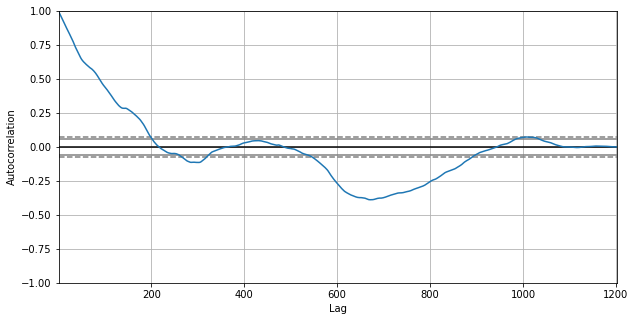
    


```python
pd.plotting.autocorrelation_plot(df_9726["Target"])
```


    <AxesSubplot:xlabel='Lag', ylabel='Autocorrelation'>


    
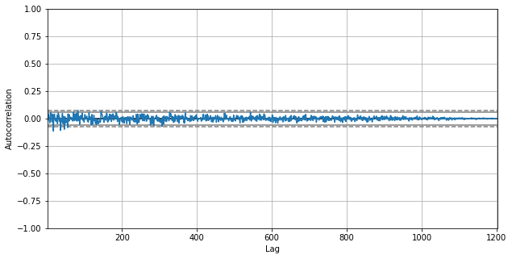
    


It certainly look like we are dealing with a random walk, as there are no indications of any autocorrelation for any lag.

Basically our LSTM found nothing of any real value to model and thus took the average value, along with a slight slope; we would have been just as well off with an extremely simplistic model of the form

C
l
o
s
e
t
∝
C
l
o
s
e
(
t
−
1
)

Close Price shows autocorrelation but stock return not. Therefore, the target variable itself will not give us much info about future stock movements... At this point the original idea of using a LSTM model was discarded at it was proceed to continue with the feature engineering.

### Feature Engineering

**From adjusted prices (individual)**
- Price changes
- Moving average
- Exponential moving average
- Volatility
- One hot encoding
- Standarization?

**Price changes**


```python
period = [5,10,21,33]
```


```python
for i in period:
    df_9726[f"pct{i}"] = df_9726["AdjustedClose"].pct_change(i)
display(df_9726.head(5))
```


<div>
<style scoped>
    .dataframe tbody tr th:only-of-type {
        vertical-align: middle;
    }

    .dataframe tbody tr th {
        vertical-align: top;
    }

    .dataframe thead th {
        text-align: right;
    }
</style>
<table border="1" class="dataframe">
  <thead>
    <tr style="text-align: right;">
      <th></th>
      <th>RowId</th>
      <th>Date</th>
      <th>SecuritiesCode</th>
      <th>Volume</th>
      <th>ExpectedDividend</th>
      <th>SupervisionFlag</th>
      <th>Target</th>
      <th>Name</th>
      <th>Section/Products</th>
      <th>NewMarketSegment</th>
      <th>33SectorCode</th>
      <th>33SectorName</th>
      <th>17SectorCode</th>
      <th>17SectorName</th>
      <th>NewIndexSeriesSizeCode</th>
      <th>NewIndexSeriesSize</th>
      <th>IssuedShares</th>
      <th>MarketCapitalization</th>
      <th>CumulativeAdjustmentFactor</th>
      <th>AdjustedClose</th>
      <th>AdjustedOpen</th>
      <th>AdjustedHigh</th>
      <th>AdjustedLow</th>
      <th>pct5</th>
      <th>pct10</th>
      <th>pct21</th>
      <th>pct33</th>
    </tr>
  </thead>
  <tbody>
    <tr>
      <th>2245987</th>
      <td>20170104_9726</td>
      <td>2017-01-04</td>
      <td>9726</td>
      <td>472000</td>
      <td>NaN</td>
      <td>False</td>
      <td>0.013605</td>
      <td>KNT-CT Holdings Co.,Ltd.</td>
      <td>First Section (Domestic)</td>
      <td>Standard Market</td>
      <td>9050</td>
      <td>Services</td>
      <td>10</td>
      <td>IT &amp; SERVICES, OTHERS</td>
      <td>7</td>
      <td>TOPIX Small 2</td>
      <td>27331013.0</td>
      <td>3.799011e+10</td>
      <td>10.0</td>
      <td>1470.0</td>
      <td>1460.0</td>
      <td>1480.0</td>
      <td>1450.0</td>
      <td>NaN</td>
      <td>NaN</td>
      <td>NaN</td>
      <td>NaN</td>
    </tr>
    <tr>
      <th>2245988</th>
      <td>20170105_9726</td>
      <td>2017-01-05</td>
      <td>9726</td>
      <td>420000</td>
      <td>NaN</td>
      <td>False</td>
      <td>0.020134</td>
      <td>KNT-CT Holdings Co.,Ltd.</td>
      <td>First Section (Domestic)</td>
      <td>Standard Market</td>
      <td>9050</td>
      <td>Services</td>
      <td>10</td>
      <td>IT &amp; SERVICES, OTHERS</td>
      <td>7</td>
      <td>TOPIX Small 2</td>
      <td>27331013.0</td>
      <td>3.799011e+10</td>
      <td>10.0</td>
      <td>1470.0</td>
      <td>1480.0</td>
      <td>1490.0</td>
      <td>1470.0</td>
      <td>NaN</td>
      <td>NaN</td>
      <td>NaN</td>
      <td>NaN</td>
    </tr>
    <tr>
      <th>2245989</th>
      <td>20170106_9726</td>
      <td>2017-01-06</td>
      <td>9726</td>
      <td>462000</td>
      <td>NaN</td>
      <td>False</td>
      <td>-0.006579</td>
      <td>KNT-CT Holdings Co.,Ltd.</td>
      <td>First Section (Domestic)</td>
      <td>Standard Market</td>
      <td>9050</td>
      <td>Services</td>
      <td>10</td>
      <td>IT &amp; SERVICES, OTHERS</td>
      <td>7</td>
      <td>TOPIX Small 2</td>
      <td>27331013.0</td>
      <td>3.799011e+10</td>
      <td>10.0</td>
      <td>1490.0</td>
      <td>1470.0</td>
      <td>1490.0</td>
      <td>1470.0</td>
      <td>NaN</td>
      <td>NaN</td>
      <td>NaN</td>
      <td>NaN</td>
    </tr>
    <tr>
      <th>2245990</th>
      <td>20170110_9726</td>
      <td>2017-01-10</td>
      <td>9726</td>
      <td>1170000</td>
      <td>NaN</td>
      <td>False</td>
      <td>-0.006623</td>
      <td>KNT-CT Holdings Co.,Ltd.</td>
      <td>First Section (Domestic)</td>
      <td>Standard Market</td>
      <td>9050</td>
      <td>Services</td>
      <td>10</td>
      <td>IT &amp; SERVICES, OTHERS</td>
      <td>7</td>
      <td>TOPIX Small 2</td>
      <td>27331013.0</td>
      <td>3.799011e+10</td>
      <td>10.0</td>
      <td>1520.0</td>
      <td>1500.0</td>
      <td>1530.0</td>
      <td>1490.0</td>
      <td>NaN</td>
      <td>NaN</td>
      <td>NaN</td>
      <td>NaN</td>
    </tr>
    <tr>
      <th>2245991</th>
      <td>20170111_9726</td>
      <td>2017-01-11</td>
      <td>9726</td>
      <td>797000</td>
      <td>NaN</td>
      <td>False</td>
      <td>0.006667</td>
      <td>KNT-CT Holdings Co.,Ltd.</td>
      <td>First Section (Domestic)</td>
      <td>Standard Market</td>
      <td>9050</td>
      <td>Services</td>
      <td>10</td>
      <td>IT &amp; SERVICES, OTHERS</td>
      <td>7</td>
      <td>TOPIX Small 2</td>
      <td>27331013.0</td>
      <td>3.799011e+10</td>
      <td>10.0</td>
      <td>1510.0</td>
      <td>1530.0</td>
      <td>1530.0</td>
      <td>1490.0</td>
      <td>NaN</td>
      <td>NaN</td>
      <td>NaN</td>
      <td>NaN</td>
    </tr>
  </tbody>
</table>
</div>


**Simple Moving Average (SMA)**


```python
period_avg = [10,20,50,60]
```


```python
for i in period_avg:
    df_9726[f"SMA_{i}"] = df_9726['AdjustedClose'].rolling(window=i).mean()

display(df_9726.tail(5))
```


<div>
<style scoped>
    .dataframe tbody tr th:only-of-type {
        vertical-align: middle;
    }

    .dataframe tbody tr th {
        vertical-align: top;
    }

    .dataframe thead th {
        text-align: right;
    }
</style>
<table border="1" class="dataframe">
  <thead>
    <tr style="text-align: right;">
      <th></th>
      <th>RowId</th>
      <th>Date</th>
      <th>SecuritiesCode</th>
      <th>Volume</th>
      <th>ExpectedDividend</th>
      <th>SupervisionFlag</th>
      <th>Target</th>
      <th>Name</th>
      <th>Section/Products</th>
      <th>NewMarketSegment</th>
      <th>33SectorCode</th>
      <th>33SectorName</th>
      <th>17SectorCode</th>
      <th>17SectorName</th>
      <th>NewIndexSeriesSizeCode</th>
      <th>NewIndexSeriesSize</th>
      <th>IssuedShares</th>
      <th>MarketCapitalization</th>
      <th>CumulativeAdjustmentFactor</th>
      <th>AdjustedClose</th>
      <th>AdjustedOpen</th>
      <th>AdjustedHigh</th>
      <th>AdjustedLow</th>
      <th>pct5</th>
      <th>pct10</th>
      <th>pct21</th>
      <th>pct33</th>
      <th>SMA_10</th>
      <th>SMA_20</th>
      <th>SMA_50</th>
      <th>SMA_60</th>
    </tr>
  </thead>
  <tbody>
    <tr>
      <th>2247184</th>
      <td>20211129_9726</td>
      <td>2021-11-29</td>
      <td>9726</td>
      <td>220200</td>
      <td>NaN</td>
      <td>False</td>
      <td>-0.002833</td>
      <td>KNT-CT Holdings Co.,Ltd.</td>
      <td>First Section (Domestic)</td>
      <td>Standard Market</td>
      <td>9050</td>
      <td>Services</td>
      <td>10</td>
      <td>IT &amp; SERVICES, OTHERS</td>
      <td>7</td>
      <td>TOPIX Small 2</td>
      <td>27331013.0</td>
      <td>3.799011e+10</td>
      <td>1.0</td>
      <td>1405.0</td>
      <td>1447.0</td>
      <td>1473.0</td>
      <td>1403.0</td>
      <td>-0.155141</td>
      <td>-0.204417</td>
      <td>-0.139093</td>
      <td>-0.199430</td>
      <td>1653.9</td>
      <td>1694.80</td>
      <td>1671.82</td>
      <td>1623.783333</td>
    </tr>
    <tr>
      <th>2247185</th>
      <td>20211130_9726</td>
      <td>2021-11-30</td>
      <td>9726</td>
      <td>146700</td>
      <td>NaN</td>
      <td>False</td>
      <td>-0.086648</td>
      <td>KNT-CT Holdings Co.,Ltd.</td>
      <td>First Section (Domestic)</td>
      <td>Standard Market</td>
      <td>9050</td>
      <td>Services</td>
      <td>10</td>
      <td>IT &amp; SERVICES, OTHERS</td>
      <td>7</td>
      <td>TOPIX Small 2</td>
      <td>27331013.0</td>
      <td>3.799011e+10</td>
      <td>1.0</td>
      <td>1412.0</td>
      <td>1444.0</td>
      <td>1478.0</td>
      <td>1407.0</td>
      <td>-0.140596</td>
      <td>-0.207187</td>
      <td>-0.140596</td>
      <td>-0.182870</td>
      <td>1617.0</td>
      <td>1681.70</td>
      <td>1672.02</td>
      <td>1624.983333</td>
    </tr>
    <tr>
      <th>2247186</th>
      <td>20211201_9726</td>
      <td>2021-12-01</td>
      <td>9726</td>
      <td>77400</td>
      <td>NaN</td>
      <td>False</td>
      <td>0.095645</td>
      <td>KNT-CT Holdings Co.,Ltd.</td>
      <td>First Section (Domestic)</td>
      <td>Standard Market</td>
      <td>9050</td>
      <td>Services</td>
      <td>10</td>
      <td>IT &amp; SERVICES, OTHERS</td>
      <td>7</td>
      <td>TOPIX Small 2</td>
      <td>27331013.0</td>
      <td>3.799011e+10</td>
      <td>1.0</td>
      <td>1408.0</td>
      <td>1401.0</td>
      <td>1429.0</td>
      <td>1382.0</td>
      <td>-0.119450</td>
      <td>-0.227647</td>
      <td>-0.158901</td>
      <td>-0.168831</td>
      <td>1575.5</td>
      <td>1668.95</td>
      <td>1672.06</td>
      <td>1626.200000</td>
    </tr>
    <tr>
      <th>2247187</th>
      <td>20211202_9726</td>
      <td>2021-12-02</td>
      <td>9726</td>
      <td>273800</td>
      <td>NaN</td>
      <td>False</td>
      <td>0.022001</td>
      <td>KNT-CT Holdings Co.,Ltd.</td>
      <td>First Section (Domestic)</td>
      <td>Standard Market</td>
      <td>9050</td>
      <td>Services</td>
      <td>10</td>
      <td>IT &amp; SERVICES, OTHERS</td>
      <td>7</td>
      <td>TOPIX Small 2</td>
      <td>27331013.0</td>
      <td>3.799011e+10</td>
      <td>1.0</td>
      <td>1286.0</td>
      <td>1228.0</td>
      <td>1318.0</td>
      <td>1228.0</td>
      <td>-0.191703</td>
      <td>-0.273446</td>
      <td>-0.226699</td>
      <td>-0.233154</td>
      <td>1527.1</td>
      <td>1645.90</td>
      <td>1670.62</td>
      <td>1625.366667</td>
    </tr>
    <tr>
      <th>2247188</th>
      <td>20211203_9726</td>
      <td>2021-12-03</td>
      <td>9726</td>
      <td>141500</td>
      <td>NaN</td>
      <td>False</td>
      <td>0.044444</td>
      <td>KNT-CT Holdings Co.,Ltd.</td>
      <td>First Section (Domestic)</td>
      <td>Standard Market</td>
      <td>9050</td>
      <td>Services</td>
      <td>10</td>
      <td>IT &amp; SERVICES, OTHERS</td>
      <td>7</td>
      <td>TOPIX Small 2</td>
      <td>27331013.0</td>
      <td>3.799011e+10</td>
      <td>1.0</td>
      <td>1409.0</td>
      <td>1316.0</td>
      <td>1409.0</td>
      <td>1316.0</td>
      <td>-0.070580</td>
      <td>-0.193936</td>
      <td>-0.193475</td>
      <td>-0.155782</td>
      <td>1493.2</td>
      <td>1629.85</td>
      <td>1670.62</td>
      <td>1626.033333</td>
    </tr>
  </tbody>
</table>
</div>


**Exponential Moving Average (EMA)**


```python
for i in period_avg:
    df_9726[f"EMA_{i}"] = df_9726['AdjustedClose'].ewm(span=i,adjust=False).mean()

display(df_9726.tail(5))
```


<div>
<style scoped>
    .dataframe tbody tr th:only-of-type {
        vertical-align: middle;
    }

    .dataframe tbody tr th {
        vertical-align: top;
    }

    .dataframe thead th {
        text-align: right;
    }
</style>
<table border="1" class="dataframe">
  <thead>
    <tr style="text-align: right;">
      <th></th>
      <th>RowId</th>
      <th>Date</th>
      <th>SecuritiesCode</th>
      <th>Volume</th>
      <th>ExpectedDividend</th>
      <th>SupervisionFlag</th>
      <th>Target</th>
      <th>Name</th>
      <th>Section/Products</th>
      <th>NewMarketSegment</th>
      <th>33SectorCode</th>
      <th>33SectorName</th>
      <th>17SectorCode</th>
      <th>17SectorName</th>
      <th>NewIndexSeriesSizeCode</th>
      <th>NewIndexSeriesSize</th>
      <th>IssuedShares</th>
      <th>MarketCapitalization</th>
      <th>CumulativeAdjustmentFactor</th>
      <th>AdjustedClose</th>
      <th>AdjustedOpen</th>
      <th>AdjustedHigh</th>
      <th>AdjustedLow</th>
      <th>pct5</th>
      <th>pct10</th>
      <th>pct21</th>
      <th>pct33</th>
      <th>SMA_10</th>
      <th>SMA_20</th>
      <th>SMA_50</th>
      <th>SMA_60</th>
      <th>EMA_10</th>
      <th>EMA_20</th>
      <th>EMA_50</th>
      <th>EMA_60</th>
    </tr>
  </thead>
  <tbody>
    <tr>
      <th>2247184</th>
      <td>20211129_9726</td>
      <td>2021-11-29</td>
      <td>9726</td>
      <td>220200</td>
      <td>NaN</td>
      <td>False</td>
      <td>-0.002833</td>
      <td>KNT-CT Holdings Co.,Ltd.</td>
      <td>First Section (Domestic)</td>
      <td>Standard Market</td>
      <td>9050</td>
      <td>Services</td>
      <td>10</td>
      <td>IT &amp; SERVICES, OTHERS</td>
      <td>7</td>
      <td>TOPIX Small 2</td>
      <td>27331013.0</td>
      <td>3.799011e+10</td>
      <td>1.0</td>
      <td>1405.0</td>
      <td>1447.0</td>
      <td>1473.0</td>
      <td>1403.0</td>
      <td>-0.155141</td>
      <td>-0.204417</td>
      <td>-0.139093</td>
      <td>-0.199430</td>
      <td>1653.9</td>
      <td>1694.80</td>
      <td>1671.82</td>
      <td>1623.783333</td>
      <td>1606.162071</td>
      <td>1652.448618</td>
      <td>1627.698192</td>
      <td>1607.672109</td>
    </tr>
    <tr>
      <th>2247185</th>
      <td>20211130_9726</td>
      <td>2021-11-30</td>
      <td>9726</td>
      <td>146700</td>
      <td>NaN</td>
      <td>False</td>
      <td>-0.086648</td>
      <td>KNT-CT Holdings Co.,Ltd.</td>
      <td>First Section (Domestic)</td>
      <td>Standard Market</td>
      <td>9050</td>
      <td>Services</td>
      <td>10</td>
      <td>IT &amp; SERVICES, OTHERS</td>
      <td>7</td>
      <td>TOPIX Small 2</td>
      <td>27331013.0</td>
      <td>3.799011e+10</td>
      <td>1.0</td>
      <td>1412.0</td>
      <td>1444.0</td>
      <td>1478.0</td>
      <td>1407.0</td>
      <td>-0.140596</td>
      <td>-0.207187</td>
      <td>-0.140596</td>
      <td>-0.182870</td>
      <td>1617.0</td>
      <td>1681.70</td>
      <td>1672.02</td>
      <td>1624.983333</td>
      <td>1570.859876</td>
      <td>1629.548750</td>
      <td>1619.239439</td>
      <td>1601.256630</td>
    </tr>
    <tr>
      <th>2247186</th>
      <td>20211201_9726</td>
      <td>2021-12-01</td>
      <td>9726</td>
      <td>77400</td>
      <td>NaN</td>
      <td>False</td>
      <td>0.095645</td>
      <td>KNT-CT Holdings Co.,Ltd.</td>
      <td>First Section (Domestic)</td>
      <td>Standard Market</td>
      <td>9050</td>
      <td>Services</td>
      <td>10</td>
      <td>IT &amp; SERVICES, OTHERS</td>
      <td>7</td>
      <td>TOPIX Small 2</td>
      <td>27331013.0</td>
      <td>3.799011e+10</td>
      <td>1.0</td>
      <td>1408.0</td>
      <td>1401.0</td>
      <td>1429.0</td>
      <td>1382.0</td>
      <td>-0.119450</td>
      <td>-0.227647</td>
      <td>-0.158901</td>
      <td>-0.168831</td>
      <td>1575.5</td>
      <td>1668.95</td>
      <td>1672.06</td>
      <td>1626.200000</td>
      <td>1541.248989</td>
      <td>1608.448869</td>
      <td>1610.955539</td>
      <td>1594.920347</td>
    </tr>
    <tr>
      <th>2247187</th>
      <td>20211202_9726</td>
      <td>2021-12-02</td>
      <td>9726</td>
      <td>273800</td>
      <td>NaN</td>
      <td>False</td>
      <td>0.022001</td>
      <td>KNT-CT Holdings Co.,Ltd.</td>
      <td>First Section (Domestic)</td>
      <td>Standard Market</td>
      <td>9050</td>
      <td>Services</td>
      <td>10</td>
      <td>IT &amp; SERVICES, OTHERS</td>
      <td>7</td>
      <td>TOPIX Small 2</td>
      <td>27331013.0</td>
      <td>3.799011e+10</td>
      <td>1.0</td>
      <td>1286.0</td>
      <td>1228.0</td>
      <td>1318.0</td>
      <td>1228.0</td>
      <td>-0.191703</td>
      <td>-0.273446</td>
      <td>-0.226699</td>
      <td>-0.233154</td>
      <td>1527.1</td>
      <td>1645.90</td>
      <td>1670.62</td>
      <td>1625.366667</td>
      <td>1494.840082</td>
      <td>1577.739453</td>
      <td>1598.212185</td>
      <td>1584.791812</td>
    </tr>
    <tr>
      <th>2247188</th>
      <td>20211203_9726</td>
      <td>2021-12-03</td>
      <td>9726</td>
      <td>141500</td>
      <td>NaN</td>
      <td>False</td>
      <td>0.044444</td>
      <td>KNT-CT Holdings Co.,Ltd.</td>
      <td>First Section (Domestic)</td>
      <td>Standard Market</td>
      <td>9050</td>
      <td>Services</td>
      <td>10</td>
      <td>IT &amp; SERVICES, OTHERS</td>
      <td>7</td>
      <td>TOPIX Small 2</td>
      <td>27331013.0</td>
      <td>3.799011e+10</td>
      <td>1.0</td>
      <td>1409.0</td>
      <td>1316.0</td>
      <td>1409.0</td>
      <td>1316.0</td>
      <td>-0.070580</td>
      <td>-0.193936</td>
      <td>-0.193475</td>
      <td>-0.155782</td>
      <td>1493.2</td>
      <td>1629.85</td>
      <td>1670.62</td>
      <td>1626.033333</td>
      <td>1479.232795</td>
      <td>1561.669029</td>
      <td>1590.792099</td>
      <td>1579.028146</td>
    </tr>
  </tbody>
</table>
</div>


Plotting the new features


```python
col_avg = ["AdjustedClose","SMA_10","SMA_20","SMA_50","SMA_60","EMA_10","EMA_20","EMA_20","EMA_60"]
```


```python
df_9726Avg = df_9726[col_avg]
df_9726Avg.head()
```


<div>
<style scoped>
    .dataframe tbody tr th:only-of-type {
        vertical-align: middle;
    }

    .dataframe tbody tr th {
        vertical-align: top;
    }

    .dataframe thead th {
        text-align: right;
    }
</style>
<table border="1" class="dataframe">
  <thead>
    <tr style="text-align: right;">
      <th></th>
      <th>AdjustedClose</th>
      <th>SMA_10</th>
      <th>SMA_20</th>
      <th>SMA_50</th>
      <th>SMA_60</th>
      <th>EMA_10</th>
      <th>EMA_20</th>
      <th>EMA_20</th>
      <th>EMA_60</th>
    </tr>
  </thead>
  <tbody>
    <tr>
      <th>2245987</th>
      <td>1470.0</td>
      <td>NaN</td>
      <td>NaN</td>
      <td>NaN</td>
      <td>NaN</td>
      <td>1470.000000</td>
      <td>1470.000000</td>
      <td>1470.000000</td>
      <td>1470.000000</td>
    </tr>
    <tr>
      <th>2245988</th>
      <td>1470.0</td>
      <td>NaN</td>
      <td>NaN</td>
      <td>NaN</td>
      <td>NaN</td>
      <td>1470.000000</td>
      <td>1470.000000</td>
      <td>1470.000000</td>
      <td>1470.000000</td>
    </tr>
    <tr>
      <th>2245989</th>
      <td>1490.0</td>
      <td>NaN</td>
      <td>NaN</td>
      <td>NaN</td>
      <td>NaN</td>
      <td>1473.636364</td>
      <td>1471.904762</td>
      <td>1471.904762</td>
      <td>1470.655738</td>
    </tr>
    <tr>
      <th>2245990</th>
      <td>1520.0</td>
      <td>NaN</td>
      <td>NaN</td>
      <td>NaN</td>
      <td>NaN</td>
      <td>1482.066116</td>
      <td>1476.485261</td>
      <td>1476.485261</td>
      <td>1472.273582</td>
    </tr>
    <tr>
      <th>2245991</th>
      <td>1510.0</td>
      <td>NaN</td>
      <td>NaN</td>
      <td>NaN</td>
      <td>NaN</td>
      <td>1487.145004</td>
      <td>1479.677141</td>
      <td>1479.677141</td>
      <td>1473.510514</td>
    </tr>
  </tbody>
</table>
</div>


```python
plt.rcParams["figure.figsize"] = (30,10)
df_9726Avg.plot(title = "Avg analysis for Security Code")
```


    <AxesSubplot:title={'center':'Avg analysis for Security Code'}>


    
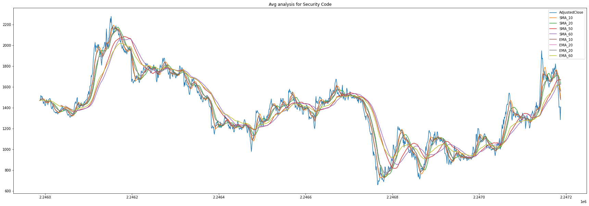
    


```python
col_SMA = ["AdjustedClose","SMA_10","SMA_20","SMA_50","SMA_60"]
```


```python
df_9726SMA = df_9726[col_SMA]
df_9726SMA.head()
```


<div>
<style scoped>
    .dataframe tbody tr th:only-of-type {
        vertical-align: middle;
    }

    .dataframe tbody tr th {
        vertical-align: top;
    }

    .dataframe thead th {
        text-align: right;
    }
</style>
<table border="1" class="dataframe">
  <thead>
    <tr style="text-align: right;">
      <th></th>
      <th>AdjustedClose</th>
      <th>SMA_10</th>
      <th>SMA_20</th>
      <th>SMA_50</th>
      <th>SMA_60</th>
    </tr>
  </thead>
  <tbody>
    <tr>
      <th>2245987</th>
      <td>1470.0</td>
      <td>NaN</td>
      <td>NaN</td>
      <td>NaN</td>
      <td>NaN</td>
    </tr>
    <tr>
      <th>2245988</th>
      <td>1470.0</td>
      <td>NaN</td>
      <td>NaN</td>
      <td>NaN</td>
      <td>NaN</td>
    </tr>
    <tr>
      <th>2245989</th>
      <td>1490.0</td>
      <td>NaN</td>
      <td>NaN</td>
      <td>NaN</td>
      <td>NaN</td>
    </tr>
    <tr>
      <th>2245990</th>
      <td>1520.0</td>
      <td>NaN</td>
      <td>NaN</td>
      <td>NaN</td>
      <td>NaN</td>
    </tr>
    <tr>
      <th>2245991</th>
      <td>1510.0</td>
      <td>NaN</td>
      <td>NaN</td>
      <td>NaN</td>
      <td>NaN</td>
    </tr>
  </tbody>
</table>
</div>


```python
df_9726SMA.plot(title = "Avg analysis for Security Code")
```


    <AxesSubplot:title={'center':'Avg analysis for Security Code'}>


    
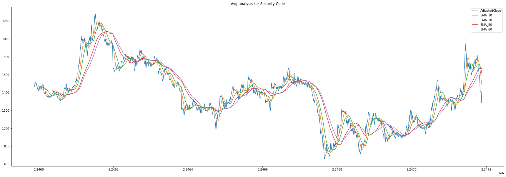
    


```python
col_EMA = ["AdjustedClose","EMA_10","EMA_20","EMA_50","EMA_60"]
```


```python
df_9726EMA = df_9726[col_EMA]
df_9726EMA.head()
```


<div>
<style scoped>
    .dataframe tbody tr th:only-of-type {
        vertical-align: middle;
    }

    .dataframe tbody tr th {
        vertical-align: top;
    }

    .dataframe thead th {
        text-align: right;
    }
</style>
<table border="1" class="dataframe">
  <thead>
    <tr style="text-align: right;">
      <th></th>
      <th>AdjustedClose</th>
      <th>EMA_10</th>
      <th>EMA_20</th>
      <th>EMA_50</th>
      <th>EMA_60</th>
    </tr>
  </thead>
  <tbody>
    <tr>
      <th>2245987</th>
      <td>1470.0</td>
      <td>1470.000000</td>
      <td>1470.000000</td>
      <td>1470.000000</td>
      <td>1470.000000</td>
    </tr>
    <tr>
      <th>2245988</th>
      <td>1470.0</td>
      <td>1470.000000</td>
      <td>1470.000000</td>
      <td>1470.000000</td>
      <td>1470.000000</td>
    </tr>
    <tr>
      <th>2245989</th>
      <td>1490.0</td>
      <td>1473.636364</td>
      <td>1471.904762</td>
      <td>1470.784314</td>
      <td>1470.655738</td>
    </tr>
    <tr>
      <th>2245990</th>
      <td>1520.0</td>
      <td>1482.066116</td>
      <td>1476.485261</td>
      <td>1472.714341</td>
      <td>1472.273582</td>
    </tr>
    <tr>
      <th>2245991</th>
      <td>1510.0</td>
      <td>1487.145004</td>
      <td>1479.677141</td>
      <td>1474.176523</td>
      <td>1473.510514</td>
    </tr>
  </tbody>
</table>
</div>


```python
df_9726EMA.plot(title = "Avg analysis for Security Code")
```


    <AxesSubplot:title={'center':'Avg analysis for Security Code'}>


    
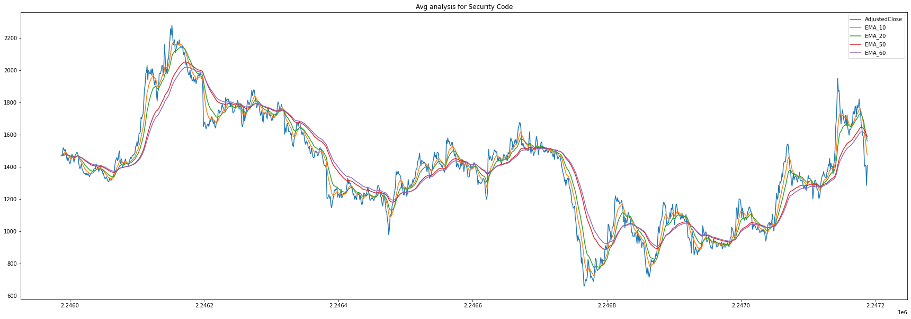
    


```python
df_prices_feat = generate_feature(df_prices_adj)
df_prices_feat.drop(["RowId","ExpectedDividend","Name","Section/Products","SupervisionFlag","NewMarketSegment","33SectorCode","17SectorCode","NewIndexSeriesSizeCode","NewIndexSeriesSize","IssuedShares","MarketCapitalization"],axis=1,inplace=True)
df_prices_feat.head(5)
```


<div>
<style scoped>
    .dataframe tbody tr th:only-of-type {
        vertical-align: middle;
    }

    .dataframe tbody tr th {
        vertical-align: top;
    }

    .dataframe thead th {
        text-align: right;
    }
</style>
<table border="1" class="dataframe">
  <thead>
    <tr style="text-align: right;">
      <th></th>
      <th>Date</th>
      <th>SecuritiesCode</th>
      <th>Volume</th>
      <th>Target</th>
      <th>33SectorName</th>
      <th>17SectorName</th>
      <th>CumulativeAdjustmentFactor</th>
      <th>AdjustedClose</th>
      <th>AdjustedOpen</th>
      <th>AdjustedHigh</th>
      <th>AdjustedLow</th>
      <th>pct5</th>
      <th>Volatility_5</th>
      <th>pct10</th>
      <th>Volatility_10</th>
      <th>pct21</th>
      <th>Volatility_21</th>
      <th>pct33</th>
      <th>Volatility_33</th>
      <th>SMA_10</th>
      <th>EMA_10</th>
      <th>SMA_20</th>
      <th>EMA_20</th>
      <th>SMA_50</th>
      <th>EMA_50</th>
      <th>SMA_60</th>
      <th>EMA_60</th>
    </tr>
  </thead>
  <tbody>
    <tr>
      <th>0</th>
      <td>2017-01-04</td>
      <td>1301</td>
      <td>31400</td>
      <td>0.000730</td>
      <td>Fishery, Agriculture and Forestry</td>
      <td>FOODS</td>
      <td>1.0</td>
      <td>2742.0</td>
      <td>2734.0</td>
      <td>2755.0</td>
      <td>2730.0</td>
      <td>0.004028</td>
      <td>0.002969</td>
      <td>0.015932</td>
      <td>0.003732</td>
      <td>0.008088</td>
      <td>0.004796</td>
      <td>-0.048577</td>
      <td>0.005294</td>
      <td>2725.0</td>
      <td>2733.158949</td>
      <td>2725.75</td>
      <td>2741.853831</td>
      <td>2847.54</td>
      <td>2815.764772</td>
      <td>2891.566667</td>
      <td>2838.160046</td>
    </tr>
    <tr>
      <th>1</th>
      <td>2017-01-05</td>
      <td>1301</td>
      <td>17900</td>
      <td>0.002920</td>
      <td>Fishery, Agriculture and Forestry</td>
      <td>FOODS</td>
      <td>1.0</td>
      <td>2738.0</td>
      <td>2743.0</td>
      <td>2747.0</td>
      <td>2735.0</td>
      <td>0.005878</td>
      <td>0.003178</td>
      <td>0.000365</td>
      <td>0.006179</td>
      <td>0.004771</td>
      <td>0.004813</td>
      <td>-0.064571</td>
      <td>0.005795</td>
      <td>2720.7</td>
      <td>2731.194271</td>
      <td>2725.10</td>
      <td>2741.838444</td>
      <td>2855.90</td>
      <td>2818.775579</td>
      <td>2894.800000</td>
      <td>2841.419708</td>
    </tr>
    <tr>
      <th>2</th>
      <td>2017-01-06</td>
      <td>1301</td>
      <td>19900</td>
      <td>-0.001092</td>
      <td>Fishery, Agriculture and Forestry</td>
      <td>FOODS</td>
      <td>1.0</td>
      <td>2740.0</td>
      <td>2734.0</td>
      <td>2744.0</td>
      <td>2720.0</td>
      <td>0.013314</td>
      <td>0.003734</td>
      <td>0.007353</td>
      <td>0.006468</td>
      <td>0.003295</td>
      <td>0.004838</td>
      <td>-0.064208</td>
      <td>0.005799</td>
      <td>2720.6</td>
      <td>2729.681887</td>
      <td>2724.20</td>
      <td>2742.242491</td>
      <td>2865.04</td>
      <td>2822.072541</td>
      <td>2899.333333</td>
      <td>2844.925461</td>
    </tr>
    <tr>
      <th>3</th>
      <td>2017-01-10</td>
      <td>1301</td>
      <td>24200</td>
      <td>-0.005100</td>
      <td>Fishery, Agriculture and Forestry</td>
      <td>FOODS</td>
      <td>1.0</td>
      <td>2748.0</td>
      <td>2745.0</td>
      <td>2754.0</td>
      <td>2735.0</td>
      <td>0.023083</td>
      <td>0.002383</td>
      <td>0.007701</td>
      <td>0.006448</td>
      <td>0.004019</td>
      <td>0.004818</td>
      <td>-0.066893</td>
      <td>0.005834</td>
      <td>2718.6</td>
      <td>2727.388973</td>
      <td>2723.45</td>
      <td>2742.478543</td>
      <td>2873.94</td>
      <td>2825.422441</td>
      <td>2903.833333</td>
      <td>2848.482256</td>
    </tr>
    <tr>
      <th>4</th>
      <td>2017-01-11</td>
      <td>1301</td>
      <td>9300</td>
      <td>-0.003295</td>
      <td>Fishery, Agriculture and Forestry</td>
      <td>FOODS</td>
      <td>1.0</td>
      <td>2745.0</td>
      <td>2748.0</td>
      <td>2752.0</td>
      <td>2737.0</td>
      <td>0.018931</td>
      <td>0.004005</td>
      <td>0.005126</td>
      <td>0.006484</td>
      <td>0.002923</td>
      <td>0.004813</td>
      <td>-0.068228</td>
      <td>0.005815</td>
      <td>2716.5</td>
      <td>2722.808745</td>
      <td>2722.60</td>
      <td>2741.897337</td>
      <td>2881.98</td>
      <td>2828.582540</td>
      <td>2908.116667</td>
      <td>2851.888435</td>
    </tr>
  </tbody>
</table>
</div>


```python
df_prices_feat.info()
```

    <class 'pandas.core.frame.DataFrame'>
    RangeIndex: 2332531 entries, 0 to 2332530
    Data columns (total 27 columns):
     #   Column                      Dtype         
    ---  ------                      -----         
     0   Date                        datetime64[ns]
     1   SecuritiesCode              int64         
     2   Volume                      int64         
     3   Target                      float64       
     4   33SectorName                object        
     5   17SectorName                object        
     6   CumulativeAdjustmentFactor  float64       
     7   AdjustedClose               float64       
     8   AdjustedOpen                float64       
     9   AdjustedHigh                float64       
     10  AdjustedLow                 float64       
     11  pct5                        float64       
     12  Volatility_5                float64       
     13  pct10                       float64       
     14  Volatility_10               float64       
     15  pct21                       float64       
     16  Volatility_21               float64       
     17  pct33                       float64       
     18  Volatility_33               float64       
     19  SMA_10                      float64       
     20  EMA_10                      float64       
     21  SMA_20                      float64       
     22  EMA_20                      float64       
     23  SMA_50                      float64       
     24  EMA_50                      float64       
     25  SMA_60                      float64       
     26  EMA_60                      float64       
    dtypes: datetime64[ns](1), float64(22), int64(2), object(2)
    memory usage: 480.5+ MB
    


```python
del df_prices_adj
del df_9726
del df_9726EMA
del df_9726SMA
del options_df
del financials_df
del trades_df
del financials_info
del options_info
del stock_prices_info
del trades_info
del stocks_info
gc.collect()
```


    62


```python
del target_sector
del target_section
gc.collect()
```


    21


**One Hot encoding Stock Catagorical data**
- SectorCode33
- Section


```python
cat_encoder = OneHotEncoder(handle_unknown='ignore')
train_set_cat_coded = cat_encoder.fit_transform(df_prices_feat[["33SectorName","17SectorName"]])
train_set_cat_coded.shape
```


    (2332531, 50)


```python
ls=[]
for i in cat_encoder.categories_:
    for j in i:
        ls.append(j)
```


```python
train_set_cat_coded_ready = pd.DataFrame(train_set_cat_coded.todense(),columns = ls,index=df_prices_feat.index)
train_set_cat_coded_ready
```


<div>
<style scoped>
    .dataframe tbody tr th:only-of-type {
        vertical-align: middle;
    }

    .dataframe tbody tr th {
        vertical-align: top;
    }

    .dataframe thead th {
        text-align: right;
    }
</style>
<table border="1" class="dataframe">
  <thead>
    <tr style="text-align: right;">
      <th></th>
      <th>Air Transportation</th>
      <th>Banks</th>
      <th>Chemicals</th>
      <th>Construction</th>
      <th>Electric Appliances</th>
      <th>Electric Power and Gas</th>
      <th>Fishery, Agriculture and Forestry</th>
      <th>Foods</th>
      <th>Glass and Ceramics Products</th>
      <th>Information &amp; Communication</th>
      <th>Insurance</th>
      <th>Iron and Steel</th>
      <th>Land Transportation</th>
      <th>Machinery</th>
      <th>Marine Transportation</th>
      <th>Metal Products</th>
      <th>Mining</th>
      <th>Nonferrous Metals</th>
      <th>Oil and Coal Products</th>
      <th>Other Financing Business</th>
      <th>Other Products</th>
      <th>Pharmaceutical</th>
      <th>Precision Instruments</th>
      <th>Pulp and Paper</th>
      <th>Real Estate</th>
      <th>Retail Trade</th>
      <th>Rubber Products</th>
      <th>Securities and Commodities Futures</th>
      <th>Services</th>
      <th>Textiles and Apparels</th>
      <th>Transportation Equipment</th>
      <th>Warehousing and Harbor Transportation Service</th>
      <th>Wholesale Trade</th>
      <th>AUTOMOBILES &amp; TRANSPORTATION EQUIPMENT</th>
      <th>BANKS</th>
      <th>COMMERCIAL &amp; WHOLESALE TRADE</th>
      <th>CONSTRUCTION &amp; MATERIALS</th>
      <th>ELECTRIC APPLIANCES &amp; PRECISION INSTRUMENTS</th>
      <th>ELECTRIC POWER &amp; GAS</th>
      <th>ENERGY RESOURCES</th>
      <th>FINANCIALS （EX BANKS）</th>
      <th>FOODS</th>
      <th>IT &amp; SERVICES, OTHERS</th>
      <th>MACHINERY</th>
      <th>PHARMACEUTICAL</th>
      <th>RAW MATERIALS &amp; CHEMICALS</th>
      <th>REAL ESTATE</th>
      <th>RETAIL TRADE</th>
      <th>STEEL &amp; NONFERROUS METALS</th>
      <th>TRANSPORTATION &amp; LOGISTICS</th>
    </tr>
  </thead>
  <tbody>
    <tr>
      <th>0</th>
      <td>0.0</td>
      <td>0.0</td>
      <td>0.0</td>
      <td>0.0</td>
      <td>0.0</td>
      <td>0.0</td>
      <td>1.0</td>
      <td>0.0</td>
      <td>0.0</td>
      <td>0.0</td>
      <td>0.0</td>
      <td>0.0</td>
      <td>0.0</td>
      <td>0.0</td>
      <td>0.0</td>
      <td>0.0</td>
      <td>0.0</td>
      <td>0.0</td>
      <td>0.0</td>
      <td>0.0</td>
      <td>0.0</td>
      <td>0.0</td>
      <td>0.0</td>
      <td>0.0</td>
      <td>0.0</td>
      <td>0.0</td>
      <td>0.0</td>
      <td>0.0</td>
      <td>0.0</td>
      <td>0.0</td>
      <td>0.0</td>
      <td>0.0</td>
      <td>0.0</td>
      <td>0.0</td>
      <td>0.0</td>
      <td>0.0</td>
      <td>0.0</td>
      <td>0.0</td>
      <td>0.0</td>
      <td>0.0</td>
      <td>0.0</td>
      <td>1.0</td>
      <td>0.0</td>
      <td>0.0</td>
      <td>0.0</td>
      <td>0.0</td>
      <td>0.0</td>
      <td>0.0</td>
      <td>0.0</td>
      <td>0.0</td>
    </tr>
    <tr>
      <th>1</th>
      <td>0.0</td>
      <td>0.0</td>
      <td>0.0</td>
      <td>0.0</td>
      <td>0.0</td>
      <td>0.0</td>
      <td>1.0</td>
      <td>0.0</td>
      <td>0.0</td>
      <td>0.0</td>
      <td>0.0</td>
      <td>0.0</td>
      <td>0.0</td>
      <td>0.0</td>
      <td>0.0</td>
      <td>0.0</td>
      <td>0.0</td>
      <td>0.0</td>
      <td>0.0</td>
      <td>0.0</td>
      <td>0.0</td>
      <td>0.0</td>
      <td>0.0</td>
      <td>0.0</td>
      <td>0.0</td>
      <td>0.0</td>
      <td>0.0</td>
      <td>0.0</td>
      <td>0.0</td>
      <td>0.0</td>
      <td>0.0</td>
      <td>0.0</td>
      <td>0.0</td>
      <td>0.0</td>
      <td>0.0</td>
      <td>0.0</td>
      <td>0.0</td>
      <td>0.0</td>
      <td>0.0</td>
      <td>0.0</td>
      <td>0.0</td>
      <td>1.0</td>
      <td>0.0</td>
      <td>0.0</td>
      <td>0.0</td>
      <td>0.0</td>
      <td>0.0</td>
      <td>0.0</td>
      <td>0.0</td>
      <td>0.0</td>
    </tr>
    <tr>
      <th>2</th>
      <td>0.0</td>
      <td>0.0</td>
      <td>0.0</td>
      <td>0.0</td>
      <td>0.0</td>
      <td>0.0</td>
      <td>1.0</td>
      <td>0.0</td>
      <td>0.0</td>
      <td>0.0</td>
      <td>0.0</td>
      <td>0.0</td>
      <td>0.0</td>
      <td>0.0</td>
      <td>0.0</td>
      <td>0.0</td>
      <td>0.0</td>
      <td>0.0</td>
      <td>0.0</td>
      <td>0.0</td>
      <td>0.0</td>
      <td>0.0</td>
      <td>0.0</td>
      <td>0.0</td>
      <td>0.0</td>
      <td>0.0</td>
      <td>0.0</td>
      <td>0.0</td>
      <td>0.0</td>
      <td>0.0</td>
      <td>0.0</td>
      <td>0.0</td>
      <td>0.0</td>
      <td>0.0</td>
      <td>0.0</td>
      <td>0.0</td>
      <td>0.0</td>
      <td>0.0</td>
      <td>0.0</td>
      <td>0.0</td>
      <td>0.0</td>
      <td>1.0</td>
      <td>0.0</td>
      <td>0.0</td>
      <td>0.0</td>
      <td>0.0</td>
      <td>0.0</td>
      <td>0.0</td>
      <td>0.0</td>
      <td>0.0</td>
    </tr>
    <tr>
      <th>3</th>
      <td>0.0</td>
      <td>0.0</td>
      <td>0.0</td>
      <td>0.0</td>
      <td>0.0</td>
      <td>0.0</td>
      <td>1.0</td>
      <td>0.0</td>
      <td>0.0</td>
      <td>0.0</td>
      <td>0.0</td>
      <td>0.0</td>
      <td>0.0</td>
      <td>0.0</td>
      <td>0.0</td>
      <td>0.0</td>
      <td>0.0</td>
      <td>0.0</td>
      <td>0.0</td>
      <td>0.0</td>
      <td>0.0</td>
      <td>0.0</td>
      <td>0.0</td>
      <td>0.0</td>
      <td>0.0</td>
      <td>0.0</td>
      <td>0.0</td>
      <td>0.0</td>
      <td>0.0</td>
      <td>0.0</td>
      <td>0.0</td>
      <td>0.0</td>
      <td>0.0</td>
      <td>0.0</td>
      <td>0.0</td>
      <td>0.0</td>
      <td>0.0</td>
      <td>0.0</td>
      <td>0.0</td>
      <td>0.0</td>
      <td>0.0</td>
      <td>1.0</td>
      <td>0.0</td>
      <td>0.0</td>
      <td>0.0</td>
      <td>0.0</td>
      <td>0.0</td>
      <td>0.0</td>
      <td>0.0</td>
      <td>0.0</td>
    </tr>
    <tr>
      <th>4</th>
      <td>0.0</td>
      <td>0.0</td>
      <td>0.0</td>
      <td>0.0</td>
      <td>0.0</td>
      <td>0.0</td>
      <td>1.0</td>
      <td>0.0</td>
      <td>0.0</td>
      <td>0.0</td>
      <td>0.0</td>
      <td>0.0</td>
      <td>0.0</td>
      <td>0.0</td>
      <td>0.0</td>
      <td>0.0</td>
      <td>0.0</td>
      <td>0.0</td>
      <td>0.0</td>
      <td>0.0</td>
      <td>0.0</td>
      <td>0.0</td>
      <td>0.0</td>
      <td>0.0</td>
      <td>0.0</td>
      <td>0.0</td>
      <td>0.0</td>
      <td>0.0</td>
      <td>0.0</td>
      <td>0.0</td>
      <td>0.0</td>
      <td>0.0</td>
      <td>0.0</td>
      <td>0.0</td>
      <td>0.0</td>
      <td>0.0</td>
      <td>0.0</td>
      <td>0.0</td>
      <td>0.0</td>
      <td>0.0</td>
      <td>0.0</td>
      <td>1.0</td>
      <td>0.0</td>
      <td>0.0</td>
      <td>0.0</td>
      <td>0.0</td>
      <td>0.0</td>
      <td>0.0</td>
      <td>0.0</td>
      <td>0.0</td>
    </tr>
    <tr>
      <th>...</th>
      <td>...</td>
      <td>...</td>
      <td>...</td>
      <td>...</td>
      <td>...</td>
      <td>...</td>
      <td>...</td>
      <td>...</td>
      <td>...</td>
      <td>...</td>
      <td>...</td>
      <td>...</td>
      <td>...</td>
      <td>...</td>
      <td>...</td>
      <td>...</td>
      <td>...</td>
      <td>...</td>
      <td>...</td>
      <td>...</td>
      <td>...</td>
      <td>...</td>
      <td>...</td>
      <td>...</td>
      <td>...</td>
      <td>...</td>
      <td>...</td>
      <td>...</td>
      <td>...</td>
      <td>...</td>
      <td>...</td>
      <td>...</td>
      <td>...</td>
      <td>...</td>
      <td>...</td>
      <td>...</td>
      <td>...</td>
      <td>...</td>
      <td>...</td>
      <td>...</td>
      <td>...</td>
      <td>...</td>
      <td>...</td>
      <td>...</td>
      <td>...</td>
      <td>...</td>
      <td>...</td>
      <td>...</td>
      <td>...</td>
      <td>...</td>
    </tr>
    <tr>
      <th>2332526</th>
      <td>0.0</td>
      <td>0.0</td>
      <td>0.0</td>
      <td>0.0</td>
      <td>0.0</td>
      <td>0.0</td>
      <td>0.0</td>
      <td>0.0</td>
      <td>0.0</td>
      <td>0.0</td>
      <td>0.0</td>
      <td>0.0</td>
      <td>0.0</td>
      <td>0.0</td>
      <td>0.0</td>
      <td>0.0</td>
      <td>0.0</td>
      <td>0.0</td>
      <td>0.0</td>
      <td>0.0</td>
      <td>0.0</td>
      <td>0.0</td>
      <td>0.0</td>
      <td>0.0</td>
      <td>0.0</td>
      <td>1.0</td>
      <td>0.0</td>
      <td>0.0</td>
      <td>0.0</td>
      <td>0.0</td>
      <td>0.0</td>
      <td>0.0</td>
      <td>0.0</td>
      <td>0.0</td>
      <td>0.0</td>
      <td>0.0</td>
      <td>0.0</td>
      <td>0.0</td>
      <td>0.0</td>
      <td>0.0</td>
      <td>0.0</td>
      <td>0.0</td>
      <td>0.0</td>
      <td>0.0</td>
      <td>0.0</td>
      <td>0.0</td>
      <td>0.0</td>
      <td>1.0</td>
      <td>0.0</td>
      <td>0.0</td>
    </tr>
    <tr>
      <th>2332527</th>
      <td>0.0</td>
      <td>0.0</td>
      <td>0.0</td>
      <td>0.0</td>
      <td>0.0</td>
      <td>0.0</td>
      <td>0.0</td>
      <td>0.0</td>
      <td>0.0</td>
      <td>0.0</td>
      <td>0.0</td>
      <td>0.0</td>
      <td>0.0</td>
      <td>0.0</td>
      <td>0.0</td>
      <td>0.0</td>
      <td>0.0</td>
      <td>0.0</td>
      <td>0.0</td>
      <td>0.0</td>
      <td>0.0</td>
      <td>0.0</td>
      <td>0.0</td>
      <td>0.0</td>
      <td>0.0</td>
      <td>1.0</td>
      <td>0.0</td>
      <td>0.0</td>
      <td>0.0</td>
      <td>0.0</td>
      <td>0.0</td>
      <td>0.0</td>
      <td>0.0</td>
      <td>0.0</td>
      <td>0.0</td>
      <td>0.0</td>
      <td>0.0</td>
      <td>0.0</td>
      <td>0.0</td>
      <td>0.0</td>
      <td>0.0</td>
      <td>0.0</td>
      <td>0.0</td>
      <td>0.0</td>
      <td>0.0</td>
      <td>0.0</td>
      <td>0.0</td>
      <td>1.0</td>
      <td>0.0</td>
      <td>0.0</td>
    </tr>
    <tr>
      <th>2332528</th>
      <td>0.0</td>
      <td>0.0</td>
      <td>0.0</td>
      <td>0.0</td>
      <td>0.0</td>
      <td>0.0</td>
      <td>0.0</td>
      <td>0.0</td>
      <td>0.0</td>
      <td>0.0</td>
      <td>0.0</td>
      <td>0.0</td>
      <td>0.0</td>
      <td>0.0</td>
      <td>0.0</td>
      <td>0.0</td>
      <td>0.0</td>
      <td>0.0</td>
      <td>0.0</td>
      <td>0.0</td>
      <td>0.0</td>
      <td>0.0</td>
      <td>0.0</td>
      <td>0.0</td>
      <td>0.0</td>
      <td>1.0</td>
      <td>0.0</td>
      <td>0.0</td>
      <td>0.0</td>
      <td>0.0</td>
      <td>0.0</td>
      <td>0.0</td>
      <td>0.0</td>
      <td>0.0</td>
      <td>0.0</td>
      <td>0.0</td>
      <td>0.0</td>
      <td>0.0</td>
      <td>0.0</td>
      <td>0.0</td>
      <td>0.0</td>
      <td>0.0</td>
      <td>0.0</td>
      <td>0.0</td>
      <td>0.0</td>
      <td>0.0</td>
      <td>0.0</td>
      <td>1.0</td>
      <td>0.0</td>
      <td>0.0</td>
    </tr>
    <tr>
      <th>2332529</th>
      <td>0.0</td>
      <td>0.0</td>
      <td>0.0</td>
      <td>0.0</td>
      <td>0.0</td>
      <td>0.0</td>
      <td>0.0</td>
      <td>0.0</td>
      <td>0.0</td>
      <td>0.0</td>
      <td>0.0</td>
      <td>0.0</td>
      <td>0.0</td>
      <td>0.0</td>
      <td>0.0</td>
      <td>0.0</td>
      <td>0.0</td>
      <td>0.0</td>
      <td>0.0</td>
      <td>0.0</td>
      <td>0.0</td>
      <td>0.0</td>
      <td>0.0</td>
      <td>0.0</td>
      <td>0.0</td>
      <td>1.0</td>
      <td>0.0</td>
      <td>0.0</td>
      <td>0.0</td>
      <td>0.0</td>
      <td>0.0</td>
      <td>0.0</td>
      <td>0.0</td>
      <td>0.0</td>
      <td>0.0</td>
      <td>0.0</td>
      <td>0.0</td>
      <td>0.0</td>
      <td>0.0</td>
      <td>0.0</td>
      <td>0.0</td>
      <td>0.0</td>
      <td>0.0</td>
      <td>0.0</td>
      <td>0.0</td>
      <td>0.0</td>
      <td>0.0</td>
      <td>1.0</td>
      <td>0.0</td>
      <td>0.0</td>
    </tr>
    <tr>
      <th>2332530</th>
      <td>0.0</td>
      <td>0.0</td>
      <td>0.0</td>
      <td>0.0</td>
      <td>0.0</td>
      <td>0.0</td>
      <td>0.0</td>
      <td>0.0</td>
      <td>0.0</td>
      <td>0.0</td>
      <td>0.0</td>
      <td>0.0</td>
      <td>0.0</td>
      <td>0.0</td>
      <td>0.0</td>
      <td>0.0</td>
      <td>0.0</td>
      <td>0.0</td>
      <td>0.0</td>
      <td>0.0</td>
      <td>0.0</td>
      <td>0.0</td>
      <td>0.0</td>
      <td>0.0</td>
      <td>0.0</td>
      <td>1.0</td>
      <td>0.0</td>
      <td>0.0</td>
      <td>0.0</td>
      <td>0.0</td>
      <td>0.0</td>
      <td>0.0</td>
      <td>0.0</td>
      <td>0.0</td>
      <td>0.0</td>
      <td>0.0</td>
      <td>0.0</td>
      <td>0.0</td>
      <td>0.0</td>
      <td>0.0</td>
      <td>0.0</td>
      <td>0.0</td>
      <td>0.0</td>
      <td>0.0</td>
      <td>0.0</td>
      <td>0.0</td>
      <td>0.0</td>
      <td>1.0</td>
      <td>0.0</td>
      <td>0.0</td>
    </tr>
  </tbody>
</table>
<p>2332531 rows × 50 columns</p>
</div>


```python
for i in train_set_cat_coded_ready.columns.to_list():
    train_set_cat_coded_ready[i] = train_set_cat_coded_ready[i].apply(np.uint8)
```


```python
df_prices_feat = pd.concat([df_prices_feat, train_set_cat_coded_ready], axis=1)
```


```python
del train_set_cat_coded
del train_set_cat_coded_ready
gc.collect()
```


    63


**Selecting features for the model**


```python
col = ["Date","SecuritiesCode","Target","Volume","AdjustedClose","AdjustedHigh","AdjustedOpen","AdjustedLow","pct5","pct10","pct21","pct33","Volatility_5","Volatility_10","Volatility_21","Volatility_33","SMA_10","SMA_20","SMA_50","SMA_60","EMA_10","EMA_20","EMA_50"] +ls
```


```python
X = df_prices_feat[col]
X=X.dropna().sort_values(['Date','SecuritiesCode'])
```

**Correlation Matrix**


```python
corr_mat = np.abs(X.corr())
fig, ax = plt.subplots(figsize=(20,20))
sns.heatmap(corr_mat,square = True, ax = ax)
```


    <AxesSubplot:>


    
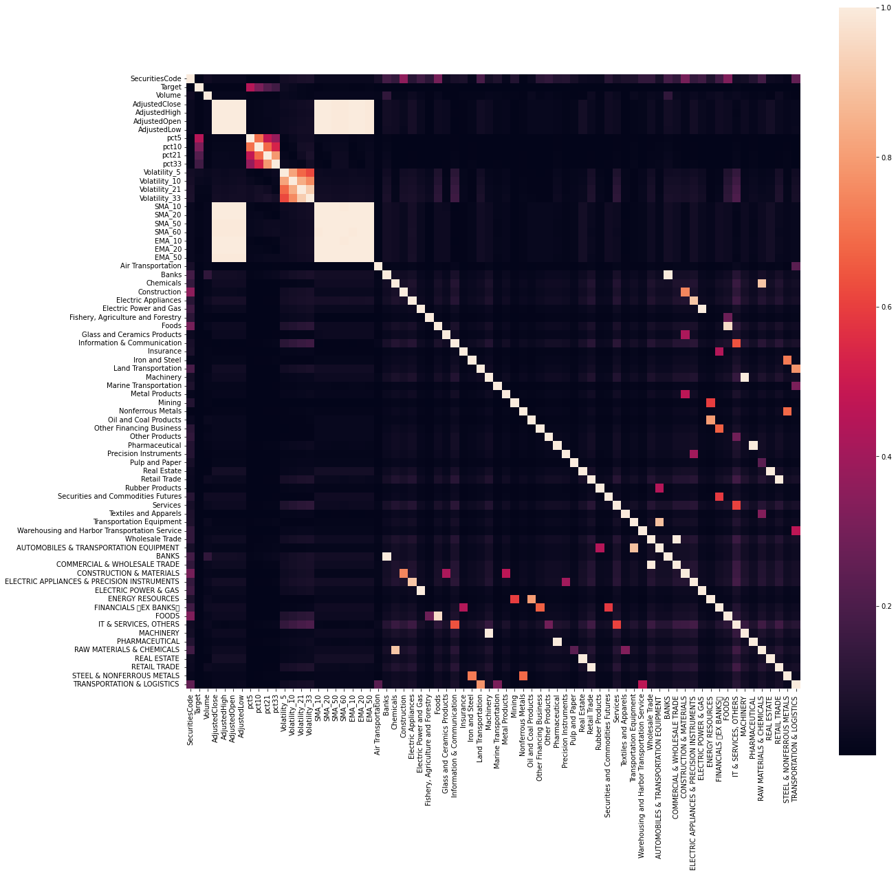
    


**Removing special characters in the column names**


```python
X = X.rename(columns = lambda x:re.sub('[^A-Za-z0-9_]+', '', x))
```

**Drop labels**


```python
y= X["Target"].to_numpy()
X=X.drop(["Target"],axis=1)
```

### Standarize Values

A data pipeline was originally created to standarize the input attribute for the model. After several tries, it was concluded that the model works better without standarized values.


```python
num_pipeline = Pipeline([
        ('std_scaler', StandardScaler()),
    ])
```


```python
num_attribs = ['Volume','AdjustedClose',"AdjustedHigh","AdjustedOpen","AdjustedLow","pct5","pct10","pct21","pct33","Volatility_5","Volatility_10","Volatility_21","Volatility_33",'SMA_10','SMA_20','SMA_50','SMA_60','EMA_10','EMA_20','EMA_50']

full_pipeline = ColumnTransformer([
        ("num", num_pipeline, num_attribs)
    ])

```

## Model Selection

Calculate the average Sharpe ratio for the following ML models.

- LGBMRegressor
- XGBoost Regressor
- Random Forest Regressor

The model giving the **highest** Sharpe ratio will be selected for the final model.

**Create list to store all Sharpe ratio for different models**


```python
model_performance = []
```

### Time based Crossvalidation

**LGBMRegressor**


```python
ts_fold = TimeSeriesSplit(n_splits=10,gap=10000)
```


```python
feat_importance=pd.DataFrame()
sharpe_ratio=[]
```


```python
%%time
for fold, (train_idx, val_idx) in enumerate(ts_fold.split(X, y)):
    
    print(f"\n========================== Fold {fold+1} ==========================")
        
    X_train, y_train = X.iloc[train_idx,:], y[train_idx]
    X_valid, y_val = X.iloc[val_idx,:], y[val_idx]
    
    print("Train Date range: {} to {}".format(X_train.Date.min(),X_train.Date.max()))
    print("Valid Date range: {} to {}".format(X_valid.Date.min(),X_valid.Date.max()))
    
    
    ##### TRAIN standarization pipeline. See comment above
    """
    pipeline_X_df = full_pipeline.fit_transform(X_train)
    pipeline_X_df = pd.DataFrame(pipeline_X_df, columns = num_attribs)
    
    pipeline_X_df.reset_index(drop = True, inplace=True)
    X_train.reset_index(drop = True, inplace=True)

    X_train.drop(num_attribs,axis=1,inplace=True)
    X_train = pd.concat([X_train,pipeline_X_df], axis=1)
    #"""
    X_train= X_train.rename(columns = lambda x:re.sub('[^A-Za-z0-9_]+', '', x))
    
    ##### VALIDATION. See comment above
    """
    pipeline_val_df = full_pipeline.transform(X_valid)
    pipeline_val_df = pd.DataFrame(pipeline_val_df, columns = num_attribs)
    pipeline_val_df.reset_index(drop = True, inplace=True)
    X_valid.reset_index(drop = True, inplace=True)
    X_valid.drop(num_attribs,axis=1,inplace=True)
    X_valid = pd.concat([X_valid,pipeline_val_df], axis=1)
    
   # """
    X_valid= X_valid.rename(columns = lambda x:re.sub('[^A-Za-z0-9_]+', '', x))
    
    X_train.drop(['Date','SecuritiesCode'], axis=1, inplace=True)
    X_val=X_valid[X_valid.columns[~X_valid.columns.isin(['Date','SecuritiesCode'])]]
    val_dates=X_valid.Date.unique()[1:-1]
    print("\nTrain Shape: {} {}, Valid Shape: {} {}".format(X_train.shape, y_train.shape, X_val.shape, y_val.shape))
    
    #gbm = LGBMRegressor(**params)
    gbm = LGBMRegressor().fit(X_train, y_train, 
                                      eval_set=[(X_train, y_train), (X_val, y_val)],
                                      verbose=300, 
                                      eval_metric=['mae','mse'])
    y_pred = gbm.predict(X_val)
    rmse = np.sqrt(mean_squared_error(y_val, y_pred))
    mae = mean_absolute_error(y_val, y_pred)
    feat_importance["Importance_Fold"+str(fold)]=gbm.feature_importances_
    feat_importance.set_index(X_train.columns, inplace=True)
        
    rank=[]
    X_val_df=X_valid[X_valid.Date.isin(val_dates)]
    for i in X_val_df.Date.unique():
        temp_df = X_val_df[X_val_df.Date == i].drop(['Date','SecuritiesCode'],axis=1)
        temp_df["pred"] = gbm.predict(temp_df)
        temp_df["Rank"] = (temp_df["pred"].rank(method="first", ascending=False)-1).astype(int)
        rank.append(temp_df["Rank"].values)

    stock_rank=pd.Series([x for y in rank for x in y], name="Rank")
    df=pd.concat([X_val_df.reset_index(drop=True),stock_rank,
                  df_prices_feat[df_prices_feat.Date.isin(val_dates)]['Target'].reset_index(drop=True)], axis=1)
    sharpe=calc_spread_return_sharpe(df)
    sharpe_ratio.append(sharpe)
    print("Valid Sharpe: {}, RMSE: {}, MAE: {}".format(sharpe,rmse,mae))
    
    del X_train, y_train,  X_val, y_val ##, pipeline_val_df, pipeline_X_df
    gc.collect()
    
print("\nAverage cross-validation Sharpe Ratio: {:.4f}, standard deviation = {:.2f}.".format(np.mean(sharpe_ratio),np.std(sharpe_ratio)))
```

    
    ========================== Fold 1 ==========================
    Train Date range: 2017-01-04 00:00:00 to 2017-06-12 00:00:00
    Valid Date range: 2017-06-19 00:00:00 to 2017-12-01 00:00:00
    
    Train Shape: (202033, 70) (202033,), Valid Shape: (212025, 70) (212025,)
    Valid Sharpe: 0.04388440783658644, RMSE: 0.017243060921691075, MAE: 0.01121638086988958
    
    ========================== Fold 2 ==========================
    Train Date range: 2017-01-04 00:00:00 to 2017-11-22 00:00:00
    Valid Date range: 2017-12-01 00:00:00 to 2018-05-18 00:00:00
    
    Train Shape: (414058, 70) (414058,), Valid Shape: (212025, 70) (212025,)
    Valid Sharpe: 0.16885977928063395, RMSE: 0.02030750851786552, MAE: 0.013538073482761568
    
    


```python
feat_importance['avg'] = feat_importance.mean(axis=1)
feat_importance = feat_importance.sort_values(by='avg',ascending=True)
feat_importance = feat_importance.tail(20)
pal=sns.color_palette("plasma_r", 29).as_hex()[2:]

fig=go.Figure()
for i in range(len(feat_importance.index)):
    fig.add_shape(dict(type="line", y0=i, y1=i, x0=0, x1=feat_importance['avg'][i], 
                       line_color=pal[::-1][i],opacity=0.7,line_width=4))
    fig.add_trace(go.Scatter(x=feat_importance['avg'], y=feat_importance.index, mode='markers', 
                             marker_color=pal[::-1], marker_size=8,
                             hovertemplate='%{y} Importance = %{x:.0f}<extra></extra>'))
    fig.update_layout(title='Overall Feature Importance', 
                      xaxis=dict(title='Average Importance',zeroline=False),
                      yaxis_showgrid=False, margin=dict(l=120,t=80),
                      height=700, width=800)
fig.show()
```


<div>                            <div id="68849add-6f31-49af-ab9a-c9b67e22ce43" class="plotly-graph-div" style="height:700px; width:800px;"></div>            <script type="text/javascript">                require(["plotly"], function(Plotly) {                    window.PLOTLYENV=window.PLOTLYENV || {};                                    if (document.getElementById("68849add-6f31-49af-ab9a-c9b67e22ce43")) {                    Plotly.newPlot(                        "68849add-6f31-49af-ab9a-c9b67e22ce43",                        [{"hovertemplate":"%{y} Importance = %{x:.0f}<extra></extra>","marker":{"color":["#220690","#330597","#41049d","#5002a2","#5c01a6","#6a00a8","#7701a8","#8405a7","#8f0da4","#9c179e","#a62098","#b12a90","#ba3388","#c33d80","#cb4679","#d35171","#da5b69","#e16462","#e76f5a","#ed7953","#f2844b","#f68f44","#fa9b3d","#fca636","#fdb42f","#fec029","#fcce25"],"size":8},"mode":"markers","x":[29.3,31.8,37.6,37.7,58.2,65.4,69.8,84.1,84.2,86.6,118.3,122.7,123.8,142.5,207.7,222.3,272.3,299.9,341.7,515.3],"y":["EMA_50","EMA_20","SMA_60","SMA_50","SMA_20","AdjustedLow","AdjustedOpen","Volatility_33","Volatility_21","AdjustedHigh","Volatility_10","AdjustedClose","SMA_10","EMA_10","pct33","pct21","pct10","Volume","Volatility_5","pct5"],"type":"scatter"},{"hovertemplate":"%{y} Importance = %{x:.0f}<extra></extra>","marker":{"color":["#220690","#330597","#41049d","#5002a2","#5c01a6","#6a00a8","#7701a8","#8405a7","#8f0da4","#9c179e","#a62098","#b12a90","#ba3388","#c33d80","#cb4679","#d35171","#da5b69","#e16462","#e76f5a","#ed7953","#f2844b","#f68f44","#fa9b3d","#fca636","#fdb42f","#fec029","#fcce25"],"size":8},"mode":"markers","x":[29.3,31.8,37.6,37.7,58.2,65.4,69.8,84.1,84.2,86.6,118.3,122.7,123.8,142.5,207.7,222.3,272.3,299.9,341.7,515.3],"y":["EMA_50","EMA_20","SMA_60","SMA_50","SMA_20","AdjustedLow","AdjustedOpen","Volatility_33","Volatility_21","AdjustedHigh","Volatility_10","AdjustedClose","SMA_10","EMA_10","pct33","pct21","pct10","Volume","Volatility_5","pct5"],"type":"scatter"},{"hovertemplate":"%{y} Importance = %{x:.0f}<extra></extra>","marker":{"color":["#220690","#330597","#41049d","#5002a2","#5c01a6","#6a00a8","#7701a8","#8405a7","#8f0da4","#9c179e","#a62098","#b12a90","#ba3388","#c33d80","#cb4679","#d35171","#da5b69","#e16462","#e76f5a","#ed7953","#f2844b","#f68f44","#fa9b3d","#fca636","#fdb42f","#fec029","#fcce25"],"size":8},"mode":"markers","x":[29.3,31.8,37.6,37.7,58.2,65.4,69.8,84.1,84.2,86.6,118.3,122.7,123.8,142.5,207.7,222.3,272.3,299.9,341.7,515.3],"y":["EMA_50","EMA_20","SMA_60","SMA_50","SMA_20","AdjustedLow","AdjustedOpen","Volatility_33","Volatility_21","AdjustedHigh","Volatility_10","AdjustedClose","SMA_10","EMA_10","pct33","pct21","pct10","Volume","Volatility_5","pct5"],"type":"scatter"},{"hovertemplate":"%{y} Importance = %{x:.0f}<extra></extra>","marker":{"color":["#220690","#330597","#41049d","#5002a2","#5c01a6","#6a00a8","#7701a8","#8405a7","#8f0da4","#9c179e","#a62098","#b12a90","#ba3388","#c33d80","#cb4679","#d35171","#da5b69","#e16462","#e76f5a","#ed7953","#f2844b","#f68f44","#fa9b3d","#fca636","#fdb42f","#fec029","#fcce25"],"size":8},"mode":"markers","x":[29.3,31.8,37.6,37.7,58.2,65.4,69.8,84.1,84.2,86.6,118.3,122.7,123.8,142.5,207.7,222.3,272.3,299.9,341.7,515.3],"y":["EMA_50","EMA_20","SMA_60","SMA_50","SMA_20","AdjustedLow","AdjustedOpen","Volatility_33","Volatility_21","AdjustedHigh","Volatility_10","AdjustedClose","SMA_10","EMA_10","pct33","pct21","pct10","Volume","Volatility_5","pct5"],"type":"scatter"},{"hovertemplate":"%{y} Importance = %{x:.0f}<extra></extra>","marker":{"color":["#220690","#330597","#41049d","#5002a2","#5c01a6","#6a00a8","#7701a8","#8405a7","#8f0da4","#9c179e","#a62098","#b12a90","#ba3388","#c33d80","#cb4679","#d35171","#da5b69","#e16462","#e76f5a","#ed7953","#f2844b","#f68f44","#fa9b3d","#fca636","#fdb42f","#fec029","#fcce25"],"size":8},"mode":"markers","x":[29.3,31.8,37.6,37.7,58.2,65.4,69.8,84.1,84.2,86.6,118.3,122.7,123.8,142.5,207.7,222.3,272.3,299.9,341.7,515.3],"y":["EMA_50","EMA_20","SMA_60","SMA_50","SMA_20","AdjustedLow","AdjustedOpen","Volatility_33","Volatility_21","AdjustedHigh","Volatility_10","AdjustedClose","SMA_10","EMA_10","pct33","pct21","pct10","Volume","Volatility_5","pct5"],"type":"scatter"},{"hovertemplate":"%{y} Importance = %{x:.0f}<extra></extra>","marker":{"color":["#220690","#330597","#41049d","#5002a2","#5c01a6","#6a00a8","#7701a8","#8405a7","#8f0da4","#9c179e","#a62098","#b12a90","#ba3388","#c33d80","#cb4679","#d35171","#da5b69","#e16462","#e76f5a","#ed7953","#f2844b","#f68f44","#fa9b3d","#fca636","#fdb42f","#fec029","#fcce25"],"size":8},"mode":"markers","x":[29.3,31.8,37.6,37.7,58.2,65.4,69.8,84.1,84.2,86.6,118.3,122.7,123.8,142.5,207.7,222.3,272.3,299.9,341.7,515.3],"y":["EMA_50","EMA_20","SMA_60","SMA_50","SMA_20","AdjustedLow","AdjustedOpen","Volatility_33","Volatility_21","AdjustedHigh","Volatility_10","AdjustedClose","SMA_10","EMA_10","pct33","pct21","pct10","Volume","Volatility_5","pct5"],"type":"scatter"},{"hovertemplate":"%{y} Importance = %{x:.0f}<extra></extra>","marker":{"color":["#220690","#330597","#41049d","#5002a2","#5c01a6","#6a00a8","#7701a8","#8405a7","#8f0da4","#9c179e","#a62098","#b12a90","#ba3388","#c33d80","#cb4679","#d35171","#da5b69","#e16462","#e76f5a","#ed7953","#f2844b","#f68f44","#fa9b3d","#fca636","#fdb42f","#fec029","#fcce25"],"size":8},"mode":"markers","x":[29.3,31.8,37.6,37.7,58.2,65.4,69.8,84.1,84.2,86.6,118.3,122.7,123.8,142.5,207.7,222.3,272.3,299.9,341.7,515.3],"y":["EMA_50","EMA_20","SMA_60","SMA_50","SMA_20","AdjustedLow","AdjustedOpen","Volatility_33","Volatility_21","AdjustedHigh","Volatility_10","AdjustedClose","SMA_10","EMA_10","pct33","pct21","pct10","Volume","Volatility_5","pct5"],"type":"scatter"},{"hovertemplate":"%{y} Importance = %{x:.0f}<extra></extra>","marker":{"color":["#220690","#330597","#41049d","#5002a2","#5c01a6","#6a00a8","#7701a8","#8405a7","#8f0da4","#9c179e","#a62098","#b12a90","#ba3388","#c33d80","#cb4679","#d35171","#da5b69","#e16462","#e76f5a","#ed7953","#f2844b","#f68f44","#fa9b3d","#fca636","#fdb42f","#fec029","#fcce25"],"size":8},"mode":"markers","x":[29.3,31.8,37.6,37.7,58.2,65.4,69.8,84.1,84.2,86.6,118.3,122.7,123.8,142.5,207.7,222.3,272.3,299.9,341.7,515.3],"y":["EMA_50","EMA_20","SMA_60","SMA_50","SMA_20","AdjustedLow","AdjustedOpen","Volatility_33","Volatility_21","AdjustedHigh","Volatility_10","AdjustedClose","SMA_10","EMA_10","pct33","pct21","pct10","Volume","Volatility_5","pct5"],"type":"scatter"},{"hovertemplate":"%{y} Importance = %{x:.0f}<extra></extra>","marker":{"color":["#220690","#330597","#41049d","#5002a2","#5c01a6","#6a00a8","#7701a8","#8405a7","#8f0da4","#9c179e","#a62098","#b12a90","#ba3388","#c33d80","#cb4679","#d35171","#da5b69","#e16462","#e76f5a","#ed7953","#f2844b","#f68f44","#fa9b3d","#fca636","#fdb42f","#fec029","#fcce25"],"size":8},"mode":"markers","x":[29.3,31.8,37.6,37.7,58.2,65.4,69.8,84.1,84.2,86.6,118.3,122.7,123.8,142.5,207.7,222.3,272.3,299.9,341.7,515.3],"y":["EMA_50","EMA_20","SMA_60","SMA_50","SMA_20","AdjustedLow","AdjustedOpen","Volatility_33","Volatility_21","AdjustedHigh","Volatility_10","AdjustedClose","SMA_10","EMA_10","pct33","pct21","pct10","Volume","Volatility_5","pct5"],"type":"scatter"},{"hovertemplate":"%{y} Importance = %{x:.0f}<extra></extra>","marker":{"color":["#220690","#330597","#41049d","#5002a2","#5c01a6","#6a00a8","#7701a8","#8405a7","#8f0da4","#9c179e","#a62098","#b12a90","#ba3388","#c33d80","#cb4679","#d35171","#da5b69","#e16462","#e76f5a","#ed7953","#f2844b","#f68f44","#fa9b3d","#fca636","#fdb42f","#fec029","#fcce25"],"size":8},"mode":"markers","x":[29.3,31.8,37.6,37.7,58.2,65.4,69.8,84.1,84.2,86.6,118.3,122.7,123.8,142.5,207.7,222.3,272.3,299.9,341.7,515.3],"y":["EMA_50","EMA_20","SMA_60","SMA_50","SMA_20","AdjustedLow","AdjustedOpen","Volatility_33","Volatility_21","AdjustedHigh","Volatility_10","AdjustedClose","SMA_10","EMA_10","pct33","pct21","pct10","Volume","Volatility_5","pct5"],"type":"scatter"},{"hovertemplate":"%{y} Importance = %{x:.0f}<extra></extra>","marker":{"color":["#220690","#330597","#41049d","#5002a2","#5c01a6","#6a00a8","#7701a8","#8405a7","#8f0da4","#9c179e","#a62098","#b12a90","#ba3388","#c33d80","#cb4679","#d35171","#da5b69","#e16462","#e76f5a","#ed7953","#f2844b","#f68f44","#fa9b3d","#fca636","#fdb42f","#fec029","#fcce25"],"size":8},"mode":"markers","x":[29.3,31.8,37.6,37.7,58.2,65.4,69.8,84.1,84.2,86.6,118.3,122.7,123.8,142.5,207.7,222.3,272.3,299.9,341.7,515.3],"y":["EMA_50","EMA_20","SMA_60","SMA_50","SMA_20","AdjustedLow","AdjustedOpen","Volatility_33","Volatility_21","AdjustedHigh","Volatility_10","AdjustedClose","SMA_10","EMA_10","pct33","pct21","pct10","Volume","Volatility_5","pct5"],"type":"scatter"},{"hovertemplate":"%{y} Importance = %{x:.0f}<extra></extra>","marker":{"color":["#220690","#330597","#41049d","#5002a2","#5c01a6","#6a00a8","#7701a8","#8405a7","#8f0da4","#9c179e","#a62098","#b12a90","#ba3388","#c33d80","#cb4679","#d35171","#da5b69","#e16462","#e76f5a","#ed7953","#f2844b","#f68f44","#fa9b3d","#fca636","#fdb42f","#fec029","#fcce25"],"size":8},"mode":"markers","x":[29.3,31.8,37.6,37.7,58.2,65.4,69.8,84.1,84.2,86.6,118.3,122.7,123.8,142.5,207.7,222.3,272.3,299.9,341.7,515.3],"y":["EMA_50","EMA_20","SMA_60","SMA_50","SMA_20","AdjustedLow","AdjustedOpen","Volatility_33","Volatility_21","AdjustedHigh","Volatility_10","AdjustedClose","SMA_10","EMA_10","pct33","pct21","pct10","Volume","Volatility_5","pct5"],"type":"scatter"},{"hovertemplate":"%{y} Importance = %{x:.0f}<extra></extra>","marker":{"color":["#220690","#330597","#41049d","#5002a2","#5c01a6","#6a00a8","#7701a8","#8405a7","#8f0da4","#9c179e","#a62098","#b12a90","#ba3388","#c33d80","#cb4679","#d35171","#da5b69","#e16462","#e76f5a","#ed7953","#f2844b","#f68f44","#fa9b3d","#fca636","#fdb42f","#fec029","#fcce25"],"size":8},"mode":"markers","x":[29.3,31.8,37.6,37.7,58.2,65.4,69.8,84.1,84.2,86.6,118.3,122.7,123.8,142.5,207.7,222.3,272.3,299.9,341.7,515.3],"y":["EMA_50","EMA_20","SMA_60","SMA_50","SMA_20","AdjustedLow","AdjustedOpen","Volatility_33","Volatility_21","AdjustedHigh","Volatility_10","AdjustedClose","SMA_10","EMA_10","pct33","pct21","pct10","Volume","Volatility_5","pct5"],"type":"scatter"},{"hovertemplate":"%{y} Importance = %{x:.0f}<extra></extra>","marker":{"color":["#220690","#330597","#41049d","#5002a2","#5c01a6","#6a00a8","#7701a8","#8405a7","#8f0da4","#9c179e","#a62098","#b12a90","#ba3388","#c33d80","#cb4679","#d35171","#da5b69","#e16462","#e76f5a","#ed7953","#f2844b","#f68f44","#fa9b3d","#fca636","#fdb42f","#fec029","#fcce25"],"size":8},"mode":"markers","x":[29.3,31.8,37.6,37.7,58.2,65.4,69.8,84.1,84.2,86.6,118.3,122.7,123.8,142.5,207.7,222.3,272.3,299.9,341.7,515.3],"y":["EMA_50","EMA_20","SMA_60","SMA_50","SMA_20","AdjustedLow","AdjustedOpen","Volatility_33","Volatility_21","AdjustedHigh","Volatility_10","AdjustedClose","SMA_10","EMA_10","pct33","pct21","pct10","Volume","Volatility_5","pct5"],"type":"scatter"},{"hovertemplate":"%{y} Importance = %{x:.0f}<extra></extra>","marker":{"color":["#220690","#330597","#41049d","#5002a2","#5c01a6","#6a00a8","#7701a8","#8405a7","#8f0da4","#9c179e","#a62098","#b12a90","#ba3388","#c33d80","#cb4679","#d35171","#da5b69","#e16462","#e76f5a","#ed7953","#f2844b","#f68f44","#fa9b3d","#fca636","#fdb42f","#fec029","#fcce25"],"size":8},"mode":"markers","x":[29.3,31.8,37.6,37.7,58.2,65.4,69.8,84.1,84.2,86.6,118.3,122.7,123.8,142.5,207.7,222.3,272.3,299.9,341.7,515.3],"y":["EMA_50","EMA_20","SMA_60","SMA_50","SMA_20","AdjustedLow","AdjustedOpen","Volatility_33","Volatility_21","AdjustedHigh","Volatility_10","AdjustedClose","SMA_10","EMA_10","pct33","pct21","pct10","Volume","Volatility_5","pct5"],"type":"scatter"},{"hovertemplate":"%{y} Importance = %{x:.0f}<extra></extra>","marker":{"color":["#220690","#330597","#41049d","#5002a2","#5c01a6","#6a00a8","#7701a8","#8405a7","#8f0da4","#9c179e","#a62098","#b12a90","#ba3388","#c33d80","#cb4679","#d35171","#da5b69","#e16462","#e76f5a","#ed7953","#f2844b","#f68f44","#fa9b3d","#fca636","#fdb42f","#fec029","#fcce25"],"size":8},"mode":"markers","x":[29.3,31.8,37.6,37.7,58.2,65.4,69.8,84.1,84.2,86.6,118.3,122.7,123.8,142.5,207.7,222.3,272.3,299.9,341.7,515.3],"y":["EMA_50","EMA_20","SMA_60","SMA_50","SMA_20","AdjustedLow","AdjustedOpen","Volatility_33","Volatility_21","AdjustedHigh","Volatility_10","AdjustedClose","SMA_10","EMA_10","pct33","pct21","pct10","Volume","Volatility_5","pct5"],"type":"scatter"},{"hovertemplate":"%{y} Importance = %{x:.0f}<extra></extra>","marker":{"color":["#220690","#330597","#41049d","#5002a2","#5c01a6","#6a00a8","#7701a8","#8405a7","#8f0da4","#9c179e","#a62098","#b12a90","#ba3388","#c33d80","#cb4679","#d35171","#da5b69","#e16462","#e76f5a","#ed7953","#f2844b","#f68f44","#fa9b3d","#fca636","#fdb42f","#fec029","#fcce25"],"size":8},"mode":"markers","x":[29.3,31.8,37.6,37.7,58.2,65.4,69.8,84.1,84.2,86.6,118.3,122.7,123.8,142.5,207.7,222.3,272.3,299.9,341.7,515.3],"y":["EMA_50","EMA_20","SMA_60","SMA_50","SMA_20","AdjustedLow","AdjustedOpen","Volatility_33","Volatility_21","AdjustedHigh","Volatility_10","AdjustedClose","SMA_10","EMA_10","pct33","pct21","pct10","Volume","Volatility_5","pct5"],"type":"scatter"},{"hovertemplate":"%{y} Importance = %{x:.0f}<extra></extra>","marker":{"color":["#220690","#330597","#41049d","#5002a2","#5c01a6","#6a00a8","#7701a8","#8405a7","#8f0da4","#9c179e","#a62098","#b12a90","#ba3388","#c33d80","#cb4679","#d35171","#da5b69","#e16462","#e76f5a","#ed7953","#f2844b","#f68f44","#fa9b3d","#fca636","#fdb42f","#fec029","#fcce25"],"size":8},"mode":"markers","x":[29.3,31.8,37.6,37.7,58.2,65.4,69.8,84.1,84.2,86.6,118.3,122.7,123.8,142.5,207.7,222.3,272.3,299.9,341.7,515.3],"y":["EMA_50","EMA_20","SMA_60","SMA_50","SMA_20","AdjustedLow","AdjustedOpen","Volatility_33","Volatility_21","AdjustedHigh","Volatility_10","AdjustedClose","SMA_10","EMA_10","pct33","pct21","pct10","Volume","Volatility_5","pct5"],"type":"scatter"},{"hovertemplate":"%{y} Importance = %{x:.0f}<extra></extra>","marker":{"color":["#220690","#330597","#41049d","#5002a2","#5c01a6","#6a00a8","#7701a8","#8405a7","#8f0da4","#9c179e","#a62098","#b12a90","#ba3388","#c33d80","#cb4679","#d35171","#da5b69","#e16462","#e76f5a","#ed7953","#f2844b","#f68f44","#fa9b3d","#fca636","#fdb42f","#fec029","#fcce25"],"size":8},"mode":"markers","x":[29.3,31.8,37.6,37.7,58.2,65.4,69.8,84.1,84.2,86.6,118.3,122.7,123.8,142.5,207.7,222.3,272.3,299.9,341.7,515.3],"y":["EMA_50","EMA_20","SMA_60","SMA_50","SMA_20","AdjustedLow","AdjustedOpen","Volatility_33","Volatility_21","AdjustedHigh","Volatility_10","AdjustedClose","SMA_10","EMA_10","pct33","pct21","pct10","Volume","Volatility_5","pct5"],"type":"scatter"},{"hovertemplate":"%{y} Importance = %{x:.0f}<extra></extra>","marker":{"color":["#220690","#330597","#41049d","#5002a2","#5c01a6","#6a00a8","#7701a8","#8405a7","#8f0da4","#9c179e","#a62098","#b12a90","#ba3388","#c33d80","#cb4679","#d35171","#da5b69","#e16462","#e76f5a","#ed7953","#f2844b","#f68f44","#fa9b3d","#fca636","#fdb42f","#fec029","#fcce25"],"size":8},"mode":"markers","x":[29.3,31.8,37.6,37.7,58.2,65.4,69.8,84.1,84.2,86.6,118.3,122.7,123.8,142.5,207.7,222.3,272.3,299.9,341.7,515.3],"y":["EMA_50","EMA_20","SMA_60","SMA_50","SMA_20","AdjustedLow","AdjustedOpen","Volatility_33","Volatility_21","AdjustedHigh","Volatility_10","AdjustedClose","SMA_10","EMA_10","pct33","pct21","pct10","Volume","Volatility_5","pct5"],"type":"scatter"}],                        {"template":{"data":{"histogram2dcontour":[{"type":"histogram2dcontour","colorbar":{"outlinewidth":0,"ticks":""},"colorscale":[[0.0,"#0d0887"],[0.1111111111111111,"#46039f"],[0.2222222222222222,"#7201a8"],[0.3333333333333333,"#9c179e"],[0.4444444444444444,"#bd3786"],[0.5555555555555556,"#d8576b"],[0.6666666666666666,"#ed7953"],[0.7777777777777778,"#fb9f3a"],[0.8888888888888888,"#fdca26"],[1.0,"#f0f921"]]}],"choropleth":[{"type":"choropleth","colorbar":{"outlinewidth":0,"ticks":""}}],"histogram2d":[{"type":"histogram2d","colorbar":{"outlinewidth":0,"ticks":""},"colorscale":[[0.0,"#0d0887"],[0.1111111111111111,"#46039f"],[0.2222222222222222,"#7201a8"],[0.3333333333333333,"#9c179e"],[0.4444444444444444,"#bd3786"],[0.5555555555555556,"#d8576b"],[0.6666666666666666,"#ed7953"],[0.7777777777777778,"#fb9f3a"],[0.8888888888888888,"#fdca26"],[1.0,"#f0f921"]]}],"heatmap":[{"type":"heatmap","colorbar":{"outlinewidth":0,"ticks":""},"colorscale":[[0.0,"#0d0887"],[0.1111111111111111,"#46039f"],[0.2222222222222222,"#7201a8"],[0.3333333333333333,"#9c179e"],[0.4444444444444444,"#bd3786"],[0.5555555555555556,"#d8576b"],[0.6666666666666666,"#ed7953"],[0.7777777777777778,"#fb9f3a"],[0.8888888888888888,"#fdca26"],[1.0,"#f0f921"]]}],"heatmapgl":[{"type":"heatmapgl","colorbar":{"outlinewidth":0,"ticks":""},"colorscale":[[0.0,"#0d0887"],[0.1111111111111111,"#46039f"],[0.2222222222222222,"#7201a8"],[0.3333333333333333,"#9c179e"],[0.4444444444444444,"#bd3786"],[0.5555555555555556,"#d8576b"],[0.6666666666666666,"#ed7953"],[0.7777777777777778,"#fb9f3a"],[0.8888888888888888,"#fdca26"],[1.0,"#f0f921"]]}],"contourcarpet":[{"type":"contourcarpet","colorbar":{"outlinewidth":0,"ticks":""}}],"contour":[{"type":"contour","colorbar":{"outlinewidth":0,"ticks":""},"colorscale":[[0.0,"#0d0887"],[0.1111111111111111,"#46039f"],[0.2222222222222222,"#7201a8"],[0.3333333333333333,"#9c179e"],[0.4444444444444444,"#bd3786"],[0.5555555555555556,"#d8576b"],[0.6666666666666666,"#ed7953"],[0.7777777777777778,"#fb9f3a"],[0.8888888888888888,"#fdca26"],[1.0,"#f0f921"]]}],"surface":[{"type":"surface","colorbar":{"outlinewidth":0,"ticks":""},"colorscale":[[0.0,"#0d0887"],[0.1111111111111111,"#46039f"],[0.2222222222222222,"#7201a8"],[0.3333333333333333,"#9c179e"],[0.4444444444444444,"#bd3786"],[0.5555555555555556,"#d8576b"],[0.6666666666666666,"#ed7953"],[0.7777777777777778,"#fb9f3a"],[0.8888888888888888,"#fdca26"],[1.0,"#f0f921"]]}],"mesh3d":[{"type":"mesh3d","colorbar":{"outlinewidth":0,"ticks":""}}],"scatter":[{"fillpattern":{"fillmode":"overlay","size":10,"solidity":0.2},"type":"scatter"}],"parcoords":[{"type":"parcoords","line":{"colorbar":{"outlinewidth":0,"ticks":""}}}],"scatterpolargl":[{"type":"scatterpolargl","marker":{"colorbar":{"outlinewidth":0,"ticks":""}}}],"bar":[{"error_x":{"color":"#2a3f5f"},"error_y":{"color":"#2a3f5f"},"marker":{"line":{"color":"#E5ECF6","width":0.5},"pattern":{"fillmode":"overlay","size":10,"solidity":0.2}},"type":"bar"}],"scattergeo":[{"type":"scattergeo","marker":{"colorbar":{"outlinewidth":0,"ticks":""}}}],"scatterpolar":[{"type":"scatterpolar","marker":{"colorbar":{"outlinewidth":0,"ticks":""}}}],"histogram":[{"marker":{"pattern":{"fillmode":"overlay","size":10,"solidity":0.2}},"type":"histogram"}],"scattergl":[{"type":"scattergl","marker":{"colorbar":{"outlinewidth":0,"ticks":""}}}],"scatter3d":[{"type":"scatter3d","line":{"colorbar":{"outlinewidth":0,"ticks":""}},"marker":{"colorbar":{"outlinewidth":0,"ticks":""}}}],"scattermapbox":[{"type":"scattermapbox","marker":{"colorbar":{"outlinewidth":0,"ticks":""}}}],"scatterternary":[{"type":"scatterternary","marker":{"colorbar":{"outlinewidth":0,"ticks":""}}}],"scattercarpet":[{"type":"scattercarpet","marker":{"colorbar":{"outlinewidth":0,"ticks":""}}}],"carpet":[{"aaxis":{"endlinecolor":"#2a3f5f","gridcolor":"white","linecolor":"white","minorgridcolor":"white","startlinecolor":"#2a3f5f"},"baxis":{"endlinecolor":"#2a3f5f","gridcolor":"white","linecolor":"white","minorgridcolor":"white","startlinecolor":"#2a3f5f"},"type":"carpet"}],"table":[{"cells":{"fill":{"color":"#EBF0F8"},"line":{"color":"white"}},"header":{"fill":{"color":"#C8D4E3"},"line":{"color":"white"}},"type":"table"}],"barpolar":[{"marker":{"line":{"color":"#E5ECF6","width":0.5},"pattern":{"fillmode":"overlay","size":10,"solidity":0.2}},"type":"barpolar"}],"pie":[{"automargin":true,"type":"pie"}]},"layout":{"autotypenumbers":"strict","colorway":["#636efa","#EF553B","#00cc96","#ab63fa","#FFA15A","#19d3f3","#FF6692","#B6E880","#FF97FF","#FECB52"],"font":{"color":"#2a3f5f"},"hovermode":"closest","hoverlabel":{"align":"left"},"paper_bgcolor":"white","plot_bgcolor":"#E5ECF6","polar":{"bgcolor":"#E5ECF6","angularaxis":{"gridcolor":"white","linecolor":"white","ticks":""},"radialaxis":{"gridcolor":"white","linecolor":"white","ticks":""}},"ternary":{"bgcolor":"#E5ECF6","aaxis":{"gridcolor":"white","linecolor":"white","ticks":""},"baxis":{"gridcolor":"white","linecolor":"white","ticks":""},"caxis":{"gridcolor":"white","linecolor":"white","ticks":""}},"coloraxis":{"colorbar":{"outlinewidth":0,"ticks":""}},"colorscale":{"sequential":[[0.0,"#0d0887"],[0.1111111111111111,"#46039f"],[0.2222222222222222,"#7201a8"],[0.3333333333333333,"#9c179e"],[0.4444444444444444,"#bd3786"],[0.5555555555555556,"#d8576b"],[0.6666666666666666,"#ed7953"],[0.7777777777777778,"#fb9f3a"],[0.8888888888888888,"#fdca26"],[1.0,"#f0f921"]],"sequentialminus":[[0.0,"#0d0887"],[0.1111111111111111,"#46039f"],[0.2222222222222222,"#7201a8"],[0.3333333333333333,"#9c179e"],[0.4444444444444444,"#bd3786"],[0.5555555555555556,"#d8576b"],[0.6666666666666666,"#ed7953"],[0.7777777777777778,"#fb9f3a"],[0.8888888888888888,"#fdca26"],[1.0,"#f0f921"]],"diverging":[[0,"#8e0152"],[0.1,"#c51b7d"],[0.2,"#de77ae"],[0.3,"#f1b6da"],[0.4,"#fde0ef"],[0.5,"#f7f7f7"],[0.6,"#e6f5d0"],[0.7,"#b8e186"],[0.8,"#7fbc41"],[0.9,"#4d9221"],[1,"#276419"]]},"xaxis":{"gridcolor":"white","linecolor":"white","ticks":"","title":{"standoff":15},"zerolinecolor":"white","automargin":true,"zerolinewidth":2},"yaxis":{"gridcolor":"white","linecolor":"white","ticks":"","title":{"standoff":15},"zerolinecolor":"white","automargin":true,"zerolinewidth":2},"scene":{"xaxis":{"backgroundcolor":"#E5ECF6","gridcolor":"white","linecolor":"white","showbackground":true,"ticks":"","zerolinecolor":"white","gridwidth":2},"yaxis":{"backgroundcolor":"#E5ECF6","gridcolor":"white","linecolor":"white","showbackground":true,"ticks":"","zerolinecolor":"white","gridwidth":2},"zaxis":{"backgroundcolor":"#E5ECF6","gridcolor":"white","linecolor":"white","showbackground":true,"ticks":"","zerolinecolor":"white","gridwidth":2}},"shapedefaults":{"line":{"color":"#2a3f5f"}},"annotationdefaults":{"arrowcolor":"#2a3f5f","arrowhead":0,"arrowwidth":1},"geo":{"bgcolor":"white","landcolor":"#E5ECF6","subunitcolor":"white","showland":true,"showlakes":true,"lakecolor":"white"},"title":{"x":0.05},"mapbox":{"style":"light"}}},"shapes":[{"line":{"color":"#220690","width":4},"opacity":0.7,"type":"line","x0":0,"x1":29.3,"y0":0,"y1":0},{"line":{"color":"#330597","width":4},"opacity":0.7,"type":"line","x0":0,"x1":31.8,"y0":1,"y1":1},{"line":{"color":"#41049d","width":4},"opacity":0.7,"type":"line","x0":0,"x1":37.6,"y0":2,"y1":2},{"line":{"color":"#5002a2","width":4},"opacity":0.7,"type":"line","x0":0,"x1":37.7,"y0":3,"y1":3},{"line":{"color":"#5c01a6","width":4},"opacity":0.7,"type":"line","x0":0,"x1":58.2,"y0":4,"y1":4},{"line":{"color":"#6a00a8","width":4},"opacity":0.7,"type":"line","x0":0,"x1":65.4,"y0":5,"y1":5},{"line":{"color":"#7701a8","width":4},"opacity":0.7,"type":"line","x0":0,"x1":69.8,"y0":6,"y1":6},{"line":{"color":"#8405a7","width":4},"opacity":0.7,"type":"line","x0":0,"x1":84.1,"y0":7,"y1":7},{"line":{"color":"#8f0da4","width":4},"opacity":0.7,"type":"line","x0":0,"x1":84.2,"y0":8,"y1":8},{"line":{"color":"#9c179e","width":4},"opacity":0.7,"type":"line","x0":0,"x1":86.6,"y0":9,"y1":9},{"line":{"color":"#a62098","width":4},"opacity":0.7,"type":"line","x0":0,"x1":118.3,"y0":10,"y1":10},{"line":{"color":"#b12a90","width":4},"opacity":0.7,"type":"line","x0":0,"x1":122.7,"y0":11,"y1":11},{"line":{"color":"#ba3388","width":4},"opacity":0.7,"type":"line","x0":0,"x1":123.8,"y0":12,"y1":12},{"line":{"color":"#c33d80","width":4},"opacity":0.7,"type":"line","x0":0,"x1":142.5,"y0":13,"y1":13},{"line":{"color":"#cb4679","width":4},"opacity":0.7,"type":"line","x0":0,"x1":207.7,"y0":14,"y1":14},{"line":{"color":"#d35171","width":4},"opacity":0.7,"type":"line","x0":0,"x1":222.3,"y0":15,"y1":15},{"line":{"color":"#da5b69","width":4},"opacity":0.7,"type":"line","x0":0,"x1":272.3,"y0":16,"y1":16},{"line":{"color":"#e16462","width":4},"opacity":0.7,"type":"line","x0":0,"x1":299.9,"y0":17,"y1":17},{"line":{"color":"#e76f5a","width":4},"opacity":0.7,"type":"line","x0":0,"x1":341.7,"y0":18,"y1":18},{"line":{"color":"#ed7953","width":4},"opacity":0.7,"type":"line","x0":0,"x1":515.3,"y0":19,"y1":19}],"xaxis":{"title":{"text":"Average Importance"},"zeroline":false},"yaxis":{"showgrid":false},"margin":{"l":120,"t":80},"title":{"text":"Overall Feature Importance"},"height":700,"width":800},                        {"responsive": true}                    ).then(function(){

var gd = document.getElementById('68849add-6f31-49af-ab9a-c9b67e22ce43');
var x = new MutationObserver(function (mutations, observer) {{
        var display = window.getComputedStyle(gd).display;
        if (!display || display === 'none') {{
            console.log([gd, 'removed!']);
            Plotly.purge(gd);
            observer.disconnect();
        }}
}});

// Listen for the removal of the full notebook cells
var notebookContainer = gd.closest('#notebook-container');
if (notebookContainer) {{
    x.observe(notebookContainer, {childList: true});
}}

// Listen for the clearing of the current output cell
var outputEl = gd.closest('.output');
if (outputEl) {{
    x.observe(outputEl, {childList: true});
}}

                        })                };                });            </script>        </div>


```python
model_performance.append({"model":"LGBMRegressor","Mean Sharpe Ratio":np.mean(sharpe_ratio),"SD Sharpe Ratio":np.std(sharpe_ratio)})
```

**XGBoost Regressor**


```python
ts_fold = TimeSeriesSplit(n_splits=10,gap=10000)
feat_importance=pd.DataFrame()
sharpe_ratio=[]
```


```python
%%time
for fold, (train_idx, val_idx) in enumerate(ts_fold.split(X, y)):
    
    print(f"\n========================== Fold {fold+1} ==========================")
        
    X_train, y_train = X.iloc[train_idx,:], y[train_idx]
    X_valid, y_val = X.iloc[val_idx,:], y[val_idx]
    
    print("Train Date range: {} to {}".format(X_train.Date.min(),X_train.Date.max()))
    print("Valid Date range: {} to {}".format(X_valid.Date.min(),X_valid.Date.max()))
    
    
    ##### TRAIN
    """
    pipeline_X_df = full_pipeline.fit_transform(X_train)
    pipeline_X_df = pd.DataFrame(pipeline_X_df, columns = num_attribs)
    
    pipeline_X_df.reset_index(drop = True, inplace=True)
    X_train.reset_index(drop = True, inplace=True)

    X_train.drop(num_attribs,axis=1,inplace=True)
    X_train = pd.concat([X_train,pipeline_X_df], axis=1)
    #"""
    X_train= X_train.rename(columns = lambda x:re.sub('[^A-Za-z0-9_]+', '', x))
    
    ##### VALIDATION
    """
    pipeline_val_df = full_pipeline.transform(X_valid)
    pipeline_val_df = pd.DataFrame(pipeline_val_df, columns = num_attribs)
    pipeline_val_df.reset_index(drop = True, inplace=True)
    X_valid.reset_index(drop = True, inplace=True)
    X_valid.drop(num_attribs,axis=1,inplace=True)
    X_valid = pd.concat([X_valid,pipeline_val_df], axis=1)
    
   # """
    X_valid= X_valid.rename(columns = lambda x:re.sub('[^A-Za-z0-9_]+', '', x))
    
    X_train.drop(['Date','SecuritiesCode'], axis=1, inplace=True)
    X_val=X_valid[X_valid.columns[~X_valid.columns.isin(['Date','SecuritiesCode'])]]
    val_dates=X_valid.Date.unique()[1:-1]
    print("\nTrain Shape: {} {}, Valid Shape: {} {}".format(X_train.shape, y_train.shape, X_val.shape, y_val.shape))
    
    xgb = xgboost.XGBRegressor()
    xgb.fit(X_train, y_train)
    y_pred = xgb.predict(X_val)
    rmse = np.sqrt(mean_squared_error(y_val, y_pred))
    mae = mean_absolute_error(y_val, y_pred)
    feat_importance["Importance_Fold"+str(fold)]=xgb.feature_importances_
    feat_importance.set_index(X_train.columns, inplace=True)
        
    rank=[]
    X_val_df=X_valid[X_valid.Date.isin(val_dates)]
    for i in X_val_df.Date.unique():
        temp_df = X_val_df[X_val_df.Date == i].drop(['Date','SecuritiesCode'],axis=1)
        temp_df["pred"] = xgb.predict(temp_df)
        temp_df["Rank"] = (temp_df["pred"].rank(method="first", ascending=False)-1).astype(int)
        rank.append(temp_df["Rank"].values)

    stock_rank=pd.Series([x for y in rank for x in y], name="Rank")
    df=pd.concat([X_val_df.reset_index(drop=True),stock_rank,
                  df_prices_feat[df_prices_feat.Date.isin(val_dates)]['Target'].reset_index(drop=True)], axis=1)
    sharpe=calc_spread_return_sharpe(df)
    sharpe_ratio.append(sharpe)
    print("Valid Sharpe: {}, RMSE: {}, MAE: {}".format(sharpe,rmse,mae))
    
    del X_train, y_train,  X_val, y_val ##, pipeline_val_df, pipeline_X_df
    gc.collect()
    
print("\nAverage cross-validation Sharpe Ratio: {:.4f}, standard deviation = {:.2f}.".format(np.mean(sharpe_ratio),np.std(sharpe_ratio)))
```

    
    ========================== Fold 1 ==========================
    Train Date range: 2017-01-04 00:00:00 to 2017-06-12 00:00:00
    Valid Date range: 2017-06-19 00:00:00 to 2017-12-01 00:00:00
    
    Train Shape: (202033, 70) (202033,), Valid Shape: (212025, 70) (212025,)
    Valid Sharpe: 0.02028706477180906, RMSE: 0.017558854268588553, MAE: 0.011296545953834428
    
    ========================== Fold 2 ==========================
    Train Date range: 2017-01-04 00:00:00 to 2017-11-22 00:00:00
    Valid Date range: 2017-12-01 00:00:00 to 2018-05-18 00:00:00
    
    Train Shape: (414058, 70) (414058,), Valid Shape: (212025, 70) (212025,)
    Valid Sharpe: 0.13536909485828685, RMSE: 0.020569191582012775, MAE: 0.013608554205474688
    
    ========================== Fold 3 ==========================
    Train Date range: 2017-01-04 00:00:00 to 2018-05-11 00:00:00
    Valid Date range: 2018-05-18 00:00:00 to 2018-10-26 00:00:00
    
    Train Shape: (626083, 70) (626083,), Valid Shape: (212025, 70) (212025,)
    Valid Sharpe: 0.023685658002464242, RMSE: 0.020180817153996028, MAE: 0.013809302169811454
    
    ========================== Fold 4 ==========================
    Train Date range: 2017-01-04 00:00:00 to 2018-10-19 00:00:00
    Valid Date range: 2018-10-26 00:00:00 to 2019-04-11 00:00:00
    
    Train Shape: (838108, 70) (838108,), Valid Shape: (212025, 70) (212025,)
    Valid Sharpe: 0.16395424291057448, RMSE: 0.023417361619916578, MAE: 0.01608497989682449
    
    ========================== Fold 5 ==========================
    Train Date range: 2017-01-04 00:00:00 to 2019-04-04 00:00:00
    Valid Date range: 2019-04-11 00:00:00 to 2019-09-25 00:00:00
    
    Train Shape: (1050133, 70) (1050133,), Valid Shape: (212025, 70) (212025,)
    Valid Sharpe: -0.08296973752449571, RMSE: 0.019157068673477547, MAE: 0.013359146033295608
    
    ========================== Fold 6 ==========================
    Train Date range: 2017-01-04 00:00:00 to 2019-09-17 00:00:00
    Valid Date range: 2019-09-25 00:00:00 to 2020-03-10 00:00:00
    
    Train Shape: (1262158, 70) (1262158,), Valid Shape: (212025, 70) (212025,)
    Valid Sharpe: -0.008052515298032508, RMSE: 0.020643042320317866, MAE: 0.013872696585512854
    
    ========================== Fold 7 ==========================
    Train Date range: 2017-01-04 00:00:00 to 2020-03-03 00:00:00
    Valid Date range: 2020-03-10 00:00:00 to 2020-08-18 00:00:00
    
    Train Shape: (1474183, 70) (1474183,), Valid Shape: (212025, 70) (212025,)
    Valid Sharpe: 0.07489064206803678, RMSE: 0.029606465322167142, MAE: 0.020900084385460767
    
    ========================== Fold 8 ==========================
    Train Date range: 2017-01-04 00:00:00 to 2020-08-11 00:00:00
    Valid Date range: 2020-08-18 00:00:00 to 2021-01-22 00:00:00
    
    Train Shape: (1686208, 70) (1686208,), Valid Shape: (212025, 70) (212025,)
    Valid Sharpe: 0.010086767941154231, RMSE: 0.021375232802320936, MAE: 0.014784438220757371
    
    ========================== Fold 9 ==========================
    Train Date range: 2017-01-04 00:00:00 to 2021-01-15 00:00:00
    Valid Date range: 2021-01-22 00:00:00 to 2021-06-29 00:00:00
    
    Train Shape: (1898233, 70) (1898233,), Valid Shape: (212025, 70) (212025,)
    Valid Sharpe: -0.03647026365029969, RMSE: 0.019940490236119598, MAE: 0.014194376816735816
    
    ========================== Fold 10 ==========================
    Train Date range: 2017-01-04 00:00:00 to 2021-06-22 00:00:00
    Valid Date range: 2021-06-29 00:00:00 to 2021-12-03 00:00:00
    
    Train Shape: (2110258, 70) (2110258,), Valid Shape: (212025, 70) (212025,)
    Valid Sharpe: 0.03603115864299477, RMSE: 0.019702839270649006, MAE: 0.013757967043130209
    
    Average cross-validation Sharpe Ratio: 0.0337, standard deviation = 0.07.
    CPU times: user 3h 4min 36s, sys: 13.2 s, total: 3h 4min 49s
    Wall time: 47min 27s
    


```python
feat_importance['avg'] = feat_importance.mean(axis=1)
feat_importance = feat_importance.sort_values(by='avg',ascending=True)
feat_importance = feat_importance.tail(20)
pal=sns.color_palette("plasma_r", 29).as_hex()[2:]

fig=go.Figure()
for i in range(len(feat_importance.index)):
    fig.add_shape(dict(type="line", y0=i, y1=i, x0=0, x1=feat_importance['avg'][i], 
                       line_color=pal[::-1][i],opacity=0.7,line_width=4))
    fig.add_trace(go.Scatter(x=feat_importance['avg'], y=feat_importance.index, mode='markers', 
                             marker_color=pal[::-1], marker_size=8,
                             hovertemplate='%{y} Importance = %{x:.0f}<extra></extra>'))
    fig.update_layout(title='Overall Feature Importance', 
                      xaxis=dict(title='Average Importance',zeroline=False),
                      yaxis_showgrid=False, margin=dict(l=120,t=80),
                      height=700, width=800)
fig.show()
```


<div>                            <div id="c8ec8b4d-ef32-43d2-b7e4-dfc0b06c5ab3" class="plotly-graph-div" style="height:700px; width:800px;"></div>            <script type="text/javascript">                require(["plotly"], function(Plotly) {                    window.PLOTLYENV=window.PLOTLYENV || {};                                    if (document.getElementById("c8ec8b4d-ef32-43d2-b7e4-dfc0b06c5ab3")) {                    Plotly.newPlot(                        "c8ec8b4d-ef32-43d2-b7e4-dfc0b06c5ab3",                        [{"hovertemplate":"%{y} Importance = %{x:.0f}<extra></extra>","marker":{"color":["#220690","#330597","#41049d","#5002a2","#5c01a6","#6a00a8","#7701a8","#8405a7","#8f0da4","#9c179e","#a62098","#b12a90","#ba3388","#c33d80","#cb4679","#d35171","#da5b69","#e16462","#e76f5a","#ed7953","#f2844b","#f68f44","#fa9b3d","#fca636","#fdb42f","#fec029","#fcce25"],"size":8},"mode":"markers","x":[0.015092273,0.015605448,0.015695464,0.016038937,0.01631539,0.016615499,0.01688033,0.017050177,0.01710606,0.017206986,0.017292382,0.017384855,0.017954214,0.018559586,0.018745702,0.019791907,0.019852359,0.021664636,0.023130069,0.32873017],"y":["pct10","ITSERVICESOTHERS","AdjustedOpen","Chemicals","pct33","SMA_50","SMA_10","Volatility_21","RAWMATERIALSCHEMICALS","Volatility_33","AdjustedHigh","SMA_60","EMA_50","Volatility_10","SMA_20","AdjustedLow","EMA_20","EMA_10","Volatility_5","pct5"],"type":"scatter"},{"hovertemplate":"%{y} Importance = %{x:.0f}<extra></extra>","marker":{"color":["#220690","#330597","#41049d","#5002a2","#5c01a6","#6a00a8","#7701a8","#8405a7","#8f0da4","#9c179e","#a62098","#b12a90","#ba3388","#c33d80","#cb4679","#d35171","#da5b69","#e16462","#e76f5a","#ed7953","#f2844b","#f68f44","#fa9b3d","#fca636","#fdb42f","#fec029","#fcce25"],"size":8},"mode":"markers","x":[0.015092273,0.015605448,0.015695464,0.016038937,0.01631539,0.016615499,0.01688033,0.017050177,0.01710606,0.017206986,0.017292382,0.017384855,0.017954214,0.018559586,0.018745702,0.019791907,0.019852359,0.021664636,0.023130069,0.32873017],"y":["pct10","ITSERVICESOTHERS","AdjustedOpen","Chemicals","pct33","SMA_50","SMA_10","Volatility_21","RAWMATERIALSCHEMICALS","Volatility_33","AdjustedHigh","SMA_60","EMA_50","Volatility_10","SMA_20","AdjustedLow","EMA_20","EMA_10","Volatility_5","pct5"],"type":"scatter"},{"hovertemplate":"%{y} Importance = %{x:.0f}<extra></extra>","marker":{"color":["#220690","#330597","#41049d","#5002a2","#5c01a6","#6a00a8","#7701a8","#8405a7","#8f0da4","#9c179e","#a62098","#b12a90","#ba3388","#c33d80","#cb4679","#d35171","#da5b69","#e16462","#e76f5a","#ed7953","#f2844b","#f68f44","#fa9b3d","#fca636","#fdb42f","#fec029","#fcce25"],"size":8},"mode":"markers","x":[0.015092273,0.015605448,0.015695464,0.016038937,0.01631539,0.016615499,0.01688033,0.017050177,0.01710606,0.017206986,0.017292382,0.017384855,0.017954214,0.018559586,0.018745702,0.019791907,0.019852359,0.021664636,0.023130069,0.32873017],"y":["pct10","ITSERVICESOTHERS","AdjustedOpen","Chemicals","pct33","SMA_50","SMA_10","Volatility_21","RAWMATERIALSCHEMICALS","Volatility_33","AdjustedHigh","SMA_60","EMA_50","Volatility_10","SMA_20","AdjustedLow","EMA_20","EMA_10","Volatility_5","pct5"],"type":"scatter"},{"hovertemplate":"%{y} Importance = %{x:.0f}<extra></extra>","marker":{"color":["#220690","#330597","#41049d","#5002a2","#5c01a6","#6a00a8","#7701a8","#8405a7","#8f0da4","#9c179e","#a62098","#b12a90","#ba3388","#c33d80","#cb4679","#d35171","#da5b69","#e16462","#e76f5a","#ed7953","#f2844b","#f68f44","#fa9b3d","#fca636","#fdb42f","#fec029","#fcce25"],"size":8},"mode":"markers","x":[0.015092273,0.015605448,0.015695464,0.016038937,0.01631539,0.016615499,0.01688033,0.017050177,0.01710606,0.017206986,0.017292382,0.017384855,0.017954214,0.018559586,0.018745702,0.019791907,0.019852359,0.021664636,0.023130069,0.32873017],"y":["pct10","ITSERVICESOTHERS","AdjustedOpen","Chemicals","pct33","SMA_50","SMA_10","Volatility_21","RAWMATERIALSCHEMICALS","Volatility_33","AdjustedHigh","SMA_60","EMA_50","Volatility_10","SMA_20","AdjustedLow","EMA_20","EMA_10","Volatility_5","pct5"],"type":"scatter"},{"hovertemplate":"%{y} Importance = %{x:.0f}<extra></extra>","marker":{"color":["#220690","#330597","#41049d","#5002a2","#5c01a6","#6a00a8","#7701a8","#8405a7","#8f0da4","#9c179e","#a62098","#b12a90","#ba3388","#c33d80","#cb4679","#d35171","#da5b69","#e16462","#e76f5a","#ed7953","#f2844b","#f68f44","#fa9b3d","#fca636","#fdb42f","#fec029","#fcce25"],"size":8},"mode":"markers","x":[0.015092273,0.015605448,0.015695464,0.016038937,0.01631539,0.016615499,0.01688033,0.017050177,0.01710606,0.017206986,0.017292382,0.017384855,0.017954214,0.018559586,0.018745702,0.019791907,0.019852359,0.021664636,0.023130069,0.32873017],"y":["pct10","ITSERVICESOTHERS","AdjustedOpen","Chemicals","pct33","SMA_50","SMA_10","Volatility_21","RAWMATERIALSCHEMICALS","Volatility_33","AdjustedHigh","SMA_60","EMA_50","Volatility_10","SMA_20","AdjustedLow","EMA_20","EMA_10","Volatility_5","pct5"],"type":"scatter"},{"hovertemplate":"%{y} Importance = %{x:.0f}<extra></extra>","marker":{"color":["#220690","#330597","#41049d","#5002a2","#5c01a6","#6a00a8","#7701a8","#8405a7","#8f0da4","#9c179e","#a62098","#b12a90","#ba3388","#c33d80","#cb4679","#d35171","#da5b69","#e16462","#e76f5a","#ed7953","#f2844b","#f68f44","#fa9b3d","#fca636","#fdb42f","#fec029","#fcce25"],"size":8},"mode":"markers","x":[0.015092273,0.015605448,0.015695464,0.016038937,0.01631539,0.016615499,0.01688033,0.017050177,0.01710606,0.017206986,0.017292382,0.017384855,0.017954214,0.018559586,0.018745702,0.019791907,0.019852359,0.021664636,0.023130069,0.32873017],"y":["pct10","ITSERVICESOTHERS","AdjustedOpen","Chemicals","pct33","SMA_50","SMA_10","Volatility_21","RAWMATERIALSCHEMICALS","Volatility_33","AdjustedHigh","SMA_60","EMA_50","Volatility_10","SMA_20","AdjustedLow","EMA_20","EMA_10","Volatility_5","pct5"],"type":"scatter"},{"hovertemplate":"%{y} Importance = %{x:.0f}<extra></extra>","marker":{"color":["#220690","#330597","#41049d","#5002a2","#5c01a6","#6a00a8","#7701a8","#8405a7","#8f0da4","#9c179e","#a62098","#b12a90","#ba3388","#c33d80","#cb4679","#d35171","#da5b69","#e16462","#e76f5a","#ed7953","#f2844b","#f68f44","#fa9b3d","#fca636","#fdb42f","#fec029","#fcce25"],"size":8},"mode":"markers","x":[0.015092273,0.015605448,0.015695464,0.016038937,0.01631539,0.016615499,0.01688033,0.017050177,0.01710606,0.017206986,0.017292382,0.017384855,0.017954214,0.018559586,0.018745702,0.019791907,0.019852359,0.021664636,0.023130069,0.32873017],"y":["pct10","ITSERVICESOTHERS","AdjustedOpen","Chemicals","pct33","SMA_50","SMA_10","Volatility_21","RAWMATERIALSCHEMICALS","Volatility_33","AdjustedHigh","SMA_60","EMA_50","Volatility_10","SMA_20","AdjustedLow","EMA_20","EMA_10","Volatility_5","pct5"],"type":"scatter"},{"hovertemplate":"%{y} Importance = %{x:.0f}<extra></extra>","marker":{"color":["#220690","#330597","#41049d","#5002a2","#5c01a6","#6a00a8","#7701a8","#8405a7","#8f0da4","#9c179e","#a62098","#b12a90","#ba3388","#c33d80","#cb4679","#d35171","#da5b69","#e16462","#e76f5a","#ed7953","#f2844b","#f68f44","#fa9b3d","#fca636","#fdb42f","#fec029","#fcce25"],"size":8},"mode":"markers","x":[0.015092273,0.015605448,0.015695464,0.016038937,0.01631539,0.016615499,0.01688033,0.017050177,0.01710606,0.017206986,0.017292382,0.017384855,0.017954214,0.018559586,0.018745702,0.019791907,0.019852359,0.021664636,0.023130069,0.32873017],"y":["pct10","ITSERVICESOTHERS","AdjustedOpen","Chemicals","pct33","SMA_50","SMA_10","Volatility_21","RAWMATERIALSCHEMICALS","Volatility_33","AdjustedHigh","SMA_60","EMA_50","Volatility_10","SMA_20","AdjustedLow","EMA_20","EMA_10","Volatility_5","pct5"],"type":"scatter"},{"hovertemplate":"%{y} Importance = %{x:.0f}<extra></extra>","marker":{"color":["#220690","#330597","#41049d","#5002a2","#5c01a6","#6a00a8","#7701a8","#8405a7","#8f0da4","#9c179e","#a62098","#b12a90","#ba3388","#c33d80","#cb4679","#d35171","#da5b69","#e16462","#e76f5a","#ed7953","#f2844b","#f68f44","#fa9b3d","#fca636","#fdb42f","#fec029","#fcce25"],"size":8},"mode":"markers","x":[0.015092273,0.015605448,0.015695464,0.016038937,0.01631539,0.016615499,0.01688033,0.017050177,0.01710606,0.017206986,0.017292382,0.017384855,0.017954214,0.018559586,0.018745702,0.019791907,0.019852359,0.021664636,0.023130069,0.32873017],"y":["pct10","ITSERVICESOTHERS","AdjustedOpen","Chemicals","pct33","SMA_50","SMA_10","Volatility_21","RAWMATERIALSCHEMICALS","Volatility_33","AdjustedHigh","SMA_60","EMA_50","Volatility_10","SMA_20","AdjustedLow","EMA_20","EMA_10","Volatility_5","pct5"],"type":"scatter"},{"hovertemplate":"%{y} Importance = %{x:.0f}<extra></extra>","marker":{"color":["#220690","#330597","#41049d","#5002a2","#5c01a6","#6a00a8","#7701a8","#8405a7","#8f0da4","#9c179e","#a62098","#b12a90","#ba3388","#c33d80","#cb4679","#d35171","#da5b69","#e16462","#e76f5a","#ed7953","#f2844b","#f68f44","#fa9b3d","#fca636","#fdb42f","#fec029","#fcce25"],"size":8},"mode":"markers","x":[0.015092273,0.015605448,0.015695464,0.016038937,0.01631539,0.016615499,0.01688033,0.017050177,0.01710606,0.017206986,0.017292382,0.017384855,0.017954214,0.018559586,0.018745702,0.019791907,0.019852359,0.021664636,0.023130069,0.32873017],"y":["pct10","ITSERVICESOTHERS","AdjustedOpen","Chemicals","pct33","SMA_50","SMA_10","Volatility_21","RAWMATERIALSCHEMICALS","Volatility_33","AdjustedHigh","SMA_60","EMA_50","Volatility_10","SMA_20","AdjustedLow","EMA_20","EMA_10","Volatility_5","pct5"],"type":"scatter"},{"hovertemplate":"%{y} Importance = %{x:.0f}<extra></extra>","marker":{"color":["#220690","#330597","#41049d","#5002a2","#5c01a6","#6a00a8","#7701a8","#8405a7","#8f0da4","#9c179e","#a62098","#b12a90","#ba3388","#c33d80","#cb4679","#d35171","#da5b69","#e16462","#e76f5a","#ed7953","#f2844b","#f68f44","#fa9b3d","#fca636","#fdb42f","#fec029","#fcce25"],"size":8},"mode":"markers","x":[0.015092273,0.015605448,0.015695464,0.016038937,0.01631539,0.016615499,0.01688033,0.017050177,0.01710606,0.017206986,0.017292382,0.017384855,0.017954214,0.018559586,0.018745702,0.019791907,0.019852359,0.021664636,0.023130069,0.32873017],"y":["pct10","ITSERVICESOTHERS","AdjustedOpen","Chemicals","pct33","SMA_50","SMA_10","Volatility_21","RAWMATERIALSCHEMICALS","Volatility_33","AdjustedHigh","SMA_60","EMA_50","Volatility_10","SMA_20","AdjustedLow","EMA_20","EMA_10","Volatility_5","pct5"],"type":"scatter"},{"hovertemplate":"%{y} Importance = %{x:.0f}<extra></extra>","marker":{"color":["#220690","#330597","#41049d","#5002a2","#5c01a6","#6a00a8","#7701a8","#8405a7","#8f0da4","#9c179e","#a62098","#b12a90","#ba3388","#c33d80","#cb4679","#d35171","#da5b69","#e16462","#e76f5a","#ed7953","#f2844b","#f68f44","#fa9b3d","#fca636","#fdb42f","#fec029","#fcce25"],"size":8},"mode":"markers","x":[0.015092273,0.015605448,0.015695464,0.016038937,0.01631539,0.016615499,0.01688033,0.017050177,0.01710606,0.017206986,0.017292382,0.017384855,0.017954214,0.018559586,0.018745702,0.019791907,0.019852359,0.021664636,0.023130069,0.32873017],"y":["pct10","ITSERVICESOTHERS","AdjustedOpen","Chemicals","pct33","SMA_50","SMA_10","Volatility_21","RAWMATERIALSCHEMICALS","Volatility_33","AdjustedHigh","SMA_60","EMA_50","Volatility_10","SMA_20","AdjustedLow","EMA_20","EMA_10","Volatility_5","pct5"],"type":"scatter"},{"hovertemplate":"%{y} Importance = %{x:.0f}<extra></extra>","marker":{"color":["#220690","#330597","#41049d","#5002a2","#5c01a6","#6a00a8","#7701a8","#8405a7","#8f0da4","#9c179e","#a62098","#b12a90","#ba3388","#c33d80","#cb4679","#d35171","#da5b69","#e16462","#e76f5a","#ed7953","#f2844b","#f68f44","#fa9b3d","#fca636","#fdb42f","#fec029","#fcce25"],"size":8},"mode":"markers","x":[0.015092273,0.015605448,0.015695464,0.016038937,0.01631539,0.016615499,0.01688033,0.017050177,0.01710606,0.017206986,0.017292382,0.017384855,0.017954214,0.018559586,0.018745702,0.019791907,0.019852359,0.021664636,0.023130069,0.32873017],"y":["pct10","ITSERVICESOTHERS","AdjustedOpen","Chemicals","pct33","SMA_50","SMA_10","Volatility_21","RAWMATERIALSCHEMICALS","Volatility_33","AdjustedHigh","SMA_60","EMA_50","Volatility_10","SMA_20","AdjustedLow","EMA_20","EMA_10","Volatility_5","pct5"],"type":"scatter"},{"hovertemplate":"%{y} Importance = %{x:.0f}<extra></extra>","marker":{"color":["#220690","#330597","#41049d","#5002a2","#5c01a6","#6a00a8","#7701a8","#8405a7","#8f0da4","#9c179e","#a62098","#b12a90","#ba3388","#c33d80","#cb4679","#d35171","#da5b69","#e16462","#e76f5a","#ed7953","#f2844b","#f68f44","#fa9b3d","#fca636","#fdb42f","#fec029","#fcce25"],"size":8},"mode":"markers","x":[0.015092273,0.015605448,0.015695464,0.016038937,0.01631539,0.016615499,0.01688033,0.017050177,0.01710606,0.017206986,0.017292382,0.017384855,0.017954214,0.018559586,0.018745702,0.019791907,0.019852359,0.021664636,0.023130069,0.32873017],"y":["pct10","ITSERVICESOTHERS","AdjustedOpen","Chemicals","pct33","SMA_50","SMA_10","Volatility_21","RAWMATERIALSCHEMICALS","Volatility_33","AdjustedHigh","SMA_60","EMA_50","Volatility_10","SMA_20","AdjustedLow","EMA_20","EMA_10","Volatility_5","pct5"],"type":"scatter"},{"hovertemplate":"%{y} Importance = %{x:.0f}<extra></extra>","marker":{"color":["#220690","#330597","#41049d","#5002a2","#5c01a6","#6a00a8","#7701a8","#8405a7","#8f0da4","#9c179e","#a62098","#b12a90","#ba3388","#c33d80","#cb4679","#d35171","#da5b69","#e16462","#e76f5a","#ed7953","#f2844b","#f68f44","#fa9b3d","#fca636","#fdb42f","#fec029","#fcce25"],"size":8},"mode":"markers","x":[0.015092273,0.015605448,0.015695464,0.016038937,0.01631539,0.016615499,0.01688033,0.017050177,0.01710606,0.017206986,0.017292382,0.017384855,0.017954214,0.018559586,0.018745702,0.019791907,0.019852359,0.021664636,0.023130069,0.32873017],"y":["pct10","ITSERVICESOTHERS","AdjustedOpen","Chemicals","pct33","SMA_50","SMA_10","Volatility_21","RAWMATERIALSCHEMICALS","Volatility_33","AdjustedHigh","SMA_60","EMA_50","Volatility_10","SMA_20","AdjustedLow","EMA_20","EMA_10","Volatility_5","pct5"],"type":"scatter"},{"hovertemplate":"%{y} Importance = %{x:.0f}<extra></extra>","marker":{"color":["#220690","#330597","#41049d","#5002a2","#5c01a6","#6a00a8","#7701a8","#8405a7","#8f0da4","#9c179e","#a62098","#b12a90","#ba3388","#c33d80","#cb4679","#d35171","#da5b69","#e16462","#e76f5a","#ed7953","#f2844b","#f68f44","#fa9b3d","#fca636","#fdb42f","#fec029","#fcce25"],"size":8},"mode":"markers","x":[0.015092273,0.015605448,0.015695464,0.016038937,0.01631539,0.016615499,0.01688033,0.017050177,0.01710606,0.017206986,0.017292382,0.017384855,0.017954214,0.018559586,0.018745702,0.019791907,0.019852359,0.021664636,0.023130069,0.32873017],"y":["pct10","ITSERVICESOTHERS","AdjustedOpen","Chemicals","pct33","SMA_50","SMA_10","Volatility_21","RAWMATERIALSCHEMICALS","Volatility_33","AdjustedHigh","SMA_60","EMA_50","Volatility_10","SMA_20","AdjustedLow","EMA_20","EMA_10","Volatility_5","pct5"],"type":"scatter"},{"hovertemplate":"%{y} Importance = %{x:.0f}<extra></extra>","marker":{"color":["#220690","#330597","#41049d","#5002a2","#5c01a6","#6a00a8","#7701a8","#8405a7","#8f0da4","#9c179e","#a62098","#b12a90","#ba3388","#c33d80","#cb4679","#d35171","#da5b69","#e16462","#e76f5a","#ed7953","#f2844b","#f68f44","#fa9b3d","#fca636","#fdb42f","#fec029","#fcce25"],"size":8},"mode":"markers","x":[0.015092273,0.015605448,0.015695464,0.016038937,0.01631539,0.016615499,0.01688033,0.017050177,0.01710606,0.017206986,0.017292382,0.017384855,0.017954214,0.018559586,0.018745702,0.019791907,0.019852359,0.021664636,0.023130069,0.32873017],"y":["pct10","ITSERVICESOTHERS","AdjustedOpen","Chemicals","pct33","SMA_50","SMA_10","Volatility_21","RAWMATERIALSCHEMICALS","Volatility_33","AdjustedHigh","SMA_60","EMA_50","Volatility_10","SMA_20","AdjustedLow","EMA_20","EMA_10","Volatility_5","pct5"],"type":"scatter"},{"hovertemplate":"%{y} Importance = %{x:.0f}<extra></extra>","marker":{"color":["#220690","#330597","#41049d","#5002a2","#5c01a6","#6a00a8","#7701a8","#8405a7","#8f0da4","#9c179e","#a62098","#b12a90","#ba3388","#c33d80","#cb4679","#d35171","#da5b69","#e16462","#e76f5a","#ed7953","#f2844b","#f68f44","#fa9b3d","#fca636","#fdb42f","#fec029","#fcce25"],"size":8},"mode":"markers","x":[0.015092273,0.015605448,0.015695464,0.016038937,0.01631539,0.016615499,0.01688033,0.017050177,0.01710606,0.017206986,0.017292382,0.017384855,0.017954214,0.018559586,0.018745702,0.019791907,0.019852359,0.021664636,0.023130069,0.32873017],"y":["pct10","ITSERVICESOTHERS","AdjustedOpen","Chemicals","pct33","SMA_50","SMA_10","Volatility_21","RAWMATERIALSCHEMICALS","Volatility_33","AdjustedHigh","SMA_60","EMA_50","Volatility_10","SMA_20","AdjustedLow","EMA_20","EMA_10","Volatility_5","pct5"],"type":"scatter"},{"hovertemplate":"%{y} Importance = %{x:.0f}<extra></extra>","marker":{"color":["#220690","#330597","#41049d","#5002a2","#5c01a6","#6a00a8","#7701a8","#8405a7","#8f0da4","#9c179e","#a62098","#b12a90","#ba3388","#c33d80","#cb4679","#d35171","#da5b69","#e16462","#e76f5a","#ed7953","#f2844b","#f68f44","#fa9b3d","#fca636","#fdb42f","#fec029","#fcce25"],"size":8},"mode":"markers","x":[0.015092273,0.015605448,0.015695464,0.016038937,0.01631539,0.016615499,0.01688033,0.017050177,0.01710606,0.017206986,0.017292382,0.017384855,0.017954214,0.018559586,0.018745702,0.019791907,0.019852359,0.021664636,0.023130069,0.32873017],"y":["pct10","ITSERVICESOTHERS","AdjustedOpen","Chemicals","pct33","SMA_50","SMA_10","Volatility_21","RAWMATERIALSCHEMICALS","Volatility_33","AdjustedHigh","SMA_60","EMA_50","Volatility_10","SMA_20","AdjustedLow","EMA_20","EMA_10","Volatility_5","pct5"],"type":"scatter"},{"hovertemplate":"%{y} Importance = %{x:.0f}<extra></extra>","marker":{"color":["#220690","#330597","#41049d","#5002a2","#5c01a6","#6a00a8","#7701a8","#8405a7","#8f0da4","#9c179e","#a62098","#b12a90","#ba3388","#c33d80","#cb4679","#d35171","#da5b69","#e16462","#e76f5a","#ed7953","#f2844b","#f68f44","#fa9b3d","#fca636","#fdb42f","#fec029","#fcce25"],"size":8},"mode":"markers","x":[0.015092273,0.015605448,0.015695464,0.016038937,0.01631539,0.016615499,0.01688033,0.017050177,0.01710606,0.017206986,0.017292382,0.017384855,0.017954214,0.018559586,0.018745702,0.019791907,0.019852359,0.021664636,0.023130069,0.32873017],"y":["pct10","ITSERVICESOTHERS","AdjustedOpen","Chemicals","pct33","SMA_50","SMA_10","Volatility_21","RAWMATERIALSCHEMICALS","Volatility_33","AdjustedHigh","SMA_60","EMA_50","Volatility_10","SMA_20","AdjustedLow","EMA_20","EMA_10","Volatility_5","pct5"],"type":"scatter"}],                        {"template":{"data":{"histogram2dcontour":[{"type":"histogram2dcontour","colorbar":{"outlinewidth":0,"ticks":""},"colorscale":[[0.0,"#0d0887"],[0.1111111111111111,"#46039f"],[0.2222222222222222,"#7201a8"],[0.3333333333333333,"#9c179e"],[0.4444444444444444,"#bd3786"],[0.5555555555555556,"#d8576b"],[0.6666666666666666,"#ed7953"],[0.7777777777777778,"#fb9f3a"],[0.8888888888888888,"#fdca26"],[1.0,"#f0f921"]]}],"choropleth":[{"type":"choropleth","colorbar":{"outlinewidth":0,"ticks":""}}],"histogram2d":[{"type":"histogram2d","colorbar":{"outlinewidth":0,"ticks":""},"colorscale":[[0.0,"#0d0887"],[0.1111111111111111,"#46039f"],[0.2222222222222222,"#7201a8"],[0.3333333333333333,"#9c179e"],[0.4444444444444444,"#bd3786"],[0.5555555555555556,"#d8576b"],[0.6666666666666666,"#ed7953"],[0.7777777777777778,"#fb9f3a"],[0.8888888888888888,"#fdca26"],[1.0,"#f0f921"]]}],"heatmap":[{"type":"heatmap","colorbar":{"outlinewidth":0,"ticks":""},"colorscale":[[0.0,"#0d0887"],[0.1111111111111111,"#46039f"],[0.2222222222222222,"#7201a8"],[0.3333333333333333,"#9c179e"],[0.4444444444444444,"#bd3786"],[0.5555555555555556,"#d8576b"],[0.6666666666666666,"#ed7953"],[0.7777777777777778,"#fb9f3a"],[0.8888888888888888,"#fdca26"],[1.0,"#f0f921"]]}],"heatmapgl":[{"type":"heatmapgl","colorbar":{"outlinewidth":0,"ticks":""},"colorscale":[[0.0,"#0d0887"],[0.1111111111111111,"#46039f"],[0.2222222222222222,"#7201a8"],[0.3333333333333333,"#9c179e"],[0.4444444444444444,"#bd3786"],[0.5555555555555556,"#d8576b"],[0.6666666666666666,"#ed7953"],[0.7777777777777778,"#fb9f3a"],[0.8888888888888888,"#fdca26"],[1.0,"#f0f921"]]}],"contourcarpet":[{"type":"contourcarpet","colorbar":{"outlinewidth":0,"ticks":""}}],"contour":[{"type":"contour","colorbar":{"outlinewidth":0,"ticks":""},"colorscale":[[0.0,"#0d0887"],[0.1111111111111111,"#46039f"],[0.2222222222222222,"#7201a8"],[0.3333333333333333,"#9c179e"],[0.4444444444444444,"#bd3786"],[0.5555555555555556,"#d8576b"],[0.6666666666666666,"#ed7953"],[0.7777777777777778,"#fb9f3a"],[0.8888888888888888,"#fdca26"],[1.0,"#f0f921"]]}],"surface":[{"type":"surface","colorbar":{"outlinewidth":0,"ticks":""},"colorscale":[[0.0,"#0d0887"],[0.1111111111111111,"#46039f"],[0.2222222222222222,"#7201a8"],[0.3333333333333333,"#9c179e"],[0.4444444444444444,"#bd3786"],[0.5555555555555556,"#d8576b"],[0.6666666666666666,"#ed7953"],[0.7777777777777778,"#fb9f3a"],[0.8888888888888888,"#fdca26"],[1.0,"#f0f921"]]}],"mesh3d":[{"type":"mesh3d","colorbar":{"outlinewidth":0,"ticks":""}}],"scatter":[{"fillpattern":{"fillmode":"overlay","size":10,"solidity":0.2},"type":"scatter"}],"parcoords":[{"type":"parcoords","line":{"colorbar":{"outlinewidth":0,"ticks":""}}}],"scatterpolargl":[{"type":"scatterpolargl","marker":{"colorbar":{"outlinewidth":0,"ticks":""}}}],"bar":[{"error_x":{"color":"#2a3f5f"},"error_y":{"color":"#2a3f5f"},"marker":{"line":{"color":"#E5ECF6","width":0.5},"pattern":{"fillmode":"overlay","size":10,"solidity":0.2}},"type":"bar"}],"scattergeo":[{"type":"scattergeo","marker":{"colorbar":{"outlinewidth":0,"ticks":""}}}],"scatterpolar":[{"type":"scatterpolar","marker":{"colorbar":{"outlinewidth":0,"ticks":""}}}],"histogram":[{"marker":{"pattern":{"fillmode":"overlay","size":10,"solidity":0.2}},"type":"histogram"}],"scattergl":[{"type":"scattergl","marker":{"colorbar":{"outlinewidth":0,"ticks":""}}}],"scatter3d":[{"type":"scatter3d","line":{"colorbar":{"outlinewidth":0,"ticks":""}},"marker":{"colorbar":{"outlinewidth":0,"ticks":""}}}],"scattermapbox":[{"type":"scattermapbox","marker":{"colorbar":{"outlinewidth":0,"ticks":""}}}],"scatterternary":[{"type":"scatterternary","marker":{"colorbar":{"outlinewidth":0,"ticks":""}}}],"scattercarpet":[{"type":"scattercarpet","marker":{"colorbar":{"outlinewidth":0,"ticks":""}}}],"carpet":[{"aaxis":{"endlinecolor":"#2a3f5f","gridcolor":"white","linecolor":"white","minorgridcolor":"white","startlinecolor":"#2a3f5f"},"baxis":{"endlinecolor":"#2a3f5f","gridcolor":"white","linecolor":"white","minorgridcolor":"white","startlinecolor":"#2a3f5f"},"type":"carpet"}],"table":[{"cells":{"fill":{"color":"#EBF0F8"},"line":{"color":"white"}},"header":{"fill":{"color":"#C8D4E3"},"line":{"color":"white"}},"type":"table"}],"barpolar":[{"marker":{"line":{"color":"#E5ECF6","width":0.5},"pattern":{"fillmode":"overlay","size":10,"solidity":0.2}},"type":"barpolar"}],"pie":[{"automargin":true,"type":"pie"}]},"layout":{"autotypenumbers":"strict","colorway":["#636efa","#EF553B","#00cc96","#ab63fa","#FFA15A","#19d3f3","#FF6692","#B6E880","#FF97FF","#FECB52"],"font":{"color":"#2a3f5f"},"hovermode":"closest","hoverlabel":{"align":"left"},"paper_bgcolor":"white","plot_bgcolor":"#E5ECF6","polar":{"bgcolor":"#E5ECF6","angularaxis":{"gridcolor":"white","linecolor":"white","ticks":""},"radialaxis":{"gridcolor":"white","linecolor":"white","ticks":""}},"ternary":{"bgcolor":"#E5ECF6","aaxis":{"gridcolor":"white","linecolor":"white","ticks":""},"baxis":{"gridcolor":"white","linecolor":"white","ticks":""},"caxis":{"gridcolor":"white","linecolor":"white","ticks":""}},"coloraxis":{"colorbar":{"outlinewidth":0,"ticks":""}},"colorscale":{"sequential":[[0.0,"#0d0887"],[0.1111111111111111,"#46039f"],[0.2222222222222222,"#7201a8"],[0.3333333333333333,"#9c179e"],[0.4444444444444444,"#bd3786"],[0.5555555555555556,"#d8576b"],[0.6666666666666666,"#ed7953"],[0.7777777777777778,"#fb9f3a"],[0.8888888888888888,"#fdca26"],[1.0,"#f0f921"]],"sequentialminus":[[0.0,"#0d0887"],[0.1111111111111111,"#46039f"],[0.2222222222222222,"#7201a8"],[0.3333333333333333,"#9c179e"],[0.4444444444444444,"#bd3786"],[0.5555555555555556,"#d8576b"],[0.6666666666666666,"#ed7953"],[0.7777777777777778,"#fb9f3a"],[0.8888888888888888,"#fdca26"],[1.0,"#f0f921"]],"diverging":[[0,"#8e0152"],[0.1,"#c51b7d"],[0.2,"#de77ae"],[0.3,"#f1b6da"],[0.4,"#fde0ef"],[0.5,"#f7f7f7"],[0.6,"#e6f5d0"],[0.7,"#b8e186"],[0.8,"#7fbc41"],[0.9,"#4d9221"],[1,"#276419"]]},"xaxis":{"gridcolor":"white","linecolor":"white","ticks":"","title":{"standoff":15},"zerolinecolor":"white","automargin":true,"zerolinewidth":2},"yaxis":{"gridcolor":"white","linecolor":"white","ticks":"","title":{"standoff":15},"zerolinecolor":"white","automargin":true,"zerolinewidth":2},"scene":{"xaxis":{"backgroundcolor":"#E5ECF6","gridcolor":"white","linecolor":"white","showbackground":true,"ticks":"","zerolinecolor":"white","gridwidth":2},"yaxis":{"backgroundcolor":"#E5ECF6","gridcolor":"white","linecolor":"white","showbackground":true,"ticks":"","zerolinecolor":"white","gridwidth":2},"zaxis":{"backgroundcolor":"#E5ECF6","gridcolor":"white","linecolor":"white","showbackground":true,"ticks":"","zerolinecolor":"white","gridwidth":2}},"shapedefaults":{"line":{"color":"#2a3f5f"}},"annotationdefaults":{"arrowcolor":"#2a3f5f","arrowhead":0,"arrowwidth":1},"geo":{"bgcolor":"white","landcolor":"#E5ECF6","subunitcolor":"white","showland":true,"showlakes":true,"lakecolor":"white"},"title":{"x":0.05},"mapbox":{"style":"light"}}},"shapes":[{"line":{"color":"#220690","width":4},"opacity":0.7,"type":"line","x0":0,"x1":0.015092273,"y0":0,"y1":0},{"line":{"color":"#330597","width":4},"opacity":0.7,"type":"line","x0":0,"x1":0.015605448,"y0":1,"y1":1},{"line":{"color":"#41049d","width":4},"opacity":0.7,"type":"line","x0":0,"x1":0.015695464,"y0":2,"y1":2},{"line":{"color":"#5002a2","width":4},"opacity":0.7,"type":"line","x0":0,"x1":0.016038937,"y0":3,"y1":3},{"line":{"color":"#5c01a6","width":4},"opacity":0.7,"type":"line","x0":0,"x1":0.01631539,"y0":4,"y1":4},{"line":{"color":"#6a00a8","width":4},"opacity":0.7,"type":"line","x0":0,"x1":0.016615499,"y0":5,"y1":5},{"line":{"color":"#7701a8","width":4},"opacity":0.7,"type":"line","x0":0,"x1":0.01688033,"y0":6,"y1":6},{"line":{"color":"#8405a7","width":4},"opacity":0.7,"type":"line","x0":0,"x1":0.017050177,"y0":7,"y1":7},{"line":{"color":"#8f0da4","width":4},"opacity":0.7,"type":"line","x0":0,"x1":0.01710606,"y0":8,"y1":8},{"line":{"color":"#9c179e","width":4},"opacity":0.7,"type":"line","x0":0,"x1":0.017206986,"y0":9,"y1":9},{"line":{"color":"#a62098","width":4},"opacity":0.7,"type":"line","x0":0,"x1":0.017292382,"y0":10,"y1":10},{"line":{"color":"#b12a90","width":4},"opacity":0.7,"type":"line","x0":0,"x1":0.017384855,"y0":11,"y1":11},{"line":{"color":"#ba3388","width":4},"opacity":0.7,"type":"line","x0":0,"x1":0.017954214,"y0":12,"y1":12},{"line":{"color":"#c33d80","width":4},"opacity":0.7,"type":"line","x0":0,"x1":0.018559586,"y0":13,"y1":13},{"line":{"color":"#cb4679","width":4},"opacity":0.7,"type":"line","x0":0,"x1":0.018745702,"y0":14,"y1":14},{"line":{"color":"#d35171","width":4},"opacity":0.7,"type":"line","x0":0,"x1":0.019791907,"y0":15,"y1":15},{"line":{"color":"#da5b69","width":4},"opacity":0.7,"type":"line","x0":0,"x1":0.019852359,"y0":16,"y1":16},{"line":{"color":"#e16462","width":4},"opacity":0.7,"type":"line","x0":0,"x1":0.021664636,"y0":17,"y1":17},{"line":{"color":"#e76f5a","width":4},"opacity":0.7,"type":"line","x0":0,"x1":0.023130069,"y0":18,"y1":18},{"line":{"color":"#ed7953","width":4},"opacity":0.7,"type":"line","x0":0,"x1":0.32873017,"y0":19,"y1":19}],"xaxis":{"title":{"text":"Average Importance"},"zeroline":false},"yaxis":{"showgrid":false},"margin":{"l":120,"t":80},"title":{"text":"Overall Feature Importance"},"height":700,"width":800},                        {"responsive": true}                    ).then(function(){

var gd = document.getElementById('c8ec8b4d-ef32-43d2-b7e4-dfc0b06c5ab3');
var x = new MutationObserver(function (mutations, observer) {{
        var display = window.getComputedStyle(gd).display;
        if (!display || display === 'none') {{
            console.log([gd, 'removed!']);
            Plotly.purge(gd);
            observer.disconnect();
        }}
}});

// Listen for the removal of the full notebook cells
var notebookContainer = gd.closest('#notebook-container');
if (notebookContainer) {{
    x.observe(notebookContainer, {childList: true});
}}

// Listen for the clearing of the current output cell
var outputEl = gd.closest('.output');
if (outputEl) {{
    x.observe(outputEl, {childList: true});
}}

                        })                };                });            </script>        </div>


```python
model_performance.append({"model":"XGBRegressor","Mean Sharpe Ratio":np.mean(sharpe_ratio),"SD Sharpe Ratio":np.std(sharpe_ratio)})
```

**Random Forest Regressor**

**Disclaimer**:

Random Forest Regressor was tried several time. The trainning was extremely slow plus the model would crash several times at the 3-Fold. Somehow the model got stuck. Therefore, the code is maintained on the notebook just for educational purposed. The code is commented though.


```python
# %%time
# ts_fold = TimeSeriesSplit(n_splits=5,gap=5000)
# feat_importance=pd.DataFrame()
# sharpe_ratio=[]

# for fold, (train_idx, val_idx) in enumerate(ts_fold.split(X, y)):
    
#     print(f"\n========================== Fold {fold+1} ==========================")
        
#     X_train, y_train = X.iloc[train_idx,:], y[train_idx]
#     X_valid, y_val = X.iloc[val_idx,:], y[val_idx]
    
#     print("Train Date range: {} to {}".format(X_train.Date.min(),X_train.Date.max()))
#     print("Valid Date range: {} to {}".format(X_valid.Date.min(),X_valid.Date.max()))
    
    
#     ##### TRAIIIIIIIIIIN
#     """
#     pipeline_X_df = full_pipeline.fit_transform(X_train)
#     pipeline_X_df = pd.DataFrame(pipeline_X_df, columns = num_attribs)
    
#     pipeline_X_df.reset_index(drop = True, inplace=True)
#     X_train.reset_index(drop = True, inplace=True)

#     X_train.drop(num_attribs,axis=1,inplace=True)
#     X_train = pd.concat([X_train,pipeline_X_df], axis=1)
#     #"""
    
    
#     ##### VALIDATION
#     """
#     pipeline_val_df = full_pipeline.transform(X_valid)
#     pipeline_val_df = pd.DataFrame(pipeline_val_df, columns = num_attribs)
#     pipeline_val_df.reset_index(drop = True, inplace=True)
#     X_valid.reset_index(drop = True, inplace=True)
#     X_valid.drop(num_attribs,axis=1,inplace=True)
#     X_valid = pd.concat([X_valid,pipeline_val_df], axis=1)
    
#     """
    
#     X_train= X_train.rename(columns = lambda x:re.sub('[^A-Za-z0-9_]+', '', x))
#     X_valid= X_valid.rename(columns = lambda x:re.sub('[^A-Za-z0-9_]+', '', x))
    
#     X_train.drop(['Date','SecuritiesCode'], axis=1, inplace=True)
#     X_val=X_valid[X_valid.columns[~X_valid.columns.isin(['Date','SecuritiesCode'])]]
#     val_dates=X_valid.Date.unique()[1:-1]
#     print("\nTrain Shape: {} {}, Valid Shape: {} {}".format(X_train.shape, y_train.shape, X_val.shape, y_val.shape))
    
#     regr = RandomForestRegressor()
#     regr.fit(X_train, y_train)
#     y_pred = regr.predict(X_val)
#     rmse = np.sqrt(mean_squared_error(y_val, y_pred))
#     mae = mean_absolute_error(y_val, y_pred)
#     feat_importance["Importance_Fold"+str(fold)]=regr.feature_importances_
#     feat_importance.set_index(X_train.columns, inplace=True)
        
#     rank=[]
#     X_val_df=X_valid[X_valid.Date.isin(val_dates)]
#     for i in X_val_df.Date.unique():
#         temp_df = X_val_df[X_val_df.Date == i].drop(['Date','SecuritiesCode'],axis=1)
#         temp_df["pred"] = regr.predict(temp_df)
#         temp_df["Rank"] = (temp_df["pred"].rank(method="first", ascending=False)-1).astype(int)
#         rank.append(temp_df["Rank"].values)

#     stock_rank=pd.Series([x for y in rank for x in y], name="Rank")
#     df=pd.concat([X_val_df.reset_index(drop=True),stock_rank,
#                   df_prices_feat[df_prices_feat.Date.isin(val_dates)]['Target'].reset_index(drop=True)], axis=1)
#     sharpe=calc_spread_return_sharpe(df)
#     sharpe_ratio.append(sharpe)
#     print("Valid Sharpe: {}, RMSE: {}, MAE: {}".format(sharpe,rmse,mae))
    
#     del X_train, y_train,  X_val, y_val ##, pipeline_val_df, pipeline_X_df
#     gc.collect()
    
# print("\nAverage cross-validation Sharpe Ratio: {:.4f}, standard deviation = {:.2f}.".format(np.mean(sharpe_ratio),np.std(sharpe_ratio)))
# model_performance.append({"model":"RandomForestRegressor","Mean Sharpe Ratio":np.mean(sharpe_ratio),"SD Sharpe Ratio":std.mean(sharpe_ratio)})

```


```python

# feat_importance['avg'] = feat_importance.mean(axis=1)
# feat_importance = feat_importance.sort_values(by='avg',ascending=True)
# feat_importance = feat_importance.tail(20)
# pal=sns.color_palette("plasma_r", 29).as_hex()[2:]

# fig=go.Figure()
# for i in range(len(feat_importance.index)):
#     fig.add_shape(dict(type="line", y0=i, y1=i, x0=0, x1=feat_importance['avg'][i], 
#                        line_color=pal[::-1][i],opacity=0.7,line_width=4))
#     fig.add_trace(go.Scatter(x=feat_importance['avg'], y=feat_importance.index, mode='markers', 
#                              marker_color=pal[::-1], marker_size=8,
#                              hovertemplate='%{y} Importance = %{x:.0f}<extra></extra>'))
#     fig.update_layout(title='Overall Feature Importance', 
#                       xaxis=dict(title='Average Importance',zeroline=False),
#                       yaxis_showgrid=False, margin=dict(l=120,t=80),
#                       height=700, width=800)
# fig.show()

```

**Compare Performance from different models**


```python
for result in model_performance:
    print(result)
```

    {'model': 'LGBMRegressor', 'Mean Sharpe Ratio': 0.026261532021756462, 'SD Sharpe Ratio': 0.07761409966205923}
    {'model': 'XGBRegressor', 'Mean Sharpe Ratio': 0.033681211272249253, 'SD Sharpe Ratio': 0.07079662216785994}
    

**Model selection argumentation**

XGBoost presented a better performance. However, the algorithm need considerably more time to be trained. Since this project was carried out using solely Kaggle due to the lack of a proper workstation, it was decided to go for the LGBMlight model. This way, the hyperparameter tuning time was reduced significantly.

### Hyperparameter optimization with Optuna

Once the best model is selected, the best hyperparameters are selected using Optuna. Optuna is a state-of-the-art Machine Learning hyperparameter optimization framework. 

More info about Optuna: https://optuna.org/


```python
ts_fold = TimeSeriesSplit(n_splits=10,gap=10000)
```


```python
sharpe_ratio=[]
def objective(trial):

    # Optuna suggest params
    
    params = {
        'n_estimators': trial.suggest_int('n_estimators', 350, 1000),
        'num_leaves' : trial.suggest_int('n_estimators', 150, 400),
        'max_depth': trial.suggest_int('max_depth', 3, 10),
        'learning_rate': trial.suggest_uniform('learning_rate', 0.01, 0.10),
        'subsample': trial.suggest_uniform('subsample', 0.50, 0.90),
        'colsample_bytree': trial.suggest_uniform('colsample_bytree', 0.50, 0.90),
       # 'metric': 'mae',
       # 'device': 'gpu',
       # 'gpu_platform_id': 0,
       # 'gpu_device_id': 0,
        'reg_alpha': trial.suggest_loguniform('reg_alpha', 1e-3, 10.0),
        'reg_lambda': trial.suggest_loguniform('reg_lambda', 1e-3, 10.0)
    }
    """
    params = {
        'n_estimators': trial.suggest_int('n_estimators', 350, 1000),
        'max_depth': trial.suggest_int('max_depth', 3, 10),
        'learning_rate': trial.suggest_uniform('learning_rate', 0.01, 0.10),
        'subsample': trial.suggest_uniform('subsample', 0.50, 0.90),
        'colsample_bytree': trial.suggest_uniform('colsample_bytree', 0.50, 0.90)

    }
    """
    for fold, (train_idx, val_idx) in enumerate(ts_fold.split(X, y)):

        print(f"\n========================== Fold {fold+1} ==========================")

        X_train, y_train = X.iloc[train_idx,:], y[train_idx]
        X_valid, y_val = X.iloc[val_idx,:], y[val_idx]

        print("Train Date range: {} to {}".format(X_train.Date.min(),X_train.Date.max()))
        print("Valid Date range: {} to {}".format(X_valid.Date.min(),X_valid.Date.max()))


        ##### TRAIIIIIIIIIIN
        """
        pipeline_X_df = full_pipeline.fit_transform(X_train)
        pipeline_X_df = pd.DataFrame(pipeline_X_df, columns = num_attribs)

        pipeline_X_df.reset_index(drop = True, inplace=True)
        X_train.reset_index(drop = True, inplace=True)

        X_train.drop(num_attribs,axis=1,inplace=True)
        X_train = pd.concat([X_train,pipeline_X_df], axis=1)
      #  """
        X_train= X_train.rename(columns = lambda x:re.sub('[^A-Za-z0-9_]+', '', x))

        ##### VALIDATION
        """
        pipeline_val_df = full_pipeline.transform(X_valid)
        pipeline_val_df = pd.DataFrame(pipeline_val_df, columns = num_attribs)
        pipeline_val_df.reset_index(drop = True, inplace=True)
        X_valid.reset_index(drop = True, inplace=True)
        X_valid.drop(num_attribs,axis=1,inplace=True)
        X_valid = pd.concat([X_valid,pipeline_val_df], axis=1)

       # """
        X_valid= X_valid.rename(columns = lambda x:re.sub('[^A-Za-z0-9_]+', '', x))

        X_train.drop(['Date','SecuritiesCode'], axis=1, inplace=True)
        X_val=X_valid[X_valid.columns[~X_valid.columns.isin(['Date','SecuritiesCode'])]]
        val_dates=X_valid.Date.unique()[1:-1]
        print("\nTrain Shape: {} {}, Valid Shape: {} {}".format(X_train.shape, y_train.shape, X_val.shape, y_val.shape))
        
        model = LGBMRegressor(**params)
        model.fit(X_train, y_train, 
                                      eval_set=[(X_train, y_train), (X_val, y_val)],
                                      verbose = False,
                                      eval_metric=['mae','mse'])
        y_pred = model.predict(X_val)
        """
        xgb = xgboost.XGBRegressor()
        xgb.fit(X_train, y_train)
        y_pred = xgb.predict(X_val)
        """
        rmse = np.sqrt(mean_squared_error(y_val, y_pred))
        mae = mean_absolute_error(y_val, y_pred)
        #feat_importance["Importance_Fold"+str(fold)]=gbm.feature_importances_
        #feat_importance.set_index(X_train.columns, inplace=True)

        rank=[]
        X_val_df=X_valid[X_valid.Date.isin(val_dates)]
        for i in X_val_df.Date.unique():
            temp_df = X_val_df[X_val_df.Date == i].drop(['Date','SecuritiesCode'],axis=1)
            temp_df["pred"] = model.predict(temp_df)
            temp_df["Rank"] = (temp_df["pred"].rank(method="first", ascending=False)-1).astype(int)
            rank.append(temp_df["Rank"].values)

        stock_rank=pd.Series([x for y in rank for x in y], name="Rank")
        df=pd.concat([X_val_df.reset_index(drop=True),stock_rank,
                      df_prices_feat[df_prices_feat.Date.isin(val_dates)]['Target'].reset_index(drop=True)], axis=1)
        sharpe=calc_spread_return_sharpe(df)
        sharpe_ratio.append(sharpe)
        print("Valid Sharpe: {}, RMSE: {}, MAE: {}".format(sharpe,rmse,mae))

        del X_train, y_train,  X_val, y_val ##, pipeline_val_df, pipeline_X_df
        gc.collect()
        
    return np.mean(sharpe_ratio) #,np.std(sharpe_ratio)
```

**Select the best model, tune the parameters to find the best ones, retrain the WHOLE DATA with the best parameters**


```python
%%time
opt = optuna.create_study(direction='maximize',sampler=optuna.samplers.RandomSampler(seed=0))
opt.optimize(objective,n_trials=10)

# Save best parameters
trial = opt.best_trial
params_best = dict(trial.params.items())
params_best['random_seed'] = 0
    
# Create the model with best parameters
model_o = LGBMRegressor(**params_best)
#model_o = xgboost.XGBRegressor(**params_best)

```

    [I 2022-06-22 20:50:02,727] A new study created in memory with name: no-name-639cb349-bec5-40c4-999d-904efadbd859
    

    
    ========================== Fold 1 ==========================
    Train Date range: 2017-01-04 00:00:00 to 2017-06-12 00:00:00
    Valid Date range: 2017-06-19 00:00:00 to 2017-12-01 00:00:00
    
    Train Shape: (202033, 70) (202033,), Valid Shape: (212025, 70) (212025,)
    Valid Sharpe: 0.029690761231897945, RMSE: 0.017238235208123513, MAE: 0.011213619574465043
    
    ========================== Fold 2 ==========================
    Train Date range: 2017-01-04 00:00:00 to 2017-11-22 00:00:00
    Valid Date range: 2017-12-01 00:00:00 to 2018-05-18 00:00:00
    
    

    [I 2022-06-22 22:42:01,338] Trial 9 finished with value: 0.020638830150889232 and parameters: {'n_estimators': 439, 'max_depth': 4, 'learning_rate': 0.043185265359486774, 'subsample': 0.828397291939174, 'colsample_bytree': 0.5388405103172245, 'reg_alpha': 2.2479136784899816, 'reg_lambda': 0.002423224390060893}. Best is trial 7 with value: 0.02211597946527774.
    

    Valid Sharpe: 0.04370587680535442, RMSE: 0.01973687281664798, MAE: 0.013765479199336473
    CPU times: user 7h 7min 33s, sys: 1min 20s, total: 7h 8min 54s
    Wall time: 1h 51min 58s
    


```python
params_best
```


    {'n_estimators': 586,
     'max_depth': 7,
     'learning_rate': 0.049474136211608837,
     'subsample': 0.8953495352236904,
     'colsample_bytree': 0.5408179242992113,
     'reg_alpha': 0.006847105576684045,
     'reg_lambda': 0.004418125737902547,
     'random_seed': 0}


```python
#Shows scores for all trials
optuna.visualization.plot_optimization_history(opt)
```


<div>                            <div id="ace4a8a4-735e-47f3-84c6-c0391d60bc14" class="plotly-graph-div" style="height:525px; width:100%;"></div>            <script type="text/javascript">                require(["plotly"], function(Plotly) {                    window.PLOTLYENV=window.PLOTLYENV || {};                                    if (document.getElementById("ace4a8a4-735e-47f3-84c6-c0391d60bc14")) {                    Plotly.newPlot(                        "ace4a8a4-735e-47f3-84c6-c0391d60bc14",                        [{"mode":"markers","name":"Objective Value","x":[0,1,2,3,4,5,6,7,8,9],"y":[0.011371539123610446,0.021493277479801027,0.02122699810372552,0.01872503160357821,0.017023429220655865,0.019161407905114735,0.020657448117291248,0.02211597946527774,0.02098921760869187,0.020638830150889232],"type":"scatter"},{"name":"Best Value","x":[0,1,2,3,4,5,6,7,8,9],"y":[0.011371539123610446,0.021493277479801027,0.021493277479801027,0.021493277479801027,0.021493277479801027,0.021493277479801027,0.021493277479801027,0.02211597946527774,0.02211597946527774,0.02211597946527774],"type":"scatter"}],                        {"title":{"text":"Optimization History Plot"},"xaxis":{"title":{"text":"#Trials"}},"yaxis":{"title":{"text":"Objective Value"}},"template":{"data":{"histogram2dcontour":[{"type":"histogram2dcontour","colorbar":{"outlinewidth":0,"ticks":""},"colorscale":[[0.0,"#0d0887"],[0.1111111111111111,"#46039f"],[0.2222222222222222,"#7201a8"],[0.3333333333333333,"#9c179e"],[0.4444444444444444,"#bd3786"],[0.5555555555555556,"#d8576b"],[0.6666666666666666,"#ed7953"],[0.7777777777777778,"#fb9f3a"],[0.8888888888888888,"#fdca26"],[1.0,"#f0f921"]]}],"choropleth":[{"type":"choropleth","colorbar":{"outlinewidth":0,"ticks":""}}],"histogram2d":[{"type":"histogram2d","colorbar":{"outlinewidth":0,"ticks":""},"colorscale":[[0.0,"#0d0887"],[0.1111111111111111,"#46039f"],[0.2222222222222222,"#7201a8"],[0.3333333333333333,"#9c179e"],[0.4444444444444444,"#bd3786"],[0.5555555555555556,"#d8576b"],[0.6666666666666666,"#ed7953"],[0.7777777777777778,"#fb9f3a"],[0.8888888888888888,"#fdca26"],[1.0,"#f0f921"]]}],"heatmap":[{"type":"heatmap","colorbar":{"outlinewidth":0,"ticks":""},"colorscale":[[0.0,"#0d0887"],[0.1111111111111111,"#46039f"],[0.2222222222222222,"#7201a8"],[0.3333333333333333,"#9c179e"],[0.4444444444444444,"#bd3786"],[0.5555555555555556,"#d8576b"],[0.6666666666666666,"#ed7953"],[0.7777777777777778,"#fb9f3a"],[0.8888888888888888,"#fdca26"],[1.0,"#f0f921"]]}],"heatmapgl":[{"type":"heatmapgl","colorbar":{"outlinewidth":0,"ticks":""},"colorscale":[[0.0,"#0d0887"],[0.1111111111111111,"#46039f"],[0.2222222222222222,"#7201a8"],[0.3333333333333333,"#9c179e"],[0.4444444444444444,"#bd3786"],[0.5555555555555556,"#d8576b"],[0.6666666666666666,"#ed7953"],[0.7777777777777778,"#fb9f3a"],[0.8888888888888888,"#fdca26"],[1.0,"#f0f921"]]}],"contourcarpet":[{"type":"contourcarpet","colorbar":{"outlinewidth":0,"ticks":""}}],"contour":[{"type":"contour","colorbar":{"outlinewidth":0,"ticks":""},"colorscale":[[0.0,"#0d0887"],[0.1111111111111111,"#46039f"],[0.2222222222222222,"#7201a8"],[0.3333333333333333,"#9c179e"],[0.4444444444444444,"#bd3786"],[0.5555555555555556,"#d8576b"],[0.6666666666666666,"#ed7953"],[0.7777777777777778,"#fb9f3a"],[0.8888888888888888,"#fdca26"],[1.0,"#f0f921"]]}],"surface":[{"type":"surface","colorbar":{"outlinewidth":0,"ticks":""},"colorscale":[[0.0,"#0d0887"],[0.1111111111111111,"#46039f"],[0.2222222222222222,"#7201a8"],[0.3333333333333333,"#9c179e"],[0.4444444444444444,"#bd3786"],[0.5555555555555556,"#d8576b"],[0.6666666666666666,"#ed7953"],[0.7777777777777778,"#fb9f3a"],[0.8888888888888888,"#fdca26"],[1.0,"#f0f921"]]}],"mesh3d":[{"type":"mesh3d","colorbar":{"outlinewidth":0,"ticks":""}}],"scatter":[{"fillpattern":{"fillmode":"overlay","size":10,"solidity":0.2},"type":"scatter"}],"parcoords":[{"type":"parcoords","line":{"colorbar":{"outlinewidth":0,"ticks":""}}}],"scatterpolargl":[{"type":"scatterpolargl","marker":{"colorbar":{"outlinewidth":0,"ticks":""}}}],"bar":[{"error_x":{"color":"#2a3f5f"},"error_y":{"color":"#2a3f5f"},"marker":{"line":{"color":"#E5ECF6","width":0.5},"pattern":{"fillmode":"overlay","size":10,"solidity":0.2}},"type":"bar"}],"scattergeo":[{"type":"scattergeo","marker":{"colorbar":{"outlinewidth":0,"ticks":""}}}],"scatterpolar":[{"type":"scatterpolar","marker":{"colorbar":{"outlinewidth":0,"ticks":""}}}],"histogram":[{"marker":{"pattern":{"fillmode":"overlay","size":10,"solidity":0.2}},"type":"histogram"}],"scattergl":[{"type":"scattergl","marker":{"colorbar":{"outlinewidth":0,"ticks":""}}}],"scatter3d":[{"type":"scatter3d","line":{"colorbar":{"outlinewidth":0,"ticks":""}},"marker":{"colorbar":{"outlinewidth":0,"ticks":""}}}],"scattermapbox":[{"type":"scattermapbox","marker":{"colorbar":{"outlinewidth":0,"ticks":""}}}],"scatterternary":[{"type":"scatterternary","marker":{"colorbar":{"outlinewidth":0,"ticks":""}}}],"scattercarpet":[{"type":"scattercarpet","marker":{"colorbar":{"outlinewidth":0,"ticks":""}}}],"carpet":[{"aaxis":{"endlinecolor":"#2a3f5f","gridcolor":"white","linecolor":"white","minorgridcolor":"white","startlinecolor":"#2a3f5f"},"baxis":{"endlinecolor":"#2a3f5f","gridcolor":"white","linecolor":"white","minorgridcolor":"white","startlinecolor":"#2a3f5f"},"type":"carpet"}],"table":[{"cells":{"fill":{"color":"#EBF0F8"},"line":{"color":"white"}},"header":{"fill":{"color":"#C8D4E3"},"line":{"color":"white"}},"type":"table"}],"barpolar":[{"marker":{"line":{"color":"#E5ECF6","width":0.5},"pattern":{"fillmode":"overlay","size":10,"solidity":0.2}},"type":"barpolar"}],"pie":[{"automargin":true,"type":"pie"}]},"layout":{"autotypenumbers":"strict","colorway":["#636efa","#EF553B","#00cc96","#ab63fa","#FFA15A","#19d3f3","#FF6692","#B6E880","#FF97FF","#FECB52"],"font":{"color":"#2a3f5f"},"hovermode":"closest","hoverlabel":{"align":"left"},"paper_bgcolor":"white","plot_bgcolor":"#E5ECF6","polar":{"bgcolor":"#E5ECF6","angularaxis":{"gridcolor":"white","linecolor":"white","ticks":""},"radialaxis":{"gridcolor":"white","linecolor":"white","ticks":""}},"ternary":{"bgcolor":"#E5ECF6","aaxis":{"gridcolor":"white","linecolor":"white","ticks":""},"baxis":{"gridcolor":"white","linecolor":"white","ticks":""},"caxis":{"gridcolor":"white","linecolor":"white","ticks":""}},"coloraxis":{"colorbar":{"outlinewidth":0,"ticks":""}},"colorscale":{"sequential":[[0.0,"#0d0887"],[0.1111111111111111,"#46039f"],[0.2222222222222222,"#7201a8"],[0.3333333333333333,"#9c179e"],[0.4444444444444444,"#bd3786"],[0.5555555555555556,"#d8576b"],[0.6666666666666666,"#ed7953"],[0.7777777777777778,"#fb9f3a"],[0.8888888888888888,"#fdca26"],[1.0,"#f0f921"]],"sequentialminus":[[0.0,"#0d0887"],[0.1111111111111111,"#46039f"],[0.2222222222222222,"#7201a8"],[0.3333333333333333,"#9c179e"],[0.4444444444444444,"#bd3786"],[0.5555555555555556,"#d8576b"],[0.6666666666666666,"#ed7953"],[0.7777777777777778,"#fb9f3a"],[0.8888888888888888,"#fdca26"],[1.0,"#f0f921"]],"diverging":[[0,"#8e0152"],[0.1,"#c51b7d"],[0.2,"#de77ae"],[0.3,"#f1b6da"],[0.4,"#fde0ef"],[0.5,"#f7f7f7"],[0.6,"#e6f5d0"],[0.7,"#b8e186"],[0.8,"#7fbc41"],[0.9,"#4d9221"],[1,"#276419"]]},"xaxis":{"gridcolor":"white","linecolor":"white","ticks":"","title":{"standoff":15},"zerolinecolor":"white","automargin":true,"zerolinewidth":2},"yaxis":{"gridcolor":"white","linecolor":"white","ticks":"","title":{"standoff":15},"zerolinecolor":"white","automargin":true,"zerolinewidth":2},"scene":{"xaxis":{"backgroundcolor":"#E5ECF6","gridcolor":"white","linecolor":"white","showbackground":true,"ticks":"","zerolinecolor":"white","gridwidth":2},"yaxis":{"backgroundcolor":"#E5ECF6","gridcolor":"white","linecolor":"white","showbackground":true,"ticks":"","zerolinecolor":"white","gridwidth":2},"zaxis":{"backgroundcolor":"#E5ECF6","gridcolor":"white","linecolor":"white","showbackground":true,"ticks":"","zerolinecolor":"white","gridwidth":2}},"shapedefaults":{"line":{"color":"#2a3f5f"}},"annotationdefaults":{"arrowcolor":"#2a3f5f","arrowhead":0,"arrowwidth":1},"geo":{"bgcolor":"white","landcolor":"#E5ECF6","subunitcolor":"white","showland":true,"showlakes":true,"lakecolor":"white"},"title":{"x":0.05},"mapbox":{"style":"light"}}}},                        {"responsive": true}                    ).then(function(){

var gd = document.getElementById('ace4a8a4-735e-47f3-84c6-c0391d60bc14');
var x = new MutationObserver(function (mutations, observer) {{
        var display = window.getComputedStyle(gd).display;
        if (!display || display === 'none') {{
            console.log([gd, 'removed!']);
            Plotly.purge(gd);
            observer.disconnect();
        }}
}});

// Listen for the removal of the full notebook cells
var notebookContainer = gd.closest('#notebook-container');
if (notebookContainer) {{
    x.observe(notebookContainer, {childList: true});
}}

// Listen for the clearing of the current output cell
var outputEl = gd.closest('.output');
if (outputEl) {{
    x.observe(outputEl, {childList: true});
}}

                        })                };                });            </script>        </div>


```python
# Vizualize parameter importance
optuna.visualization.plot_param_importances(opt)
```


<div>                            <div id="9998f2f7-d62d-4882-960f-7fb7adca3550" class="plotly-graph-div" style="height:525px; width:100%;"></div>            <script type="text/javascript">                require(["plotly"], function(Plotly) {                    window.PLOTLYENV=window.PLOTLYENV || {};                                    if (document.getElementById("9998f2f7-d62d-4882-960f-7fb7adca3550")) {                    Plotly.newPlot(                        "9998f2f7-d62d-4882-960f-7fb7adca3550",                        [{"cliponaxis":false,"hovertemplate":["reg_alpha (LogUniformDistribution): 0.036008177728607316<extra></extra>","reg_lambda (LogUniformDistribution): 0.04030047289633241<extra></extra>","n_estimators (IntUniformDistribution): 0.07149298868879846<extra></extra>","colsample_bytree (UniformDistribution): 0.11559788989085713<extra></extra>","subsample (UniformDistribution): 0.20772500672342112<extra></extra>","max_depth (IntUniformDistribution): 0.2524804648864894<extra></extra>","learning_rate (UniformDistribution): 0.27639499918549404<extra></extra>"],"marker":{"color":"rgb(66,146,198)"},"orientation":"h","text":["0.036008177728607316","0.04030047289633241","0.07149298868879846","0.11559788989085713","0.20772500672342112","0.2524804648864894","0.27639499918549404"],"textposition":"outside","texttemplate":"%{text:.2f}","x":[0.036008177728607316,0.04030047289633241,0.07149298868879846,0.11559788989085713,0.20772500672342112,0.2524804648864894,0.27639499918549404],"y":["reg_alpha","reg_lambda","n_estimators","colsample_bytree","subsample","max_depth","learning_rate"],"type":"bar"}],                        {"showlegend":false,"title":{"text":"Hyperparameter Importances"},"xaxis":{"title":{"text":"Importance for Objective Value"}},"yaxis":{"title":{"text":"Hyperparameter"}},"template":{"data":{"histogram2dcontour":[{"type":"histogram2dcontour","colorbar":{"outlinewidth":0,"ticks":""},"colorscale":[[0.0,"#0d0887"],[0.1111111111111111,"#46039f"],[0.2222222222222222,"#7201a8"],[0.3333333333333333,"#9c179e"],[0.4444444444444444,"#bd3786"],[0.5555555555555556,"#d8576b"],[0.6666666666666666,"#ed7953"],[0.7777777777777778,"#fb9f3a"],[0.8888888888888888,"#fdca26"],[1.0,"#f0f921"]]}],"choropleth":[{"type":"choropleth","colorbar":{"outlinewidth":0,"ticks":""}}],"histogram2d":[{"type":"histogram2d","colorbar":{"outlinewidth":0,"ticks":""},"colorscale":[[0.0,"#0d0887"],[0.1111111111111111,"#46039f"],[0.2222222222222222,"#7201a8"],[0.3333333333333333,"#9c179e"],[0.4444444444444444,"#bd3786"],[0.5555555555555556,"#d8576b"],[0.6666666666666666,"#ed7953"],[0.7777777777777778,"#fb9f3a"],[0.8888888888888888,"#fdca26"],[1.0,"#f0f921"]]}],"heatmap":[{"type":"heatmap","colorbar":{"outlinewidth":0,"ticks":""},"colorscale":[[0.0,"#0d0887"],[0.1111111111111111,"#46039f"],[0.2222222222222222,"#7201a8"],[0.3333333333333333,"#9c179e"],[0.4444444444444444,"#bd3786"],[0.5555555555555556,"#d8576b"],[0.6666666666666666,"#ed7953"],[0.7777777777777778,"#fb9f3a"],[0.8888888888888888,"#fdca26"],[1.0,"#f0f921"]]}],"heatmapgl":[{"type":"heatmapgl","colorbar":{"outlinewidth":0,"ticks":""},"colorscale":[[0.0,"#0d0887"],[0.1111111111111111,"#46039f"],[0.2222222222222222,"#7201a8"],[0.3333333333333333,"#9c179e"],[0.4444444444444444,"#bd3786"],[0.5555555555555556,"#d8576b"],[0.6666666666666666,"#ed7953"],[0.7777777777777778,"#fb9f3a"],[0.8888888888888888,"#fdca26"],[1.0,"#f0f921"]]}],"contourcarpet":[{"type":"contourcarpet","colorbar":{"outlinewidth":0,"ticks":""}}],"contour":[{"type":"contour","colorbar":{"outlinewidth":0,"ticks":""},"colorscale":[[0.0,"#0d0887"],[0.1111111111111111,"#46039f"],[0.2222222222222222,"#7201a8"],[0.3333333333333333,"#9c179e"],[0.4444444444444444,"#bd3786"],[0.5555555555555556,"#d8576b"],[0.6666666666666666,"#ed7953"],[0.7777777777777778,"#fb9f3a"],[0.8888888888888888,"#fdca26"],[1.0,"#f0f921"]]}],"surface":[{"type":"surface","colorbar":{"outlinewidth":0,"ticks":""},"colorscale":[[0.0,"#0d0887"],[0.1111111111111111,"#46039f"],[0.2222222222222222,"#7201a8"],[0.3333333333333333,"#9c179e"],[0.4444444444444444,"#bd3786"],[0.5555555555555556,"#d8576b"],[0.6666666666666666,"#ed7953"],[0.7777777777777778,"#fb9f3a"],[0.8888888888888888,"#fdca26"],[1.0,"#f0f921"]]}],"mesh3d":[{"type":"mesh3d","colorbar":{"outlinewidth":0,"ticks":""}}],"scatter":[{"fillpattern":{"fillmode":"overlay","size":10,"solidity":0.2},"type":"scatter"}],"parcoords":[{"type":"parcoords","line":{"colorbar":{"outlinewidth":0,"ticks":""}}}],"scatterpolargl":[{"type":"scatterpolargl","marker":{"colorbar":{"outlinewidth":0,"ticks":""}}}],"bar":[{"error_x":{"color":"#2a3f5f"},"error_y":{"color":"#2a3f5f"},"marker":{"line":{"color":"#E5ECF6","width":0.5},"pattern":{"fillmode":"overlay","size":10,"solidity":0.2}},"type":"bar"}],"scattergeo":[{"type":"scattergeo","marker":{"colorbar":{"outlinewidth":0,"ticks":""}}}],"scatterpolar":[{"type":"scatterpolar","marker":{"colorbar":{"outlinewidth":0,"ticks":""}}}],"histogram":[{"marker":{"pattern":{"fillmode":"overlay","size":10,"solidity":0.2}},"type":"histogram"}],"scattergl":[{"type":"scattergl","marker":{"colorbar":{"outlinewidth":0,"ticks":""}}}],"scatter3d":[{"type":"scatter3d","line":{"colorbar":{"outlinewidth":0,"ticks":""}},"marker":{"colorbar":{"outlinewidth":0,"ticks":""}}}],"scattermapbox":[{"type":"scattermapbox","marker":{"colorbar":{"outlinewidth":0,"ticks":""}}}],"scatterternary":[{"type":"scatterternary","marker":{"colorbar":{"outlinewidth":0,"ticks":""}}}],"scattercarpet":[{"type":"scattercarpet","marker":{"colorbar":{"outlinewidth":0,"ticks":""}}}],"carpet":[{"aaxis":{"endlinecolor":"#2a3f5f","gridcolor":"white","linecolor":"white","minorgridcolor":"white","startlinecolor":"#2a3f5f"},"baxis":{"endlinecolor":"#2a3f5f","gridcolor":"white","linecolor":"white","minorgridcolor":"white","startlinecolor":"#2a3f5f"},"type":"carpet"}],"table":[{"cells":{"fill":{"color":"#EBF0F8"},"line":{"color":"white"}},"header":{"fill":{"color":"#C8D4E3"},"line":{"color":"white"}},"type":"table"}],"barpolar":[{"marker":{"line":{"color":"#E5ECF6","width":0.5},"pattern":{"fillmode":"overlay","size":10,"solidity":0.2}},"type":"barpolar"}],"pie":[{"automargin":true,"type":"pie"}]},"layout":{"autotypenumbers":"strict","colorway":["#636efa","#EF553B","#00cc96","#ab63fa","#FFA15A","#19d3f3","#FF6692","#B6E880","#FF97FF","#FECB52"],"font":{"color":"#2a3f5f"},"hovermode":"closest","hoverlabel":{"align":"left"},"paper_bgcolor":"white","plot_bgcolor":"#E5ECF6","polar":{"bgcolor":"#E5ECF6","angularaxis":{"gridcolor":"white","linecolor":"white","ticks":""},"radialaxis":{"gridcolor":"white","linecolor":"white","ticks":""}},"ternary":{"bgcolor":"#E5ECF6","aaxis":{"gridcolor":"white","linecolor":"white","ticks":""},"baxis":{"gridcolor":"white","linecolor":"white","ticks":""},"caxis":{"gridcolor":"white","linecolor":"white","ticks":""}},"coloraxis":{"colorbar":{"outlinewidth":0,"ticks":""}},"colorscale":{"sequential":[[0.0,"#0d0887"],[0.1111111111111111,"#46039f"],[0.2222222222222222,"#7201a8"],[0.3333333333333333,"#9c179e"],[0.4444444444444444,"#bd3786"],[0.5555555555555556,"#d8576b"],[0.6666666666666666,"#ed7953"],[0.7777777777777778,"#fb9f3a"],[0.8888888888888888,"#fdca26"],[1.0,"#f0f921"]],"sequentialminus":[[0.0,"#0d0887"],[0.1111111111111111,"#46039f"],[0.2222222222222222,"#7201a8"],[0.3333333333333333,"#9c179e"],[0.4444444444444444,"#bd3786"],[0.5555555555555556,"#d8576b"],[0.6666666666666666,"#ed7953"],[0.7777777777777778,"#fb9f3a"],[0.8888888888888888,"#fdca26"],[1.0,"#f0f921"]],"diverging":[[0,"#8e0152"],[0.1,"#c51b7d"],[0.2,"#de77ae"],[0.3,"#f1b6da"],[0.4,"#fde0ef"],[0.5,"#f7f7f7"],[0.6,"#e6f5d0"],[0.7,"#b8e186"],[0.8,"#7fbc41"],[0.9,"#4d9221"],[1,"#276419"]]},"xaxis":{"gridcolor":"white","linecolor":"white","ticks":"","title":{"standoff":15},"zerolinecolor":"white","automargin":true,"zerolinewidth":2},"yaxis":{"gridcolor":"white","linecolor":"white","ticks":"","title":{"standoff":15},"zerolinecolor":"white","automargin":true,"zerolinewidth":2},"scene":{"xaxis":{"backgroundcolor":"#E5ECF6","gridcolor":"white","linecolor":"white","showbackground":true,"ticks":"","zerolinecolor":"white","gridwidth":2},"yaxis":{"backgroundcolor":"#E5ECF6","gridcolor":"white","linecolor":"white","showbackground":true,"ticks":"","zerolinecolor":"white","gridwidth":2},"zaxis":{"backgroundcolor":"#E5ECF6","gridcolor":"white","linecolor":"white","showbackground":true,"ticks":"","zerolinecolor":"white","gridwidth":2}},"shapedefaults":{"line":{"color":"#2a3f5f"}},"annotationdefaults":{"arrowcolor":"#2a3f5f","arrowhead":0,"arrowwidth":1},"geo":{"bgcolor":"white","landcolor":"#E5ECF6","subunitcolor":"white","showland":true,"showlakes":true,"lakecolor":"white"},"title":{"x":0.05},"mapbox":{"style":"light"}}}},                        {"responsive": true}                    ).then(function(){

var gd = document.getElementById('9998f2f7-d62d-4882-960f-7fb7adca3550');
var x = new MutationObserver(function (mutations, observer) {{
        var display = window.getComputedStyle(gd).display;
        if (!display || display === 'none') {{
            console.log([gd, 'removed!']);
            Plotly.purge(gd);
            observer.disconnect();
        }}
}});

// Listen for the removal of the full notebook cells
var notebookContainer = gd.closest('#notebook-container');
if (notebookContainer) {{
    x.observe(notebookContainer, {childList: true});
}}

// Listen for the clearing of the current output cell
var outputEl = gd.closest('.output');
if (outputEl) {{
    x.observe(outputEl, {childList: true});
}}

                        })                };                });            </script>        </div>


```python
X1 = X.drop(['Date','SecuritiesCode'], axis=1, inplace=False)
model_o.fit(X1,y)
#X.drop(['Date','SecuritiesCode'], axis=1, inplace=True)
```


    LGBMRegressor(colsample_bytree=0.5408179242992113,
                  learning_rate=0.049474136211608837, max_depth=7, n_estimators=586,
                  random_seed=0, reg_alpha=0.006847105576684045,
                  reg_lambda=0.004418125737902547, subsample=0.8953495352236904)


```python
del df_prices_feat
gc.collect()
```


    173


### 5. API Submission


```python
import jpx_tokyo_market_prediction
env = jpx_tokyo_market_prediction.make_env()
iter_test = env.iter_test()
```


```python
%%time
cols=['Date','SecuritiesCode','Open','High','Low','Close','Volume','AdjustmentFactor']
stock_prices_df=stock_prices_df[stock_prices_df.Date>='2021-08-01'][cols]
cols_fin = col
cols_fin.remove("Target")
counter = 0
for (prices, options, financials, trades, secondary_prices, sample_prediction) in iter_test:
    
    ## Loading API data and combine it with the dataset
    current_date = prices["Date"].iloc[0]
    if counter == 0:
        df_price_raw = stock_prices_df.loc[stock_prices_df["Date"] < current_date]
    
    df_price_raw = pd.concat([df_price_raw, prices[cols]]).reset_index(drop=True)
    
    ## Feature engineering
    df_price = adjust_price(df_price_raw)
    features = merge_metadata(df_price, stocks2000_df)  
    features = generate_feature(features)
    features = encoding(features) 
    features = features.rename(columns = lambda x:re.sub('[^A-Za-z0-9_]+', '', x))
    features = features[X.columns.to_list()]
    
    ## --------- Pipeline
    """
    pipeline_feat_df = full_pipeline.transform(features)
    pipeline_feat_df = pd.DataFrame(pipeline_feat_df, columns = num_attribs)
    pipeline_feat_df.reset_index(drop = True, inplace=True)
    features.reset_index(drop = True, inplace=True)
    features.drop(num_attribs,axis=1,inplace=True)
    features = pd.concat([features,pipeline_feat_df], axis=1)
    """
    ## ---------
    
    feat = features[features.Date == current_date].drop(['SecuritiesCode','Date'],axis=1)
    display(feat)
    
    ## Prediction using the Model
    #feat["pred"] = gbm.predict(feat)
    
    ## Prediction using model with optimized paramat
    feat["pred"] = model_o.predict(feat)

    ## Generate Ranking 0-1999
    feat["Rank"] = (feat["pred"].rank(method="first", ascending=False)-1).astype(int)
    
    ## Input the ranking to the submission file
    sample_prediction["Rank"] = feat["Rank"].values
    display(sample_prediction.head())
    
    ## Input the ranking to the submission file
    assert sample_prediction["Rank"].notna().all()
    assert sample_prediction["Rank"].min() == 0
    assert sample_prediction["Rank"].max() == len(sample_prediction["Rank"]) - 1
    
    ## Submitt prediction file
    env.predict(sample_prediction)
    counter += 1
```

    This version of the API is not optimized and should not be used to estimate the runtime of your code on the hidden test set.
    


<div>
<style scoped>
    .dataframe tbody tr th:only-of-type {
        vertical-align: middle;
    }

    .dataframe tbody tr th {
        vertical-align: top;
    }

    .dataframe thead th {
        text-align: right;
    }
</style>
<table border="1" class="dataframe">
  <thead>
    <tr style="text-align: right;">
      <th></th>
      <th>Date</th>
      <th>SecuritiesCode</th>
      <th>Volume</th>
      <th>CumulativeAdjustmentFactor</th>
      <th>AdjustedClose</th>
      <th>AdjustedOpen</th>
      <th>AdjustedHigh</th>
      <th>AdjustedLow</th>
      <th>Name</th>
      <th>Section/Products</th>
      <th>NewMarketSegment</th>
      <th>33SectorCode</th>
      <th>33SectorName</th>
      <th>17SectorCode</th>
      <th>17SectorName</th>
      <th>NewIndexSeriesSizeCode</th>
      <th>NewIndexSeriesSize</th>
      <th>IssuedShares</th>
      <th>MarketCapitalization</th>
    </tr>
  </thead>
  <tbody>
    <tr>
      <th>0</th>
      <td>2021-08-02</td>
      <td>1301</td>
      <td>20600</td>
      <td>1.0</td>
      <td>3010.0</td>
      <td>2985.0</td>
      <td>3010.0</td>
      <td>2985.0</td>
      <td>KYOKUYO CO.,LTD.</td>
      <td>First Section (Domestic)</td>
      <td>Prime Market</td>
      <td>50</td>
      <td>Fishery, Agriculture and Forestry</td>
      <td>1</td>
      <td>FOODS</td>
      <td>7</td>
      <td>TOPIX Small 2</td>
      <td>10928283.0</td>
      <td>3.365911e+10</td>
    </tr>
    <tr>
      <th>1</th>
      <td>2021-08-03</td>
      <td>1301</td>
      <td>9100</td>
      <td>1.0</td>
      <td>3000.0</td>
      <td>3015.0</td>
      <td>3020.0</td>
      <td>3000.0</td>
      <td>KYOKUYO CO.,LTD.</td>
      <td>First Section (Domestic)</td>
      <td>Prime Market</td>
      <td>50</td>
      <td>Fishery, Agriculture and Forestry</td>
      <td>1</td>
      <td>FOODS</td>
      <td>7</td>
      <td>TOPIX Small 2</td>
      <td>10928283.0</td>
      <td>3.365911e+10</td>
    </tr>
    <tr>
      <th>2</th>
      <td>2021-08-04</td>
      <td>1301</td>
      <td>12700</td>
      <td>1.0</td>
      <td>2989.0</td>
      <td>2985.0</td>
      <td>2989.0</td>
      <td>2972.0</td>
      <td>KYOKUYO CO.,LTD.</td>
      <td>First Section (Domestic)</td>
      <td>Prime Market</td>
      <td>50</td>
      <td>Fishery, Agriculture and Forestry</td>
      <td>1</td>
      <td>FOODS</td>
      <td>7</td>
      <td>TOPIX Small 2</td>
      <td>10928283.0</td>
      <td>3.365911e+10</td>
    </tr>
    <tr>
      <th>3</th>
      <td>2021-08-05</td>
      <td>1301</td>
      <td>26800</td>
      <td>1.0</td>
      <td>3030.0</td>
      <td>2989.0</td>
      <td>3035.0</td>
      <td>2981.0</td>
      <td>KYOKUYO CO.,LTD.</td>
      <td>First Section (Domestic)</td>
      <td>Prime Market</td>
      <td>50</td>
      <td>Fishery, Agriculture and Forestry</td>
      <td>1</td>
      <td>FOODS</td>
      <td>7</td>
      <td>TOPIX Small 2</td>
      <td>10928283.0</td>
      <td>3.365911e+10</td>
    </tr>
    <tr>
      <th>4</th>
      <td>2021-08-06</td>
      <td>1301</td>
      <td>10900</td>
      <td>1.0</td>
      <td>2996.0</td>
      <td>3035.0</td>
      <td>3040.0</td>
      <td>2996.0</td>
      <td>KYOKUYO CO.,LTD.</td>
      <td>First Section (Domestic)</td>
      <td>Prime Market</td>
      <td>50</td>
      <td>Fishery, Agriculture and Forestry</td>
      <td>1</td>
      <td>FOODS</td>
      <td>7</td>
      <td>TOPIX Small 2</td>
      <td>10928283.0</td>
      <td>3.365911e+10</td>
    </tr>
  </tbody>
</table>
</div>


<div>
<style scoped>
    .dataframe tbody tr th:only-of-type {
        vertical-align: middle;
    }

    .dataframe tbody tr th {
        vertical-align: top;
    }

    .dataframe thead th {
        text-align: right;
    }
</style>
<table border="1" class="dataframe">
  <thead>
    <tr style="text-align: right;">
      <th></th>
      <th>Volume</th>
      <th>AdjustedClose</th>
      <th>AdjustedHigh</th>
      <th>AdjustedOpen</th>
      <th>AdjustedLow</th>
      <th>pct5</th>
      <th>pct10</th>
      <th>pct21</th>
      <th>pct33</th>
      <th>Volatility_5</th>
      <th>Volatility_10</th>
      <th>Volatility_21</th>
      <th>Volatility_33</th>
      <th>SMA_10</th>
      <th>SMA_20</th>
      <th>SMA_50</th>
      <th>SMA_60</th>
      <th>EMA_10</th>
      <th>EMA_20</th>
      <th>EMA_50</th>
      <th>AirTransportation</th>
      <th>Banks</th>
      <th>Chemicals</th>
      <th>Construction</th>
      <th>ElectricAppliances</th>
      <th>ElectricPowerandGas</th>
      <th>FisheryAgricultureandForestry</th>
      <th>Foods</th>
      <th>GlassandCeramicsProducts</th>
      <th>InformationCommunication</th>
      <th>Insurance</th>
      <th>IronandSteel</th>
      <th>LandTransportation</th>
      <th>Machinery</th>
      <th>MarineTransportation</th>
      <th>MetalProducts</th>
      <th>Mining</th>
      <th>NonferrousMetals</th>
      <th>OilandCoalProducts</th>
      <th>OtherFinancingBusiness</th>
      <th>OtherProducts</th>
      <th>Pharmaceutical</th>
      <th>PrecisionInstruments</th>
      <th>PulpandPaper</th>
      <th>RealEstate</th>
      <th>RetailTrade</th>
      <th>RubberProducts</th>
      <th>SecuritiesandCommoditiesFutures</th>
      <th>Services</th>
      <th>TextilesandApparels</th>
      <th>TransportationEquipment</th>
      <th>WarehousingandHarborTransportationService</th>
      <th>WholesaleTrade</th>
      <th>AUTOMOBILESTRANSPORTATIONEQUIPMENT</th>
      <th>BANKS</th>
      <th>COMMERCIALWHOLESALETRADE</th>
      <th>CONSTRUCTIONMATERIALS</th>
      <th>ELECTRICAPPLIANCESPRECISIONINSTRUMENTS</th>
      <th>ELECTRICPOWERGAS</th>
      <th>ENERGYRESOURCES</th>
      <th>FINANCIALSEXBANKS</th>
      <th>FOODS</th>
      <th>ITSERVICESOTHERS</th>
      <th>MACHINERY</th>
      <th>PHARMACEUTICAL</th>
      <th>RAWMATERIALSCHEMICALS</th>
      <th>REALESTATE</th>
      <th>RETAILTRADE</th>
      <th>STEELNONFERROUSMETALS</th>
      <th>TRANSPORTATIONLOGISTICS</th>
    </tr>
  </thead>
  <tbody>
    <tr>
      <th>85</th>
      <td>8900</td>
      <td>2971.0</td>
      <td>2982.0</td>
      <td>2982.0</td>
      <td>2965.0</td>
      <td>-0.006732</td>
      <td>0.023225</td>
      <td>0.093908</td>
      <td>0.021542</td>
      <td>0.012787</td>
      <td>0.010636</td>
      <td>0.014061</td>
      <td>0.015689</td>
      <td>2969.8</td>
      <td>3017.90</td>
      <td>3027.10</td>
      <td>3037.666667</td>
      <td>2971.0</td>
      <td>2971.0</td>
      <td>2971.0</td>
      <td>0</td>
      <td>0</td>
      <td>0</td>
      <td>0</td>
      <td>0</td>
      <td>0</td>
      <td>1</td>
      <td>0</td>
      <td>0</td>
      <td>0</td>
      <td>0</td>
      <td>0</td>
      <td>0</td>
      <td>0</td>
      <td>0</td>
      <td>0</td>
      <td>0</td>
      <td>0</td>
      <td>0</td>
      <td>0</td>
      <td>0</td>
      <td>0</td>
      <td>0</td>
      <td>0</td>
      <td>0</td>
      <td>0</td>
      <td>0</td>
      <td>0</td>
      <td>0</td>
      <td>0</td>
      <td>0</td>
      <td>0</td>
      <td>0</td>
      <td>0</td>
      <td>0</td>
      <td>0</td>
      <td>0</td>
      <td>0</td>
      <td>0</td>
      <td>0</td>
      <td>0</td>
      <td>1</td>
      <td>0</td>
      <td>0</td>
      <td>0</td>
      <td>0</td>
      <td>0</td>
      <td>0</td>
      <td>0</td>
      <td>0</td>
    </tr>
    <tr>
      <th>171</th>
      <td>1360800</td>
      <td>589.0</td>
      <td>599.0</td>
      <td>592.0</td>
      <td>588.0</td>
      <td>-0.037351</td>
      <td>0.003396</td>
      <td>0.078098</td>
      <td>0.112054</td>
      <td>0.008705</td>
      <td>0.015544</td>
      <td>0.019127</td>
      <td>0.016932</td>
      <td>583.4</td>
      <td>598.50</td>
      <td>626.76</td>
      <td>628.383333</td>
      <td>589.0</td>
      <td>589.0</td>
      <td>589.0</td>
      <td>0</td>
      <td>0</td>
      <td>0</td>
      <td>0</td>
      <td>0</td>
      <td>0</td>
      <td>1</td>
      <td>0</td>
      <td>0</td>
      <td>0</td>
      <td>0</td>
      <td>0</td>
      <td>0</td>
      <td>0</td>
      <td>0</td>
      <td>0</td>
      <td>0</td>
      <td>0</td>
      <td>0</td>
      <td>0</td>
      <td>0</td>
      <td>0</td>
      <td>0</td>
      <td>0</td>
      <td>0</td>
      <td>0</td>
      <td>0</td>
      <td>0</td>
      <td>0</td>
      <td>0</td>
      <td>0</td>
      <td>0</td>
      <td>0</td>
      <td>0</td>
      <td>0</td>
      <td>0</td>
      <td>0</td>
      <td>0</td>
      <td>0</td>
      <td>0</td>
      <td>0</td>
      <td>1</td>
      <td>0</td>
      <td>0</td>
      <td>0</td>
      <td>0</td>
      <td>0</td>
      <td>0</td>
      <td>0</td>
      <td>0</td>
    </tr>
    <tr>
      <th>257</th>
      <td>125900</td>
      <td>2377.0</td>
      <td>2388.0</td>
      <td>2368.0</td>
      <td>2360.0</td>
      <td>-0.045435</td>
      <td>-0.005469</td>
      <td>0.097181</td>
      <td>0.124106</td>
      <td>0.008615</td>
      <td>0.013454</td>
      <td>0.015080</td>
      <td>0.013963</td>
      <td>2331.7</td>
      <td>2383.65</td>
      <td>2529.92</td>
      <td>2551.966667</td>
      <td>2377.0</td>
      <td>2377.0</td>
      <td>2377.0</td>
      <td>0</td>
      <td>0</td>
      <td>0</td>
      <td>0</td>
      <td>0</td>
      <td>0</td>
      <td>1</td>
      <td>0</td>
      <td>0</td>
      <td>0</td>
      <td>0</td>
      <td>0</td>
      <td>0</td>
      <td>0</td>
      <td>0</td>
      <td>0</td>
      <td>0</td>
      <td>0</td>
      <td>0</td>
      <td>0</td>
      <td>0</td>
      <td>0</td>
      <td>0</td>
      <td>0</td>
      <td>0</td>
      <td>0</td>
      <td>0</td>
      <td>0</td>
      <td>0</td>
      <td>0</td>
      <td>0</td>
      <td>0</td>
      <td>0</td>
      <td>0</td>
      <td>0</td>
      <td>0</td>
      <td>0</td>
      <td>0</td>
      <td>0</td>
      <td>0</td>
      <td>0</td>
      <td>1</td>
      <td>0</td>
      <td>0</td>
      <td>0</td>
      <td>0</td>
      <td>0</td>
      <td>0</td>
      <td>0</td>
      <td>0</td>
    </tr>
    <tr>
      <th>343</th>
      <td>81100</td>
      <td>1224.0</td>
      <td>1239.0</td>
      <td>1230.0</td>
      <td>1224.0</td>
      <td>0.019608</td>
      <td>0.090686</td>
      <td>0.176471</td>
      <td>0.191993</td>
      <td>0.018463</td>
      <td>0.014261</td>
      <td>0.011966</td>
      <td>0.011624</td>
      <td>1254.9</td>
      <td>1315.00</td>
      <td>1415.92</td>
      <td>1451.816667</td>
      <td>1224.0</td>
      <td>1224.0</td>
      <td>1224.0</td>
      <td>0</td>
      <td>0</td>
      <td>0</td>
      <td>0</td>
      <td>0</td>
      <td>0</td>
      <td>1</td>
      <td>0</td>
      <td>0</td>
      <td>0</td>
      <td>0</td>
      <td>0</td>
      <td>0</td>
      <td>0</td>
      <td>0</td>
      <td>0</td>
      <td>0</td>
      <td>0</td>
      <td>0</td>
      <td>0</td>
      <td>0</td>
      <td>0</td>
      <td>0</td>
      <td>0</td>
      <td>0</td>
      <td>0</td>
      <td>0</td>
      <td>0</td>
      <td>0</td>
      <td>0</td>
      <td>0</td>
      <td>0</td>
      <td>0</td>
      <td>0</td>
      <td>0</td>
      <td>0</td>
      <td>0</td>
      <td>0</td>
      <td>0</td>
      <td>0</td>
      <td>0</td>
      <td>1</td>
      <td>0</td>
      <td>0</td>
      <td>0</td>
      <td>0</td>
      <td>0</td>
      <td>0</td>
      <td>0</td>
      <td>0</td>
    </tr>
    <tr>
      <th>429</th>
      <td>6200</td>
      <td>1351.0</td>
      <td>1372.0</td>
      <td>1339.0</td>
      <td>1339.0</td>
      <td>0.022206</td>
      <td>0.051073</td>
      <td>0.122132</td>
      <td>0.081421</td>
      <td>0.016534</td>
      <td>0.012212</td>
      <td>0.012299</td>
      <td>0.012915</td>
      <td>1374.1</td>
      <td>1407.75</td>
      <td>1457.22</td>
      <td>1473.483333</td>
      <td>1351.0</td>
      <td>1351.0</td>
      <td>1351.0</td>
      <td>0</td>
      <td>0</td>
      <td>0</td>
      <td>0</td>
      <td>0</td>
      <td>0</td>
      <td>1</td>
      <td>0</td>
      <td>0</td>
      <td>0</td>
      <td>0</td>
      <td>0</td>
      <td>0</td>
      <td>0</td>
      <td>0</td>
      <td>0</td>
      <td>0</td>
      <td>0</td>
      <td>0</td>
      <td>0</td>
      <td>0</td>
      <td>0</td>
      <td>0</td>
      <td>0</td>
      <td>0</td>
      <td>0</td>
      <td>0</td>
      <td>0</td>
      <td>0</td>
      <td>0</td>
      <td>0</td>
      <td>0</td>
      <td>0</td>
      <td>0</td>
      <td>0</td>
      <td>0</td>
      <td>0</td>
      <td>0</td>
      <td>0</td>
      <td>0</td>
      <td>0</td>
      <td>1</td>
      <td>0</td>
      <td>0</td>
      <td>0</td>
      <td>0</td>
      <td>0</td>
      <td>0</td>
      <td>0</td>
      <td>0</td>
    </tr>
    <tr>
      <th>...</th>
      <td>...</td>
      <td>...</td>
      <td>...</td>
      <td>...</td>
      <td>...</td>
      <td>...</td>
      <td>...</td>
      <td>...</td>
      <td>...</td>
      <td>...</td>
      <td>...</td>
      <td>...</td>
      <td>...</td>
      <td>...</td>
      <td>...</td>
      <td>...</td>
      <td>...</td>
      <td>...</td>
      <td>...</td>
      <td>...</td>
      <td>...</td>
      <td>...</td>
      <td>...</td>
      <td>...</td>
      <td>...</td>
      <td>...</td>
      <td>...</td>
      <td>...</td>
      <td>...</td>
      <td>...</td>
      <td>...</td>
      <td>...</td>
      <td>...</td>
      <td>...</td>
      <td>...</td>
      <td>...</td>
      <td>...</td>
      <td>...</td>
      <td>...</td>
      <td>...</td>
      <td>...</td>
      <td>...</td>
      <td>...</td>
      <td>...</td>
      <td>...</td>
      <td>...</td>
      <td>...</td>
      <td>...</td>
      <td>...</td>
      <td>...</td>
      <td>...</td>
      <td>...</td>
      <td>...</td>
      <td>...</td>
      <td>...</td>
      <td>...</td>
      <td>...</td>
      <td>...</td>
      <td>...</td>
      <td>...</td>
      <td>...</td>
      <td>...</td>
      <td>...</td>
      <td>...</td>
      <td>...</td>
      <td>...</td>
      <td>...</td>
      <td>...</td>
      <td>...</td>
      <td>...</td>
    </tr>
    <tr>
      <th>171655</th>
      <td>65300</td>
      <td>517.0</td>
      <td>531.0</td>
      <td>528.0</td>
      <td>516.0</td>
      <td>0.021277</td>
      <td>0.090909</td>
      <td>0.197292</td>
      <td>0.098646</td>
      <td>0.027837</td>
      <td>0.021519</td>
      <td>0.022232</td>
      <td>0.024255</td>
      <td>533.1</td>
      <td>558.60</td>
      <td>563.02</td>
      <td>563.966667</td>
      <td>517.0</td>
      <td>517.0</td>
      <td>517.0</td>
      <td>0</td>
      <td>0</td>
      <td>0</td>
      <td>0</td>
      <td>0</td>
      <td>0</td>
      <td>0</td>
      <td>0</td>
      <td>0</td>
      <td>0</td>
      <td>0</td>
      <td>0</td>
      <td>0</td>
      <td>0</td>
      <td>0</td>
      <td>0</td>
      <td>0</td>
      <td>0</td>
      <td>0</td>
      <td>0</td>
      <td>0</td>
      <td>0</td>
      <td>0</td>
      <td>0</td>
      <td>0</td>
      <td>1</td>
      <td>0</td>
      <td>0</td>
      <td>0</td>
      <td>0</td>
      <td>0</td>
      <td>0</td>
      <td>0</td>
      <td>0</td>
      <td>0</td>
      <td>0</td>
      <td>0</td>
      <td>0</td>
      <td>0</td>
      <td>0</td>
      <td>0</td>
      <td>0</td>
      <td>0</td>
      <td>0</td>
      <td>0</td>
      <td>0</td>
      <td>0</td>
      <td>1</td>
      <td>0</td>
      <td>0</td>
    </tr>
    <tr>
      <th>171741</th>
      <td>29100</td>
      <td>785.0</td>
      <td>800.0</td>
      <td>796.0</td>
      <td>785.0</td>
      <td>-0.015287</td>
      <td>0.008917</td>
      <td>0.047134</td>
      <td>0.121019</td>
      <td>0.012773</td>
      <td>0.016062</td>
      <td>0.015273</td>
      <td>0.016153</td>
      <td>789.5</td>
      <td>800.90</td>
      <td>846.24</td>
      <td>857.733333</td>
      <td>785.0</td>
      <td>785.0</td>
      <td>785.0</td>
      <td>0</td>
      <td>0</td>
      <td>0</td>
      <td>0</td>
      <td>0</td>
      <td>0</td>
      <td>0</td>
      <td>0</td>
      <td>0</td>
      <td>0</td>
      <td>0</td>
      <td>0</td>
      <td>0</td>
      <td>0</td>
      <td>0</td>
      <td>0</td>
      <td>0</td>
      <td>0</td>
      <td>0</td>
      <td>0</td>
      <td>0</td>
      <td>0</td>
      <td>0</td>
      <td>0</td>
      <td>0</td>
      <td>0</td>
      <td>0</td>
      <td>0</td>
      <td>0</td>
      <td>0</td>
      <td>0</td>
      <td>0</td>
      <td>1</td>
      <td>0</td>
      <td>0</td>
      <td>1</td>
      <td>0</td>
      <td>0</td>
      <td>0</td>
      <td>0</td>
      <td>0</td>
      <td>0</td>
      <td>0</td>
      <td>0</td>
      <td>0</td>
      <td>0</td>
      <td>0</td>
      <td>0</td>
      <td>0</td>
      <td>0</td>
    </tr>
    <tr>
      <th>171827</th>
      <td>6200</td>
      <td>1627.0</td>
      <td>1653.0</td>
      <td>1645.0</td>
      <td>1627.0</td>
      <td>0.032575</td>
      <td>0.060234</td>
      <td>0.056546</td>
      <td>0.044868</td>
      <td>0.005328</td>
      <td>0.007613</td>
      <td>0.006306</td>
      <td>0.006767</td>
      <td>1681.8</td>
      <td>1700.90</td>
      <td>1712.56</td>
      <td>1720.183333</td>
      <td>1627.0</td>
      <td>1627.0</td>
      <td>1627.0</td>
      <td>0</td>
      <td>0</td>
      <td>0</td>
      <td>0</td>
      <td>0</td>
      <td>0</td>
      <td>0</td>
      <td>0</td>
      <td>0</td>
      <td>0</td>
      <td>0</td>
      <td>0</td>
      <td>0</td>
      <td>0</td>
      <td>0</td>
      <td>0</td>
      <td>0</td>
      <td>0</td>
      <td>0</td>
      <td>0</td>
      <td>0</td>
      <td>0</td>
      <td>0</td>
      <td>0</td>
      <td>0</td>
      <td>1</td>
      <td>0</td>
      <td>0</td>
      <td>0</td>
      <td>0</td>
      <td>0</td>
      <td>0</td>
      <td>0</td>
      <td>0</td>
      <td>0</td>
      <td>0</td>
      <td>0</td>
      <td>0</td>
      <td>0</td>
      <td>0</td>
      <td>0</td>
      <td>0</td>
      <td>0</td>
      <td>0</td>
      <td>0</td>
      <td>0</td>
      <td>0</td>
      <td>1</td>
      <td>0</td>
      <td>0</td>
    </tr>
    <tr>
      <th>171913</th>
      <td>7800</td>
      <td>2418.0</td>
      <td>2433.0</td>
      <td>2394.0</td>
      <td>2393.0</td>
      <td>-0.024814</td>
      <td>-0.012821</td>
      <td>0.014888</td>
      <td>-0.002481</td>
      <td>0.010325</td>
      <td>0.009556</td>
      <td>0.007744</td>
      <td>0.007076</td>
      <td>2379.1</td>
      <td>2395.90</td>
      <td>2417.56</td>
      <td>2439.616667</td>
      <td>2418.0</td>
      <td>2418.0</td>
      <td>2418.0</td>
      <td>0</td>
      <td>0</td>
      <td>0</td>
      <td>0</td>
      <td>0</td>
      <td>0</td>
      <td>0</td>
      <td>0</td>
      <td>0</td>
      <td>0</td>
      <td>0</td>
      <td>0</td>
      <td>0</td>
      <td>0</td>
      <td>0</td>
      <td>0</td>
      <td>0</td>
      <td>0</td>
      <td>0</td>
      <td>0</td>
      <td>0</td>
      <td>0</td>
      <td>0</td>
      <td>0</td>
      <td>0</td>
      <td>1</td>
      <td>0</td>
      <td>0</td>
      <td>0</td>
      <td>0</td>
      <td>0</td>
      <td>0</td>
      <td>0</td>
      <td>0</td>
      <td>0</td>
      <td>0</td>
      <td>0</td>
      <td>0</td>
      <td>0</td>
      <td>0</td>
      <td>0</td>
      <td>0</td>
      <td>0</td>
      <td>0</td>
      <td>0</td>
      <td>0</td>
      <td>0</td>
      <td>1</td>
      <td>0</td>
      <td>0</td>
    </tr>
    <tr>
      <th>171999</th>
      <td>284000</td>
      <td>706.0</td>
      <td>717.0</td>
      <td>702.0</td>
      <td>695.0</td>
      <td>-0.053824</td>
      <td>0.014164</td>
      <td>0.075071</td>
      <td>0.181303</td>
      <td>0.012321</td>
      <td>0.018099</td>
      <td>0.015071</td>
      <td>0.014817</td>
      <td>691.5</td>
      <td>718.10</td>
      <td>778.60</td>
      <td>793.733333</td>
      <td>706.0</td>
      <td>706.0</td>
      <td>706.0</td>
      <td>0</td>
      <td>0</td>
      <td>0</td>
      <td>0</td>
      <td>0</td>
      <td>0</td>
      <td>0</td>
      <td>0</td>
      <td>0</td>
      <td>0</td>
      <td>0</td>
      <td>0</td>
      <td>0</td>
      <td>0</td>
      <td>0</td>
      <td>0</td>
      <td>0</td>
      <td>0</td>
      <td>0</td>
      <td>0</td>
      <td>0</td>
      <td>0</td>
      <td>0</td>
      <td>0</td>
      <td>0</td>
      <td>1</td>
      <td>0</td>
      <td>0</td>
      <td>0</td>
      <td>0</td>
      <td>0</td>
      <td>0</td>
      <td>0</td>
      <td>0</td>
      <td>0</td>
      <td>0</td>
      <td>0</td>
      <td>0</td>
      <td>0</td>
      <td>0</td>
      <td>0</td>
      <td>0</td>
      <td>0</td>
      <td>0</td>
      <td>0</td>
      <td>0</td>
      <td>0</td>
      <td>1</td>
      <td>0</td>
      <td>0</td>
    </tr>
  </tbody>
</table>
<p>2000 rows × 70 columns</p>
</div>


<div>
<style scoped>
    .dataframe tbody tr th:only-of-type {
        vertical-align: middle;
    }

    .dataframe tbody tr th {
        vertical-align: top;
    }

    .dataframe thead th {
        text-align: right;
    }
</style>
<table border="1" class="dataframe">
  <thead>
    <tr style="text-align: right;">
      <th></th>
      <th>Date</th>
      <th>SecuritiesCode</th>
      <th>Rank</th>
    </tr>
  </thead>
  <tbody>
    <tr>
      <th>0</th>
      <td>2021-12-06</td>
      <td>1301</td>
      <td>1138</td>
    </tr>
    <tr>
      <th>1</th>
      <td>2021-12-06</td>
      <td>1332</td>
      <td>358</td>
    </tr>
    <tr>
      <th>2</th>
      <td>2021-12-06</td>
      <td>1333</td>
      <td>255</td>
    </tr>
    <tr>
      <th>3</th>
      <td>2021-12-06</td>
      <td>1375</td>
      <td>1565</td>
    </tr>
    <tr>
      <th>4</th>
      <td>2021-12-06</td>
      <td>1376</td>
      <td>1607</td>
    </tr>
  </tbody>
</table>
</div>


<div>
<style scoped>
    .dataframe tbody tr th:only-of-type {
        vertical-align: middle;
    }

    .dataframe tbody tr th {
        vertical-align: top;
    }

    .dataframe thead th {
        text-align: right;
    }
</style>
<table border="1" class="dataframe">
  <thead>
    <tr style="text-align: right;">
      <th></th>
      <th>Date</th>
      <th>SecuritiesCode</th>
      <th>Volume</th>
      <th>CumulativeAdjustmentFactor</th>
      <th>AdjustedClose</th>
      <th>AdjustedOpen</th>
      <th>AdjustedHigh</th>
      <th>AdjustedLow</th>
      <th>Name</th>
      <th>Section/Products</th>
      <th>NewMarketSegment</th>
      <th>33SectorCode</th>
      <th>33SectorName</th>
      <th>17SectorCode</th>
      <th>17SectorName</th>
      <th>NewIndexSeriesSizeCode</th>
      <th>NewIndexSeriesSize</th>
      <th>IssuedShares</th>
      <th>MarketCapitalization</th>
    </tr>
  </thead>
  <tbody>
    <tr>
      <th>0</th>
      <td>2021-08-02</td>
      <td>1301</td>
      <td>20600</td>
      <td>1.0</td>
      <td>3010.0</td>
      <td>2985.0</td>
      <td>3010.0</td>
      <td>2985.0</td>
      <td>KYOKUYO CO.,LTD.</td>
      <td>First Section (Domestic)</td>
      <td>Prime Market</td>
      <td>50</td>
      <td>Fishery, Agriculture and Forestry</td>
      <td>1</td>
      <td>FOODS</td>
      <td>7</td>
      <td>TOPIX Small 2</td>
      <td>10928283.0</td>
      <td>3.365911e+10</td>
    </tr>
    <tr>
      <th>1</th>
      <td>2021-08-03</td>
      <td>1301</td>
      <td>9100</td>
      <td>1.0</td>
      <td>3000.0</td>
      <td>3015.0</td>
      <td>3020.0</td>
      <td>3000.0</td>
      <td>KYOKUYO CO.,LTD.</td>
      <td>First Section (Domestic)</td>
      <td>Prime Market</td>
      <td>50</td>
      <td>Fishery, Agriculture and Forestry</td>
      <td>1</td>
      <td>FOODS</td>
      <td>7</td>
      <td>TOPIX Small 2</td>
      <td>10928283.0</td>
      <td>3.365911e+10</td>
    </tr>
    <tr>
      <th>2</th>
      <td>2021-08-04</td>
      <td>1301</td>
      <td>12700</td>
      <td>1.0</td>
      <td>2989.0</td>
      <td>2985.0</td>
      <td>2989.0</td>
      <td>2972.0</td>
      <td>KYOKUYO CO.,LTD.</td>
      <td>First Section (Domestic)</td>
      <td>Prime Market</td>
      <td>50</td>
      <td>Fishery, Agriculture and Forestry</td>
      <td>1</td>
      <td>FOODS</td>
      <td>7</td>
      <td>TOPIX Small 2</td>
      <td>10928283.0</td>
      <td>3.365911e+10</td>
    </tr>
    <tr>
      <th>3</th>
      <td>2021-08-05</td>
      <td>1301</td>
      <td>26800</td>
      <td>1.0</td>
      <td>3030.0</td>
      <td>2989.0</td>
      <td>3035.0</td>
      <td>2981.0</td>
      <td>KYOKUYO CO.,LTD.</td>
      <td>First Section (Domestic)</td>
      <td>Prime Market</td>
      <td>50</td>
      <td>Fishery, Agriculture and Forestry</td>
      <td>1</td>
      <td>FOODS</td>
      <td>7</td>
      <td>TOPIX Small 2</td>
      <td>10928283.0</td>
      <td>3.365911e+10</td>
    </tr>
    <tr>
      <th>4</th>
      <td>2021-08-06</td>
      <td>1301</td>
      <td>10900</td>
      <td>1.0</td>
      <td>2996.0</td>
      <td>3035.0</td>
      <td>3040.0</td>
      <td>2996.0</td>
      <td>KYOKUYO CO.,LTD.</td>
      <td>First Section (Domestic)</td>
      <td>Prime Market</td>
      <td>50</td>
      <td>Fishery, Agriculture and Forestry</td>
      <td>1</td>
      <td>FOODS</td>
      <td>7</td>
      <td>TOPIX Small 2</td>
      <td>10928283.0</td>
      <td>3.365911e+10</td>
    </tr>
  </tbody>
</table>
</div>


<div>
<style scoped>
    .dataframe tbody tr th:only-of-type {
        vertical-align: middle;
    }

    .dataframe tbody tr th {
        vertical-align: top;
    }

    .dataframe thead th {
        text-align: right;
    }
</style>
<table border="1" class="dataframe">
  <thead>
    <tr style="text-align: right;">
      <th></th>
      <th>Volume</th>
      <th>AdjustedClose</th>
      <th>AdjustedHigh</th>
      <th>AdjustedOpen</th>
      <th>AdjustedLow</th>
      <th>pct5</th>
      <th>pct10</th>
      <th>pct21</th>
      <th>pct33</th>
      <th>Volatility_5</th>
      <th>Volatility_10</th>
      <th>Volatility_21</th>
      <th>Volatility_33</th>
      <th>SMA_10</th>
      <th>SMA_20</th>
      <th>SMA_50</th>
      <th>SMA_60</th>
      <th>EMA_10</th>
      <th>EMA_20</th>
      <th>EMA_50</th>
      <th>AirTransportation</th>
      <th>Banks</th>
      <th>Chemicals</th>
      <th>Construction</th>
      <th>ElectricAppliances</th>
      <th>ElectricPowerandGas</th>
      <th>FisheryAgricultureandForestry</th>
      <th>Foods</th>
      <th>GlassandCeramicsProducts</th>
      <th>InformationCommunication</th>
      <th>Insurance</th>
      <th>IronandSteel</th>
      <th>LandTransportation</th>
      <th>Machinery</th>
      <th>MarineTransportation</th>
      <th>MetalProducts</th>
      <th>Mining</th>
      <th>NonferrousMetals</th>
      <th>OilandCoalProducts</th>
      <th>OtherFinancingBusiness</th>
      <th>OtherProducts</th>
      <th>Pharmaceutical</th>
      <th>PrecisionInstruments</th>
      <th>PulpandPaper</th>
      <th>RealEstate</th>
      <th>RetailTrade</th>
      <th>RubberProducts</th>
      <th>SecuritiesandCommoditiesFutures</th>
      <th>Services</th>
      <th>TextilesandApparels</th>
      <th>TransportationEquipment</th>
      <th>WarehousingandHarborTransportationService</th>
      <th>WholesaleTrade</th>
      <th>AUTOMOBILESTRANSPORTATIONEQUIPMENT</th>
      <th>BANKS</th>
      <th>COMMERCIALWHOLESALETRADE</th>
      <th>CONSTRUCTIONMATERIALS</th>
      <th>ELECTRICAPPLIANCESPRECISIONINSTRUMENTS</th>
      <th>ELECTRICPOWERGAS</th>
      <th>ENERGYRESOURCES</th>
      <th>FINANCIALSEXBANKS</th>
      <th>FOODS</th>
      <th>ITSERVICESOTHERS</th>
      <th>MACHINERY</th>
      <th>PHARMACEUTICAL</th>
      <th>RAWMATERIALSCHEMICALS</th>
      <th>REALESTATE</th>
      <th>RETAILTRADE</th>
      <th>STEELNONFERROUSMETALS</th>
      <th>TRANSPORTATIONLOGISTICS</th>
    </tr>
  </thead>
  <tbody>
    <tr>
      <th>86</th>
      <td>19100</td>
      <td>3065.0</td>
      <td>3065.0</td>
      <td>2998.0</td>
      <td>2990.0</td>
      <td>-0.053834</td>
      <td>-0.006525</td>
      <td>0.014682</td>
      <td>-0.004894</td>
      <td>0.013389</td>
      <td>0.015034</td>
      <td>0.012960</td>
      <td>0.016617</td>
      <td>2971.8</td>
      <td>3017.90</td>
      <td>3027.10</td>
      <td>3037.333333</td>
      <td>3065.0</td>
      <td>3065.0</td>
      <td>3065.0</td>
      <td>0</td>
      <td>0</td>
      <td>0</td>
      <td>0</td>
      <td>0</td>
      <td>0</td>
      <td>1</td>
      <td>0</td>
      <td>0</td>
      <td>0</td>
      <td>0</td>
      <td>0</td>
      <td>0</td>
      <td>0</td>
      <td>0</td>
      <td>0</td>
      <td>0</td>
      <td>0</td>
      <td>0</td>
      <td>0</td>
      <td>0</td>
      <td>0</td>
      <td>0</td>
      <td>0</td>
      <td>0</td>
      <td>0</td>
      <td>0</td>
      <td>0</td>
      <td>0</td>
      <td>0</td>
      <td>0</td>
      <td>0</td>
      <td>0</td>
      <td>0</td>
      <td>0</td>
      <td>0</td>
      <td>0</td>
      <td>0</td>
      <td>0</td>
      <td>0</td>
      <td>0</td>
      <td>1</td>
      <td>0</td>
      <td>0</td>
      <td>0</td>
      <td>0</td>
      <td>0</td>
      <td>0</td>
      <td>0</td>
      <td>0</td>
    </tr>
    <tr>
      <th>173</th>
      <td>6449200</td>
      <td>556.0</td>
      <td>569.0</td>
      <td>569.0</td>
      <td>535.0</td>
      <td>0.030576</td>
      <td>0.080935</td>
      <td>0.188849</td>
      <td>0.178058</td>
      <td>0.030104</td>
      <td>0.022640</td>
      <td>0.019843</td>
      <td>0.019386</td>
      <td>578.9</td>
      <td>594.85</td>
      <td>624.70</td>
      <td>627.250000</td>
      <td>556.0</td>
      <td>556.0</td>
      <td>556.0</td>
      <td>0</td>
      <td>0</td>
      <td>0</td>
      <td>0</td>
      <td>0</td>
      <td>0</td>
      <td>1</td>
      <td>0</td>
      <td>0</td>
      <td>0</td>
      <td>0</td>
      <td>0</td>
      <td>0</td>
      <td>0</td>
      <td>0</td>
      <td>0</td>
      <td>0</td>
      <td>0</td>
      <td>0</td>
      <td>0</td>
      <td>0</td>
      <td>0</td>
      <td>0</td>
      <td>0</td>
      <td>0</td>
      <td>0</td>
      <td>0</td>
      <td>0</td>
      <td>0</td>
      <td>0</td>
      <td>0</td>
      <td>0</td>
      <td>0</td>
      <td>0</td>
      <td>0</td>
      <td>0</td>
      <td>0</td>
      <td>0</td>
      <td>0</td>
      <td>0</td>
      <td>0</td>
      <td>1</td>
      <td>0</td>
      <td>0</td>
      <td>0</td>
      <td>0</td>
      <td>0</td>
      <td>0</td>
      <td>0</td>
      <td>0</td>
    </tr>
    <tr>
      <th>260</th>
      <td>127300</td>
      <td>2409.0</td>
      <td>2417.0</td>
      <td>2382.0</td>
      <td>2371.0</td>
      <td>-0.054795</td>
      <td>-0.013699</td>
      <td>0.080531</td>
      <td>0.101287</td>
      <td>0.008071</td>
      <td>0.014009</td>
      <td>0.015568</td>
      <td>0.014251</td>
      <td>2335.0</td>
      <td>2374.70</td>
      <td>2524.42</td>
      <td>2548.933333</td>
      <td>2409.0</td>
      <td>2409.0</td>
      <td>2409.0</td>
      <td>0</td>
      <td>0</td>
      <td>0</td>
      <td>0</td>
      <td>0</td>
      <td>0</td>
      <td>1</td>
      <td>0</td>
      <td>0</td>
      <td>0</td>
      <td>0</td>
      <td>0</td>
      <td>0</td>
      <td>0</td>
      <td>0</td>
      <td>0</td>
      <td>0</td>
      <td>0</td>
      <td>0</td>
      <td>0</td>
      <td>0</td>
      <td>0</td>
      <td>0</td>
      <td>0</td>
      <td>0</td>
      <td>0</td>
      <td>0</td>
      <td>0</td>
      <td>0</td>
      <td>0</td>
      <td>0</td>
      <td>0</td>
      <td>0</td>
      <td>0</td>
      <td>0</td>
      <td>0</td>
      <td>0</td>
      <td>0</td>
      <td>0</td>
      <td>0</td>
      <td>0</td>
      <td>1</td>
      <td>0</td>
      <td>0</td>
      <td>0</td>
      <td>0</td>
      <td>0</td>
      <td>0</td>
      <td>0</td>
      <td>0</td>
    </tr>
    <tr>
      <th>347</th>
      <td>128600</td>
      <td>1264.0</td>
      <td>1266.0</td>
      <td>1227.0</td>
      <td>1227.0</td>
      <td>-0.037184</td>
      <td>0.043513</td>
      <td>0.121044</td>
      <td>0.170095</td>
      <td>0.019705</td>
      <td>0.019123</td>
      <td>0.014619</td>
      <td>0.012941</td>
      <td>1249.4</td>
      <td>1307.55</td>
      <td>1409.16</td>
      <td>1445.466667</td>
      <td>1264.0</td>
      <td>1264.0</td>
      <td>1264.0</td>
      <td>0</td>
      <td>0</td>
      <td>0</td>
      <td>0</td>
      <td>0</td>
      <td>0</td>
      <td>1</td>
      <td>0</td>
      <td>0</td>
      <td>0</td>
      <td>0</td>
      <td>0</td>
      <td>0</td>
      <td>0</td>
      <td>0</td>
      <td>0</td>
      <td>0</td>
      <td>0</td>
      <td>0</td>
      <td>0</td>
      <td>0</td>
      <td>0</td>
      <td>0</td>
      <td>0</td>
      <td>0</td>
      <td>0</td>
      <td>0</td>
      <td>0</td>
      <td>0</td>
      <td>0</td>
      <td>0</td>
      <td>0</td>
      <td>0</td>
      <td>0</td>
      <td>0</td>
      <td>0</td>
      <td>0</td>
      <td>0</td>
      <td>0</td>
      <td>0</td>
      <td>0</td>
      <td>1</td>
      <td>0</td>
      <td>0</td>
      <td>0</td>
      <td>0</td>
      <td>0</td>
      <td>0</td>
      <td>0</td>
      <td>0</td>
    </tr>
    <tr>
      <th>434</th>
      <td>5800</td>
      <td>1395.0</td>
      <td>1395.0</td>
      <td>1374.0</td>
      <td>1366.0</td>
      <td>-0.033692</td>
      <td>0.013620</td>
      <td>0.075269</td>
      <td>0.056631</td>
      <td>0.018690</td>
      <td>0.016936</td>
      <td>0.014699</td>
      <td>0.014120</td>
      <td>1372.2</td>
      <td>1402.80</td>
      <td>1453.52</td>
      <td>1471.550000</td>
      <td>1395.0</td>
      <td>1395.0</td>
      <td>1395.0</td>
      <td>0</td>
      <td>0</td>
      <td>0</td>
      <td>0</td>
      <td>0</td>
      <td>0</td>
      <td>1</td>
      <td>0</td>
      <td>0</td>
      <td>0</td>
      <td>0</td>
      <td>0</td>
      <td>0</td>
      <td>0</td>
      <td>0</td>
      <td>0</td>
      <td>0</td>
      <td>0</td>
      <td>0</td>
      <td>0</td>
      <td>0</td>
      <td>0</td>
      <td>0</td>
      <td>0</td>
      <td>0</td>
      <td>0</td>
      <td>0</td>
      <td>0</td>
      <td>0</td>
      <td>0</td>
      <td>0</td>
      <td>0</td>
      <td>0</td>
      <td>0</td>
      <td>0</td>
      <td>0</td>
      <td>0</td>
      <td>0</td>
      <td>0</td>
      <td>0</td>
      <td>0</td>
      <td>1</td>
      <td>0</td>
      <td>0</td>
      <td>0</td>
      <td>0</td>
      <td>0</td>
      <td>0</td>
      <td>0</td>
      <td>0</td>
    </tr>
    <tr>
      <th>...</th>
      <td>...</td>
      <td>...</td>
      <td>...</td>
      <td>...</td>
      <td>...</td>
      <td>...</td>
      <td>...</td>
      <td>...</td>
      <td>...</td>
      <td>...</td>
      <td>...</td>
      <td>...</td>
      <td>...</td>
      <td>...</td>
      <td>...</td>
      <td>...</td>
      <td>...</td>
      <td>...</td>
      <td>...</td>
      <td>...</td>
      <td>...</td>
      <td>...</td>
      <td>...</td>
      <td>...</td>
      <td>...</td>
      <td>...</td>
      <td>...</td>
      <td>...</td>
      <td>...</td>
      <td>...</td>
      <td>...</td>
      <td>...</td>
      <td>...</td>
      <td>...</td>
      <td>...</td>
      <td>...</td>
      <td>...</td>
      <td>...</td>
      <td>...</td>
      <td>...</td>
      <td>...</td>
      <td>...</td>
      <td>...</td>
      <td>...</td>
      <td>...</td>
      <td>...</td>
      <td>...</td>
      <td>...</td>
      <td>...</td>
      <td>...</td>
      <td>...</td>
      <td>...</td>
      <td>...</td>
      <td>...</td>
      <td>...</td>
      <td>...</td>
      <td>...</td>
      <td>...</td>
      <td>...</td>
      <td>...</td>
      <td>...</td>
      <td>...</td>
      <td>...</td>
      <td>...</td>
      <td>...</td>
      <td>...</td>
      <td>...</td>
      <td>...</td>
      <td>...</td>
      <td>...</td>
    </tr>
    <tr>
      <th>173651</th>
      <td>57800</td>
      <td>535.0</td>
      <td>535.0</td>
      <td>526.0</td>
      <td>524.0</td>
      <td>-0.028037</td>
      <td>0.035514</td>
      <td>0.185047</td>
      <td>0.056075</td>
      <td>0.031483</td>
      <td>0.025065</td>
      <td>0.023081</td>
      <td>0.025092</td>
      <td>531.2</td>
      <td>555.35</td>
      <td>562.06</td>
      <td>563.333333</td>
      <td>535.0</td>
      <td>535.0</td>
      <td>535.0</td>
      <td>0</td>
      <td>0</td>
      <td>0</td>
      <td>0</td>
      <td>0</td>
      <td>0</td>
      <td>0</td>
      <td>0</td>
      <td>0</td>
      <td>0</td>
      <td>0</td>
      <td>0</td>
      <td>0</td>
      <td>0</td>
      <td>0</td>
      <td>0</td>
      <td>0</td>
      <td>0</td>
      <td>0</td>
      <td>0</td>
      <td>0</td>
      <td>0</td>
      <td>0</td>
      <td>0</td>
      <td>0</td>
      <td>1</td>
      <td>0</td>
      <td>0</td>
      <td>0</td>
      <td>0</td>
      <td>0</td>
      <td>0</td>
      <td>0</td>
      <td>0</td>
      <td>0</td>
      <td>0</td>
      <td>0</td>
      <td>0</td>
      <td>0</td>
      <td>0</td>
      <td>0</td>
      <td>0</td>
      <td>0</td>
      <td>0</td>
      <td>0</td>
      <td>0</td>
      <td>0</td>
      <td>1</td>
      <td>0</td>
      <td>0</td>
    </tr>
    <tr>
      <th>173738</th>
      <td>48500</td>
      <td>805.0</td>
      <td>806.0</td>
      <td>795.0</td>
      <td>792.0</td>
      <td>-0.045963</td>
      <td>0.002484</td>
      <td>0.045963</td>
      <td>0.096894</td>
      <td>0.014561</td>
      <td>0.017030</td>
      <td>0.015371</td>
      <td>0.016870</td>
      <td>789.3</td>
      <td>799.35</td>
      <td>844.10</td>
      <td>855.783333</td>
      <td>805.0</td>
      <td>805.0</td>
      <td>805.0</td>
      <td>0</td>
      <td>0</td>
      <td>0</td>
      <td>0</td>
      <td>0</td>
      <td>0</td>
      <td>0</td>
      <td>0</td>
      <td>0</td>
      <td>0</td>
      <td>0</td>
      <td>0</td>
      <td>0</td>
      <td>0</td>
      <td>0</td>
      <td>0</td>
      <td>0</td>
      <td>0</td>
      <td>0</td>
      <td>0</td>
      <td>0</td>
      <td>0</td>
      <td>0</td>
      <td>0</td>
      <td>0</td>
      <td>0</td>
      <td>0</td>
      <td>0</td>
      <td>0</td>
      <td>0</td>
      <td>0</td>
      <td>0</td>
      <td>1</td>
      <td>0</td>
      <td>0</td>
      <td>1</td>
      <td>0</td>
      <td>0</td>
      <td>0</td>
      <td>0</td>
      <td>0</td>
      <td>0</td>
      <td>0</td>
      <td>0</td>
      <td>0</td>
      <td>0</td>
      <td>0</td>
      <td>0</td>
      <td>0</td>
      <td>0</td>
    </tr>
    <tr>
      <th>173825</th>
      <td>6600</td>
      <td>1620.0</td>
      <td>1640.0</td>
      <td>1640.0</td>
      <td>1620.0</td>
      <td>0.037037</td>
      <td>0.077778</td>
      <td>0.060494</td>
      <td>0.057407</td>
      <td>0.004276</td>
      <td>0.004407</td>
      <td>0.006298</td>
      <td>0.006590</td>
      <td>1669.2</td>
      <td>1695.90</td>
      <td>1709.86</td>
      <td>1718.050000</td>
      <td>1620.0</td>
      <td>1620.0</td>
      <td>1620.0</td>
      <td>0</td>
      <td>0</td>
      <td>0</td>
      <td>0</td>
      <td>0</td>
      <td>0</td>
      <td>0</td>
      <td>0</td>
      <td>0</td>
      <td>0</td>
      <td>0</td>
      <td>0</td>
      <td>0</td>
      <td>0</td>
      <td>0</td>
      <td>0</td>
      <td>0</td>
      <td>0</td>
      <td>0</td>
      <td>0</td>
      <td>0</td>
      <td>0</td>
      <td>0</td>
      <td>0</td>
      <td>0</td>
      <td>1</td>
      <td>0</td>
      <td>0</td>
      <td>0</td>
      <td>0</td>
      <td>0</td>
      <td>0</td>
      <td>0</td>
      <td>0</td>
      <td>0</td>
      <td>0</td>
      <td>0</td>
      <td>0</td>
      <td>0</td>
      <td>0</td>
      <td>0</td>
      <td>0</td>
      <td>0</td>
      <td>0</td>
      <td>0</td>
      <td>0</td>
      <td>0</td>
      <td>1</td>
      <td>0</td>
      <td>0</td>
    </tr>
    <tr>
      <th>173912</th>
      <td>5200</td>
      <td>2440.0</td>
      <td>2440.0</td>
      <td>2437.0</td>
      <td>2423.0</td>
      <td>-0.045902</td>
      <td>-0.011475</td>
      <td>0.002459</td>
      <td>-0.007787</td>
      <td>0.002703</td>
      <td>0.009420</td>
      <td>0.008003</td>
      <td>0.007221</td>
      <td>2381.9</td>
      <td>2395.90</td>
      <td>2415.32</td>
      <td>2438.183333</td>
      <td>2440.0</td>
      <td>2440.0</td>
      <td>2440.0</td>
      <td>0</td>
      <td>0</td>
      <td>0</td>
      <td>0</td>
      <td>0</td>
      <td>0</td>
      <td>0</td>
      <td>0</td>
      <td>0</td>
      <td>0</td>
      <td>0</td>
      <td>0</td>
      <td>0</td>
      <td>0</td>
      <td>0</td>
      <td>0</td>
      <td>0</td>
      <td>0</td>
      <td>0</td>
      <td>0</td>
      <td>0</td>
      <td>0</td>
      <td>0</td>
      <td>0</td>
      <td>0</td>
      <td>1</td>
      <td>0</td>
      <td>0</td>
      <td>0</td>
      <td>0</td>
      <td>0</td>
      <td>0</td>
      <td>0</td>
      <td>0</td>
      <td>0</td>
      <td>0</td>
      <td>0</td>
      <td>0</td>
      <td>0</td>
      <td>0</td>
      <td>0</td>
      <td>0</td>
      <td>0</td>
      <td>0</td>
      <td>0</td>
      <td>0</td>
      <td>0</td>
      <td>1</td>
      <td>0</td>
      <td>0</td>
    </tr>
    <tr>
      <th>173999</th>
      <td>204500</td>
      <td>719.0</td>
      <td>719.0</td>
      <td>711.0</td>
      <td>706.0</td>
      <td>-0.072323</td>
      <td>-0.009736</td>
      <td>0.070932</td>
      <td>0.152990</td>
      <td>0.010283</td>
      <td>0.019032</td>
      <td>0.015320</td>
      <td>0.015360</td>
      <td>692.2</td>
      <td>715.70</td>
      <td>775.90</td>
      <td>791.233333</td>
      <td>719.0</td>
      <td>719.0</td>
      <td>719.0</td>
      <td>0</td>
      <td>0</td>
      <td>0</td>
      <td>0</td>
      <td>0</td>
      <td>0</td>
      <td>0</td>
      <td>0</td>
      <td>0</td>
      <td>0</td>
      <td>0</td>
      <td>0</td>
      <td>0</td>
      <td>0</td>
      <td>0</td>
      <td>0</td>
      <td>0</td>
      <td>0</td>
      <td>0</td>
      <td>0</td>
      <td>0</td>
      <td>0</td>
      <td>0</td>
      <td>0</td>
      <td>0</td>
      <td>1</td>
      <td>0</td>
      <td>0</td>
      <td>0</td>
      <td>0</td>
      <td>0</td>
      <td>0</td>
      <td>0</td>
      <td>0</td>
      <td>0</td>
      <td>0</td>
      <td>0</td>
      <td>0</td>
      <td>0</td>
      <td>0</td>
      <td>0</td>
      <td>0</td>
      <td>0</td>
      <td>0</td>
      <td>0</td>
      <td>0</td>
      <td>0</td>
      <td>1</td>
      <td>0</td>
      <td>0</td>
    </tr>
  </tbody>
</table>
<p>2000 rows × 70 columns</p>
</div>


<div>
<style scoped>
    .dataframe tbody tr th:only-of-type {
        vertical-align: middle;
    }

    .dataframe tbody tr th {
        vertical-align: top;
    }

    .dataframe thead th {
        text-align: right;
    }
</style>
<table border="1" class="dataframe">
  <thead>
    <tr style="text-align: right;">
      <th></th>
      <th>Date</th>
      <th>SecuritiesCode</th>
      <th>Rank</th>
    </tr>
  </thead>
  <tbody>
    <tr>
      <th>0</th>
      <td>2021-12-07</td>
      <td>1301</td>
      <td>696</td>
    </tr>
    <tr>
      <th>1</th>
      <td>2021-12-07</td>
      <td>1332</td>
      <td>1913</td>
    </tr>
    <tr>
      <th>2</th>
      <td>2021-12-07</td>
      <td>1333</td>
      <td>748</td>
    </tr>
    <tr>
      <th>3</th>
      <td>2021-12-07</td>
      <td>1375</td>
      <td>1272</td>
    </tr>
    <tr>
      <th>4</th>
      <td>2021-12-07</td>
      <td>1376</td>
      <td>1278</td>
    </tr>
  </tbody>
</table>
</div>


    CPU times: user 2min 51s, sys: 517 ms, total: 2min 51s
    Wall time: 2min 51s
    
