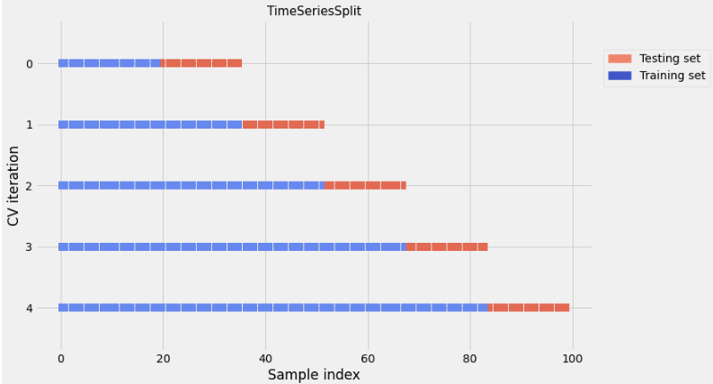

# JPX-Tokyo-Stock-Exchange Prediction 

## Introduction

The competition will involve building portfolios from the stocks eligible for predictions (around 2,000 stocks). Specifically, each participant ranks the stocks from highest to lowest expected returns and is evaluated on the difference in returns between the top and bottom 200 stocks. The participants have access to financial data from the Japanese market, such as stock information and historical stock prices to train and test your model.

The competitor with the highest Sharpe Ratio will result the winner of the challenge. In the competition the Sharpe Ratio is calculated as follows:


The Sharpe ratio was developed by Nobel laureate William F. Sharpe and is used to help investors understand the return of an investment compared to its risk

## Libraries

**Main libraries**


```python
import os
import gc
import pandas as pd 
import numpy as np
import seaborn as sns
from matplotlib import pyplot as plt
from decimal import ROUND_HALF_UP, Decimal
import plotly.graph_objects as go
import plotly.express as px
from plotly.subplots import make_subplots
import warnings
import re
warnings.filterwarnings('ignore')

pd.set_option('display.max_columns', None)
pd.set_option('display.max_rows', 25)
pd.set_option('display.max_colwidth', 3000)
```

**Data Pipeline libraries**


```python
from sklearn.pipeline import Pipeline 
from sklearn.preprocessing import OneHotEncoder
from sklearn.preprocessing import StandardScaler 
from sklearn.preprocessing import FunctionTransformer
from sklearn.compose import ColumnTransformer
```

**MLs Model + Crossvalidation libraries**


```python
from lightgbm import LGBMRegressor
import xgboost
from sklearn.ensemble import RandomForestRegressor
from sklearn.model_selection import TimeSeriesSplit
from sklearn.metrics import mean_squared_error,mean_absolute_error
```

**Optimization libraries**


```python
import optuna
```

## Datasets


**Datasets**


```python
%%time 
financials_df = pd.read_csv("/kaggle/input/jpx-tokyo-stock-exchange-prediction/train_files/financials.csv")
options_df = pd.read_csv("/kaggle/input/jpx-tokyo-stock-exchange-prediction/train_files/options.csv")
secondary_stock_prices_df = pd.read_csv("/kaggle/input/jpx-tokyo-stock-exchange-prediction/train_files/secondary_stock_prices.csv")
stock_prices_df = pd.read_csv("/kaggle/input/jpx-tokyo-stock-exchange-prediction/train_files/stock_prices.csv")
trades_df = pd.read_csv("/kaggle/input/jpx-tokyo-stock-exchange-prediction/train_files/trades.csv")
stocks_df = pd.read_csv("/kaggle/input/jpx-tokyo-stock-exchange-prediction/stock_list.csv")
```

  
**Suplemental files**


```python
financials_info = pd.read_csv("/kaggle/input/jpx-tokyo-stock-exchange-prediction/data_specifications/stock_fin_spec.csv")
options_info = pd.read_csv("/kaggle/input/jpx-tokyo-stock-exchange-prediction/data_specifications/options_spec.csv")
stock_prices_info = pd.read_csv("/kaggle/input/jpx-tokyo-stock-exchange-prediction/data_specifications/stock_price_spec.csv")
trades_info = pd.read_csv("/kaggle/input/jpx-tokyo-stock-exchange-prediction/data_specifications/trades_spec.csv")
stocks_info = pd.read_csv("/kaggle/input/jpx-tokyo-stock-exchange-prediction/data_specifications/stock_list_spec.csv")
```

## 1. Exploratory Data Analysis (EDA)

### Stock prices


File: stock_prices.csv

**File Description**

The core file of interest, including the daily closing price for each stock and the target column. Following is column information recorded in stock_price_spec.csv:


```python
stock_prices_info
```


<div>
<style scoped>
    .dataframe tbody tr th:only-of-type {
        vertical-align: middle;
    }

    .dataframe tbody tr th {
        vertical-align: top;
    }

    .dataframe thead th {
        text-align: right;
    }
</style>
<table border="1" class="dataframe">
  <thead>
    <tr style="text-align: right;">
      <th></th>
      <th>Column</th>
      <th>Sample value</th>
      <th>Type</th>
      <th>Addendum</th>
      <th>Remarks</th>
    </tr>
  </thead>
  <tbody>
    <tr>
      <th>0</th>
      <td>RowId</td>
      <td>20170104_1301</td>
      <td>string</td>
      <td>NaN</td>
      <td>Unique ID of price records</td>
    </tr>
    <tr>
      <th>1</th>
      <td>Date</td>
      <td>2017-01-04 0:00:00</td>
      <td>date</td>
      <td>NaN</td>
      <td>Trade date</td>
    </tr>
    <tr>
      <th>2</th>
      <td>SecuritiesCode</td>
      <td>1301</td>
      <td>Int64</td>
      <td>NaN</td>
      <td>Local securities code</td>
    </tr>
    <tr>
      <th>3</th>
      <td>Open</td>
      <td>2734</td>
      <td>float</td>
      <td>NaN</td>
      <td>first traded price on a day</td>
    </tr>
    <tr>
      <th>4</th>
      <td>High</td>
      <td>2755</td>
      <td>float</td>
      <td>NaN</td>
      <td>highest traded price on a day</td>
    </tr>
    <tr>
      <th>5</th>
      <td>Low</td>
      <td>2730</td>
      <td>float</td>
      <td>NaN</td>
      <td>lowest traded price on a day</td>
    </tr>
    <tr>
      <th>6</th>
      <td>Close</td>
      <td>2742</td>
      <td>float</td>
      <td>NaN</td>
      <td>last traded price on a day</td>
    </tr>
    <tr>
      <th>7</th>
      <td>Volume</td>
      <td>31400</td>
      <td>Int64</td>
      <td>NaN</td>
      <td>number of traded stocks on a day</td>
    </tr>
    <tr>
      <th>8</th>
      <td>AdjustmentFactor</td>
      <td>1</td>
      <td>float</td>
      <td>NaN</td>
      <td>to calculate theoretical price/volume when split/reverse-split happens (NOT including dividend/allotment of shares/)</td>
    </tr>
    <tr>
      <th>9</th>
      <td>SupervisionFlag</td>
      <td>FALSE</td>
      <td>boolean</td>
      <td>NaN</td>
      <td>Flag of Securities Under Supervision &amp; Securities to Be Delisted\nhttps://www.jpx.co.jp/english/listing/market-alerts/supervision/00-archives/index.html )</td>
    </tr>
    <tr>
      <th>10</th>
      <td>ExpectedDividend</td>
      <td>NaN</td>
      <td>float</td>
      <td>NaN</td>
      <td>Expected dividend value for ex-right date. This value is recorded 2 business days before ex-dividend date.</td>
    </tr>
    <tr>
      <th>11</th>
      <td>Target</td>
      <td>0.00073</td>
      <td>float</td>
      <td>NaN</td>
      <td>Change ratio of adjusted closing price between t+2 and t+1 where t+0 is TradeDate</td>
    </tr>
  </tbody>
</table>
</div>


```python
display(stock_prices_df.head(5))
```


<div>
<style scoped>
    .dataframe tbody tr th:only-of-type {
        vertical-align: middle;
    }

    .dataframe tbody tr th {
        vertical-align: top;
    }

    .dataframe thead th {
        text-align: right;
    }
</style>
<table border="1" class="dataframe">
  <thead>
    <tr style="text-align: right;">
      <th></th>
      <th>RowId</th>
      <th>Date</th>
      <th>SecuritiesCode</th>
      <th>Open</th>
      <th>High</th>
      <th>Low</th>
      <th>Close</th>
      <th>Volume</th>
      <th>AdjustmentFactor</th>
      <th>ExpectedDividend</th>
      <th>SupervisionFlag</th>
      <th>Target</th>
    </tr>
  </thead>
  <tbody>
    <tr>
      <th>0</th>
      <td>20170104_1301</td>
      <td>2017-01-04</td>
      <td>1301</td>
      <td>2734.0</td>
      <td>2755.0</td>
      <td>2730.0</td>
      <td>2742.0</td>
      <td>31400</td>
      <td>1.0</td>
      <td>NaN</td>
      <td>False</td>
      <td>0.000730</td>
    </tr>
    <tr>
      <th>1</th>
      <td>20170104_1332</td>
      <td>2017-01-04</td>
      <td>1332</td>
      <td>568.0</td>
      <td>576.0</td>
      <td>563.0</td>
      <td>571.0</td>
      <td>2798500</td>
      <td>1.0</td>
      <td>NaN</td>
      <td>False</td>
      <td>0.012324</td>
    </tr>
    <tr>
      <th>2</th>
      <td>20170104_1333</td>
      <td>2017-01-04</td>
      <td>1333</td>
      <td>3150.0</td>
      <td>3210.0</td>
      <td>3140.0</td>
      <td>3210.0</td>
      <td>270800</td>
      <td>1.0</td>
      <td>NaN</td>
      <td>False</td>
      <td>0.006154</td>
    </tr>
    <tr>
      <th>3</th>
      <td>20170104_1376</td>
      <td>2017-01-04</td>
      <td>1376</td>
      <td>1510.0</td>
      <td>1550.0</td>
      <td>1510.0</td>
      <td>1550.0</td>
      <td>11300</td>
      <td>1.0</td>
      <td>NaN</td>
      <td>False</td>
      <td>0.011053</td>
    </tr>
    <tr>
      <th>4</th>
      <td>20170104_1377</td>
      <td>2017-01-04</td>
      <td>1377</td>
      <td>3270.0</td>
      <td>3350.0</td>
      <td>3270.0</td>
      <td>3330.0</td>
      <td>150800</td>
      <td>1.0</td>
      <td>NaN</td>
      <td>False</td>
      <td>0.003026</td>
    </tr>
  </tbody>
</table>
</div>


```python
stock_prices_df.info()
```

    <class 'pandas.core.frame.DataFrame'>
    RangeIndex: 2332531 entries, 0 to 2332530
    Data columns (total 12 columns):
     #   Column            Dtype  
    ---  ------            -----  
     0   RowId             object 
     1   Date              object 
     2   SecuritiesCode    int64  
     3   Open              float64
     4   High              float64
     5   Low               float64
     6   Close             float64
     7   Volume            int64  
     8   AdjustmentFactor  float64
     9   ExpectedDividend  float64
     10  SupervisionFlag   bool   
     11  Target            float64
    dtypes: bool(1), float64(7), int64(2), object(2)
    memory usage: 198.0+ MB
    

**Missing values**


```python
display(pd.isna(stock_prices_df).sum()/len(stock_prices_df)*100)
```


    RowId                0.000000
    Date                 0.000000
    SecuritiesCode       0.000000
    Open                 0.326169
    High                 0.326169
    Low                  0.326169
    Close                0.326169
    Volume               0.000000
    AdjustmentFactor     0.000000
    ExpectedDividend    99.191222
    SupervisionFlag      0.000000
    Target               0.010204
    dtype: float64


```python
missing_high["Date"].value_counts()
```

    2020-10-01    1988
    2017-03-16      15
    2019-10-09      14
    2019-04-04      14
    2021-10-29      13
                  ... 
    2017-12-25       1
    2017-12-26       1
    2020-03-13       1
    2018-01-04       1
    2018-02-21       1
    Name: Date, Length: 1175, dtype: int64


<div>
<style scoped>
    .dataframe tbody tr th:only-of-type {
        vertical-align: middle;
    }

    .dataframe tbody tr th {
        vertical-align: top;
    }

    .dataframe thead th {
        text-align: right;
    }
</style>
<table border="1" class="dataframe">
  <thead>
    <tr style="text-align: right;">
      <th></th>
      <th>Date</th>
      <th>Count</th>
    </tr>
  </thead>
  <tbody>
    <tr>
      <th>0</th>
      <td>2020-10-01</td>
      <td>1988</td>
    </tr>
    <tr>
      <th>1</th>
      <td>2017-03-16</td>
      <td>15</td>
    </tr>
    <tr>
      <th>2</th>
      <td>2019-10-09</td>
      <td>14</td>
    </tr>
    <tr>
      <th>3</th>
      <td>2019-04-04</td>
      <td>14</td>
    </tr>
    <tr>
      <th>4</th>
      <td>2021-10-29</td>
      <td>13</td>
    </tr>
  </tbody>
</table>
</div>


2020-10-01 is the day with the most amount of missing data


### Stocks

stock_list.csv


**File Description**

Stock metadata. Following is column information recorded in stock_list_spec.csv:


```python
display(stocks_info)
```


<div>
<style scoped>
    .dataframe tbody tr th:only-of-type {
        vertical-align: middle;
    }

    .dataframe tbody tr th {
        vertical-align: top;
    }

    .dataframe thead th {
        text-align: right;
    }
</style>
<table border="1" class="dataframe">
  <thead>
    <tr style="text-align: right;">
      <th></th>
      <th>Column</th>
      <th>Sample value</th>
      <th>Type</th>
      <th>Addendum</th>
      <th>Remarks</th>
    </tr>
  </thead>
  <tbody>
    <tr>
      <th>0</th>
      <td>SecuritiesCode</td>
      <td>1301</td>
      <td>Int64</td>
      <td>NaN</td>
      <td>Local Securities Code</td>
    </tr>
    <tr>
      <th>1</th>
      <td>EffectiveDate</td>
      <td>20211230</td>
      <td>date</td>
      <td>NaN</td>
      <td>the effective date</td>
    </tr>
    <tr>
      <th>2</th>
      <td>Name</td>
      <td>KYOKUYO CO.,LTD.</td>
      <td>string</td>
      <td>NaN</td>
      <td>Name of security</td>
    </tr>
    <tr>
      <th>3</th>
      <td>Section/Products</td>
      <td>First Section (Domestic)</td>
      <td>string</td>
      <td>NaN</td>
      <td>Section/Product</td>
    </tr>
    <tr>
      <th>4</th>
      <td>NewMarketSegment</td>
      <td>Prime Market</td>
      <td>string</td>
      <td>NaN</td>
      <td>New market segment effective from 2022-04-04 (as of 15:30 JST on Mar 11 2022)\nref. https://www.jpx.co.jp/english/equities/market-restructure/market-segments/index.html</td>
    </tr>
    <tr>
      <th>5</th>
      <td>33SectorCode</td>
      <td>50</td>
      <td>Int64</td>
      <td>NaN</td>
      <td>33 Sector Name\n\nref. https://www.jpx.co.jp/english/markets/indices/line-up/files/e_fac_13_sector.pdf</td>
    </tr>
    <tr>
      <th>6</th>
      <td>33SectorName</td>
      <td>Fishery, Agriculture and Forestry</td>
      <td>string</td>
      <td>NaN</td>
      <td>33 Sector Name\n\nref. https://www.jpx.co.jp/english/markets/indices/line-up/files/e_fac_13_sector.pdf</td>
    </tr>
    <tr>
      <th>7</th>
      <td>17SectorCode</td>
      <td>1</td>
      <td>Int64</td>
      <td>NaN</td>
      <td>17 Sector Code\nref. https://www.jpx.co.jp/english/markets/indices/line-up/files/e_fac_13_sector.pdf</td>
    </tr>
    <tr>
      <th>8</th>
      <td>17SectorName</td>
      <td>FOODS</td>
      <td>string</td>
      <td>NaN</td>
      <td>17 Sector Name\nref. https://www.jpx.co.jp/english/markets/indices/line-up/files/e_fac_13_sector.pdf</td>
    </tr>
    <tr>
      <th>9</th>
      <td>NewIndexSeriesSizeCode</td>
      <td>7</td>
      <td>Int64</td>
      <td>NaN</td>
      <td>TOPIX New Index Series code\n\nref. https://www.jpx.co.jp/english/markets/indices/line-up/files/e_fac_12_size.pdf</td>
    </tr>
    <tr>
      <th>10</th>
      <td>NewIndexSeriesSize</td>
      <td>TOPIX Small 2</td>
      <td>string</td>
      <td>NaN</td>
      <td>TOPIX New Index Series Name\n\nref. https://www.jpx.co.jp/english/markets/indices/line-up/files/e_fac_12_size.pdf</td>
    </tr>
    <tr>
      <th>11</th>
      <td>TradeDate</td>
      <td>20211230</td>
      <td>date</td>
      <td>NaN</td>
      <td>Trade date to calculate MarketCapitalization</td>
    </tr>
    <tr>
      <th>12</th>
      <td>Close</td>
      <td>3080</td>
      <td>float</td>
      <td>NaN</td>
      <td>Close price to calculate MarketCapitalization</td>
    </tr>
    <tr>
      <th>13</th>
      <td>IssuedShares</td>
      <td>1.09E+07</td>
      <td>float</td>
      <td>NaN</td>
      <td>Issued shares</td>
    </tr>
    <tr>
      <th>14</th>
      <td>MarketCapitalization</td>
      <td>33659111640</td>
      <td>float</td>
      <td>NaN</td>
      <td>Market capitalization on Dec 3 2021</td>
    </tr>
    <tr>
      <th>15</th>
      <td>Universe0</td>
      <td>TRUE</td>
      <td>boolean</td>
      <td>NaN</td>
      <td>a flag of prediction target universe (top 2000 stocks by market capitalization)</td>
    </tr>
  </tbody>
</table>
</div>


```python
display(stocks_df.head(5))
```


<div>
<style scoped>
    .dataframe tbody tr th:only-of-type {
        vertical-align: middle;
    }

    .dataframe tbody tr th {
        vertical-align: top;
    }

    .dataframe thead th {
        text-align: right;
    }
</style>
<table border="1" class="dataframe">
  <thead>
    <tr style="text-align: right;">
      <th></th>
      <th>SecuritiesCode</th>
      <th>EffectiveDate</th>
      <th>Name</th>
      <th>Section/Products</th>
      <th>NewMarketSegment</th>
      <th>33SectorCode</th>
      <th>33SectorName</th>
      <th>17SectorCode</th>
      <th>17SectorName</th>
      <th>NewIndexSeriesSizeCode</th>
      <th>NewIndexSeriesSize</th>
      <th>TradeDate</th>
      <th>Close</th>
      <th>IssuedShares</th>
      <th>MarketCapitalization</th>
      <th>Universe0</th>
    </tr>
  </thead>
  <tbody>
    <tr>
      <th>0</th>
      <td>1301</td>
      <td>20211230</td>
      <td>KYOKUYO CO.,LTD.</td>
      <td>First Section (Domestic)</td>
      <td>Prime Market</td>
      <td>50</td>
      <td>Fishery, Agriculture and Forestry</td>
      <td>1</td>
      <td>FOODS</td>
      <td>7</td>
      <td>TOPIX Small 2</td>
      <td>20211230.0</td>
      <td>3080.0</td>
      <td>1.092828e+07</td>
      <td>3.365911e+10</td>
      <td>True</td>
    </tr>
    <tr>
      <th>1</th>
      <td>1305</td>
      <td>20211230</td>
      <td>Daiwa ETF-TOPIX</td>
      <td>ETFs/ ETNs</td>
      <td>NaN</td>
      <td>-</td>
      <td>-</td>
      <td>-</td>
      <td>-</td>
      <td>-</td>
      <td>-</td>
      <td>20211230.0</td>
      <td>2097.0</td>
      <td>3.634636e+09</td>
      <td>7.621831e+12</td>
      <td>False</td>
    </tr>
    <tr>
      <th>2</th>
      <td>1306</td>
      <td>20211230</td>
      <td>NEXT FUNDS TOPIX Exchange Traded Fund</td>
      <td>ETFs/ ETNs</td>
      <td>NaN</td>
      <td>-</td>
      <td>-</td>
      <td>-</td>
      <td>-</td>
      <td>-</td>
      <td>-</td>
      <td>20211230.0</td>
      <td>2073.5</td>
      <td>7.917718e+09</td>
      <td>1.641739e+13</td>
      <td>False</td>
    </tr>
    <tr>
      <th>3</th>
      <td>1308</td>
      <td>20211230</td>
      <td>Nikko Exchange Traded Index Fund TOPIX</td>
      <td>ETFs/ ETNs</td>
      <td>NaN</td>
      <td>-</td>
      <td>-</td>
      <td>-</td>
      <td>-</td>
      <td>-</td>
      <td>-</td>
      <td>20211230.0</td>
      <td>2053.0</td>
      <td>3.736943e+09</td>
      <td>7.671945e+12</td>
      <td>False</td>
    </tr>
    <tr>
      <th>4</th>
      <td>1309</td>
      <td>20211230</td>
      <td>NEXT FUNDS ChinaAMC SSE50 Index Exchange Traded Fund</td>
      <td>ETFs/ ETNs</td>
      <td>NaN</td>
      <td>-</td>
      <td>-</td>
      <td>-</td>
      <td>-</td>
      <td>-</td>
      <td>-</td>
      <td>20211230.0</td>
      <td>44280.0</td>
      <td>7.263200e+04</td>
      <td>3.216145e+09</td>
      <td>False</td>
    </tr>
  </tbody>
</table>
</div>


```python
stocks_df.info()
```

    <class 'pandas.core.frame.DataFrame'>
    RangeIndex: 4417 entries, 0 to 4416
    Data columns (total 16 columns):
     #   Column                  Non-Null Count  Dtype  
    ---  ------                  --------------  -----  
     0   SecuritiesCode          4417 non-null   int64  
     1   EffectiveDate           4417 non-null   int64  
     2   Name                    4417 non-null   object 
     3   Section/Products        4417 non-null   object 
     4   NewMarketSegment        3772 non-null   object 
     5   33SectorCode            4417 non-null   object 
     6   33SectorName            4417 non-null   object 
     7   17SectorCode            4417 non-null   object 
     8   17SectorName            4417 non-null   object 
     9   NewIndexSeriesSizeCode  4417 non-null   object 
     10  NewIndexSeriesSize      4417 non-null   object 
     11  TradeDate               4121 non-null   float64
     12  Close                   4121 non-null   float64
     13  IssuedShares            4121 non-null   float64
     14  MarketCapitalization    4121 non-null   float64
     15  Universe0               4417 non-null   bool   
    dtypes: bool(1), float64(4), int64(2), object(9)
    memory usage: 522.1+ KB
    


```python
display(pd.isna(stocks_df).sum()/len(stocks_df)*100)
```


    SecuritiesCode             0.000000
    EffectiveDate              0.000000
    Name                       0.000000
    Section/Products           0.000000
    NewMarketSegment          14.602671
    33SectorCode               0.000000
    33SectorName               0.000000
    17SectorCode               0.000000
    17SectorName               0.000000
    NewIndexSeriesSizeCode     0.000000
    NewIndexSeriesSize         0.000000
    TradeDate                  6.701381
    Close                      6.701381
    IssuedShares               6.701381
    MarketCapitalization       6.701381
    Universe0                  0.000000
    dtype: float64


</style>
<table border="1" class="dataframe">
  <thead>
    <tr style="text-align: right;">
      <th></th>
      <th>SecuritiesCode</th>
      <th>EffectiveDate</th>
      <th>Name</th>
      <th>Section/Products</th>
      <th>NewMarketSegment</th>
      <th>33SectorCode</th>
      <th>33SectorName</th>
      <th>17SectorCode</th>
      <th>17SectorName</th>
      <th>NewIndexSeriesSizeCode</th>
      <th>NewIndexSeriesSize</th>
      <th>TradeDate</th>
      <th>Close</th>
      <th>IssuedShares</th>
      <th>MarketCapitalization</th>
      <th>Universe0</th>
    </tr>
  </thead>
  <tbody>
    <tr>
      <th>62</th>
      <td>1408</td>
      <td>20000101</td>
      <td>ITbook Co.,LTD.</td>
      <td>Mothers (Domestic)</td>
      <td>NaN</td>
      <td>-</td>
      <td>-</td>
      <td>-</td>
      <td>-</td>
      <td>-</td>
      <td>-</td>
      <td>NaN</td>
      <td>NaN</td>
      <td>NaN</td>
      <td>NaN</td>
      <td>False</td>
    </tr>
    <tr>
      <th>164</th>
      <td>1606</td>
      <td>20000101</td>
      <td>Japan Drilling Co.,Ltd.</td>
      <td>First Section (Domestic)</td>
      <td>NaN</td>
      <td>1050</td>
      <td>Mining</td>
      <td>2</td>
      <td>ENERGY RESOURCES</td>
      <td>-</td>
      <td>-</td>
      <td>NaN</td>
      <td>NaN</td>
      <td>NaN</td>
      <td>NaN</td>
      <td>False</td>
    </tr>
    <tr>
      <th>231</th>
      <td>1722</td>
      <td>20000101</td>
      <td>MISAWA HOMES CO.,LTD.</td>
      <td>First Section (Domestic)</td>
      <td>NaN</td>
      <td>2050</td>
      <td>Construction</td>
      <td>3</td>
      <td>CONSTRUCTION &amp; MATERIALS</td>
      <td>-</td>
      <td>-</td>
      <td>NaN</td>
      <td>NaN</td>
      <td>NaN</td>
      <td>NaN</td>
      <td>False</td>
    </tr>
    <tr>
      <th>235</th>
      <td>1728</td>
      <td>20000101</td>
      <td>MISAWA HOMES CHUGOKU CO.,LTD.</td>
      <td>JASDAQ(Standard / Domestic)</td>
      <td>NaN</td>
      <td>-</td>
      <td>-</td>
      <td>-</td>
      <td>-</td>
      <td>-</td>
      <td>-</td>
      <td>NaN</td>
      <td>NaN</td>
      <td>NaN</td>
      <td>NaN</td>
      <td>False</td>
    </tr>
    <tr>
      <th>252</th>
      <td>1782</td>
      <td>20000101</td>
      <td>Joban Kaihatsu Co.,Ltd.</td>
      <td>JASDAQ(Standard / Domestic)</td>
      <td>NaN</td>
      <td>-</td>
      <td>-</td>
      <td>-</td>
      <td>-</td>
      <td>-</td>
      <td>-</td>
      <td>NaN</td>
      <td>NaN</td>
      <td>NaN</td>
      <td>NaN</td>
      <td>False</td>
    </tr>
  </tbody>
</table>
</div>


```python
stocks_df["Universe0"].value_counts()
```


    False    2417
    True     2000
    Name: Universe0, dtype: int64


The values marked as True are the biggest 2000 Stocks in Japan. The stock ranking must be done using those products.


## Selecting the top 2000 Stocks (Universe0 Flag = True)


```python
stocks2000_df = stocks_df[stocks_df["Universe0"]]
display(stocks2000_df.head())
```


<div>
<style scoped>
    .dataframe tbody tr th:only-of-type {
        vertical-align: middle;
    }

    .dataframe tbody tr th {
        vertical-align: top;
    }

    .dataframe thead th {
        text-align: right;
    }
</style>
<table border="1" class="dataframe">
  <thead>
    <tr style="text-align: right;">
      <th></th>
      <th>SecuritiesCode</th>
      <th>EffectiveDate</th>
      <th>Name</th>
      <th>Section/Products</th>
      <th>NewMarketSegment</th>
      <th>33SectorCode</th>
      <th>33SectorName</th>
      <th>17SectorCode</th>
      <th>17SectorName</th>
      <th>NewIndexSeriesSizeCode</th>
      <th>NewIndexSeriesSize</th>
      <th>TradeDate</th>
      <th>Close</th>
      <th>IssuedShares</th>
      <th>MarketCapitalization</th>
      <th>Universe0</th>
    </tr>
  </thead>
  <tbody>
    <tr>
      <th>0</th>
      <td>1301</td>
      <td>20211230</td>
      <td>KYOKUYO CO.,LTD.</td>
      <td>First Section (Domestic)</td>
      <td>Prime Market</td>
      <td>50</td>
      <td>Fishery, Agriculture and Forestry</td>
      <td>1</td>
      <td>FOODS</td>
      <td>7</td>
      <td>TOPIX Small 2</td>
      <td>20211230.0</td>
      <td>3080.0</td>
      <td>10928283.0</td>
      <td>3.365911e+10</td>
      <td>True</td>
    </tr>
    <tr>
      <th>19</th>
      <td>1332</td>
      <td>20211230</td>
      <td>Nippon Suisan Kaisha,Ltd.</td>
      <td>First Section (Domestic)</td>
      <td>Prime Market</td>
      <td>50</td>
      <td>Fishery, Agriculture and Forestry</td>
      <td>1</td>
      <td>FOODS</td>
      <td>4</td>
      <td>TOPIX Mid400</td>
      <td>20211230.0</td>
      <td>543.0</td>
      <td>312430277.0</td>
      <td>1.696496e+11</td>
      <td>True</td>
    </tr>
    <tr>
      <th>20</th>
      <td>1333</td>
      <td>20211230</td>
      <td>Maruha Nichiro Corporation</td>
      <td>First Section (Domestic)</td>
      <td>Prime Market</td>
      <td>50</td>
      <td>Fishery, Agriculture and Forestry</td>
      <td>1</td>
      <td>FOODS</td>
      <td>4</td>
      <td>TOPIX Mid400</td>
      <td>20211230.0</td>
      <td>2405.0</td>
      <td>52656910.0</td>
      <td>1.266399e+11</td>
      <td>True</td>
    </tr>
    <tr>
      <th>37</th>
      <td>1375</td>
      <td>20211230</td>
      <td>YUKIGUNI MAITAKE CO.,LTD.</td>
      <td>First Section (Domestic)</td>
      <td>Prime Market</td>
      <td>50</td>
      <td>Fishery, Agriculture and Forestry</td>
      <td>1</td>
      <td>FOODS</td>
      <td>6</td>
      <td>TOPIX Small 1</td>
      <td>20211230.0</td>
      <td>1196.0</td>
      <td>39910700.0</td>
      <td>4.773320e+10</td>
      <td>True</td>
    </tr>
    <tr>
      <th>38</th>
      <td>1376</td>
      <td>20211230</td>
      <td>KANEKO SEEDS CO.,LTD.</td>
      <td>First Section (Domestic)</td>
      <td>Standard Market</td>
      <td>50</td>
      <td>Fishery, Agriculture and Forestry</td>
      <td>1</td>
      <td>FOODS</td>
      <td>7</td>
      <td>TOPIX Small 2</td>
      <td>20211230.0</td>
      <td>1504.0</td>
      <td>11772626.0</td>
      <td>1.770603e+10</td>
      <td>True</td>
    </tr>
  </tbody>
</table>
</div>
   


```python
stocks2000_df["33SectorName"].value_counts()
```


    Information & Communication          229
    Services                             201
    Retail Trade                         179
    Electric Appliances                  156
    Wholesale Trade                      151
                                        ... 
    Oil and Coal Products                  9
    Fishery, Agriculture and Forestry      8
    Marine Transportation                  7
    Mining                                 5
    Air Transportation                     4
    Name: 33SectorName, Length: 33, dtype: int64


```python
section2000 = stocks2000_df["Section/Products"].value_counts().to_frame()
section2000.reset_index(inplace=True)
section2000["percentage"] = section2000["Section/Products"]/section2000["Section/Products"].sum()*100
section2000
```


<div>
<style scoped>
    .dataframe tbody tr th:only-of-type {
        vertical-align: middle;
    }

    .dataframe tbody tr th {
        vertical-align: top;
    }

    .dataframe thead th {
        text-align: right;
    }
</style>
<table border="1" class="dataframe">
  <thead>
    <tr style="text-align: right;">
      <th></th>
      <th>index</th>
      <th>Section/Products</th>
      <th>percentage</th>
    </tr>
  </thead>
  <tbody>
    <tr>
      <th>0</th>
      <td>First Section (Domestic)</td>
      <td>1711</td>
      <td>85.55</td>
    </tr>
    <tr>
      <th>1</th>
      <td>JASDAQ(Standard / Domestic)</td>
      <td>107</td>
      <td>5.35</td>
    </tr>
    <tr>
      <th>2</th>
      <td>Second Section(Domestic)</td>
      <td>90</td>
      <td>4.50</td>
    </tr>
    <tr>
      <th>3</th>
      <td>Mothers (Domestic)</td>
      <td>85</td>
      <td>4.25</td>
    </tr>
    <tr>
      <th>4</th>
      <td>JASDAQ(Growth/Domestic)</td>
      <td>7</td>
      <td>0.35</td>
    </tr>
  </tbody>
</table>
</div>


## Merging Stock metadate with stock price


```python
df_prices =  merge_metadata(stock_prices_df, stocks2000_df)
```


<div>
<style scoped>
    .dataframe tbody tr th:only-of-type {
        vertical-align: middle;
    }

    .dataframe tbody tr th {
        vertical-align: top;
    }

    .dataframe thead th {
        text-align: right;
    }
</style>
<table border="1" class="dataframe">
  <thead>
    <tr style="text-align: right;">
      <th></th>
      <th>RowId</th>
      <th>Date</th>
      <th>SecuritiesCode</th>
      <th>Open</th>
      <th>High</th>
      <th>Low</th>
      <th>Close</th>
      <th>Volume</th>
      <th>AdjustmentFactor</th>
      <th>ExpectedDividend</th>
      <th>SupervisionFlag</th>
      <th>Target</th>
      <th>Name</th>
      <th>Section/Products</th>
      <th>NewMarketSegment</th>
      <th>33SectorCode</th>
      <th>33SectorName</th>
      <th>17SectorCode</th>
      <th>17SectorName</th>
      <th>NewIndexSeriesSizeCode</th>
      <th>NewIndexSeriesSize</th>
      <th>IssuedShares</th>
      <th>MarketCapitalization</th>
    </tr>
  </thead>
  <tbody>
    <tr>
      <th>0</th>
      <td>20170104_1301</td>
      <td>2017-01-04</td>
      <td>1301</td>
      <td>2734.0</td>
      <td>2755.0</td>
      <td>2730.0</td>
      <td>2742.0</td>
      <td>31400</td>
      <td>1.0</td>
      <td>NaN</td>
      <td>False</td>
      <td>0.000730</td>
      <td>KYOKUYO CO.,LTD.</td>
      <td>First Section (Domestic)</td>
      <td>Prime Market</td>
      <td>50</td>
      <td>Fishery, Agriculture and Forestry</td>
      <td>1</td>
      <td>FOODS</td>
      <td>7</td>
      <td>TOPIX Small 2</td>
      <td>10928283.0</td>
      <td>3.365911e+10</td>
    </tr>
    <tr>
      <th>1</th>
      <td>20170105_1301</td>
      <td>2017-01-05</td>
      <td>1301</td>
      <td>2743.0</td>
      <td>2747.0</td>
      <td>2735.0</td>
      <td>2738.0</td>
      <td>17900</td>
      <td>1.0</td>
      <td>NaN</td>
      <td>False</td>
      <td>0.002920</td>
      <td>KYOKUYO CO.,LTD.</td>
      <td>First Section (Domestic)</td>
      <td>Prime Market</td>
      <td>50</td>
      <td>Fishery, Agriculture and Forestry</td>
      <td>1</td>
      <td>FOODS</td>
      <td>7</td>
      <td>TOPIX Small 2</td>
      <td>10928283.0</td>
      <td>3.365911e+10</td>
    </tr>
    <tr>
      <th>2</th>
      <td>20170106_1301</td>
      <td>2017-01-06</td>
      <td>1301</td>
      <td>2734.0</td>
      <td>2744.0</td>
      <td>2720.0</td>
      <td>2740.0</td>
      <td>19900</td>
      <td>1.0</td>
      <td>NaN</td>
      <td>False</td>
      <td>-0.001092</td>
      <td>KYOKUYO CO.,LTD.</td>
      <td>First Section (Domestic)</td>
      <td>Prime Market</td>
      <td>50</td>
      <td>Fishery, Agriculture and Forestry</td>
      <td>1</td>
      <td>FOODS</td>
      <td>7</td>
      <td>TOPIX Small 2</td>
      <td>10928283.0</td>
      <td>3.365911e+10</td>
    </tr>
    <tr>
      <th>3</th>
      <td>20170110_1301</td>
      <td>2017-01-10</td>
      <td>1301</td>
      <td>2745.0</td>
      <td>2754.0</td>
      <td>2735.0</td>
      <td>2748.0</td>
      <td>24200</td>
      <td>1.0</td>
      <td>NaN</td>
      <td>False</td>
      <td>-0.005100</td>
      <td>KYOKUYO CO.,LTD.</td>
      <td>First Section (Domestic)</td>
      <td>Prime Market</td>
      <td>50</td>
      <td>Fishery, Agriculture and Forestry</td>
      <td>1</td>
      <td>FOODS</td>
      <td>7</td>
      <td>TOPIX Small 2</td>
      <td>10928283.0</td>
      <td>3.365911e+10</td>
    </tr>
    <tr>
      <th>4</th>
      <td>20170111_1301</td>
      <td>2017-01-11</td>
      <td>1301</td>
      <td>2748.0</td>
      <td>2752.0</td>
      <td>2737.0</td>
      <td>2745.0</td>
      <td>9300</td>
      <td>1.0</td>
      <td>NaN</td>
      <td>False</td>
      <td>-0.003295</td>
      <td>KYOKUYO CO.,LTD.</td>
      <td>First Section (Domestic)</td>
      <td>Prime Market</td>
      <td>50</td>
      <td>Fishery, Agriculture and Forestry</td>
      <td>1</td>
      <td>FOODS</td>
      <td>7</td>
      <td>TOPIX Small 2</td>
      <td>10928283.0</td>
      <td>3.365911e+10</td>
    </tr>
  </tbody>
</table>
</div>


**Calculating Target variable statistics**
Total Target mean value

```python
mean_securities_df = df_prices.groupby(["SecuritiesCode"])["Target"].mean()
total_mean_securities = mean_securities_df.mean()
total_mean_securities
```


    0.0004714963317502812

**Target Securities mean**


**Note** Kurtosis >>> 3, it means that the tails of the distribution are way bigger than the normal distribution. In this case a higher Kurtosis will mean higher volatity in the stock performances (some stocks will perform much better than others), which will impact negatively in the Sharpe value.


```python
mean_date_df = df_prices.groupby(["Date"])["Target"].mean()
total_mean_date = mean_date_df.mean()
total_mean_date
```


    0.00044572606297777287

**Target Securities Date**


**Note**  A Kurtosis bigger than 3 will mean that there will be volatity in the same stock performance for different dates.


## Grupying the Target by Sector and Section

### Target vs Sector33


```python
target_sector = df_prices.groupby(["33SectorName"])["Target"].mean()
target_sector.sort_values(inplace=True, ascending=False)

```


```python
target_sector = target_sector.to_frame()
target_sector.reset_index(inplace= True)
```


```python
fig, ax = plt.subplots(figsize = (12,6))    
fig = sns.barplot(x = "33SectorName", y = "Target", data = target_sector, ax=ax)
ax.set_title("Target Mean of Sectors")
ax.tick_params(axis='x', rotation=90)
```


    


    
**Note** It seems like stocks belonging to the different Sector present a different performance. Therefore the Sector info will be added to the model

### Target vs Section


```python
target_section = df_prices.groupby(["Section/Products"])["Target"].mean()
target_section.sort_values(inplace=True, ascending=False)

```


```python
target_section = target_section.to_frame()
target_section.reset_index(inplace= True)
```


```python
fig, ax = plt.subplots(figsize = (12,6))    
fig = sns.barplot(x = "Section/Products", y = "Target", data = target_section, ax=ax)
ax.set_title("Target Mean of Sections")
ax.tick_params(axis='x', rotation=90)
```


    
    


    
**Note** It seems like stocks belonging to the different Section present a different performance. Therefore the Sector info will be added to the model


### Secondary stock prices

secondary_stock_prices.csv

**File Description**

Securities with low liquidity (few opportunities to trade). Following is column information recorded in stock_price_spec.csv:


```python
stock_prices_info
```


<div>
<style scoped>
    .dataframe tbody tr th:only-of-type {
        vertical-align: middle;
    }

    .dataframe tbody tr th {
        vertical-align: top;
    }

    .dataframe thead th {
        text-align: right;
    }
</style>
<table border="1" class="dataframe">
  <thead>
    <tr style="text-align: right;">
      <th></th>
      <th>Column</th>
      <th>Sample value</th>
      <th>Type</th>
      <th>Addendum</th>
      <th>Remarks</th>
    </tr>
  </thead>
  <tbody>
    <tr>
      <th>0</th>
      <td>RowId</td>
      <td>20170104_1301</td>
      <td>string</td>
      <td>NaN</td>
      <td>Unique ID of price records</td>
    </tr>
    <tr>
      <th>1</th>
      <td>Date</td>
      <td>2017-01-04 0:00:00</td>
      <td>date</td>
      <td>NaN</td>
      <td>Trade date</td>
    </tr>
    <tr>
      <th>2</th>
      <td>SecuritiesCode</td>
      <td>1301</td>
      <td>Int64</td>
      <td>NaN</td>
      <td>Local securities code</td>
    </tr>
    <tr>
      <th>3</th>
      <td>Open</td>
      <td>2734</td>
      <td>float</td>
      <td>NaN</td>
      <td>first traded price on a day</td>
    </tr>
    <tr>
      <th>4</th>
      <td>High</td>
      <td>2755</td>
      <td>float</td>
      <td>NaN</td>
      <td>highest traded price on a day</td>
    </tr>
    <tr>
      <th>5</th>
      <td>Low</td>
      <td>2730</td>
      <td>float</td>
      <td>NaN</td>
      <td>lowest traded price on a day</td>
    </tr>
    <tr>
      <th>6</th>
      <td>Close</td>
      <td>2742</td>
      <td>float</td>
      <td>NaN</td>
      <td>last traded price on a day</td>
    </tr>
    <tr>
      <th>7</th>
      <td>Volume</td>
      <td>31400</td>
      <td>Int64</td>
      <td>NaN</td>
      <td>number of traded stocks on a day</td>
    </tr>
    <tr>
      <th>8</th>
      <td>AdjustmentFactor</td>
      <td>1</td>
      <td>float</td>
      <td>NaN</td>
      <td>to calculate theoretical price/volume when split/reverse-split happens (NOT including dividend/allotment of shares/)</td>
    </tr>
    <tr>
      <th>9</th>
      <td>SupervisionFlag</td>
      <td>FALSE</td>
      <td>boolean</td>
      <td>NaN</td>
      <td>Flag of Securities Under Supervision &amp; Securities to Be Delisted\nhttps://www.jpx.co.jp/english/listing/market-alerts/supervision/00-archives/index.html )</td>
    </tr>
    <tr>
      <th>10</th>
      <td>ExpectedDividend</td>
      <td>NaN</td>
      <td>float</td>
      <td>NaN</td>
      <td>Expected dividend value for ex-right date. This value is recorded 2 business days before ex-dividend date.</td>
    </tr>
    <tr>
      <th>11</th>
      <td>Target</td>
      <td>0.00073</td>
      <td>float</td>
      <td>NaN</td>
      <td>Change ratio of adjusted closing price between t+2 and t+1 where t+0 is TradeDate</td>
    </tr>
  </tbody>
</table>
</div>


```python
display(secondary_stock_prices_df.head(5))
```


<div>
<style scoped>
    .dataframe tbody tr th:only-of-type {
        vertical-align: middle;
    }

    .dataframe tbody tr th {
        vertical-align: top;
    }

    .dataframe thead th {
        text-align: right;
    }
</style>
<table border="1" class="dataframe">
  <thead>
    <tr style="text-align: right;">
      <th></th>
      <th>RowId</th>
      <th>Date</th>
      <th>SecuritiesCode</th>
      <th>Open</th>
      <th>High</th>
      <th>Low</th>
      <th>Close</th>
      <th>Volume</th>
      <th>AdjustmentFactor</th>
      <th>ExpectedDividend</th>
      <th>SupervisionFlag</th>
      <th>Target</th>
    </tr>
  </thead>
  <tbody>
    <tr>
      <th>0</th>
      <td>20170104_1305</td>
      <td>2017-01-04</td>
      <td>1305</td>
      <td>1594.0</td>
      <td>1618.0</td>
      <td>1594.0</td>
      <td>1615.0</td>
      <td>538190</td>
      <td>1.0</td>
      <td>NaN</td>
      <td>False</td>
      <td>-0.001855</td>
    </tr>
    <tr>
      <th>1</th>
      <td>20170104_1306</td>
      <td>2017-01-04</td>
      <td>1306</td>
      <td>1575.0</td>
      <td>1595.0</td>
      <td>1573.0</td>
      <td>1593.0</td>
      <td>2494980</td>
      <td>1.0</td>
      <td>NaN</td>
      <td>False</td>
      <td>-0.000627</td>
    </tr>
    <tr>
      <th>2</th>
      <td>20170104_1308</td>
      <td>2017-01-04</td>
      <td>1308</td>
      <td>1557.0</td>
      <td>1580.0</td>
      <td>1557.0</td>
      <td>1578.0</td>
      <td>526100</td>
      <td>1.0</td>
      <td>NaN</td>
      <td>False</td>
      <td>-0.001900</td>
    </tr>
    <tr>
      <th>3</th>
      <td>20170104_1309</td>
      <td>2017-01-04</td>
      <td>1309</td>
      <td>28810.0</td>
      <td>29000.0</td>
      <td>28520.0</td>
      <td>28780.0</td>
      <td>403</td>
      <td>1.0</td>
      <td>NaN</td>
      <td>False</td>
      <td>0.005237</td>
    </tr>
    <tr>
      <th>4</th>
      <td>20170104_1311</td>
      <td>2017-01-04</td>
      <td>1311</td>
      <td>717.0</td>
      <td>735.0</td>
      <td>717.0</td>
      <td>734.0</td>
      <td>5470</td>
      <td>1.0</td>
      <td>NaN</td>
      <td>False</td>
      <td>0.001359</td>
    </tr>
  </tbody>
</table>
</div>


```python
secondary_stock_prices_df.info()
```

    <class 'pandas.core.frame.DataFrame'>
    RangeIndex: 2384575 entries, 0 to 2384574
    Data columns (total 12 columns):
     #   Column            Dtype  
    ---  ------            -----  
     0   RowId             object 
     1   Date              object 
     2   SecuritiesCode    int64  
     3   Open              float64
     4   High              float64
     5   Low               float64
     6   Close             float64
     7   Volume            int64  
     8   AdjustmentFactor  float64
     9   ExpectedDividend  float64
     10  SupervisionFlag   bool   
     11  Target            float64
    dtypes: bool(1), float64(7), int64(2), object(2)
    memory usage: 202.4+ MB
    


```python
display(pd.isna(secondary_stock_prices_df).sum()/len(secondary_stock_prices_df)*100)
```


    RowId                0.000000
    Date                 0.000000
    SecuritiesCode       0.000000
    Open                 3.847688
    High                 3.847688
    Low                  3.847688
    Close                3.847688
    Volume               0.000000
    AdjustmentFactor     0.000000
    ExpectedDividend    99.225942
    SupervisionFlag      0.000000
    Target               0.030110
    dtype: float64


As happened with the primary stock list 2020-10-01 is the day with the most amount of missing data


**NOTE:** Secondary stock prices price movement is correlated with the main stock price movement. Due to the limited amount dedicated to this project, this data will not be included in the prediction model

## Trades

trades.csv

**File Description**

Aggregated summary of trading volumes from the previous business week. Following is column information recorded in trades_spec.csv:


```python
trades_info
```


<div>
<style scoped>
    .dataframe tbody tr th:only-of-type {
        vertical-align: middle;
    }

    .dataframe tbody tr th {
        vertical-align: top;
    }

    .dataframe thead th {
        text-align: right;
    }
</style>
<table border="1" class="dataframe">
  <thead>
    <tr style="text-align: right;">
      <th></th>
      <th>index</th>
      <th>Column</th>
      <th>Sample value</th>
      <th>Type</th>
      <th>Addendum</th>
      <th>Remarks</th>
    </tr>
  </thead>
  <tbody>
    <tr>
      <th>0</th>
      <td>0</td>
      <td>PublishedDate</td>
      <td>2017-01-13</td>
      <td>date</td>
      <td>NaN</td>
      <td>data published data, usually Thursday on the following week.</td>
    </tr>
    <tr>
      <th>1</th>
      <td>0</td>
      <td>StartDate</td>
      <td>2017-01-04</td>
      <td>date</td>
      <td>NaN</td>
      <td>The first trading date in this trading week</td>
    </tr>
    <tr>
      <th>2</th>
      <td>1</td>
      <td>EndDate</td>
      <td>2017-01-06</td>
      <td>date</td>
      <td>NaN</td>
      <td>The last trading date in this trading week</td>
    </tr>
    <tr>
      <th>3</th>
      <td>2</td>
      <td>Section</td>
      <td>Prime Market (First Section)</td>
      <td>string</td>
      <td>NaN</td>
      <td>Market division name</td>
    </tr>
    <tr>
      <th>4</th>
      <td>3</td>
      <td>TotalSales</td>
      <td>8476800009</td>
      <td>Int64</td>
      <td>NaN</td>
      <td>Please check below documents.\n\nPublished file\nhttps://www.jpx.co.jp/english/markets/statistics-equities/investor-type/b5b4pj000004r9zg-att/stock_val_1_220301.pdf\n\nExplanation of the Trading by Type of Investors\nhttps://www.jpx.co.jp/english/markets/statistics-equities/investor-type/07.html</td>
    </tr>
    <tr>
      <th>...</th>
      <td>...</td>
      <td>...</td>
      <td>...</td>
      <td>...</td>
      <td>...</td>
      <td>...</td>
    </tr>
    <tr>
      <th>51</th>
      <td>50</td>
      <td>TrustBanksBalance</td>
      <td>-47609502</td>
      <td>Int64</td>
      <td>NaN</td>
      <td>NaN</td>
    </tr>
    <tr>
      <th>52</th>
      <td>51</td>
      <td>OtherFinancialInstitutionsSales</td>
      <td>22410692</td>
      <td>Int64</td>
      <td>NaN</td>
      <td>NaN</td>
    </tr>
    <tr>
      <th>53</th>
      <td>52</td>
      <td>OtherFinancialInstitutionsPurchases</td>
      <td>21764485</td>
      <td>Int64</td>
      <td>NaN</td>
      <td>NaN</td>
    </tr>
    <tr>
      <th>54</th>
      <td>53</td>
      <td>OtherFinancialInstitutionsTotal</td>
      <td>44175177</td>
      <td>Int64</td>
      <td>NaN</td>
      <td>NaN</td>
    </tr>
    <tr>
      <th>55</th>
      <td>54</td>
      <td>OtherFinancialInstitutionsBalance</td>
      <td>-646207</td>
      <td>Int64</td>
      <td>NaN</td>
      <td>NaN</td>
    </tr>
  </tbody>
</table>
<p>56 rows × 6 columns</p>
</div>


```python
display(trades_df.head(5))
```


<div>
<style scoped>
    .dataframe tbody tr th:only-of-type {
        vertical-align: middle;
    }

    .dataframe tbody tr th {
        vertical-align: top;
    }

    .dataframe thead th {
        text-align: right;
    }
</style>
<table border="1" class="dataframe">
  <thead>
    <tr style="text-align: right;">
      <th></th>
      <th>Date</th>
      <th>StartDate</th>
      <th>EndDate</th>
      <th>Section</th>
      <th>TotalSales</th>
      <th>TotalPurchases</th>
      <th>TotalTotal</th>
      <th>TotalBalance</th>
      <th>ProprietarySales</th>
      <th>ProprietaryPurchases</th>
      <th>ProprietaryTotal</th>
      <th>ProprietaryBalance</th>
      <th>BrokerageSales</th>
      <th>BrokeragePurchases</th>
      <th>BrokerageTotal</th>
      <th>BrokerageBalance</th>
      <th>IndividualsSales</th>
      <th>IndividualsPurchases</th>
      <th>IndividualsTotal</th>
      <th>IndividualsBalance</th>
      <th>ForeignersSales</th>
      <th>ForeignersPurchases</th>
      <th>ForeignersTotal</th>
      <th>ForeignersBalance</th>
      <th>SecuritiesCosSales</th>
      <th>SecuritiesCosPurchases</th>
      <th>SecuritiesCosTotal</th>
      <th>SecuritiesCosBalance</th>
      <th>InvestmentTrustsSales</th>
      <th>InvestmentTrustsPurchases</th>
      <th>InvestmentTrustsTotal</th>
      <th>InvestmentTrustsBalance</th>
      <th>BusinessCosSales</th>
      <th>BusinessCosPurchases</th>
      <th>BusinessCosTotal</th>
      <th>BusinessCosBalance</th>
      <th>OtherInstitutionsSales</th>
      <th>OtherInstitutionsPurchases</th>
      <th>OtherInstitutionsTotal</th>
      <th>OtherInstitutionsBalance</th>
      <th>InsuranceCosSales</th>
      <th>InsuranceCosPurchases</th>
      <th>InsuranceCosTotal</th>
      <th>InsuranceCosBalance</th>
      <th>CityBKsRegionalBKsEtcSales</th>
      <th>CityBKsRegionalBKsEtcPurchase</th>
      <th>CityBKsRegionalBKsEtcTotal</th>
      <th>CityBKsRegionalBKsEtcBalance</th>
      <th>TrustBanksSales</th>
      <th>TrustBanksPurchases</th>
      <th>TrustBanksTotal</th>
      <th>TrustBanksBalance</th>
      <th>OtherFinancialInstitutionsSales</th>
      <th>OtherFinancialInstitutionsPurchases</th>
      <th>OtherFinancialInstitutionsTotal</th>
      <th>OtherFinancialInstitutionsBalance</th>
    </tr>
  </thead>
  <tbody>
    <tr>
      <th>0</th>
      <td>2017-01-04</td>
      <td>NaN</td>
      <td>NaN</td>
      <td>NaN</td>
      <td>NaN</td>
      <td>NaN</td>
      <td>NaN</td>
      <td>NaN</td>
      <td>NaN</td>
      <td>NaN</td>
      <td>NaN</td>
      <td>NaN</td>
      <td>NaN</td>
      <td>NaN</td>
      <td>NaN</td>
      <td>NaN</td>
      <td>NaN</td>
      <td>NaN</td>
      <td>NaN</td>
      <td>NaN</td>
      <td>NaN</td>
      <td>NaN</td>
      <td>NaN</td>
      <td>NaN</td>
      <td>NaN</td>
      <td>NaN</td>
      <td>NaN</td>
      <td>NaN</td>
      <td>NaN</td>
      <td>NaN</td>
      <td>NaN</td>
      <td>NaN</td>
      <td>NaN</td>
      <td>NaN</td>
      <td>NaN</td>
      <td>NaN</td>
      <td>NaN</td>
      <td>NaN</td>
      <td>NaN</td>
      <td>NaN</td>
      <td>NaN</td>
      <td>NaN</td>
      <td>NaN</td>
      <td>NaN</td>
      <td>NaN</td>
      <td>NaN</td>
      <td>NaN</td>
      <td>NaN</td>
      <td>NaN</td>
      <td>NaN</td>
      <td>NaN</td>
      <td>NaN</td>
      <td>NaN</td>
      <td>NaN</td>
      <td>NaN</td>
      <td>NaN</td>
    </tr>
    <tr>
      <th>1</th>
      <td>2017-01-05</td>
      <td>NaN</td>
      <td>NaN</td>
      <td>NaN</td>
      <td>NaN</td>
      <td>NaN</td>
      <td>NaN</td>
      <td>NaN</td>
      <td>NaN</td>
      <td>NaN</td>
      <td>NaN</td>
      <td>NaN</td>
      <td>NaN</td>
      <td>NaN</td>
      <td>NaN</td>
      <td>NaN</td>
      <td>NaN</td>
      <td>NaN</td>
      <td>NaN</td>
      <td>NaN</td>
      <td>NaN</td>
      <td>NaN</td>
      <td>NaN</td>
      <td>NaN</td>
      <td>NaN</td>
      <td>NaN</td>
      <td>NaN</td>
      <td>NaN</td>
      <td>NaN</td>
      <td>NaN</td>
      <td>NaN</td>
      <td>NaN</td>
      <td>NaN</td>
      <td>NaN</td>
      <td>NaN</td>
      <td>NaN</td>
      <td>NaN</td>
      <td>NaN</td>
      <td>NaN</td>
      <td>NaN</td>
      <td>NaN</td>
      <td>NaN</td>
      <td>NaN</td>
      <td>NaN</td>
      <td>NaN</td>
      <td>NaN</td>
      <td>NaN</td>
      <td>NaN</td>
      <td>NaN</td>
      <td>NaN</td>
      <td>NaN</td>
      <td>NaN</td>
      <td>NaN</td>
      <td>NaN</td>
      <td>NaN</td>
      <td>NaN</td>
    </tr>
    <tr>
      <th>2</th>
      <td>2017-01-06</td>
      <td>NaN</td>
      <td>NaN</td>
      <td>NaN</td>
      <td>NaN</td>
      <td>NaN</td>
      <td>NaN</td>
      <td>NaN</td>
      <td>NaN</td>
      <td>NaN</td>
      <td>NaN</td>
      <td>NaN</td>
      <td>NaN</td>
      <td>NaN</td>
      <td>NaN</td>
      <td>NaN</td>
      <td>NaN</td>
      <td>NaN</td>
      <td>NaN</td>
      <td>NaN</td>
      <td>NaN</td>
      <td>NaN</td>
      <td>NaN</td>
      <td>NaN</td>
      <td>NaN</td>
      <td>NaN</td>
      <td>NaN</td>
      <td>NaN</td>
      <td>NaN</td>
      <td>NaN</td>
      <td>NaN</td>
      <td>NaN</td>
      <td>NaN</td>
      <td>NaN</td>
      <td>NaN</td>
      <td>NaN</td>
      <td>NaN</td>
      <td>NaN</td>
      <td>NaN</td>
      <td>NaN</td>
      <td>NaN</td>
      <td>NaN</td>
      <td>NaN</td>
      <td>NaN</td>
      <td>NaN</td>
      <td>NaN</td>
      <td>NaN</td>
      <td>NaN</td>
      <td>NaN</td>
      <td>NaN</td>
      <td>NaN</td>
      <td>NaN</td>
      <td>NaN</td>
      <td>NaN</td>
      <td>NaN</td>
      <td>NaN</td>
    </tr>
    <tr>
      <th>3</th>
      <td>2017-01-10</td>
      <td>NaN</td>
      <td>NaN</td>
      <td>NaN</td>
      <td>NaN</td>
      <td>NaN</td>
      <td>NaN</td>
      <td>NaN</td>
      <td>NaN</td>
      <td>NaN</td>
      <td>NaN</td>
      <td>NaN</td>
      <td>NaN</td>
      <td>NaN</td>
      <td>NaN</td>
      <td>NaN</td>
      <td>NaN</td>
      <td>NaN</td>
      <td>NaN</td>
      <td>NaN</td>
      <td>NaN</td>
      <td>NaN</td>
      <td>NaN</td>
      <td>NaN</td>
      <td>NaN</td>
      <td>NaN</td>
      <td>NaN</td>
      <td>NaN</td>
      <td>NaN</td>
      <td>NaN</td>
      <td>NaN</td>
      <td>NaN</td>
      <td>NaN</td>
      <td>NaN</td>
      <td>NaN</td>
      <td>NaN</td>
      <td>NaN</td>
      <td>NaN</td>
      <td>NaN</td>
      <td>NaN</td>
      <td>NaN</td>
      <td>NaN</td>
      <td>NaN</td>
      <td>NaN</td>
      <td>NaN</td>
      <td>NaN</td>
      <td>NaN</td>
      <td>NaN</td>
      <td>NaN</td>
      <td>NaN</td>
      <td>NaN</td>
      <td>NaN</td>
      <td>NaN</td>
      <td>NaN</td>
      <td>NaN</td>
      <td>NaN</td>
    </tr>
    <tr>
      <th>4</th>
      <td>2017-01-11</td>
      <td>NaN</td>
      <td>NaN</td>
      <td>NaN</td>
      <td>NaN</td>
      <td>NaN</td>
      <td>NaN</td>
      <td>NaN</td>
      <td>NaN</td>
      <td>NaN</td>
      <td>NaN</td>
      <td>NaN</td>
      <td>NaN</td>
      <td>NaN</td>
      <td>NaN</td>
      <td>NaN</td>
      <td>NaN</td>
      <td>NaN</td>
      <td>NaN</td>
      <td>NaN</td>
      <td>NaN</td>
      <td>NaN</td>
      <td>NaN</td>
      <td>NaN</td>
      <td>NaN</td>
      <td>NaN</td>
      <td>NaN</td>
      <td>NaN</td>
      <td>NaN</td>
      <td>NaN</td>
      <td>NaN</td>
      <td>NaN</td>
      <td>NaN</td>
      <td>NaN</td>
      <td>NaN</td>
      <td>NaN</td>
      <td>NaN</td>
      <td>NaN</td>
      <td>NaN</td>
      <td>NaN</td>
      <td>NaN</td>
      <td>NaN</td>
      <td>NaN</td>
      <td>NaN</td>
      <td>NaN</td>
      <td>NaN</td>
      <td>NaN</td>
      <td>NaN</td>
      <td>NaN</td>
      <td>NaN</td>
      <td>NaN</td>
      <td>NaN</td>
      <td>NaN</td>
      <td>NaN</td>
      <td>NaN</td>
      <td>NaN</td>
    </tr>
  </tbody>
</table>
</div>


**NOTE:** Trade volumen info can be used to predict the Target value. Due to the limited amount dedicated to this project, this data will not be included in the prediction model

### Financials 

financials.csv

**File Description**

Financial information about stock products. Following is column information recorded in stock_fin_spec.csv:


```python
financials_info
```


<div>
<style scoped>
    .dataframe tbody tr th:only-of-type {
        vertical-align: middle;
    }

    .dataframe tbody tr th {
        vertical-align: top;
    }

    .dataframe thead th {
        text-align: right;
    }
</style>
<table border="1" class="dataframe">
  <thead>
    <tr style="text-align: right;">
      <th></th>
      <th>Column</th>
      <th>Sample value</th>
      <th>Type</th>
      <th>Addendum</th>
      <th>Remarks</th>
    </tr>
  </thead>
  <tbody>
    <tr>
      <th>0</th>
      <td>DisclosureNumber</td>
      <td>20161025419878</td>
      <td>Int64</td>
      <td>NaN</td>
      <td>Unique ID for disclosure documents.</td>
    </tr>
    <tr>
      <th>1</th>
      <td>DateCode</td>
      <td>20170106_7888</td>
      <td>string</td>
      <td>NaN</td>
      <td>combination of TradeDate and LocalCode (this is not unique for stock_fin as a company can disclose multiple documents on a day)</td>
    </tr>
    <tr>
      <th>2</th>
      <td>Date</td>
      <td>2017-01-06 0:00:00</td>
      <td>date</td>
      <td>NaN</td>
      <td>Trade date. This column is used to align with stock_price's TradeDate</td>
    </tr>
    <tr>
      <th>3</th>
      <td>SecuritiesCode</td>
      <td>7888</td>
      <td>Int64</td>
      <td>NaN</td>
      <td>Local Securities Code</td>
    </tr>
    <tr>
      <th>4</th>
      <td>DisclosedDate</td>
      <td>2017-01-06 0:00:00</td>
      <td>date</td>
      <td>NaN</td>
      <td>Date on which the document disclosed.</td>
    </tr>
    <tr>
      <th>...</th>
      <td>...</td>
      <td>...</td>
      <td>...</td>
      <td>...</td>
      <td>...</td>
    </tr>
    <tr>
      <th>40</th>
      <td>ChangesInAccountingEstimates</td>
      <td>FALSE</td>
      <td>boolean</td>
      <td>TRUE, FALSE, or blank</td>
      <td>Changes in accounting estimates. (changes in accounting estimates that had been made for the preparation of consolidated financial statements for the previous consolidated fiscal year or any prior consolidated fiscal year, or quarterly consolidated financial statements for the immediately preceding or prior quarterly consolidated accounting period or cumulative quarterly consolidated accounting period based on new information that has become available)</td>
    </tr>
    <tr>
      <th>41</th>
      <td>RetrospectiveRestatement</td>
      <td>FALSE</td>
      <td>boolean</td>
      <td>TRUE, FALSE, or blank</td>
      <td>The reflection, in consolidated financial statements or quarterly consolidated financial statements, of the correction of an error in consolidated financial statements for the previous consolidated fiscal year or any prior consolidated fiscal year or quarterly consolidated financial statements for the immediately preceding or prior quarterly consolidated accounting period or cumulative quarterly consolidated accounting period.\n\n[Note] Blank if is difficult to distinguish changes in accounting policies from changes in accounting estimates.</td>
    </tr>
    <tr>
      <th>42</th>
      <td>NumberOfIssuedAndOutstandingSharesAtTheEndOfFiscalYearIncludingTreasuryStock</td>
      <td>25688569</td>
      <td>Int64</td>
      <td>Actual value for the current accounting period.</td>
      <td>Number of issued shares at the end of the period (including treasury shares) as of the current accounting period.</td>
    </tr>
    <tr>
      <th>43</th>
      <td>NumberOfTreasuryStockAtTheEndOfFiscalYear</td>
      <td>203627</td>
      <td>Int64</td>
      <td>Actual value for the current accounting period.</td>
      <td>Number of treasury shares at the end of the period as of the current accounting period.</td>
    </tr>
    <tr>
      <th>44</th>
      <td>AverageNumberOfShares</td>
      <td>25485430</td>
      <td>Int64</td>
      <td>Actual value for the current accounting period.</td>
      <td>Average number of shares between the start date of the current fiscal year and the end date of in the current period.</td>
    </tr>
  </tbody>
</table>
<p>45 rows × 5 columns</p>
</div>


```python
financials_df.head()
```


<div>
<style scoped>
    .dataframe tbody tr th:only-of-type {
        vertical-align: middle;
    }

    .dataframe tbody tr th {
        vertical-align: top;
    }

    .dataframe thead th {
        text-align: right;
    }
</style>
<table border="1" class="dataframe">
  <thead>
    <tr style="text-align: right;">
      <th></th>
      <th>DisclosureNumber</th>
      <th>DateCode</th>
      <th>Date</th>
      <th>SecuritiesCode</th>
      <th>DisclosedDate</th>
      <th>DisclosedTime</th>
      <th>DisclosedUnixTime</th>
      <th>TypeOfDocument</th>
      <th>CurrentPeriodEndDate</th>
      <th>TypeOfCurrentPeriod</th>
      <th>CurrentFiscalYearStartDate</th>
      <th>CurrentFiscalYearEndDate</th>
      <th>NetSales</th>
      <th>OperatingProfit</th>
      <th>OrdinaryProfit</th>
      <th>Profit</th>
      <th>EarningsPerShare</th>
      <th>TotalAssets</th>
      <th>Equity</th>
      <th>EquityToAssetRatio</th>
      <th>BookValuePerShare</th>
      <th>ResultDividendPerShare1stQuarter</th>
      <th>ResultDividendPerShare2ndQuarter</th>
      <th>ResultDividendPerShare3rdQuarter</th>
      <th>ResultDividendPerShareFiscalYearEnd</th>
      <th>ResultDividendPerShareAnnual</th>
      <th>ForecastDividendPerShare1stQuarter</th>
      <th>ForecastDividendPerShare2ndQuarter</th>
      <th>ForecastDividendPerShare3rdQuarter</th>
      <th>ForecastDividendPerShareFiscalYearEnd</th>
      <th>ForecastDividendPerShareAnnual</th>
      <th>ForecastNetSales</th>
      <th>ForecastOperatingProfit</th>
      <th>ForecastOrdinaryProfit</th>
      <th>ForecastProfit</th>
      <th>ForecastEarningsPerShare</th>
      <th>ApplyingOfSpecificAccountingOfTheQuarterlyFinancialStatements</th>
      <th>MaterialChangesInSubsidiaries</th>
      <th>ChangesBasedOnRevisionsOfAccountingStandard</th>
      <th>ChangesOtherThanOnesBasedOnRevisionsOfAccountingStandard</th>
      <th>ChangesInAccountingEstimates</th>
      <th>RetrospectiveRestatement</th>
      <th>NumberOfIssuedAndOutstandingSharesAtTheEndOfFiscalYearIncludingTreasuryStock</th>
      <th>NumberOfTreasuryStockAtTheEndOfFiscalYear</th>
      <th>AverageNumberOfShares</th>
    </tr>
  </thead>
  <tbody>
    <tr>
      <th>0</th>
      <td>2.016121e+13</td>
      <td>20170104_2753</td>
      <td>2017-01-04</td>
      <td>2753.0</td>
      <td>2017-01-04</td>
      <td>07:30:00</td>
      <td>1.483483e+09</td>
      <td>3QFinancialStatements_Consolidated_JP</td>
      <td>2016-12-31</td>
      <td>3Q</td>
      <td>2016-04-01</td>
      <td>2017-03-31</td>
      <td>22761000000</td>
      <td>2147000000</td>
      <td>2234000000</td>
      <td>1494000000</td>
      <td>218.23</td>
      <td>22386000000.0</td>
      <td>18295000000.0</td>
      <td>0.817</td>
      <td>2671.42</td>
      <td>－</td>
      <td>50.0</td>
      <td>－</td>
      <td>NaN</td>
      <td>NaN</td>
      <td>NaN</td>
      <td>NaN</td>
      <td>NaN</td>
      <td>50.0</td>
      <td>100.0</td>
      <td>31800000000</td>
      <td>3255000000</td>
      <td>3300000000</td>
      <td>2190000000</td>
      <td>319.76</td>
      <td>NaN</td>
      <td>False</td>
      <td>True</td>
      <td>False</td>
      <td>False</td>
      <td>False</td>
      <td>6848800.0</td>
      <td>－</td>
      <td>6848800.0</td>
    </tr>
    <tr>
      <th>1</th>
      <td>2.017010e+13</td>
      <td>20170104_3353</td>
      <td>2017-01-04</td>
      <td>3353.0</td>
      <td>2017-01-04</td>
      <td>15:00:00</td>
      <td>1.483510e+09</td>
      <td>3QFinancialStatements_Consolidated_JP</td>
      <td>2016-11-30</td>
      <td>3Q</td>
      <td>2016-03-01</td>
      <td>2017-02-28</td>
      <td>22128000000</td>
      <td>820000000</td>
      <td>778000000</td>
      <td>629000000</td>
      <td>328.57</td>
      <td>25100000000.0</td>
      <td>7566000000.0</td>
      <td>0.301</td>
      <td>NaN</td>
      <td>－</td>
      <td>36.0</td>
      <td>－</td>
      <td>NaN</td>
      <td>NaN</td>
      <td>NaN</td>
      <td>NaN</td>
      <td>NaN</td>
      <td>36.0</td>
      <td>72.0</td>
      <td>30200000000</td>
      <td>1350000000</td>
      <td>1300000000</td>
      <td>930000000</td>
      <td>485.36</td>
      <td>NaN</td>
      <td>False</td>
      <td>True</td>
      <td>False</td>
      <td>False</td>
      <td>False</td>
      <td>2035000.0</td>
      <td>118917</td>
      <td>1916083.0</td>
    </tr>
    <tr>
      <th>2</th>
      <td>2.016123e+13</td>
      <td>20170104_4575</td>
      <td>2017-01-04</td>
      <td>4575.0</td>
      <td>2017-01-04</td>
      <td>12:00:00</td>
      <td>1.483499e+09</td>
      <td>ForecastRevision</td>
      <td>2016-12-31</td>
      <td>2Q</td>
      <td>2016-07-01</td>
      <td>2017-06-30</td>
      <td>NaN</td>
      <td>NaN</td>
      <td>NaN</td>
      <td>NaN</td>
      <td>NaN</td>
      <td>NaN</td>
      <td>NaN</td>
      <td>NaN</td>
      <td>NaN</td>
      <td>NaN</td>
      <td>NaN</td>
      <td>NaN</td>
      <td>NaN</td>
      <td>NaN</td>
      <td>NaN</td>
      <td>NaN</td>
      <td>NaN</td>
      <td>NaN</td>
      <td>NaN</td>
      <td>110000000</td>
      <td>-465000000</td>
      <td>-466000000</td>
      <td>-467000000</td>
      <td>-93.11</td>
      <td>NaN</td>
      <td>NaN</td>
      <td>NaN</td>
      <td>NaN</td>
      <td>NaN</td>
      <td>NaN</td>
      <td>NaN</td>
      <td>NaN</td>
      <td>NaN</td>
    </tr>
    <tr>
      <th>3</th>
      <td>2.017010e+13</td>
      <td>20170105_2659</td>
      <td>2017-01-05</td>
      <td>2659.0</td>
      <td>2017-01-05</td>
      <td>15:00:00</td>
      <td>1.483596e+09</td>
      <td>3QFinancialStatements_Consolidated_JP</td>
      <td>2016-11-30</td>
      <td>3Q</td>
      <td>2016-03-01</td>
      <td>2017-02-28</td>
      <td>134781000000</td>
      <td>11248000000</td>
      <td>11558000000</td>
      <td>7171000000</td>
      <td>224.35</td>
      <td>128464000000.0</td>
      <td>100905000000.0</td>
      <td>0.765</td>
      <td>3073.12</td>
      <td>－</td>
      <td>0.0</td>
      <td>－</td>
      <td>NaN</td>
      <td>NaN</td>
      <td>NaN</td>
      <td>NaN</td>
      <td>NaN</td>
      <td>42.0</td>
      <td>42.0</td>
      <td>177683000000</td>
      <td>14168000000</td>
      <td>14473000000</td>
      <td>9111000000</td>
      <td>285.05</td>
      <td>NaN</td>
      <td>False</td>
      <td>True</td>
      <td>False</td>
      <td>False</td>
      <td>False</td>
      <td>31981654.0</td>
      <td>18257</td>
      <td>31963405.0</td>
    </tr>
    <tr>
      <th>4</th>
      <td>2.017011e+13</td>
      <td>20170105_3050</td>
      <td>2017-01-05</td>
      <td>3050.0</td>
      <td>2017-01-05</td>
      <td>15:30:00</td>
      <td>1.483598e+09</td>
      <td>ForecastRevision</td>
      <td>2017-02-28</td>
      <td>FY</td>
      <td>2016-02-29</td>
      <td>2017-02-28</td>
      <td>NaN</td>
      <td>NaN</td>
      <td>NaN</td>
      <td>NaN</td>
      <td>NaN</td>
      <td>NaN</td>
      <td>NaN</td>
      <td>NaN</td>
      <td>NaN</td>
      <td>NaN</td>
      <td>NaN</td>
      <td>NaN</td>
      <td>NaN</td>
      <td>NaN</td>
      <td>NaN</td>
      <td>－</td>
      <td>－</td>
      <td>13.0</td>
      <td>24.0</td>
      <td>NaN</td>
      <td>NaN</td>
      <td>NaN</td>
      <td>NaN</td>
      <td>NaN</td>
      <td>NaN</td>
      <td>NaN</td>
      <td>NaN</td>
      <td>NaN</td>
      <td>NaN</td>
      <td>NaN</td>
      <td>NaN</td>
      <td>NaN</td>
      <td>NaN</td>
    </tr>
  </tbody>
</table>
</div>


```python
financials_df.info()
```

    <class 'pandas.core.frame.DataFrame'>
    RangeIndex: 92956 entries, 0 to 92955
    Data columns (total 45 columns):
     #   Column                                                                        Non-Null Count  Dtype  
    ---  ------                                                                        --------------  -----  
     0   DisclosureNumber                                                              92954 non-null  float64
     1   DateCode                                                                      92954 non-null  object 
     2   Date                                                                          92956 non-null  object 
     3   SecuritiesCode                                                                92954 non-null  float64
     4   DisclosedDate                                                                 92954 non-null  object 
     5   DisclosedTime                                                                 92954 non-null  object 
     6   DisclosedUnixTime                                                             92954 non-null  float64
     7   TypeOfDocument                                                                92954 non-null  object 
     8   CurrentPeriodEndDate                                                          92954 non-null  object 
     9   TypeOfCurrentPeriod                                                           92954 non-null  object 
     10  CurrentFiscalYearStartDate                                                    92954 non-null  object 
     11  CurrentFiscalYearEndDate                                                      92954 non-null  object 
     12  NetSales                                                                      75448 non-null  object 
     13  OperatingProfit                                                               73446 non-null  object 
     14  OrdinaryProfit                                                                75328 non-null  object 
     15  Profit                                                                        75380 non-null  object 
     16  EarningsPerShare                                                              74958 non-null  object 
     17  TotalAssets                                                                   75433 non-null  object 
     18  Equity                                                                        75431 non-null  object 
     19  EquityToAssetRatio                                                            74739 non-null  object 
     20  BookValuePerShare                                                             35773 non-null  object 
     21  ResultDividendPerShare1stQuarter                                              74380 non-null  object 
     22  ResultDividendPerShare2ndQuarter                                              55940 non-null  object 
     23  ResultDividendPerShare3rdQuarter                                              37677 non-null  object 
     24  ResultDividendPerShareFiscalYearEnd                                           19416 non-null  object 
     25  ResultDividendPerShareAnnual                                                  19415 non-null  object 
     26  ForecastDividendPerShare1stQuarter                                            19241 non-null  object 
     27  ForecastDividendPerShare2ndQuarter                                            42619 non-null  object 
     28  ForecastDividendPerShare3rdQuarter                                            60807 non-null  object 
     29  ForecastDividendPerShareFiscalYearEnd                                         79021 non-null  object 
     30  ForecastDividendPerShareAnnual                                                79022 non-null  object 
     31  ForecastNetSales                                                              82842 non-null  object 
     32  ForecastOperatingProfit                                                       81083 non-null  object 
     33  ForecastOrdinaryProfit                                                        82718 non-null  object 
     34  ForecastProfit                                                                83856 non-null  object 
     35  ForecastEarningsPerShare                                                      82842 non-null  object 
     36  ApplyingOfSpecificAccountingOfTheQuarterlyFinancialStatements                 7249 non-null   object 
     37  MaterialChangesInSubsidiaries                                                 64504 non-null  object 
     38  ChangesBasedOnRevisionsOfAccountingStandard                                   74895 non-null  object 
     39  ChangesOtherThanOnesBasedOnRevisionsOfAccountingStandard                      74895 non-null  object 
     40  ChangesInAccountingEstimates                                                  74126 non-null  object 
     41  RetrospectiveRestatement                                                      70396 non-null  object 
     42  NumberOfIssuedAndOutstandingSharesAtTheEndOfFiscalYearIncludingTreasuryStock  74918 non-null  object 
     43  NumberOfTreasuryStockAtTheEndOfFiscalYear                                     74918 non-null  object 
     44  AverageNumberOfShares                                                         74349 non-null  object 
    dtypes: float64(3), object(42)
    memory usage: 31.9+ MB
    


```python
display(pd.isna(financials_df).sum()/len(financials_df)*100)
```


    DisclosureNumber                                                                 0.002152
    DateCode                                                                         0.002152
    Date                                                                             0.000000
    SecuritiesCode                                                                   0.002152
    DisclosedDate                                                                    0.002152
                                                                                      ...    
    ChangesInAccountingEstimates                                                    20.256896
    RetrospectiveRestatement                                                        24.269547
    NumberOfIssuedAndOutstandingSharesAtTheEndOfFiscalYearIncludingTreasuryStock    19.404880
    NumberOfTreasuryStockAtTheEndOfFiscalYear                                       19.404880
    AverageNumberOfShares                                                           20.016997
    Length: 45, dtype: float64


Notably a high amount of data is missing in financials_df

**NOTE:** Leveraging the financial data in the Fundamental analysis is one popular method in target calculation. Due to the limited amount dedicated to this project, this data will not be included in the prediction model

### Options

options.csv

**File Description**

Data on the status of a variety of options based on the broader market. Many options include implicit predictions of the future price of the stock market and so may be of interest even though the options are not scored directly. Following is column information recorded in options_spec.csv:


```python
options_info
```


<div>
<style scoped>
    .dataframe tbody tr th:only-of-type {
        vertical-align: middle;
    }

    .dataframe tbody tr th {
        vertical-align: top;
    }

    .dataframe thead th {
        text-align: right;
    }
</style>
<table border="1" class="dataframe">
  <thead>
    <tr style="text-align: right;">
      <th></th>
      <th>Column</th>
      <th>Sample value</th>
      <th>Type</th>
      <th>Addendum</th>
      <th>Remarks</th>
    </tr>
  </thead>
  <tbody>
    <tr>
      <th>0</th>
      <td>DateCode</td>
      <td>20170104_144122718</td>
      <td>string</td>
      <td>NaN</td>
      <td>Unique ID for option price records</td>
    </tr>
    <tr>
      <th>1</th>
      <td>Date</td>
      <td>2017-01-04 0:00:00</td>
      <td>date</td>
      <td>NaN</td>
      <td>Trade date and time</td>
    </tr>
    <tr>
      <th>2</th>
      <td>OptionsCode</td>
      <td>144122718</td>
      <td>string</td>
      <td>NaN</td>
      <td>Local Securities Code (link to https://www.jpx.co.jp/english/sicc/regulations/b5b4pj0000023mqo-att/(HP)sakimono20220208-e.pdf )</td>
    </tr>
    <tr>
      <th>3</th>
      <td>WholeDayOpen</td>
      <td>0</td>
      <td>float</td>
      <td>NaN</td>
      <td>Opening Price for Whole Trading Day</td>
    </tr>
    <tr>
      <th>4</th>
      <td>WholeDayHigh</td>
      <td>0</td>
      <td>float</td>
      <td>NaN</td>
      <td>High Price for Whole Trading Day</td>
    </tr>
    <tr>
      <th>...</th>
      <td>...</td>
      <td>...</td>
      <td>...</td>
      <td>...</td>
      <td>...</td>
    </tr>
    <tr>
      <th>26</th>
      <td>BaseVolatility</td>
      <td>17.4736</td>
      <td>float</td>
      <td>NaN</td>
      <td>The volatility at the time of calculating the settlement price</td>
    </tr>
    <tr>
      <th>27</th>
      <td>ImpliedVolatility</td>
      <td>26.0651</td>
      <td>float</td>
      <td>NaN</td>
      <td>Implied Volatility</td>
    </tr>
    <tr>
      <th>28</th>
      <td>InterestRate</td>
      <td>0.1282</td>
      <td>float</td>
      <td>NaN</td>
      <td>Interest rate for calculation</td>
    </tr>
    <tr>
      <th>29</th>
      <td>DividendRate</td>
      <td>1.6817</td>
      <td>float</td>
      <td>NaN</td>
      <td>Dividendv yeild</td>
    </tr>
    <tr>
      <th>30</th>
      <td>Dividend</td>
      <td>0.00E+00</td>
      <td>float</td>
      <td>NaN</td>
      <td>Devidend</td>
    </tr>
  </tbody>
</table>
<p>31 rows × 5 columns</p>
</div>


```python
options_df.head()
```


<div>
<style scoped>
    .dataframe tbody tr th:only-of-type {
        vertical-align: middle;
    }

    .dataframe tbody tr th {
        vertical-align: top;
    }

    .dataframe thead th {
        text-align: right;
    }
</style>
<table border="1" class="dataframe">
  <thead>
    <tr style="text-align: right;">
      <th></th>
      <th>DateCode</th>
      <th>Date</th>
      <th>OptionsCode</th>
      <th>WholeDayOpen</th>
      <th>WholeDayHigh</th>
      <th>WholeDayLow</th>
      <th>WholeDayClose</th>
      <th>NightSessionOpen</th>
      <th>NightSessionHigh</th>
      <th>NightSessionLow</th>
      <th>NightSessionClose</th>
      <th>DaySessionOpen</th>
      <th>DaySessionHigh</th>
      <th>DaySessionLow</th>
      <th>DaySessionClose</th>
      <th>TradingVolume</th>
      <th>OpenInterest</th>
      <th>TradingValue</th>
      <th>ContractMonth</th>
      <th>StrikePrice</th>
      <th>WholeDayVolume</th>
      <th>Putcall</th>
      <th>LastTradingDay</th>
      <th>SpecialQuotationDay</th>
      <th>SettlementPrice</th>
      <th>TheoreticalPrice</th>
      <th>BaseVolatility</th>
      <th>ImpliedVolatility</th>
      <th>InterestRate</th>
      <th>DividendRate</th>
      <th>Dividend</th>
    </tr>
  </thead>
  <tbody>
    <tr>
      <th>0</th>
      <td>20170104_132010018</td>
      <td>2017-01-04</td>
      <td>132010018</td>
      <td>650.0</td>
      <td>650.0</td>
      <td>480.0</td>
      <td>480.0</td>
      <td>0.0000</td>
      <td>0.0000</td>
      <td>0.0000</td>
      <td>0.0000</td>
      <td>650.0</td>
      <td>650.0</td>
      <td>480.0</td>
      <td>480.0</td>
      <td>6</td>
      <td>19</td>
      <td>3455000</td>
      <td>201701</td>
      <td>20000.0</td>
      <td>6</td>
      <td>1</td>
      <td>20170112</td>
      <td>20170113</td>
      <td>480.0</td>
      <td>478.4587</td>
      <td>17.4736</td>
      <td>17.5865</td>
      <td>0.0091</td>
      <td>0.0</td>
      <td>0.0</td>
    </tr>
    <tr>
      <th>1</th>
      <td>20170104_132010118</td>
      <td>2017-01-04</td>
      <td>132010118</td>
      <td>0.0</td>
      <td>0.0</td>
      <td>0.0</td>
      <td>0.0</td>
      <td>0.0000</td>
      <td>0.0000</td>
      <td>0.0000</td>
      <td>0.0000</td>
      <td>0.0</td>
      <td>0.0</td>
      <td>0.0</td>
      <td>0.0</td>
      <td>0</td>
      <td>1</td>
      <td>0</td>
      <td>201701</td>
      <td>20125.0</td>
      <td>0</td>
      <td>1</td>
      <td>20170112</td>
      <td>20170113</td>
      <td>575.0</td>
      <td>571.1385</td>
      <td>17.4736</td>
      <td>16.5000</td>
      <td>0.0091</td>
      <td>0.0</td>
      <td>0.0</td>
    </tr>
    <tr>
      <th>2</th>
      <td>20170104_132010218</td>
      <td>2017-01-04</td>
      <td>132010218</td>
      <td>0.0</td>
      <td>0.0</td>
      <td>0.0</td>
      <td>0.0</td>
      <td>0.0000</td>
      <td>0.0000</td>
      <td>0.0000</td>
      <td>0.0000</td>
      <td>0.0</td>
      <td>0.0</td>
      <td>0.0</td>
      <td>0.0</td>
      <td>0</td>
      <td>5</td>
      <td>0</td>
      <td>201701</td>
      <td>20250.0</td>
      <td>0</td>
      <td>1</td>
      <td>20170112</td>
      <td>20170113</td>
      <td>680.0</td>
      <td>677.3710</td>
      <td>17.4736</td>
      <td>15.8644</td>
      <td>0.0091</td>
      <td>0.0</td>
      <td>0.0</td>
    </tr>
    <tr>
      <th>3</th>
      <td>20170104_132010318</td>
      <td>2017-01-04</td>
      <td>132010318</td>
      <td>0.0</td>
      <td>0.0</td>
      <td>0.0</td>
      <td>0.0</td>
      <td>0.0000</td>
      <td>0.0000</td>
      <td>0.0000</td>
      <td>0.0000</td>
      <td>0.0</td>
      <td>0.0</td>
      <td>0.0</td>
      <td>0.0</td>
      <td>0</td>
      <td>1</td>
      <td>0</td>
      <td>201701</td>
      <td>20375.0</td>
      <td>0</td>
      <td>1</td>
      <td>20170112</td>
      <td>20170113</td>
      <td>795.0</td>
      <td>791.0383</td>
      <td>17.4736</td>
      <td>15.2288</td>
      <td>0.0091</td>
      <td>0.0</td>
      <td>0.0</td>
    </tr>
    <tr>
      <th>4</th>
      <td>20170104_132010518</td>
      <td>2017-01-04</td>
      <td>132010518</td>
      <td>0.0</td>
      <td>0.0</td>
      <td>0.0</td>
      <td>0.0</td>
      <td>0.0000</td>
      <td>0.0000</td>
      <td>0.0000</td>
      <td>0.0000</td>
      <td>0.0</td>
      <td>0.0</td>
      <td>0.0</td>
      <td>0.0</td>
      <td>0</td>
      <td>0</td>
      <td>0</td>
      <td>201701</td>
      <td>20500.0</td>
      <td>0</td>
      <td>1</td>
      <td>20170112</td>
      <td>20170113</td>
      <td>910.0</td>
      <td>909.9947</td>
      <td>17.4736</td>
      <td>14.5932</td>
      <td>0.0091</td>
      <td>0.0</td>
      <td>0.0</td>
    </tr>
  </tbody>
</table>
</div>


```python
options_df.info()
```

    <class 'pandas.core.frame.DataFrame'>
    RangeIndex: 3567694 entries, 0 to 3567693
    Data columns (total 31 columns):
     #   Column               Dtype  
    ---  ------               -----  
     0   DateCode             object 
     1   Date                 object 
     2   OptionsCode          int64  
     3   WholeDayOpen         float64
     4   WholeDayHigh         float64
     5   WholeDayLow          float64
     6   WholeDayClose        float64
     7   NightSessionOpen     object 
     8   NightSessionHigh     object 
     9   NightSessionLow      object 
     10  NightSessionClose    object 
     11  DaySessionOpen       float64
     12  DaySessionHigh       float64
     13  DaySessionLow        float64
     14  DaySessionClose      float64
     15  TradingVolume        int64  
     16  OpenInterest         int64  
     17  TradingValue         int64  
     18  ContractMonth        int64  
     19  StrikePrice          float64
     20  WholeDayVolume       int64  
     21  Putcall              int64  
     22  LastTradingDay       int64  
     23  SpecialQuotationDay  int64  
     24  SettlementPrice      float64
     25  TheoreticalPrice     float64
     26  BaseVolatility       float64
     27  ImpliedVolatility    float64
     28  InterestRate         float64
     29  DividendRate         float64
     30  Dividend             float64
    dtypes: float64(16), int64(9), object(6)
    memory usage: 843.8+ MB
    

**NOTE:** Info provided by Options (for instance the put/call volumen ratio) is interesting to determine the market feeling about a particular derivated product. Due to the limited amount dedicated to this project, this data will not be included in the prediction model

## 2. Data wrangling
- Adjust OHLC prices (Split- Reverse/split)
- Input missing values


#### Generate adjusted OHLC prices
Generate adjusted OHLC prices using AdjustmentFactor attribute. This should reduce historical price gap caused by split/reverse-split.

Furthermore, adjust_price() also inputs the missing data


```python
df_prices_adj = adjust_price(df_prices)
df_prices_adj.head(5)
```


<div>
<style scoped>
    .dataframe tbody tr th:only-of-type {
        vertical-align: middle;
    }

    .dataframe tbody tr th {
        vertical-align: top;
    }

    .dataframe thead th {
        text-align: right;
    }
</style>
<table border="1" class="dataframe">
  <thead>
    <tr style="text-align: right;">
      <th></th>
      <th>RowId</th>
      <th>Date</th>
      <th>SecuritiesCode</th>
      <th>Volume</th>
      <th>ExpectedDividend</th>
      <th>SupervisionFlag</th>
      <th>Target</th>
      <th>Name</th>
      <th>Section/Products</th>
      <th>NewMarketSegment</th>
      <th>33SectorCode</th>
      <th>33SectorName</th>
      <th>17SectorCode</th>
      <th>17SectorName</th>
      <th>NewIndexSeriesSizeCode</th>
      <th>NewIndexSeriesSize</th>
      <th>IssuedShares</th>
      <th>MarketCapitalization</th>
      <th>CumulativeAdjustmentFactor</th>
      <th>AdjustedClose</th>
      <th>AdjustedOpen</th>
      <th>AdjustedHigh</th>
      <th>AdjustedLow</th>
    </tr>
  </thead>
  <tbody>
    <tr>
      <th>0</th>
      <td>20170104_1301</td>
      <td>2017-01-04</td>
      <td>1301</td>
      <td>31400</td>
      <td>NaN</td>
      <td>False</td>
      <td>0.000730</td>
      <td>KYOKUYO CO.,LTD.</td>
      <td>First Section (Domestic)</td>
      <td>Prime Market</td>
      <td>50</td>
      <td>Fishery, Agriculture and Forestry</td>
      <td>1</td>
      <td>FOODS</td>
      <td>7</td>
      <td>TOPIX Small 2</td>
      <td>10928283.0</td>
      <td>3.365911e+10</td>
      <td>1.0</td>
      <td>2742.0</td>
      <td>2734.0</td>
      <td>2755.0</td>
      <td>2730.0</td>
    </tr>
    <tr>
      <th>1</th>
      <td>20170105_1301</td>
      <td>2017-01-05</td>
      <td>1301</td>
      <td>17900</td>
      <td>NaN</td>
      <td>False</td>
      <td>0.002920</td>
      <td>KYOKUYO CO.,LTD.</td>
      <td>First Section (Domestic)</td>
      <td>Prime Market</td>
      <td>50</td>
      <td>Fishery, Agriculture and Forestry</td>
      <td>1</td>
      <td>FOODS</td>
      <td>7</td>
      <td>TOPIX Small 2</td>
      <td>10928283.0</td>
      <td>3.365911e+10</td>
      <td>1.0</td>
      <td>2738.0</td>
      <td>2743.0</td>
      <td>2747.0</td>
      <td>2735.0</td>
    </tr>
    <tr>
      <th>2</th>
      <td>20170106_1301</td>
      <td>2017-01-06</td>
      <td>1301</td>
      <td>19900</td>
      <td>NaN</td>
      <td>False</td>
      <td>-0.001092</td>
      <td>KYOKUYO CO.,LTD.</td>
      <td>First Section (Domestic)</td>
      <td>Prime Market</td>
      <td>50</td>
      <td>Fishery, Agriculture and Forestry</td>
      <td>1</td>
      <td>FOODS</td>
      <td>7</td>
      <td>TOPIX Small 2</td>
      <td>10928283.0</td>
      <td>3.365911e+10</td>
      <td>1.0</td>
      <td>2740.0</td>
      <td>2734.0</td>
      <td>2744.0</td>
      <td>2720.0</td>
    </tr>
    <tr>
      <th>3</th>
      <td>20170110_1301</td>
      <td>2017-01-10</td>
      <td>1301</td>
      <td>24200</td>
      <td>NaN</td>
      <td>False</td>
      <td>-0.005100</td>
      <td>KYOKUYO CO.,LTD.</td>
      <td>First Section (Domestic)</td>
      <td>Prime Market</td>
      <td>50</td>
      <td>Fishery, Agriculture and Forestry</td>
      <td>1</td>
      <td>FOODS</td>
      <td>7</td>
      <td>TOPIX Small 2</td>
      <td>10928283.0</td>
      <td>3.365911e+10</td>
      <td>1.0</td>
      <td>2748.0</td>
      <td>2745.0</td>
      <td>2754.0</td>
      <td>2735.0</td>
    </tr>
    <tr>
      <th>4</th>
      <td>20170111_1301</td>
      <td>2017-01-11</td>
      <td>1301</td>
      <td>9300</td>
      <td>NaN</td>
      <td>False</td>
      <td>-0.003295</td>
      <td>KYOKUYO CO.,LTD.</td>
      <td>First Section (Domestic)</td>
      <td>Prime Market</td>
      <td>50</td>
      <td>Fishery, Agriculture and Forestry</td>
      <td>1</td>
      <td>FOODS</td>
      <td>7</td>
      <td>TOPIX Small 2</td>
      <td>10928283.0</td>
      <td>3.365911e+10</td>
      <td>1.0</td>
      <td>2745.0</td>
      <td>2748.0</td>
      <td>2752.0</td>
      <td>2737.0</td>
    </tr>
  </tbody>
</table>
</div>


    

**Less missing values**


```python
display(pd.isna(df_prices_adj).sum()/len(df_prices_adj)*100)
```


    RowId                          0.000000
    Date                           0.000000
    SecuritiesCode                 0.000000
    Volume                         0.000000
    ExpectedDividend              99.191222
    SupervisionFlag                0.000000
    Target                         0.010204
    Name                           0.000000
    Section/Products               0.000000
    NewMarketSegment               0.000000
    33SectorCode                   0.000000
    33SectorName                   0.000000
    17SectorCode                   0.000000
    17SectorName                   0.000000
    NewIndexSeriesSizeCode         0.000000
    NewIndexSeriesSize             0.000000
    IssuedShares                   0.000000
    MarketCapitalization           0.000000
    CumulativeAdjustmentFactor     0.000000
    AdjustedClose                  0.000429
    AdjustedOpen                   0.000429
    AdjustedHigh                   0.000429
    AdjustedLow                    0.000429
    dtype: float64


**Now the OHTC chart shows continuity**

Before adjustment


After adjustment


## 3. Feature Engineering


**Correlogram to see if there is any autocorrelation**


Correlogram adjusted Close price


    


Correlogram Target


    

    


It certainly look like we are dealing with a random walk, as there are no indications of any autocorrelation for any lag.

Basically our LSTM found nothing of any real value to model and thus took the average value, along with a slight slope; we would have been just as well off with an extremely simplistic model of the form

C
l
o
s
e
t
∝
C
l
o
s
e
(
t
−
1
)

Close Price shows autocorrelation but stock return not. Therefore, the target variable itself will not give us much info about future stock movements... At this point the original idea of using a LSTM model was discarded at it was proceed to continue with the feature engineering.

### Feature Engineering

**From adjusted prices (individual)**
- Price changes
- Moving average
- Exponential moving average
- Volatility
- One hot encoding
- Standarization?

**Price changes**


```python
period = [5,10,21,33]
```


```python
for i in period:
    df_9726[f"pct{i}"] = df_9726["AdjustedClose"].pct_change(i)
display(df_9726.head(5))
```


<div>
<style scoped>
    .dataframe tbody tr th:only-of-type {
        vertical-align: middle;
    }

    .dataframe tbody tr th {
        vertical-align: top;
    }

    .dataframe thead th {
        text-align: right;
    }
</style>
<table border="1" class="dataframe">
  <thead>
    <tr style="text-align: right;">
      <th></th>
      <th>RowId</th>
      <th>Date</th>
      <th>SecuritiesCode</th>
      <th>Volume</th>
      <th>ExpectedDividend</th>
      <th>SupervisionFlag</th>
      <th>Target</th>
      <th>Name</th>
      <th>Section/Products</th>
      <th>NewMarketSegment</th>
      <th>33SectorCode</th>
      <th>33SectorName</th>
      <th>17SectorCode</th>
      <th>17SectorName</th>
      <th>NewIndexSeriesSizeCode</th>
      <th>NewIndexSeriesSize</th>
      <th>IssuedShares</th>
      <th>MarketCapitalization</th>
      <th>CumulativeAdjustmentFactor</th>
      <th>AdjustedClose</th>
      <th>AdjustedOpen</th>
      <th>AdjustedHigh</th>
      <th>AdjustedLow</th>
      <th>pct5</th>
      <th>pct10</th>
      <th>pct21</th>
      <th>pct33</th>
    </tr>
  </thead>
  <tbody>
    <tr>
      <th>2245987</th>
      <td>20170104_9726</td>
      <td>2017-01-04</td>
      <td>9726</td>
      <td>472000</td>
      <td>NaN</td>
      <td>False</td>
      <td>0.013605</td>
      <td>KNT-CT Holdings Co.,Ltd.</td>
      <td>First Section (Domestic)</td>
      <td>Standard Market</td>
      <td>9050</td>
      <td>Services</td>
      <td>10</td>
      <td>IT &amp; SERVICES, OTHERS</td>
      <td>7</td>
      <td>TOPIX Small 2</td>
      <td>27331013.0</td>
      <td>3.799011e+10</td>
      <td>10.0</td>
      <td>1470.0</td>
      <td>1460.0</td>
      <td>1480.0</td>
      <td>1450.0</td>
      <td>NaN</td>
      <td>NaN</td>
      <td>NaN</td>
      <td>NaN</td>
    </tr>
    <tr>
      <th>2245988</th>
      <td>20170105_9726</td>
      <td>2017-01-05</td>
      <td>9726</td>
      <td>420000</td>
      <td>NaN</td>
      <td>False</td>
      <td>0.020134</td>
      <td>KNT-CT Holdings Co.,Ltd.</td>
      <td>First Section (Domestic)</td>
      <td>Standard Market</td>
      <td>9050</td>
      <td>Services</td>
      <td>10</td>
      <td>IT &amp; SERVICES, OTHERS</td>
      <td>7</td>
      <td>TOPIX Small 2</td>
      <td>27331013.0</td>
      <td>3.799011e+10</td>
      <td>10.0</td>
      <td>1470.0</td>
      <td>1480.0</td>
      <td>1490.0</td>
      <td>1470.0</td>
      <td>NaN</td>
      <td>NaN</td>
      <td>NaN</td>
      <td>NaN</td>
    </tr>
    <tr>
      <th>2245989</th>
      <td>20170106_9726</td>
      <td>2017-01-06</td>
      <td>9726</td>
      <td>462000</td>
      <td>NaN</td>
      <td>False</td>
      <td>-0.006579</td>
      <td>KNT-CT Holdings Co.,Ltd.</td>
      <td>First Section (Domestic)</td>
      <td>Standard Market</td>
      <td>9050</td>
      <td>Services</td>
      <td>10</td>
      <td>IT &amp; SERVICES, OTHERS</td>
      <td>7</td>
      <td>TOPIX Small 2</td>
      <td>27331013.0</td>
      <td>3.799011e+10</td>
      <td>10.0</td>
      <td>1490.0</td>
      <td>1470.0</td>
      <td>1490.0</td>
      <td>1470.0</td>
      <td>NaN</td>
      <td>NaN</td>
      <td>NaN</td>
      <td>NaN</td>
    </tr>
    <tr>
      <th>2245990</th>
      <td>20170110_9726</td>
      <td>2017-01-10</td>
      <td>9726</td>
      <td>1170000</td>
      <td>NaN</td>
      <td>False</td>
      <td>-0.006623</td>
      <td>KNT-CT Holdings Co.,Ltd.</td>
      <td>First Section (Domestic)</td>
      <td>Standard Market</td>
      <td>9050</td>
      <td>Services</td>
      <td>10</td>
      <td>IT &amp; SERVICES, OTHERS</td>
      <td>7</td>
      <td>TOPIX Small 2</td>
      <td>27331013.0</td>
      <td>3.799011e+10</td>
      <td>10.0</td>
      <td>1520.0</td>
      <td>1500.0</td>
      <td>1530.0</td>
      <td>1490.0</td>
      <td>NaN</td>
      <td>NaN</td>
      <td>NaN</td>
      <td>NaN</td>
    </tr>
    <tr>
      <th>2245991</th>
      <td>20170111_9726</td>
      <td>2017-01-11</td>
      <td>9726</td>
      <td>797000</td>
      <td>NaN</td>
      <td>False</td>
      <td>0.006667</td>
      <td>KNT-CT Holdings Co.,Ltd.</td>
      <td>First Section (Domestic)</td>
      <td>Standard Market</td>
      <td>9050</td>
      <td>Services</td>
      <td>10</td>
      <td>IT &amp; SERVICES, OTHERS</td>
      <td>7</td>
      <td>TOPIX Small 2</td>
      <td>27331013.0</td>
      <td>3.799011e+10</td>
      <td>10.0</td>
      <td>1510.0</td>
      <td>1530.0</td>
      <td>1530.0</td>
      <td>1490.0</td>
      <td>NaN</td>
      <td>NaN</td>
      <td>NaN</td>
      <td>NaN</td>
    </tr>
  </tbody>
</table>
</div>


**Simple Moving Average (SMA)**


```python
period_avg = [10,20,50,60]
```


```python
for i in period_avg:
    df_9726[f"SMA_{i}"] = df_9726['AdjustedClose'].rolling(window=i).mean()

display(df_9726.tail(5))
```


**Exponential Moving Average (EMA)**


```python
for i in period_avg:
    df_9726[f"EMA_{i}"] = df_9726['AdjustedClose'].ewm(span=i,adjust=False).mean()

display(df_9726.tail(5))
```


**One Hot encoding Stock Catagorical data**
- SectorCode33
- Section


```python
cat_encoder = OneHotEncoder(handle_unknown='ignore')
train_set_cat_coded = cat_encoder.fit_transform(df_prices_feat[["33SectorName","17SectorName"]])
train_set_cat_coded.shape
```


    (2332531, 50)


```python
ls=[]
for i in cat_encoder.categories_:
    for j in i:
        ls.append(j)
```


```python
train_set_cat_coded_ready = pd.DataFrame(train_set_cat_coded.todense(),columns = ls,index=df_prices_feat.index)
train_set_cat_coded_ready
```


<div>
<style scoped>
    .dataframe tbody tr th:only-of-type {
        vertical-align: middle;
    }

    .dataframe tbody tr th {
        vertical-align: top;
    }

    .dataframe thead th {
        text-align: right;
    }
</style>
<table border="1" class="dataframe">
  <thead>
    <tr style="text-align: right;">
      <th></th>
      <th>Air Transportation</th>
      <th>Banks</th>
      <th>Chemicals</th>
      <th>Construction</th>
      <th>Electric Appliances</th>
      <th>Electric Power and Gas</th>
      <th>Fishery, Agriculture and Forestry</th>
      <th>Foods</th>
      <th>Glass and Ceramics Products</th>
      <th>Information &amp; Communication</th>
      <th>Insurance</th>
      <th>Iron and Steel</th>
      <th>Land Transportation</th>
      <th>Machinery</th>
      <th>Marine Transportation</th>
      <th>Metal Products</th>
      <th>Mining</th>
      <th>Nonferrous Metals</th>
      <th>Oil and Coal Products</th>
      <th>Other Financing Business</th>
      <th>Other Products</th>
      <th>Pharmaceutical</th>
      <th>Precision Instruments</th>
      <th>Pulp and Paper</th>
      <th>Real Estate</th>
      <th>Retail Trade</th>
      <th>Rubber Products</th>
      <th>Securities and Commodities Futures</th>
      <th>Services</th>
      <th>Textiles and Apparels</th>
      <th>Transportation Equipment</th>
      <th>Warehousing and Harbor Transportation Service</th>
      <th>Wholesale Trade</th>
      <th>AUTOMOBILES &amp; TRANSPORTATION EQUIPMENT</th>
      <th>BANKS</th>
      <th>COMMERCIAL &amp; WHOLESALE TRADE</th>
      <th>CONSTRUCTION &amp; MATERIALS</th>
      <th>ELECTRIC APPLIANCES &amp; PRECISION INSTRUMENTS</th>
      <th>ELECTRIC POWER &amp; GAS</th>
      <th>ENERGY RESOURCES</th>
      <th>FINANCIALS （EX BANKS）</th>
      <th>FOODS</th>
      <th>IT &amp; SERVICES, OTHERS</th>
      <th>MACHINERY</th>
      <th>PHARMACEUTICAL</th>
      <th>RAW MATERIALS &amp; CHEMICALS</th>
      <th>REAL ESTATE</th>
      <th>RETAIL TRADE</th>
      <th>STEEL &amp; NONFERROUS METALS</th>
      <th>TRANSPORTATION &amp; LOGISTICS</th>
    </tr>
  </thead>
  <tbody>
    <tr>
      <th>0</th>
      <td>0.0</td>
      <td>0.0</td>
      <td>0.0</td>
      <td>0.0</td>
      <td>0.0</td>
      <td>0.0</td>
      <td>1.0</td>
      <td>0.0</td>
      <td>0.0</td>
      <td>0.0</td>
      <td>0.0</td>
      <td>0.0</td>
      <td>0.0</td>
      <td>0.0</td>
      <td>0.0</td>
      <td>0.0</td>
      <td>0.0</td>
      <td>0.0</td>
      <td>0.0</td>
      <td>0.0</td>
      <td>0.0</td>
      <td>0.0</td>
      <td>0.0</td>
      <td>0.0</td>
      <td>0.0</td>
      <td>0.0</td>
      <td>0.0</td>
      <td>0.0</td>
      <td>0.0</td>
      <td>0.0</td>
      <td>0.0</td>
      <td>0.0</td>
      <td>0.0</td>
      <td>0.0</td>
      <td>0.0</td>
      <td>0.0</td>
      <td>0.0</td>
      <td>0.0</td>
      <td>0.0</td>
      <td>0.0</td>
      <td>0.0</td>
      <td>1.0</td>
      <td>0.0</td>
      <td>0.0</td>
      <td>0.0</td>
      <td>0.0</td>
      <td>0.0</td>
      <td>0.0</td>
      <td>0.0</td>
      <td>0.0</td>
    </tr>
    <tr>
      <th>1</th>
      <td>0.0</td>
      <td>0.0</td>
      <td>0.0</td>
      <td>0.0</td>
      <td>0.0</td>
      <td>0.0</td>
      <td>1.0</td>
      <td>0.0</td>
      <td>0.0</td>
      <td>0.0</td>
      <td>0.0</td>
      <td>0.0</td>
      <td>0.0</td>
      <td>0.0</td>
      <td>0.0</td>
      <td>0.0</td>
      <td>0.0</td>
      <td>0.0</td>
      <td>0.0</td>
      <td>0.0</td>
      <td>0.0</td>
      <td>0.0</td>
      <td>0.0</td>
      <td>0.0</td>
      <td>0.0</td>
      <td>0.0</td>
      <td>0.0</td>
      <td>0.0</td>
      <td>0.0</td>
      <td>0.0</td>
      <td>0.0</td>
      <td>0.0</td>
      <td>0.0</td>
      <td>0.0</td>
      <td>0.0</td>
      <td>0.0</td>
      <td>0.0</td>
      <td>0.0</td>
      <td>0.0</td>
      <td>0.0</td>
      <td>0.0</td>
      <td>1.0</td>
      <td>0.0</td>
      <td>0.0</td>
      <td>0.0</td>
      <td>0.0</td>
      <td>0.0</td>
      <td>0.0</td>
      <td>0.0</td>
      <td>0.0</td>
    </tr>
    <tr>
      <th>2</th>
      <td>0.0</td>
      <td>0.0</td>
      <td>0.0</td>
      <td>0.0</td>
      <td>0.0</td>
      <td>0.0</td>
      <td>1.0</td>
      <td>0.0</td>
      <td>0.0</td>
      <td>0.0</td>
      <td>0.0</td>
      <td>0.0</td>
      <td>0.0</td>
      <td>0.0</td>
      <td>0.0</td>
      <td>0.0</td>
      <td>0.0</td>
      <td>0.0</td>
      <td>0.0</td>
      <td>0.0</td>
      <td>0.0</td>
      <td>0.0</td>
      <td>0.0</td>
      <td>0.0</td>
      <td>0.0</td>
      <td>0.0</td>
      <td>0.0</td>
      <td>0.0</td>
      <td>0.0</td>
      <td>0.0</td>
      <td>0.0</td>
      <td>0.0</td>
      <td>0.0</td>
      <td>0.0</td>
      <td>0.0</td>
      <td>0.0</td>
      <td>0.0</td>
      <td>0.0</td>
      <td>0.0</td>
      <td>0.0</td>
      <td>0.0</td>
      <td>1.0</td>
      <td>0.0</td>
      <td>0.0</td>
      <td>0.0</td>
      <td>0.0</td>
      <td>0.0</td>
      <td>0.0</td>
      <td>0.0</td>
      <td>0.0</td>
    </tr>
    <tr>
      <th>3</th>
      <td>0.0</td>
      <td>0.0</td>
      <td>0.0</td>
      <td>0.0</td>
      <td>0.0</td>
      <td>0.0</td>
      <td>1.0</td>
      <td>0.0</td>
      <td>0.0</td>
      <td>0.0</td>
      <td>0.0</td>
      <td>0.0</td>
      <td>0.0</td>
      <td>0.0</td>
      <td>0.0</td>
      <td>0.0</td>
      <td>0.0</td>
      <td>0.0</td>
      <td>0.0</td>
      <td>0.0</td>
      <td>0.0</td>
      <td>0.0</td>
      <td>0.0</td>
      <td>0.0</td>
      <td>0.0</td>
      <td>0.0</td>
      <td>0.0</td>
      <td>0.0</td>
      <td>0.0</td>
      <td>0.0</td>
      <td>0.0</td>
      <td>0.0</td>
      <td>0.0</td>
      <td>0.0</td>
      <td>0.0</td>
      <td>0.0</td>
      <td>0.0</td>
      <td>0.0</td>
      <td>0.0</td>
      <td>0.0</td>
      <td>0.0</td>
      <td>1.0</td>
      <td>0.0</td>
      <td>0.0</td>
      <td>0.0</td>
      <td>0.0</td>
      <td>0.0</td>
      <td>0.0</td>
      <td>0.0</td>
      <td>0.0</td>
    </tr>
    <tr>
      <th>4</th>
      <td>0.0</td>
      <td>0.0</td>
      <td>0.0</td>
      <td>0.0</td>
      <td>0.0</td>
      <td>0.0</td>
      <td>1.0</td>
      <td>0.0</td>
      <td>0.0</td>
      <td>0.0</td>
      <td>0.0</td>
      <td>0.0</td>
      <td>0.0</td>
      <td>0.0</td>
      <td>0.0</td>
      <td>0.0</td>
      <td>0.0</td>
      <td>0.0</td>
      <td>0.0</td>
      <td>0.0</td>
      <td>0.0</td>
      <td>0.0</td>
      <td>0.0</td>
      <td>0.0</td>
      <td>0.0</td>
      <td>0.0</td>
      <td>0.0</td>
      <td>0.0</td>
      <td>0.0</td>
      <td>0.0</td>
      <td>0.0</td>
      <td>0.0</td>
      <td>0.0</td>
      <td>0.0</td>
      <td>0.0</td>
      <td>0.0</td>
      <td>0.0</td>
      <td>0.0</td>
      <td>0.0</td>
      <td>0.0</td>
      <td>0.0</td>
      <td>1.0</td>
      <td>0.0</td>
      <td>0.0</td>
      <td>0.0</td>
      <td>0.0</td>
      <td>0.0</td>
      <td>0.0</td>
      <td>0.0</td>
      <td>0.0</td>
    </tr>
    <tr>
      <th>...</th>
      <td>...</td>
      <td>...</td>
      <td>...</td>
      <td>...</td>
      <td>...</td>
      <td>...</td>
      <td>...</td>
      <td>...</td>
      <td>...</td>
      <td>...</td>
      <td>...</td>
      <td>...</td>
      <td>...</td>
      <td>...</td>
      <td>...</td>
      <td>...</td>
      <td>...</td>
      <td>...</td>
      <td>...</td>
      <td>...</td>
      <td>...</td>
      <td>...</td>
      <td>...</td>
      <td>...</td>
      <td>...</td>
      <td>...</td>
      <td>...</td>
      <td>...</td>
      <td>...</td>
      <td>...</td>
      <td>...</td>
      <td>...</td>
      <td>...</td>
      <td>...</td>
      <td>...</td>
      <td>...</td>
      <td>...</td>
      <td>...</td>
      <td>...</td>
      <td>...</td>
      <td>...</td>
      <td>...</td>
      <td>...</td>
      <td>...</td>
      <td>...</td>
      <td>...</td>
      <td>...</td>
      <td>...</td>
      <td>...</td>
      <td>...</td>
    </tr>
    <tr>
      <th>2332526</th>
      <td>0.0</td>
      <td>0.0</td>
      <td>0.0</td>
      <td>0.0</td>
      <td>0.0</td>
      <td>0.0</td>
      <td>0.0</td>
      <td>0.0</td>
      <td>0.0</td>
      <td>0.0</td>
      <td>0.0</td>
      <td>0.0</td>
      <td>0.0</td>
      <td>0.0</td>
      <td>0.0</td>
      <td>0.0</td>
      <td>0.0</td>
      <td>0.0</td>
      <td>0.0</td>
      <td>0.0</td>
      <td>0.0</td>
      <td>0.0</td>
      <td>0.0</td>
      <td>0.0</td>
      <td>0.0</td>
      <td>1.0</td>
      <td>0.0</td>
      <td>0.0</td>
      <td>0.0</td>
      <td>0.0</td>
      <td>0.0</td>
      <td>0.0</td>
      <td>0.0</td>
      <td>0.0</td>
      <td>0.0</td>
      <td>0.0</td>
      <td>0.0</td>
      <td>0.0</td>
      <td>0.0</td>
      <td>0.0</td>
      <td>0.0</td>
      <td>0.0</td>
      <td>0.0</td>
      <td>0.0</td>
      <td>0.0</td>
      <td>0.0</td>
      <td>0.0</td>
      <td>1.0</td>
      <td>0.0</td>
      <td>0.0</td>
    </tr>
    <tr>
      <th>2332527</th>
      <td>0.0</td>
      <td>0.0</td>
      <td>0.0</td>
      <td>0.0</td>
      <td>0.0</td>
      <td>0.0</td>
      <td>0.0</td>
      <td>0.0</td>
      <td>0.0</td>
      <td>0.0</td>
      <td>0.0</td>
      <td>0.0</td>
      <td>0.0</td>
      <td>0.0</td>
      <td>0.0</td>
      <td>0.0</td>
      <td>0.0</td>
      <td>0.0</td>
      <td>0.0</td>
      <td>0.0</td>
      <td>0.0</td>
      <td>0.0</td>
      <td>0.0</td>
      <td>0.0</td>
      <td>0.0</td>
      <td>1.0</td>
      <td>0.0</td>
      <td>0.0</td>
      <td>0.0</td>
      <td>0.0</td>
      <td>0.0</td>
      <td>0.0</td>
      <td>0.0</td>
      <td>0.0</td>
      <td>0.0</td>
      <td>0.0</td>
      <td>0.0</td>
      <td>0.0</td>
      <td>0.0</td>
      <td>0.0</td>
      <td>0.0</td>
      <td>0.0</td>
      <td>0.0</td>
      <td>0.0</td>
      <td>0.0</td>
      <td>0.0</td>
      <td>0.0</td>
      <td>1.0</td>
      <td>0.0</td>
      <td>0.0</td>
    </tr>
    <tr>
      <th>2332528</th>
      <td>0.0</td>
      <td>0.0</td>
      <td>0.0</td>
      <td>0.0</td>
      <td>0.0</td>
      <td>0.0</td>
      <td>0.0</td>
      <td>0.0</td>
      <td>0.0</td>
      <td>0.0</td>
      <td>0.0</td>
      <td>0.0</td>
      <td>0.0</td>
      <td>0.0</td>
      <td>0.0</td>
      <td>0.0</td>
      <td>0.0</td>
      <td>0.0</td>
      <td>0.0</td>
      <td>0.0</td>
      <td>0.0</td>
      <td>0.0</td>
      <td>0.0</td>
      <td>0.0</td>
      <td>0.0</td>
      <td>1.0</td>
      <td>0.0</td>
      <td>0.0</td>
      <td>0.0</td>
      <td>0.0</td>
      <td>0.0</td>
      <td>0.0</td>
      <td>0.0</td>
      <td>0.0</td>
      <td>0.0</td>
      <td>0.0</td>
      <td>0.0</td>
      <td>0.0</td>
      <td>0.0</td>
      <td>0.0</td>
      <td>0.0</td>
      <td>0.0</td>
      <td>0.0</td>
      <td>0.0</td>
      <td>0.0</td>
      <td>0.0</td>
      <td>0.0</td>
      <td>1.0</td>
      <td>0.0</td>
      <td>0.0</td>
    </tr>
    <tr>
      <th>2332529</th>
      <td>0.0</td>
      <td>0.0</td>
      <td>0.0</td>
      <td>0.0</td>
      <td>0.0</td>
      <td>0.0</td>
      <td>0.0</td>
      <td>0.0</td>
      <td>0.0</td>
      <td>0.0</td>
      <td>0.0</td>
      <td>0.0</td>
      <td>0.0</td>
      <td>0.0</td>
      <td>0.0</td>
      <td>0.0</td>
      <td>0.0</td>
      <td>0.0</td>
      <td>0.0</td>
      <td>0.0</td>
      <td>0.0</td>
      <td>0.0</td>
      <td>0.0</td>
      <td>0.0</td>
      <td>0.0</td>
      <td>1.0</td>
      <td>0.0</td>
      <td>0.0</td>
      <td>0.0</td>
      <td>0.0</td>
      <td>0.0</td>
      <td>0.0</td>
      <td>0.0</td>
      <td>0.0</td>
      <td>0.0</td>
      <td>0.0</td>
      <td>0.0</td>
      <td>0.0</td>
      <td>0.0</td>
      <td>0.0</td>
      <td>0.0</td>
      <td>0.0</td>
      <td>0.0</td>
      <td>0.0</td>
      <td>0.0</td>
      <td>0.0</td>
      <td>0.0</td>
      <td>1.0</td>
      <td>0.0</td>
      <td>0.0</td>
    </tr>
    <tr>
      <th>2332530</th>
      <td>0.0</td>
      <td>0.0</td>
      <td>0.0</td>
      <td>0.0</td>
      <td>0.0</td>
      <td>0.0</td>
      <td>0.0</td>
      <td>0.0</td>
      <td>0.0</td>
      <td>0.0</td>
      <td>0.0</td>
      <td>0.0</td>
      <td>0.0</td>
      <td>0.0</td>
      <td>0.0</td>
      <td>0.0</td>
      <td>0.0</td>
      <td>0.0</td>
      <td>0.0</td>
      <td>0.0</td>
      <td>0.0</td>
      <td>0.0</td>
      <td>0.0</td>
      <td>0.0</td>
      <td>0.0</td>
      <td>1.0</td>
      <td>0.0</td>
      <td>0.0</td>
      <td>0.0</td>
      <td>0.0</td>
      <td>0.0</td>
      <td>0.0</td>
      <td>0.0</td>
      <td>0.0</td>
      <td>0.0</td>
      <td>0.0</td>
      <td>0.0</td>
      <td>0.0</td>
      <td>0.0</td>
      <td>0.0</td>
      <td>0.0</td>
      <td>0.0</td>
      <td>0.0</td>
      <td>0.0</td>
      <td>0.0</td>
      <td>0.0</td>
      <td>0.0</td>
      <td>1.0</td>
      <td>0.0</td>
      <td>0.0</td>
    </tr>
  </tbody>
</table>
<p>2332531 rows × 50 columns</p>
</div>


**Selecting features for the model**


```python
col = ["Date","SecuritiesCode","Target","Volume","AdjustedClose","AdjustedHigh","AdjustedOpen","AdjustedLow","pct5","pct10","pct21","pct33","Volatility_5","Volatility_10","Volatility_21","Volatility_33","SMA_10","SMA_20","SMA_50","SMA_60","EMA_10","EMA_20","EMA_50"] +ls
```


```python
X = df_prices_feat[col]
X=X.dropna().sort_values(['Date','SecuritiesCode'])
```

**Correlation Matrix**


```python
corr_mat = np.abs(X.corr())
fig, ax = plt.subplots(figsize=(20,20))
sns.heatmap(corr_mat,square = True, ax = ax)
```


**Removing special characters in the column names**


```python
X = X.rename(columns = lambda x:re.sub('[^A-Za-z0-9_]+', '', x))
```

**Drop labels**


```python
y= X["Target"].to_numpy()
X=X.drop(["Target"],axis=1)
```

### Standarize Values

A data pipeline was originally created to standarize the input attribute for the model. After several tries, it was concluded that the model works better without standarized values.


```python
num_pipeline = Pipeline([
        ('std_scaler', StandardScaler()),
    ])
```


```python
num_attribs = ['Volume','AdjustedClose',"AdjustedHigh","AdjustedOpen","AdjustedLow","pct5","pct10","pct21","pct33","Volatility_5","Volatility_10","Volatility_21","Volatility_33",'SMA_10','SMA_20','SMA_50','SMA_60','EMA_10','EMA_20','EMA_50']

full_pipeline = ColumnTransformer([
        ("num", num_pipeline, num_attribs)
    ])

```

## Model Selection

Calculate the average Sharpe ratio for the following ML models.

- LGBMRegressor


- XGBoost Regressor


- Random Forest Regressor
  


The model giving the **highest** Sharpe ratio will be selected for the final model.

**Create list to store all Sharpe ratio for different models**


```python
model_performance = []
```

### Time based Crossvalidation




**LGBMRegressor**


```python
ts_fold = TimeSeriesSplit(n_splits=10,gap=10000)
```


```python
feat_importance=pd.DataFrame()
sharpe_ratio=[]
```


```python
%%time
for fold, (train_idx, val_idx) in enumerate(ts_fold.split(X, y)):
    
    print(f"\n========================== Fold {fold+1} ==========================")
        
    X_train, y_train = X.iloc[train_idx,:], y[train_idx]
    X_valid, y_val = X.iloc[val_idx,:], y[val_idx]
    
    print("Train Date range: {} to {}".format(X_train.Date.min(),X_train.Date.max()))
    print("Valid Date range: {} to {}".format(X_valid.Date.min(),X_valid.Date.max()))
    
    
    X_train= X_train.rename(columns = lambda x:re.sub('[^A-Za-z0-9_]+', '', x))
    X_valid= X_valid.rename(columns = lambda x:re.sub('[^A-Za-z0-9_]+', '', x))
    
    X_train.drop(['Date','SecuritiesCode'], axis=1, inplace=True)
    X_val=X_valid[X_valid.columns[~X_valid.columns.isin(['Date','SecuritiesCode'])]]
    val_dates=X_valid.Date.unique()[1:-1]
    print("\nTrain Shape: {} {}, Valid Shape: {} {}".format(X_train.shape, y_train.shape, X_val.shape, y_val.shape))
    
    gbm = LGBMRegressor().fit(X_train, y_train, 
                                      eval_set=[(X_train, y_train), (X_val, y_val)],
                                      verbose=300, 
                                      eval_metric=['mae','mse'])
    y_pred = gbm.predict(X_val)
    rmse = np.sqrt(mean_squared_error(y_val, y_pred))
    mae = mean_absolute_error(y_val, y_pred)
    feat_importance["Importance_Fold"+str(fold)]=gbm.feature_importances_
    feat_importance.set_index(X_train.columns, inplace=True)
        
    rank=[]
    X_val_df=X_valid[X_valid.Date.isin(val_dates)]
    for i in X_val_df.Date.unique():
        temp_df = X_val_df[X_val_df.Date == i].drop(['Date','SecuritiesCode'],axis=1)
        temp_df["pred"] = gbm.predict(temp_df)
        temp_df["Rank"] = (temp_df["pred"].rank(method="first", ascending=False)-1).astype(int)
        rank.append(temp_df["Rank"].values)

    stock_rank=pd.Series([x for y in rank for x in y], name="Rank")
    df=pd.concat([X_val_df.reset_index(drop=True),stock_rank,
                  df_prices_feat[df_prices_feat.Date.isin(val_dates)]['Target'].reset_index(drop=True)], axis=1)
    sharpe=calc_spread_return_sharpe(df)
    sharpe_ratio.append(sharpe)
    print("Valid Sharpe: {}, RMSE: {}, MAE: {}".format(sharpe,rmse,mae))
    
    del X_train, y_train,  X_val, y_val 
    gc.collect()
    
print("\nAverage cross-validation Sharpe Ratio: {:.4f}, standard deviation = {:.2f}.".format(np.mean(sharpe_ratio),np.std(sharpe_ratio)))
```

 


```python
model_performance.append({"model":"LGBMRegressor","Mean Sharpe Ratio":np.mean(sharpe_ratio),"SD Sharpe Ratio":np.std(sharpe_ratio)})
```

**XGBoost Regressor**


```python
ts_fold = TimeSeriesSplit(n_splits=10,gap=10000)
feat_importance=pd.DataFrame()
sharpe_ratio=[]
```


```python
%%time
for fold, (train_idx, val_idx) in enumerate(ts_fold.split(X, y)):
    
    print(f"\n========================== Fold {fold+1} ==========================")
        
    X_train, y_train = X.iloc[train_idx,:], y[train_idx]
    X_valid, y_val = X.iloc[val_idx,:], y[val_idx]
    
    print("Train Date range: {} to {}".format(X_train.Date.min(),X_train.Date.max()))
    print("Valid Date range: {} to {}".format(X_valid.Date.min(),X_valid.Date.max()))
    
    
    ##### TRAIN
    X_train= X_train.rename(columns = lambda x:re.sub('[^A-Za-z0-9_]+', '', x))
    
    ##### VALIDATION
    X_valid= X_valid.rename(columns = lambda x:re.sub('[^A-Za-z0-9_]+', '', x))
    
    X_train.drop(['Date','SecuritiesCode'], axis=1, inplace=True)
    X_val=X_valid[X_valid.columns[~X_valid.columns.isin(['Date','SecuritiesCode'])]]
    val_dates=X_valid.Date.unique()[1:-1]
    print("\nTrain Shape: {} {}, Valid Shape: {} {}".format(X_train.shape, y_train.shape, X_val.shape, y_val.shape))
    
    xgb = xgboost.XGBRegressor()
    xgb.fit(X_train, y_train)
    y_pred = xgb.predict(X_val)
    rmse = np.sqrt(mean_squared_error(y_val, y_pred))
    mae = mean_absolute_error(y_val, y_pred)
    feat_importance["Importance_Fold"+str(fold)]=xgb.feature_importances_
    feat_importance.set_index(X_train.columns, inplace=True)
        
    rank=[]
    X_val_df=X_valid[X_valid.Date.isin(val_dates)]
    for i in X_val_df.Date.unique():
        temp_df = X_val_df[X_val_df.Date == i].drop(['Date','SecuritiesCode'],axis=1)
        temp_df["pred"] = xgb.predict(temp_df)
        temp_df["Rank"] = (temp_df["pred"].rank(method="first", ascending=False)-1).astype(int)
        rank.append(temp_df["Rank"].values)

    stock_rank=pd.Series([x for y in rank for x in y], name="Rank")
    df=pd.concat([X_val_df.reset_index(drop=True),stock_rank,
                  df_prices_feat[df_prices_feat.Date.isin(val_dates)]['Target'].reset_index(drop=True)], axis=1)
    sharpe=calc_spread_return_sharpe(df)
    sharpe_ratio.append(sharpe)
    print("Valid Sharpe: {}, RMSE: {}, MAE: {}".format(sharpe,rmse,mae))
    
    del X_train, y_train,  X_val, y_val ##, pipeline_val_df, pipeline_X_df
    gc.collect()
    
print("\nAverage cross-validation Sharpe Ratio: {:.4f}, standard deviation = {:.2f}.".format(np.mean(sharpe_ratio),np.std(sharpe_ratio)))
```

 

```python
model_performance.append({"model":"XGBRegressor","Mean Sharpe Ratio":np.mean(sharpe_ratio),"SD Sharpe Ratio":np.std(sharpe_ratio)})
```

**Random Forest Regressor**

**Disclaimer**:

Random Forest Regressor was tried several time. The trainning was extremely slow plus the model would crash several times at the 3-Fold. Somehow the model got stuck. Therefore, the code is maintained on the notebook just for educational purposed. The code is commented though.


**Compare Performance from different models**


```python
for result in model_performance:
    print(result)
```

    {'model': 'LGBMRegressor', 'Mean Sharpe Ratio': 0.026261532021756462, 'SD Sharpe Ratio': 0.07761409966205923}
    {'model': 'XGBRegressor', 'Mean Sharpe Ratio': 0.033681211272249253, 'SD Sharpe Ratio': 0.07079662216785994}
    

**Model selection argumentation**

XGBoost presented a better performance. However, the algorithm need considerably more time to be trained. Since this project was carried out using solely Kaggle due to the lack of a proper workstation, it was decided to go for the LGBMlight model. This way, the hyperparameter tuning time was reduced significantly.

### Hyperparameter optimization with Optuna

Once the best model is selected, the best hyperparameters are selected using Optuna. Optuna is a state-of-the-art Machine Learning hyperparameter optimization framework. 

More info about Optuna: https://optuna.org/


```python
ts_fold = TimeSeriesSplit(n_splits=10,gap=10000)
```


```python
sharpe_ratio=[]
def objective(trial):

    # Optuna suggest params
    
    params = {
        'n_estimators': trial.suggest_int('n_estimators', 350, 1000),
        'num_leaves' : trial.suggest_int('n_estimators', 150, 400),
        'max_depth': trial.suggest_int('max_depth', 3, 10),
        'learning_rate': trial.suggest_uniform('learning_rate', 0.01, 0.10),
        'subsample': trial.suggest_uniform('subsample', 0.50, 0.90),
        'colsample_bytree': trial.suggest_uniform('colsample_bytree', 0.50, 0.90),
        'metric': 'mae',
        'device': 'gpu',
        'gpu_platform_id': 0,
        'gpu_device_id': 0,
        'reg_alpha': trial.suggest_loguniform('reg_alpha', 1e-3, 10.0),
        'reg_lambda': trial.suggest_loguniform('reg_lambda', 1e-3, 10.0)
    }

    for fold, (train_idx, val_idx) in enumerate(ts_fold.split(X, y)):

        print(f"\n========================== Fold {fold+1} ==========================")

        X_train, y_train = X.iloc[train_idx,:], y[train_idx]
        X_valid, y_val = X.iloc[val_idx,:], y[val_idx]

        print("Train Date range: {} to {}".format(X_train.Date.min(),X_train.Date.max()))
        print("Valid Date range: {} to {}".format(X_valid.Date.min(),X_valid.Date.max()))


        ##### TRAIN
        X_train= X_train.rename(columns = lambda x:re.sub('[^A-Za-z0-9_]+', '', x))

        ##### VALIDATION

        X_valid= X_valid.rename(columns = lambda x:re.sub('[^A-Za-z0-9_]+', '', x))

        X_train.drop(['Date','SecuritiesCode'], axis=1, inplace=True)
        X_val=X_valid[X_valid.columns[~X_valid.columns.isin(['Date','SecuritiesCode'])]]
        val_dates=X_valid.Date.unique()[1:-1]
        print("\nTrain Shape: {} {}, Valid Shape: {} {}".format(X_train.shape, y_train.shape, X_val.shape, y_val.shape))
        
        model = LGBMRegressor(**params)
        model.fit(X_train, y_train, 
                                      eval_set=[(X_train, y_train), (X_val, y_val)],
                                      verbose = False,
                                      eval_metric=['mae','mse'])
        y_pred = model.predict(X_val)

        rmse = np.sqrt(mean_squared_error(y_val, y_pred))
        mae = mean_absolute_error(y_val, y_pred)

        rank=[]
        X_val_df=X_valid[X_valid.Date.isin(val_dates)]
        for i in X_val_df.Date.unique():
            temp_df = X_val_df[X_val_df.Date == i].drop(['Date','SecuritiesCode'],axis=1)
            temp_df["pred"] = model.predict(temp_df)
            temp_df["Rank"] = (temp_df["pred"].rank(method="first", ascending=False)-1).astype(int)
            rank.append(temp_df["Rank"].values)

        stock_rank=pd.Series([x for y in rank for x in y], name="Rank")
        df=pd.concat([X_val_df.reset_index(drop=True),stock_rank,
                      df_prices_feat[df_prices_feat.Date.isin(val_dates)]['Target'].reset_index(drop=True)], axis=1)
        sharpe=calc_spread_return_sharpe(df)
        sharpe_ratio.append(sharpe)
        print("Valid Sharpe: {}, RMSE: {}, MAE: {}".format(sharpe,rmse,mae))

        del X_train, y_train,  X_val, y_val 
        gc.collect()
        
    return np.mean(sharpe_ratio) #,np.std(sharpe_ratio)
```

**Select the best model, tune the parameters to find the best ones, retrain the WHOLE DATA with the best parameters**


```python
%%time
opt = optuna.create_study(direction='maximize',sampler=optuna.samplers.RandomSampler(seed=0))
opt.optimize(objective,n_trials=10)

# Save best parameters
trial = opt.best_trial
params_best = dict(trial.params.items())
params_best['random_seed'] = 0
    
# Create the model with best parameters
model_o = LGBMRegressor(**params_best)
```


```python
params_best
```


    {'n_estimators': 586,
     'max_depth': 7,
     'learning_rate': 0.049474136211608837,
     'subsample': 0.8953495352236904,
     'colsample_bytree': 0.5408179242992113,
     'reg_alpha': 0.006847105576684045,
     'reg_lambda': 0.004418125737902547,
     'random_seed': 0}


```python
#Shows scores for all trials
optuna.visualization.plot_optimization_history(opt)
```

 


```python
# Vizualize parameter importance
optuna.visualization.plot_param_importances(opt)
```

 


```python
X1 = X.drop(['Date','SecuritiesCode'], axis=1, inplace=False)
model_o.fit(X1,y)
```


    LGBMRegressor(colsample_bytree=0.5408179242992113,
                  learning_rate=0.049474136211608837, max_depth=7, n_estimators=586,
                  random_seed=0, reg_alpha=0.006847105576684045,
                  reg_lambda=0.004418125737902547, subsample=0.8953495352236904)


### 5. API Submission


```python
import jpx_tokyo_market_prediction
env = jpx_tokyo_market_prediction.make_env()
iter_test = env.iter_test()
```


```python
%%time
cols=['Date','SecuritiesCode','Open','High','Low','Close','Volume','AdjustmentFactor']
stock_prices_df=stock_prices_df[stock_prices_df.Date>='2021-08-01'][cols]
cols_fin = col
cols_fin.remove("Target")
counter = 0
for (prices, options, financials, trades, secondary_prices, sample_prediction) in iter_test:
    
    ## Loading API data and combine it with the dataset
    current_date = prices["Date"].iloc[0]
    if counter == 0:
        df_price_raw = stock_prices_df.loc[stock_prices_df["Date"] < current_date]
    
    df_price_raw = pd.concat([df_price_raw, prices[cols]]).reset_index(drop=True)
    
    ## Feature engineering
    df_price = adjust_price(df_price_raw)
    features = merge_metadata(df_price, stocks2000_df)  
    features = generate_feature(features)
    features = encoding(features) 
    features = features.rename(columns = lambda x:re.sub('[^A-Za-z0-9_]+', '', x))
    features = features[X.columns.to_list()]
    
    feat = features[features.Date == current_date].drop(['SecuritiesCode','Date'],axis=1)
    display(feat)
    
    ## Prediction using model with optimized paramat
    feat["pred"] = model_o.predict(feat)

    ## Generate Ranking 0-1999
    feat["Rank"] = (feat["pred"].rank(method="first", ascending=False)-1).astype(int)
    
    ## Input the ranking to the submission file
    sample_prediction["Rank"] = feat["Rank"].values
    display(sample_prediction.head())
    
    ## Input the ranking to the submission file
    assert sample_prediction["Rank"].notna().all()
    assert sample_prediction["Rank"].min() == 0
    assert sample_prediction["Rank"].max() == len(sample_prediction["Rank"]) - 1
    
    ## Submitt prediction file
    env.predict(sample_prediction)
    counter += 1
```

    This version of the API is not optimized and should not be used to estimate the runtime of your code on the hidden test set.
    

**Prediction 2021-12-06**

<div>
<style scoped>
    .dataframe tbody tr th:only-of-type {
        vertical-align: middle;
    }

    .dataframe tbody tr th {
        vertical-align: top;
    }

    .dataframe thead th {
        text-align: right;
    }
</style>
<table border="1" class="dataframe">
  <thead>
    <tr style="text-align: right;">
      <th></th>
      <th>Date</th>
      <th>SecuritiesCode</th>
      <th>Rank</th>
    </tr>
  </thead>
  <tbody>
    <tr>
      <th>0</th>
      <td>2021-12-06</td>
      <td>1301</td>
      <td>1138</td>
    </tr>
    <tr>
      <th>1</th>
      <td>2021-12-06</td>
      <td>1332</td>
      <td>358</td>
    </tr>
    <tr>
      <th>2</th>
      <td>2021-12-06</td>
      <td>1333</td>
      <td>255</td>
    </tr>
    <tr>
      <th>3</th>
      <td>2021-12-06</td>
      <td>1375</td>
      <td>1565</td>
    </tr>
    <tr>
      <th>4</th>
      <td>2021-12-06</td>
      <td>1376</td>
      <td>1607</td>
    </tr>
  </tbody>
</table>
</div>

**Prediction 2021-12-07**

<div>
<style scoped>
    .dataframe tbody tr th:only-of-type {
        vertical-align: middle;
    }

    .dataframe tbody tr th {
        vertical-align: top;
    }

    .dataframe thead th {
        text-align: right;
    }
</style>
<table border="1" class="dataframe">
  <thead>
    <tr style="text-align: right;">
      <th></th>
      <th>Date</th>
      <th>SecuritiesCode</th>
      <th>Rank</th>
    </tr>
  </thead>
  <tbody>
    <tr>
      <th>0</th>
      <td>2021-12-07</td>
      <td>1301</td>
      <td>696</td>
    </tr>
    <tr>
      <th>1</th>
      <td>2021-12-07</td>
      <td>1332</td>
      <td>1913</td>
    </tr>
    <tr>
      <th>2</th>
      <td>2021-12-07</td>
      <td>1333</td>
      <td>748</td>
    </tr>
    <tr>
      <th>3</th>
      <td>2021-12-07</td>
      <td>1375</td>
      <td>1272</td>
    </tr>
    <tr>
      <th>4</th>
      <td>2021-12-07</td>
      <td>1376</td>
      <td>1278</td>
    </tr>
  </tbody>
</table>
</div>

    
**Sharpe day score**

0.148 Sharpe score in Kaggle competition. Public Leaderboard position as per 2022.06.23 was 1321/1811. A Sharpe ratio less than 1 is considered bad.


## Conclusion

* Predicting the stock prices using just the technical analysis (predict future stock prices using past stock prices) is a extremely complicated tasks. For a more accurate prediction, fundamental analysis must be included (use financial info)
* For a proper Feature engineering domain knowledge is fundamental 
* Because of the large size of the datasize memory management was needed (Kaggle notebook crashed several times)
* More time efficient Models are prefered when having a tight deadline. Trade-off between accuracy and time (election of LGBMLight over XGBoost)
* Kaggle competitions are a great place to practice ML knowledge!
* Competition public boards show insane Sharpe ratios, top 50 got a Sharpe ratio >3. From 1 to 1.99 is considered adequate/good, from 2 to 2.99 is considered very good, and greater than 3 is considered excellent. I suspect competitors tend to overfit their models.

